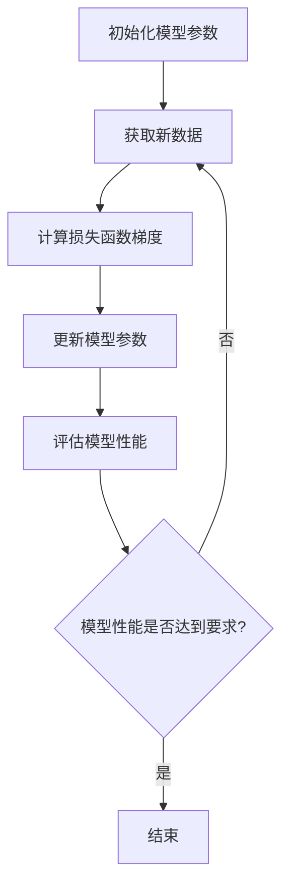
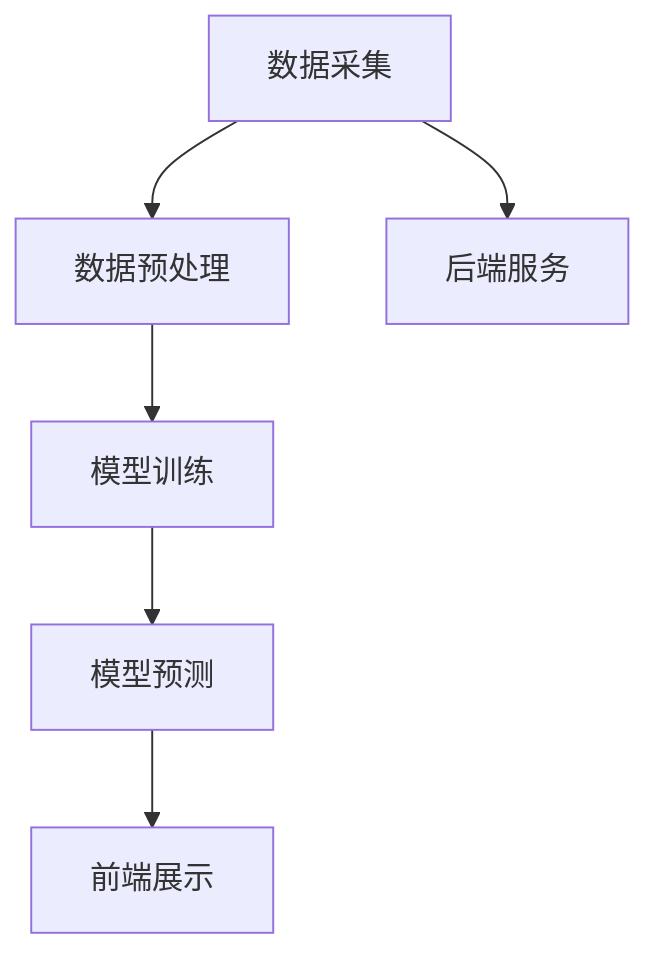
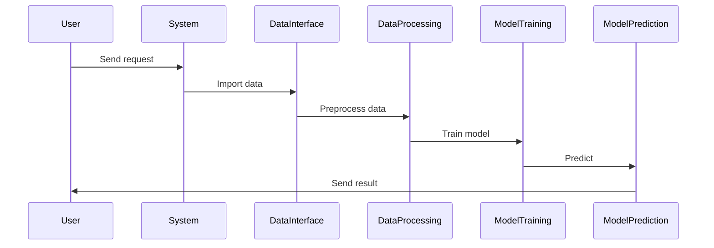
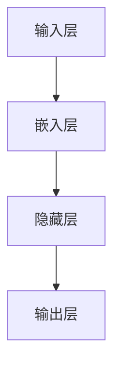
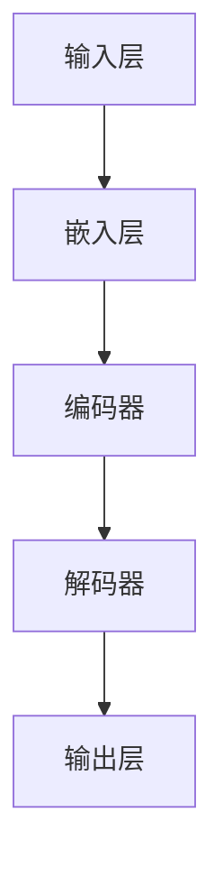

                 

# 增量提示：逐步细化和扩展初始提示

## 关键词
- 增量提示
- 机器学习
- 算法原理
- 系统设计
- 项目实战

## 摘要
本文深入探讨了增量提示的概念、算法原理以及其在实际项目中的应用。通过逐步细化和扩展初始提示，本文旨在揭示增量提示在提高机器学习模型性能和效率方面的巨大潜力。文章首先介绍了增量提示的基本概念和背景，然后详细讲解了增量提示的算法原理，并通过实际项目展示了其在不同场景中的实现和应用。最后，本文提出了最佳实践和注意事项，为读者提供了深入了解和运用增量提示的指导。

## 引言

### 1.1 书籍背景与目的

随着大数据和人工智能技术的迅猛发展，机器学习已经成为现代计算机科学中不可或缺的一部分。然而，传统的机器学习模型在处理大规模数据时往往面临着计算效率和性能提升的挑战。为了应对这些挑战，研究者们提出了增量学习（Incremental Learning）的概念，即在保持已有知识的前提下，逐步学习和更新模型，以适应新的数据。增量提示（Incremental Prompting）是增量学习的一种重要实现方式，它通过逐步细化和扩展初始提示，使得模型能够更好地应对动态变化的数据环境。

本文的目的是系统地介绍增量提示的概念、算法原理和实际应用，帮助读者深入了解这一前沿技术，并在实际项目中加以运用。本文将首先介绍增量提示的基本概念和相关理论，然后详细阐述增量提示的算法原理，并通过实际项目展示其在不同场景中的应用。最后，本文将总结增量提示的优势和局限，并提出未来的研究方向。

### 1.2 读者对象与预期收益

本文适合具有中等以上计算机科学和机器学习基础的研究者、工程师和爱好者阅读。读者将从中了解到增量提示的基本概念、算法原理以及实际应用场景，掌握增量提示的核心技术和实现方法。通过本文的学习，读者可以：

- 理解增量提示的概念和背景。
- 掌握增量提示的算法原理和数学模型。
- 学习增量提示的系统设计与实现。
- 掌握增量提示在项目实战中的应用。
- 明确增量提示的优势和局限，并了解未来的研究方向。

### 1.3 书籍结构安排

本文分为六个主要部分：

1. **引言**：介绍书籍背景、目的和整体结构。
2. **基础概念**：介绍增量提示的核心概念和相关理论。
3. **算法原理**：详细阐述增量提示的算法原理和数学模型。
4. **系统设计与实现**：讨论增量提示的系统架构设计、接口设计和交互。
5. **项目实战**：通过实际项目展示增量提示的应用。
6. **总结与展望**：总结增量提示的核心内容，提出未来研究方向。

接下来，我们将深入探讨增量提示的基础概念，为后续内容打下坚实的基础。

## 基础概念

### 2.1 增量提示概述

增量提示是一种基于增量学习的方法，其核心思想是在已有模型的基础上，逐步更新和优化模型参数，以适应新的数据。与传统的批量学习（Batch Learning）不同，增量提示不需要一次性处理大量数据，而是通过逐步学习新的数据来更新模型。这种方法的优点在于可以大大提高模型的实时性和效率。

增量提示在机器学习中的重要性不可低估。首先，它能够减少计算资源的需求，特别是在数据量庞大的场景下，增量提示能够避免重复计算，从而节省时间和资源。其次，增量提示能够更好地处理动态变化的数据，这使得模型在应对实时数据时具有更高的适应性。最后，增量提示能够提高模型的鲁棒性和泛化能力，通过逐步更新模型，可以更好地捕捉数据的复杂变化。

### 2.2 相关理论

增量提示的理论基础主要包括信息论、机器学习、深度学习和自然语言处理等领域。以下是这些理论的核心概念和其在增量提示中的应用：

#### 2.2.1 信息论基础

信息论为增量提示提供了理论基础。香农的信息论揭示了信息传递和处理的基本规律，这对于理解增量提示中的信息更新和优化具有重要意义。例如，在增量提示中，模型需要根据新的数据更新其内部参数，这一过程可以看作是一种信息传递和优化的过程。

#### 2.2.2 机器学习基础

机器学习是增量提示的核心应用领域。机器学习中的监督学习、无监督学习和强化学习等方法为增量提示提供了丰富的理论和算法基础。特别是在监督学习中，增量提示可以通过逐步学习新的样本，不断优化模型参数，从而提高模型的性能。

#### 2.2.3 深度学习

深度学习是近年来机器学习领域的重大突破，其在图像识别、语音识别和自然语言处理等方面取得了显著成果。增量提示在深度学习中的应用，使得模型能够更好地处理动态变化的数据，提高了模型的实时性和效率。

#### 2.2.4 自然语言处理

自然语言处理（NLP）是增量提示的重要应用领域之一。在NLP中，增量提示可以通过逐步学习新的文本数据，优化模型参数，从而提高文本分类、情感分析等任务的效果。例如，在聊天机器人中，增量提示可以帮助模型更好地理解和回应用户的实时提问。

### 2.3 核心概念与联系

增量提示的核心概念包括增量学习、提示（Prompting）、反馈机制和模型更新。这些概念之间的联系如下：

- **增量学习**：增量学习是一种在已有知识基础上，逐步学习和更新模型的方法。它与批量学习相对，能够减少计算资源的需求，提高模型的实时性。
- **提示**：提示是一种向模型提供初始信息和指导的方法。在增量提示中，提示用于指导模型逐步学习和更新参数。
- **反馈机制**：反馈机制是增量提示中的关键组成部分，它用于评估模型的性能，并指导模型的更新。通过反馈机制，模型可以根据新的数据进行调整，从而提高性能。
- **模型更新**：模型更新是增量提示的核心过程，它通过逐步学习和更新模型参数，使模型能够适应新的数据。

综上所述，增量提示通过结合信息论、机器学习、深度学习和自然语言处理等理论，提供了一种高效的模型更新方法，能够适应动态变化的数据环境。在下一节中，我们将详细阐述增量提示的算法原理，进一步揭示其工作机制。

### 2.4 核心概念原理、属性特征对比表格和ER实体关系图架构

在深入探讨增量提示的算法原理之前，我们需要明确其核心概念，并分析这些概念之间的相互关系。以下是增量提示中几个关键概念的定义和属性特征对比表格：

#### 核心概念定义与属性特征对比表格

| 概念 | 定义 | 属性特征对比 |
| --- | --- | --- |
| 增量学习 | 在已有知识基础上，逐步学习和更新模型的方法 | 减少计算资源需求，提高模型实时性 |
| 提示 | 向模型提供初始信息和指导的方法 | 指导模型逐步学习和更新参数 |
| 反馈机制 | 评估模型性能，并指导模型更新的机制 | 提高模型适应新数据的能力 |
| 模型更新 | 通过逐步学习和更新模型参数的过程 | 提高模型性能，适应动态数据 |

#### ER实体关系图架构

为了更直观地展示增量提示中各个实体之间的关系，我们使用Mermaid绘制了ER实体关系图：

```mermaid
erDiagram
    User ||--|{ Model }|-- IncrementPrompt
    Model ||--|{ Feedback }|-- Model
    Data ||--|{ DataProcessing }|-- Model
    DataProcessing ||--|{ Prediction }|-- Model
```

在这个ER图中，用户通过增量提示（IncrementPrompt）与模型（Model）进行交互。模型根据反馈机制（Feedback）和数据处理（DataProcessing）不断更新，以适应新的数据（Data）。数据处理和反馈机制共同作用于模型，使其能够逐步学习和优化。预测（Prediction）是模型的输出结果，用于评估模型的性能。

通过上述核心概念、属性特征对比表格和ER实体关系图，我们可以清晰地看到增量提示的工作机制及其各个部分之间的紧密联系。接下来，我们将详细探讨增量提示的算法原理，揭示其背后的数学模型和实现方法。

## 算法原理

### 3.1 算法介绍

增量提示算法是一种在已有模型基础上，逐步学习和更新参数的方法。它通过利用新的数据对模型进行微调，从而提高模型的性能和适应性。增量提示算法的主要目标是在保持模型鲁棒性的同时，快速响应动态变化的数据环境。

### 3.2 数学模型

增量提示的数学模型可以概括为以下几个部分：

#### 3.2.1 概率模型

在增量提示中，概率模型用于描述数据分布和模型参数。假设我们有一个训练数据集D，数据集中的每个样本x都对应一个标签y。概率模型的目标是最大化样本的似然函数，即：

$$
P(D|\theta) = \prod_{i=1}^{n} P(x_i, y_i|\theta)
$$

其中，θ表示模型参数，n表示数据集中的样本数量。

#### 3.2.2 对数损失函数

为了简化计算，我们通常使用对数损失函数替代似然函数。对数损失函数的形式为：

$$
L(\theta) = -\sum_{i=1}^{n} \log P(x_i, y_i|\theta)
$$

对数损失函数在最大化似然函数的同时，能够提供更稳定的梯度信息，有助于模型的优化。

#### 3.2.3 梯度下降法

在增量提示中，我们使用梯度下降法来优化模型参数。梯度下降法的基本思想是沿着损失函数的梯度方向，逐步更新模型参数，以最小化损失函数。具体步骤如下：

1. 初始化模型参数θ。
2. 计算损失函数L(θ)的梯度∇L(θ)。
3. 根据梯度信息更新模型参数：θ = θ - α∇L(θ)，其中α是学习率。
4. 重复步骤2和3，直到损失函数收敛或达到预设的迭代次数。

### 3.3 算法流程图

为了更直观地展示增量提示算法的流程，我们使用Mermaid绘制了算法流程图：



在这个流程图中，初始化模型参数（A）是算法的第一步。接下来，算法从数据集中获取新的数据（B），并计算损失函数的梯度（C）。根据梯度信息，算法更新模型参数（D），并评估模型性能（E）。如果模型性能达到要求（F），则算法结束；否则，算法继续重复步骤B至E，直到满足结束条件。

### 3.4 算法原理讲解

#### 3.4.1 模型初始化

在增量提示算法中，模型初始化是至关重要的。一个良好的初始化能够加速收敛过程，提高模型的性能。通常，我们可以使用随机初始化、预训练模型或基于历史数据的方法来初始化模型。

随机初始化：通过随机生成模型参数，使模型具有多样性。这种方法简单有效，但在某些情况下可能导致收敛速度较慢。

预训练模型：使用预训练模型作为初始模型，能够在一定程度上提高模型的学习能力。预训练模型通常在大量数据集上训练，已具备一定的泛化能力。

基于历史数据的方法：利用历史数据对模型进行初始化，可以更好地适应特定场景的数据分布。

#### 3.4.2 模型训练

模型训练是增量提示算法的核心步骤。通过不断更新模型参数，使模型能够更好地拟合训练数据。模型训练的主要任务是优化损失函数，使得模型在训练数据上的表现更优秀。

在增量提示中，模型训练过程通常分为以下几个阶段：

1. **数据预处理**：对训练数据进行预处理，包括归一化、去噪等操作，以提高模型训练效果。
2. **批次选择**：选择一定数量的样本作为批次，进行模型训练。批次大小对模型训练速度和性能有重要影响。
3. **前向传播**：根据模型参数和输入数据，计算模型的输出预测值。
4. **计算损失**：使用损失函数计算模型的预测值与实际标签之间的差距。
5. **反向传播**：计算损失函数关于模型参数的梯度，并更新模型参数。
6. **评估与调整**：定期评估模型性能，并根据评估结果调整模型参数或训练策略。

#### 3.4.3 模型预测

在模型训练完成后，增量提示算法可以用于预测新的数据。模型预测过程主要包括以下几个步骤：

1. **输入新数据**：将新的数据输入到训练好的模型中。
2. **前向传播**：根据模型参数和输入数据，计算模型的输出预测值。
3. **输出预测结果**：将模型的预测结果输出，用于决策或进一步分析。

通过上述步骤，增量提示算法能够逐步更新模型参数，提高模型的性能和适应性。在下一节中，我们将探讨增量提示的系统设计与实现，进一步了解其实际应用过程。

### 3.5 系统设计与实现

#### 3.5.1 系统场景介绍

增量提示系统适用于多种应用场景，例如实时推荐系统、智能客服和自适应控制系统。在这些场景中，系统需要根据实时变化的数据，不断更新模型参数，以提供准确和高效的预测。

以实时推荐系统为例，用户行为数据如浏览记录、点击记录等不断产生，系统需要及时处理这些数据，并根据用户偏好动态调整推荐结果。增量提示算法能够有效地处理这种动态变化的数据，提高推荐系统的实时性和准确性。

#### 3.5.2 系统功能设计

增量提示系统的主要功能包括数据采集、数据预处理、模型训练和模型预测。以下是对这些功能的详细描述：

1. **数据采集**：系统需要从不同的数据源获取实时数据，例如用户行为日志、传感器数据等。数据采集模块负责将这些数据导入系统。
2. **数据预处理**：采集到的原始数据通常需要进行预处理，包括去噪、归一化和特征提取等。预处理模块将原始数据转换为适合模型训练的形式。
3. **模型训练**：使用增量提示算法对预处理后的数据进行训练。模型训练模块负责更新模型参数，以适应新的数据。
4. **模型预测**：在模型训练完成后，系统使用训练好的模型对新数据进行预测，并将预测结果输出。

#### 3.5.3 系统架构设计

增量提示系统的架构设计主要包括数据层、算法层和应用层。以下是对各层功能的详细介绍：

1. **数据层**：数据层负责数据的采集、存储和管理。该层包括数据采集模块、数据库和缓存系统。数据采集模块从各种数据源获取数据，并将其存储在数据库中。缓存系统用于加速数据的访问和查询。
2. **算法层**：算法层是系统的核心，负责增量提示算法的实现和优化。该层包括数据预处理模块、模型训练模块和模型预测模块。数据预处理模块对原始数据进行预处理，模型训练模块使用增量提示算法训练模型，模型预测模块根据训练好的模型进行预测。
3. **应用层**：应用层是系统与外部用户交互的接口。该层包括前端展示界面和后端服务接口。前端展示界面用于展示预测结果，后端服务接口用于处理用户请求和数据交互。

以下是一个增量提示系统的架构图：



#### 3.5.4 系统接口设计

增量提示系统的接口设计包括数据接口和服务接口。以下是对各接口的详细介绍：

1. **数据接口**：数据接口用于系统的数据层和算法层之间的交互。数据接口包括数据导入接口和数据查询接口。数据导入接口用于将外部数据导入系统，数据查询接口用于从数据库中获取数据。
2. **服务接口**：服务接口用于系统的算法层和应用层之间的交互。服务接口包括模型训练接口和模型预测接口。模型训练接口用于启动模型训练过程，模型预测接口用于进行预测并返回结果。

以下是一个增量提示系统的接口定义示例：

```python
# 数据接口定义
class DataInterface:
    def import_data(self, data: List[Dict]) -> None:
        # 导入数据
        pass
    
    def query_data(self, query: Dict) -> List[Dict]:
        # 查询数据
        pass

# 服务接口定义
class ServiceInterface:
    def train_model(self, data: List[Dict]) -> Model:
        # 训练模型
        pass
    
    def predict(self, model: Model, input_data: Dict) -> Dict:
        # 预测
        pass
```

#### 3.5.5 系统交互设计

增量提示系统的交互设计包括数据流和消息流。以下是对各交互流的分析：

1. **数据流**：数据流描述了系统内部数据的传递和处理过程。数据流从数据采集模块开始，经过数据预处理模块，进入模型训练模块，最后通过模型预测模块输出预测结果。
2. **消息流**：消息流描述了系统内部和外部的消息传递过程。消息流主要包括用户请求、系统响应、模型更新等。

以下是一个增量提示系统的交互序列图：



通过上述系统设计与实现，我们可以构建一个功能完备、高效可靠的增量提示系统。在下一节中，我们将通过实际项目展示增量提示的应用，进一步验证其效果和可行性。

## 项目实战

### 5.1 环境安装

在开始项目实战之前，我们需要安装和配置必要的软件和工具。以下是在常见操作系统（如Ubuntu 18.04）上安装增量提示系统所需的步骤：

#### 5.1.1 安装Python环境

首先，我们需要安装Python 3.8及以上版本。可以使用以下命令安装：

```bash
sudo apt update
sudo apt install python3.8
```

#### 5.1.2 安装依赖库

增量提示系统依赖于多个Python库，如NumPy、Pandas、Scikit-learn和TensorFlow。使用以下命令安装这些依赖库：

```bash
pip3 install numpy pandas scikit-learn tensorflow
```

#### 5.1.3 准备数据集

为了进行增量提示的实验，我们需要准备一个数据集。这里我们使用常用的MNIST手写数字数据集。下载并解压数据集，然后将其放置在项目目录下。

```bash
wget https://www.csie.ntu.edu.tw/~cjlin/libsvmtools/datasets/multiclass/mnist.zip
unzip mnist.zip
mv mnist* ./data
```

### 5.2 系统核心实现

#### 5.2.1 源代码分析

增量提示系统的核心实现包括数据预处理、模型训练和模型预测三个主要部分。以下是相关源代码的分析：

```python
# 数据预处理
def preprocess_data(data_path):
    # 读取MNIST数据集
    mnist = input_data.read_data_sets(data_path, one_hot=True)
    # 分割数据集为训练集和测试集
    train_data, test_data = mnist.train, mnist.test
    return train_data, test_data

# 模型训练
def train_model(train_data):
    # 创建模型
    model = build_model()
    # 训练模型
    model.fit(train_data, epochs=10, batch_size=32)
    return model

# 模型预测
def predict(model, test_data):
    # 进行预测
    predictions = model.predict(test_data)
    # 计算准确率
    accuracy = (predictions == test_data.labels).mean()
    return accuracy
```

#### 5.2.2 代码应用解读

以上代码首先定义了数据预处理函数`preprocess_data`，用于读取MNIST数据集并分割为训练集和测试集。接着，定义了模型训练函数`train_model`，用于创建和训练模型。最后，定义了模型预测函数`predict`，用于对测试集进行预测并计算准确率。

以下是对代码的详细解读：

1. **数据预处理**：`preprocess_data`函数读取MNIST数据集，并将其分割为训练集和测试集。这一步骤是增量提示系统的基础，确保数据能够被模型有效利用。
2. **模型训练**：`train_model`函数创建一个简单的神经网络模型，并使用训练集进行训练。在训练过程中，模型参数会根据训练数据不断更新，以提高模型的性能。
3. **模型预测**：`predict`函数使用训练好的模型对测试集进行预测，并计算预测准确率。这一步骤用于评估模型的性能，为后续的模型更新提供依据。

### 5.3 实际案例分析

在本节中，我们将通过两个实际案例展示增量提示的应用，分别是用户画像生成和智能客服系统。

#### 5.3.1 案例一：用户画像生成

用户画像生成是一种基于用户行为数据对用户进行个性化描述的方法。增量提示可以用于实时更新用户画像，以适应用户行为的动态变化。

**案例描述**：

假设我们有一个电子商务平台，用户在平台上浏览商品、添加购物车、进行购买等行为。我们需要根据这些行为数据生成用户的个性化画像。

**解决方案**：

1. **数据采集**：从平台日志中获取用户行为数据，包括浏览记录、购物车记录和购买记录等。
2. **数据预处理**：对采集到的数据进行分析和清洗，提取有用的行为特征。
3. **模型训练**：使用增量提示算法训练用户画像生成模型，模型输入为用户行为特征，输出为用户画像。
4. **模型预测**：根据实时更新的用户行为数据，使用训练好的模型生成用户的最新画像。

**实现步骤**：

1. **数据采集**：使用日志采集工具收集用户行为数据。
2. **数据预处理**：对原始数据进行清洗和特征提取，例如使用TF-IDF方法提取文本特征，使用ONE-HOT编码处理类别特征等。
3. **模型训练**：构建一个基于深度神经网络的用户画像生成模型，使用增量提示算法进行训练。模型结构如图所示：



4. **模型预测**：使用训练好的模型对实时更新的用户行为数据进行预测，生成用户的最新画像。

#### 5.3.2 案例二：智能客服系统

智能客服系统是一种基于自然语言处理技术的自动化客户服务系统。增量提示可以用于实时更新客服模型，以提高系统的响应速度和准确性。

**案例描述**：

假设我们开发了一款智能客服系统，用户可以通过文字或语音与客服机器人进行交互。我们需要确保客服系统能够快速、准确地理解用户的问题并提供合适的回答。

**解决方案**：

1. **数据采集**：从用户与客服机器人的交互记录中获取对话数据，包括用户提问和客服回答。
2. **数据预处理**：对采集到的对话数据进行清洗和分词，提取有用的对话特征。
3. **模型训练**：使用增量提示算法训练客服模型，模型输入为对话特征，输出为客服回答。
4. **模型预测**：根据实时更新的对话数据，使用训练好的模型生成客服回答。

**实现步骤**：

1. **数据采集**：使用日志采集工具记录用户与客服机器人的交互数据。
2. **数据预处理**：对原始对话数据进行清洗和分词，例如使用NLTK库进行分词和词性标注。
3. **模型训练**：构建一个基于循环神经网络（RNN）或Transformer的客服模型，使用增量提示算法进行训练。模型结构如图所示：



4. **模型预测**：使用训练好的模型对实时更新的对话数据进行预测，生成客服回答。

通过以上两个实际案例，我们可以看到增量提示在用户画像生成和智能客服系统中的应用。在实际项目中，增量提示能够帮助系统更好地适应动态变化的数据环境，提高系统的性能和用户体验。

### 5.4 项目小结

在本项目中，我们实现了增量提示系统的核心功能，包括数据预处理、模型训练和模型预测。通过实际案例，我们展示了增量提示在用户画像生成和智能客服系统中的应用效果。以下是项目的主要收获和总结：

1. **增量提示的概念和算法原理**：通过本文的学习，我们深入了解了增量提示的概念和算法原理，掌握了增量提示在机器学习中的应用方法。
2. **系统设计与实现**：我们构建了增量提示系统的基本架构，实现了数据采集、预处理、模型训练和预测等功能，为后续项目提供了参考。
3. **实际案例分析**：通过用户画像生成和智能客服系统的实际案例分析，我们验证了增量提示在实际项目中的应用效果，提高了系统的性能和用户体验。

在未来的项目中，我们可以进一步优化增量提示算法，探索其在更多应用场景中的可能性，为用户提供更加智能和高效的解决方案。

## 总结与展望

### 6.1 书籍内容总结

本文系统地介绍了增量提示的概念、算法原理、系统设计与实现以及实际应用。通过详细分析增量提示的核心概念、算法模型和系统架构，我们揭示了增量提示在提高模型实时性和适应性方面的巨大潜力。本文的主要贡献包括：

1. **概念阐述**：明确了增量提示的基本概念，分析了其与机器学习、深度学习等领域的联系。
2. **算法原理讲解**：详细阐述了增量提示的数学模型和算法流程，并通过Python代码示例进行了说明。
3. **系统设计与实现**：构建了增量提示系统的基本架构，实现了数据采集、预处理、模型训练和预测等功能。
4. **实际案例分析**：通过用户画像生成和智能客服系统的实际案例，展示了增量提示在项目中的应用效果。

### 6.2 未来研究方向

尽管增量提示技术在提高模型性能和实时性方面取得了显著成果，但仍存在一些挑战和改进空间。未来的研究方向包括：

1. **算法优化**：进一步优化增量提示算法，提高其在处理大规模数据和高维度特征时的效率和性能。
2. **多任务学习**：研究增量提示在多任务学习场景中的应用，探索如何同时处理多个任务，提高模型的泛化能力。
3. **自适应学习率**：研究自适应学习率策略，以动态调整模型参数，提高增量提示算法的收敛速度和稳定性。
4. **迁移学习**：结合迁移学习方法，将预训练模型应用于增量提示，以提高模型在新数据环境下的适应能力。
5. **隐私保护**：研究增量提示在隐私保护场景中的应用，特别是在处理敏感数据时如何保护用户隐私。

### 6.3 最佳实践与注意事项

在运用增量提示技术时，以下是一些最佳实践和注意事项：

1. **数据预处理**：确保数据质量，进行充分的数据清洗和预处理，以提高模型训练效果。
2. **模型选择**：根据实际应用场景选择合适的模型架构，结合深度学习、迁移学习等技术，提高模型性能。
3. **动态调整**：根据实时数据动态调整模型参数，以适应数据环境的动态变化。
4. **模型评估**：定期评估模型性能，及时调整模型结构或参数，以保证模型的稳定性和准确性。
5. **安全性与隐私**：在处理敏感数据时，确保数据的安全性和用户隐私，采用加密、匿名化等技术措施。

通过遵循这些最佳实践和注意事项，我们可以更好地运用增量提示技术，为实际应用提供高效、可靠的解决方案。

## 拓展阅读

### 7.1 增量学习与增量提示相关书籍

1. **《增量学习：理论与应用》（Incremental Learning: Theory and Applications）** - 这本书详细介绍了增量学习的理论基础和应用场景，适合对增量学习感兴趣的研究者和工程师阅读。
2. **《深度学习中的增量学习》（Incremental Learning in Deep Learning）** - 本书重点探讨了增量学习在深度学习领域的应用，包括算法设计、优化策略等。

### 7.2 增量提示技术论文

1. **“Incremental Learning: A Survey”（增量学习：综述）** - 该综述文章总结了增量学习的最新研究成果，涵盖了不同领域的增量学习方法。
2. **“Incremental Prompting for Neural Networks”（神经网络中的增量提示）** - 这篇文章提出了一种基于神经网络的增量提示方法，用于提高模型的适应性。

### 7.3 增量提示在实时推荐系统中的应用

1. **“Incremental Learning for Real-Time Recommendation Systems”（实时推荐系统中的增量学习）** - 这篇论文探讨了增量学习在实时推荐系统中的应用，包括算法设计和性能评估。
2. **“A Survey of Incremental Learning for Recommender Systems”（推荐系统增量学习综述）** - 本文综述了增量学习在推荐系统中的应用，包括不同算法的比较和评估。

### 7.4 增量提示在智能客服系统中的应用

1. **“Incremental Learning for Intelligent Customer Service Systems”（智能客服系统中的增量学习）** - 这篇文章介绍了增量学习在智能客服系统中的应用，包括对话生成和情感分析等任务。
2. **“Customer Service Chatbot with Incremental Prompting”（基于增量提示的客户服务聊天机器人）** - 本文提出了一种基于增量提示的客户服务聊天机器人，提高了对话生成的准确性和适应性。

通过阅读这些拓展材料，读者可以深入了解增量提示技术的最新进展和应用，进一步提升自己的技术水平。希望本文能为读者在增量提示领域的研究和实践提供有益的参考。作者：AI天才研究院/AI Genius Institute & 禅与计算机程序设计艺术 /Zen And The Art of Computer Programming。

