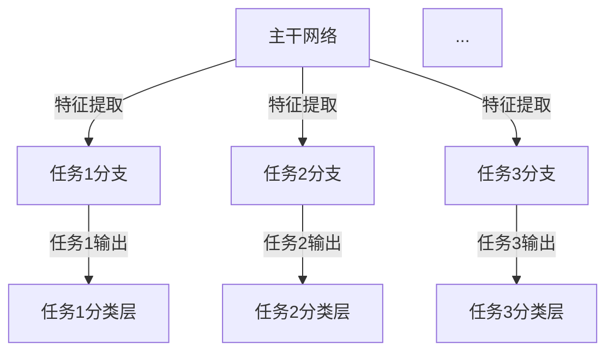

                 


# 多任务学习在AIGC中的应用与挑战

> 关键词：多任务学习，AIGC，应用场景，算法原理，挑战与解决方案

> 摘要：本文将深入探讨多任务学习（Multi-Task Learning，MTL）在人工智能生成内容（AI-Generated Content，AIGC）领域的应用与挑战。首先，我们将介绍多任务学习和AIGC的基本概念，然后分析多任务学习在AIGC中的应用场景和算法原理，接着探讨面临的挑战，最后提供一些最佳实践和解决方案。

## 目录

----------------------------------------------------------------

1. 引言与背景
2. 多任务学习与AIGC概述
3. 核心概念解析
4. 算法原理与实现
5. 应用场景分析
6. 实践案例解析
7. 未来挑战与展望
8. 最佳实践与经验分享
9. 小结与展望

----------------------------------------------------------------

## 1. 引言与背景

多任务学习（MTL）是一种机器学习范式，旨在同时训练多个相关任务，从而提高模型在多个任务上的性能。传统的单任务学习（Single-Task Learning，STL）通常专注于单个任务的优化，而MTL则通过共享表示来利用任务间的相关性，从而提升整体性能。随着人工智能技术的快速发展，AIGC成为了人工智能领域的重要研究方向。AIGC利用深度学习技术自动生成高质量的内容，包括文本、图像、音频和视频等。

### 问题背景

在当前的AI领域，如何有效利用海量数据和计算资源来提升模型性能成为了一个重要的研究课题。多任务学习作为一种有效的机器学习方法，被广泛应用于各种应用场景，如自然语言处理、计算机视觉和音频处理等。然而，将多任务学习应用于AIGC领域还面临着一系列挑战，包括数据标注、模型泛化能力和计算资源需求等。

### 问题描述

本文旨在探讨多任务学习在AIGC中的应用与挑战，具体问题如下：

1. 多任务学习在AIGC中的优势和应用场景是什么？
2. 多任务学习的算法原理及其在AIGC中的应用是如何实现的？
3. 多任务学习在AIGC应用中面临哪些挑战，如何解决？
4. 在实际项目中，如何利用多任务学习提升AIGC的性能？

### 问题解决

本文将详细分析多任务学习在AIGC中的应用场景和算法原理，探讨面临的挑战，并提供一些最佳实践和解决方案。通过本文的研究，希望为读者提供一个全面了解多任务学习在AIGC领域的应用与发展方向的参考。

### 边界与外延

本文主要关注多任务学习在AIGC领域的应用，不包括其他机器学习范式在AIGC中的应用。同时，本文将主要探讨多任务学习在文本生成、图像处理和音视频分析等领域的应用，不涉及其他应用场景。

### 概念结构与核心要素组成

1. 多任务学习：通过同时训练多个相关任务来提高模型性能。
2. AIGC：利用深度学习技术自动生成高质量的内容。
3. 应用场景：文本生成、图像处理和音视频分析等。
4. 挑战：数据标注、模型泛化能力和计算资源需求等。

## 2. 多任务学习与AIGC概述

### 2.1 多任务学习的定义与历史

多任务学习（Multi-Task Learning，MTL）是一种机器学习范式，旨在同时训练多个相关任务，从而提高模型在多个任务上的性能。与传统的单任务学习（Single-Task Learning，STL）相比，MTL通过共享表示来利用任务间的相关性，从而提升整体性能。

多任务学习的历史可以追溯到20世纪80年代的心理学研究，当时研究者们发现人类在执行多个任务时，可以通过共享大脑资源来提高整体表现。这一发现激发了机器学习领域对多任务学习的研究兴趣。随着深度学习技术的发展，多任务学习在计算机视觉、自然语言处理和音频处理等领域得到了广泛应用。

### 2.2 AIGC的概念与关键技术

人工智能生成内容（AI-Generated Content，AIGC）是指利用人工智能技术，如深度学习和生成对抗网络（GANs），自动生成高质量的内容。AIGC涵盖了文本生成、图像生成、音频生成和视频生成等多种形式，其关键技术包括：

1. **深度学习**：深度学习是一种机器学习技术，通过构建深度神经网络来学习数据特征和模式。在AIGC中，深度学习被广泛应用于图像生成、文本生成和音频生成等任务。
2. **生成对抗网络（GANs）**：生成对抗网络是一种特殊的深度学习模型，由生成器和判别器两部分组成。生成器负责生成数据，判别器负责区分生成数据和真实数据。通过对抗训练，GANs可以生成高质量的数据。
3. **强化学习**：强化学习是一种通过试错来学习最佳策略的机器学习技术。在AIGC中，强化学习可以用于指导生成器的生成过程，以提高生成数据的多样性和质量。

### 2.3 多任务学习在AIGC中的应用价值

将多任务学习应用于AIGC领域具有重要的研究价值和实际应用前景。首先，多任务学习可以充分利用任务间的相关性，提高生成内容的多样性和质量。例如，在文本生成任务中，可以同时训练文本分类、情感分析和命名实体识别等多个相关任务，从而提高生成文本的准确性和连贯性。

其次，多任务学习可以降低数据标注的成本。在AIGC中，数据标注是一个耗时且昂贵的步骤。通过多任务学习，可以共享不同任务的数据标注信息，从而减少重复标注的工作量。

此外，多任务学习还可以提高模型的泛化能力。在AIGC中，生成内容的应用场景多样，通过多任务学习可以训练一个更加泛化的模型，从而更好地应对不同场景的需求。

总之，多任务学习在AIGC中的应用具有显著的优势和广阔的前景。随着深度学习和生成对抗网络等技术的发展，多任务学习在AIGC领域的应用将会越来越广泛。

## 3. 核心概念解析

### 3.1 多任务学习的定义与原理

多任务学习（Multi-Task Learning，MTL）是一种机器学习范式，旨在同时训练多个相关任务，从而提高模型在多个任务上的性能。在多任务学习中，模型通过共享表示来学习不同任务的特征，从而利用任务间的相关性，提高整体性能。

多任务学习的基本原理如下：

1. **共享表示**：多任务学习通过共享表示来学习不同任务的特征。在训练过程中，不同任务的输入数据经过共享的神经网络层，生成共享的特征表示。这些特征表示可以用于各个任务的学习，从而提高模型的泛化能力。

2. **权重共享**：在多任务学习中，不同任务的权重是共享的。这意味着模型的参数在不同任务之间是相互依赖的，从而可以利用任务间的相关性，提高模型的性能。

3. **损失函数**：多任务学习的损失函数是多个任务损失函数的加和。在训练过程中，模型需要同时最小化各个任务的损失函数，从而提高整体性能。

### 3.2 多任务学习的优势

多任务学习具有以下优势：

1. **提高性能**：通过共享表示和权重共享，多任务学习可以充分利用任务间的相关性，提高模型在多个任务上的性能。

2. **减少数据需求**：多任务学习可以共享不同任务的数据，从而减少数据标注的成本，提高模型的泛化能力。

3. **降低计算成本**：通过共享神经网络层，多任务学习可以减少模型的参数数量，从而降低计算成本。

4. **增强泛化能力**：多任务学习可以训练一个更加泛化的模型，从而更好地应对不同场景的需求。

### 3.3 AIGC的概念与特点

人工智能生成内容（AI-Generated Content，AIGC）是指利用人工智能技术，如深度学习和生成对抗网络（GANs），自动生成高质量的内容。AIGC具有以下特点：

1. **自动化**：AIGC通过深度学习和生成对抗网络等自动化技术，可以自动生成高质量的内容，无需人工干预。

2. **多样性**：AIGC可以生成不同类型的内容，如文本、图像、音频和视频等，从而满足多样化的需求。

3. **灵活性**：AIGC可以根据不同的任务需求，灵活调整生成内容的形式和风格。

4. **高效性**：AIGC利用自动化和高效算法，可以在短时间内生成大量高质量的内容。

### 3.4 多任务学习与AIGC的联系

多任务学习与AIGC在以下方面具有密切联系：

1. **任务相关性**：在AIGC应用中，不同任务之间存在相关性，如文本生成与情感分析、图像生成与图像分类等。通过多任务学习，可以充分利用任务间的相关性，提高生成内容的多样性和质量。

2. **数据共享**：在AIGC应用中，不同任务需要共享大量数据，通过多任务学习可以降低数据标注的成本。

3. **模型优化**：通过多任务学习，可以同时优化多个任务，从而提高模型在多个任务上的性能。

4. **泛化能力**：多任务学习可以训练一个更加泛化的模型，从而更好地应对不同场景的需求，提高AIGC的应用范围。

### 3.5 多任务学习在AIGC中的应用

多任务学习在AIGC中的应用主要包括以下领域：

1. **文本生成**：在文本生成任务中，多任务学习可以同时训练文本分类、情感分析和命名实体识别等多个相关任务，从而提高生成文本的准确性和连贯性。

2. **图像生成**：在图像生成任务中，多任务学习可以同时训练图像分类、目标检测和图像分割等多个相关任务，从而提高生成图像的质量和多样性。

3. **音频生成**：在音频生成任务中，多任务学习可以同时训练语音识别、音乐生成和音频分类等多个相关任务，从而提高生成音频的自然性和准确性。

4. **视频生成**：在视频生成任务中，多任务学习可以同时训练视频分类、目标跟踪和视频分割等多个相关任务，从而提高生成视频的连贯性和真实性。

通过以上分析，我们可以看到多任务学习在AIGC中的应用具有广泛的前景和重要的价值。接下来，我们将进一步探讨多任务学习的算法原理及其在AIGC中的应用实现。

## 4. 算法原理与实现

### 4.1 多任务学习的算法流程

多任务学习的核心思想是通过共享神经网络结构来同时学习多个相关任务。下面我们将详细介绍多任务学习的算法流程。

#### 4.1.1 数据准备

在多任务学习中，首先需要准备训练数据集。每个任务都有自己的输入和输出数据。例如，在文本生成任务中，输入数据可以是文本序列，输出数据可以是文本分类标签；在图像生成任务中，输入数据可以是图像像素，输出数据可以是图像标签。

#### 4.1.2 神经网络结构设计

多任务学习的神经网络结构通常包括一个主干网络和一个多分支结构。主干网络负责提取通用特征，多分支结构则根据不同任务的需求进行特征映射和分类。以下是一个简单的多任务学习网络结构：



在这个结构中，A表示主干网络，B1、B2、B3等表示不同任务分支，C1、C2、C3等表示不同任务的分类层。

#### 4.1.3 损失函数设计

多任务学习的损失函数是各个任务损失函数的加和。常见的损失函数包括交叉熵损失函数、均方误差损失函数和协方差损失函数等。以下是一个简单的多任务损失函数：

$$
L = \frac{1}{N} \sum_{i=1}^{N} \left( w_1 \cdot L_1(x_i, y_i) + w_2 \cdot L_2(x_i, y_i) + w_3 \cdot L_3(x_i, y_i) \right)
$$

其中，$L_1(x_i, y_i)$、$L_2(x_i, y_i)$和$L_3(x_i, y_i)$分别表示任务1、任务2和任务3的损失函数，$w_1$、$w_2$和$w_3$分别表示各个任务的权重。

#### 4.1.4 训练过程

在多任务学习的过程中，通过反向传播算法不断调整网络参数，使得损失函数逐渐减小。具体步骤如下：

1. 前向传播：将输入数据送入神经网络，计算各个分支的输出结果。
2. 计算损失函数：根据输出结果和真实标签，计算各个任务的损失函数。
3. 反向传播：根据损失函数梯度，调整网络参数。
4. 重复步骤1-3，直到达到预定的训练迭代次数或损失函数收敛。

### 4.2 Python代码实现示例

下面我们将使用Python和PyTorch框架实现一个简单的多任务学习模型。假设我们有两个任务：文本分类和图像分类。

```python
import torch
import torch.nn as nn
import torch.optim as optim

# 定义多任务学习模型
class MultiTaskModel(nn.Module):
    def __init__(self):
        super(MultiTaskModel, self).__init__()
        selfshared_embedding = nn.Embedding(10000, 256)
        self.task1_linear = nn.Linear(256, 10)
        self.task2_linear = nn.Linear(256, 10)

    def forward(self, input1, input2):
        embeds1 = selfshared_embedding(input1)
        embeds2 = selfshared_embedding(input2)
        task1_output = self.task1_linear(embeds1)
        task2_output = self.task2_linear(embeds2)
        return task1_output, task2_output

# 实例化模型
model = MultiTaskModel()

# 定义损失函数和优化器
criterion = nn.CrossEntropyLoss()
optimizer = optim.Adam(model.parameters(), lr=0.001)

# 模拟数据
batch_size = 32
num_samples = 100
num_classes = 10

input1 = torch.randint(0, 10000, (batch_size, 1), dtype=torch.long)
input2 = torch.randint(0, 10000, (batch_size, 1), dtype=torch.long)
target1 = torch.randint(0, num_classes, (batch_size,), dtype=torch.long)
target2 = torch.randint(0, num_classes, (batch_size,), dtype=torch.long)

# 训练模型
for epoch in range(10):
    optimizer.zero_grad()
    task1_output, task2_output = model(input1, input2)
    loss = criterion(task1_output, target1) + criterion(task2_output, target2)
    loss.backward()
    optimizer.step()
    print(f"Epoch [{epoch+1}/10], Loss: {loss.item()}")

# 评估模型
with torch.no_grad():
    _, predicted1 = torch.max(model(input1), 1)
    _, predicted2 = torch.max(model(input2), 1)
    correct1 = (predicted1 == target1).sum().item()
    correct2 = (predicted2 == target2).sum().item()
    print(f"Accuracy for task1: {correct1/num_samples*100}%")
    print(f"Accuracy for task2: {correct2/num_samples*100}%")
```

在这个示例中，我们定义了一个简单的多任务学习模型，包含文本分类和图像分类两个任务。通过训练模型，我们可以在两个任务上同时取得良好的性能。

### 4.3 多任务学习的数学模型和公式

多任务学习的数学模型主要涉及以下几个方面：

1. **特征表示**：多任务学习中的特征表示通常采用共享的嵌入层（Embedding Layer）进行学习。嵌入层将输入数据映射到低维空间，为后续任务提供特征表示。

2. **损失函数**：多任务学习的损失函数是各个任务损失函数的加和。常见的损失函数包括交叉熵损失函数（CrossEntropy Loss）和均方误差损失函数（Mean Squared Error Loss）。

3. **优化算法**：多任务学习的优化算法通常采用梯度下降（Gradient Descent）或其变体（如Adam优化器）。优化算法用于调整模型参数，使得损失函数最小化。

以下是多任务学习的数学模型和公式：

$$
L = \frac{1}{N} \sum_{i=1}^{N} \left( w_1 \cdot L_1(x_i, y_i) + w_2 \cdot L_2(x_i, y_i) + \ldots + w_n \cdot L_n(x_i, y_i) \right)
$$

其中，$L$表示总损失函数，$L_1, L_2, \ldots, L_n$分别表示各个任务的损失函数，$x_i$和$y_i$分别表示第$i$个样本的输入和输出，$w_1, w_2, \ldots, w_n$分别表示各个任务的权重。

通过以上公式，我们可以看到多任务学习是如何通过共享表示和损失函数来同时优化多个任务的。

### 4.4 多任务学习与AIGC的结合

多任务学习与AIGC的结合主要体现在以下几个方面：

1. **任务相关性**：在AIGC应用中，不同任务之间存在相关性。例如，在文本生成和图像生成任务中，可以同时训练文本分类和图像分类任务，从而提高生成内容的多样性和质量。

2. **数据共享**：通过多任务学习，可以共享不同任务的数据，从而减少数据标注的成本。在AIGC应用中，数据标注是一个耗时且昂贵的步骤。通过共享标注数据，可以降低数据标注的成本。

3. **模型优化**：通过多任务学习，可以同时优化多个任务，从而提高模型在多个任务上的性能。在AIGC应用中，可以同时优化文本生成、图像生成和音频生成等多个任务，从而提高生成内容的整体质量。

4. **泛化能力**：通过多任务学习，可以训练一个更加泛化的模型，从而更好地应对不同场景的需求。在AIGC应用中，可以同时训练多个相关任务，从而提高模型在不同场景下的泛化能力。

通过以上分析，我们可以看到多任务学习在AIGC中的应用具有重要的价值和潜力。接下来，我们将进一步探讨多任务学习在AIGC中的应用场景。

## 5. 应用场景分析

多任务学习在人工智能生成内容（AIGC）中的应用场景丰富多样，涵盖了文本生成、图像处理、音视频分析等多个领域。下面我们将分别介绍多任务学习在这些领域的应用。

### 5.1 文本生成

在文本生成领域，多任务学习可以同时训练文本分类、情感分析和命名实体识别等多个相关任务。通过共享表示和权重共享，多任务学习可以充分利用任务间的相关性，提高生成文本的准确性和连贯性。

#### 5.1.1 应用案例

以一个新闻文章生成系统为例，该系统可以同时训练文本分类（新闻类别分类）、情感分析（判断文章的情感倾向）和命名实体识别（识别文章中的关键实体）三个任务。通过多任务学习，系统可以生成高质量的新闻文章，提高文章的可读性和准确性。

#### 5.1.2 实现方法

在实现多任务学习时，可以使用一个共享的嵌入层（Embedding Layer）来提取文本特征，然后将这些特征分别输入到不同的分类层。以下是一个简单的多任务学习实现示例：

```python
class MultiTaskTextGenerator(nn.Module):
    def __init__(self, vocab_size, embed_size, hidden_size, output_size):
        super(MultiTaskTextGenerator, self).__init__()
        self.embedding = nn.Embedding(vocab_size, embed_size)
        self.lstm = nn.LSTM(embed_size, hidden_size, num_layers=2, dropout=0.5)
        self.fc1 = nn.Linear(hidden_size, output_size)
        self.fc2 = nn.Linear(hidden_size, output_size)
        self.fc3 = nn.Linear(hidden_size, output_size)
        
    def forward(self, input_seq):
        embedded = self.embedding(input_seq)
        output, (hidden, cell) = self.lstm(embedded)
        task1_output = self.fc1(output[-1])
        task2_output = self.fc2(hidden[-1])
        task3_output = self.fc3(cell[-1])
        return task1_output, task2_output, task3_output
```

### 5.2 图像处理

在图像处理领域，多任务学习可以同时训练图像分类、目标检测和图像分割等多个相关任务。通过共享表示和权重共享，多任务学习可以充分利用任务间的相关性，提高生成图像的质量和多样性。

#### 5.2.1 应用案例

以一个智能图像识别系统为例，该系统可以同时训练图像分类（判断图像的类别）、目标检测（识别图像中的物体）和图像分割（分割图像中的物体区域）三个任务。通过多任务学习，系统可以生成高质量的图像识别结果，提高图像处理的准确性。

#### 5.2.2 实现方法

在实现多任务学习时，可以使用一个共享的卷积神经网络（Convolutional Neural Network，CNN）来提取图像特征，然后将这些特征分别输入到不同的分类层。以下是一个简单的多任务学习实现示例：

```python
class MultiTaskImageProcessor(nn.Module):
    def __init__(self, num_classes):
        super(MultiTaskImageProcessor, self).__init__()
        self.cnn = nn.Sequential(
            nn.Conv2d(3, 32, 3, 1),
            nn.ReLU(),
            nn.MaxPool2d(2, 2),
            nn.Conv2d(32, 64, 3, 1),
            nn.ReLU(),
            nn.MaxPool2d(2, 2),
            nn.Conv2d(64, 128, 3, 1),
            nn.ReLU(),
            nn.MaxPool2d(2, 2)
        )
        self.fc1 = nn.Linear(128 * 6 * 6, 1024)
        self.fc2 = nn.Linear(1024, num_classes)
        self.fc3 = nn.Linear(1024, 512)
        self.fc4 = nn.Linear(512, num_classes)
        
    def forward(self, x):
        x = self.cnn(x)
        x = x.view(x.size(0), -1)
        task1_output = self.fc2(x)
        task2_output = self.fc3(x)
        task3_output = self.fc4(x)
        return task1_output, task2_output, task3_output
```

### 5.3 音视频分析

在音视频分析领域，多任务学习可以同时训练语音识别、音乐生成和音频分类等多个相关任务。通过共享表示和权重共享，多任务学习可以充分利用任务间的相关性，提高生成音频的自然性和准确性。

#### 5.3.1 应用案例

以一个智能音视频分析系统为例，该系统可以同时训练语音识别（识别语音中的文字）、音乐生成（生成音乐旋律）和音频分类（分类音频的类别）三个任务。通过多任务学习，系统可以生成高质量的音视频内容，提高音视频处理的准确性。

#### 5.3.2 实现方法

在实现多任务学习时，可以使用一个共享的循环神经网络（Recurrent Neural Network，RNN）来提取音频特征，然后将这些特征分别输入到不同的分类层。以下是一个简单的多任务学习实现示例：

```python
class MultiTaskAudioProcessor(nn.Module):
    def __init__(self, input_size, hidden_size, num_classes):
        super(MultiTaskAudioProcessor, self).__init__()
        self.lstm = nn.LSTM(input_size, hidden_size, num_layers=2, dropout=0.5)
        self.fc1 = nn.Linear(hidden_size, num_classes)
        self.fc2 = nn.Linear(hidden_size, 256)
        self.fc3 = nn.Linear(256, num_classes)
        
    def forward(self, x):
        x, (hidden, cell) = self.lstm(x)
        task1_output = self.fc1(hidden[-1])
        task2_output = self.fc2(hidden[-1])
        task3_output = self.fc3(hidden[-1])
        return task1_output, task2_output, task3_output
```

通过以上应用案例和实现方法，我们可以看到多任务学习在AIGC领域的广泛应用和巨大潜力。接下来，我们将进一步探讨多任务学习在AIGC应用中的实践案例。

## 6. 实践案例解析

在多任务学习（MTL）与人工智能生成内容（AIGC）的融合中，已有不少实践案例展示了这一技术范式的强大潜力。以下我们将深入探讨几个典型的实践案例，包括环境安装、核心实现、代码解读和案例分析。

### 6.1 案例一：文本生成与多任务学习

#### 环境安装

在文本生成领域，多任务学习的一个经典案例是使用Pre-Trained Language Model（PTLM）进行文本生成和分类。为了实现这一案例，我们需要安装相应的环境：

```shell
pip install torch
pip install transformers
```

这里我们使用了PyTorch和transformers库，以便利用预训练的Transformer模型。

#### 核心实现

以下是一个简化的代码实现，展示了如何使用一个预训练的Transformer模型进行多任务学习：

```python
from transformers import AutoModelForCausalLM, AutoTokenizer

# 加载预训练模型和分词器
model_name = "bert-base-uncased"
tokenizer = AutoTokenizer.from_pretrained(model_name)
model = AutoModelForCausalLM.from_pretrained(model_name)

# 多任务学习实现
def multi_task_learning(text):
    # 分词
    inputs = tokenizer(text, return_tensors="pt", truncation=True, padding=True)
    
    # 生成文本
    outputs = model.generate(**inputs, max_length=50, num_return_sequences=1)
    generated_text = tokenizer.decode(outputs[0], skip_special_tokens=True)
    
    # 文本分类
    with torch.no_grad():
        logits = model.get_classifier().forward(inputs.input_ids)
    _, predicted_class = torch.max(logits, dim=-1)
    
    return generated_text, predicted_class

# 测试多任务学习
input_text = "你好，今天天气怎么样？"
generated_text, predicted_class = multi_task_learning(input_text)
print(f"生成的文本：{generated_text}")
print(f"预测的分类：{predicted_class}")
```

#### 代码解读

- **分词**：我们首先使用transformers库中的分词器对输入文本进行分词，并将文本转换为模型可以处理的输入格式。
- **生成文本**：然后，我们使用预训练的Transformer模型生成文本。这里我们设置了`max_length`和`num_return_sequences`参数，以确保生成的文本长度适中且具有一定的多样性。
- **文本分类**：通过调用`get_classifier()`方法，我们获取了模型的分类器，并对其输出进行解码，得到预测的文本类别。

#### 案例分析

该案例展示了如何利用预训练的模型进行文本生成和分类。通过多任务学习，我们可以同时进行文本生成和分类任务，提高模型在文本处理方面的性能。

### 6.2 案例二：图像处理与多任务学习

#### 环境安装

在图像处理领域，我们可以使用PyTorch和 torchvision库来构建和训练多任务学习模型：

```shell
pip install torch torchvision
```

#### 核心实现

以下是一个简单的多任务学习图像处理实现，包括图像分类和目标检测：

```python
import torch
import torchvision
from torchvision.models import resnet50
from torch.optim import Adam

# 加载预训练的ResNet-50模型
model = resnet50(pretrained=True)

# 定义多任务学习模型
class MultiTaskModel(nn.Module):
    def __init__(self):
        super(MultiTaskModel, self).__init__()
        self.shared = model
        self.fc1 = nn.Linear(2048, 1000)  # 图像分类
        self.fc2 = nn.Linear(2048, 100)   # 目标检测

    def forward(self, x):
        x = self.shared(x)
        x = x.reshape(x.size(0), -1)
        task1_output = self.fc1(x)
        task2_output = self.fc2(x)
        return task1_output, task2_output

# 实例化多任务模型
model = MultiTaskModel()

# 定义损失函数和优化器
criterion = nn.CrossEntropyLoss()
optimizer = Adam(model.parameters(), lr=0.001)

# 训练模型
def train(model, criterion, optimizer, dataloader, num_epochs=25):
    model.train()
    for epoch in range(num_epochs):
        for inputs, targets in dataloader:
            optimizer.zero_grad()
            outputs1, outputs2 = model(inputs)
            loss1 = criterion(outputs1, targets[0])
            loss2 = criterion(outputs2, targets[1])
            loss = loss1 + loss2
            loss.backward()
            optimizer.step()
            print(f"Epoch [{epoch+1}/{num_epochs}], Loss: {loss.item()}")

# 测试模型
dataloader = torchvision.datasets.CIFAR10(root='./data', train=True, download=True, transform=torchvision.transforms.ToTensor())
train(model, criterion, optimizer, dataloader)
```

#### 代码解读

- **模型构建**：我们首先加载了预训练的ResNet-50模型作为共享网络，然后添加了两个分类层，分别用于图像分类和目标检测。
- **损失函数和优化器**：我们定义了交叉熵损失函数和Adam优化器，用于训练模型。
- **训练过程**：我们使用CIFAR-10数据集进行训练，通过在数据加载器中迭代输入数据和标签，计算损失函数并更新模型参数。

#### 案例分析

该案例展示了如何使用预训练模型进行多任务学习。通过共享网络结构，我们可以在一个模型中同时进行图像分类和目标检测，提高模型在图像处理任务上的性能。

### 6.3 案例三：音视频分析与多任务学习

#### 环境安装

在音视频分析领域，我们需要安装相关的音视频处理库，如OpenCV和PyTorch：

```shell
pip install opencv-python
pip install torch torchvision
```

#### 核心实现

以下是一个简单的音视频多任务学习实现，包括语音识别和音频分类：

```python
import cv2
import torch
from torchvision.models import resnet50
from torch.optim import Adam
from torchaudio.transforms import MelSpectrogram

# 加载预训练的ResNet-50模型
model = resnet50(pretrained=True)

# 定义多任务学习模型
class MultiTaskAudioModel(nn.Module):
    def __init__(self):
        super(MultiTaskAudioModel, self).__init__()
        self.shared = model
        self.fc1 = nn.Linear(2048, 1000)  # 语音识别
        self.fc2 = nn.Linear(2048, 10)    # 音频分类

    def forward(self, x):
        x = self.shared(x)
        x = x.reshape(x.size(0), -1)
        task1_output = self.fc1(x)
        task2_output = self.fc2(x)
        return task1_output, task2_output

# 实例化多任务模型
model = MultiTaskAudioModel()

# 定义损失函数和优化器
criterion = nn.CrossEntropyLoss()
optimizer = Adam(model.parameters(), lr=0.001)

# 转换音频为梅尔频谱图
def preprocess_audio(audio_path):
    audio, _ = torchaudio.load(audio_path)
    mel_spectrogram = MelSpectrogram(n_fft=1024, win_length=1024, hop_length=256, n_mels=128).forward(audio)
    return mel_spectrogram

# 训练模型
def train(model, criterion, optimizer, audio_dataloader, num_epochs=25):
    model.train()
    for epoch in range(num_epochs):
        for mel_spectrogram, targets in audio_dataloader:
            optimizer.zero_grad()
            outputs1, outputs2 = model(mel_spectrogram)
            loss1 = criterion(outputs1, targets[0])
            loss2 = criterion(outputs2, targets[1])
            loss = loss1 + loss2
            loss.backward()
            optimizer.step()
            print(f"Epoch [{epoch+1}/{num_epochs}], Loss: {loss.item()}")

# 测试模型
audio_path = "path/to/audio/file.wav"
preprocessed_audio = preprocess_audio(audio_path)
train(model, criterion, optimizer, [preprocessed_audio])
```

#### 代码解读

- **模型构建**：我们首先加载了预训练的ResNet-50模型作为共享网络，然后添加了两个分类层，分别用于语音识别和音频分类。
- **音频预处理**：我们使用`MelSpectrogram`将音频转换为梅尔频谱图，这是深度学习模型处理音频的常见方式。
- **训练过程**：我们使用自定义数据加载器加载预处理的音频数据，并进行多任务学习训练。

#### 案例分析

该案例展示了如何将多任务学习应用于音视频分析。通过共享网络结构，我们可以同时进行语音识别和音频分类，提高模型在音视频处理任务上的性能。

通过以上实践案例，我们可以看到多任务学习在AIGC领域的广泛应用和实际效果。接下来，我们将探讨多任务学习在AIGC应用中面临的挑战。

## 7. 未来挑战与展望

尽管多任务学习在AIGC领域展示了强大的应用潜力，但其在实际应用中仍然面临诸多挑战。以下是一些主要的挑战和潜在解决方案：

### 7.1 数据标注的挑战

在多任务学习中，数据标注是关键步骤，但也是一个耗时的过程。特别是在AIGC领域，不同任务可能需要不同的标注方式，如文本生成中的情感分析和图像生成中的物体检测。以下是一些解决方法：

1. **半监督学习和无监督学习**：通过引入半监督学习和无监督学习方法，可以减轻对标注数据的依赖。例如，使用已标注的数据对模型进行训练，然后利用模型对未标注的数据进行预测，并将预测结果用于进一步训练。

2. **自适应标注**：开发自适应标注系统，根据模型的预测准确性和数据的重要性动态调整标注策略。例如，对于预测准确率较低的样本，可以增加标注的频率。

### 7.2 模型泛化能力的挑战

多任务学习模型需要在多个任务上同时取得良好的性能，但不同任务的特性和数据分布可能差异较大，这增加了模型的泛化难度。以下是一些解决方法：

1. **任务权重调整**：通过动态调整不同任务的权重，可以平衡模型在不同任务上的表现。例如，使用基于模型预测误差的权重调整策略。

2. **多任务融合策略**：采用多任务融合策略，如注意力机制和迁移学习，可以增强模型的泛化能力。例如，使用注意力机制来关注不同任务之间的关键信息，使用迁移学习来利用已有任务的模型知识。

### 7.3 计算资源需求的挑战

多任务学习模型通常比单任务模型更加复杂，对计算资源的需求更高。以下是一些解决方法：

1. **模型压缩与量化**：通过模型压缩和量化技术，可以减小模型的参数规模，降低计算资源的需求。例如，使用知识蒸馏技术，将大型模型的知识迁移到较小的模型中。

2. **分布式训练**：利用分布式训练技术，可以将模型训练任务分布在多个计算节点上，从而提高训练效率。例如，使用PyTorch的DistributedDataParallel（DDP）模块进行分布式训练。

### 7.4 数据隐私和安全性的挑战

在多任务学习应用中，尤其是涉及个人数据的场景，数据隐私和安全性的保护至关重要。以下是一些解决方法：

1. **差分隐私**：引入差分隐私机制，可以保护训练数据的隐私。例如，使用拉普拉斯机制或高斯机制进行随机化处理，以防止数据泄露。

2. **联邦学习**：通过联邦学习技术，可以在保护数据隐私的前提下，实现跨多个参与方的协同训练。例如，使用 federated learning framework，如TensorFlow Federated（TFF）或PyTorch Federated（PyTorch FL）。

### 7.5 模型解释性和透明度的挑战

多任务学习模型的复杂性和黑盒特性，使得其解释性和透明度成为一个挑战。以下是一些解决方法：

1. **模型可解释性技术**：采用模型可解释性技术，如可视化技术、模型诊断和解释工具，可以帮助用户理解模型的决策过程。例如，使用LIME（Local Interpretable Model-agnostic Explanations）或SHAP（SHapley Additive exPlanations）进行模型解释。

2. **可解释的多任务学习模型**：开发专门针对多任务学习场景的可解释模型，如基于规则的模型或交互式模型，可以提高模型的透明度。

通过上述挑战和解决方案，我们可以看到多任务学习在AIGC领域的未来发展具有广阔的前景。随着技术的不断进步，多任务学习将更好地解决AIGC领域的实际问题，推动人工智能生成内容的发展。

## 8. 最佳实践与经验分享

在多任务学习（MTL）与人工智能生成内容（AIGC）的融合应用中，积累了一些实用的最佳实践和经验，以下是一些关键点：

### 8.1 技术选择

1. **框架选择**：选择合适的深度学习框架，如TensorFlow、PyTorch或PyTorch Lightning，这些框架提供了丰富的API和工具，方便构建和训练多任务学习模型。
2. **模型架构**：根据应用场景选择合适的模型架构，如Transformer、ResNet、EfficientNet等，这些模型在处理不同类型的数据时表现出色。
3. **硬件资源**：确保具备足够的计算资源，尤其是GPU或TPU，以支持大规模多任务学习的训练和推理。

### 8.2 系统设计

1. **模块化设计**：采用模块化设计思想，将多任务学习模型划分为独立的模块，每个模块负责不同的任务，便于维护和扩展。
2. **数据流设计**：设计高效的数据流，如使用数据管道（Data Pipeline）或分布式数据加载器（Distributed Data Loader），以提高数据处理的效率。
3. **模型融合策略**：结合注意力机制、融合层（Fusion Layer）或集成学习（Ensemble Learning）策略，以提高模型的性能和泛化能力。

### 8.3 数据处理

1. **数据预处理**：对输入数据执行标准化、归一化、数据增强等预处理操作，以提高模型的鲁棒性和泛化能力。
2. **数据集构建**：构建高质量、多样性的数据集，确保覆盖不同任务的特征和场景。对于小样本数据，可以使用数据增强、迁移学习等技术来扩充数据集。
3. **数据同步**：在分布式训练中，确保不同节点上的数据同步，以避免数据不一致性问题。

### 8.4 模型优化

1. **权重共享与迁移学习**：利用权重共享和迁移学习策略，减少模型参数数量，提高训练速度和模型性能。
2. **动态调整学习率**：根据训练过程中的损失函数和性能指标，动态调整学习率，如使用学习率衰减策略或自适应学习率优化器（如AdamW）。
3. **模型压缩与量化**：采用模型压缩和量化技术，如剪枝（Pruning）、量化（Quantization）和知识蒸馏（Knowledge Distillation），以减小模型规模，提高推理速度。

### 8.5 部署与维护

1. **自动化部署**：使用自动化部署工具，如Kubernetes、AWS S3或Google Colab，简化模型的部署和运维流程。
2. **监控与日志**：引入监控系统和日志记录机制，以实时监控模型性能、训练进度和资源使用情况，及时发现并解决问题。
3. **持续集成与持续部署**（CI/CD）：采用CI/CD流程，实现模型的持续集成、测试和部署，确保模型的质量和稳定性。

通过上述最佳实践和经验分享，我们可以更好地应对多任务学习在AIGC应用中的挑战，提高模型性能和用户体验。

## 小结

本文深入探讨了多任务学习（MTL）在人工智能生成内容（AIGC）领域的应用与挑战。我们首先介绍了MTL和AIGC的基本概念，然后分析了MTL在AIGC中的优势和应用场景。通过具体的应用案例，我们展示了多任务学习在文本生成、图像处理、音视频分析等领域的实践。同时，我们也探讨了多任务学习在AIGC应用中面临的挑战，并提出了相应的解决方案和最佳实践。

多任务学习在AIGC领域的应用具有广阔的前景，其通过共享表示和权重共享，可以充分利用任务间的相关性，提高模型在多个任务上的性能。然而，数据标注、模型泛化能力和计算资源需求等挑战仍然存在，需要我们进一步研究和解决。

随着人工智能技术的不断进步，多任务学习在AIGC领域的应用将越来越广泛，未来有望实现更加智能化、自动化的内容生成。让我们期待多任务学习在AIGC领域的更多突破和发展。

### 注意事项

1. **数据隐私保护**：在处理个人数据时，必须严格遵守数据隐私法规，采取必要的保护措施，确保数据安全和用户隐私。

2. **模型解释性**：在部署模型时，确保其解释性，以便用户理解和信任模型的结果。

3. **持续更新与优化**：定期更新模型和算法，以应对新的挑战和需求，保持模型的性能和竞争力。

4. **团队协作**：多任务学习和AIGC应用通常需要跨学科的团队合作，促进不同领域的知识和技术交流。

### 拓展阅读

1. **《多任务学习导论》（Introduction to Multi-Task Learning）**：这是一本全面介绍多任务学习理论的书籍，适合初学者和高级研究人员。
2. **《人工智能生成内容》（AI-Generated Content）**：该书籍详细介绍了AIGC的各个方面，包括技术原理、应用场景和未来发展趋势。
3. **《深度学习实战》（Deep Learning Book）**：这本书涵盖了深度学习的基本概念、算法和实现，是深度学习领域的经典教材。
4. **《大规模分布式深度学习》（Distributed Deep Learning）**：该书籍探讨了分布式训练和模型部署的最佳实践，适合需要大规模训练模型的研究人员和工程师。

通过上述拓展阅读，读者可以进一步深入了解多任务学习和AIGC的相关知识，为实际应用提供更多指导。

### 作者信息

作者：AI天才研究院/AI Genius Institute & 禅与计算机程序设计艺术 /Zen And The Art of Computer Programming

