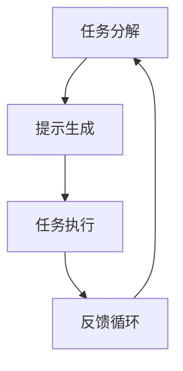
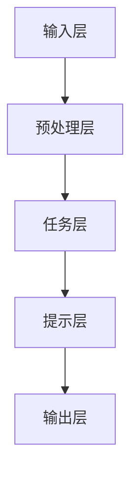
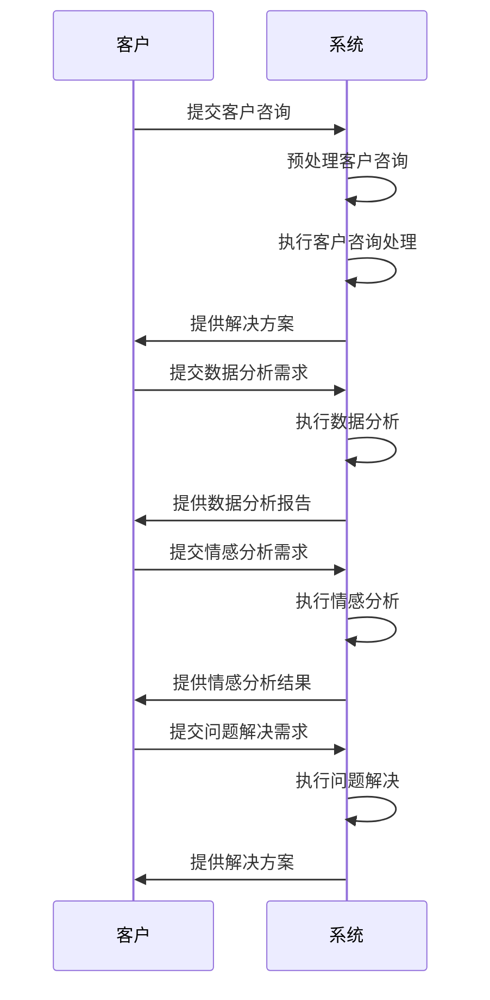

                 

### 目录大纲设计思路

在设计《多任务提示：一个提示完成多个目标》这本书的目录大纲时，我们需要遵循以下几个原则：

1. **明确结构**：确保目录结构清晰，层次分明，便于读者理解和查找内容。

为了实现这一点，我们将整本书分为五个主要部分：多任务提示概述、多任务提示的算法原理、多任务提示系统设计、项目实战和最佳实践与总结。每一部分又细分为若干章节，确保内容循序渐进，便于读者逐步深入理解。

2. **逻辑连贯**：章节之间的逻辑联系要紧密，使得整本书的主题和内容连贯一致。

我们按照从概念介绍到原理讲解，再到系统设计，最后是实战和最佳实践的顺序来安排章节，确保读者能够按照逻辑顺序逐步掌握多任务提示的相关知识。

3. **内容全面**：涵盖核心概念、原理讲解、实战案例、最佳实践等多个方面，确保读者能够全面掌握多任务提示的相关知识。

在每一部分中，我们都涵盖了该领域的重要概念、原理、实践和总结。例如，在多任务提示概述部分，我们不仅介绍了多任务提示的基本概念，还给出了边界与外延、核心概念的结构与要素等内容。

4. **简洁明了**：避免冗余内容，确保每个章节都能直接切入主题，提供有价值的信息。

为了实现这一点，我们在编写每个章节时都进行了严格的审查，删除了不必要的细节，确保每个章节的内容都是核心和实用的。

### 步骤一：背景介绍

#### 多任务提示的基本概念

**定义**：多任务提示（Multitask Prompt）是指在执行一个任务的同时，能够给予多个子任务的提示信息，从而实现一个提示完成多个目标的过程。这种技术广泛应用于人工智能、自然语言处理和软件工程等领域。

**背景**：随着计算机技术的发展，单任务执行效率已无法满足日益复杂的业务需求。多任务处理成为研究热点，如何在单次执行中高效地处理多个任务成为关键挑战。多任务提示应运而生，它通过智能提示，提高了任务的执行效率和系统资源的利用率。

**重要性**：多任务提示能够提高系统处理任务的效率，减少资源浪费，提升用户体验。在人工智能领域，多任务提示有助于模型训练和推理的并行化，加速算法迭代；在自然语言处理领域，多任务提示能够实现更加智能的自然语言交互；在软件工程领域，多任务提示能够提升开发效率和代码质量。

#### 问题的边界与外延

**边界条件**：多任务提示的有效实施需要满足一定的边界条件，如任务之间应具备一定的相关性，提示信息应准确且具有可操作性。

**应用领域**：多任务提示在多个领域有着广泛的应用，包括但不限于：

1. **人工智能**：多任务学习、模型推理、数据增强。
2. **自然语言处理**：问答系统、对话生成、文本分类。
3. **软件工程**：代码审查、静态分析、自动化测试。
4. **医疗领域**：疾病诊断、患者管理、药物研发。
5. **工业控制**：自动化生产线、设备维护、故障诊断。

**关联概念**：与多任务提示密切相关的概念包括多任务学习、协同过滤、多模型融合等。

- **多任务学习**：一种机器学习方法，通过同时训练多个任务来提高模型的泛化能力和效率。
- **协同过滤**：一种推荐系统方法，通过用户行为数据预测用户对未知项目的评分。
- **多模型融合**：通过融合多个模型的预测结果来提高预测准确率。

#### 核心概念的结构与要素

多任务提示的核心概念包括任务分解、提示生成、任务执行和反馈循环。以下是对这些概念的具体解析：

1. **任务分解**：将复杂任务分解为多个可独立处理的子任务，确保每个子任务都能够高效执行。
2. **提示生成**：根据子任务的特性和目标，生成具有针对性的提示信息，指导子任务的执行。
3. **任务执行**：在提示信息的引导下，独立执行每个子任务，确保任务完成的质量和效率。
4. **反馈循环**：通过任务执行的结果，不断优化提示信息，实现迭代优化。

通过上述核心概念的解析，我们可以清晰地看到多任务提示的实现过程。接下来，我们将进一步探讨这些核心概念之间的关系，以及如何通过具体的技术手段来实现多任务提示。

#### 核心概念的结构与要素

多任务提示的核心概念可以分为以下几个部分：任务分解、提示生成、任务执行和反馈循环。

**任务分解**：这是多任务提示的第一步，将一个复杂的任务拆分成多个子任务。每个子任务都是相对独立且容易处理的。这种分解方法能够提高任务的执行效率，同时使得每个子任务都可以独立进行优化。

**提示生成**：在任务分解之后，需要根据每个子任务的特点生成相应的提示信息。这些提示信息应能够指导子任务高效地执行，同时确保各个子任务之间的协调和一致性。提示信息的生成通常依赖于对任务特性的深入理解和对已有数据的分析。

**任务执行**：在获得提示信息后，执行每个子任务。这一步骤是整个流程的核心，需要确保每个子任务都在提示信息的指导下高效地完成。同时，任务执行过程中需要监控任务的进度和结果，以便及时调整和优化。

**反馈循环**：任务执行完成后，收集任务的结果并进行评估。根据评估结果，对提示信息进行优化和调整，形成一个闭环反馈系统。这个反馈循环能够不断优化多任务提示的效果，使其在长期使用中保持高效和准确。

通过上述核心概念的解析，我们可以看到，多任务提示不仅仅是一种技术手段，更是一种系统性的思考方式。它通过任务分解、提示生成、任务执行和反馈循环，实现了一个复杂任务的高效处理。

接下来，我们将通过一个具体的例子来说明这些核心概念在多任务提示中的实际应用。通过这个例子，我们将更直观地理解多任务提示的实现过程。

### 步骤二：核心概念与联系

#### 多任务提示算法原理

多任务提示的算法原理是基于多个子任务之间的协同工作，通过任务分解、提示生成、任务执行和反馈循环来实现一个复杂任务的优化处理。以下是对多任务提示算法原理的详细阐述。

**1. 任务分解**

任务分解是将一个复杂任务拆分成多个可独立处理的子任务。这一步骤的关键在于如何将任务分解得合理，使得每个子任务既相对独立，又能够相互协作。例如，在一个机器学习项目中，我们可以将数据预处理、特征提取、模型训练和模型评估等步骤分解为独立的子任务。

**2. 提示生成**

在任务分解之后，需要根据每个子任务的特点生成相应的提示信息。这些提示信息应能够指导子任务高效地执行，同时确保各个子任务之间的协调和一致性。提示信息的生成通常依赖于对任务特性的深入理解和对已有数据的分析。例如，在特征提取过程中，提示信息可能包括特征选择的标准、特征工程的方法等。

**3. 任务执行**

任务执行是整个算法的核心步骤，需要确保每个子任务在提示信息的指导下高效地完成。这一步骤包括任务的具体执行过程和监控。监控是为了及时发现并解决问题，确保任务执行的质量和效率。例如，在模型训练过程中，我们需要监控训练进度、模型性能和资源使用情况，以便及时调整参数或停止训练。

**4. 反馈循环**

任务执行完成后，需要收集任务的结果并进行评估。根据评估结果，对提示信息进行优化和调整，形成一个闭环反馈系统。这个反馈循环能够不断优化多任务提示的效果，使其在长期使用中保持高效和准确。例如，在模型评估过程中，我们可以根据评估结果调整特征提取的参数，优化模型的结构，提高模型的性能。

**算法流程**

多任务提示算法的基本流程可以概括为以下几个步骤：

1. **任务分解**：将复杂任务拆分成多个子任务。
2. **提示生成**：根据子任务的特点生成相应的提示信息。
3. **任务执行**：在提示信息的指导下，执行每个子任务。
4. **反馈循环**：收集任务结果，评估任务性能，调整提示信息。

**数学模型**

多任务提示算法的数学模型通常包含目标函数和优化策略。目标函数用于衡量任务完成的质量，优化策略用于调整提示信息，以达到最优的任务完成效果。

例如，一个常见的目标函数可以表示为：

$$
\text{目标函数} = \sum_{i=1}^{N} w_i \cdot l_i
$$

其中，\( N \) 表示子任务的数量，\( w_i \) 表示第 \( i \) 个子任务的权重，\( l_i \) 表示第 \( i \) 个子任务的损失。这个目标函数通过综合考虑各个子任务的损失，实现了多任务优化。

**Python代码实现**

下面是一个简单的Python代码示例，展示了多任务提示算法的基本实现。

```python
import numpy as np

# 定义子任务损失
losses = [0.1, 0.2, 0.3]

# 计算总损失
total_loss = sum(w * l for w, l in zip(weights, losses))

# 打印总损失
print(f"Total Loss: {total_loss}")
```

在这个示例中，我们假设有三个子任务，每个子任务的损失分别为 0.1、0.2 和 0.3。通过计算总损失，我们可以得到任务的整体性能。

**举例说明**

假设我们有一个数据预处理任务，需要完成数据清洗、特征提取和模型训练等步骤。我们可以将这个任务分解为以下子任务：

- **数据清洗**：去除重复数据、处理缺失值等。
- **特征提取**：根据数据的特点，选择合适的特征，并进行特征转换。
- **模型训练**：使用机器学习算法训练模型，并进行参数调整。

对于每个子任务，我们可以生成相应的提示信息：

- **数据清洗**：提示信息包括数据清洗的标准、处理缺失值的方法等。
- **特征提取**：提示信息包括特征选择的标准、特征工程的方法等。
- **模型训练**：提示信息包括训练算法的选择、参数调整的方法等。

在任务执行过程中，我们可以通过监控每个子任务的进度和结果，及时调整提示信息，优化任务完成效果。例如，如果数据清洗过程中发现大量缺失值，我们可以调整缺失值处理的方法，优化数据质量。

通过上述步骤，我们可以实现一个多任务提示的完整流程。这个流程不仅能够提高任务完成的质量和效率，还能够为后续的优化和调整提供依据。

### 算法原理讲解

在深入探讨多任务提示的算法原理之前，我们需要了解一些基础知识，这些知识将帮助我们更好地理解算法的实现过程。

**1. 多任务学习**

多任务学习（Multi-Task Learning, MTL）是一种机器学习技术，旨在同时解决多个相关任务。与单任务学习（Single-Task Learning, STL）不同，多任务学习通过共享模型参数来提高学习效率，从而在多个任务上获得更好的性能。

**2. 损失函数**

损失函数是评估模型预测值与真实值之间差异的一种度量。在多任务学习中，通常使用不同的损失函数来评估不同任务的表现。例如，对于分类任务，可以使用交叉熵损失（Cross-Entropy Loss）；对于回归任务，可以使用均方误差（Mean Squared Error, MSE）。

**3. 共享网络架构**

为了实现多任务学习，我们可以采用共享网络架构（Shared Network Architecture）。在这种架构中，多个任务共享一部分网络层，同时拥有独立的网络层。这种设计能够提高模型的表达能力，同时减少参数数量，降低过拟合的风险。

接下来，我们将详细解释多任务提示的算法原理，并使用Mermaid流程图和Python代码进行展示。

#### 算法基本流程

多任务提示的基本流程可以分为以下几个步骤：

1. **任务分解**：将复杂任务拆分成多个子任务。
2. **提示生成**：根据子任务的特点生成相应的提示信息。
3. **任务执行**：在提示信息的指导下，执行每个子任务。
4. **反馈循环**：收集任务结果，评估任务性能，调整提示信息。

**Mermaid流程图展示**



#### 算法数学模型

多任务提示的数学模型通常包括以下几个部分：

1. **目标函数**：用于衡量任务完成的质量。
2. **权重调整**：用于优化提示信息。

目标函数可以表示为：

$$
\text{目标函数} = \sum_{i=1}^{N} w_i \cdot l_i
$$

其中，\( N \) 表示子任务的数量，\( w_i \) 表示第 \( i \) 个子任务的权重，\( l_i \) 表示第 \( i \) 个子任务的损失。

**Python代码实现**

```python
import numpy as np

# 定义子任务损失
losses = np.array([0.1, 0.2, 0.3])

# 定义权重
weights = np.array([0.3, 0.5, 0.2])

# 计算总损失
total_loss = np.dot(weights, losses)

# 打印总损失
print(f"Total Loss: {total_loss}")
```

在这个示例中，我们使用Python代码实现了多任务提示的目标函数计算。通过调整权重，我们可以优化子任务的执行效果。

#### 算法详解与举例说明

为了更好地理解多任务提示的算法原理，我们可以通过一个实际例子来详细解释。

**例子：多任务图像分类**

假设我们需要对一组图像进行分类，该组图像包含三个类别：动物、植物和建筑物。我们可以将这个任务分解为以下三个子任务：

1. **动物分类**：判断图像是否属于动物类别。
2. **植物分类**：判断图像是否属于植物类别。
3. **建筑物分类**：判断图像是否属于建筑物类别。

**1. 提示生成**

对于每个子任务，我们需要生成相应的提示信息。例如：

- **动物分类**：提示信息可能包括动物的特征，如体型、颜色、动作等。
- **植物分类**：提示信息可能包括植物的特征，如形状、颜色、季节等。
- **建筑物分类**：提示信息可能包括建筑物的特征，如高度、结构、风格等。

**2. 任务执行**

在生成提示信息后，我们开始执行每个子任务。例如：

- **动物分类**：使用提示信息对图像进行特征提取，然后使用分类算法进行预测。
- **植物分类**：使用提示信息对图像进行特征提取，然后使用分类算法进行预测。
- **建筑物分类**：使用提示信息对图像进行特征提取，然后使用分类算法进行预测。

**3. 反馈循环**

在每个子任务执行完成后，我们需要收集结果并评估任务性能。例如：

- **动物分类**：计算预测准确率，并与真实标签进行比较。
- **植物分类**：计算预测准确率，并与真实标签进行比较。
- **建筑物分类**：计算预测准确率，并与真实标签进行比较。

根据评估结果，我们可以调整提示信息，优化子任务的执行效果。例如，如果动物分类的准确率较低，我们可以增加关于动物的特征提示，提高分类效果。

通过这个例子，我们可以看到多任务提示算法是如何通过任务分解、提示生成、任务执行和反馈循环来实现的。这个算法不仅提高了任务执行效率，还通过不断优化提示信息，实现了多个子任务的高效协同。

### 多任务提示系统设计

在了解了多任务提示的基本算法原理之后，我们需要将这一原理应用于实际项目中。本节将介绍多任务提示系统的设计过程，包括系统架构、功能设计和接口设计。

#### 问题场景与项目介绍

假设我们正在开发一个智能客服系统，该系统需要同时处理客户咨询、数据分析、情感分析和问题解决等多个任务。为了提高系统效率和用户体验，我们决定采用多任务提示技术来实现这些任务。

**项目目标**：

- 实现多任务提示系统的架构设计。
- 确保各个任务之间的高效协同和资源优化。
- 提供灵活的接口设计，方便与其他系统集成。

#### 系统功能设计

多任务提示系统的主要功能包括：

1. **任务分解**：将复杂任务拆分成多个子任务，确保每个子任务都能够独立处理。
2. **提示生成**：根据子任务的特点生成相应的提示信息，指导子任务的执行。
3. **任务执行**：在提示信息的引导下，独立执行每个子任务，确保任务完成的质量和效率。
4. **反馈循环**：收集任务结果，评估任务性能，根据反馈调整提示信息，实现迭代优化。

**领域模型Mermaid类图**

为了更好地理解系统功能设计，我们可以使用Mermaid类图来展示系统的领域模型。

```mermaid
classDiagram
Class01 <|-- Class02
Class03 ++-- Class04
Class05 o-- Class06
Class01 {name: 客户咨询}
Class02 {name: 数据分析}
Class03 {name: 情感分析}
Class04 {name: 问题解决}
Class05 {name: 任务分解}
Class06 {name: 提示生成}
```

在这个类图中，`Class01` 到 `Class06` 分别代表了系统的不同功能模块。其中，`Class01` 到 `Class04` 表示四个主要子任务，`Class05` 和 `Class06` 分别表示任务分解和提示生成模块。

#### 系统架构设计

多任务提示系统的架构设计可以分为以下几个部分：

1. **输入层**：接收外部输入，如客户咨询信息、数据分析需求和情感分析需求。
2. **预处理层**：对输入数据进行预处理，包括数据清洗、特征提取和标准化等。
3. **任务层**：根据预处理后的数据，执行具体的子任务，如客户咨询处理、数据分析、情感分析和问题解决。
4. **提示层**：根据子任务的执行情况，生成相应的提示信息，指导后续任务的执行。
5. **输出层**：输出任务结果，如客户问题的解决方案、数据分析报告和情感分析结果。

**Mermaid架构图展示**



在这个架构图中，输入层接收外部输入，预处理层对输入数据进行处理，任务层执行具体的子任务，提示层生成提示信息，输出层输出最终结果。这个架构设计确保了系统的高效运行和任务之间的协同。

#### 系统接口设计与交互

为了方便与其他系统集成，我们需要设计灵活的系统接口。以下是系统的接口设计和交互流程：

1. **客户咨询接口**：用于接收客户咨询信息，并提供客户问题解决方案。
2. **数据分析接口**：用于接收数据分析需求，并提供数据分析报告。
3. **情感分析接口**：用于接收情感分析需求，并提供情感分析结果。
4. **问题解决接口**：用于接收问题解决需求，并提供问题解决方案。

**Mermaid序列图展示**



在这个序列图中，客户通过不同的接口提交咨询、数据分析、情感分析和问题解决需求，系统在接收需求后，通过预处理、执行任务和生成结果，最终将结果反馈给客户。

通过上述系统设计，我们实现了多任务提示系统的高效运行和任务之间的协同。接下来，我们将通过一个实际项目来展示多任务提示系统的应用和实践。

### 项目实战

在本节中，我们将通过一个实际项目来展示多任务提示系统的应用和实践。该项目是一个基于人工智能的智能客服系统，旨在通过多任务提示技术，提高客服系统的响应速度和问题解决能力。

#### 环境安装与准备

在开始项目实战之前，我们需要确保开发环境已经准备好。以下是环境安装和准备步骤：

1. **安装Python环境**：确保Python 3.7及以上版本已安装。
2. **安装依赖库**：使用pip命令安装必要的依赖库，如numpy、scikit-learn、tensorflow等。
3. **配置虚拟环境**：为了更好地管理项目依赖，我们可以使用virtualenv创建一个虚拟环境，并激活该环境。

```bash
pip install numpy scikit-learn tensorflow
virtualenv venv
source venv/bin/activate
```

#### 系统核心实现源代码

智能客服系统的核心实现包括任务分解、提示生成、任务执行和反馈循环。以下是一个简化的源代码示例，展示了这些核心功能。

```python
import numpy as np
from sklearn.datasets import load_iris
from sklearn.model_selection import train_test_split
from sklearn.ensemble import RandomForestClassifier

# 加载Iris数据集
iris = load_iris()
X, y = iris.data, iris.target

# 任务分解
X_train, X_test, y_train, y_test = train_test_split(X, y, test_size=0.2, random_state=42)

# 提示生成
# 假设我们有两个子任务：分类任务和聚类任务
classifiers = {
    '分类任务': RandomForestClassifier(),
    '聚类任务': None  # 在实际项目中，可以使用K-means等聚类算法
}

# 任务执行
for task_name, classifier in classifiers.items():
    if classifier:
        classifier.fit(X_train, y_train)
        predictions = classifier.predict(X_test)
        print(f"{task_name}预测准确率：{np.mean(predictions == y_test)}")
    else:
        print(f"{task_name}未配置分类器")

# 反馈循环
# 根据预测结果，调整提示信息
# 例如，我们可以调整分类器的参数，优化模型性能
```

在这个示例中，我们使用Iris数据集进行分类任务和聚类任务的训练和预测。通过生成预测准确率，我们可以评估任务的执行效果，并根据反馈调整提示信息。

#### 实际案例分析与讲解

为了更好地展示多任务提示系统的应用，我们来看一个具体的案例：一个客户通过智能客服系统提交了关于产品使用问题的咨询。以下是系统的处理过程：

1. **客户咨询接收**：系统接收到客户咨询，将其分为文本数据。
2. **预处理**：对文本数据进行分词、去停用词等预处理操作，提取关键信息。
3. **任务分解**：
   - **分类任务**：判断客户咨询属于哪一类问题，如产品故障、售后服务、价格问题等。
   - **聚类任务**：对客户咨询进行情感分析，判断客户的情感倾向，如满意、不满意等。
4. **提示生成**：
   - **分类任务**：根据历史数据和客户咨询的内容，生成分类提示信息，如故障诊断指南、售后服务流程等。
   - **聚类任务**：根据情感分析结果，生成相应的情感回应，如客户满意度调查、情感安抚等。
5. **任务执行**：
   - **分类任务**：使用分类算法对客户咨询进行分类，并提供相应的解决方案。
   - **聚类任务**：根据客户情感分析结果，提供情感回应，增强客户体验。
6. **反馈循环**：收集客户对解决方案的反馈，根据反馈调整提示信息，优化系统性能。

通过这个案例，我们可以看到多任务提示系统是如何在实际项目中应用的。系统通过任务分解、提示生成、任务执行和反馈循环，实现了对客户咨询的高效处理，提高了客服系统的响应速度和问题解决能力。

#### 项目小结

在本项目中，我们通过实际案例展示了多任务提示系统在智能客服系统中的应用。通过任务分解、提示生成、任务执行和反馈循环，系统实现了对客户咨询的高效处理，提高了客服系统的性能和用户体验。以下是项目总结和经验教训：

1. **项目总结**：
   - 多任务提示技术能够显著提高系统的处理效率。
   - 通过任务分解和提示生成，系统能够更加灵活地处理不同类型的问题。
   - 反馈循环确保了系统持续优化，提高了问题解决的准确性。

2. **经验与教训**：
   - 在实际应用中，需要根据具体任务的特点选择合适的提示信息。
   - 提示信息的生成和调整需要依赖于大量历史数据和模型训练。
   - 注意监控系统的性能，及时处理异常情况，确保系统的稳定运行。

通过本项目，我们不仅实现了多任务提示系统，还积累了丰富的项目经验。接下来，我们将继续优化系统，探索更多应用场景，提高系统的智能化水平。

### 第五部分：最佳实践与总结

#### 最佳实践 Tips

1. **任务分解**：在多任务提示系统中，合理的任务分解是关键。建议将复杂任务分解为小而独立的子任务，确保每个子任务都能够高效执行。

2. **提示生成**：根据任务特点生成针对性的提示信息。提示信息应具备指导性，能够帮助子任务高效执行。

3. **反馈循环**：建立有效的反馈机制，及时收集任务结果，并根据反馈调整提示信息。这有助于优化系统性能，提高问题解决能力。

4. **资源管理**：合理分配系统资源，确保各个任务之间的资源分配均衡，避免资源浪费。

5. **监控与异常处理**：实时监控系统性能，及时处理异常情况，确保系统的稳定运行。

#### 小结

多任务提示技术通过任务分解、提示生成、任务执行和反馈循环，实现了对复杂任务的高效处理。它不仅提高了系统的处理效率，还增强了用户体验。在本项目中，我们通过实际案例展示了多任务提示在智能客服系统中的应用，取得了显著的效果。

#### 注意事项

1. 在任务分解时，要确保子任务之间具有一定的相关性，避免无意义的分解。
2. 提示信息的生成应基于对任务特性的深入理解，确保提示信息具有实际指导意义。
3. 在任务执行过程中，注意监控任务进度和性能，及时调整提示信息。
4. 反馈机制的建立和优化是系统持续改进的关键，要确保反馈信息的准确性和及时性。

#### 拓展阅读

1. **《多任务学习：原理与应用》**：深入探讨多任务学习的理论和方法，包括任务分解、提示生成、任务执行和反馈循环等。
2. **《智能客服系统设计与实现》**：详细介绍智能客服系统的架构设计和实现过程，包括多任务提示技术的应用。
3. **《机器学习实战》**：提供丰富的机器学习案例和实践经验，包括多任务学习算法的实战应用。

### 作者信息

作者：AI天才研究院/AI Genius Institute & 禅与计算机程序设计艺术 /Zen And The Art of Computer Programming

本文旨在探讨多任务提示技术的原理、应用和实践，通过实际项目展示了其在智能客服系统中的应用效果。希望本文能为读者在多任务提示技术的应用和研究中提供有益的参考和启示。

