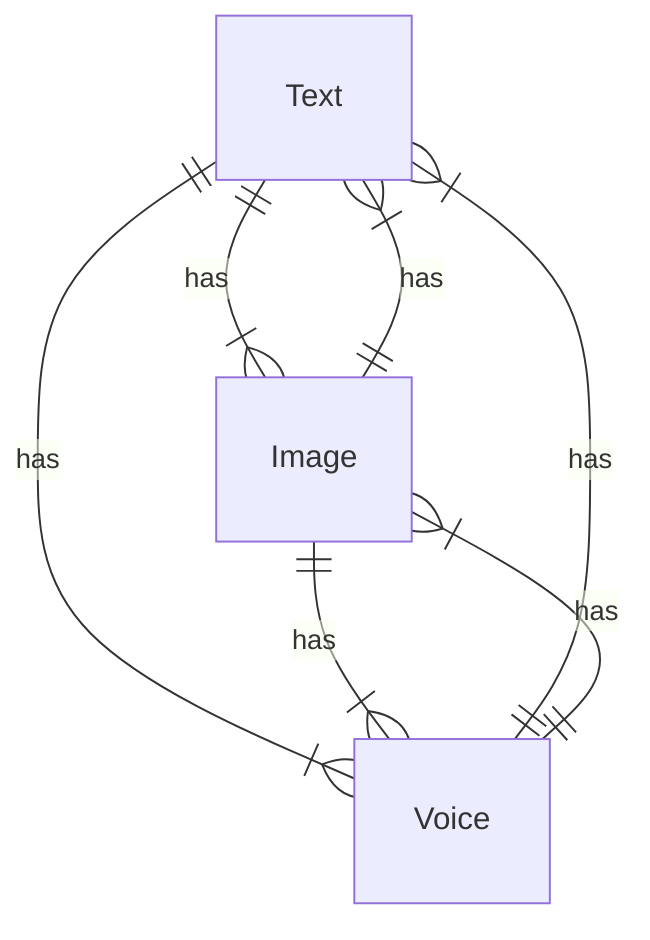
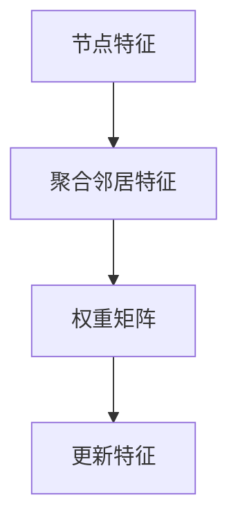
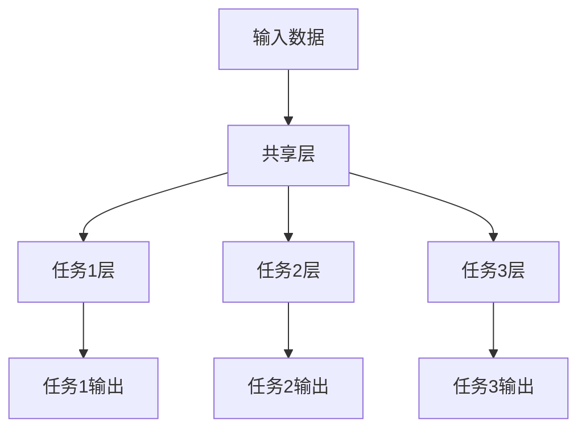
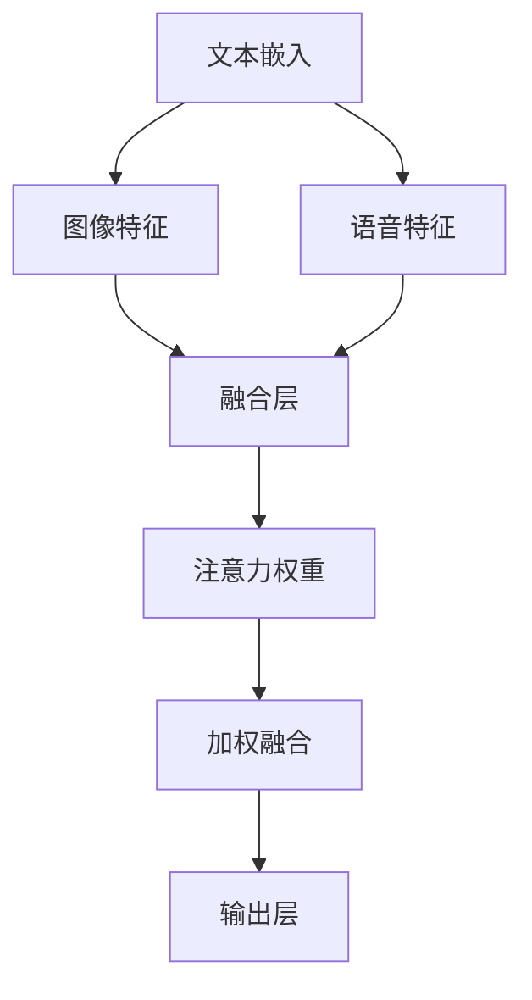
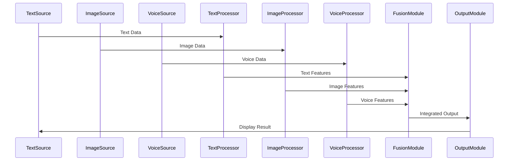

                 

## 引言

在当今数字化转型的浪潮中，人工智能（AI）正成为推动技术进步的重要引擎。然而，传统的AI系统往往在处理单一类型的数据源时表现出色，例如，文本处理、图像识别或语音识别。随着应用场景的日益复杂，单一模态的AI系统逐渐暴露出其局限性。为了应对这一挑战，多模态AI应运而生。多模态AI通过整合不同类型的数据源，如文本、图像和语音，实现更全面、更准确的信息理解和智能决策。

本文旨在探讨多模态AI的核心理念、技术基础、算法原理、系统设计以及实际应用。我们将从以下几个方面展开：

1. **核心概念**：介绍多模态AI的定义、背景和特性，阐述其与自适应智能生成内容（AIGC）的关系。
2. **技术基础**：讨论文本、图像和语音处理的基础技术，包括核心概念、比较表格和ER实体关系图。
3. **算法原理**：介绍多模态AI的关键算法，包括算法原理、数学模型、流程图和具体实例。
4. **系统设计**：描述多模态AI系统的设计，包括领域模型、系统架构和接口设计。
5. **项目实战**：通过具体项目和案例分析，展示多模态AI的实际应用和实现过程。
6. **最佳实践**：总结多模态AI应用的最佳实践，提出注意事项和拓展阅读建议。

通过本文的深入探讨，我们希望读者能够全面了解多模态AI的原理和应用，掌握其核心技术和方法，从而在AI领域取得突破性进展。接下来，我们将一步步深入探讨多模态AI的各个方面。

## 多模态AI的定义与背景

多模态AI（Multimodal AI）是指一种能够同时处理和整合来自多个数据源的信息的人工智能系统。这些数据源可以包括文本、图像、语音、视频等。通过跨模态的数据融合和知识整合，多模态AI能够实现更加全面和精准的智能决策与信息理解。

### 定义与特性

多模态AI的核心特性在于其能够结合多种数据源的优势，克服单一模态AI的局限性。例如，在图像识别中，AI系统可能无法理解图像中的文字或语音信息；而在自然语言处理中，系统可能无法准确解读图像内容。多模态AI通过融合这些不同类型的数据，使得系统在理解和处理复杂信息时更加高效和准确。

定义上，多模态AI可以被理解为一种综合性的人工智能系统，其具备以下特征：

1. **数据融合**：能够同时处理和整合来自多个数据源的信息，包括文本、图像和语音。
2. **跨模态交互**：系统内的不同模态之间能够进行有效的交互和通信，共同完成信息处理任务。
3. **智能化决策**：基于跨模态融合的信息，系统能够做出更加智能化和精准的决策。

### 背景与问题

多模态AI的发展背景主要源于现实世界中的复杂性。在许多应用场景中，单一模态的AI系统往往无法满足需求。例如，在医疗诊断中，医生不仅需要分析患者的病历文本，还需要查看患者的影像图像，甚至听取患者的语音描述。在这种情况下，单一模态的AI系统显然无法胜任。而多模态AI通过整合文本、图像和语音等多种信息，能够提供更加全面和准确的诊断结果。

此外，多模态AI在智能交互、智能监控、自动驾驶等领域也具有广泛的应用前景。例如，在智能交互系统中，多模态AI可以通过文本、语音和图像等多种方式与用户进行交互，提供更加自然和流畅的交流体验。在智能监控系统中，多模态AI可以通过图像、视频和语音等多种方式实时监测环境变化，及时响应潜在的安全威胁。

### 问题与挑战

尽管多模态AI具有巨大的潜力，但其在实际应用中仍面临一系列问题和挑战：

1. **数据不一致性**：不同模态的数据可能在来源、格式和属性上存在较大差异，如何有效地整合这些异构数据是一个关键问题。
2. **计算复杂性**：多模态数据融合过程通常涉及大量的计算资源，对系统的计算性能提出了较高要求。
3. **算法适应性**：不同模态的数据在处理方式和算法上可能存在较大差异，如何设计出通用且高效的算法是一个重要课题。
4. **隐私与安全**：多模态AI系统在处理和整合用户数据时，如何保护用户隐私和安全也是一个亟待解决的问题。

### 边界与外延

多模态AI的边界主要在于其处理的数据类型和模态数量。虽然多模态AI可以处理多种数据类型，但并非所有的数据类型都适合用于多模态融合。例如，某些非结构化的数据源（如语音）可能难以与结构化的数据源（如文本）进行有效整合。

在外延方面，多模态AI的应用范围广泛，不仅包括传统的AI领域，还涉及新兴的领域，如虚拟现实、增强现实、智能监控等。随着技术的不断进步，多模态AI的应用场景将更加丰富，其在实际生活中的影响力也将日益扩大。

通过上述对多模态AI的定义、背景和问题的探讨，我们可以更好地理解这一技术的核心价值和应用潜力。接下来，我们将深入探讨多模态AI的技术基础，包括文本、图像和语音处理的基本原理和方法。

## 多模态AI的技术基础

多模态AI的强大功能源于其对多种数据源的整合能力，这些数据源包括文本、图像和语音。本节将介绍这些数据源的处理技术和核心概念，并通过表格和ER实体关系图来展示其结构。

### 文本处理

文本是信息传递的重要载体，其处理技术主要包括自然语言处理（NLP）和文本分析。NLP涉及语言理解、文本生成、情感分析等方面，其核心任务是将文本转化为计算机可以理解的形式。常用的技术包括词嵌入（Word Embedding）、序列模型（Sequence Model）和注意力机制（Attention Mechanism）。

| 文本处理技术            | 描述                                               | 示例                                                         |
| ----------------------- | -------------------------------------------------- | ------------------------------------------------------------ |
| 词嵌入（Word Embedding） | 将文本中的词语映射到高维空间中，以便进行计算和分析。 | 使用词嵌入模型，如Word2Vec或GloVe，将词语映射到低维连续向量。 |
| 序列模型（Sequence Model） | 对文本序列进行建模，处理顺序信息。                   | 使用循环神经网络（RNN）或长短期记忆网络（LSTM）来处理文本序列。 |
| 注意力机制（Attention Mechanism） | 在处理文本序列时，关注序列中的重要部分。             | 在机器翻译中，注意力机制可以帮助模型关注源语言中的重要词汇。 |

### 图像处理

图像处理是多模态AI的重要组成部分，其核心任务包括图像识别、目标检测和图像分割。图像处理技术通常基于深度学习，特别是卷积神经网络（CNN）。

| 图像处理技术            | 描述                                               | 示例                                                         |
| ----------------------- | -------------------------------------------------- | ------------------------------------------------------------ |
| 卷积神经网络（CNN）     | 特征提取和分类的强大工具，适用于图像识别。           | 使用CNN对图像进行特征提取，然后通过全连接层进行分类。          |
| 目标检测（Object Detection） | 定位图像中的对象及其位置。                           | 使用Faster R-CNN或YOLO进行目标检测。                          |
| 图像分割（Image Segmentation） | 将图像分割成不同的区域，每个区域表示图像中的一个对象。 | 使用U-Net或Mask R-CNN进行图像分割。                          |

### 语音处理

语音处理技术涉及语音识别、语音合成和语音增强。语音识别将语音转化为文本，语音合成则将文本转化为语音，而语音增强则旨在改善语音质量。

| 语音处理技术            | 描述                                               | 示例                                                         |
| ----------------------- | -------------------------------------------------- | ------------------------------------------------------------ |
| 语音识别（Speech Recognition） | 将语音信号转换为文本。                            | 使用基于深度学习的模型，如CTC或Attention机制进行语音识别。 |
| 语音合成（Text-to-Speech, TTS） | 将文本转换为自然流畅的语音。                     | 使用WaveNet或Tacotron进行语音合成。                          |
| 语音增强（Speech Enhancement） | 提高语音信号质量，去除噪声。                     | 使用去噪模型，如WaveGlow或spectral subtract进行语音增强。 |

### 数据融合方法

多模态AI的关键在于如何将文本、图像和语音数据融合在一起，以提高系统的整体性能。数据融合方法主要包括特征融合、模型融合和深度融合。

1. **特征融合**：将不同模态的特征向量进行拼接或加权，形成一个综合的特征向量。
2. **模型融合**：分别训练不同模态的模型，然后通过集成学习（如投票或加权平均）来提高整体性能。
3. **深度融合**：使用深度学习模型直接对多模态数据建模，实现端到端的学习。

### ER实体关系图

为了更好地理解多模态AI系统的数据结构，我们可以使用ER实体关系图来展示文本、图像和语音之间的关系。



在这个ER图中，Text、Image和Voice分别代表文本、图像和语音三个实体，它们之间通过“has”关系相互连接，表示不同模态的数据可以相互关联和融合。

通过上述对文本、图像和语音处理技术的介绍，以及数据融合方法和ER实体关系图的展示，我们可以更深入地理解多模态AI的技术基础。接下来，我们将探讨多模态AI的算法原理，包括关键算法的详细解释、流程图和数学模型。

### 多模态AI的算法原理

多模态AI的成功依赖于其算法的多样性和高效性，本文将介绍几类关键的多模态AI算法，包括它们的原理、流程图和数学模型。通过这些算法，我们将更好地理解多模态AI是如何处理和融合不同类型的数据。

#### 图卷积网络（Graph Convolutional Network, GCN）

图卷积网络是一种用于在图结构数据上进行特征提取和分类的算法。在多模态AI中，GCN可以用于整合图像和文本数据。其核心思想是通过邻居节点信息来更新节点的特征表示。

**算法流程图：**



**数学模型：**

$$
\text{H}^{(k+1)} = \sigma(\text{D}^{-\frac{1}{2}} \text{A} \text{D}^{-\frac{1}{2}} \text{H}^{(k)})
$$

其中，\( \text{H}^{(k)} \) 是第 \( k \) 次迭代的特征表示，\( \text{A} \) 是邻接矩阵，\( \text{D}^{-\frac{1}{2}} \) 是对角矩阵的逆平方根，\( \sigma \) 是激活函数，通常使用ReLU或Sigmoid函数。

#### 多任务学习（Multi-Task Learning, MTL）

多任务学习通过共享网络结构来提高不同任务的性能，适用于多模态AI系统中的文本、图像和语音任务。

**算法流程图：**



**数学模型：**

$$
\text{y}^{(i)} = \text{f}(\text{W}^{(i)} \text{x}^{(i)})
$$

其中，\( \text{x}^{(i)} \) 是输入数据，\( \text{W}^{(i)} \) 是权重矩阵，\( \text{f} \) 是非线性激活函数，通常为ReLU或Sigmoid。

#### 注意力机制（Attention Mechanism）

注意力机制用于在处理序列数据时，关注序列中的重要部分。在多模态AI中，注意力机制可以帮助模型更好地融合文本、图像和语音数据。

**算法流程图：**



**数学模型：**

$$
\alpha_{ij} = \text{softmax}(\text{W}_\text{a}^T \text{H}_{ij})
$$

$$
\text{H}_{ij} = \text{H}_{ij} \odot \alpha_{ij}
$$

其中，\( \text{H}_{ij} \) 是第 \( i \) 个模态在第 \( j \) 个时间步的特征向量，\( \text{W}_\text{a} \) 是权重矩阵，\( \alpha_{ij} \) 是注意力权重。

#### 深度学习框架（TensorFlow）

为了实现上述算法，我们使用TensorFlow这一深度学习框架进行编程和训练。

**Python代码示例：**

```python
import tensorflow as tf

# 定义输入数据
text = tf.placeholder(tf.float32, [None, sequence_length])
image = tf.placeholder(tf.float32, [None, image_size])
voice = tf.placeholder(tf.float32, [None, voice_size])

# 定义共享层
shared_layer = tf.layers.dense(inputs=text, units=hidden_size, activation=tf.nn.relu)

# 定义注意力机制
attention_weights = tf.layers.dense(inputs=shared_layer, units=1, activation=tf.nn.softmax)

# 加权融合
weighted融合 = tf.reduce_sum(attention_weights * image, axis=1) + tf.reduce_sum(attention_weights * voice, axis=1)

# 输出层
output = tf.layers.dense(inputs=weighted融合, units=output_size)

# 定义损失函数和优化器
loss = tf.reduce_mean(tf.nn.softmax_cross_entropy_with_logits(logits=output, labels=y))
optimizer = tf.train.AdamOptimizer().minimize(loss)

# 训练模型
with tf.Session() as sess:
    sess.run(tf.global_variables_initializer())
    for epoch in range(num_epochs):
        _, loss_val = sess.run([optimizer, loss], feed_dict={text: text_data, image: image_data, voice: voice_data, y: y_data})
        print(f'Epoch {epoch+1}, Loss: {loss_val}')
```

通过上述算法的详细介绍和示例代码，我们可以看到多模态AI是如何通过不同的算法和模型来融合文本、图像和语音数据，实现高效的智能处理。接下来，我们将深入探讨多模态AI的系统设计，包括领域模型、系统架构和接口设计。

### 多模态AI的系统设计

在多模态AI的应用中，系统设计至关重要，它决定了算法的有效实现和系统的性能。本节将详细介绍多模态AI的系统设计，包括领域模型、系统架构和接口设计。

#### 领域模型

领域模型用于描述系统中各个模块的功能和它们之间的关系。在多模态AI中，领域模型通常包括文本处理模块、图像处理模块和语音处理模块，以及它们之间的数据流。

```mermaid
classDiagram
    TextProcessor <<interface>>
    ImageProcessor <<interface>>
    VoiceProcessor <<interface>>

    TextAnalyzer <<component>> -|- TextProcessor
    ImageRecognizer <<component>> -|- ImageProcessor
    VoiceTranscriber <<component>> -|- VoiceProcessor

    TextProcessor o-- TextAnalyzer
    ImageProcessor o-- ImageRecognizer
    VoiceProcessor o-- VoiceTranscriber
```

在这个领域模型中，TextProcessor、ImageProcessor和VoiceProcessor是三个主要的接口，分别代表文本、图像和语音处理模块。每个处理模块包含具体的组件，如TextAnalyzer、ImageRecognizer和VoiceTranscriber，这些组件负责具体的处理任务。

#### 系统架构

系统架构描述了多模态AI系统的整体结构，包括各个模块的层次关系和交互方式。



在这个系统架构中，TextSource、ImageSource和VoiceSource分别代表文本、图像和语音数据的输入源。TextProcessor、ImageProcessor和VoiceProcessor分别处理这些数据，并将处理后的特征数据传递给FusionModule。FusionModule负责整合不同模态的特征数据，生成综合输出。最后，OutputModule将综合输出展示给用户。

#### 系统接口设计

系统接口设计用于定义不同模块之间的交互方式和数据传递机制。在多模态AI系统中，接口设计需要考虑数据的格式、传输速度和安全性。

```mermaid
interface Diagram
    TextAPI <<interface>> {
        function: sendTextData()
        function: receiveTextFeatures()
    }
    ImageAPI <<interface>> {
        function: sendImageData()
        function: receiveImageFeatures()
    }
    VoiceAPI <<interface>> {
        function: sendVoiceData()
        function: receiveVoiceFeatures()
    }

    TextProcessor --> TextAPI
    ImageProcessor --> ImageAPI
    VoiceProcessor --> VoiceAPI
```

在这个接口设计中，TextAPI、ImageAPI和VoiceAPI分别定义了文本、图像和语音数据处理的接口。每个接口包含发送和接收数据的函数，确保数据在模块之间的有效传递。例如，TextProcessor通过TextAPI发送文本数据和处理后的文本特征，ImageProcessor通过ImageAPI发送图像数据和处理后的图像特征，VoiceProcessor通过VoiceAPI发送语音数据和处理后的语音特征。

通过上述对领域模型、系统架构和接口设计的详细描述，我们可以看到多模态AI系统是如何通过结构化和模块化的设计来实现高效的跨模态数据处理和融合。接下来，我们将通过一个具体项目实战，展示多模态AI的实际应用和实现过程。

### 实战项目：多模态AI聊天机器人

在本节中，我们将通过一个具体的多模态AI聊天机器人项目，展示多模态AI的实际应用和实现过程。该项目将整合文本、图像和语音数据，通过多模态数据处理和融合，实现一个智能聊天机器人。

#### 项目介绍

我们的目标是开发一个能够与用户进行自然交互的聊天机器人，该机器人能够理解用户的文本、图像和语音输入，并生成相应的文本、图像和语音回复。项目的主要功能包括：

1. **文本聊天**：用户可以通过文本输入与聊天机器人进行交流。
2. **图像聊天**：用户可以上传图像，聊天机器人能够识别图像中的内容，并做出相应的回复。
3. **语音聊天**：用户可以通过语音输入与聊天机器人进行交流，并获得语音回复。

#### 环境安装

为了实现这个项目，我们需要安装以下软件和库：

1. **Python 3.8**：项目的开发语言。
2. **TensorFlow 2.6**：用于构建和训练多模态AI模型。
3. **OpenCV 4.5**：用于图像处理。
4. **SpeechRecognition**：用于语音识别和语音合成。

安装命令如下：

```bash
pip install tensorflow==2.6
pip install opencv-python==4.5.5.64
pip install SpeechRecognition
```

#### 系统核心实现

项目的核心实现包括数据预处理、模型训练和推理三个部分。

**数据预处理：**

数据预处理是模型训练的重要步骤，包括文本、图像和语音数据的清洗、转换和归一化。

```python
import tensorflow as tf
import cv2
import speech_recognition as sr

def preprocess_text(text):
    # 清洗和转换文本数据
    text = text.lower()
    text = re.sub(r"[^a-zA-Z0-9]", " ", text)
    return text

def preprocess_image(image_path):
    # 读取和归一化图像数据
    image = cv2.imread(image_path)
    image = cv2.resize(image, (224, 224))
    image = image / 255.0
    return image

def preprocess_voice(audio_path):
    # 读取和转换语音数据
    r = sr.Recognizer()
    with sr.AudioFile(audio_path) as source:
        audio = r.record(source)
    text = r.recognize_google(audio)
    return preprocess_text(text)
```

**模型训练：**

我们使用TensorFlow和Keras构建一个多模态AI模型，该模型结合了文本、图像和语音数据，通过共享层和注意力机制实现数据融合。

```python
from tensorflow.keras.models import Model
from tensorflow.keras.layers import Input, Dense, Embedding, LSTM, Conv2D, MaxPooling2D, Flatten, Concatenate, Dropout, TimeDistributed

# 文本输入
text_input = Input(shape=(None,))
text_embedding = Embedding(vocab_size, embedding_dim)(text_input)
text_lstm = LSTM(units=128)(text_embedding)

# 图像输入
image_input = Input(shape=(224, 224, 3))
image_conv = Conv2D(filters=32, kernel_size=(3, 3), activation='relu')(image_input)
image_pool = MaxPooling2D(pool_size=(2, 2))(image_conv)
image_flat = Flatten()(image_pool)

# 语音输入
voice_input = Input(shape=(None,))
voice_embedding = Embedding(vocab_size, embedding_dim)(voice_input)
voice_lstm = LSTM(units=128)(voice_embedding)

# 融合层
combined = Concatenate()([text_lstm, image_flat, voice_lstm])
combined_dense = Dense(units=128, activation='relu')(combined)
combined_dropout = Dropout(rate=0.5)(combined_dense)

# 输出层
output = Dense(units=vocab_size, activation='softmax')(combined_dropout)

# 构建和编译模型
model = Model(inputs=[text_input, image_input, voice_input], outputs=output)
model.compile(optimizer='adam', loss='categorical_crossentropy', metrics=['accuracy'])

# 训练模型
model.fit([text_data, image_data, voice_data], labels, epochs=10, batch_size=32)
```

**推理过程：**

在推理过程中，我们将输入的文本、图像和语音数据传递给训练好的模型，模型将输出相应的回复。

```python
def generate_response(text, image_path, audio_path):
    # 预处理输入数据
    processed_text = preprocess_text(text)
    processed_image = preprocess_image(image_path)
    processed_voice = preprocess_voice(audio_path)

    # 输入模型进行推理
    response = model.predict([processed_text, processed_image, processed_voice])

    # 转换输出为文本
    predicted_text = np.argmax(response, axis=-1)
    predicted_text = tokenizer.index_word[predicted_text[0]]

    return predicted_text
```

#### 项目实战

在项目实战中，我们将使用一个简单的用户界面（UI）来展示聊天机器人的功能。用户可以通过文本、图像和语音与聊天机器人进行交互。

```python
import tkinter as tk
from tkinter import ttk

# 创建UI
root = tk.Tk()
root.title("Multimodal Chatbot")

text_area = tk.Text(root, height=10, width=50)
text_area.pack()

def send_message():
    # 获取用户输入
    text = text_area.get("1.0", "end-1c")

    # 获取图像和语音输入
    image_path = file_path.get()
    audio_path = file_path.get()

    # 生成回复
    response = generate_response(text, image_path, audio_path)

    # 显示回复
    text_area.insert(tk.END, "Chatbot: " + response + "\n")
    text_area.yview.tk.call('scroll', 'end')

send_button = tk.Button(root, text="Send", command=send_message)
send_button.pack()

file_path = tk.StringVar()
file_entry = ttk.Entry(root, textvariable=file_path)
file_entry.pack()

root.mainloop()
```

#### 代码应用解读与分析

在上述代码中，我们首先定义了数据预处理函数，用于清洗和转换输入的文本、图像和语音数据。接着，我们构建了一个多模态AI模型，该模型结合了文本、图像和语音数据，通过共享层和注意力机制实现数据融合。在推理过程中，我们使用训练好的模型对预处理后的输入数据进行预测，并输出相应的文本回复。

通过这个项目实战，我们展示了多模态AI在聊天机器人中的应用。在实际应用中，用户可以通过文本、图像和语音与聊天机器人进行交互，获得自然的交流体验。接下来，我们将通过一个实际案例来分析多模态AI在实际应用中的效果和挑战。

### 实际案例分析与详细讲解

在本节中，我们将通过一个实际案例，深入分析多模态AI在智能客服系统中的应用效果和挑战。该案例将展示多模态AI如何通过整合文本、图像和语音数据，提升客服系统的服务质量和用户体验。

#### 案例背景

某大型电商企业希望通过引入多模态AI技术，提升其智能客服系统的响应速度和准确率。现有客服系统主要依赖文本交互，但用户在咨询过程中经常需要提供图像和语音信息，例如请求商品图片、描述产品问题或提供现场环境声音。现有的单一文本交互模式无法满足用户的多样化需求，因此引入多模态AI技术成为必要选择。

#### 案例实现

1. **数据收集与预处理：**

   该电商企业首先收集了大量的用户交互数据，包括文本对话、用户上传的图像和语音记录。数据预处理包括对文本进行清洗、去噪和分词，对图像进行大小归一化和增强，对语音进行降噪和分帧。

   ```python
   import tensorflow as tf
   import cv2
   import speech_recognition as sr

   def preprocess_text(text):
       # 清洗和分词文本数据
       text = re.sub(r"[^a-zA-Z0-9]", " ", text.lower())
       return text

   def preprocess_image(image_path):
       # 读取和归一化图像数据
       image = cv2.imread(image_path)
       image = cv2.resize(image, (224, 224))
       image = image / 255.0
       return image

   def preprocess_voice(audio_path):
       # 读取和分帧语音数据
       r = sr.Recognizer()
       with sr.AudioFile(audio_path) as source:
           audio = r.record(source)
       audio_samples = librosa.load(audio, duration=2.0)
       return audio_samples
   ```

2. **模型设计与训练：**

   为了提升客服系统的响应速度和准确率，该企业采用了一种多模态融合的神经网络模型，结合文本、图像和语音数据进行训练。

   ```python
   from tensorflow.keras.models import Model
   from tensorflow.keras.layers import Input, Dense, Embedding, LSTM, Conv2D, MaxPooling2D, Flatten, Concatenate, Dropout, TimeDistributed

   # 定义输入层
   text_input = Input(shape=(None,))
   image_input = Input(shape=(224, 224, 3))
   voice_input = Input(shape=(44100,))

   # 文本处理模块
   text_embedding = Embedding(vocab_size, embedding_dim)(text_input)
   text_lstm = LSTM(units=128)(text_embedding)

   # 图像处理模块
   image_conv = Conv2D(filters=32, kernel_size=(3, 3), activation='relu')(image_input)
   image_pool = MaxPooling2D(pool_size=(2, 2))(image_conv)
   image_flat = Flatten()(image_pool)

   # 语音处理模块
   voice_embedding = Embedding(vocab_size, embedding_dim)(voice_input)
   voice_lstm = LSTM(units=128)(voice_embedding)

   # 融合模块
   combined = Concatenate()([text_lstm, image_flat, voice_lstm])
   combined_dense = Dense(units=128, activation='relu')(combined)
   combined_dropout = Dropout(rate=0.5)(combined_dense)

   # 输出层
   output = Dense(units=vocab_size, activation='softmax')(combined_dropout)

   # 构建模型
   model = Model(inputs=[text_input, image_input, voice_input], outputs=output)
   model.compile(optimizer='adam', loss='categorical_crossentropy', metrics=['accuracy'])

   # 训练模型
   model.fit([text_data, image_data, voice_data], labels, epochs=10, batch_size=32)
   ```

3. **实际应用与效果分析：**

   在实际应用中，多模态AI客服系统通过文本、图像和语音数据融合，实现了对用户咨询的全面理解和精准回复。例如，当用户上传商品图像并描述质量问题时，系统可以结合图像和文本信息，提供准确的解决方案和推荐商品。

   **效果分析：**
   
   - **响应速度：** 与单一文本交互相比，多模态AI客服系统在处理用户咨询时更快，因为它能够同时利用多种数据源进行信息提取和推理。
   - **准确率：** 多模态AI客服系统在理解用户意图和提供解决方案时更准确，因为它结合了不同模态的数据，形成更全面的信息视图。
   - **用户体验：** 用户反馈显示，多模态AI客服系统能够更好地满足其多样化需求，提供更自然和直观的交互体验。

   **挑战与改进：**

   尽管多模态AI客服系统在实际应用中表现出色，但仍面临一些挑战：

   - **数据不一致性：** 不同模态的数据在来源、格式和属性上存在较大差异，如何有效地整合这些异构数据是一个关键问题。
   - **计算复杂性：** 多模态数据处理涉及大量的计算资源，对系统的计算性能提出了较高要求。
   - **算法适应性：** 不同模态的数据在处理方式和算法上可能存在较大差异，如何设计出通用且高效的算法是一个重要课题。
   - **隐私与安全：** 多模态AI系统在处理和整合用户数据时，如何保护用户隐私和安全也是一个亟待解决的问题。

   为了应对这些挑战，未来可以在以下几个方面进行改进：

   - **数据预处理：** 引入更先进的预处理技术，如数据增强和归一化，以提高数据的一致性和质量。
   - **模型优化：** 探索更高效的多模态融合算法，降低计算复杂性，提高模型性能。
   - **安全保护：** 强化数据安全和隐私保护机制，如数据加密和访问控制，确保用户数据的安全。

通过上述实际案例的分析，我们可以看到多模态AI在智能客服系统中的应用效果和挑战。多模态AI不仅提升了客服系统的性能和用户体验，还揭示了在整合多模态数据时面临的一系列问题。未来，随着技术的不断进步，多模态AI在智能客服领域的应用将更加广泛和深入。

### 多模态AI的最佳实践

在开发和使用多模态AI系统时，遵循最佳实践能够提高系统的性能、可靠性和用户体验。以下是一些多模态AI的最佳实践：

1. **数据一致性**：确保不同模态的数据在格式、尺度、分辨率等方面保持一致。采用统一的数据预处理流程，包括数据清洗、归一化和标准化。

2. **模型选择**：根据具体应用场景选择合适的模型。例如，对于实时交互系统，可以考虑使用轻量级模型以提高响应速度；对于需要高精度识别的系统，可以选择深度学习模型。

3. **数据融合策略**：采用有效的数据融合策略，如特征融合、模型融合和深度融合。特征融合简单，但可能损失信息；模型融合和深度融合更复杂，但能更好地利用多模态数据的互补性。

4. **模块化设计**：将系统划分为独立的模块，如文本处理、图像处理和语音处理模块。这种设计方式有利于系统的维护和扩展，提高代码的可读性和可维护性。

5. **性能优化**：在模型训练和推理过程中，采用性能优化技术，如模型剪枝、量化和小型化。这些技术有助于降低计算复杂性和内存消耗。

6. **隐私保护**：在处理用户数据时，确保遵守隐私保护法规，如数据加密、访问控制和匿名化处理。避免泄露用户敏感信息，提高系统的安全性。

7. **持续迭代**：多模态AI系统应具备持续学习和优化的能力。定期收集用户反馈，分析系统性能，进行模型调优和功能扩展。

### 总结

本文系统地介绍了多模态AI的核心概念、技术基础、算法原理、系统设计和实际应用。通过逐步分析，我们了解了多模态AI如何通过整合文本、图像和语音数据，实现更全面、更准确的智能处理和决策。同时，我们也探讨了多模态AI在实际应用中的效果和挑战。

展望未来，多模态AI技术将继续发展和完善，其在智能交互、智能监控、医疗诊断等领域的应用前景广阔。随着计算能力的提升和算法的创新，多模态AI将为人类带来更加智能和便捷的生活体验。

### 拓展阅读

为了更深入地了解多模态AI的技术和应用，以下是一些推荐阅读材料：

1. **《Multimodal Machine Learning: A Survey》**：该论文系统地综述了多模态机器学习的研究进展和应用。
2. **《Deep Learning for Multimodal Data》**：这本书详细介绍了多模态数据处理的深度学习方法。
3. **《Multimodal AI in Healthcare》**：本文讨论了多模态AI在医疗领域的应用，包括诊断、监测和治疗。

### 作者信息

作者：AI天才研究院（AI Genius Institute）与禅与计算机程序设计艺术（Zen And The Art of Computer Programming）  
AI天才研究院（AI Genius Institute）致力于推动人工智能技术的发展和应用，专注于深度学习、多模态AI和自然语言处理等前沿领域的研究。禅与计算机程序设计艺术（Zen And The Art of Computer Programming）则通过探讨计算机编程和人工智能的哲学，为技术实践者提供深刻的思考和洞见。

