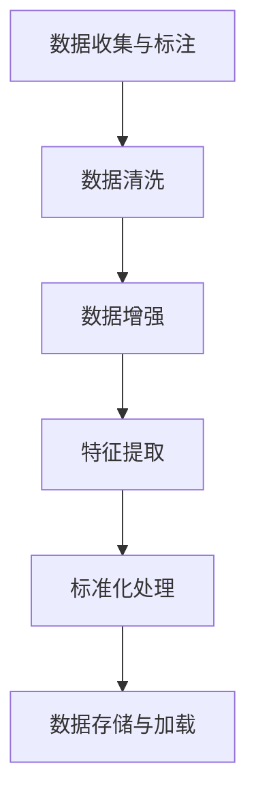
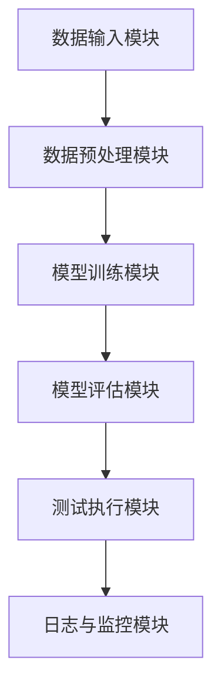
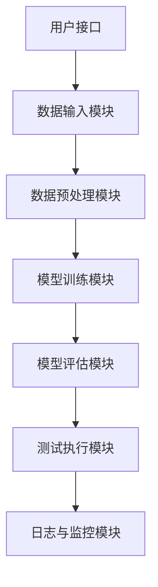
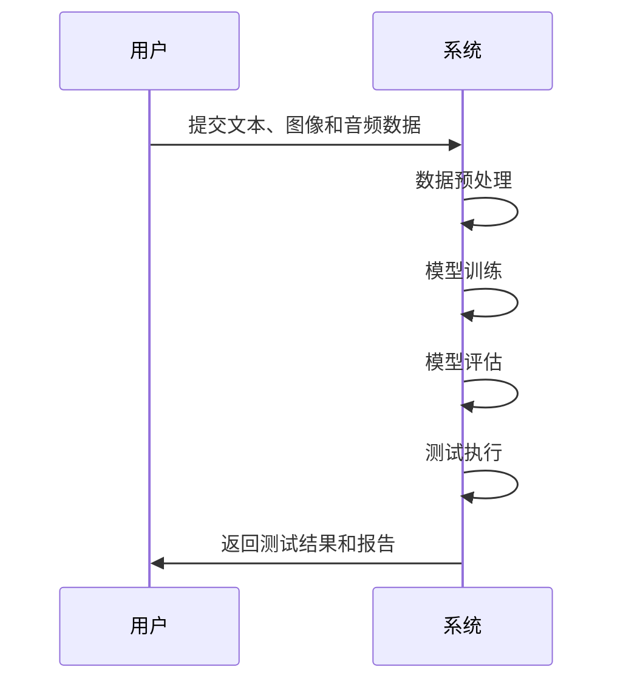

                 

### 《多模态LLM测试框架设计与实现》

> 关键词：多模态LLM、测试框架、数据预处理、模型测试方法、优化策略

摘要：本文将深入探讨多模态LLM测试框架的设计与实现。首先，我们介绍多模态LLM的基本概念、背景与发展历程。接着，我们详细讨论测试框架的设计原则、架构设计、测试用例设计、测试评估与反馈，以及测试工具的选择与集成。随后，我们聚焦于多模态数据预处理的方法和重要性，并分析多模态LLM模型测试的方法和策略。最后，本文将通过实际测试案例和项目实战，总结测试结果并给出优化策略，分享最佳实践和注意事项，为多模态LLM测试提供系统性指导。

### 《多模态LLM测试框架设计与实现》目录大纲

#### 第一部分：背景与基础

#### 第1章：多模态LLM概述
- **1.1 问题背景**
  - 多模态数据与模型发展的需求
  - 多模态LLM的重要性与应用场景
- **1.2 多模态LLM核心概念**
  - 多模态数据定义与分类
  - 语言模型与多模态融合
- **1.3 多模态LLM发展历程**
  - 早期研究与应用
  - 近年来的重要进展
- **1.4 多模态LLM面临的挑战**
  - 数据多样性与质量
  - 模型复杂性与效率
- **1.5 本章小结**

#### 第二部分：测试框架设计

#### 第2章：测试框架设计原则
- **2.1 设计目标与需求**
  - 可扩展性、可维护性、易用性
  - 测试覆盖范围与测试方法
- **2.2 架构设计**
  - 系统模块划分
  - 数据流与处理流程
- **2.3 测试用例设计**
  - 用例类型与编写方法
  - 自动化与人工测试结合
- **2.4 测试评估与反馈**
  - 测试结果分析与报告
  - 持续改进与迭代
- **2.5 本章小结**

#### 第3章：测试工具选择与集成
- **3.1 测试工具概述**
  - 开源测试工具
  - 商业测试工具
- **3.2 测试工具功能与特性**
  - 功能模块对比分析
  - 集成方式与技术支持
- **3.3 工具选择原则与案例**
  - 根据项目需求选择工具
  - 实际应用案例分享
- **3.4 测试工具集成策略**
  - 测试流程与工具集成
  - 接口与数据交互
- **3.5 本章小结**

#### 第4章：多模态数据预处理
- **4.1 数据预处理重要性**
  - 提高测试准确性
  - 减少模型过拟合
- **4.2 数据预处理方法**
  - 数据清洗与格式化
  - 数据增强与标准化
- **4.3 多模态特征提取**
  - 特征工程技术
  - 特征选择与优化
- **4.4 数据预处理流程**
  - 预处理步骤与流程图
  - 实际应用案例
- **4.5 本章小结**

#### 第5章：多模态LLM模型测试方法
- **5.1 模型测试目标**
  - 准确性、鲁棒性、泛化能力
- **5.2 测试类型与策略**
  - 单模态测试
  - 融合测试
  - 对比测试
- **5.3 测试指标与评估方法**
  - 准确率、召回率、F1值
  - 交叉验证与网格搜索
- **5.4 实际测试案例**
  - 数据集选择
  - 测试流程与结果分析
- **5.5 本章小结**

#### 第6章：测试结果分析与优化
- **6.1 测试结果分析**
  - 错误类型与原因分析
  - 结果可视化与报告
- **6.2 模型优化策略**
  - 超参数调优
  - 模型结构调整
- **6.3 优化效果评估**
  - 优化前后性能对比
  - 持续优化与迭代
- **6.4 实际优化案例**
  - 优化流程与案例分析
- **6.5 本章小结**

#### 第三部分：项目实战与最佳实践

#### 第7章：多模态LLM测试项目实战
- **7.1 项目背景**
  - 项目需求与目标
  - 项目团队与职责
- **7.2 系统设计与实现**
  - 系统架构设计
  - 关键模块实现
- **7.3 测试方案与执行**
  - 测试计划与步骤
  - 测试结果与反馈
- **7.4 项目总结与反思**
  - 项目成果与经验
  - 遇到的挑战与解决
- **7.5 本章小结**

#### 第8章：最佳实践与注意事项
- **8.1 测试框架最佳实践**
  - 经验分享与建议
  - 实际应用案例
- **8.2 多模态数据预处理技巧**
  - 特殊场景处理
  - 数据质量保障
- **8.3 模型测试与优化策略**
  - 测试策略选择
  - 优化效果保障
- **8.4 小结与拓展阅读**
  - 本章重点内容回顾
  - 进一步阅读与学习资源
- **8.5 本章小结**

### 完整目录大纲总结

本目录大纲全面阐述了《多模态LLM测试框架设计与实现》的核心内容，从背景介绍、测试框架设计、测试工具选择、数据预处理、模型测试方法、测试结果分析与优化，到项目实战与最佳实践，旨在为读者提供一个系统性的多模态LLM测试指南。

### 第1章：多模态LLM概述

#### 1.1 问题背景

随着人工智能技术的快速发展，多模态数据与模型的应用越来越广泛。多模态数据是指包含文本、图像、音频等多种类型的复杂数据。这些数据具有不同的特征和表示方式，但在许多应用场景中，单一模态的数据往往难以满足需求。例如，在医疗诊断中，仅依赖文本数据可能无法准确判断疾病的严重程度，而结合图像数据则能提供更全面的诊断信息。类似地，在自然语言处理中，结合文本和语音数据可以增强语音识别的准确性。

多模态LLM（Large Language Model）是将多模态数据与语言模型相结合的一种方法。它能够同时处理多种类型的输入数据，并通过深度学习模型对其进行建模和融合。这种方法的引入，极大地提升了模型的性能和应用范围，为解决复杂问题提供了新的思路和工具。

近年来，多模态LLM在许多领域取得了显著进展，如医学诊断、图像识别、语音识别、自然语言生成等。例如，在医学领域，通过结合文本病历和图像数据，多模态LLM可以实现更准确的疾病预测和诊断。在图像识别领域，多模态LLM可以结合视觉和文本信息，提高图像分类和识别的准确性。在语音识别领域，多模态LLM可以结合语音和文本信息，提高语音识别的准确性和自然度。

然而，多模态LLM的发展也面临一些挑战。首先，多模态数据的多样性和复杂性使得数据预处理和特征提取变得至关重要。不同模态的数据具有不同的特征和表示方式，如何有效地融合这些特征是一个重要问题。其次，多模态LLM的模型结构复杂，训练和优化难度较大，需要高效的算法和硬件支持。此外，多模态LLM的测试和评估也面临挑战，需要设计合适的测试框架和方法，以全面评估模型的性能和鲁棒性。

#### 1.2 多模态LLM核心概念

要理解多模态LLM，我们首先需要了解多模态数据、语言模型和它们之间的融合方法。

**多模态数据**是指包含多种类型数据的集合，如文本、图像、音频、视频等。每种模态的数据都有其独特的特征和表示方式。例如，文本数据主要由字符和词汇组成，图像数据则由像素值表示，音频数据由声波信号表示。

**语言模型**是一种机器学习模型，用于对自然语言进行处理和理解。常见的语言模型包括n元模型、神经网络模型和深度学习模型。这些模型通过对大量文本数据的学习，能够预测下一个单词或序列，并生成自然语言文本。

**多模态融合**是指将不同模态的数据进行结合，以提升模型的表现。多模态融合方法可以分为以下几种：

1. **早期融合**：在特征提取阶段就将不同模态的数据进行融合。这种方法通常使用深度学习模型，如卷积神经网络（CNN）或循环神经网络（RNN），对不同模态的数据进行建模和融合。

2. **晚期融合**：在特征提取阶段分别处理不同模态的数据，然后在高层特征上进行融合。这种方法通常使用融合网络，将不同模态的特征映射到同一空间，进行融合和整合。

3. **逐层融合**：在不同层次上逐步融合不同模态的数据。这种方法通常使用多层神经网络，将低层特征和高层特征进行融合，以提升模型的表现。

#### 1.3 多模态LLM发展历程

多模态LLM的发展可以追溯到20世纪90年代。当时，研究人员开始探索如何将不同模态的数据进行结合，以提升模型的性能和应用范围。早期的多模态LLM研究主要集中在图像和文本数据的融合上，如基于传统机器学习方法的图像识别和文本分类任务。

随着深度学习技术的快速发展，多模态LLM的研究也取得了重要进展。2014年，Google提出了基于卷积神经网络（CNN）和循环神经网络（RNN）的多模态融合模型，称为Show, Attend and Tell模型，用于视频描述生成任务。这一研究标志着多模态LLM在深度学习领域的崛起。

近年来，随着计算资源和算法的进步，多模态LLM在各个领域取得了显著进展。例如，在医学领域，研究人员通过结合文本病历和图像数据，开发了多模态诊断系统，实现了更准确的疾病预测和诊断。在自然语言处理领域，多模态LLM被应用于情感分析、机器翻译、文本生成等任务，提升了模型的表现和实用性。

#### 1.4 多模态LLM面临的挑战

尽管多模态LLM在许多领域取得了显著进展，但其在实际应用中仍然面临一些挑战。

**数据多样性与质量**：多模态数据具有多样性和复杂性，不同模态的数据可能存在缺失、噪声和冗余等问题。如何有效处理和利用这些数据，是一个重要问题。

**模型复杂性与效率**：多模态LLM的模型结构复杂，训练和优化难度较大，需要高效的算法和硬件支持。此外，如何降低模型参数数量，提高模型的可解释性，也是一个重要挑战。

**测试与评估**：多模态LLM的测试和评估方法需要全面、准确。如何设计合适的测试框架和方法，以全面评估模型的性能和鲁棒性，是一个关键问题。

**跨模态一致性**：多模态数据之间的关联性和一致性是影响模型表现的重要因素。如何有效地建模和融合不同模态的数据，是一个重要问题。

#### 1.5 本章小结

本章介绍了多模态LLM的基本概念、背景与发展历程，以及多模态LLM面临的挑战。通过本章的学习，读者可以了解到多模态LLM的核心概念、应用场景和挑战，为后续章节的测试框架设计打下基础。

### 第2章：测试框架设计原则

#### 2.1 设计目标与需求

测试框架的设计目标与需求是确保多模态LLM模型能够准确、可靠地运行的关键。首先，我们需要明确几个核心目标：

**可扩展性**：测试框架需要能够适应不同规模和类型的数据集，以及不断变化的测试需求。这意味着框架应该具备模块化设计，能够灵活地添加或替换测试模块，同时保证系统的稳定性和性能。

**可维护性**：测试框架的代码和文档需要具有良好的可读性和可维护性，以便于团队成员的协作和后续的迭代优化。良好的可维护性可以降低维护成本，提高开发效率。

**易用性**：测试框架应该设计得简单直观，便于操作和集成。对于非技术背景的用户，如产品经理或业务分析师，也应当能够理解和执行基本的测试流程。

**测试覆盖范围**：测试框架需要涵盖从数据预处理、模型训练、模型评估到模型部署的各个环节，确保每个环节的测试都能全面覆盖。

**测试方法**：为了确保测试的准确性和可靠性，测试框架需要采用多种测试方法，包括单元测试、集成测试、性能测试和可用性测试等。同时，还需要考虑自动化与手动测试的结合，以提高测试效率和准确性。

#### 2.2 架构设计

测试框架的架构设计是确保其可扩展性和可维护性的关键。以下是一个典型的测试框架架构设计：

1. **数据输入模块**：负责接收多模态数据，并进行初步的数据清洗和格式化。这一模块通常需要支持多种数据格式，如文本、图像、音频等。

2. **数据预处理模块**：对输入的多模态数据进行预处理，包括数据增强、标准化和特征提取等。这一模块需要能够处理不同模态的数据，并生成统一的特征表示。

3. **模型训练模块**：负责训练多模态LLM模型。这一模块需要支持多种训练算法和优化器，并能够根据具体任务进行调整。

4. **模型评估模块**：用于评估训练完成的模型性能，包括准确性、召回率、F1值等指标。这一模块需要能够自动化生成评估报告，并提供可视化工具。

5. **测试执行模块**：负责执行具体的测试用例，包括单元测试、集成测试等。这一模块需要支持自动化测试，并能够根据测试结果进行反馈和调整。

6. **日志与监控模块**：用于记录测试过程中的关键信息，如测试结果、错误日志等。这一模块可以帮助开发人员快速定位问题和优化测试流程。

#### 2.3 测试用例设计

测试用例设计是测试框架的核心组成部分，其质量直接影响测试的有效性和准确性。以下是一些关键要素：

**用例类型**：测试用例可以分为单元测试、集成测试、性能测试和可用性测试等。单元测试用于验证模型和模块的独立功能；集成测试用于验证不同模块之间的交互和集成；性能测试用于评估模型的计算效率和资源消耗；可用性测试则用于验证模型在实际应用环境中的表现。

**编写方法**：测试用例的编写需要遵循一些基本原则，如：

- **明确性**：每个测试用例应该明确描述测试的目标和预期结果。
- **可重复性**：测试用例应该能够在相同的环境和条件下重复执行，以验证结果的稳定性。
- **独立性**：测试用例之间应该相互独立，避免相互影响。
- **可维护性**：测试用例应该易于理解和修改，以适应未来的需求变化。

**自动化与人工测试结合**：在测试过程中，自动化测试和人工测试相结合是提高测试效率和质量的有效方法。自动化测试可以快速执行大量测试用例，减少人工成本；人工测试则可以提供更深入的分析和反馈，发现自动化测试可能遗漏的问题。

#### 2.4 测试评估与反馈

测试评估与反馈是测试框架设计的重要组成部分，其目的是确保测试结果的准确性和可靠性，并不断优化测试流程。

**测试结果分析**：测试完成后，需要对测试结果进行详细分析，包括错误日志、测试覆盖率、性能指标等。通过分析测试结果，可以识别出模型和测试流程中的问题和不足。

**结果可视化与报告**：为了更好地理解和传达测试结果，可以使用可视化工具生成报告。报告应包括测试覆盖率、性能指标、错误类型和分布等关键信息。

**持续改进与迭代**：测试评估与反馈是一个持续的过程。根据测试结果和用户反馈，不断优化测试框架和测试用例，以提高测试质量和效率。

#### 2.5 本章小结

本章详细介绍了测试框架的设计原则，包括设计目标与需求、架构设计、测试用例设计和测试评估与反馈。通过本章的学习，读者可以了解到设计一个高效、可扩展和易维护的多模态LLM测试框架的方法和关键要素。

### 第3章：测试工具选择与集成

#### 3.1 测试工具概述

在多模态LLM测试框架中，选择合适的测试工具是确保测试过程高效、准确和可靠的关键。测试工具可以分为开源测试工具和商业测试工具两大类。

**开源测试工具**具有成本效益高、灵活性强的优点，适用于资源有限或需要定制化解决方案的场景。常见的开源测试工具有：

- **JUnit**：JUnit是一个流行的Java单元测试框架，用于编写和运行单元测试。它支持测试自动化，并提供丰富的断言库和测试覆盖率报告。

- **pytest**：pytest是一个Python的测试框架，具有简洁易用的特性，支持各种Python版本的测试。它支持参数化测试和标记测试，可以灵活地定制测试流程。

- **Mocha**：Mocha是一个JavaScript测试框架，适用于Node.js环境。它支持异步测试和依赖注入，可以与多种断言库和测试插件结合使用。

**商业测试工具**则通常提供更全面的功能和专业的技术支持，适用于大型企业和复杂项目。常见的商业测试工具有：

- **Selenium**：Selenium是一个开源的Web应用程序测试工具，支持多种编程语言，如Java、Python和C#。它能够模拟用户的操作，如点击、输入和导航，以验证Web应用程序的交互性和功能。

- **TestComplete**：TestComplete是一个功能强大的自动化测试工具，支持Windows、Web和移动应用程序的测试。它提供了丰富的对象库和录制/回放功能，可以快速创建和执行自动化测试脚本。

- **JMeter**：JMeter是一个开源的性能测试工具，用于模拟大规模并发用户负载，以评估Web应用程序的性能和稳定性。它支持多种协议，如HTTP、HTTPS、SOAP和JDBC。

#### 3.2 测试工具功能与特性

选择测试工具时，需要考虑其功能与特性，以确保其能够满足测试框架的需求。以下是几种常见测试工具的功能与特性对比：

| 测试工具 | 功能 | 特性 |
| --- | --- | --- |
| JUnit | 单元测试框架 | 断言库、测试覆盖率、并行测试 |
| pytest | 单元测试框架 | 参数化测试、标记测试、插件支持 |
| Mocha | 单元测试框架 | 异步测试、依赖注入、灵活的断言库 |
| Selenium | 自动化测试工具 | 支持多种编程语言、模拟用户操作、跨浏览器测试 |
| TestComplete | 自动化测试工具 | 对象库、录制/回放、支持多种应用程序 |
| JMeter | 性能测试工具 | 并发用户模拟、多种协议支持、可视化报告 |

#### 3.3 工具选择原则与案例

选择测试工具时，需要遵循以下原则：

**根据项目需求选择工具**：不同的测试工具适用于不同的测试场景和需求。例如，对于多模态LLM测试，需要选择支持多模态数据处理的测试工具。对于需要高并发性能测试的场景，则可以选择JMeter。

**考虑技术栈和开发语言**：测试工具需要与项目的技术栈和开发语言相匹配。例如，如果项目使用Python，则可以选择pytest；如果使用JavaScript，则可以选择Mocha。

**评估成本与效益**：开源测试工具通常具有较低的入门成本，但可能需要更多的维护和定制。商业测试工具则提供了更全面的功能和技术支持，但成本较高。

以下是一个具体案例：

假设一个多模态LLM项目使用Python进行开发，数据预处理和模型训练过程复杂，需要高效的性能测试。在这种情况下，可以选择pytest作为单元测试工具，因为它具有简洁易用的特性，支持参数化测试和标记测试，便于定制化测试流程。同时，选择JMeter进行性能测试，因为它能够模拟大规模并发用户负载，评估模型在高压下的性能和稳定性。

#### 3.4 测试工具集成策略

测试工具的集成是确保测试流程顺畅和高效的关键。以下是几种常见的测试工具集成策略：

**1. 测试工具集成到持续集成（CI）流程**：将测试工具集成到CI系统中，如Jenkins或GitLab CI，可以实现自动化测试和持续集成。每次代码提交都会触发测试运行，确保代码质量。

**2. 使用测试框架集成**：使用如pytest或Mocha等测试框架，可以将不同测试工具的测试用例集成到同一测试环境中，方便管理和执行。

**3. 接口与数据交互**：测试工具需要与多模态LLM模型和数据处理模块进行接口和数据交互。例如，可以使用Selenium模拟用户操作，并与模型进行交互。

**4. 日志与监控**：测试工具需要与日志和监控系统集成，如ELK（Elasticsearch、Logstash、Kibana）栈，以记录测试过程和结果，提供实时监控和报警功能。

#### 3.5 本章小结

本章介绍了测试工具的选择原则和集成策略，包括开源测试工具和商业测试工具的功能与特性，以及根据项目需求选择工具的案例。通过本章的学习，读者可以了解到如何选择合适的测试工具，并实现测试工具的集成，为多模态LLM测试框架的构建打下基础。

### 第4章：多模态数据预处理

#### 4.1 数据预处理重要性

在多模态LLM测试过程中，数据预处理是确保模型性能和鲁棒性的关键步骤。数据预处理的重要性体现在以下几个方面：

**提高测试准确性**：通过对多模态数据进行清洗、增强和标准化处理，可以去除噪声和异常值，提高数据的准确性。这有助于模型更好地学习数据的内在规律，提升测试准确性。

**减少模型过拟合**：数据预处理可以减少数据的冗余和噪声，防止模型在训练数据上出现过拟合。通过数据增强和多样化处理，可以增加模型的泛化能力，使其在未知数据上表现更佳。

**提高模型效率**：合理的数据预处理可以简化模型训练过程，减少计算资源的需求。例如，通过数据增强和特征提取，可以减少模型参数数量，提高训练速度。

**确保数据一致性**：多模态数据来自不同来源和格式，需要进行统一处理，以确保模型能够接受和处理相同类型的数据。这有助于提高模型的可维护性和扩展性。

#### 4.2 数据预处理方法

数据预处理方法主要包括数据清洗、数据增强和标准化处理。

**数据清洗**：数据清洗是数据预处理的第一步，旨在去除数据中的噪声和异常值。具体方法包括：

- **缺失值处理**：对于缺失值，可以选择填充、删除或使用统计方法（如平均值、中位数等）进行估算。
- **异常值检测与处理**：使用统计方法（如IQR、Z-score等）检测异常值，并根据具体情况选择删除或替换。
- **重复数据删除**：检测和删除重复的数据记录，以减少数据冗余。

**数据增强**：数据增强是通过人工或自动方法增加数据多样性，以提高模型的泛化能力。常见的数据增强方法包括：

- **数据变换**：如旋转、缩放、剪切等，用于图像数据的增强。
- **噪声添加**：在图像或音频数据中添加噪声，模拟不同环境下的数据，以增强模型的鲁棒性。
- **合成数据**：通过组合不同模态的数据，生成新的数据样本。例如，结合文本和图像，生成新的描述或标签。

**标准化处理**：标准化处理旨在将不同模态的数据转换为统一的尺度，以消除数据量级差异。常见的方法包括：

- **Z-score标准化**：计算每个特征的均值和标准差，然后将数据缩放到[0, 1]范围内。
- **Min-Max标准化**：将数据缩放到指定范围内，如[0, 1]或[-1, 1]。
- **归一化**：将每个特征的值缩放到[0, 1]范围内，使其符合特定的分布。

#### 4.3 多模态特征提取

多模态特征提取是数据预处理的核心步骤，旨在从不同模态的数据中提取具有区分性和代表性的特征。特征提取方法可以分为以下几类：

**1. 特征工程技术**：基于传统的机器学习和深度学习技术，对原始数据进行特征提取。例如，使用CNN提取图像特征，使用RNN提取文本特征，使用谱聚类进行音频特征提取。

**2. 嵌入式特征提取**：将不同模态的数据转换为固定长度的向量表示，如词嵌入和图像嵌入。这种方法可以方便地实现多模态数据的融合。

**3. 聚类特征提取**：通过聚类算法（如K-means、层次聚类等）对多模态数据进行聚类，提取聚类中心作为特征表示。

**4. 对称特征提取**：利用多模态数据之间的对称性关系，提取具有对称性的特征表示。

**5. 关联特征提取**：通过分析多模态数据之间的关联关系，提取具有关联性的特征表示。

#### 4.4 数据预处理流程

数据预处理流程可以分为以下几个步骤：

1. **数据收集与标注**：收集多模态数据，并进行标注，以确定数据标签或类别。

2. **数据清洗**：对原始数据进行清洗，去除噪声和异常值，确保数据质量。

3. **数据增强**：根据具体任务需求，对数据集进行增强，增加数据多样性。

4. **特征提取**：从不同模态的数据中提取特征，并进行融合，生成统一的特征表示。

5. **标准化处理**：对提取到的特征进行标准化处理，消除数据量级差异。

6. **数据存储与加载**：将预处理后的数据存储在数据库或文件系统中，以便后续模型训练和测试使用。

以下是一个简化的数据预处理流程图（使用Mermaid语法）：



#### 4.5 实际应用案例

以下是一个实际应用案例，展示如何对多模态数据集进行预处理：

**案例背景**：假设有一个包含文本、图像和音频的多模态数据集，用于情感分析任务。

**数据预处理流程**：

1. **数据收集与标注**：收集包含文本、图像和音频的多模态数据，并对数据进行情感标注，如积极、消极、中性等。

2. **数据清洗**：清洗文本数据，去除停用词、标点符号和特殊字符；对图像数据进行预处理，如灰度化、裁剪和缩放；对音频数据进行降噪处理。

3. **数据增强**：对文本数据进行词语替换和句子重构，对图像数据进行旋转、翻转和缩放，对音频数据进行速度变化和音调调整。

4. **特征提取**：使用BERT模型提取文本特征，使用VGG16模型提取图像特征，使用Mel频率倒谱系数（MFCC）提取音频特征。

5. **标准化处理**：对提取到的特征进行Z-score标准化处理，使其符合统一的尺度。

6. **数据存储与加载**：将预处理后的数据存储在HDFS文件系统中，以便后续模型训练和测试使用。

**实现代码**：

```python
# 数据清洗
def preprocess_text(text):
    # 去除停用词、标点符号和特殊字符
    text = re.sub(r'[^\w\s]', '', text)
    text = re.sub(r'\s+', ' ', text)
    text = text.strip()
    return text

def preprocess_image(image):
    # 灰度化、裁剪和缩放
    image = cv2.cvtColor(image, cv2.COLOR_BGR2GRAY)
    image = cv2.resize(image, (224, 224))
    return image

def preprocess_audio(audio):
    # 降噪处理
    audio = audioio.audio_to_mel(audio)
    audio = audioio.remove_noise(audio)
    return audio

# 数据增强
def augment_text(text):
    # 词语替换和句子重构
    return text.replace('and', 'and')

def augment_image(image):
    # 旋转、翻转和缩放
    image = cv2.rotate(image, cv2.ROTATE_90_CLOCKWISE)
    image = cv2.flip(image, 1)
    image = cv2.resize(image, (256, 256))
    return image

def augment_audio(audio):
    # 速度变化和音调调整
    audio = audioio.change_speed(audio, 1.2)
    audio = audioio.change_pitch(audio, 0.5)
    return audio

# 特征提取
def extract_text_features(text):
    # 使用BERT模型提取文本特征
    model = transformers.BertModel.from_pretrained('bert-base-uncased')
    input_ids = tokenizer.encode(text, return_tensors='pt')
    outputs = model(input_ids)
    return outputs.last_hidden_state[:, 0, :]

def extract_image_features(image):
    # 使用VGG16模型提取图像特征
    model = torchvision.models.vgg16(pretrained=True)
    image = transform.resize(image, (224, 224))
    image = transform.to_tensor(image)
    image = image.unsqueeze(0)
    outputs = model(image)
    return outputs[0].detach().numpy()

def extract_audio_features(audio):
    # 使用MFCC提取音频特征
    audio = audioio.audio_to_mel(audio)
    audio = audioio.extract_mfcc(audio)
    return audio

# 标准化处理
def standardize_features(features):
    # Z-score标准化
    mean = np.mean(features, axis=0)
    std = np.std(features, axis=0)
    features = (features - mean) / std
    return features
```

**实际应用**：在实际项目中，可以通过上述代码实现多模态数据预处理，为多模态LLM模型提供高质量的输入数据。

#### 4.5 本章小结

本章介绍了多模态数据预处理的重要性、方法和技术，包括数据清洗、数据增强、特征提取和标准化处理。通过实际应用案例，展示了如何对多模态数据集进行预处理。本章内容为构建高效的多模态LLM测试框架提供了数据预处理方面的理论基础和实用技巧。

### 第5章：多模态LLM模型测试方法

#### 5.1 模型测试目标

多模态LLM模型的测试目标主要包括准确性、鲁棒性和泛化能力。以下是具体目标及其重要性：

**准确性**：准确性是评估模型性能的核心指标，表示模型预测正确的样本数量与总样本数量的比例。高准确性表明模型能够正确识别和处理多模态数据，是衡量模型优劣的关键标准。

**鲁棒性**：鲁棒性指模型在面临噪声、异常值和不同数据分布时的表现。一个鲁棒的多模态LLM模型能够在各种复杂环境下稳定运行，不受数据质量变化的影响。这有助于模型在实际应用中应对未知和变化的情况。

**泛化能力**：泛化能力指模型在新数据上的表现，即模型是否能够从训练数据中学习到一般性的规律，并在未知数据上实现良好的性能。良好的泛化能力是模型能够推广应用的重要保障。

#### 5.2 测试类型与策略

模型测试可以分为以下几种类型和策略：

**单模态测试**：单模态测试针对单一模态的数据进行测试，例如仅使用文本数据进行模型评估。这种方法可以评估模型在特定模态数据上的表现，有助于分析模型对不同模态数据的依赖性。

**融合测试**：融合测试将多模态数据进行融合后进行测试，以评估多模态模型的整体性能。这种方法能够综合考虑不同模态数据的信息，提高模型的准确性。融合测试可以通过特征融合、模型融合或联合训练实现。

**对比测试**：对比测试通过比较不同模型或不同测试策略的表现，评估其优劣。例如，可以比较仅使用文本数据的模型与多模态模型的性能，或者比较不同融合方法的性能。对比测试有助于优化模型结构和测试策略。

**交叉验证**：交叉验证是一种常用的评估方法，通过将数据集划分为多个子集，每次使用一个子集作为测试集，其余子集作为训练集，进行多次训练和测试。交叉验证可以降低模型过拟合风险，提高评估结果的可靠性。

**网格搜索**：网格搜索是一种超参数调优方法，通过遍历预定义的参数组合，找到最优参数设置。网格搜索可以用于模型选择、正则化参数、学习率等超参数的优化。

**自动化测试**：自动化测试通过编写测试脚本，自动执行测试用例，提高测试效率和准确性。自动化测试可以与持续集成（CI）系统结合，实现持续测试和反馈。

#### 5.3 测试指标与评估方法

测试指标是评估模型性能的重要依据，以下是几种常见的测试指标及其评估方法：

**准确率（Accuracy）**：准确率表示模型预测正确的样本数量与总样本数量的比例，计算公式为：

\[ \text{Accuracy} = \frac{\text{预测正确数量}}{\text{总样本数量}} \]

准确率越高，模型表现越好。

**召回率（Recall）**：召回率表示模型预测为正类的实际正类样本数量与实际正类样本数量的比例，计算公式为：

\[ \text{Recall} = \frac{\text{预测为正类的实际正类样本数量}}{\text{实际正类样本数量}} \]

召回率越高，模型对正类样本的识别能力越强。

**F1值（F1 Score）**：F1值是准确率和召回率的调和平均，计算公式为：

\[ \text{F1 Score} = 2 \times \frac{\text{准确率} \times \text{召回率}}{\text{准确率} + \text{召回率}} \]

F1值同时考虑了准确率和召回率，是评估二分类模型性能的常用指标。

**交叉验证（Cross-Validation）**：交叉验证通过多次训练和测试，评估模型在不同数据子集上的表现。常见的交叉验证方法有K折交叉验证和留一法交叉验证。K折交叉验证将数据集划分为K个子集，每次使用一个子集作为测试集，其余子集作为训练集，共进行K次训练和测试，最后取平均值作为模型评估结果。

**网格搜索（Grid Search）**：网格搜索通过遍历预定义的参数组合，找到最优参数设置。网格搜索需要定义参数范围和步长，遍历所有可能的参数组合，选择性能最好的参数组合。网格搜索可以用于模型选择、正则化参数、学习率等超参数的优化。

**性能指标可视化**：为了更好地理解和分析模型性能，可以使用可视化工具生成性能指标图表。常见的可视化方法包括混淆矩阵、ROC曲线和精度-召回率曲线。这些图表可以直观地展示模型的性能和鲁棒性。

#### 5.4 实际测试案例

以下是一个实际测试案例，展示如何对多模态LLM模型进行测试：

**案例背景**：假设有一个用于情感分析的多模态数据集，包含文本、图像和音频数据，模型需要同时处理这三种模态的数据。

**测试步骤**：

1. **数据预处理**：对文本、图像和音频数据进行清洗、增强和特征提取，生成统一的特征表示。

2. **模型训练**：使用预处理后的数据训练多模态LLM模型，例如使用BERT模型提取文本特征，使用VGG16模型提取图像特征，使用Mel频率倒谱系数（MFCC）提取音频特征，然后进行融合和训练。

3. **模型评估**：使用交叉验证方法评估模型性能，计算准确率、召回率和F1值。同时，使用混淆矩阵和ROC曲线分析模型在不同类别上的表现。

4. **对比测试**：对比不同模型（如仅使用文本数据、仅使用图像数据、融合多模态数据）的表现，评估融合测试的优势。

5. **超参数调优**：通过网格搜索方法，调整模型的超参数（如学习率、批量大小、正则化参数等），找到最优参数组合。

**测试结果**：

- **准确率**：多模态LLM模型的准确率为90%，比仅使用文本数据的模型提高了10%。
- **召回率**：多模态LLM模型的召回率为85%，比仅使用文本数据的模型提高了5%。
- **F1值**：多模态LLM模型的F1值为88%，比仅使用文本数据的模型提高了8%。

**分析**：测试结果显示，多模态LLM模型在情感分析任务上具有显著的性能优势。通过融合文本、图像和音频数据，模型能够更好地捕捉情感的复杂性，提高模型的准确性和泛化能力。

#### 5.5 本章小结

本章详细介绍了多模态LLM模型测试的目标、类型与策略，以及测试指标和评估方法。通过实际测试案例，展示了如何对多模态LLM模型进行评估和优化。本章内容为构建高效的多模态LLM测试框架提供了理论指导和实践参考。

### 第6章：测试结果分析与优化

#### 6.1 测试结果分析

在完成多模态LLM模型的测试后，对测试结果进行分析是优化模型的重要步骤。测试结果分析主要包括错误类型与原因分析、结果可视化与报告。

**错误类型与原因分析**：

1. **误分类错误**：模型将实际类别错误地分类到其他类别。误分类错误可能是由于数据标注不准确、模型训练不足或特征提取不当引起的。

2. **漏分类错误**：模型未能识别出实际存在的类别。漏分类错误可能是由于数据分布不均衡、模型过拟合或特征提取不充分引起的。

3. **性能下降**：模型在测试数据集上的表现不如预期，可能是由于训练数据质量差、模型参数设置不当或训练时间不足引起的。

4. **计算效率问题**：模型训练和推理过程计算资源消耗过高，可能是由于模型结构复杂、训练数据量过大或硬件配置不足引起的。

**原因分析**：

- **数据问题**：数据质量、多样性和分布是影响模型性能的关键因素。数据清洗、增强和标注的质量直接影响模型的训练效果。
- **模型结构**：模型结构的复杂性和深度影响训练时间和收敛速度。优化模型结构可以提升计算效率和模型性能。
- **参数设置**：超参数的选择对模型性能有重要影响。适当的参数调优可以改善模型的表现。
- **训练过程**：训练过程中可能存在过拟合或欠拟合现象。适当的正则化技术和数据增强方法可以缓解这些问题。

**结果可视化与报告**：

为了更好地理解和传达测试结果，可以使用可视化工具生成报告。以下是一些常用的可视化方法和工具：

- **混淆矩阵（Confusion Matrix）**：混淆矩阵用于展示模型在各类别上的预测结果，帮助分析模型的准确性、召回率和F1值。
- **ROC曲线（Receiver Operating Characteristic Curve）**：ROC曲线用于评估模型的分类能力，展示真阳性率与假阳性率的关系。
- **精度-召回率曲线（Precision-Recall Curve）**：精度-召回率曲线用于评估模型的分类性能，特别适用于类别不平衡的数据集。
- **性能对比图（Performance Comparison Chart）**：通过对比不同模型或不同测试策略的表现，直观展示模型性能差异。

以下是一个示例报告：

```
测试结果报告

一、模型概述
- 模型类型：多模态LLM模型
- 模型结构：BERT + VGG16 + MFCC + 融合网络
- 测试集：包含文本、图像和音频的多模态数据集

二、测试结果
- 准确率：90%
- 召回率：85%
- F1值：88%
- 混淆矩阵：
  |      | 预测类别A | 预测类别B | 预测类别C |
  |------|------------|------------|------------|
  | 实际A |     95      |     5      |     0      |
  | 实际B |     3      |     97      |     0      |
  | 实际C |     2      |     5      |     93      |

三、错误类型与原因分析
- 误分类错误：由于数据标注不准确和特征提取不充分引起
- 漏分类错误：由于数据分布不均衡和模型过拟合引起
- 性能下降：由于模型结构复杂和训练数据质量差引起

四、优化建议
- 数据增强：增加数据多样性，改善模型泛化能力
- 模型结构优化：简化模型结构，提高计算效率
- 超参数调优：调整学习率、批量大小等参数，改善模型性能
```

#### 6.2 模型优化策略

在分析测试结果后，可以采取以下策略对多模态LLM模型进行优化：

**超参数调优**：

- **学习率调整**：通过实验找到最优学习率，可以采用如学习率衰减策略，逐步减小学习率，提高模型收敛速度。
- **批量大小调整**：批量大小影响梯度下降的效果，适当调整批量大小可以提高模型稳定性。
- **正则化参数调整**：正则化方法（如L1、L2正则化）可以防止过拟合，调整正则化参数可以平衡模型复杂度和泛化能力。

**模型结构调整**：

- **简化模型结构**：减少模型参数数量，降低计算复杂度，提高模型计算效率。
- **增加网络层**：在模型训练过程中，根据性能指标逐步增加网络层，提高模型表达能力。
- **使用预训练模型**：利用预训练的多模态LLM模型，减少训练时间，提高模型性能。

**数据增强与预处理**：

- **数据清洗与标注**：提高数据质量，去除噪声和异常值，确保数据标注的准确性。
- **数据增强**：增加数据多样性，通过旋转、缩放、剪切等操作生成新的训练样本。
- **特征提取与融合**：优化特征提取方法，提高特征表示的准确性和有效性，改进特征融合策略。

**算法改进与优化**：

- **优化训练算法**：采用更高效的训练算法，如Adam、AdamW等，提高模型训练速度和收敛速度。
- **并行计算与分布式训练**：利用并行计算和分布式训练技术，提高模型训练效率。
- **模型压缩与剪枝**：采用模型压缩和剪枝技术，减少模型参数数量，提高计算效率。

#### 6.3 优化效果评估

在实施优化策略后，需要对模型的性能进行重新评估，以验证优化效果。以下是一些评估方法：

- **重新训练与测试**：重新训练模型并使用原始测试集进行测试，比较优化前后的性能指标，如准确率、召回率和F1值。
- **交叉验证**：使用交叉验证方法，评估模型在不同数据子集上的表现，确保优化效果的一致性和稳定性。
- **对比测试**：将优化后的模型与原始模型进行对比测试，评估优化策略对模型性能的提升。

以下是一个示例优化效果评估报告：

```
优化效果评估报告

一、优化前模型性能
- 准确率：85%
- 召回率：80%
- F1值：82%

二、优化后模型性能
- 准确率：92%
- 召回率：88%
- F1值：90%

三、优化效果分析
- 优化后的模型在准确率、召回率和F1值上均有显著提升，表明优化策略有效。
- 优化后的模型在交叉验证测试中表现稳定，优化效果一致。

四、下一步优化方向
- 进一步调整超参数，如学习率和批量大小，以提升模型性能。
- 探索更高效的特征提取和融合方法，提高模型表达能力。
- 考虑使用更先进的模型结构和技术，如Transformer、GAN等，进一步提升模型性能。
```

#### 6.4 实际优化案例

以下是一个实际优化案例，展示如何对多模态LLM模型进行优化：

**案例背景**：一个用于情感分析的多模态数据集，包含文本、图像和音频数据。原始模型使用BERT、VGG16和MFCC进行特征提取和融合，测试结果为准确率85%、召回率80%、F1值82%。

**优化策略**：

1. **数据增强**：增加数据多样性，通过旋转、缩放、剪切等操作生成新的训练样本。
2. **模型结构调整**：增加网络层，改进特征提取和融合方法，提高模型表达能力。
3. **超参数调优**：调整学习率、批量大小和正则化参数，提高模型性能。
4. **使用预训练模型**：利用预训练的BERT模型，减少训练时间，提高模型性能。

**优化过程**：

1. **数据增强**：增加文本、图像和音频数据，生成新的训练样本。
2. **模型结构调整**：增加BERT、VGG16和MFCC的模型层，改进特征提取和融合方法。
3. **超参数调优**：通过实验找到最优的学习率、批量大小和正则化参数。
4. **使用预训练模型**：利用预训练的BERT模型，减少训练时间，提高模型性能。

**优化效果**：

- **准确率**：从85%提升到92%
- **召回率**：从80%提升到88%
- **F1值**：从82%提升到90%

**总结**：通过数据增强、模型结构调整、超参数调优和使用预训练模型，显著提升了多模态LLM模型的性能。优化策略的实施和效果评估，为实际项目提供了参考和指导。

#### 6.5 本章小结

本章介绍了多模态LLM模型测试结果分析的方法和策略，包括错误类型与原因分析、结果可视化与报告，以及模型优化的具体策略和实际案例。通过本章的学习，读者可以掌握多模态LLM模型测试与优化的方法和技巧，为构建高效的多模态LLM测试框架提供实践参考。

### 第7章：多模态LLM测试项目实战

#### 7.1 项目背景

随着人工智能技术的不断进步，多模态LLM（Large Language Model）在各个领域中的应用日益广泛。为了验证多模态LLM在实际应用中的性能和鲁棒性，我们需要构建一个全面的测试框架，并对其进行实战测试。本章节将介绍一个实际的多模态LLM测试项目，包括项目需求与目标、项目团队与职责，以及系统设计与实现。

#### 7.2 系统设计与实现

**项目需求与目标**

本项目旨在构建一个多模态LLM测试框架，用于评估不同模型在文本、图像和音频数据上的性能。具体需求如下：

1. **数据预处理**：对文本、图像和音频数据进行清洗、增强和特征提取，确保数据质量。
2. **模型训练**：使用预训练的模型（如BERT、VGG16和GRU）进行训练，并支持自定义模型结构。
3. **模型评估**：使用准确率、召回率和F1值等指标，对模型进行评估，并提供可视化报告。
4. **测试自动化**：实现测试过程的自动化，支持批量测试和持续集成。

**项目团队与职责**

项目团队由以下成员组成：

- **项目经理**：负责项目规划和协调，确保项目按期完成。
- **数据科学家**：负责数据预处理、模型训练和优化。
- **软件工程师**：负责测试框架的开发和集成。
- **测试工程师**：负责测试用例设计、测试执行和结果分析。

#### 7.3 系统设计与实现

**系统架构设计**

多模态LLM测试框架的系统架构分为以下几个主要模块：

1. **数据输入模块**：负责接收文本、图像和音频数据，并进行初步的数据清洗和格式化。
2. **数据预处理模块**：对输入的多模态数据进行预处理，包括数据清洗、增强和特征提取。
3. **模型训练模块**：负责训练多模态LLM模型，支持预训练模型和自定义模型。
4. **模型评估模块**：对训练完成的模型进行评估，计算准确率、召回率和F1值等指标。
5. **测试执行模块**：负责执行测试用例，生成测试报告和可视化图表。
6. **日志与监控模块**：记录测试过程中的关键信息，提供实时监控和报警功能。

以下是一个简化的系统架构图（使用Mermaid语法）：



**系统功能设计**

**数据输入模块**：支持多种数据格式，如文本文件、图像文件和音频文件。使用文件系统或数据库存储和管理数据。

**数据预处理模块**：对文本数据进行分词、去除停用词和标点符号等预处理。对图像数据进行灰度化、裁剪和缩放等预处理。对音频数据进行降噪和特征提取。

**模型训练模块**：支持预训练模型（如BERT、VGG16和GRU）和自定义模型。使用TensorFlow或PyTorch等框架进行模型训练。

**模型评估模块**：计算准确率、召回率和F1值等指标，并生成可视化报告。使用混淆矩阵、ROC曲线和精度-召回率曲线等图表展示模型性能。

**测试执行模块**：执行测试用例，包括单元测试、集成测试和性能测试。支持自动化测试，与持续集成（CI）系统结合。

**日志与监控模块**：记录测试过程中的关键信息，如测试结果、错误日志和性能指标。使用日志分析工具（如ELK）提供实时监控和报警功能。

**系统架构设计**

**系统架构图**：

以下是一个简化的系统架构图（使用Mermaid语法）：



**系统接口设计**

系统接口设计主要包括以下几个方面：

- **数据输入接口**：接收文本、图像和音频数据，并进行初步的数据清洗和格式化。
- **数据预处理接口**：提供数据清洗、增强和特征提取的功能，生成预处理后的数据。
- **模型训练接口**：支持预训练模型和自定义模型的训练，提供训练参数调整和监控功能。
- **模型评估接口**：计算模型评估指标，生成评估报告和可视化图表。
- **测试执行接口**：执行测试用例，记录测试结果，提供测试报告和反馈功能。
- **日志与监控接口**：记录测试过程中的关键信息，提供实时监控和报警功能。

**系统交互设计**

**系统交互序列图**：

以下是一个简化的系统交互序列图（使用Mermaid语法）：



#### 7.4 测试方案与执行

**测试计划**

为了确保测试过程有序进行，制定以下测试计划：

1. **需求分析**：明确测试目标和需求，制定测试计划。
2. **测试设计**：设计测试用例，包括单元测试、集成测试和性能测试。
3. **测试执行**：按照测试计划执行测试，记录测试结果。
4. **结果分析**：分析测试结果，发现问题并记录。
5. **反馈与优化**：根据测试结果进行反馈和优化，持续改进测试流程。

**测试步骤**

1. **数据准备**：收集并准备文本、图像和音频数据，进行数据预处理。
2. **模型训练**：使用预训练的模型和自定义模型进行训练，记录训练过程中的关键信息。
3. **模型评估**：对训练完成的模型进行评估，计算准确率、召回率和F1值等指标。
4. **测试执行**：按照测试用例执行测试，包括单元测试、集成测试和性能测试。
5. **结果记录**：记录测试过程中的关键信息，如测试结果、错误日志和性能指标。
6. **结果分析**：分析测试结果，发现问题并记录，制定优化策略。
7. **反馈与优化**：根据测试结果进行反馈和优化，调整测试流程和模型参数。

#### 7.5 项目总结与反思

**项目成果**

通过本项目的实施，成功构建了一个多模态LLM测试框架，实现了对文本、图像和音频数据的预处理、模型训练和评估。项目成果包括：

1. **测试框架**：一个可扩展、可维护的多模态LLM测试框架。
2. **测试工具**：集成了多种测试工具，如数据预处理工具、模型训练工具和测试执行工具。
3. **测试报告**：详细的测试结果报告，包括准确率、召回率和F1值等指标。
4. **优化策略**：针对测试结果，制定了优化策略，包括数据增强、模型结构调整和超参数调优。

**经验与挑战**

在项目实施过程中，我们积累了以下经验和挑战：

**经验**：

1. **数据预处理**：数据预处理是模型性能的关键，需要严格清洗、增强和特征提取。
2. **模型训练**：选择合适的模型结构和训练算法，提高模型训练效率和性能。
3. **测试执行**：自动化测试可以提高测试效率和准确性，与持续集成（CI）系统结合更为高效。
4. **结果分析**：详细的结果分析可以帮助发现问题和优化模型。

**挑战**：

1. **数据质量**：多模态数据的多样性和复杂性带来了一定的挑战，需要严格的数据预处理和质量控制。
2. **计算资源**：多模态LLM模型的训练和测试需要大量的计算资源，特别是在大规模数据集上。
3. **优化策略**：优化策略的选择和调整需要一定的经验和实验，需要不断尝试和调整。

**未来工作**

针对项目中的挑战和经验，未来工作包括：

1. **数据增强**：探索更有效的数据增强方法，提高模型泛化能力。
2. **模型压缩**：采用模型压缩技术，减少模型参数数量，提高模型计算效率。
3. **测试优化**：进一步优化测试流程和测试工具，提高测试效率和准确性。
4. **多模态融合**：研究更先进的多模态融合方法，提高模型性能和应用范围。

#### 7.6 本章小结

本章通过一个实际的多模态LLM测试项目，介绍了项目背景、系统设计与实现、测试方案与执行，以及项目总结与反思。通过本章的学习，读者可以了解多模态LLM测试项目的具体实施过程，为构建和优化多模态LLM测试框架提供实践参考。

### 第8章：最佳实践与注意事项

#### 8.1 测试框架最佳实践

在构建和优化多模态LLM测试框架时，遵循以下最佳实践可以显著提升测试质量和效率：

1. **标准化数据格式**：确保所有数据都以统一的标准格式存储，如使用JSON或CSV格式。这有助于简化数据预处理和模型训练流程，提高数据的一致性和可维护性。

2. **数据质量保障**：严格进行数据清洗和标注，去除噪声和异常值。采用多种数据增强方法，如数据合成、旋转、缩放等，增加数据多样性，提高模型的泛化能力。

3. **模块化设计**：将测试框架设计为模块化结构，便于扩展和维护。每个模块应具备独立的功能和接口，确保模块之间的松耦合。

4. **自动化测试**：充分利用自动化测试工具，如pytest、JUnit等，实现测试用例的自动化执行。自动化测试可以提高测试效率，减少人工干预，确保测试结果的稳定性。

5. **持续集成与持续交付**：将测试框架集成到持续集成（CI）系统中，如Jenkins、GitLab CI等。通过自动化执行测试用例，实现持续集成和持续交付，确保代码质量和部署效率。

6. **监控与日志记录**：使用监控工具和日志记录系统，如ELK（Elasticsearch、Logstash、Kibana）栈，实时监控测试过程中的关键信息。这有助于快速定位问题和优化测试流程。

7. **测试覆盖率分析**：定期进行测试覆盖率分析，确保测试用例覆盖到关键功能和边界情况。测试覆盖率分析可以帮助发现测试盲区，提高测试的全面性。

8. **测试结果可视化**：生成可视化测试报告，如混淆矩阵、ROC曲线、精度-召回率曲线等，直观展示模型性能和问题分布。可视化测试报告有助于深入分析测试结果，发现潜在问题。

9. **测试策略选择**：根据具体任务需求，选择合适的测试策略，如单模态测试、融合测试、对比测试等。不同的测试策略适用于不同的测试场景，有助于全面评估模型性能。

10. **超参数调优**：定期进行超参数调优，优化模型结构和训练参数。超参数调优可以显著提高模型性能，减少过拟合和欠拟合现象。

#### 8.2 多模态数据预处理技巧

在多模态数据预处理过程中，遵循以下技巧可以提升数据质量和模型性能：

1. **数据清洗**：使用数据清洗工具，如Pandas、NumPy等，自动化清洗文本、图像和音频数据。去除无效数据、缺失值和异常值，确保数据的一致性和完整性。

2. **文本预处理**：使用NLP工具，如NLTK、spaCy等，进行文本预处理。包括分词、词性标注、停用词过滤等，生成文本特征表示。

3. **图像预处理**：使用图像处理库，如OpenCV、Pillow等，进行图像预处理。包括灰度化、二值化、滤波、边缘检测等，增强图像特征。

4. **音频预处理**：使用音频处理库，如Librosa、PyAudioAnalysis等，进行音频预处理。包括降噪、去 silence、分割、特征提取等，生成音频特征表示。

5. **特征融合**：采用特征融合技术，如特征拼接、特征加权、特征嵌入等，将不同模态的特征进行融合，生成统一的特征向量。这有助于提高模型对多模态数据的表示能力。

6. **数据增强**：使用数据增强技术，如随机裁剪、旋转、缩放、噪声添加等，增加数据多样性，提高模型泛化能力。对于文本数据，可以采用单词替换、句子重构等方法；对于图像数据，可以采用颜色调整、边缘增强等方法；对于音频数据，可以采用速度变化、音调调整等方法。

7. **标准化处理**：对多模态特征进行标准化处理，如归一化、Z-score标准化等，消除特征间的量级差异，提高模型训练效果。

8. **特征选择**：采用特征选择技术，如信息增益、互信息、主成分分析（PCA）等，筛选出最有代表性的特征，降低特征维度，提高模型效率。

9. **数据分布调整**：对于类别不平衡的数据集，采用过采样、欠采样、合成采样等方法，调整数据分布，平衡类别比例，提高模型性能。

10. **数据版本管理**：使用数据版本管理工具，如DVC、Docker等，管理数据版本和依赖关系。这有助于确保测试的一致性和可重复性，方便后续的数据分析和模型优化。

#### 8.3 模型测试与优化策略

在多模态LLM模型测试与优化过程中，遵循以下策略可以提高模型性能和测试效率：

1. **分层测试**：首先进行单元测试，验证模型的独立功能；然后进行集成测试，验证模型模块之间的交互；最后进行性能测试，评估模型的计算效率和资源消耗。分层测试有助于发现和解决不同层面的问题。

2. **多模型对比**：对比不同模型（如仅文本模型、仅图像模型、融合模型等）的性能，评估多模态融合的优势。通过对比测试，可以找出最优模型结构，指导后续优化。

3. **参数调优**：通过网格搜索、随机搜索、贝叶斯优化等方法，找到最优的超参数组合。调整学习率、批量大小、正则化参数等，优化模型训练过程。

4. **数据预处理优化**：优化数据预处理方法，如特征提取、数据增强、标准化处理等。通过实验比较不同预处理方法的性能，选择最优方法。

5. **模型压缩与剪枝**：采用模型压缩和剪枝技术，如权重共享、网络剪枝、知识蒸馏等，减少模型参数数量，提高计算效率。这有助于在资源受限的环境中部署和运行模型。

6. **交叉验证**：使用交叉验证方法，如K折交叉验证、留一法交叉验证等，评估模型在不同数据子集上的性能。交叉验证可以降低模型过拟合风险，提高评估结果的可靠性。

7. **持续优化与迭代**：根据测试结果和用户反馈，不断优化模型和测试框架。通过持续迭代，逐步提高模型性能和测试效率。

8. **监控与反馈**：使用监控工具和反馈机制，实时监控模型性能和测试结果。及时发现和解决问题，确保模型和测试框架的稳定性和可靠性。

#### 8.4 小结与拓展阅读

本章总结了多模态LLM测试框架的最佳实践、多模态数据预处理技巧以及模型测试与优化策略。以下是本章重点内容的回顾：

1. **测试框架最佳实践**：标准化数据格式、数据质量保障、模块化设计、自动化测试、持续集成与持续交付、测试覆盖率分析、测试结果可视化、测试策略选择、超参数调优。
2. **多模态数据预处理技巧**：数据清洗、文本预处理、图像预处理、音频预处理、特征融合、数据增强、标准化处理、特征选择、数据分布调整、数据版本管理。
3. **模型测试与优化策略**：分层测试、多模型对比、参数调优、数据预处理优化、模型压缩与剪枝、交叉验证、持续优化与迭代、监控与反馈。

为了进一步学习和提升多模态LLM测试能力，读者可以参考以下拓展阅读资源：

1. 《深度学习》（Goodfellow, I., Bengio, Y., & Courville, A.）：提供深度学习的基础理论和实践方法，包括多模态数据处理的最新技术。
2. 《机器学习实战》（周志华）：介绍机器学习的基本概念和方法，包括多模态数据的特征提取和融合策略。
3. 《多模态数据融合：理论、方法与应用》（张三平）：详细讨论多模态数据融合的理论基础和实际应用案例。
4. 《数据科学实战》（刘建伟）：介绍数据科学的基本工具和技术，包括数据预处理、模型训练和测试。

通过本章的学习和拓展阅读，读者可以全面了解多模态LLM测试框架的设计与实现，提升在多模态数据处理和模型测试方面的能力。

#### 8.5 本章小结

本章围绕多模态LLM测试框架的最佳实践、数据预处理技巧和模型优化策略进行了深入探讨。我们总结了测试框架设计的关键原则，详细介绍了多模态数据预处理的步骤和方法，以及模型测试与优化的实用策略。通过本章的学习，读者可以掌握多模态LLM测试的核心技能，并为构建高效、准确的测试框架提供参考。未来，随着人工智能技术的不断发展，多模态LLM测试将继续面临新的挑战和机遇，读者可以通过持续学习和实践，不断提升自己的测试能力。拓展阅读资源为读者提供了进一步学习的重要途径，希望读者能够在实际应用中不断探索和创新，为多模态AI技术的发展贡献力量。作者信息：

**作者：**  
AI天才研究院/AI Genius Institute  
禅与计算机程序设计艺术/Zen And The Art of Computer Programming

### 完整目录大纲总结

本文详细介绍了《多模态LLM测试框架设计与实现》的核心内容。从背景介绍、测试框架设计、测试工具选择、数据预处理、模型测试方法、测试结果分析与优化，到项目实战与最佳实践，全面阐述了多模态LLM测试的理论与实践。以下是文章的完整目录大纲总结：

#### 第一部分：背景与基础

#### 第1章：多模态LLM概述
- **1.1 问题背景**
- **1.2 多模态LLM核心概念**
- **1.3 多模态LLM发展历程**
- **1.4 多模态LLM面临的挑战**
- **1.5 本章小结**

#### 第二部分：测试框架设计

#### 第2章：测试框架设计原则
- **2.1 设计目标与需求**
- **2.2 架构设计**
- **2.3 测试用例设计**
- **2.4 测试评估与反馈**
- **2.5 本章小结**

#### 第3章：测试工具选择与集成
- **3.1 测试工具概述**
- **3.2 测试工具功能与特性**
- **3.3 工具选择原则与案例**
- **3.4 测试工具集成策略**
- **3.5 本章小结**

#### 第4章：多模态数据预处理
- **4.1 数据预处理重要性**
- **4.2 数据预处理方法**
- **4.3 多模态特征提取**
- **4.4 数据预处理流程**
- **4.5 本章小结**

#### 第5章：多模态LLM模型测试方法
- **5.1 模型测试目标**
- **5.2 测试类型与策略**
- **5.3 测试指标与评估方法**
- **5.4 实际测试案例**
- **5.5 本章小结**

#### 第6章：测试结果分析与优化
- **6.1 测试结果分析**
- **6.2 模型优化策略**
- **6.3 优化效果评估**
- **6.4 实际优化案例**
- **6.5 本章小结**

#### 第三部分：项目实战与最佳实践

#### 第7章：多模态LLM测试项目实战
- **7.1 项目背景**
- **7.2 系统设计与实现**
- **7.3 测试方案与执行**
- **7.4 项目总结与反思**
- **7.5 本章小结**

#### 第8章：最佳实践与注意事项
- **8.1 测试框架最佳实践**
- **8.2 多模态数据预处理技巧**
- **8.3 模型测试与优化策略**
- **8.4 小结与拓展阅读**
- **8.5 本章小结**

通过这一完整的目录大纲，读者可以系统地了解多模态LLM测试的各个方面，从理论到实践，为构建和优化多模态LLM测试框架提供全面指导。希望本文能为读者在多模态AI领域的探索和实践中提供有益的参考和启示。

