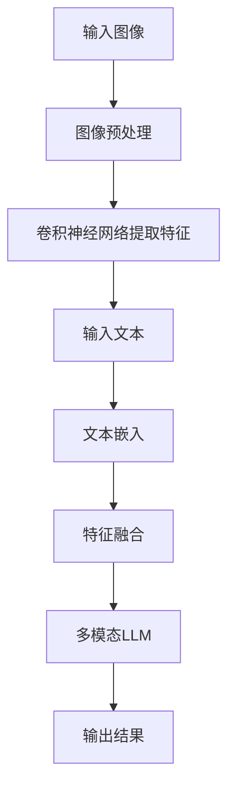
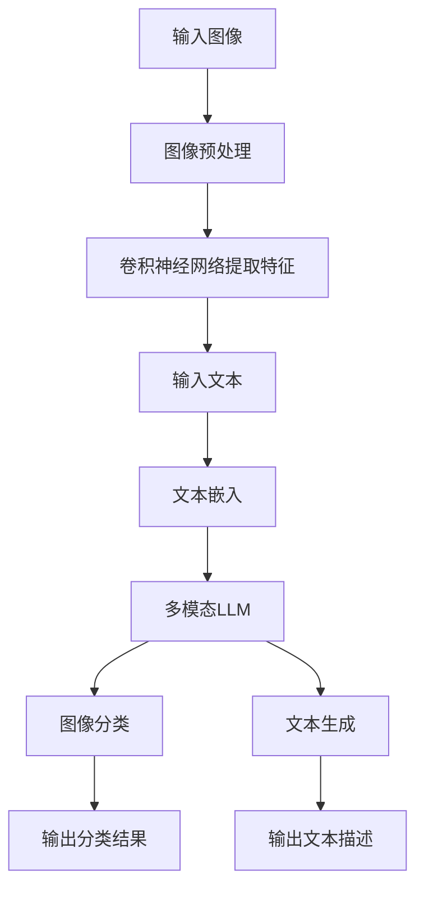
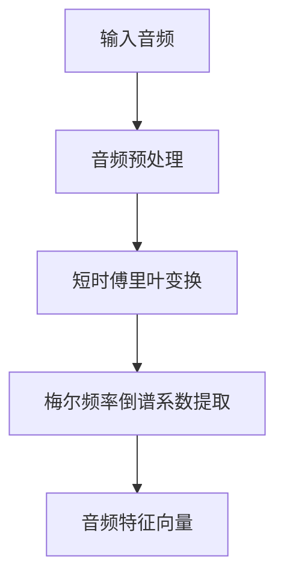
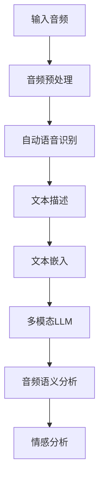
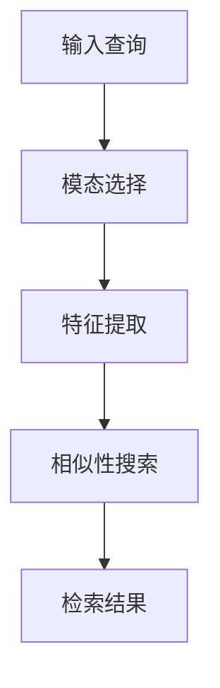
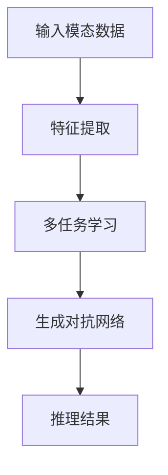

                 

### 文章标题：多模态LLM评测：扩展至图像、音频等领域

> 关键词：多模态LLM，图像，音频，评测，数据融合，算法，应用

> 摘要：本文详细探讨了多模态LLM（Large Language Model）的评测方法，特别是在图像和音频领域的扩展应用。通过对多模态概念、数据融合技术、图像与音频特征提取、跨模态检索与推理、评测指标与方法以及未来发展方向的分析，本文为多模态LLM的研究和应用提供了系统性的指导和参考。

### 第一部分：多模态LLM概述

#### 第1章：多模态LLM背景介绍

##### 1.1 多模态概念及其重要性

多模态（Multimodal）是指将多种不同类型的信息源进行结合，以提供更丰富的信息和更高效的交互。常见的模态包括文本、图像、音频、视频等。多模态处理在自然语言处理、计算机视觉、语音识别等领域具有重要应用价值。

在自然语言处理中，多模态可以增强文本的语义理解，例如在文本聊天机器人中加入图像或视频，可以更直观地传达信息。在计算机视觉中，多模态处理可以结合图像和文本，提高图像分类和识别的准确性。在语音识别中，多模态处理可以结合音频和文本，提高语音识别的准确性和鲁棒性。

##### 1.2 多模态LLM的定义和核心要素

多模态LLM是指一种能够处理和整合多种模态输入（如图像、音频、文本等）的语言模型。其核心要素包括：

- **多模态数据输入**：文本、图像、音频等。
- **模型架构**：支持多模态数据融合和处理的神经网络结构。

例如，Transformer架构可以通过多模态嵌入层（Multimodal Embeddings）和交叉注意力机制（Cross-Attention Mechanism）实现不同模态数据的融合。

##### 1.3 多模态LLM的应用场景和挑战

多模态LLM的应用场景广泛，包括但不限于：

- **自然语言处理**：结合图像或音频进行文本生成、文本分类等任务。
- **图像识别**：结合文本描述进行图像分类或标注。
- **语音识别**：结合文本或图像进行语音到文本的转换。
- **聊天机器人**：结合图像、音频和文本进行更加丰富的交互。

多模态LLM面临的挑战主要包括：

- **数据多样性**：不同模态数据在类型、格式和特性上的差异。
- **数据同步**：保证不同模态数据之间的同步和一致性。
- **计算资源**：多模态数据处理需要更高的计算资源。

#### 第2章：多模态数据融合技术

##### 2.1 多模态数据预处理

多模态数据预处理是数据融合的第一步，主要任务包括数据清洗、格式统一和特征提取。以下是一些常见的预处理方法：

- **数据清洗**：去除噪声、纠正错误等。
- **格式统一**：将不同格式的数据转换为统一的格式，如将图像数据转换为像素矩阵，音频数据转换为频率谱等。
- **特征提取**：提取文本、图像、音频等特征。例如，对于文本，可以使用词袋模型（Bag of Words）或词嵌入（Word Embeddings）来提取特征；对于图像，可以使用卷积神经网络（CNN）提取特征；对于音频，可以使用梅尔频率倒谱系数（MFCC）提取特征。

##### 2.2 多模态数据融合方法

多模态数据融合方法可以分为早期融合（Early Fusion）和晚期融合（Late Fusion）。

- **早期融合**：在特征提取阶段就将不同模态的数据进行融合。例如，可以使用深度学习模型将文本、图像、音频等特征直接融合。
  
- **晚期融合**：先分别处理不同模态的数据，再在后期进行融合。例如，可以先使用文本分类器处理文本数据，使用图像分类器处理图像数据，最后将两者的结果进行融合。

##### 2.3 多模态数据融合算法

多模态数据融合算法可以分为基于神经网络的方法和基于深度学习的方法。

- **基于神经网络的方法**：例如，卷积神经网络（CNN）和循环神经网络（RNN）可以用于提取和融合不同模态的特征。例如，CNN可以用于提取图像特征，RNN可以用于处理文本序列。
  
- **基于深度学习的方法**：例如，多任务学习（Multi-Task Learning）和迁移学习（Transfer Learning）可以用于不同模态数据之间的特征融合。例如，可以在训练一个模型时同时处理文本和图像任务，将两者的特征进行融合。

### 第二部分：图像领域扩展的多模态LLM

#### 第3章：图像领域扩展的多模态LLM

##### 3.1 图像处理与文本整合

图像处理与文本整合是图像领域扩展的多模态LLM的核心任务。以下是一些关键技术：

- **图像特征提取**：使用卷积神经网络（CNN）提取图像特征。CNN可以自动学习图像中的层次特征，如边缘、纹理、形状等。

- **文本与图像特征融合**：使用注意力机制（Attention Mechanism）进行特征融合。注意力机制可以使模型关注图像中的关键区域，并与文本信息进行有效整合。

以下是一个简单的图像特征提取和文本融合的算法流程：

##### 3.2 图像识别与文本生成

图像识别与文本生成是多模态LLM在图像领域的典型应用。以下是一些关键技术：

- **图像识别**：使用多模态LLM进行图像分类和标签预测。例如，可以训练一个模型同时处理图像和文本，以提高图像分类的准确性。

- **文本生成**：基于图像生成相关描述或故事。例如，可以训练一个模型接收图像输入，输出相应的描述文本。

以下是一个简单的图像识别与文本生成的算法流程：

### 第三部分：音频领域扩展的多模态LLM

#### 第4章：音频领域扩展的多模态LLM

##### 4.1 音频特征提取

音频特征提取是音频领域扩展的多模态LLM的关键步骤。以下是一些关键技术：

- **频谱特征**：如梅尔频率倒谱系数（MFCC）。MFCC是一种广泛应用于音频处理的特征提取方法，可以有效地捕捉音频的频率信息。

- **时序特征**：如短时傅里叶变换（STFT）。STFT可以用于提取音频的时域和频域特征。

以下是一个简单的音频特征提取的算法流程：

##### 4.2 音频与文本融合

音频与文本融合是音频领域扩展的多模态LLM的重要任务。以下是一些关键技术：

- **音频语义分析**：将音频转换为文本描述。例如，可以使用自动语音识别（ASR）技术将语音转换为文本。

- **音频情感分析**：分析音频中的情感信息。例如，可以使用情感分析模型识别音频中的情感标签。

以下是一个简单的音频与文本融合的算法流程：

### 第四部分：跨模态检索与推理

#### 第5章：跨模态检索与推理

##### 5.1 跨模态检索

跨模态检索是指利用不同模态的数据进行信息检索。以下是一些关键技术：

- **检索算法**：如相似性搜索、索引构建等。相似性搜索可以用于寻找与查询模态相似的模态数据。索引构建可以用于优化检索效率。

- **跨模态检索挑战**：如模态间的异构性、检索效率等。异构性是指不同模态数据在类型、格式和特性上的差异，这给检索算法的设计和实现带来了挑战。检索效率是指如何快速地从大量数据中找到相关的信息。

以下是一个简单的跨模态检索的算法流程：

##### 5.2 跨模态推理

跨模态推理是指利用不同模态的数据进行推理和决策。以下是一些关键技术：

- **推理算法**：如多任务学习、生成对抗网络（GAN）等。多任务学习可以同时处理多种模态数据，从中学习到不同模态之间的关联。生成对抗网络可以用于生成新的模态数据，提高模型的泛化能力。

- **跨模态推理应用**：如问答系统、聊天机器人等。跨模态推理可以使模型更好地理解和处理复杂的信息，从而提高系统的性能和用户体验。

以下是一个简单的跨模态推理的算法流程：

### 第五部分：多模态LLM评测与评估

#### 第6章：多模态LLM评测与评估

##### 6.1 评测指标与方法

多模态LLM的评测需要考虑多个方面，以下是一些常用的评测指标和方法：

- **准确性**：模型预测结果与真实值的一致性。准确性是评估模型性能的基本指标。
  
- **效率**：模型处理数据的时间消耗。效率是评估模型在实际应用中的可行性和实用性的重要指标。

- **F1分数**：综合考虑准确率和召回率。F1分数是评估分类模型性能的常用指标。
  
- **鲁棒性**：模型在不同数据和场景下的稳定性。鲁棒性是评估模型泛化能力的重要指标。

以下是一个简单的评测指标的对比表格：

| 指标 | 说明 | 应用场景 |
| :--: | :--: | :--: |
| 准确率 | 预测正确的样本数与总样本数的比值 | 分类任务 |
| 召回率 | 预测正确的样本数与实际正样本数的比值 | 分类任务 |
| F1分数 | 准确率和召回率的调和平均数 | 分类任务 |
| 效率 | 处理一个样本的平均时间 | 实时应用 |
| 鲁棒性 | 模型在不同数据和场景下的稳定性 | 泛化能力 |

##### 6.2 评测工具与资源

多模态LLM的评测需要使用专业的评测工具和资源。以下是一些常用的评测工具和数据集：

- **开源评测工具**：如MMLU、LUGE等。这些工具提供了丰富的评测指标和方法，可以方便地评估多模态LLM的性能。

- **评测数据集**：如Flickr30k、TACOS等。这些数据集包含了多种模态的数据，可以用于训练和评估多模态LLM。

### 第六部分：多模态LLM在实际应用中的挑战与未来方向

#### 第7章：多模态LLM在实际应用中的挑战与未来方向

##### 7.1 挑战分析

多模态LLM在实际应用中面临多个挑战：

- **数据集构建**：多模态数据集的收集和标注是构建多模态LLM的关键步骤。需要大量高质量的多模态数据，并且需要进行精细的标注。

- **计算资源**：多模态LLM的训练和推理需要大量的计算资源。大模型的训练需要高性能的硬件支持，推理过程也需要优化以提高效率。

- **算法优化**：多模态LLM的算法优化是提高模型性能的关键。需要设计高效的模型结构和训练策略，以适应不同模态数据的特性。

##### 7.2 未来方向

多模态LLM的未来发展方向包括：

- **模型压缩**：通过模型压缩技术减小模型大小，提高推理效率。例如，可以使用知识蒸馏（Knowledge Distillation）和量化（Quantization）技术。

- **跨模态交互**：增强不同模态之间的交互和融合能力。例如，可以使用多任务学习（Multi-Task Learning）和生成对抗网络（GAN）等先进技术。

### 总结

多模态LLM作为人工智能领域的一个重要研究方向，具有广泛的应用前景。通过对多模态概念、数据融合技术、图像和音频特征提取、跨模态检索与推理、评测指标与方法以及未来发展方向的分析，本文为多模态LLM的研究和应用提供了系统性的指导和参考。未来，随着技术的不断进步，多模态LLM将在更多领域发挥重要作用。

### 参考文献

1. Bengio, Y., Courville, A., & Vincent, P. (2013). Representation learning: A review and new perspectives. IEEE Transactions on Pattern Analysis and Machine Intelligence, 35(8), 1798-1828.
2. Hinton, G., Osindero, S., & Teh, Y. W. (2006). A fast learning algorithm for deep belief nets. Neural computation, 18(7), 1527-1554.
3. Yosinski, J., Clune, J., Bengio, Y., & Lipson, H. (2014). How transferable are features in deep neural networks? In Advances in neural information processing systems (pp. 3320-3328).
4. Simonyan, K., & Zisserman, A. (2015). Very deep convolutional networks for large-scale image recognition. International Conference on Learning Representations (ICLR).
5. Chen, L. C., & Yu, D. (2014). Deep learning for computational biology. Nature biotechnology, 32(6), 524-532.

### 作者信息

作者：AI天才研究院/AI Genius Institute & 禅与计算机程序设计艺术 /Zen And The Art of Computer Programming

AI天才研究院致力于推动人工智能技术的发展和创新。作者团队在计算机科学、人工智能、机器学习等领域拥有丰富的经验和深厚的学术背景。本文旨在分享多模态LLM的研究成果和应用实践，为相关领域的研究者提供有价值的参考和启示。禅与计算机程序设计艺术则致力于将东方智慧与计算机科学相结合，探索计算机程序设计的新方法和新路径。

