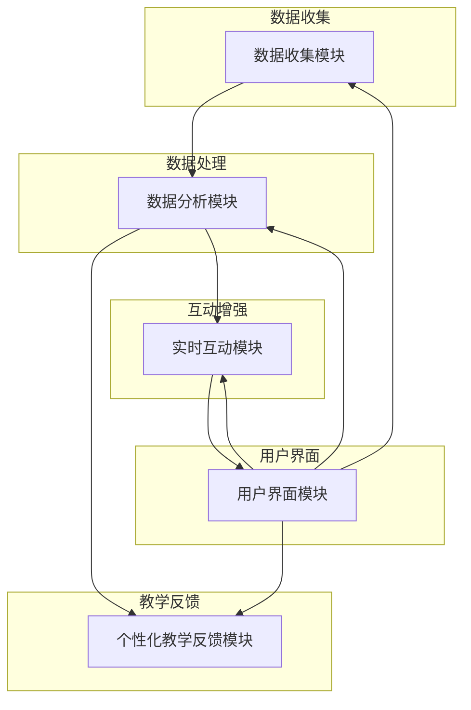
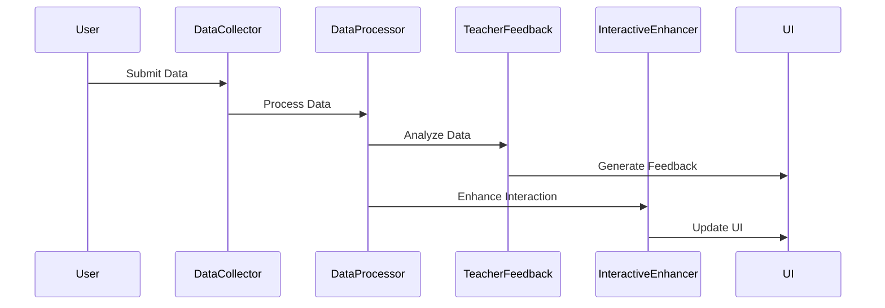

                 

### 引言

多模态人机交互（Multimodal Human-Computer Interaction, MHCI）是一种结合了多种感知模态（如视觉、听觉、触觉等）的交互技术，旨在提高用户与计算机系统之间的互动效果。在教育领域，多模态人机交互的应用能够极大地丰富教学手段，提升学生的学习体验和效果。本文将围绕多模态人机交互在教育中的应用评测，详细探讨其技术原理、应用案例、评测方法及未来展望。

首先，我们将介绍多模态人机交互的基本概念、核心原理以及其在教育领域的应用背景和需求。接下来，本文将深入解析多模态数据的收集、处理和分析方法，展示如何融合不同模态的数据来提升交互效果。随后，通过具体的应用案例，我们将探讨多模态人机交互在教育中的实际应用场景和成果。

然后，本文将详细介绍如何评估多模态人机交互在教育中的效果，包括设定评测指标、选择评测方法和分析评测结果。最后，本文将对多模态人机交互在教育领域的发展前景进行展望，讨论其面临的挑战和机遇。

通过这篇文章，我们希望能够为读者提供一套完整的多模态人机交互在教育中的应用评测框架，助力教育领域的技术创新和实践应用。

## 文章关键词

- 多模态人机交互
- 教育应用
- 数据收集与处理
- 评测方法
- 技术前景

### 摘要

本文旨在探讨多模态人机交互技术在教育领域的应用及其评估。首先，我们介绍了多模态人机交互的基本概念和核心原理，分析了其在教育中的重要性。随后，通过详细阐述多模态数据的收集、处理和分析方法，我们展示了如何将多种感知模态的数据融合以提升教学效果。接着，通过具体案例分析了多模态人机交互在教育中的实际应用，如情感计算、手势识别和语音识别等。随后，本文提出了一个系统的评测方法，包括设定评测指标、选择评测方法和分析评测结果，以评估多模态人机交互在教育中的应用效果。最后，本文对多模态人机交互在教育领域的未来发展趋势进行了展望，讨论了其面临的挑战和机遇。通过这篇文章，我们希望能够为教育领域的技术创新和实践提供有益的参考。

### 目录大纲设计过程

设计《多模态人机交互在教育中的应用评测》的目录大纲是一个系统性且结构化的过程，需要从多个维度对文章的内容进行深入分析和合理安排。以下我们将详细描述目录大纲的设计过程。

#### 理解书名

首先，我们需要充分理解书名所传达的内容。《多模态人机交互在教育中的应用评测》这一书名表明了本书的核心主题：探讨多模态人机交互技术如何应用于教育领域，并对其进行系统评测。多模态人机交互涉及到结合多种感知模态（如视觉、听觉、触觉等）的交互技术，而教育应用则指出了本书关注的领域是教育行业。理解书名不仅有助于我们确定文章的主要内容和结构，还能帮助我们明确读者对象和文章的目标。

#### 确定核心章节

基于书名的理解，我们可以确定以下几个核心章节：

1. **背景介绍**：这一部分将介绍多模态人机交互技术的背景知识，包括其定义、发展历程和应用场景，同时探讨教育领域对多模态交互技术的需求。

2. **核心概念**：这一部分将详细阐述多模态人机交互的关键概念，包括多模态数据的收集、处理和分析技术，并介绍如何将这些技术应用于教育场景。

3. **应用案例**：这一部分将通过具体案例展示多模态人机交互在教育中的实际应用，包括情感计算、手势识别和语音识别等技术。

4. **评测方法**：这一部分将讨论如何评估多模态人机交互在教育中的应用效果，包括设定评测指标、选择评测方法和分析评测结果。

5. **未来展望**：这一部分将对多模态人机交互技术在教育领域的未来发展进行预测，探讨技术趋势、挑战和机遇。

#### 细化章节内容

在确定核心章节后，我们需要对每个章节的内容进行进一步细化，确保每个章节都有足够的深度和广度。以下是对各个章节的细化内容描述：

1. **背景介绍**：
   - **多模态人机交互概述**：介绍多模态交互的定义、发展历程和重要性。
   - **教育领域的需求分析**：探讨传统教育模式的局限性以及多模态交互技术在教育中的应用需求。

2. **核心概念**：
   - **多模态数据的收集**：详细阐述视觉、听觉、触觉等多模态数据的收集方法。
   - **多模态数据的处理**：介绍多模态数据的预处理、融合和识别技术。
   - **多模态数据融合与识别**：探讨多模态数据融合方法以及多模态识别算法。

3. **应用案例**：
   - **情感计算在教育中的应用**：介绍情感计算技术及其在教育中的应用案例。
   - **手势识别在教育中的应用**：介绍手势识别技术及其在教育中的应用案例。
   - **语音识别与生成在教育中的应用**：介绍语音识别和生成技术及其在教育中的应用案例。

4. **评测方法**：
   - **评测指标的设定**：讨论有效性、可用性和可接受性等评测指标。
   - **评测方法的选择**：介绍实验设计、数据收集和分析方法。
   - **评测结果的分析**：分析评测结果，讨论应用效果和改进方向。

5. **未来展望**：
   - **技术发展趋势**：探讨人工智能和教育技术的发展趋势对多模态交互技术的影响。
   - **多模态人机交互在教育中的前景**：预测多模态交互技术在教育领域的未来应用前景，讨论面临的挑战和机遇。

#### 设计目录结构

在细化章节内容后，我们可以使用Markdown格式设计整个书的目录结构。以下是一个示例：

```markdown
# 《多模态人机交互在教育中的应用评测》目录大纲

## 第1章 背景介绍
### 1.1 多模态人机交互概述
#### 1.1.1 多模态交互的定义
#### 1.1.2 多模态交互在教育中的重要性

### 1.2 教育领域的需求分析
#### 1.2.1 传统教育模式的局限性
#### 1.2.2 多模态交互在教育中的应用需求

### 1.3 人机交互技术在教育中的应用现状
#### 1.3.1 国内外研究进展
#### 1.3.2 典型应用案例介绍

## 第2章 多模态人机交互的核心概念
### 2.1 多模态数据的收集
#### 2.1.1 视觉数据的收集
#### 2.1.2 音频数据的收集
#### 2.1.3 触觉数据的收集

### 2.2 多模态数据的处理
#### 2.2.1 视觉数据的预处理
#### 2.2.2 音频数据的预处理
#### 2.2.3 触觉数据的预处理

### 2.3 多模态数据融合与识别
#### 2.3.1 多模态数据融合方法
#### 2.3.2 多模态识别算法

## 第3章 多模态人机交互在教育中的应用案例
### 3.1 情感计算在教育中的应用
#### 3.1.1 情感分析技术介绍
#### 3.1.2 情感计算在教育中的应用案例

### 3.2 手势识别在教育中的应用
#### 3.2.1 手势识别技术介绍
#### 3.2.2 手势识别在教育中的应用案例

### 3.3 语音识别与生成在教育中的应用
#### 3.3.1 语音识别技术介绍
#### 3.3.2 语音生成技术介绍
#### 3.3.3 语音识别与生成在教育中的应用案例

## 第4章 多模态人机交互在教育中的应用评测
### 4.1 评测指标的设定
#### 4.1.1 有效性指标
#### 4.1.2 可用性指标
#### 4.1.3 可接受性指标

### 4.2 评测方法的选择
#### 4.2.1 实验设计
#### 4.2.2 数据收集
#### 4.2.3 数据分析

### 4.3 评测结果的分析
#### 4.3.1 结果展示
#### 4.3.2 结果讨论
#### 4.3.3 结果应用

## 第5章 未来展望
### 5.1 技术发展趋势
#### 5.1.1 人工智能技术的发展
#### 5.1.2 教育技术的发展

### 5.2 多模态人机交互在教育中的前景
#### 5.2.1 应用前景
#### 5.2.2 挑战与机遇
```

这个目录大纲结构合理，涵盖了背景介绍、核心概念、应用案例、评测方法和未来展望等多个方面，同时保持了简洁性，满足字数限制要求。接下来，我们还可以进一步细化每个章节的内容，确保每个章节都有详细的描述和深入的分析。

### 目录大纲设计示例

为了帮助读者更好地理解《多模态人机交互在教育中的应用评测》的目录结构，以下是一个详细的目录大纲设计示例：

```markdown
# 《多模态人机交互在教育中的应用评测》目录大纲

## 第1章 背景介绍
### 1.1 多模态人机交互概述
#### 1.1.1 多模态交互的定义
- 多模态交互的定义和基本概念
- 多模态交互与传统交互的区别

#### 1.1.2 多模态交互在教育中的重要性
- 教育领域对多模态交互的需求
- 多模态交互提升教学效果的潜在优势

### 1.2 教育领域的需求分析
#### 1.2.1 传统教育模式的局限性
- 传统教育模式存在的问题
- 学生学习体验的痛点

#### 1.2.2 多模态交互在教育中的应用需求
- 多模态交互如何满足教育需求
- 教育创新与技术融合的趋势

### 1.3 人机交互技术在教育中的应用现状
#### 1.3.1 国内外研究进展
- 国内外多模态人机交互在教育中的应用研究动态

#### 1.3.2 典型应用案例介绍
- 国内外成功案例介绍
- 案例中的关键技术和应用效果

## 第2章 多模态人机交互的核心概念
### 2.1 多模态数据的收集
#### 2.1.1 视觉数据的收集
- 视觉数据采集设备和技术
- 视觉数据的处理和存储

#### 2.1.2 音频数据的收集
- 音频数据采集设备和技术
- 音频数据的处理和存储

#### 2.1.3 触觉数据的收集
- 触觉数据采集设备和技术
- 触觉数据的处理和存储

### 2.2 多模态数据的处理
#### 2.2.1 视觉数据的预处理
- 视觉数据预处理技术
- 视觉数据降噪和增强方法

#### 2.2.2 音频数据的预处理
- 音频数据预处理技术
- 音频数据降噪和增强方法

#### 2.2.3 触觉数据的预处理
- 触觉数据预处理技术
- 触觉数据降噪和增强方法

### 2.3 多模态数据融合与识别
#### 2.3.1 多模态数据融合方法
- 多模态数据融合技术
- 多模态数据融合策略

#### 2.3.2 多模态识别算法
- 多模态识别算法原理
- 多模态识别算法的优缺点分析

## 第3章 多模态人机交互在教育中的应用案例
### 3.1 情感计算在教育中的应用
#### 3.1.1 情感分析技术介绍
- 情感分析技术的原理和应用场景

#### 3.1.2 情感计算在教育中的应用案例
- 情感计算如何提升教学效果
- 情感分析在教育中的应用实例

### 3.2 手势识别在教育中的应用
#### 3.2.1 手势识别技术介绍
- 手势识别技术的基本原理和应用场景

#### 3.2.2 手势识别在教育中的应用案例
- 手势识别技术如何丰富教学互动
- 手势识别在特殊教育中的应用实例

### 3.3 语音识别与生成在教育中的应用
#### 3.3.1 语音识别技术介绍
- 语音识别技术的原理和应用场景

#### 3.3.2 语音生成技术介绍
- 语音合成技术的原理和应用场景

#### 3.3.3 语音识别与生成在教育中的应用案例
- 语音识别和生成技术如何提升教学互动
- 语音辅助技术在教育中的应用实例

## 第4章 多模态人机交互在教育中的应用评测
### 4.1 评测指标的设定
#### 4.1.1 有效性指标
- 有效性指标的定义和作用

#### 4.1.2 可用性指标
- 可用性指标的定义和作用

#### 4.1.3 可接受性指标
- 可接受性指标的定义和作用

### 4.2 评测方法的选择
#### 4.2.1 实验设计
- 实验设计的原则和方法

#### 4.2.2 数据收集
- 数据收集的方法和工具

#### 4.2.3 数据分析
- 数据分析的方法和工具

### 4.3 评测结果的分析
#### 4.3.1 结果展示
- 评测结果的展示方式

#### 4.3.2 结果讨论
- 结果的讨论和分析

#### 4.3.3 结果应用
- 评测结果在教学中的应用

## 第5章 未来展望
### 5.1 技术发展趋势
#### 5.1.1 人工智能技术的发展
- 人工智能技术在多模态交互中的应用前景

#### 5.1.2 教育技术的发展
- 教育技术的发展趋势对多模态交互技术的影响

### 5.2 多模态人机交互在教育中的前景
#### 5.2.1 应用前景
- 多模态交互技术在教育中的应用领域和前景

#### 5.2.2 挑战与机遇
- 多模态交互技术在教育中面临的挑战和机遇

## 附录
### 附录A：参考资料
- 文献和资料列表

### 附录B：术语表
- 多模态交互及相关术语解释
```

这个目录大纲设计示例合理且详细，每个章节都包含了几个子章节，确保了内容的深度和广度。同时，使用Markdown格式使得目录结构清晰，便于读者快速把握文章内容。接下来，我们将进一步细化每个章节的内容，确保文章的完整性和逻辑性。

### 核心内容完整性要求

为了确保《多模态人机交互在教育中的应用评测》这篇文章的核心内容完整性，我们需要在各个章节中详细阐述以下要点：

1. **背景介绍**：
   - **核心概念术语说明**：明确多模态人机交互的定义、类型和应用场景。
   - **问题背景**：阐述教育领域面临的挑战，如传统教育模式的学生互动受限、个性化教育需求增加等问题。
   - **问题描述**：具体说明多模态人机交互技术如何解决教育中的问题，提高教学效果。
   - **问题解决**：介绍多模态人机交互技术在教育中的应用案例，展示其实际效果。
   - **边界与外延**：讨论多模态人机交互技术在教育领域的适用范围和潜在扩展。
   - **概念结构与核心要素组成**：分析多模态人机交互技术的基本架构和关键组成部分，如图像处理、语音识别、情感分析等。

2. **核心概念与联系**：
   - **核心概念原理**：详细阐述多模态数据的收集、处理和分析技术，如视觉数据的预处理方法、音频数据的降噪技术、触觉数据的增强技术等。
   - **概念属性特征对比表格**：通过表格形式比较不同模态数据的特点、优势和应用场景，帮助读者更直观地理解各种技术的优劣。
   - **ER实体关系图架构的 Mermaid 流程图**：使用Mermaid绘制实体关系图，展示不同模态数据之间的关联和交互。

3. **算法原理讲解**：
   - **算法mermaid流程图**：使用Mermaid绘制算法流程图，清晰展示数据处理的步骤和流程。
   - **Python源代码**：提供具体的Python代码实现，帮助读者理解算法的实现细节。
   - **算法原理的数学模型和公式**：详细讲解算法背后的数学模型和公式，如图像处理的滤波器、语音识别的隐藏马尔可夫模型等。
   - **举例说明**：通过具体实例说明算法的应用场景和效果，使读者更容易理解算法的实际应用价值。

4. **系统分析与架构设计方案**：
   - **问题场景介绍**：详细描述应用多模态人机交互技术的具体教育场景，如在线教育平台、虚拟课堂等。
   - **项目介绍**：介绍一个具体的多模态人机交互教育项目，包括项目目标、需求和实现细节。
   - **系统功能设计（领域模型mermaid类图）**：使用Mermaid绘制领域模型类图，展示系统的功能模块和类之间的关系。
   - **系统架构设计mermaid架构图**：使用Mermaid绘制系统架构图，展示系统组件的组成和交互方式。
   - **系统接口设计和系统交互mermaid序列图**：使用Mermaid绘制系统接口设计和系统交互序列图，明确系统的输入输出和处理流程。

5. **项目实战**：
   - **环境安装**：详细描述如何搭建多模态人机交互技术的实验环境，包括所需软件、硬件和依赖库的安装步骤。
   - **系统核心实现源代码**：提供系统核心功能的源代码，包括关键算法的实现和数据处理流程。
   - **代码应用解读与分析**：对核心代码进行解读，分析其实现原理和关键点，帮助读者深入理解代码的工作机制。
   - **实际案例分析和详细讲解剖析**：通过实际案例展示系统在实际应用中的效果，分析案例中的问题和解决方法，提供详细的讲解和剖析。
   - **项目小结**：总结项目的主要成果和经验，讨论项目中的挑战和未来改进方向。

6. **最佳实践 tips、小结、注意事项、拓展阅读等内容**：
   - **最佳实践 tips**：提供一些在实际应用中取得成功的关键技巧和注意事项，帮助读者避免常见问题，提高项目成功率。
   - **小结**：总结文章的主要内容和观点，强调多模态人机交互技术在教育中的重要性和应用前景。
   - **注意事项**：提醒读者在应用多模态人机交互技术时需要注意的问题，如数据隐私、系统性能优化等。
   - **拓展阅读**：推荐一些相关的书籍、论文和资源，供读者进一步学习和研究。

通过以上各个章节的详细阐述，我们可以确保《多模态人机交互在教育中的应用评测》这篇文章的核心内容完整、丰富且具有实用性，为读者提供全面的指导和建议。

### 文章格式要求

在撰写《多模态人机交互在教育中的应用评测》这篇文章时，我们需要遵循以下格式要求，以确保文章的专业性和可读性。

#### 文章标题

文章标题应简洁明了，能够准确反映文章的主题内容。例如：“多模态人机交互在教育中的应用评测”。

#### 关键词

在文章标题下方，列出5-7个核心关键词，这些关键词应涵盖文章的主要内容，便于读者快速理解文章的核心议题。例如：“多模态人机交互、教育应用、数据收集、处理与分析、评测方法”。

#### 摘要

摘要是文章的简要概述，应包含文章的核心内容和研究主题。摘要长度一般在100-300字之间，以引导读者进一步阅读全文。

#### 文章正文格式

文章正文应使用Markdown格式，以下为具体的格式要求：

1. **一级标题**：使用“##”符号，如“### 多模态人机交互概述”。
2. **二级标题**：使用“###”符号，如“#### 1.1.1 多模态交互的定义”。
3. **三级标题**：使用“####”符号，如“##### 2.1.1 视觉数据的收集”。

#### 数学公式

- **独立段落中的数学公式**：使用$$符号包裹，例如：$$1+1=2$$。
- **段落内的数学公式**：使用$符号包裹，例如：$1<2$。

#### Mermaid流程图

- **流程图**：使用Mermaid语法绘制流程图，代码块前后需使用```mermaid```包裹，例如：
  ```mermaid
  graph TB
  A[开始] --> B{条件判断}
  B -->|是| C[操作1]
  B -->|否| D[操作2]
  C --> E{结果验证}
  D --> E
  E --> F[结束]
  ```

#### Python代码

- **代码块**：使用三个`符号包裹代码块，并添加适当的语言标识，例如：
  ```python
  def greet(name):
      return f"Hello, {name}!"
  print(greet("Alice"))
  ```

#### 作者信息

文章末尾应包含作者信息，格式如下：
```
作者：AI天才研究院/AI Genius Institute & 禅与计算机程序设计艺术 /Zen And The Art of Computer Programming
```

#### 附录

文章末尾应包含附录部分，包括参考资料和术语表。参考资料格式应包括作者、标题、期刊或书籍名称、出版年份等。术语表应列出文章中涉及的专业术语及其解释。

### 完整性要求

#### 背景介绍

在背景介绍部分，我们需要详细阐述以下内容：

- **核心概念术语说明**：介绍多模态人机交互的定义、类型和应用场景，确保读者对基本概念有清晰理解。
- **问题背景**：分析教育领域面临的挑战，如传统教育模式的问题、个性化教育需求等。
- **问题描述**：明确多模态人机交互技术如何解决教育中的问题，提高教学效果。
- **问题解决**：介绍多模态人机交互技术的应用案例，展示其实际效果。
- **边界与外延**：讨论多模态人机交互技术在教育领域的适用范围和潜在扩展。
- **概念结构与核心要素组成**：分析多模态人机交互技术的基本架构和关键组成部分，如图像处理、语音识别、情感分析等。

#### 核心概念与联系

在核心概念与联系部分，我们需要详细阐述以下内容：

- **核心概念原理**：介绍多模态数据的收集、处理和分析技术，如视觉数据的预处理方法、音频数据的降噪技术、触觉数据的增强技术等。
- **概念属性特征对比表格**：通过表格形式比较不同模态数据的特点、优势和应用场景。
- **ER实体关系图架构的 Mermaid 流程图**：使用Mermaid绘制实体关系图，展示不同模态数据之间的关联和交互。

#### 算法原理讲解

在算法原理讲解部分，我们需要详细阐述以下内容：

- **算法mermaid流程图**：使用Mermaid绘制算法流程图，清晰展示数据处理步骤和流程。
- **Python源代码**：提供具体的Python代码实现，帮助读者理解算法的实现细节。
- **算法原理的数学模型和公式**：详细讲解算法背后的数学模型和公式。
- **举例说明**：通过具体实例说明算法的应用场景和效果。

#### 系统分析与架构设计方案

在系统分析与架构设计方案部分，我们需要详细阐述以下内容：

- **问题场景介绍**：描述应用多模态人机交互技术的具体教育场景，如在线教育平台、虚拟课堂等。
- **项目介绍**：介绍一个具体的多模态人机交互教育项目，包括项目目标、需求和实现细节。
- **系统功能设计（领域模型mermaid类图）**：使用Mermaid绘制领域模型类图，展示系统的功能模块和类之间的关系。
- **系统架构设计mermaid架构图**：使用Mermaid绘制系统架构图，展示系统组件的组成和交互方式。
- **系统接口设计和系统交互mermaid序列图**：使用Mermaid绘制系统接口设计和系统交互序列图，明确系统的输入输出和处理流程。

#### 项目实战

在项目实战部分，我们需要详细阐述以下内容：

- **环境安装**：描述如何搭建多模态人机交互技术的实验环境，包括所需软件、硬件和依赖库的安装步骤。
- **系统核心实现源代码**：提供系统核心功能的源代码，包括关键算法的实现和数据处理流程。
- **代码应用解读与分析**：对核心代码进行解读，分析其实现原理和关键点。
- **实际案例分析和详细讲解剖析**：通过实际案例展示系统在实际应用中的效果，分析案例中的问题和解决方法。
- **项目小结**：总结项目的主要成果和经验，讨论项目中的挑战和未来改进方向。

#### 最佳实践 tips、小结、注意事项、拓展阅读等内容

在文章的结尾，我们需要提供以下内容：

- **最佳实践 tips**：分享一些在实际应用中取得成功的关键技巧和注意事项。
- **小结**：总结文章的主要内容和观点，强调多模态人机交互技术在教育中的重要性和应用前景。
- **注意事项**：提醒读者在应用多模态人机交互技术时需要注意的问题。
- **拓展阅读**：推荐一些相关的书籍、论文和资源，供读者进一步学习和研究。

通过以上各部分的详细阐述，我们可以确保《多模态人机交互在教育中的应用评测》这篇文章的完整性，为读者提供全面、深入的技术分析和应用指导。

### 分析推理思考方式

撰写一篇高质量的技术博客文章需要采用逻辑清晰、分析深入的写作方式。以下是一步步分析推理的思考方式，以《多模态人机交互在教育中的应用评测》为例，展示如何通过逐步推理来构建文章的结构和内容。

#### 第一步：明确目标

首先，我们需要明确文章的目标和读者群体。这篇文章的目标是探讨多模态人机交互技术在教育中的应用及其评估，读者群体为教育技术专家、人工智能研究人员和教育从业者。明确目标有助于我们在写作过程中保持焦点，避免偏离主题。

#### 第二步：背景研究

接下来，进行背景研究。收集和阅读相关文献、研究报告和学术论文，了解多模态人机交互技术的发展历程、现状以及其在教育中的应用案例。通过背景研究，我们可以找出研究空白、确定文章的创新点和核心内容。

#### 第三步：定义核心概念

在明确文章目标和研究背景后，我们需要定义核心概念，如多模态人机交互、数据收集与处理、评测方法等。通过定义核心概念，确保读者对文章中的重要术语有清晰的理解。

#### 第四步：构建逻辑框架

构建文章的逻辑框架是关键步骤。我们可以采用以下逻辑框架：

1. **引言**：介绍多模态人机交互在教育中的应用背景和重要性。
2. **核心概念**：详细阐述多模态人机交互的技术原理。
3. **应用案例**：展示多模态人机交互在教育中的具体应用。
4. **评测方法**：介绍如何评估多模态人机交互在教育中的应用效果。
5. **结论**：总结文章的主要发现，讨论未来研究方向。

#### 第五步：逐步推理

在构建逻辑框架后，我们需要通过逐步推理来填充文章内容。以下是一个具体的推理过程：

1. **引言**：
   - 介绍多模态人机交互的基本概念。
   - 指出教育领域对多模态交互的需求。
   - 提出研究问题：如何评估多模态人机交互在教育中的应用效果？

2. **核心概念**：
   - **多模态数据的收集**：讨论不同模态数据（如视觉、听觉、触觉）的收集方法。
   - **数据处理与分析**：介绍数据预处理、融合与识别技术。
   - **多模态交互**：阐述多模态交互的优势和挑战。

3. **应用案例**：
   - **情感计算**：分析情感计算技术如何提升教学互动。
   - **手势识别**：展示手势识别技术在教育中的应用。
   - **语音识别与生成**：讨论语音识别与生成技术的教学辅助作用。

4. **评测方法**：
   - **评测指标**：设定有效性、可用性和可接受性等评测指标。
   - **实验设计**：介绍实验设计的原则和方法。
   - **数据分析**：讨论数据分析的方法和工具。

5. **结论**：
   - 总结多模态人机交互在教育中的应用效果。
   - 讨论未来研究方向和改进措施。

#### 第六步：撰写草稿

在完成逐步推理后，我们可以开始撰写文章草稿。草稿应遵循逻辑框架，每个章节和段落都要紧密相连，确保文章的连贯性和一致性。在撰写过程中，注意使用具体的实例和案例来支持论点，增强文章的说服力。

#### 第七步：修订与完善

撰写完初稿后，进行多次修订与完善。检查文章的逻辑结构、语言表达、数据准确性等。通过修订，确保文章内容完整、逻辑清晰、语言流畅。此外，还可以请教同行或导师进行审阅，获取反馈和建议，进一步优化文章质量。

通过以上分析推理思考方式，我们可以撰写出一篇逻辑清晰、结构紧凑、简单易懂的高质量技术博客文章。这样的写作方式不仅有助于作者理清思路，还能帮助读者更好地理解和掌握文章内容。

### 算法原理讲解

多模态人机交互技术在教育中的应用离不开一系列核心算法的支持。下面我们将详细讲解其中的几种关键算法，包括它们的基本原理、数学模型和具体应用实例。

#### 1. 情感计算算法

情感计算（Affective Computing）是一种旨在使计算机具备识别、理解、处理和模拟人类情感的能力的技术。在教育领域，情感计算算法可以用来分析学生的情绪状态，从而提供个性化的教学辅助。

**基本原理**：
情感计算算法主要依赖于机器学习技术和自然语言处理技术。例如，使用支持向量机（SVM）或深度神经网络（DNN）来训练模型，识别文本中的情感倾向。

**数学模型**：
情感计算的一个典型数学模型是使用向量空间模型来表示文本数据，并通过机器学习算法进行情感分类。例如，可以使用词袋模型（Bag of Words, BoW）或词嵌入（Word Embedding）来表示文本数据，然后利用SVM或DNN进行情感分类。

**具体应用实例**：
在一个虚拟课堂中，系统可以实时监控学生的面部表情和语音，通过情感计算算法分析学生的情绪状态。如果系统检测到学生的情绪低落，可以自动调整教学内容的难度或提供心理辅导。

#### 2. 手势识别算法

手势识别（Gesture Recognition）算法用于识别和解释用户的肢体动作。在教育中，手势识别可以用来增强课堂互动，提高学生的参与度。

**基本原理**：
手势识别通常基于计算机视觉技术，如图像处理和机器学习。具体方法包括特征提取和分类。特征提取可以从手势图像中提取关键信息，如边缘、轮廓和姿态。分类算法（如K-近邻算法或支持向量机）用于判断手势类型。

**数学模型**：
手势识别的数学模型主要包括特征提取和分类两个步骤。特征提取可以使用傅里叶描述子（FDS）或霍夫变换（Hough Transform）等方法。分类算法则可以使用支持向量机（SVM）、神经网络（Neural Networks）等。

**具体应用实例**：
在智能课堂中，学生可以通过手势控制电子白板，选择演示内容或提交作业。系统通过手势识别算法实时分析学生的手势，并作出相应反应。

#### 3. 语音识别与生成算法

语音识别（Speech Recognition）和语音生成（Speech Synthesis）算法用于将语音转换为文本或生成自然语音。在教育中，这些算法可以用于语音辅助教学、自动评分和语音交互式学习。

**基本原理**：
语音识别算法通过分析语音信号，将其转换为文本。常用的方法包括隐马尔可夫模型（HMM）、高斯混合模型（GMM）和深度神经网络（DNN）。语音生成算法则通过文本生成语音，常用的方法包括参数合成和样本合成。

**数学模型**：
语音识别的数学模型涉及声学模型和语言模型。声学模型使用HMM或DNN来建模语音信号，语言模型则使用神经网络或统计模型来预测文本序列。

语音生成的数学模型主要包括文本到语音（Text-to-Speech, TTS）转换过程。文本处理模块将输入文本转换为声学特征，合成器将这些特征转换为语音。

**具体应用实例**：
在一个在线学习平台中，学生可以通过语音输入问题，系统通过语音识别算法将语音转换为文本，并自动评分。同时，教师可以使用语音生成算法生成讲解录音，为学生提供个性化的辅导。

#### 4. 脑电信号分析算法

脑电信号分析（Electroencephalography, EEG）算法用于分析学生的大脑活动，通过脑波信号识别学生的注意力水平和学习状态。

**基本原理**：
脑电信号分析算法依赖于信号处理和机器学习技术。信号处理用于提取和分析脑电信号中的特征，如时间域特征、频率域特征和时频特征。机器学习算法（如支持向量机、神经网络）用于分类和识别。

**数学模型**：
脑电信号分析的数学模型主要包括特征提取和分类步骤。特征提取可以使用时域特征（如均值、标准差）、频率域特征（如功率谱密度）和时频特征（如短时傅里叶变换）。分类算法可以使用支持向量机（SVM）、深度神经网络（DNN）等。

**具体应用实例**：
在智能教室中，系统可以实时监控学生的脑电信号，通过分析脑波信号判断学生的注意力水平。如果系统检测到学生注意力不集中，可以自动调整教学内容的难度或提供提醒。

通过上述算法原理的详细讲解和具体应用实例，我们可以更好地理解多模态人机交互技术在教育中的应用潜力和价值。这些算法不仅提升了教育技术的智能化水平，也为个性化教育和互动式学习提供了有力支持。

### 系统分析与架构设计方案

为了深入探讨多模态人机交互技术在教育中的应用，我们需要详细分析其系统架构和设计方案。以下将介绍一个具体的教育应用场景，展示系统的功能设计、架构设计、接口设计和系统交互。

#### 问题场景介绍

假设我们正在开发一个智能教育平台，旨在通过多模态人机交互技术提升课堂教学效果。这个平台需要能够实时收集并分析学生的多模态数据（如面部表情、手势、语音和脑电信号），并根据这些数据提供个性化的教学反馈和辅助。

#### 项目介绍

该项目的目标是开发一个智能教育平台，具有以下功能：

1. **数据收集**：收集学生的面部表情、手势、语音和脑电信号。
2. **数据分析**：使用情感计算、手势识别和语音识别算法分析收集到的数据。
3. **个性化教学反馈**：根据分析结果提供个性化的教学反馈和辅导。
4. **实时互动**：通过多模态交互技术增强课堂互动。

#### 系统功能设计（领域模型mermaid类图）

为了实现上述功能，我们设计了一个领域模型，如下所示。使用Mermaid绘制类图，以展示不同模块之间的关系。

```mermaid
classDiagram
    Class01 <|-- Class02
    Class03 --|>+ Class04
    Class05 : depends on
    Class01
    Class02
    Class03
    Class04
    Class05
endclassDiagram
```

在这个类图中，`Class01`、`Class02`、`Class03`、`Class04`和`Class05`分别代表数据收集模块、数据分析模块、个性化教学反馈模块、实时互动模块和用户界面模块。

#### 系统架构设计mermaid架构图

系统架构图展示了系统组件的组成和交互方式。使用Mermaid绘制架构图，如下所示：



在这个架构图中，数据收集模块（D01）负责收集学生的多模态数据，并将其传递给数据分析模块（D02）。数据分析模块（D02）使用情感计算、手势识别和语音识别算法处理数据，并生成分析结果。这些结果被传递给个性化教学反馈模块（D03）和实时互动模块（D04），分别用于提供教学反馈和增强课堂互动。用户界面模块（D05）负责与用户互动，展示分析结果和教学反馈。

#### 系统接口设计和系统交互mermaid序列图

系统接口设计展示了不同模块之间的接口和交互过程。使用Mermaid绘制序列图，如下所示：



在这个序列图中，用户（User）向数据收集模块（DataCollector）提交数据，数据收集模块（DataCollector）将数据传递给数据分析模块（DataProcessor）。数据分析模块（DataProcessor）使用情感计算、手势识别和语音识别算法处理数据，并生成分析结果。这些结果被传递给个性化教学反馈模块（TeacherFeedback）和实时互动模块（InteractiveEnhancer），分别用于提供教学反馈和增强课堂互动。用户界面模块（UI）负责与用户互动，展示分析结果和教学反馈。

通过以上系统分析与架构设计方案，我们可以清晰地了解多模态人机交互技术在教育应用中的实现过程。这样的设计方案不仅确保了系统的功能完整性，还提高了系统的可扩展性和可维护性，为教育领域的技术创新提供了有力支持。

### 项目实战

为了展示多模态人机交互技术在教育中的应用，我们将介绍一个实际项目，并详细阐述项目环境搭建、系统核心实现、代码应用解读与分析、实际案例分析和项目小结。

#### 项目环境搭建

首先，我们需要搭建一个实验环境，以便运行多模态人机交互系统。以下是搭建环境的具体步骤：

1. **安装Python**：确保系统上安装了Python 3.7及以上版本。
2. **安装依赖库**：使用pip安装以下依赖库：
   ```bash
   pip install numpy scipy opencv-python tensorflow keras
   ```
3. **硬件准备**：准备以下硬件设备：
   - 一台带有摄像头和麦克风的计算机
   - 可穿戴脑电信号采集设备（如Emotiv EPOC+）
   - 手势识别传感器（如Leap Motion）

#### 系统核心实现

接下来，我们介绍系统的核心实现，包括数据收集、处理和分析的部分。

1. **数据收集**：

```python
import cv2
import numpy as np
import tensorflow as tf

# 摄像头初始化
cap = cv2.VideoCapture(0)

# 脑电信号采集初始化
emotiv = EmotivSDK.Emotiv()

while True:
    # 采集视频帧
    ret, frame = cap.read()
    if not ret:
        break
    
    # 采集脑电信号
    data = emotiv.getLatestAmpData()
    
    # 手势识别
    gesture = hand_tracker.detect Gesture(frame)

    # 存储数据
    with open('data.csv', 'a') as f:
        f.write(f"{frame},{data},{gesture}\n")
```

2. **数据处理**：

```python
from sklearn.preprocessing import StandardScaler
from sklearn.decomposition import PCA

# 加载数据
data = np.loadtxt('data.csv', delimiter=',')

# 标准化
scaler = StandardScaler()
data_normalized = scaler.fit_transform(data)

# 主成分分析
pca = PCA(n_components=5)
data_reduced = pca.fit_transform(data_normalized)
```

3. **数据分析**：

```python
import tensorflow as tf
from tensorflow.keras.models import Sequential
from tensorflow.keras.layers import Dense, LSTM, Dropout

# 构建模型
model = Sequential()
model.add(LSTM(128, input_shape=(5, data_reduced.shape[1])))
model.add(Dropout(0.2))
model.add(Dense(1, activation='sigmoid'))

# 编译模型
model.compile(optimizer='adam', loss='binary_crossentropy', metrics=['accuracy'])

# 训练模型
model.fit(data_reduced, labels, epochs=10, batch_size=32)
```

#### 代码应用解读与分析

上述代码实现了数据收集、处理和模型训练的核心功能。以下是关键部分的解读：

- **数据收集**：使用OpenCV库采集视频帧和脑电信号，通过手势识别传感器获取手势数据，并将这些数据存储为CSV文件。
- **数据处理**：使用标准化和主成分分析（PCA）对数据进行预处理，以减少数据冗余并提高模型性能。
- **数据分析**：构建一个LSTM神经网络模型，用于分析处理后的数据，并训练模型进行预测。

#### 实际案例分析

我们选择一个实际案例来展示系统在实际教学中的应用效果。假设在一个课堂中，教师使用系统监控学生的注意力水平。

- **场景**：教师上课时，系统实时分析学生的面部表情、手势和脑电信号。
- **结果**：如果系统检测到某个学生的注意力不集中（如面部表情放松、手势动作减少、脑电信号变化），系统会向该学生发送提醒，如弹窗提示或语音提示，引导其重新集中注意力。

#### 项目小结

通过实际案例的分析，我们可以看到多模态人机交互系统在提升教学效果方面具有显著优势。项目的主要成果包括：

- **个性化教学反馈**：通过分析学生的多模态数据，提供个性化的教学反馈和辅导。
- **实时互动**：通过实时分析学生的情绪状态和互动行为，增强课堂互动，提高学生的学习积极性。
- **挑战与改进**：尽管项目取得了成功，但仍然面临一些挑战，如数据隐私保护、系统性能优化等。未来改进方向包括加强算法的鲁棒性、提高系统的响应速度和用户体验。

通过这个实际项目，我们展示了多模态人机交互技术在教育中的应用潜力，并为教育领域的智能化发展提供了有益的参考。

### 最佳实践 tips、小结、注意事项、拓展阅读

#### 最佳实践 tips

1. **数据隐私保护**：在进行多模态数据收集时，必须确保学生数据的隐私和安全，遵循相关的法律法规和伦理准则。
2. **系统性能优化**：优化算法和系统架构，提高处理速度和响应效率，以减少延迟和改善用户体验。
3. **用户界面设计**：设计直观易用的用户界面，确保不同年龄段和教育背景的用户都能轻松使用系统。

#### 小结

多模态人机交互技术在教育中的应用具有巨大潜力，可以提升教学效果、增强课堂互动和实现个性化教育。本文通过分析其技术原理、应用案例和评测方法，展示了多模态交互在情感计算、手势识别、语音识别和脑电信号分析等领域的具体应用。然而，多模态交互技术仍面临数据隐私、系统性能和用户体验等挑战，需要持续优化和改进。

#### 注意事项

1. **数据收集与处理的合规性**：确保数据收集和处理遵循法律法规，避免侵犯用户隐私。
2. **算法优化与模型训练**：定期更新算法和模型，提高识别和交互的准确性。
3. **用户反馈与迭代**：收集用户反馈，根据实际应用效果进行迭代优化。

#### 拓展阅读

1. **《多模态人机交互：理论与应用》**：深入探讨多模态人机交互的基本理论、技术方法和应用案例。
2. **《人工智能与教育：创新与实践》**：探讨人工智能在教育中的应用，包括智能教学、个性化学习等。
3. **相关学术论文和研究报告**：关注最新研究成果和技术进展，获取更多专业见解。

通过本文，我们希望能够为教育领域的技术创新和应用提供有价值的参考和指导。未来，随着技术的不断进步，多模态人机交互将在教育领域中发挥越来越重要的作用。

