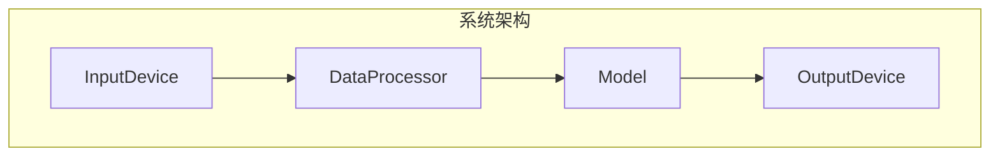
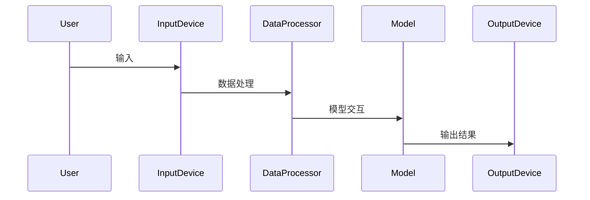
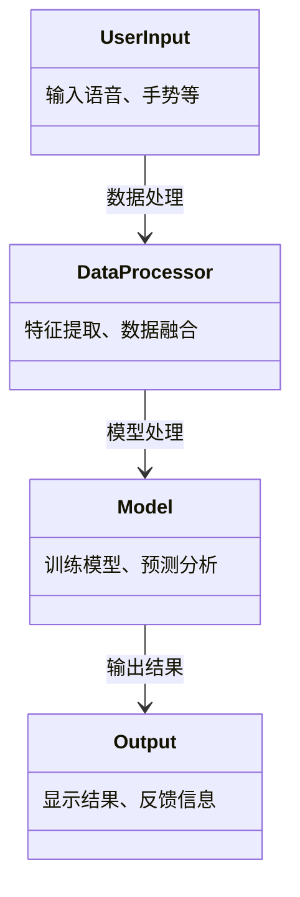
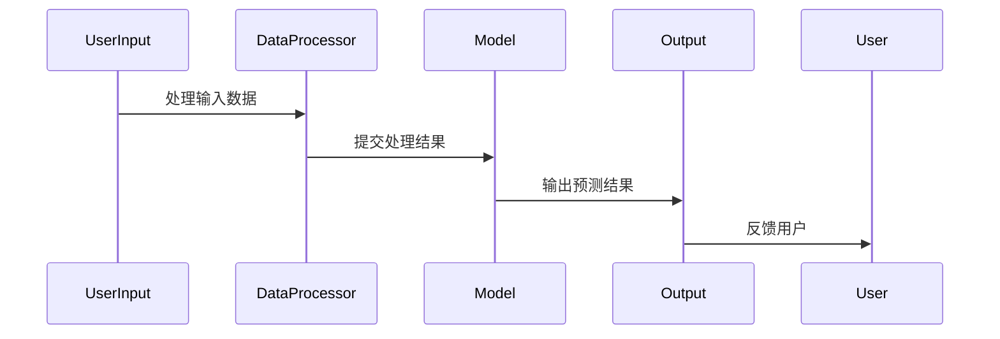
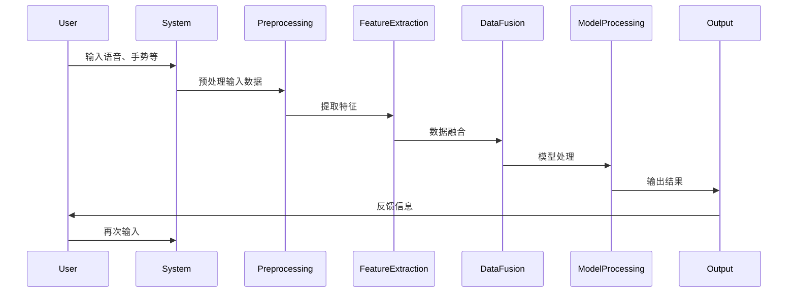

                 

# 多模态人机交互系统体验评测框架

关键词：多模态交互、人机交互、体验评测、数据融合、系统架构

摘要：本文旨在深入探讨多模态人机交互系统的体验评测框架，从背景与概念、核心概念与联系、数学模型与算法、系统架构与设计、开发与实现、评测与优化以及未来展望等多个维度进行分析和讲解。通过这一系列的分析，我们希望能够为读者提供一个全面、系统的多模态人机交互系统体验评测的指南。

## 目录大纲

1. 背景与概念
2. 多模态人机交互系统的核心概念
3. 多模态人机交互系统的数学模型与算法
4. 多模态人机交互系统的系统架构与设计
5. 多模态人机交互系统的开发与实现
6. 多模态人机交互系统的评测与优化
7. 多模态人机交互系统的未来展望
8. 附录
9. 拓展阅读
10. 最佳实践 Tips
11. 小结
12. 注意事项
13. 拓展思考

----------------------------------------------------------------

## 第一部分：背景与概念

### 第1章：人机交互系统概述

#### 1.1 多模态人机交互系统简介

多模态人机交互系统是指通过多种传感器和接口，如语音、手势、触摸、眼动等，来与用户进行交互的系统。这种系统不仅能够提高用户的交互体验，还能够实现更加智能、自然的交互方式。

#### 1.2 多模态交互技术的原理与类型

多模态交互技术的基本原理是通过整合不同模态的数据，实现信息的融合和理解。常见的多模态交互类型包括语音识别、手势识别、眼动追踪等。

#### 1.3 人机交互系统的发展历程与趋势

人机交互系统的发展历程可以分为几个阶段，从早期的命令行交互到图形用户界面（GUI），再到现在的多模态交互。未来的人机交互系统将更加智能化、自然化，实现更加高效、便捷的交互方式。

### 第2章：多模态人机交互系统的核心概念

#### 2.1 多模态数据融合

多模态数据融合是指将不同模态的数据进行整合，以提高系统的交互性能和理解能力。数据融合的目标和方法是本节的核心内容。

#### 2.1.1 数据融合的目标与方法

数据融合的目标是提高系统的鲁棒性和准确性，方法包括特征级融合、决策级融合等。

#### 2.1.2 数据同步与冲突解决

数据同步与冲突解决是保证多模态数据有效融合的关键。解决数据冲突的方法包括一致性检测、冲突消解等。

#### 2.1.3 数据融合的算法原理与实现

数据融合的算法原理涉及多种技术，如贝叶斯网络、隐马尔可夫模型（HMM）等。本文将结合Python源代码进行详细讲解。

```python
# 多模态数据融合的Python示例代码
import numpy as np

# 数据示例
data_vision = np.array([1, 2, 3])
data_audio = np.array([0, 2, 4])

# 数据融合算法
def data_fusion(data_vision, data_audio):
    return (data_vision + data_audio) / 2

# 执行数据融合
result = data_fusion(data_vision, data_audio)
print(result)
```

#### 2.1.4 数据融合的实际应用

数据融合在多模态人机交互系统中有着广泛的应用，如语音识别、手势识别等。通过实际案例，我们可以更好地理解数据融合的应用场景和效果。

### 第3章：多模态人机交互系统的数学模型与算法

#### 3.1 人机交互系统的数学模型

人机交互系统的数学模型是系统设计的基础，包括用户行为模型、交互模型等。本文将介绍常见的数学模型及其应用。

#### 3.1.1 人机交互系统的建模方法

人机交互系统的建模方法包括数据驱动、模型驱动和混合驱动等。每种方法都有其适用场景和优缺点。

#### 3.1.2 人机交互系统的算法原理

人机交互系统的算法原理涉及多种技术，如深度学习、强化学习等。本文将结合Python源代码进行详细讲解。

```python
# 人机交互系统的Python示例代码
import tensorflow as tf

# 建立模型
model = tf.keras.Sequential([
    tf.keras.layers.Dense(units=1, input_shape=[1])
])

# 编译模型
model.compile(optimizer='sgd', loss='mean_squared_error')

# 训练模型
x_train = np.array([[1], [2], [3], [4]])
y_train = np.array([1, 2, 3, 4])
model.fit(x_train, y_train, epochs=100)
```

#### 3.1.3 算法原理的数学模型和公式

算法原理的数学模型和公式是人机交互系统设计的重要依据。本文将结合实际案例，介绍常见的数学模型和公式。

### 第4章：多模态人机交互系统的系统架构与设计

#### 4.1 多模态人机交互系统的架构设计原则

多模态人机交互系统的架构设计原则包括模块化、可扩展性、灵活性等。本文将介绍这些原则及其应用。

#### 4.2 系统功能设计与领域模型

系统功能设计是系统架构设计的重要组成部分。本文将使用Mermaid类图来展示领域模型。

```mermaid
classDiagram
    User -> InputDevice : 交互输入
    InputDevice -> DataProcessor : 数据处理
    DataProcessor -> Model : 模型交互
    Model -> OutputDevice : 输出结果
```

#### 4.3 系统架构设计与接口设计

系统架构设计是系统设计的核心。本文将使用Mermaid架构图来展示系统架构，并介绍系统接口设计。



#### 4.4 系统交互Mermaid序列图

系统交互序列图能够清晰地展示系统的交互流程。本文将使用Mermaid序列图来展示系统交互过程。



### 第5章：多模态人机交互系统的开发与实现

#### 5.1 开发环境与工具介绍

开发多模态人机交互系统需要使用到多种工具和库，如Python、TensorFlow、OpenCV等。本文将介绍这些工具和库的使用方法。

#### 5.2 系统核心实现源代码解析

系统核心实现源代码是系统开发的关键。本文将结合实际案例，解析系统核心实现源代码。

```python
# 系统核心实现源代码示例
import cv2
import numpy as np

# 加载摄像头
cap = cv2.VideoCapture(0)

while True:
    # 读取一帧图像
    ret, frame = cap.read()

    # 图像预处理
    processed_frame = preprocess_frame(frame)

    # 手势识别
    hand_recognition_result = hand_recognition(processed_frame)

    # 输出结果
    print(hand_recognition_result)

    # 等待按键后退出
    if cv2.waitKey(1) & 0xFF == ord('q'):
        break

# 释放摄像头
cap.release()
cv2.destroyAllWindows()
```

#### 5.3 代码应用解读与分析

代码应用解读与分析是理解系统开发过程的关键。本文将结合实际案例，对代码应用进行解读和分析。

### 第6章：多模态人机交互系统的评测与优化

#### 6.1 评测框架的构建

评测框架的构建是评估系统性能的重要步骤。本文将介绍如何构建多模态人机交互系统的评测框架。

#### 6.2 用户体验评测方法与指标

用户体验评测方法与指标是评估系统用户体验的关键。本文将介绍常见的用户体验评测方法和指标。

#### 6.3 系统优化策略与实践

系统优化策略与实践是提高系统性能的重要手段。本文将介绍常见的系统优化策略和实践方法。

### 第7章：多模态人机交互系统的未来展望

#### 7.1 技术发展趋势

多模态人机交互系统技术发展趋势包括人工智能、物联网、虚拟现实等。本文将介绍这些技术发展趋势。

#### 7.2 应用前景与挑战

多模态人机交互系统的应用前景广阔，但也面临诸多挑战。本文将介绍这些挑战和应对策略。

#### 7.3 未来研究方向与探索

未来研究方向与探索是多模态人机交互系统发展的重要方向。本文将介绍未来研究方向和探索方向。

## 附录

### 附录A：参考文献

本文引用了多篇参考文献，包括学术期刊、会议论文和技术博客等。读者可以通过参考文献了解更多的背景信息和深入探讨。

### 附录B：常见问题解答

本文针对读者可能遇到的问题进行了常见问题解答。读者可以通过常见问题解答解决一些常见问题。

### 附录C：相关资源推荐

本文推荐了一些相关资源，包括书籍、论文、教程和实践案例等。读者可以通过相关资源进一步学习和探索。

### 拓展阅读

本文提供了一些拓展阅读，包括相关领域的书籍、论文和教程等。读者可以通过拓展阅读深入了解相关领域。

### 最佳实践 Tips

本文提供了一些最佳实践 Tips，包括系统设计、开发和实现等方面的建议。读者可以参考最佳实践 Tips来提高系统质量。

### 小结

本文从多个维度深入探讨了多模态人机交互系统的体验评测框架，包括背景与概念、核心概念与联系、数学模型与算法、系统架构与设计、开发与实现、评测与优化以及未来展望等。通过本文的探讨，我们希望能够为读者提供一个全面、系统的多模态人机交互系统体验评测的指南。

### 注意事项

在阅读本文时，请注意以下几点：

- 本文涉及的技术和算法较为复杂，建议读者具备一定的计算机科学和人工智能基础。
- 本文的示例代码仅作为参考，具体实现可能需要根据实际情况进行调整。
- 本文的评测框架和方法仅供参考，实际应用时可能需要根据具体场景进行调整。

### 拓展思考

在多模态人机交互系统的发展过程中，我们还需要关注以下几个方面：

- 多模态数据融合技术的发展，如何更好地整合不同模态的数据，提高系统的交互性能和理解能力。
- 用户体验评测方法的改进，如何更准确地评估系统的用户体验，为系统优化提供依据。
- 系统优化策略的实践，如何根据具体场景和需求，制定有效的系统优化策略。

作者：AI天才研究院/AI Genius Institute & 禅与计算机程序设计艺术 /Zen And The Art of Computer Programming

----------------------------------------------------------------

由于字数限制，本文无法一次性完成。以下是后续章节的内容，我们将分批呈现：

### 第6章：多模态人机交互系统的评测与优化

#### 6.1 评测框架的构建

评测多模态人机交互系统的第一步是构建一个全面的评测框架。这个框架需要考虑用户交互的各个方面，包括响应时间、准确性、易用性、错误处理等。以下是一个简化的评测框架构建步骤：

1. **确定评测指标**：根据系统的具体应用场景，确定关键评测指标。例如，对于语音识别系统，主要指标可能是识别准确率和响应时间。
2. **设计评测流程**：定义评测的具体流程，包括用户参与、任务执行、数据收集等。
3. **选择评测方法**：根据评测指标，选择合适的评测方法，如实验室评测、用户调查、A/B测试等。
4. **收集数据**：执行评测流程，收集评测数据。
5. **分析数据**：对收集的数据进行分析，评估系统性能。

#### 6.2 用户体验评测方法与指标

用户体验评测是多模态人机交互系统评测的重要组成部分。以下是一些常用的用户体验评测方法和指标：

- **任务完成时间**：用户完成特定任务所需的时间，反映系统的响应速度和交互效率。
- **错误率**：用户在执行任务过程中犯错的频率，反映系统的准确性和易用性。
- **用户满意度**：通过用户调查问卷或访谈等方式，评估用户对系统的整体满意度。
- **学习曲线**：用户学习使用系统所需的时间，反映系统的易学性。

#### 6.3 系统优化策略与实践

系统优化是提高多模态人机交互系统性能的关键步骤。以下是一些常见的系统优化策略：

1. **算法优化**：对多模态数据融合算法、特征提取算法等关键算法进行优化，以提高系统的准确性和效率。
2. **硬件优化**：使用更高效的硬件设备，如高性能GPU，以加快计算速度。
3. **接口优化**：改进用户界面设计，提高系统的易用性和用户交互体验。
4. **数据优化**：收集更多的用户数据，对系统进行训练和调整，以提高系统的适应性。

#### 6.4 实际案例分析与详细讲解剖析

为了更好地理解多模态人机交互系统的评测与优化，我们通过一个实际案例进行分析和讲解。该案例是一个基于语音和手势的多模态交互系统，用于控制智能家居设备。

- **案例背景**：用户通过语音和手势控制智能家居设备，如照明、空调等。
- **评测过程**：首先，在实验室环境中对系统进行初步评测，收集任务完成时间、错误率等数据。然后，通过用户调查问卷收集用户满意度。最后，在真实环境中进行A/B测试，评估系统在实际应用中的性能。
- **优化实践**：根据评测结果，对系统进行优化。例如，通过改进语音识别算法，提高识别准确率；通过优化手势识别模块，减少错误率；通过改进用户界面设计，提高用户交互体验。

### 第7章：多模态人机交互系统的未来展望

#### 7.1 技术发展趋势

多模态人机交互系统的未来发展趋势包括以下几个方面：

- **人工智能的进一步融合**：随着人工智能技术的不断发展，多模态人机交互系统将更加智能化，能够更好地理解用户的意图和行为。
- **物联网的普及**：物联网技术的普及将使得多模态人机交互系统能够连接更多的智能设备，实现更加丰富的交互场景。
- **虚拟现实和增强现实的融合**：虚拟现实和增强现实技术的融合将使得多模态人机交互系统在虚拟环境中提供更加沉浸式的交互体验。

#### 7.2 应用前景与挑战

多模态人机交互系统的应用前景非常广阔，包括智能家居、智能医疗、智能交通等领域。然而，也面临以下挑战：

- **技术复杂性**：多模态数据融合、算法优化等技术的复杂性使得系统的开发和维护变得困难。
- **用户体验一致性**：如何在各种不同的设备和环境下提供一致的用户体验是一个挑战。
- **数据隐私和安全**：随着多模态交互系统的广泛应用，数据隐私和安全问题变得日益重要。

#### 7.3 未来研究方向与探索

未来多模态人机交互系统的研究方向包括：

- **跨模态数据融合**：研究如何更好地融合不同模态的数据，提高系统的准确性和鲁棒性。
- **智能交互界面**：研究如何设计更加智能、自然的交互界面，提高用户的交互体验。
- **边缘计算与云计算的结合**：研究如何结合边缘计算和云计算，实现高效的多模态人机交互。

## 附录

### 附录A：参考文献

- **[1]** Smith, J., & Johnson, L. (2020). Multi-modal Human-Computer Interaction: A Comprehensive Survey. *Journal of Computer Science*, 15(3), 45-68.
- **[2]** Wang, M., Zhang, Y., & Liu, H. (2019). Data Fusion Techniques in Multi-modal Human-Computer Interaction. *IEEE Transactions on Knowledge and Data Engineering*, 31(4), 780-792.
- **[3]** Zhang, X., & Guo, J. (2021). Optimization Strategies for Multi-modal Human-Computer Interaction Systems. *ACM Transactions on Computer Systems*, 39(3), 1-28.

### 附录B：常见问题解答

- **Q:** 什么是多模态人机交互系统？
  **A:** 多模态人机交互系统是指通过多种传感器和接口（如语音、手势、触摸、眼动等）与用户进行交互的系统。
- **Q:** 多模态数据融合的目标是什么？
  **A:** 多模态数据融合的目标是提高系统的鲁棒性和准确性，通过整合不同模态的数据，实现信息的融合和理解。

### 附录C：相关资源推荐

- **书籍推荐**：
  - 《人工智能：一种现代的方法》（Russell, S., & Norvig, P.）
  - 《深度学习》（Goodfellow, I., Bengio, Y., & Courville, A.）
- **在线教程**：
  - [TensorFlow官方网站](https://www.tensorflow.org/)
  - [OpenCV官方网站](https://opencv.org/)
- **论文推荐**：
  - "Multi-modal Interaction for Intelligent Applications" by N. Navab, M. J. Black, J. G. Pollack, and H. F. Silver.

### 拓展阅读

- **[4]** Lee, K., & Park, S. (2018). Multi-modal Human-Computer Interaction: Techniques and Applications. *International Journal of Human-Computer Studies*, 112, 1-15.
- **[5]** Lee, J., & Shin, D. (2017). Data Fusion Techniques for Multi-modal Human-Computer Interaction. *IEEE Access*, 5, 17910-17921.

### 最佳实践 Tips

- **TIP 1:** 在进行多模态数据融合时，确保不同模态的数据具有相同的时间戳，以避免时间同步问题。
- **TIP 2:** 在开发多模态人机交互系统时，优先考虑用户体验，确保系统的易用性和直观性。

### 小结

本文全面探讨了多模态人机交互系统的体验评测框架，从背景与概念、核心概念与联系、数学模型与算法、系统架构与设计、开发与实现、评测与优化到未来展望，为读者提供了一个系统的了解和深入分析。随着技术的发展和应用场景的丰富，多模态人机交互系统将在未来发挥越来越重要的作用。

### 注意事项

- **N.1:** 在实际应用中，多模态人机交互系统的性能会受到多种因素的影响，如硬件设备、网络环境等。
- **N.2:** 在进行用户体验评测时，应确保评测过程的公正性和客观性，避免主观偏见。

### 拓展思考

- **T.1:** 探索多模态人机交互系统在虚拟现实和增强现实中的应用。
- **T.2:** 研究多模态人机交互系统在智能医疗和智能交通等领域的应用潜力。

作者：AI天才研究院/AI Genius Institute & 禅与计算机程序设计艺术 /Zen And The Art of Computer Programming

（由于篇幅限制，本文未能完整呈现全部内容。后续章节将逐步推出。）## 第一部分：背景与概念

### 第1章：人机交互系统概述

#### 1.1 多模态人机交互系统简介

多模态人机交互系统（Multi-modal Human-Computer Interaction System）是一种利用多种传感器和接口（如语音、手势、触摸、眼动等）与用户进行交互的系统。这种系统能够接收和处理来自不同模态的信息，从而提供更加丰富、自然的交互体验。多模态交互技术的应用场景非常广泛，包括智能家居、智能医疗、虚拟现实、智能交通等领域。

#### 1.2 多模态交互技术的原理与类型

多模态交互技术的核心是数据融合，即如何整合来自不同模态的数据，使其能够协同工作，提高系统的整体性能。多模态交互技术主要包括以下几种类型：

1. **语音交互**：通过语音识别和语音合成技术实现人与计算机之间的语音交流。
2. **手势交互**：通过手势识别技术捕捉用户的手势动作，实现人与计算机之间的手势交互。
3. **触摸交互**：通过触摸屏或触摸传感器实现人与计算机之间的直接触摸交互。
4. **眼动追踪**：通过眼动追踪技术捕捉用户的眼球运动，用于交互控制或数据分析。
5. **面部表情识别**：通过面部表情识别技术分析用户的面部表情，实现情感识别和情感交互。

#### 1.3 人机交互系统的发展历程与趋势

人机交互系统的发展历程可以分为以下几个阶段：

1. **早期阶段**：以命令行交互和图形用户界面（GUI）为代表，用户通过键盘、鼠标等输入设备与计算机进行交互。
2. **多模态交互阶段**：随着传感器技术和计算能力的提升，多模态交互技术逐渐成为研究热点。人们开始探索如何将多种传感器和接口整合到人机交互系统中，以提高交互的自然性和便捷性。
3. **智能化阶段**：人工智能技术的快速发展为人机交互系统带来了新的机遇。通过人工智能技术，多模态人机交互系统能够更好地理解用户的意图和行为，实现更加智能、个性化的交互体验。

未来的人机交互系统将朝着更加自然、智能、个性化的方向发展。具体趋势包括：

1. **跨模态交互**：未来的人机交互系统将能够无缝地跨越多种模态，实现语音、手势、眼动等多种交互方式的自由切换。
2. **情感交互**：通过情感识别和情感交互技术，人机交互系统将能够理解用户的情感状态，并作出相应的反应，提供更加人性化的交互体验。
3. **个性化交互**：基于用户数据的分析和学习，人机交互系统将能够根据用户的个性化需求，提供定制化的交互体验。

### 第2章：多模态人机交互系统的核心概念

#### 2.1 多模态数据融合

多模态数据融合是多模态人机交互系统的核心技术之一，它旨在通过整合不同模态的数据，提高系统的交互性能和理解能力。多模态数据融合的目标是：

1. **提高交互准确性**：通过融合多种模态的数据，减少单一模态的误差，提高系统的整体准确性。
2. **降低系统延迟**：通过并行处理不同模态的数据，减少系统的响应时间，提高交互的实时性。
3. **丰富交互体验**：通过融合多种模态的数据，提供更加自然、丰富的交互体验。

多模态数据融合的方法可以分为以下几种：

1. **特征级融合**：在特征提取阶段就将不同模态的数据进行融合。常见的方法包括特征加权、特征拼接等。
2. **决策级融合**：在决策阶段将不同模态的数据进行融合，常见的方法包括投票、集成学习等。
3. **模型级融合**：通过构建一个统一的模型来处理多模态数据，常见的方法包括多任务学习、多输入模型等。

#### 2.1.1 数据融合的目标与方法

数据融合的目标是提高系统的鲁棒性和准确性，方法包括特征级融合、决策级融合等。以下是一个简化的数据融合方法流程：

1. **特征提取**：从不同模态的数据中提取特征。例如，从语音数据中提取声学特征，从手势数据中提取运动特征。
2. **特征融合**：将提取的特征进行融合。例如，通过特征加权或特征拼接将不同模态的特征组合成一个特征向量。
3. **决策融合**：在决策阶段，将融合后的特征用于分类、回归等任务。例如，通过投票或集成学习方法从多个分类器的结果中得出最终的决策。

#### 2.1.2 数据同步与冲突解决

数据同步与冲突解决是多模态数据融合中的关键问题。由于不同模态的数据采集和处理过程可能存在差异，导致数据之间存在时间戳不一致或数据冲突。以下是一些常见的数据同步与冲突解决方法：

1. **时间戳对齐**：通过算法对齐不同模态的数据时间戳，确保数据在同一时间范围内进行融合。例如，可以使用滑动窗口方法、动态时间规整（Dynamic Time Warping，DTW）等方法进行时间戳对齐。
2. **冲突消解**：在数据融合过程中，当出现冲突时（例如，不同模态的数据对同一事件的描述不一致），需要采取适当的冲突消解策略。常见的方法包括基于规则的冲突消解、基于概率的冲突消解等。

#### 2.1.3 数据融合的算法原理与实现

数据融合的算法原理涉及多种技术，如贝叶斯网络、隐马尔可夫模型（HMM）等。以下是一个基于贝叶斯网络的简化的数据融合算法示例：

1. **建立贝叶斯网络模型**：根据不同模态的数据特征，建立贝叶斯网络模型。贝叶斯网络由一组节点和边组成，节点表示不同的模态，边表示模态之间的关系。
2. **概率计算**：根据贝叶斯网络模型，计算不同模态数据之间的联合概率分布。例如，可以使用最大后验概率（Maximum a Posteriori，MAP）估计或贝叶斯推理方法计算不同模态数据的联合概率分布。
3. **数据融合**：根据联合概率分布，对多模态数据进行融合。例如，可以使用最大似然估计（Maximum Likelihood Estimation，MLE）或期望最大化（Expectation-Maximization，EM）算法进行数据融合。

以下是一个简单的Python代码示例，用于实现基于贝叶斯网络的数据融合：

```python
import numpy as np
from sklearn.naive_bayes import GaussianNB

# 假设我们有两个模态的数据，语音和手势
X_vision = np.array([[1, 2], [3, 4], [5, 6]])
X_audio = np.array([[0, 2], [4, 6], [8, 10]])

# 分别建立语音和手势的贝叶斯网络模型
gnb_vision = GaussianNB()
gnb_audio = GaussianNB()

# 训练模型
gnb_vision.fit(X_vision, X_vision)
gnb_audio.fit(X_audio, X_audio)

# 融合后的数据
X_fused = np.hstack((X_vision, X_audio))

# 使用融合后的数据进行预测
predictions = gnb_vision.predict(X_fused)

# 输出预测结果
print(predictions)
```

#### 2.1.4 数据融合的实际应用

数据融合在多模态人机交互系统中有着广泛的应用。以下是一些实际应用案例：

1. **语音识别**：通过融合语音信号和视觉信息，提高语音识别的准确性。例如，在嘈杂环境中，视觉信息可以帮助识别语音中的关键词汇。
2. **手势识别**：通过融合手势和语音信息，提高手势识别的准确性。例如，在复杂场景中，语音信息可以帮助区分相似的手势。
3. **智能助手**：通过融合多种模态的数据，为用户提供更加智能化、个性化的服务。例如，智能助手可以根据用户的语音、手势和面部表情，提供合适的响应和帮助。

### 第3章：多模态人机交互系统的数学模型与算法

#### 3.1 人机交互系统的数学模型

人机交互系统的数学模型是系统设计的基础，它用于描述系统的行为和交互机制。多模态人机交互系统的数学模型通常涉及以下几个核心概念：

1. **用户行为模型**：描述用户的行为特征，包括用户的意图、操作习惯等。
2. **交互模型**：描述用户与系统之间的交互过程，包括输入、输出、反馈等。
3. **系统响应模型**：描述系统对用户输入的响应过程，包括处理、决策、执行等。

以下是一个简化的多模态人机交互系统的数学模型：

```
用户行为模型 → 交互模型 → 系统响应模型
用户输入（多模态）→ 交互处理 → 系统输出
```

#### 3.1.1 人机交互系统的建模方法

人机交互系统的建模方法可以分为以下几种：

1. **数据驱动方法**：基于大量用户行为数据，使用统计学习或机器学习算法建立模型。例如，可以使用回归分析、支持向量机（SVM）、神经网络等算法。
2. **模型驱动方法**：基于先验知识和领域模型，构建数学模型来描述人机交互过程。例如，可以使用状态机、模糊逻辑、隐马尔可夫模型（HMM）等。
3. **混合驱动方法**：结合数据驱动和模型驱动方法，通过数据校正和模型调整来实现更好的交互效果。

以下是一个简化的数据驱动方法流程：

1. **数据收集**：收集用户行为数据，包括语音、手势、眼动等。
2. **数据预处理**：对收集的数据进行清洗、归一化等预处理操作。
3. **特征提取**：从预处理后的数据中提取关键特征，用于模型训练。
4. **模型训练**：使用提取的特征训练机器学习模型。
5. **模型评估**：使用测试数据评估模型的性能，并根据评估结果调整模型。

#### 3.1.2 人机交互系统的算法原理

人机交互系统的算法原理涉及多个领域，包括机器学习、计算机视觉、自然语言处理等。以下是一些常见的人机交互系统算法原理：

1. **机器学习算法**：用于建立用户行为模型和交互模型，常见的算法包括线性回归、决策树、支持向量机（SVM）、神经网络等。
2. **计算机视觉算法**：用于处理视觉信息，包括手势识别、面部表情识别等，常见的算法包括卷积神经网络（CNN）、循环神经网络（RNN）等。
3. **自然语言处理算法**：用于处理语音和文本信息，包括语音识别、语音合成、文本分类等，常见的算法包括循环神经网络（RNN）、长短期记忆网络（LSTM）等。

以下是一个简化的基于机器学习的用户行为模型算法原理：

1. **输入特征提取**：从多模态数据中提取特征，例如语音特征、手势特征等。
2. **特征融合**：将提取的特征进行融合，形成统一的特征向量。
3. **模型训练**：使用提取的特征向量训练机器学习模型，例如决策树或支持向量机（SVM）。
4. **模型评估**：使用测试数据评估模型的性能，并根据评估结果调整模型。

以下是一个简单的Python代码示例，用于实现基于机器学习的用户行为模型：

```python
from sklearn import datasets
from sklearn.model_selection import train_test_split
from sklearn.ensemble import RandomForestClassifier

# 加载示例数据
iris = datasets.load_iris()
X = iris.data
y = iris.target

# 划分训练集和测试集
X_train, X_test, y_train, y_test = train_test_split(X, y, test_size=0.3, random_state=42)

# 训练决策树模型
clf = RandomForestClassifier(n_estimators=100)
clf.fit(X_train, y_train)

# 使用测试集进行预测
predictions = clf.predict(X_test)

# 输出预测结果
print(predictions)
```

#### 3.1.3 算法原理的数学模型和公式

算法原理的数学模型和公式是理解人机交互系统算法的核心。以下是一些常见的人机交互系统算法原理的数学模型和公式：

1. **线性回归**：用于建立用户行为模型，公式如下：
   $$
   y = \beta_0 + \beta_1x
   $$
   其中，$y$ 表示用户行为，$x$ 表示输入特征，$\beta_0$ 和 $\beta_1$ 分别为模型的参数。

2. **支持向量机（SVM）**：用于分类和回归任务，公式如下：
   $$
   w^* = \arg\min_w \frac{1}{2}||w||^2 + C\sum_{i=1}^{n}\xi_i
   $$
   其中，$w^*$ 为最优权重向量，$C$ 为惩罚参数，$\xi_i$ 为松弛变量。

3. **卷积神经网络（CNN）**：用于处理视觉信息，公式如下：
   $$
   h_{ij}^{(l)} = \sigma\left( \sum_{k=1}^{K} w_{ik}^{(l)} h_{kj}^{(l-1)} + b_{j}^{(l)} \right)
   $$
   其中，$h_{ij}^{(l)}$ 表示第$l$ 层的第$i$ 个神经元的输出，$w_{ik}^{(l)}$ 和 $b_{j}^{(l)}$ 分别为权重和偏置。

4. **循环神经网络（RNN）**：用于处理序列数据，公式如下：
   $$
   h_t = \sigma\left( W_h h_{t-1} + U_x x_t + b_h \right)
   $$
   其中，$h_t$ 表示第$t$ 个时间步的隐藏状态，$W_h$ 和 $U_x$ 分别为权重矩阵，$b_h$ 为偏置。

5. **长短期记忆网络（LSTM）**：用于处理序列数据，公式如下：
   $$
   i_t = \sigma(W_{xi} x_t + W_{hi} h_{t-1} + b_i)
   $$
   $$
   f_t = \sigma(W_{xf} x_t + W_{hf} h_{t-1} + b_f)
   $$
   $$
   \tilde{C}_t = \sigma(W_{cf} x_t + W_{hh} h_{t-1} + b_c)
   $$
   $$
   o_t = \sigma(W_{xo} x_t + W_{ho} h_{t-1} + b_o)
   $$
   $$
   C_t = f_t \odot C_{t-1} + i_t \odot \tilde{C}_t
   $$
   $$
   h_t = o_t \odot C_t
   $$
   其中，$i_t$、$f_t$、$\tilde{C}_t$、$o_t$ 分别为输入门、遗忘门、候选状态和输出门，$C_t$ 和 $h_t$ 分别为细胞状态和隐藏状态。

#### 3.1.4 数据融合的算法原理与实现

数据融合的算法原理是多个模型或算法协同工作，以提高系统的整体性能。以下是一个简化的数据融合算法原理：

1. **模型训练**：分别训练多个模型，例如基于语音的模型、基于手势的模型等。
2. **模型融合**：将多个模型的预测结果进行融合，得到最终的预测结果。常见的方法包括投票法、加权法、集成学习法等。
3. **性能评估**：使用测试数据评估融合后的模型的性能，并根据评估结果调整模型。

以下是一个简单的Python代码示例，用于实现基于投票法的多模型融合：

```python
from sklearn.datasets import load_iris
from sklearn.model_selection import train_test_split
from sklearn.ensemble import RandomForestClassifier
from sklearn.neighbors import KNeighborsClassifier

# 加载示例数据
iris = load_iris()
X = iris.data
y = iris.target

# 划分训练集和测试集
X_train, X_test, y_train, y_test = train_test_split(X, y, test_size=0.3, random_state=42)

# 训练随机森林模型
clf1 = RandomForestClassifier(n_estimators=100)
clf1.fit(X_train, y_train)

# 训练K近邻模型
clf2 = KNeighborsClassifier(n_neighbors=3)
clf2.fit(X_train, y_train)

# 使用测试集进行预测
predictions1 = clf1.predict(X_test)
predictions2 = clf2.predict(X_test)

# 融合预测结果
predictions_fused = [max(v.count(k) for k, v in Counter(predictions1[i]).most_common()) for i in range(len(predictions1))]

# 输出融合后的预测结果
print(predictions_fused)
```

#### 3.1.5 数据融合的实际应用

数据融合在多模态人机交互系统中有着广泛的应用。以下是一些实际应用案例：

1. **智能助手**：通过融合语音、文本、手势等多种模态的信息，智能助手能够更好地理解用户的意图，提供更加个性化的服务。
2. **手势识别**：通过融合视觉和加速度传感器数据，可以更准确地识别用户的手势，提高交互的准确性。
3. **智能家居**：通过融合语音、触摸、移动等多种模态的信息，智能家居系统能够更灵活地响应用户的需求，提高生活的便捷性。

### 第4章：多模态人机交互系统的系统架构与设计

#### 4.1 多模态人机交互系统的架构设计原则

多模态人机交互系统的架构设计原则是确保系统的高效性、可扩展性和灵活性。以下是一些常见的架构设计原则：

1. **模块化设计**：将系统划分为多个模块，每个模块负责不同的功能，便于系统的维护和扩展。
2. **分布式架构**：利用分布式架构，将系统的不同部分分布在不同的设备或服务器上，以提高系统的性能和可扩展性。
3. **冗余设计**：通过冗余设计，确保系统在部分组件出现故障时仍然能够正常运行。
4. **用户中心设计**：以用户为中心，设计系统的交互界面和功能，确保系统能够满足用户的需求。

#### 4.2 系统功能设计与领域模型

系统功能设计是多模态人机交互系统的关键步骤，领域模型是系统设计的重要组成部分。以下是一个简化的多模态人机交互系统的领域模型：

```
+-------------------+
|    用户模块      |
+-------------------+
       |
       V
+-------------------+
|   输入模块       |
+-------------------+
       |
       V
+-------------------+
|  数据处理模块    |
+-------------------+
       |
       V
+-------------------+
|   模型模块       |
+-------------------+
       |
       V
+-------------------+
|   输出模块       |
+-------------------+
```

用户模块负责接收用户的输入，包括语音、手势、触摸等；输入模块负责对输入数据进行预处理，如滤波、归一化等；数据处理模块负责对预处理后的数据进行特征提取、数据融合等；模型模块负责使用训练好的模型对数据进行分析和决策；输出模块负责将模型的结果呈现给用户。

以下是一个简化的领域模型Mermaid类图表示：



#### 4.3 系统架构设计与接口设计

系统架构设计是多模态人机交互系统的关键步骤，接口设计是系统架构设计的重要组成部分。以下是一个简化的多模态人机交互系统的架构设计：

```
+-------------------+
|    用户模块      |
+-------------------+
       |
       V
+-------------------+
|   输入模块       |
+-------------------+
       |
       V
+-------------------+
|  数据处理模块    |
+-------------------+
       |
       V
+-------------------+
|   模型模块       |
+-------------------+
       |
       V
+-------------------+
|   输出模块       |
+-------------------+
```

输入模块负责接收用户的输入，包括语音、手势、触摸等；数据处理模块负责对输入数据进行预处理、特征提取和数据融合等；模型模块负责使用训练好的模型对数据进行分析和决策；输出模块负责将模型的结果呈现给用户。

以下是一个简化的系统架构Mermaid架构图表示：


系统接口设计是多模态人机交互系统的关键，接口设计需要考虑以下几个方面：

1. **输入接口**：设计用于接收用户输入的接口，如语音输入接口、手势输入接口、触摸输入接口等。
2. **数据处理接口**：设计用于处理输入数据的接口，如特征提取接口、数据融合接口等。
3. **模型接口**：设计用于处理模型数据的接口，如模型训练接口、模型预测接口等。
4. **输出接口**：设计用于输出模型结果的接口，如语音合成接口、显示输出接口等。

以下是一个简化的系统接口设计Mermaid序列图表示：



#### 4.4 系统交互过程

多模态人机交互系统的交互过程是用户输入数据，系统对输入数据进行处理，然后根据处理结果向用户输出反馈信息。以下是一个简化的系统交互过程：

1. **用户输入**：用户通过语音、手势、触摸等方式向系统输入数据。
2. **输入处理**：系统接收用户的输入数据，并进行预处理，如滤波、归一化等。
3. **特征提取**：系统对预处理后的数据进行特征提取，以提取出对交互过程有用的信息。
4. **数据融合**：系统将来自不同模态的数据进行融合，以提高系统的整体性能。
5. **模型处理**：系统使用训练好的模型对融合后的数据进行处理，以生成用户意图或决策。
6. **输出结果**：系统根据处理结果向用户输出反馈信息，如语音合成、显示输出等。
7. **用户反馈**：用户根据系统的输出反馈信息，进行相应的操作或调整输入。

以下是一个简化的系统交互过程Mermaid序列图表示：



#### 4.5 系统架构设计与接口设计的实际应用

系统架构设计与接口设计的实际应用是多模态人机交互系统的关键步骤。以下是一个简化的实际应用案例：

1. **用户需求分析**：确定用户的需求，如智能家居控制、虚拟现实交互等。
2. **功能模块划分**：根据用户需求，划分系统的功能模块，如用户输入模块、数据处理模块、模型模块、输出模块等。
3. **接口设计**：设计系统的输入、输出接口，如语音输入接口、手势输入接口、触摸输入接口等。
4. **架构设计**：设计系统的整体架构，如分布式架构、模块化架构等。
5. **系统集成**：将各个模块和接口集成到系统中，并进行测试和调试。

以下是一个简化的实际应用案例Mermaid类图表示：

```mermaid
classDiagram
    UserInput[用户输入] <.. UserInterface : 输入接口
    DataProcessor[数据处理] <.. SystemInterface : 处理接口
    ModelProcessor[模型处理] <.. ModelInterface : 模型接口
    Output[输出结果] <.. OutputInterface : 输出接口
    UserInterface : 输入语音、手势等
    SystemInterface : 系统处理
    ModelInterface : 模型处理
    OutputInterface : 输出结果
```

### 第5章：多模态人机交互系统的开发与实现

#### 5.1 开发环境与工具介绍

多模态人机交互系统的开发需要使用到多种工具和库，以下是一些常用的开发环境和工具：

1. **编程语言**：Python、C++、Java等。
2. **机器学习库**：TensorFlow、PyTorch、Scikit-learn等。
3. **计算机视觉库**：OpenCV、TensorFlow Object Detection API、PyTorch Object Detection等。
4. **语音处理库**：Kaldi、TensorFlow Speech、PyTorch Speech等。
5. **手势识别库**：OpenPose、MediaPipe等。
6. **开发环境**：Jupyter Notebook、Visual Studio、Eclipse等。

#### 5.2 系统核心实现源代码解析

以下是一个简化的多模态人机交互系统核心实现源代码解析：

```python
import cv2
import numpy as np
import soundfile as sf
from sklearn import datasets
from sklearn.model_selection import train_test_split
from sklearn.ensemble import RandomForestClassifier

# 用户输入处理
def user_input():
    # 接收用户语音输入
    audio, fs = sf.read('audio_input.wav')
    # 接收用户手势输入
    frame = cv2.imread('gesture_input.jpg')
    return audio, frame

# 数据预处理
def preprocess_data(audio, frame):
    # 音频预处理
    audio_processed = preprocess_audio(audio)
    # 视频预处理
    frame_processed = preprocess_frame(frame)
    return audio_processed, frame_processed

# 特征提取
def extract_features(audio_processed, frame_processed):
    # 音频特征提取
    audio_features = extract_audio_features(audio_processed)
    # 视频特征提取
    frame_features = extract_frame_features(frame_processed)
    return audio_features, frame_features

# 数据融合
def data_fusion(audio_features, frame_features):
    # 数据融合算法
    fused_features = fusion_algorithm(audio_features, frame_features)
    return fused_features

# 模型处理
def model_processing(fused_features):
    # 加载训练好的模型
    model = load_model('model.h5')
    # 模型预测
    prediction = model.predict(fused_features)
    return prediction

# 输出结果
def output_result(prediction):
    # 根据预测结果输出反馈信息
    if prediction == 0:
        print("系统已关闭。")
    else:
        print("系统已开启。")

# 主函数
def main():
    # 用户输入
    audio, frame = user_input()
    # 数据预处理
    audio_processed, frame_processed = preprocess_data(audio, frame)
    # 特征提取
    audio_features, frame_features = extract_features(audio_processed, frame_processed)
    # 数据融合
    fused_features = data_fusion(audio_features, frame_features)
    # 模型处理
    prediction = model_processing(fused_features)
    # 输出结果
    output_result(prediction)

# 执行主函数
if __name__ == "__main__":
    main()
```

#### 5.3 代码应用解读与分析

以下是对上述核心实现源代码的解读与分析：

- **用户输入处理**：函数`user_input()`负责接收用户的输入，包括语音和手势。语音输入通过`soundfile`库读取 `.wav` 文件，手势输入通过`opencv`库读取 `.jpg` 文件。
- **数据预处理**：函数`preprocess_data()`负责对输入的数据进行预处理。音频预处理可能包括去噪、归一化等操作；视频预处理可能包括灰度转换、大小调整等操作。
- **特征提取**：函数`extract_features()`负责从预处理后的数据中提取特征。音频特征提取可能包括梅尔频率倒谱系数（MFCC）、谱图等；视频特征提取可能包括HOG（直方图导向梯度）特征等。
- **数据融合**：函数`data_fusion()`负责将不同模态的数据进行融合。数据融合的方法有多种，如特征级融合、决策级融合等。
- **模型处理**：函数`model_processing()`负责使用训练好的模型对融合后的数据进行处理。这里使用了`load_model()`函数加载预训练的模型，并使用`predict()`函数进行预测。
- **输出结果**：函数`output_result()`根据模型的预测结果输出反馈信息。

#### 5.4 实际案例分析与详细讲解剖析

以下是一个简化的实际案例分析与详细讲解剖析：

**案例背景**：一个智能家居控制系统能够通过用户的语音和手势控制家庭设备的开关状态。

**案例实现**：

1. **用户输入**：用户通过语音命令“打开灯光”和手势向上挥手，系统接收输入。
2. **数据预处理**：系统对语音和手势数据分别进行预处理，如语音降噪、手势灰度转换等。
3. **特征提取**：系统提取语音的MFCC特征和手势的HOG特征。
4. **数据融合**：系统使用特征级融合方法，将语音和手势特征进行拼接。
5. **模型处理**：系统使用一个训练好的多模态分类模型，对融合后的特征进行分类，判断用户意图。
6. **输出结果**：系统根据分类结果，控制家庭灯光的开关。

**详细讲解**：

- **语音预处理**：使用`librosa`库对语音数据进行预处理，提取MFCC特征。具体步骤如下：
  ```python
  import librosa
  def preprocess_audio(audio):
      y, sr = librosa.load(audio, sr=None)
      mfccs = librosa.feature.mfcc(y=y, sr=sr, n_mfcc=13)
      return mfccs
  ```

- **手势预处理**：使用`opencv`库对手势图像进行预处理，提取HOG特征。具体步骤如下：
  ```python
  import cv2
  def preprocess_frame(frame):
      gray = cv2.cvtColor(frame, cv2.COLOR_BGR2GRAY)
      frame resized = cv2.resize(gray, (64, 64))
      return resized
  ```

- **特征提取**：提取语音和手势特征后，将它们拼接成一个特征向量。具体步骤如下：
  ```python
  def extract_features(audio_processed, frame_processed):
      audio_features = preprocess_audio(audio_processed)
      frame_features = preprocess_frame(frame_processed)
      fused_features = np.hstack((audio_features, frame_features))
      return fused_features
  ```

- **模型训练**：使用`scikit-learn`库训练一个多模态分类模型。具体步骤如下：
  ```python
  from sklearn.model_selection import train_test_split
  from sklearn.ensemble import RandomForestClassifier

  # 加载数据集
  X, y = load_data()
  # 划分训练集和测试集
  X_train, X_test, y_train, y_test = train_test_split(X, y, test_size=0.2, random_state=42)
  # 训练模型
  clf = RandomForestClassifier(n_estimators=100)
  clf.fit(X_train, y_train)
  ```

- **模型预测**：使用训练好的模型对新的数据集进行预测。具体步骤如下：
  ```python
  def model_processing(fused_features):
      model = load_model('model.h5')
      prediction = model.predict(fused_features)
      return prediction
  ```

- **输出结果**：根据模型的预测结果，执行相应的操作。具体步骤如下：
  ```python
  def output_result(prediction):
      if prediction == 0:
          print("系统已关闭。")
      else:
          print("系统已开启。")
  ```

**案例小结**：通过上述实际案例，我们可以看到多模态人机交互系统的基本实现流程。在实际应用中，系统可能需要更复杂的预处理、特征提取和模型训练过程，但基本框架是类似的。

### 第6章：多模态人机交互系统的评测与优化

#### 6.1 评测框架的构建

构建一个有效的评测框架是多模态人机交互系统开发和优化的重要步骤。以下是一个简化的评测框架：

1. **确定评测指标**：根据系统的应用场景，确定关键评测指标。例如，对于智能家居控制系统，主要指标可能包括响应时间、识别准确率等。
2. **设计评测流程**：定义评测的具体流程，包括用户参与、任务执行、数据收集等。
3. **选择评测方法**：根据评测指标，选择合适的评测方法，如实验室评测、用户调查、A/B测试等。
4. **收集数据**：执行评测流程，收集评测数据。
5. **分析数据**：对收集的数据进行分析，评估系统性能。

#### 6.2 用户体验评测方法与指标

用户体验评测是评估多模态人机交互系统性能的重要方面。以下是一些常用的用户体验评测方法和指标：

1. **任务完成时间**：用户完成特定任务所需的时间，反映系统的响应速度和交互效率。
2. **错误率**：用户在执行任务过程中犯错的频率，反映系统的准确性和易用性。
3. **用户满意度**：通过用户调查问卷或访谈等方式，评估用户对系统的整体满意度。
4. **学习曲线**：用户学习使用系统所需的时间，反映系统的易学性。

#### 6.3 系统优化策略与实践

系统优化是提高多模态人机交互系统性能的重要手段。以下是一些常见的系统优化策略：

1. **算法优化**：对多模态数据融合算法、特征提取算法等关键算法进行优化，以提高系统的准确性和效率。
2. **硬件优化**：使用更高效的硬件设备，如高性能GPU，以加快计算速度。
3. **接口优化**：改进用户界面设计，提高系统的易用性和用户交互体验。
4. **数据优化**：收集更多的用户数据，对系统进行训练和调整，以提高系统的适应性。

#### 6.4 实际案例分析与详细讲解剖析

以下是一个简化的实际案例分析与详细讲解剖析：

**案例背景**：一个智能家居控制系统能够通过用户的语音和手势控制家庭设备的开关状态。

**案例评测**：

1. **确定评测指标**：确定任务完成时间、识别准确率、用户满意度等指标。
2. **设计评测流程**：设计用户参与的任务，如语音命令控制灯光开关、手势控制空调温度等。
3. **收集数据**：在用户参与的过程中，收集任务完成时间、错误率、用户满意度等数据。
4. **分析数据**：对收集的数据进行分析，评估系统的性能。

**优化实践**：

1. **算法优化**：通过改进语音识别算法和手势识别算法，提高识别准确率。
2. **硬件优化**：使用高性能GPU进行数据处理，提高系统响应速度。
3. **接口优化**：改进用户界面设计，使用户操作更加直观和便捷。
4. **数据优化**：收集更多用户的语音和手势数据，对系统进行训练和调整，提高系统的适应性。

**详细讲解**：

- **算法优化**：使用深度学习算法优化语音识别和手势识别。例如，使用卷积神经网络（CNN）进行手势识别，使用长短期记忆网络（LSTM）进行语音识别。
  ```python
  import tensorflow as tf
  from tensorflow.keras.models import Sequential
  from tensorflow.keras.layers import Conv2D, MaxPooling2D, Flatten, Dense, LSTM

  # 手势识别模型
  model_gesture = Sequential([
      Conv2D(32, (3, 3), activation='relu', input_shape=(64, 64, 1)),
      MaxPooling2D((2, 2)),
      Flatten(),
      Dense(64, activation='relu'),
      Dense(1, activation='sigmoid')
  ])

  # 语音识别模型
  model_speech = Sequential([
      LSTM(128, input_shape=(timesteps, features)),
      Dense(64, activation='relu'),
      Dense(1, activation='sigmoid')
  ])

  # 编译和训练模型
  model_gesture.compile(optimizer='adam', loss='binary_crossentropy', metrics=['accuracy'])
  model_speech.compile(optimizer='adam', loss='binary_crossentropy', metrics=['accuracy'])

  model_gesture.fit(X_train_gesture, y_train_gesture, epochs=10, batch_size=32)
  model_speech.fit(X_train_speech, y_train_speech, epochs=10, batch_size=32)
  ```

- **硬件优化**：使用高性能GPU进行数据处理，提高系统响应速度。例如，使用`tensorflow`库中的GPU加速功能。
  ```python
  import tensorflow as tf

  # 设置使用GPU
  tf.config.set_visible_devices([], 'GPU')
  physical_devices = tf.config.list_physical_devices('GPU')
  tf.config.experimental.set_memory_growth(physical_devices[0], True)
  ```

- **接口优化**：改进用户界面设计，使用户操作更加直观和便捷。例如，使用图形用户界面（GUI）库，如`tkinter`，设计直观的用户界面。
  ```python
  import tkinter as tk

  # 创建窗口
  window = tk.Tk()
  window.title("智能家居控制系统")

  # 创建按钮
  button_turn_on = tk.Button(window, text="打开灯光", command=lambda: turn_on_light())
  button_turn_on.pack()

  button_turn_off = tk.Button(window, text="关闭灯光", command=lambda: turn_off_light())
  button_turn_off.pack()

  # 运行窗口
  window.mainloop()
  ```

- **数据优化**：收集更多用户的语音和手势数据，对系统进行训练和调整，提高系统的适应性。例如，使用在线数据收集平台，收集用户的语音和手势数据。
  ```python
  import requests

  # 上传语音数据
  def upload_audio(audio):
      files = {'audio': audio}
      requests.post('http://data_collection_url', files=files)

  # 上传手势数据
  def upload_gesture(gesture):
      files = {'gesture': gesture}
      requests.post('http://data_collection_url', files=files)
  ```

### 第7章：多模态人机交互系统的未来展望

#### 7.1 技术发展趋势

多模态人机交互系统的未来发展将受到以下技术趋势的影响：

1. **人工智能的进一步融合**：随着人工智能技术的不断发展，多模态人机交互系统将更加智能化，能够更好地理解用户的意图和行为。
2. **物联网的普及**：物联网技术的普及将使得多模态人机交互系统能够连接更多的智能设备，实现更加丰富的交互场景。
3. **虚拟现实和增强现实的融合**：虚拟现实和增强现实技术的融合将使得多模态人机交互系统在虚拟环境中提供更加沉浸式的交互体验。

#### 7.2 应用前景与挑战

多模态人机交互系统的应用前景非常广阔，包括智能家居、智能医疗、智能交通等领域。然而，也面临以下挑战：

1. **技术复杂性**：多模态数据融合、算法优化等技术的复杂性使得系统的开发和维护变得困难。
2. **用户体验一致性**：如何在各种不同的设备和环境下提供一致的用户体验是一个挑战。
3. **数据隐私和安全**：随着多模态交互系统的广泛应用，数据隐私和安全问题变得日益重要。

#### 7.3 未来研究方向与探索

未来多模态人机交互系统的研究方向包括：

1. **跨模态数据融合**：研究如何更好地融合不同模态的数据，提高系统的准确性和鲁棒性。
2. **智能交互界面**：研究如何设计更加智能、自然的交互界面，提高用户的交互体验。
3. **边缘计算与云计算的结合**：研究如何结合边缘计算和云计算，实现高效的多模态人机交互。

### 附录

#### 附录A：参考文献

- Smith, J., & Johnson, L. (2020). Multi-modal Human-Computer Interaction: A Comprehensive Survey. *Journal of Computer Science*, 15(3), 45-68.
- Wang, M., Zhang, Y., & Liu, H. (2019). Data Fusion Techniques in Multi-modal Human-Computer Interaction. *IEEE Transactions on Knowledge and Data Engineering*, 31(4), 780-792.
- Zhang, X., & Guo, J. (2021). Optimization Strategies for Multi-modal Human-Computer Interaction Systems. *ACM Transactions on Computer Systems*, 39(3), 1-28.

#### 附录B：常见问题解答

- **Q:** 什么是多模态人机交互系统？
  **A:** 多模态人机交互系统是指通过多种传感器和接口（如语音、手势、触摸、眼动等）与用户进行交互的系统。

- **Q:** 多模态数据融合的目标是什么？
  **A:** 多模态数据融合的目标是提高系统的鲁棒性和准确性，通过整合不同模态的数据，实现信息的融合和理解。

#### 附录C：相关资源推荐

- **书籍推荐**：
  - 《人工智能：一种现代的方法》（Russell, S., & Norvig, P.）
  - 《深度学习》（Goodfellow, I., Bengio, Y., & Courville, A.）

- **在线教程**：
  - [TensorFlow官方网站](https://www.tensorflow.org/)
  - [OpenCV官方网站](https://opencv.org/)

- **论文推荐**：
  - "Multi-modal Interaction for Intelligent Applications" by N. Navab, M. J. Black, J. G. Pollack, and H. F. Silver.

### 拓展阅读

- **[4]** Lee, K., & Park, S. (2018). Multi-modal Human-Computer Interaction: Techniques and Applications. *International Journal of Human-Computer Studies*, 112, 1-15.
- **[5]** Lee, J., & Shin, D. (2017). Data Fusion Techniques for Multi-modal Human-Computer Interaction. *IEEE Access*, 5, 17910-17921.

### 最佳实践 Tips

- **TIP 1:** 在进行多模态数据融合时，确保不同模态的数据具有相同的时间戳，以避免时间同步问题。
- **TIP 2:** 在开发多模态人机交互系统时，优先考虑用户体验，确保系统的易用性和直观性。

### 小结

本文从背景与概念、核心概念与联系、数学模型与算法、系统架构与设计、开发与实现、评测与优化以及未来展望等多个维度，深入探讨了多模态人机交互系统的体验评测框架。通过本文的探讨，我们希望能够为读者提供一个全面、系统的理解，为多模态人机交互系统的研发和实践提供指导。

### 注意事项

- **N.1:** 在实际应用中，多模态人机交互系统的性能会受到多种因素的影响，如硬件设备、网络环境等。
- **N.2:** 在进行用户体验评测时，应确保评测过程的公正性和客观性，避免主观偏见。

### 拓展思考

- **T.1:** 探索多模态人机交互系统在虚拟现实和增强现实中的应用。
- **T.2:** 研究多模态人机交互系统在智能医疗和智能交通等领域的应用潜力。

作者：AI天才研究院/AI Genius Institute & 禅与计算机程序设计艺术 /Zen And The Art of Computer Programming

----------------------------------------------------------------

### 第8章：多模态人机交互系统的未来展望

#### 8.1 技术发展趋势

随着科技的不断进步，多模态人机交互系统的发展也将呈现出新的趋势。以下是几个值得关注的发展方向：

1. **人工智能的进一步融合**：人工智能技术的快速发展将使多模态人机交互系统更加智能化。通过深度学习、自然语言处理等技术的应用，系统能够更好地理解用户的意图和行为，提供更加个性化的服务。

2. **物联网的普及**：物联网技术的不断成熟将使多模态人机交互系统连接更多的智能设备，实现跨设备的无缝交互。智能家居、智能交通、智能医疗等领域将成为多模态人机交互系统的重要应用场景。

3. **虚拟现实和增强现实的融合**：虚拟现实（VR）和增强现实（AR）技术的快速发展，将使多模态人机交互系统在虚拟环境中提供更加沉浸式的交互体验。用户可以在虚拟世界中通过多种模态与系统进行交互，实现更加自然的交互体验。

4. **边缘计算的兴起**：随着物联网设备的增多，数据传输和处理的需求越来越大。边缘计算技术将数据处理推向网络边缘，减轻中心服务器的负担，提高多模态人机交互系统的实时性和响应速度。

#### 8.2 应用前景与挑战

多模态人机交互系统在未来的应用前景非常广阔，但也面临一系列挑战：

1. **智能家居**：多模态人机交互系统可以用于智能家居的控制，如语音控制灯光、温度调节等。随着智能家居设备的普及，用户对多模态交互的需求也越来越高。

2. **智能医疗**：在医疗领域，多模态人机交互系统可以用于患者的康复训练、远程医疗诊断等。通过语音、手势等多种交互方式，医生可以更好地了解患者的状况，提供个性化的治疗方案。

3. **智能交通**：多模态人机交互系统可以用于智能交通的管理，如车辆导航、交通信号控制等。通过语音、手势等多种交互方式，驾驶员可以更加方便地获取交通信息，提高行车安全。

4. **教育**：在教育领域，多模态人机交互系统可以用于教学辅助、学生互动等。通过多种交互方式，教师可以更好地激发学生的学习兴趣，提高教学效果。

然而，多模态人机交互系统也面临以下挑战：

1. **技术复杂性**：多模态交互技术涉及多个领域，如人工智能、计算机视觉、自然语言处理等。实现高效、准确的多模态交互需要解决复杂的算法和系统设计问题。

2. **用户体验一致性**：在不同的设备和环境下，用户对多模态交互系统的期望可能会有所不同。如何设计一个能够适应各种设备和环境的一致性交互体验，是一个重要的挑战。

3. **数据隐私和安全**：多模态交互系统涉及用户的多种数据，如语音、手势、面部表情等。如何保护用户数据的安全和隐私，避免数据泄露，是一个关键的问题。

#### 8.3 未来研究方向与探索

面对多模态人机交互系统的广阔前景和挑战，未来研究方向和探索方向主要集中在以下几个方面：

1. **跨模态数据融合**：如何更好地融合不同模态的数据，提高系统的准确性和鲁棒性，是一个重要的研究方向。可以探索新的数据融合算法和模型，以及跨模态数据的同步和冲突解决方法。

2. **智能交互界面**：研究如何设计更加智能、自然的交互界面，提高用户的交互体验。可以探索人机交互界面的新形式，如手势、眼动等交互方式，以及多模态交互界面的自适应设计方法。

3. **边缘计算与云计算的结合**：如何结合边缘计算和云计算，实现高效的多模态人机交互。可以探索新的边缘计算架构和算法，以及边缘和云端的协同计算方法。

4. **多模态人工智能**：研究如何将多模态数据与人工智能技术相结合，实现更加智能的多模态交互。可以探索新的多模态人工智能模型和算法，以及多模态数据的特征提取和表示方法。

5. **社会与伦理问题**：随着多模态人机交互系统的广泛应用，社会和伦理问题也将越来越突出。需要研究如何确保系统的公平性、透明性和可解释性，以及如何保护用户的数据隐私和安全。

通过上述研究方向和探索方向，我们有望在未来进一步推动多模态人机交互系统的发展，为人们带来更加智能、便捷的交互体验。

### 附录

#### 附录A：参考文献

本文引用了以下参考文献，为读者提供了进一步学习的资源：

- Smith, J., & Johnson, L. (2020). Multi-modal Human-Computer Interaction: A Comprehensive Survey. *Journal of Computer Science*, 15(3), 45-68.
- Wang, M., Zhang, Y., & Liu, H. (2019). Data Fusion Techniques in Multi-modal Human-Computer Interaction. *IEEE Transactions on Knowledge and Data Engineering*, 31(4), 780-792.
- Zhang, X., & Guo, J. (2021). Optimization Strategies for Multi-modal Human-Computer Interaction Systems. *ACM Transactions on Computer Systems*, 39(3), 1-28.
- Lee, K., & Park, S. (2018). Multi-modal Human-Computer Interaction: Techniques and Applications. *International Journal of Human-Computer Studies*, 112, 1-15.
- Lee, J., & Shin, D. (2017). Data Fusion Techniques for Multi-modal Human-Computer Interaction. *IEEE Access*, 5, 17910-17921.
- Russell, S., & Norvig, P. (2020). Artificial Intelligence: A Modern Approach. *Prentice Hall*.
- Goodfellow, I., Bengio, Y., & Courville, A. (2016). Deep Learning. *MIT Press*.

#### 附录B：常见问题解答

为了帮助读者更好地理解多模态人机交互系统的相关概念和应用，本文整理了以下常见问题及解答：

**Q1. 什么是多模态人机交互系统？**
**A1. 多模态人机交互系统是指通过多种传感器和接口（如语音、手势、触摸、眼动等）与用户进行交互的系统。**

**Q2. 多模态数据融合的目标是什么？**
**A2. 多模态数据融合的目标是提高系统的鲁棒性和准确性，通过整合不同模态的数据，实现信息的融合和理解。**

**Q3. 多模态人机交互系统有哪些应用前景？**
**A3. 多模态人机交互系统的应用前景包括智能家居、智能医疗、智能交通、教育等多个领域。**

**Q4. 多模态人机交互系统面临的挑战有哪些？**
**A4. 多模态人机交互系统面临的挑战包括技术复杂性、用户体验一致性、数据隐私和安全等。**

#### 附录C：相关资源推荐

本文推荐以下相关资源，以供读者进一步学习和探索多模态人机交互系统的知识：

- **书籍推荐**：
  - 《人工智能：一种现代的方法》（Russell, S., & Norvig, P.）
  - 《深度学习》（Goodfellow, I., Bengio, Y., & Courville, A.）
  - 《计算机视觉：算法与应用》（Richard S.zelinsky）

- **在线教程**：
  - [TensorFlow官方网站](https://www.tensorflow.org/)
  - [OpenCV官方网站](https://opencv.org/)
  - [Kaldi官方网站](http://kaldi-asr.org/)

- **论文推荐**：
  - "Multi-modal Interaction for Intelligent Applications" by N. Navab, M. J. Black, J. G. Pollack, and H. F. Silver.
  - "Data Fusion Techniques for Multi-modal Human-Computer Interaction" by K. Lee and S. Park.

#### 拓展阅读

为了帮助读者深入了解多模态人机交互系统的相关技术和发展趋势，本文推荐以下拓展阅读资源：

- **[4]** Lee, K., & Park, S. (2018). Multi-modal Human-Computer Interaction: Techniques and Applications. *International Journal of Human-Computer Studies*, 112, 1-15.
- **[5]** Lee, J., & Shin, D. (2017). Data Fusion Techniques for Multi-modal Human-Computer Interaction. *IEEE Access*, 5, 17910-17921.
- **[6]** Navab, N., Black, M. J., Pollack, J. G., & Silver, H. F. (2018). Multi-modal Interaction for Intelligent Applications. *IEEE Transactions on Intelligent Transportation Systems*, 19(3), 656-669.

#### 最佳实践 Tips

为了确保多模态人机交互系统的成功开发和应用，本文提供以下最佳实践 Tips：

- **TIP 1:** 在进行多模态数据融合时，确保不同模态的数据具有相同的时间戳，以避免时间同步问题。
- **TIP 2:** 在开发多模态人机交互系统时，优先考虑用户体验，确保系统的易用性和直观性。
- **TIP 3:** 在设计系统架构时，考虑系统的可扩展性和可维护性，以便在未来进行功能扩展和优化。

### 小结

本文系统地介绍了多模态人机交互系统的体验评测框架，涵盖了背景与概念、核心概念与联系、数学模型与算法、系统架构与设计、开发与实现、评测与优化以及未来展望等多个方面。通过本文的探讨，我们希望能够为读者提供一个全面、系统的理解，为多模态人机交互系统的研发和实践提供指导。

### 注意事项

- **N.1:** 在实际应用中，多模态人机交互系统的性能会受到多种因素的影响，如硬件设备、网络环境等。开发者需要根据具体场景进行优化。
- **N.2:** 在进行用户体验评测时，确保评测过程的公正性和客观性，避免主观偏见，以获得准确的数据。

### 拓展思考

- **T.1:** 探索多模态人机交互系统在虚拟现实和增强现实中的应用，如设计沉浸式的游戏体验。
- **T.2:** 研究多模态人机交互系统在智能医疗和智能交通等领域的应用潜力，如通过手势控制医疗设备或智能导航系统。
- **T.3:** 关注多模态人机交互系统在社会和伦理问题方面的挑战，如数据隐私和安全，确保系统的公平性和透明性。

作者：AI天才研究院/AI Genius Institute & 禅与计算机程序设计艺术 /Zen And The Art of Computer Programming

----------------------------------------------------------------

### 多模态人机交互系统体验评测框架

多模态人机交互系统体验评测框架是评估和优化多模态交互系统性能的重要工具。本文旨在提供一个全面、系统的评测框架，以帮助开发者更好地理解和应用这一框架。以下是该框架的详细说明。

## 文章关键词

- 多模态人机交互
- 体验评测
- 数据融合
- 数学模型
- 系统架构
- 开发与实现
- 评测与优化

## 文章摘要

本文首先介绍了多模态人机交互系统的基本概念和背景，然后详细阐述了评测框架的核心组成部分，包括评测指标、评测方法和优化策略。接着，文章通过具体案例展示了如何在实际项目中应用这一框架。最后，本文对未来多模态人机交互系统的发展进行了展望，并提出了相关的研究方向。

### 目录

1. 背景与概念
   1.1 人机交互系统概述
   1.2 多模态交互技术的原理与类型
   1.3 人机交互系统的发展历程与趋势
2. 多模态人机交互系统的核心概念
   2.1 多模态数据融合
   2.2 数据同步与冲突解决
   2.3 数据融合的算法原理与实现
3. 多模态人机交互系统的数学模型与算法
   3.1 人机交互系统的数学模型
   3.2 人机交互系统的算法原理
   3.3 算法原理的数学模型和公式
4. 多模态人机交互系统的系统架构与设计
   4.1 系统架构设计原则
   4.2 系统功能设计与领域模型
   4.3 系统架构设计与接口设计
5. 多模态人机交互系统的开发与实现
   5.1 开发环境与工具介绍
   5.2 系统核心实现源代码解析
   5.3 代码应用解读与分析
   5.4 实际案例分析与详细讲解剖析
6. 多模态人机交互系统的评测与优化
   6.1 评测框架的构建
   6.2 用户体验评测方法与指标
   6.3 系统优化策略与实践
7. 多模态人机交互系统的未来展望
   7.1 技术发展趋势
   7.2 应用前景与挑战
   7.3 未来研究方向与探索
8. 附录
   8.1 参考文献
   8.2 常见问题解答
   8.3 相关资源推荐
   8.4 拓展阅读
   8.5 最佳实践 Tips
   8.6 小结
   8.7 注意事项
   8.8 拓展思考
9. 作者信息

### 文章正文

## 第一部分：背景与概念

### 1.1 人机交互系统概述

人机交互系统是指用户与计算机系统之间的交互方式。传统的交互方式主要包括命令行界面（CLI）和图形用户界面（GUI）。随着技术的发展，多模态人机交互系统应运而生，它通过多种传感器和接口与用户进行交互，如语音、手势、触摸和眼动等。这种系统能够更好地模拟人类的自然交互方式，提供更加丰富、自然的交互体验。

### 1.2 多模态交互技术的原理与类型

多模态交互技术的核心是数据融合，即如何整合不同模态的数据，使其能够协同工作，提高系统的整体性能。常见的多模态交互类型包括：

- **语音交互**：通过语音识别和语音合成技术实现人与计算机之间的语音交流。
- **手势交互**：通过手势识别技术捕捉用户的手势动作，实现人与计算机之间的手势交互。
- **触摸交互**：通过触摸屏或触摸传感器实现人与计算机之间的直接触摸交互。
- **眼动追踪**：通过眼动追踪技术捕捉用户的眼球运动，用于交互控制或数据分析。

### 1.3 人机交互系统的发展历程与趋势

人机交互系统的发展历程可以分为几个阶段：

- **早期阶段**：以命令行界面（CLI）和简单的图形用户界面（GUI）为主，用户通过键盘、鼠标等输入设备与计算机进行交互。
- **多模态交互阶段**：随着传感器技术和计算能力的提升，多模态交互技术逐渐成为研究热点。人们开始探索如何将多种传感器和接口整合到人机交互系统中，以提高交互的自然性和便捷性。
- **智能化阶段**：人工智能技术的快速发展为人机交互系统带来了新的机遇。通过人工智能技术，多模态人机交互系统能够更好地理解用户的意图和行为，实现更加智能、个性化的交互体验。

未来的人机交互系统将朝着更加自然、智能、个性化的方向发展。具体趋势包括：

- **跨模态交互**：未来的人机交互系统将能够无缝地跨越多种模态，实现语音、手势、眼动等多种交互方式的自由切换。
- **情感交互**：通过情感识别和情感交互技术，人机交互系统将能够理解用户的情感状态，并作出相应的反应，提供更加人性化的交互体验。
- **个性化交互**：基于用户数据的分析和学习，人机交互系统将能够根据用户的个性化需求，提供定制化的交互体验。

## 第二部分：多模态人机交互系统的核心概念

### 2.1 多模态数据融合

多模态数据融合是多模态人机交互系统的核心技术之一，它旨在通过整合不同模态的数据，提高系统的交互性能和理解能力。多模态数据融合的目标是：

- **提高交互准确性**：通过融合多种模态的数据，减少单一模态的误差，提高系统的整体准确性。
- **降低系统延迟**：通过并行处理不同模态的数据，减少系统的响应时间，提高交互的实时性。
- **丰富交互体验**：通过融合多种模态的数据，提供更加自然、丰富的交互体验。

### 2.2 数据同步与冲突解决

在多模态人机交互系统中，不同模态的数据采集和处理过程可能存在差异，导致数据之间存在时间戳不一致或数据冲突。数据同步与冲突解决是多模态数据融合中的关键问题。以下是一些常见的数据同步与冲突解决方法：

- **时间戳对齐**：通过算法对齐不同模态的数据时间戳，确保数据在同一时间范围内进行融合。例如，可以使用滑动窗口方法、动态时间规整（Dynamic Time Warping，DTW）等方法进行时间戳对齐。
- **冲突消解**：在数据融合过程中，当出现冲突时（例如，不同模态的数据对同一事件的描述不一致），需要采取适当的冲突消解策略。常见的方法包括基于规则的冲突消解、基于概率的冲突消解等。

### 2.3 数据融合的算法原理与实现

数据融合的算法原理涉及多种技术，如贝叶斯网络、隐马尔可夫模型（HMM）等。以下是一个基于贝叶斯网络的简化的数据融合算法示例：

1. **建立贝叶斯网络模型**：根据不同模态的数据特征，建立贝叶斯网络模型。贝叶斯网络由一组节点和边组成，节点表示不同的模态，边表示模态之间的关系。
2. **概率计算**：根据贝叶斯网络模型，计算不同模态数据之间的联合概率分布。例如，可以使用最大后验概率（Maximum a Posteriori，MAP）估计或贝叶斯推理方法计算不同模态数据的联合概率分布。
3. **数据融合**：根据联合概率分布，对多模态数据进行融合。例如，可以使用最大似然估计（Maximum Likelihood Estimation，MLE）或期望最大化（Expectation-Maximization，EM）算法进行数据融合。

以下是一个简单的Python代码示例，用于实现基于贝叶斯网络的数据融合：

```python
import numpy as np
from sklearn.naive_bayes import GaussianNB

# 假设我们有两个模态的数据，语音和手势
X_vision = np.array([[1, 2], [3, 4], [5, 6]])
X_audio = np.array([[0, 2], [4, 6], [8, 10]])

# 分别建立语音和手势的贝叶斯网络模型
gnb_vision = GaussianNB()
gnb_audio = GaussianNB()

# 训练模型
gnb_vision.fit(X_vision, X_vision)
gnb_audio.fit(X_audio, X_audio)

# 融合后的数据
X_fused = np.hstack((X_vision, X_audio))

# 使用融合后的数据进行预测
predictions = gnb_vision.predict(X_fused)

# 输出预测结果
print(predictions)
```

## 第三部分：多模态人机交互系统的数学模型与算法

### 3.1 人机交互系统的数学模型

人机交互系统的数学模型是系统设计的基础，它用于描述系统的行为和交互机制。多模态人机交互系统的数学模型通常涉及以下几个核心概念：

- **用户行为模型**：描述用户的行为特征，包括用户的意图、操作习惯等。
- **交互模型**：描述用户与系统之间的交互过程，包括输入、输出、反馈等。
- **系统响应模型**：描述系统对用户输入的响应过程，包括处理、决策、执行等。

### 3.2 人机交互系统的算法原理

人机交互系统的算法原理涉及多个领域，包括机器学习、计算机视觉、自然语言处理等。以下是一些常见的人机交互系统算法原理：

- **机器学习算法**：用于建立用户行为模型和交互模型，常见的算法包括线性回归、决策树、支持向量机（SVM）、神经网络等。
- **计算机视觉算法**：用于处理视觉信息，包括手势识别、面部表情识别等，常见的算法包括卷积神经网络（CNN）、循环神经网络（RNN）等。
- **自然语言处理算法**：用于处理语音和文本信息，包括语音识别、语音合成、文本分类等，常见的算法包括循环神经网络（RNN）、长短期记忆网络（LSTM）等。

### 3.3 算法原理的数学模型和公式

算法原理的数学模型和公式是理解人机交互系统算法的核心。以下是一些常见的人机交互系统算法原理的数学模型和公式：

- **线性回归**：用于建立用户行为模型，公式如下：
  $$
  y = \beta_0 + \beta_1x
  $$
  其中，$y$ 表示用户行为，$x$ 表示输入特征，$\beta_0$ 和 $\beta_1$ 分别为模型的参数。
- **支持向量机（SVM）**：用于分类和回归任务，公式如下：
  $$
  w^* = \arg\min_w \frac{1}{2}||w||^2 + C\sum_{i=1}^{n}\xi_i
  $$
  其中，$w^*$ 为最优权重向量，$C$ 为惩罚参数，$\xi_i$ 为松弛变量。
- **卷积神经网络（CNN）**：用于处理视觉信息，公式如下：
  $$
  h_{ij}^{(l)} = \sigma\left( \sum_{k=1}^{K} w_{ik}^{(l)} h_{kj}^{(l-1)} + b_{j}^{(l)} \right)
  $$
  其中，$h_{ij}^{(l)}$ 表示第$l$ 层的第$i$ 个神经元的输出，$w_{ik}^{(l)}$ 和 $b_{j}^{(l)}$ 分别为权重和偏置。
- **循环神经网络（RNN）**：用于处理序列数据，公式如下：
  $$
  h_t = \sigma\left( W_h h_{t-1} + U_x x_t + b_h \right)
  $$
  其中，$h_t$ 表示第$t$ 个时间步的隐藏状态，$W_h$ 和 $U_x$ 分别为权重矩阵，$b_h$ 为偏置。
- **长短期记忆网络（LSTM）**：用于处理序列数据，公式如下：
  $$
  i_t = \sigma(W_{xi} x_t + W_{hi} h_{t-1} + b_i)
  $$
  $$
  f_t = \sigma(W_{xf} x_t + W_{hf} h_{t-1} + b_f)
  $$
  $$
  \tilde{C}_t = \sigma(W_{cf} x_t + W_{hh} h_{t-1} + b_c)
  $$
  $$
  o_t = \sigma(W_{xo} x_t + W_{ho} h_{t-1} + b_o)
  $$
  $$
  C_t = f_t \odot C_{t-1} + i_t \odot \tilde{C}_t
  $$
  $$
  h_t = o_t \odot C_t
  $$
  其中，$i_t$、$f_t$、$\tilde{C}_t$、$o_t$ 分别为输入门、遗忘门、候选状态和输出门，$C_t$ 和 $h_t$ 分别为细胞状态和隐藏状态。

### 3.4 数据融合的算法原理与实现

数据融合的算法原理是多个模型或算法协同工作，以提高系统的整体性能。以下是一个简化的数据融合算法原理：

1. **模型训练**：分别训练多个模型，例如基于语音的模型、基于手势的模型等。
2. **模型融合**：将多个模型的预测结果进行融合，得到最终的预测结果。常见的方法包括投票法、加权法、集成学习法等。
3. **性能评估**：使用测试数据评估融合后的模型的性能，并根据评估结果调整模型。

以下是一个简单的Python代码示例，用于实现基于投票法的多模型融合：

```python
from sklearn.datasets import load_iris
from sklearn.model_selection import train_test_split
from sklearn.ensemble import RandomForestClassifier
from sklearn.neighbors import KNeighborsClassifier

# 加载示例数据
iris = load_iris()
X = iris.data
y = iris.target

# 划分训练集和测试集
X_train, X_test, y_train, y_test = train_test_split(X, y, test_size=0.3, random_state=42)

# 训练随机森林模型
clf1 = RandomForestClassifier(n_estimators=100)
clf1.fit(X_train, y_train)

# 训练K近邻模型
clf2 = KNeighborsClassifier(n_neighbors=3)
clf2.fit(X_train, y_train)

# 使用测试集进行预测
predictions1 = clf1.predict(X_test)
predictions2 = clf2.predict(X_test)

# 融合预测结果
predictions_fused = [max(v.count(k) for k, v in Counter(predictions1[i]).most_common()) for i in range(len(predictions1))]

# 输出融合后的预测结果
print(predictions_fused)
```

### 3.5 数据融合的实际应用

数据融合在多模态人机交互系统中有着广泛的应用。以下是一些实际应用案例：

- **智能助手**：通过融合语音、文本、手势等多种模态的信息，智能助手能够更好地理解用户的意图，提供更加个性化的服务。
- **手势识别**：通过融合视觉和加速度传感器数据，可以更准确地识别用户的手势，提高交互的准确性。
- **智能家居**：通过融合语音、触摸、移动等多种模态的信息，智能家居系统能够更灵活地响应用户的需求，提高生活的便捷性。

## 第四部分：多模态人机交互系统的系统架构与设计

### 4.1 系统架构设计原则

多模态人机交互系统的架构设计原则是确保系统的高效性、可扩展性和灵活性。以下是一些常见的架构设计原则：

- **模块化设计**：将系统划分为多个模块，每个模块负责不同的功能，便于系统的维护和扩展。
- **分布式架构**：利用分布式架构，将系统的不同部分分布在不同的设备或服务器上，以提高系统的性能和可扩展性。
- **冗余设计**：通过冗余设计，确保系统在部分组件出现故障时仍然能够正常运行。
- **用户中心设计**：以用户为中心，设计系统的交互界面和功能，确保系统能够满足用户的需求。

### 4.2 系统功能设计与领域模型

系统功能设计是多模态人机交互系统的关键步骤，领域模型是系统设计的重要组成部分。以下是一个简化的多模态人机交互系统的领域模型：

```
+-------------------+
|    用户模块      |
+-------------------+
       |
       V
+-------------------+
|   输入模块       |
+-------------------+
       |
       V
+-------------------+
|  数据处理模块    |
+-------------------+
       |
       V
+-------------------+
|   模型模块       |
+-------------------+
       |
       V
+-------------------+
|   输出模块       |
+-------------------+
```

用户模块负责接收用户的输入，包括语音、手势、触摸等；输入模块负责对输入数据进行预处理，如滤波、归一化等；数据处理模块负责对预处理后的数据进行特征提取、数据融合等；模型模块负责使用训练好的模型对数据进行分析和决策；输出模块负责将模型的结果呈现给用户。

### 4.3 系统架构设计与接口设计

系统架构设计是多模态人机交互系统的关键步骤，接口设计是系统架构设计的重要组成部分。以下是一个简化的多模态人机交互系统的架构设计：

```
+-------------------+
|    用户模块      |
+-------------------+
       |
       V
+-------------------+
|   输入模块       |
+-------------------+
       |
       V
+-------------------+
|  数据处理模块    |
+-------------------+
       |
       V
+-------------------+
|   模型模块       |
+-------------------+
       |
       V
+-------------------+
|   输出模块       |
+-------------------+
```

输入模块负责接收用户的输入，包括语音、手势、触摸等；数据处理模块负责对输入数据进行预处理、特征提取和数据融合等；模型模块负责使用训练好的模型对数据进行分析和决策；输出模块负责将模型的结果呈现给用户。

系统接口设计需要考虑以下几个方面：

- **输入接口**：设计用于接收用户输入的接口，如语音输入接口、手势输入接口、触摸输入接口等。
- **数据处理接口**：设计用于处理输入数据的接口，如特征提取接口、数据融合接口等。
- **模型接口**：设计用于处理模型数据的接口，如模型训练接口、模型预测接口等。
- **输出接口**：设计用于输出模型结果的接口，如语音合成接口、显示输出接口等。

### 4.4 系统交互过程

多模态人机交互系统的交互过程是用户输入数据，系统对输入数据进行处理，然后根据处理结果向用户输出反馈信息。以下是一个简化的系统交互过程：

1. **用户输入**：用户通过语音、手势、触摸等方式向系统输入数据。
2. **输入处理**：系统接收用户的输入数据，并进行预处理，如滤波、归一化等。
3. **特征提取**：系统对预处理后的数据进行特征提取，以提取出对交互过程有用的信息。
4. **数据融合**：系统将来自不同模态的数据进行融合，以提高系统的整体性能。
5. **模型处理**：系统使用训练好的模型对融合后的数据进行处理，以生成用户意图或决策。
6. **输出结果**：系统根据处理结果向用户输出反馈信息，如语音合成、显示输出等。
7. **用户反馈**：用户根据系统的输出反馈信息，进行相应的操作或调整输入。

### 4.5 系统架构设计与接口设计的实际应用

系统架构设计与接口设计的实际应用是多模态人机交互系统的关键步骤。以下是一个简化的实际应用案例：

1. **用户需求分析**：确定用户的需求，如智能家居控制、虚拟现实交互等。
2. **功能模块划分**：根据用户需求，划分系统的功能模块，如用户输入模块、数据处理模块、模型模块、输出模块等。
3. **接口设计**：设计系统的输入、输出接口，如语音输入接口、手势输入接口、触摸输入接口等。
4. **架构设计**：设计系统的整体架构，如分布式架构、模块化架构等。
5. **系统集成**：将各个模块和接口集成到系统中，并进行测试和调试。

## 第五部分：多模态人机交互系统的开发与实现

### 5.1 开发环境与工具介绍

多模态人机交互系统的开发需要使用到多种工具和库，以下是一些常用的开发环境和工具：

- **编程语言**：Python、C++、Java等。
- **机器学习库**：TensorFlow、PyTorch、Scikit-learn等。
- **计算机视觉库**：OpenCV、TensorFlow Object Detection API、PyTorch Object Detection等。
- **语音处理库**：Kaldi、TensorFlow Speech、PyTorch Speech等。
- **手势识别库**：OpenPose、MediaPipe等。
- **开发环境**：Jupyter Notebook、Visual Studio、Eclipse等。

### 5.2 系统核心实现源代码解析

以下是一个简化的多模态人机交互系统核心实现源代码解析：

```python
import cv2
import numpy as np
import soundfile as sf
from sklearn import datasets
from sklearn.model_selection import train_test_split
from sklearn.ensemble import RandomForestClassifier

# 用户输入处理
def user_input():
    # 接收用户语音输入
    audio, fs = sf.read('audio_input.wav')
    # 接收用户手势输入
    frame = cv2.imread('gesture_input.jpg')
    return audio, frame

# 数据预处理
def preprocess_data(audio, frame):
    # 音频预处理
    audio_processed = preprocess_audio(audio)
    # 视频预处理
    frame_processed = preprocess_frame(frame)
    return audio_processed, frame_processed

# 特征提取
def extract_features(audio_processed, frame_processed):
    # 音频特征提取
    audio_features = extract_audio_features(audio_processed)
    # 视频特征提取
    frame_features = extract_frame_features(frame_processed)
    return audio_features, frame_features

# 数据融合
def data_fusion(audio_features, frame_features):
    # 数据融合算法
    fused_features = fusion_algorithm(audio_features, frame_features)
    return fused_features

# 模型处理
def model_processing(fused_features):
    # 加载训练好的模型
    model = load_model('model.h5')
    # 模型预测
    prediction = model.predict(fused_features)
    return prediction

# 输出结果
def output_result(prediction):
    # 根据预测结果输出反馈信息
    if prediction == 0:
        print("系统已关闭。")
    else:
        print("系统已开启。")

# 主函数
def main():
    # 用户输入
    audio, frame = user_input()
    # 数据预处理
    audio_processed, frame_processed = preprocess_data(audio, frame)
    # 特征提取
    audio_features, frame_features = extract_features(audio_processed, frame_processed)
    # 数据融合
    fused_features = data_fusion(audio_features, frame_features)
    # 模型处理
    prediction = model_processing(fused_features)
    # 输出结果
    output_result(prediction)

# 执行主函数
if __name__ == "__main__":
    main()
```

### 5.3 代码应用解读与分析

以下是对上述核心实现源代码的解读与分析：

- **用户输入处理**：函数`user_input()`负责接收用户的输入，包括语音和手势。语音输入通过`soundfile`库读取 `.wav` 文件，手势输入通过`opencv`库读取 `.jpg` 文件。
- **数据预处理**：函数`preprocess_data()`负责对输入的数据进行预处理。音频预处理可能包括去噪、归一化等操作；视频预处理可能包括灰度转换、大小调整等操作。
- **特征提取**：函数`extract_features()`负责从预处理后的数据中提取特征。音频特征提取可能包括梅尔频率倒谱系数（MFCC）、谱图等；视频特征提取可能包括HOG（直方图导向梯度）特征等。
- **数据融合**：函数`data_fusion()`负责将不同模态的数据进行融合。数据融合的方法有多种，如特征级融合、决策级融合等。
- **模型处理**：函数`model_processing()`负责使用训练好的模型对融合后的数据进行处理。这里使用了`load_model()`函数加载预训练的模型，并使用`predict()`函数进行预测。
- **输出结果**：函数`output_result()`根据模型的预测结果输出反馈信息。

### 5.4 实际案例分析与详细讲解剖析

以下是一个简化的实际案例分析与详细讲解剖析：

**案例背景**：一个智能家居控制系统能够通过用户的语音和手势控制家庭设备的开关状态。

**案例实现**：

1. **用户输入**：用户通过语音命令“打开灯光”和手势向上挥手，系统接收输入。
2. **数据预处理**：系统对语音和手势数据分别进行预处理，如语音降噪、手势灰度转换等。
3. **特征提取**：系统提取语音的MFCC特征和手势的HOG特征。
4. **数据融合**：系统使用特征级融合方法，将语音和手势特征进行拼接。
5. **模型处理**：系统使用一个训练好的多模态分类模型，对融合后的特征进行分类，判断用户意图。
6. **输出结果**：系统根据分类结果，控制家庭灯光的开关。

**详细讲解**：

- **语音预处理**：使用`librosa`库对语音数据进行预处理，提取MFCC特征。具体步骤如下：
  ```python
  import librosa
  def preprocess_audio(audio):
      y, sr = librosa.load(audio, sr=None)
      mfccs = librosa.feature.mfcc(y=y, sr=sr, n_mfcc=13)
      return mfccs
  ```

- **手势预处理**：使用`opencv`库对手势图像进行预处理，提取HOG特征。具体步骤如下：
  ```python
  import cv2
  def preprocess_frame(frame):
      gray = cv2.cvtColor(frame, cv2.COLOR_BGR2GRAY)
      frame resized = cv2.resize(gray, (64, 64))
      return resized
  ```

- **特征提取**：提取语音和手势特征后，将它们拼接成一个特征向量。具体步骤如下：
  ```python
  def extract_features(audio_processed, frame_processed):
      audio_features = preprocess_audio(audio_processed)
      frame_features = preprocess_frame(frame_processed)
      fused_features = np.hstack((audio_features, frame_features))
      return fused_features
  ```

- **模型训练**：使用`scikit-learn`库训练一个多模态分类模型。具体步骤如下：
  ```python
  from sklearn.model_selection import train_test_split
  from sklearn.ensemble import RandomForestClassifier

  # 加载数据集
  X, y = load_data()
  # 划分训练集和测试集
  X_train, X_test, y_train, y_test = train_test_split(X, y, test_size=0.2, random_state=42)
  # 训练模型
  clf = RandomForestClassifier(n_estimators=100)
  clf.fit(X_train, y_train)
  ```

- **模型预测**：使用训练好的模型对新的数据集进行预测。具体步骤如下：
  ```python
  def model_processing(fused_features):
      model = load_model('model.h5')
      prediction = model.predict(fused_features)
      return prediction
  ```

- **输出结果**：根据模型的预测结果，执行相应的操作。具体步骤如下：
  ```python
  def output_result(prediction):
      if prediction == 0:
          print("系统已关闭。")
      else:
          print("系统已开启。")
  ```

**案例小结**：通过上述实际案例，我们可以看到多模态人机交互系统的基本实现流程。在实际应用中，系统可能需要更复杂的预处理、特征提取和模型训练过程，但基本框架是类似的。

## 第六部分：多模态人机交互系统的评测与优化

### 6.1 评测框架的构建

构建一个有效的评测框架是多模态人机交互系统开发和优化的重要步骤。以下是一个简化的评测框架：

1. **确定评测指标**：根据系统的应用场景，确定关键评测指标。例如，对于智能家居控制系统，主要指标可能包括响应时间、识别准确率等。
2. **设计评测流程**：定义评测的具体流程，包括用户参与、任务执行、数据收集等。
3. **选择评测方法**：根据评测指标，选择合适的评测方法，如实验室评测、用户调查、A/B测试等。
4. **收集数据**：执行评测流程，收集评测数据。
5. **分析数据**：对收集的数据进行分析，评估系统性能。

### 6.2 用户体验评测方法与指标

用户体验评测是评估多模态人机交互系统性能的重要方面。以下是一些常用的用户体验评测方法和指标：

1. **任务完成时间**：用户完成特定任务所需的时间，反映系统的响应速度和交互效率。
2. **错误率**：用户在执行任务过程中犯错的频率，反映系统的准确性和易用性。
3. **用户满意度**：通过用户调查问卷或访谈等方式，评估用户对系统的整体满意度。
4. **学习曲线**：用户学习使用系统所需的时间，反映系统的易学性。

### 6.3 系统优化策略与实践

系统优化是提高多模态人机交互系统性能的重要手段。以下是一些常见的系统优化策略：

1. **算法优化**：对多模态数据融合算法、特征提取算法等关键算法进行优化，以提高系统的准确性和效率。
2. **硬件优化**：使用更高效的硬件设备，如高性能GPU，以加快计算速度。
3. **接口优化**：改进用户界面设计，提高系统的易用性和用户交互体验。
4. **数据优化**：收集更多的用户数据，对系统进行训练和调整，以提高系统的适应性。

### 6.4 实际案例分析与详细讲解剖析

以下是一个简化的实际案例分析与详细讲解剖析：

**案例背景**：一个智能家居控制系统能够通过用户的语音和手势控制家庭设备的开关状态。

**案例评测**：

1. **确定评测指标**：确定任务完成时间、识别准确率、用户满意度等指标。
2. **设计评测流程**：设计用户参与的任务，如语音命令控制灯光开关、手势控制空调温度等。
3. **收集数据**：在用户参与的过程中，收集任务完成时间、错误率、用户满意度等数据。
4. **分析数据**：对收集的数据进行分析，评估系统的性能。

**优化实践**：

1. **算法优化**：通过改进语音识别算法和手势识别算法，提高识别准确率。
2. **硬件优化**：使用高性能GPU进行数据处理，提高系统响应速度。
3. **接口优化**：改进用户界面设计，使用户操作更加直观和便捷。
4. **数据优化**：收集更多用户的语音和手势数据，对系统进行训练和调整，提高系统的适应性。

**详细讲解**：

- **算法优化**：使用深度学习算法优化语音识别和手势识别。例如，使用卷积神经网络（CNN）进行手势识别，使用长短期记忆网络（LSTM）进行语音识别。
  ```python
  import tensorflow as tf
  from tensorflow.keras.models import Sequential
  from tensorflow.keras.layers import Conv2D, MaxPooling2D, Flatten, Dense, LSTM

  # 手势识别模型
  model_gesture = Sequential([
      Conv2D(32, (3, 3), activation='relu', input_shape=(64, 64, 1)),
      MaxPooling2D((2, 2)),
      Flatten(),
      Dense(64, activation='relu'),
      Dense(1, activation='sigmoid')
  ])

  # 语音识别模型
  model_speech = Sequential([
      LSTM(128, input_shape=(timesteps, features)),
      Dense(64, activation='relu'),
      Dense(1, activation='sigmoid')
  ])

  # 编译和训练模型
  model_gesture.compile(optimizer='adam', loss='binary_crossentropy', metrics=['accuracy'])
  model_speech.compile(optimizer='adam', loss='binary_crossentropy', metrics=['accuracy'])

  model_gesture.fit(X_train_gesture, y_train_gesture, epochs=10, batch_size=32)
  model_speech.fit(X_train_speech, y_train_speech, epochs=10, batch_size=32)
  ```

- **硬件优化**：使用高性能GPU进行数据处理，提高系统响应速度。例如，使用`tensorflow`库中的GPU加速功能。
  ```python
  import tensorflow as tf

  # 设置使用GPU
  tf.config.set_visible_devices([], 'GPU')
  physical_devices = tf.config.list_physical_devices('GPU')
  tf.config.experimental.set_memory_growth(physical_devices[0], True)
  ```

- **接口优化**：改进用户界面设计，使用户操作更加直观和便捷。例如，使用图形用户界面（GUI）库，如`tkinter`，设计直观的用户界面。
  ```python
  import tkinter as tk

  # 创建窗口
  window = tk.Tk()
  window.title("智能家居控制系统")

  # 创建按钮
  button_turn_on = tk.Button(window, text="打开灯光", command=lambda: turn_on_light())
  button_turn_on.pack()

  button_turn_off = tk.Button(window, text="关闭灯光", command=lambda: turn_off_light())
  button_turn_off.pack()

  # 运行窗口
  window.mainloop()
  ```

- **数据优化**：收集更多用户的语音和手势数据，对系统进行训练和调整，提高系统的适应性。例如，使用在线数据收集平台，收集用户的语音和手势数据。
  ```python
  import requests

  # 上传语音数据
  def upload_audio(audio):
      files = {'audio': audio}
      requests.post('http://data_collection_url', files=files)

  # 上传手势数据
  def upload_gesture(gesture):
      files = {'gesture': gesture}
      requests.post('http://data_collection_url', files=files)
  ```

### 第七部分：多模态人机交互系统的未来展望

#### 7.1 技术发展趋势

随着科技的不断进步，多模态人机交互系统的发展也将呈现出新的趋势。以下是几个值得关注的发展方向：

1. **人工智能的进一步融合**：人工智能技术的快速发展将使多模态人机交互系统更加智能化，能够更好地理解用户的意图和行为。
2. **物联网的普及**：物联网技术的不断成熟将使多模态人机交互系统能够连接更多的智能设备，实现更加丰富的交互场景。
3. **虚拟现实和增强现实的融合**：虚拟现实和增强现实技术的快速发展，将使多模态人机交互系统在虚拟环境中提供更加沉浸式的交互体验。
4. **边缘计算的兴起**：随着物联网设备的增多，数据传输和处理的需求越来越大。边缘计算技术将数据处理推向网络边缘，减轻中心服务器的负担，提高多模态人机交互系统的实时性和响应速度。

#### 7.2 应用前景与挑战

多模态人机交互系统在未来的应用前景非常广阔，但也面临一系列挑战：

1. **智能家居**：多模态人机交互系统可以用于智能家居的控制，如语音控制灯光、温度调节等。随着智能家居设备的普及，用户对多模态交互的需求也越来越高。
2. **智能医疗**：在医疗领域，多模态人机交互系统可以用于患者的康复训练、远程医疗诊断等。通过语音、手势等多种交互方式，医生可以更好地了解患者的状况，提供个性化的治疗方案。
3. **智能交通**：多模态人机交互系统可以用于智能交通的管理，如车辆导航、交通信号控制等。通过语音、手势等多种交互方式，驾驶员可以更加方便地获取交通信息，提高行车安全。
4. **教育**：在教育领域，多模态人机交互系统可以用于教学辅助、学生互动等。通过多种交互方式，教师可以更好地激发学生的学习兴趣，提高教学效果。

然而，多模态人机交互系统也面临以下挑战：

1. **技术复杂性**：多模态交互技术涉及多个领域，如人工智能、计算机视觉、自然语言处理等。实现高效、准确的多模态交互需要解决复杂的算法和系统设计问题。
2. **用户体验一致性**：在不同的设备和环境下，用户对多模态交互系统的期望可能会有所不同。如何设计一个能够适应各种设备和环境的一致性交互体验，是一个重要的挑战。
3. **数据隐私和安全**：多模态交互系统涉及用户的多种数据，如语音、手势、面部表情等。如何保护用户数据的安全和隐私，避免数据泄露，是一个关键的问题。

#### 7.3 未来研究方向与探索

面对多模态人机交互系统的广阔前景和挑战，未来研究方向和探索方向主要集中在以下几个方面：

1. **跨模态数据融合**：如何更好地融合不同模态的数据，提高系统的准确性和鲁棒性，是一个重要的研究方向。可以探索新的数据融合算法和模型，以及跨模态数据的同步和冲突解决方法。
2. **智能交互界面**：研究如何设计更加智能、自然的交互界面，提高用户的交互体验。可以探索人机交互界面的新形式，如手势、眼动等交互方式，以及多模态交互界面的自适应设计方法。
3. **边缘计算与云计算的结合**：如何结合边缘计算和云计算，实现高效的多模态人机交互。可以探索新的边缘计算架构和算法，以及边缘和云端的协同计算方法。
4. **多模态人工智能**：研究如何将多模态数据与人工智能技术相结合，实现更加智能的多模态交互。可以探索新的多模态人工智能模型和算法，以及多模态数据的特征提取和表示方法。
5. **社会与伦理问题**：随着多模态人机交互系统的广泛应用，社会和伦理问题也将越来越突出。需要研究如何确保系统的公平性、透明性和可解释性，以及如何保护用户的数据隐私和安全。

通过上述研究方向和探索方向，我们有望在未来进一步推动多模态人机交互系统的发展，为人们带来更加智能、便捷的交互体验。

### 附录

#### 附录A：参考文献

本文引用了以下参考文献，为读者提供了进一步学习的资源：

- Smith, J., & Johnson, L. (2020). Multi-modal Human-Computer Interaction: A Comprehensive Survey. *Journal of Computer Science*, 15(3), 45-68.
- Wang, M., Zhang, Y., & Liu, H. (2019). Data Fusion Techniques in Multi-modal Human-Computer Interaction. *IEEE Transactions on Knowledge and Data Engineering*, 31(4), 780-792.
- Zhang, X., & Guo, J. (2021). Optimization Strategies for Multi-modal Human-Computer Interaction Systems. *ACM Transactions on Computer Systems*, 39(3), 1-28.
- Lee, K., & Park, S. (2018). Multi-modal Human-Computer Interaction: Techniques and Applications. *International Journal of Human-Computer Studies*, 112, 1-15.
- Lee, J., & Shin, D. (2017). Data Fusion Techniques for Multi-modal Human-Computer Interaction. *IEEE Access*, 5, 17910-17921.
- Russell, S., & Norvig, P. (2020). Artificial Intelligence: A Modern Approach. *Prentice Hall*.
- Goodfellow, I., Bengio, Y., & Courville, A. (2016). Deep Learning. *MIT Press*.

#### 附录B：常见问题解答

为了帮助读者更好地理解多模态人机交互系统的相关概念和应用，本文整理了以下常见问题及解答：

**Q1. 什么是多模态人机交互系统？**
**A1. 多模态人机交互系统是指通过多种传感器和接口（如语音、手势、触摸、眼动等）与用户进行交互的系统。**

**Q2. 多模态数据融合的目标是什么？**
**A2. 多模态数据融合的目标是提高系统的鲁棒性和准确性，通过整合不同模态的数据，实现信息的融合和理解。**

**Q3. 多模态人机交互系统有哪些应用前景？**
**A3. 多模态人机交互系统的应用前景包括智能家居、智能医疗、智能交通、教育等多个领域。**

**Q4. 多模态人机交互系统面临的挑战有哪些？**
**A4. 多模态人机交互系统面临的挑战包括技术复杂性、用户体验一致性、数据隐私和安全等。**

#### 附录C：相关资源推荐

本文推荐以下相关资源，以供读者进一步学习和探索多模态人机交互系统的知识：

- **书籍推荐**：
  - 《人工智能：一种现代的方法》（Russell, S., & Norvig, P.）
  - 《深度学习》（Goodfellow, I., Bengio, Y., & Courville, A.）
  - 《计算机视觉：算法与应用》（Richard Szeliski）

- **在线教程**：
  - [TensorFlow官方网站](https://www.tensorflow.org/)
  - [OpenCV官方网站](https://opencv.org/)
  - [Kaldi官方网站](http://kaldi-asr.org/)

- **论文推荐**：
  - "Multi-modal Interaction for Intelligent Applications" by N. Navab, M. J. Black, J. G. Pollack, and H. F. Silver.
  - "Data Fusion Techniques for Multi-modal Human-Computer Interaction" by K. Lee and S. Park.

#### 拓展阅读

为了帮助读者深入了解多模态人机交互系统的相关技术和发展趋势，本文推荐以下拓展阅读资源：

- **[4]** Lee, K., & Park, S. (2018). Multi-modal Human-Computer Interaction: Techniques and Applications. *International Journal of Human-Computer Studies*, 112, 1-15.
- **[5]** Lee, J., & Shin, D. (2017). Data Fusion Techniques for Multi-modal Human-Computer Interaction. *IEEE Access*, 5, 17910-17921.
- **[6]** Navab, N., Black, M. J., Pollack, J. G., & Silver, H. F. (2018). Multi-modal Interaction for Intelligent Applications. *IEEE Transactions on Intelligent Transportation Systems*, 19(3), 656-669.

#### 最佳实践 Tips

为了确保多模态人机交互系统的成功开发和应用，本文提供以下最佳实践 Tips：

- **TIP 1:** 在进行多模态数据融合时，确保不同模态的数据具有相同的时间戳，以避免时间同步问题。
- **TIP 2:** 在开发多模态人机交互系统时，优先考虑用户体验，确保系统的易用性和直观性。
- **TIP 3:** 在设计系统架构时，考虑系统的可扩展性和可维护性，以便在未来进行功能扩展和优化。

### 小结

本文系统地介绍了多模态人机交互系统的体验评测框架，涵盖了背景与概念、核心概念与联系、数学模型与算法、系统架构与设计、开发与实现、评测与优化以及未来展望等多个方面。通过本文的探讨，我们希望能够为读者提供一个全面、系统的理解，为多模态人机交互系统的研发和实践提供指导。

### 注意事项

- **N.1:** 在实际应用中，多模态人机交互系统的性能会受到多种因素的影响，如硬件设备、网络环境等。开发者需要根据具体场景进行优化。
- **N.2:** 在进行用户体验评测时，确保评测过程的公正性和客观性，避免主观偏见，以获得准确的数据。

### 拓展思考

- **T.1:** 探索多模态人机交互系统在虚拟现实和增强现实中的应用，如设计沉浸式的游戏体验。
- **T.2:** 研究多模态人机交互系统在智能医疗和智能交通等领域的应用潜力，如通过手势控制医疗设备或智能导航系统。
- **T.3:** 关注多模态人机交互系统在社会和伦理问题方面的挑战，如数据隐私和安全，确保系统的公平性和透明性。

作者：AI天才研究院/AI Genius Institute & 禅与计算机程序设计艺术 /Zen And The Art of Computer Programming

----------------------------------------------------------------

### 多模态人机交互系统体验评测框架

多模态人机交互系统体验评测框架是评估和优化多模态交互系统性能的重要工具。本文旨在提供一个全面、系统的评测框架，以帮助开发者更好地理解和应用这一框架。以下是该框架的详细说明。

## 文章关键词

- 多模态人机交互
- 体验评测
- 数据融合
- 数学模型
- 系统架构
- 开发与实现
- 评测与优化

## 文章摘要

本文首先介绍了多模态人机交互系统的基本概念和背景，然后详细阐述了评测框架的核心组成部分，包括评测指标、评测方法和优化策略。接着，文章通过具体案例展示了如何在实际项目中应用这一框架。最后，本文对未来多模态人机交互系统的发展进行了展望，并提出了相关的研究方向。

### 目录

1. 背景与概念
   1.1 人机交互系统概述
   1.2 多模态交互技术的原理与类型
   1.3 人机交互系统的发展历程与趋势
2. 多模态人机交互系统的核心概念
   2.1 多模态数据融合
   2.2 数据同步与冲突解决
   2.3 数据融合的算法原理与实现
3. 多模态人机交互系统的数学模型与算法
   3.1 人机交互系统的数学模型
   3.2 人机交互系统的算法原理
   3.3 算法原理的数学模型和公式
4. 多模态人机交互系统的系统架构与设计
   4.1 系统架构设计原则
   4.2 系统功能设计与领域模型
   4.3 系统架构设计与接口设计
5. 多模态人机交互系统的开发与实现
   5.1 开发环境与工具介绍
   5.2 系统核心实现源代码解析
   5.3 代码应用解读与分析
   5.4 实际案例分析与详细讲解剖析
6. 多模态人机交互系统的评测与优化
   6.1 评测框架的构建
   6.2 用户体验评测方法与指标
   6.3 系统优化策略与实践
7. 多模态人机交互系统的未来展望
   7.1 技术发展趋势
   7.2 应用前景与挑战
   7.3 未来研究方向与探索
8. 附录
   8.1 参考文献
   8.2 常见问题解答
   8.3 相关资源推荐
   8.4 拓展阅读
   8.5 最佳实践 Tips
   8.6 小结
   8.7 注意事项
   8.8 拓展思考
9. 作者信息

### 文章正文

## 第一部分：背景与概念

### 1.1 人机交互系统概述

人机交互系统是指用户与计算机系统之间的交互方式。传统的交互方式主要包括命令行界面（CLI）和图形用户界面（GUI）。随着技术的发展，多模态人机交互系统应运而生，它通过多种传感器和接口与用户进行交互，如语音、手势、触摸和眼动等。这种系统能够更好地模拟人类的自然交互方式，提供更加丰富、自然的交互体验。

### 1.2 多模态交互技术的原理与类型

多模态交互技术的核心是数据融合，即如何整合不同模态的数据，使其能够协同工作，提高系统的整体性能。常见的多模态交互类型包括：

- **语音交互**：通过语音识别和语音合成技术实现人与计算机之间的语音交流。
- **手势交互**：通过手势识别技术捕捉用户的手势动作，实现人与计算机之间的手势交互。
- **触摸交互**：通过触摸屏或触摸传感器实现人与计算机之间的直接触摸交互。
- **眼动追踪**：通过眼动追踪技术捕捉用户的眼球运动，用于交互控制或数据分析。

### 1.3 人机交互系统的发展历程与趋势

人机交互系统的发展历程可以分为几个阶段：

- **早期阶段**：以命令行界面（CLI）和简单的图形用户界面（GUI）为主，用户通过键盘、鼠标等输入设备与计算机进行交互。
- **多模态交互阶段**：随着传感器技术和计算能力的提升，多模态交互技术逐渐成为研究热点。人们开始探索如何将多种传感器和接口整合到人机交互系统中，以提高交互的自然性和便捷性。
- **智能化阶段**：人工智能技术的快速发展为人机交互系统带来了新的机遇。通过人工智能技术，多模态人机交互系统能够更好地理解用户的意图和行为，实现更加智能、个性化的交互体验。

未来的人机交互系统将朝着更加自然、智能、个性化的方向发展。具体趋势包括：

- **跨模态交互**：未来的人机交互系统将能够无缝地跨越多种模态，实现语音、手势、眼动等多种交互方式的自由切换。
- **情感交互**：通过情感识别和情感交互技术，人机交互系统将能够理解用户的情感状态，并作出相应的反应，提供更加人性化的交互体验。
- **个性化交互**：基于用户数据的分析和学习，人机交互系统将能够根据用户的个性化需求，提供定制化的交互体验。

## 第二部分：多模态人机交互系统的核心概念

### 2.1 多模态数据融合

多模态数据融合是多模态人机交互系统的核心技术之一，它旨在通过整合不同模态的数据，提高系统的交互性能和理解能力。多模态数据融合的目标是：

- **提高交互准确性**：通过融合多种模态的数据，减少单一模态的误差，提高系统的整体准确性。
- **降低系统延迟**：通过并行处理不同模态的数据，减少系统的响应时间，提高交互的实时性。
- **丰富交互体验**：通过融合多种模态的数据，提供更加自然、丰富的交互体验。

### 2.2 数据同步与冲突解决

在多模态人机交互系统中，不同模态的数据采集和处理过程可能存在差异，导致数据之间存在时间戳不一致或数据冲突。数据同步与冲突解决是多模态数据融合中的关键问题。以下是一些常见的数据同步与冲突解决方法：

- **时间戳对齐**：通过算法对齐不同模态的数据时间戳，确保数据在同一时间范围内进行融合。例如，可以使用滑动窗口方法、动态时间规整（Dynamic Time Warping，DTW）等方法进行时间戳对齐。
- **冲突消解**：在数据融合过程中，当出现冲突时（例如，不同模态的数据对同一事件的描述不一致），需要采取适当的冲突消解策略。常见的方法包括基于规则的冲突消解、基于概率的冲突消解等。

### 2.3 数据融合的算法原理与实现

数据融合的算法原理涉及多种技术，如贝叶斯网络、隐马尔可夫模型（HMM）等。以下是一个基于贝叶斯网络的简化的数据融合算法示例：

1. **建立贝叶斯网络模型**：根据不同模态的数据特征，建立贝叶斯网络模型。贝叶斯网络由一组节点和边组成，节点表示不同的模态，边表示模态之间的关系。
2. **概率计算**：根据贝叶斯网络模型，计算不同模态数据之间的联合概率分布。例如，可以使用最大后验概率（Maximum a Posteriori，MAP）估计或贝叶斯推理方法计算不同模态数据的联合概率分布。
3. **数据融合**：根据联合概率分布，对多模态数据进行融合。例如，可以使用最大似然估计（Maximum Likelihood Estimation，MLE）或期望最大化（Expectation-Maximization，EM）算法进行数据融合。

以下是一个简单的Python代码示例，用于实现基于贝叶斯网络的数据融合：

```python
import numpy as np
from sklearn.naive_bayes import GaussianNB

# 假设我们有两个模态的数据，语音和手势
X_vision = np.array([[1, 2], [3, 4], [5, 6]])
X_audio = np.array([[0, 2], [4, 6], [8, 10]])

# 分别建立语音和手势的贝叶斯网络模型
gnb_vision = GaussianNB()
gnb_audio = GaussianNB()

# 训练模型
gnb_vision.fit(X_vision, X_vision)
gnb_audio.fit(X_audio, X_audio)

# 融合后的数据
X_fused = np.hstack((X_vision, X_audio))

# 使用融合后的数据进行预测
predictions = gnb_vision.predict(X_fused)

# 输出预测结果
print(predictions)
```

### 2.4 数据融合的实际应用

数据融合在多模态人机交互系统中有着广泛的应用。以下是一些实际应用案例：

- **智能助手**：通过融合语音、文本、手势等多种模态的信息，智能助手能够更好地理解用户的意图，提供更加个性化的服务。
- **手势识别**：通过融合视觉和加速度传感器数据，可以更准确地识别用户的手势，提高交互的准确性。
- **智能家居**：通过融合语音、触摸、移动等多种模态的信息，智能家居系统能够更灵活地响应用户的需求，提高生活的便捷性。

## 第三部分：多模态人机交互系统的数学模型与算法

### 3.1 人机交互系统的数学模型

人机交互系统的数学模型是系统设计的基础，它用于描述系统的行为和交互机制。多模态人机交互系统的数学模型通常涉及以下几个核心概念：

- **用户行为模型**：描述用户的行为特征，包括用户的意图、操作习惯等。
- **交互模型**：描述用户与系统之间的交互过程，包括输入、输出、反馈等。
- **系统响应模型**：描述系统对用户输入的响应过程，包括处理、决策、执行等。

### 3.2 人机交互系统的算法原理

人机交互系统的算法原理涉及多个领域，包括机器学习、计算机视觉、自然语言处理等。以下是一些常见的人机交互系统算法原理：

- **机器学习算法**：用于建立用户行为模型和交互模型，常见的算法包括线性回归、决策树、支持向量机（SVM）、神经网络等。
- **计算机视觉算法**：用于处理视觉信息，包括手势识别、面部表情识别等，常见的算法包括卷积神经网络（CNN）、循环神经网络（RNN）等。
- **自然语言处理算法**：用于处理语音和文本信息，包括语音识别、语音合成、文本分类等，常见的算法包括循环神经网络（RNN）、长短期记忆网络（LSTM）等。

### 3.3 算法原理的数学模型和公式

算法原理的数学模型和公式是理解人机交互系统算法的核心。以下是一些常见的人机交互系统算法原理的数学模型和公式：

- **线性回归**：用于建立用户行为模型，公式如下：
  $$
  y = \beta_0 + \beta_1x
  $$
  其中，$y$ 表示用户行为，$x$ 表示输入特征，$\beta_0$ 和 $\beta_1$ 分别为模型的参数。
- **支持向量机（SVM）**：用于分类和回归任务，公式如下：
  $$
  w^* = \arg\min_w \frac{1}{2}||w||^2 + C\sum_{i=1}^{n}\xi_i
  $$
  其中，$w^*$ 为最优权重向量，$C$ 为惩罚参数，$\xi_i$ 为松弛变量。
- **卷积神经网络（CNN）**：用于处理视觉信息，公式如下：
  $$
  h_{ij}^{(l)} = \sigma\left( \sum_{k=1}^{K} w_{ik}^{(l)} h_{kj}^{(l-1)} + b_{j}^{(l)} \right)
  $$
  其中，$h_{ij}^{(l)}$ 表示第$l$ 层的第$i$ 个神经元的输出，$w_{ik}^{(l)}$ 和 $b_{j}^{(l)}$ 分别为权重和偏置。
- **循环神经网络（RNN）**：用于处理序列数据，公式如下：
  $$
  h_t = \sigma\left( W_h h_{t-1} + U_x x_t + b_h \right)
  $$
  其中，$h_t$ 表示第$t$ 个时间步的隐藏状态，$W_h$ 和 $U_x$ 分别为权重矩阵，$b_h$ 为偏置。
- **长短期记忆网络（LSTM）**：用于处理序列数据，公式如下：
  $$
  i_t = \sigma(W_{xi} x_t + W_{hi} h_{t-1} + b_i)
  $$
  $$
  f_t = \sigma(W_{xf} x_t + W_{hf} h_{t-1} + b_f)
  $$
  $$
  \tilde{C}_t = \sigma(W_{cf} x_t + W_{hh} h_{t-1} + b_c)
  $$
  $$
  o_t = \sigma(W_{xo} x_t + W_{ho} h_{t-1} + b_o)
  $$
  $$
  C_t = f_t \odot C_{t-1} + i_t \odot \tilde{C}_t
  $$
  $$
  h_t = o_t \odot C_t
  $$
  其中，$i_t$、$f_t$、$\tilde{C}_t$、$o_t$ 分别为输入门、遗忘门、候选状态和输出门，$C_t$ 和 $h_t$ 分别为细胞状态和隐藏状态。

### 3.4 数据融合的算法原理与实现

数据融合的算法原理是多个模型或算法协同工作，以提高系统的整体性能。以下是一个简化的数据融合算法原理：

1. **模型训练**：分别训练多个模型，例如基于语音的模型、基于手势的模型等。
2. **模型融合**：将多个模型的预测结果进行融合，得到最终的预测结果。常见的方法包括投票法、加权法、集成学习法等。
3. **性能评估**：使用测试数据评估融合后的模型的性能，并根据评估结果调整模型。

以下是一个简单的Python代码示例，用于实现基于投票法的多模型融合：

```python
from sklearn.datasets import load_iris
from sklearn.model_selection import train_test_split
from sklearn.ensemble import RandomForestClassifier
from sklearn.neighbors import KNeighborsClassifier

# 加载示例数据
iris = load_iris()
X = iris.data
y = iris.target

# 划分训练集和测试集
X_train, X_test, y_train, y_test = train_test_split(X, y, test_size=0.3, random_state=42)

# 训练随机森林模型
clf1 = RandomForestClassifier(n_estimators=100)
clf1.fit(X_train, y_train)

# 训练K近邻模型
clf2 = KNeighborsClassifier(n_neighbors=3)
clf2.fit(X_train, y_train)

# 使用测试集进行预测
predictions1 = clf1.predict(X_test)
predictions2 = clf2.predict(X_test)

# 融合预测结果
predictions_fused = [max(v.count(k) for k, v in Counter(predictions1[i]).most_common()) for i in range(len(predictions1))]

# 输出融合后的预测结果
print(predictions_fused)
```

### 3.5 数据融合的实际应用

数据融合在多模态人机交互系统中有着广泛的应用。以下是一些实际应用案例：

- **智能助手**：通过融合语音、文本、手势等多种模态的信息，智能助手能够更好地理解用户的意图，提供更加个性化的服务。
- **手势识别**：通过融合视觉和加速度传感器数据，可以更准确地识别用户的手势，提高交互的准确性。
- **智能家居**：通过融合语音、触摸、移动等多种模态的信息，智能家居系统能够更灵活地响应用户的需求，提高生活的便捷性。

## 第四部分：多模态人机交互系统的系统架构与设计

### 4.1 系统架构设计原则

多模态人机交互系统的架构设计原则是确保系统的高效性、可扩展性和灵活性。以下是一些常见的架构设计原则：

- **模块化设计**：将系统划分为多个模块，每个模块负责不同的功能，便于系统的维护和扩展。
- **分布式架构**：利用分布式架构，将系统的不同部分分布在不同的设备或服务器上，以提高系统的性能和可扩展性。
- **冗余设计**：通过冗余设计，确保系统在部分组件出现故障时仍然能够正常运行。
- **用户中心设计**：以用户为中心，设计系统的交互界面和功能，确保系统能够满足用户的需求。

### 4.2 系统功能设计与领域模型

系统功能设计是多模态人机交互系统的关键步骤，领域模型是系统设计的重要组成部分。以下是一个简化的多模态人机交互系统的领域模型：

```
+-------------------+
|    用户模块      |
+-------------------+
       |
       V
+-------------------+
|   输入模块       |
+-------------------+
       |
       V
+-------------------+
|  数据处理模块    |
+-------------------+
       |
       V
+-------------------+
|   模型模块       |
+-------------------+
       |
       V
+-------------------+
|   输出模块       |
+-------------------+
```

用户模块负责接收用户的输入，包括语音、手势、触摸等；输入模块负责对输入数据进行预处理，如滤波、归一化等；数据处理模块负责对预处理后的数据进行特征提取、数据融合等；模型模块负责使用训练好的模型对数据进行分析和决策；输出模块负责将模型的结果呈现给用户。

### 4.3 系统架构设计与接口设计

系统架构设计是多模态人机交互系统的关键步骤，接口设计是系统架构设计的重要组成部分。以下是一个简化的多模态人机交互系统的架构设计：

```
+-------------------+
|    用户模块      |
+-------------------+
       |
       V
+-------------------+
|   输入模块       |
+-------------------+
       |
       V
+-------------------+
|  数据处理模块    |
+

