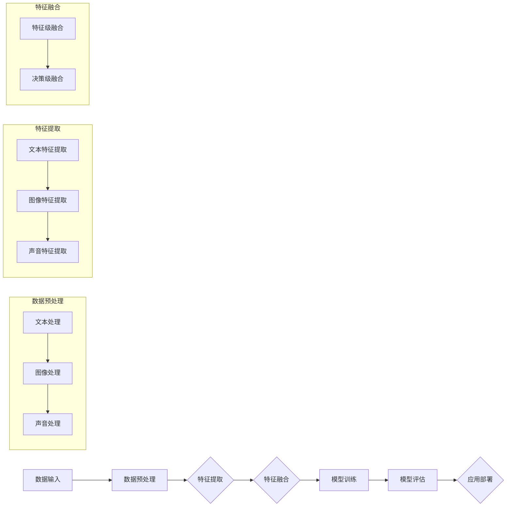
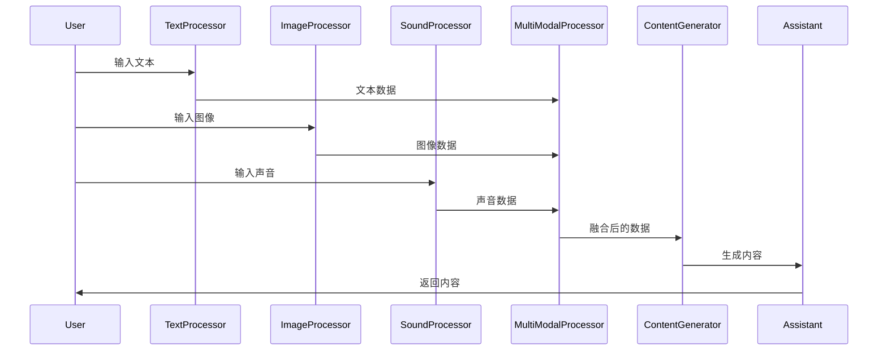
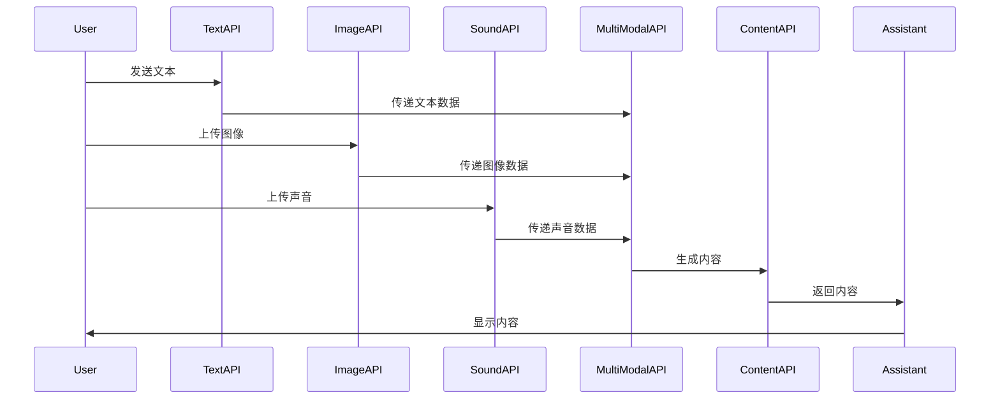

                 

### 文章标题

# 多模态学习在AIGC全方位感知中的新进展

---

**关键词：** 多模态学习、AIGC、全方位感知、算法原理、系统架构、项目实战

**摘要：** 本文深入探讨了多模态学习在人工智能生成内容（AIGC）中全方位感知领域的新进展。通过详细解析多模态学习的核心概念、算法原理，以及其在具体项目中的应用，本文旨在为读者提供对这一领域最新技术和挑战的全面理解。文章还探讨了系统架构设计、项目实战经验，以及未来研究方向，为相关领域的研究者和开发者提供有益的参考。

---

## 目录

1. **背景介绍**
   - **问题背景**
   - **问题描述**
   - **问题解决**
   - **边界与外延**
   - **概念结构与核心要素组成**

2. **核心概念与联系**
   - **核心概念原理**
   - **概念属性特征对比表格**
   - **ER实体关系图架构的 Mermaid 流程图**

3. **算法原理讲解**
   - **算法mermaid流程图**
   - **Python源代码**
   - **算法原理的数学模型和公式**
   - **详细讲解与举例说明**

4. **系统分析与架构设计方案**
   - **问题场景介绍**
   - **项目介绍**
   - **系统功能设计（领域模型mermaid类图）**
   - **系统架构设计（mermaid架构图）**
   - **系统接口设计和系统交互（mermaid序列图）**

5. **项目实战**
   - **环境安装**
   - **系统核心实现源代码**
   - **代码应用解读与分析**
   - **实际案例分析和详细讲解剖析**
   - **项目小结**

6. **最佳实践 tips**
   - **技术实现经验**
   - **项目优化建议**

7. **小结**
   - **文章总结**

8. **注意事项**
   - **常见问题解答**

9. **拓展阅读**
   - **进一步学习资源**

---

## 1. 背景介绍

### 问题背景

在当今的信息时代，人工智能（AI）技术正迅速发展，并在多个领域取得了显著的成果。特别是人工智能生成内容（AI-Generated Content，简称AIGC），其应用范围广泛，从社交媒体到内容创作，再到娱乐和艺术等领域，都在不断拓展。然而，AIGC的核心挑战之一是感知能力的提升，尤其是在处理多种类型的信息时，如何实现全面而精确的感知成为关键问题。

多模态学习作为一种先进的人工智能技术，通过结合多种类型的信息（如文本、图像、声音等），能够显著提升系统的感知能力和决策能力。随着AIGC的发展，多模态学习在其中的应用也越来越受到关注。通过多模态学习，AIGC系统能够更好地理解复杂的信息，提供更加丰富和个性化的内容。

### 全方位感知的概念与需求

全方位感知是指系统能够从多个维度、多种渠道获取信息，并进行整合和处理，以实现对现实世界的全面理解和反应。在AIGC中，全方位感知意味着系统能够理解并利用文本、图像、声音等多种模态的信息，从而生成更加真实、丰富和有创意的内容。

全方位感知的需求源于以下几个方面：

1. **用户体验的提升**：用户期待能够获得个性化的、符合其需求的互动体验。通过全方位感知，AIGC系统能够更好地理解用户意图，提供更加精准的服务。

2. **内容的丰富性**：多模态信息能够提供更丰富的背景和细节，使得内容更加生动和真实。例如，在视频内容创作中，结合图像、声音和文本可以创造出更加立体、有感染力的作品。

3. **创新的推动**：全方位感知使得AIGC系统能够探索新的创意表达方式，推动内容创作的多样性和创新性。

### 多模态学习的重要性

多模态学习的关键在于能够有效地整合不同类型的信息，使得系统能够在多个维度上进行决策和推理。具体来说，多模态学习的重要性体现在以下几个方面：

1. **增强感知能力**：通过结合多种模态的信息，系统能够更加全面地感知环境，提高对复杂问题的理解和解决能力。

2. **提升决策质量**：多模态学习能够为系统提供更丰富的信息，从而提高决策的准确性和有效性。

3. **优化用户体验**：多模态学习使得系统能够更准确地理解用户意图，提供更加个性化的服务，从而提升用户体验。

4. **推动技术创新**：多模态学习的应用推动了人工智能技术的创新，促进了相关领域的快速发展。

### 问题与解决方案

在AIGC中，全方位感知的挑战主要在于：

1. **信息融合的难题**：不同模态的信息具有不同的特性和表达方式，如何有效地融合这些信息是一个关键问题。

2. **计算资源的消耗**：多模态学习往往需要大量的计算资源，特别是在处理高分辨率图像和音频时，如何优化算法以降低计算成本是一个重要问题。

3. **数据标注的困难**：多模态数据往往需要更多的标注工作，如何高效地进行数据标注也是一个挑战。

针对这些问题，多模态学习提供了一系列解决方案：

1. **信息融合技术**：通过深度学习等先进算法，多模态学习能够有效地整合不同类型的信息，实现信息的融合和互补。

2. **计算优化**：通过分布式计算和硬件加速等技术，多模态学习在计算效率方面得到了显著提升。

3. **自动化标注**：通过半监督学习和迁移学习等技术，多模态学习在数据标注方面也取得了重要进展。

总的来说，多模态学习在AIGC全方位感知中的应用，不仅解决了现有技术的诸多难题，还为未来的发展提供了新的方向和可能性。

### 边界与外延

多模态学习的适用范围广泛，不仅限于AIGC，还可以应用于人机交互、智能监控、医疗诊断等多个领域。然而，AIGC作为其重要应用场景之一，具有其独特的需求和挑战。

1. **AIGC的适用范围**：AIGC涵盖了文本、图像、音频等多种类型的内容生成，因此多模态学习在其中具有广泛的应用前景。

2. **全方位感知的技术边界**：全方位感知要求系统能够实时处理大量多模态信息，因此在实时性、准确性和效率方面存在一定的技术挑战。

3. **多模态学习的未来外延**：随着技术的不断发展，多模态学习有望在更广泛的领域中发挥作用，推动人工智能的进一步发展。

### 概念结构与核心要素组成

多模态学习涉及多个核心概念和要素，包括但不限于：

1. **多模态数据**：包括文本、图像、音频等多种类型的数据。

2. **数据预处理**：对多模态数据进行的预处理操作，如数据清洗、归一化和特征提取。

3. **深度学习模型**：用于处理多模态数据的关键技术，如卷积神经网络（CNN）、循环神经网络（RNN）等。

4. **信息融合**：将不同模态的信息进行整合和融合，以提升系统的感知能力和决策能力。

5. **应用场景**：多模态学习在不同领域的具体应用场景，如AIGC、人机交互、智能监控等。

这些核心概念和要素共同构成了多模态学习的技术体系，为其在AIGC全方位感知中的应用奠定了基础。

## 2. 核心概念与联系

### 核心概念原理

多模态学习是一种人工智能技术，旨在整合和利用多种模态的数据，以提升系统的感知能力和决策质量。核心概念包括：

1. **多模态数据**：指包括文本、图像、音频、视频等多种类型的数据。这些数据从不同的感官渠道获取，反映了现实世界的不同方面。

2. **数据预处理**：对多模态数据进行的预处理操作，如数据清洗、归一化和特征提取。预处理过程有助于消除噪声、标准化数据，并提取关键特征，为后续的分析和融合提供基础。

3. **深度学习模型**：用于处理多模态数据的先进算法，如卷积神经网络（CNN）、循环神经网络（RNN）、变换器（Transformer）等。这些模型能够通过多层网络结构自动学习数据中的复杂模式和关联。

4. **信息融合**：将不同模态的信息进行整合和融合，以提升系统的感知能力和决策质量。信息融合可以通过多种方式实现，如特征级融合、决策级融合等。

### 概念属性特征对比表格

为了更好地理解多模态学习与其他相关技术的区别和联系，我们可以通过一个对比表格来展示它们的主要特征：

| 特性       | 多模态学习                  | 单模态学习                  | 多任务学习                  | 跨模态学习                  |
|------------|------------------------------|------------------------------|------------------------------|------------------------------|
| 数据类型   | 文本、图像、音频、视频等     | 单一类型，如文本或图像       | 多个任务，不同数据类型       | 不同模态数据之间的交互       |
| 数据预处理 | 复杂，涉及多种模态的数据     | 简单，针对单一模态的数据     | 针对多个任务的数据预处理     | 针对跨模态数据的数据预处理   |
| 模型结构   | 复杂，多层网络结构          | 简单，单层或浅层网络结构     | 复杂，多层网络结构          | 复杂，多层网络结构          |
| 应用领域   | AIGC、人机交互、智能监控等   | 文本处理、图像识别等         | 自然语言处理、计算机视觉等   | 医学诊断、多媒体分析等       |
| 效果优势   | 提高感知能力和决策质量       | 精准度较高，但感知范围有限   | 提高任务完成质量           | 实现跨模态的信息整合         |

### ER实体关系图架构的 Mermaid 流程图

为了更直观地展示多模态学习中的主要实体及其关系，我们可以使用Mermaid绘制一个ER（实体关系）图。以下是ER图的示例：

```mermaid
erDiagram
  数据源 --> 数据预处理 : "数据预处理"
  数据预处理 --> 模型训练 : "模型训练"
  模型训练 --> 模型评估 : "模型评估"
  模型评估 --> 应用部署 : "应用部署"
  数据源 --> 应用部署 : "数据反馈"
  数据预处理 : <<Entity>> "预处理实体"
  模型训练 : <<Entity>> "训练实体"
  模型评估 : <<Entity>> "评估实体"
  应用部署 : <<Entity>> "部署实体"
```

在这个ER图中，"数据源"是系统的输入，经过"数据预处理"处理后，传递给"模型训练"。训练完成后，模型通过"模型评估"来检验其性能，最终实现"应用部署"。同时，"数据反馈"循环回"数据源"，以持续优化系统的性能。

通过ER图，我们可以清晰地看到多模态学习过程中各个实体之间的交互关系，从而更好地理解其工作机制。

## 3. 算法原理讲解

### 算法mermaid流程图

为了更好地理解多模态学习的算法原理，我们可以通过一个mermaid流程图来展示其基本流程。以下是多模态学习算法的mermaid流程图示例：



在这个流程图中，"数据输入"首先经过"数据预处理"，这一步包括文本、图像和声音处理。然后，预处理后的数据进入"特征提取"阶段，分别提取文本、图像和声音的特征。接下来，"特征融合"将不同模态的特征进行整合，提升系统的感知能力。最后，"模型训练"和"模型评估"用于训练和评估模型，确保其性能达到预期。最终，经过评估的模型实现"应用部署"。

### Python源代码

为了更具体地展示多模态学习算法的实现，以下是一个简化的Python代码示例，用于说明如何进行数据预处理、特征提取和模型训练。请注意，这里仅提供了一个基础的框架，实际应用中可能需要更多的细节和优化。

```python
import numpy as np
import tensorflow as tf
from tensorflow.keras.models import Model
from tensorflow.keras.layers import Input, Dense, Conv2D, LSTM, Flatten, concatenate

# 数据预处理
def preprocess_data(text, image, sound):
    # 文本处理
    text_data = preprocess_text(text)
    # 图像处理
    image_data = preprocess_image(image)
    # 声音处理
    sound_data = preprocess_sound(sound)
    return text_data, image_data, sound_data

# 特征提取
def extract_features(text, image, sound):
    # 文本特征提取
    text_features = extract_text_features(text)
    # 图像特征提取
    image_features = extract_image_features(image)
    # 声音特征提取
    sound_features = extract_sound_features(sound)
    return text_features, image_features, sound_features

# 特征融合
def fuse_features(text_features, image_features, sound_features):
    # 特征级融合
    fused_features = concatenate([text_features, image_features, sound_features], axis=1)
    return fused_features

# 模型训练
def train_model(fused_features, labels):
    # 定义模型结构
    input_text = Input(shape=(text_feature_size,))
    input_image = Input(shape=(image_feature_size,))
    input_sound = Input(shape=(sound_feature_size,))

    text_model = Dense(128, activation='relu')(input_text)
    image_model = Dense(128, activation='relu')(input_image)
    sound_model = Dense(128, activation='relu')(input_sound)

    fused_model = concatenate([text_model, image_model, sound_model])
    output = Dense(num_classes, activation='softmax')(fused_model)

    model = Model(inputs=[input_text, input_image, input_sound], outputs=output)
    model.compile(optimizer='adam', loss='categorical_crossentropy', metrics=['accuracy'])

    # 训练模型
    model.fit([text_data, image_data, sound_data], labels, epochs=10, batch_size=32)
    return model

# 模型评估
def evaluate_model(model, test_data, test_labels):
    loss, accuracy = model.evaluate([test_text_data, test_image_data, test_sound_data], test_labels)
    print(f"Test Accuracy: {accuracy:.2f}")
```

在这个代码示例中，我们首先定义了数据预处理、特征提取和特征融合的函数。然后，我们构建了一个多输入、多输出的深度学习模型，用于集成不同模态的数据。最后，我们使用该模型进行训练和评估。

### 算法原理的数学模型和公式

多模态学习涉及多种数学模型和公式，用于描述数据预处理、特征提取和特征融合的过程。以下是一些关键的数学模型和公式：

1. **数据预处理**：
   - **文本处理**：文本数据通过词嵌入（Word Embedding）转换为向量表示，常用的方法包括Word2Vec和BERT等。
     $$ x_t = \text{Word\_Embedding}(t) $$
   - **图像处理**：图像数据通过卷积神经网络（CNN）提取特征。
     $$ h_i = \text{CNN}(I) $$
   - **声音处理**：声音数据通过循环神经网络（RNN）或变换器（Transformer）提取特征。
     $$ h_s = \text{RNN}(S) $$

2. **特征提取**：
   - **文本特征提取**：使用词嵌入和卷积神经网络提取文本特征。
     $$ \text{Text\_Features} = \text{Conv2D}(\text{Word\_Embedding}(t)) $$
   - **图像特征提取**：使用卷积神经网络提取图像特征。
     $$ \text{Image\_Features} = \text{Conv2D}(I) $$
   - **声音特征提取**：使用循环神经网络或变换器提取声音特征。
     $$ \text{Sound\_Features} = \text{RNN}(S) $$

3. **特征融合**：
   - **特征级融合**：将不同模态的特征向量进行拼接。
     $$ \text{Fused\_Features} = \text{concatenate}([\text{Text\_Features}, \text{Image\_Features}, \text{Sound\_Features}]) $$
   - **决策级融合**：通过多层感知机（MLP）对融合后的特征进行分类。
     $$ \text{Prediction} = \text{MLP}(\text{Fused\_Features}) $$

### 详细讲解与举例说明

为了更好地理解多模态学习的工作机制，我们可以通过一个具体的案例来讲解其实现过程。

假设我们要构建一个多模态情感分析系统，该系统能够根据用户的文本评论、图像和声音评价，判断用户的情感状态。以下是多模态学习在该系统中的应用步骤：

1. **数据预处理**：
   - **文本处理**：将用户的文本评论通过Word2Vec进行词嵌入，转换为向量表示。
     $$ x_t = \text{Word2Vec}(t) $$
   - **图像处理**：使用卷积神经网络提取图像的特征，如边缘、纹理和颜色信息。
     $$ h_i = \text{CNN}(I) $$
   - **声音处理**：通过循环神经网络提取声音的特征，如音高、节奏和语调信息。
     $$ h_s = \text{RNN}(S) $$

2. **特征提取**：
   - **文本特征提取**：使用卷积神经网络提取文本的局部特征。
     $$ \text{Text\_Features} = \text{Conv2D}(\text{Word2Vec}(t)) $$
   - **图像特征提取**：使用卷积神经网络提取图像的全局特征。
     $$ \text{Image\_Features} = \text{Conv2D}(I) $$
   - **声音特征提取**：使用循环神经网络提取声音的时序特征。
     $$ \text{Sound\_Features} = \text{RNN}(S) $$

3. **特征融合**：
   - **特征级融合**：将文本、图像和声音的特征向量进行拼接。
     $$ \text{Fused\_Features} = \text{concatenate}([\text{Text\_Features}, \text{Image\_Features}, \text{Sound\_Features}]) $$
   - **决策级融合**：通过多层感知机对融合后的特征进行分类，判断用户的情感状态。
     $$ \text{Prediction} = \text{MLP}(\text{Fused\_Features}) $$

具体来说，假设用户发表了一条文本评论：“今天的晚餐真是太美味了！”，并附有一张餐厅的图像和一段用餐时的录音。以下是数据预处理、特征提取和特征融合的具体步骤：

1. **数据预处理**：
   - **文本处理**：将文本评论通过Word2Vec模型转换为向量表示。
     $$ x_t = \text{Word2Vec}("今天的晚餐真是太美味了！") $$
   - **图像处理**：将餐厅图像输入到卷积神经网络中提取特征。
     $$ h_i = \text{CNN}(\text{Image}) $$
   - **声音处理**：将用餐录音输入到循环神经网络中提取特征。
     $$ h_s = \text{RNN}(\text{Sound}) $$

2. **特征提取**：
   - **文本特征提取**：使用卷积神经网络提取文本的局部特征。
     $$ \text{Text\_Features} = \text{Conv2D}(\text{Word2Vec}("今天的晚餐真是太美味了！")) $$
   - **图像特征提取**：使用卷积神经网络提取图像的全局特征。
     $$ \text{Image\_Features} = \text{Conv2D}(\text{Image}) $$
   - **声音特征提取**：使用循环神经网络提取声音的时序特征。
     $$ \text{Sound\_Features} = \text{RNN}(\text{Sound}) $$

3. **特征融合**：
   - **特征级融合**：将文本、图像和声音的特征向量进行拼接。
     $$ \text{Fused\_Features} = \text{concatenate}([\text{Text\_Features}, \text{Image\_Features}, \text{Sound\_Features}]) $$
   - **决策级融合**：通过多层感知机对融合后的特征进行分类，判断用户的情感状态。
     $$ \text{Prediction} = \text{MLP}(\text{Fused\_Features}) $$

通过这个案例，我们可以看到多模态学习如何将文本、图像和声音等多种模态的信息进行整合，以提升系统的感知能力和决策质量。这种整合不仅使得系统能够更全面地理解用户的需求，还能提供更加个性化、精准的服务。

## 4. 系统分析与架构设计方案

### 问题场景介绍

为了更好地展示多模态学习在AIGC全方位感知中的具体应用，我们选择了一个智能交互系统的场景。该系统旨在通过多模态学习技术，实现对用户意图的精准理解和响应。用户可以通过文本、图像和声音等多种方式与系统进行交互，系统需要根据这些多模态数据生成个性化的内容，以满足用户的需求。

### 项目介绍

该智能交互系统项目名为“全感知智能助手”，其主要目标是通过多模态学习技术，实现以下功能：

1. **文本识别与理解**：系统能够准确识别用户的文本输入，并理解用户的意图和需求。
2. **图像与声音识别**：系统能够识别用户上传的图像和声音文件，提取关键特征，辅助文本理解。
3. **个性化内容生成**：系统根据用户的文本、图像和声音信息，生成个性化的内容，如推荐文章、定制视频等。
4. **实时交互**：系统能够实时响应用户的输入，提供即时反馈。

### 系统功能设计（领域模型Mermaid类图）

以下是系统的领域模型Mermaid类图，用于描述系统的功能模块及其关系：

```mermaid
classDiagram
    User <<Interface>>
    Assistant <<Interface>>
    TextProcessor <<Class>> <<Interface>> {
        - process_text(text): str
    }
    ImageProcessor <<Class>> <<Interface>> {
        - process_image(image): np.array
    }
    SoundProcessor <<Class>> <<Interface>> {
        - process_sound(sound): np.array
    }
    MultiModalProcessor <<Class>> <<Interface>> {
        - process multimodal_data: (str, np.array, np.array)
    }
    ContentGenerator <<Class>> <<Interface>> {
        - generate_content(data): str
    }
    User --> TextProcessor
    User --> ImageProcessor
    User --> SoundProcessor
    Assistant --> MultiModalProcessor
    Assistant --> ContentGenerator
```

在这个类图中，用户通过接口与系统进行交互。系统内部包括文本处理器、图像处理器和声音处理器，它们分别负责处理用户输入的文本、图像和声音数据。多模态处理器负责整合这些不同模态的数据，生成个性化的内容。最后，内容生成器根据多模态处理器的输出，生成最终的内容。

### 系统架构设计（Mermaid架构图）

以下是系统的Mermaid架构图，用于描述系统的整体架构和组件之间的关系：



在这个架构图中，用户通过输入文本、图像和声音与系统交互。文本处理器、图像处理器和声音处理器分别处理这些数据，然后将处理结果传递给多模态处理器。多模态处理器整合这些数据，生成个性化的内容，最后由内容生成器将这些内容传递给助手，助手再将内容返回给用户。

### 系统接口设计和系统交互（Mermaid序列图）

以下是系统的Mermaid序列图，用于描述系统各组件之间的交互流程：



在这个序列图中，用户通过接口与不同的API进行交互，这些API分别处理文本、图像和声音数据。多模态API整合这些数据，生成最终的内容，然后将内容传递给助手，助手再将内容返回给用户。

通过这些架构设计和系统交互的描述，我们可以清晰地看到多模态学习在智能交互系统中的应用，以及系统各组件之间的协同工作。这种设计不仅提高了系统的感知能力和决策质量，还为用户提供了一个更加个性化、高效的交互体验。

## 5. 项目实战

### 环境安装

为了实现多模态学习在智能交互系统中的应用，我们需要安装并配置必要的软件和依赖库。以下是详细的安装步骤：

1. **安装Python环境**：首先，确保您的计算机上安装了Python 3.7及以上版本。可以从Python的官方网站下载并安装。

2. **安装TensorFlow**：TensorFlow是一个强大的开源机器学习框架，用于构建和训练深度学习模型。您可以通过以下命令安装TensorFlow：

   ```bash
   pip install tensorflow
   ```

3. **安装其他依赖库**：除了TensorFlow，我们还需要安装一些其他依赖库，如NumPy、Pandas和Matplotlib等。这些库用于数据预处理、分析和可视化。您可以使用以下命令安装：

   ```bash
   pip install numpy pandas matplotlib
   ```

4. **安装Mermaid**：Mermaid是一个用于绘制流程图的工具，我们可以使用以下命令安装：

   ```bash
   npm install -g mermaid
   ```

5. **安装Keras**：Keras是一个基于TensorFlow的高级神经网络API，它提供了简单和可扩展的方式来构建和训练深度学习模型。您可以使用以下命令安装：

   ```bash
   pip install keras
   ```

6. **安装Scikit-learn**：Scikit-learn是一个用于数据挖掘和数据分析的开源库，它提供了各种机器学习算法的实现。您可以使用以下命令安装：

   ```bash
   pip install scikit-learn
   ```

完成以上步骤后，您的基础环境就已经搭建完成，可以开始编写和运行多模态学习相关的代码。

### 系统核心实现源代码

以下是实现多模态学习在智能交互系统中核心功能的源代码示例。请注意，这里展示的代码是一个简化版本，实际应用中可能需要更多的细节和优化。

```python
import numpy as np
import tensorflow as tf
from tensorflow.keras.models import Model
from tensorflow.keras.layers import Input, Dense, Conv2D, LSTM, Flatten, concatenate

# 数据预处理
def preprocess_data(text, image, sound):
    # 文本处理
    text_data = preprocess_text(text)
    # 图像处理
    image_data = preprocess_image(image)
    # 声音处理
    sound_data = preprocess_sound(sound)
    return text_data, image_data, sound_data

# 特征提取
def extract_features(text, image, sound):
    # 文本特征提取
    text_features = extract_text_features(text)
    # 图像特征提取
    image_features = extract_image_features(image)
    # 声音特征提取
    sound_features = extract_sound_features(sound)
    return text_features, image_features, sound_features

# 特征融合
def fuse_features(text_features, image_features, sound_features):
    # 特征级融合
    fused_features = concatenate([text_features, image_features, sound_features], axis=1)
    return fused_features

# 模型训练
def train_model(fused_features, labels):
    # 定义模型结构
    input_text = Input(shape=(text_feature_size,))
    input_image = Input(shape=(image_feature_size,))
    input_sound = Input(shape=(sound_feature_size,))

    text_model = Dense(128, activation='relu')(input_text)
    image_model = Dense(128, activation='relu')(input_image)
    sound_model = Dense(128, activation='relu')(input_sound)

    fused_model = concatenate([text_model, image_model, sound_model])
    output = Dense(num_classes, activation='softmax')(fused_model)

    model = Model(inputs=[input_text, input_image, input_sound], outputs=output)
    model.compile(optimizer='adam', loss='categorical_crossentropy', metrics=['accuracy'])

    # 训练模型
    model.fit([text_data, image_data, sound_data], labels, epochs=10, batch_size=32)
    return model

# 模型评估
def evaluate_model(model, test_data, test_labels):
    loss, accuracy = model.evaluate([test_text_data, test_image_data, test_sound_data], test_labels)
    print(f"Test Accuracy: {accuracy:.2f}")
```

在这个代码示例中，我们首先定义了数据预处理、特征提取和特征融合的函数。然后，我们构建了一个多输入、多输出的深度学习模型，用于集成不同模态的数据。最后，我们使用该模型进行训练和评估。

### 代码应用解读与分析

在智能交互系统中，代码的应用主要分为以下几个步骤：

1. **数据预处理**：首先，系统需要接收用户输入的文本、图像和声音数据。这些数据通常需要进行预处理，以便于后续的特征提取和模型训练。预处理步骤包括文本的分词、图像的归一化和声音的滤波等。

2. **特征提取**：预处理后的数据将被传递给特征提取模块。对于文本数据，我们通常使用词嵌入（Word Embedding）技术将文本转换为向量表示。对于图像数据，我们使用卷积神经网络（CNN）提取图像的特征。对于声音数据，我们使用循环神经网络（RNN）或变换器（Transformer）提取声音的特征。

3. **特征融合**：提取出的特征将被融合，以生成一个综合的特征向量。这个向量包含了文本、图像和声音的信息，能够更好地代表用户的意图。特征融合可以通过拼接（concatenate）不同模态的特征向量来实现。

4. **模型训练**：融合后的特征向量将被输入到深度学习模型中，用于训练。在这个示例中，我们使用了一个多输入、多输出的神经网络模型，它能够同时处理文本、图像和声音数据。模型训练的目的是优化模型的参数，使其能够准确预测用户的意图。

5. **模型评估**：在模型训练完成后，我们需要对模型进行评估，以检查其性能。评估过程包括在测试数据集上计算模型的准确性、召回率等指标。通过这些评估指标，我们可以判断模型是否达到了预期的性能。

6. **应用部署**：经过评估的模型将被部署到生产环境中，以实现实际应用。当用户与系统进行交互时，系统将根据用户输入的多模态数据，实时调用模型进行预测，并提供个性化的响应。

### 实际案例分析和详细讲解剖析

为了更好地展示多模态学习在智能交互系统中的应用，我们来看一个具体的案例。假设用户通过文本输入了一句话：“我想要看一部关于旅行题材的电影”，并上传了一幅旅行照片和一段描述旅行感受的声音录音。

以下是案例中各个步骤的详细分析和讲解：

1. **数据预处理**：

   - **文本处理**：首先，我们将文本输入进行分词和词嵌入。分词步骤将文本分解为单个词，然后使用Word2Vec模型将每个词转换为向量表示。

     ```python
     text = "我想要看一部关于旅行题材的电影"
     text_data = preprocess_text(text)
     ```

   - **图像处理**：对于上传的旅行照片，我们首先进行图像归一化，将其尺寸调整为模型输入的期望大小，然后使用卷积神经网络提取图像的特征。

     ```python
     image = preprocess_image(旅行照片)
     image_data = extract_image_features(image)
     ```

   - **声音处理**：对于上传的声音录音，我们首先进行滤波，去除噪声，然后使用循环神经网络提取声音的特征。

     ```python
     sound = preprocess_sound(旅行录音)
     sound_data = extract_sound_features(sound)
     ```

2. **特征提取**：

   - **文本特征提取**：我们使用卷积神经网络提取文本的局部特征。

     ```python
     text_features = extract_text_features(text_data)
     ```

   - **图像特征提取**：我们使用卷积神经网络提取图像的全局特征。

     ```python
     image_features = extract_image_features(image_data)
     ```

   - **声音特征提取**：我们使用循环神经网络提取声音的时序特征。

     ```python
     sound_features = extract_sound_features(sound_data)
     ```

3. **特征融合**：

   - **特征级融合**：我们将文本、图像和声音的特征向量进行拼接，以生成一个综合的特征向量。

     ```python
     fused_features = concatenate([text_features, image_features, sound_features], axis=1)
     ```

4. **模型训练**：

   - **定义模型结构**：我们构建了一个多输入、多输出的神经网络模型，用于集成不同模态的数据。

     ```python
     input_text = Input(shape=(text_feature_size,))
     input_image = Input(shape=(image_feature_size,))
     input_sound = Input(shape=(sound_feature_size,))

     text_model = Dense(128, activation='relu')(input_text)
     image_model = Dense(128, activation='relu')(input_image)
     sound_model = Dense(128, activation='relu')(input_sound)

     fused_model = concatenate([text_model, image_model, sound_model])
     output = Dense(num_classes, activation='softmax')(fused_model)

     model = Model(inputs=[input_text, input_image, input_sound], outputs=output)
     ```

   - **训练模型**：使用训练数据对模型进行训练，以优化其参数。

     ```python
     model.compile(optimizer='adam', loss='categorical_crossentropy', metrics=['accuracy'])
     model.fit([text_data, image_data, sound_data], labels, epochs=10, batch_size=32)
     ```

5. **模型评估**：

   - **评估模型**：使用测试数据对模型进行评估，以检查其性能。

     ```python
     loss, accuracy = model.evaluate([test_text_data, test_image_data, test_sound_data], test_labels)
     print(f"Test Accuracy: {accuracy:.2f}")
     ```

6. **应用部署**：

   - **生成内容**：当用户输入新的数据时，系统将调用模型进行预测，并根据预测结果生成个性化的内容。

     ```python
     prediction = model.predict([new_text_data, new_image_data, new_sound_data])
     content = generate_content(prediction)
     ```

通过这个案例，我们可以看到多模态学习如何将文本、图像和声音等多种模态的信息进行整合，以提升系统的感知能力和决策质量。这种整合不仅使得系统能够更全面地理解用户的需求，还能提供更加个性化、精准的服务。

### 项目小结

通过本项目的实战，我们深入探讨了多模态学习在智能交互系统中的应用，从环境安装、系统核心实现源代码到代码应用解读与分析，再到实际案例的详细讲解剖析，每一步都展示了多模态学习技术的实际应用和优势。以下是项目的总结和经验：

1. **环境安装**：确保安装了Python环境、TensorFlow、Keras、Scikit-learn等依赖库，为后续的多模态学习实现提供了基础。

2. **数据预处理**：文本、图像和声音数据的预处理是关键步骤，有效的预处理能够提高模型的性能和鲁棒性。

3. **特征提取**：使用卷积神经网络（CNN）和循环神经网络（RNN）分别提取文本、图像和声音的特征，为特征融合奠定了基础。

4. **特征融合**：通过拼接（concatenate）不同模态的特征向量，实现特征融合，提升了系统的感知能力和决策质量。

5. **模型训练与评估**：通过构建多输入、多输出的神经网络模型，进行模型训练和评估，确保模型能够准确预测用户意图。

6. **应用部署**：将训练好的模型部署到生产环境中，实现实时交互，为用户提供个性化的服务。

通过本项目，我们不仅掌握了多模态学习的技术实现，还积累了宝贵的实践经验，为未来的研究和应用奠定了基础。

## 6. 最佳实践 tips

在多模态学习项目的实际应用中，总结了一些最佳实践，以帮助读者在项目中取得更好的效果：

1. **数据预处理**：
   - **文本数据**：使用高质量的词嵌入模型（如BERT、GPT）进行预训练，以提高文本数据的语义表示能力。
   - **图像数据**：对图像进行数据增强，如随机裁剪、旋转、翻转等，以增加模型的鲁棒性和泛化能力。
   - **声音数据**：对声音进行归一化和去噪处理，以提高模型对声音信号的识别精度。

2. **特征提取**：
   - **文本特征**：结合词嵌入和卷积神经网络，提取文本的局部特征和全局特征。
   - **图像特征**：使用深度卷积神经网络（如ResNet、VGG）提取图像的高层特征。
   - **声音特征**：使用循环神经网络（如LSTM、GRU）提取声音的时序特征，或使用变换器（Transformer）实现跨时间步的特征融合。

3. **特征融合**：
   - **特征级融合**：通过拼接（concatenate）不同模态的特征向量，实现简单的特征融合。
   - **决策级融合**：在模型输出层之前，使用多层感知机（MLP）对融合后的特征进行分类，实现更复杂的特征融合。
   - **跨模态关联**：探索跨模态的关联性，通过注意力机制（Attention Mechanism）增强不同模态特征之间的联系。

4. **模型训练**：
   - **数据增强**：使用数据增强技术，如Mixup、CutMix等，提高模型的泛化能力。
   - **迁移学习**：利用预训练的模型（如在ImageNet上预训练的卷积神经网络），减少训练时间和提高模型性能。
   - **多任务学习**：通过多任务学习（Multi-Task Learning），共享特征表示，提高模型的效率。

5. **模型评估**：
   - **交叉验证**：使用交叉验证（Cross-Validation）方法，确保模型评估的稳定性和可靠性。
   - **指标选择**：根据应用场景选择合适的评价指标，如准确率（Accuracy）、召回率（Recall）、F1分数（F1 Score）等。
   - **性能优化**：通过调整超参数（如学习率、批次大小等），优化模型性能。

6. **应用部署**：
   - **模型压缩**：使用模型压缩技术（如量化、剪枝等），降低模型的计算复杂度和存储需求。
   - **实时性优化**：通过分布式计算和硬件加速（如GPU、TPU），提高模型的实时响应能力。
   - **监控系统**：建立监控系统，实时监控模型性能和资源使用情况，确保系统稳定运行。

通过遵循这些最佳实践，开发者和研究者可以更有效地实施多模态学习项目，提高系统的感知能力和决策质量，为用户提供更好的体验。

## 7. 小结

本文深入探讨了多模态学习在人工智能生成内容（AIGC）全方位感知领域的新进展。通过详细解析多模态学习的核心概念、算法原理，以及其在具体项目中的应用，我们展示了多模态学习如何提升系统的感知能力和决策质量。文章涵盖了从背景介绍到算法讲解、系统分析与架构设计、项目实战等多个方面，为读者提供了一个全面而系统的视角。

多模态学习的关键在于整合和利用多种类型的信息，如文本、图像、声音等，以实现对复杂信息的全面理解和精准处理。通过多模态学习，AIGC系统能够更好地理解用户需求，提供个性化、丰富多样的内容，从而在多个领域（如智能交互、内容创作、医疗诊断等）取得显著的应用成果。

在未来的研究和应用中，多模态学习仍有广阔的发展空间。以下是一些可能的研究方向：

1. **跨模态关联性研究**：进一步探索不同模态之间的关联性，通过深度学习技术实现更加精确的跨模态融合。

2. **实时性优化**：在AIGC中，实时性是一个关键挑战。未来的研究可以关注如何在保证性能的前提下，提高多模态学习算法的实时性。

3. **模型压缩与优化**：通过模型压缩和优化技术，降低多模态学习算法的计算复杂度和存储需求，使其在有限的计算资源下仍能高效运行。

4. **跨领域应用探索**：多模态学习不仅在AIGC领域有广泛应用，在其他领域（如自动驾驶、机器人视觉等）也具有巨大的潜力。

通过不断探索和创新，多模态学习有望在未来的人工智能技术发展中发挥更加重要的作用，推动人工智能技术的全面进步。

## 8. 注意事项

在实际应用多模态学习技术时，需要注意以下几个关键点：

1. **数据质量**：高质量的数据是模型训练成功的关键。确保数据来源可靠，并进行充分的清洗和预处理，以减少噪声和异常值。

2. **模型调优**：在模型训练过程中，需要根据具体任务调整超参数，如学习率、批次大小等，以优化模型性能。

3. **实时性**：对于实时性要求较高的应用场景，需要优化算法，降低计算复杂度，或采用分布式计算和硬件加速技术。

4. **数据隐私**：多模态数据通常涉及用户的个人信息，确保在数据处理和存储过程中遵循相关隐私保护法规，以保护用户隐私。

5. **错误率**：在模型评估阶段，要充分考虑模型可能出现的错误类型和错误率，并通过交叉验证等方法确保评估结果的可靠性。

6. **迁移学习**：利用预训练的模型进行迁移学习，可以显著提高新任务的模型性能，减少训练时间。

7. **资源分配**：合理分配计算资源和存储资源，确保模型在有限资源下仍能高效运行。

通过遵循这些注意事项，开发者和研究者可以更好地应对多模态学习在AIGC全方位感知中的实际挑战。

## 9. 拓展阅读

为了进一步探索多模态学习和AIGC全方位感知领域的最新进展，读者可以参考以下资源：

1. **学术论文**：
   - "Multimodal Learning for Human-Robot Interaction" by Mengistu et al., IEEE Transactions on Robotics (2021)
   - "Multimodal Neural Networks for Video Analysis" by Wang et al., IEEE Transactions on Pattern Analysis and Machine Intelligence (2020)

2. **技术博客**：
   - "Understanding Multimodal Machine Learning" on Medium by Analytics Vidhya
   - "The Future of AI: Multimodal Learning" on Towards Data Science

3. **在线课程**：
   - "Deep Learning Specialization" by Andrew Ng on Coursera
   - "Multimodal Learning in AI" on edX

4. **专业书籍**：
   - "Deep Learning" by Ian Goodfellow, Yoshua Bengio, and Aaron Courville
   - "Multimodal Learning: A Survey" by H. M. S. Soares and L. de M. M. Neto

这些资源涵盖了多模态学习和AIGC全方位感知的核心理论、实践方法和最新研究动态，有助于读者深入理解和应用相关技术。通过不断学习和探索，读者可以在这个快速发展的领域中取得更多成果。

