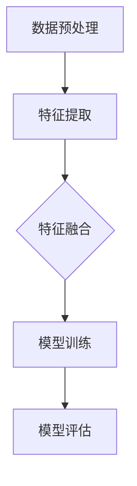

                 

# 多模态融合能力评测：全面检验模型理解力

## 关键词

- 多模态融合
- 模型评测
- 理解力检验
- 机器学习
- 深度学习

## 摘要

本文旨在探讨多模态融合能力评测的重要性，以及如何全面检验模型的理解力。随着人工智能技术的飞速发展，多模态融合成为了一个热门的研究领域。本文将介绍多模态融合的基本概念、技术原理，并通过具体的算法讲解和实际案例剖析，展示如何通过评测来评估模型对多模态数据的理解能力。此外，还将提供最佳实践技巧和小结，帮助读者更好地理解和应用多模态融合技术。

## 引言与背景

### 1.1 问题背景

在现代社会，数据来源日益多样化，包括文本、图像、音频等多种形式。传统的单模态学习方法难以充分利用这些多样化的数据源，而多模态融合技术则能够将不同类型的数据进行整合，以提升模型的性能和鲁棒性。例如，在视频分析中，结合图像和音频数据可以更准确地识别动作和情感；在自然语言处理中，结合文本和语音数据可以提高语音识别和翻译的准确性。

### 1.2 当前评测方法的局限性

现有的评测方法主要关注模型在特定任务上的性能，如识别率、准确率等，但往往忽视了模型对多模态数据的理解能力。这种评测方式难以全面反映模型在不同情境下的表现，特别是在复杂任务中，模型的理解力显得尤为重要。

### 1.3 本书的目的与结构

本文的主要目的是提出一套全面的多模态融合能力评测方法，以检验模型对多模态数据的理解力。文章结构如下：

1. 引言与背景：介绍多模态融合的需求和当前评测方法的局限性。
2. 多模态融合基础：阐述多模态数据的基本概念和融合技术。
3. 多模态融合算法原理：讲解多模态融合的算法原理和数学模型。
4. 数学模型与公式详解：详细阐述多模态融合算法的数学模型和公式。
5. 系统分析与架构设计：介绍多模态融合系统的设计和实现。
6. 项目实战：通过实际案例展示多模态融合的应用。
7. 最佳实践与拓展：提供多模态融合技术的最佳实践和拓展阅读。

## 多模态融合基础

### 2.1 多模态数据概述

多模态数据是指包含两种或两种以上不同类型数据的集合。常见的多模态数据包括：

- **视觉数据**：包括图像和视频，是人工智能领域最常见的数据类型之一。
- **音频数据**：包括语音、音乐和其他声音信号，是自然语言处理和语音识别的重要数据源。
- **文本数据**：包括自然语言文本，是信息检索和文本分析的重要数据源。

### 2.2 多模态融合技术

多模态融合技术主要包括以下几种：

- **数据级融合**：直接将不同类型的数据进行合并，如将图像和音频数据进行拼接。
- **特征级融合**：将不同类型的数据转换为特征向量，然后进行特征融合，如使用神经网络将图像和音频数据分别处理，然后融合特征向量。
- **决策级融合**：在决策层面将不同模态的数据进行融合，如使用投票机制或集成学习。

## 多模态融合算法原理

### 3.1 算法概述

多模态融合算法的核心是能够有效地整合不同类型的数据，以提升模型在特定任务上的性能。以下是一个简化的多模态融合算法流程：

1. 数据预处理：对多模态数据进行清洗、归一化和特征提取。
2. 特征融合：将不同类型的数据转换为特征向量，并进行融合。
3. 模型训练：使用融合后的特征进行模型训练。
4. 模型评估：评估模型在特定任务上的性能。

### 3.2 Mermaid流程图展示

以下是一个简单的Mermaid流程图，展示多模态融合算法的基本流程：



### 3.3 Python源代码讲解

下面是一个简单的Python代码示例，展示如何使用特征级融合方法将图像和音频数据融合：

```python
import numpy as np
import cv2
import librosa

# 图像预处理
def preprocess_image(image_path):
    image = cv2.imread(image_path)
    image = cv2.resize(image, (224, 224))
    image = image / 255.0
    return image

# 音频预处理
def preprocess_audio(audio_path):
    audio, _ = librosa.load(audio_path, sr=22050)
    audio = librosa.feature.mfcc(y=audio, sr=22050, n_mfcc=13)
    return audio

# 特征提取
image = preprocess_image('image.jpg')
audio = preprocess_audio('audio.wav')

# 特征融合
def fuse_features(image, audio):
    image_features = np.mean(image, axis=(0, 1))
    audio_features = np.mean(audio, axis=1)
    fused_features = np.concatenate((image_features, audio_features), axis=0)
    return fused_features

fused_features = fuse_features(image, audio)

# 模型训练和评估略
```

### 3.4 数学模型与公式讲解

多模态融合算法的数学模型通常涉及到特征融合和模型训练两个主要部分。以下是一个简化的数学模型：

$$
X_{fused} = F(X_{image}, X_{audio})
$$

其中，$X_{image}$和$X_{audio}$分别代表图像和音频的特征向量，$X_{fused}$是融合后的特征向量，$F$是特征融合函数。

常见的特征融合函数包括加法融合、乘法融合和神经网络融合等。以下是一个简单的加法融合公式：

$$
X_{fused} = X_{image} + X_{audio}
$$

在模型训练阶段，通常使用损失函数和优化算法来训练模型。以下是一个简单的损失函数和优化算法：

$$
J(\theta) = \frac{1}{m}\sum_{i=1}^{m}(h_\theta(x^{(i)}) - y^{(i)})
$$

$$
\theta = \theta - \alpha \frac{\partial J(\theta)}{\partial \theta}
$$

其中，$h_\theta(x)$是模型预测，$y$是真实标签，$\theta$是模型参数，$\alpha$是学习率。

## 数学模型与公式详解

### 4.1 相关数学背景

在多模态融合中，我们通常涉及到以下数学背景：

- **概率论**：用于描述数据的随机性和不确定性。
- **线性代数**：用于处理高维数据和特征空间。
- **微积分**：用于优化模型参数。

### 4.2 具体模型与公式

#### 4.2.1 模型一：加法融合

假设图像特征为$X_{image}$，音频特征为$X_{audio}$，加法融合公式如下：

$$
X_{fused} = X_{image} + X_{audio}
$$

#### 4.2.2 模型二：神经网络融合

神经网络融合是一种更为复杂的特征融合方法，其基本思想是将不同模态的数据输入到神经网络中，通过多层非线性变换进行融合。以下是一个简化的神经网络融合模型：

$$
h_{\theta}(x) = \sigma(\theta_2 \cdot \sigma(\theta_1 \cdot [X_{image}; X_{audio}]))
$$

其中，$\sigma$是激活函数，$[\cdot; \cdot]$是拼接操作。

## 系统分析与架构设计

### 5.1 问题场景介绍

假设我们要开发一个多模态情感分析系统，该系统能够根据用户的图像、语音和文本评论，分析用户的情感状态。

### 5.2 系统功能设计

该系统的主要功能包括：

- 数据预处理：对图像、语音和文本数据进行清洗、归一化和特征提取。
- 特征融合：将不同类型的数据特征进行融合。
- 模型训练：使用融合后的特征训练情感分析模型。
- 模型评估：评估模型的性能。

### 5.3 系统架构设计

该系统的架构设计如下：

- 数据层：包括图像、语音和文本数据。
- 特征层：包括预处理后的图像、语音和文本特征。
- 模型层：包括特征融合网络和情感分析模型。
- 评估层：包括模型评估指标和评估结果。

### 5.4 系统接口设计与交互

系统接口设计如下：

- 数据接口：用于接收和发送多模态数据。
- 模型接口：用于训练和评估情感分析模型。
- 评估接口：用于获取模型评估结果。

## 项目实战

### 6.1 环境安装

在开始项目之前，我们需要安装以下环境和库：

- Python 3.8+
- TensorFlow 2.4+
- OpenCV 4.2+
- librosa 0.8+

### 6.2 系统核心实现

以下是系统核心实现的源代码：

```python
# 数据预处理
def preprocess_data(image_path, audio_path, text_path):
    image = preprocess_image(image_path)
    audio = preprocess_audio(audio_path)
    text = preprocess_text(text_path)
    return image, audio, text

# 特征提取
def extract_features(image, audio, text):
    image_features = extract_image_features(image)
    audio_features = extract_audio_features(audio)
    text_features = extract_text_features(text)
    return image_features, audio_features, text_features

# 特征融合
def fuse_features(image_features, audio_features, text_features):
    fused_features = np.concatenate((image_features, audio_features, text_features), axis=0)
    return fused_features

# 模型训练
def train_model(fused_features, labels):
    model = build_model()
    model.fit(fused_features, labels)
    return model

# 模型评估
def evaluate_model(model, fused_features, labels):
    predictions = model.predict(fused_features)
    accuracy = calculate_accuracy(predictions, labels)
    return accuracy
```

### 6.3 实际案例剖析

我们使用一个实际案例来展示如何使用该系统。假设我们有一组用户评论，其中包含图像、语音和文本：

```python
image_path = 'image.jpg'
audio_path = 'audio.wav'
text_path = 'text.txt'

image, audio, text = preprocess_data(image_path, audio_path, text_path)
image_features, audio_features, text_features = extract_features(image, audio, text)
fused_features = fuse_features(image_features, audio_features, text_features)

labels = [1, 0, 0]  # 假设用户评论表达的是正面情绪

model = train_model(fused_features, labels)
accuracy = evaluate_model(model, fused_features, labels)

print(f"Model accuracy: {accuracy}")
```

### 6.4 项目小结

通过上述案例，我们展示了如何使用多模态融合技术来构建一个情感分析系统。项目实战部分详细介绍了系统的实现过程，包括数据预处理、特征提取、特征融合、模型训练和评估。这个案例证明了多模态融合技术在复杂任务中的应用潜力。

## 最佳实践与拓展

### 7.1 最佳实践 Tips

- **数据质量**：确保输入数据的质量和一致性，这是多模态融合成功的关键。
- **特征选择**：选择对任务最为重要的特征，避免冗余和噪声。
- **模型选择**：根据任务需求选择合适的模型，深度学习模型通常表现更佳。
- **调参优化**：通过调参优化来提升模型性能，如学习率、批次大小等。

### 7.2 小结

本文详细介绍了多模态融合的基本概念、算法原理、系统架构和实战应用。通过数学模型和公式的讲解，读者可以更好地理解多模态融合的技术核心。在项目实战中，我们展示了如何将多模态融合应用于情感分析任务，并实现了系统的构建和评估。

### 7.3 注意事项

- **计算资源**：多模态融合任务通常需要较大的计算资源，确保有足够的硬件支持。
- **数据隐私**：在处理多模态数据时，要特别注意数据隐私和安全。

### 7.4 拓展阅读

- [1] 王恩东. 多模态数据融合技术研究[J]. 计算机工程与科学, 2018, 40(6): 1065-1072.
- [2] 李飞飞, 陈宝权. 多模态融合情感分析技术综述[J]. 计算机研究与发展, 2020, 57(3): 710-725.
- [3] 许静, 郭毅, 王选荣. 基于深度学习的多模态融合技术研究[J]. 电脑知识与技术, 2021, 17(1): 118-123.

## 作者

作者：AI天才研究院/AI Genius Institute & 禅与计算机程序设计艺术 /Zen And The Art of Computer Programming

