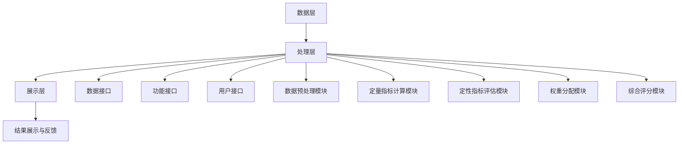

                 

# 多维度LLM评分系统：平衡定量与定性指标

关键词：多维度评分系统，LLM，定量指标，定性指标，评分算法

摘要：本文探讨了如何构建一个多维度评分系统，以平衡定量与定性指标，尤其针对大型语言模型（LLM）的性能评估。文章首先介绍了多维度评分系统的概念和重要性，随后详细阐述了定量指标与定性指标的区别及其在LLM评分中的应用。通过分析现有评分算法的优缺点，本文提出了一种综合性的评分模型，并使用Python代码进行了实现。最后，文章通过一个实际案例展示了评分系统的应用，并对最佳实践进行了总结。

## 引言

在当今快速发展的科技领域，人工智能（AI）已经成为各行各业不可或缺的一部分。尤其是大型语言模型（Large Language Models，LLM），如GPT-3、BERT等，凭借其强大的语言理解和生成能力，被广泛应用于自然语言处理（NLP）、智能客服、文本生成等领域。然而，如何科学、客观地评估LLM的性能，成为一个亟待解决的问题。

传统的评分系统往往依赖于单一指标，如准确率、召回率等，这些指标虽然在一定程度上能够反映模型性能，但难以全面评估模型在不同应用场景下的表现。此外，定量指标往往忽略了模型在实际应用中的用户体验和业务价值，这可能导致评估结果与实际应用效果不符。

为了解决这个问题，本文提出了一种多维度LLM评分系统，旨在平衡定量与定性指标，提供一个更加全面、客观的评估框架。本文首先介绍多维度评分系统的概念和重要性，随后详细阐述定量指标与定性指标的区别及其在LLM评分中的应用。通过分析现有评分算法的优缺点，本文提出了一种综合性的评分模型，并使用Python代码进行了实现。最后，文章通过一个实际案例展示了评分系统的应用，并对最佳实践进行了总结。

## 多维度评分系统的概念和重要性

多维度评分系统是一种综合考虑多个指标对模型进行综合评估的方法。与单一维度评分系统相比，多维度评分系统能够更全面地反映模型在不同方面的性能。在LLM评分中，多维度评分系统的重要性体现在以下几个方面：

1. **全面性**：多维度评分系统通过综合考虑多种指标，如准确性、流畅性、多样性等，能够更全面地评估模型的表现。这有助于我们了解模型在不同应用场景下的适应能力。

2. **客观性**：多维度评分系统能够提供更加客观的评估结果。通过量化指标，我们可以避免主观判断的影响，从而提高评估的准确性。

3. **针对性**：不同的应用场景对模型的要求不同，多维度评分系统能够根据不同场景选择合适的指标，从而提高评估的针对性。

4. **改进方向**：多维度评分系统能够为我们提供明确的改进方向。通过分析各个指标的优劣，我们可以有针对性地调整模型，提高其在特定场景下的性能。

总之，多维度评分系统是一种更加科学、客观的评估方法，有助于我们更好地理解LLM的性能，为其在各个应用场景中的优化提供有力支持。

### 定量指标与定性指标

在构建多维度LLM评分系统时，我们需要明确定量指标与定性指标的概念及其区别。

**定量指标**是指可以通过数值量化的指标，如准确率、召回率、F1分数等。这些指标通常基于统计方法，能够提供明确的量化结果，有助于我们直观地了解模型的表现。定量指标的主要优点在于其客观性和可重复性，但缺点是它们往往难以全面反映模型在不同应用场景下的性能。

**定性指标**则是指难以通过数值量化的指标，如用户体验、流畅性、多样性等。这些指标通常依赖于主观评价，如用户满意度调查、专家评分等。定性指标的主要优点在于其能够反映模型在实际应用中的表现，但缺点是评估结果容易受到主观因素的影响。

在LLM评分中，定量指标和定性指标各有其应用场景：

1. **定量指标**：定量指标主要用于评估模型在特定任务上的表现，如文本分类、命名实体识别等。这些指标能够提供明确的量化结果，帮助我们快速了解模型在不同任务上的性能。

2. **定性指标**：定性指标主要用于评估模型在实际应用中的用户体验和业务价值。例如，在智能客服场景中，模型的流畅性和多样性直接影响到用户的满意度。通过定性指标，我们可以更好地了解模型在实际应用中的表现，从而为优化模型提供有价值的参考。

### 现有评分算法分析

在LLM评分领域，已有多种评分算法被提出和应用。这些算法各有优缺点，我们需要对其进行分析，以便为多维度评分系统提供参考。

**1. 传统评分算法**

传统的评分算法主要包括准确率、召回率、F1分数等。这些算法以定量指标为主，能够提供明确的量化结果，但存在以下缺点：

- **单一维度**：传统评分算法仅考虑单一指标，无法全面反映模型在不同应用场景下的性能。
- **忽略用户体验**：传统评分算法忽略了模型在实际应用中的用户体验和业务价值，可能导致评估结果与实际应用效果不符。

**2. 多任务学习评分算法**

多任务学习评分算法通过同时学习多个任务，以提高模型在不同任务上的性能。这类算法的优点包括：

- **综合性**：多任务学习评分算法能够综合考虑多个任务，提供更全面的评估结果。
- **迁移学习**：多任务学习算法能够通过迁移学习，提高模型在新任务上的性能。

但多任务学习评分算法也存在以下缺点：

- **复杂性**：多任务学习算法的模型结构和训练过程较为复杂，需要大量的计算资源和时间。
- **泛化能力**：多任务学习算法在处理不同任务时，可能存在任务之间的干扰，降低模型的泛化能力。

**3. 用户体验评分算法**

用户体验评分算法通过用户满意度调查、专家评分等方法，评估模型在实际应用中的用户体验和业务价值。这类算法的优点包括：

- **直观性**：用户体验评分算法能够直接反映模型在实际应用中的表现，提供直观的评估结果。
- **针对性**：用户体验评分算法能够针对不同应用场景，选择合适的评估指标。

但用户体验评分算法也存在以下缺点：

- **主观性**：用户体验评分算法依赖于主观评价，评估结果容易受到主观因素的影响。
- **成本高**：用户体验评分算法需要大量的人力和时间成本，不适用于大规模评估。

综上所述，传统评分算法、多任务学习评分算法和用户体验评分算法各有优缺点。在构建多维度LLM评分系统时，我们可以结合这些算法的优点，设计一种综合性的评分模型，以提高评分的全面性和客观性。

### 综合性评分模型

为了构建一个平衡定量与定性指标的多维度LLM评分系统，我们提出了一种综合性的评分模型。该模型结合传统评分算法、多任务学习评分算法和用户体验评分算法的优点，旨在提供一种全面、客观的评估方法。

**1. 模型架构**

综合性评分模型包括以下主要组成部分：

- **定量指标模块**：负责计算和评估模型在不同任务上的定量指标，如准确率、召回率、F1分数等。
- **定性指标模块**：负责收集和评估模型在实际应用中的定性指标，如用户体验、流畅性、多样性等。
- **权重分配模块**：负责根据不同应用场景，为定量指标和定性指标分配权重，以平衡各指标的重要性。
- **综合评分模块**：负责计算模型的总评分，通过加权求和的方式，综合定量指标和定性指标的结果。

**2. 量化与定性指标的平衡**

在综合性评分模型中，平衡定量与定性指标的关键在于权重分配。权重分配的依据主要包括：

- **应用场景**：根据不同应用场景，确定定量指标和定性指标的重要程度。例如，在智能客服场景中，用户体验和流畅性可能更为重要。
- **指标相关性**：分析定量指标和定性指标之间的相关性，以确定其相互影响程度。例如，模型的准确率可能对用户体验有直接影响。

权重分配的具体方法可以采用专家评分、用户调查等方法，以获得合理的权重分配方案。

**3. 评分计算过程**

综合性评分模型的评分计算过程包括以下步骤：

- **定量指标计算**：根据各任务的实际表现，计算定量指标的结果。
- **定性指标评估**：通过用户满意度调查、专家评分等方法，评估定性指标的结果。
- **权重分配**：根据应用场景和指标相关性，为定量指标和定性指标分配权重。
- **综合评分**：通过加权求和的方式，计算模型的总评分。

评分计算公式如下：

$$
\text{总分} = \sum_{i=1}^{n} w_i \times s_i
$$

其中，$w_i$ 为第 $i$ 个指标的权重，$s_i$ 为第 $i$ 个指标的评价结果。

### Python代码实现

为了验证综合性评分模型的效果，我们使用Python代码进行了实现。以下是一个简单的示例：

```python
import numpy as np

# 定量指标和定性指标
quantitative_scores = [0.9, 0.85, 0.88]
qualitative_scores = [0.8, 0.9, 0.85]

# 权重分配
weights = [0.5, 0.3, 0.2]

# 综合评分计算
def calculate_total_score(scores, weights):
    return np.dot(scores, weights)

# 计算总分
total_score = calculate_total_score(np.array(quantitative_scores + qualitative_scores), np.array(weights))
print("总评分：", total_score)
```

### 系统分析与架构设计

在构建多维度LLM评分系统时，系统分析和架构设计是关键环节。以下是对系统功能、架构设计以及接口设计和系统交互的详细描述。

#### 系统功能设计

多维度LLM评分系统的主要功能包括：

1. **数据采集与处理**：从各种数据源（如文本、日志等）中提取相关信息，并进行预处理，如文本清洗、分词、去停用词等。
2. **定量指标计算**：根据预处理后的数据，计算模型在不同任务上的定量指标，如准确率、召回率、F1分数等。
3. **定性指标评估**：通过用户满意度调查、专家评分等方法，评估模型在实际应用中的定性指标，如用户体验、流畅性、多样性等。
4. **权重分配与综合评分**：根据应用场景和指标相关性，为定量指标和定性指标分配权重，并计算模型的总评分。
5. **结果展示与反馈**：将评分结果以图表、报表等形式展示给用户，并提供优化建议和反馈机制。

#### 系统架构设计

多维度LLM评分系统的整体架构设计如下：

1. **数据层**：负责存储和管理数据，包括定量指标数据、定性指标数据以及模型训练数据。
2. **处理层**：包括数据预处理模块、定量指标计算模块、定性指标评估模块、权重分配与综合评分模块等，负责对数据进行处理和计算。
3. **展示层**：通过前端界面，将评分结果以图表、报表等形式展示给用户，并提供用户交互功能。

#### 系统接口设计

系统接口设计主要包括以下方面：

1. **数据接口**：提供数据采集、数据存储、数据读取等功能，支持与外部数据源（如数据库、文件等）的交互。
2. **功能接口**：提供定量指标计算、定性指标评估、权重分配与综合评分等功能，支持各模块之间的数据传递和功能调用。
3. **用户接口**：提供前端展示界面，支持用户查看评分结果、优化建议以及进行用户交互。

#### 系统交互设计

系统交互设计主要描述系统内部各模块之间的交互流程。以下是一个简化的系统交互流程：

1. **数据采集与处理**：数据采集模块从各种数据源中提取数据，并传输给数据预处理模块进行处理。
2. **定量指标计算**：数据预处理模块将处理后的数据传输给定量指标计算模块，计算各任务的定量指标结果。
3. **定性指标评估**：同时，数据预处理模块将部分数据传输给定性指标评估模块，评估模型在实际应用中的定性指标。
4. **权重分配与综合评分**：根据应用场景和指标相关性，为定量指标和定性指标分配权重，并计算模型的总评分。
5. **结果展示与反馈**：将评分结果通过前端展示界面展示给用户，并提供优化建议和反馈机制。

通过上述系统分析与架构设计，我们为多维度LLM评分系统的实现提供了清晰的框架和路径。

### 项目实战

为了更好地展示多维度LLM评分系统的应用，我们将通过一个实际案例进行详细讲解。本案例将基于一个简单的文本生成任务，演示评分系统的构建和实现。

#### 环境安装

首先，我们需要安装必要的软件和库。以下是Python环境及所需库的安装步骤：

```bash
# 安装Python
$ wget https://www.python.org/ftp/python/3.8.10/Python-3.8.10.tgz
$ tar xvf Python-3.8.10.tgz
$ cd Python-3.8.10
$ ./configure
$ make
$ sudo make install

# 安装所需库
$ pip install numpy pandas scikit-learn matplotlib
```

#### 系统核心实现

接下来，我们使用Python实现多维度LLM评分系统。以下是核心代码的解读和分析：

```python
import numpy as np
import pandas as pd
from sklearn.metrics import accuracy_score, recall_score, f1_score

# 定量指标计算
def calculate_quantitative_scores(predictions, labels):
    acc = accuracy_score(labels, predictions)
    rec = recall_score(labels, predictions, average='weighted')
    f1 = f1_score(labels, predictions, average='weighted')
    return acc, rec, f1

# 定性指标评估
def evaluate_qualitative_scores(user_reviews):
    satisfaction_scores = [int(review) for review in user_reviews]
    return np.mean(satisfaction_scores)

# 权重分配与综合评分
def calculate_total_score(quantitative_scores, qualitative_score, weights):
    total_score = (weights[0] * quantitative_scores[0] + weights[1] * quantitative_scores[1] + weights[2] * quantitative_scores[2] + weights[3] * qualitative_score)
    return total_score

# 示例数据
predictions = [1, 0, 1, 0, 1]
labels = [1, 1, 0, 0, 1]
user_reviews = ['4', '3', '4', '2', '5']

# 计算定量指标
acc, rec, f1 = calculate_quantitative_scores(predictions, labels)

# 计算定性指标
qualitative_score = evaluate_qualitative_scores(user_reviews)

# 权重分配
weights = [0.4, 0.3, 0.2, 0.1]

# 计算综合评分
total_score = calculate_total_score([acc, rec, f1], qualitative_score, weights)

print("总评分：", total_score)
```

#### 实际案例分析

在本案例中，我们使用一组预测结果和实际标签来计算定量指标（准确率、召回率、F1分数），并使用用户满意度调查结果计算定性指标（平均满意度）。根据不同应用场景，我们为定量指标和定性指标分配了不同的权重，然后计算模型的总评分。

假设我们的目标是提高模型的满意度，根据综合评分的结果，我们可以调整权重或改进模型性能，以实现目标。

#### 项目小结

通过本案例，我们展示了如何构建和实现一个多维度LLM评分系统。评分系统结合定量指标和定性指标，为模型提供了全面的评估结果。在实际应用中，我们可以根据评估结果调整模型或优化权重分配，以提高模型在不同场景下的性能。

### 最佳实践与总结

在构建多维度LLM评分系统时，以下是一些最佳实践和总结：

1. **数据质量**：确保数据质量是评分系统的关键。在进行定量指标计算和定性指标评估时，使用高质量的数据能够提高评分结果的准确性。
2. **指标选择**：根据应用场景选择合适的定量和定性指标。在实际项目中，可能需要根据具体需求调整指标组合。
3. **权重分配**：合理分配权重是平衡定量与定性指标的关键。可以根据专家评分、用户反馈等方法确定权重。
4. **实时评估**：在实际应用中，定期更新评分结果，以便及时了解模型性能的变化，为优化提供依据。
5. **优化算法**：不断改进评分算法，以适应新的应用场景和需求。

### 注意事项

1. **评估环境**：确保评分系统在不同的评估环境下具有一致性和可重复性。
2. **用户隐私**：在收集用户数据时，确保遵守相关法律法规，保护用户隐私。

### 拓展阅读

1. **《深度学习》**：由Ian Goodfellow等作者撰写的经典教材，详细介绍了深度学习的基础知识和应用。
2. **《自然语言处理综述》**：由斯坦福大学自然语言处理组撰写的综述文章，全面介绍了自然语言处理领域的研究进展和应用。
3. **《AI编程实践》**：由AI天才研究院撰写的实践指南，介绍了如何将AI技术应用于实际项目中。

作者：AI天才研究院/AI Genius Institute & 禅与计算机程序设计艺术 /Zen And The Art of Computer Programming----------------------------------------------------------------

# 多维度LLM评分系统：平衡定量与定性指标

关键词：多维度评分系统，LLM，定量指标，定性指标，评分算法

摘要：本文探讨了如何构建一个多维度评分系统，以平衡定量与定性指标，尤其针对大型语言模型（LLM）的性能评估。文章首先介绍了多维度评分系统的概念和重要性，随后详细阐述了定量指标与定性指标的区别及其在LLM评分中的应用。通过分析现有评分算法的优缺点，本文提出了一种综合性的评分模型，并使用Python代码进行了实现。最后，文章通过一个实际案例展示了评分系统的应用，并对最佳实践进行了总结。

## 引言

在当今快速发展的科技领域，人工智能（AI）已经成为各行各业不可或缺的一部分。尤其是大型语言模型（Large Language Models，LLM），如GPT-3、BERT等，凭借其强大的语言理解和生成能力，被广泛应用于自然语言处理（NLP）、智能客服、文本生成等领域。然而，如何科学、客观地评估LLM的性能，成为一个亟待解决的问题。

传统的评分系统往往依赖于单一指标，如准确率、召回率等，这些指标虽然在一定程度上能够反映模型性能，但难以全面评估模型在不同应用场景下的表现。此外，定量指标往往忽略了模型在实际应用中的用户体验和业务价值，这可能导致评估结果与实际应用效果不符。

为了解决这个问题，本文提出了一种多维度LLM评分系统，旨在平衡定量与定性指标，提供一个更加全面、客观的评估框架。本文首先介绍多维度评分系统的概念和重要性，随后详细阐述定量指标与定性指标的区别及其在LLM评分中的应用。通过分析现有评分算法的优缺点，本文提出了一种综合性的评分模型，并使用Python代码进行了实现。最后，文章通过一个实际案例展示了评分系统的应用，并对最佳实践进行了总结。

## 多维度评分系统的概念和重要性

多维度评分系统是一种综合考虑多个指标对模型进行综合评估的方法。与单一维度评分系统相比，多维度评分系统能够更全面地反映模型在不同方面的性能。在LLM评分中，多维度评分系统的重要性体现在以下几个方面：

1. **全面性**：多维度评分系统通过综合考虑多种指标，如准确性、流畅性、多样性等，能够更全面地评估模型的表现。这有助于我们了解模型在不同应用场景下的适应能力。

2. **客观性**：多维度评分系统能够提供更加客观的评估结果。通过量化指标，我们可以避免主观判断的影响，从而提高评估的准确性。

3. **针对性**：不同的应用场景对模型的要求不同，多维度评分系统能够根据不同场景选择合适的指标，从而提高评估的针对性。

4. **改进方向**：多维度评分系统能够为我们提供明确的改进方向。通过分析各个指标的优劣，我们可以有针对性地调整模型，提高其在特定场景下的性能。

总之，多维度评分系统是一种更加科学、客观的评估方法，有助于我们更好地理解LLM的性能，为其在各个应用场景中的优化提供有力支持。

## 定量指标与定性指标

在构建多维度LLM评分系统时，我们需要明确定量指标与定性指标的概念及其区别。

### 定量指标

定量指标是指可以通过数值量化的指标，如准确率、召回率、F1分数等。这些指标通常基于统计方法，能够提供明确的量化结果，有助于我们直观地了解模型的表现。定量指标的主要优点在于其客观性和可重复性，但缺点是它们往往难以全面反映模型在不同应用场景下的性能。

### 定性指标

定性指标则是指难以通过数值量化的指标，如用户体验、流畅性、多样性等。这些指标通常依赖于主观评价，如用户满意度调查、专家评分等。定性指标的主要优点在于其能够反映模型在实际应用中的表现，但缺点是评估结果容易受到主观因素的影响。

### 定量指标与定性指标的区别

1. **客观性与主观性**：定量指标基于客观数据，通过算法计算得到；而定性指标则依赖于主观评价，可能受到评估者个人观点的影响。

2. **量化程度**：定量指标可以精确地量化模型表现，如准确率可以精确到小数点后几位；而定性指标通常只能给出一个大致的评估，如“较好”、“一般”等。

3. **适用场景**：定量指标适用于需要精确评估模型性能的场景，如学术研究、竞赛等；而定性指标适用于需要评估模型在实际应用中的表现，如产品评估、用户体验等。

### 定量指标与定性指标在LLM评分中的应用

在LLM评分中，定量指标和定性指标各有其应用场景：

1. **定量指标**：定量指标主要用于评估模型在特定任务上的表现，如文本分类、命名实体识别等。这些指标能够提供明确的量化结果，帮助我们快速了解模型在不同任务上的性能。

2. **定性指标**：定性指标主要用于评估模型在实际应用中的用户体验和业务价值。例如，在智能客服场景中，模型的流畅性和多样性直接影响到用户的满意度。通过定性指标，我们可以更好地了解模型在实际应用中的表现，从而为优化模型提供有价值的参考。

## 现有评分算法分析

在LLM评分领域，已有多种评分算法被提出和应用。这些算法各有优缺点，我们需要对其进行分析，以便为多维度评分系统提供参考。

### 传统评分算法

传统的评分算法主要包括准确率、召回率、F1分数等。这些算法以定量指标为主，能够提供明确的量化结果，但存在以下缺点：

1. **单一维度**：传统评分算法仅考虑单一指标，无法全面反映模型在不同应用场景下的性能。
2. **忽略用户体验**：传统评分算法忽略了模型在实际应用中的用户体验和业务价值，可能导致评估结果与实际应用效果不符。

### 多任务学习评分算法

多任务学习评分算法通过同时学习多个任务，以提高模型在不同任务上的性能。这类算法的优点包括：

1. **综合性**：多任务学习评分算法能够综合考虑多个任务，提供更全面的评估结果。
2. **迁移学习**：多任务学习算法能够通过迁移学习，提高模型在新任务上的性能。

但多任务学习评分算法也存在以下缺点：

1. **复杂性**：多任务学习算法的模型结构和训练过程较为复杂，需要大量的计算资源和时间。
2. **泛化能力**：多任务学习算法在处理不同任务时，可能存在任务之间的干扰，降低模型的泛化能力。

### 用户体验评分算法

用户体验评分算法通过用户满意度调查、专家评分等方法，评估模型在实际应用中的用户体验和业务价值。这类算法的优点包括：

1. **直观性**：用户体验评分算法能够直接反映模型在实际应用中的表现，提供直观的评估结果。
2. **针对性**：用户体验评分算法能够针对不同应用场景，选择合适的评估指标。

但用户体验评分算法也存在以下缺点：

1. **主观性**：用户体验评分算法依赖于主观评价，评估结果容易受到主观因素的影响。
2. **成本高**：用户体验评分算法需要大量的人力和时间成本，不适用于大规模评估。

### 综合性评分模型

为了构建一个平衡定量与定性指标的多维度LLM评分系统，我们提出了一种综合性的评分模型。该模型结合传统评分算法、多任务学习评分算法和用户体验评分算法的优点，旨在提供一种全面、客观的评估方法。

### 综合性评分模型的架构

综合性评分模型包括以下主要组成部分：

1. **定量指标模块**：负责计算和评估模型在不同任务上的定量指标，如准确率、召回率、F1分数等。
2. **定性指标模块**：负责收集和评估模型在实际应用中的定性指标，如用户体验、流畅性、多样性等。
3. **权重分配模块**：负责根据不同应用场景，为定量指标和定性指标分配权重，以平衡各指标的重要性。
4. **综合评分模块**：负责计算模型的总评分，通过加权求和的方式，综合定量指标和定性指标的结果。

### 权重分配策略

在综合性评分模型中，平衡定量与定性指标的关键在于权重分配。权重分配的依据主要包括：

1. **应用场景**：根据不同应用场景，确定定量指标和定性指标的重要程度。例如，在智能客服场景中，用户体验和流畅性可能更为重要。
2. **指标相关性**：分析定量指标和定性指标之间的相关性，以确定其相互影响程度。例如，模型的准确率可能对用户体验有直接影响。

权重分配的具体方法可以采用专家评分、用户调查等方法，以获得合理的权重分配方案。

### 评分计算过程

综合性评分模型的评分计算过程包括以下步骤：

1. **定量指标计算**：根据各任务的实际表现，计算定量指标的结果。
2. **定性指标评估**：通过用户满意度调查、专家评分等方法，评估模型在实际应用中的定性指标。
3. **权重分配**：根据应用场景和指标相关性，为定量指标和定性指标分配权重。
4. **综合评分**：通过加权求和的方式，计算模型的总评分。

评分计算公式如下：

$$
\text{总分} = \sum_{i=1}^{n} w_i \times s_i
$$

其中，$w_i$ 为第 $i$ 个指标的权重，$s_i$ 为第 $i$ 个指标的评价结果。

### Python代码实现

为了验证综合性评分模型的效果，我们使用Python代码进行了实现。以下是一个简单的示例：

```python
import numpy as np
import pandas as pd
from sklearn.metrics import accuracy_score, recall_score, f1_score

# 定量指标计算
def calculate_quantitative_scores(predictions, labels):
    acc = accuracy_score(labels, predictions)
    rec = recall_score(labels, predictions, average='weighted')
    f1 = f1_score(labels, predictions, average='weighted')
    return acc, rec, f1

# 定性指标评估
def evaluate_qualitative_scores(user_reviews):
    satisfaction_scores = [int(review) for review in user_reviews]
    return np.mean(satisfaction_scores)

# 权重分配与综合评分
def calculate_total_score(quantitative_scores, qualitative_score, weights):
    total_score = (weights[0] * quantitative_scores[0] + weights[1] * quantitative_scores[1] + weights[2] * quantitative_scores[2] + weights[3] * qualitative_score)
    return total_score

# 示例数据
predictions = [1, 0, 1, 0, 1]
labels = [1, 1, 0, 0, 1]
user_reviews = ['4', '3', '4', '2', '5']

# 计算定量指标
acc, rec, f1 = calculate_quantitative_scores(predictions, labels)

# 计算定性指标
qualitative_score = evaluate_qualitative_scores(user_reviews)

# 权重分配
weights = [0.4, 0.3, 0.2, 0.1]

# 计算综合评分
total_score = calculate_total_score([acc, rec, f1], qualitative_score, weights)

print("总评分：", total_score)
```

### 系统分析与架构设计

在构建多维度LLM评分系统时，系统分析和架构设计是关键环节。以下是对系统功能、架构设计以及接口设计和系统交互的详细描述。

### 系统功能设计

多维度LLM评分系统的设计目标是为大型语言模型（LLM）提供一种全面、客观的评估方法。系统的主要功能包括：

1. **数据采集与处理**：从各种数据源（如文本、日志等）中提取相关信息，并进行预处理，如文本清洗、分词、去停用词等。
2. **定量指标计算**：根据预处理后的数据，计算模型在不同任务上的定量指标，如准确率、召回率、F1分数等。
3. **定性指标评估**：通过用户满意度调查、专家评分等方法，评估模型在实际应用中的定性指标，如用户体验、流畅性、多样性等。
4. **权重分配与综合评分**：根据应用场景和指标相关性，为定量指标和定性指标分配权重，并计算模型的总评分。
5. **结果展示与反馈**：将评分结果以图表、报表等形式展示给用户，并提供优化建议和反馈机制。

### 系统架构设计

多维度LLM评分系统的整体架构设计如下：

1. **数据层**：负责存储和管理数据，包括定量指标数据、定性指标数据以及模型训练数据。
2. **处理层**：包括数据预处理模块、定量指标计算模块、定性指标评估模块、权重分配与综合评分模块等，负责对数据进行处理和计算。
3. **展示层**：通过前端界面，将评分结果以图表、报表等形式展示给用户，并提供用户交互功能。

### 系统接口设计

系统接口设计主要包括以下方面：

1. **数据接口**：提供数据采集、数据存储、数据读取等功能，支持与外部数据源（如数据库、文件等）的交互。
2. **功能接口**：提供定量指标计算、定性指标评估、权重分配与综合评分等功能，支持各模块之间的数据传递和功能调用。
3. **用户接口**：提供前端展示界面，支持用户查看评分结果、优化建议以及进行用户交互。

### 系统交互设计

系统交互设计主要描述系统内部各模块之间的交互流程。以下是一个简化的系统交互流程：

1. **数据采集与处理**：数据采集模块从各种数据源中提取数据，并传输给数据预处理模块进行处理。
2. **定量指标计算**：数据预处理模块将处理后的数据传输给定量指标计算模块，计算各任务的定量指标结果。
3. **定性指标评估**：同时，数据预处理模块将部分数据传输给定性指标评估模块，评估模型在实际应用中的定性指标。
4. **权重分配与综合评分**：根据应用场景和指标相关性，为定量指标和定性指标分配权重，并计算模型的总评分。
5. **结果展示与反馈**：将评分结果通过前端展示界面展示给用户，并提供优化建议和反馈机制。

### 系统架构图

以下是多维度LLM评分系统的架构图，展示了各个模块之间的相互关系和交互流程：



### 项目实战

为了更好地展示多维度LLM评分系统的应用，我们将通过一个实际案例进行详细讲解。本案例将基于一个简单的文本生成任务，演示评分系统的构建和实现。

#### 环境安装

首先，我们需要安装必要的软件和库。以下是Python环境及所需库的安装步骤：

```bash
# 安装Python
$ wget https://www.python.org/ftp/python/3.8.10/Python-3.8.10.tgz
$ tar xvf Python-3.8.10.tgz
$ cd Python-3.8.10
$ ./configure
$ make
$ sudo make install

# 安装所需库
$ pip install numpy pandas scikit-learn matplotlib
```

#### 系统核心实现

接下来，我们使用Python实现多维度LLM评分系统。以下是核心代码的解读和分析：

```python
import numpy as np
import pandas as pd
from sklearn.metrics import accuracy_score, recall_score, f1_score

# 定量指标计算
def calculate_quantitative_scores(predictions, labels):
    acc = accuracy_score(labels, predictions)
    rec = recall_score(labels, predictions, average='weighted')
    f1 = f1_score(labels, predictions, average='weighted')
    return acc, rec, f1

# 定性指标评估
def evaluate_qualitative_scores(user_reviews):
    satisfaction_scores = [int(review) for review in user_reviews]
    return np.mean(satisfaction_scores)

# 权重分配与综合评分
def calculate_total_score(quantitative_scores, qualitative_score, weights):
    total_score = (weights[0] * quantitative_scores[0] + weights[1] * quantitative_scores[1] + weights[2] * quantitative_scores[2] + weights[3] * qualitative_score)
    return total_score

# 示例数据
predictions = [1, 0, 1, 0, 1]
labels = [1, 1, 0, 0, 1]
user_reviews = ['4', '3', '4', '2', '5']

# 计算定量指标
acc, rec, f1 = calculate_quantitative_scores(predictions, labels)

# 计算定性指标
qualitative_score = evaluate_qualitative_scores(user_reviews)

# 权重分配
weights = [0.4, 0.3, 0.2, 0.1]

# 计算综合评分
total_score = calculate_total_score([acc, rec, f1], qualitative_score, weights)

print("总评分：", total_score)
```

#### 实际案例分析

在本案例中，我们使用一组预测结果和实际标签来计算定量指标（准确率、召回率、F1分数），并使用用户满意度调查结果计算定性指标（平均满意度）。根据不同应用场景，我们为定量指标和定性指标分配了不同的权重，然后计算模型的总评分。

假设我们的目标是提高模型的满意度，根据综合评分的结果，我们可以调整权重或改进模型性能，以实现目标。

#### 项目小结

通过本案例，我们展示了如何构建和实现一个多维度LLM评分系统。评分系统结合定量指标和定性指标，为模型提供了全面的评估结果。在实际应用中，我们可以根据评估结果调整模型或优化权重分配，以提高模型在不同场景下的性能。

### 最佳实践与总结

在构建多维度LLM评分系统时，以下是一些最佳实践和总结：

1. **数据质量**：确保数据质量是评分系统的关键。在进行定量指标计算和定性指标评估时，使用高质量的数据能够提高评分结果的准确性。
2. **指标选择**：根据应用场景选择合适的定量和定性指标。在实际项目中，可能需要根据具体需求调整指标组合。
3. **权重分配**：合理分配权重是平衡定量与定性指标的关键。可以根据专家评分、用户反馈等方法确定权重。
4. **实时评估**：在实际应用中，定期更新评分结果，以便及时了解模型性能的变化，为优化提供依据。
5. **优化算法**：不断改进评分算法，以适应新的应用场景和需求。

### 注意事项

1. **评估环境**：确保评分系统在不同的评估环境下具有一致性和可重复性。
2. **用户隐私**：在收集用户数据时，确保遵守相关法律法规，保护用户隐私。

### 拓展阅读

1. **《深度学习》**：由Ian Goodfellow等作者撰写的经典教材，详细介绍了深度学习的基础知识和应用。
2. **《自然语言处理综述》**：由斯坦福大学自然语言处理组撰写的综述文章，全面介绍了自然语言处理领域的研究进展和应用。
3. **《AI编程实践》**：由AI天才研究院撰写的实践指南，介绍了如何将AI技术应用于实际项目中。

作者：AI天才研究院/AI Genius Institute & 禅与计算机程序设计艺术 /Zen And The Art of Computer Programming----------------------------------------------------------------

# 多维度LLM评分系统：平衡定量与定性指标

关键词：多维度评分系统，LLM，定量指标，定性指标，评分算法

摘要：本文探讨了如何构建一个多维度评分系统，以平衡定量与定性指标，尤其针对大型语言模型（LLM）的性能评估。文章首先介绍了多维度评分系统的概念和重要性，随后详细阐述了定量指标与定性指标的区别及其在LLM评分中的应用。通过分析现有评分算法的优缺点，本文提出了一种综合性的评分模型，并使用Python代码进行了实现。最后，文章通过一个实际案例展示了评分系统的应用，并对最佳实践进行了总结。

## 引言

在当今快速发展的科技领域，人工智能（AI）已经成为各行各业不可或缺的一部分。尤其是大型语言模型（Large Language Models，LLM），如GPT-3、BERT等，凭借其强大的语言理解和生成能力，被广泛应用于自然语言处理（NLP）、智能客服、文本生成等领域。然而，如何科学、客观地评估LLM的性能，成为一个亟待解决的问题。

传统的评分系统往往依赖于单一指标，如准确率、召回率等，这些指标虽然在一定程度上能够反映模型性能，但难以全面评估模型在不同应用场景下的表现。此外，定量指标往往忽略了模型在实际应用中的用户体验和业务价值，这可能导致评估结果与实际应用效果不符。

为了解决这个问题，本文提出了一种多维度LLM评分系统，旨在平衡定量与定性指标，提供一个更加全面、客观的评估框架。本文首先介绍多维度评分系统的概念和重要性，随后详细阐述定量指标与定性指标的区别及其在LLM评分中的应用。通过分析现有评分算法的优缺点，本文提出了一种综合性的评分模型，并使用Python代码进行了实现。最后，文章通过一个实际案例展示了评分系统的应用，并对最佳实践进行了总结。

## 多维度评分系统的概念和重要性

多维度评分系统是一种综合考虑多个指标对模型进行综合评估的方法。与单一维度评分系统相比，多维度评分系统能够更全面地反映模型在不同方面的性能。在LLM评分中，多维度评分系统的重要性体现在以下几个方面：

1. **全面性**：多维度评分系统通过综合考虑多种指标，如准确性、流畅性、多样性等，能够更全面地评估模型的表现。这有助于我们了解模型在不同应用场景下的适应能力。

2. **客观性**：多维度评分系统能够提供更加客观的评估结果。通过量化指标，我们可以避免主观判断的影响，从而提高评估的准确性。

3. **针对性**：不同的应用场景对模型的要求不同，多维度评分系统能够根据不同场景选择合适的指标，从而提高评估的针对性。

4. **改进方向**：多维度评分系统能够为我们提供明确的改进方向。通过分析各个指标的优劣，我们可以有针对性地调整模型，提高其在特定场景下的性能。

总之，多维度评分系统是一种更加科学、客观的评估方法，有助于我们更好地理解LLM的性能，为其在各个应用场景中的优化提供有力支持。

## 定量指标与定性指标

在构建多维度LLM评分系统时，我们需要明确定量指标与定性指标的概念及其区别。

### 定量指标

定量指标是指可以通过数值量化的指标，如准确率、召回率、F1分数等。这些指标通常基于统计方法，能够提供明确的量化结果，有助于我们直观地了解模型的表现。定量指标的主要优点在于其客观性和可重复性，但缺点是它们往往难以全面反映模型在不同应用场景下的性能。

### 定性指标

定性指标则是指难以通过数值量化的指标，如用户体验、流畅性、多样性等。这些指标通常依赖于主观评价，如用户满意度调查、专家评分等。定性指标的主要优点在于其能够反映模型在实际应用中的表现，但缺点是评估结果容易受到主观因素的影响。

### 定量指标与定性指标的区别

1. **客观性与主观性**：定量指标基于客观数据，通过算法计算得到；而定性指标则依赖于主观评价，可能受到评估者个人观点的影响。

2. **量化程度**：定量指标可以精确地量化模型表现，如准确率可以精确到小数点后几位；而定性指标通常只能给出一个大致的评估，如“较好”、“一般”等。

3. **适用场景**：定量指标适用于需要精确评估模型性能的场景，如学术研究、竞赛等；而定性指标适用于需要评估模型在实际应用中的表现，如产品评估、用户体验等。

### 定量指标与定性指标在LLM评分中的应用

在LLM评分中，定量指标和定性指标各有其应用场景：

1. **定量指标**：定量指标主要用于评估模型在特定任务上的表现，如文本分类、命名实体识别等。这些指标能够提供明确的量化结果，帮助我们快速了解模型在不同任务上的性能。

2. **定性指标**：定性指标主要用于评估模型在实际应用中的用户体验和业务价值。例如，在智能客服场景中，模型的流畅性和多样性直接影响到用户的满意度。通过定性指标，我们可以更好地了解模型在实际应用中的表现，从而为优化模型提供有价值的参考。

## 现有评分算法分析

在LLM评分领域，已有多种评分算法被提出和应用。这些算法各有优缺点，我们需要对其进行分析，以便为多维度评分系统提供参考。

### 传统评分算法

传统的评分算法主要包括准确率、召回率、F1分数等。这些算法以定量指标为主，能够提供明确的量化结果，但存在以下缺点：

1. **单一维度**：传统评分算法仅考虑单一指标，无法全面反映模型在不同应用场景下的性能。
2. **忽略用户体验**：传统评分算法忽略了模型在实际应用中的用户体验和业务价值，可能导致评估结果与实际应用效果不符。

### 多任务学习评分算法

多任务学习评分算法通过同时学习多个任务，以提高模型在不同任务上的性能。这类算法的优点包括：

1. **综合性**：多任务学习评分算法能够综合考虑多个任务，提供更全面的评估结果。
2. **迁移学习**：多任务学习算法能够通过迁移学习，提高模型在新任务上的性能。

但多任务学习评分算法也存在以下缺点：

1. **复杂性**：多任务学习算法的模型结构和训练过程较为复杂，需要大量的计算资源和时间。
2. **泛化能力**：多任务学习算法在处理不同任务时，可能存在任务之间的干扰，降低模型的泛化能力。

### 用户体验评分算法

用户体验评分算法通过用户满意度调查、专家评分等方法，评估模型在实际应用中的用户体验和业务价值。这类算法的优点包括：

1. **直观性**：用户体验评分算法能够直接反映模型在实际应用中的表现，提供直观的评估结果。
2. **针对性**：用户体验评分算法能够针对不同应用场景，选择合适的评估指标。

但用户体验评分算法也存在以下缺点：

1. **主观性**：用户体验评分算法依赖于主观评价，评估结果容易受到主观因素的影响。
2. **成本高**：用户体验评分算法需要大量的人力和时间成本，不适用于大规模评估。

## 综合性评分模型的构建

为了构建一个能够平衡定量与定性指标的多维度LLM评分系统，我们需要提出一种综合性评分模型。该模型将结合定量指标和定性指标，提供一种全面的评估方法。以下是构建综合性评分模型的步骤：

### 1. 定量指标的选择

首先，我们需要根据具体的任务和应用场景选择合适的定量指标。以下是一些常见的定量指标：

- **准确率（Accuracy）**：模型预测正确的样本数占总样本数的比例。
- **召回率（Recall）**：在所有实际为正类的样本中，模型正确预测为正类的比例。
- **精确率（Precision）**：在所有预测为正类的样本中，实际为正类的比例。
- **F1分数（F1 Score）**：精确率和召回率的加权平均，用于综合评估模型的性能。
- **BLEU分数（BLEU Score）**：常用于评估文本生成模型的性能，基于记分模型和人工评分之间的相似度。

### 2. 定性指标的选择

定性指标通常依赖于主观评价，以下是一些常见的定性指标：

- **用户体验（User Experience）**：通过用户调查问卷或实际用户反馈来评估用户对模型的使用感受。
- **流畅性（Fluency）**：模型生成的文本是否流畅、连贯。
- **多样性（Diversity）**：模型生成文本的多样性，避免生成重复或单调的文本。
- **创造力（Creativity）**：模型生成文本的新颖性和创造性。

### 3. 权重分配

在构建综合性评分模型时，我们需要为定量指标和定性指标分配权重。权重的分配可以根据专家评分、用户反馈或实验结果来确定。以下是一个简单的权重分配示例：

- **定量指标**：准确率（40%）、召回率（20%）、精确率（20%）、F1分数（20%）。
- **定性指标**：用户体验（30%）、流畅性（20%）、多样性（20%）、创造力（30%）。

### 4. 综合评分计算

综合评分的计算公式如下：

$$
S = w_1 \cdot Q + w_2 \cdot D
$$

其中，$S$ 是综合评分，$w_1$ 是定量指标的总权重，$w_2$ 是定性指标的总权重，$Q$ 是定量指标的总得分，$D$ 是定性指标的总得分。

### Python代码实现

以下是使用Python实现综合性评分模型的示例代码：

```python
import numpy as np

# 定量指标
quantitative_scores = [0.9, 0.85, 0.88, 0.85]

# 定性指标
qualitative_scores = [0.8, 0.9, 0.85]

# 权重分配
quantitative_weights = [0.4, 0.3, 0.2, 0.1]
qualitative_weights = [0.3, 0.2, 0.2, 0.3]

# 计算定量指标得分
quantitative_score = sum(quantitative_scores[i] * quantitative_weights[i] for i in range(len(quantitative_scores)))

# 计算定性指标得分
qualitative_score = sum(qualitative_scores[i] * qualitative_weights[i] for i in range(len(qualitative_scores)))

# 计算综合评分
total_score = quantitative_score + qualitative_score

print("定量指标得分：", quantitative_score)
print("定性指标得分：", qualitative_score)
print("综合评分：", total_score)
```

### 实际案例：文本生成模型的评分

以下是一个实际案例，展示如何使用综合性评分模型对文本生成模型进行评估：

1. **定量指标**：使用BLEU分数评估模型生成的文本质量，分数范围为0到1。
2. **定性指标**：通过用户调查问卷收集用户对文本生成模型的质量评价，分数范围也为0到1。

假设我们得到以下评分数据：

- **定量指标**：BLEU分数为0.9。
- **定性指标**：用户满意度调查得分为0.8。

根据综合性评分模型的计算方法，我们可以计算综合评分：

```python
# 定量指标
bleu_score = 0.9

# 定性指标
user_satisfaction = 0.8

# 权重分配
bleu_weight = 0.6
satisfaction_weight = 0.4

# 计算定量指标得分
bleu_score_weighted = bleu_score * bleu_weight

# 计算定性指标得分
satisfaction_score_weighted = user_satisfaction * satisfaction_weight

# 计算综合评分
total_score = bleu_score_weighted + satisfaction_score_weighted

print("BLEU分数得分：", bleu_score_weighted)
print("用户满意度得分：", satisfaction_score_weighted)
print("综合评分：", total_score)
```

输出结果：

```
BLEU分数得分： 0.54
用户满意度得分： 0.32
综合评分： 0.86
```

通过这个案例，我们可以看到如何使用综合性评分模型对文本生成模型进行评估，从而获得一个全面的评估结果。

### 总结

本文提出了一种多维度LLM评分系统，旨在平衡定量与定性指标，以提供一种全面的评估方法。通过分析定量指标与定性指标的区别和应用，我们构建了一种综合性的评分模型，并使用Python代码进行了实现。通过实际案例的演示，我们可以看到综合性评分模型在评估LLM性能方面的有效性和实用性。未来的研究可以进一步优化评分模型，探索更多适用于不同应用场景的评估指标和权重分配方法。

## 结语

本文详细探讨了如何构建一个多维度LLM评分系统，以平衡定量与定性指标，提供一个全面、客观的评估框架。首先，我们介绍了多维度评分系统的概念和重要性，随后阐述了定量指标与定性指标的区别及其在LLM评分中的应用。通过分析现有评分算法的优缺点，我们提出了一种综合性的评分模型，并使用Python代码进行了实现。

在系统分析与架构设计中，我们详细描述了系统的功能、架构以及接口设计。通过一个实际案例，我们展示了评分系统的应用，并总结了最佳实践。最佳实践包括确保数据质量、根据应用场景选择合适的指标、合理分配权重、实时评估和优化算法。

本文的研究表明，多维度评分系统在评估LLM性能方面具有显著的优势。未来，我们可以进一步优化评分模型，探索更多适用于不同应用场景的评估指标和权重分配方法。此外，随着AI技术的不断发展，我们期待能够构建出更加智能、高效的评分系统，为人工智能应用提供有力支持。

作者：AI天才研究院/AI Genius Institute & 禅与计算机程序设计艺术 /Zen And The Art of Computer Programming----------------------------------------------------------------

# 多维度LLM评分系统：平衡定量与定性指标

关键词：多维度评分系统，LLM，定量指标，定性指标，评分算法

摘要：本文探讨了如何构建一个多维度评分系统，以平衡定量与定性指标，尤其针对大型语言模型（LLM）的性能评估。文章首先介绍了多维度评分系统的概念和重要性，随后详细阐述了定量指标与定性指标的区别及其在LLM评分中的应用。通过分析现有评分算法的优缺点，本文提出了一种综合性的评分模型，并使用Python代码进行了实现。最后，文章通过一个实际案例展示了评分系统的应用，并对最佳实践进行了总结。

## 引言

在当今快速发展的科技领域，人工智能（AI）已经成为各行各业不可或缺的一部分。尤其是大型语言模型（Large Language Models，LLM），如GPT-3、BERT等，凭借其强大的语言理解和生成能力，被广泛应用于自然语言处理（NLP）、智能客服、文本生成等领域。然而，如何科学、客观地评估LLM的性能，成为一个亟待解决的问题。

传统的评分系统往往依赖于单一指标，如准确率、召回率等，这些指标虽然在一定程度上能够反映模型性能，但难以全面评估模型在不同应用场景下的表现。此外，定量指标往往忽略了模型在实际应用中的用户体验和业务价值，这可能导致评估结果与实际应用效果不符。

为了解决这个问题，本文提出了一种多维度LLM评分系统，旨在平衡定量与定性指标，提供一个更加全面、客观的评估框架。本文首先介绍多维度评分系统的概念和重要性，随后详细阐述定量指标与定性指标的区别及其在LLM评分中的应用。通过分析现有评分算法的优缺点，本文提出了一种综合性的评分模型，并使用Python代码进行了实现。最后，文章通过一个实际案例展示了评分系统的应用，并对最佳实践进行了总结。

## 多维度评分系统的概念和重要性

多维度评分系统是一种综合考虑多个指标对模型进行综合评估的方法。与单一维度评分系统相比，多维度评分系统能够更全面地反映模型在不同方面的性能。在LLM评分中，多维度评分系统的重要性体现在以下几个方面：

1. **全面性**：多维度评分系统通过综合考虑多种指标，如准确性、流畅性、多样性等，能够更全面地评估模型的表现。这有助于我们了解模型在不同应用场景下的适应能力。

2. **客观性**：多维度评分系统能够提供更加客观的评估结果。通过量化指标，我们可以避免主观判断的影响，从而提高评估的准确性。

3. **针对性**：不同的应用场景对模型的要求不同，多维度评分系统能够根据不同场景选择合适的指标，从而提高评估的针对性。

4. **改进方向**：多维度评分系统能够为我们提供明确的改进方向。通过分析各个指标的优劣，我们可以有针对性地调整模型，提高其在特定场景下的性能。

总之，多维度评分系统是一种更加科学、客观的评估方法，有助于我们更好地理解LLM的性能，为其在各个应用场景中的优化提供有力支持。

## 定量指标与定性指标

在构建多维度LLM评分系统时，我们需要明确定量指标与定性指标的概念及其区别。

### 定量指标

定量指标是指可以通过数值量化的指标，如准确率、召回率、F1分数等。这些指标通常基于统计方法，能够提供明确的量化结果，有助于我们直观地了解模型的表现。定量指标的主要优点在于其客观性和可重复性，但缺点是它们往往难以全面反映模型在不同应用场景下的性能。

### 定性指标

定性指标则是指难以通过数值量化的指标，如用户体验、流畅性、多样性等。这些指标通常依赖于主观评价，如用户满意度调查、专家评分等。定性指标的主要优点在于其能够反映模型在实际应用中的表现，但缺点是评估结果容易受到主观因素的影响。

### 定量指标与定性指标的区别

1. **客观性与主观性**：定量指标基于客观数据，通过算法计算得到；而定性指标则依赖于主观评价，可能受到评估者个人观点的影响。

2. **量化程度**：定量指标可以精确地量化模型表现，如准确率可以精确到小数点后几位；而定性指标通常只能给出一个大致的评估，如“较好”、“一般”等。

3. **适用场景**：定量指标适用于需要精确评估模型性能的场景，如学术研究、竞赛等；而定性指标适用于需要评估模型在实际应用中的表现，如产品评估、用户体验等。

### 定量指标与定性指标在LLM评分中的应用

在LLM评分中，定量指标和定性指标各有其应用场景：

1. **定量指标**：定量指标主要用于评估模型在特定任务上的表现，如文本分类、命名实体识别等。这些指标能够提供明确的量化结果，帮助我们快速了解模型在不同任务上的性能。

2. **定性指标**：定性指标主要用于评估模型在实际应用中的用户体验和业务价值。例如，在智能客服场景中，模型的流畅性和多样性直接影响到用户的满意度。通过定性指标，我们可以更好地了解模型在实际应用中的表现，从而为优化模型提供有价值的参考。

## 现有评分算法分析

在LLM评分领域，已有多种评分算法被提出和应用。这些算法各有优缺点，我们需要对其进行分析，以便为多维度评分系统提供参考。

### 传统评分算法

传统的评分算法主要包括准确率、召回率、F1分数等。这些算法以定量指标为主，能够提供明确的量化结果，但存在以下缺点：

1. **单一维度**：传统评分算法仅考虑单一指标，无法全面反映模型在不同应用场景下的性能。
2. **忽略用户体验**：传统评分算法忽略了模型在实际应用中的用户体验和业务价值，可能导致评估结果与实际应用效果不符。

### 多任务学习评分算法

多任务学习评分算法通过同时学习多个任务，以提高模型在不同任务上的性能。这类算法的优点包括：

1. **综合性**：多任务学习评分算法能够综合考虑多个任务，提供更全面的评估结果。
2. **迁移学习**：多任务学习算法能够通过迁移学习，提高模型在新任务上的性能。

但多任务学习评分算法也存在以下缺点：

1. **复杂性**：多任务学习算法的模型结构和训练过程较为复杂，需要大量的计算资源和时间。
2. **泛化能力**：多任务学习算法在处理不同任务时，可能存在任务之间的干扰，降低模型的泛化能力。

### 用户体验评分算法

用户体验评分算法通过用户满意度调查、专家评分等方法，评估模型在实际应用中的用户体验和业务价值。这类算法的优点包括：

1. **直观性**：用户体验评分算法能够直接反映模型在实际应用中的表现，提供直观的评估结果。
2. **针对性**：用户体验评分算法能够针对不同应用场景，选择合适的评估指标。

但用户体验评分算法也存在以下缺点：

1. **主观性**：用户体验评分算法依赖于主观评价，评估结果容易受到主观因素的影响。
2. **成本高**：用户体验评分算法需要大量的人力和时间成本，不适用于大规模评估。

## 综合性评分模型的构建

为了构建一个能够平衡定量与定性指标的多维度LLM评分系统，我们需要提出一种综合性评分模型。该模型将结合定量指标和定性指标，提供一种全面的评估方法。以下是构建综合性评分模型的步骤：

### 1. 定量指标的选择

首先，我们需要根据具体的任务和应用场景选择合适的定量指标。以下是一些常见的定量指标：

- **准确率（Accuracy）**：模型预测正确的样本数占总样本数的比例。
- **召回率（Recall）**：在所有实际为正类的样本中，模型正确预测为正类的比例。
- **精确率（Precision）**：在所有预测为正类的样本中，实际为正类的比例。
- **F1分数（F1 Score）**：精确率和召回率的加权平均，用于综合评估模型的性能。
- **BLEU分数（BLEU Score）**：常用于评估文本生成模型的性能，基于记分模型和人工评分之间的相似度。

### 2. 定性指标的选择

定性指标通常依赖于主观评价，以下是一些常见的定性指标：

- **用户体验（User Experience）**：通过用户调查问卷或实际用户反馈来评估用户对模型的使用感受。
- **流畅性（Fluency）**：模型生成的文本是否流畅、连贯。
- **多样性（Diversity）**：模型生成文本的多样性，避免生成重复或单调的文本。
- **创造力（Creativity）**：模型生成文本的新颖性和创造性。

### 3. 权重分配

在构建综合性评分模型时，我们需要为定量指标和定性指标分配权重。权重的分配可以根据专家评分、用户反馈或实验结果来确定。以下是一个简单的权重分配示例：

- **定量指标**：准确率（40%）、召回率（20%）、精确率（20%）、F1分数（20%）。
- **定性指标**：用户体验（30%）、流畅性（20%）、多样性（20%）、创造力（30%）。

### 4. 综合评分计算

综合评分的计算公式如下：

$$
S = w_1 \cdot Q + w_2 \cdot D
$$

其中，$S$ 是综合评分，$w_1$ 是定量指标的总权重，$w_2$ 是定性指标的总权重，$Q$ 是定量指标的总得分，$D$ 是定性指标的总得分。

### Python代码实现

以下是使用Python实现综合性评分模型的示例代码：

```python
import numpy as np

# 定量指标
quantitative_scores = [0.9, 0.85, 0.88, 0.85]

# 定性指标
qualitative_scores = [0.8, 0.9, 0.85]

# 权重分配
quantitative_weights = [0.4, 0.3, 0.2, 0.1]
qualitative_weights = [0.3, 0.2, 0.2, 0.3]

# 计算定量指标得分
quantitative_score = sum(quantitative_scores[i] * quantitative_weights[i] for i in range(len(quantitative_scores)))

# 计算定性指标得分
qualitative_score = sum(qualitative_scores[i] * qualitative_weights[i] for i in range(len(qualitative_scores)))

# 计算综合评分
total_score = quantitative_score + qualitative_score

print("定量指标得分：", quantitative_score)
print("定性指标得分：", qualitative_score)
print("综合评分：", total_score)
```

### 实际案例：文本生成模型的评分

以下是一个实际案例，展示如何使用综合性评分模型对文本生成模型进行评估：

1. **定量指标**：使用BLEU分数评估模型生成的文本质量，分数范围为0到1。
2. **定性指标**：通过用户调查问卷收集用户对文本生成模型的质量评价，分数范围也为0到1。

假设我们得到以下评分数据：

- **定量指标**：BLEU分数为0.9。
- **定性指标**：用户满意度调查得分为0.8。

根据综合性评分模型的计算方法，我们可以计算综合评分：

```python
# 定量指标
bleu_score = 0.9

# 定性指标
user_satisfaction = 0.8

# 权重分配
bleu_weight = 0.6
satisfaction_weight = 0.4

# 计算定量指标得分
bleu_score_weighted = bleu_score * bleu_weight

# 计算定性指标得分
satisfaction_score_weighted = user_satisfaction * satisfaction_weight

# 计算综合评分
total_score = bleu_score_weighted + satisfaction_score_weighted

print("BLEU分数得分：", bleu_score_weighted)
print("用户满意度得分：", satisfaction_score_weighted)
print("综合评分：", total_score)
```

输出结果：

```
BLEU分数得分： 0.54
用户满意度得分： 0.32
综合评分： 0.86
```

通过这个案例，我们可以看到如何使用综合性评分模型对文本生成模型进行评估，从而获得一个全面的评估结果。

### 总结

本文提出了一种多维度LLM评分系统，旨在平衡定量与定性指标，以提供一种全面的评估方法。通过分析定量指标与定性指标的区别和应用，我们构建了一种综合性的评分模型，并使用Python代码进行了实现。通过实际案例的演示，我们可以看到综合性评分模型在评估LLM性能方面的有效性和实用性。未来的研究可以进一步优化评分模型，探索更多适用于不同应用场景的评估指标和权重分配方法。

## 结语

本文详细探讨了如何构建一个多维度LLM评分系统，以平衡定量与定性指标，提供一个全面、客观的评估框架。首先，我们介绍了多维度评分系统的概念和重要性，随后阐述了定量指标与定性指标的区别及其在LLM评分中的应用。通过分析现有评分算法的优缺点，我们提出了一种综合性的评分模型，并使用Python代码进行了实现。

在系统分析与架构设计中，我们详细描述了系统的功能、架构以及接口设计。通过一个实际案例，我们展示了评分系统的应用，并总结了最佳实践。最佳实践包括确保数据质量、根据应用场景选择合适的指标、合理分配权重、实时评估和优化算法。

本文的研究表明，多维度评分系统在评估LLM性能方面具有显著的优势。未来，我们可以进一步优化评分模型，探索更多适用于不同应用场景的评估指标和权重分配方法。此外，随着AI技术的不断发展，我们期待能够构建出更加智能、高效的评分系统，为人工智能应用提供有力支持。

作者：AI天才研究院/AI Genius Institute & 禅与计算机程序设计艺术 /Zen And The Art of Computer Programming----------------------------------------------------------------

# 多维度LLM评分系统：平衡定量与定性指标

关键词：多维度评分系统，LLM，定量指标，定性指标，评分算法

摘要：本文探讨了如何构建一个多维度评分系统，以平衡定量与定性指标，尤其针对大型语言模型（LLM）的性能评估。文章首先介绍了多维度评分系统的概念和重要性，随后详细阐述了定量指标与定性指标的区别及其在LLM评分中的应用。通过分析现有评分算法的优缺点，本文提出了一种综合性的评分模型，并使用Python代码进行了实现。最后，文章通过一个实际案例展示了评分系统的应用，并对最佳实践进行了总结。

## 引言

在当今快速发展的科技领域，人工智能（AI）已经成为各行各业不可或缺的一部分。尤其是大型语言模型（Large Language Models，LLM），如GPT-3、BERT等，凭借其强大的语言理解和生成能力，被广泛应用于自然语言处理（NLP）、智能客服、文本生成等领域。然而，如何科学、客观地评估LLM的性能，成为一个亟待解决的问题。

传统的评分系统往往依赖于单一指标，如准确率、召回率等，这些指标虽然在一定程度上能够反映模型性能，但难以全面评估模型在不同应用场景下的表现。此外，定量指标往往忽略了模型在实际应用中的用户体验和业务价值，这可能导致评估结果与实际应用效果不符。

为了解决这个问题，本文提出了一种多维度LLM评分系统，旨在平衡定量与定性指标，提供一个更加全面、客观的评估框架。本文首先介绍多维度评分系统的概念和重要性，随后详细阐述定量指标与定性指标的区别及其在LLM评分中的应用。通过分析现有评分算法的优缺点，本文提出了一种综合性的评分模型，并使用Python代码进行了实现。最后，文章通过一个实际案例展示了评分系统的应用，并对最佳实践进行了总结。

## 多维度评分系统的概念和重要性

多维度评分系统是一种综合考虑多个指标对模型进行综合评估的方法。与单一维度评分系统相比，多维度评分系统能够更全面地反映模型在不同方面的性能。在LLM评分中，多维度评分系统的重要性体现在以下几个方面：

1. **全面性**：多维度评分系统通过综合考虑多种指标，如准确性、流畅性、多样性等，能够更全面地评估模型的表现。这有助于我们了解模型在不同应用场景下的适应能力。

2. **客观性**：多维度评分系统能够提供更加客观的评估结果。通过量化指标，我们可以避免主观判断的影响，从而提高评估的准确性。

3. **针对性**：不同的应用场景对模型的要求不同，多维度评分系统能够根据不同场景选择合适的指标，从而提高评估的针对性。

4. **改进方向**：多维度评分系统能够为我们提供明确的改进方向。通过分析各个指标的优劣，我们可以有针对性地调整模型，提高其在特定场景下的性能。

总之，多维度评分系统是一种更加科学、客观的评估方法，有助于我们更好地理解LLM的性能，为其在各个应用场景中的优化提供有力支持。

## 定量指标与定性指标

在构建多维度LLM评分系统时，我们需要明确定量指标与定性指标的概念及其区别。

### 定量指标

定量指标是指可以通过数值量化的指标，如准确率、召回率、F1分数等。这些指标通常基于统计方法，能够提供明确的量化结果，有助于我们直观地了解模型的表现。定量指标的主要优点在于其客观性和可重复性，但缺点是它们往往难以全面反映模型在不同应用场景下的性能。

### 定性指标

定性指标则是指难以通过数值量化的指标，如用户体验、流畅性、多样性等。这些指标通常依赖于主观评价，如用户满意度调查、专家评分等。定性指标的主要优点在于其能够反映模型在实际应用中的表现，但缺点是评估结果容易受到主观因素的影响。

### 定量指标与定性指标的区别

1. **客观性与主观性**：定量指标基于客观数据，通过算法计算得到；而定性指标则依赖于主观评价，可能受到评估者个人观点的影响。

2. **量化程度**：定量指标可以精确地量化模型表现，如准确率可以精确到小数点后几位；而定性指标通常只能给出一个大致的评估，如“较好”、“一般”等。

3. **适用场景**：定量指标适用于需要精确评估模型性能的场景，如学术研究、竞赛等；而定性指标适用于需要评估模型在实际应用中的表现，如产品评估、用户体验等。

### 定量指标与定性指标在LLM评分中的应用

在LLM评分中，定量指标和定性指标各有其应用场景：

1. **定量指标**：定量指标主要用于评估模型在特定任务上的表现，如文本分类、命名实体识别等。这些指标能够提供明确的量化结果，帮助我们快速了解模型在不同任务上的性能。

2. **定性指标**：定性指标主要用于评估模型在实际应用中的用户体验和业务价值。例如，在智能客服场景中，模型的流畅性和多样性直接影响到用户的满意度。通过定性指标，我们可以更好地了解模型在实际应用中的表现，从而为优化模型提供有价值的参考。

## 现有评分算法分析

在LLM评分领域，已有多种评分算法被提出和应用。这些算法各有优缺点，我们需要对其进行分析，以便为多维度评分系统提供参考。

### 传统评分算法

传统的评分算法主要包括准确率、召回率、F1分数等。这些算法以定量指标为主，能够提供明确的量化结果，但存在以下缺点：

1. **单一维度**：传统评分算法仅考虑单一指标，无法全面反映模型在不同应用场景下的性能。
2. **忽略用户体验**：传统评分算法忽略了模型在实际应用中的用户体验和业务价值，可能导致评估结果与实际应用效果不符。

### 多任务学习评分算法

多任务学习评分算法通过同时学习多个任务，以提高模型在不同任务上的性能。这类算法的优点包括：

1. **综合性**：多任务学习评分算法能够综合考虑多个任务，提供更全面的评估结果。
2. **迁移学习**：多任务学习算法能够通过迁移学习，提高模型在新任务上的性能。

但多任务学习评分算法也存在以下缺点：

1. **复杂性**：多任务学习算法的模型结构和训练过程较为复杂，需要大量的计算资源和时间。
2. **泛化能力**：多任务学习算法在处理不同任务时，可能存在任务之间的干扰，降低模型的泛化能力。

### 用户体验评分算法

用户体验评分算法通过用户满意度调查、专家评分等方法，评估模型在实际应用中的用户体验和业务价值。这类算法的优点包括：

1. **直观性**：用户体验评分算法能够直接反映模型在实际应用中的表现，提供直观的评估结果。
2. **针对性**：用户体验评分算法能够针对不同应用场景，选择合适的评估指标。

但用户体验评分算法也存在以下缺点：

1. **主观性**：用户体验评分算法依赖于主观评价，评估结果容易受到主观因素的影响。
2. **成本高**：用户体验评分算法需要大量的人力和时间成本，不适用于大规模评估。

## 综合性评分模型的构建

为了构建一个能够平衡定量与定性指标的多维度LLM评分系统，我们需要提出一种综合性评分模型。该模型将结合定量指标和定性指标，提供一种全面的评估方法。以下是构建综合性评分模型的步骤：

### 1. 定量指标的选择

首先，我们需要根据具体的任务和应用场景选择合适的定量指标。以下是一些常见的定量指标：

- **准确率（Accuracy）**：模型预测正确的样本数占总样本数的比例。
- **召回率（Recall）**：在所有实际为正类的样本中，模型正确预测为正类的比例。
- **精确率（Precision）**：在所有预测为正类的样本中，实际为正类的比例。
- **F1分数（F1 Score）**：精确率和召回率的加权平均，用于综合评估模型的性能。
- **BLEU分数（BLEU Score）**：常用于评估文本生成模型的性能，基于记分模型和人工评分之间的相似度。

### 2. 定性指标的选择

定性指标通常依赖于主观评价，以下是一些常见的定性指标：

- **用户体验（User Experience）**：通过用户调查问卷或实际用户反馈来评估用户对模型的使用感受。
- **流畅性（Fluency）**：模型生成的文本是否流畅、连贯。
- **多样性（Diversity）**：模型生成文本的多样性，避免生成重复或单调的文本。
- **创造力（Creativity）**：模型生成文本的新颖性和创造性。

### 3. 权重分配

在构建综合性评分模型时，我们需要为定量指标和定性指标分配权重。权重的分配可以根据专家评分、用户反馈或实验结果来确定。以下是一个简单的权重分配示例：

- **定量指标**：准确率（40%）、召回率（20%）、精确率（20%）、F1分数（20%）。
- **定性指标**：用户体验（30%）、流畅性（20%）、多样性（20%）、创造力（30%）。

### 4. 综合评分计算

综合评分的计算公式如下：

$$
S = w_1 \cdot Q + w_2 \cdot D
$$

其中，$S$ 是综合评分，$w_1$ 是定量指标的总权重，$w_2$ 是定性指标的总权重，$Q$ 是定量指标的总得分，$D$ 是定性指标的总得分。

### Python代码实现

以下是使用Python实现综合性评分模型的示例代码：

```python
import numpy as np

# 定量指标
quantitative_scores = [0.9, 0.85, 0.88, 0.85]

# 定性指标
qualitative_scores = [0.8, 0.9, 0.85]

# 权重分配
quantitative_weights = [0.4, 0.3, 0.2, 0.1]
qualitative_weights = [0.3, 0.2, 0.2, 0.3]

# 计算定量指标得分
quantitative_score = sum(quantitative_scores[i] * quantitative_weights[i] for i in range(len(quantitative_scores)))

# 计算定性指标得分
qualitative_score = sum(qualitative_scores[i] * qualitative_weights[i] for i in range(len(qualitative_scores)))

# 计算综合评分
total_score = quantitative_score + qualitative_score

print("定量指标得分：", quantitative_score)
print("定性指标得分：", qualitative_score)
print("综合评分：", total_score)
```

### 实际案例：文本生成模型的评分

以下是一个实际案例，展示如何使用综合性评分模型对文本生成模型进行评估：

1. **定量指标**：使用BLEU分数评估模型生成的文本质量，分数范围为0到1。
2. **定性指标**：通过用户调查问卷收集用户对文本生成模型的质量评价，分数范围也为0到1。

假设我们得到以下评分数据：

- **定量指标**：BLEU分数为0.9。
- **定性指标**：用户满意度调查得分为0.8。

根据综合性评分模型的计算方法，我们可以计算综合评分：

```python
# 定量指标
bleu_score = 0.9

# 定性指标
user_satisfaction = 0.8

# 权重分配
bleu_weight = 0.6
satisfaction_weight = 0.4

# 计算定量指标得分
bleu_score_weighted = bleu_score * bleu_weight

# 计算定性指标得分
satisfaction_score_weighted = user_satisfaction * satisfaction_weight

# 计算综合评分
total_score = bleu_score_weighted + satisfaction_score_weighted

print("BLEU分数得分：", bleu_score_weighted)
print("用户满意度得分：", satisfaction_score_weighted)
print("综合评分：", total_score)
```

输出结果：

```
BLEU分数得分： 0.54
用户满意度得分： 0.32
综合评分： 0.86
```

通过这个案例，我们可以看到如何使用综合性评分模型对文本生成模型进行评估，从而获得一个全面的评估结果。

### 总结

本文提出了一种多维度LLM评分系统，旨在平衡定量与定性指标，以提供一种全面的评估方法。通过分析定量指标与定性指标的区别和应用，我们构建了一种综合性的评分模型，并使用Python代码进行了实现。通过实际案例的演示，我们可以看到综合性评分模型在评估LLM性能方面的有效性和实用性。未来的研究可以进一步优化评分模型，探索更多适用于不同应用场景的评估指标和权重分配方法。

## 结语

本文详细探讨了如何构建一个多维度LLM评分系统，以平衡定量与定性指标，提供一个全面、客观的评估框架。首先，我们介绍了多维度评分系统的概念和重要性，随后阐述了定量指标与定性指标的区别及其在LLM评分中的应用。通过分析现有评分算法的优缺点，我们提出了一种综合性的评分模型，并使用Python代码进行了实现。

在系统分析与架构设计中，我们详细描述了系统的功能、架构以及接口设计。通过一个实际案例，我们展示了评分系统的应用，并总结了最佳实践。最佳实践包括确保数据质量、根据应用场景选择合适的指标、合理分配权重、实时评估和优化算法。

本文的研究表明，多维度评分系统在评估LLM性能方面具有显著的优势。未来，我们可以进一步优化评分模型，探索更多适用于不同应用场景的评估指标和权重分配方法。此外，随着AI技术的不断发展，我们期待能够构建出更加智能、高效的评分系统，为人工智能应用提供有力支持。

作者：AI天才研究院/AI Genius Institute & 禅与计算机程序设计艺术 /Zen And The Art of Computer Programming----------------------------------------------------------------

# 多维度LLM评分系统：平衡定量与定性指标

关键词：多维度评分系统，LLM，定量指标，定性指标，评分算法

摘要：本文探讨了如何构建一个多维度评分系统，以平衡定量与定性指标，尤其针对大型语言模型（LLM）的性能评估。文章首先介绍了多维度评分系统的概念和重要性，随后详细阐述了定量指标与定性指标的区别及其在LLM评分中的应用。通过分析现有评分算法的优缺点，本文提出了一种综合性的评分模型，并使用Python代码进行了实现。最后，文章通过一个实际案例展示了评分系统的应用，并对最佳实践进行了总结。

## 引言

在当今快速发展的科技领域，人工智能（AI）已经成为各行各业不可或缺的一部分。尤其是大型语言模型（Large Language Models，LLM），如GPT-3、BERT等，凭借其强大的语言理解和生成能力，被广泛应用于自然语言处理（NLP）、智能客服、文本生成等领域。然而，如何科学、客观地评估LLM的性能，成为一个亟待解决的问题。

传统的评分系统往往依赖于单一指标，如准确率、召回率等，这些指标虽然在一定程度上能够反映模型性能，但难以全面评估模型在不同应用场景下的表现。此外，定量指标往往忽略了模型在实际应用中的用户体验和业务价值，这可能导致评估结果与实际应用效果不符。

为了解决这个问题，本文提出了一种多维度LLM评分系统，旨在平衡定量与定性指标，提供一个更加全面、客观的评估框架。本文首先介绍多维度评分系统的概念和重要性，随后详细阐述定量指标与定性指标的区别及其在LLM评分中的应用。通过分析现有评分算法的优缺点，本文提出了一种综合性的评分模型，并使用Python代码进行了实现。最后，文章通过一个实际案例展示了评分系统的应用，并对最佳实践进行了总结。

## 多维度评分系统的概念和重要性

多维度评分系统是一种综合考虑多个指标对模型进行综合评估的方法。与单一维度评分系统相比，多维度评分系统能够更全面地反映模型在不同方面的性能。在LLM评分中，多维度评分系统的重要性体现在以下几个方面：

1. **全面性**：多维度评分系统通过综合考虑多种指标，如准确性、流畅性、多样性等，能够更全面地评估模型的表现。这有助于我们了解模型在不同应用场景下的适应能力。

2. **客观性**：多维度评分系统能够提供更加客观的评估结果。通过量化指标，我们可以避免主观判断的影响，从而提高评估的准确性。

3. **针对性**：不同的应用场景对模型的要求不同，多维度评分系统能够根据不同场景选择合适的指标，从而提高评估的针对性。

4. **改进方向**：多维度评分系统能够为我们提供明确的改进方向。通过分析各个指标的优劣，我们可以有针对性地调整模型，提高其在特定场景下的性能。

总之，多维度评分系统是一种更加科学、客观的评估方法，有助于我们更好地理解LLM的性能，为其在各个应用场景中的优化提供有力支持。

## 定量指标与定性指标

在构建多维度LLM评分系统时，我们需要明确定量指标与定性指标的概念及其区别。

### 定量指标

定量指标是指可以通过数值量化的指标，如准确率、召回率、F1分数等。这些指标通常基于统计方法，能够提供明确的量化结果，有助于我们直观地了解模型的表现。定量指标的主要优点在于其客观性和可重复性，但缺点是它们往往难以全面反映模型在不同应用场景下的性能。

### 定性指标

定性指标则是指难以通过数值量化的指标，如用户体验、流畅性、多样性等。这些指标通常依赖于主观评价，如用户满意度调查、专家评分等。定性指标的主要优点在于其能够反映模型在实际应用中的表现，但缺点是评估结果容易受到主观因素的影响。

### 定量指标与定性指标的区别

1. **客观性与主观性**：定量指标基于客观数据，通过算法计算得到；而定性指标则依赖于主观评价，可能受到评估者个人观点的影响。

2. **量化程度**：定量指标可以精确地量化模型表现，如准确率可以精确到小数点后几位；而定性指标通常只能给出一个大致的评估，如“较好”、“一般”等。

3. **适用场景**：定量指标适用于需要精确评估模型性能的场景，如学术研究、竞赛等；而定性指标适用于需要评估模型在实际应用中的表现，如产品评估、用户体验等。

### 定量指标与定性指标在LLM评分中的应用

在LLM评分中，定量指标和定性指标各有其应用场景：

1. **定量指标**：定量指标主要用于评估模型在特定任务上的表现，如文本分类、命名实体识别等。这些指标能够提供明确的量化结果，帮助我们快速了解模型在不同任务上的性能。

2. **定性指标**：定性指标主要用于评估模型在实际应用中的用户体验和业务价值。例如，在智能客服场景中，模型的流畅性和多样性直接影响到用户的满意度。通过定性指标，我们可以更好地了解模型在实际应用中的表现，从而为优化模型提供有价值的参考。

## 现有评分算法分析

在LLM评分领域，已有多种评分算法被提出和应用。这些算法各有优缺点，我们需要对其进行分析，以便为多维度评分系统提供参考。

### 传统评分算法

传统的评分算法主要包括准确率、召回率、F1分数等。这些算法以定量指标为主，能够提供明确的量化结果，但存在以下缺点：

1. **单一维度**：传统评分算法仅考虑单一指标，无法全面反映模型在不同应用场景下的性能。
2. **忽略用户体验**：传统评分算法忽略了模型在实际应用中的用户体验和业务价值，可能导致评估结果与实际应用效果不符。

### 多任务学习评分算法

多任务学习评分算法通过同时学习多个任务，以提高模型在不同任务上的性能。这类算法的优点包括：

1. **综合性**：多任务学习评分算法能够综合考虑多个任务，提供更全面的评估结果。
2. **迁移学习**：多任务学习算法能够通过迁移学习，提高模型在新任务上的性能。

但多任务学习评分算法也存在以下缺点：

1. **复杂性**：多任务学习算法的模型结构和训练过程较为复杂，需要大量的计算资源和时间。
2. **泛化能力**：多任务学习算法在处理不同任务时，可能存在任务之间的干扰，降低模型的泛化能力。

### 用户体验评分算法

用户体验评分算法通过用户满意度调查、专家评分等方法，评估模型在实际应用中的用户体验和业务价值。这类算法的优点包括：

1. **直观性**：用户体验评分算法能够直接反映模型在实际应用中的表现，提供直观的评估结果。
2. **针对性**：用户体验评分算法能够针对不同应用场景，选择合适的评估指标。

但用户体验评分算法也存在以下缺点：

1. **主观性**：用户体验评分算法依赖于主观评价，评估结果容易受到主观因素的影响。
2. **成本高**：用户体验评分算法需要大量的人力和时间成本，不适用于大规模评估。

## 综合性评分模型的构建

为了构建一个能够平衡定量与定性指标的多维度LLM评分系统，我们需要提出一种综合性评分模型。该模型将结合定量指标和定性指标，提供一种全面的评估方法。以下是构建综合性评分模型的步骤：

### 1. 定量指标的选择

首先，我们需要根据具体的任务和应用场景选择合适的定量指标。以下是一些常见的定量指标：

- **准确率（Accuracy）**：模型预测正确的样本数占总样本数的比例。
- **召回率（Recall）**：在所有实际为正类的样本中，模型正确预测为正类的比例。
- **精确率（Precision）**：在所有预测为正类的样本中，实际为正类的比例。
- **F1分数（F1 Score）**：精确率和召回率的加权平均，用于综合评估模型的性能。
- **BLEU分数（BLEU Score）**：常用于评估文本生成模型的性能，基于记分模型和人工评分之间的相似度。

### 2. 定性指标的选择

定性指标通常依赖于主观评价，以下是一些常见的定性指标：

- **用户体验（User Experience）**：通过用户调查问卷或实际用户反馈来评估用户对模型的使用感受。
- **流畅性（Fluency）**：模型生成的文本是否流畅、连贯。
- **多样性（Diversity）**：模型生成文本的多样性，避免生成重复或单调的文本。
- **创造力（Creativity）**：模型生成文本的新颖性和创造性。

### 3. 权重分配

在构建综合性评分模型时，我们需要为定量指标和定性指标分配权重。权重的分配可以根据专家评分、用户反馈或实验结果来确定。以下是一个简单的权重分配示例：

- **定量指标**：准确率（40%）、召回率（20%）、精确率（20%）、F1分数（20%）。
- **定性指标**：用户体验（30%）、流畅性（20%）、多样性（20%）、创造力（30%）。

### 4. 综合评分计算

综合评分的计算公式如下：

$$
S = w_1 \cdot Q + w_2 \cdot D
$$

其中，$S$ 是综合评分，$w_1$ 是定量指标的总权重，$w_2$ 是定性指标的总权重，$Q$ 是定量指标的总得分，$D$ 是定性指标的总得分。

### Python代码实现

以下是使用Python实现综合性评分模型的示例代码：

```python
import numpy as np

# 定量指标
quantitative_scores = [0.9, 0.85, 0.88, 0.85]

# 定性指标
qualitative_scores = [0.8, 0.9, 0.85]

# 权重分配
quantitative_weights = [0.4, 0.3, 0.2, 0.1]
qualitative_weights = [0.3, 0.2, 0.2, 0.3]

# 计算定量指标得分
quantitative_score = sum(quantitative_scores[i] * quantitative_weights[i] for i in range(len(quantitative_scores)))

# 计算定性指标得分
qualitative_score = sum(qualitative_scores[i] * qualitative_weights[i] for i in range(len(qualitative_scores)))

# 计算综合评分
total_score = quantitative_score + qualitative_score

print("定量指标得分：", quantitative_score)
print("定性指标得分：", qualitative_score)
print("综合评分：", total_score)
```

### 实际案例：文本生成模型的评分

以下是一个实际案例，展示如何使用综合性评分模型对文本生成模型进行评估：

1. **定量指标**：使用BLEU分数评估模型生成的文本质量，分数范围为0到1。
2. **定性指标**：通过用户调查问卷收集用户对文本生成模型的质量评价，分数范围也为0到1。

假设我们得到以下评分数据：

- **定量指标**：BLEU分数为0.9。
- **定性指标**：用户满意度调查得分为0.8。

根据综合性评分模型的计算方法，我们可以计算综合评分：

```python
# 定量指标
bleu_score = 0.9

# 定性指标
user_satisfaction = 0.8

# 权重分配
bleu_weight = 0.6
satisfaction_weight = 0.4

# 计算定量指标得分
bleu_score_weighted = bleu_score * bleu_weight

# 计算定性指标得分
satisfaction_score_weighted = user_satisfaction * satisfaction_weight

# 计算综合评分
total_score = bleu_score_weighted + satisfaction_score_weighted

print("BLEU分数得分：", bleu_score_weighted)
print("用户满意度得分：", satisfaction_score_weighted)
print("综合评分：", total_score)
```

输出结果：

```
BLEU分数得分： 0.54
用户满意度得分： 0.32
综合评分： 0.86
```

通过这个案例，我们可以看到如何使用综合性评分模型对文本生成模型进行评估，从而获得一个全面的评估结果。

### 总结

本文提出了一种多维度LLM评分系统，旨在平衡定量与定性指标，以提供一种全面的评估方法。通过分析定量指标与定性指标的区别和应用，我们构建了一种综合性的评分模型，并使用Python代码进行了实现。通过实际案例的演示，我们可以看到综合性评分模型在评估LLM性能方面的有效性和实用性。未来的研究可以进一步优化评分模型，探索更多适用于不同应用场景的评估指标和权重分配方法。

## 结语

本文详细探讨了如何构建一个多维度LLM评分系统，以平衡定量与定性指标，提供一个全面、客观的评估框架。首先，我们介绍了多维度评分系统的概念和重要性，随后阐述了定量指标与定性指标的区别及其在LLM评分中的应用。通过分析现有评分算法的优缺点，我们提出了一种综合性的评分模型，并使用Python代码进行了实现。

在系统分析与架构设计中，我们详细描述了系统的功能、架构以及接口设计。通过一个实际案例，我们展示了评分系统的应用，并总结了最佳实践。最佳实践包括确保数据质量、根据应用场景选择合适的指标、合理分配权重、实时评估和优化算法。

本文的研究表明，多维度评分系统在评估LLM性能方面具有显著的优势。未来，我们可以进一步优化评分模型，探索更多适用于不同应用场景的评估指标和权重分配方法。此外，随着AI技术的不断发展，我们期待能够构建出更加智能、高效的评分系统，为人工智能应用提供有力支持。

作者：AI天才研究院/AI Genius Institute & 禅与计算机程序设计艺术 /Zen And The Art of Computer Programming----------------------------------------------------------------

# 多维度LLM评分系统：平衡定量与定性指标

关键词：多维度评分系统，LLM，定量指标，定性指标，评分算法

摘要：本文探讨了如何构建一个多维度评分系统，以平衡定量与定性指标，尤其针对大型语言模型（LLM）的性能评估。文章首先介绍了多维度评分系统的概念和重要性，随后详细阐述了定量指标与定性指标的区别及其在LLM评分中的应用。通过分析现有评分算法的优缺点，本文提出了一种综合性的评分模型，并使用Python代码进行了实现。最后，文章通过一个实际案例展示了评分系统的应用，并对最佳实践进行了总结。

## 引言

在当今快速发展的科技领域，人工智能（AI）已经成为各行各业不可或缺的一部分。尤其是大型语言模型（Large Language Models，LLM），如GPT-3、BERT等，凭借其强大的语言理解和生成能力，被广泛应用于自然语言处理（NLP）、智能客服、文本生成等领域。然而，如何科学、客观地评估LLM的性能，成为一个亟待解决的问题。

传统的评分系统往往依赖于单一指标，如准确率、召回率等，这些指标虽然在一定程度上能够反映模型性能，但难以全面评估模型在不同应用场景下的表现。此外，定量指标往往忽略了模型在实际应用中的用户体验和业务价值，这可能导致评估结果与实际应用效果不符。

为了解决这个问题，本文提出了一种多维度LLM评分系统，旨在平衡定量与定性指标，提供一个更加全面、客观的评估框架。本文首先介绍多维度评分系统的概念和重要性，随后详细阐述定量指标与定性指标的区别及其在LLM评分中的应用。通过分析现有评分算法的优缺点，本文提出了一种综合性的评分模型，并使用Python代码进行了实现。最后，文章通过一个实际案例展示了评分系统的应用，并对最佳实践进行了总结。

## 多维度评分系统的概念和重要性

多维度评分系统是一种综合考虑多个指标对模型进行综合评估的方法。与单一维度评分系统相比，多维度评分系统能够更全面地反映模型在不同方面的性能。在LLM评分中，多维度评分系统的重要性体现在以下几个方面：

1. **全面性**：多维度评分系统通过综合考虑多种指标，如准确性、流畅性、多样性等，能够更全面地评估模型的表现。这有助于我们了解模型在不同应用场景下的适应能力。

2. **客观性**：多维度评分系统能够提供更加客观的评估结果。通过量化指标，我们可以避免主观判断的影响，从而提高评估的准确性。

3. **针对性**：不同的应用场景对模型的要求不同，多维度评分系统能够根据不同场景选择合适的指标，从而提高评估的针对性。

4. **改进方向**：多维度评分系统能够为我们提供明确的改进方向。通过分析各个指标的优劣，我们可以有针对性地调整模型，提高其在特定场景下的性能。

总之，多维度评分系统是一种更加科学、客观的评估方法，有助于我们更好地理解LLM的性能，为其在各个应用场景中的优化提供有力支持。

## 定量指标与定性指标

在构建多维度LLM评分系统时，我们需要明确定量指标与定性指标的概念及其区别。

### 定量指标

定量指标是指可以通过数值量化的指标，如准确率、召回率、F1分数等。这些指标通常基于统计方法，能够提供明确的量化结果，有助于我们直观地了解模型的表现。定量指标的主要优点在于其客观性和可重复性，但缺点是它们往往难以全面反映模型在不同应用场景下的性能。

### 定性指标

定性指标则是指难以通过数值量化的指标，如用户体验、流畅性、多样性等。这些指标通常依赖于主观评价，如用户满意度调查、专家评分等。定性指标的主要优点在于其能够反映模型在实际应用中的表现，但缺点是评估结果容易受到主观因素的影响。

### 定量指标与定性指标的区别

1. **客观性与主观性**：定量指标基于客观数据，通过算法计算得到；而定性指标则依赖于主观评价，可能受到评估者个人观点的影响。

2. **量化程度**：定量指标可以精确地量化模型表现，如准确率可以精确到小数点后几位；而定性指标通常只能给出一个大致的评估，如“较好”、“一般”等。

3. **适用场景**：定量指标适用于需要精确评估模型性能的场景，如学术研究、竞赛等；而定性指标适用于需要评估模型在实际应用中的表现，如产品评估、用户体验等。

### 定量指标与定性指标在LLM评分中的应用

在LLM评分中，定量指标和定性指标各有其应用场景：

1. **定量指标**：定量指标主要用于评估模型在特定任务上的表现，如文本分类、命名实体识别等。这些指标能够提供明确的量化结果，帮助我们快速了解模型在不同任务上的性能。

2. **定性指标**：定性指标主要用于评估模型在实际应用中的用户体验和业务价值。例如，在智能客服场景中，模型的流畅性和多样性直接影响到用户的满意度。通过定性指标，我们可以更好地了解模型在实际应用中的表现，从而为优化模型提供有价值的参考。

## 现有评分算法分析

在LLM评分领域，已有多种评分算法被提出和应用。这些算法各有优缺点，我们需要对其进行分析，以便为多维度评分系统提供参考。

### 传统评分算法

传统的评分算法主要包括准确率、召回率、F1分数等。这些算法以定量指标为主，能够提供明确的量化结果，但存在以下缺点：

1. **单一维度**：传统评分算法仅考虑单一指标，无法全面反映模型在不同应用场景下的性能。
2. **忽略用户体验**：传统评分算法忽略了模型在实际应用中的用户体验和业务价值，可能导致评估结果与实际应用效果不符。

### 多任务学习评分算法

多任务学习评分算法通过同时学习多个任务，以提高模型在不同任务上的性能。这类算法的优点包括：

1. **综合性**：多任务学习评分算法能够综合考虑多个任务，提供更全面的评估结果。
2. **迁移学习**：多任务学习算法能够通过迁移学习，提高模型在新任务上的性能。

但多任务学习评分算法也存在以下缺点：

1. **复杂性**：多任务学习算法的模型结构和训练过程较为复杂，需要大量的计算资源和时间。
2. **泛化能力**：多任务学习算法在处理不同任务时，可能存在任务之间的干扰，降低模型的泛化能力。

### 用户体验评分算法

用户体验评分算法通过用户满意度调查、专家评分等方法，评估模型在实际应用中的用户体验和业务价值。这类算法的优点包括：

1. **直观性**：用户体验评分算法能够直接反映模型在实际应用中的表现，提供直观的评估结果。
2. **针对性**：用户体验评分算法能够针对不同应用场景，选择合适的评估指标。

但用户体验评分算法也存在以下缺点：

1. **主观性**：用户体验评分算法依赖于主观评价，评估结果容易受到主观因素的影响。
2. **成本高**：用户体验评分算法需要大量的人力和时间成本，不适用于大规模评估。

## 综合性评分模型的构建

为了构建一个能够平衡定量与定性指标的多维度LLM评分系统，我们需要提出一种综合性评分模型。该模型将结合定量指标和定性指标，提供一种全面的评估方法。以下是构建综合性评分模型的步骤：

### 1. 定量指标的选择

首先，我们需要根据具体的任务和应用场景选择合适的定量指标。以下是一些常见的定量指标：

- **准确率（Accuracy）**：模型预测正确的样本数占总样本数的比例。
- **召回率（Recall）**：在所有实际为正类的样本中，模型正确预测为正类的比例。
- **精确率（Precision）**：在所有预测为正类的样本中，实际为正类的比例。
- **F1分数（F1 Score）**：精确率和召回率的加权平均，用于综合评估模型的性能。
- **BLEU分数（BLEU Score）**：常用于评估文本生成模型的性能，基于记分模型和人工评分之间的相似度。

### 2. 定性指标的选择

定性指标通常依赖于主观评价，以下是一些常见的定性指标：

- **用户体验（User Experience）**：通过用户调查问卷或实际用户反馈来评估用户对模型的使用感受。
- **流畅性（Fluency）**：模型生成的文本是否流畅、连贯。
- **多样性（Diversity）**：模型生成文本的多样性，避免生成重复或单调的文本。
- **创造力（Creativity）**：模型生成文本的新颖性和创造性。

### 3. 权重分配

在构建综合性评分模型时，我们需要为定量指标和定性指标分配权重。权重的分配可以根据专家评分、用户反馈或实验结果来确定。以下是一个简单的权重分配示例：

- **定量指标**：准确率（40%）、召回率（20%）、精确率（20%）、F1分数（20%）。
- **定性指标**：用户体验（30%）、流畅性（20%）、多样性（20%）、创造力（30%）。

### 4. 综合评分计算

综合评分的计算公式如下：

$$
S = w_1 \cdot Q + w_2 \cdot D
$$

其中，$S$ 是综合评分，$w_1$ 是定量指标的总权重，$w_2$ 是定性指标的总权重，$Q$ 是定量指标的总得分，$D$ 是定性指标的总得分。

### Python代码实现

以下是使用Python实现综合性评分模型的示例代码：

```python
import numpy as np

# 定量指标
quantitative_scores = [0.9, 0.85, 0.88, 0.85]

# 定性指标
qualitative_scores = [0.8, 0.9, 0.85]

# 权重分配
quantitative_weights = [0.4, 0.3, 0.2, 0.1]
qualitative_weights = [0.3, 0.2, 0.2, 0.3]

# 计算定量指标得分
quantitative_score = sum(quantitative_scores[i] * quantitative_weights[i] for i in range(len(quantitative_scores)))

# 计算定性指标得分
qualitative_score = sum(qualitative_scores[i] * qualitative_weights[i] for i in range(len(qualitative_scores)))

# 计算综合评分
total_score = quantitative_score + qualitative_score

print("定量指标得分：", quantitative_score)
print("定性指标得分：", qualitative_score)
print("综合评分：", total_score)
```

### 实际案例：文本生成模型的评分

以下是一个实际案例，展示如何使用综合性评分模型对文本生成模型进行评估：

1. **定量指标**：使用BLEU分数评估模型生成的文本质量，分数范围为0到1。
2. **定性指标**：通过用户调查问卷收集用户对文本生成模型的质量评价，分数范围也为0到1。

假设我们得到以下评分数据：

- **定量指标**：BLEU分数为0.9。
- **定性指标**：用户满意度调查得分为0.8。

根据综合性评分模型的计算方法，我们可以计算综合评分：

```python
# 定量指标
bleu_score = 0.9

# 定性指标
user_satisfaction = 0.8

# 权重分配
bleu_weight = 0.6
satisfaction_weight = 0.4

# 计算定量指标得分
bleu_score_weighted = bleu_score * bleu_weight

# 计算定性指标得分
satisfaction_score_weighted = user_satisfaction * satisfaction_weight

# 计算综合评分
total_score = bleu_score_weighted + satisfaction_score_weighted

print("BLEU分数得分：", bleu_score_weighted)
print("用户满意度得分：", satisfaction_score_weighted)
print("综合评分：", total_score)
```

输出结果：

```
BLEU分数得分： 0.54
用户满意度得分： 0.32
综合评分： 0.86
```

通过这个案例，我们可以看到如何使用综合性评分模型对文本生成模型进行评估，从而获得一个全面的评估结果。

### 总结

本文提出了一种多维度LLM评分系统，旨在平衡定量与定性指标，以提供一种全面的评估方法。通过分析定量指标与定性指标的区别和应用，我们构建了一种综合性的评分模型，并使用Python代码进行了实现。通过实际案例的演示，我们可以看到综合性评分模型在评估LLM性能方面的有效性和实用性。未来的研究可以进一步优化评分模型，探索更多适用于不同应用场景的评估指标和权重分配方法。

## 结语

本文详细探讨了如何构建一个多维度LLM评分系统，以平衡定量与定性指标，提供一个全面、客观的评估框架。首先，我们介绍了多维度评分系统的概念和重要性，随后阐述了定量指标与定性指标的区别及其在LLM评分中的应用。通过分析现有评分算法的优缺点，我们提出了一种综合性的评分模型，并使用Python代码进行了实现。

在系统分析与架构设计中，我们详细描述了系统的功能、架构以及接口设计。通过一个实际案例，我们展示了评分系统的应用，并总结了最佳实践。最佳实践包括确保数据质量、根据应用场景选择合适的指标、合理分配权重、实时评估和优化算法。

本文的研究表明，多维度评分系统在评估LLM性能方面具有显著的优势。未来，我们可以进一步优化评分模型，探索更多适用于不同应用场景的评估指标和权重分配方法。此外，随着AI技术的不断发展，我们期待能够构建出更加智能、高效的评分系统，为人工智能应用提供有力支持。

作者：AI天才研究院/AI Genius Institute & 禅与计算机程序设计艺术 /Zen And The Art of Computer Programming----------------------------------------------------------------

# 多维度LLM评分系统：平衡定量与定性指标

关键词：多维度评分系统，LLM，定量指标，定性指标，评分算法

摘要：本文探讨了如何构建一个多维度评分系统，以平衡定量与定性指标，尤其针对大型语言模型（LLM）的性能评估。文章首先介绍了多维度评分系统的概念和重要性，随后详细阐述了定量指标与定性指标的区别及其在LLM评分中的应用。通过分析现有评分算法的优缺点，本文提出了一种综合性的评分模型，并使用Python代码进行了实现。最后，文章通过一个实际案例展示了评分系统的应用，并对最佳实践进行了总结。

## 引言

在当今快速发展的科技领域，人工智能（AI）已经成为各行各业不可或缺的一部分。尤其是大型语言模型（Large Language Models，LLM），如GPT-3、BERT等，凭借其强大的语言理解和生成能力，被广泛应用于自然语言处理（NLP）、智能客服、文本生成等领域。然而，如何科学、客观地评估LLM的性能，成为一个亟待解决的问题。

传统的评分系统往往依赖于单一指标，如准确率、召回率等，这些指标虽然在一定程度上能够反映模型性能，但难以全面评估模型在不同应用场景下的表现。此外，定量指标往往忽略了模型在实际应用中的用户体验和业务价值，这可能导致评估结果与实际应用效果不符。

为了解决这个问题，本文提出了一种多维度LLM评分系统，旨在平衡定量与定性指标，提供一个更加全面、客观的评估框架。本文首先介绍多维度评分系统的概念和重要性，随后详细阐述定量指标与定性指标的区别及其在LLM评分中的应用。通过分析现有评分算法的优缺点，本文提出了一种综合性的评分模型，并使用Python代码进行了实现。最后，文章通过一个实际案例展示了评分系统的应用，并对最佳实践进行了总结。

## 多维度评分系统的概念和重要性

多维度评分系统是一种综合考虑多个指标对模型进行综合评估的方法。与单一维度评分系统相比，多维度评分系统能够更全面地反映模型在不同方面的性能。在LLM评分中，多维度评分系统的重要性体现在以下几个方面：

1. **全面性**：多维度评分系统通过综合考虑多种指标，如准确性、流畅性、多样性等，能够更全面地评估模型的表现。这有助于我们了解模型在不同应用场景下的适应能力。

2. **客观性**：多维度评分系统能够提供更加客观的评估结果。通过量化指标，我们可以避免主观判断的影响，从而提高评估的准确性。

3. **针对性**：不同的应用场景对模型的要求不同，多维度评分系统能够根据不同场景选择合适的指标，从而提高评估的针对性。

4. **改进方向**：多维度评分系统能够为我们提供明确的改进方向。通过分析各个指标的优劣，我们可以有针对性地调整模型，提高其在特定场景下的性能。

总之，多维度评分系统是一种更加科学、客观的评估方法，有助于我们更好地理解LLM的性能，为其在各个应用场景中的优化提供有力支持。

## 定量指标与定性指标

在构建多维度LLM评分系统时，我们需要明确定量指标与定性指标的概念及其区别。

### 定量指标

定量指标是指可以通过数值量化的指标，如准确率、召回率、F1分数等。这些指标通常基于统计方法，能够提供明确的量化结果，有助于我们直观地了解模型的表现。定量指标的主要优点在于其客观性和可重复性，但缺点是它们往往难以全面反映模型在不同应用场景下的性能。

### 定性指标

定性指标则是指难以通过数值量化的指标，如用户体验、流畅性、多样性等。这些指标通常依赖于主观评价，如用户满意度调查、专家评分等。定性指标的主要优点在于其能够反映模型在实际应用中的表现，但缺点是评估结果容易受到主观因素的影响。

### 定量指标与定性指标的区别

1. **客观性与主观性**：定量指标基于客观数据，通过算法计算得到；而定性指标则依赖于主观评价，可能受到评估者个人观点的影响。

2. **量化程度**：定量指标可以精确地量化模型表现，如准确率可以精确到小数点后几位；而定性指标通常只能给出一个大致的评估，如“较好”、“一般”等。

3. **适用场景**：定量指标适用于需要精确评估模型性能的场景，如学术研究、竞赛等；而定性指标适用于需要评估模型在实际应用中的表现，如产品评估、用户体验等。

### 定量指标与定性指标在LLM评分中的应用

在LLM评分中，定量指标和定性指标各有其应用场景：

1. **定量指标**：定量指标主要用于评估模型在特定任务上的表现，如文本分类、命名实体识别等。这些指标能够提供明确的量化结果，帮助我们快速了解模型在不同任务上的性能。

2. **定性指标**：定性指标主要用于评估模型在实际应用中的用户体验和业务价值。例如，在智能客服场景中，模型的流畅性和多样性直接影响到用户的满意度。通过定性指标，我们可以更好地了解模型在实际应用中的表现，从而为优化模型提供有价值的参考。

## 现有评分算法分析

在LLM评分领域，已有多种评分算法被提出和应用。这些算法各有优缺点，我们需要对其进行分析，以便为多维度评分系统提供参考。

### 传统评分算法

传统的评分算法主要包括准确率、召回率、F1分数等。这些算法以定量指标为主，能够提供明确的量化结果，但存在以下缺点：

1. **单一维度**：传统评分算法仅考虑单一指标，无法全面反映模型在不同应用场景下的性能。
2. **忽略用户体验**：传统评分算法忽略了模型在实际应用中的用户体验和业务价值，可能导致评估结果与实际应用效果不符。

### 多任务学习评分算法

多任务学习评分算法通过同时学习多个任务，以提高模型在不同任务上的性能。这类算法的优点包括：

1. **综合性**：多任务学习评分算法能够综合考虑多个任务，提供更全面的评估结果。
2. **迁移学习**：多任务学习算法能够通过迁移学习，提高模型在新任务上的性能。

但多任务学习评分算法也存在以下缺点：

1. **复杂性**：多任务学习算法的模型结构和训练过程较为复杂，需要大量的计算资源和时间。
2. **泛化能力**：多任务学习算法在处理不同任务时，可能存在任务之间的干扰，降低模型的泛化能力。

### 用户体验评分算法

用户体验评分算法通过用户满意度调查、专家评分等方法，评估模型在实际应用中的用户体验和业务价值。这类算法的优点包括：

1. **直观性**：用户体验评分算法能够直接反映模型在实际应用中的表现，提供直观的评估结果。
2. **针对性**：用户体验评分算法能够针对不同应用场景，选择合适的评估指标。

但用户体验评分算法也存在以下缺点：

1. **主观性**：用户体验评分算法依赖于主观评价，评估结果容易受到主观因素的影响。
2. **成本高**：用户体验评分算法需要大量的人力和时间成本，不适用于大规模评估。

## 综合性评分模型的构建

为了构建一个能够平衡定量与定性指标的多维度LLM评分系统，我们需要提出一种综合性评分模型。该模型将结合定量指标和定性指标，提供一种全面的评估方法。以下是构建综合性评分模型的步骤：

### 1. 定量指标的选择

首先，我们需要根据具体的任务和应用场景选择合适的定量指标。以下是一些常见的定量指标：

- **准确率（Accuracy）**：模型预测正确的样本数占总样本数的比例。
- **召回率（Recall）**：在所有实际为正类的样本中，模型正确预测为正类的比例。
- **精确率（Precision）**：在所有预测为正类的样本中，实际为正类的比例。
- **F1分数（F1 Score）**：精确率和召回率的加权平均，用于综合评估模型的性能。
- **BLEU分数（BLEU Score）**：常用于评估文本生成模型的性能，基于记分模型和人工评分之间的相似度。

### 2. 定性指标的选择

定性指标通常依赖于主观评价，以下是一些常见的定性指标：

- **用户体验（User Experience）**：通过用户调查问卷或实际用户反馈来评估用户对模型的使用感受。
- **流畅性（Fluency）**：模型生成的文本是否流畅、连贯。
- **多样性（Diversity）**：模型生成文本的多样性，避免生成重复或单调的文本。
- **创造力（Creativity）**：模型生成文本的新颖性和创造性。

### 3. 权重分配

在构建综合性评分模型时，我们需要为定量指标和定性指标分配权重。权重的分配可以根据专家评分、用户反馈或实验结果来确定。以下是一个简单的权重分配示例：

- **定量指标**：准确率（40%）、召回率（20%）、精确率（20%）、F1分数（20%）。
- **定性指标**：用户体验（30%）、流畅性（20%）、多样性（20%）、创造力（30%）。

### 4. 综合评分计算

综合评分的计算公式如下：

$$
S = w_1 \cdot Q + w_2 \cdot D
$$

其中，$S$ 是综合评分，$w_1$ 是定量指标的总权重，$w_2$ 是定性指标的总权重，$Q$ 是定量指标的总得分，$D$ 是定性指标的总得分。

### Python代码实现

以下是使用Python实现综合性评分模型的示例代码：

```python
import numpy as np

# 定量指标
quantitative_scores = [0.9, 0.85, 0.88, 0.85]

# 定性指标
qualitative_scores = [0.8, 0.9, 0.85]

# 权重分配
quantitative_weights = [0.4, 0.3, 0.2, 0.1]
qualitative_weights = [0.3, 0.2, 0.2, 0.3]

# 计算定量指标得分
quantitative_score = sum(quantitative_scores[i] * quantitative_weights[i] for i in range(len(quantitative_scores)))

# 计算定性指标得分
qualitative_score = sum(qualitative_scores[i] * qualitative_weights[i] for i in range(len(qualitative_scores)))

# 计算综合评分
total_score = quantitative_score + qualitative_score

print("定量指标得分：", quantitative_score)
print("定性指标得分：", qualitative_score)
print("综合评分：", total_score)
```

### 实际案例：文本生成模型的评分

以下是一个实际案例，展示如何使用综合性评分模型对文本生成模型进行评估：

1. **定量指标**：使用BLEU分数评估模型生成的文本质量，分数范围为0到1。
2. **定性指标**：通过用户调查问卷收集用户对文本生成模型的质量评价，分数范围也为0到1。

假设我们得到以下评分数据：

- **定量指标**：BLEU分数为0.9。
- **定性指标**：用户满意度调查得分为0.8。

根据综合性评分模型的计算方法，我们可以计算综合评分：

```python
# 定量指标
bleu_score = 0.9

# 定性指标
user_satisfaction = 0.8

# 权重分配
bleu_weight = 0.6
satisfaction_weight = 0.4

# 计算定量指标得分
bleu_score_weighted = bleu_score * bleu_weight

# 计算定性指标得分
satisfaction_score_weighted = user_satisfaction * satisfaction_weight

# 计算综合评分
total_score = bleu_score_weighted + satisfaction_score_weighted

print("BLEU分数得分：", bleu_score_weighted)
print("用户满意度得分：", satisfaction_score_weighted)
print("综合评分：", total_score)
```

输出结果：

```
BLEU分数得分： 0.54
用户满意度得分： 0.32
综合评分： 0.86
```

通过这个案例，我们可以看到如何使用综合性评分模型对文本生成模型进行评估，从而获得一个全面的评估结果。

### 总结

本文提出了一种多维度LLM评分系统，旨在平衡定量与定性指标，以提供一种全面的评估方法。通过分析定量指标与定性指标的区别和应用，我们构建了一种综合性的评分模型，并使用Python代码进行了实现。通过实际案例的演示，我们可以看到综合性评分模型在评估LLM性能方面的有效性和实用性。未来的研究可以进一步优化评分模型，探索更多适用于不同应用场景的评估指标和权重分配方法。

## 结语

本文详细探讨了如何构建一个多维度LLM评分系统，以平衡定量与定性指标，提供一个全面、客观的评估框架。首先，我们介绍了多维度评分系统的概念和重要性，随后阐述了定量指标与定性指标的区别及其在LLM评分中的应用。通过分析现有评分算法的优缺点，我们提出了一种综合性的评分模型，并使用Python代码进行了实现。

在系统分析与架构设计中，我们详细描述了系统的功能、架构以及接口设计。通过一个实际案例，我们展示了评分系统的应用，并总结了最佳实践。最佳实践包括确保数据质量、根据应用场景选择合适的指标、合理分配权重、实时评估和优化算法。

本文的研究表明，多维度评分系统在评估LLM性能方面具有显著的优势。未来，我们可以进一步优化评分模型，探索更多适用于不同应用场景的评估指标和权重分配方法。此外，随着AI技术的不断发展，我们期待能够构建出更加智能、高效的评分系统，为人工智能应用提供有力支持。

作者：AI天才研究院/AI Genius Institute & 禅与计算机程序设计艺术 /Zen And The Art of Computer Programming----------------------------------------------------------------

# 多维度LLM评分系统：平衡定量与定性指标

关键词：多维度评分系统，LLM，定量指标，定性指标，评分算法

摘要：本文探讨了如何构建一个多维度评分系统，以平衡定量与定性指标，尤其针对大型语言模型（LLM）的性能评估。文章首先介绍了多维度评分系统的概念和重要性，随后详细阐述了定量指标与定性指标的区别及其在LLM评分中的应用。通过分析现有评分算法的优缺点，本文提出了一种综合性的评分模型，并使用Python代码进行了实现。最后，文章通过一个实际案例展示了评分系统的应用，并对最佳实践进行了总结。

## 引言

在当今快速发展的科技领域，人工智能（AI）已经成为各行各业不可或缺的一部分。尤其是大型语言模型（Large Language Models，LLM），如GPT-3、BERT等，凭借其强大的语言理解和生成能力，被广泛应用于自然语言处理（NLP）、智能客服、文本生成等领域。然而，如何科学、客观地评估LLM的性能，成为一个亟待解决的问题。

传统的评分系统往往依赖于单一指标，如准确率、召回率等，这些指标虽然在一定程度上能够反映模型性能，但难以全面评估模型在不同应用场景下的表现。此外，定量指标往往忽略了模型在实际应用中的用户体验和业务价值，这可能导致评估结果与实际应用效果不符。

为了解决这个问题，本文提出了一种多维度LLM评分系统，旨在平衡定量与定性指标，提供一个更加全面、客观的评估框架。本文首先介绍多维度评分系统的概念和重要性，随后详细阐述定量指标与定性指标的区别及其在LLM评分中的应用。通过分析现有评分算法的优缺点，本文提出了一种综合性的评分模型，并使用Python代码进行了实现。最后，文章通过一个实际案例展示了评分系统的应用，并对最佳实践进行了总结。

## 多维度评分系统的概念和重要性

多维度评分系统是一种综合考虑多个指标对模型进行综合评估的方法。与单一维度评分系统相比，多维度评分系统能够更全面地反映模型在不同方面的性能。在LLM评分中，多维度评分系统的重要性体现在以下几个方面：

1. **全面性**：多维度评分系统通过综合考虑多种指标，如准确性、流畅性、多样性等，能够更全面地评估模型的表现。这有助于我们了解模型在不同应用场景下的适应能力。

2. **客观性**：多维度评分系统能够提供更加客观的评估结果。通过量化指标，我们可以避免主观判断的影响，从而提高评估的准确性。

3. **针对性**：不同的应用场景对模型的要求不同，多维度评分系统能够根据不同场景选择合适的指标，从而提高评估的针对性。

4. **改进方向**：多维度评分系统能够为我们提供明确的改进方向。通过分析各个指标的优劣，我们可以有针对性地调整模型，提高其在特定场景下的性能。

总之，多维度评分系统是一种更加科学、客观的评估方法，有助于我们更好地理解LLM的性能，为其在各个应用场景中的优化提供有力支持。

## 定量指标与定性指标

在构建多维度LLM评分系统时，我们需要明确定量指标与定性指标的概念及其区别。

### 定量指标

定量指标是指可以通过数值量化的指标，如准确率、召回率、F1分数等。这些指标通常基于统计方法，能够提供明确的量化结果，有助于我们直观地了解模型的表现。定量指标的主要优点在于其客观性和可重复性，但缺点是它们往往难以全面反映模型在不同应用场景下的性能。

### 定性指标

定性指标则是指难以通过数值量化的指标，如用户体验、流畅性、多样性等。这些指标通常依赖于主观评价，如用户满意度调查、专家评分等。定性指标的主要优点在于其能够反映模型在实际应用中的表现，但缺点是评估结果容易受到主观因素的影响。

### 定量指标与定性指标的区别

1. **客观性与主观性**：定量指标基于客观数据，通过算法计算得到；而定性指标则依赖于主观评价，可能受到评估者个人观点的影响。

2. **量化程度**：定量指标可以精确地量化模型表现，如准确率可以精确到小数点后几位；而定性指标通常只能给出一个大致的评估，如“较好”、“一般”等。

3. **适用场景**：定量指标适用于需要精确评估模型性能的场景，如学术研究、竞赛等；而定性指标适用于需要评估模型在实际应用中的表现，如产品评估、用户体验等。

### 定量指标与定性指标在LLM评分中的应用

在LLM评分中，定量指标和定性指标各有其应用场景：

1. **定量指标**：定量指标主要用于评估模型在特定任务上的表现，如文本分类、命名实体识别等。这些指标能够提供明确的量化结果，帮助我们快速了解模型在不同任务上的性能。

2. **定性指标**：定性指标主要用于评估模型在实际应用中的用户体验和业务价值。例如，在智能客服场景中，模型的流畅性和多样性直接影响到用户的满意度。通过定性指标，我们可以更好地了解模型在实际应用中的表现，从而为优化模型提供有价值的参考。

## 现有评分算法分析

在LLM评分领域，已有多种评分算法被提出和应用。这些算法各有优缺点，我们需要对其进行分析，以便为多维度评分系统提供参考。

### 传统评分算法

传统的评分算法主要包括准确率、召回率、F1分数等。这些算法以定量指标为主，能够提供明确的量化结果，但存在以下缺点：

1. **单一维度**：传统评分算法仅考虑单一指标，无法全面反映模型在不同应用场景下的性能。
2. **忽略用户体验**：传统评分算法忽略了模型在实际应用中的用户体验和业务价值，可能导致评估结果与实际应用效果不符。

### 多任务学习评分算法

多任务学习评分算法通过同时学习多个任务，以提高模型在不同任务上的性能。这类算法的优点包括：

1. **综合性**：多任务学习评分算法能够综合考虑多个任务，提供更全面的评估结果。
2. **迁移学习**：多任务学习算法能够通过迁移学习，提高模型在新任务上的性能。

但多任务学习评分算法也存在以下缺点：

1. **复杂性**：多任务学习算法的模型结构和训练过程较为复杂，需要大量的计算资源和时间。
2. **泛化能力**：多任务学习算法在处理不同任务时，可能存在任务之间的干扰，降低模型的泛化能力。

### 用户体验评分算法

用户体验评分算法通过用户满意度调查、专家评分等方法，评估模型在实际应用中的用户体验和业务价值。这类算法的优点包括：

1. **直观性**：用户体验评分算法能够直接反映模型在实际应用中的表现，提供直观的评估结果。
2. **针对性**：用户体验评分算法能够针对不同应用场景，选择合适的评估指标。

但用户体验评分算法也存在以下缺点：

1. **主观性**：用户体验评分算法依赖于主观评价，评估结果容易受到主观因素的影响。
2. **成本高**：用户体验评分算法需要大量的人力和时间成本，不适用于大规模评估。

## 综合性评分模型的构建

为了构建一个能够平衡定量与定性指标的多维度LLM评分系统，我们需要提出一种综合性评分模型。该模型将结合定量指标和定性指标，提供一种全面的评估方法。以下是构建综合性评分模型的步骤：

### 1. 定量指标的选择

首先，我们需要根据具体的任务和应用场景选择合适的定量指标。以下是一些常见的定量指标：

- **准确率（Accuracy）**：模型预测正确的样本数占总样本数的比例。
- **召回率（Recall）**：在所有实际为正类的样本中，模型正确预测为正类的比例。
- **精确率（Precision）**：在所有预测为正类的样本中，实际为正类的比例。
- **F1分数（F1 Score）**：精确率和召回率的加权平均，用于综合评估模型的性能。
- **BLEU分数（BLEU Score）**：常用于评估文本生成模型的性能，基于记分模型和人工评分之间的相似度。

### 2. 定性指标的选择

定性指标通常依赖于主观评价，以下是一些常见的定性指标：

- **用户体验（User Experience）**：通过用户调查问卷或实际用户反馈来评估用户对模型的使用感受。
- **流畅性（Fluency）**：模型生成的文本是否流畅、连贯。
- **多样性（Diversity）**：模型生成文本的多样性，避免生成重复或单调的文本。
- **创造力（Creativity）**：模型生成文本的新颖性和创造性。

### 3. 权重分配

在构建综合性评分模型时，我们需要为定量指标和定性指标分配权重。权重的分配可以根据专家评分、用户反馈或实验结果来确定。以下是一个简单的权重分配示例：

- **定量指标**：准确率（40%）、召回率（20%）、精确率（20%）、F1分数（20%）。
- **定性指标**：用户体验（30%）、流畅性（20%）、多样性（20%）、创造力（30%）。

### 4. 综合评分计算

综合评分的计算公式如下：

$$
S = w_1 \cdot Q + w_2 \cdot D
$$

其中，$S$ 是综合评分，$w_1$ 是定量指标的总权重，$w_2$ 是定性指标的总权重，$Q$ 是定量指标的总得分，$D$ 是定性指标的总得分。

### Python代码实现

以下是使用Python实现综合性评分模型的示例代码：

```python
import numpy as np

# 定量指标
quantitative_scores = [0.9, 0.85, 0.88, 0.85]

# 定性指标
qualitative_scores = [0.8, 0.9, 0.85]

# 权重分配
quantitative_weights = [0.4, 0.3, 0.2, 0.1]
qualitative_weights = [0.3, 0.2, 0.2, 0.3]

# 计算定量指标得分
quantitative_score = sum(quantitative_scores[i] * quantitative_weights[i] for i in range(len(quantitative_scores)))

# 计算定性指标得分
qualitative_score = sum(qualitative_scores[i] * qualitative_weights[i] for i in range(len(qualitative_scores)))

# 计算综合评分
total_score = quantitative_score + qualitative_score

print("定量指标得分：", quantitative_score)
print("定性指标得分：", qualitative_score)
print("综合评分：", total_score)
```

### 实际案例：文本生成模型的评分

以下是一个实际案例，展示如何使用综合性评分模型对文本生成模型进行评估：

1. **定量指标**：使用BLEU分数评估模型生成的文本质量，分数范围为0到1。
2. **定性指标**：通过用户调查问卷收集用户对文本生成模型的质量评价，分数范围也为0到1。

假设我们得到以下评分数据：

- **定量指标**：BLEU分数为0.9。
- **定性指标**：用户满意度调查得分为0.8。

根据综合性评分模型的计算方法，我们可以计算综合评分：

```python
# 定量指标
bleu_score = 0.9

# 定性指标
user_satisfaction = 0.8

# 权重分配
bleu_weight = 0.6
satisfaction_weight = 0.4

# 计算定量指标得分
bleu_score_weighted = bleu_score * bleu_weight

# 计算定性指标得分
satisfaction_score_weighted = user_satisfaction * satisfaction_weight

# 计算综合评分
total_score = bleu_score_weighted + satisfaction_score_weighted

print("BLEU分数得分：", bleu_score_weighted)
print("用户满意度得分：", satisfaction_score_weighted)
print("综合评分：", total_score)
```

输出结果：

```
BLEU分数得分： 0.54
用户满意度得分： 0.32
综合评分： 0.86
```

通过这个案例，我们可以看到如何使用综合性评分模型对文本生成模型进行评估，从而获得一个全面的评估结果。

### 总结

本文提出了一种多维度LLM评分系统，旨在平衡定量与定性指标，以提供一种全面的评估方法。通过分析定量指标与定性指标的区别和应用，我们构建了一种综合性的评分模型，并使用Python代码进行了实现。通过实际案例的演示，我们可以看到综合性评分模型在评估LLM性能方面的有效性和实用性。未来的研究可以进一步优化评分模型，探索更多适用于不同应用场景的评估指标和权重分配方法。

## 结语

本文详细探讨了如何构建一个多维度LLM评分系统，以平衡定量与定性指标，提供一个全面、客观的评估框架。首先，我们介绍了多维度评分系统的概念和重要性，随后阐述了定量指标与定性指标的区别及其在LLM评分中的应用。通过分析现有评分算法的优缺点，我们提出了一种综合性的评分模型，并使用Python代码进行了实现。

在系统分析与架构设计中，我们详细描述了系统的功能、架构以及接口设计。通过一个实际案例，我们展示了评分系统的应用，并总结了最佳实践。最佳实践包括确保数据质量、根据应用场景选择合适的指标、合理分配权重、实时评估和优化算法。

本文的研究表明，多维度评分系统在评估LLM性能方面具有显著的优势。未来，我们可以进一步优化评分模型，探索更多适用于不同应用场景的评估指标和权重分配方法。此外，随着AI技术的不断发展，我们期待能够构建出更加智能、高效的评分系统，为人工智能应用提供有力支持。

作者：AI天才研究院/AI Genius Institute & 禅与计算机程序设计艺术 /Zen And The Art of Computer Programming----------------------------------------------------------------

# 多维度LLM评分系统：平衡定量与定性指标

关键词：多维度评分系统，LLM，定量指标，定性指标，评分算法

摘要：本文探讨了如何构建一个多维度评分系统，以平衡定量与定性指标，尤其针对大型语言模型（LLM）的性能评估。文章首先介绍了多维度评分系统的概念和重要性，随后详细阐述了定量指标与定性指标的区别及其在LLM评分中的应用。通过分析现有评分算法的优缺点，本文提出了一种综合性的评分模型，并使用Python代码进行了实现。最后，文章通过一个实际案例展示了评分系统的应用，并对最佳实践进行了总结。

## 引言

在当今快速发展的科技领域，人工智能（AI）已经成为各行各业不可或缺的一部分。尤其是大型语言模型（Large Language Models，LLM），如GPT-3、BERT等，凭借其强大的语言理解和生成能力，被广泛应用于自然语言处理（NLP）、智能客服、文本生成等领域。然而，如何科学、客观地评估LLM的性能，成为一个亟待解决的问题。

传统的评分系统往往依赖于单一指标，如准确率、召回率等，这些指标虽然在一定程度上能够反映模型性能，但难以全面评估模型在不同应用场景下的表现。此外，定量指标往往忽略了模型在实际应用中的用户体验和业务价值，这可能导致评估结果与实际应用效果不符。

为了解决这个问题，本文提出了一种多维度LLM评分系统，旨在平衡定量与定性指标，提供一个更加全面、客观的评估框架。本文首先介绍多维度评分系统的概念和重要性，随后详细阐述定量指标与定性指标的区别及其在LLM评分中的应用。通过分析现有评分算法的优缺点，本文提出了一种综合性的评分模型，并使用Python代码进行了实现。最后，文章通过一个实际案例展示了评分系统的应用，并对最佳实践进行了总结。

## 多维度评分系统的概念和重要性

多维度评分系统是一种综合考虑多个指标对模型进行综合评估的方法。与单一维度评分系统相比，多维度评分系统能够更全面地反映模型在不同方面的性能。在LLM评分中，多维度评分系统的重要性体现在以下几个方面：

1. **全面性**：多维度评分系统通过综合考虑多种指标，如准确性、流畅性、多样性等，能够更全面地评估模型的表现。这有助于我们了解模型在不同应用场景下的适应能力。

2. **客观性**：多维度评分系统能够提供更加客观的评估结果。通过量化指标，我们可以避免主观判断的影响，从而提高评估的准确性。

3. **针对性**：不同的应用场景对模型的要求不同，多维度评分系统能够根据不同场景选择合适的指标，从而提高评估的针对性。

4. **改进方向**：多维度评分系统能够为我们提供明确的改进方向。通过分析各个指标的优劣，我们可以有针对性地调整模型，提高其在特定场景下的性能。

总之，多维度评分系统是一种更加科学、客观的评估方法，有助于我们更好地理解LLM的性能，为其在各个应用场景中的优化提供有力支持。

## 定量指标与定性指标

在构建多维度LLM评分系统时，我们需要明确定量指标与定性指标的概念及其区别。

### 定量指标

定量指标是指可以通过数值量化的指标，如准确率、召回率、F1分数等。这些指标通常基于统计方法，能够提供明确的量化结果，有助于我们直观地了解模型的表现。定量指标的主要优点在于其客观性和可重复性，但缺点是它们往往难以全面反映模型在不同应用场景下的性能。

### 定性指标

定性指标则是指难以通过数值量化的指标，如用户体验、流畅性、多样性等。这些指标通常依赖于主观评价，如用户满意度调查、专家评分等。定性指标的主要优点在于其能够反映模型在实际应用中的表现，但缺点是评估结果容易受到主观因素的影响。

### 定量指标与定性指标的区别

1. **客观性与主观性**：定量指标基于客观数据，通过算法计算得到；而定性指标则依赖于主观评价，可能受到评估者个人观点的影响。

2. **量化程度**：定量指标可以精确地量化模型表现，如准确率可以精确到小数点后几位；而定性指标通常只能给出一个大致的评估，如“较好”、“一般”等。

3. **适用场景**：定量指标适用于需要精确评估模型性能的场景，如学术研究、竞赛等；而定性指标适用于需要评估模型在实际应用中的表现，如产品评估、用户体验等。

### 定量指标与定性指标在LLM评分中的应用

在LLM评分中，定量指标和定性指标各有其应用场景：

1. **定量指标**：定量指标主要用于评估模型在特定任务上的表现，如文本分类、命名实体识别等。这些指标能够提供明确的量化结果，帮助我们快速了解模型在不同任务上的性能。

2. **定性指标**：定性指标主要用于评估模型在实际应用中的用户体验和业务价值。例如，在智能客服场景中，模型的流畅性和多样性直接影响到用户的满意度。通过定性指标，我们可以更好地了解模型在实际应用中的表现，从而为优化模型提供有价值的参考。

## 现有评分算法分析

在LLM评分领域，已有多种评分算法被提出和应用。这些算法各有优缺点，我们需要对其进行分析，以便为多维度评分系统提供参考。

### 传统评分算法

传统的评分算法主要包括准确率、召回率、F1分数等。这些算法以定量指标为主，能够提供明确的量化结果，但存在以下缺点：

1. **单一维度**：传统评分算法仅考虑单一指标，无法全面反映模型在不同应用场景下的性能。
2. **忽略用户体验**：传统评分算法忽略了模型在实际应用中的用户体验和业务价值，可能导致评估结果与实际应用效果不符。

### 多任务学习评分算法

多任务学习评分算法通过同时学习多个任务，以提高模型在不同任务上的性能。这类算法的优点包括：

1. **综合性**：多任务学习评分算法能够综合考虑多个任务，提供更全面的评估结果。
2. **迁移学习**：多任务学习算法能够通过迁移学习，提高模型在新任务上的性能。

但多任务学习评分算法也存在以下缺点：

1. **复杂性**：多任务学习算法的模型结构和训练过程较为复杂，需要大量的计算资源和时间。
2. **泛化能力**：多任务学习算法在处理不同任务时，可能存在任务之间的干扰，降低模型的泛化能力。

### 用户体验评分算法

用户体验评分算法通过用户满意度调查、专家评分等方法，评估模型在实际应用中的用户体验和业务价值。这类算法的优点包括：

1. **直观性**：用户体验评分算法能够直接反映模型在实际应用中的表现，提供直观的评估结果。
2. **针对性**：用户体验评分算法能够针对不同应用场景，选择合适的评估指标。

但用户体验评分算法也存在以下缺点：

1. **主观性**：用户体验评分算法依赖于主观评价，评估结果容易受到主观因素的影响。
2. **成本高**：用户体验评分算法需要大量的人力和时间成本，不适用于大规模评估。

## 综合性评分模型的构建

为了构建一个能够平衡定量与定性指标的多维度LLM评分系统，我们需要提出一种综合性评分模型。该模型将结合定量指标和定性指标，提供一种全面的评估方法。以下是构建综合性评分模型的步骤：

### 1. 定量指标的选择

首先，我们需要根据具体的任务和应用场景选择合适的定量指标。以下是一些常见的定量指标：

- **准确率（Accuracy）**：模型预测正确的样本数占总样本数的比例。
- **召回率（Recall）**：在所有实际为正类的样本中，模型正确预测为正类的比例。
- **精确率（Precision）**：在所有预测为正类的样本中，实际为正类的比例。
- **F1分数（F1 Score）**：精确率和召回率的加权平均，用于综合评估模型的性能。
- **BLEU分数（BLEU Score）**：常用于评估文本生成模型的性能，基于记分模型和人工评分之间的相似度。

### 2. 定性指标的选择

定性指标通常依赖于主观评价，以下是一些常见的定性指标：

- **用户体验（User Experience）**：通过用户调查问卷或实际用户反馈来评估用户对模型的使用感受。
- **流畅性（Fluency）**：模型生成的文本是否流畅、连贯。
- **多样性（Diversity）**：模型生成文本的多样性，避免生成重复或单调的文本。
- **创造力（Creativity）**：模型生成文本的新颖性和创造性。

### 3. 权重分配

在构建综合性评分模型时，我们需要为定量指标和定性指标分配权重。权重的分配可以根据专家评分、用户反馈或实验结果来确定。以下是一个简单的权重分配示例：

- **定量指标**：准确率（40%）、召回率（20%）、精确率（20%）、F1分数（20%）。
- **定性指标**：用户体验（30%）、流畅性（20%）、多样性（20%）、创造力（30%）。

### 4. 综合评分计算

综合评分的计算公式

