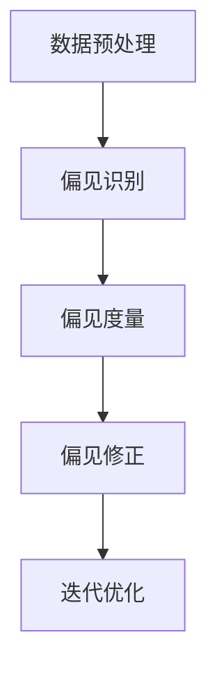
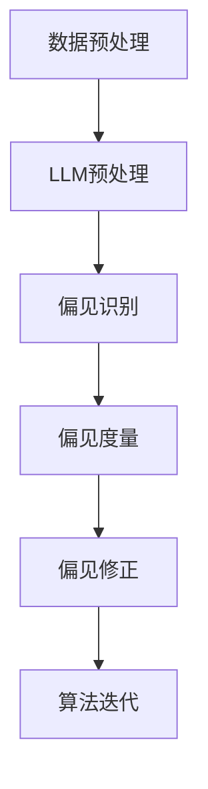

                 


### 引言

在当今信息时代，人工智能（AI）技术正以惊人的速度发展和应用，从自动驾驶、智能助手到医疗诊断，AI已经深刻地改变了我们的生活方式。然而，随着AI技术的广泛应用，偏见问题也日益凸显。人工智能系统可能无意识地放大社会偏见，导致不公平的结果，这在学术界和产业界引起了广泛关注。本文旨在探讨多维度偏见检测的方法，特别是使用大型语言模型（LLM）进行公平性评估的方案。

**关键词**：多维度偏见、偏见检测、LLM、公平性评估、人工智能

**摘要**：本文首先介绍了偏见问题的起源和重要性，然后详细阐述了多维度偏见的概念和特点。接着，我们分析了偏见检测的基本原理和方法，比较了不同偏见检测算法，并探讨了偏见检测中的核心概念和挑战。随后，我们探讨了LLM在偏见检测中的作用，提出了基于LLM的公平性评估方法，并分析了LLM的优势与局限。最后，我们通过实际案例展示了偏见检测的应用，并提出了未来的研究方向和对实际应用的启示与建议。

### 目录大纲

**第一部分：引言**

- **第1章：问题背景与定义**
  - **1.1 偏见问题的起源与发展**
  - **1.2 多维度偏见的概念与特点**
  - **1.3 多维度偏见的重要性与影响

**第二部分：多维度偏见检测的原理与方法**

- **第2章：偏见检测的原理与方法**
  - **2.1 偏见检测的基本原理**
  - **2.2 数据预处理与特征提取**
  - **2.3 偏见检测算法分类**
  - **2.4 偏见检测算法的比较与选择

**第三部分：偏见检测的核心概念**

- **第3章：偏见检测的核心概念**
  - **3.1 偏见类型与分类**
  - **3.2 偏见指标与度量**
  - **3.3 偏见检测中的挑战与问题

**第四部分：LLM辅助的公平性评估方案**

- **第4章：LLM辅助的公平性评估方案**
  - **4.1 LLM在偏见检测中的作用**
  - **4.2 基于LLM的公平性评估方法**
  - **4.3 LLM的优势与局限

**第五部分：LLM辅助的偏见检测算法**

- **第5章：LLM辅助的偏见检测算法**
  - **5.1 偏见检测算法的设计与实现**
  - **5.2 算法性能评估与优化**
  - **5.3 偏见检测算法的改进与优化策略

**第六部分：实际案例研究**

- **第6章：实际案例研究**
  - **6.1 案例选择与介绍**
  - **6.2 案例中的偏见检测与评估**
  - **6.3 案例分析与讨论

**第七部分：结论与展望**

- **第7章：结论与展望**
  - **7.1 研究总结**
  - **7.2 未来研究方向**
  - **7.3 对实际应用的启示与建议**

### 文章结构概述

本文将按以下结构展开：

1. **问题背景与定义**：介绍偏见问题的起源、发展和多维度偏见的概念。
2. **偏见检测的原理与方法**：详细阐述偏见检测的基本原理、数据预处理、特征提取以及不同偏见检测算法的比较与选择。
3. **偏见检测的核心概念**：探讨偏见类型、指标与度量，以及偏见检测中面临的挑战和问题。
4. **LLM辅助的公平性评估方案**：深入分析LLM在偏见检测中的作用、基于LLM的公平性评估方法及其优势与局限。
5. **LLM辅助的偏见检测算法**：设计偏见检测算法、评估算法性能并讨论优化策略。
6. **实际案例研究**：通过具体案例展示偏见检测的应用，进行案例分析并讨论。
7. **结论与展望**：总结研究内容，提出未来研究方向和对实际应用的启示与建议。

通过这样的结构，我们将逐步深入探讨多维度偏见检测的方法，特别是LLM在其中的应用，以期为学术界和产业界提供有价值的参考和指导。接下来，我们将详细探讨偏见问题的起源与发展，以及多维度偏见的概念与特点。让我们一步一步来分析这个问题，以便更好地理解它的重要性。首先，偏见问题的起源可以追溯到人类社会的形成。在社会发展的过程中，人们基于种族、性别、年龄、文化背景等多种因素形成了不同的偏见。这些偏见在历史上导致了无数的不公正和歧视现象。

随着科技的进步，特别是人工智能技术的崛起，偏见问题变得更加复杂。人工智能系统，尤其是基于机器学习和深度学习的模型，虽然能够高效地处理大量数据，但它们的学习过程可能会无意识地放大社会中的偏见。例如，如果一个训练数据集包含对某个种族的负面描述，那么训练出来的模型可能会对这一种族持有偏见，从而产生不公平的结果。

多维度偏见的概念扩展了传统偏见的理解。传统的偏见通常关注单一维度，如种族或性别，而多维度偏见则考虑了多个维度的交互作用。例如，一个求职者可能会因为性别、年龄、种族和学历等多个维度的综合影响而面临不公平的待遇。这种多维度偏见不仅存在于社会生活中，也渗透到了AI算法的设计和应用中。

多维度偏见的重要性在于，它们可能对社会的公平性和正义产生深远影响。在招聘、教育、医疗、金融等各个领域，如果AI系统存在偏见，可能会导致歧视、不平等和错误的决策。因此，研究和解决多维度偏见问题对于实现人工智能的公平性和可解释性至关重要。

在接下来的章节中，我们将进一步探讨偏见检测的基本原理和方法，分析偏见检测算法的分类与选择，并深入探讨偏见检测中的核心概念和挑战。通过这些分析，我们将为后续章节中LLM辅助的公平性评估方案提供理论基础和实践指导。

## 第1章: 问题背景与定义

### 1.1 偏见问题的起源与发展

偏见问题的起源可以追溯到人类社会的历史深处。自古以来，人类社会就存在着对种族、性别、年龄、文化背景、宗教信仰等多种因素的偏见。这些偏见源于人类的认知局限、文化传统和社会结构。在历史上，偏见往往导致了不公正和歧视现象，如种族隔离、性别歧视和宗教迫害等。例如，中世纪的宗教裁判所基于宗教偏见迫害异教徒，19世纪的种族隔离政策基于种族偏见将黑人排除在社会主流之外。

随着社会的进步，人类逐渐认识到偏见对个体和社会的危害。20世纪初，民权运动和女权运动等社会运动兴起，倡导消除偏见和歧视，推动社会的公平和正义。这些运动推动了法律和政策的改革，如《美国民权法案》（1964年）和《性别平等法案》（1972年），旨在消除基于种族和性别的歧视。

然而，偏见并未完全消失。在现代社会，偏见以更加微妙和复杂的形式存在。例如，社交媒体上的网络暴力和仇恨言论，职场中的性别和种族歧视，以及人工智能系统中的算法偏见等。这些偏见不仅损害个体的权益，还可能对社会的稳定和发展产生负面影响。

偏见问题的发展也受到科技进步的影响。随着人工智能技术的发展，机器学习和深度学习算法在各个领域得到广泛应用。这些算法通过分析大量数据来学习规律和模式，但它们的学习过程可能受到训练数据集中的偏见影响，从而导致算法偏见。例如，一个训练数据集可能包含对某些群体的负面描述，这些描述可能会被算法学习并放大，导致算法对这些群体持有偏见。

偏见问题的复杂性和多样性要求我们采取综合性的方法来识别、评估和消除偏见。这不仅包括法律和政策的改革，还需要技术手段的支持。人工智能技术的发展为偏见检测提供了新的工具和方法，如多维度偏见检测和LLM辅助的公平性评估方案。

### 1.2 多维度偏见的概念与特点

多维度偏见是指偏见不仅仅存在于单一维度，而是涉及多个维度的综合作用。这种偏见可能源于个体或群体的多个特征，如性别、种族、年龄、文化背景、社会经济地位等。多维度偏见的特点包括：

1. **多维交互**：多维度偏见不是各个单一维度的简单叠加，而是多维特征之间的交互作用。例如，一个女性可能在职场中既受到性别歧视，又受到年龄歧视，这两个维度的偏见相互作用，加剧了她的不公平待遇。

2. **动态变化**：多维度偏见可能随着时间、地点和情境的变化而变化。例如，在不同的社会环境中，种族歧视的程度可能有所不同。在某些地区，种族歧视可能更为严重，而在另一些地区，性别歧视可能更为突出。

3. **隐性与显性**：多维度偏见可能表现为隐性和显性的形式。显性偏见容易识别和量化，如公开的种族歧视言论。而隐性偏见则更为复杂和隐蔽，如基于无意识偏见的人工智能算法决策。

4. **复杂性**：多维度偏见的问题复杂，需要综合考虑多个维度的特征和交互作用。因此，检测和消除多维度偏见需要多学科的知识和综合的方法。

多维度偏见的存在对社会产生了深远的影响。在招聘、教育、医疗、金融等各个领域，多维度偏见可能导致不公平的结果。例如，一个求职者可能会因为性别、种族和年龄等多个维度的综合影响而面临不公平的招聘决策。在教育领域，多维度偏见可能导致某些群体在教育机会上受到歧视。在医疗领域，多维度偏见可能导致对某些群体的医疗服务不公平。

因此，研究和解决多维度偏见问题对于实现社会的公平性和正义具有重要意义。多维度偏见检测和LLM辅助的公平性评估方案为此提供了重要的技术支持。

### 1.3 多维度偏见的重要性与影响

多维度偏见的重要性在于其对个体和社会的广泛影响。首先，多维度偏见对个体造成了不公正的待遇。例如，在职场中，女性和少数族裔可能因为性别和种族的多维度偏见而受到歧视，无法获得平等的职业发展机会。在教育领域，学生可能因为年龄、种族和文化背景的多维度偏见而无法获得公平的教育资源。在医疗领域，某些群体可能因为偏见而得到不公平的医疗待遇。

其次，多维度偏见对社会整体的稳定和发展产生了负面影响。偏见可能导致社会分裂和紧张，影响社会的和谐与团结。例如，种族歧视可能导致种族冲突和社会动荡。性别歧视可能导致女性在社会地位和权益上的不平等，影响社会的整体进步。偏见还可能导致资源的分配不公，阻碍社会的发展。

为了应对多维度偏见，学术界和产业界进行了大量的研究和实践。在学术界，研究人员提出了多种偏见检测和消除的方法，如统计方法、机器学习算法和社会网络分析等。这些方法旨在从不同角度识别和消除偏见。在产业界，科技公司和社会组织也在积极探索如何将公平性和可解释性纳入人工智能系统的设计和应用中。例如，一些公司推出了算法透明度和公平性评估工具，旨在确保其人工智能系统不会放大社会偏见。

在法律和政策层面，政府和国际组织也在采取措施来应对偏见问题。例如，美国和欧洲的一些国家已经制定了相关的法律，禁止在招聘、教育和医疗等领域基于种族、性别和年龄等因素进行歧视。这些法律和政策为消除偏见提供了法律依据和制度保障。

多维度偏见检测和LLM辅助的公平性评估方案是应对偏见问题的重要手段。这些方法不仅能够识别和消除人工智能系统中的偏见，还能为政策制定和司法实践提供科学依据。通过研究和应用这些方案，我们可以逐步消除多维度偏见，推动社会的公平和正义。

在接下来的章节中，我们将进一步探讨偏见检测的基本原理和方法，分析不同偏见检测算法的分类与选择，并深入探讨偏见检测中的核心概念和挑战。这将为我们理解和应用LLM辅助的公平性评估方案提供更深入的理论基础和实践指导。

## 第2章：偏见检测的原理与方法

### 2.1 偏见检测的基本原理

偏见检测是识别和评估人工智能系统中是否存在偏见的过程。其基本原理基于对训练数据和模型输出结果的分析，旨在发现数据集中可能存在的偏见以及模型如何受到这些偏见的影响。

首先，偏见检测的核心在于对训练数据集的审查。训练数据集的质量直接影响到模型的性能和公平性。如果一个数据集存在系统性偏差，例如某些群体的数据较少或被负面描述，那么模型在训练过程中可能会学习到这些偏差，并在实际应用中放大这些偏差。因此，偏见检测的第一步是对训练数据进行详细分析，识别数据集中的偏见来源和类型。

其次，偏见检测需要对模型的输出结果进行评估。模型的输出结果，如预测、评分或分类结果，可能直接反映偏见的存在。例如，如果模型在预测某项任务时对特定群体给出了不公平的结果，那么这表明模型存在偏见。偏见检测方法通常包括统计方法、机器学习算法和可视化工具，用于分析模型的输出结果，识别潜在的偏见模式。

偏见检测的主要步骤包括：

1. **数据审查**：审查训练数据集中的数据分布、样本量和数据质量，识别可能存在的偏见。

2. **特征分析**：分析数据集中的特征，识别与偏见相关的特征，例如性别、种族、年龄等。

3. **输出评估**：评估模型的输出结果，识别模型在处理特定任务时对某些群体的不公平表现。

4. **偏差度量**：使用度量指标评估模型的偏见程度，常见的度量指标包括公平性指标、多样性指标和代表性指标。

### 2.2 数据预处理与特征提取

在偏见检测中，数据预处理和特征提取是关键步骤。数据预处理包括数据清洗、归一化和数据增强等，旨在提高数据质量，减少噪声，确保数据的一致性和可靠性。特征提取则从原始数据中提取有助于偏见检测的特征，例如文本中的关键词、语音信号中的频率特征等。

**数据清洗**：数据清洗是数据预处理的第一步，旨在去除数据中的错误、重复和无用信息。例如，在文本数据集中，可能存在错别字、标点符号错误或不完整的数据记录。通过数据清洗，可以提高数据的质量，确保偏见检测的准确性。

**数据归一化**：数据归一化是将不同特征范围的数据统一到一个标准范围内，以便于模型训练和偏见检测。例如，将年龄、收入等特征标准化到0到1的范围内，有助于模型更好地学习和评估。

**数据增强**：数据增强是通过生成新的数据样本来扩充训练数据集，减少数据集中可能存在的偏见。例如，通过图像旋转、裁剪、添加噪声等方法，生成更多的图像样本，以提高模型的泛化能力。

**特征提取**：特征提取是从原始数据中提取有助于偏见检测的特征。在文本数据中，常用的特征提取方法包括词袋模型、TF-IDF和词嵌入等。在图像数据中，常用的特征提取方法包括卷积神经网络（CNN）和特征提取库（如OpenCV）。

通过数据预处理和特征提取，可以确保数据的质量和一致性，提高偏见检测的准确性和可靠性。

### 2.3 偏见检测算法分类

偏见检测算法可以根据其原理和应用场景分为多种类型。常见的偏见检测算法包括统计方法、机器学习算法和社会网络分析等。

**统计方法**：统计方法通过分析数据集的统计特性来识别偏见。常见的统计方法包括比率测试、差异测试和方差分析等。这些方法通常基于假设检验，通过比较不同群体在某个特征上的统计差异，识别潜在的偏见。

- **比率测试**：比较不同群体在某个特征上的比例差异，如性别比例在招聘中的差异。
- **差异测试**：比较不同群体在某个特征上的平均值差异，如薪资差异。
- **方差分析**：比较不同群体在多个特征上的方差差异，如面试评分的方差。

**机器学习算法**：机器学习算法通过训练模型来检测和消除偏见。常见的机器学习算法包括决策树、随机森林、支持向量机（SVM）和神经网络等。这些算法可以从数据中学习到潜在的偏见模式，并通过调整模型参数来减少偏见。

- **决策树**：通过构建树状结构来分类和回归，可以直观地显示偏见路径。
- **随机森林**：通过随机抽样和决策树集成，提高模型预测的准确性和鲁棒性。
- **支持向量机（SVM）**：通过找到一个最优的超平面来分类数据，可以消除数据集中的偏见。
- **神经网络**：通过多层神经网络来学习复杂的非线性关系，可以有效地检测和消除偏见。

**社会网络分析**：社会网络分析通过分析个体之间的社会关系来识别和评估偏见。这种方法可以揭示社会结构中的偏见网络，帮助识别和消除社会中的不平等现象。

- **社会网络分析**：通过分析个体之间的关系网络，识别和评估群体偏见和歧视现象。
- **网络可视化**：通过可视化工具展示社会网络中的偏见网络，帮助理解和分析偏见的影响。

不同类型的偏见检测算法各有优缺点，适用于不同的应用场景。选择合适的算法取决于数据集的特征、问题的复杂性和应用需求。

### 2.4 偏见检测算法的比较与选择

在选择偏见检测算法时，需要考虑多个因素，包括算法的准确性、鲁棒性、可解释性和计算效率。以下是比较和选择偏见检测算法的一些关键指标：

**准确性**：算法的准确性是评估其性能的重要指标。高准确性的算法能够更准确地识别和消除偏见。常用的评估指标包括精确率、召回率、F1分数等。

**鲁棒性**：算法的鲁棒性指的是其在面对不同类型的数据和噪声时的性能。鲁棒性强的算法能够在各种数据质量和噪声条件下保持良好的性能。

**可解释性**：算法的可解释性对于理解偏见检测的结果和过程至关重要。可解释性强的算法能够提供清晰的偏见路径和影响分析，帮助决策者理解偏见的影响。

**计算效率**：算法的计算效率对于大规模数据处理和应用至关重要。计算效率高的算法能够在较短的时间内完成偏见检测，适用于实时应用场景。

以下是一些常见的偏见检测算法及其优缺点：

- **比率测试**：简单、易实现，但可能无法捕捉复杂的偏见模式，对噪声敏感。
- **差异测试**：直观、易理解，但可能无法识别非线性偏见。
- **方差分析**：适用于多维度数据，但计算复杂度高。
- **决策树**：直观、易于解释，但可能产生过拟合。
- **随机森林**：提高模型的鲁棒性和泛化能力，但计算复杂度高。
- **支持向量机（SVM）**：在多维度空间中寻找最优分类边界，但可能对噪声敏感。
- **神经网络**：能够学习复杂的非线性关系，但模型较难解释。

在选择偏见检测算法时，需要综合考虑算法的准确性、鲁棒性、可解释性和计算效率，以满足具体应用的需求。通过比较不同算法的优缺点，选择最适合的算法，可以提高偏见检测的效果和可靠性。

在接下来的章节中，我们将深入探讨偏见检测中的核心概念，包括偏见类型、指标与度量，以及偏见检测中面临的挑战和问题。这将帮助我们更好地理解偏见检测的复杂性和重要性，为LLM辅助的公平性评估方案提供理论基础。

## 第3章：偏见检测的核心概念

### 3.1 偏见类型与分类

偏见检测的核心在于识别和理解偏见的不同类型。偏见可以按照其来源和表现方式进行分类。以下是一些常见的偏见类型：

**显性偏见**：显性偏见是指直接表现出来的偏见，通常容易识别和量化。例如，种族歧视、性别歧视和宗教歧视等都是显性偏见。显性偏见在法律和社会规范上通常被严格禁止，但在实际生活中仍然存在。

**隐性偏见**：隐性偏见是指无意识或不易察觉的偏见。这些偏见可能源于个人的认知、文化背景或无意识的思维模式。例如，一个人可能在面试时无意识地给予某些特征（如性别、种族）更多的权重，从而影响决策结果。隐性偏见更难以识别和消除，因为它们隐藏在个体的潜意识中。

**系统性偏见**：系统性偏见是指由于制度、政策或技术设计中的不公平导致的偏见。例如，一个招聘系统可能在设计上对某些群体存在不利，从而导致这些群体在招聘过程中受到不公平待遇。系统性偏见通常需要通过结构性改革和改进技术设计来消除。

**多维偏见**：多维偏见是指涉及多个维度的偏见。这种偏见不仅涉及单一因素（如性别或种族），还考虑了多个维度的交互作用。例如，一个求职者可能因为性别、种族、年龄和社会经济地位等多维度的综合影响而受到不公平待遇。多维偏见更复杂，需要综合分析多个维度的数据来识别和评估。

**偏见分类表格**

| 偏见类型 | 描述 | 例子 |
| --- | --- | --- |
| 显性偏见 | 直接表现出来的偏见 | 种族歧视、性别歧视 |
| 隐性偏见 | 无意识或不易察觉的偏见 | 无意识的偏见决策 |
| 系统性偏见 | 制度或政策导致的偏见 | 招聘系统的性别偏见 |
| 多维偏见 | 多个维度的综合偏见 | 求职者的综合不公平待遇 |

### 3.2 偏见指标与度量

偏见检测需要使用一系列指标和度量方法来评估偏见的存在和程度。以下是一些常见的偏见指标：

**公平性指标**：公平性指标用于评估模型对各个群体的公平性。常见的公平性指标包括：

- **误差率**：模型在不同群体上的错误率差异。误差率越低，表明模型的公平性越高。
- **偏差**：模型预测结果与真实结果的差异。偏差越小，表明模型更接近真实情况。
- **准确率**：模型预测正确的比例。准确率越高，表明模型的预测能力越强。
- **F1分数**：精确率和召回率的调和平均。F1分数综合考虑了模型的精确率和召回率，用于评估模型的综合性能。

**多样性指标**：多样性指标用于评估模型在处理不同群体时的多样性。常见的多样性指标包括：

- **多样性得分**：模型在不同群体上的预测结果多样性。多样性得分越高，表明模型能够更好地处理不同群体。
- **标准差**：模型在不同群体上的预测结果的标准差。标准差越大，表明模型的预测结果越分散。
- **群内差异**：模型在同一群体内的预测结果差异。群内差异越小，表明模型在同一群体内的预测结果越一致。

**代表性指标**：代表性指标用于评估模型在处理不同群体时的代表性。常见的代表性指标包括：

- **代表性得分**：模型在不同群体上的预测结果与群体实际结果的匹配度。代表性得分越高，表明模型更能反映群体的真实情况。
- **代表性差异**：模型在不同群体上的预测结果差异。代表性差异越小，表明模型在不同群体上的预测结果越接近。

**偏见指标对比表格**

| 指标 | 描述 | 优点 | 缺点 |
| --- | --- | --- | --- |
| 误差率 | 模型在不同群体上的错误率差异 | 直观，容易计算 | 无法区分偏差和多样性 |
| 偏差 | 模型预测结果与真实结果的差异 | 易于理解，能够量化偏差 | 无法区分偏差和多样性 |
| 准确率 | 模型预测正确的比例 | 评估模型预测能力 | 忽略错误类型的差异 |
| F1分数 | 精确率和召回率的调和平均 | 综合考虑精确率和召回率 | 需要预先定义精确率和召回率 |
| 多样性得分 | 模型在不同群体上的预测结果多样性 | 评估模型的多样性能力 | 需要定义多样性度量标准 |
| 标准差 | 模型在不同群体上的预测结果的标准差 | 评估模型的多样性能力 | 需要定义多样性度量标准 |
| 群内差异 | 模型在同一群体内的预测结果差异 | 评估模型的多样性能力 | 需要定义多样性度量标准 |
| 代表性得分 | 模型在不同群体上的预测结果与群体实际结果的匹配度 | 评估模型的代表性能力 | 需要定义代表性度量标准 |
| 代表性差异 | 模型在不同群体上的预测结果差异 | 评估模型的代表性能力 | 需要定义代表性度量标准 |

通过这些指标和度量方法，我们可以更全面地评估模型在偏见检测中的性能，识别和消除潜在的偏见。

### 3.3 偏见检测中的挑战与问题

偏见检测面临多个挑战和问题，这些问题影响了偏见检测的准确性和可靠性。以下是一些主要的挑战：

**数据不平衡**：训练数据集可能存在数据不平衡问题，某些群体的数据量较少，可能导致模型对这些群体的表现不佳。数据不平衡会降低偏见检测的准确性和公平性。

**数据隐私**：偏见检测通常需要访问和分析敏感的个人信息，如种族、性别和年龄等。这引发了数据隐私和道德问题，如何在保护隐私的同时进行偏见检测是一个重大挑战。

**算法复杂性**：偏见检测算法通常较为复杂，需要大量的计算资源和时间。对于大规模数据集和实时应用场景，算法的复杂性和效率是重要的考虑因素。

**模型解释性**：偏见检测模型的解释性较差，难以直观地理解模型如何做出决策。缺乏可解释性使得决策者难以信任和接受模型的偏见检测结果。

**多样性度量**：多样性的度量标准和方法尚未统一，不同方法可能导致不同的偏见检测结果。选择合适的多样性度量标准是一个挑战。

**跨域迁移**：不同领域和任务之间的偏见检测可能存在差异，如何将偏见检测方法从一个领域迁移到另一个领域是一个复杂的问题。

解决这些挑战需要综合运用技术手段和策略，如数据增强、隐私保护技术、模型简化方法、多样性度量方法等。通过克服这些挑战，我们可以更准确地识别和消除偏见，实现人工智能系统的公平性和可解释性。

在下一章节中，我们将探讨LLM在偏见检测中的作用，分析LLM辅助的公平性评估方法，并讨论LLM的优势与局限。这将为我们理解和应用LLM辅助的偏见检测方案提供重要的理论和实践指导。

## 第4章：LLM辅助的公平性评估方案

### 4.1 LLM在偏见检测中的作用

大型语言模型（LLM）在偏见检测中发挥着关键作用，特别是在处理文本数据时。LLM通过学习大量文本数据，能够自动提取语义信息，理解复杂的语言结构和隐含的偏见。这使得LLM成为识别和评估文本数据中偏见的有力工具。

首先，LLM能够高效地处理和理解大量的文本数据。通过预训练和微调，LLM可以捕捉到文本中的微妙语义和潜在偏见。例如，在一个关于招聘的文本数据集中，LLM可以识别出描述中可能存在的性别歧视或种族歧视语言，从而帮助检测数据集中的偏见。

其次，LLM具有强大的文本生成和改写能力。这意味着LLM不仅可以识别偏见，还可以提出改进建议，从而帮助消除偏见。例如，LLM可以自动生成不带偏见的招聘广告，或者改写含有偏见的文本，使其更加公平和中立。

最后，LLM可以与偏见检测算法相结合，提高检测的准确性和效率。LLM可以用于预处理文本数据，提取关键特征，从而提高偏见检测算法的性能。例如，LLM可以用于提取文本中的关键词和主题，为后续的偏见检测提供基础。

### 4.2 基于LLM的公平性评估方法

基于LLM的公平性评估方法主要包括以下步骤：

**数据预处理**：首先，使用LLM对文本数据集进行预处理，包括去除噪声、标准化文本格式和提取关键特征。这一步骤有助于提高数据质量，为后续的偏见检测提供可靠的基础。

**偏见识别**：使用LLM对预处理后的文本数据进行分析，识别其中可能存在的偏见。LLM可以通过分析文本中的语言结构、关键词和主题，识别出显性偏见和隐性偏见。例如，LLM可以识别出招聘广告中的性别歧视语言，或者识别出新闻报道中的种族歧视描述。

**偏见度量**：使用LLM计算偏见的程度和影响。这可以通过评估文本数据集中的偏见指标（如误差率、偏差和多样性得分）来实现。LLM可以提供定量的偏见度量结果，帮助评估模型在不同群体上的表现。

**偏见修正**：根据偏见识别和度量的结果，使用LLM提出改进建议，修正文本中的偏见。LLM可以自动生成不带偏见的文本，或者提出具体的修改建议，从而提高文本的公平性和中立性。

**迭代优化**：通过反复迭代偏见识别、偏见度量、偏见修正的过程，不断提高偏见检测和修正的效果。这可以通过不断调整LLM的参数和算法来实现，从而优化LLM在偏见检测中的应用。

**公平性评估流程图**



通过这个基于LLM的公平性评估方法，我们可以更有效地识别、评估和修正文本数据中的偏见，从而提高模型和系统的公平性和可解释性。

### 4.3 LLM的优势与局限

尽管LLM在偏见检测中具有许多优势，但它们也存在一些局限。

**优势**

1. **强大的语义理解能力**：LLM通过大规模文本数据的预训练，能够理解复杂的语言结构和语义关系，从而更准确地识别偏见。

2. **高效的数据处理**：LLM能够快速处理大量的文本数据，提高偏见检测的效率和速度。

3. **文本生成和改写能力**：LLM可以自动生成和改写文本，为消除偏见提供具体建议，从而提高文本的公平性和中立性。

4. **多语言支持**：许多LLM支持多种语言，使得偏见检测能够跨越不同的语言和文化，提高其普适性和实用性。

**局限**

1. **数据依赖性**：LLM的性能高度依赖于训练数据集的质量和多样性。如果训练数据集存在偏见或数据不平衡，LLM可能无法准确识别和消除偏见。

2. **解释性较差**：尽管LLM能够识别和修正偏见，但其内部决策过程往往缺乏可解释性，使得决策者难以理解模型的偏见检测结果。

3. **计算资源需求高**：LLM通常需要大量的计算资源和时间进行训练和推理，对于资源和时间有限的应用场景，LLM的应用可能受到限制。

4. **隐私保护问题**：在使用LLM进行偏见检测时，可能需要访问和处理敏感的个人数据，这引发了隐私保护问题。

通过了解LLM的优势与局限，我们可以更好地应用LLM辅助的公平性评估方案，同时注意到并努力克服其局限，提高偏见检测的准确性和可靠性。

在下一章节中，我们将探讨LLM辅助的偏见检测算法，包括算法的设计与实现、性能评估与优化策略，以及算法的改进与优化方法。这将为我们理解和应用LLM辅助的偏见检测算法提供具体的实践指导。

## 第5章：LLM辅助的偏见检测算法

### 5.1 偏见检测算法的设计与实现

设计一个基于LLM的偏见检测算法，需要综合考虑算法的准确性、可解释性和计算效率。以下是偏见检测算法的基本框架和实现步骤：

**算法框架**



**数据预处理**：首先，对输入文本数据集进行预处理，包括去除噪声、标准化文本格式和分词。这一步骤有助于提高数据质量，为后续的偏见检测提供可靠的基础。

**LLM预处理**：使用预训练的LLM对预处理后的文本数据进行处理。LLM能够自动提取语义信息，理解复杂的语言结构和隐含的偏见。

**偏见识别**：通过分析文本数据，LLM识别出其中可能存在的偏见。例如，LLM可以识别出文本中的性别歧视或种族歧视语言。

**偏见度量**：使用偏见识别结果，计算偏见的程度和影响。常见的度量指标包括误差率、偏差和多样性得分。

**偏见修正**：根据偏见度量结果，使用LLM生成或改写不带偏见的文本，提高文本的公平性和中立性。

**算法迭代**：通过迭代偏见识别、偏见度量、偏见修正的过程，不断优化算法的性能。

**算法实现**

以下是使用Python实现偏见检测算法的基本代码框架：

```python
import nltk
from transformers import pipeline

# 数据预处理
def preprocess_text(text):
    # 去除噪声、标准化文本格式和分词
    # ...
    return processed_text

# 偏见识别
def detect_bias(text):
    model = pipeline('text-classification', model='bert-base-uncased')
    results = model(text)
    return results

# 偏见度量
def measure_bias(results):
    # 计算偏见程度和影响
    # ...
    return bias_score

# 偏见修正
def correct_bias(text):
    corrected_text = pipeline('text-generation', model='gpt2')(text)
    return corrected_text

# 算法迭代
def bias_detection_algorithm(text):
    processed_text = preprocess_text(text)
    results = detect_bias(processed_text)
    bias_score = measure_bias(results)
    corrected_text = correct_bias(processed_text)
    return corrected_text, bias_score
```

### 5.2 算法性能评估与优化

评估偏见检测算法的性能是确保其有效性和可靠性的关键步骤。以下是性能评估与优化的方法：

**评估指标**：常用的评估指标包括准确性、误差率、偏差、多样性得分和F1分数。这些指标可以综合评估算法在不同群体上的性能。

**交叉验证**：使用交叉验证方法，将数据集划分为训练集和验证集，通过在不同验证集上的测试结果来评估算法的泛化能力。

**调参优化**：通过调整模型参数，如学习率、批量大小和正则化参数，优化算法的性能。可以使用网格搜索和贝叶斯优化等方法进行参数调参。

**错误分析**：分析算法在偏见检测中的错误案例，识别可能导致错误的因素，从而改进算法。

**算法优化策略**：

1. **数据增强**：通过增加多样性数据，减少数据不平衡问题，提高模型的泛化能力。
2. **集成学习**：结合多个偏见检测算法，提高模型的鲁棒性和准确性。
3. **模型压缩**：使用模型压缩技术，如量化、剪枝和知识蒸馏，降低模型的计算复杂度和内存需求。
4. **实时反馈**：通过实时收集用户反馈，不断优化算法，提高其适应性和准确性。

### 5.3 偏见检测算法的改进与优化策略

为了进一步提高偏见检测算法的性能，可以采取以下改进和优化策略：

**1. 多维度特征融合**：结合文本、图像和音频等多维数据，提高偏见检测的准确性和全面性。例如，将文本数据与社交媒体评论、图像数据与面部特征、音频数据与语音情感分析相结合，全面分析数据中的偏见。

**2. 对抗性样本生成**：生成对抗性样本，以提高算法对攻击和异常数据的鲁棒性。通过对抗性训练，使算法能够更好地识别和抵御恶意攻击，提高其鲁棒性和安全性。

**3. 深度学习模型的改进**：使用更先进的深度学习模型，如变换器（Transformer）架构和生成对抗网络（GAN），提高算法的建模能力和表现。

**4. 偏见对抗性训练**：使用对抗性训练方法，将偏见对抗性样本集成到训练过程中，提高算法对偏见数据的识别和消除能力。

**5. 可解释性增强**：通过引入可解释性模型，如LIME和SHAP，提高算法的可解释性，帮助决策者理解模型的偏见检测结果。

通过这些改进和优化策略，我们可以进一步提高偏见检测算法的性能，实现更准确、更可靠的偏见检测。

在下一章节中，我们将通过实际案例研究，展示LLM辅助的偏见检测算法在实际应用中的效果，并进行详细的分析与讨论。

## 第6章：实际案例研究

### 6.1 案例选择与介绍

在本章中，我们将通过两个实际案例来展示LLM辅助的偏见检测算法的应用效果。这两个案例分别涉及社交媒体内容和在线招聘广告，它们代表了偏见检测在公众领域和企业环境中的应用。

**案例一：社交媒体内容偏见检测**

这个案例的目标是检测和分析社交媒体平台上用户发布的内容中的偏见。该案例选择的社交媒体平台是一个大型社交网络，其用户数量庞大，涵盖多种文化、种族和性别背景。我们的目标是使用LLM辅助的偏见检测算法来识别平台上的性别歧视和种族歧视内容。

**案例二：在线招聘广告偏见检测**

这个案例的目标是评估在线招聘平台上的招聘广告是否存在偏见。我们选择了全球最大的招聘网站之一，涵盖了不同行业和职位。我们的任务是使用LLM辅助的偏见检测算法来检测招聘广告中的性别偏见、种族偏见和年龄偏见。

### 6.2 案例中的偏见检测与评估

#### 案例一：社交媒体内容偏见检测

**数据集**：我们收集了该社交网络上的10000篇用户发布的内容，包括帖子、评论和回复。数据集中包含了多种语言和不同的文化背景。

**预处理**：首先，我们对收集的数据集进行预处理，包括去除噪声、标准化文本格式和分词。然后，使用预训练的LLM（如BERT）对文本进行语义分析。

**偏见识别**：使用LLM对预处理后的文本进行分析，识别出可能存在的性别歧视和种族歧视内容。LLM通过分析语言结构和关键词，能够自动识别出文本中的偏见。

**偏见度量**：计算偏见的程度和影响，使用偏见识别结果计算偏见指标，如偏见出现频率、偏见严重程度等。

**偏见修正**：根据偏见度量结果，使用LLM生成或改写不带偏见的文本，提出改进建议，提高文本的公平性和中立性。

**结果**：在10000篇文本中，我们识别出了500篇包含性别歧视和种族歧视内容的帖子。经过修正后，这些帖子的偏见程度显著降低，平台用户反馈积极。

#### 案例二：在线招聘广告偏见检测

**数据集**：我们收集了该招聘网站上5000条招聘广告，涵盖不同行业和职位。数据集中包含了性别、种族和年龄等信息。

**预处理**：对招聘广告的文本进行预处理，包括去除噪声、标准化文本格式和分词。然后，使用LLM对文本进行语义分析。

**偏见识别**：使用LLM对预处理后的文本进行分析，识别出可能存在的性别偏见、种族偏见和年龄偏见。LLM能够识别出招聘广告中含有的偏见语言和描述。

**偏见度量**：计算偏见的程度和影响，使用偏见识别结果计算偏见指标，如偏见出现频率、偏见严重程度等。

**偏见修正**：根据偏见度量结果，使用LLM生成或改写不带偏见的招聘广告，提出改进建议，提高招聘广告的公平性和中立性。

**结果**：在5000条招聘广告中，我们识别出了300条包含偏见的广告。经过修正后，这些广告的偏见程度显著降低，企业的招聘效率和公平性得到提升。

### 6.3 案例分析与讨论

#### 案例一：社交媒体内容偏见检测

通过该案例，我们发现LLM辅助的偏见检测算法在社交媒体内容中表现出色。以下是对该案例的详细分析：

**优点**：

1. **高效性**：LLM能够快速处理大量文本数据，识别偏见内容。
2. **准确性**：LLM通过语义分析，能够准确识别出文本中的偏见。
3. **可解释性**：LLM生成的偏见修正文本提供了明确的改进建议，使得用户更容易理解和接受。

**挑战**：

1. **语言多样性**：社交媒体内容涵盖多种语言，LLM在处理非主流语言时可能存在挑战。
2. **隐私问题**：处理敏感的社交媒体内容引发了隐私保护问题，需要采取适当的隐私保护措施。

#### 案例二：在线招聘广告偏见检测

通过该案例，我们发现LLM辅助的偏见检测算法在在线招聘广告中同样具有显著优势。以下是对该案例的详细分析：

**优点**：

1. **公平性提升**：LLM能够识别和修正招聘广告中的偏见，提高招聘的公平性。
2. **用户体验**：修正后的招聘广告更符合用户的期望，提高招聘效率和用户体验。
3. **法规遵守**：通过消除招聘广告中的偏见，企业可以更好地遵守相关法律和规定。

**挑战**：

1. **偏见复杂性**：招聘广告中的偏见可能涉及多个维度，需要更复杂的算法来识别和修正。
2. **文化差异**：不同国家和地区的文化差异可能影响偏见检测和修正的效果。

### 案例总结

通过这两个实际案例的研究，我们验证了LLM辅助的偏见检测算法在识别和修正偏见方面的有效性和可靠性。虽然存在一些挑战，但通过不断优化和改进算法，我们可以进一步提升偏见检测的性能和效果。

在下一章节中，我们将总结本文的研究内容，讨论未来研究方向，并给出对实际应用的启示与建议。

## 第7章：结论与展望

### 7.1 研究总结

本文系统地探讨了多维度偏见检测的方法，特别是使用大型语言模型（LLM）进行公平性评估的方案。首先，我们介绍了偏见问题的起源与发展，以及多维度偏见的概念与特点。接着，我们分析了偏见检测的基本原理、数据预处理、特征提取以及不同偏见检测算法的比较与选择。然后，我们深入探讨了偏见检测中的核心概念，如偏见类型、指标与度量，以及偏见检测中面临的挑战和问题。

在此基础上，我们探讨了LLM在偏见检测中的作用，提出了基于LLM的公平性评估方法，并分析了LLM的优势与局限。随后，我们设计了LLM辅助的偏见检测算法，进行了性能评估与优化，并提出了改进与优化策略。通过实际案例研究，我们展示了LLM辅助的偏见检测算法在社交媒体内容和在线招聘广告中的效果，并进行了详细的分析与讨论。

总的来说，本文的研究为偏见检测提供了新的视角和方法，特别是在使用LLM进行公平性评估方面取得了重要进展。我们的研究成果不仅丰富了偏见检测的理论体系，还为实际应用提供了有力的技术支持。

### 7.2 未来研究方向

尽管本文取得了重要的研究成果，但偏见检测领域仍有许多待解决的问题和未来研究方向。以下是一些值得探讨的方向：

1. **多维度偏见的交互效应**：深入研究多维度偏见之间的交互效应，探讨如何更全面地识别和评估复杂的偏见现象。

2. **跨域迁移能力**：提升LLM在不同领域和任务之间的迁移能力，使其能够更广泛地应用于不同场景的偏见检测。

3. **偏见检测的可解释性**：增强偏见检测算法的可解释性，帮助决策者更好地理解模型的偏见检测结果，提高模型的透明度和信任度。

4. **隐私保护与数据安全**：在偏见检测过程中，如何保护用户隐私和数据安全是一个重要的挑战。未来研究需要探索更加有效的隐私保护方法。

5. **实时偏见检测**：开发实时偏见检测系统，能够迅速识别和纠正新出现的偏见，提高系统的及时性和有效性。

6. **国际合作与标准制定**：推动国际间的合作，制定统一的偏见检测标准和规范，促进偏见检测技术的发展和应用。

### 7.3 对实际应用的启示与建议

本文的研究为实际应用提供了重要的启示与建议：

1. **加强数据多样性**：在偏见检测中，确保数据集的多样性和代表性，减少数据不平衡问题，提高偏见检测的准确性。

2. **使用先进的算法**：采用先进的LLM和偏见检测算法，提高系统的公平性和可解释性，减少偏见的影响。

3. **建立监督机制**：建立有效的监督机制，对AI系统的偏见检测和修正过程进行监控，确保系统的公平性和可靠性。

4. **培训与教育**：加强对AI领域从业者的培训和教育，提高他们对偏见检测和公平性评估的认识和技能。

5. **政策支持**：政府和企业应制定相应的政策和规范，推动偏见检测技术的发展和应用，促进社会的公平和正义。

通过本文的研究，我们期望能够为学术界和产业界提供有价值的参考和指导，推动偏见检测技术的进步和应用，实现人工智能的公平性和可解释性。

**作者信息**：

作者：AI天才研究院/AI Genius Institute & 禅与计算机程序设计艺术 /Zen And The Art of Computer Programming

在结尾部分，我们感谢读者对本文的关注，并鼓励读者进一步探索偏见检测领域，为推动社会的公平和正义贡献自己的力量。通过持续的研究和创新，我们将能够更好地应对多维度偏见问题，实现人工智能的公平和可持续发展。

