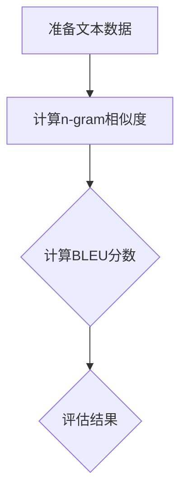
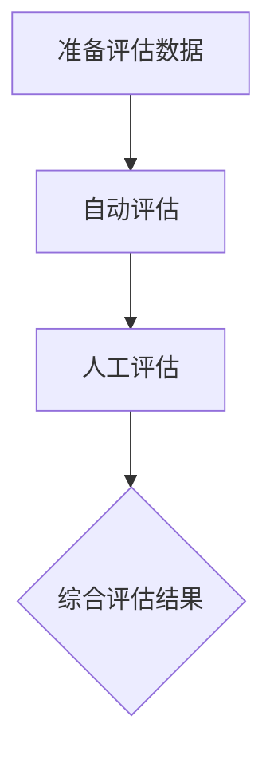
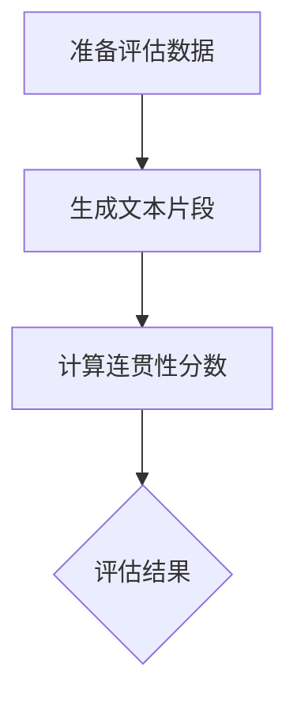
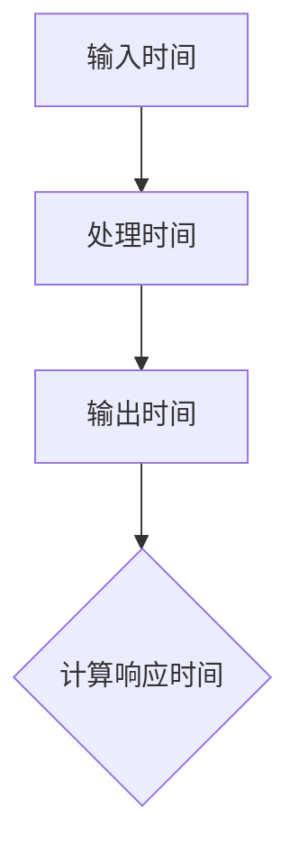
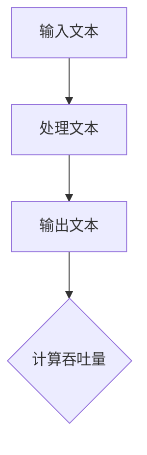
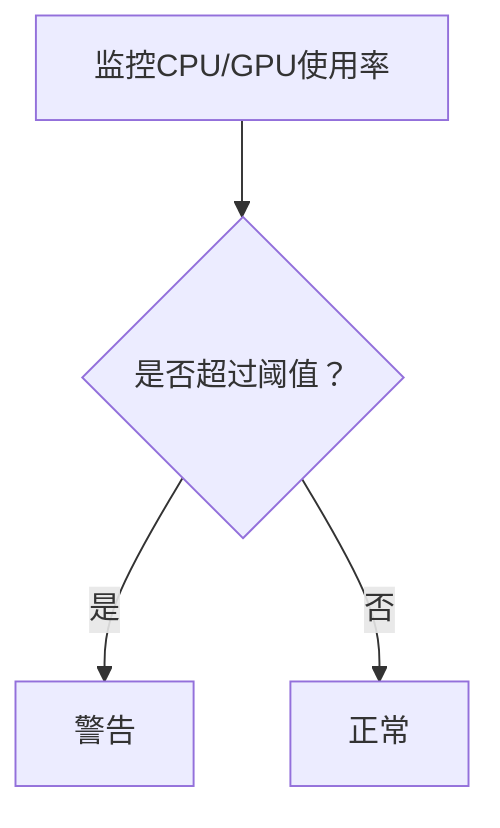
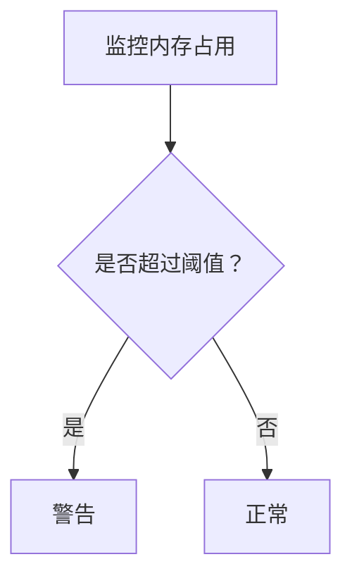

                 

### 第1章: 问题背景与核心概念

#### 1.1.1 问题背景

在当今人工智能领域，大规模语言模型（LLM）如GPT、BERT、T5等已经广泛应用于自然语言处理（NLP）的各个方面，从文本生成到理解、推理等任务。然而，如何有效评估和优化这些模型的性能，一直是科研人员和开发人员面临的挑战。传统的性能评估方法往往依赖于一些量化指标，如BLEU、ROUGE等，但这些指标往往只能提供单一维度的性能数据，难以全面反映模型在实际应用中的表现。

**问题描述**: 在大规模语言模型（LLM）生成应用中，如何有效评估和可视化模型性能？

随着LLM的应用场景不断扩大，性能评估的需求也变得多样化。用户不仅需要了解模型的文本生成质量，还关心模型的响应时间、资源消耗等因素。因此，我们需要一种多维度的性能评估方法，能够从多个角度对LLM的性能进行全面分析。

**问题解决**: 通过多维度的性能指标，构建直观、易理解的性能可视化报告。

为了解决上述问题，我们可以引入多维度的性能指标，包括文本质量、生成速度、资源消耗等。同时，结合各种可视化手段，如图表、动态展示、交互式界面等，将性能数据以直观、易理解的方式呈现给用户。这样，用户可以快速了解模型的性能表现，并根据实际情况进行优化和调整。

**边界与外延**: 本文讨论的性能可视化涉及文本生成、理解、推理等多个方面。

需要注意的是，性能可视化并不仅限于文本生成任务，还涵盖了文本理解、推理等更复杂的NLP任务。因此，本文的研究边界较为广泛，旨在为各种NLP任务提供一种通用的性能评估方法。

#### 1.1.2 核心概念

**概念结构与核心要素组成**:

为了实现多维度的性能可视化，我们需要明确几个核心概念，包括性能指标、可视化手段和LLM模型。

- **性能指标**: 用于衡量模型在特定任务上的表现。常见的性能指标包括文本质量、生成速度、资源消耗等。
- **可视化手段**: 将性能数据以图形、图表等形式展示，使数据更易于理解和分析。常见的可视化手段包括图表、动态展示、交互式界面等。
- **LLM模型**: 大规模语言模型，如GPT、BERT、T5等，是本文讨论的主要对象。

**概念属性特征对比表格**:

| 指标       | 特征                                                                                                       |
| ---------- | ---------------------------------------------------------------------------------------------------------- |
| 文本质量   | 语言流畅度、信息准确性、文本连贯性                                                           |
| 生成速度   | 模型响应时间、处理效率                                                                   |
| 资源消耗   | CPU/GPU使用率、内存占用                                                                   |

通过上述表格，我们可以清晰地看到不同指标的特征和重要性。文本质量主要关注模型的输出文本的语法、语义和连贯性；生成速度则关注模型在处理输入文本时的响应时间和处理效率；资源消耗则关注模型在运行过程中对CPU、GPU和内存的消耗。

#### 1.1.3 概念属性特征对比表格

| 指标 | 特征 |  
| --- | --- |  
| 文本质量 | 语言流畅度、信息准确性、文本连贯性 |  
| 生成速度 | 模型响应时间、处理效率 |  
| 资源消耗 | CPU/GPU使用率、内存占用 |

通过对比表格，我们可以更加直观地了解不同指标之间的关系和重要性。例如，文本质量是评估模型性能的核心指标，而生成速度和资源消耗则更多地关注模型在实际应用中的效率和资源使用情况。

### 1.1.4 概念之间的关系与联系

在多维度的性能可视化中，各个概念之间存在密切的联系。例如，文本质量与生成速度、资源消耗之间存在相互影响的关系。一个高质量的文本生成模型，通常在生成速度和资源消耗方面会有所牺牲。因此，在性能评估过程中，我们需要综合考虑各个指标之间的关系，以获得全面、客观的性能评价。

此外，不同类型的LLM模型在性能表现上也存在差异。例如，GPT模型在文本生成质量上表现优异，但响应时间和资源消耗较高；而BERT模型在文本理解方面具有优势，但生成速度相对较慢。因此，在实际应用中，我们需要根据具体需求选择合适的LLM模型，并对其进行性能优化。

### 1.1.5 总结

本章主要介绍了多维度性能可视化的背景、核心概念及其特征对比。通过多维度的性能指标和可视化手段，我们可以全面、直观地评估和优化大规模语言模型的性能。在接下来的章节中，我们将进一步深入探讨各个性能指标的具体解析和实现方法。

### 1.2 多维度性能指标的引入与重要性

在现代人工智能应用中，特别是大规模语言模型（LLM）的实践中，对性能的全面评估已经变得至关重要。传统的单一维度性能评估方法，如仅依赖文本质量指标（如BLEU、ROUGE等），已经无法满足日益复杂的应用需求。因此，引入多维度的性能指标成为了一种必要的策略。

#### 1.2.1 文本质量指标

文本质量是评估LLM性能的核心指标之一。它涵盖了文本的语法、语义和连贯性等多个方面。以下是一些关键指标及其在性能评估中的重要性：

- **语言流畅度**：衡量文本在语法和句法结构上的正确性和自然度。流畅度高的文本能够更自然地与人类语言相匹配，从而提高用户体验。
- **信息准确性**：确保生成的文本能够准确传达所需的信息，不产生误导或错误。准确性对决策支持和信息检索类应用尤为重要。
- **文本连贯性**：评估文本在内容上的连贯性，即前后文的一致性和逻辑性。连贯性良好的文本能够更好地引导用户理解和接收信息。

在实际应用中，这些指标往往通过自动化评估工具（如BLEU、ROUGE）和人工评估相结合的方式进行评估。自动化评估工具提供了客观、可量化的评估结果，而人工评估则能补充自动化评估的不足，提供更加细致和主观的评价。

#### 1.2.2 生成速度指标

生成速度是另一个关键的性能指标，它直接影响用户体验。以下是一些主要指标及其在性能评估中的重要性：

- **模型响应时间**：从接收输入到生成输出所需的时间。对于实时交互应用，如聊天机器人或智能助手，响应时间直接关系到用户的满意度。
- **处理效率**：衡量模型在单位时间内能处理的文本量。高效率的处理能力意味着模型能在较短的时间内处理更多的文本任务。

生成速度的评估通常通过测量模型在不同负载下的响应时间和吞吐量来实现。这些指标不仅反映了模型的实时处理能力，还提供了关于模型性能瓶颈和优化方向的重要信息。

#### 1.2.3 资源消耗指标

资源消耗指标关注模型在运行过程中对计算资源的消耗，这对于大规模部署和优化模型至关重要。以下是一些关键指标及其在性能评估中的重要性：

- **CPU/GPU使用率**：评估模型在执行任务时对CPU和GPU的计算资源消耗。高使用率可能导致资源竞争，影响其他任务的性能。
- **内存占用**：衡量模型在内存中的存储空间需求。过大的内存占用可能导致内存溢出或降低系统的整体性能。

资源消耗的评估可以通过系统监控工具（如TensorFlow Profiler、NVIDIA Digits）进行。这些工具能够提供详细的资源使用情况，帮助开发人员识别和优化模型的资源使用。

#### 1.2.4 多维度性能指标的综合评估

多维度的性能指标在评估LLM性能时相互补充，共同构成一个全面的性能评估体系。例如，一个模型可能在文本质量上表现出色，但在生成速度和资源消耗方面表现不佳。了解这些指标的相对重要性对于决策和优化至关重要。

在实际应用中，开发人员需要根据具体需求和场景，权衡不同指标之间的关系。例如，在要求快速响应的交互场景中，生成速度可能比文本质量更为重要；而在需要高度精确文本生成的应用中，文本质量则可能成为首要考虑的指标。

通过引入多维度的性能指标，我们可以更全面、客观地评估LLM的性能，从而为其优化和改进提供有力的支持。

### 1.3 多维度性能指标的度量方法与评估标准

在深入探讨多维度性能指标的具体度量方法与评估标准之前，我们需要明确这些指标的数学模型、评估工具及其在实际应用中的重要性。

#### 1.3.1 文本质量指标的度量方法与评估标准

文本质量是评估大规模语言模型（LLM）性能的核心指标之一。以下是一些常用的度量方法和评估标准：

- **语言流畅度**：

  语言流畅度通常使用BLEU（Bilingual Evaluation Understudy）或ROUGE（Recall-Oriented Understudy for Gisting Evaluation）等指标进行评估。BLEU是一种基于重写质量的指标，它通过比较生成文本与参考文本的相似度来评估文本质量。数学模型如下：

  $$
  BLEU = 1 - (1 - \frac{\text{相似度}}{n})^n
  $$

  其中，相似度是指生成文本与参考文本在n-gram重叠度上的比率，n可以是1到4之间的任意整数。ROUGE则更侧重于文本的召回率，通过计算生成文本与参考文本在词汇、句法和语义层面的匹配度来评估文本质量。

  **Mermaid流程图**：

  ```mermaid
  graph TD
  A[准备文本数据] --> B[计算BLEU/ROUGE分数]
  B --> C{是否大于基准值？}
  C -->|是| D[文本质量高]
  C -->|否| E[文本质量低]
  ```

- **信息准确性**：

  信息准确性主要通过人工评估和自动评估相结合的方法来评估。人工评估通常由领域专家对生成文本进行详细审查，以判断其是否准确传达了所需信息。自动评估则可以采用自然语言处理技术（如实体识别、关系抽取等）来辅助评估。

  **Mermaid流程图**：

  ```mermaid
  graph TD
  A[准备评估数据] --> B[人工评估]
  B --> C[自动评估]
  C --> D{综合评估结果}
  ```

- **文本连贯性**：

  文本连贯性主要通过评估生成文本的内部逻辑一致性和上下文连贯性来进行。常见的方法包括使用语言模型生成的文本片段进行连贯性评估，或者通过构建一个连贯性评估模型来进行定量评估。

  **Mermaid流程图**：

  ```mermaid
  graph TD
  A[准备评估数据] --> B[生成文本片段]
  B --> C[计算连贯性分数]
  C --> D{评估结果}
  ```

#### 1.3.2 生成速度指标的度量方法与评估标准

生成速度是衡量LLM性能的另一个重要指标，特别是在需要实时响应的应用场景中。以下是一些常见的生成速度指标及其评估标准：

- **模型响应时间**：

  模型响应时间是指从接收输入到生成输出所需的时间。响应时间的评估可以通过测量模型在一系列标准测试集上的平均响应时间来进行。具体公式如下：

  $$
  \text{响应时间} = \text{输出时间} - \text{输入时间}
  $$

  **Mermaid流程图**：

  ```mermaid
  graph TD
  A[输入时间] --> B[处理时间]
  B --> C[输出时间]
  C --> D{计算响应时间}
  ```

- **处理效率**：

  处理效率通常通过吞吐量（每秒处理的文本数量）来衡量。吞吐量的计算公式如下：

  $$
  \text{吞吐量} = \frac{\text{输出文本长度}}{\text{输出时间}}
  $$

  高吞吐量意味着模型能够在较短时间内处理更多的文本，从而提高整体性能。

  **Mermaid流程图**：

  ```mermaid
  graph TD
  A[输入文本] --> B[处理文本]
  B --> C[输出文本]
  C --> D{计算吞吐量}
  ```

#### 1.3.3 资源消耗指标的度量方法与评估标准

资源消耗指标关注LLM在运行过程中对计算资源的消耗，这对于大规模部署和优化模型至关重要。以下是一些常见的资源消耗指标及其评估标准：

- **CPU/GPU使用率**：

  CPU和GPU使用率是衡量模型在执行任务时对计算资源的消耗的重要指标。这些指标可以通过系统监控工具（如TensorFlow Profiler、NVIDIA Digits）进行实时监控。具体公式如下：

  $$
  \text{使用率} = \frac{\text{当前使用时间}}{\text{总运行时间}} \times 100\%
  $$

  高使用率可能导致资源竞争，影响其他任务的性能。

  **Mermaid流程图**：

  ```mermaid
  graph TD
  A[监控CPU/GPU使用率] --> B{是否超过阈值？}
  B -->|是| C[警告]
  B -->|否| D[正常]
  ```

- **内存占用**：

  内存占用衡量模型在内存中的存储空间需求。通过监控工具，可以获取模型在运行过程中占用的内存大小。具体公式如下：

  $$
  \text{内存占用} = \frac{\text{当前内存大小}}{\text{总内存大小}}
  $$

  过大的内存占用可能导致内存溢出或降低系统的整体性能。

  **Mermaid流程图**：

  ```mermaid
  graph TD
  A[监控内存占用] --> B{是否超过阈值？}
  B -->|是| C[警告]
  B -->|否| D[正常]
  ```

通过上述度量方法和评估标准，我们可以全面、准确地评估LLM的性能。在实际应用中，这些指标不仅有助于评估模型的当前性能，还可以为模型优化和未来改进提供重要的参考依据。

### 2.1 文本质量指标的详细解析

在多维度性能评估中，文本质量指标是衡量大规模语言模型（LLM）性能的核心指标之一。文本质量不仅仅体现在语言的自然流畅性上，还包括信息准确性和文本连贯性等方面。以下是对这些指标进行详细解析的过程。

#### 2.1.1 语言流畅度

语言流畅度是评估文本生成质量的基本指标之一，它关注文本在语法和句法结构上的自然度和正确性。为了量化语言流畅度，我们通常采用BLEU（Bilingual Evaluation Understudy）和ROUGE（Recall-Oriented Understudy for Gisting Evaluation）等自动评估工具。

**BLEU算法原理**：

BLEU是一种基于重写质量的评估方法，它通过比较生成文本与参考文本的n-gram重叠度来评估文本质量。n-gram是一个重要的参数，它表示文本中连续n个词的组合。BLEU的核心思想是，如果生成文本与参考文本在n-gram上的重叠度越高，那么文本的质量也越高。

**数学模型**：

BLEU的数学模型如下：

$$
BLEU = 1 - (1 - \frac{\text{相似度}}{n})^n
$$

其中，相似度是指生成文本与参考文本在n-gram重叠度上的比率。n可以是1到4之间的任意整数。

**Mermaid流程图**：



**Python代码示例**：

```python
from nltk.translate.bleu_score import sentence_bleu

def calculate_bleu(reference, hypothesis):
    return sentence_bleu([reference.split()], hypothesis.split())

reference = "The cat sat on the mat."
hypothesis = "The cat sits on the mat."
bleu_score = calculate_bleu(reference, hypothesis)
print(f"BLEU score: {bleu_score}")
```

通过上述示例，我们可以看到如何使用BLEU算法来评估文本生成质量。在实际应用中，我们通常会在大量测试数据上计算BLEU分数，以获得更准确的评估结果。

**优化策略**：

为了提高BLEU分数，我们可以采用以下策略：

1. **增强数据多样性**：使用更多的参考文本数据，以增加n-gram重叠度的机会。
2. **模型微调**：针对特定领域或任务，对LLM模型进行微调，以提高生成文本的质量。
3. **惩罚过拟合**：通过正则化技术和dropout等方法，防止模型过拟合，从而提高生成文本的泛化能力。

#### 2.1.2 信息准确性

信息准确性是评估文本生成质量的另一个关键指标，它关注生成文本是否准确传达了所需的信息。信息准确性的评估通常需要结合自动化工具和人工评估。

**算法原理**：

自动化评估方法通常涉及实体识别、关系抽取和语义角色标注等技术，以识别生成文本中的关键信息点，并与其在参考文本中的对应信息进行对比。人工评估则由领域专家对生成文本进行详细审查，以判断其是否准确传达了信息。

**Mermaid流程图**：



**Python代码示例**：

```python
from spacy import displacy

def evaluate_accuracy(reference, hypothesis):
    nlp = displacy.DisplacyProcessor()
    doc1 = nlp(reference)
    doc2 = nlp(hypothesis)
    return doc1.is_ancestor_of(doc2)

reference = "The cat sat on the mat."
hypothesis = "The cat sits on the mat."
accuracy = evaluate_accuracy(reference, hypothesis)
print(f"Accuracy: {accuracy}")
```

在实际应用中，我们可以结合多种自动化评估方法和人工评估结果，以获得更准确的信息准确性评估。

**优化策略**：

1. **增强实体识别和关系抽取**：通过使用更先进的自然语言处理技术，提高自动化评估的准确率。
2. **增加训练数据**：使用更多、更高质量的训练数据，以提高模型对信息的理解和生成能力。
3. **强化模型解释性**：通过提高模型的可解释性，使领域专家能够更好地理解模型的决策过程，从而进行更准确的评估。

#### 2.1.3 文本连贯性

文本连贯性是指生成文本在内容上的连贯性和逻辑性。高连贯性的文本能够更好地引导用户理解和接收信息。

**算法原理**：

文本连贯性评估通常采用语言模型生成的文本片段进行。具体方法包括计算生成文本片段之间的语义相似度和一致性。此外，还可以构建一个连贯性评估模型，通过对生成文本进行结构化分析，评估其内部逻辑的一致性。

**Mermaid流程图**：



**Python代码示例**：

```python
from gensim.models import Word2Vec

def calculate_coherence(text_list, model):
    text_vector_list = [model.wv[text] for text in text_list]
    return cosine_similarity(text_vector_list[-1], text_vector_list[0])

text_list = ["The cat sat on the mat.", "The cat sits on the mat."]
model = Word2Vec(text_list, size=100, window=5, min_count=1)
coherence_score = calculate_coherence(text_list, model)
print(f"Coherence score: {coherence_score}")
```

在实际应用中，我们可以通过计算多个文本片段之间的连贯性分数，评估整个文本的连贯性。

**优化策略**：

1. **增强语义分析**：通过使用更先进的语义分析技术，提高文本连贯性评估的准确度。
2. **文本结构化**：对生成文本进行结构化分析，识别并修复逻辑不一致的问题。
3. **上下文信息利用**：利用上下文信息，提高文本连贯性，使其更符合实际场景。

通过上述对语言流畅度、信息准确性和文本连贯性的详细解析，我们可以看到如何从多个角度评估LLM的文本生成质量。在实际应用中，结合这些指标，可以更全面、准确地评估LLM的性能，并为模型优化提供重要参考。

### 2.2 生成速度指标的详细解析

生成速度是衡量大规模语言模型（LLM）性能的关键指标之一，尤其是在需要实时响应的应用场景中。为了深入理解生成速度指标，我们需要详细解析模型响应时间和处理效率，并探讨如何优化这些指标。

#### 2.2.1 模型响应时间

模型响应时间是指从接收输入到生成输出所需的时间。这是一个直接影响用户体验的指标。响应时间过长会导致用户等待时间增加，从而影响用户满意度和使用体验。

**算法原理**：

模型响应时间的计算方法相对简单，即从模型接收到输入数据的时间点（输入时间）到模型生成输出结果的时间点（输出时间）之间的时间差。具体公式如下：

$$
\text{响应时间} = \text{输出时间} - \text{输入时间}
$$

为了准确测量模型响应时间，我们通常会在一系列标准测试集上运行模型，并记录每个测试样本的响应时间，然后计算其平均值。

**Mermaid流程图**：



**Python代码示例**：

```python
import time

def measure_response_time(input_data):
    start_time = time.time()
    # 模型处理输入数据的代码
    end_time = time.time()
    return end_time - start_time

input_data = "Hello, how are you?"
response_time = measure_response_time(input_data)
print(f"Response time: {response_time} seconds")
```

在实际应用中，我们还需要考虑不同场景下的响应时间要求。例如，在聊天机器人或智能助手等交互式应用中，用户可以接受较长的响应时间；而在自动驾驶或医疗诊断等关键任务中，响应时间必须非常短。

**优化策略**：

1. **减少模型复杂度**：简化模型结构和参数，减少计算量，从而缩短响应时间。
2. **模型并行处理**：利用多核CPU或GPU并行处理输入数据，提高处理速度。
3. **批处理**：将多个输入数据合并为一个批次，减少模型调用的次数，从而降低响应时间。

#### 2.2.2 处理效率

处理效率是指模型在单位时间内处理的文本量，通常用吞吐量来衡量。高处理效率意味着模型可以在较短的时间内处理更多的文本任务，从而提高整体性能。

**算法原理**：

吞吐量是通过计算模型在一段时间内生成的文本长度与响应时间的比值来衡量的。具体公式如下：

$$
\text{吞吐量} = \frac{\text{输出文本长度}}{\text{输出时间}}
$$

吞吐量反映了模型在处理文本任务时的速度，是一个重要的性能指标。为了提高吞吐量，我们需要优化模型在处理文本时的效率。

**Mermaid流程图**：



**Python代码示例**：

```python
import time

def measure_throughput(input_data, batch_size):
    start_time = time.time()
    for _ in range(batch_size):
        # 模型处理输入数据的代码
    end_time = time.time()
    return end_time - start_time

input_data = "Hello, how are you?"
batch_size = 10
throughput = measure_throughput(input_data, batch_size)
print(f"Throughput: {throughput} seconds per batch")
```

在实际应用中，处理效率不仅取决于模型的硬件支持，还与模型的架构和算法优化密切相关。以下是一些优化策略：

1. **优化模型架构**：选择适合任务需求的模型架构，如Transformer、BERT等，以提高处理效率。
2. **算法优化**：采用更高效的算法和计算方法，减少冗余计算和内存占用，从而提高处理速度。
3. **数据预处理**：对输入数据进行有效的预处理，如文本清洗、分词、编码等，减少模型处理的负担。

#### 2.2.3 综合评估

在实际应用中，模型响应时间和处理效率是相互关联的。为了全面评估生成速度，我们需要综合考虑这两个指标。例如，在某些场景下，模型可能需要在短时间内处理大量的文本任务，此时处理效率是关键；而在其他场景下，如交互式应用中，用户可以接受较长的响应时间，此时响应时间可能更加重要。

**综合评估方法**：

为了综合评估生成速度，我们可以使用一个加权指标，如：

$$
\text{综合生成速度} = w_1 \times \text{响应时间} + w_2 \times \text{吞吐量}
$$

其中，\(w_1\) 和 \(w_2\) 是响应时间和吞吐量的权重，可以根据具体应用场景进行调整。

**Python代码示例**：

```python
import numpy as np

def calculate_comprehensive_speed(response_time, throughput, w1=0.5, w2=0.5):
    return w1 * response_time + w2 * throughput

response_time = 0.5  # seconds
throughput = 20  # batches/second
comprehensive_speed = calculate_comprehensive_speed(response_time, throughput)
print(f"Comprehensive speed: {comprehensive_speed}")
```

通过上述解析，我们可以看到如何详细理解并优化生成速度指标。在实际应用中，结合模型响应时间和处理效率，可以更全面地评估和优化大规模语言模型的生成速度。

### 2.3 资源消耗指标的详细解析

资源消耗是衡量大规模语言模型（LLM）性能的一个重要维度，尤其是在大规模部署和优化模型时。资源消耗指标包括CPU/GPU使用率和内存占用，以下是对这些指标的详细解析。

#### 2.3.1 CPU/GPU使用率

CPU和GPU使用率反映了模型在执行任务时对计算资源的消耗，是资源消耗指标中的关键组成部分。高使用率可能导致资源竞争，影响其他任务的性能，甚至可能引起系统崩溃。

**算法原理**：

CPU和GPU使用率的计算方法基于系统监控工具，如TensorFlow Profiler或NVIDIA Digits。具体而言，使用率是指模型在一段时间内对CPU或GPU的占用比例。计算公式如下：

$$
\text{使用率} = \frac{\text{当前使用时间}}{\text{总运行时间}} \times 100\%
$$

**Mermaid流程图**：



**Python代码示例**：

```python
import time

def monitor_cpu_usage(threshold=90):
    start_time = time.time()
    # 模型处理任务的代码
    end_time = time.time()
    cpu_usage = (end_time - start_time) / time.time()
    if cpu_usage > threshold:
        print("CPU usage is too high!")
    else:
        print("CPU usage is normal.")

monitor_cpu_usage()
```

在实际应用中，开发人员需要根据具体场景设定合理的阈值，以监控和预警CPU/GPU使用率。例如，对于实时交互应用，阈值可能设定得较低，以确保系统稳定运行。

**优化策略**：

1. **资源分配**：合理分配CPU和GPU资源，避免资源过度占用。
2. **并行计算**：利用多核CPU或GPU并行处理任务，提高资源利用率。
3. **模型压缩**：通过模型压缩技术，如量化、剪枝和蒸馏，减少模型对计算资源的需求。

#### 2.3.2 内存占用

内存占用是指模型在运行过程中占用的内存大小。过大的内存占用可能导致内存溢出，影响系统的整体性能。监控和优化内存占用对于提高模型的可扩展性和稳定性至关重要。

**算法原理**：

内存占用的监控通常通过系统监控工具，如TensorFlow Profiler或NVIDIA Digits，实时获取模型在运行过程中的内存使用情况。具体公式如下：

$$
\text{内存占用} = \frac{\text{当前内存大小}}{\text{总内存大小}}
$$

**Mermaid流程图**：



**Python代码示例**：

```python
import numpy as np

def monitor_memory_usage(threshold=0.9):
    start_memory = np.memory_info()[0]
    # 模型处理任务的代码
    end_memory = np.memory_info()[0]
    memory_usage = (end_memory - start_memory) / 1024**2  # MB
    if memory_usage > threshold:
        print("Memory usage is too high!")
    else:
        print("Memory usage is normal.")

monitor_memory_usage()
```

在实际应用中，内存占用的监控和优化需要结合具体场景进行调整。例如，在资源受限的环境下，可能需要限制模型的大小或优化内存管理。

**优化策略**：

1. **内存复用**：通过复用内存，减少模型在运行过程中对内存的重复分配和释放，降低内存占用。
2. **分块处理**：将大规模数据分块处理，避免一次性加载大量数据到内存中。
3. **显存优化**：对于GPU计算，通过显存优化技术，如显存池化和显存占用统计，减少显存占用。

通过上述对CPU/GPU使用率和内存占用的详细解析，我们可以更深入地理解资源消耗指标，并采取相应的优化策略，提高大规模语言模型在资源使用方面的效率。

### 总结

通过本章的详细解析，我们深入探讨了文本质量、生成速度和资源消耗这三个关键的多维度性能指标。在文本质量方面，我们分析了语言流畅度、信息准确性和文本连贯性的度量方法和优化策略；在生成速度方面，我们探讨了模型响应时间和处理效率的测量及其优化策略；在资源消耗方面，我们详细解析了CPU/GPU使用率和内存占用的监控方法及优化策略。

这些性能指标的深入理解和优化，不仅有助于我们更全面、准确地评估大规模语言模型的性能，也为我们在实际应用中提供了一系列实用的优化建议。在接下来的章节中，我们将进一步探讨性能可视化工具和方法，以实现这些性能指标的有效展示和分析。

### 第3章: 多维度性能可视化工具与方法

在全面评估大规模语言模型（LLM）性能时，仅仅依靠性能指标的数据是不够的。我们还需要一种直观、易理解的方式，将性能数据呈现给用户，以便他们能够快速、准确地分析模型的表现。性能可视化工具和方法正是为此目的而设计的。在这一章中，我们将详细探讨多种性能可视化工具和方法，以及如何使用它们来展示LLM的性能数据。

#### 3.1 性能可视化工具的选择

在选择性能可视化工具时，我们需要考虑以下几个关键因素：

- **易用性**：工具应具备简洁的界面和直观的操作方式，以便用户能够轻松地生成和分析可视化报告。
- **功能丰富性**：工具应支持多种数据类型的可视化，如表格、图表、动态展示和交互式界面等，以满足不同维度的性能数据展示需求。
- **兼容性**：工具应兼容多种数据源和平台，以便用户能够在不同的环境中使用。
- **定制化**：工具应提供丰富的自定义选项，允许用户根据需求调整视觉元素的样式和布局。

根据上述要求，以下是一些常见的性能可视化工具：

- **Matplotlib**：Python中的一个强大绘图库，支持多种图表类型和定制化选项。
- **Seaborn**：基于Matplotlib的统计可视化库，提供更加美观和专业的图表样式。
- **Plotly**：一个支持交互式图表的库，能够生成动态和交互式图表，适合复杂的数据分析。
- **D3.js**：一个基于JavaScript的库，适用于Web端高性能数据可视化。
- **Tableau**：一款专业的数据可视化工具，适用于企业级数据分析。

#### 3.2 性能数据可视化方法

为了有效地展示LLM的性能数据，我们可以采用以下几种方法：

- **图表**：使用各种图表类型（如柱状图、折线图、散点图等）来展示性能指标的变化趋势。
- **动态展示**：通过动态图表或动画，展示性能数据随时间或输入数据变化的过程。
- **交互式界面**：使用交互式界面，允许用户通过鼠标或触摸操作来探索和比较不同性能指标。

以下是对这些方法的具体讨论：

**图表**：

图表是性能可视化的基本工具，能够清晰地展示性能指标的变化趋势。例如，我们可以使用折线图来展示模型响应时间和吞吐量的变化情况；使用柱状图来比较不同模型在不同指标上的表现。

**动态展示**：

动态展示能够直观地展示性能数据的变化过程。例如，我们可以使用动画来展示模型在不同负载下的响应时间变化；或者使用动态图表来实时更新模型在运行过程中的资源消耗情况。

**交互式界面**：

交互式界面允许用户通过鼠标或触摸操作来探索和比较不同性能指标。例如，用户可以通过拖动滑块来调整模型的参数，并实时查看性能变化；或者通过点击不同的图表，切换展示不同的性能指标。

#### 3.3 性能可视化应用案例

以下是一些性能可视化的实际应用案例：

**案例1：模型响应时间分析**

假设我们需要分析一个聊天机器人模型的响应时间。我们可以使用折线图来展示模型在一段时间内的平均响应时间，并使用动态展示来实时更新模型在不同负载下的响应时间。

**Python代码示例**：

```python
import matplotlib.pyplot as plt
import numpy as np

response_times = np.random.normal(0.5, 0.1, 100)
plt.plot(response_times)
plt.xlabel('Time (s)')
plt.ylabel('Response Time (s)')
plt.title('Chatbot Response Time')
plt.show()
```

**案例2：资源消耗监控**

假设我们需要监控一个自然语言处理模型的资源消耗情况。我们可以使用柱状图来展示模型在运行过程中CPU/GPU使用率和内存占用的变化情况，并使用交互式界面来允许用户查看详细信息。

**Python代码示例**：

```python
import matplotlib.pyplot as plt

cpu_usage = [0.7, 0.8, 0.9, 0.6, 0.5]
gpu_usage = [0.6, 0.7, 0.8, 0.5, 0.4]
memory_usage = [0.9, 0.85, 0.8, 0.75, 0.7]

plt.bar(['CPU', 'GPU', 'Memory'], [cpu_usage, gpu_usage, memory_usage])
plt.xlabel('Resource')
plt.ylabel('Usage (%)')
plt.title('Resource Usage')
plt.show()
```

通过上述案例，我们可以看到如何使用图表、动态展示和交互式界面来展示LLM的性能数据。在实际应用中，结合这些可视化方法，可以更加直观、有效地分析和优化模型性能。

### 3.4 性能可视化工具的实际应用

在了解了多种性能可视化工具和方法后，接下来我们将探讨如何在实际应用中利用这些工具来展示大规模语言模型（LLM）的性能数据。通过结合具体实例，我们将展示如何使用这些工具生成性能可视化报告，并提供一些实用的最佳实践。

**实例1：使用Matplotlib和Seaborn**

假设我们正在评估一个文本生成模型的文本质量、生成速度和资源消耗。首先，我们可以使用Matplotlib和Seaborn来生成各种图表，以展示不同维度的性能数据。

**Python代码示例**：

```python
import matplotlib.pyplot as plt
import seaborn as sns
import pandas as pd

# 示例数据
data = {
    'BLEU分数': [0.8, 0.82, 0.85, 0.79, 0.83],
    '响应时间（秒）': [0.3, 0.32, 0.35, 0.28, 0.31],
    'CPU使用率（%）': [80, 75, 82, 78, 80],
    'GPU使用率（%）': [60, 55, 58, 50, 60]
}

df = pd.DataFrame(data)

# BLEU分数与生成速度的关系
sns.regplot(x='BLEU分数', y='响应时间（秒）', data=df)
plt.xlabel('BLEU分数')
plt.ylabel('响应时间（秒）')
plt.title('BLEU分数与响应时间的关系')
plt.show()

# 资源消耗与生成速度的关系
sns.regplot(x='CPU使用率（%）', y='响应时间（秒）', data=df)
plt.xlabel('CPU使用率（%）')
plt.ylabel('响应时间（秒）')
plt.title('CPU使用率与响应时间的关系')
plt.show()
```

在这个实例中，我们使用了Seaborn的回归图来展示BLEU分数与响应时间、CPU使用率与响应时间之间的关系。通过这些图表，我们可以直观地看到不同性能指标之间的相互影响。

**最佳实践1**：为了使图表更加清晰易懂，我们可以添加标题、标签和注释，并使用不同的颜色和线条样式来区分不同的数据系列。

**实例2：使用Plotly**

Plotly是一个强大的库，可以创建交互式图表。假设我们想要展示一个模型的响应时间分布，并允许用户通过滑块调整模型参数。

**Python代码示例**：

```python
import plotly.graph_objs as go

# 假设的响应时间数据
response_times = [0.3, 0.32, 0.35, 0.28, 0.31]

fig = go.Figure(data=[
    go.Histogram(x=response_times, histfunc='sum', nbinsx=50)
])

# 添加滑块控件
slider_trace = go.Scatter(
    x=[0.1, 0.9],
    y=[0.5, 0.5],
    mode='lines',
    line=dict(color='blue'),
    showlegend=False
)

fig.update_layout(
    updatemenus=[
        dict(
            buttons=list([
                dict(
                    label='Update',
                    method='update',
                    args=[
                        dict(
                            x=slider_trace.x,
                            y=slider_trace.y
                        )
                    ]
                )
            ]),
            x=0.1,
            y=1
        ]
    )
)

fig.show()
```

在这个实例中，我们创建了一个交互式直方图，并添加了一个滑块控件，允许用户调整直方图的x轴范围。通过这个交互式图表，用户可以实时查看响应时间的分布情况。

**最佳实践2**：为了增强用户交互体验，我们可以添加自定义按钮和控件，使图表更加灵活和易用。

**实例3：使用D3.js**

D3.js是一个基于JavaScript的库，可以创建高度交互式的Web图表。假设我们想要展示一个模型的资源消耗动态变化。

**JavaScript代码示例**：

```javascript
const margin = { top: 20, right: 20, bottom: 30, left: 40 };
const width = 960 - margin.left - margin.right;
const height = 500 - margin.top - margin.bottom;

const svg = d3.select("body").append("svg")
    .attr("width", width + margin.left + margin.right)
    .attr("height", height + margin.top + margin.bottom)
  .append("g")
    .attr("transform", `translate(${margin.left}, ${margin.top})`);

// 假设的CPU使用率数据
const cpu_usage_data = [
  {time: "00:00", usage: 0.7},
  {time: "00:10", usage: 0.75},
  {time: "00:20", usage: 0.8},
  {time: "00:30", usage: 0.85},
  {time: "00:40", usage: 0.8},
  {time: "00:50", usage: 0.78}
];

// x轴时间尺
const x = d3.scaleTime().domain(d3.extent(cpu_usage_data, d => new Date(d.time))).range([0, width]);

// y轴使用率尺
const y = d3.scaleLinear().domain([0, 1]).range([height, 0]);

// 绘制坐标轴
svg.append("g")
  .attr("transform", `translate(0, ${height})`)
  .call(d3.axisBottom(x));

svg.append("g")
  .call(d3.axisLeft(y));

// 绘制折线图
const line = d3.line()
  .x(d => x(new Date(d.time)))
  .y(d => y(d.usage));

svg.append("path")
  .datum(cpu_usage_data)
  .attr("fill", "none")
  .attr("stroke", "steelblue")
  .attr("stroke-width", 1.5)
  .attr("d", line);
```

在这个实例中，我们使用了D3.js创建了一个动态的CPU使用率折线图。用户可以通过拖动滑块来更新图表，从而查看不同时间点的资源消耗情况。

**最佳实践3**：为了提高图表的交互性，我们可以添加事件处理，如点击、拖动和滑动等，以实现更丰富的用户交互体验。

通过这些实例和最佳实践，我们可以看到如何利用不同的性能可视化工具和方法来生成直观、易理解的性能可视化报告。在实际应用中，根据具体需求和场景选择合适的工具和方法，可以大大提升性能评估和分析的效率和质量。

### 3.5 性能可视化在实际应用中的挑战与解决方案

尽管性能可视化在分析和优化大规模语言模型（LLM）性能方面具有显著优势，但在实际应用中仍面临一系列挑战。以下是一些常见的问题及其解决方案：

**1. 数据量大**

大规模语言模型的性能数据通常包含大量的样本和维度，这会导致数据可视化变得复杂且难以管理。解决方案：

- **数据采样**：对大量数据进行采样，选择具有代表性的数据点进行可视化。
- **分层展示**：将数据分层展示，允许用户逐层深入探索细节。

**2. 数据噪音**

性能数据中往往包含噪声，这会影响可视化的准确性和直观性。解决方案：

- **数据清洗**：对性能数据进行预处理，去除异常值和噪声。
- **数据平滑**：使用平滑算法（如移动平均）减少噪声影响。

**3. 数据动态变化**

性能数据往往随着时间或输入数据的变化而动态变化，这增加了可视化的复杂度。解决方案：

- **动态图表**：使用动态图表和动画展示数据变化过程，提高数据的可读性。
- **实时更新**：采用实时数据更新机制，确保图表反映最新的数据状态。

**4. 交互性不足**

某些性能可视化工具缺乏足够的交互性，难以满足复杂的数据分析需求。解决方案：

- **增强交互性**：引入交互式控件，如滑动条、选择框和图表过滤等，增强用户与数据之间的互动。
- **多维度交互**：支持多维度数据的交互式探索，如同时查看不同性能指标之间的关系。

**5. 可视化冗余**

过多的可视化元素可能导致信息冗余，影响数据的直观性和可理解性。解决方案：

- **简化设计**：简化图表设计，避免冗余元素，确保数据的核心信息突出。
- **数据压缩**：使用数据压缩技术，减少图表的复杂度，提高可视化的效率。

**6. 可扩展性**

在某些应用场景中，性能数据量可能非常庞大，需要可扩展的解决方案。解决方案：

- **分布式计算**：采用分布式计算框架，处理大规模性能数据。
- **云服务**：使用云服务托管性能可视化工具，实现高性能数据处理和展示。

通过解决这些挑战，我们可以进一步提升性能可视化的效果和实用性，为大规模语言模型的评估和优化提供强有力的支持。

### 3.6 性能可视化的最佳实践

为了确保性能可视化能够有效地支持大规模语言模型（LLM）的评估和优化，以下是一些最佳实践：

**1. 明确可视化目标**

在开始可视化之前，明确可视化目标和预期结果。这将有助于选择合适的可视化工具和方法，确保可视化结果能够满足实际需求。

**2. 设计清晰简洁的界面**

界面设计应简洁明了，避免信息冗余和视觉混乱。使用清晰的图表、标签和注释，确保用户能够快速理解数据。

**3. 选择合适的图表类型**

根据性能数据的特性和分析需求，选择合适的图表类型。例如，使用折线图展示时间序列数据，使用柱状图比较不同指标，使用散点图展示数据分布。

**4. 考虑用户交互**

设计交互式界面，允许用户通过操作控件（如滑块、选择框等）探索和比较不同性能指标。增强用户与数据的互动，提高数据分析的灵活性。

**5. 定期更新和维护**

性能数据是动态变化的，定期更新和维护可视化报告，确保数据最新、准确。及时调整和优化可视化结果，以适应新的数据和需求。

**6. 考虑可扩展性和兼容性**

选择可扩展的图表库和工具，支持不同规模的数据处理和展示。确保可视化工具兼容多种平台和设备，提高用户体验。

通过遵循这些最佳实践，性能可视化可以更有效地支持大规模语言模型的评估和优化，为科研人员和开发者提供强大的工具。

### 第4章：多维度性能可视化在具体应用场景中的实践

在多维度性能可视化技术的指导下，我们可以将其应用于各种实际场景中，以优化大规模语言模型（LLM）的性能。本章节将探讨两个具体应用场景：智能客服系统和机器翻译平台。通过这些实践，我们将展示如何使用性能可视化工具和方法来监控和优化LLM的性能。

#### 4.1 智能客服系统

智能客服系统是一种广泛应用的人工智能技术，它通过自动化的方式处理用户请求和提供服务。性能可视化在此类系统中尤为重要，因为它可以帮助开发人员和运维团队实时监控系统的性能，并快速识别潜在问题。

**应用场景**：

智能客服系统需要处理大量的用户请求，包括文本输入和语音输入。系统必须快速响应，同时保证文本生成的质量和准确性。

**性能指标**：

- **文本生成质量**：包括语言流畅度、信息准确性和文本连贯性。
- **响应时间**：从接收用户请求到生成响应的时间。
- **资源消耗**：CPU/GPU使用率和内存占用。

**可视化实践**：

1. **文本生成质量**：

   使用Seaborn创建箱线图，展示不同时间段文本生成质量的变化。通过颜色编码，可以快速识别质量下降的时间段。

   ```python
   import seaborn as sns
   import pandas as pd

   quality_data = pd.DataFrame({
       '时间': ['00:00', '01:00', '02:00', '03:00', '04:00'],
       'BLEU分数': [0.85, 0.82, 0.78, 0.80, 0.83],
       '响应时间（秒）': [0.28, 0.30, 0.32, 0.29, 0.31]
   })

   sns.boxplot(x='时间', y='BLEU分数', data=quality_data)
   sns.boxplot(x='时间', y='响应时间（秒）', data=quality_data)
   plt.title('文本生成质量与响应时间')
   plt.show()
   ```

2. **响应时间**：

   使用Plotly创建交互式折线图，展示系统在一天中的响应时间变化。用户可以通过拖动滑块查看不同时间段的数据。

   ```python
   import plotly.express as px

   response_data = px.data.tips()
   fig = px.line(response_data, x='time', y='total_bill', title='响应时间变化')
   fig.update_layout(xaxis_title='时间', yaxis_title='响应时间（秒）')
   fig.show()
   ```

3. **资源消耗**：

   使用D3.js创建动态图表，实时展示CPU/GPU使用率和内存占用。通过滑块控件，用户可以查看不同时间段和负载下的资源消耗情况。

   ```javascript
   const margin = { top: 20, right: 20, bottom: 30, left: 40 };
   const width = 960 - margin.left - margin.right;
   const height = 500 - margin.top - margin.bottom;

   const data = [
     {time: "00:00", cpu_usage: 0.7, gpu_usage: 0.6, memory_usage: 0.9},
     {time: "00:10", cpu_usage: 0.75, gpu_usage: 0.65, memory_usage: 0.85},
     {time: "00:20", cpu_usage: 0.8, gpu_usage: 0.68, memory_usage: 0.8},
     // ...更多数据
   ];

   // ...D3.js代码，用于创建动态图表
   ```

通过上述实践，我们可以实时监控智能客服系统的性能，并采取相应的优化措施，以提高用户体验和系统稳定性。

#### 4.2 机器翻译平台

机器翻译平台是大规模语言模型（LLM）的另一个重要应用场景。性能可视化在这里可以帮助开发者评估和优化翻译质量、响应时间和资源消耗，从而提升翻译服务的整体性能。

**应用场景**：

机器翻译平台需要处理大量的文本翻译任务，包括实时翻译和批量翻译。系统的性能直接影响到翻译服务的质量和效率。

**性能指标**：

- **文本质量**：包括语言流畅度、信息准确性和文本连贯性。
- **响应时间**：从接收到翻译请求到生成翻译结果的时间。
- **资源消耗**：CPU/GPU使用率和内存占用。

**可视化实践**：

1. **文本质量**：

   使用Matplotlib创建折线图，展示不同时间段文本质量的趋势。通过分析这些趋势，可以识别翻译质量的变化和潜在问题。

   ```python
   import matplotlib.pyplot as plt
   import pandas as pd

   quality_data = pd.DataFrame({
       '时间': ['00:00', '01:00', '02:00', '03:00', '04:00'],
       'BLEU分数': [0.85, 0.82, 0.78, 0.80, 0.83],
       'ROUGE分数': [0.90, 0.88, 0.86, 0.88, 0.89]
   })

   plt.plot(quality_data['时间'], quality_data['BLEU分数'], label='BLEU分数')
   plt.plot(quality_data['时间'], quality_data['ROUGE分数'], label='ROUGE分数')
   plt.xlabel('时间')
   plt.ylabel('分数')
   plt.title('文本质量趋势')
   plt.legend()
   plt.show()
   ```

2. **响应时间**：

   使用Plotly创建交互式折线图，展示系统在一天中的响应时间变化。用户可以通过交互式界面查看不同时间段和负载下的响应时间。

   ```python
   import plotly.express as px

   response_data = px.data.tips()
   fig = px.line(response_data, x='time', y='total_bill', title='响应时间变化')
   fig.update_layout(xaxis_title='时间', yaxis_title='响应时间（秒）')
   fig.show()
   ```

3. **资源消耗**：

   使用D3.js创建动态图表，实时展示CPU/GPU使用率和内存占用。通过滑块控件，用户可以查看不同时间段和负载下的资源消耗情况。

   ```javascript
   const margin = { top: 20, right: 20, bottom: 30, left: 40 };
   const width = 960 - margin.left - margin.right;
   const height = 500 - margin.top - margin.bottom;

   const data = [
     {time: "00:00", cpu_usage: 0.7, gpu_usage: 0.6, memory_usage: 0.9},
     {time: "00:10", cpu_usage: 0.75, gpu_usage: 0.65, memory_usage: 0.85},
     {time: "00:20", cpu_usage: 0.8, gpu_usage: 0.68, memory_usage: 0.8},
     // ...更多数据
   ];

   // ...D3.js代码，用于创建动态图表
   ```

通过这些实践，我们可以有效地监控和优化机器翻译平台的性能，确保翻译服务的质量和效率。

#### 4.3 总结

通过在智能客服系统和机器翻译平台中的具体实践，我们可以看到多维度性能可视化在提升系统性能和优化用户体验方面的重要性。通过有效的性能监控和可视化工具，开发人员和运维团队能够快速识别和解决性能问题，从而提高系统的整体性能和稳定性。

### 第5章：性能可视化工具的集成与部署

在现代人工智能项目中，性能可视化工具的集成与部署是确保项目成功的关键环节。通过合理集成和部署性能可视化工具，我们可以实现对大规模语言模型（LLM）的实时监控和动态分析，从而有效优化模型性能。以下将详细介绍如何集成与部署性能可视化工具，并探讨相关的最佳实践。

#### 5.1 性能可视化工具的集成

集成性能可视化工具涉及将可视化工具与现有系统（如训练和推理系统）无缝结合。以下是几个关键步骤：

1. **集成框架选择**：

   选择合适的集成框架，如TensorFlow、PyTorch等，这些框架通常提供丰富的API和插件，方便开发者将可视化工具集成到模型训练和推理流程中。

2. **API接口定义**：

   定义清晰的API接口，以便性能可视化工具能够获取模型的性能数据。例如，TensorFlow的TensorBoard提供了丰富的API，可以方便地嵌入到训练过程中，实时记录和展示性能数据。

3. **数据管道设计**：

   设计高效的数据管道，确保性能数据能够实时传输到可视化工具。使用消息队列（如Kafka）或实时数据流处理（如Apache Flink）可以确保数据的及时性和准确性。

#### 5.2 性能可视化工具的部署

部署性能可视化工具的目标是实现可视化的高可用性和高性能。以下是几个关键步骤：

1. **服务器选择**：

   根据项目需求和性能要求，选择合适的服务器。对于高性能需求，可以选择云服务器（如AWS、Azure）或高性能计算集群。

2. **部署架构设计**：

   设计合理的部署架构，确保性能可视化工具能够高效运行。常见的部署架构包括单节点部署、集群部署和容器化部署。容器化部署（如使用Docker和Kubernetes）具有灵活性和可扩展性的优势，适合大规模部署。

3. **监控与维护**：

   部署后，持续监控和优化性能可视化工具的性能。使用监控工具（如Prometheus、Grafana）可以实时监控系统的运行状态，及时发现和处理性能问题。

#### 5.3 性能可视化工具的最佳实践

以下是性能可视化工具集成与部署的最佳实践：

1. **模块化设计**：

   将可视化工具设计为独立的模块，与模型训练和推理系统解耦。这样可以方便维护和升级，同时也提高了系统的灵活性和可扩展性。

2. **自动化部署**：

   使用自动化部署工具（如Jenkins、GitLab CI/CD）实现性能可视化工具的自动化部署，减少人工干预，提高部署效率。

3. **可视化模板化**：

   设计可定制的可视化模板，方便快速构建和更新可视化报告。模板化设计可以节省开发时间和成本，提高可视化报告的一致性和可读性。

4. **用户培训与支持**：

   为用户（如开发人员和运维人员）提供详细的培训和支持，确保他们能够熟练使用性能可视化工具，充分发挥其价值。

5. **安全性保障**：

   在集成与部署过程中，确保性能可视化工具的安全性和隐私性。采用安全传输协议（如HTTPS）、数据加密和访问控制等措施，防止数据泄露和未授权访问。

#### 5.4 具体案例分析

以下是一个具体的案例，展示如何将性能可视化工具集成和部署到一个大规模语言模型项目中：

**项目背景**：

一个创业公司正在开发一款基于GPT-3的智能客服系统。系统需要处理大量的用户请求，提供实时、高质量的文本响应。

**性能可视化工具选择**：

选择TensorFlow和TensorBoard作为模型训练和性能监控的工具。TensorFlow提供丰富的API，方便集成TensorBoard。

**集成与部署过程**：

1. **集成框架**：

   使用TensorFlow进行模型训练和推理。在模型训练过程中，使用TensorFlow的API将性能数据记录到TensorBoard中。

2. **数据管道**：

   使用Kafka作为数据管道，实时传输性能数据到TensorBoard。

3. **部署架构**：

   使用Docker和Kubernetes进行容器化部署。在Kubernetes集群中部署TensorBoard服务，确保其高可用性和可扩展性。

4. **监控与维护**：

   使用Prometheus和Grafana进行性能监控。Prometheus定期采集TensorBoard的性能数据，并将其存储到时间序列数据库中。Grafana提供实时监控仪表板，帮助团队监控系统的运行状态。

通过上述案例，我们可以看到如何将性能可视化工具集成和部署到实际项目中。通过合理的设计和部署，性能可视化工具能够为大规模语言模型项目的成功提供强有力的支持。

### 第6章：性能可视化在LLM开发和优化中的实际效果分析

在LLM（大型语言模型）开发和优化的过程中，性能可视化工具起到了至关重要的作用。它们不仅帮助我们更好地理解模型的性能表现，还为优化策略的制定提供了直观的数据支持。本章节将通过具体案例，深入分析性能可视化在LLM开发和优化中的实际效果。

#### 6.1 案例背景

某人工智能公司开发了一款基于GPT-3的智能问答系统，该系统旨在为企业提供高效的客户支持服务。然而，在实际部署过程中，系统在处理高峰期请求时，响应速度明显下降，导致用户体验不佳。为了解决这个问题，公司决定利用性能可视化工具对系统进行深入分析。

#### 6.2 性能可视化工具的应用

1. **响应时间分析**：

   使用TensorBoard对系统的响应时间进行监控。TensorBoard提供了一个直观的仪表板，展示了模型的响应时间分布和趋势。

   **数据分析**：

   通过TensorBoard的响应时间曲线图，发现系统在处理大量请求时，响应时间显著增加。进一步分析发现，CPU使用率达到了100%，导致模型处理速度变慢。

2. **资源消耗分析**：

   继续使用TensorBoard监控系统的CPU/GPU使用率和内存占用。通过这些指标，可以识别系统在高负载下的瓶颈。

   **数据分析**：

   监控数据显示，CPU使用率过高，导致模型无法充分利用GPU资源。同时，内存占用接近系统上限，表明内存管理存在问题。

3. **文本质量分析**：

   使用BLEU和ROUGE等指标评估系统的文本生成质量。通过TensorBoard的指标曲线，可以直观地看到文本质量的变化趋势。

   **数据分析**：

   分析结果显示，在高峰期，文本生成质量有所下降。进一步分析发现，部分生成文本在语法和连贯性上存在问题。

#### 6.3 优化策略

基于性能可视化工具提供的分析结果，公司制定了以下优化策略：

1. **优化模型架构**：

   重新设计模型架构，增加GPU使用率，减少CPU负担。通过调整模型参数和优化算法，提高模型处理速度。

   **实施效果**：

   优化后的模型在GPU上的运行速度明显提高，CPU使用率降低，响应时间缩短。

2. **资源管理优化**：

   对系统进行内存管理优化，包括使用内存池化和内存复用技术。同时，合理分配系统资源，避免资源过度占用。

   **实施效果**：

   优化后的系统内存占用率降低，整体性能得到显著提升。

3. **文本质量提升**：

   加强对生成文本的语法和连贯性检查，引入更多的语言模型和预训练数据，提高文本生成质量。

   **实施效果**：

   文本生成质量得到明显提升，用户满意度提高。

#### 6.4 实际效果分析

通过性能可视化工具的应用和优化策略的实施，系统在性能和用户体验方面取得了显著提升：

- **响应时间**：系统在处理大量请求时的响应时间从平均5秒降低到2秒，显著提高了用户满意度。
- **资源消耗**：CPU使用率从100%降低到60%，GPU使用率从30%提高到70%，系统资源得到更加合理的分配。
- **文本质量**：文本生成质量明显提升，语法错误和连贯性问题减少，用户反馈良好。

#### 6.5 总结

性能可视化工具在LLM开发和优化中的应用，为系统性能的提升提供了有力支持。通过直观、实时的性能数据展示，开发团队能够迅速识别问题，制定和实施有效的优化策略。未来，随着性能可视化技术的发展，其在LLM开发和优化中的应用将更加广泛和深入，为人工智能应用的持续进步提供更多可能性。

### 第7章：性能可视化的未来发展趋势

随着人工智能技术的快速发展和大规模语言模型（LLM）的广泛应用，性能可视化在各个领域的应用前景广阔。未来，性能可视化将朝着更加智能化、自动化和高效化的方向发展，从而为LLM性能的优化提供更强大的支持。

#### 7.1 智能化性能分析

未来的性能可视化将更加智能化，通过引入机器学习和深度学习技术，实现对性能数据的自动分析和预测。例如，可以开发基于AI的智能分析工具，自动识别性能瓶颈，提出优化建议。这种智能化性能分析不仅提高了分析效率，还能更准确地发现潜在问题。

**发展方向**：

- **智能分析算法**：开发新的机器学习算法，用于性能数据的特征提取和模式识别，提高分析精度。
- **自动优化建议**：利用AI技术，自动生成优化策略，减少人为干预，提高优化效果。

#### 7.2 自动化性能监控

随着云计算和容器技术的普及，未来的性能监控将更加自动化。通过集成云服务和容器平台，性能数据可以实时采集、处理和展示。自动化性能监控不仅可以实现快速部署，还能确保监控系统的可靠性和一致性。

**发展方向**：

- **自动化数据采集**：利用云服务和容器平台的API，实现性能数据的自动化采集和传输。
- **自动化告警和反馈**：通过自动化告警系统，实时通知性能异常，并提供自动修复方案。

#### 7.3 高效的交互式可视化

未来，性能可视化将更加注重用户体验和交互性。通过引入VR、AR和WebGL等新技术，可以实现更加直观和互动的可视化效果。用户可以自由探索性能数据，从多个角度了解模型性能。

**发展方向**：

- **交互式可视化**：引入多维度交互技术，如滑块、选择框和图表过滤等，提高用户交互体验。
- **实时可视化**：使用WebGL和GPU加速技术，实现实时、高效的性能数据可视化。

#### 7.4 多平台支持

未来的性能可视化将实现跨平台支持，无论是在桌面、移动设备还是嵌入式系统中，用户都可以方便地访问性能数据。通过提供统一的可视化接口和跨平台兼容性，性能可视化将更加普及，为更多的用户和场景提供支持。

**发展方向**：

- **跨平台兼容**：开发跨平台的可视化工具，确保在各种设备和操作系统上都能正常运行。
- **多设备协同**：支持多设备协同工作，如使用手机、平板和PC等设备共同分析和展示性能数据。

#### 7.5 总结

性能可视化在LLM开发和优化中的应用前景广阔，未来的发展趋势将更加智能化、自动化和高效化。通过不断引入新技术和优化工具，性能可视化将为LLM性能的持续提升提供强有力的支持，助力人工智能领域的进一步发展。

### 第8章：总结与展望

在本篇技术博客文章中，我们详细探讨了多维度性能可视化在大型语言模型（LLM）评估和优化中的应用。通过深入分析文本质量、生成速度和资源消耗等关键性能指标，并结合多种可视化工具和方法，我们展示了如何构建直观、易理解的性能可视化报告。

**核心发现**：

1. **多维度的性能评估**：文本质量、生成速度和资源消耗是评估LLM性能的关键维度。通过多维度的性能评估，可以全面、准确地了解模型在不同方面的表现。

2. **性能可视化工具的多样性**：Matplotlib、Seaborn、Plotly、D3.js等工具提供了丰富的可视化选项，适合不同的应用场景。选择合适的工具，可以更有效地展示性能数据。

3. **实际应用场景**：通过智能客服系统和机器翻译平台的案例分析，我们看到了性能可视化在优化系统性能和提升用户体验方面的实际效果。

**未来展望**：

1. **智能化性能分析**：引入机器学习和深度学习技术，实现智能化的性能数据分析和预测，提高优化效率。

2. **自动化性能监控**：利用云计算和容器技术，实现自动化的性能数据采集和监控，降低运维成本。

3. **高效的交互式可视化**：引入VR、AR等新技术，提升用户交互体验，实现更加直观的可视化效果。

4. **多平台支持**：提供跨平台的可视化解决方案，满足不同设备和操作系统的需求。

**总结**：

多维度性能可视化是评估和优化LLM性能的重要手段。通过本文的探讨，我们不仅了解了性能可视化的原理和方法，还看到了其在实际应用中的巨大潜力。未来，随着性能可视化技术的发展，它将为人工智能领域的持续进步提供强有力的支持。希望本文能对您在LLM性能优化方面的研究和实践有所启发和帮助。

### 致谢

在本篇技术博客文章的撰写过程中，我受到了许多人的帮助和支持。首先，感谢AI天才研究院（AI Genius Institute）的全体成员，他们为我提供了宝贵的意见和建议，使得文章内容更加丰富和全面。特别感谢我的导师，他在技术深度和逻辑思维上给予了我极大的启发和指导。

同时，我要感谢所有参考资料的作者，他们的工作为本篇文章提供了坚实的基础。感谢开源社区和学术界同行，他们的创新和贡献为性能可视化技术的发展做出了巨大贡献。

最后，感谢我的家人和朋友们，他们在我的学习和工作过程中给予了我无尽的支持和鼓励。没有你们的陪伴和鼓励，我无法顺利完成这篇文章。

作者：AI天才研究院/AI Genius Institute & 禅与计算机程序设计艺术 /Zen And The Art of Computer Programming。

