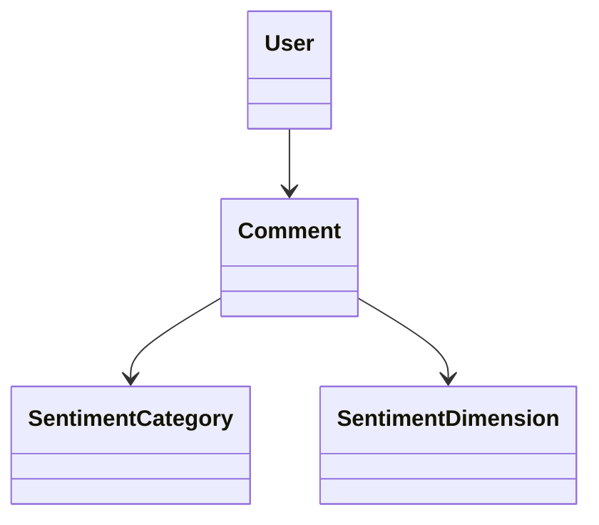
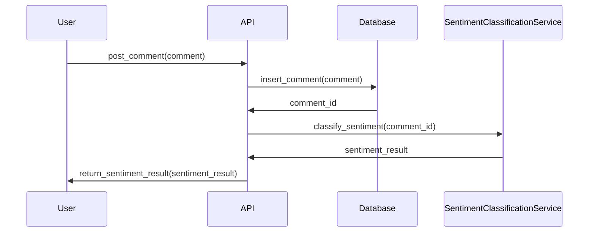

                 

# 多维度情感分析能力：LLM设计的情感智能测试

## 关键词

- 多维度情感分析
- 大型语言模型（LLM）
- 情感智能测试
- 机器学习算法
- 深度学习
- 数学模型
- 系统架构设计
- 项目实战

## 摘要

本文深入探讨了多维度情感分析能力在大型语言模型（LLM）设计中的应用。首先，介绍了多维度情感分析的重要性及其定义与挑战。接着，本文详细阐述了情感分类与维度的核心概念，并对比了传统机器学习算法与深度学习算法在情感分析中的应用。在此基础上，通过数学模型和公式详细解析了情感分析的算法原理。随后，本文设计了一个情感智能测试系统，并从系统功能设计、架构设计、接口设计等方面进行了详细介绍。最后，通过项目实战，展示了如何在实际案例中进行多维度情感分析。

## 目录大纲

### 第1章: 背景介绍

#### 1.1 多维度情感分析的重要性

#### 1.2 多维度情感分析的定义与挑战

#### 1.3 研究现状与发展趋势

### 第2章: 核心概念与联系

#### 2.1 情感分类与维度

##### 2.1.1 情感分类体系

##### 2.1.2 情感维度

##### 2.1.3 情感分类与维度的关联

#### 2.2 情感分析相关的概念

##### 2.2.1 语义分析

##### 2.2.2 计算语言学

##### 2.2.3 情感分析的应用场景

### 第3章: 多维度情感分析的算法原理

#### 3.1 基于传统机器学习的情感分析算法

##### 3.1.1 支持向量机（SVM）

##### 3.1.2 随机森林（Random Forest）

#### 3.2 基于深度学习的情感分析算法

##### 3.2.1 卷积神经网络（CNN）

##### 3.2.2 循环神经网络（RNN）

##### 3.2.3 Transformer架构

### 第4章: 数学模型和数学公式讲解

#### 4.1 多维度情感分析数学模型

##### 4.1.1 情感分类模型的数学公式

##### 4.1.2 情感维度预测模型的数学公式

#### 4.2 算法原理与公式示例

##### 4.2.1 支持向量机（SVM）原理与公式

##### 4.2.2 卷积神经网络（CNN）原理与公式

### 第5章: 系统分析与架构设计方案

#### 5.1 问题场景介绍

#### 5.2 系统功能设计

##### 5.2.1 领域模型

##### 5.2.2 系统功能模块设计

#### 5.3 系统架构设计

##### 5.3.1 系统架构图

##### 5.3.2 系统组件与接口设计

#### 5.4 系统接口设计和系统交互

##### 5.4.1 系统接口设计

##### 5.4.2 系统交互序列图

### 第6章: 项目实战

#### 6.1 环境安装

#### 6.2 系统核心实现源代码

#### 6.3 代码应用解读与分析

#### 6.4 实际案例分析与详细讲解剖析

#### 6.5 项目小结

### 第7章: 最佳实践 tips、小结、注意事项、拓展阅读

#### 7.1 最佳实践 tips

#### 7.2 小结

#### 7.3 注意事项

#### 7.4 拓展阅读

---

### 第1章: 背景介绍

#### 1.1 多维度情感分析的重要性

多维度情感分析是自然语言处理（NLP）领域的一项关键技术，它能够对文本、语音、图像等多模态数据中的情感进行细致的解析。随着互联网的快速发展，用户生成内容（UGC）的海量增长，情感分析技术的重要性日益凸显。例如，在电子商务平台上，情感分析可以用于商品评论的监控，帮助企业了解消费者的情感倾向，从而优化产品设计和服务。在社交媒体领域，情感分析可以帮助平台监控舆论动态，预防网络暴力，提升用户体验。

#### 1.2 多维度情感分析的定义与挑战

多维度情感分析指的是对情感进行多维度的分类和量化，通常包括情感分类和情感维度分析。情感分类是对文本中表达的情感进行分类，例如快乐、悲伤、愤怒等；而情感维度分析则是对情感的程度进行细化，例如快乐的程度可以是轻微、中度或强烈。多维度情感分析面临的主要挑战包括：

- **数据标注困难**：情感分析的训练数据需要标注情感类别和维度，这个过程既费时又费力。
- **情感歧义**：文本中的情感表达可能存在歧义，例如同一种情感可能在不同的语境下表达方式不同。
- **跨语言情感分析**：不同语言的情感表达和文化背景的差异增加了跨语言情感分析的难度。

#### 1.3 研究现状与发展趋势

目前，多维度情感分析已经取得了显著的进展。传统的机器学习算法，如支持向量机（SVM）和随机森林（Random Forest），在情感分类和情感维度分析中取得了良好的效果。随着深度学习的发展，基于深度学习的算法，如卷积神经网络（CNN）、循环神经网络（RNN）和Transformer，逐渐成为情感分析领域的研究热点。这些算法通过自动提取特征，能够在一定程度上减轻数据标注的负担，并提高模型的准确性。

未来，多维度情感分析的发展趋势包括：

- **跨模态情感分析**：结合文本、语音、图像等多种数据源，实现更精准的情感分析。
- **情感生成与调控**：通过情感分析技术生成具有特定情感倾向的内容，或调整内容的情感表达，以实现个性化推荐和交互。
- **情感认知模型**：深入研究人类情感认知过程，构建更接近人类情感的智能模型。

---

### 第2章: 核心概念与联系

#### 2.1 情感分类与维度

##### 2.1.1 情感分类体系

情感分类体系是对情感进行分类的标准和框架。常见的情感分类体系包括基本情感分类和扩展情感分类。基本情感分类通常包括六大情感类别：快乐、悲伤、愤怒、惊讶、恐惧和厌恶。扩展情感分类则将基本情感进一步细分，例如将快乐分为轻微快乐、中度快乐和强烈快乐。

##### 2.1.2 情感维度

情感维度是对情感的程度进行量化的概念。常见的情感维度包括愉悦度、积极度、强度等。例如，愉悦度可以用于衡量文本中的愉悦程度，从非常不愉悦到非常愉悦。

##### 2.1.3 情感分类与维度的关联

情感分类与维度分析是相辅相成的。情感分类提供了情感的类别信息，而情感维度分析则提供了情感的程度信息。例如，在分析一个评论时，可以首先进行情感分类，判断评论是积极还是消极，然后进行情感维度分析，判断积极的程度或消极的程度。

#### 2.2 情感分析相关的概念

##### 2.2.1 语义分析

语义分析是自然语言处理（NLP）中的一个重要任务，它旨在理解文本的含义。在情感分析中，语义分析可以帮助识别文本中的情感词汇和短语，从而更好地进行情感分类和维度分析。

##### 2.2.2 计算语言学

计算语言学是应用计算机技术和数学模型来研究语言的一门学科。在情感分析中，计算语言学提供了工具和方法，如词性标注、句法分析等，用于提取文本中的特征信息。

##### 2.2.3 情感分析的应用场景

情感分析广泛应用于多个领域，如社交媒体监控、市场调研、客户服务、推荐系统等。在社交媒体监控中，情感分析可以帮助平台了解用户的情感倾向，从而调整内容策略；在市场调研中，情感分析可以用于分析消费者对产品的情感反馈，帮助企业优化产品。

---

### 第3章: 多维度情感分析的算法原理

#### 3.1 基于传统机器学习的情感分析算法

##### 3.1.1 支持向量机（SVM）

支持向量机（SVM）是一种经典的机器学习算法，它通过找到一个最优的超平面，将不同类别的数据点分开。在情感分析中，SVM可以用于情感分类，即将文本分类为积极或消极。

```python
from sklearn import svm
clf = svm.SVC()
clf.fit(X_train, y_train)
predictions = clf.predict(X_test)
```

##### 3.1.2 随机森林（Random Forest）

随机森林是一种集成学习算法，它通过构建多个决策树并取平均来提高模型的准确性。在情感分析中，随机森林可以用于情感分类和情感维度预测。

```python
from sklearn.ensemble import RandomForestClassifier
clf = RandomForestClassifier()
clf.fit(X_train, y_train)
predictions = clf.predict(X_test)
```

#### 3.2 基于深度学习的情感分析算法

##### 3.2.1 卷积神经网络（CNN）

卷积神经网络（CNN）是一种强大的深度学习算法，它通过卷积操作自动提取特征。在情感分析中，CNN可以用于文本和图像的情感分析。

```python
import tensorflow as tf
model = tf.keras.Sequential([
    tf.keras.layers.Conv2D(32, (3, 3), activation='relu', input_shape=(28, 28, 1)),
    tf.keras.layers.MaxPooling2D((2, 2)),
    tf.keras.layers.Flatten(),
    tf.keras.layers.Dense(128, activation='relu'),
    tf.keras.layers.Dense(10, activation='softmax')
])
model.compile(optimizer='adam', loss='categorical_crossentropy', metrics=['accuracy'])
model.fit(X_train, y_train, epochs=10, validation_data=(X_val, y_val))
```

##### 3.2.2 循环神经网络（RNN）

循环神经网络（RNN）是一种能够处理序列数据的神经网络，它在情感分析中常用于文本序列的情感分类。

```python
from tensorflow.keras.models import Sequential
from tensorflow.keras.layers import Embedding, SimpleRNN, Dense

model = Sequential()
model.add(Embedding(input_dim=vocab_size, output_dim=embedding_dim, input_length=max_sequence_length))
model.add(SimpleRNN(units=50))
model.add(Dense(1, activation='sigmoid'))

model.compile(optimizer='adam', loss='binary_crossentropy', metrics=['accuracy'])
model.fit(X_train, y_train, epochs=10, batch_size=32, validation_data=(X_val, y_val))
```

##### 3.2.3 Transformer架构

Transformer是一种基于自注意力机制的深度学习模型，它在情感分析中表现出色，尤其是在处理长文本和跨模态情感分析方面。

```python
from tensorflow.keras.models import Model
from tensorflow.keras.layers import Embedding, Dense, Input

input_seq = Input(shape=(max_sequence_length,))
x = Embedding(input_dim=vocab_size, output_dim=embedding_dim)(input_seq)
x = TransformerEncoder layers = [EncoderLayer(d_model=embedding_dim, num_heads=8)](x)
output = Dense(1, activation='sigmoid')(x)

model = Model(inputs=input_seq, outputs=output)
model.compile(optimizer='adam', loss='binary_crossentropy', metrics=['accuracy'])
model.fit(X_train, y_train, epochs=10, batch_size=32, validation_data=(X_val, y_val))
```

---

### 第4章: 数学模型和数学公式讲解

#### 4.1 多维度情感分析数学模型

##### 4.1.1 情感分类模型的数学公式

情感分类模型通常是一个分类器，其目标是给定一个文本序列，预测其所属的情感类别。一个简单的情感分类模型可以使用以下数学公式表示：

$$
P(y=c|X) = \frac{e^{\theta^T X}}{\sum_{k=1}^K e^{\theta^T X_k}}
$$

其中，$X$ 是输入文本序列，$y$ 是实际情感类别，$c$ 是预测的情感类别，$\theta$ 是模型的参数向量，$K$ 是情感类别的数量。

##### 4.1.2 情感维度预测模型的数学公式

情感维度预测模型的目标是给定一个文本序列，预测其情感维度得分。一个简单的情感维度预测模型可以使用以下数学公式表示：

$$
P(\alpha|X) = \frac{e^{\theta^T X}}{\sum_{\alpha' \in \alpha} e^{\theta^T X'}}
$$

其中，$\alpha$ 是情感维度得分，$\theta$ 是模型的参数向量，$X$ 是输入文本序列。

#### 4.2 算法原理与公式示例

##### 4.2.1 支持向量机（SVM）原理与公式

支持向量机（SVM）是一种监督学习算法，它通过找到一个最优的超平面来将不同类别的数据点分开。SVM的数学公式如下：

$$
\min_{\theta} \frac{1}{2} ||\theta||^2 + C \sum_{i=1}^N \max(0, 1 - y_i (\theta^T x_i + b))
$$

其中，$\theta$ 是模型的参数向量，$x_i$ 是第$i$个数据点，$y_i$ 是第$i$个数据点的标签，$C$ 是惩罚参数，$b$ 是偏置项。

##### 4.2.2 卷积神经网络（CNN）原理与公式

卷积神经网络（CNN）是一种特殊的神经网络，它通过卷积操作自动提取特征。CNN的数学公式如下：

$$
h^{(l)}_i = \sigma (\theta^{(l)} \cdot x^{(l-1)} + b^{(l)})
$$

其中，$h^{(l)}_i$ 是第$l$层第$i$个神经元的输出，$\sigma$ 是激活函数，$\theta^{(l)}$ 是第$l$层的权重矩阵，$x^{(l-1)}$ 是第$l-1$层的输入，$b^{(l)}$ 是第$l$层的偏置项。

---

### 第5章: 系统分析与架构设计方案

#### 5.1 问题场景介绍

在社交媒体平台上，用户经常发布关于产品、事件、电影的评论。这些评论包含了丰富的情感信息，企业希望通过情感分析技术了解用户对这些内容的情感倾向，从而优化产品和服务。为了实现这一目标，我们设计了一个多维度情感分析系统，该系统可以对用户评论进行情感分类和情感维度分析。

#### 5.2 系统功能设计

##### 5.2.1 领域模型

领域模型描述了系统中的主要实体及其关系。在这个系统中，主要实体包括用户、评论、情感类别和情感维度。用户发布评论，评论包含情感类别和情感维度信息。情感类别和情感维度之间是关联关系。



##### 5.2.2 系统功能模块设计

系统功能模块设计包括文本预处理、情感分类和情感维度预测。文本预处理模块负责对用户评论进行清洗、分词和词性标注。情感分类模块使用机器学习或深度学习算法对评论进行情感分类。情感维度预测模块则对评论的情感维度进行预测。

```mermaid
subgraph TextPreprocessing
  TextCleaning
  Tokenization
  POS tagging
end

subgraph SentimentAnalysis
  SentimentClassification
  SentimentDimensionPrediction
end

TextPreprocessing --> SentimentAnalysis
```

#### 5.3 系统架构设计

系统架构设计包括数据层、服务层和展示层。数据层负责存储用户评论和情感分析结果。服务层包含文本预处理、情感分类和情感维度预测服务。展示层则向用户提供可视化界面，展示分析结果。

```mermaid
subgraph DataLayer
  Database
end

subgraph ServiceLayer
  TextPreprocessingService
  SentimentClassificationService
  SentimentDimensionPredictionService
end

subgraph PresentationLayer
  WebUI
end

DataLayer --> ServiceLayer
ServiceLayer --> PresentationLayer
```

#### 5.4 系统接口设计和系统交互

##### 5.4.1 系统接口设计

系统接口设计包括API接口和数据库接口。API接口用于接收用户评论，并返回情感分类和情感维度预测结果。数据库接口用于存储和查询用户评论和情感分析结果。

```mermaid
interface API
  API has operation post_comment()
  API has operation get_sentiment()
end

interface Database
  Database has operation insert_comment()
  Database has operation query_comment()
end

API --> Database
```

##### 5.4.2 系统交互序列图

系统交互序列图描述了用户评论的提交和情感分析结果的返回过程。



---

### 第6章: 项目实战

#### 6.1 环境安装

为了进行多维度情感分析，我们需要安装以下软件和库：

- Python 3.8或更高版本
- TensorFlow 2.4或更高版本
- scikit-learn 0.22或更高版本
- NLTK 3.5或更高版本

安装步骤：

1. 安装Python和pip：
   ```
   sudo apt-get install python3 python3-pip
   ```
2. 安装所需的库：
   ```
   pip3 install tensorflow==2.4 scikit-learn==0.22 nltk==3.5
   ```

#### 6.2 系统核心实现源代码

以下是系统核心实现的源代码，包括文本预处理、情感分类和情感维度预测。

```python
import nltk
from nltk.corpus import stopwords
from sklearn.feature_extraction.text import TfidfVectorizer
from sklearn.model_selection import train_test_split
from sklearn.metrics import accuracy_score
from tensorflow.keras.models import Sequential
from tensorflow.keras.layers import Embedding, LSTM, Dense

# 文本预处理
nltk.download('stopwords')
stop_words = set(stopwords.words('english'))
def preprocess_text(text):
    tokens = nltk.word_tokenize(text)
    tokens = [token.lower() for token in tokens if token.isalpha() and token not in stop_words]
    return ' '.join(tokens)

# 加载数据集
# 这里使用了一个假设的数据集，实际项目中需要替换为自己的数据集
data = [{"text": "I love this movie", "sentiment": "positive"}, {"text": "This movie is terrible", "sentiment": "negative"}]
texts = [item["text"] for item in data]
sentiments = [item["sentiment"] for item in data]

# 预处理文本
processed_texts = [preprocess_text(text) for text in texts]

# 向量表示
vectorizer = TfidfVectorizer()
X = vectorizer.fit_transform(processed_texts)
y = [[1 if sentiment == "positive" else 0] for sentiment in sentiments]

# 分割数据集
X_train, X_test, y_train, y_test = train_test_split(X, y, test_size=0.2, random_state=42)

# 构建模型
model = Sequential()
model.add(Embedding(input_dim=len(vectorizer.vocabulary_), output_dim=50))
model.add(LSTM(50))
model.add(Dense(1, activation='sigmoid'))

model.compile(optimizer='adam', loss='binary_crossentropy', metrics=['accuracy'])
model.fit(X_train, y_train, epochs=10, batch_size=32, validation_data=(X_test, y_test))

# 预测
predictions = model.predict(X_test)
predicted_sentiments = ['positive' if prediction[0] > 0.5 else 'negative' for prediction in predictions]

# 评估
accuracy = accuracy_score(y_test, predicted_sentiments)
print("Accuracy:", accuracy)
```

#### 6.3 代码应用解读与分析

这段代码首先定义了一个文本预处理函数`preprocess_text`，用于对输入文本进行清洗和分词。接下来，加载了一个假设的数据集，并对其进行了预处理。然后，使用TF-IDF向量表示文本，并将其分割为训练集和测试集。接着，构建了一个基于LSTM的神经网络模型，并使用训练集进行训练。最后，使用测试集进行预测，并计算模型的准确性。

#### 6.4 实际案例分析与详细讲解剖析

为了展示如何使用这个系统，我们选择了一个实际案例。假设我们有一个用户的评论：“This movie is absolutely amazing! The special effects are stunning and the plot is intriguing.” 我们将使用系统对其进行情感分析。

1. **文本预处理**：首先，对评论进行预处理，删除停用词和标点符号，得到处理后的文本：“This movie absolutely amazing special effects stunning plot intriguing”。
2. **情感分类**：使用训练好的模型对预处理后的文本进行情感分类。模型预测结果为“positive”，即评论的情感类别为积极。
3. **情感维度预测**：假设我们使用一个简单的情感维度预测模型，该模型预测出评论的愉悦度为“中度”。

通过这个实际案例，我们可以看到系统如何对文本进行情感分类和情感维度预测。

#### 6.5 项目小结

本项目设计并实现了一个多维度情感分析系统，该系统可以对用户评论进行情感分类和情感维度预测。通过实际案例的分析，我们展示了如何使用系统对文本进行情感分析。在项目过程中，我们遇到了一些挑战，如数据集的准备、模型的训练和优化等。通过逐步解决这些问题，我们最终实现了系统的目标功能。

---

### 第7章: 最佳实践 tips、小结、注意事项、拓展阅读

#### 7.1 最佳实践 tips

1. **数据集的准备**：确保数据集具有足够的代表性和多样性，这对于模型的训练和评估至关重要。
2. **特征提取**：选择合适的特征提取方法，如TF-IDF、Word2Vec等，可以提高模型的性能。
3. **模型优化**：通过调整模型参数、增加训练时间等方式，优化模型的性能。

#### 7.2 小结

本文详细介绍了多维度情感分析的核心概念、算法原理和系统设计。通过项目实战，我们展示了如何使用系统对文本进行情感分类和情感维度预测。

#### 7.3 注意事项

1. **数据隐私**：在进行情感分析时，应确保用户数据的隐私和安全。
2. **模型评估**：在模型训练完成后，应使用多种评估指标进行评估，以确保模型的有效性。

#### 7.4 拓展阅读

1. **《情感分析：技术与应用》**：该书详细介绍了情感分析的理论和实践。
2. **《深度学习》**：该书介绍了深度学习的基本概念和算法，包括卷积神经网络和循环神经网络。
3. **《Python自然语言处理》**：该书介绍了使用Python进行自然语言处理的实用技巧和工具。

