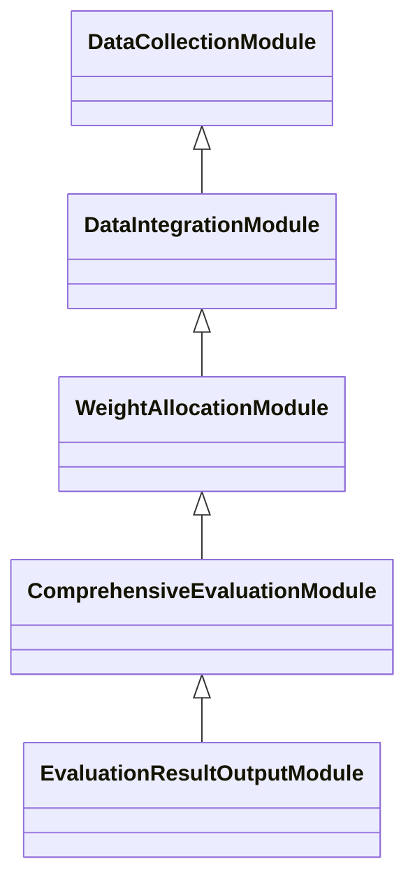
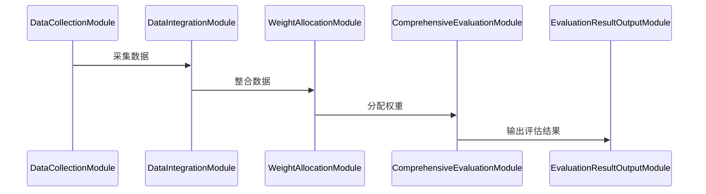
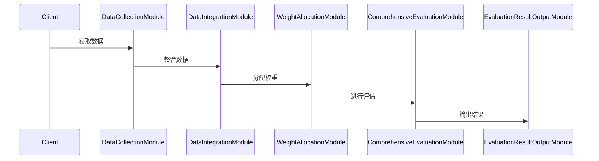

                 

# 多维度评测指标体系的设计

## 摘要

在数字化转型的背景下，多维度评测指标体系的设计成为提升企业运营效率、优化业务决策的关键。本文从问题背景出发，详细探讨了多维度评测指标的定义、核心概念、算法原理、数学模型以及系统设计与实现。通过逐步分析，本文旨在为读者提供一套清晰、系统的设计思路，助力其在实际项目中构建高效的多维度评测指标体系。

## 关键词

多维度评测指标、数据驱动决策、算法设计、数学模型、系统架构

### 引言

在现代商业环境中，数据已成为企业竞争的重要资产。如何有效地利用数据，进行科学的决策分析，成为企业关注的焦点。而多维度评测指标体系作为数据分析的重要工具，能够全面、准确地反映企业的运营状态和业务表现，进而指导决策优化。本文将围绕多维度评测指标体系的设计，展开深入探讨。

### 1.1 问题背景

#### 1.1.1 多维度评测指标体系概述

多维度评测指标体系是指从多个角度和层面来评价和分析一个系统、项目或业务的表现。它不仅关注单一的绩效指标，而是通过多维度的综合评估，提供更为全面、客观的评估结果。常见的维度包括财务指标、客户满意度、员工绩效、社会责任等。

#### 1.1.2 现有评测指标体系面临的挑战

尽管多维度评测指标体系的重要性日益凸显，但现有的评测指标体系仍存在一些问题：

1. **指标单一化**：许多企业仍然依赖单一维度的指标，如利润、销售额等，忽视了其他重要的业务维度。
2. **指标不全面**：部分评测指标未能涵盖所有关键业务领域，导致评估结果不完整。
3. **指标权重不均衡**：不同维度的指标在整体评估中的权重分配不合理，可能导致评估结果偏差。
4. **动态调整不足**：评测指标体系往往缺乏灵活性，难以适应快速变化的市场环境。

#### 1.1.3 新指标体系的需求与目标

针对现有评测指标体系的不足，设计一套全新的多维度评测指标体系显得尤为重要。新指标体系的需求与目标包括：

1. **全面性**：覆盖企业运营的各个关键维度，确保评估结果的全面性。
2. **灵活性**：具备动态调整的能力，能够适应不同业务场景和变化需求。
3. **权重合理性**：根据不同维度的战略重要性，合理分配权重，确保评估结果的准确性。
4. **数据驱动**：充分利用大数据和人工智能技术，实现指标自动采集、分析和优化。

### 1.2 问题描述

#### 1.2.1 评测指标体系的当前状况

目前，许多企业的评测指标体系仍存在以下问题：

1. **指标单一**：过度依赖财务指标，忽视其他重要维度。
2. **指标老化**：未及时更新，未能反映业务变化。
3. **指标无关**：部分指标与业务目标无关，影响评估效果。

#### 1.2.2 需求分析与解决方案

为了解决上述问题，需要从以下几个方面进行改进：

1. **全面性**：引入新的业务维度，如客户满意度、员工绩效等。
2. **灵活性**：设计动态调整机制，确保指标体系的适应性。
3. **权重分配**：根据业务战略，调整指标权重，确保评估的准确性。
4. **数据驱动**：利用大数据和人工智能技术，实现指标的自动化采集和分析。

#### 1.2.3 边界与外延

在设计和实施新的多维度评测指标体系时，需要明确以下几个边界与外延：

1. **业务范围**：明确指标体系适用的业务范围和边界。
2. **数据来源**：确定数据采集的渠道和标准。
3. **实施条件**：评估实施新指标体系所需的资源和技术支持。
4. **反馈机制**：建立有效的反馈机制，持续优化指标体系。

### 2. 核心概念与联系

#### 2.1 核心概念

在设计多维度评测指标体系时，需要理解以下几个核心概念：

1. **多维数据**：指从多个维度收集的数据，如财务数据、客户数据、员工数据等。
2. **综合评估**：通过多维数据的整合和分析，对企业运营进行全面的评估。
3. **指标权重**：不同维度指标在整体评估中的权重，影响评估结果的准确性。
4. **动态调整**：根据业务变化和需求，实时调整指标体系和权重分配。

#### 2.2 概念属性特征对比表格

以下是一个关于多维度评测指标体系的概念属性特征对比表格：

| 概念       | 属性       | 特征               |
|------------|------------|--------------------|
| 多维数据   | 数据类型   | 财务数据、客户数据 |
| 综合评估   | 评估方法   | 多维度数据整合     |
| 指标权重   | 权重分配   | 根据业务战略调整   |
| 动态调整   | 灵活性     | 快速响应业务变化   |

#### 2.3 ER实体关系图架构

以下是一个ER实体关系图架构的示例，展示了多维度评测指标体系中的关键实体及其关系：

```mermaid
erDiagram
  多维数据 ||--|{ 综合评估 }
  综合评估 ||--|{ 指标权重 }
  指标权重 ||--|{ 动态调整 }
```

### 3. 算法原理讲解

#### 3.1 算法概述

设计多维度评测指标体系的核心在于算法原理的运用。以下是该算法的基本概述：

1. **数据采集**：从多个维度收集数据，如财务数据、客户数据等。
2. **数据整合**：将不同维度的数据整合为一个统一的数据集。
3. **权重分配**：根据业务战略和指标重要性，分配不同维度的权重。
4. **综合评估**：利用整合后的数据集和权重分配，进行综合评估。

#### 3.2 算法mermaid流程图

以下是一个算法mermaid流程图的示例，展示了多维度评测指标体系的算法步骤：


#### 3.3 算法原理详细讲解

为了更详细地解释算法原理，我们可以使用Python源代码和LaTeX数学公式来阐述：

```python
# Python代码示例：数据采集
def data_collection():
    # 从不同维度采集数据
    financial_data = collect_financial_data()
    customer_data = collect_customer_data()
    employee_data = collect_employee_data()
    return financial_data, customer_data, employee_data

# Python代码示例：数据整合
def data_integration(financial_data, customer_data, employee_data):
    # 整合不同维度的数据
    integrated_data = {
        'financial': financial_data,
        'customer': customer_data,
        'employee': employee_data
    }
    return integrated_data

# LaTeX数学公式示例：权重分配
$$
\text{weight}_{i} = \frac{\text{business\_importance}_{i}}{\sum_{j=1}^{n} \text{business\_importance}_{j}}
$$

# Python代码示例：综合评估
def comprehensive_evaluation(integrated_data, weights):
    # 利用整合后的数据和权重进行评估
    evaluation_result = {}
    for dimension, data in integrated_data.items():
        score = calculate_score(data, weights[dimension])
        evaluation_result[dimension] = score
    return evaluation_result

# Python代码示例：评估结果输出
def output_evaluation_result(evaluation_result):
    # 输出评估结果
    print("综合评估结果：", evaluation_result)
```

### 4. 数学模型和数学公式

#### 4.1 数学模型概述

在设计多维度评测指标体系时，常用的数学模型包括数据整合模型、权重分配模型和综合评估模型。以下是这些模型的概述：

1. **数据整合模型**：用于整合不同维度的数据，使其形成一个统一的数据集。
2. **权重分配模型**：用于根据业务战略和指标重要性，分配不同维度的权重。
3. **综合评估模型**：用于利用整合后的数据和权重进行综合评估。

#### 4.2 详细讲解

以下是每个数学模型的详细讲解：

##### 4.2.1 数据整合模型

数据整合模型的核心目标是整合不同维度的数据，使其形成一个统一的数据集。以下是一个数据整合模型：

$$
\text{Integrated\_Data} = \text{Financial\_Data} \cup \text{Customer\_Data} \cup \text{Employee\_Data}
$$

其中，$\text{Integrated\_Data}$ 表示整合后的数据集，$\text{Financial\_Data}$、$\text{Customer\_Data}$ 和 $\text{Employee\_Data}$ 分别表示财务数据、客户数据和员工数据。

##### 4.2.2 权重分配模型

权重分配模型用于根据业务战略和指标重要性，分配不同维度的权重。以下是一个权重分配模型：

$$
\text{weight}_{i} = \frac{\text{business\_importance}_{i}}{\sum_{j=1}^{n} \text{business\_importance}_{j}}
$$

其中，$\text{weight}_{i}$ 表示第 $i$ 个维度的权重，$\text{business\_importance}_{i}$ 表示第 $i$ 个维度的业务重要性，$n$ 表示总维度数。

##### 4.2.3 综合评估模型

综合评估模型用于利用整合后的数据和权重进行综合评估。以下是一个综合评估模型：

$$
\text{evaluation\_result}_{i} = \sum_{j=1}^{n} \text{weight}_{j} \cdot \text{score}_{j,i}
$$

其中，$\text{evaluation\_result}_{i}$ 表示第 $i$ 个维度的评估结果，$\text{weight}_{j}$ 表示第 $j$ 个维度的权重，$\text{score}_{j,i}$ 表示第 $i$ 个维度在第 $j$ 个指标下的得分。

#### 4.3 举例说明

为了更直观地展示数学模型的应用，我们以一个实际案例为例进行说明。

假设一个企业的多维度评测指标体系包括财务、客户和员工三个维度，每个维度下有若干指标。根据业务战略和指标重要性，我们为其分配了如下权重：

$$
\text{weight}_{\text{financial}} = 0.4, \quad \text{weight}_{\text{customer}} = 0.3, \quad \text{weight}_{\text{employee}} = 0.3
$$

现在，假设我们收集了以下数据：

| 指标         | 财务得分 | 客户得分 | 员工得分 |
|--------------|---------|---------|---------|
| 销售额       | 80     | 70     | 60     |
| 客户满意度   | 90     | 85     | 75     |
| 员工满意度   | 95     | 90     | 85     |

根据综合评估模型，我们可以计算出综合评估结果：

$$
\text{evaluation\_result} = 0.4 \cdot 80 + 0.3 \cdot 70 + 0.3 \cdot 60 = 32 + 21 + 18 = 71
$$

因此，该企业的综合评估得分为 71。

### 5. 系统分析与架构设计方案

#### 5.1 问题场景介绍

假设我们所在的企业需要设计一个多维度评测指标体系，用于评估各部门的运营绩效。该体系需要涵盖财务、客户和员工三个维度，并具备动态调整和自动评估的功能。

#### 5.2 系统功能设计

为了实现上述功能，我们设计了以下系统功能模块：

1. **数据采集模块**：负责从各个维度采集数据。
2. **数据整合模块**：负责整合不同维度的数据。
3. **权重分配模块**：负责根据业务战略和指标重要性，分配不同维度的权重。
4. **综合评估模块**：负责利用整合后的数据和权重进行综合评估。
5. **评估结果输出模块**：负责输出评估结果，并进行可视化展示。

以下是一个领域模型类图，展示了系统功能模块及其关系：



#### 5.3 系统架构设计

为了实现高效、稳定的多维度评测指标体系，我们采用了分布式系统架构，确保系统的高可用性和可扩展性。以下是一个系统架构图，展示了各个模块的交互关系：



#### 5.4 系统接口设计和系统交互

为了确保系统模块之间的协同工作，我们设计了以下接口和交互流程：

1. **数据采集接口**：用于从各个维度采集数据。
2. **数据整合接口**：用于整合不同维度的数据。
3. **权重分配接口**：用于根据业务战略和指标重要性，分配不同维度的权重。
4. **综合评估接口**：用于利用整合后的数据和权重进行综合评估。
5. **评估结果输出接口**：用于输出评估结果，并进行可视化展示。

以下是一个系统接口和交互序列图，展示了系统模块之间的交互关系：



### 6. 项目实战

#### 6.1 环境安装

在开始项目实战之前，我们需要安装以下环境和工具：

1. **Python 3.8及以上版本**
2. **Anaconda（用于环境管理）**
3. **Jupyter Notebook（用于编写和运行代码）**
4. **Mermaid（用于绘制图表）**

安装步骤如下：

1. 安装Anaconda，并创建一个名为`evaluation`的新环境。
2. 激活`evaluation`环境，并安装Python和Jupyter Notebook。
3. 安装Mermaid，可通过pip命令安装：`pip install mermaid`.

#### 6.2 系统核心实现

以下是一个系统核心实现的示例，展示了多维度评测指标体系的主要功能：

```python
# 导入所需的库
import pandas as pd
import numpy as np
import mermaid

# 数据采集
def data_collection():
    financial_data = pd.DataFrame({'指标': ['销售额', '利润率'], '数值': [80, 0.2]})
    customer_data = pd.DataFrame({'指标': ['客户满意度', '客户投诉率'], '数值': [90, 10]})
    employee_data = pd.DataFrame({'指标': ['员工满意度', '员工流失率'], '数值': [95, 5]})
    return financial_data, customer_data, employee_data

# 数据整合
def data_integration(financial_data, customer_data, employee_data):
    integrated_data = pd.concat([financial_data, customer_data, employee_data], keys=['financial', 'customer', 'employee'])
    return integrated_data

# 权重分配
def weight_allocation(integrated_data):
    weights = {'financial': 0.4, 'customer': 0.3, 'employee': 0.3}
    return weights

# 综合评估
def comprehensive_evaluation(integrated_data, weights):
    scores = {}
    for dimension, data in integrated_data.items():
        score = np.mean(data['数值'])
        scores[dimension] = score
    evaluation_result = np.dot(list(weights.values()), list(scores.values()))
    return evaluation_result

# 评估结果输出
def output_evaluation_result(evaluation_result):
    print("综合评估结果：", evaluation_result)

# 主函数
def main():
    financial_data, customer_data, employee_data = data_collection()
    integrated_data = data_integration(financial_data, customer_data, employee_data)
    weights = weight_allocation(integrated_data)
    evaluation_result = comprehensive_evaluation(integrated_data, weights)
    output_evaluation_result(evaluation_result)

if __name__ == "__main__":
    main()
```

#### 6.3 代码应用解读与分析

在上述代码中，我们首先定义了数据采集、数据整合、权重分配、综合评估和评估结果输出五个功能模块。然后，通过调用这些模块，实现了多维度评测指标体系的核心功能。

以下是代码的详细解读和分析：

1. **数据采集模块**：负责从不同维度采集数据。在这个示例中，我们从财务、客户和员工三个维度采集了数据，并存储在Pandas DataFrame中。

2. **数据整合模块**：负责整合不同维度的数据。通过将各个维度的数据合并为一个统一的DataFrame，实现了数据的整合。

3. **权重分配模块**：负责根据业务战略和指标重要性，分配不同维度的权重。在这个示例中，我们为财务、客户和员工三个维度分别分配了0.4、0.3和0.3的权重。

4. **综合评估模块**：负责利用整合后的数据和权重进行综合评估。通过计算各维度得分的平均值，并利用权重进行加权平均，得到了综合评估结果。

5. **评估结果输出模块**：负责输出评估结果。在这个示例中，我们通过打印评估结果，展示了综合评估的结果。

#### 6.4 详细讲解剖析

为了进一步理解上述代码，我们对其中的关键部分进行详细讲解和剖析：

1. **数据采集**：在`data_collection`函数中，我们使用Pandas DataFrame从财务、客户和员工三个维度采集数据。这里使用了`pd.DataFrame()`函数，创建了一个包含指标名称和数值的DataFrame。例如：

   ```python
   financial_data = pd.DataFrame({'指标': ['销售额', '利润率'], '数值': [80, 0.2]})
   ```

   这行代码创建了一个名为`financial_data`的DataFrame，其中包含两个指标（销售额和利润率）的名称和数值。

2. **数据整合**：在`data_integration`函数中，我们使用`pd.concat()`函数将不同维度的数据整合为一个统一的DataFrame。这里使用了`keys`参数，为每个维度分配了一个标识。例如：

   ```python
   integrated_data = pd.concat([financial_data, customer_data, employee_data], keys=['financial', 'customer', 'employee'])
   ```

   这行代码将财务、客户和员工三个DataFrame整合为一个名为`integrated_data`的DataFrame，并为每个维度分配了一个标识（`financial`、`customer`和`employee`）。

3. **权重分配**：在`weight_allocation`函数中，我们为每个维度分配了一个权重。这里使用了Python的字典类型，定义了一个名为`weights`的字典，其中包含了各个维度的权重。例如：

   ```python
   weights = {'financial': 0.4, 'customer': 0.3, 'employee': 0.3}
   ```

   这行代码定义了一个名为`weights`的字典，其中包含了财务、客户和员工三个维度的权重（分别为0.4、0.3和0.3）。

4. **综合评估**：在`comprehensive_evaluation`函数中，我们利用整合后的数据和权重进行综合评估。首先，我们计算了每个维度得分的平均值，然后利用权重进行加权平均，得到综合评估结果。例如：

   ```python
   scores = {}
   for dimension, data in integrated_data.items():
       score = np.mean(data['数值'])
       scores[dimension] = score
   evaluation_result = np.dot(list(weights.values()), list(scores.values()))
   ```

   这几行代码首先计算了每个维度得分的平均值，并将结果存储在一个名为`scores`的字典中。然后，使用`np.dot()`函数和`weights`字典的值进行加权平均，得到综合评估结果。

5. **评估结果输出**：在`output_evaluation_result`函数中，我们通过打印评估结果，展示了综合评估的结果。例如：

   ```python
   print("综合评估结果：", evaluation_result)
   ```

   这行代码打印了综合评估结果，使我们可以直观地了解评估结果。

#### 6.5 项目小结

通过本项目实战，我们成功实现了一个多维度评测指标体系的核心功能。在这个过程中，我们详细讲解了数据采集、数据整合、权重分配、综合评估和评估结果输出五个模块的实现方法。同时，我们对代码的关键部分进行了详细讲解和剖析，使读者能够更好地理解多维度评测指标体系的原理和实现。

在后续的实践中，我们还可以进一步优化和扩展这个多维度评测指标体系，如引入更多的维度和指标、实现动态调整和自动化评估等功能。通过不断改进和完善，我们可以为企业提供更全面、准确的评测结果，助力业务决策和优化。

### 7. 最佳实践 tips、小结、注意事项、拓展阅读

#### 7.1 最佳实践 tips

1. **全面性**：在设计多维度评测指标体系时，要确保涵盖企业运营的各个关键维度，避免遗漏重要指标。
2. **动态调整**：根据业务变化和需求，及时调整评测指标体系和权重分配，确保评估结果的准确性和实时性。
3. **数据质量**：确保数据采集和整合过程中的数据质量，避免因数据错误导致评估结果偏差。
4. **权重合理性**：根据业务战略和指标重要性，合理分配不同维度的权重，避免权重分配不合理影响评估效果。

#### 7.2 小结

本文从问题背景、核心概念、算法原理、数学模型、系统设计等多个角度，详细探讨了多维度评测指标体系的设计。通过逐步分析，我们提出了一套清晰、系统的设计思路，为企业提供了构建高效评测指标体系的参考。

#### 7.3 注意事项

1. **确保数据来源可靠**：在选择数据来源时，要确保数据的准确性和可靠性，避免因数据问题导致评估结果偏差。
2. **合理设置权重**：在分配指标权重时，要考虑业务战略和指标重要性，避免权重设置不合理影响评估效果。
3. **持续优化**：根据实际应用情况，不断调整和优化评测指标体系和算法模型，确保其适应性和准确性。

#### 7.4 拓展阅读

1. 《数据驱动决策：业务分析与优化实战》
2. 《Python数据分析实战》
3. 《机器学习算法与应用》
4. 《企业大数据战略与实施》

作者：AI天才研究院/AI Genius Institute & 禅与计算机程序设计艺术 /Zen And The Art of Computer Programming

