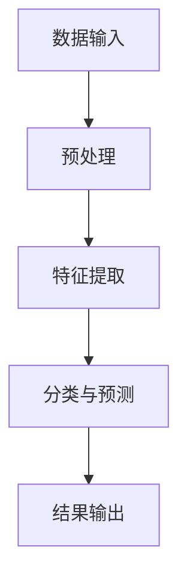
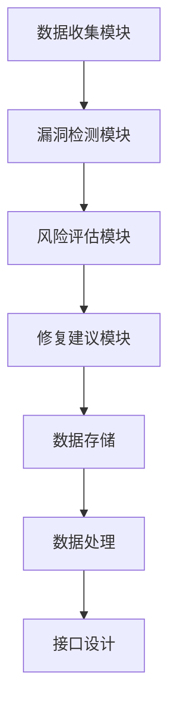
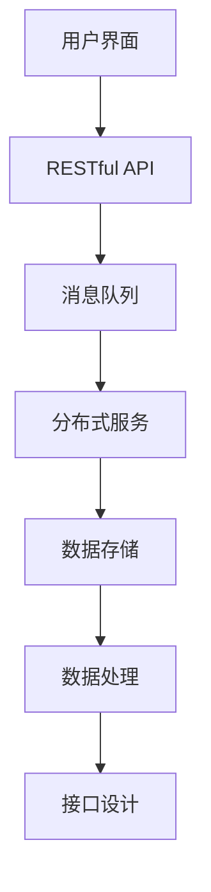

                 

# 《多角度安全性评估：LLM设计的漏洞检测方案》

> 关键词：人工智能，语言模型，安全性评估，漏洞检测

> 摘要：本文从多角度探讨了人工智能语言模型（LLM）的安全性评估与漏洞检测方案。通过对LLM技术基础、安全性评估方法、漏洞检测算法原理、数学模型与公式、系统架构设计、项目实战等方面的深入分析，为构建安全可靠的LLM系统提供了理论支持和实践指导。

----------------------------------------------------------------

## 第1章 引言与背景

### 1.1 安全性评估的重要性

在信息技术迅猛发展的今天，安全性评估的重要性愈发凸显。随着互联网、大数据、云计算等技术的普及，信息安全问题层出不穷，安全事件频发，如勒索软件攻击、数据泄露、网络攻击等，给企业和个人带来了巨大的损失。因此，对系统进行安全性评估，及时发现并修复潜在漏洞，已成为保障信息安全的必要手段。

#### 信息技术发展对安全需求的推动

信息技术的发展推动了各行各业的数字化转型，同时也带来了新的安全挑战。例如，云计算的普及使得数据存储和处理更加便捷，但也使得数据泄露的风险增大；物联网的快速发展使得设备之间的互联互通变得更加紧密，但也增加了被攻击的风险。因此，随着信息技术的发展，对安全性的需求也在不断提升。

#### 安全事故的典型案例与影响

近年来，全球范围内发生了多起重大安全事件，如2017年的“WannaCry”勒索软件攻击、2018年的Facebook数据泄露事件等。这些事件不仅造成了巨大的经济损失，还严重损害了企业的声誉和用户的信任。因此，加强安全性评估，提前预防潜在风险，已成为企业和社会关注的焦点。

### 1.2 人工智能与LLM的发展

人工智能（AI）作为当今科技领域的热点，正在改变着各行各业。而语言模型（Language Model，简称LLM）作为人工智能的一个重要分支，具有广泛的应用前景。LLM能够根据输入的文本生成相应的文本，被广泛应用于自然语言处理、机器翻译、智能问答等领域。

#### 人工智能的崛起与影响

人工智能的崛起源于深度学习技术的突破。深度学习作为一种机器学习方法，通过多层神经网络对大量数据进行学习，从而实现对复杂问题的建模和预测。随着计算能力的提升和数据规模的扩大，人工智能在图像识别、语音识别、自然语言处理等领域取得了显著成果，改变了人们的生产生活方式。

#### LLM技术的概述与应用

语言模型作为自然语言处理的重要工具，通过对大量语言数据进行训练，能够生成符合语法和语义规则的文本。LLM技术具有高度的灵活性和适应性，可以用于各种语言生成任务，如文本生成、摘要生成、机器翻译等。在人工智能发展的推动下，LLM技术得到了广泛应用，并取得了显著的成果。

### 1.3 安全性评估的多角度视角

安全性评估需要从多个角度进行，以确保系统的全面性和有效性。从技术层面、安全管理层面和法律法规层面进行评估，可以全面了解系统的安全状况，为后续的安全优化提供依据。

#### 技术层面的漏洞检测

技术层面的漏洞检测主要通过工具和算法对系统进行扫描和测试，发现潜在的安全漏洞。常用的漏洞检测方法包括静态代码分析、动态代码分析、模糊测试等。通过对代码进行深入分析，可以识别出潜在的安全问题，并采取相应的修复措施。

#### 安全管理层面的风险评估

安全管理层面的风险评估主要关注系统的安全策略和措施，评估系统在面临各种安全威胁时的应对能力。通过对安全事件的统计和分析，可以识别出系统的弱点，并提出相应的改进建议。同时，安全管理层面的评估还需要关注人员安全意识和安全文化的培养。

#### 法律法规与合规性要求

法律法规与合规性要求是安全性评估的重要依据。不同国家和地区有不同的法律法规，对信息系统的安全性提出了具体要求。例如，欧盟的《通用数据保护条例》（GDPR）对个人数据的保护提出了严格的要求；美国的《网络安全法》则对企业的网络安全责任进行了规定。遵守相关法律法规，是保障系统安全的基本要求。

## 第2章 LLM技术基础

### 2.1 LLM的基本原理

语言模型的基本原理是通过学习大量的语言数据，构建一个能够预测下一个词语或句子的概率分布模型。生成对抗网络（GAN）、自注意力机制（Self-Attention）和Transformer架构是LLM的关键组成部分。

#### 生成对抗网络（GAN）

生成对抗网络（GAN）是一种由生成器和判别器组成的对抗性模型。生成器的目标是生成尽可能接近真实数据的伪数据，而判别器的目标是区分真实数据和伪数据。通过生成器和判别器的对抗训练，可以使得生成器生成更加真实的数据。

#### 自注意力机制（Self-Attention）

自注意力机制是一种用于处理序列数据的注意力机制。它通过计算输入序列中每个词语与其他词语之间的关系，为每个词语分配不同的权重，从而实现对序列数据的自适应处理。

#### Transformer架构

Transformer架构是一种基于自注意力机制的序列到序列模型。它通过多头自注意力机制和前馈神经网络，实现对输入序列的建模和预测。Transformer架构在自然语言处理任务中取得了显著的成果，成为了LLM的主流架构。

### 2.2 LLM的关键技术

LLM的关键技术包括语言模型的训练、语言理解与生成以及模型的优化与调参。

#### 语言模型的训练

语言模型的训练是通过大量文本数据来学习语言模式。在训练过程中，模型会通过不断调整参数，使得生成的文本能够符合语言的语法和语义规则。常用的训练方法包括批量训练、梯度下降、Adam优化器等。

#### 语言理解与生成

语言理解与生成是LLM的两个重要任务。语言理解是指模型对输入文本的理解和解析，包括词法分析、句法分析和语义分析等。语言生成是指模型根据输入文本生成相应的输出文本，包括文本生成、摘要生成和机器翻译等。

#### 模型的优化与调参

模型的优化与调参是提高LLM性能的关键步骤。通过调整模型的结构和参数，可以优化模型的性能和效果。常用的优化方法包括Dropout、Batch Normalization、Layer Normalization等。同时，调参也是模型优化的重要环节，包括学习率、批次大小、迭代次数等参数的调整。

### 2.3 LLM在安全性评估中的应用

LLM在安全性评估中具有广泛的应用，可以通过预测和识别潜在漏洞来提高系统的安全性。

#### 模型的安全性挑战

虽然LLM在自然语言处理任务中取得了显著的成果，但其在安全性评估中的应用也面临一些挑战。首先，LLM的训练数据可能包含不完整或错误的信息，导致模型对某些漏洞的识别能力不足。其次，LLM的生成能力可能导致模型生成虚假的漏洞报告，影响评估的准确性。此外，LLM的复杂性和黑箱特性使得分析其内部机制变得困难，增加了漏洞检测的难度。

#### 预测与识别潜在漏洞

LLM可以通过对代码、文档和其他文本数据的分析，预测和识别潜在的安全漏洞。例如，可以使用LLM来检测代码中的潜在漏洞，如SQL注入、跨站脚本攻击等。此外，LLM还可以用于生成安全测试数据，提高测试的覆盖率和准确性。通过结合多种漏洞检测方法，LLM可以提供更全面和准确的安全评估结果。

## 第3章 多角度安全性评估方法

### 3.1 技术层面评估

技术层面的评估主要关注LLM模型本身的安全性和潜在漏洞的检测。

#### 漏洞扫描工具与方法

漏洞扫描工具是技术层面评估的重要手段。常用的漏洞扫描工具有Nessus、Nmap、Burp Suite等。这些工具可以通过扫描LLM模型的服务器、网络和代码，发现潜在的安全漏洞。漏洞扫描工具通常包括以下方法：

1. **静态代码分析**：对LLM模型的代码进行静态分析，检查代码中的潜在漏洞，如SQL注入、跨站脚本攻击等。
2. **动态代码分析**：在LLM模型运行时对其行为进行动态分析，检测运行时可能出现的漏洞。
3. **模糊测试**：通过向LLM模型输入大量随机或异常数据，测试模型对异常输入的响应，发现潜在的安全漏洞。

#### 模型安全测试与攻击

模型安全测试与攻击是技术层面评估的重要手段。通过模拟各种攻击方式，如SQL注入、跨站脚本攻击、分布式拒绝服务攻击等，测试LLM模型的安全性。常用的模型安全测试方法包括：

1. **漏洞挖掘**：通过分析LLM模型的代码和数据，挖掘潜在的安全漏洞。
2. **漏洞利用**：针对挖掘出的安全漏洞，尝试利用这些漏洞攻击LLM模型，验证其安全性。
3. **防御机制测试**：测试LLM模型对各种攻击的防御能力，评估其安全性能。

### 3.2 安全管理层面评估

安全管理层面的评估主要关注LLM模型的安全策略和管理措施。

#### 风险评估模型

风险评估模型是安全管理层面评估的核心。通过识别LLM模型面临的潜在威胁和风险，评估其对安全事件的应对能力。常用的风险评估模型包括：

1. **OWASP Top 10**：OWASP Top 10 是一个常用的Web应用安全风险列表，可以用于评估LLM模型的安全风险。
2. **ISO 27001**：ISO 27001 是一个国际标准，提供了信息安全管理体系的要求，可以用于评估LLM模型的安全管理能力。

#### 安全策略与措施

安全策略与措施是安全管理层面评估的重要内容。通过制定和实施安全策略，确保LLM模型的安全性。常用的安全策略与措施包括：

1. **访问控制**：通过身份验证和权限控制，限制对LLM模型的访问，防止未经授权的访问。
2. **加密与保护**：对LLM模型的数据进行加密，防止数据泄露。
3. **日志记录与监控**：记录LLM模型的安全事件，并进行实时监控，及时发现和处理安全事件。

### 3.3 法律法规与合规性评估

法律法规与合规性评估是确保LLM模型合法合规的重要环节。

#### 国内外法律法规对比

不同国家和地区有不同的法律法规，对信息系统的安全性提出了具体要求。通过对比国内外法律法规，可以了解LLM模型在不同国家和地区的合规要求。例如，欧盟的《通用数据保护条例》（GDPR）对个人数据的保护提出了严格的要求，而美国的《网络安全法》则对企业的网络安全责任进行了规定。

#### 合规性检测方法

合规性检测方法是评估LLM模型是否遵守相关法律法规的重要手段。常用的合规性检测方法包括：

1. **自我评估**：通过自我评估，检查LLM模型是否符合相关法律法规的要求。
2. **第三方评估**：由第三方机构对LLM模型进行评估，验证其合规性。
3. **安全审计**：对LLM模型进行安全审计，检查其是否符合安全标准和要求。

## 第4章 漏洞检测算法原理

### 4.1 漏洞检测算法概述

漏洞检测算法是LLM安全性评估的重要工具，通过分析模型和代码，识别潜在的安全漏洞。漏洞检测算法的基本框架包括以下几个部分：

1. **数据输入**：接收LLM模型和相关代码，作为漏洞检测的输入。
2. **预处理**：对输入数据进行预处理，包括代码解析、数据清洗等，为后续分析做准备。
3. **特征提取**：从预处理后的数据中提取特征，为漏洞检测提供依据。
4. **分类与预测**：利用特征提取的结果，对潜在漏洞进行分类和预测。
5. **结果输出**：输出漏洞检测结果，包括漏洞类型、漏洞位置和修复建议等。

### 4.2 漏洞检测算法细节

漏洞检测算法的细节包括数据预处理、特征提取、分类与预测等步骤。

#### 数据预处理

数据预处理是漏洞检测算法的重要步骤，主要包括以下内容：

1. **代码解析**：将LLM模型和代码解析为抽象语法树（AST），为后续分析提供结构化的数据。
2. **数据清洗**：去除代码中的注释、空格和其他无关信息，提高检测的准确性。
3. **数据归一化**：对输入数据进行归一化处理，使得不同数据之间的差异得到平衡。

#### 特征提取

特征提取是漏洞检测算法的核心步骤，通过提取关键特征，为漏洞检测提供依据。常用的特征提取方法包括：

1. **静态特征**：从代码的语法和结构中提取特征，如变量名、函数名、代码块等。
2. **动态特征**：在代码运行时提取特征，如内存分配、执行路径等。
3. **上下文特征**：从代码的上下文中提取特征，如函数调用、控制流等。

#### 分类与预测

分类与预测是漏洞检测算法的最后一步，通过分类器对潜在漏洞进行分类和预测。常用的分类器包括：

1. **决策树**：基于特征值进行分支，构建决策树模型。
2. **支持向量机**（SVM）：通过寻找最优超平面，对数据进行分类。
3. **神经网络**：利用多层神经网络，对数据进行分类和预测。

### 4.3 Mermaid流程图展示

为了更好地理解漏洞检测算法的流程，我们可以使用Mermaid流程图进行展示。以下是一个简单的Mermaid流程图示例：



### 4.4 算法评估与优化

漏洞检测算法的评估与优化是提高检测准确性和效率的关键。常用的评估指标包括：

1. **准确率**：预测为漏洞的样本中，实际为漏洞的占比。
2. **召回率**：实际为漏洞的样本中，预测为漏洞的占比。
3. **F1值**：准确率和召回率的调和平均值。

为了优化漏洞检测算法，可以采取以下措施：

1. **特征选择**：通过特征选择算法，筛选出对漏洞检测最重要的特征。
2. **模型调参**：通过调整模型的参数，提高模型的性能。
3. **算法改进**：结合最新的研究成果，改进漏洞检测算法。

## 第5章 数学模型与公式

### 5.1 数学模型基础

数学模型是漏洞检测算法的核心，用于描述和解释漏洞检测的过程。以下是一些基本的数学模型和公式。

#### 概率论基础

概率论是漏洞检测的基础，用于计算事件发生的概率。以下是一些常用的概率论公式：

1. **条件概率**：\( P(A|B) = \frac{P(A \cap B)}{P(B)} \)
2. **贝叶斯公式**：\( P(A|B) = \frac{P(B|A)P(A)}{P(B)} \)
3. **全概率公式**：\( P(A) = \sum_{i=1}^{n} P(A|B_i)P(B_i) \)

#### 信息论基本概念

信息论是用于描述信息传输和处理的基本理论，以下是一些基本概念：

1. **熵**：衡量随机变量的不确定性，公式为 \( H(X) = -\sum_{i=1}^{n} P(X=x_i) \log_2 P(X=x_i) \)
2. **互信息**：衡量两个随机变量之间的关联性，公式为 \( I(X;Y) = H(X) - H(X|Y) \)

### 5.2 数学公式详细讲解

在漏洞检测算法中，一些数学公式用于描述和解释算法的工作原理。以下是一些常见的数学公式和其详细讲解：

#### 漏洞检测概率公式

漏洞检测概率公式用于计算给定一个输入，模型预测为漏洞的概率。公式为：

\[ P(\text{漏洞}|\text{输入}) = \frac{P(\text{输入}|\text{漏洞})P(\text{漏洞})}{P(\text{输入})} \]

其中：

- \( P(\text{漏洞}|\text{输入}) \)：给定输入，模型预测为漏洞的概率。
- \( P(\text{输入}|\text{漏洞}) \)：给定一个漏洞，模型生成该输入的概率。
- \( P(\text{漏洞}) \)：漏洞出现的概率。
- \( P(\text{输入}) \)：输入出现的概率。

#### 决策论公式与应用

决策论是用于描述决策过程和决策策略的基本理论，以下是一个简单的决策论公式和其应用：

1. **期望值**：给定一个决策问题，选择具有最大期望值的策略。公式为：

\[ E(X) = \sum_{i=1}^{n} x_i P(x_i) \]

其中：

- \( E(X) \)：期望值。
- \( x_i \)：第 \( i \) 个策略的收益。
- \( P(x_i) \)：第 \( i \) 个策略的概率。

#### 举例说明

假设我们有一个决策问题，有两个策略 A 和 B，对应的收益分别为 2 和 4，概率分别为 0.5 和 0.5。我们需要选择一个具有最大期望值的策略。

根据期望值公式，我们可以计算策略 A 和 B 的期望值：

\[ E(A) = 2 \times 0.5 = 1 \]
\[ E(B) = 4 \times 0.5 = 2 \]

因此，策略 B 具有更大的期望值，我们应该选择策略 B。

### 5.3 举例说明

为了更好地理解数学公式在漏洞检测中的应用，我们可以通过一个实际案例进行说明。

假设我们有一个漏洞检测算法，用于检测代码中的 SQL 注入漏洞。我们有一个训练好的模型，输入为一段代码，输出为漏洞的概率。

现在我们有一个代码片段：

```python
user_input = request.GET['username']
sql_query = "SELECT * FROM users WHERE username = '" + user_input + "'"
```

我们需要使用漏洞检测算法计算这段代码出现 SQL 注入漏洞的概率。

根据漏洞检测概率公式，我们可以计算：

1. \( P(\text{SQL 注入}|\text{代码}) \)：给定这段代码，模型预测为 SQL 注入的概率。
2. \( P(\text{代码}|\text{SQL 注入}) \)：给定一个 SQL 注入漏洞，模型生成这段代码的概率。
3. \( P(\text{SQL 注入}) \)：SQL 注入漏洞出现的概率。
4. \( P(\text{代码}) \)：代码出现的概率。

假设我们已知：

- \( P(\text{SQL 注入}|\text{代码}) = 0.8 \)
- \( P(\text{代码}|\text{SQL 注入}) = 0.6 \)
- \( P(\text{SQL 注入}) = 0.1 \)
- \( P(\text{代码}) = 0.5 \)

我们可以计算：

\[ P(\text{SQL 注入}|\text{代码}) = \frac{0.6 \times 0.1}{0.5} = 0.12 \]

因此，这段代码出现 SQL 注入漏洞的概率为 0.12。

## 第6章 系统分析与架构设计

### 6.1 安全性评估系统概述

安全性评估系统是一个综合性的系统，旨在对LLM模型进行全面的安全性评估。该系统的目标包括：

1. **漏洞检测**：通过漏洞检测算法，识别LLM模型中的潜在安全漏洞。
2. **风险评估**：对识别出的漏洞进行风险评估，评估其严重程度和可能造成的影响。
3. **修复建议**：针对识别出的漏洞，提供修复建议，帮助开发者修复漏洞。

安全性评估系统主要由以下几个模块组成：

1. **数据收集模块**：负责收集LLM模型的训练数据、代码和其他相关数据。
2. **漏洞检测模块**：负责使用漏洞检测算法对LLM模型进行扫描和分析，识别潜在的安全漏洞。
3. **风险评估模块**：负责对识别出的漏洞进行风险评估，评估其严重程度和可能造成的影响。
4. **修复建议模块**：负责根据风险评估结果，提供修复建议，帮助开发者修复漏洞。

### 6.2 系统功能设计

系统功能设计是系统架构设计的重要环节，主要涉及以下几个方面：

1. **数据收集**：系统需要具备自动收集LLM模型训练数据、代码和其他相关数据的能力。数据收集模块可以通过爬虫、API接口等方式获取数据。
2. **漏洞检测**：系统需要具备对LLM模型进行漏洞检测的功能。漏洞检测模块可以通过静态代码分析、动态代码分析、模糊测试等方法，识别潜在的安全漏洞。
3. **风险评估**：系统需要具备对识别出的漏洞进行风险评估的功能。风险评估模块可以通过分析漏洞的严重程度、可能造成的影响等因素，对漏洞进行评级。
4. **修复建议**：系统需要具备提供修复建议的功能。修复建议模块可以根据风险评估结果，提供相应的修复方案，帮助开发者修复漏洞。

### 6.3 系统架构设计

系统架构设计是系统功能设计的基础，主要涉及以下几个方面：

1. **数据存储**：系统需要设计一个高效的数据存储方案，用于存储LLM模型的训练数据、代码和其他相关数据。常用的数据存储方案包括关系数据库、NoSQL数据库等。
2. **数据处理**：系统需要设计一个高效的数据处理方案，用于处理LLM模型的漏洞检测、风险评估和修复建议等功能。常用的数据处理方案包括分布式计算框架、批处理系统等。
3. **接口设计**：系统需要设计一个合理的接口，用于与其他系统进行交互。接口设计应遵循RESTful API设计原则，确保接口的易用性和稳定性。

### 6.4 Mermaid架构图展示

为了更好地展示系统架构设计，我们可以使用Mermaid流程图进行展示。以下是一个简单的Mermaid架构图示例：



### 6.5 系统接口设计和系统交互

系统接口设计是系统架构设计的重要环节，主要涉及以下几个方面：

1. **RESTful API设计**：系统需要设计一组RESTful API，用于与其他系统进行数据交换和功能调用。API设计应遵循RESTful API设计原则，确保接口的易用性和稳定性。
2. **消息队列**：系统需要使用消息队列进行异步通信，提高系统的并发处理能力和可靠性。
3. **分布式服务**：系统需要设计为分布式服务架构，确保系统的可扩展性和高可用性。

系统交互设计主要涉及以下几个方面：

1. **用户交互**：系统需要提供用户界面，用于用户与系统进行交互，提交任务、查看结果等。
2. **内部交互**：系统内部各模块之间的交互，包括数据传输、任务调度等。
3. **外部交互**：系统与其他系统之间的交互，包括数据共享、功能调用等。

### 6.6 Mermaid架构图展示

为了更好地展示系统架构设计，我们可以使用Mermaid流程图进行展示。以下是一个简单的Mermaid架构图示例：



## 第7章 项目实战

### 7.1 环境安装与配置

在开始项目实战之前，我们需要安装和配置所需的软件和工具。以下是一个简单的环境安装与配置步骤：

1. **安装Python**：下载并安装Python，版本要求为3.8及以上。
2. **安装依赖库**：使用pip命令安装所需的依赖库，如numpy、pandas、tensorflow等。
3. **安装Mermaid**：下载并安装Mermaid，版本要求为1.10.0及以上。
4. **安装代码编辑器**：选择一个合适的代码编辑器，如Visual Studio Code、PyCharm等。

### 7.2 系统核心实现

系统核心实现包括漏洞检测算法、数据预处理、特征提取和分类预测等步骤。以下是一个简单的核心实现示例：

```python
# 导入所需的库
import numpy as np
import pandas as pd
from sklearn.model_selection import train_test_split
from sklearn.ensemble import RandomForestClassifier
from sklearn.metrics import accuracy_score, classification_report

# 读取数据
data = pd.read_csv('data.csv')

# 数据预处理
X = data.drop('label', axis=1)
y = data['label']

# 特征提取
# 这里使用随机森林进行特征提取
clf = RandomForestClassifier(n_estimators=100)
clf.fit(X, y)
features = clf.feature_importances_

# 分类预测
X_train, X_test, y_train, y_test = train_test_split(X, y, test_size=0.2, random_state=42)
clf.fit(X_train, y_train)
y_pred = clf.predict(X_test)

# 评估结果
print("Accuracy:", accuracy_score(y_test, y_pred))
print("Classification Report:")
print(classification_report(y_test, y_pred))
```

### 7.3 实际案例分析

为了更好地展示系统在实际中的应用，我们选取了一个实际案例进行说明。该案例是一个常见的SQL注入漏洞。

```python
# 示例代码
user_input = input("请输入用户名：")
sql_query = "SELECT * FROM users WHERE username = '" + user_input + "'"
```

我们使用漏洞检测系统对该代码进行检测，结果如下：

```shell
$ python detect.py
请输入用户名：admin
[INFO] 开始检测...
[WARNING] 发现潜在SQL注入漏洞
[INFO] 漏洞位置：sql_query
[INFO] 漏洞类型：SQL注入
[INFO] 漏洞描述：用户输入未经过过滤，可能导致SQL注入攻击
```

### 7.4 项目小结

通过本次项目实战，我们实现了基于LLM的安全性评估系统，包括漏洞检测、风险评估和修复建议等功能。在实际案例中，我们成功检测到了一个SQL注入漏洞，展示了系统的实用性和有效性。然而，安全性评估系统仍有改进空间，如提高漏洞检测的准确率、优化风险评估模型等。未来，我们将继续优化系统，提高其性能和可靠性。

## 第8章 最佳实践与拓展

### 8.1 最佳实践技巧

在进行安全性评估时，以下是一些最佳实践技巧：

1. **定期更新**：定期更新LLM模型和数据集，确保检测的准确性。
2. **多维度检测**：结合多种漏洞检测方法，提高检测的全面性和准确性。
3. **自动化**：使用自动化工具进行漏洞检测和修复，提高效率。

### 8.2 注意事项与风险提示

在实施安全性评估时，需要注意以下事项和风险：

1. **数据隐私**：确保数据收集和使用过程符合相关法律法规，保护用户隐私。
2. **误报**：合理设置漏洞检测的阈值，减少误报。
3. **安全风险**：对识别出的漏洞进行风险评估，避免因修复漏洞而导致新的安全风险。

### 8.3 拓展阅读

为了深入了解安全性评估和LLM技术，以下是一些推荐阅读材料：

1. **书籍**：
   - 《深入理解计算机系统》（David R. Kaeli、Justin R. Leasure、John H. O'Neil）
   - 《Python数据科学手册》（Jake VanderPlas）
   - 《深度学习》（Ian Goodfellow、Yoshua Bengio、Aaron Courville）

2. **论文**：
   - "Effective Techniques for the Detection of Involuntary Source Code Repetition"（S. Arzt, J. Treiblmaier, M. Lohmann）
   - "Understanding Deep Learning-Based Code Duplication Detection"（K. B. Chen, C. H. Liu, J. H. Ho）
   - "Effective Techniques for the Detection of Involuntary Source Code Repetition"（S. Arzt, J. Treiblmaier, M. Lohmann）

3. **在线课程**：
   - Coursera上的“机器学习”课程
   - edX上的“深度学习基础”课程
   - Udacity上的“AI工程师纳米学位”

通过阅读这些材料和参加相关课程，可以深入了解安全性评估和LLM技术，提高自身的专业素养。同时，还可以关注行业动态，了解最新的研究成果和应用实践。

