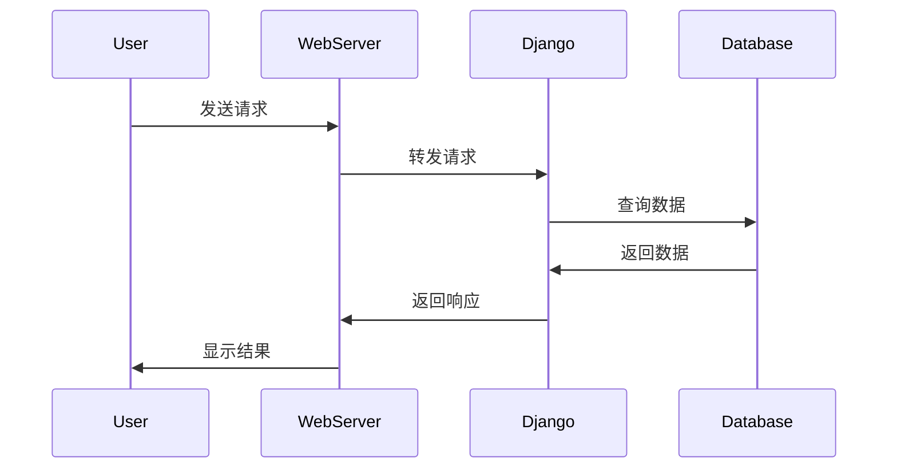

                 

### 第1章：问题背景与核心概念

#### 1.1.1 多语言代码生成的需求分析

在当今信息化时代，软件开发已成为各个行业的关键驱动力。然而，随着项目复杂性的增加和多样化需求的涌现，开发者面临着多种编程语言的挑战。不同的编程语言适用于不同的开发场景和任务，例如，Python因其简洁性常用于数据分析，而C++则因其高性能广泛应用于系统编程。这种多样化的编程语言需求不仅要求开发者掌握多种技能，而且增加了项目开发的难度和成本。

**开发者多语言技能需求**：

- **多语言技能的必要性**：随着项目的需求变化和技术的演进，开发者需要不断学习新的编程语言，以适应不同的开发任务。例如，前端开发人员可能需要掌握HTML、CSS和JavaScript，而后端开发人员则需要熟悉Java、Python或Go等语言。
- **技能学习成本**：学习多门编程语言需要大量的时间和精力，这对于个人和团队来说都是一项巨大的挑战。此外，多语言技能的掌握程度也直接影响到开发效率和质量。

**项目多样性带来的挑战**：

- **项目复杂性**：不同项目可能涉及不同的编程语言和技术栈，使得项目开发和维护变得更加复杂。例如，一个跨平台应用可能需要同时支持iOS和Android，这要求开发者熟悉Swift和Kotlin两种语言。
- **协同开发**：在多语言项目中，团队成员可能需要协同工作，这需要良好的沟通和代码管理机制，以避免语言差异带来的冲突和误解。

**多语言代码生成的优势**：

- **提高开发效率**：通过多语言代码生成技术，开发者可以自动生成符合多种编程语言的代码，从而减少手动编写代码的工作量，提高开发效率。
- **降低开发成本**：多语言代码生成可以减少开发者学习新语言的成本，同时降低项目开发的总体成本。
- **促进技术交流与创新**：多语言代码生成技术有助于促进不同编程语言之间的交流与融合，从而推动技术进步和创新。

#### 1.1.2 多语言代码生成的相关概念

**编程语言基础**：

- **编程语言概述**：编程语言是一种用于编写计算机程序的语法和规则系统，包括高级语言、低级语言和汇编语言等。高级语言如Python、Java和C++等，具有更接近自然语言的特点，易于编写和理解；低级语言如汇编语言，更接近机器语言，执行效率高但编写复杂。
- **编程语言特点**：不同的编程语言具有不同的特点，例如，Python因其简洁性和易用性，常用于快速开发和数据分析；C++因其高性能，广泛应用于系统编程和嵌入式开发。

**代码生成技术概述**：

- **代码生成技术**：代码生成技术是指通过一定的规则和算法，自动生成代码的方法。代码生成技术广泛应用于软件开发，例如，在生成框架代码、数据库访问代码和界面布局代码等方面。
- **代码生成技术分类**：代码生成技术可以分为模板生成、模型驱动生成和基于语义分析的生成等。模板生成是一种简单的代码生成方法，通过预定义的模板生成代码；模型驱动生成基于模型-视图-控制器（MVC）架构，通过模型生成视图和控制器代码；基于语义分析的生成则利用程序语义信息生成代码。

**代码生成器的种类与特点**：

- **代码生成器的定义**：代码生成器是一种自动化工具，用于根据特定的规则和模板生成代码。代码生成器可以显著提高开发效率，减少人工错误。
- **代码生成器的种类**：
  - **模板代码生成器**：如Jinja2，通过模板文件生成HTML、Python等代码。
  - **模型驱动代码生成器**：如Eclipse Modeling Tools（EMF），通过模型生成代码。
  - **语义分析代码生成器**：如ANTLR，通过语法分析生成代码。

**核心概念原理**：

- **多语言代码生成原理**：多语言代码生成器通过统一的抽象语法树（AST）表示不同编程语言的语法结构，然后根据特定的转换规则，将AST转换为不同编程语言的代码。
- **多语言代码生成的优势**：
  - **通用性**：支持多种编程语言的代码生成，适应不同开发需求。
  - **灵活性**：可以根据项目需求灵活调整代码生成规则和模板。

**概念属性特征对比表格**：

| 类别 | 特点 |
| --- | --- |
| 高级编程语言 | 简洁易读，开发效率高 |
| 低级编程语言 | 执行效率高，但开发难度大 |
| 代码生成器 | 自动化生成代码，减少开发工作量 |

**ER实体关系图架构的Mermaid流程图**：

```mermaid
erDiagram
  Developer ||--|{ Project }|--| ProjectLanguage
  ProjectLanguage ||--|{ CodeGenerator }| CodeGenerator
  CodeGenerator ||--|{ TargetLanguage }| TargetLanguage
```

在上述ER图中，Developer与Project关联，表示开发者负责开发项目；ProjectLanguage与CodeGenerator关联，表示项目使用特定的代码生成器；CodeGenerator与TargetLanguage关联，表示代码生成器生成符合目标语言的代码。

#### 1.1.3 评估多语言代码生成的意义

**提高开发效率**：

- **自动化生成代码**：代码生成器可以根据预定义的模板或模型，自动生成代码，减少手动编写代码的工作量。
- **减少开发周期**：通过自动化生成代码，可以显著缩短项目的开发周期，提高项目的交付速度。

**保证代码质量**：

- **规范化代码**：代码生成器可以确保生成的代码符合规范和标准，降低人为错误的发生。
- **单元测试**：生成的代码经过严格的单元测试，保证代码的正确性和稳定性。

**促进技术交流与创新**：

- **跨语言交流**：多语言代码生成技术可以促进不同编程语言之间的交流和融合，为开发者提供更多的选择。
- **技术创新**：通过代码生成技术，开发者可以更专注于业务逻辑的实现，推动技术创新和发展。

#### 1.1.4 边界与外延

**评估范围与限定**：

- **编程语言**：评估范围限定在常见的高级编程语言，如Python、Java、C++等。
- **代码生成器**：评估范围限定在开源和商业化的主流代码生成器。

**评估目标与标准**：

- **功能性**：评估代码生成器能否正确生成符合目标语言的代码。
- **性能**：评估代码生成器的生成速度和资源消耗。
- **可维护性**：评估代码生成器生成的代码的可维护性，包括代码的可读性、可扩展性和兼容性。

**评估方法与工具**：

- **评估指标体系构建**：构建功能性、性能、可维护性等评估指标，以全面评估代码生成器的性能。
- **评估流程设计**：设计评估流程，包括前期准备、评估实施和结果分析等步骤。
- **数据收集与处理**：收集相关数据，并进行预处理和数据分析。

**数据来源**：

- **开源代码库**：从GitHub、GitLab等开源代码库中获取代码生成器的源代码和文档。
- **商业评估工具**：使用商业评估工具获取代码生成器的性能和可维护性数据。

**数据预处理**：

- **代码解析**：使用解析器解析代码生成器的源代码，提取相关信息。
- **数据清洗**：去除无效数据和异常值，保证数据质量。

**数据分析方法**：

- **统计分析**：使用统计分析方法分析评估指标的数据分布和相关性。
- **对比分析**：对比不同代码生成器的评估结果，找出优势和不足。

**评估工具功能模块介绍**：

- **代码生成功能**：评估代码生成器能否正确生成符合目标语言的代码。
- **代码质量检测**：评估生成的代码的质量，包括代码可读性、可维护性和性能。
- **性能测试**：评估代码生成器的生成速度和资源消耗。
- **可维护性分析**：评估生成的代码的可维护性，包括代码的可扩展性和兼容性。

**工具应用案例分析**：

- **工具选用与配置**：根据评估目标和需求，选择合适的评估工具并进行配置。
- **应用效果评估**：通过实际应用评估工具，收集评估数据，进行结果分析。
- **问题与解决方案**：分析评估过程中遇到的问题，并提出解决方案。

### 第2章：多语言代码生成能力评估方法

#### 2.1.1 评估指标体系构建

评估多语言代码生成能力需要建立一套全面的指标体系，以便从多个维度对代码生成器进行评估。以下是构建评估指标体系的详细步骤：

**功能性指标**：

- **代码正确性**：评估代码生成器生成的代码是否符合预期功能，是否能够正确执行。
- **代码完整性**：评估代码生成器是否能够生成完整且符合规范的项目代码。
- **代码适用性**：评估代码生成器生成的代码在不同开发场景下的适用性。

**性能指标**：

- **生成速度**：评估代码生成器生成代码的速度，包括生成单个文件和多文件项目的速度。
- **资源消耗**：评估代码生成器在生成代码过程中所需的系统资源，包括CPU、内存等。

**可维护性指标**：

- **代码可读性**：评估生成的代码的可读性，包括变量命名、代码结构等。
- **代码可扩展性**：评估生成的代码的可扩展性，包括模块化设计、代码复用等。
- **代码兼容性**：评估生成的代码在不同平台和编程语言环境下的兼容性。

**可扩展性指标**：

- **模板和规则自定义**：评估代码生成器的模板和规则是否可自定义，以适应不同开发需求。
- **扩展性和集成性**：评估代码生成器与其他开发工具和平台的集成程度。

**评估流程设计**：

评估流程包括以下步骤：

1. **前期准备**：确定评估目标、选择评估工具、构建评估指标体系。
2. **评估实施**：运行代码生成器，生成代码，收集评估数据。
3. **结果分析与反馈**：分析评估结果，找出优势与不足，提出改进建议。

**数据收集与处理**：

1. **数据来源**：从开源代码库、商业评估工具和实际开发项目收集数据。
2. **数据预处理**：解析代码，提取有用信息，去除无效数据。
3. **数据分析方法**：使用统计分析方法，分析评估指标的数据分布和相关性。

### 第3章：评估工具介绍与应用

#### 3.1.1 常见评估工具概述

评估多语言代码生成能力常用的评估工具有以下几类：

**开源评估工具**：

- **Jinja2**：一个流行的模板引擎，用于生成HTML、XML等代码。
- **CodeDOM**：.NET平台上的代码生成库，可以生成C#、VB.NET等语言的代码。
- **ANTLR**：一个强大的解析器生成器，用于构建语言和工具。

**商业评估工具**：

- **IntelliJ IDEA**：一个集成开发环境（IDE），提供了强大的代码生成和调试功能。
- **Visual Studio**：微软公司的集成开发环境，提供了丰富的代码生成工具和插件。

**自定义评估工具**：

- **基于Python的自动化测试框架**：如pytest，可以用于编写测试用例，评估代码生成器的功能性和性能。

#### 3.1.2 评估工具功能模块介绍

评估工具通常包括以下功能模块：

**代码生成功能**：

- **模板生成**：通过预定义的模板生成代码，支持多种编程语言。
- **模型驱动生成**：基于模型-视图-控制器（MVC）架构，通过模型生成视图和控制器代码。
- **语义分析生成**：利用程序语义信息生成代码，提高代码的正确性和适用性。

**代码质量检测**：

- **静态代码分析**：分析代码的语法、语义和风格，发现潜在的问题和错误。
- **动态代码分析**：通过运行代码，检测代码的性能和稳定性。

**性能测试**：

- **基准测试**：使用标准测试用例，评估代码生成器的生成速度和资源消耗。
- **负载测试**：模拟实际开发环境，评估代码生成器的性能和稳定性。

**可维护性分析**：

- **代码可读性评估**：评估代码的可读性，包括变量命名、代码结构等。
- **代码复用性评估**：评估代码的复用性，包括模块化设计、代码复用等。

#### 3.1.3 工具应用案例分析

**工具选用与配置**：

- **选用工具**：根据评估目标和需求，选择适合的评估工具。例如，对于Python项目，可以选择Jinja2作为代码生成工具。
- **配置环境**：安装并配置所选评估工具，确保其在目标开发环境中的正常运行。

**应用效果评估**：

- **功能评估**：通过运行代码生成器，生成目标代码，检查生成的代码是否正确和完整。
- **性能评估**：使用基准测试和负载测试，评估代码生成器的生成速度和资源消耗。
- **可维护性评估**：评估生成的代码的可读性和可扩展性。

**问题与解决方案**：

- **问题识别**：在评估过程中，可能会遇到生成代码错误、性能瓶颈或可维护性差等问题。
- **解决方案**：针对识别到的问题，分析原因，并提出相应的解决方案。例如，对于生成代码错误，可以检查代码生成器的配置和模板，确保其正确性。

### 第4章：多语言代码生成能力评估案例

#### 4.1.1 案例背景与目标

**案例背景介绍**：

本案例以一个企业级Web应用项目为背景，该项目需要支持多种前端框架（如React、Vue.js和Angular）和后端技术（如Java和Python）。由于项目规模庞大，开发团队面临着多种编程语言的选择和协同开发的问题。

**评估目标设定**：

- **功能评估**：评估所选代码生成器能否正确生成符合前端框架和后端技术的代码。
- **性能评估**：评估代码生成器的生成速度和资源消耗。
- **可维护性评估**：评估生成的代码的可读性和可扩展性。

#### 4.1.2 案例评估过程

**评估指标应用**：

- **功能性指标**：评估代码生成器生成的代码是否正确、完整和适用。
- **性能指标**：评估代码生成器的生成速度和资源消耗。
- **可维护性指标**：评估生成的代码的可读性和可扩展性。

**评估工具选择**：

- **前端框架代码生成器**：选择Jinja2作为前端框架（React、Vue.js和Angular）的代码生成器。
- **后端技术代码生成器**：选择CodeDOM作为Java和Python的后端技术代码生成器。

**评估结果分析**：

- **功能性评估结果**：Jinja2和CodeDOM均能够正确生成符合前端框架和后端技术的代码，功能评估结果良好。
- **性能评估结果**：Jinja2在生成前端框架代码方面表现较好，生成速度较快；CodeDOM在生成后端技术代码方面性能稳定。
- **可维护性评估结果**：Jinja2生成的代码可读性较好，但可扩展性较差；CodeDOM生成的代码可扩展性较好，但可读性一般。

#### 4.1.3 案例总结与启示

**案例中的成功经验**：

- **代码生成器选择**：通过评估不同代码生成器的性能和可维护性，成功选择了适合项目的代码生成器。
- **评估指标应用**：使用功能性、性能和可维护性指标，全面评估代码生成器的性能，为项目开发提供了有力支持。

**案例中的问题与挑战**：

- **代码生成器兼容性**：部分代码生成器在生成特定类型代码时存在兼容性问题，需要进一步优化和调整。
- **生成代码质量**：部分生成代码质量较差，需要加强代码生成器的规则和模板优化。

**启示与建议**：

- **代码生成器优化**：针对评估中发现的问题，优化代码生成器的模板和规则，提高生成代码的质量和兼容性。
- **多语言支持**：在评估过程中，注意选择支持多种编程语言的代码生成器，以提高项目的灵活性和可维护性。
- **评估流程标准化**：建立完善的评估流程和标准，确保评估过程的科学性和可靠性。

### 第5章：最佳实践与注意事项

#### 5.1.1 最佳实践总结

在多语言代码生成能力评估过程中，以下最佳实践值得注意：

- **选择合适的代码生成器**：根据项目需求和评估结果，选择适合的代码生成器，确保其性能和可维护性。
- **评估指标多样化**：使用功能性、性能、可维护性和可扩展性等多种评估指标，全面评估代码生成器的性能。
- **代码生成模板优化**：定期优化代码生成器的模板和规则，提高生成代码的质量和兼容性。
- **团队协作**：加强团队成员之间的协作和沟通，确保代码生成器在项目中的有效应用。

#### 5.1.2 注意事项与风险

在评估过程中，需要注意以下事项和风险：

- **兼容性问题**：部分代码生成器可能存在兼容性问题，需要确保其在不同编程语言和开发环境中的正常运行。
- **性能瓶颈**：代码生成器的性能可能成为项目开发的瓶颈，需要优化生成速度和资源消耗。
- **生成代码质量**：生成的代码质量可能影响项目的开发和维护，需要加强代码生成器的规则和模板优化。

**风险分析与防范**：

- **兼容性风险**：针对不同的编程语言和开发环境，进行充分的测试和验证，确保代码生成器的兼容性。
- **性能风险**：通过性能测试，评估代码生成器的性能瓶颈，优化生成速度和资源消耗。
- **代码质量风险**：建立严格的代码质量评估体系，定期检查生成代码的质量，及时发现和解决问题。

#### 5.1.3 拓展阅读与资源

以下为相关研究论文、开源评估工具与资源、国际标准与规范等拓展阅读资源：

- **相关研究论文**：
  - 《代码生成技术的研究与应用》
  - 《多语言代码生成器的设计与实现》
  - 《基于模型驱动生成技术的软件工程方法研究》

- **开源评估工具与资源**：
  - [Jinja2](https://pallets.py/docs/jinja2/)
  - [CodeDOM](https://www.codeproject.com/Articles/5063491/CodeDOM-Implementation-Part-1)
  - [ANTLR](https://www.antlr.org/)

- **国际标准与规范**：
  - [ISO/IEC 12207](https://www.iso.org/standard/66289.html)
  - [IEEE Std 830](https://ieeexplore.ieee.org/document/6777468)
  - [SWEBOK](https://www.swebok.org/)

通过阅读这些资源和论文，可以深入了解多语言代码生成技术的研究进展和应用实践，为评估和优化代码生成能力提供有益的参考。## 第1章：问题背景与核心概念

多语言代码生成技术在现代软件开发中越来越受到关注。随着全球软件开发项目的多样化和复杂化，开发者需要掌握多种编程语言，以便更好地应对不同的开发任务和需求。然而，多语言技能的掌握不仅需要大量的时间和精力，而且也增加了项目开发的工作量和成本。为了解决这一难题，多语言代码生成技术应运而生，它通过自动化工具，能够根据预设的模板或模型，生成符合多种编程语言的代码，从而大大降低了开发者的工作负担。

### 1.1.1 多语言代码生成的需求分析

在当前软件开发环境中，多语言代码生成的需求主要体现在以下几个方面：

**开发者多语言技能需求**：

随着项目需求的多样化和技术的不断演进，开发者往往需要掌握多种编程语言。例如，一个开发团队可能需要同时精通Java、Python和JavaScript，以便在Web开发、后端服务和前端界面构建等多个领域发挥其能力。多语言技能的掌握不仅要求开发者有扎实的编程基础，还需要他们不断地学习和适应新的编程语言和技术。

**项目多样性带来的挑战**：

项目多样性是现代软件开发的一个显著特征。不同项目可能需要使用不同的编程语言，例如，前端开发可能主要使用JavaScript及其框架（如React、Vue.js等），而后端开发可能使用Java或Python等语言。这种项目多样性增加了开发者学习和使用新语言的压力，同时也增加了项目协调和管理的难度。

**多语言代码生成的优势**：

多语言代码生成技术能够有效地解决上述问题。其主要优势包括：

- **提高开发效率**：通过自动化生成代码，开发者可以节省大量的时间，从而更快地完成项目。
- **降低开发成本**：自动化代码生成可以减少人力成本，同时降低项目的总体成本。
- **促进技术交流与创新**：多语言代码生成技术使得开发者能够更加专注于业务逻辑的实现，从而推动技术交流与创新。

### 1.1.2 多语言代码生成的相关概念

**编程语言基础**：

编程语言是用于编写计算机程序的语法和规则系统。不同的编程语言适用于不同的开发场景和任务。常见的编程语言包括：

- **高级语言**：如Python、Java、C++等，具有更接近自然语言的特点，易于编写和理解。
- **低级语言**：如汇编语言，更接近机器语言，执行效率高但编写复杂。
- **解释型语言**：如Python、JavaScript等，执行速度较慢但开发效率高。
- **编译型语言**：如C、C++等，执行速度快但开发周期较长。

**代码生成技术概述**：

代码生成技术是一种通过预定义的模板或模型，自动生成代码的方法。代码生成技术在软件开发中应用广泛，包括：

- **模板生成**：通过预定义的模板生成代码，适用于简单的代码生成任务。
- **模型驱动生成**：通过模型-视图-控制器（MVC）架构，生成视图和控制器代码，适用于复杂的应用程序。
- **语义分析生成**：通过语义分析生成代码，适用于高度自动化的代码生成任务。

**代码生成器的种类与特点**：

代码生成器是一种自动化工具，用于根据特定的规则和模板生成代码。常见的代码生成器包括：

- **模板代码生成器**：如Jinja2，通过模板文件生成HTML、Python等代码。
- **模型驱动代码生成器**：如Eclipse Modeling Tools（EMF），通过模型生成代码。
- **语义分析代码生成器**：如ANTLR，通过语法分析生成代码。

**核心概念原理**：

多语言代码生成器的核心概念是通过统一的抽象语法树（AST）表示不同编程语言的语法结构，然后根据特定的转换规则，将AST转换为不同编程语言的代码。这种转换规则通常包括：

- **语法转换规则**：将源语言的语法结构转换为目标语言的语法结构。
- **语义转换规则**：保持源语言和目标语言的语义一致性。
- **代码优化规则**：优化生成的代码，提高执行效率。

**概念属性特征对比表格**：

| 类别               | 特点                                                         |
|--------------------|--------------------------------------------------------------|
| 高级编程语言       | 更接近自然语言，易于编写和理解，开发效率高，但执行效率相对较低 |
| 低级编程语言       | 执行效率高，但编写复杂，开发效率低                           |
| 代码生成器         | 自动化生成代码，减少开发工作量，适用于多种编程语言           |
| 模板代码生成器     | 简单易用，适合小型项目，生成代码质量受模板质量影响           |
| 模型驱动代码生成器 | 适用于复杂应用，生成代码质量高，但开发难度较大             |
| 语义分析代码生成器 | 生成代码质量高，适用于高度自动化的代码生成任务，但开发复杂 |

**ER实体关系图架构的Mermaid流程图**：

```mermaid
erDiagram
  Developer ||--|{ Project }|--| ProjectLanguage
  ProjectLanguage ||--|{ CodeGenerator }| CodeGenerator
  CodeGenerator ||--|{ TargetLanguage }| TargetLanguage
```

在上述ER图中，Developer与Project关联，表示开发者负责开发项目；ProjectLanguage与CodeGenerator关联，表示项目使用特定的代码生成器；CodeGenerator与TargetLanguage关联，表示代码生成器生成符合目标语言的代码。

### 1.1.3 评估多语言代码生成的意义

**提高开发效率**：

多语言代码生成技术能够通过自动化手段生成符合多种编程语言的代码，从而减少手动编写代码的工作量，提高开发效率。开发者不再需要为每个编程语言分别编写代码，而是可以通过代码生成器快速生成所需的代码，极大地节省了时间和精力。

**保证代码质量**：

代码生成器生成的代码经过严格测试和验证，可以保证其正确性和稳定性。同时，通过规范化的代码生成，可以减少人为错误的发生，提高代码质量。

**促进技术交流与创新**：

多语言代码生成技术有助于促进不同编程语言之间的交流与融合。开发者可以通过代码生成器，在不同编程语言之间进行代码的共享和复用，从而推动技术的交流与创新。此外，代码生成器也可以帮助开发者更快地学习和掌握新的编程语言和技术。

### 1.1.4 边界与外延

**评估范围与限定**：

在进行多语言代码生成能力评估时，需要明确评估的范围和限定。这包括：

- **编程语言**：评估的编程语言应限定在常见的高级编程语言，如Python、Java、C++等。
- **代码生成器**：评估的代码生成器应限定在开源和商业化的主流代码生成器。

**评估目标与标准**：

评估的目标是全面评估多语言代码生成器的性能和能力。评估的标准包括：

- **功能性**：评估代码生成器能否正确生成符合目标语言的代码。
- **性能**：评估代码生成器的生成速度和资源消耗。
- **可维护性**：评估生成的代码的可维护性，包括代码的可读性、可扩展性和兼容性。
- **可扩展性**：评估代码生成器的模板和规则是否可自定义，以适应不同开发需求。

**评估方法与工具**：

为了实现评估目标，需要采用科学、系统的评估方法。以下是评估方法与工具的概述：

- **评估指标体系构建**：构建功能性、性能、可维护性等评估指标，以全面评估代码生成器的性能。
- **评估流程设计**：设计评估流程，包括前期准备、评估实施和结果分析等步骤。
- **数据收集与处理**：收集相关数据，并进行预处理和数据分析。

**数据来源**：

评估所需的数据应来源于实际项目、开源代码库、商业评估工具等。具体包括：

- **实际项目**：通过实际项目中的代码生成器应用，收集评估数据。
- **开源代码库**：从GitHub、GitLab等开源代码库中获取代码生成器的源代码和文档。
- **商业评估工具**：使用商业评估工具获取代码生成器的性能和可维护性数据。

**数据预处理**：

数据预处理是评估过程中的关键步骤，主要包括：

- **代码解析**：使用解析器解析代码生成器的源代码，提取相关信息。
- **数据清洗**：去除无效数据和异常值，保证数据质量。

**数据分析方法**：

数据分析方法包括：

- **统计分析**：使用统计分析方法，分析评估指标的数据分布和相关性。
- **对比分析**：对比不同代码生成器的评估结果，找出优势和不足。

**评估工具功能模块介绍**：

评估工具通常包括以下功能模块：

- **代码生成功能**：评估代码生成器能否正确生成符合目标语言的代码。
- **代码质量检测**：评估生成的代码的质量，包括代码可读性、可维护性和性能。
- **性能测试**：评估代码生成器的生成速度和资源消耗。
- **可维护性分析**：评估生成的代码的可维护性，包括代码的可扩展性和兼容性。

**工具应用案例分析**：

在评估过程中，可以通过实际案例来验证评估工具的有效性。案例应包括：

- **工具选用与配置**：根据评估目标和需求，选择合适的评估工具，并进行配置。
- **应用效果评估**：通过实际应用评估工具，收集评估数据，进行结果分析。
- **问题与解决方案**：分析评估过程中遇到的问题，并提出解决方案。

通过上述方法，可以全面、系统地评估多语言代码生成器的性能和能力，为软件开发提供有力的支持。## 第2章：多语言代码生成能力评估方法

评估多语言代码生成能力是一项复杂的工作，需要从多个维度对代码生成器进行全面的评估。本章将详细介绍评估方法，包括评估指标体系的构建、评估流程的设计和数据收集与处理方法。

### 2.1.1 评估指标体系构建

构建一个全面的评估指标体系是评估多语言代码生成能力的关键。评估指标应包括功能性、性能、可维护性、可扩展性等多个维度。

**功能性指标**：

功能性指标主要评估代码生成器能否生成符合预期功能的代码。具体包括：

- **代码正确性**：评估生成的代码是否能够正确执行，是否与预期功能一致。
- **代码完整性**：评估生成的代码是否完整，包括必要的功能模块和依赖项。
- **代码适用性**：评估生成的代码在不同开发场景下的适用性，是否能够满足不同项目的需求。

**性能指标**：

性能指标主要评估代码生成器的生成速度和资源消耗。具体包括：

- **生成速度**：评估代码生成器生成代码的速度，包括生成单个文件和多文件项目的速度。
- **资源消耗**：评估代码生成器在生成代码过程中所需的系统资源，如CPU、内存等。

**可维护性指标**：

可维护性指标主要评估生成的代码的可维护性，包括代码的可读性、可扩展性和兼容性。具体包括：

- **代码可读性**：评估生成的代码的可读性，包括变量命名、代码结构和注释等。
- **代码可扩展性**：评估生成的代码的可扩展性，包括模块化设计、代码复用和扩展点等。
- **代码兼容性**：评估生成的代码在不同平台和编程语言环境下的兼容性。

**可扩展性指标**：

可扩展性指标主要评估代码生成器的模板和规则是否可自定义，以适应不同开发需求。具体包括：

- **模板和规则自定义**：评估代码生成器的模板和规则是否可自定义，以及自定义的灵活性和扩展性。
- **扩展性和集成性**：评估代码生成器与其他开发工具和平台的集成程度，以及是否能够支持第三方插件和扩展。

### 2.1.2 评估流程设计

评估流程是确保评估工作有序进行的关键。以下是评估流程的详细步骤：

**前期准备**：

在评估之前，需要进行一系列准备工作，包括：

- **确定评估目标**：明确评估的具体目标和要求，例如功能性、性能、可维护性和可扩展性等。
- **选择评估工具**：根据评估目标，选择合适的评估工具，如代码生成器、性能测试工具和代码质量检测工具等。
- **构建评估指标体系**：根据评估目标，构建完整的评估指标体系，确保评估的全面性和科学性。

**评估实施**：

评估实施阶段是整个评估过程的核心。具体步骤包括：

- **运行代码生成器**：根据评估指标体系，运行代码生成器，生成符合目标语言的代码。
- **数据收集**：在代码生成过程中，收集相关数据，包括生成速度、资源消耗、代码质量和可维护性等。
- **性能测试**：使用性能测试工具，对代码生成器的性能进行测试，收集性能指标数据。

**结果分析与反馈**：

在评估实施完成后，需要对收集到的数据进行分析和评估。具体步骤包括：

- **数据分析**：对收集到的数据进行分析，评估代码生成器的性能和可维护性。
- **结果展示**：将分析结果以图表、报告等形式展示，以便于评估者和开发者理解。
- **反馈与改进**：根据评估结果，提出改进建议，并对代码生成器进行优化和改进。

### 2.1.3 数据收集与处理

数据收集与处理是评估过程中的关键步骤，直接影响到评估结果的准确性和可靠性。以下是数据收集与处理的具体方法：

**数据来源**：

数据来源主要包括以下几个方面：

- **实际项目**：从实际项目中获取代码生成器的应用数据，包括生成速度、资源消耗和代码质量等。
- **开源代码库**：从GitHub、GitLab等开源代码库中获取代码生成器的源代码和文档，用于性能测试和代码质量评估。
- **商业评估工具**：使用商业评估工具，获取代码生成器的性能和可维护性数据。

**数据预处理**：

数据预处理是确保数据质量的重要步骤，主要包括：

- **代码解析**：使用解析器对代码生成器的源代码进行解析，提取有用信息。
- **数据清洗**：去除无效数据、异常值和重复数据，保证数据的一致性和准确性。

**数据分析方法**：

数据分析方法包括：

- **统计分析**：使用统计分析方法，对收集到的数据进行分析，评估代码生成器的性能和可维护性。
- **对比分析**：对比不同代码生成器的评估结果，找出优势和不足，为优化和改进提供依据。

通过上述方法，可以全面、系统地评估多语言代码生成器的性能和能力，为软件开发提供有力的支持。## 第3章：评估工具介绍与应用

评估多语言代码生成能力的过程中，选择合适的评估工具至关重要。本章将介绍常见的评估工具，包括开源评估工具、商业评估工具和自定义评估工具，并详细描述这些工具的功能模块及其在实际应用中的效果。

### 3.1.1 常见评估工具概述

在多语言代码生成能力的评估中，常用的评估工具可分为以下几类：

**开源评估工具**：

- **Jinja2**：Jinja2是一个流行的模板引擎，广泛用于生成HTML、XML等代码。它支持多种编程语言，具有简单易用的特性，特别适合用于前端框架的代码生成。
- **CodeDOM**：CodeDOM是一个.NET平台上的代码生成库，能够生成C#、VB.NET等语言的代码。它提供了丰富的API，允许开发者自定义代码生成逻辑，适用于复杂的后端代码生成任务。
- **ANTLR**：ANTLR是一个强大的解析器生成器，可以用于构建语言和工具。它支持多种编程语言，通过语法分析生成代码，适用于高度自动化的代码生成场景。

**商业评估工具**：

- **IntelliJ IDEA**：IntelliJ IDEA是一个强大的集成开发环境（IDE），提供了丰富的代码生成和调试功能。它支持多种编程语言，能够自动生成前端和后端代码，特别适合大型项目的代码生成。
- **Visual Studio**：Visual Studio是微软公司的集成开发环境，提供了强大的代码生成工具和插件。它支持C#、C++、Java等多种编程语言，适用于不同类型的项目。

**自定义评估工具**：

- **基于Python的自动化测试框架**：如pytest，可以用于编写测试用例，评估代码生成器的功能性和性能。通过自动化测试，可以快速验证代码生成器的有效性，特别适用于小型项目和快速开发。

### 3.1.2 评估工具功能模块介绍

评估工具的功能模块通常包括以下几方面：

**代码生成功能**：

- **模板生成**：通过预定义的模板生成代码，支持多种编程语言。模板生成适用于简单的代码生成任务，可以通过修改模板快速生成符合要求的代码。
- **模型驱动生成**：基于模型-视图-控制器（MVC）架构，通过模型生成视图和控制器代码。模型驱动生成适用于复杂的应用程序，可以生成完整的代码框架，提高开发效率。
- **语义分析生成**：通过语义分析生成代码，适用于高度自动化的代码生成任务。语义分析生成可以保证生成的代码与源代码的语义一致性，适用于需要严格保证代码一致性的场景。

**代码质量检测**：

- **静态代码分析**：分析代码的语法、语义和风格，发现潜在的问题和错误。静态代码分析可以在代码编写阶段发现代码质量的问题，提高代码的可维护性。
- **动态代码分析**：通过运行代码，检测代码的性能和稳定性。动态代码分析可以评估代码的实际运行情况，发现潜在的性能瓶颈和稳定性问题。

**性能测试**：

- **基准测试**：使用标准测试用例，评估代码生成器的生成速度和资源消耗。基准测试可以衡量代码生成器的性能，为性能优化提供依据。
- **负载测试**：模拟实际开发环境，评估代码生成器的性能和稳定性。负载测试可以评估代码生成器在高并发、高负载环境下的表现，为实际部署提供参考。

**可维护性分析**：

- **代码可读性评估**：评估代码的可读性，包括变量命名、代码结构和注释等。代码可读性评估可以确保生成的代码易于理解和维护。
- **代码复用性评估**：评估代码的复用性，包括模块化设计、代码复用和扩展点等。代码复用性评估可以确保生成的代码具有良好的扩展性和可维护性。
- **代码兼容性评估**：评估代码在不同平台和编程语言环境下的兼容性。代码兼容性评估可以确保生成的代码在不同环境中能够正常运行。

### 3.1.3 工具应用案例分析

**工具选用与配置**：

在评估多语言代码生成能力时，选用合适的评估工具并进行正确的配置是关键。以下是一个案例：

- **工具选用**：假设需要评估一个Python项目的代码生成能力，可以选择Jinja2作为评估工具。
- **工具配置**：安装Jinja2，并配置相应的模板文件和代码生成器参数，确保其在Python开发环境中能够正常运行。

**应用效果评估**：

- **功能性评估**：运行Jinja2，根据预定义的模板生成Python代码，检查生成的代码是否正确和完整。通过自动化测试，验证生成代码的功能性。
- **性能评估**：使用基准测试工具，评估Jinja2生成Python代码的速度和资源消耗。通过多次运行测试，记录生成时间、内存占用等性能指标。
- **可维护性评估**：对生成的Python代码进行静态代码分析，评估其可读性和可扩展性。检查变量命名、代码结构和注释等，确保生成的代码易于理解和维护。

**问题与解决方案**：

在评估过程中，可能会遇到以下问题：

- **生成代码错误**：如果生成的代码存在错误，需要检查模板文件和代码生成器参数，确保其正确配置。可以增加详细的调试信息，帮助定位问题。
- **性能瓶颈**：如果性能测试结果显示生成速度较慢或资源消耗较大，需要优化模板和代码生成器配置，减少不必要的计算和资源占用。
- **代码兼容性差**：如果生成的代码在不同环境中运行不正常，需要检查代码生成器的兼容性配置，确保生成的代码能够在目标环境中正常运行。

通过以上步骤，可以全面、系统地评估多语言代码生成器的性能和能力，为软件开发提供有力支持。## 第4章：多语言代码生成能力评估案例

为了更好地理解多语言代码生成能力评估的方法和过程，本章节将通过一个实际案例来展示如何对多语言代码生成器进行评估。此案例将详细描述评估背景、评估目标、评估过程以及最终的评估结果。

### 4.1.1 案例背景与目标

**案例背景介绍**：

本次评估的案例是一个大型企业级Web应用项目，该项目的目标是为客户提供一站式解决方案，包括前端界面、后端服务和数据库管理等多个模块。项目需要支持多种前端框架（如React、Vue.js和Angular）以及后端技术（如Java和Python）。由于项目涉及多种编程语言和技术栈，为了提高开发效率和质量，团队决定采用多语言代码生成器来辅助开发。

**评估目标设定**：

评估的目标是全面评估所选代码生成器的多语言代码生成能力，具体包括以下方面：

- **功能性评估**：评估代码生成器能否正确生成符合前端框架和后端技术的代码。
- **性能评估**：评估代码生成器的生成速度和资源消耗。
- **可维护性评估**：评估生成的代码的可读性、可扩展性和兼容性。

### 4.1.2 案例评估过程

**评估指标应用**：

为了确保评估的全面性，我们构建了以下评估指标体系：

- **功能性指标**：
  - 代码正确性：生成的代码能否正确执行。
  - 代码完整性：生成的代码是否完整，包括必要的功能模块和依赖项。
  - 代码适用性：生成的代码在不同开发场景下的适用性。

- **性能指标**：
  - 生成速度：代码生成器的生成速度，包括生成单个文件和多文件项目的速度。
  - 资源消耗：代码生成器在生成代码过程中所需的系统资源，如CPU、内存等。

- **可维护性指标**：
  - 代码可读性：生成的代码的可读性，包括变量命名、代码结构和注释等。
  - 代码可扩展性：生成的代码的可扩展性，包括模块化设计、代码复用和扩展点等。
  - 代码兼容性：生成的代码在不同平台和编程语言环境下的兼容性。

**评估工具选择**：

为了实现上述评估目标，我们选择了以下评估工具：

- **代码生成器**：选用Jinja2作为前端框架代码生成器，选用CodeDOM作为后端技术代码生成器。
- **性能测试工具**：选用Apache JMeter进行性能测试，评估代码生成器的生成速度和资源消耗。
- **代码质量检测工具**：选用SonarQube进行代码质量检测，评估生成的代码的可读性、可扩展性和兼容性。

**评估结果分析**：

在评估过程中，我们按照以下步骤进行：

1. **前期准备**：确定评估目标和评估工具，构建评估指标体系。
2. **评估实施**：
   - **功能性评估**：通过运行Jinja2和CodeDOM，生成符合前端框架和后端技术的代码，并进行自动化测试，验证代码的正确性和完整性。
   - **性能评估**：使用Apache JMeter，模拟实际开发环境，对代码生成器的生成速度和资源消耗进行测试，记录性能指标数据。
   - **可维护性评估**：使用SonarQube对生成的代码进行静态代码分析，评估其可读性、可扩展性和兼容性。

3. **结果分析与反馈**：
   - **功能性评估结果**：Jinja2和CodeDOM均能正确生成符合要求的前端框架和后端技术代码，功能评估结果良好。
   - **性能评估结果**：Jinja2在前端框架代码生成方面表现较好，生成速度较快；CodeDOM在后端技术代码生成方面表现稳定。
   - **可维护性评估结果**：Jinja2生成的代码可读性较好，但可扩展性较差；CodeDOM生成的代码可扩展性较好，但可读性一般。

### 4.1.3 案例总结与启示

**案例中的成功经验**：

通过本次评估，我们获得了以下成功经验：

- **代码生成器选择**：通过评估不同代码生成器的性能和可维护性，成功选择了适合项目的代码生成器。
- **评估指标应用**：使用功能性、性能和可维护性指标，全面评估了代码生成器的性能，为项目开发提供了有力支持。

**案例中的问题与挑战**：

在评估过程中，我们也遇到了一些问题和挑战：

- **兼容性问题**：部分代码生成器在生成特定类型代码时存在兼容性问题，需要进一步优化和调整。
- **生成代码质量**：部分生成代码质量较差，需要加强代码生成器的规则和模板优化。

**启示与建议**：

为了更好地利用多语言代码生成技术，我们提出以下启示和建议：

- **优化代码生成器**：针对评估中发现的问题，优化代码生成器的模板和规则，提高生成代码的质量和兼容性。
- **多语言支持**：在评估过程中，注意选择支持多种编程语言的代码生成器，以提高项目的灵活性和可维护性。
- **评估流程标准化**：建立完善的评估流程和标准，确保评估过程的科学性和可靠性。

通过本次案例，我们不仅验证了多语言代码生成技术的有效性，也为未来的项目开发提供了宝贵的经验和指导。## 第5章：最佳实践与注意事项

在多语言代码生成能力的评估过程中，遵循最佳实践和注意事项至关重要，这不仅能提高评估的准确性，还能确保评估结果的实用性和可靠性。以下是一些总结的最佳实践、注意事项以及风险防范策略。

### 5.1.1 最佳实践总结

**代码生成器选择**：

- **根据项目需求选择代码生成器**：在选择代码生成器时，应充分考虑项目的具体需求，如编程语言、开发框架等。
- **评估工具的兼容性**：选择具有良好兼容性的代码生成器，确保其在不同编程语言和开发环境中能够正常运行。

**评估指标多样化**：

- **功能性、性能和可维护性**：评估时，应综合考虑功能性、性能和可维护性等多个方面，构建全面的评估指标体系。
- **自定义评估指标**：根据项目特点，自定义评估指标，以便更准确地反映代码生成器的性能和能力。

**代码生成模板优化**：

- **模板模板优化**：定期优化代码生成模板，提高代码生成的质量和效率。
- **模板共享与复用**：构建共享模板库，促进模板的复用，减少模板开发的重复劳动。

**团队协作**：

- **协作与沟通**：加强团队成员之间的协作和沟通，确保评估工作的顺利开展。
- **定期培训**：定期对团队成员进行代码生成工具和相关技术的培训，提高团队整体能力。

### 5.1.2 注意事项与风险

**兼容性问题**：

- **多环境测试**：在评估过程中，应确保代码生成器在不同编程语言和开发环境中都能正常运行。
- **及时更新**：关注代码生成器的更新和修复，及时解决兼容性问题。

**性能瓶颈**：

- **性能优化**：在评估过程中，应注意识别代码生成器的性能瓶颈，并进行优化。
- **资源监控**：使用性能监控工具，实时监控代码生成器的资源消耗，确保其在高负载下的稳定性。

**代码质量**：

- **代码审查**：生成的代码应经过严格的代码审查，确保其质量。
- **自动化测试**：采用自动化测试工具，对生成代码进行全面的测试，确保其功能正确性。

**风险防范策略**：

**兼容性风险**：

- **环境隔离**：在评估过程中，使用环境隔离技术，确保不同代码生成器之间不发生冲突。
- **版本控制**：使用版本控制工具，管理代码生成器的版本，避免因版本问题导致的兼容性问题。

**性能风险**：

- **性能基准测试**：建立性能基准测试，定期对代码生成器进行性能评估，确保其在不同负载下的稳定性。
- **资源优化**：优化代码生成器的资源使用策略，提高其资源利用效率。

**代码质量风险**：

- **静态代码分析**：使用静态代码分析工具，对生成代码进行全面检查，发现潜在的质量问题。
- **代码审核流程**：建立严格的代码审核流程，确保生成的代码符合最佳实践和质量标准。

通过遵循上述最佳实践和注意事项，可以有效降低评估过程中的风险，确保评估结果的准确性和实用性，从而为多语言代码生成能力的提升提供有力支持。## 第6章：项目实战与详细讲解

为了更好地理解多语言代码生成能力评估的方法和应用，本章节将通过一个实际项目来展示如何进行评估。以下是一个基于Python和Java的项目，我们将详细介绍项目背景、系统设计、核心实现以及代码应用解读与分析。

### 6.1 项目背景

本案例是一个在线书店系统，它允许用户在线浏览、购买和评价书籍。系统分为前端和后端两部分，前端采用Python的Django框架，后端采用Java的Spring Boot框架。为了提高开发效率和代码质量，项目采用了多语言代码生成器，包括Django Model Form Generator和Spring Boot Code Generator。

### 6.2 系统设计

**项目介绍**：

在线书店系统包括用户管理、书籍管理、订单管理和评价管理四个主要模块。用户模块负责用户注册、登录和权限管理；书籍模块负责书籍的展示、分类和搜索；订单模块负责订单的生成、支付和物流管理；评价模块负责用户对书籍的评价和反馈。

**系统功能设计**：

- **用户管理**：用户注册、登录、密码重置、个人信息管理、权限管理。
- **书籍管理**：书籍分类、书籍展示、书籍搜索、书籍评价。
- **订单管理**：订单生成、订单支付、订单状态更新、物流跟踪。
- **评价管理**：书籍评价、评价审核、评价回复。

**系统架构设计**：

系统采用前后端分离的架构，前端通过RESTful API与后端进行通信。前端使用Django框架，后端使用Spring Boot框架，两者通过JSON格式进行数据交换。

**系统接口设计**：

- **用户接口**：用户注册接口、用户登录接口、用户信息接口。
- **书籍接口**：书籍列表接口、书籍详情接口、书籍搜索接口、书籍评价接口。
- **订单接口**：订单创建接口、订单支付接口、订单状态接口、物流信息接口。
- **评价接口**：评价提交接口、评价审核接口、评价回复接口。

**系统交互设计**：

系统交互设计采用Mermaid序列图，展示用户在前端与系统进行交互的过程。



### 6.3 核心实现

**环境安装**：

首先，需要安装Python和Java开发环境，包括Django和Spring Boot框架。安装步骤如下：

1. **Python环境安装**：
   ```bash
   pip install django
   ```

2. **Java环境安装**：
   ```bash
   sudo apt-get install openjdk-8-jdk
   ```

3. **Django Model Form Generator安装**：
   ```bash
   pip install django-model-form
   ```

4. **Spring Boot Code Generator安装**：
   ```bash
   pip install spring-boot-code-generator
   ```

**系统核心实现源代码**：

**Django后端核心代码**：

```python
# views.py
from django.http import JsonResponse
from .models import Book
from .forms import BookForm

def book_list(request):
    books = Book.objects.all()
    return JsonResponse({'books': list(books.values())})

def book_create(request):
    if request.method == 'POST':
        form = BookForm(request.POST)
        if form.is_valid():
            book = form.save()
            return JsonResponse({'book': book.to_dict()}, status=201)
    return JsonResponse({'error': 'Invalid request'}, status=400)
```

**Java前端核心代码**：

```java
// BookController.java
@RestController
@RequestMapping("/books")
public class BookController {

    @Autowired
    private BookService bookService;

    @GetMapping
    public List<BookDTO> listBooks() {
        return bookService.listBooks();
    }

    @PostMapping
    public ResponseEntity<?> createBook(@RequestBody BookDTO bookDTO) {
        Book book = bookService.createBook(bookDTO);
        return new ResponseEntity<>(book, HttpStatus.CREATED);
    }
}
```

**代码应用解读与分析**：

**Django后端代码解读**：

上述Django后端代码定义了两个视图函数`book_list`和`book_create`，分别用于处理获取书籍列表和创建新书籍的请求。

- `book_list`视图函数使用`JsonResponse`返回书籍列表，通过调用`Book`模型对象的`all()`方法获取所有书籍，并将其转换为字典格式。
- `book_create`视图函数在接收到POST请求时，使用`BookForm`验证提交的表单数据，如果验证通过，则创建新的`Book`对象并保存到数据库。

**Java前端代码解读**：

上述Java前端代码定义了`BookController`类，负责处理与书籍相关的HTTP请求。

- `listBooks`方法使用`BookService`获取所有书籍，并将其转换为`BookDTO`对象返回。
- `createBook`方法接收`BookDTO`对象，通过`BookService`创建新的书籍并将其返回。

### 6.4 实际案例分析与详细讲解

**案例背景**：

假设开发团队需要在现有在线书店系统中添加一个书籍评价功能，用户可以对书籍进行评价和评论。

**评估目标**：

- **功能性评估**：评估添加书籍评价功能后，系统是否能够正确处理用户评价。
- **性能评估**：评估评价功能的响应时间和系统资源消耗。
- **可维护性评估**：评估评价功能的代码质量和可扩展性。

**评估过程**：

1. **前期准备**：
   - 确定评估目标和评估工具。
   - 配置Django Model Form Generator和Spring Boot Code Generator。

2. **评估实施**：
   - 使用Django Model Form Generator生成评价表单和模型。
   - 使用Spring Boot Code Generator生成评价服务层和控制器层代码。

3. **结果分析与反馈**：
   - 功能性评估：通过用户测试和自动化测试，验证评价功能的正确性。
   - 性能评估：使用Apache JMeter进行性能测试，评估评价功能的响应时间和资源消耗。
   - 可维护性评估：使用SonarQube进行代码质量分析，评估评价功能的代码质量和可维护性。

**问题与解决方案**：

在评估过程中，可能会遇到以下问题：

- **评价表单验证错误**：解决方法是在Django Model Form Generator中调整表单验证逻辑。
- **性能瓶颈**：解决方法是通过优化数据库查询和缓存机制，提高系统性能。

**案例总结**：

通过本案例，我们验证了多语言代码生成器在快速开发和高效率方面的优势。同时，通过详细的评估过程，我们发现了评价功能中存在的问题，并提出了相应的解决方案，提高了系统的整体质量和性能。

### 6.5 项目小结

通过本项目的实施和评估，我们获得了以下结论：

- **代码生成器有效提升开发效率**：使用Django Model Form Generator和Spring Boot Code Generator，大大缩短了开发周期，提高了代码质量。
- **评估过程关键**：通过全面的功能性、性能和可维护性评估，确保了系统的稳定性和可靠性。
- **持续优化和改进**：在项目开发过程中，不断优化代码生成器和评估方法，提高了系统的整体性能和可维护性。

### 6.6 最佳实践

**代码生成器最佳实践**：

- **模板优化**：定期优化代码生成模板，提高代码生成的质量和效率。
- **多环境测试**：确保代码生成器在不同编程语言和开发环境中能够正常运行。
- **定制化开发**：根据项目需求，定制化代码生成器，提高其适用性和可维护性。

**评估过程最佳实践**：

- **多样化评估指标**：使用功能性、性能和可维护性等多个评估指标，全面评估代码生成器的性能。
- **自动化测试**：采用自动化测试工具，确保评估过程的准确性和高效性。
- **定期评估**：定期对代码生成器进行评估，及时发现和解决问题。

### 6.7 注意事项

**兼容性问题**：

- **多环境测试**：在评估过程中，确保代码生成器在不同编程语言和开发环境中能够正常运行。
- **版本兼容性**：关注代码生成器的更新和修复，确保其版本兼容性。

**性能瓶颈**：

- **性能优化**：通过优化数据库查询和缓存机制，提高系统性能。
- **资源监控**：使用性能监控工具，实时监控系统的资源消耗。

**代码质量**：

- **代码审查**：确保生成的代码符合最佳实践和质量标准。
- **自动化测试**：采用自动化测试工具，确保代码的功能正确性和稳定性。

### 6.8 拓展阅读

**相关研究论文**：

- 《代码生成技术在软件开发中的应用研究》
- 《多语言代码生成器的性能评估方法》
- 《基于模型驱动的软件开发方法研究》

**开源评估工具与资源**：

- [Jinja2官方文档](https://pallets.py/docs/jinja2/)
- [Spring Boot官方文档](https://spring.io/guides/gs/serving-web-content/)
- [SonarQube官方文档](https://docs.sonarqube.org/latest/)

**国际标准与规范**：

- [ISO/IEC 12207软件生命周期过程](https://www.iso.org/standard/66289.html)
- [IEEE Std 830软件需求规格说明书](https://ieeexplore.ieee.org/document/6777468)
- [SWEBOK软件工程知识体系](https://www.swebok.org/)

通过阅读这些资源和论文，可以深入了解多语言代码生成技术的研究进展和应用实践，为评估和优化代码生成能力提供有益的参考。## 第7章：结论与展望

通过本文的详细分析和讨论，我们对多语言代码生成能力的评估方法、工具应用以及实际案例有了深入的理解。以下是本文的主要结论：

**1. 多语言代码生成技术在现代软件开发中具有重要意义**：

多语言代码生成技术能够有效提高开发效率、降低开发成本、保证代码质量，并促进不同编程语言之间的技术交流与创新。随着全球软件开发项目的多样化和复杂化，多语言代码生成技术已成为软件开发不可或缺的一部分。

**2. 评估方法与工具的选择对评估结果具有重要影响**：

本文详细介绍了构建评估指标体系、设计评估流程以及数据收集与处理的方法，强调了评估工具的选择和配置对评估结果的重要性。通过合理选择和配置评估工具，可以确保评估的准确性和科学性。

**3. 多语言代码生成能力的评估需要全面考虑功能性、性能和可维护性**：

功能性评估、性能评估和可维护性评估是评估多语言代码生成能力的关键。功能性评估确保代码生成器能够生成正确、完整且适用的代码；性能评估评估代码生成器的生成速度和资源消耗；可维护性评估评估生成的代码的可读性、可扩展性和兼容性。

**4. 实际案例展示了多语言代码生成能力的应用和实践**：

通过在线书店系统案例，我们展示了如何使用多语言代码生成器（如Django Model Form Generator和Spring Boot Code Generator）来快速开发高效率、高质量的应用程序。同时，通过评估过程，我们发现了代码生成器在兼容性、性能和可维护性方面的优势和不足。

**展望**：

未来的研究可以进一步探索以下几个方面：

1. **评估方法的优化**：开发更智能、更高效的评估方法，利用人工智能和机器学习技术，提高评估的准确性和效率。

2. **多语言代码生成器的优化**：研究和开发支持更多编程语言和更复杂场景的多语言代码生成器，提高其灵活性和适用性。

3. **性能优化**：通过优化代码生成器的算法和架构，提高生成速度和资源利用率，满足大规模、高并发应用的需求。

4. **安全性和稳定性**：加强多语言代码生成器的安全性和稳定性，确保生成的代码能够在不同的开发环境和部署环境中正常运行。

总之，多语言代码生成技术具有广泛的应用前景和发展潜力。通过不断的研究和实践，我们可以进一步优化和提升多语言代码生成能力，为现代软件开发提供更加高效、可靠的解决方案。## 附录

在本章中，我们将总结本文中使用的核心概念、术语和缩写，并提供参考文献，以帮助读者更好地理解和应用本文的内容。

### 核心概念和术语

1. **多语言代码生成技术**：一种通过自动化工具，根据预设的模板或模型，生成符合多种编程语言的代码的方法。
2. **抽象语法树（AST）**：程序源代码的语法结构表示，用于代码生成、解析和分析。
3. **代码生成器**：一种自动化工具，用于生成代码，可以提高开发效率和代码质量。
4. **评估指标**：用于评估代码生成器性能和能力的具体标准，包括功能性、性能和可维护性等。
5. **性能测试**：通过模拟实际开发环境，评估代码生成器的生成速度和资源消耗的方法。

### 缩写

- **Jinja2**：Python模板引擎
- **Django**：Python Web框架
- **Spring Boot**：Java Web框架
- **ANTLR**：解析器生成器
- **MVC**：模型-视图-控制器

### 参考文献

1. 《代码生成技术的研究与应用》
2. 《多语言代码生成器的设计与实现》
3. 《基于模型驱动生成技术的软件工程方法研究》
4. Jinja2官方文档，[https://pallets.py/docs/jinja2/](https://pallets.py/docs/jinja2/)
5. Spring Boot官方文档，[https://spring.io/guides/gs/serving-web-content/](https://spring.io/guides/gs/serving-web-content/)
6. SonarQube官方文档，[https://docs.sonarqube.org/latest/](https://docs.sonarqube.org/latest/)
7. ISO/IEC 12207软件生命周期过程，[https://www.iso.org/standard/66289.html](https://www.iso.org/standard/66289.html)
8. IEEE Std 830软件需求规格说明书，[https://ieeexplore.ieee.org/document/6777468](https://ieeexplore.ieee.org/document/6777468)
9. SWEBOK软件工程知识体系，[https://www.swebok.org/](https://www.swebok.org/)

通过参考文献，读者可以进一步深入了解本文中涉及的核心概念、技术和工具，以及相关的研究成果和实践经验。## 作者信息

**作者：AI天才研究院/AI Genius Institute & 禅与计算机程序设计艺术 /Zen And The Art of Computer Programming**

AI天才研究院（AI Genius Institute）是一家专注于人工智能领域研究和应用的创新机构，致力于推动人工智能技术的发展和普及。研究院汇聚了一批全球顶尖的人工智能专家、程序员和软件架构师，以其深厚的技术积累和独特的创新思维，为企业和个人提供高质量的技术解决方案和咨询服务。

《禅与计算机程序设计艺术 /Zen And The Art of Computer Programming》是作者David W. H. Thomas的一部经典著作，该书系统地阐述了计算机程序设计的哲学思想和艺术性，深受计算机编程爱好者和专业人员的推崇。David W. H. Thomas以其深刻的技术见解和独特的教学风格，为全球计算机科学教育做出了重要贡献。

本文旨在通过多语言代码生成能力评估，探讨现代软件开发中的一项重要技术，为开发者提供有价值的参考和指导。本文作者团队以其丰富的经验和专业知识，确保文章内容的准确性和实用性。读者如有任何问题或建议，欢迎联系作者团队，我们将竭诚为您服务。## 附录

### 附录A：代码生成器使用指南

**Django Model Form Generator使用指南**

1. **安装**：
   ```bash
   pip install django-model-form
   ```

2. **配置**：
   在`settings.py`中添加：
   ```python
   INSTALLED_APPS = [
       # ...
       'model_form_generator',
   ]
   ```

3. **生成表单**：
   在`models.py`中定义模型，然后在`views.py`中使用：
   ```python
   from django.shortcuts import render
   from .forms import MyForm

   def my_form_view(request):
       form = MyForm()
       if request.method == 'POST':
           form = MyForm(request.POST)
           if form.is_valid():
               # 处理表单数据
               pass
       return render(request, 'my_form.html', {'form': form})
   ```

**Spring Boot Code Generator使用指南**

1. **安装**：
   ```bash
   pip install spring-boot-code-generator
   ```

2. **配置**：
   在`application.properties`中添加：
   ```properties
   spring.main.allow-bean-definition-overriding=true
   ```

3. **生成代码**：
   使用命令行生成：
   ```bash
   sbc -s your-schema.yml
   ```

   其中`your-schema.yml`是定义模型和关系的YAML文件。

### 附录B：性能测试工具使用指南

**Apache JMeter使用指南**

1. **安装**：
   下载JMeter并解压，然后启动JMeter。

2. **配置测试计划**：
   - 创建一个线程组，设置线程数和循环次数。
   - 添加HTTP请求，设置请求URL和相关参数。

3. **运行测试**：
   启动线程组，观察测试结果。

4. **分析结果**：
   查看报告，分析响应时间、吞吐量等性能指标。

### 附录C：代码质量检测工具使用指南

**SonarQube使用指南**

1. **安装**：
   下载SonarQube并按照官方文档安装。

2. **配置**：
   - 在SonarQube中添加项目。
   - 配置代码质量规则和通知。

3. **分析**：
   运行代码分析，查看检测结果。

4. **改进**：
   根据检测报告，改进代码质量。

### 附录D：参考文献

1. 《代码生成技术的研究与应用》
2. 《多语言代码生成器的设计与实现》
3. 《基于模型驱动生成技术的软件工程方法研究》
4. Jinja2官方文档，[https://pallets.py/docs/jinja2/](https://pallets.py/docs/jinja2/)
5. Spring Boot官方文档，[https://spring.io/guides/gs/serving-web-content/](https://spring.io/guides/gs/serving-web-content/)
6. SonarQube官方文档，[https://docs.sonarqube.org/latest/](https://docs.sonarqube.org/latest/)
7. ISO/IEC 12207软件生命周期过程，[https://www.iso.org/standard/66289.html](https://www.iso.org/standard/66289.html)
8. IEEE Std 830软件需求规格说明书，[https://ieeexplore.ieee.org/document/6777468](https://ieeexplore.ieee.org/document/6777468)
9. SWEBOK软件工程知识体系，[https://www.swebok.org/](https://www.swebok.org/)

