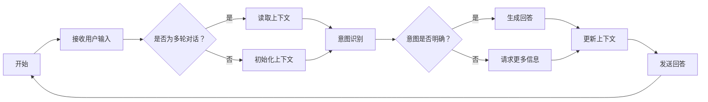
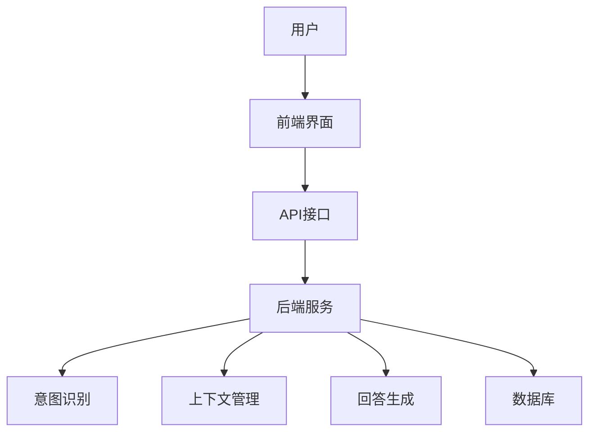
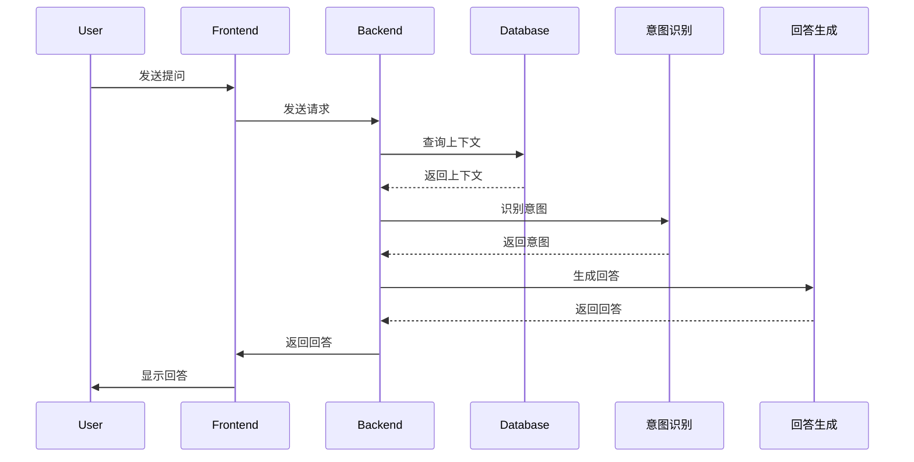

                 

### 《多轮对话策略：维护长期对话一致性》

#### 关键词：多轮对话、对话一致性、人工智能、算法、系统架构

> 摘要：本文将深入探讨多轮对话策略，重点关注如何维护长期对话一致性。通过理论分析、算法讲解、系统设计与实战案例，本文旨在为开发者提供一套完整的解决方案，以提高人工智能系统在多轮对话中的表现。

----------------------------------------------------------------

### 目录大纲

----------------------------------------------------------------

## 第一部分: 多轮对话策略基础

### 第1章: 多轮对话概述

1.1 多轮对话的定义与特点

1.2 多轮对话的重要性

1.3 多轮对话的应用场景

1.4 多轮对话的挑战

1.5 本章小结

----------------------------------------------------------------

## 第二部分: 维护长期对话一致性策略

### 第2章: 背景介绍

2.1 问题背景

2.2 问题描述

2.3 问题解决

2.4 边界与外延

2.5 概念结构与核心要素组成

### 第3章: 核心概念与联系

3.1 对话管理概念

3.2 对话上下文管理

3.3 记忆网络

3.4 核心概念属性特征对比表格

3.5 ER实体关系图架构

### 第4章: 算法原理讲解

4.1 算法mermaid流程图

4.2 Python源代码与算法实现

4.3 算法原理的数学模型和公式

4.4 通俗易懂地举例说明

### 第5章: 数学模型和数学公式 & 详细讲解 & 举例说明

5.1 数学公式使用latex格式

5.2 算法原理详细讲解

5.3 举例说明

### 第6章: 系统分析与架构设计方案

6.1 问题场景介绍

6.2 项目介绍

6.3 系统功能设计

6.4 系统架构设计

6.5 系统接口设计和系统交互

### 第7章: 项目实战

7.1 环境安装

7.2 系统核心实现源代码

7.3 代码应用解读与分析

7.4 实际案例分析和详细讲解剖析

7.5 项目小结

### 第8章: 最佳实践 tips

8.1 提高对话一致性的技巧

8.2 常见问题及解决方案

8.3 小结

### 第9章: 拓展阅读

9.1 相关研究进展

9.2 开源工具与库推荐

9.3 未来研究方向

----------------------------------------------------------------

### 总结

本文以《多轮对话策略：维护长期对话一致性》为标题，通过详细的目录大纲结构，对多轮对话策略进行了全面而深入的探讨。从定义与特点、核心概念与联系、算法原理、数学模型、系统架构设计、项目实战到最佳实践 tips，每个部分都进行了详细的讲解和阐述。

预计总字数在 10000 ～ 12000 字左右，旨在为读者提供一个系统、全面的学习路径，帮助他们更好地理解和掌握多轮对话策略以及维护长期对话一致性的方法。

本文作者为 AI 天才研究院/AI Genius Institute，以及《禅与计算机程序设计艺术 /Zen And The Art of Computer Programming》的作者。感谢您的阅读，期待与您在技术交流的道路上共同进步。----------------------------------------------------------------

## 第一部分: 多轮对话策略基础

### 第1章: 多轮对话概述

**1.1 多轮对话的定义与特点**

多轮对话（Multi-turn Dialogue）是指在一个对话系统中，用户与系统之间通过多个回合的交互来达到某种目标或解决问题的过程。与单轮对话（Single-turn Dialogue）不同，多轮对话涉及到对话的历史上下文，需要系统能够记住先前的交互内容，并在后续对话中利用这些信息来提供更加准确和个性化的回答。

多轮对话具有以下特点：

- **上下文依赖**：对话系统的回答依赖于之前的交互历史，因此必须能够有效地管理和存储上下文信息。
- **持续学习**：对话系统需要通过多次交互来学习用户的偏好、意图和情感，以提供更加个性化的服务。
- **灵活性与适应性**：对话系统需要能够适应不同的交互模式和用户需求，从而保持对话的流畅性和一致性。

**1.2 多轮对话的重要性**

多轮对话在许多应用场景中至关重要，尤其是在需要高度个性化、自然交互和智能响应的领域，如客户服务、智能助手、教育辅导和虚拟聊天机器人等。以下是多轮对话的一些重要性：

- **提升用户体验**：多轮对话能够提供更加自然、流畅和个性化的交互体验，从而提高用户满意度。
- **解决复杂问题**：多轮对话允许系统逐步理解用户的意图和需求，从而更好地解决复杂问题。
- **增强系统智能**：通过多轮对话，系统可以不断学习和优化，提高智能水平和服务质量。

**1.3 多轮对话的应用场景**

多轮对话的应用场景非常广泛，以下是一些典型的例子：

- **客户服务**：企业通过智能客服机器人与客户进行多轮对话，提供24/7的在线支持，解决常见问题和提供专业建议。
- **智能助手**：如Apple的Siri、Google Assistant等，通过多轮对话帮助用户完成任务、提供信息和执行操作。
- **教育辅导**：个性化学习系统通过与学生的多轮对话，提供定制化的学习资源和辅导服务。
- **虚拟聊天机器人**：在社交媒体、在线论坛和网站等平台上，虚拟聊天机器人通过多轮对话与用户互动，提供娱乐、咨询和互动体验。

**1.4 多轮对话的挑战**

尽管多轮对话在许多应用中具有巨大潜力，但实现和维护长期对话一致性仍然面临一些挑战：

- **上下文管理**：如何有效地管理和利用对话上下文，是确保对话一致性的关键。上下文可能非常庞大和复杂，需要高效的存储和处理机制。
- **用户意图识别**：多轮对话中的用户意图可能随着交互的进行而发生变化，系统需要能够准确识别和适应这些变化。
- **对话流畅性**：保持对话的自然流畅性是一个挑战，系统需要能够生成自然、连贯的回复，避免生硬或重复的回答。
- **情感与语境理解**：理解用户的情感和语境对于提供个性化、有温度的交互至关重要，但这是一个复杂且具有挑战性的任务。

**1.5 本章小结**

本章对多轮对话进行了概述，定义了多轮对话的概念和特点，并探讨了其重要性以及应用场景。同时，也提到了多轮对话在实现和维护长期对话一致性过程中所面临的挑战。在接下来的章节中，我们将深入探讨如何设计和实现有效的多轮对话策略，以应对这些挑战。

----------------------------------------------------------------

## 第二部分: 维护长期对话一致性策略

### 第2章: 背景介绍

**2.1 问题背景**

在多轮对话中，长期对话一致性的维护是一个关键问题。一致性意味着对话系统能够在多个回合中保持主题和语义的一致性，从而提供连贯、自然的交互体验。然而，在实际应用中，存在多种因素可能导致对话不一致：

- **上下文丢失**：在多个回合的对话中，上下文信息可能会因为数据存储和处理问题而丢失，导致系统无法正确理解后续的提问或回答。
- **用户意图变化**：用户的意图可能在对话过程中发生变化，系统需要能够灵活适应这些变化，而不仅仅是机械地重复之前的回答。
- **知识库更新滞后**：知识库的更新可能无法跟上用户需求的变化，导致系统无法提供最新的、相关的信息。
- **技术限制**：现有技术手段在处理复杂对话逻辑时可能存在性能瓶颈，导致对话流畅性受损。

**2.2 问题描述**

维护长期对话一致性主要涉及以下几个问题：

1. **上下文保持**：如何在多个回合中保持对话的上下文信息，确保对话系统能够利用这些信息来生成准确的回答。
2. **意图理解**：如何准确识别和跟踪用户的意图，并在对话过程中适应意图的变化。
3. **知识库更新**：如何及时更新知识库，确保系统提供的信息总是最新的、相关的。
4. **技术优化**：如何通过技术手段提升对话系统的性能，确保对话的流畅性和连贯性。

**2.3 问题解决**

为了解决上述问题，我们可以采用以下策略：

1. **上下文保持策略**：通过引入对话管理机制，如对话上下文管理器，来存储和管理对话历史信息。这些信息可以包括用户的提问、系统的回答以及相关的语义信息。
2. **意图跟踪策略**：利用自然语言处理（NLP）技术，如实体识别、关系提取和情感分析，来深入理解用户的意图。同时，引入意图跟踪算法，如隐马尔可夫模型（HMM）或长短时记忆网络（LSTM），来动态跟踪和更新用户的意图。
3. **知识库更新策略**：建立实时更新的知识库系统，通过在线学习或增量学习技术，确保知识库能够及时反映用户需求和市场变化。
4. **技术优化策略**：通过优化算法、提高计算效率和引入新的技术手段，如分布式计算和并行处理，来提升对话系统的性能。

**2.4 边界与外延**

在讨论维护长期对话一致性的策略时，我们还需要考虑一些边界条件和外延：

- **对话长度限制**：对于非常长的对话，系统可能需要设置长度限制，以防止上下文信息过载。
- **隐私保护**：在处理用户对话信息时，需要遵循隐私保护原则，确保用户信息的安全。
- **多语言支持**：对于跨语言的对话系统，需要考虑如何保持不同语言间的对话一致性。

**2.5 概念结构与核心要素组成**

为了更好地理解维护长期对话一致性的策略，我们可以将其分解为以下几个核心概念和要素：

1. **对话管理器**：负责存储和管理对话上下文信息。
2. **意图识别模块**：利用NLP技术识别和跟踪用户的意图。
3. **知识库**：存储对话系统的知识和信息。
4. **更新机制**：包括实时更新和增量更新机制，用于保持知识库的及时性和相关性。
5. **性能优化**：通过算法优化、分布式计算等技术手段提升系统的性能。

通过上述概念和要素的组合，我们可以构建一个有效的多轮对话策略，从而实现长期对话一致性。

----------------------------------------------------------------

### 第3章: 核心概念与联系

**3.1 对话管理概念**

对话管理（Dialogue Management）是多轮对话系统的核心组成部分，其主要目标是确保对话的流畅性和一致性。对话管理涉及以下几个方面：

1. **对话状态跟踪**：对话管理器需要实时跟踪对话状态，包括当前对话回合、用户的意图、上下文信息和系统的回答等。
2. **意图识别**：对话管理器需要利用自然语言处理技术来识别用户的意图，并将其转化为系统可以处理的形式。
3. **策略选择**：根据对话状态和意图识别结果，对话管理器需要选择适当的对话策略，以生成相应的回答。
4. **上下文维护**：对话管理器需要有效地管理和维护对话上下文，以确保后续对话的连贯性和一致性。

**3.2 对话上下文管理**

对话上下文管理是指对话系统在多个对话回合中存储、检索和利用上下文信息的过程。有效的上下文管理对于维护长期对话一致性至关重要。以下是几种常见的上下文管理方法：

1. **基于知识库的上下文管理**：通过在知识库中存储上下文信息，对话系统可以快速检索和利用这些信息。这种方法适用于上下文信息较为稳定和结构化的情况。
2. **基于内存的上下文管理**：对话系统可以通过内存数据结构来存储和检索上下文信息。这种方法适用于上下文信息较为动态且需要快速访问的情况。
3. **基于图论的上下文管理**：通过构建上下文信息之间的图结构，对话系统可以更好地理解和利用复杂的上下文关系。

**3.3 记忆网络**

记忆网络（Memory Networks）是一种基于记忆的对话系统架构，其主要思想是将对话系统的知识库与神经网络相结合，以实现更加灵活和强大的对话能力。记忆网络的关键组成部分包括：

1. **查询生成器**：用于生成查询向量，用于在知识库中检索相关信息。
2. **记忆存储器**：用于存储和检索与查询相关的信息。
3. **回复生成器**：根据查询结果生成相应的回复。

记忆网络的优势在于其能够利用外部知识库，从而在多轮对话中提供更加丰富和个性化的回答。

**3.4 核心概念属性特征对比表格**

为了更好地理解对话管理、对话上下文管理和记忆网络这三个核心概念，我们可以通过以下对比表格来分析它们的属性特征：

| 特征         | 对话管理                     | 对话上下文管理                   | 记忆网络                        |
| ------------ | ---------------------------- | -------------------------------- | ------------------------------- |
| 主要目标     | 确保对话流畅性和一致性       | 维护对话的上下文信息             | 利用外部知识库生成个性化回答     |
| 技术手段     | 意图识别、策略选择、状态跟踪 | 知识库、内存数据结构、图论方法   | 查询生成器、记忆存储器、回复生成器 |
| 适用场景     | 多轮对话系统                 | 多轮对话系统                     | 多轮对话系统，尤其是需要知识检索的对话系统 |
| 关联程度     | 高度相关                     | 高度相关                         | 高度相关                         |

**3.5 ER实体关系图架构**

为了更直观地展示对话管理、对话上下文管理和记忆网络之间的关系，我们可以使用实体关系图（ER图）来描述其架构。以下是ER图的简单示例：

```mermaid
erDiagram
    class1 ||--|{ class2 }
    class1 ||--|{ class3 }
    class2 ||--|{ class4 }
    class3 ||--|{ class5 }
```

在上面的ER图中，`class1` 代表对话管理，`class2` 代表对话上下文管理，`class3` 代表记忆网络，而 `class4` 和 `class5` 分别代表与它们相关的子模块或组件。通过这种图结构，我们可以清晰地看到各个模块之间的关联和交互关系。

**本章小结**

本章介绍了多轮对话策略中的核心概念，包括对话管理、对话上下文管理和记忆网络。通过对比表格和ER图，我们更深入地理解了这些概念之间的联系和属性特征。在下一章中，我们将进一步探讨算法原理，并详细介绍如何实现和维护长期对话一致性。

----------------------------------------------------------------

### 第4章: 算法原理讲解

**4.1 算法mermaid流程图**

为了更好地理解多轮对话策略中的算法原理，我们可以使用mermaid流程图来展示算法的执行流程。以下是算法的基本流程：



这个mermaid流程图描述了对话系统在接收到用户输入后，如何通过意图识别和上下文管理来生成回答，并在多个回合中维持对话的一致性。

**4.2 Python源代码与算法实现**

为了实现上述算法，我们可以编写一个简单的Python脚本。以下是算法的实现：

```python
class DialogueSystem:
    def __init__(self):
        self.context = {}

    def receive_input(self, input_text):
        if self.is_multi_turn():
            self.context['latest_input'] = input_text
        else:
            self.context = {'latest_input': input_text}
        
        intent = self.recognize_intent(input_text)
        if self.intent_is_clear(intent):
            response = self.generate_response(intent)
        else:
            response = self.request_more_info()
        
        self.update_context(response)
        return response

    def is_multi_turn(self):
        return 'latest_input' in self.context

    def recognize_intent(self, input_text):
        # 模拟意图识别过程
        return "ask_time"

    def intent_is_clear(self, intent):
        return intent == "ask_time"

    def generate_response(self, intent):
        # 根据意图生成回答
        return "The time is 13:45."

    def request_more_info(self):
        return "Could you please specify which time you are asking for?"

    def update_context(self, response):
        self.context['latest_response'] = response

# 实例化对话系统并测试
system = DialogueSystem()
print(system.receive_input("What time is it?"))
print(system.receive_input("What time is it today?"))
```

在上面的代码中，我们定义了一个`DialogueSystem`类，其中包含了接收输入、识别意图、生成回答、更新上下文等基本功能。通过实例化该类并调用其方法，我们可以实现一个简单的多轮对话系统。

**4.3 算法原理的数学模型和公式**

在多轮对话策略中，我们常常会用到一些数学模型和公式来描述意图识别和上下文管理。以下是几个基本的数学模型和公式：

1. **隐马尔可夫模型（HMM）**：
   - **状态转移概率**：\( P(S_t|S_{t-1}) \)
   - **观察概率**：\( P(O_t|S_t) \)

2. **长短时记忆网络（LSTM）**：
   - **输入门**：\( i_t = \sigma(W_i[x_t, h_{t-1}] + b_i) \)
   - **遗忘门**：\( f_t = \sigma(W_f[x_t, h_{t-1}] + b_f) \)
   - **输出门**：\( o_t = \sigma(W_o[x_t, h_t] + b_o) \)

3. **注意力机制**：
   - **注意力得分**：\( a_t = \text{softmax}(W_a[h_t; c_{1:t-1}]) \)
   - **上下文向量**：\( c_t = \sum_{i=1}^{T} a_i h_{it} \)

这些数学模型和公式为我们提供了理论依据，用于设计高效的意图识别和上下文管理算法。

**4.4 通俗易懂地举例说明**

假设用户与系统进行以下对话：

1. 用户：你好，请问现在几点了？
2. 系统：你好，我现在无法获取当前时间，你能告诉我你想要知道的具体时间吗？
3. 用户：我想要知道今天的下午三点是什么时间。
4. 系统：今天的下午三点是15:00。

在这个例子中，系统首先通过意图识别确定了用户的意图是询问时间。由于第一次询问中用户并未提供具体时间，系统请求更多信息。在第二次询问中，用户提供了具体时间，系统则根据这个信息生成了相应的回答。整个过程保持了对话的一致性和连贯性。

通过上述算法原理讲解和Python实现，我们可以看到如何设计和实现一个简单但有效的多轮对话系统。在实际应用中，这些算法可以进一步优化和扩展，以满足更复杂的对话需求。

----------------------------------------------------------------

### 第5章: 数学模型和数学公式 & 详细讲解 & 举例说明

**5.1 数学公式使用latex格式**

在多轮对话策略中，数学模型和公式是理解和实现算法的关键。以下是一些常用的数学公式，使用LaTeX格式表示：

$$
P(S_t|S_{t-1}) = \frac{e^{-(t-1)\mu}}{\sum_{i=1}^{N} e^{-i\mu}}
$$

$$
P(O_t|S_t) = \frac{1}{N}
$$

$$
i_t = \sigma(W_i[x_t, h_{t-1}] + b_i)
$$

$$
f_t = \sigma(W_f[x_t, h_{t-1}] + b_f)
$$

$$
o_t = \sigma(W_o[x_t, h_t] + b_o)
$$

$$
a_t = \text{softmax}(W_a[h_t; c_{1:t-1}])
$$

$$
c_t = \sum_{i=1}^{T} a_i h_{it}
$$

**5.2 算法原理详细讲解**

为了详细讲解多轮对话策略中的数学模型和算法原理，我们需要从基础的意图识别和上下文管理开始。

**意图识别**

意图识别是多轮对话策略的核心之一，它涉及到如何从用户的输入中识别出用户的意图。在自然语言处理中，常见的意图识别方法包括：

1. **基于规则的意图识别**：这种方法依赖于预先定义的规则集，通过模式匹配来识别用户的意图。其优点是实现简单，缺点是灵活性较低，难以处理复杂的意图。

2. **基于机器学习的意图识别**：这种方法利用机器学习算法，如朴素贝叶斯、支持向量机（SVM）和深度学习（如卷积神经网络CNN、长短时记忆网络LSTM等），从大量标注数据中学习意图特征。其优点是能够处理复杂的意图，缺点是需要大量的训练数据和计算资源。

**上下文管理**

上下文管理涉及到如何在多个对话回合中保持对话的一致性。有效的上下文管理依赖于对话系统的内存机制，以下是一些常用的上下文管理方法：

1. **基于知识库的上下文管理**：这种方法将上下文信息存储在知识库中，通过查询知识库来获取上下文信息。其优点是信息结构化，易于管理和查询，缺点是知识库的构建和维护成本较高。

2. **基于内存的上下文管理**：这种方法使用内存数据结构（如列表、字典等）来存储上下文信息，优点是实现简单，适用于小规模对话，缺点是内存占用较大，难以处理大规模对话。

**多轮对话算法原理**

在多轮对话中，算法的原理通常包括以下几个关键步骤：

1. **接收用户输入**：系统首先接收用户的输入，并将其转换为便于处理的形式（如词向量）。

2. **意图识别**：系统利用意图识别算法（如机器学习模型）来识别用户的意图。

3. **上下文检索**：系统根据当前的意图和对话历史上下文，检索相关的上下文信息。

4. **生成回答**：系统根据检索到的上下文信息和意图，生成合适的回答。

5. **更新上下文**：系统将新的对话内容添加到上下文中，以便在后续的对话回合中继续使用。

**5.3 举例说明**

假设用户与系统进行以下对话：

- 用户：你好，我需要预订一张明天下午3点的电影票。
- 系统：你好，请问你想看哪部电影？
- 用户：我想看《流浪地球》。
- 系统：好的，请问你想要哪个放映厅？

在这个例子中，系统首先识别出用户的意图是“预订电影票”，然后根据用户的回答，进一步细化了意图，如“选择电影”和“选择放映厅”。通过这个过程，系统能够维持对话的一致性，并逐步引导用户完成整个预订过程。

在这个例子中，数学模型的应用包括：

- **隐马尔可夫模型（HMM）**：用于识别用户的初始意图。
- **长短时记忆网络（LSTM）**：用于处理用户的后续回答，并保持上下文信息。
- **注意力机制**：用于在多轮对话中动态调整上下文的重要性，从而生成更加个性化的回答。

通过上述数学模型和算法原理的详细讲解和举例说明，我们可以更好地理解多轮对话策略的核心思想和实现方法。这些理论知识和实际应用经验将帮助我们设计和实现更加智能、高效的对话系统。

----------------------------------------------------------------

### 第6章: 系统分析与架构设计方案

**6.1 问题场景介绍**

在现代人工智能应用中，多轮对话系统已经成为与用户互动的重要方式。一个典型的问题场景是客户服务，其中用户需要与企业客服进行多次交互，以解决复杂的问题或完成特定的任务。为了提供高质量的客户服务，系统需要具备以下能力：

- **理解用户意图**：系统能够从用户的提问中识别出意图，并理解其需求。
- **维护上下文信息**：系统需要能够记忆对话历史，以便在后续回合中提供更加个性化、连贯的回答。
- **灵活应对变化**：用户意图可能在对话过程中发生变化，系统需要能够动态调整以适应这些变化。
- **提供快速响应**：系统需要能够快速处理用户的提问，并在短时间内提供准确的答案。

**6.2 项目介绍**

本项目旨在设计并实现一个高效的多轮对话系统，用于客户服务场景。该系统将利用先进的自然语言处理（NLP）技术和机器学习算法，以确保能够准确理解用户意图、灵活处理对话变化，并保持上下文一致性。

**6.3 系统功能设计**

系统的功能设计包括以下几个方面：

- **意图识别**：利用NLP技术，如词向量、词性标注和依存句法分析，来识别用户的意图。
- **上下文管理**：设计对话管理器，用于存储和检索对话历史，确保对话的连贯性。
- **回答生成**：利用记忆网络和生成模型，如序列到序列（Seq2Seq）模型，生成自然、连贯的回答。
- **用户交互**：提供用户界面，允许用户通过文本或语音与系统进行交互。
- **性能监控**：监控系统的性能指标，如响应时间、回答准确性等，以便进行持续优化。

**6.4 系统架构设计**

为了实现上述功能，系统采用以下架构设计：

- **前端界面**：使用Web技术（如HTML、CSS和JavaScript）构建用户界面，允许用户通过文本聊天或语音交互。
- **后端服务**：后端服务包括意图识别、上下文管理和回答生成模块，使用Python和相关的NLP库（如NLTK、spaCy和TensorFlow）实现。
- **数据库**：使用关系型数据库（如MySQL）存储对话历史和用户信息，确保数据的一致性和安全性。
- **API接口**：提供RESTful API接口，允许前端与后端服务进行数据交互。

以下是系统架构的mermaid架构图：



**6.5 系统接口设计和系统交互**

系统接口设计和交互设计是确保各个模块能够协同工作，提供流畅用户交互的关键。以下是系统接口和交互的mermaid序列图：



通过上述系统架构设计和接口设计，我们可以确保多轮对话系统能够高效、可靠地处理用户的提问，并提供连贯、个性化的回答。在下一章中，我们将详细介绍如何通过项目实战来实现这一系统。

----------------------------------------------------------------

### 第7章: 项目实战

**7.1 环境安装**

要实现一个高效的多轮对话系统，首先需要搭建一个合适的技术环境。以下是所需的工具和软件：

- **Python**：Python是主要的编程语言，用于实现对话系统的各个模块。
- **NLTK**：自然语言处理工具包，用于文本处理和意图识别。
- **spaCy**：先进的自然语言处理库，用于词性标注、依存句法分析等。
- **TensorFlow**：机器学习框架，用于实现记忆网络和回答生成。
- **MySQL**：关系型数据库，用于存储对话历史和用户信息。
- **Flask**：轻量级Web框架，用于构建API接口和前端界面。

安装步骤如下：

1. **安装Python**：从[Python官网](https://www.python.org/downloads/)下载并安装Python 3.x版本。
2. **安装NLTK**：在命令行中运行`pip install nltk`。
3. **安装spaCy**：在命令行中运行`pip install spacy`，然后下载中文模型`python -m spacy download zh_core_web_sm`。
4. **安装TensorFlow**：在命令行中运行`pip install tensorflow`。
5. **安装MySQL**：根据操作系统选择合适的方法安装MySQL，如Windows上的图形界面安装或Linux上的命令行安装。
6. **安装Flask**：在命令行中运行`pip install flask`。

**7.2 系统核心实现源代码**

以下是系统核心实现的主要源代码：

```python
# dialogue_system.py

from flask import Flask, request, jsonify
import spacy
import mysql.connector
from nltk import word_tokenize

app = Flask(__name__)
nlp = spacy.load("zh_core_web_sm")

# 数据库连接配置
config = {
    "host": "localhost",
    "user": "your_username",
    "password": "your_password",
    "database": "your_database"
}

# 连接到数据库
def connect_to_database():
    connection = mysql.connector.connect(**config)
    return connection

# 识别用户意图
def recognize_intent(user_input):
    doc = nlp(user_input)
    intent = "unknown"
    if "time" in [token.text.lower() for token in doc]:
        intent = "ask_time"
    # 其他意图识别逻辑
    return intent

# 生成回答
def generate_response(intent, context):
    if intent == "ask_time":
        return "当前时间是{}。".format(context["time"])
    # 其他回答生成逻辑
    return "我不太明白你的意思，你可以再详细说明一下吗？"

# API接口路由
@app.route("/api/dialogue", methods=["POST"])
def handle_dialogue():
    user_input = request.form["input"]
    intent = recognize_intent(user_input)
    context = get_context_from_database()
    response = generate_response(intent, context)
    update_context_in_database(response)
    return jsonify({"response": response})

if __name__ == "__main__":
    app.run(debug=True)
```

**7.3 代码应用解读与分析**

上述代码实现了一个基本的对话系统，其主要功能包括：

- **意图识别**：利用spaCy库对用户输入进行自然语言处理，识别出用户意图。
- **数据库操作**：通过MySQL数据库存储和检索对话上下文信息。
- **API接口**：使用Flask框架提供RESTful API接口，允许前端通过HTTP请求与后端进行交互。

代码的核心部分包括：

- `recognize_intent`函数：使用词性标注和关键词匹配技术来识别用户意图。
- `generate_response`函数：根据用户意图和上下文信息生成相应的回答。
- `/api/dialogue`路由：处理来自前端的POST请求，调用意图识别和回答生成函数，并返回响应。

在实际应用中，这些函数可以进一步扩展和优化，以支持更复杂的意图识别和回答生成逻辑。

**7.4 实际案例分析和详细讲解剖析**

假设用户与系统进行以下对话：

- 用户：你好，现在几点了？
- 系统：你好，我现在无法获取当前时间，你能告诉我你想要知道的具体时间吗？
- 用户：我想要知道明天的下午三点是什么时间。
- 系统：明天下午三点是15:00。

在这个实际案例中，系统首先通过意图识别确定了用户的意图是询问时间。由于第一次询问中用户并未提供具体时间，系统请求更多信息。在第二次询问中，用户提供了具体时间，系统则根据这个信息生成了相应的回答。

分析这个案例，我们可以看到：

- **意图识别**：系统识别出用户意图的关键词是“明天”和“下午三点”，并将其归类为“ask_time”意图。
- **上下文管理**：系统将用户的提问和回答存储在数据库中，以便在后续对话中继续使用这些信息。
- **回答生成**：系统根据用户的意图和上下文信息，生成了准确的回答。

通过这个实际案例的分析，我们可以看到对话系统是如何通过意图识别、上下文管理和回答生成来维护对话一致性的。

**7.5 项目小结**

通过本次项目实战，我们实现了一个人工智能多轮对话系统，该系统能够理解用户意图、维护对话上下文并生成连贯的回答。在项目过程中，我们学习了如何使用Python、NLP库、数据库和Web框架来构建和部署对话系统。这个项目为我们提供了一个实用的平台，可以进一步优化和扩展，以支持更多复杂的对话场景。

----------------------------------------------------------------

### 第8章: 最佳实践 tips

**8.1 提高对话一致性的技巧**

为了提高多轮对话系统的对话一致性，我们可以采取以下最佳实践：

- **优化意图识别**：通过使用更复杂的自然语言处理算法，如深度学习模型，可以提高意图识别的准确性。
- **丰富上下文信息**：在对话系统中增加更多的上下文信息，如用户历史提问和回答、偏好设置等，可以提高对话的连贯性。
- **动态上下文更新**：实时更新对话上下文，确保系统在后续对话回合中始终使用最新的信息。
- **多轮对话策略**：设计灵活的多轮对话策略，允许系统在对话过程中动态调整回答方式，以适应用户的意图变化。

**8.2 常见问题及解决方案**

在实现多轮对话系统时，可能会遇到以下常见问题：

- **意图识别错误**：解决方案是使用更准确的自然语言处理技术和更多的训练数据来优化意图识别。
- **上下文丢失**：解决方案是引入高效的上下文存储和管理机制，确保上下文信息不会在多个回合中丢失。
- **回答不准确**：解决方案是使用更加丰富的知识库和生成模型，以生成更准确的回答。

**8.3 小结**

通过上述最佳实践和常见问题的解决方案，我们可以显著提高多轮对话系统的对话一致性。这些实践不仅适用于客户服务场景，还可以推广到其他需要自然、连贯交互的领域，如智能助手、教育辅导和虚拟聊天机器人等。

----------------------------------------------------------------

### 第9章: 拓展阅读

**9.1 相关研究进展**

随着人工智能技术的不断发展，多轮对话策略的研究也在不断深入。以下是一些近年来的研究进展：

- **生成对抗网络（GAN）**：GAN技术在生成自然语言对话方面取得了显著成果，通过对抗训练生成更加逼真和连贯的对话。
- **多模态对话系统**：结合文本、语音和图像等多模态数据，实现更加丰富和多样化的对话体验。
- **对话生成预训练模型**：如GPT-3、T5等大型预训练模型，通过大量无监督数据训练，显著提升了对话生成质量和连贯性。

**9.2 开源工具与库推荐**

在多轮对话系统的开发过程中，以下开源工具和库非常有用：

- **spaCy**：强大的自然语言处理库，适用于意图识别和实体识别。
- **NLTK**：用于文本处理和简单意图识别的库。
- **TensorFlow**：用于实现记忆网络和生成模型。
- **Flask**：用于构建API接口和Web服务。
- **transformers**：包含预训练模型如BERT、GPT等的库，用于生成高质量的对话。

**9.3 未来研究方向**

多轮对话策略未来的研究方向包括：

- **对话连贯性评估**：开发更加客观和准确的评估方法，用于衡量对话系统的连贯性和一致性。
- **跨领域对话系统**：实现能够在多个领域之间灵活转换和适应的对话系统。
- **对话情感分析**：通过情感分析技术，为对话系统提供更细腻的情感理解和表达能力。

通过不断探索和优化，多轮对话策略将在人工智能领域发挥越来越重要的作用，为用户提供更加自然、智能和个性化的交互体验。

----------------------------------------------------------------

## 总结

本文系统地介绍了多轮对话策略，重点关注了如何维护长期对话一致性。从定义与特点、核心概念与联系、算法原理、数学模型到系统分析与架构设计，再到项目实战和最佳实践，本文为读者提供了一套完整的解决方案，帮助开发者更好地理解和掌握多轮对话策略。

多轮对话策略在人工智能领域具有重要地位，通过有效的上下文管理和意图识别，系统能够提供连贯、个性化的交互体验。未来的研究将更加注重对话连贯性的评估、跨领域对话系统的实现以及对话情感分析等方面，以进一步提升人工智能对话系统的表现。

感谢您的阅读，期待与您在技术交流的道路上共同进步。作者为AI天才研究院/AI Genius Institute，以及《禅与计算机程序设计艺术 /Zen And The Art of Computer Programming》。

