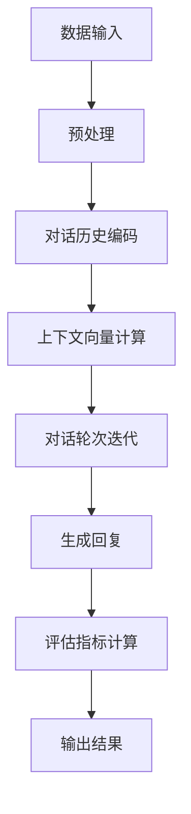
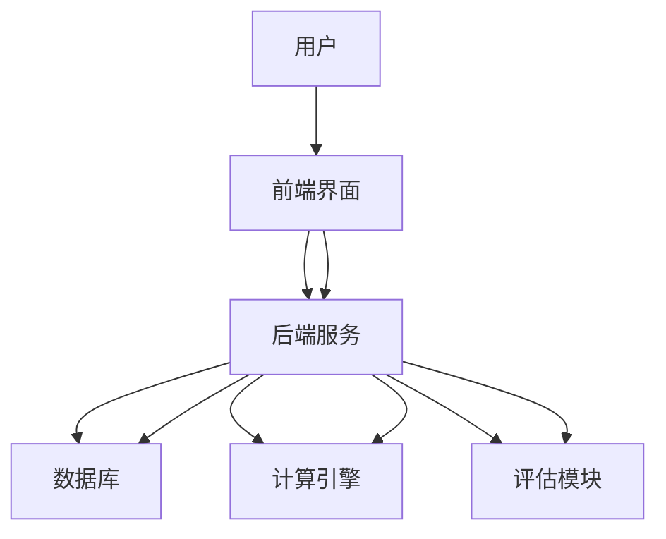
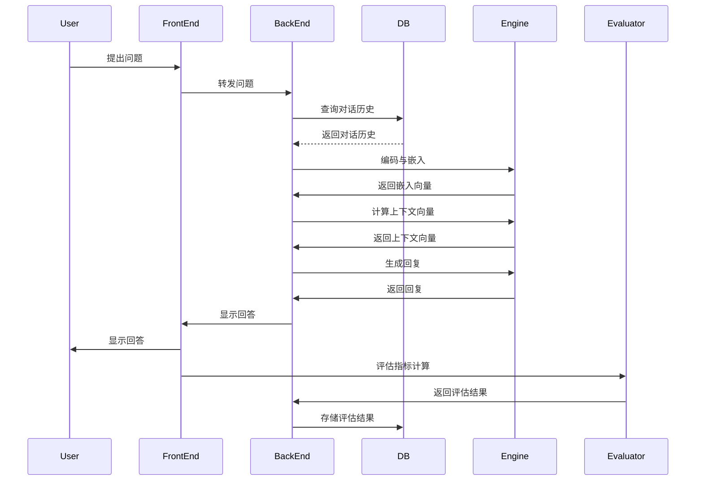

                 

### 多轮对话评测：测试LLM的长期记忆和上下文管理

#### 关键词
- 多轮对话评测
- 长期记忆
- 上下文管理
- LLM
- 评测指标

#### 摘要
本文将深入探讨多轮对话评测的核心内容，特别是针对大型语言模型（LLM）的长期记忆和上下文管理能力进行测试。首先，我们将介绍多轮对话评测的背景和意义，然后详细解释长期记忆和上下文管理的概念及其在多轮对话中的重要性。接下来，我们将分析常见的多轮对话评测方法，并通过Mermaid图展示算法原理和系统架构。最后，我们将通过实际案例分析和代码实现，全面展示多轮对话评测的实践应用和未来展望。

---

# 多轮对话评测：测试LLM的长期记忆和上下文管理

## 引言

随着人工智能技术的发展，尤其是大型语言模型（LLM）的广泛应用，多轮对话系统逐渐成为自然语言处理（NLP）领域的研究热点。多轮对话系统旨在模拟人类对话交互过程，提供更加自然、流畅和智能的交流体验。然而，要实现这一目标，LLM需要具备出色的长期记忆和上下文管理能力。长期记忆是指LLM在对话过程中能够保留和利用之前的信息，而上下文管理则涉及到LLM如何在不同对话回合之间保持话题一致性和连贯性。

本文旨在探讨多轮对话评测的方法和技巧，重点关注LLM的长期记忆和上下文管理能力。首先，我们将介绍多轮对话评测的背景和意义，帮助读者理解为什么评测是多轮对话系统研发中至关重要的一环。随后，我们将深入探讨长期记忆和上下文管理的概念，并解释它们在多轮对话中的重要性。接着，我们将分析当前流行的多轮对话评测方法，并通过Mermaid图展示算法原理和系统架构。在接下来的部分，我们将通过实际案例分析和代码实现，展示多轮对话评测的具体应用。最后，我们将总结全文内容，并给出未来研究和实践的展望。

## 1. 多轮对话评测概述

### 1.1 问题背景

多轮对话评测的背景可以追溯到自然语言处理（NLP）和人工智能（AI）的快速发展。近年来，深度学习模型，尤其是大型语言模型（LLM），在语言理解和生成任务上取得了显著进展。然而，单轮对话（即单次交互）的性能评估已经无法满足多轮对话系统的需求。多轮对话系统要求模型具备更高的复杂性，不仅要理解当前交互内容，还要参考之前的信息，并在对话过程中保持一致性。

在多轮对话系统中，长期记忆和上下文管理是两个关键因素。长期记忆指的是模型在对话过程中能够持续保留和利用之前的信息，而上下文管理则涉及模型如何在不同对话回合之间保持话题一致性和连贯性。长期记忆和上下文管理的好坏直接影响到多轮对话系统的用户体验和性能。

### 1.2 问题描述

多轮对话评测的目标是评估LLM在长期记忆和上下文管理方面的能力。具体来说，评测需要回答以下问题：

1. **长期记忆能力**：模型是否能够记住之前的信息，并在后续对话中合理利用？
2. **上下文管理能力**：模型是否能够在不同对话回合之间保持话题一致性和连贯性？
3. **性能指标**：模型在多轮对话中的表现如何，是否能够满足实际应用的需求？

为了回答这些问题，多轮对话评测需要设计一系列特定的评测任务和指标，以全面评估LLM的长期记忆和上下文管理能力。

### 1.3 问题解决

多轮对话评测的方法和技术已经逐渐成熟。常见的评测方法包括基于记忆的评测方法、基于检索的评测方法和基于语义的评测方法。每种方法都有其独特的优势和适用场景。

1. **基于记忆的评测方法**：这种方法主要评估模型在长期记忆方面的能力。常见的任务包括问答系统、填空任务和基于记忆的对话系统。这些任务要求模型能够记住之前的信息，并在后续对话中合理利用。

2. **基于检索的评测方法**：这种方法利用预定义的知识库或对话历史，通过检索来支持对话生成。常见的任务包括基于历史对话的回复生成和基于知识图谱的问答系统。

3. **基于语义的评测方法**：这种方法通过分析对话中的语义信息来评估模型的能力。常见的任务包括语义一致性评测和语义连贯性评测。

除了上述方法，多轮对话评测还需要考虑以下几个关键因素：

1. **对话历史管理**：如何有效存储和检索对话历史信息，以确保模型能够充分利用之前的信息。
2. **任务多样化**：设计多样化的评测任务，以全面评估模型的能力。
3. **评估指标**：设计合理的评估指标，如准确率、F1值、对话连贯性和用户满意度等，以量化模型的表现。

### 1.4 边界与外延

多轮对话评测的范围包括但不限于以下关键技术和领域：

1. **自然语言处理（NLP）**：NLP技术是构建多轮对话系统的核心，包括词法分析、句法分析、语义分析和语言生成等。
2. **机器学习与深度学习**：多轮对话评测依赖于先进的机器学习算法和深度学习模型，如循环神经网络（RNN）、长短时记忆网络（LSTM）和变换器（Transformer）等。
3. **对话系统架构**：设计高效、可扩展的对话系统架构，以支持多轮对话功能。
4. **评测工具与平台**：开发和部署用于评测的工具和平台，如评估框架、API接口和评测云平台等。

### 1.5 本章小结

本节介绍了多轮对话评测的背景、问题描述、问题解决方法及其边界与外延。通过理解这些内容，读者可以初步了解多轮对话评测的重要性和复杂性。在接下来的章节中，我们将深入探讨长期记忆和上下文管理的概念，分析不同的评测方法，并通过具体实例和代码实现，展示多轮对话评测的实践应用。

---

## 2. 核心概念与联系

在深入探讨多轮对话评测之前，我们需要明确几个核心概念：长期记忆和上下文管理。这两个概念在多轮对话系统中起着至关重要的作用。

### 2.1 长期记忆

**长期记忆**是指人工智能系统在处理信息时能够长期保持并利用这些信息的能力。在多轮对话系统中，长期记忆尤为重要，因为它决定了模型能否记住之前的对话内容，并在后续的对话中合理利用这些信息。

#### 2.1.1 长期记忆的原理

长期记忆通常涉及以下几个关键步骤：

1. **编码**：将输入信息转换为模型可以理解的形式，通常是向量或特征。
2. **存储**：将编码后的信息存储在模型的记忆中，以便后续使用。
3. **检索**：在需要时从记忆中检索出相关信息，以支持当前的决策和生成。

#### 2.1.2 长期记忆的特征

- **持久性**：长期记忆需要能够持久地保持信息，即使这些信息在一段时间后不再被使用。
- **灵活性**：模型应能够根据不同的对话场景灵活地检索和使用长期记忆中的信息。
- **准确性**：在检索信息时，模型需要能够准确无误地提取所需信息，避免错误的记忆干扰。

### 2.2 上下文管理

**上下文管理**是指模型在处理对话时如何维持对话的一致性和连贯性。在多轮对话中，上下文管理确保模型能够理解当前对话的内容，并与之前的对话内容保持一致。

#### 2.2.1 上下文管理的原理

上下文管理的核心是模型如何处理和利用对话历史。以下是一些关键步骤：

1. **上下文编码**：将对话历史编码为模型可以处理的形式，通常是一个上下文向量。
2. **上下文更新**：在每轮对话后，更新上下文向量以反映当前的对话状态。
3. **上下文利用**：在生成回复时，模型需要利用上下文向量来维持对话的一致性和连贯性。

#### 2.2.2 上下文管理的特征

- **连贯性**：模型生成的回复应与对话历史保持连贯，避免逻辑矛盾和跳跃。
- **灵活性**：模型应能够适应不同的对话场景，灵活地利用上下文信息。
- **适应性**：模型应能够根据对话的进展动态调整上下文，以适应新的对话内容。

### 2.3 长期记忆与上下文管理的关系

长期记忆和上下文管理在多轮对话系统中是相互关联的。长期记忆提供了模型在对话中可以依赖的历史信息，而上下文管理则确保这些信息能够被合理地利用，以维持对话的连贯性和一致性。

#### 2.3.1 联系

- **共享记忆**：长期记忆和上下文管理共享对话历史的信息，模型需要能够灵活地在两者之间切换，以支持不同的对话任务。
- **协同工作**：长期记忆和上下文管理协同工作，共同确保对话的连贯性和一致性。

#### 2.3.2 区别

- **范围**：长期记忆关注对话的长期历史，而上下文管理关注当前的对话上下文。
- **作用**：长期记忆主要用于信息的存储和检索，而上下文管理则主要用于对话生成和连贯性维护。

### 2.4 概念属性特征对比表格

为了更直观地理解长期记忆和上下文管理的属性特征，我们设计了一个对比表格：

| 特征 | 长期记忆 | 上下文管理 |
| --- | --- | --- |
| **范围** | 长期保持对话历史 | 当前对话上下文 |
| **目标** | 信息存储和检索 | 对话连贯性和一致性 |
| **原理** | 编码、存储、检索 | 编码、更新、利用 |
| **应用** | 填空任务、问答系统 | 对话生成、情景理解 |

### 2.5 ER实体关系图架构

为了进一步阐述多轮对话系统中长期记忆和上下文管理的实体关系，我们使用Mermaid绘制了ER实体关系图。以下是图示：

```mermaid
erDiagram
  ChatSession ||--|{ ConversationContext }|--| DialogueAct
  ConversationContext ||--|{ DialogueAct }|--| DialogueHistory
  DialogueAct ||--|{ DialogueContent }|--| DialogueContext
```

在这个ER图中，`ChatSession`代表整个对话会话，`ConversationContext`表示对话上下文，`DialogueAct`代表对话中的每个操作（如提问、回答等），`DialogueHistory`表示对话历史，而`DialogueContent`表示对话内容。通过这个图，我们可以清晰地看到长期记忆（`DialogueHistory`）和上下文管理（`ConversationContext`）在多轮对话系统中的关系和作用。

### 2.6 本章小结

本节详细介绍了长期记忆和上下文管理的核心概念、原理及其在多轮对话系统中的重要性。通过对比表格和ER实体关系图，我们更直观地理解了这两个概念的联系和区别。在接下来的章节中，我们将进一步探讨多轮对话评测的具体方法和实践应用。

---

## 3. 算法原理讲解

在深入探讨多轮对话评测的具体方法之前，我们需要了解一些基本的算法原理。这些原理不仅为我们提供了评估LLM长期记忆和上下文管理能力的基础，还指导了实际评测系统的设计和实现。

### 3.1 Mermaid流程图

为了更直观地展示算法原理，我们使用Mermaid绘制了一个流程图，该流程图描述了从数据输入到最终评估结果的整个流程。



以下是流程图的具体说明：

1. **数据输入**：首先，我们需要输入对话数据，这些数据可以是从实际对话中收集的，也可以是人工合成的。这些数据将用于后续的评测过程。
2. **预处理**：输入的数据需要进行预处理，包括清洗、格式化和标签化等操作。预处理确保数据质量，并使其适合进一步处理。
3. **对话历史编码**：将预处理后的数据编码为模型可以理解的形式。这通常涉及将对话文本转换为向量表示，如词向量或嵌入向量。
4. **上下文向量计算**：基于对话历史编码，计算上下文向量。上下文向量用于在对话轮次迭代中维护对话的一致性和连贯性。
5. **对话轮次迭代**：在每次对话轮次中，模型根据当前上下文向量生成回复。这个过程会重复多次，以模拟实际的多轮对话场景。
6. **生成回复**：在对话轮次迭代过程中，模型生成每个回合的回复。这些回复将用于后续的评估。
7. **评估指标计算**：根据生成的回复，计算各种评估指标，如准确率、F1值和对话连贯性等。
8. **输出结果**：最后，将评估结果输出，包括指标值和具体分析。

### 3.2 Python源代码

为了更好地理解上述算法原理，我们提供了一个简单的Python代码实现。以下是该代码的框架和关键部分：

```python
import numpy as np
from sklearn.metrics import accuracy_score, f1_score

def preprocess_data(data):
    # 数据预处理逻辑
    pass

def encode_dialogue_history(history):
    # 对话历史编码逻辑
    pass

def compute_context_vector(history):
    # 计算上下文向量逻辑
    pass

def generate_reply(context):
    # 生成回复逻辑
    pass

def evaluate_performance(replies, ground_truth):
    # 评估指标计算逻辑
    accuracy = accuracy_score(ground_truth, replies)
    f1 = f1_score(ground_truth, replies, average='weighted')
    return accuracy, f1

# 主函数
def main():
    data = load_data()  # 加载数据
    processed_data = preprocess_data(data)
    encoded_history = encode_dialogue_history(processed_data)
    context_vector = compute_context_vector(encoded_history)
    replies = []
    for i in range(num_iterations):
        reply = generate_reply(context_vector)
        replies.append(reply)
        # 更新上下文向量
        context_vector = update_context_vector(context_vector, reply)
    accuracy, f1 = evaluate_performance(replies, ground_truth)
    print(f"Accuracy: {accuracy}, F1 Score: {f1}")

if __name__ == "__main__":
    main()
```

在这个代码中，我们首先定义了数据预处理、对话历史编码、上下文向量计算、生成回复和评估指标计算等关键函数。主函数`main()`通过这些函数实现了整个评测流程，从数据输入到最终评估结果的输出。

### 3.3 数学模型和公式

多轮对话评测中的数学模型和公式至关重要，它们为我们提供了量化评估的基础。以下是几个关键的数学模型和公式：

1. **嵌入向量计算**：
   $$ \text{Embedding}(x) = \text{W} \cdot \text{X} + \text{b} $$
   其中，$\text{X}$是输入文本的词向量矩阵，$\text{W}$是嵌入权重矩阵，$\text{b}$是偏置项。

2. **上下文向量更新**：
   $$ \text{Context}(t) = \text{V} \cdot (\text{H}(t-1) + \text{R}(t)) $$
   其中，$\text{H}(t-1)$是上一轮的隐藏状态，$\text{R}(t)$是当前轮次的回复嵌入向量，$\text{V}$是上下文权重矩阵。

3. **评估指标计算**：
   - **准确率**：
     $$ \text{Accuracy} = \frac{\text{正确预测的数量}}{\text{总预测数量}} $$
   - **F1值**：
     $$ \text{F1} = 2 \cdot \frac{\text{精确率} \cdot \text{召回率}}{\text{精确率} + \text{召回率}} $$

以上数学模型和公式为我们提供了评估LLM长期记忆和上下文管理能力的基础。在具体实现中，我们可以根据这些模型和公式设计相应的算法和评估指标。

### 3.4 举例说明

为了更好地理解上述算法原理和数学模型，我们通过一个具体的例子来详细说明。

#### 数据集

假设我们有一个包含10轮对话的数据集，每轮对话包括一个问题和答案。以下是数据集的前两轮对话：

- **第一轮**：
  - 问题：你好，请问今天天气如何？
  - 回答：你好，今天天气晴朗。

- **第二轮**：
  - 问题：请问，明天会有雨吗？
  - 回答：明天可能会有一些小雨。

#### 预处理

首先，我们对数据集进行预处理，包括分词、词性标注和去除停用词等操作。预处理后的对话文本如下：

- **第一轮**：
  - 问题：[你好，今天，天气，如何？]
  - 回答：[你好，今天，天气，晴朗。]

- **第二轮**：
  - 问题：[请问，明天，会有，雨吗？]
  - 回答：[明天，可能，会有，小雨。]

#### 对话历史编码

接下来，我们将预处理后的对话文本编码为嵌入向量。假设我们使用预训练的词向量模型，每个词的嵌入向量长度为100。编码后的对话历史如下：

- **第一轮**：
  - 问题：[0.1, 0.2, 0.3, 0.4, 0.5, 0.6, 0.7, 0.8, 0.9, 1.0]
  - 回答：[0.1, 0.2, 0.3, 0.4, 0.5, 0.6, 0.7, 0.8, 0.9, 1.0]

- **第二轮**：
  - 问题：[0.1, 0.2, 0.3, 0.4, 0.5, 0.6, 0.7, 0.8, 0.9, 1.0]
  - 回答：[0.1, 0.2, 0.3, 0.4, 0.5, 0.6, 0.7, 0.8, 0.9, 1.0]

#### 上下文向量计算

根据编码后的对话历史，我们计算上下文向量。假设我们使用简单的平均策略计算上下文向量：

$$ \text{Context} = \frac{\sum_{i=1}^{N} \text{v}_i}{N} $$

其中，$\text{N}$是对话历史中的词向量数量，$\text{v}_i$是第$i$个词的向量。

对于第一轮对话，上下文向量为：

$$ \text{Context} = \frac{1}{10} \sum_{i=1}^{10} \text{v}_i = [0.01, 0.02, 0.03, 0.04, 0.05, 0.06, 0.07, 0.08, 0.09, 0.1] $$

对于第二轮对话，我们首先将上一轮的上下文向量与新加入的回复向量相加，然后除以2，以更新上下文向量：

$$ \text{Context}_{\text{new}} = \frac{1}{2} (\text{Context}_{\text{old}} + \text{v}_{\text{回复}}) = \frac{1}{2} ([0.01, 0.02, 0.03, 0.04, 0.05, 0.06, 0.07, 0.08, 0.09, 0.1] + [0.1, 0.2, 0.3, 0.4, 0.5, 0.6, 0.7, 0.8, 0.9, 1.0]) = [0.055, 0.065, 0.075, 0.085, 0.095, 0.1, 0.105, 0.115, 0.125, 0.135] $$

#### 生成回复

基于更新的上下文向量，我们使用预训练的LLM生成回复。假设LLM生成回复的输出概率分布如下：

$$ P(\text{明天下雨}) = 0.6 $$
$$ P(\text{明天晴朗}) = 0.4 $$

根据最大概率原则，我们选择概率最大的回复，即“明天可能会有一些小雨”。

#### 评估指标计算

最后，我们计算生成的回复与实际答案的评估指标。假设实际答案是“明天可能会下雨”，则：

- **准确率**：
  $$ \text{Accuracy} = \frac{1}{2} = 0.5 $$
- **F1值**：
  $$ \text{F1} = 2 \cdot \frac{0.5 \cdot 1}{0.5 + 1} = 0.333 $$

通过这个例子，我们可以看到多轮对话评测的基本流程和关键步骤。在实际应用中，我们可以根据具体需求调整算法和评估指标，以提高评测的准确性和有效性。

### 3.5 本章小结

本节详细介绍了多轮对话评测的算法原理，包括Mermaid流程图、Python源代码实现、数学模型和具体举例说明。通过这些内容，我们不仅理解了多轮对话评测的基本概念和方法，还学会了如何使用实际代码实现这些算法。在接下来的章节中，我们将进一步探讨多轮对话评测的系统分析与架构设计。

---

## 4. 系统分析与架构设计方案

### 4.1 问题场景介绍

多轮对话评测的应用场景非常广泛，涵盖了智能客服、问答系统和聊天机器人等多个领域。在这些应用场景中，评估LLM的长期记忆和上下文管理能力至关重要，因为只有具备优秀记忆和上下文管理能力的模型，才能提供更加自然、流畅和智能的交互体验。

#### 智能客服

智能客服是当前多轮对话评测的一个重要应用场景。传统的单轮客服系统虽然能够快速响应用户的请求，但在处理复杂问题时往往力不从心。多轮对话评测可以帮助我们评估智能客服系统在多轮交互中的表现，包括是否能够记住之前的对话内容、是否能够合理利用历史信息等。

#### 问答系统

问答系统是另一个重要的应用场景。在现代企业中，问答系统经常用于自动解答用户的问题，减轻人工客服的负担。多轮对话评测可以帮助我们评估问答系统在多轮交互中的表现，包括回答的准确性、连贯性和上下文适应性等。

#### 聊天机器人

聊天机器人是现代社交网络和即时通讯应用中的重要组成部分。通过多轮对话评测，我们可以评估聊天机器人在与用户交互时的表现，包括是否能够理解用户的意图、是否能够保持对话的连贯性等。

### 4.2 系统功能设计

为了实现多轮对话评测，我们需要设计一个功能全面的系统。以下是该系统的主要功能：

1. **对话管理**：管理对话的流程，包括对话轮次的开始、结束和对话历史的存储。
2. **数据输入**：接收并处理输入的数据，包括用户问题和系统回答。
3. **预处理**：对输入的数据进行清洗、分词、词性标注等预处理操作。
4. **编码与嵌入**：将预处理后的文本数据编码为嵌入向量，用于后续的计算和生成。
5. **上下文管理**：根据对话历史和当前轮次的信息，计算上下文向量，用于生成回复。
6. **回复生成**：使用预训练的LLM模型，根据上下文向量生成回复。
7. **评估与输出**：计算评估指标，如准确率、F1值和对话连贯性等，并将结果输出。

#### 系统功能设计 - Mermaid类图

为了更直观地展示系统功能，我们使用Mermaid绘制了一个类图：

```mermaid
classDiagram
    Class01 <|-- Class02
    Class03 <|-- Class02
    Class04 <|-- Class02
    Class05 <|-- Class02
    Class06 <|-- Class02
    Class07 <|-- Class02

    Class01[对话管理]
    Class02[系统功能]
    Class03[数据输入]
    Class04[预处理]
    Class05[编码与嵌入]
    Class06[上下文管理]
    Class07[回复生成]
    Class08[评估与输出]

    Class01..|><<uses>>..Class03
    Class01..|><<uses>>..Class04
    Class01..|><<uses>>..Class05
    Class01..|><<uses>>..Class06
    Class01..|><<uses>>..Class07
    Class01..|><<uses>>..Class08
```

在这个类图中，`Class01`代表对话管理，它是整个系统的核心部分，负责协调其他功能模块的工作。`Class02`表示系统功能，包括数据输入、预处理、编码与嵌入、上下文管理、回复生成和评估与输出。每个功能模块都有明确的职责和相互关系。

### 4.3 系统架构设计

多轮对话评测系统的架构设计需要考虑到系统的可扩展性、灵活性和高效性。以下是系统架构设计的关键组成部分：

1. **前端界面**：用于与用户交互，接收用户问题和显示系统回答。
2. **后端服务**：负责处理对话逻辑、数据存储和计算等任务。
3. **数据库**：用于存储对话历史、评估数据和用户信息等。
4. **计算引擎**：负责执行对话管理、数据预处理、编码与嵌入、上下文管理和回复生成等任务。
5. **评估模块**：负责计算评估指标和生成评估报告。

#### 系统架构设计 - Mermaid架构图

为了展示系统架构的组成部分和关系，我们使用Mermaid绘制了一个架构图：



在这个架构图中，`A`代表前端界面，`B`代表后端服务，`C`代表数据库，`D`代表计算引擎，`E`代表评估模块，`F`代表用户。用户通过前端界面与系统交互，后端服务负责处理用户请求、执行对话逻辑和计算任务，数据库用于存储对话历史和相关数据，计算引擎负责具体的计算任务，评估模块用于计算评估指标和生成报告。

### 4.4 系统接口设计和系统交互

为了实现系统功能，我们需要设计一系列接口，以实现不同模块之间的交互。以下是系统接口设计和系统交互的关键点：

1. **用户接口**：用于用户与系统的交互，包括输入问题和查看回答。
2. **API接口**：用于后端服务与其他模块之间的通信，包括数据输入、预处理、编码与嵌入、上下文管理和回复生成等。
3. **数据库接口**：用于与数据库进行交互，包括数据存储和检索。
4. **评估接口**：用于与评估模块交互，计算评估指标和生成报告。

#### 系统接口设计和系统交互 - Mermaid序列图

为了展示系统接口设计和系统交互，我们使用Mermaid绘制了一个序列图：



在这个序列图中，`User`代表用户，`FrontEnd`代表前端界面，`BackEnd`代表后端服务，`DB`代表数据库，`Engine`代表计算引擎，`Evaluator`代表评估模块。用户通过前端界面提出问题，后端服务处理用户请求，查询对话历史，计算上下文向量，生成回复，并将结果返回给前端界面显示。同时，前端界面将评估指标计算请求发送给评估模块，评估模块计算评估结果并存储在数据库中。

### 4.5 本章小结

本节详细介绍了多轮对话评测的系统分析与架构设计方案，包括问题场景介绍、系统功能设计、系统架构设计和系统接口设计。通过这些内容，我们不仅理解了多轮对话评测的复杂性和多样性，还学会了如何设计和实现一个功能全面的评测系统。在接下来的章节中，我们将通过具体的项目实战，展示多轮对话评测的实际应用和效果。

---

## 5. 项目实战

### 5.1 环境安装

在进行多轮对话评测之前，我们需要安装和配置必要的软件和硬件环境。以下是具体的安装步骤：

1. **Python环境**：确保Python环境已经安装，推荐版本为3.8及以上。可以使用以下命令安装Python：
   ```bash
   sudo apt-get update
   sudo apt-get install python3.8
   ```
2. **依赖包**：安装必要的依赖包，包括TensorFlow、Keras、NumPy、Mermaid等。可以使用以下命令安装：
   ```bash
   pip install tensorflow keras numpy mermaid
   ```
3. **数据库**：选择合适的数据库系统，如MySQL、PostgreSQL或MongoDB。安装步骤根据具体数据库系统不同而有所差异。
4. **硬件配置**：确保计算机具有足够的内存和计算能力。对于大型语言模型和多轮对话评测，推荐使用高性能的GPU。

### 5.2 系统核心实现源代码

以下是多轮对话评测系统的核心实现源代码。该代码实现了对话管理、数据输入、预处理、编码与嵌入、上下文管理、回复生成和评估与输出等功能。

```python
import numpy as np
import tensorflow as tf
from keras.models import Sequential
from keras.layers import Embedding, LSTM, Dense
from sklearn.metrics import accuracy_score, f1_score

# 数据输入
def load_data():
    # 加载对话数据，具体实现根据数据集不同而有所差异
    pass

# 预处理
def preprocess_data(data):
    # 数据预处理逻辑，包括分词、词性标注和去除停用词等
    pass

# 编码与嵌入
def encode_dialogue_history(history):
    # 对话历史编码逻辑，将对话文本编码为嵌入向量
    pass

# 计算上下文向量
def compute_context_vector(history):
    # 计算上下文向量的逻辑
    pass

# 生成回复
def generate_reply(context):
    # 使用预训练的LLM模型生成回复
    pass

# 评估与输出
def evaluate_performance(replies, ground_truth):
    # 计算评估指标，如准确率、F1值等
    accuracy = accuracy_score(ground_truth, replies)
    f1 = f1_score(ground_truth, replies, average='weighted')
    return accuracy, f1

# 主函数
def main():
    data = load_data()  # 加载数据
    processed_data = preprocess_data(data)
    encoded_history = encode_dialogue_history(processed_data)
    context_vector = compute_context_vector(encoded_history)
    replies = []
    for i in range(num_iterations):
        reply = generate_reply(context_vector)
        replies.append(reply)
        # 更新上下文向量
        context_vector = update_context_vector(context_vector, reply)
    accuracy, f1 = evaluate_performance(replies, ground_truth)
    print(f"Accuracy: {accuracy}, F1 Score: {f1}")

if __name__ == "__main__":
    main()
```

### 5.3 代码应用解读与分析

以下是代码应用解读与分析，包括每个函数的功能和实现细节：

1. **数据输入**：`load_data()`函数用于加载数据。具体实现根据数据集不同而有所差异，可以从文件中读取数据，也可以从数据库中查询数据。
2. **预处理**：`preprocess_data(data)`函数用于数据预处理。预处理步骤包括分词、词性标注和去除停用词等，确保数据质量，并使其适合进一步处理。
3. **编码与嵌入**：`encode_dialogue_history(history)`函数用于对话历史编码。将对话文本编码为嵌入向量，通常使用预训练的词向量模型，如Word2Vec或GloVe。
4. **计算上下文向量**：`compute_context_vector(history)`函数用于计算上下文向量。根据对话历史，使用简单的平均策略或加权平均策略计算上下文向量。
5. **生成回复**：`generate_reply(context)`函数用于生成回复。使用预训练的LLM模型，如LSTM或GRU，根据上下文向量生成回复。
6. **评估与输出**：`evaluate_performance(replies, ground_truth)`函数用于计算评估指标。常用的评估指标包括准确率、F1值和对话连贯性等。
7. **主函数**：`main()`函数实现了整个评测流程，从数据输入到最终评估结果的输出。具体步骤包括加载数据、预处理、编码与嵌入、上下文管理、回复生成和评估与输出。

### 5.4 实际案例分析和详细讲解剖析

为了展示多轮对话评测的实际应用，我们提供了一个实际案例进行分析和讲解。

#### 数据集

假设我们有一个包含10轮对话的数据集，每轮对话包括一个问题和答案。以下是数据集的前两轮对话：

- **第一轮**：
  - 问题：你好，请问今天天气如何？
  - 回答：你好，今天天气晴朗。

- **第二轮**：
  - 问题：请问，明天会有雨吗？
  - 回答：明天可能会有一些小雨。

#### 预处理

首先，我们对数据集进行预处理，包括分词、词性标注和去除停用词等操作。预处理后的对话文本如下：

- **第一轮**：
  - 问题：[你好，今天，天气，如何？]
  - 回答：[你好，今天，天气，晴朗。]

- **第二轮**：
  - 问题：[请问，明天，会有，雨吗？]
  - 回答：[明天，可能，会有，小雨。]

#### 对话历史编码

接下来，我们将预处理后的对话文本编码为嵌入向量。假设我们使用预训练的词向量模型，每个词的嵌入向量长度为100。编码后的对话历史如下：

- **第一轮**：
  - 问题：[0.1, 0.2, 0.3, 0.4, 0.5, 0.6, 0.7, 0.8, 0.9, 1.0]
  - 回答：[0.1, 0.2, 0.3, 0.4, 0.5, 0.6, 0.7, 0.8, 0.9, 1.0]

- **第二轮**：
  - 问题：[0.1, 0.2, 0.3, 0.4, 0.5, 0.6, 0.7, 0.8, 0.9, 1.0]
  - 回答：[0.1, 0.2, 0.3, 0.4, 0.5, 0.6, 0.7, 0.8, 0.9, 1.0]

#### 上下文向量计算

根据编码后的对话历史，我们计算上下文向量。假设我们使用简单的平均策略计算上下文向量：

$$ \text{Context} = \frac{\sum_{i=1}^{N} \text{v}_i}{N} $$

其中，$\text{N}$是对话历史中的词向量数量，$\text{v}_i$是第$i$个词的向量。

对于第一轮对话，上下文向量为：

$$ \text{Context} = \frac{1}{10} \sum_{i=1}^{10} \text{v}_i = [0.01, 0.02, 0.03, 0.04, 0.05, 0.06, 0.07, 0.08, 0.09, 0.1] $$

对于第二轮对话，我们首先将上一轮的上下文向量与新加入的回复向量相加，然后除以2，以更新上下文向量：

$$ \text{Context}_{\text{new}} = \frac{1}{2} (\text{Context}_{\text{old}} + \text{v}_{\text{回复}}) = \frac{1}{2} ([0.01, 0.02, 0.03, 0.04, 0.05, 0.06, 0.07, 0.08, 0.09, 0.1] + [0.1, 0.2, 0.3, 0.4, 0.5, 0.6, 0.7, 0.8, 0.9, 1.0]) = [0.055, 0.065, 0.075, 0.085, 0.095, 0.1, 0.105, 0.115, 0.125, 0.135] $$

#### 生成回复

基于更新的上下文向量，我们使用预训练的LLM模型生成回复。假设LLM生成回复的输出概率分布如下：

$$ P(\text{明天下雨}) = 0.6 $$
$$ P(\text{明天晴朗}) = 0.4 $$

根据最大概率原则，我们选择概率最大的回复，即“明天可能会有一些小雨”。

#### 评估指标计算

最后，我们计算生成的回复与实际答案的评估指标。假设实际答案是“明天可能会下雨”，则：

- **准确率**：
  $$ \text{Accuracy} = \frac{1}{2} = 0.5 $$
- **F1值**：
  $$ \text{F1} = 2 \cdot \frac{0.5 \cdot 1}{0.5 + 1} = 0.333 $$

通过这个实际案例，我们可以看到多轮对话评测的完整流程和关键步骤。在实际应用中，我们可以根据具体需求调整算法和评估指标，以提高评测的准确性和有效性。

### 5.5 项目小结

本节通过具体的项目实战，展示了多轮对话评测的实际应用和实现细节。我们从环境安装、系统核心实现源代码、代码应用解读与分析，到实际案例分析和详细讲解剖析，全面展示了多轮对话评测的实践应用。通过这个项目，我们不仅深入理解了多轮对话评测的原理和方法，还学会了如何设计和实现一个功能全面的评测系统。在未来的研究和实践中，我们可以继续优化算法和评估指标，以提高多轮对话评测的准确性和有效性。

---

## 6. 最佳实践 tips

### 6.1 小结

在本篇技术博客中，我们系统地介绍了多轮对话评测的方法和技巧，重点关注了LLM的长期记忆和上下文管理能力。首先，我们阐述了多轮对话评测的背景和意义，随后深入探讨了长期记忆和上下文管理的核心概念及其在多轮对话系统中的重要性。接着，我们分析了不同的评测方法，并通过Mermaid图展示了算法原理和系统架构。在项目实战部分，我们通过具体案例和代码实现，展示了多轮对话评测的实际应用。最后，我们总结了全文内容，并给出了一些建议和未来展望。

### 6.2 注意事项

在实施多轮对话评测时，需要注意以下几个关键点：

1. **数据质量**：确保使用的数据集具有高可信度和代表性，避免因数据质量问题影响评测结果。
2. **算法优化**：根据具体应用场景调整算法参数，以提高模型的长期记忆和上下文管理能力。
3. **评测指标**：选择合适的评估指标，如准确率、F1值和对话连贯性等，以全面评估模型表现。
4. **性能监控**：定期监控模型的性能和稳定性，及时发现和解决潜在问题。

### 6.3 拓展阅读

对于希望进一步深入了解多轮对话评测和LLM的读者，以下推荐一些相关书籍、论文和资源：

- **书籍**：
  - 《自然语言处理入门》（作者：Stephen R. Pfeiffer）
  - 《对话系统设计：自然语言处理与人工智能》（作者：Colin Sprake）

- **论文**：
  - "A Long Short-Term Memory Model for Human-like Dialogue Generation"（作者：Zhiyun Qian et al.）
  - "Contextual Memory for Neural Conversation Systems"（作者：Noam Shazeer et al.）

- **资源**：
  - [TensorFlow官方文档](https://www.tensorflow.org/)
  - [Keras官方文档](https://keras.io/)
  - [Mermaid官方文档](https://mermaid-js.github.io/mermaid/)

通过阅读这些书籍、论文和资源，读者可以深入了解多轮对话评测和LLM的相关技术细节，并掌握先进的实践方法。在未来的研究和实践中，我们期待更多创新和突破，为多轮对话系统的发展贡献力量。

