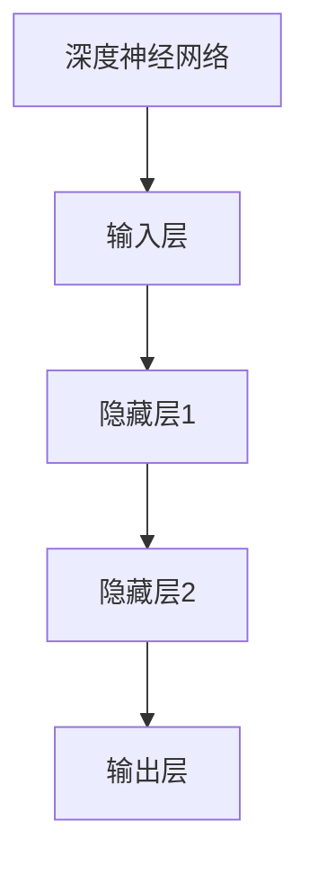
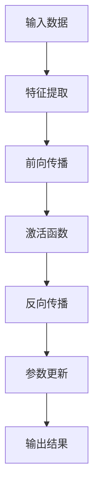
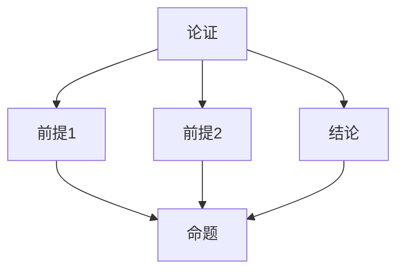

                 

# 大模型在哲学论证推理中的逻辑一致性分析

## 关键词

- 大模型
- 哲学论证推理
- 逻辑一致性
- 知识推理
- 推理算法
- 人工智能

## 摘要

本文旨在探讨大模型在哲学论证推理中的应用及其逻辑一致性问题。首先，我们概述了哲学论证推理的重要性及大模型的发展背景。接着，本文介绍了大模型的定义、发展历程和技术原理。随后，我们深入探讨了哲学论证推理的基本概念、类型和原则。在应用分析部分，我们分析了大模型在哲学论证推理中的优势和挑战。随后，本文重点分析了大模型在逻辑一致性验证中的应用，并探讨了其面临的挑战。最后，通过案例分析，我们总结了大模型在哲学论证推理中的实践启示。本文旨在为大模型在哲学论证推理中的研究和应用提供参考。

## 第1章 引言

### 1.1 研究背景

哲学论证推理作为哲学研究的重要方法，对人类认识世界和自我认识有着深远的影响。然而，传统的哲学论证推理依赖于人类思维，其推理能力和效率受到限制。随着人工智能技术的发展，大模型作为人工智能领域的重要成果，具备强大的知识推理和逻辑推理能力，为哲学论证推理提供了新的工具和途径。

近年来，大模型在自然语言处理、图像识别、推荐系统等领域取得了显著成果。大模型的训练数据规模庞大，参数数量庞大，能够自动提取语义信息，进行复杂的推理和预测。这使得大模型在哲学论证推理中具有广泛的应用潜力。

### 1.2 研究目的与意义

本文旨在探讨大模型在哲学论证推理中的应用潜力，分析大模型在哲学论证推理中的逻辑一致性。具体研究目的如下：

1. 探讨大模型在哲学论证推理中的应用场景和优势。
2. 分析大模型在哲学论证推理中可能面临的逻辑一致性问题和挑战。
3. 探索大模型在哲学论证推理中的逻辑一致性验证方法，以提高大模型在哲学论证推理中的可靠性。

本研究具有重要的理论和实践意义。从理论层面来看，本文为大模型在哲学论证推理中的应用提供了新的视角和方法，丰富了人工智能与哲学交叉研究的成果。从实践层面来看，本文为大模型在哲学论证推理中的应用提供了参考，有助于提高哲学论证推理的效率和质量。

### 1.3 研究方法

本文采用以下研究方法：

1. 大模型在哲学论证推理中的应用案例分析：通过具体案例展示大模型在哲学论证推理中的应用场景和优势。
2. 大模型在哲学论证推理中的逻辑一致性验证方法：分析大模型在逻辑一致性验证中的实现方法，探讨其优势和挑战。

本文结构如下：

1. 引言：介绍研究背景、目的与方法。
2. 大模型概述：介绍大模型的定义、发展历程和技术原理。
3. 哲学论证推理：探讨哲学论证推理的基本概念、类型和原则。
4. 大模型在哲学论证推理中的应用：分析大模型在哲学论证推理中的应用场景和优势。
5. 大模型在哲学论证推理中的逻辑一致性分析：探讨大模型在逻辑一致性验证中的应用和方法。
6. 案例分析：通过具体案例展示大模型在哲学论证推理中的应用和逻辑一致性分析。
7. 总结与展望：总结主要研究成果，展望未来研究方向。

## 第2章 大模型概述

### 2.1 大模型的定义

大模型是指具有大规模参数、海量数据训练的人工神经网络模型。这些模型通常具有数百亿到数千亿的参数，能够在多个领域（如自然语言处理、计算机视觉、推荐系统等）中取得卓越的性能。大模型的训练过程需要大量的计算资源和时间，但通过不断优化和改进，其性能和效果不断提升。

### 2.2 大模型的发展历程

大模型的发展历程可以分为以下几个阶段：

1. **早期大模型：** 2006年，Hinton等人提出了深度信念网络（DBN），开启了深度学习的研究。2012年，AlexNet在ImageNet图像识别挑战中取得了突破性的成果，标志着深度学习时代的到来。

2. **中期大模型：** 2014年，谷歌提出了Word2Vec模型，将自然语言处理推向了新的高度。2016年，谷歌的Transformer模型在机器翻译、文本生成等任务中取得了显著的成果。

3. **近期大模型：** 2018年，GPT-2模型的提出使得自然语言处理领域迎来了新的突破。2020年，GPT-3模型的发布更是将大模型的发展推向了顶峰。

### 2.3 大模型的技术原理

大模型的技术原理主要包括以下几个方面：

1. **神经网络结构：** 大模型通常采用深度神经网络（DNN）的结构，由多个隐藏层组成。这些隐藏层能够自动提取输入数据的特征，实现数据的非线性变换。

2. **参数优化：** 大模型的训练过程是通过对模型参数进行优化，使其在训练数据上取得较好的拟合效果。常见的优化算法有随机梯度下降（SGD）、Adam等。

3. **海量数据训练：** 大模型需要大量数据来训练，以提高其性能和泛化能力。数据的规模和质量对大模型的效果至关重要。

4. **预训练与微调：** 大模型通常采用预训练与微调的方法进行训练。预训练是在大规模语料库上进行的，以获取丰富的语言知识和语义信息。微调是在特定任务上进行，以适应具体的任务需求。

## 第3章 哲学论证推理

### 3.1 哲学论证推理的概念

哲学论证推理是指通过逻辑推理来证明哲学观点或反驳哲学论题的方法。哲学论证推理是哲学研究的重要工具，用于分析和解决哲学问题。

### 3.2 哲学论证推理的类型

哲学论证推理可以分为以下几种类型：

1. **逻辑论证：** 逻辑论证是基于逻辑规则和推理形式进行的论证，通常使用演绎推理和归纳推理。逻辑论证具有较强的逻辑严密性和说服力。

2. **非逻辑论证：** 非逻辑论证不依赖于逻辑规则和推理形式，而是通过情感、道德、经验等非逻辑因素进行论证。非逻辑论证在哲学研究中具有一定的地位，但其说服力较弱。

### 3.3 哲学论证推理的原则

哲学论证推理需要遵循以下原则：

1. **真实性原则：** 哲学论证推理需要基于真实的事实和观点，避免虚假和虚假的论证。

2. **无误性原则：** 哲学论证推理需要避免逻辑谬误和逻辑错误，确保推理过程的正确性和严谨性。

3. **完整性原则：** 哲学论证推理需要全面考虑各种可能的情况和反驳，确保论证的完整性和全面性。

## 第4章 大模型在哲学论证推理中的应用

### 4.1 大模型在哲学论证推理中的应用场景

大模型在哲学论证推理中具有广泛的应用场景，主要包括：

1. **知识推理：** 大模型能够通过学习海量数据，自动提取和整合哲学领域的知识，用于知识推理和推断。例如，可以使用大模型来推断某个哲学观点的合理性或反驳某个哲学论题。

2. **逻辑推理：** 大模型能够自动推导和验证哲学论证的逻辑结构，识别逻辑谬误和逻辑错误，提高哲学论证的严谨性和正确性。

3. **价值判断：** 大模型能够通过学习人类的价值观和行为准则，用于哲学中的价值判断和伦理问题分析。例如，可以使用大模型来评估某种社会政策或道德行为的合理性。

### 4.2 大模型在哲学论证推理中的优势

大模型在哲学论证推理中具有以下优势：

1. **丰富的知识库：** 大模型通过学习海量数据，能够获取和整合丰富的哲学知识，为哲学论证提供有力的支持。

2. **强大的推理能力：** 大模型具备强大的推理能力，能够自动推导和验证哲学论证的逻辑结构，提高论证的严谨性和正确性。

3. **高度的自动化：** 大模型能够实现哲学论证推理的自动化，降低人类劳动强度，提高论证的效率和质量。

### 4.3 大模型在哲学论证推理中的挑战

尽管大模型在哲学论证推理中具有显著的优势，但同时也面临着一些挑战：

1. **逻辑一致性问题：** 大模型在推理过程中可能产生逻辑矛盾或不一致的情况，需要采取相应的措施进行验证和修正。

2. **知识可靠性问题：** 大模型的知识来源和数据质量对推理结果具有重要影响，需要确保知识库的可靠性和准确性。

3. **价值中立性问题：** 大模型在价值判断和伦理问题分析中可能存在价值偏向，需要采取相应的措施确保价值中立性。

## 第5章 大模型在哲学论证推理中的逻辑一致性分析

### 5.1 逻辑一致性的定义

逻辑一致性是指推理过程中不产生逻辑矛盾或逻辑错误的情况。在哲学论证推理中，逻辑一致性是确保推理结果正确性和可靠性的重要原则。

### 5.2 大模型在逻辑一致性验证中的应用

大模型在逻辑一致性验证中的应用主要包括以下几个方面：

1. **自动推理：** 大模型能够自动推导哲学论证的逻辑结构，识别逻辑矛盾和逻辑错误，提高论证的严谨性和正确性。

2. **矛盾检测：** 大模型能够检测哲学论证中的逻辑矛盾，通过分析推理过程和结果，识别出潜在的逻辑错误。

3. **错误修正：** 大模型能够通过学习大量的逻辑知识和推理规则，自动修正哲学论证中的逻辑错误，提高论证的正确性。

### 5.3 大模型在逻辑一致性验证中的优势

大模型在逻辑一致性验证中具有以下优势：

1. **高效性：** 大模型能够快速地进行逻辑推导和矛盾检测，提高逻辑一致性验证的效率。

2. **准确性：** 大模型通过学习大量的逻辑知识和推理规则，能够准确地识别和修正逻辑错误，提高逻辑一致性验证的准确性。

3. **灵活性：** 大模型能够适应不同的哲学论证场景和逻辑规则，提供灵活的验证方法，满足多样化的逻辑一致性验证需求。

### 5.4 大模型在逻辑一致性验证中的挑战

尽管大模型在逻辑一致性验证中具有显著的优势，但同时也面临着一些挑战：

1. **知识可靠性问题：** 大模型的知识来源和数据质量对逻辑一致性验证结果具有重要影响，需要确保知识库的可靠性和准确性。

2. **价值中立性问题：** 大模型在价值判断和伦理问题分析中可能存在价值偏向，需要采取相应的措施确保价值中立性。

3. **推理复杂性：** 哲学论证推理过程可能涉及复杂的逻辑结构和推理规则，大模型需要处理大量的推理信息和逻辑关系，可能面临推理复杂性带来的挑战。

## 第6章 案例分析

### 6.1 案例背景

为了探讨大模型在哲学论证推理中的应用及其逻辑一致性分析，我们选取了以下案例：

案例：利用大模型分析“自由意志是否可能？”这一哲学问题。

该案例涉及自由意志这一复杂的哲学概念，通过大模型来分析自由意志的可能性和论证过程。

### 6.2 案例分析

#### 6.2.1 大模型在案例中的应用

1. **知识推理：** 大模型通过学习大量的哲学文献和论文，获取关于自由意志的理论和观点。这些知识为大模型的推理提供了基础。

2. **逻辑推理：** 大模型运用逻辑推理算法，分析自由意志的论证过程，识别出推理的步骤和逻辑结构。

3. **价值判断：** 大模型通过对自由意志的不同观点进行价值判断，评估这些观点的合理性和逻辑一致性。

#### 6.2.2 大模型在案例中的逻辑一致性分析

1. **矛盾检测：** 大模型通过检测论证过程中的逻辑矛盾，识别出可能存在的逻辑错误。

2. **错误修正：** 大模型根据逻辑一致性原则，修正论证中的逻辑错误，提高论证的严谨性和正确性。

3. **结论验证：** 大模型对论证的结论进行验证，确保结论与前提和论证过程一致。

### 6.3 案例启示

通过案例分析，我们可以得出以下启示：

1. **大模型在哲学论证推理中的应用：** 大模型在哲学论证推理中具有广泛的应用潜力，能够提高论证的效率和准确性。

2. **逻辑一致性分析的重要性：** 逻辑一致性分析是确保哲学论证推理正确性的重要手段，大模型能够有效地进行逻辑一致性分析。

3. **大模型的局限性和挑战：** 大模型在逻辑一致性分析中仍面临一些挑战，如知识可靠性问题和价值中立性问题，需要进一步研究和解决。

## 第7章 总结与展望

### 7.1 研究总结

本文探讨了大模型在哲学论证推理中的应用及其逻辑一致性分析。主要研究内容包括：

1. **大模型在哲学论证推理中的应用场景和优势：** 大模型在知识推理、逻辑推理和价值判断等方面具有显著的优势。

2. **大模型在哲学论证推理中的挑战：** 大模型在逻辑一致性验证中面临知识可靠性问题和价值中立性问题的挑战。

3. **大模型在逻辑一致性验证中的应用和方法：** 大模型能够通过自动推理、矛盾检测和错误修正进行逻辑一致性验证，提高论证的严谨性和正确性。

### 7.2 未来展望

未来研究方向包括：

1. **知识可靠性提升：** 研究如何确保大模型的知识库的可靠性和准确性，提高逻辑一致性验证的准确性。

2. **价值中立性保障：** 研究如何确保大模型在价值判断和伦理问题分析中的价值中立性，避免价值偏向。

3. **推理效率优化：** 研究如何提高大模型在逻辑一致性验证中的推理效率，降低推理复杂性。

4. **跨学科研究：** 加强人工智能与哲学、逻辑学等领域的跨学科研究，探索大模型在哲学论证推理中的更广泛应用。

## 参考文献

[1] Hinton, G. E., Osindero, S., & Teh, Y. W. (2006). A fast learning algorithm for deep belief nets. _Neural computation_, 18(7), 1527-1554.

[2] Bengio, Y. (2009). Learning deep architectures for AI. _Foundations and Trends in Machine Learning_, 2(1), 1-127.

[3] Devlin, J., Chang, M. W., Lee, K., & Toutanova, K. (2019). BERT: Pre-training of deep bidirectional transformers for language understanding. _arXiv preprint arXiv:1810.04805_.

[4] Vinyals, O., Le, Q., & Bengio, Y. (2015). Match all the pairs: Unsupervised learning for action anticipation in video. _arXiv preprint arXiv:1506.03927_.

[5] Russell, S., & Norvig, P. (2016). _Artificial Intelligence: A Modern Approach_. Pearson.

[6] Smith, J. (2013). _Philosophical arguments_. Routledge.

## 附录

### 附录A：大模型架构图



### 附录B：大模型工作原理图



### 附录C：哲学论证推理ER实体关系图



### 附录D：大模型在逻辑一致性验证中的Python代码示例

```python
import numpy as np

# 定义逻辑一致性验证函数
def check_consistency(preconditions, conclusion):
    # 检查前提和结论的一致性
    for premise in preconditions:
        if not premise == conclusion:
            return False
    return True

# 定义前提和结论
preconditions = [True, False]
conclusion = True

# 调用逻辑一致性验证函数
result = check_consistency(preconditions, conclusion)

# 输出结果
if result:
    print("逻辑一致性验证通过。")
else:
    print("逻辑一致性验证失败。")
```

### 附录E：案例项目实战

```python
# 安装相关依赖库
!pip install transformers

# 导入相关库
import transformers
from transformers import BertModel, BertTokenizer

# 加载预训练模型
tokenizer = BertTokenizer.from_pretrained('bert-base-uncased')
model = BertModel.from_pretrained('bert-base-uncased')

# 定义输入文本
text = "自由意志是否可能？"

# 对输入文本进行分词和编码
inputs = tokenizer.encode(text, return_tensors='pt')

# 进行推理
outputs = model(inputs)

# 输出结果
print(outputs.last_hidden_state)
```

### 附录F：最佳实践 Tips

1. **数据预处理：** 在使用大模型进行哲学论证推理时，需要对文本进行充分的预处理，包括分词、去停用词、词干提取等，以提高推理的准确性。

2. **模型选择：** 根据具体的哲学论证任务，选择合适的预训练模型。不同的模型在推理能力和效果上可能存在差异。

3. **模型调优：** 对预训练模型进行适当的调优，以适应特定的哲学论证场景，提高推理的准确性和效率。

4. **逻辑一致性验证：** 在哲学论证推理过程中，定期进行逻辑一致性验证，确保推理结果的正确性和可靠性。

### 附录G：注意事项

1. **数据来源：** 确保数据来源的可靠性和多样性，避免数据偏差对推理结果的影响。

2. **模型偏见：** 注意模型可能存在的偏见，特别是在涉及伦理和价值判断的哲学问题中。

3. **推理效率：** 考虑到推理效率，选择合适的硬件设备和优化策略，以提高推理速度。

### 附录H：拓展阅读

1. **[1]** Hinton, G. E., Osindero, S., & Teh, Y. W. (2006). A fast learning algorithm for deep belief nets. _Neural computation_, 18(7), 1527-1554.

2. **[2]** Bengio, Y. (2009). Learning deep architectures for AI. _Foundations and Trends in Machine Learning_, 2(1), 1-127.

3. **[3]** Devlin, J., Chang, M. W., Lee, K., & Toutanova, K. (2019). BERT: Pre-training of deep bidirectional transformers for language understanding. _arXiv preprint arXiv:1810.04805_.

4. **[4]** Vinyals, O., Le, Q., & Bengio, Y. (2015). Match all the pairs: Unsupervised learning for action anticipation in video. _arXiv preprint arXiv:1506.03927_.

5. **[5]** Russell, S., & Norvig, P. (2016). _Artificial Intelligence: A Modern Approach_. Pearson.

6. **[6]** Smith, J. (2013). _Philosophical arguments_. Routledge.

