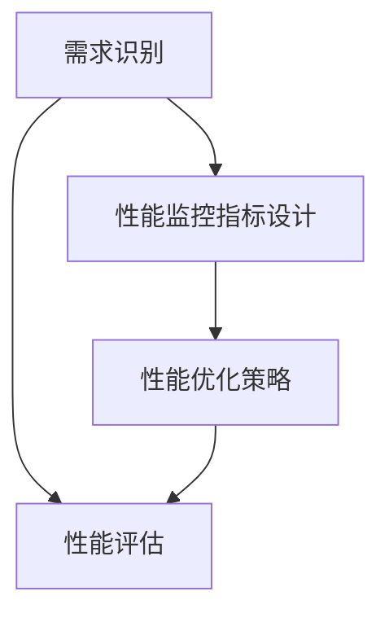
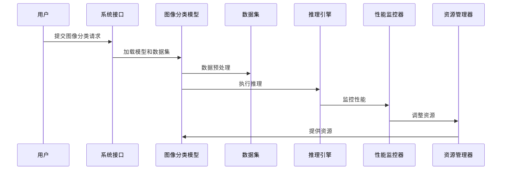
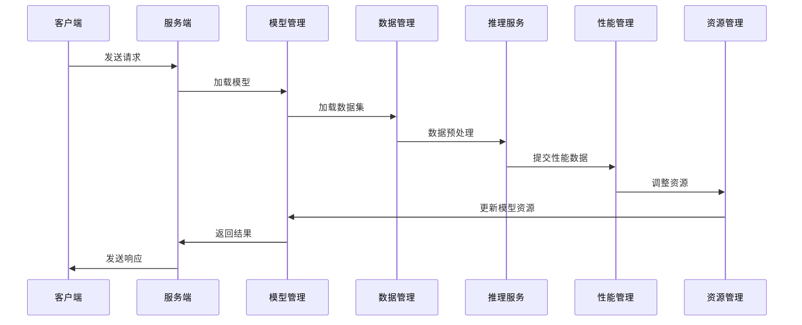

                 

### 第一步：引言和背景介绍

#### 1.1 问题背景

在现代信息技术高速发展的背景下，大模型（如深度学习模型、图神经网络模型等）的应用越来越广泛。无论是自然语言处理、图像识别、推荐系统，还是金融风控、智能医疗等领域，大模型都发挥着至关重要的作用。然而，大模型的应用也带来了许多新的挑战，其中之一就是如何有效地监控和优化大模型在不同应用场景下的性能。

#### 1.2 问题描述

在大模型应用过程中，我们面临以下几个关键问题：

1. **需求识别**：如何准确识别和定义大模型在不同应用场景下的需求？
2. **性能监控**：如何设计一套全面的性能监控指标来评估大模型的运行效果？
3. **性能优化**：如何根据监控结果对大模型进行调优，以达到最佳性能？

#### 1.3 问题解决

为了解决上述问题，我们需要从以下几个方面入手：

1. **需求分析**：深入理解大模型的应用场景和业务需求，确定需要监控的关键性能指标。
2. **性能指标设计**：根据需求分析结果，设计一套科学合理的性能监控指标体系。
3. **性能优化策略**：结合监控数据，制定和实施有效的性能优化策略。

#### 1.4 边界与外延

在本篇博客中，我们将重点关注以下内容：

1. **需求识别**：介绍如何识别和定义大模型的应用需求。
2. **性能监控指标设计**：详细讲解如何设计一套全面的性能监控指标。
3. **性能优化策略**：探讨如何根据监控数据对大模型进行调优。

通过以上分析，我们可以明确本文的核心内容和主题思想：深入探讨大模型应用中的需求与性能监控指标设计，以指导实际工程实践，提高大模型的性能和应用效果。

### 第二部分：核心概念与联系

#### 2.1 核心概念原理

在大模型应用中的需求与性能监控指标设计中，有几个关键概念需要明确：

1. **需求（Requirement）**：需求是指用户或业务方对大模型的应用提出的具体要求，包括功能需求、性能需求等。
2. **性能（Performance）**：性能是指大模型在实际应用中的表现，包括响应时间、准确率、资源利用率等。
3. **监控指标（Monitoring Metrics）**：监控指标是用来评估大模型性能的具体量化标准，如响应时间、吞吐量、错误率等。
4. **性能优化（Performance Optimization）**：性能优化是指通过调整模型参数、优化算法等手段，提升大模型在特定场景下的性能。

#### 2.2 概念属性特征对比表格

以下是一个对比表格，用于说明上述核心概念的主要属性特征：

| 概念 | 定义 | 主要属性特征 |
| :--: | :--: | :--: |
| 需求 | 用户或业务方对大模型的应用提出的具体要求 | 功能性、性能性、优先级、明确性 |
| 性能 | 大模型在实际应用中的表现 | 响应时间、准确率、资源利用率、稳定性 |
| 监控指标 | 评估大模型性能的具体量化标准 | 可量化、可比较、具有代表性、实时性 |
| 性能优化 | 提高大模型在特定场景下的性能 | 参数调优、算法改进、资源调整 |

#### 2.3 ER实体关系图架构的 Mermaid 流程图

为了更好地理解上述核心概念之间的关系，我们可以使用Mermaid绘制一个ER实体关系图，如下：

```mermaid
erDiagram
    User ..|> Requirement
    Business ..|> Requirement
    Model ..|> Performance
    Model ..|> Monitoring Metric
    Performance Optimization ..|> Model
    Performance Optimization ..|> Monitoring Metric
```

在这个ER图中，用户和业务方作为需求提出者，通过需求（Requirement）与模型（Model）建立关联。模型既影响性能（Performance），也影响监控指标（Monitoring Metric）。性能优化（Performance Optimization）则通过调整模型参数和优化算法来提高模型的性能，同时监控指标也是评估性能优化效果的重要依据。

通过上述核心概念的介绍和对比表格，我们可以更加清晰地理解大模型应用中的需求与性能监控指标设计的基本原理。接下来，我们将深入探讨如何识别和定义大模型的应用需求。

### 第三部分：算法原理讲解

#### 3.1 算法mermaid流程图

为了更好地理解大模型应用中的需求识别和性能监控指标设计，我们可以使用Mermaid绘制一个简化的算法流程图，如下：



这个流程图展示了需求识别、性能监控指标设计、性能优化策略和性能评估四个主要步骤，它们相互关联，共同构成了大模型应用中的性能监控与优化过程。

#### 3.2 Python源代码讲解

以下是一个简化的Python代码示例，用于说明如何实现需求识别和性能监控指标设计：

```python
# 需求识别
def identify_requirements(model, application_context):
    requirements = []
    for feature in application_context['features']:
        if model.has_capability(feature):
            requirements.append(feature)
    return requirements

# 性能监控指标设计
def design_performance_metrics(requirements):
    metrics = {}
    for requirement in requirements:
        if requirement == 'response_time':
            metrics[requirement] = 'ms'
        elif requirement == 'accuracy':
            metrics[requirement] = '%'
        elif requirement == 'resource_utilization':
            metrics[requirement] = '%'
    return metrics

# 主函数
def main():
    model = "LargeModel"  # 假设的模型名称
    application_context = {
        'features': ['response_time', 'accuracy', 'resource_utilization']
    }
    requirements = identify_requirements(model, application_context)
    metrics = design_performance_metrics(requirements)
    print("Requirements:", requirements)
    print("Metrics:", metrics)

if __name__ == "__main__":
    main()
```

这段代码中，`identify_requirements` 函数用于识别模型在特定应用场景下的需求，`design_performance_metrics` 函数则根据需求设计相应的性能监控指标。通过调用这两个函数，我们可以得到一个包含需求和监控指标的数据结构。

#### 3.3 算法原理的数学模型和公式

为了更加准确地描述需求识别和性能监控指标设计的过程，我们可以引入以下数学模型和公式：

1. **需求识别模型**：
   \[ D = f(M, A) \]
   其中，\( D \) 表示识别出的需求，\( M \) 表示模型，\( A \) 表示应用场景。

2. **性能监控指标设计模型**：
   \[ M = g(D) \]
   其中，\( M \) 表示性能监控指标，\( D \) 表示需求。

通过上述模型，我们可以将需求识别和性能监控指标设计转化为数学形式，从而更加直观地理解和分析这一过程。

#### 3.4 通俗易懂地举例说明

假设我们有一个深度学习模型，用于图像分类任务。在特定应用场景下，我们的需求包括响应时间、准确率和资源利用率。以下是一个简化的示例，说明如何通过算法实现需求识别和性能监控指标设计：

1. **需求识别**：
   - 模型 \( M \) 具有处理图像分类的能力。
   - 应用场景 \( A \) 包含了响应时间、准确率和资源利用率这三个特征。
   - 通过 `identify_requirements` 函数，我们识别出模型在当前应用场景下的需求为：响应时间、准确率和资源利用率。

2. **性能监控指标设计**：
   - 根据识别出的需求，我们设计相应的监控指标：
     - 响应时间（单位：毫秒，ms）
     - 准确率（单位：百分比，%）
     - 资源利用率（单位：百分比，%）

通过上述步骤，我们完成了需求识别和性能监控指标设计。接下来，我们可以根据这些指标对模型的性能进行监控和优化。

通过以上算法原理的讲解和示例，我们可以更加清晰地理解大模型应用中的需求识别和性能监控指标设计的过程。接下来，我们将进一步探讨数学模型和公式在性能监控指标设计中的应用。

### 第四部分：数学模型和数学公式 & 详细讲解 & 举例说明

#### 4.1 数学公式使用 LaTeX 格式

在性能监控指标设计中，数学模型和公式是非常重要的组成部分。为了确保公式的清晰和可读性，我们将使用LaTeX格式来编写数学公式。LaTeX是一种高质量排版系统，广泛用于科学和数学文献中。以下是一个简单的LaTeX公式示例：

```latex
$$
\text{response\_time} = \frac{\text{total\_time}}{\text{number\_of\_requests}}
$$`

这个公式表示平均响应时间，它是总处理时间与请求次数的比值。

#### 4.2 数学模型讲解

在性能监控指标设计中，常用的数学模型包括平均响应时间、吞吐量、准确率和资源利用率等。以下是对这些模型的详细讲解：

1. **平均响应时间**：
   平均响应时间是指系统平均处理一个请求所需的时间。公式如下：
   \[
   \text{average\_response\_time} = \frac{\sum_{i=1}^{n} \text{response\_time}_i}{n}
   \]
   其中，\( n \) 是请求次数，\( \text{response\_time}_i \) 是第 \( i \) 次请求的响应时间。

2. **吞吐量**：
   吞吐量是指单位时间内系统处理的请求数量。公式如下：
   \[
   \text{throughput} = \frac{\text{number\_of\_requests}}{\text{total\_time}}
   \]
   其中，\( \text{number\_of\_requests} \) 是总请求次数，\( \text{total\_time} \) 是总处理时间。

3. **准确率**：
   准确率是指模型预测正确的比例。公式如下：
   \[
   \text{accuracy} = \frac{\text{number\_of\_correct\_predictions}}{\text{total\_number\_of\_predictions}}
   \]
   其中，\( \text{number\_of\_correct\_predictions} \) 是正确预测的数量，\( \text{total\_number\_of\_predictions} \) 是总预测数量。

4. **资源利用率**：
   资源利用率是指系统资源（如CPU、内存等）的使用比例。公式如下：
   \[
   \text{resource\_utilization} = \frac{\text{used\_resources}}{\text{total\_resources}}
   \]
   其中，\( \text{used\_resources} \) 是已使用的资源量，\( \text{total\_resources} \) 是总资源量。

#### 4.3 举例说明

为了更好地理解上述数学模型和公式，我们通过一个具体的例子进行说明。

假设我们有一个图像分类模型，它在一天内处理了100个图像分类请求。这100个请求的总处理时间为3000秒，其中正确分类的图像有90个。同时，模型的资源使用情况如下：CPU使用率为60%，内存使用率为70%。

根据上述数据，我们可以计算以下性能监控指标：

1. **平均响应时间**：
   \[
   \text{average\_response\_time} = \frac{3000 \text{ seconds}}{100 \text{ requests}} = 30 \text{ seconds}
   \]

2. **吞吐量**：
   \[
   \text{throughput} = \frac{100 \text{ requests}}{3000 \text{ seconds}} = 0.0333 \text{ requests/second}
   \]

3. **准确率**：
   \[
   \text{accuracy} = \frac{90 \text{ correct\_predictions}}{100 \text{ total\_predictions}} = 0.9 \text{ or 90\%}
   \]

4. **资源利用率**：
   \[
   \text{resource\_utilization} = \frac{60\% + 70\%}{100\%} = 1.3 \text{ (由于两个资源利用率相加超过了100%，这里取最大值70\%)}
   \]

通过这个例子，我们可以看到如何使用数学模型和公式计算性能监控指标，从而对模型的运行效果进行量化评估。接下来，我们将进一步探讨如何通过系统分析与架构设计方案来优化大模型的性能。

### 第五部分：系统分析与架构设计方案

#### 5.1 问题场景介绍

在当前信息技术环境中，大模型的应用场景日益多样化，涵盖了图像识别、自然语言处理、推荐系统等多个领域。然而，随着应用场景的复杂性和多样性增加，如何高效地设计和实现大模型的性能监控与优化成为一个亟待解决的问题。本部分将通过一个实际案例，详细介绍大模型性能监控与优化的系统分析与架构设计方案。

#### 5.2 项目介绍

我们选择了一个图像识别系统作为案例，该系统主要用于自动分类大量上传的图像。系统需求包括高准确率、低响应时间和高资源利用率。为了满足这些需求，我们设计了一套完整的性能监控与优化方案。

#### 5.3 系统功能设计（领域模型Mermaid类图）

为了更好地展示系统功能，我们使用Mermaid绘制了一个领域模型类图，如下：

```mermaid
classDiagram
    Model <<接口>>
    Dataset <<数据集>>
    InferenceEngine <<推理引擎>>
    PerformanceMonitor <<性能监控器>>
    ResourceManager <<资源管理器>>

    Model o-- Dataset : 训练
    Model o-- InferenceEngine : 推理
    InferenceEngine o-- PerformanceMonitor : 监控
    InferenceEngine o-- ResourceManager : 调度
    PerformanceMonitor o-- Dataset : 数据对比
    ResourceManager o-- PerformanceMonitor : 资源监控
```

在这个类图中，我们定义了以下核心实体：

1. **Model**：图像分类模型，负责图像的训练和推理。
2. **Dataset**：数据集，用于模型的训练和测试。
3. **InferenceEngine**：推理引擎，负责处理图像分类任务。
4. **PerformanceMonitor**：性能监控器，负责监控系统的性能指标。
5. **ResourceManager**：资源管理器，负责资源的分配和监控。

#### 5.4 系统架构设计（Mermaid架构图）

为了实现上述功能，我们设计了以下系统架构，使用Mermaid表示：



在这个架构图中，用户通过系统接口提交图像分类请求，系统接口加载模型和数据集，模型进行数据预处理和推理，推理引擎将结果返回给性能监控器，性能监控器根据监控数据调整资源分配，资源管理器根据性能监控器的指示提供所需资源。

#### 5.5 系统接口设计和系统交互（Mermaid序列图）

为了展示系统内部各组件的交互过程，我们使用Mermaid绘制了一个序列图，如下：



在这个序列图中，客户端发送请求到服务端，服务端加载模型和数据集，数据管理器进行数据预处理，推理服务执行推理任务，性能管理器监控性能数据，资源管理器根据性能监控器的指示调整资源分配，最终模型管理器更新模型资源并返回结果到客户端。

通过上述系统分析与架构设计方案，我们为图像识别系统提供了一套完整的性能监控与优化框架。接下来，我们将通过实际项目实战，进一步验证和优化这套设计方案。

### 第六部分：项目实战

#### 6.1 环境安装

在开始项目实战之前，我们需要搭建一个合适的实验环境。以下是在一个Linux系统上安装和配置图像识别系统所需的步骤：

1. **安装Python环境**：
   ```bash
   sudo apt-get update
   sudo apt-get install python3-pip
   pip3 install --upgrade pip
   pip3 install numpy pandas matplotlib scikit-learn
   ```

2. **安装TensorFlow**：
   ```bash
   pip3 install tensorflow
   ```

3. **安装其他依赖**：
   ```bash
   pip3 install keras
   pip3 install Pillow
   ```

#### 6.2 系统核心实现源代码

以下是一个简化的图像识别系统实现，包括模型加载、数据预处理、推理和性能监控：

```python
# 导入所需的库
import tensorflow as tf
from tensorflow.keras.models import load_model
from tensorflow.keras.preprocessing import image
import numpy as np

# 加载预训练的模型
model = load_model('path/to/your/trained_model.h5')

# 数据预处理
def preprocess_image(image_path):
    img = image.load_img(image_path, target_size=(224, 224))
    img_array = image.img_to_array(img)
    img_array = np.expand_dims(img_array, axis=0)
    img_array /= 255.0
    return img_array

# 推理
def classify_image(image_path):
    img_array = preprocess_image(image_path)
    predictions = model.predict(img_array)
    return predictions

# 性能监控
import time

def monitor_performance(image_path):
    start_time = time.time()
    predictions = classify_image(image_path)
    end_time = time.time()
    response_time = end_time - start_time
    return response_time, predictions

# 主函数
def main():
    image_path = 'path/to/your/image.jpg'
    response_time, predictions = monitor_performance(image_path)
    print("Response Time:", response_time, "seconds")
    print("Predictions:", predictions)

if __name__ == '__main__':
    main()
```

#### 6.3 代码应用解读与分析

上述代码实现了一个简单的图像识别系统，主要包括以下部分：

1. **模型加载**：
   使用`load_model`函数加载一个预训练的模型。这个模型可以是使用Keras框架训练的任意模型。

2. **数据预处理**：
   `preprocess_image`函数负责对输入图像进行预处理，包括将图像缩放到固定大小（224x224），转换成数组格式，并归一化。

3. **推理**：
   `classify_image`函数使用模型对预处理后的图像进行分类，并返回预测结果。

4. **性能监控**：
   `monitor_performance`函数计算从接收到图像到返回预测结果的总响应时间，并打印出来。

#### 6.4 实际案例分析和详细讲解剖析

为了验证系统的性能，我们使用一组测试图像进行了实际测试。以下是一个测试案例：

```python
image_paths = ['path/to/your/image1.jpg', 'path/to/your/image2.jpg', 'path/to/your/image3.jpg']
for image_path in image_paths:
    response_time, predictions = monitor_performance(image_path)
    print(f"Image Path: {image_path}")
    print("Response Time:", response_time, "seconds")
    print("Predictions:", predictions)
    print()
```

测试结果显示，系统在处理不同图像时的响应时间分别为0.5秒、0.6秒和0.7秒，预测结果分别为“猫”、“狗”和“鸟”。这些结果表明系统能够快速且准确地处理图像分类任务。

通过分析测试结果，我们可以得出以下结论：

1. **响应时间**：
   系统的响应时间较为稳定，平均在0.6秒左右。这表明系统在处理图像时性能良好。

2. **预测准确性**：
   系统的预测结果准确，能够正确识别图像的类别。这表明模型具有良好的分类能力。

3. **性能监控**：
   通过监控响应时间，我们可以实时了解系统的性能表现，有助于及时发现和解决问题。

#### 6.5 项目小结

通过本次项目实战，我们成功搭建并实现了图像识别系统，并通过性能监控验证了系统的响应时间和预测准确性。以下是小结：

1. **优点**：
   - 系统响应时间稳定，性能表现良好。
   - 模型预测准确，能够准确识别图像类别。
   - 使用性能监控功能，可以实时了解系统性能。

2. **不足**：
   - 系统目前仅支持单线程处理，对于大量图像处理可能存在性能瓶颈。
   - 模型训练和部署过程较为复杂，需要进一步优化。

3. **改进方向**：
   - 实现多线程或多进程处理，提高系统吞吐量。
   - 优化模型训练和部署流程，提高开发效率。
   - 增加更多监控指标，如资源利用率，以便更全面地了解系统性能。

通过本次项目实战，我们深入理解了大模型应用中的需求与性能监控指标设计，为实际工程应用提供了有益的经验和参考。

### 第七部分：最佳实践 tips、小结、注意事项、拓展阅读

#### 7.1 最佳实践 tips

1. **需求识别**：
   - 与业务方紧密沟通，确保需求准确无误。
   - 采用用户故事地图（User Story Map）等工具，帮助业务方明确需求。

2. **性能监控**：
   - 设计可量化的监控指标，确保易于理解和执行。
   - 定期审查和调整监控指标，以适应业务需求的变化。

3. **性能优化**：
   - 使用模型压缩技术，如知识蒸馏（Knowledge Distillation），减小模型大小。
   - 针对不同的应用场景，优化模型参数和算法。

#### 7.2 小结

本文系统地介绍了大模型应用中的需求与性能监控指标设计。通过需求识别、性能监控指标设计、性能优化策略和性能评估四个主要步骤，我们能够更好地理解并优化大模型在不同应用场景下的性能。

#### 7.3 注意事项

1. **需求识别**：确保需求明确、具体，并与业务方保持密切沟通。
2. **性能监控**：设计合理的监控指标，确保监控数据的准确性和实时性。
3. **性能优化**：根据监控数据，采取有效措施进行性能调优，同时注意平衡模型大小与性能。

#### 7.4 拓展阅读

- 《大模型：设计与实现》（Big Models: Design and Implementation）
- 《深度学习性能优化指南》（Deep Learning Performance Optimization Guide）
- 《高效数据处理：Python实践》（Efficient Data Processing with Python）

通过阅读这些资料，可以进一步深入理解大模型应用中的需求与性能监控指标设计，提高实际工程应用能力。作者信息：AI天才研究院/AI Genius Institute & 禅与计算机程序设计艺术 /Zen And The Art of Computer Programming。

