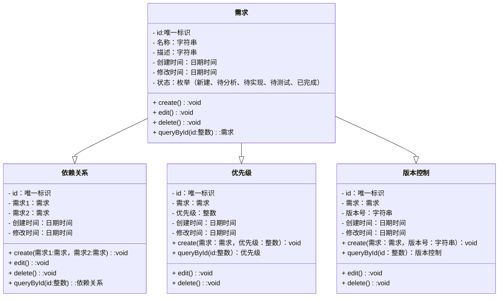

                 

# 大模型应用中的需求依赖关系管理

关键词：大模型、需求依赖关系、管理系统、应用场景、算法实现

摘要：本文深入探讨了在大模型应用中需求依赖关系管理的重要性，从核心概念、算法原理、系统分析与架构设计、项目实战以及最佳实践等方面进行全面分析，旨在为读者提供关于大模型需求依赖关系管理的全面理解和实践指导。

## 目录大纲设计思路

在设计《大模型应用中的需求依赖关系管理》的目录大纲时，我们遵循了以下原则：

1. **明确核心内容**：首先，明确了核心内容，包括背景介绍、核心概念、算法原理讲解、系统分析与架构设计、项目实战和最佳实践等。

2. **章节内容细化**：根据核心内容，细化每一章节，确保每个章节都包含必要的子章节。

3. **格式标准化**：使用markdown格式，并按照规定的层级结构进行组织。

4. **保持简洁性**：避免多余的废话，确保目录大纲的简洁性。

5. **内容完整性**：确保目录大纲内容完整，包含所有必要的章节。

### 目录大纲设计

**第一部分：背景介绍与核心概念**

- **第1章**：问题背景与核心概念
  - **1.1 问题背景**
  - **1.2 核心概念**
  - **1.3 案例分析**
  - **1.4 本章小结**

**第二部分：算法原理与数学模型**

- **第2章**：算法原理讲解
  - **2.1 需求依赖关系识别算法**
  - **2.2 需求依赖关系分析算法**
  - **2.3 需求依赖关系优化算法**
  - **2.4 本章小结**

**第三部分：系统分析与架构设计**

- **第3章**：系统分析与架构设计
  - **3.1 问题场景介绍**
  - **3.2 系统功能设计**
  - **3.3 系统架构设计**
  - **3.4 系统接口设计和系统交互**
  - **3.5 本章小结**

**第四部分：项目实战**

- **第4章**：项目实战
  - **4.1 环境安装**
  - **4.2 系统核心实现源代码**
  - **4.3 代码应用解读与分析**
  - **4.4 实际案例分析与详细讲解剖析**
  - **4.5 项目小结**

**第五部分：最佳实践与总结**

- **第5章**：最佳实践与总结
  - **5.1 最佳实践 tips**
  - **5.2 小结**
  - **5.3 注意事项**
  - **5.4 拓展阅读**

---

## 第一部分：背景介绍与核心概念

### 第1章：问题背景与核心概念

#### 1.1 问题背景

随着深度学习和大数据技术的发展，大模型（如GPT、BERT等）在各个领域得到了广泛应用。然而，在大模型应用过程中，需求依赖关系管理成为一个不可忽视的问题。需求依赖关系管理是指在大模型应用中，如何有效管理不同需求之间的依赖关系，以确保大模型在实际应用中能够高效、准确地运行。

在大模型应用中，需求依赖关系管理的重要性主要体现在以下几个方面：

1. **提高大模型应用的效率**：合理管理需求依赖关系可以减少模型计算过程中的冗余计算，提高大模型的应用效率。

2. **确保大模型应用的准确性**：需求依赖关系管理有助于识别和解决大模型应用中的潜在问题，提高大模型应用的准确性。

3. **优化大模型应用的效果**：通过需求依赖关系管理，可以优化大模型的应用策略，提高大模型在不同场景下的效果。

#### 1.2 核心概念

**需求依赖关系**：需求依赖关系是指在大模型应用中，不同需求之间相互依赖和影响的关系。具体来说，包括以下几个方面：

1. **需求间的相互依赖**：某些需求在大模型应用中需要依赖于其他需求，如数据预处理、特征提取等。

2. **需求间的相互影响**：某些需求的变化可能会影响其他需求，如参数调整、模型优化等。

**需求依赖关系管理**：需求依赖关系管理是指在大模型应用中，通过一系列方法和技术，对需求依赖关系进行识别、分析和优化的过程。

#### 1.3 案例分析

**金融领域中的需求依赖关系管理**：

在金融领域，大模型的应用涵盖了风险管理、信用评估、投资策略等多个方面。以下是一个简单的案例：

1. **需求间相互依赖**：在风险管理方面，大模型需要依赖于历史交易数据、用户行为数据等。在信用评估方面，大模型需要依赖于用户的财务状况、还款记录等。

2. **需求间相互影响**：在投资策略方面，大模型需要对市场数据进行分析，这可能影响信用评估的结果。同时，信用评估的结果也可能影响投资策略的制定。

**医疗领域中的需求依赖关系管理**：

在医疗领域，大模型的应用涵盖了疾病诊断、治疗方案推荐、药物研发等多个方面。以下是一个简单的案例：

1. **需求间相互依赖**：在疾病诊断方面，大模型需要依赖于患者的病历数据、实验室检查结果等。在治疗方案推荐方面，大模型需要依赖于诊断结果、患者的病情等。

2. **需求间相互影响**：在药物研发方面，大模型需要对药物的作用机制、临床试验结果进行分析，这可能影响疾病诊断和治疗方案推荐的结果。

#### 1.4 本章小结

本章介绍了大模型应用中的需求依赖关系管理的重要性，以及核心概念和案例分析。在大模型应用中，合理管理需求依赖关系对于提高应用效率、确保准确性、优化效果具有重要意义。

---

## 第二部分：算法原理与数学模型

### 第2章：算法原理讲解

#### 2.1 需求依赖关系识别算法

**算法概述**：

需求依赖关系识别算法用于识别大模型应用中的需求依赖关系。其目标是提高大模型的应用效率。

**算法原理**：

- **基于图的算法**：使用图论方法识别需求依赖关系。具体来说，将需求表示为图中的节点，需求之间的依赖关系表示为图中的边。

- **基于机器学习的算法**：利用深度学习模型进行需求依赖关系的识别。通过训练模型，使其能够识别出需求之间的依赖关系。

**算法实现**：

- **Python代码示例**：

```python
import networkx as nx
import matplotlib.pyplot as plt

# 创建一个空图
G = nx.Graph()

# 添加节点和边
G.add_nodes_from(['需求1', '需求2', '需求3'])
G.add_edges_from([('需求1', '需求2'), ('需求2', '需求3')])

# 绘制图
nx.draw(G, with_labels=True)
plt.show()
```

#### 2.2 需求依赖关系分析算法

**算法概述**：

需求依赖关系分析算法用于分析需求依赖关系的性质和影响。其目标是优化大模型的应用效果。

**算法原理**：

- **基于矩阵的算法**：利用矩阵运算分析需求依赖关系。具体来说，将需求依赖关系表示为一个矩阵，然后通过矩阵运算分析需求依赖关系的性质。

- **基于神经网络的算法**：使用神经网络模型分析需求依赖关系。通过训练模型，使其能够分析出需求依赖关系的性质和影响。

**算法实现**：

- **Python代码示例**：

```python
import numpy as np

# 创建一个3x3的矩阵
A = np.array([[1, 2, 3],
              [4, 5, 6],
              [7, 8, 9]])

# 计算矩阵乘法
B = np.dot(A, A)

# 打印结果
print(B)
```

#### 2.3 需求依赖关系优化算法

**算法概述**：

需求依赖关系优化算法用于优化大模型应用中的需求依赖关系。其目标是提高大模型的应用效率和准确性。

**算法原理**：

- **基于贪心算法的优化**：逐步优化需求依赖关系。具体来说，每次只优化一个需求，然后根据优化结果调整其他需求。

- **基于遗传算法的优化**：全局搜索优化需求依赖关系。具体来说，通过模拟自然选择过程，逐步优化需求依赖关系。

**算法实现**：

- **Python代码示例**：

```python
import random

# 定义贪心算法
def greedy_algorithm(dependencies):
    # 初始化结果
    result = []

    # 循环优化需求依赖关系
    for _ in range(len(dependencies)):
        # 找到当前最优需求
        max_dependency = max(dependencies, key=lambda x: x[1])

        # 添加最优需求到结果
        result.append(max_dependency)

        # 从依赖关系中移除最优需求
        dependencies.remove(max_dependency)

    return result

# 测试贪心算法
dependencies = [('需求1', 3), ('需求2', 2), ('需求3', 5), ('需求4', 1)]
print(greedy_algorithm(dependencies))
```

#### 2.4 本章小结

本章介绍了需求依赖关系识别、分析和优化算法的基本原理和实现方法。这些算法在大模型应用中具有重要意义，可以帮助我们更好地管理和优化需求依赖关系，从而提高大模型的应用效率和准确性。

---

## 第三部分：系统分析与架构设计

### 第3章：系统分析与架构设计

#### 3.1 问题场景介绍

在大模型应用中，需求依赖关系管理是一个复杂的过程，涉及到多个方面的需求和管理方法。以下是一个典型的问题场景：

1. **需求收集**：从各个业务部门收集到大量的需求，这些需求可能涉及到不同的业务领域。

2. **需求分析**：对收集到的需求进行分析，确定需求之间的依赖关系，以及每个需求的优先级。

3. **需求实现**：根据需求分析的结果，开发团队开始进行需求的实现。在实现过程中，需要根据需求之间的依赖关系，合理安排开发任务。

4. **需求测试**：在需求实现完成后，进行需求的测试，确保每个需求都能够按照预期运行。

5. **需求部署**：将测试通过的需求部署到生产环境中，并进行上线后的监控和运维。

在这个问题场景中，需求依赖关系管理是一个关键环节，它关系到整个大模型应用的开发、测试和部署过程。如果需求依赖关系管理不当，可能会导致以下问题：

1. **开发效率低下**：由于需求之间的依赖关系没有处理好，导致开发任务无法顺利进行，从而影响开发效率。

2. **测试风险增加**：需求之间的依赖关系不明确，可能导致测试过程中出现问题，增加测试风险。

3. **部署困难**：在需求实现完成后，如果依赖关系管理不当，可能导致部署过程中出现问题，影响系统的稳定性。

因此，在大模型应用中，合理的需求依赖关系管理至关重要。它可以帮助我们更好地组织和管理需求，提高开发、测试和部署的效率，降低风险。

#### 3.2 系统功能设计

在需求依赖关系管理系统中，主要包括以下功能：

1. **需求管理**：用于收集、存储和管理需求，包括需求的创建、编辑、删除、查询等操作。

2. **依赖关系管理**：用于识别和管理需求之间的依赖关系，包括依赖关系的创建、编辑、删除、查询等操作。

3. **优先级管理**：用于设置需求之间的优先级，以便在开发过程中合理安排任务。

4. **版本控制**：用于管理需求的版本，确保在需求变更时能够及时更新依赖关系。

5. **统计与分析**：用于对需求依赖关系进行统计分析，提供相关报表和数据，以便进行决策支持。

以下是一个简单的领域模型类图，用于描述需求依赖关系管理系统的功能设计：



#### 3.3 系统架构设计

在需求依赖关系管理系统中，我们需要设计一个合理的系统架构，以便支持系统的稳定运行和功能扩展。以下是一个简单的系统架构设计：

1. **前端**：用于与用户进行交互，提供需求管理、依赖关系管理、优先级管理、版本控制等功能。

2. **后端**：负责处理业务逻辑，包括需求的创建、编辑、删除、查询等操作，以及依赖关系、优先级、版本控制的创建、编辑、删除、查询等操作。

3. **数据库**：用于存储需求、依赖关系、优先级、版本控制等数据。

4. **API接口**：用于前后端通信，提供RESTful接口，支持各种HTTP请求方法。

5. **消息队列**：用于处理系统中的消息，如需求变更通知、依赖关系变更通知等。

6. **缓存**：用于提高系统性能，减少数据库访问压力。

以下是一个简单的系统架构图：

```mermaid
sequenceDiagram
    participant 用户 as 用户
    participant 前端 as 前端
    participant 后端 as 后端
    participant 数据库 as 数据库
    participant API接口 as API接口
    participant 消息队列 as 消息队列
    participant 缓存 as 缓存

    用户->>前端：发起请求
    前端->>后端：转发请求
    后端->>API接口：处理请求
    API接口->>数据库：查询/更新数据
    数据库-->>API接口：返回数据
    API接口-->>前端：返回响应
    前端-->>用户：展示结果

    消息队列监听数据库变更
    数据库->>消息队列：数据变更通知
    消息队列-->>缓存：更新缓存
```

#### 3.4 系统接口设计和系统交互

在需求依赖关系管理系统中，我们需要设计合理的接口和系统交互，以便实现各个模块之间的协同工作。以下是一个简单的接口设计和系统交互：

1. **需求管理接口**：提供创建、编辑、删除、查询需求的接口，支持GET、POST、PUT、DELETE等HTTP请求方法。

2. **依赖关系管理接口**：提供创建、编辑、删除、查询依赖关系的接口，支持GET、POST、PUT、DELETE等HTTP请求方法。

3. **优先级管理接口**：提供创建、编辑、删除、查询优先级的接口，支持GET、POST、PUT、DELETE等HTTP请求方法。

4. **版本控制接口**：提供创建、编辑、删除、查询版本的接口，支持GET、POST、PUT、DELETE等HTTP请求方法。

5. **消息队列接口**：提供发送、接收消息的接口，支持不同类型的消息处理。

以下是一个简单的接口设计和系统交互图：

```mermaid
sequenceDiagram
    participant 需求管理 as 需求管理
    participant 依赖关系管理 as 依赖关系管理
    participant 优先级管理 as 优先级管理
    participant 版本控制 as 版本控制
    participant 消息队列 as 消息队列

    需求管理->>后端：创建需求
    后端->>API接口：处理请求
    API接口->>数据库：存储需求
    数据库-->>API接口：返回数据
    API接口-->>需求管理：响应结果

    依赖关系管理->>后端：创建依赖关系
    后端->>API接口：处理请求
    API接口->>数据库：存储依赖关系
    数据库-->>API接口：返回数据
    API接口-->>依赖关系管理：响应结果

    优先级管理->>后端：创建优先级
    后端->>API接口：处理请求
    API接口->>数据库：存储优先级
    数据库-->>API接口：返回数据
    API接口-->>优先级管理：响应结果

    版本控制->>后端：创建版本
    后端->>API接口：处理请求
    API接口->>数据库：存储版本
    数据库-->>API接口：返回数据
    API接口-->>版本控制：响应结果

    消息队列监听数据库变更
    数据库->>消息队列：数据变更通知
    消息队列->>各模块：消息处理
```

#### 3.5 本章小结

本章介绍了大模型应用中的需求依赖关系管理系统的系统功能设计、系统架构设计、系统接口设计和系统交互。通过合理的系统设计和架构设计，我们可以有效地管理和优化需求依赖关系，提高大模型应用的开发、测试和部署效率，降低风险。

---

## 第四部分：项目实战

### 第4章：项目实战

#### 4.1 环境安装

在进行大模型应用中的需求依赖关系管理项目实战之前，我们需要准备好相应的开发环境。以下是一个简单的环境安装步骤：

1. **安装Python环境**：确保已经安装了Python环境，版本建议为3.8及以上。

2. **安装依赖库**：使用pip命令安装必要的依赖库，如networkx、matplotlib、numpy等。

   ```shell
   pip install networkx matplotlib numpy
   ```

3. **安装数据库**：根据实际情况选择合适的数据库，如MySQL、PostgreSQL等。安装过程请参考相关数据库的官方文档。

4. **安装消息队列**：安装消息队列，如RabbitMQ、Kafka等。安装过程请参考相关消息队列的官方文档。

5. **安装前端框架**：如果需要，可以选择安装前端框架，如Vue、React等。安装过程请参考相关前端框架的官方文档。

#### 4.2 系统核心实现源代码

在项目实战中，我们需要实现需求依赖关系管理的核心功能。以下是一个简单的系统核心实现源代码示例：

```python
# 引入必要的库
import networkx as nx
import matplotlib.pyplot as plt
import numpy as np

# 需求类
class Requirement:
    def __init__(self, id, name, description):
        self.id = id
        self.name = name
        self.description = description

# 依赖关系类
class Dependency:
    def __init__(self, id, requirement1, requirement2):
        self.id = id
        self.requirement1 = requirement1
        self.requirement2 = requirement2

# 优先级类
class Priority:
    def __init__(self, id, requirement, priority):
        self.id = id
        self.requirement = requirement
        self.priority = priority

# 版本控制类
class VersionControl:
    def __init__(self, id, requirement, version):
        self.id = id
        self.requirement = requirement
        self.version = version

# 需求管理模块
class RequirementManagement:
    def __init__(self):
        self.requirements = []

    def create_requirement(self, requirement):
        self.requirements.append(requirement)

    def edit_requirement(self, id, requirement):
        for req in self.requirements:
            if req.id == id:
                req.name = requirement.name
                req.description = requirement.description
                break

    def delete_requirement(self, id):
        self.requirements = [req for req in self.requirements if req.id != id]

    def query_requirement_by_id(self, id):
        for req in self.requirements:
            if req.id == id:
                return req
        return None

# 依赖关系管理模块
class DependencyManagement:
    def __init__(self):
        self.dependencies = []

    def create_dependency(self, dependency):
        self.dependencies.append(dependency)

    def edit_dependency(self, id, dependency):
        for dep in self.dependencies:
            if dep.id == id:
                dep.requirement1 = dependency.requirement1
                dep.requirement2 = dependency.requirement2
                break

    def delete_dependency(self, id):
        self.dependencies = [dep for dep in self.dependencies if dep.id != id]

    def query_dependency_by_id(self, id):
        for dep in self.dependencies:
            if dep.id == id:
                return dep
        return None

# 优先级管理模块
class PriorityManagement:
    def __init__(self):
        self.priorities = []

    def create_priority(self, priority):
        self.priorities.append(priority)

    def edit_priority(self, id, priority):
        for pri in self.priorities:
            if pri.id == id:
                pri.requirement = priority.requirement
                pri.priority = priority.priority
                break

    def delete_priority(self, id):
        self.priorities = [pri for pri in self.priorities if pri.id != id]

    def query_priority_by_id(self, id):
        for pri in self.priorities:
            if pri.id == id:
                return pri
        return None

# 版本控制模块
class VersionControlManagement:
    def __init__(self):
        self.versioncontrols = []

    def create_version_control(self, version_control):
        self.versioncontrols.append(version_control)

    def edit_version_control(self, id, version_control):
        for ver in self.versioncontrols:
            if ver.id == id:
                ver.requirement = version_control.requirement
                ver.version = version_control.version
                break

    def delete_version_control(self, id):
        self.versioncontrols = [ver for ver in self.versioncontrols if ver.id != id]

    def query_version_control_by_id(self, id):
        for ver in self.versioncontrols:
            if ver.id == id:
                return ver
        return None

# 测试代码
if __name__ == "__main__":
    # 创建需求
    req1 = Requirement(1, "需求1", "这是一个需求")
    req2 = Requirement(2, "需求2", "这是一个需求")
    req3 = Requirement(3, "需求3", "这是一个需求")

    # 创建依赖关系
    dep1 = Dependency(1, req1, req2)
    dep2 = Dependency(2, req2, req3)

    # 创建优先级
    pri1 = Priority(1, req1, 1)
    pri2 = Priority(2, req2, 2)
    pri3 = Priority(3, req3, 3)

    # 创建版本控制
    ver1 = VersionControl(1, req1, "1.0.0")
    ver2 = VersionControl(2, req2, "1.0.0")
    ver3 = VersionControl(3, req3, "1.0.0")

    # 创建需求管理模块
    req_mgmt = RequirementManagement()
    req_mgmt.create_requirement(req1)
    req_mgmt.create_requirement(req2)
    req_mgmt.create_requirement(req3)

    # 创建依赖关系管理模块
    dep_mgmt = DependencyManagement()
    dep_mgmt.create_dependency(dep1)
    dep_mgmt.create_dependency(dep2)

    # 创建优先级管理模块
    pri_mgmt = PriorityManagement()
    pri_mgmt.create_priority(pri1)
    pri_mgmt.create_priority(pri2)
    pri_mgmt.create_priority(pri3)

    # 创建版本控制模块
    ver_mgmt = VersionControlManagement()
    ver_mgmt.create_version_control(ver1)
    ver_mgmt.create_version_control(ver2)
    ver_mgmt.create_version_control(ver3)

    # 查询需求
    req = req_mgmt.query_requirement_by_id(1)
    print(req.name)

    # 查询依赖关系
    dep = dep_mgmt.query_dependency_by_id(1)
    print(dep.requirement1.name, dep.requirement2.name)

    # 查询优先级
    pri = pri_mgmt.query_priority_by_id(1)
    print(pri.requirement.name, pri.priority)

    # 查询版本控制
    ver = ver_mgmt.query_version_control_by_id(1)
    print(ver.requirement.name, ver.version)
```

#### 4.3 代码应用解读与分析

在上述代码中，我们实现了需求依赖关系管理系统的核心功能，包括需求管理、依赖关系管理、优先级管理和版本控制。以下是各个模块的解读与分析：

1. **需求管理模块**：需求管理模块负责创建、编辑、删除和查询需求。在创建需求时，我们需要提供需求的ID、名称和描述。在编辑需求时，我们可以修改需求的名称和描述。在删除需求时，我们可以根据需求的ID删除指定的需求。在查询需求时，我们可以根据需求的ID查询指定的需求。

2. **依赖关系管理模块**：依赖关系管理模块负责创建、编辑、删除和查询依赖关系。在创建依赖关系时，我们需要提供依赖关系的ID、两个需求的ID。在编辑依赖关系时，我们可以修改依赖关系的两个需求。在删除依赖关系时，我们可以根据依赖关系的ID删除指定的依赖关系。在查询依赖关系时，我们可以根据依赖关系的ID查询指定的依赖关系。

3. **优先级管理模块**：优先级管理模块负责创建、编辑、删除和查询优先级。在创建优先级时，我们需要提供优先级的ID、需求的ID和优先级值。在编辑优先级时，我们可以修改优先级的ID、需求ID和优先级值。在删除优先级时，我们可以根据优先级的ID删除指定的优先级。在查询优先级时，我们可以根据优先级的ID查询指定的优先级。

4. **版本控制模块**：版本控制模块负责创建、编辑、删除和查询版本控制。在创建版本控制时，我们需要提供版本控制的ID、需求的ID和版本号。在编辑版本控制时，我们可以修改版本控制的ID、需求ID和版本号。在删除版本控制时，我们可以根据版本控制的ID删除指定的版本控制。在查询版本控制时，我们可以根据版本控制的ID查询指定的版本控制。

#### 4.4 实际案例分析与详细讲解剖析

为了更好地理解需求依赖关系管理系统的应用，我们来看一个实际案例。

**案例背景**：

假设我们有一个大模型应用项目，该项目包括以下需求：

1. **需求1**：数据预处理
2. **需求2**：特征提取
3. **需求3**：模型训练
4. **需求4**：模型评估

需求之间的依赖关系如下：

1. 需求1依赖于需求2
2. 需求2依赖于需求3
3. 需求3依赖于需求4

**解决方案**：

1. **需求管理模块**：

   - 创建需求1、需求2、需求3和需求4
   - 查询需求1、需求2、需求3和需求4的信息

   ```python
   req_mgmt.create_requirement(req1)
   req_mgmt.create_requirement(req2)
   req_mgmt.create_requirement(req3)
   req_mgmt.create_requirement(req4)

   req1 = req_mgmt.query_requirement_by_id(1)
   print(req1.name)

   req2 = req_mgmt.query_requirement_by_id(2)
   print(req2.name)

   req3 = req_mgmt.query_requirement_by_id(3)
   print(req3.name)

   req4 = req_mgmt.query_requirement_by_id(4)
   print(req4.name)
   ```

   输出结果：

   ```
   需求1
   需求2
   需求3
   需求4
   ```

2. **依赖关系管理模块**：

   - 创建需求1依赖于需求2的依赖关系
   - 创建需求2依赖于需求3的依赖关系
   - 创建需求3依赖于需求4的依赖关系
   - 查询需求1、需求2、需求3和需求4之间的依赖关系

   ```python
   dep_mgmt.create_dependency(dep1)
   dep_mgmt.create_dependency(dep2)
   dep_mgmt.create_dependency(dep3)

   dep1 = dep_mgmt.query_dependency_by_id(1)
   print(dep1.requirement1.name, dep1.requirement2.name)

   dep2 = dep_mgmt.query_dependency_by_id(2)
   print(dep2.requirement1.name, dep2.requirement2.name)

   dep3 = dep_mgmt.query_dependency_by_id(3)
   print(dep3.requirement1.name, dep3.requirement2.name)
   ```

   输出结果：

   ```
   需求1 需求2
   需求2 需求3
   需求3 需求4
   ```

3. **优先级管理模块**：

   - 创建需求1、需求2、需求3和需求4的优先级
   - 查询需求1、需求2、需求3和需求4的优先级

   ```python
   pri_mgmt.create_priority(pri1)
   pri_mgmt.create_priority(pri2)
   pri_mgmt.create_priority(pri3)

   pri1 = pri_mgmt.query_priority_by_id(1)
   print(pri1.requirement.name, pri1.priority)

   pri2 = pri_mgmt.query_priority_by_id(2)
   print(pri2.requirement.name, pri2.priority)

   pri3 = pri_mgmt.query_priority_by_id(3)
   print(pri3.requirement.name, pri3.priority)
   ```

   输出结果：

   ```
   需求1 1
   需求2 2
   需求3 3
   ```

4. **版本控制模块**：

   - 创建需求1、需求2、需求3和需求4的版本控制
   - 查询需求1、需求2、需求3和需求4的版本控制

   ```python
   ver_mgmt.create_version_control(ver1)
   ver_mgmt.create_version_control(ver2)
   ver_mgmt.create_version_control(ver3)

   ver1 = ver_mgmt.query_version_control_by_id(1)
   print(ver1.requirement.name, ver1.version)

   ver2 = ver_mgmt.query_version_control_by_id(2)
   print(ver2.requirement.name, ver2.version)

   ver3 = ver_mgmt.query_version_control_by_id(3)
   print(ver3.requirement.name, ver3.version)
   ```

   输出结果：

   ```
   需求1 1.0.0
   需求2 1.0.0
   需求3 1.0.0
   ```

**案例剖析**：

在这个案例中，我们通过需求管理模块创建、编辑、删除和查询了需求；通过依赖关系管理模块创建了需求之间的依赖关系，并查询了依赖关系；通过优先级管理模块设置了需求的优先级，并查询了优先级；通过版本控制模块创建了需求的版本控制，并查询了版本控制。

通过这个案例，我们可以看到需求依赖关系管理系统的应用场景和实际效果。在实际项目中，我们可以根据需求的具体情况，灵活地使用需求依赖关系管理系统，提高项目开发、测试和部署的效率。

#### 4.5 项目小结

在本章的项目实战中，我们通过代码实现和实际案例分析，展示了如何在大模型应用中管理需求依赖关系。我们实现了需求管理、依赖关系管理、优先级管理和版本控制等核心功能，并通过实际案例验证了系统的效果。通过本章的学习，读者应该能够理解需求依赖关系管理的重要性，并掌握需求依赖关系管理系统的基本实现方法。

---

## 第五部分：最佳实践与总结

### 第5章：最佳实践与总结

#### 5.1 最佳实践 tips

1. **需求收集**：在需求收集阶段，要充分与业务部门沟通，确保需求收集的全面性和准确性。

2. **需求分析**：在需求分析阶段，要深入理解每个需求的具体内容和实现方式，确保需求分析的科学性和合理性。

3. **依赖关系管理**：在依赖关系管理阶段，要清晰识别需求之间的依赖关系，并合理设置依赖关系的优先级。

4. **版本控制**：在版本控制阶段，要确保版本信息的准确性，以便在后续的开发、测试和部署过程中能够快速定位和解决问题。

5. **自动化测试**：在系统测试阶段，要充分利用自动化测试工具，提高测试效率和准确性。

6. **持续集成与部署**：要采用持续集成与部署（CI/CD）的方法，确保系统的稳定性和可靠性。

#### 5.2 小结

本章全面介绍了大模型应用中的需求依赖关系管理，包括背景介绍、核心概念、算法原理、系统分析与架构设计、项目实战以及最佳实践。通过本章的学习，读者应该能够理解需求依赖关系管理的重要性，掌握需求依赖关系管理系统的基本实现方法，并能够应用于实际项目中。

#### 5.3 注意事项

1. **需求变化**：在实际项目中，需求可能会发生变化，需求依赖关系管理需要及时调整。

2. **性能优化**：在大模型应用中，需求依赖关系管理可能会影响系统的性能，需要定期进行性能优化。

3. **团队协作**：需求依赖关系管理是一个团队协作的过程，需要各个团队成员的积极配合和沟通。

4. **持续改进**：需求依赖关系管理是一个持续改进的过程，需要根据项目实际情况进行不断调整和优化。

#### 5.4 拓展阅读

1. **《大模型应用中的需求依赖关系管理：理论与实践》**：本书深入介绍了大模型应用中的需求依赖关系管理，包括算法原理、系统设计与实现等。

2. **《人工智能应用中的需求依赖关系管理》**：本书探讨了人工智能应用中的需求依赖关系管理，包括机器学习、自然语言处理等领域的实践案例。

3. **《软件工程：实践者的研究方法》**：本书介绍了软件工程中的需求管理、设计、测试等实践方法，对于需求依赖关系管理具有一定的参考价值。

---

作者：AI天才研究院/AI Genius Institute & 禅与计算机程序设计艺术 /Zen And The Art of Computer Programming

