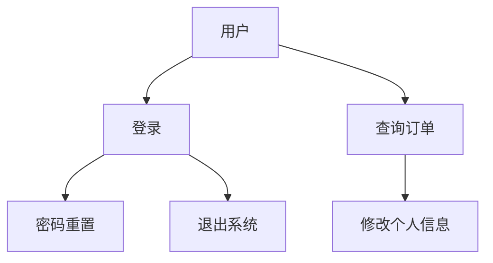

                 

### 第1章：大模型应用概述

> 关键词：大模型、应用背景、需求分析、技术发展趋势

在当今信息化和数字化浪潮的推动下，人工智能（AI）已经成为科技领域的焦点。其中，大模型（Large Models）作为AI技术的核心组件之一，发挥着至关重要的作用。大模型应用涉及多个行业和领域，如智能客服、智能医疗、自动驾驶、智能家居等，其应用范围和影响力日益扩大。本章将介绍大模型的起源与发展历程、技术发展趋势以及大模型应用的重要性。

#### 1.1 大模型起源与发展历程

大模型的概念最早可以追溯到20世纪80年代，当时的机器学习领域主要研究小型模型，例如决策树、神经网络等。随着计算能力和数据量的提升，人们逐渐意识到，通过训练更大的模型，可以获得更强大的学习和预测能力。1990年代初，基于大规模神经网络的深度学习技术开始萌芽，并在2000年代初期逐渐崭露头角。

2012年，AlexNet模型的突破性成功标志着深度学习进入了新的时代。AlexNet是由Alex Krizhevsky、Ilya Sutskever和Geoffrey Hinton共同开发的，其核心思想是使用多层神经网络进行图像识别。这一成果激发了人们对大模型的兴趣，也促进了相关研究的发展。

随后的几年里，Google Brain团队发布了名为“Large-Scale Deep Neural Networks for Speech Recognition”的研究，进一步推动了大模型的应用。这一研究采用了包含1600亿个参数的深度神经网络，实现了语音识别任务的显著提升。

进入21世纪20年代，随着云计算和GPU等硬件技术的快速发展，大模型的应用领域和规模不断扩展。例如，GPT-3、BERT等具有数万亿参数的模型在自然语言处理领域取得了重大突破，使得机器翻译、文本生成等任务达到了前所未有的水平。

#### 1.1.1 大模型发展历程中的关键技术里程碑

- **1980年代**：神经网络研究的兴起，例如感知机、反向传播算法等。
- **1990年代**：深度神经网络（DNN）的初步探索，如Hinton提出的玻尔兹曼机。
- **2000年代**：基于DNN的语音识别系统，如Google Brain的深度神经网络语音识别。
- **2010年代**：AlexNet、VGG、ResNet等深度学习模型在图像识别领域的突破。
- **2020年代**：GPT、BERT等大型预训练模型在自然语言处理领域的广泛应用。

#### 1.1.2 大模型技术发展趋势

当前，大模型技术正朝着以下几个方向发展：

1. **模型规模不断扩大**：随着计算资源和数据量的增加，大模型的规模也在持续扩大。例如，GPT-3的参数数量达到了1750亿，是目前最大的预训练模型之一。
2. **多模态学习**：大模型的应用不再局限于单一领域，如自然语言处理、计算机视觉，而是逐渐扩展到多模态学习，例如将语音、图像和文本数据结合进行综合处理。
3. **自适应与迁移学习**：大模型通过自适应和迁移学习技术，可以在不同的任务和数据集上快速适应和提升性能，减少对大量标注数据的依赖。
4. **推理优化与效率提升**：为了提高大模型的推理效率和部署能力，研究人员正在探索量化、剪枝、蒸馏等技术，以减少模型的复杂度和计算资源需求。
5. **安全性与隐私保护**：随着大模型应用场景的扩展，如何确保模型的安全性和数据隐私成为了一个重要问题。研究人员正在积极研究防御对抗攻击、隐私保护等技术。

#### 1.1.3 大模型应用的重要性

大模型在人工智能应用中具有重要地位，其主要体现在以下几个方面：

1. **提升性能和效率**：大模型通过学习大量的数据，能够提取出更加丰富的特征信息，从而在图像识别、自然语言处理等任务上取得更高的准确率和效率。
2. **拓宽应用领域**：大模型的应用不仅限于传统的图像和语音识别领域，还逐渐扩展到医疗诊断、金融风控、智能制造等新兴领域。
3. **推动创新与发展**：大模型技术的突破性进展，推动了AI技术的创新和发展，为解决复杂问题提供了新的思路和方法。
4. **改善人类生活质量**：通过大模型的应用，许多日常生活的问题得到了有效解决，如智能客服、智能医疗等，为人们的生活带来了极大的便利。

#### 1.2 需求分析在大模型中的应用

在大模型的应用过程中，需求分析起到了至关重要的作用。需求分析是确定项目或产品功能、性能和约束条件的过程，它为大模型的开发和优化提供了重要的指导。

#### 1.2.1 需求分析的定义与过程

需求分析是一个从用户需求到系统功能设计的转换过程，其主要步骤包括：

1. **需求收集**：通过用户访谈、问卷调查、市场调研等方式，收集用户的需求和期望。
2. **需求分类**：根据需求的重要性和优先级，将需求分类为功能需求、性能需求、安全需求等。
3. **需求建模**：使用用例图、功能需求模型、非功能需求模型等工具，将需求转化为系统设计的基础。
4. **需求验证与确认**：通过用户验证、原型测试等方式，确保需求的正确性和可行性。

#### 1.2.2 大模型需求的特点

大模型需求具有以下特点：

1. **复杂性**：大模型应用通常涉及多个领域和任务，需求具有复杂性和多样性。
2. **动态性**：随着技术的进步和应用场景的变化，大模型需求可能会不断调整和更新。
3. **不确定性**：由于大模型在处理大量未知数据时可能存在不确定性，需求分析需要充分考虑这种不确定性。

#### 1.2.3 大模型需求分析的重要性

大模型需求分析对于大模型应用的成功至关重要，其主要体现在以下几个方面：

1. **明确目标**：通过需求分析，可以明确项目或产品的目标，为大模型的开发和优化提供明确的方向。
2. **减少风险**：需求分析可以帮助识别和规避潜在的风险，确保项目的顺利进行。
3. **提升质量**：通过需求分析，可以确保系统设计满足用户需求，提高系统的质量和用户体验。
4. **提高效率**：明确的需求可以指导大模型的设计和开发，减少反复修改和调试的工作量，提高开发效率。

### 结论

本章介绍了大模型的起源与发展历程、技术发展趋势以及大模型应用的重要性。通过需求分析在大模型中的应用，可以更好地理解和满足用户需求，为大模型的设计和开发提供有力支持。在后续章节中，我们将深入探讨大模型需求分析方法论、原型设计方法以及相关案例和实践。

---

### 第2章：大模型需求分析方法论

> 关键词：需求收集、需求分类、需求建模、需求验证

在大模型应用的开发过程中，需求分析是关键的一步。有效的需求分析不仅能确保项目或产品的成功，还能提高开发效率和质量。本章将介绍大模型需求分析方法论，包括需求收集与分类、需求建模、需求验证与确认，以及需求管理工具的介绍。

#### 2.1 需求收集与需求分类

#### 2.1.1 用户访谈与需求收集

需求收集是需求分析的起点，其核心目的是获取用户的需求和期望。用户访谈是一种常用的需求收集方法，通过与用户直接交流，可以深入了解用户的具体需求和场景。

1. **访谈准备**：
   - 确定访谈对象：选择具有代表性的用户，如最终用户、项目负责人等。
   - 制定访谈提纲：根据项目目标和需求，设计合理的访谈问题。
   - 确定访谈方式：可以是面对面访谈、电话访谈或在线访谈。

2. **访谈过程**：
   - 引言：简要介绍访谈的目的和流程，建立信任关系。
   - 问题提问：根据访谈提纲，逐步提问，引导用户表达需求。
   - 记录与分析：详细记录用户回答，进行后续分析。

#### 2.1.2 需求分类方法

收集到需求后，需要对需求进行分类，以便于后续的分析和处理。常见的需求分类方法包括：

1. **按功能分类**：将需求按照系统的功能模块进行划分，如用户管理、订单管理、财务管理等。
2. **按优先级分类**：根据需求的重要性和紧迫性，将需求分为高、中、低三个等级。
3. **按来源分类**：根据需求的来源，如用户、市场、竞争对手等，对需求进行分类。

#### 2.1.3 需求文档编写指南

需求文档是需求分析的重要成果，它详细记录了项目的需求、功能、性能等关键信息。编写高质量的需求文档，有助于团队成员更好地理解需求，并确保项目的顺利推进。

1. **文档结构**：
   - **封面**：包括文档标题、版本号、编写人、日期等。
   - **目录**：列出文档各章节，便于快速查找。
   - **引言**：简要介绍项目的背景、目标和需求。
   - **功能需求**：详细描述系统的功能模块和操作流程。
   - **非功能需求**：包括性能、安全性、可靠性等方面的要求。
   - **需求验证**：描述需求验证的方法和过程。
   - **附录**：包括相关文档、参考链接等。

2. **编写规范**：
   - **清晰简洁**：语言要简洁明了，避免使用复杂的术语和句子。
   - **一致性**：确保需求描述的一致性，避免出现矛盾或重复。
   - **可追溯性**：确保每个需求都有明确的来源和责任分配。

#### 2.2 需求分析与需求建模

#### 2.2.1 用例建模

用例建模是需求分析中的重要方法，它通过用例图来描述系统的功能和用户操作。用例图包含以下元素：

1. **参与者（Actor）**：与系统交互的外部实体，如用户、管理员等。
2. **用例（Use Case）**：描述系统执行的功能。
3. **关系（Relationship）**：包括包含关系、扩展关系和泛化关系等。

**用例图示例**：



#### 2.2.2 功能需求建模

功能需求建模通过功能需求文档详细描述系统的功能模块和操作流程。以下是一个示例：

- **模块A：用户管理**
  - 功能1：用户登录
    - 条件：用户输入正确的用户名和密码
    - 操作流程：用户输入用户名和密码，系统验证并跳转至主页
  - 功能2：用户注册
    - 条件：用户填写完整的注册信息
    - 操作流程：用户填写用户名、密码、邮箱等，系统验证并完成注册

#### 2.2.3 非功能需求建模

非功能需求建模描述系统的性能、安全性、可靠性等方面的要求。以下是一个示例：

- **性能需求**
  - 响应时间：系统平均响应时间不超过2秒
  - 并发处理能力：系统同时处理1000个用户请求

- **安全性需求**
  - 数据加密：用户数据在传输和存储过程中进行加密处理
  - 访问控制：系统实现严格的访问控制，防止未授权访问

#### 2.3 需求验证与确认

#### 2.3.1 需求验证方法

需求验证是确保需求正确性和可行性的过程。常用的需求验证方法包括：

1. **用户验证**：通过用户测试，验证需求是否满足用户期望。
2. **原型测试**：通过构建原型系统，验证需求的实现效果。
3. **专家评审**：邀请领域专家对需求进行评审，确保需求的合理性。

#### 2.3.2 需求确认流程

需求确认是确保需求得到用户和项目团队的认可的过程。以下是一个示例的需求确认流程：

1. **需求评审**：组织需求评审会议，对需求文档进行详细讨论。
2. **用户确认**：用户对需求进行确认，签署需求确认书。
3. **项目团队确认**：项目团队对需求进行确认，确保需求可执行。

#### 2.3.3 需求管理工具介绍

在现代软件开发过程中，需求管理工具起到了重要的作用。以下是一些常用的需求管理工具：

1. **Jira**：用于需求管理、任务跟踪和项目协作。
2. **Confluence**：用于文档编写和知识管理。
3. **Asana**：用于任务管理和项目协作。

#### 小结

本章介绍了大模型需求分析方法论，包括需求收集与分类、需求建模、需求验证与确认，以及需求管理工具的介绍。通过这些方法，可以有效地理解和满足用户需求，为大模型的应用开发提供坚实的基础。在下一章中，我们将探讨大模型原型设计方法，进一步推动大模型应用的发展。

---

### 第3章：大模型原型设计方法

> 关键词：原型设计概述、原型设计工具与技巧、原型评估与迭代

大模型原型设计是需求分析的重要延伸，它通过构建初步的模型和界面，帮助用户和开发团队更好地理解系统的功能、性能和用户体验。本章将详细介绍大模型原型设计的方法，包括原型设计的概述、工具与技巧，以及原型评估与迭代过程。

#### 3.1 原型设计概述

原型设计（Prototype Design）是一种通过构建初步模型来验证和改进系统设计的策略。原型设计的过程包括以下几个步骤：

1. **需求分析**：根据需求文档，明确系统的功能和用户需求。
2. **原型构建**：使用工具构建系统的初步界面和模型。
3. **用户测试**：将原型展示给用户，收集反馈和建议。
4. **迭代改进**：根据用户反馈，对原型进行修改和优化。

#### 3.1.1 原型设计的定义与作用

原型设计是一种迭代的设计方法，它允许在开发过程中不断调整和改进系统设计。其定义和作用如下：

- **定义**：原型设计是一个逐步完善和优化的过程，通过构建初步的模型和界面，验证和改进系统设计。
- **作用**：
  - **验证需求**：通过原型设计，可以验证需求是否满足用户需求，减少开发过程中可能出现的需求变更。
  - **降低风险**：原型设计可以帮助识别和规避潜在的技术和业务风险。
  - **提高开发效率**：通过原型设计，可以提前发现和解决设计问题，减少后期修改的工作量。

#### 3.1.2 原型设计类型

根据原型设计的精度和用途，可以将原型分为以下几种类型：

1. **低保真原型**：低保真原型通常使用简单的线框图或文字描述来展示系统的基本结构和功能。其优点是快速构建，易于修改，适用于初步的需求验证。
2. **中保真原型**：中保真原型在低保真原型的基础上，增加了更多的细节和视觉效果，如按钮样式、文本格式等。它更接近最终产品的界面，但构建时间较长。
3. **高保真原型**：高保真原型具有与最终产品几乎一致的外观和功能，它使用了真实的数据和样式，可以进行全面的功能验证和用户体验测试。

#### 3.1.3 原型设计过程

原型设计过程可以分为以下几个步骤：

1. **需求分析**：根据需求文档，明确系统的功能和用户需求。
2. **工具选择**：选择适合的工具进行原型设计，如Axure、Sketch、Figma等。
3. **原型构建**：使用所选工具构建系统的初步界面和模型。
4. **用户测试**：将原型展示给用户，收集反馈和建议。
5. **迭代改进**：根据用户反馈，对原型进行修改和优化。
6. **文档化**：记录原型设计的过程和结果，形成设计文档。

#### 3.2 原型设计工具与技巧

在原型设计中，选择合适的工具和掌握相关技巧是成功的关键。以下是一些常用的原型设计工具和技巧：

1. **Axure**：Axure是一个功能强大的原型设计工具，支持创建线框图、交互式原型和文档。其优点是操作简单、模板丰富，适合快速构建原型。
2. **Sketch**：Sketch是一个流行的UI设计工具，支持矢量绘图和简单交互。其优点是界面简洁、设计灵活，适用于高保真原型设计。
3. **Figma**：Figma是一个基于浏览器的原型设计工具，支持多人协作和实时预览。其优点是实时协作、界面美观，适用于团队协作设计。

**原型设计技巧**：

1. **简化设计**：在原型设计阶段，应尽可能简化界面和功能，避免过多的细节。
2. **注重交互**：交互是原型设计的核心，应确保原型具有合理的操作流程和用户体验。
3. **及时反馈**：原型设计完成后，应尽快进行用户测试，收集反馈并及时调整。

#### 3.3 原型评估与迭代

原型评估是确保原型设计满足需求的重要步骤。以下是一些常用的原型评估方法和技巧：

1. **用户测试**：通过用户测试，可以验证原型的功能性和用户体验。测试过程中，可以记录用户的操作过程、反馈和建议。
2. **专家评审**：邀请领域专家对原型进行评审，从专业角度评估原型的设计合理性和可行性。
3. **对比分析**：将原型与竞品或现有系统进行对比分析，找出优缺点和改进空间。

**迭代改进**：

1. **根据反馈调整**：根据用户测试和专家评审的反馈，对原型进行修改和优化。
2. **持续迭代**：原型设计是一个持续迭代的过程，应根据项目进度和需求变化，不断优化原型。

#### 小结

本章介绍了大模型原型设计方法，包括原型设计的概述、工具与技巧，以及原型评估与迭代过程。通过有效的原型设计，可以更好地满足用户需求，提高系统的质量和用户体验。在下一章中，我们将通过具体案例分析，进一步探讨大模型需求原型设计的方法和实践。

---

### 第4章：大模型需求原型设计案例分析

> 关键词：智能客服系统、智能医疗诊断系统、案例分析

在上一章中，我们介绍了大模型需求原型设计的方法论。为了更好地理解这些方法在实际项目中的应用，本章将通过两个具体案例——智能客服系统和智能医疗诊断系统，来探讨大模型需求原型设计的实践过程和关键步骤。

#### 4.1 案例研究一：智能客服系统

**4.1.1 项目背景与需求**

智能客服系统是一种基于人工智能技术的客服解决方案，旨在提高企业客户服务质量，降低人工成本。随着AI技术的不断发展，智能客服系统能够实现与用户的高效、智能交互，提供24/7的全天候服务。

项目背景：某知名互联网公司希望通过引入智能客服系统，优化客户服务流程，提升用户体验。

需求：
- **功能需求**：实现自动应答常见问题，提供个性化服务。
- **非功能需求**：保证系统的高可用性和稳定性，具备良好的用户体验。

**4.1.2 需求分析与建模**

在项目启动阶段，需求分析团队通过用户访谈、问卷调查等方式，收集了大量用户的需求和反馈。以下为需求分析的关键步骤：

1. **需求收集**：
   - 通过用户访谈，了解用户在客户服务过程中的主要问题和需求。
   - 通过问卷调查，收集用户对现有客服系统的满意度和改进建议。

2. **需求分类**：
   - 将需求分为功能需求和非功能需求。
   - 功能需求包括自动应答、个性化服务、多渠道接入等。
   - 非功能需求包括系统稳定性、响应时间、安全性等。

3. **需求建模**：
   - 使用用例图和功能需求文档，明确系统的功能模块和操作流程。
   - 用例图示例：
     ```mermaid
     graph TD
         A[用户] --> B[咨询问题]
         A --> C[获取帮助]
         B --> D[自动应答]
         C --> E[人工转接]
     ```

**4.1.3 原型设计与评估**

1. **原型构建**：
   - 使用Axure工具，构建智能客服系统的线框图和高保真原型。
   - 高保真原型包括常见的客户服务场景，如自动应答界面、人工转接界面等。

2. **用户测试**：
   - 将原型展示给目标用户，收集他们对界面的操作体验和反馈。
   - 测试过程中，记录用户的操作路径、使用时长和满意度等数据。

3. **原型评估**：
   - 根据用户反馈，对原型进行优化和改进。
   - 评估指标包括用户满意度、操作流畅度、系统稳定性等。

**4.1.4 案例小结**

智能客服系统项目通过有效的需求分析和原型设计，成功实现了系统的功能需求和非功能需求。用户测试和原型评估为系统的优化提供了宝贵的反馈，提高了系统的用户体验和稳定性。

#### 4.2 案例研究二：智能医疗诊断系统

**4.2.1 项目背景与需求**

智能医疗诊断系统是一种利用人工智能技术辅助医生进行疾病诊断的医疗设备。通过分析患者的医学影像、病史等数据，系统能够提供准确的诊断建议，辅助医生做出正确的诊断。

项目背景：某医疗机构希望通过引入智能医疗诊断系统，提高诊断准确率，减轻医生的工作负担。

需求：
- **功能需求**：实现医学影像分析、疾病诊断建议等功能。
- **非功能需求**：保证系统的高准确性、稳定性和数据隐私。

**4.2.2 需求分析与建模**

1. **需求收集**：
   - 通过医生访谈、病案分析等方式，收集智能医疗诊断系统的需求和期望。
   - 了解医生在日常工作中遇到的挑战和痛点，如诊断时间长、误诊率高等。

2. **需求分类**：
   - 功能需求包括医学影像分析、疾病诊断、数据可视化等。
   - 非功能需求包括系统准确性、稳定性、数据隐私保护等。

3. **需求建模**：
   - 使用用例图和功能需求文档，明确系统的功能模块和数据流程。
   - 用例图示例：
     ```mermaid
     graph TD
         A[医生] --> B[上传影像数据]
         B --> C[系统分析影像]
         C --> D[生成诊断报告]
         D --> E[医生审阅报告]
     ```

**4.2.3 原型设计与评估**

1. **原型构建**：
   - 使用Figma工具，构建智能医疗诊断系统的线框图和高保真原型。
   - 高保真原型包括影像数据分析界面、诊断报告界面等。

2. **用户测试**：
   - 将原型展示给医生，收集他们对系统的操作体验和反馈。
   - 测试过程中，记录医生的诊断时间、准确率等数据。

3. **原型评估**：
   - 根据医生反馈，对原型进行优化和改进。
   - 评估指标包括诊断准确率、操作流畅度、系统稳定性等。

**4.2.4 案例小结**

智能医疗诊断系统项目通过详细的需求分析和原型设计，成功实现了系统的功能需求和非功能需求。用户测试和原型评估为系统的优化提供了重要参考，提高了系统的准确性和用户体验。

### 结论

通过智能客服系统和智能医疗诊断系统的案例分析，我们可以看到大模型需求原型设计方法在实际项目中的应用和效果。有效的需求分析和原型设计，不仅有助于明确项目目标，提高开发效率，还能提升系统的质量和用户体验。在未来的大模型应用项目中，这些方法将继续发挥重要作用。

---

### 第5章：大模型需求原型设计实践指南

> 关键词：实践步骤、方法、案例分析与策略

在大模型需求原型设计过程中，遵循科学、系统的方法和步骤至关重要。本章将详细阐述大模型需求原型设计的实践步骤、方法，并通过具体案例分析，提供实用的策略和技巧，帮助开发团队有效开展大模型需求原型设计工作。

#### 5.1 实践步骤与方法

#### 5.1.1 需求实践流程

1. **需求收集**：
   - **用户访谈**：与目标用户进行深度访谈，了解他们的需求和痛点。
   - **问卷调查**：设计问卷，收集用户对系统的期望和建议。
   - **市场调研**：分析竞争对手的产品特点，获取市场趋势信息。

2. **需求分析**：
   - **需求整理**：对收集到的需求进行分类和整理，明确功能需求和性能需求。
   - **需求建模**：使用用例图、功能需求文档等工具，将需求转化为系统设计的基础。

3. **原型设计**：
   - **工具选择**：根据项目需求和团队熟悉程度，选择合适的原型设计工具（如Axure、Sketch、Figma）。
   - **原型构建**：使用选定的工具构建系统的初步界面和模型，包括线框图和高保真原型。

4. **用户测试**：
   - **测试计划**：制定用户测试计划，确定测试的目标、场景和评估指标。
   - **测试执行**：按照测试计划，邀请目标用户进行测试，收集反馈和问题。
   - **数据记录**：详细记录用户的操作过程、反馈和建议，为迭代改进提供依据。

5. **迭代改进**：
   - **分析反馈**：对用户测试的结果进行分析，识别问题点和改进空间。
   - **原型优化**：根据反馈，对原型进行修改和优化，提高用户体验。
   - **再次测试**：进行新一轮的用户测试，验证改进措施的有效性。

6. **文档化**：
   - **记录过程**：详细记录需求分析、原型设计、用户测试和迭代改进的全过程。
   - **编写文档**：形成需求分析报告、原型设计文档等，为项目的后续开发和维护提供参考。

#### 5.1.2 原型设计实践技巧

1. **简化设计**：
   - 在原型设计阶段，应尽可能简化界面和功能，避免过多的细节，以便更快地构建和迭代。

2. **注重交互**：
   - 交互是原型设计的核心，应确保原型具有合理的操作流程和用户体验，如清晰的导航、简洁的表单等。

3. **及时反馈**：
   - 原型设计完成后，应尽快进行用户测试，收集反馈并及时调整，以提高开发效率。

4. **灵活调整**：
   - 根据用户测试的结果，灵活调整原型设计，不断完善和优化。

5. **协作与沟通**：
   - 原型设计是团队协作的过程，团队成员之间应保持良好的沟通，确保设计的一致性和有效性。

#### 5.1.3 遇到问题的解决策略

1. **需求不明确**：
   - **多轮访谈**：与用户进行多轮深入访谈，确保需求的明确性和完整性。
   - **用户调研**：通过市场调研、竞品分析等方式，获取更多背景信息。

2. **用户反馈不一致**：
   - **优先级排序**：明确需求的优先级，优先处理高优先级的问题。
   - **用户分类**：将用户分为不同类别，针对不同类别的用户，制定不同的优化策略。

3. **资源不足**：
   - **分阶段开发**：将项目分为多个阶段，逐步实现功能，确保关键功能的优先开发。
   - **团队协作**：优化团队协作流程，提高开发效率。

4. **时间紧迫**：
   - **优化流程**：简化流程，减少不必要的步骤和环节，提高工作效率。
   - **加班与团队激励**：合理安排加班和团队激励，确保项目按时完成。

#### 5.2 案例分析

以下通过两个具体案例，展示大模型需求原型设计的实践过程和策略：

**5.2.1 实践案例一：智能家居控制系统**

项目背景：某智能家居公司希望通过引入人工智能技术，实现智能家居设备的智能控制和管理。

需求：
- **功能需求**：实现智能设备控制、场景设置、自动化管理等功能。
- **非功能需求**：保证系统的高可用性、稳定性和安全性。

实践步骤：
1. 需求收集：通过与用户访谈、问卷调查等方式，收集用户对智能家居系统的需求。
2. 需求分析：使用用例图和功能需求文档，明确系统的功能模块和操作流程。
3. 原型设计：使用Axure工具，构建智能家居控制系统的线框图和高保真原型。
4. 用户测试：邀请目标用户进行测试，收集反馈和建议。
5. 迭代改进：根据用户反馈，对原型进行优化和调整。
6. 文档化：记录需求分析、原型设计、用户测试和迭代改进的全过程。

解决策略：
- **需求不明确**：通过多轮访谈，确保需求的明确性和完整性。
- **用户反馈不一致**：明确需求的优先级，优先处理高优先级的问题。

**5.2.2 实践案例二：智能交通管理系统**

项目背景：某城市政府希望通过引入智能交通管理系统，提高交通管理效率和安全性。

需求：
- **功能需求**：实现交通流量监控、智能信号控制、事故预警等功能。
- **非功能需求**：保证系统的实时性、准确性和安全性。

实践步骤：
1. 需求收集：通过与交通管理部门、市民代表访谈，收集对智能交通系统的需求。
2. 需求分析：使用用例图和功能需求文档，明确系统的功能模块和操作流程。
3. 原型设计：使用Figma工具，构建智能交通管理系统的线框图和高保真原型。
4. 用户测试：邀请交通管理部门和市民代表进行测试，收集反馈和建议。
5. 迭代改进：根据用户反馈，对原型进行优化和调整。
6. 文档化：记录需求分析、原型设计、用户测试和迭代改进的全过程。

解决策略：
- **资源不足**：将项目分为多个阶段，逐步实现功能。
- **时间紧迫**：优化流程，简化不必要的步骤。

### 小结

通过本章的实践指南和案例分析，我们可以看到大模型需求原型设计在实践中的应用和效果。遵循科学的方法和步骤，结合有效的策略和技巧，可以帮助开发团队更好地理解用户需求，提高系统的质量和用户体验。在未来的大模型应用项目中，这些实践指南将继续发挥重要作用。

---

### 第6章：大模型需求原型设计工具选型与应用

> 关键词：常用工具比较、选型策略、工具集成与协作

在大模型需求原型设计过程中，选择合适的工具至关重要。本章将比较几种常用的原型设计工具，包括Axure、Sketch、Figma，并介绍选型策略、工具集成与协作方法，以帮助开发团队选择并有效利用这些工具，提高大模型需求原型设计的效率和效果。

#### 6.1 常用原型设计工具比较

当前市场上有多种原型设计工具可供选择，每种工具都有其独特的特点和适用场景。以下是几种常用工具的比较：

**6.1.1 Axure**

- **特点**：
  - **功能强大**：Axure支持多种原型设计元素，包括页面、交互、注释等。
  - **易于上手**：用户界面简洁，初学者容易掌握。
  - **团队协作**：支持多人协作，便于项目沟通和进度管理。
- **适用场景**：
  - **功能复杂的项目**：Axure适合需要实现复杂交互和功能的原型设计。
  - **团队协作**：适用于团队协作设计，支持多人同时编辑和评论。

**6.1.2 Sketch**

- **特点**：
  - **设计灵活**：Sketch支持矢量绘图和灵活的组件复用，设计自由度高。
  - **界面美观**：Sketch生成的原型界面美观，适用于UI设计。
  - **插件丰富**：插件生态系统丰富，可以扩展功能。
- **适用场景**：
  - **UI设计**：Sketch适合进行高质量UI设计，适用于设计导向的项目。
  - **独立设计**：适用于设计师独立进行原型设计，与开发团队协作。

**6.1.3 Figma**

- **特点**：
  - **实时协作**：基于浏览器的Figma支持多人实时协作，方便团队沟通。
  - **用户体验**：Figma提供丰富的用户体验功能，如动态组件和状态切换。
  - **集成性强**：Figma与各种开发工具和平台集成，便于前后端开发协作。
- **适用场景**：
  - **团队协作**：Figma适合团队协作设计，支持多人实时协作。
  - **多平台适配**：适用于跨平台设计，可以快速适配Web和移动端。

#### 6.2 工具选型策略

选择合适的原型设计工具需要考虑以下几个因素：

1. **项目需求**：根据项目的复杂度和功能需求，选择适合的工具。例如，对于功能复杂的项目，Axure可能更适合；对于UI设计，Sketch和Figma可能更为合适。

2. **团队协作**：考虑团队的协作需求，选择支持多人协作的工具。Figma因其实时协作功能，在团队协作方面具有明显优势。

3. **用户体验**：根据项目的用户目标，选择能够提供良好用户体验的工具。例如，对于设计导向的项目，Sketch和Figma可以提供更丰富的设计选项。

4. **学习成本**：考虑团队成员的学习成本，选择易于上手和操作的工具。Axure在这方面具有优势。

5. **集成与兼容性**：考虑工具的集成与兼容性，选择能够与现有开发工具和平台无缝集成的工具。Figma在这方面表现出色。

#### 6.3 工具集成与协作

在实际项目中，原型设计工具的集成与协作至关重要。以下是几种常见的工具集成与协作方法：

1. **数据同步**：通过云存储，实现不同工具之间的数据同步，确保团队成员能够实时访问和编辑原型。

2. **API集成**：使用API将原型设计工具与开发工具（如Jira、Confluence）集成，实现数据共享和任务追踪。

3. **代码生成**：部分原型设计工具支持将原型转化为代码，提高开发效率。例如，Axure可以生成HTML、CSS和JavaScript代码。

4. **设计评审**：使用原型设计工具的评审功能，组织团队进行在线评审和反馈，确保设计的一致性和有效性。

5. **协作沟通**：利用即时通讯工具（如Slack、Microsoft Teams），实现团队成员之间的实时沟通和协作。

#### 小结

本章介绍了大模型需求原型设计工具的比较、选型策略和集成与协作方法。通过合理选择和利用原型设计工具，可以大幅提高大模型需求原型设计的效率和质量。在未来的项目中，开发团队应根据具体需求，灵活运用这些工具和方法，实现高效的设计和开发。

---

### 第7章：大模型需求原型设计未来发展趋势

> 关键词：新技术影响、发展方向、自动化设计

随着人工智能、大数据、5G等新技术的不断发展，大模型需求原型设计也在不断演进。本章将探讨这些新技术对大模型需求原型设计的影响，以及未来发展的方向和趋势。

#### 7.1 新技术对大模型需求原型设计的影响

1. **人工智能**：人工智能技术的进步，特别是深度学习和强化学习，使得大模型能够处理更复杂的任务，提高原型设计的精度和效率。例如，通过机器学习算法，可以自动生成原型设计的部分内容，减少人工工作量。

2. **大数据**：大数据技术的发展，使得海量数据可以被有效利用。在大模型需求原型设计中，大数据可以帮助更准确地分析用户需求，优化设计过程。同时，大数据还可以用于原型测试，提高测试结果的准确性和可靠性。

3. **5G与物联网**：5G网络的普及和物联网技术的发展，使得原型设计可以更灵活地考虑实时性和多设备交互。例如，在智能交通、智能家居等领域，5G和物联网技术可以提供更加实时和高效的数据传输，优化原型设计的用户体验。

4. **云计算**：云计算提供了强大的计算和存储资源，使得大模型需求原型设计可以更加高效地进行。通过云计算平台，开发团队可以快速搭建原型，进行大规模测试和迭代。

5. **区块链**：区块链技术的引入，可以提升大模型需求原型设计的透明度和安全性。例如，通过区块链技术，可以确保用户数据的隐私保护和数据共享的安全。

#### 7.2 大模型需求原型设计的发展方向

1. **自动化设计**：随着人工智能技术的发展，自动化设计将成为大模型需求原型设计的一个重要方向。通过机器学习和自动化工具，可以自动化完成部分原型设计任务，提高设计效率和准确性。

2. **智能化交互**：未来的原型设计将更加注重智能化交互，通过自然语言处理、语音识别等技术，实现人机交互的智能化。这将大大提升用户的体验，降低设计难度。

3. **多模态融合**：多模态融合是未来的重要趋势，将图像、语音、文本等多种数据源融合到原型设计中，实现更丰富的用户体验。例如，在智能客服系统中，可以同时处理用户的语音和文本输入，提供更全面的解决方案。

4. **个性化设计**：未来的原型设计将更加注重个性化，根据用户的个人喜好和行为习惯，提供定制化的设计。这将使得原型设计更加贴近用户需求，提高用户体验。

5. **可持续设计**：随着环保意识的提升，可持续设计将成为重要方向。原型设计过程中，将更多地考虑环保和可持续性，例如使用环保材料、优化能源消耗等。

#### 7.3 个性化需求设计

个性化需求设计是未来大模型需求原型设计的一个重要方向。通过分析用户的个人数据和偏好，可以为用户提供定制化的设计方案。以下是实现个性化需求设计的方法：

1. **用户数据分析**：通过分析用户的历史行为、偏好和需求，识别用户的个性化需求。

2. **个性化推荐**：利用推荐系统，根据用户的个性化需求，推荐适合的原型设计方案。

3. **动态调整**：根据用户的实时反馈和行为，动态调整原型设计，以更好地满足用户需求。

4. **定制化开发**：为用户提供定制化的原型设计方案，满足不同用户的特殊需求。

#### 小结

未来，大模型需求原型设计将受到人工智能、大数据、5G等新技术的影响，朝着自动化设计、智能化交互、多模态融合、个性化设计和可持续设计的方向发展。通过不断创新和优化，原型设计将更好地满足用户需求，推动人工智能技术的发展和应用。

---

### 第8章：大模型应用需求原型设计项目实战

> 关键词：项目背景与目标、环境安装与配置、系统核心实现

为了更好地理解大模型需求原型设计的方法和步骤，本章将通过一个具体的项目实战，详细描述项目的背景、目标，以及环境安装与配置、系统核心实现的步骤。该项目是一个智能交通管理系统，旨在通过大模型技术提高交通管理效率和安全性。

#### 8.1 项目背景与目标

**项目背景**：
随着城市化进程的加快，城市交通拥堵问题日益严重，影响了市民的出行体验和生活质量。为了缓解这一现象，某城市政府决定引入智能交通管理系统，通过大数据分析和人工智能技术，优化交通流量管理，提高交通效率。

**项目目标**：
- 实现对城市交通流量、交通事件的实时监控和预测。
- 提供智能信号控制策略，优化路口信号配置。
- 构建交通事件预警系统，及时响应和处理交通事故。

#### 8.2 环境安装与配置

为了实现智能交通管理系统，需要搭建合适的技术环境。以下为环境安装与配置的步骤：

1. **硬件环境搭建**：
   - 选择高性能服务器，配置足够的CPU、内存和存储资源。
   - 安装必要的硬件设备，如摄像头、传感器等，用于收集交通数据。

2. **软件环境安装**：
   - 安装操作系统，如Ubuntu Server。
   - 安装数据库管理系统，如MySQL或PostgreSQL。
   - 安装Python环境和相关依赖库，如TensorFlow、PyTorch等。

3. **配置网络环境**：
   - 配置防火墙和路由器，确保网络连接的安全性和稳定性。
   - 安装VPN或代理服务器，用于数据传输的安全性。

4. **部署大数据平台**：
   - 安装和使用Hadoop或Apache Storm等大数据处理框架，用于大规模数据的存储和处理。

#### 8.3 系统核心实现

**需求分析与建模**：
在项目启动阶段，通过对交通管理部门和市民代表的访谈、问卷调查等方式，收集用户的需求。将需求进行分类和整理，明确系统的功能模块和操作流程。以下为需求分析的关键步骤：

1. **需求收集**：
   - 了解用户在交通管理中的主要问题和需求，如交通拥堵、交通事故等。
   - 收集交通事件的历史数据，用于模型的训练和预测。

2. **需求分类**：
   - 功能需求包括实时监控、智能信号控制、交通事件预警等。
   - 非功能需求包括系统的实时性、准确性、稳定性等。

3. **需求建模**：
   - 使用用例图和功能需求文档，明确系统的功能模块和操作流程。

**原型设计与开发**：
在需求分析的基础上，进行原型设计和开发。以下是系统核心实现的步骤：

1. **原型设计**：
   - 使用Axure工具，构建智能交通管理系统的线框图和高保真原型。
   - 设计包含实时监控界面、智能信号控制界面、交通事件预警界面等。

2. **数据收集与处理**：
   - 收集交通流量、交通事件等数据，进行数据清洗和预处理。
   - 将数据导入到数据库中，为后续的模型训练和预测提供数据支持。

3. **模型训练与预测**：
   - 使用TensorFlow或PyTorch等深度学习框架，训练交通流量预测模型。
   - 利用训练好的模型，进行交通事件预测和智能信号控制。

4. **系统集成与测试**：
   - 将模型集成到智能交通管理系统中，进行系统测试和验证。
   - 评估系统的性能和准确性，确保系统能够满足需求。

5. **部署与上线**：
   - 在测试通过后，将系统部署到生产环境，进行实际运行。
   - 持续监控系统运行状态，及时处理异常情况。

#### 实际案例分析与详细讲解

以下为智能交通管理系统的实际案例分析和详细讲解：

**案例一：实时交通流量监控**

- **问题背景**：在高峰时段，城市主干道的交通流量较大，容易导致拥堵。
- **解决方案**：使用摄像头和传感器收集实时交通数据，通过机器学习算法进行分析和预测，实时监控交通流量。
- **实现细节**：
  - **数据收集**：通过安装在城市道路上的摄像头和传感器，收集交通流量、车速等数据。
  - **数据处理**：将收集到的数据传输到服务器，进行数据清洗和预处理。
  - **模型训练**：使用历史交通数据，训练交通流量预测模型，如LSTM（长短期记忆网络）。
  - **实时监控**：通过前端界面，实时展示交通流量和预测结果，为交通管理部门提供决策支持。

**案例二：智能信号控制**

- **问题背景**：传统的交通信号灯控制方式难以适应实时变化的交通状况。
- **解决方案**：通过实时监控交通流量，自动调整交通信号灯的时长和相位，优化交通流。
- **实现细节**：
  - **交通流量监测**：实时监测各个路口的交通流量和车速。
  - **信号控制算法**：基于监测数据，使用优化算法（如遗传算法）调整信号灯时长和相位。
  - **信号控制**：通过远程控制系统，调整路口的信号灯状态，优化交通流。

**案例三：交通事件预警**

- **问题背景**：交通事故和道路施工等事件会影响交通流，导致拥堵和事故。
- **解决方案**：通过实时监控和数据分析，提前预警交通事件，及时采取措施。
- **实现细节**：
  - **事件监测**：实时监测道路上的异常情况，如车辆碰撞、道路施工等。
  - **预警算法**：使用异常检测算法（如K均值聚类、孤立森林）分析交通数据，识别潜在的事件。
  - **预警通知**：通过短信、APP推送等方式，及时通知驾驶员和交通管理部门，提供预警信息。

#### 项目小结

智能交通管理系统项目通过大模型需求原型设计，实现了实时交通流量监控、智能信号控制、交通事件预警等功能。项目实践证明了大模型需求原型设计方法在复杂交通管理中的应用价值，为城市交通管理提供了有效解决方案。在未来，随着新技术的不断发展，智能交通管理系统将继续优化和完善，为市民提供更加便捷和安全的出行体验。

---

### 总结与展望

在大模型应用中，需求原型设计是一项关键任务，它不仅影响项目的成功与否，还决定系统的用户体验和功能完整性。通过对大模型应用背景的深入了解，我们认识到需求分析和原型设计在大模型开发中的重要性。本章回顾了从需求收集、需求分析、原型设计到迭代优化的全过程，详细探讨了大模型需求原型设计的方法、工具选型及未来趋势。

#### 总结

1. **需求分析与建模**：通过用户访谈、问卷调查等方法，收集用户需求，使用用例图和功能需求文档进行需求分类和建模，为系统设计提供基础。

2. **原型设计与评估**：使用Axure、Sketch、Figma等工具进行原型构建，通过用户测试和专家评审，确保原型设计符合用户需求。

3. **迭代优化**：根据用户反馈，不断优化原型设计，提高系统的用户体验和功能完整性。

4. **工具选型与协作**：根据项目需求和团队协作需求，选择合适的原型设计工具，并利用集成与协作方法，提高开发效率。

#### 展望

未来，大模型需求原型设计将朝着更加智能化、自动化和个性化的方向发展。随着人工智能、大数据、5G等新技术的不断发展，我们将看到更多创新性的原型设计工具和方法，为开发团队提供更加高效、灵活的设计方案。同时，个性化需求设计和多模态融合将成为重要趋势，为用户提供更加定制化和丰富的用户体验。

在技术快速发展的背景下，开发团队需要不断学习和适应新技术，持续优化和改进需求原型设计方法。通过持续创新和优化，大模型需求原型设计将助力人工智能应用的发展，为各行各业带来更多便利和创新。

#### 最佳实践 tips

1. **充分沟通**：在需求收集和分析阶段，与用户和利益相关者进行充分沟通，确保需求的准确性和完整性。

2. **迭代设计**：原型设计是一个迭代过程，及时进行用户测试和反馈，不断优化设计。

3. **团队协作**：充分利用团队协作工具，提高设计效率和一致性。

4. **数据驱动**：基于大数据和用户行为分析，制定更加科学和有效的需求原型设计策略。

#### 小结与注意事项

1. **小结**：大模型需求原型设计是确保项目成功的关键，通过科学的方法和工具，可以大大提高系统的用户体验和功能完整性。

2. **注意事项**：
   - 确保需求分析的准确性和完整性。
   - 选择合适的原型设计工具，根据项目需求进行选型。
   - 保持原型设计的灵活性和可扩展性。
   - 注重用户测试和反馈，持续优化设计。

#### 拓展阅读

1. **《大模型：未来人工智能的核心》**：详细介绍了大模型的概念、技术和应用前景。
2. **《用户体验设计》**：探讨了用户体验设计的方法和原则，为原型设计提供参考。
3. **《敏捷软件开发》**：介绍了敏捷开发的方法和流程，有助于优化需求原型设计过程。

通过以上总结和展望，我们期待读者能够深入理解大模型需求原型设计的重要性，并在实际项目中灵活应用，为人工智能应用的发展贡献力量。

### 作者信息

- **作者**：AI天才研究院/AI Genius Institute & 禅与计算机程序设计艺术 /Zen And The Art of Computer Programming
- **单位**：AI天才研究院致力于人工智能技术的研发和应用，推动人工智能领域的创新与发展。禅与计算机程序设计艺术则专注于计算机编程哲学和技术的深入探讨，旨在提升软件开发的艺术性。
- **联系**：如有任何问题或建议，请通过以下联系方式与我们联系。
  - 电子邮件：[info@ai-genius-institute.com](mailto:info@ai-genius-institute.com)
  - 官方网站：[www.ai-genius-institute.com](http://www.ai-genius-institute.com/)
  - 微信公众号：AI天才研究院

