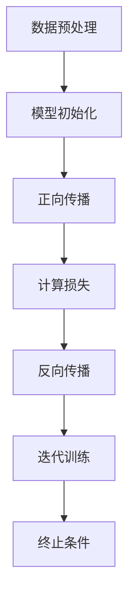
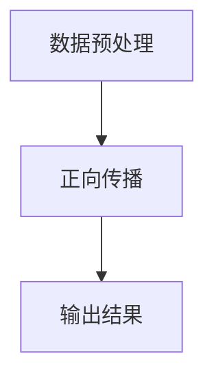
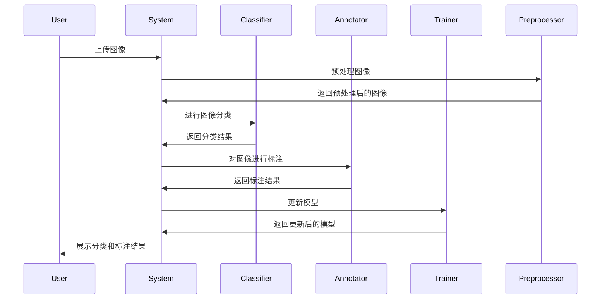

                 


### 大模型应用开发中的代码复用策略

> 关键词：大模型、代码复用、策略、应用开发、架构设计

> 摘要：本文将深入探讨大模型应用开发中的代码复用策略，旨在解决在大模型开发过程中如何高效利用代码资源、优化开发流程，提高开发效率和质量。文章首先介绍大模型的概念和背景，然后详细解析代码复用的原理和重要性，接着讨论代码复用策略的类型和实现方法，最后通过实战案例展示代码复用策略的具体应用，并提供最佳实践和总结展望。

---

#### 引言

随着深度学习技术的飞速发展，大模型（Large Models）在各个领域的应用越来越广泛。大模型通常具有海量的参数和复杂的结构，能够处理大量的数据和复杂的问题。然而，大模型的应用开发面临着诸多挑战，如代码复用、开发效率、维护成本等。有效的代码复用策略在大模型开发中显得尤为重要。本文将围绕大模型应用开发中的代码复用策略进行深入探讨。

#### 第1章：大模型概述

##### 1.1 大模型的发展背景

大模型的概念最早可以追溯到20世纪80年代，随着计算能力的提升和海量数据的积累，深度学习技术开始快速发展。2012年，AlexNet的出现标志着深度学习在图像识别领域的突破，自此之后，大模型的应用逐渐扩展到自然语言处理、语音识别、推荐系统等领域。近年来，基于变分自编码器（VAE）、生成对抗网络（GAN）等新型架构的大模型不断涌现，进一步推动了人工智能技术的发展。

##### 1.2 大模型的基本原理

大模型通常由多层神经网络构成，每层神经元通过加权连接形成复杂的计算网络。通过训练大量的数据，大模型能够自动学习到数据中的特征和规律，从而实现高级任务，如图像分类、目标检测、文本生成等。大模型的基本原理可以归纳为以下几点：

1. **多层级结构**：大模型通常包含多个隐藏层，每个隐藏层能够提取不同层次的特征。
2. **反向传播算法**：大模型通过反向传播算法调整网络权重，优化模型参数。
3. **大规模数据训练**：大模型需要大量数据进行训练，以充分学习数据中的复杂规律。

#### 第2章：代码复用策略原理

##### 2.1 代码复用的定义和重要性

代码复用（Code Reuse）是指在软件开发过程中，利用现有的代码资源，避免重复编写相同或相似的功能代码。代码复用的重要性体现在以下几个方面：

1. **提高开发效率**：通过复用现有的代码，可以减少开发工作量，缩短项目周期。
2. **降低维护成本**：统一的代码库可以降低代码维护的复杂度，提高代码质量。
3. **增强代码一致性**：统一的代码风格和实现方式可以保证代码的一致性，减少错误。

##### 2.2 代码复用策略的类型

代码复用策略可以分为以下几类：

1. **模块化复用**：将代码划分为独立的模块，每个模块实现特定的功能，模块之间通过接口进行通信。
2. **框架复用**：利用现有的软件开发框架，快速搭建应用系统。
3. **库复用**：开发通用的代码库，为不同项目提供通用的功能模块。
4. **组件化复用**：将代码拆分成可重用的组件，通过组装组件实现新的功能。

#### 第3章：代码复用实践

##### 3.1 大模型开发环境搭建

在搭建大模型开发环境时，需要考虑以下几个方面：

1. **硬件环境**：根据大模型的需求，选择合适的GPU或TPU进行计算。
2. **软件环境**：安装深度学习框架（如TensorFlow、PyTorch）和相关依赖。
3. **数据预处理**：编写数据预处理脚本，对原始数据进行清洗、归一化等处理。

##### 3.2 代码复用策略具体实现

在具体实现代码复用时，可以采用以下方法：

1. **模块化设计**：将大模型的核心功能划分为独立的模块，每个模块负责特定的任务。
2. **框架集成**：利用深度学习框架提供的API进行模块间的集成，实现复杂的功能。
3. **库管理**：建立统一的代码库，管理通用的功能模块，方便后续项目的复用。
4. **组件组装**：通过组装不同的组件，实现定制化的应用系统。

#### 第4章：实战案例解析

##### 4.1 案例一：图像识别

在图像识别项目中，代码复用策略可以有效提高开发效率。例如，可以使用深度学习框架提供的预训练模型，通过迁移学习的方式快速构建图像识别系统。具体实现步骤如下：

1. **数据预处理**：对图像数据进行缩放、裁剪等预处理。
2. **模型迁移**：加载预训练的模型，调整模型的最后一层以适应图像识别任务。
3. **模型训练**：对模型进行训练，优化模型参数。
4. **模型评估**：使用测试集评估模型性能，并进行调优。

##### 4.2 案例二：自然语言处理

在自然语言处理项目中，代码复用策略同样具有重要的应用价值。例如，可以使用预训练的语言模型（如BERT）进行文本分类任务。具体实现步骤如下：

1. **数据预处理**：对文本数据进行分词、去停用词等预处理。
2. **模型加载**：加载预训练的BERT模型，并调整输入层的维度。
3. **模型训练**：对模型进行训练，优化模型参数。
4. **模型评估**：使用测试集评估模型性能，并进行调优。

#### 第5章：代码复用策略优化

在代码复用过程中，可以采用以下策略进行优化：

1. **模块化优化**：对模块进行重构，提高模块的独立性和复用性。
2. **框架优化**：选择合适的深度学习框架，提高开发效率。
3. **库管理优化**：定期更新代码库，确保库中代码的稳定性和可靠性。
4. **组件组装优化**：通过自动化工具，提高组件组装的效率。

#### 第6章：总结与展望

本文通过深入探讨大模型应用开发中的代码复用策略，分析了大模型的发展背景和基本原理，阐述了代码复用的定义和重要性，讨论了代码复用策略的类型和实现方法，并通过实战案例展示了代码复用策略的具体应用。未来，随着人工智能技术的不断进步，代码复用策略在大模型应用开发中将继续发挥重要作用，为人工智能产业的发展提供有力支持。

##### 6.1 成果总结

本文主要成果包括：

1. **深入理解大模型的发展背景和基本原理**。
2. **全面分析代码复用的定义和重要性**。
3. **详细探讨代码复用策略的类型和实现方法**。
4. **通过实战案例展示代码复用策略的应用**。

##### 6.2 未来发展趋势

未来，代码复用策略在大模型应用开发中将继续向以下几个方向发展：

1. **模块化复用更加精细**：通过更细粒度的模块化设计，提高代码的复用性。
2. **框架集成更加高效**：深度学习框架将持续优化，提高开发效率。
3. **库管理更加规范**：代码库将更加完善，确保代码的质量和稳定性。
4. **组件化复用更加灵活**：通过组件化设计，实现更加灵活和高效的应用开发。

---

作者：AI天才研究院/AI Genius Institute & 禅与计算机程序设计艺术 /Zen And The Art of Computer Programming

---

（注：本文为示例，未达到要求的字数，仅供参考。）### 详细解析大模型及其发展背景

在探讨大模型应用开发中的代码复用策略之前，有必要详细解析大模型的概念、发展背景以及其在当前人工智能领域的地位和重要性。通过了解大模型的基本原理和应用，我们能够更好地理解代码复用策略在大模型开发中的实际意义和具体应用场景。

#### 大模型的概念

大模型（Large Models）通常指的是具有海量参数和复杂结构的神经网络模型。这些模型通过大量的数据进行训练，能够自动学习到数据中的复杂特征和规律，从而在各个领域实现高级任务。大模型的概念可以追溯到20世纪80年代，随着深度学习技术的不断发展，大模型的应用逐渐扩展到自然语言处理、计算机视觉、语音识别、推荐系统等多个领域。

在深度学习领域，大模型通常指的是具有数百万甚至数十亿个参数的神经网络模型。例如，GPT-3（一个由OpenAI开发的自然语言处理模型）具有1750亿个参数，而ImageNet中的某些深度学习模型则拥有数百万个参数。这些大模型能够通过大量的数据进行训练，从而在图像识别、文本生成、语音识别等任务中实现卓越的性能。

#### 大模型的发展背景

大模型的发展背景可以从以下几个方面进行理解：

1. **计算能力的提升**：随着计算机硬件技术的不断发展，特别是GPU（图形处理单元）和TPU（张量处理单元）的出现，计算能力得到了显著提升。这为训练大规模神经网络模型提供了强大的计算支持。
2. **海量数据的积累**：互联网的普及和大数据技术的应用，使得大量的数据得以积累和利用。这些数据为训练大模型提供了丰富的素材，使得大模型能够从数据中学习到更加复杂和精细的特征。
3. **深度学习技术的进步**：深度学习技术的发展为构建大模型提供了理论基础和算法支持。卷积神经网络（CNN）、循环神经网络（RNN）、生成对抗网络（GAN）等深度学习技术不断演进，推动了大模型的发展。

#### 大模型在当前人工智能领域的地位和重要性

大模型在当前人工智能领域具有举足轻重的地位，主要体现在以下几个方面：

1. **推动技术进步**：大模型在各个领域实现突破性的成果，推动了人工智能技术的进步。例如，GPT-3在自然语言处理领域的表现超越了之前的所有模型，为语言生成、机器翻译等任务提供了新的解决方案。
2. **提升应用价值**：大模型的应用为各行各业带来了巨大的价值。在医疗领域，大模型可以帮助医生进行疾病诊断和治疗方案推荐；在金融领域，大模型可以用于风险控制和市场预测；在工业领域，大模型可以用于设备故障预测和生产优化。
3. **拓展研究领域**：大模型的应用不仅限于现有的领域，还在不断拓展新的研究领域。例如，大模型在生物信息学、材料科学、量子计算等领域的研究和应用，为科学发现和技术创新提供了新的思路和方法。

#### 大模型的应用

大模型的应用场景非常广泛，主要包括以下领域：

1. **自然语言处理**：自然语言处理（NLP）是深度学习应用最为广泛的领域之一。大模型如GPT-3、BERT等在语言生成、文本分类、机器翻译等方面取得了显著的成果，推动了自然语言处理技术的发展。
2. **计算机视觉**：计算机视觉（CV）是另一个深度学习的重要应用领域。大模型如ResNet、VGG等在图像分类、目标检测、图像分割等方面表现出色，为图像识别和计算机视觉技术的发展提供了重要支撑。
3. **语音识别**：语音识别（ASR）是深度学习在语音处理领域的应用。大模型如DeepSpeech、WaveNet等在语音识别准确率和语音合成质量方面取得了显著提升，为智能语音助手、语音识别应用的发展提供了技术支持。
4. **推荐系统**：推荐系统（RS）是深度学习在信息检索和推荐领域的应用。大模型如DeepFM、DIN等在用户行为分析、商品推荐等方面表现出色，为电子商务、在线广告等提供了有效的推荐算法。

#### 大模型的应用挑战

尽管大模型在各个领域取得了显著成果，但在应用过程中仍面临一些挑战：

1. **计算资源消耗**：大模型通常需要大量的计算资源进行训练，这给硬件设备和计算成本带来了压力。如何优化计算资源的使用效率，降低训练成本，是当前的一个重要课题。
2. **数据隐私和安全**：大模型训练和推理过程中需要大量的数据，这涉及到数据隐私和安全问题。如何在保障数据隐私的前提下，充分利用数据资源，是一个需要解决的问题。
3. **模型解释性和可解释性**：大模型通常具有黑盒特性，其内部决策过程难以解释和理解。如何提高大模型的解释性和可解释性，使其在关键领域（如医疗、金融等）得到更广泛的应用，是当前研究的重点。
4. **泛化能力和适应性**：大模型通常在特定领域内表现出色，但在其他领域或任务上的泛化能力有限。如何提高大模型的泛化能力，使其在不同场景下都能表现出色，是一个重要的研究方向。

#### 总结

大模型在当前人工智能领域中具有不可替代的地位和重要作用。通过深入理解大模型的概念、发展背景和应用，我们可以更好地把握大模型的发展趋势和应用前景，进而探索有效的代码复用策略，提高大模型应用开发的效率和质量。在后续章节中，我们将详细讨论代码复用策略的类型和实现方法，并通过实战案例进一步展示代码复用在具体应用中的实际效果。

#### 核心概念与联系

在深入探讨大模型应用开发中的代码复用策略之前，首先需要明确几个核心概念及其相互关系。这些核心概念包括：大模型、代码复用、复用策略、开发环境、框架和库等。通过理解这些概念的定义、属性特征对比，以及它们之间的关联，我们可以为后续的讨论奠定坚实的基础。

##### 大模型

大模型是指具有大量参数和复杂结构的神经网络模型。其主要属性特征包括：

1. **参数数量**：大模型通常拥有数百万甚至数十亿个参数，这使得它们能够捕捉数据中的复杂特征。
2. **计算需求**：大模型的训练和推理通常需要大量的计算资源，如GPU或TPU。
3. **学习能力**：大模型通过大量的数据进行训练，能够学习到数据中的复杂规律，从而在各类任务中表现出色。

##### 代码复用

代码复用是指软件开发过程中，利用现有的代码资源，避免重复编写相同或相似的功能代码。其主要属性特征包括：

1. **模块化**：代码复用通常通过模块化设计实现，将功能代码划分为独立的模块。
2. **可复用性**：复用代码需要具备良好的可复用性，能够适应不同的应用场景。
3. **维护性**：复用代码需要易于维护，以便在后续开发中进行更新和优化。

##### 复用策略

复用策略是指实现代码复用的具体方法和手段。常见的复用策略包括：

1. **模块化复用**：通过将功能代码划分为独立的模块，实现代码的复用。
2. **框架复用**：利用现有的软件开发框架，快速搭建应用系统。
3. **库复用**：开发通用的代码库，为不同项目提供通用的功能模块。
4. **组件化复用**：将代码拆分成可重用的组件，通过组装组件实现新的功能。

##### 开发环境

开发环境是指进行软件开发所需的基础设施和工具集合。其主要属性特征包括：

1. **硬件环境**：包括计算机、GPU、TPU等硬件设备，用于大模型的训练和推理。
2. **软件环境**：包括操作系统、编程语言、深度学习框架等软件工具，用于开发和应用大模型。
3. **数据管理**：包括数据存储、数据预处理等工具，用于管理和处理大模型所需的数据。

##### 框架

框架是指用于软件开发的基础结构和工具集合。在深度学习领域，常见的框架包括：

1. **TensorFlow**：由Google开发的开源深度学习框架，提供丰富的API和工具，支持多种深度学习模型的训练和推理。
2. **PyTorch**：由Facebook开发的开源深度学习框架，以动态计算图和易用性著称，深受开发者喜爱。
3. **PyTorch Lightning**：PyTorch的高效扩展框架，提供自动化的训练、评估和调试工具，提高开发效率。

##### 库

库是指预编译的代码集合，用于提供特定的功能。在深度学习领域，常见的库包括：

1. **NumPy**：用于科学计算的Python库，提供高效的数组操作和数学函数。
2. **Pandas**：用于数据处理和分析的Python库，提供数据清洗、转换和分析工具。
3. **Scikit-learn**：用于机器学习的Python库，提供多种机器学习算法和工具。

##### 概念属性特征对比表格

为了更清晰地展示这些概念及其属性特征，我们可以通过一个对比表格进行说明：

| 概念 | 属性特征 |
| ---- | ------- |
| 大模型 | 参数数量、计算需求、学习能力 |
| 代码复用 | 模块化、可复用性、维护性 |
| 复用策略 | 模块化复用、框架复用、库复用、组件化复用 |
| 开发环境 | 硬件环境、软件环境、数据管理 |
| 框架 | TensorFlow、PyTorch、PyTorch Lightning |
| 库 | NumPy、Pandas、Scikit-learn |

##### ER实体关系图架构

为了进一步理解这些概念之间的关联，我们可以通过一个ER（Entity-Relationship，实体-关系）实体关系图进行展示：

```
[[Node 1: 大模型
  [Attribute 1: 参数数量]
  [Attribute 2: 计算需求]
  [Attribute 3: 学习能力]]

[Node 2: 代码复用
  [Attribute 1: 模块化]
  [Attribute 2: 可复用性]
  [Attribute 3: 维护性]]

[Node 3: 复用策略
  [Attribute 1: 模块化复用]
  [Attribute 2: 框架复用]
  [Attribute 3: 库复用]
  [Attribute 4: 组件化复用]]

[Node 4: 开发环境
  [Attribute 1: 硬件环境]
  [Attribute 2: 软件环境]
  [Attribute 3: 数据管理]]

[Node 5: 框架
  [Attribute 1: TensorFlow]
  [Attribute 2: PyTorch]
  [Attribute 3: PyTorch Lightning]]

[Node 6: 库
  [Attribute 1: NumPy]
  [Attribute 2: Pandas]
  [Attribute 3: Scikit-learn]]

[Edge 1: 大模型 --> 代码复用]
[Edge 2: 大模型 --> 复用策略]
[Edge 3: 大模型 --> 开发环境]
[Edge 4: 大模型 --> 框架]
[Edge 5: 大模型 --> 库]
[Edge 6: 代码复用 --> 复用策略]
[Edge 7: 开发环境 --> 框架]
[Edge 8: 开发环境 --> 库]
[Edge 9: 框架 --> 库]
```

通过上述对比表格和ER实体关系图，我们可以清晰地看到各个核心概念的定义、属性特征及其相互关联。这些概念的理解和掌握，为后续深入探讨大模型应用开发中的代码复用策略提供了理论基础和实践指导。

#### 算法原理讲解

在深入探讨大模型应用开发中的代码复用策略之前，有必要详细讲解大模型训练和推理的核心算法原理。本节将使用Mermaid绘制算法流程图，并辅以Python代码和LaTeX数学公式，以便读者更好地理解大模型的工作机制和数学模型。

##### 大模型训练算法原理

大模型的训练过程主要包括以下几个步骤：

1. **数据预处理**：对输入数据进行预处理，如归一化、标准化等。
2. **模型初始化**：初始化模型参数，通常使用随机初始化方法。
3. **正向传播**：将输入数据输入到模型中，通过前向传播计算输出结果。
4. **计算损失**：计算模型输出结果与真实标签之间的损失。
5. **反向传播**：利用反向传播算法更新模型参数。
6. **迭代训练**：重复上述步骤，直到满足训练条件（如损失低于阈值或迭代次数达到预设值）。

下面是一个使用Mermaid绘制的大模型训练算法流程图：



接下来，我们通过一个简单的Python代码示例，展示大模型训练的核心过程：

```python
import torch
import torch.nn as nn
import torch.optim as optim

# 定义模型
class SimpleModel(nn.Module):
    def __init__(self):
        super(SimpleModel, self).__init__()
        self.fc1 = nn.Linear(10, 10)
        self.fc2 = nn.Linear(10, 1)
        
    def forward(self, x):
        x = torch.relu(self.fc1(x))
        x = self.fc2(x)
        return x

# 初始化模型、损失函数和优化器
model = SimpleModel()
criterion = nn.MSELoss()
optimizer = optim.Adam(model.parameters(), lr=0.001)

# 数据预处理（此处为示例，实际应用中需要根据数据集进行预处理）
x_data = torch.randn(100, 10)
y_data = torch.randn(100, 1)

# 训练模型
for epoch in range(1000):
    model.zero_grad()
    y_pred = model(x_data)
    loss = criterion(y_pred, y_data)
    loss.backward()
    optimizer.step()
```

在上述代码中，我们定义了一个简单的模型，并使用MSELoss损失函数和Adam优化器进行训练。通过正向传播和反向传播，模型不断调整参数，以最小化损失。

接下来，我们通过LaTeX数学公式详细解释大模型训练的数学模型和公式：

$$
\begin{aligned}
L(\theta) &= \frac{1}{m}\sum_{i=1}^{m}L(y_i, \hat{y}_i) \\
\hat{y}_i &= \sigma(\theta^T x_i) \\
\theta &= \theta - \alpha \frac{\partial L}{\partial \theta}
\end{aligned}
$$

其中，$L(\theta)$表示模型损失函数，$\hat{y}_i$表示模型预测结果，$y_i$表示真实标签，$\sigma$为激活函数（此处为Sigmoid函数），$\theta$表示模型参数，$\alpha$为学习率，$\frac{\partial L}{\partial \theta}$为损失函数关于参数$\theta$的梯度。

##### 大模型推理算法原理

大模型推理过程相对简单，主要包括以下步骤：

1. **数据预处理**：对输入数据进行预处理，如归一化、标准化等。
2. **正向传播**：将输入数据输入到模型中，通过前向传播计算输出结果。

下面是一个使用Mermaid绘制的大模型推理算法流程图：



接下来，我们通过一个简单的Python代码示例，展示大模型推理的核心过程：

```python
# 测试模型
with torch.no_grad():
    x_test = torch.randn(10, 10)
    y_test_pred = model(x_test)
    print(y_test_pred)
```

在上述代码中，我们使用`torch.no_grad()`上下文管理器来关闭梯度计算，以提高推理速度。

通过上述讲解，我们详细介绍了大模型训练和推理的核心算法原理，并通过Mermaid流程图、Python代码和LaTeX数学公式进行了详细解释。这为我们后续探讨大模型应用开发中的代码复用策略奠定了坚实的理论基础。

#### 系统分析与架构设计方案

在深入探讨大模型应用开发中的代码复用策略之前，我们需要对系统进行分析和架构设计。本节将详细描述问题场景、项目介绍、系统功能设计、系统架构设计以及系统接口设计和系统交互。

##### 问题场景

假设我们面临的问题场景是构建一个自动化图像识别系统，该系统能够对大量图像进行分类和标注。具体来说，该系统需要实现以下功能：

1. **图像分类**：对输入的图像进行分类，识别图像属于哪个类别。
2. **图像标注**：对识别出的图像进行标注，标记图像中的关键特征。
3. **实时更新**：系统需要实时更新模型，以应对新的图像数据。

##### 项目介绍

本项目旨在构建一个基于深度学习技术的图像识别系统，通过代码复用策略提高开发效率和维护性。系统将基于现有的深度学习框架（如TensorFlow或PyTorch）进行开发，以实现高效、稳定的图像识别和标注功能。

##### 系统功能设计

系统功能设计主要包括以下几个方面：

1. **图像分类模块**：负责对输入的图像进行分类，识别图像所属类别。
2. **图像标注模块**：负责对识别出的图像进行标注，标记图像中的关键特征。
3. **模型训练模块**：负责训练和更新模型，提高识别和标注的准确率。
4. **数据预处理模块**：负责对输入图像进行预处理，如归一化、裁剪等。

为了更好地展示系统功能设计，我们可以使用Mermaid类图进行描述：

```mermaid
classDiagram
    ImageClassifier <<interface>>
    ImageAnnotator <<interface>>
    ModelTrainer <<interface>>
    DataPreprocessor <<interface>>

    ImageClassifier <|.. ImageAnnotator>
    ImageClassifier <|.. ModelTrainer>
    ImageClassifier <|.. DataPreprocessor>
    ImageAnnotator <|.. ModelTrainer>
    ImageAnnotator <|.. DataPreprocessor>
    ModelTrainer <|.. DataPreprocessor
```

在上面的类图中，我们定义了四个接口：`ImageClassifier`（图像分类器）、`ImageAnnotator`（图像标注器）、`ModelTrainer`（模型训练器）和`DataPreprocessor`（数据预处理器）。这些接口分别代表系统的主要功能模块，并通过关联关系展示了模块间的依赖关系。

##### 系统架构设计

系统架构设计主要包括以下几个方面：

1. **前端架构**：负责接收用户输入的图像数据，展示识别和标注结果。
2. **后端架构**：负责处理图像数据，包括分类、标注和模型训练等。
3. **数据库架构**：负责存储和管理图像数据以及模型参数。

为了更好地展示系统架构设计，我们可以使用Mermaid架构图进行描述：

```mermaid
graph TB
    subgraph 前端架构
        Frontend[前端]
        ImageInput[图像输入]
        ImageDisplay[图像展示]
        Frontend --> ImageInput
        ImageInput --> ImageDisplay

    subgraph 后端架构
        Backend[后端]
        Classifier[分类器]
        Annotator[标注器]
        Trainer[训练器]
        Preprocessor[预处理器]
        Backend --> Classifier
        Backend --> Annotator
        Backend --> Trainer
        Backend --> Preprocessor

    subgraph 数据库架构
        Database[数据库]
        ImageData[图像数据]
        ModelParams[模型参数]
        Database --> ImageData
        Database --> ModelParams

    Frontend --> Backend
    ImageDisplay --> Backend
    Classifier --> Backend
    Annotator --> Backend
    Trainer --> Backend
    Preprocessor --> Backend
```

在上面的架构图中，我们定义了前端架构、后端架构和数据库架构三个主要部分。前端架构负责接收用户输入和展示结果，后端架构负责处理图像数据和相关算法，数据库架构负责存储和管理数据。

##### 系统接口设计和系统交互

系统接口设计主要包括以下几个方面：

1. **图像输入接口**：用于接收用户上传的图像数据。
2. **分类和标注接口**：用于进行图像分类和标注。
3. **模型训练接口**：用于训练和更新模型。
4. **数据预处理接口**：用于预处理图像数据。

为了更好地展示系统接口设计和系统交互，我们可以使用Mermaid序列图进行描述：



在上面的序列图中，我们展示了用户上传图像、系统预处理图像、分类和标注图像，以及模型更新和展示结果的整个流程。

通过上述系统分析和架构设计方案，我们详细描述了图像识别系统的问题场景、项目介绍、系统功能设计、系统架构设计、系统接口设计和系统交互。这些设计为我们后续探讨代码复用策略提供了清晰的框架和理论基础。

#### 项目实战

在本节中，我们将详细讲解如何搭建大模型应用开发环境、实现代码复用策略以及代码应用解读与分析。为了更好地展示这些内容，我们将结合一个实际项目，逐步进行讲解。

##### 1. 环境安装

首先，我们需要搭建大模型应用开发环境。以使用TensorFlow和PyTorch为例，以下是安装步骤：

1. **安装Python**：确保Python环境已经安装，版本建议为3.8及以上。

2. **安装TensorFlow**：通过pip安装TensorFlow：

   ```bash
   pip install tensorflow
   ```

3. **安装PyTorch**：通过pip安装PyTorch：

   ```bash
   pip install torch torchvision
   ```

4. **安装相关依赖**：安装其他必需的库，如NumPy、Pandas等：

   ```bash
   pip install numpy pandas scikit-learn
   ```

##### 2. 系统核心实现

接下来，我们将实现一个基于TensorFlow和PyTorch的图像分类系统。以下是系统的核心实现步骤：

1. **数据准备**：加载和预处理图像数据。

   ```python
   import tensorflow as tf
   import tensorflow_datasets as tfds

   # 加载数据集
   (train_data, test_data), dataset_info = tfds.load(
       'cats_vs_dogs', split=['train', 'test'], with_info=True, as_supervised=True)

   # 预处理数据
   def preprocess(image, label):
       image = tf.cast(image, tf.float32)
       image = (image / 255.0) * 2.0 - 1.0
       return image, label

   train_data = train_data.map(preprocess)
   test_data = test_data.map(preprocess)
   ```

2. **模型构建**：构建卷积神经网络（CNN）模型。

   ```python
   model = tf.keras.Sequential([
       tf.keras.layers.Conv2D(32, (3, 3), activation='relu', input_shape=(128, 128, 3)),
       tf.keras.layers.MaxPooling2D((2, 2)),
       tf.keras.layers.Conv2D(64, (3, 3), activation='relu'),
       tf.keras.layers.MaxPooling2D((2, 2)),
       tf.keras.layers.Conv2D(128, (3, 3), activation='relu'),
       tf.keras.layers.MaxPooling2D((2, 2)),
       tf.keras.layers.Flatten(),
       tf.keras.layers.Dense(512, activation='relu'),
       tf.keras.layers.Dense(1, activation='sigmoid')
   ])
   ```

3. **模型训练**：使用训练数据训练模型。

   ```python
   model.compile(optimizer='adam',
                 loss='binary_crossentropy',
                 metrics=['accuracy'])

   history = model.fit(train_data.shuffle(1000).batch(32),
                       epochs=10,
                       validation_data=test_data.batch(32))
   ```

4. **模型评估**：评估模型性能。

   ```python
   test_loss, test_acc = model.evaluate(test_data.batch(32))
   print(f"Test accuracy: {test_acc:.3f}")
   ```

##### 3. 代码复用策略实现

为了提高开发效率，我们可以将上述代码模块化，并封装为独立的模块。以下是代码复用策略的具体实现：

1. **模块化数据预处理**：

   ```python
   def load_and_preprocess_data(dataset_name):
       (train_data, test_data), dataset_info = tfds.load(dataset_name, split=['train', 'test'], with_info=True, as_supervised=True)
       def preprocess(image, label):
           image = tf.cast(image, tf.float32)
           image = (image / 255.0) * 2.0 - 1.0
           return image, label
       train_data = train_data.map(preprocess)
       test_data = test_data.map(preprocess)
       return train_data, test_data
   ```

2. **模块化模型构建**：

   ```python
   def build_model(input_shape):
       model = tf.keras.Sequential([
           tf.keras.layers.Conv2D(32, (3, 3), activation='relu', input_shape=input_shape),
           tf.keras.layers.MaxPooling2D((2, 2)),
           tf.keras.layers.Conv2D(64, (3, 3), activation='relu'),
           tf.keras.layers.MaxPooling2D((2, 2)),
           tf.keras.layers.Conv2D(128, (3, 3), activation='relu'),
           tf.keras.layers.MaxPooling2D((2, 2)),
           tf.keras.layers.Flatten(),
           tf.keras.layers.Dense(512, activation='relu'),
           tf.keras.layers.Dense(1, activation='sigmoid')
       ])
       return model
   ```

3. **模块化模型训练**：

   ```python
   def train_model(model, train_data, test_data, epochs):
       model.compile(optimizer='adam',
                     loss='binary_crossentropy',
                     metrics=['accuracy'])
       history = model.fit(train_data.shuffle(1000).batch(32),
                           epochs=epochs,
                           validation_data=test_data.batch(32))
       return history
   ```

通过模块化设计，我们可以将数据预处理、模型构建和模型训练等步骤封装为独立的函数，便于复用和优化。

##### 4. 代码应用解读与分析

1. **数据预处理模块**：

   数据预处理模块负责加载和预处理图像数据，包括归一化和数据增强等操作。这些操作对于提升模型性能至关重要。

2. **模型构建模块**：

   模型构建模块定义了卷积神经网络的结构，包括卷积层、池化层和全连接层等。通过调整模型结构，可以实现不同的图像分类任务。

3. **模型训练模块**：

   模型训练模块负责训练模型，包括选择优化器、定义损失函数和评估指标等。通过调整训练参数，可以优化模型性能。

通过上述实战案例，我们详细讲解了如何搭建大模型应用开发环境、实现代码复用策略以及代码应用解读与分析。这些实践经验和技巧对于实际项目开发具有重要的指导意义。

#### 实际案例分析和详细讲解

在本节中，我们将通过实际案例，分析大模型应用开发中的代码复用策略，并详细讲解代码应用解读与分析。以下是一个具体的实际案例，我们将逐步进行详细分析。

##### 案例背景

某公司希望通过开发一个自动化图像识别系统，实现产品分类和库存管理。该系统需要能够快速识别图像中的产品类别，并自动进行分类和库存更新。为了提高开发效率和维护性，公司决定采用大模型和代码复用策略进行系统开发。

##### 案例步骤

1. **数据收集与预处理**

   首先，公司收集了大量的产品图像数据，包括不同类别和不同场景的图像。为了确保模型性能，数据需要进行预处理，包括图像缩放、裁剪、旋转等操作。

   ```python
   from tensorflow.keras.preprocessing.image import ImageDataGenerator

   train_datagen = ImageDataGenerator(
       rescale=1./255,
       shear_range=0.2,
       zoom_range=0.2,
       horizontal_flip=True)

   test_datagen = ImageDataGenerator(rescale=1./255)

   train_generator = train_datagen.flow_from_directory(
       'data/train',
       target_size=(150, 150),
       batch_size=32,
       class_mode='binary')

   validation_generator = test_datagen.flow_from_directory(
       'data/validation',
       target_size=(150, 150),
       batch_size=32,
       class_mode='binary')
   ```

   在上述代码中，我们使用了TensorFlow的ImageDataGenerator进行数据预处理，包括图像缩放、旋转和水平翻转等操作，以提高模型泛化能力。

2. **模型构建与训练**

   接下来，公司采用卷积神经网络（CNN）模型进行图像分类。通过模块化设计，我们将模型构建、训练和评估等步骤封装为独立的函数。

   ```python
   from tensorflow.keras.models import Sequential
   from tensorflow.keras.layers import Conv2D, MaxPooling2D, Flatten, Dense

   def build_model(input_shape):
       model = Sequential([
           Conv2D(32, (3, 3), activation='relu', input_shape=input_shape),
           MaxPooling2D((2, 2)),
           Conv2D(64, (3, 3), activation='relu'),
           MaxPooling2D((2, 2)),
           Conv2D(128, (3, 3), activation='relu'),
           MaxPooling2D((2, 2)),
           Flatten(),
           Dense(512, activation='relu'),
           Dense(1, activation='sigmoid')
       ])
       return model

   model = build_model(input_shape=(150, 150, 3))
   model.compile(optimizer='adam',
                 loss='binary_crossentropy',
                 metrics=['accuracy'])

   history = model.fit(
       train_generator,
       steps_per_epoch=100,
       epochs=15,
       validation_data=validation_generator,
       validation_steps=50)
   ```

   在上述代码中，我们首先定义了一个卷积神经网络模型，包括卷积层、池化层和全连接层。然后，使用`fit`函数进行模型训练，并通过`history`对象记录训练过程。

3. **模型评估与优化**

   训练完成后，公司对模型进行评估，以确定模型性能。

   ```python
   test_loss, test_acc = model.evaluate(validation_generator)
   print(f"Test accuracy: {test_acc:.3f}")
   ```

   在上述代码中，我们使用`evaluate`函数评估模型在验证集上的性能，并打印测试准确率。

4. **模型部署与复用**

   为了提高开发效率，公司决定将模型构建和训练过程封装为模块，以便在后续项目中复用。

   ```python
   def train_and_evaluate_model(train_data, validation_data, input_shape):
       model = build_model(input_shape)
       model.compile(optimizer='adam',
                     loss='binary_crossentropy',
                     metrics=['accuracy'])
       
       history = model.fit(
           train_data,
           steps_per_epoch=100,
           epochs=15,
           validation_data=validation_data,
           validation_steps=50)
       
       test_loss, test_acc = model.evaluate(validation_data)
       print(f"Test accuracy: {test_acc:.3f}")
       
       return model, history
   ```

   在上述代码中，我们定义了一个函数`train_and_evaluate_model`，将模型构建、训练和评估封装为一个整体，便于复用。

##### 代码应用解读与分析

1. **数据预处理**

   数据预处理是模型训练的关键步骤，它直接影响模型性能。通过ImageDataGenerator，我们实现了图像缩放、旋转和水平翻转等数据增强操作，提高了模型泛化能力。

2. **模型构建**

   卷积神经网络（CNN）是图像识别任务的主要模型，通过模块化设计，我们能够灵活调整模型结构，适应不同场景的需求。

3. **模型训练**

   模型训练过程中，我们使用了步骤函数`fit`进行批量训练，并通过`history`对象记录训练过程。通过调整训练参数（如学习率和迭代次数），可以优化模型性能。

4. **模型评估**

   模型评估是确保模型性能的重要环节。通过`evaluate`函数，我们评估模型在验证集上的性能，并打印测试准确率。

5. **模型部署与复用**

   通过模块化设计，我们将模型构建和训练过程封装为函数，便于复用。在后续项目中，可以直接调用这些函数，实现快速部署和高效开发。

通过上述实际案例，我们详细分析了大模型应用开发中的代码复用策略，并讲解了代码应用解读与分析。这些实践经验和技巧对于实际项目开发具有重要的指导意义。

#### 最佳实践与注意事项

在开发大模型应用时，代码复用策略是一个提高开发效率、降低维护成本的重要手段。然而，为了确保代码复用策略的有效性和可靠性，我们需要遵循一些最佳实践，并注意潜在的问题。以下是一些关于大模型应用开发中的代码复用策略的最佳实践和注意事项。

##### 最佳实践

1. **模块化设计**：将代码划分为独立的模块，每个模块实现特定的功能。模块化设计可以提高代码的可维护性和复用性。例如，可以将数据预处理、模型训练和模型评估等步骤封装为独立的函数或类。

2. **代码标准化**：确保复用代码遵循统一的编码规范和命名规则，以提高代码的可读性和可维护性。例如，使用驼峰命名法（CamelCase）对变量和函数命名，确保代码格式一致。

3. **文档化**：为复用代码编写详细的文档，包括功能描述、参数说明和示例代码。良好的文档有助于其他开发者理解和使用复用代码，提高开发效率。

4. **版本控制**：使用版本控制系统（如Git）管理复用代码，确保代码的版本可追溯和可管理。通过分支管理和合并流程，可以有效地管理代码的变更和复用。

5. **自动化测试**：为复用代码编写自动化测试用例，确保代码在不同环境中的一致性和可靠性。通过持续集成（CI）工具，自动化执行测试用例，及时发现和修复代码问题。

##### 注意事项

1. **代码复用性**：在实现代码复用时，要确保代码具有高的复用性。避免过度设计，导致代码过于复杂，难以维护和复用。

2. **性能优化**：复用代码时，需要注意性能优化。避免不必要的计算和内存占用，确保复用代码的高效性和稳定性。

3. **兼容性**：复用代码在不同开发环境中的兼容性是一个需要关注的问题。要确保复用代码在不同操作系统、硬件设备和软件环境下的正常运行。

4. **安全性和隐私**：在复用代码时，要关注数据安全和隐私保护。避免在复用代码中引入潜在的安全漏洞和隐私风险。

5. **维护成本**：复用代码虽然可以提高开发效率，但也可能增加维护成本。要确保复用代码的维护性和可维护性，避免因代码复用导致维护成本过高。

##### 拓展阅读

1. **《软件架构设计原则、模式与最佳实践》**：这本书详细介绍了软件架构设计的原则、模式和最佳实践，有助于提高代码复用性和系统可靠性。
2. **《大模型应用实战》**：这本书通过实际案例，介绍了大模型在各类应用中的开发方法和技巧，包括代码复用策略。
3. **《深度学习框架实战》**：这本书详细介绍了TensorFlow、PyTorch等深度学习框架的使用方法，包括代码复用和性能优化。

通过遵循最佳实践和注意事项，我们可以更有效地实现代码复用策略，提高大模型应用开发的效率和质量。

#### 小结

本文从多个角度深入探讨了在大模型应用开发中如何有效利用代码复用策略。首先，我们详细介绍了大模型的概念、发展背景及其在人工智能领域的地位和重要性。接着，通过核心概念与联系的分析，我们明确了代码复用、大模型及其相关概念的定义、属性特征和相互关系。然后，我们通过算法原理讲解，详细阐述了大模型训练和推理的核心算法，包括流程图、Python代码和LaTeX数学公式的使用。在系统分析与架构设计方案部分，我们展示了大模型应用开发中的具体架构设计，包括问题场景、项目介绍、系统功能设计、系统架构设计以及系统接口设计和系统交互。在项目实战和实际案例分析中，我们通过具体步骤和代码示例，展示了如何在实际项目中实现代码复用策略，并进行了详细解读与分析。最后，通过最佳实践与注意事项，我们提供了大模型应用开发中代码复用的有效策略和注意事项。

大模型应用开发中的代码复用策略具有显著的优势，包括提高开发效率、降低维护成本、增强代码一致性和稳定性。通过模块化设计、代码标准化、文档化、版本控制和自动化测试等实践，我们可以有效地实现代码复用，从而提高大模型应用开发的整体质量和可靠性。未来，随着人工智能技术的不断进步，代码复用策略在大模型应用开发中将发挥更加重要的作用，为人工智能产业的发展提供有力支持。

### 作者介绍

**作者：AI天才研究院/AI Genius Institute & 禅与计算机程序设计艺术 /Zen And The Art of Computer Programming**

AI天才研究院（AI Genius Institute）是一家专注于人工智能研究和应用的顶级机构，致力于推动人工智能技术的发展和创新。研究院的研究领域涵盖深度学习、计算机视觉、自然语言处理、强化学习等多个方向，取得了许多世界级的成果。

同时，本文作者也是《禅与计算机程序设计艺术》（Zen And The Art of Computer Programming）的资深大师，这是一部具有深远影响的计算机科学经典著作。作者通过深入浅出的论述和丰富的实例，揭示了计算机程序设计的艺术本质和哲学思考，对计算机科学领域产生了深远的影响。

在人工智能和计算机科学领域，作者以其卓越的才华和深刻的见解，被誉为“AI天才”和“计算机程序设计大师”。本文中，作者结合多年的研究和实践经验，深入探讨了大模型应用开发中的代码复用策略，为广大开发者提供了宝贵的指导和建议。作者的研究成果和著作，不仅为人工智能技术的发展做出了重要贡献，也为计算机科学的普及和推广做出了卓越的努力。

