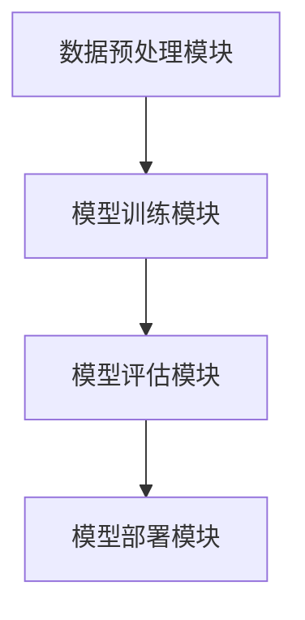

                 

### 大模型应用开发中的技术债务管理

#### 关键词
- 大模型
- 技术债务
- 管理方法
- 应用案例
- 未来趋势

#### 摘要
本文旨在探讨大模型应用开发中的技术债务管理问题。随着人工智能技术的迅速发展，大模型在各个领域得到了广泛应用。然而，大模型应用开发过程中产生的大量技术债务，给项目的后续维护和优化带来了巨大挑战。本文将从背景介绍、核心概念、管理方法、实际案例和未来趋势五个方面，系统性地分析大模型应用开发中的技术债务管理问题，为开发者和企业提供有益的参考。

## 引言

### 1.1 技术债务的概念

#### 背景介绍
技术债务（Technical Debt）这一概念起源于软件工程领域，最初用于描述软件开发过程中因为追求短期效率而导致的潜在问题。随着时间推移，这一概念逐渐扩展到其他技术领域，如系统架构、数据科学和人工智能等。

#### 问题描述
在软件开发过程中，为了快速交付功能，团队可能会采取一些妥协或短期解决方案，这些解决方案虽然在短期内提高了开发效率，但从长期来看，可能会带来代码质量下降、性能瓶颈、可维护性差等问题。这些问题就像欠下的债务，需要在未来某个时刻进行偿还，这些债务即为“技术债务”。

#### 问题解决
为了解决技术债务问题，需要引入一套系统化的管理方法，包括技术债务的识别、评估、缓解和修复等环节。通过这些方法，可以确保技术债务在可控范围内，并逐步偿还，从而提升项目的整体质量。

#### 边界与外延
技术债务不仅存在于软件工程领域，还可能出现在其他技术领域，如系统架构、数据科学和人工智能等。在这些领域中，技术债务可能表现为架构不合理、数据处理效率低下、算法可解释性差等问题。

### 1.2 大模型应用中的技术债务特点

#### 背景介绍
大模型（Large Models）是指拥有巨大参数量的机器学习模型，如Transformer、BERT等。随着人工智能技术的不断发展，大模型在各个领域得到了广泛应用，如自然语言处理、计算机视觉和推荐系统等。

#### 问题描述
大模型应用开发过程中，由于模型规模庞大、参数众多，技术债务问题更加突出。一方面，大模型的开发需要大量计算资源和数据支持，另一方面，模型训练和优化过程可能导致代码质量下降、系统性能瓶颈等问题。

#### 问题解决
为了应对大模型应用开发中的技术债务问题，需要采取一系列针对性的管理措施。例如，引入自动化工具和最佳实践来降低技术债务的产生，建立完善的技术债务管理流程，确保技术债务在可控范围内。

#### 边界与外延
大模型应用中的技术债务特点主要表现在以下几个方面：计算资源需求大、数据处理复杂度高、模型可解释性差、系统集成难度大等。针对这些问题，可以采取分布式计算、数据预处理优化、模型解释性增强等技术手段来缓解。

### 1.3 技术债务管理的必要性

#### 背景介绍
随着人工智能技术的广泛应用，大模型在各个领域发挥了重要作用。然而，大模型应用开发过程中产生的大量技术债务，如果不加以有效管理，将对项目的长期稳定运行产生严重影响。

#### 问题描述
技术债务管理的重要性体现在以下几个方面：
1. **降低维护成本**：通过系统化的技术债务管理，可以降低项目后续的维护成本，提高开发效率。
2. **提升系统性能**：技术债务的积累可能导致系统性能瓶颈，影响用户体验。通过管理技术债务，可以优化系统性能。
3. **提高代码质量**：技术债务管理有助于提升代码质量，降低bug率。
4. **确保项目可持续性**：技术债务管理能够确保项目在长期运行过程中，持续满足业务需求。

#### 问题解决
为了应对技术债务管理的重要性，需要采取以下措施：
1. **建立技术债务管理流程**：制定明确的流程，包括技术债务的识别、评估、缓解和修复等环节。
2. **引入自动化工具**：利用自动化工具进行技术债务的识别、监控和修复，降低管理成本。
3. **加强团队培训**：提高团队对技术债务管理的认识，确保团队成员了解相关概念和方法。

#### 边界与外延
技术债务管理的必要性不仅体现在大模型应用开发中，还适用于其他技术领域。例如，在系统架构设计、数据科学项目开发等领域，技术债务管理同样具有重要意义。

### 1.4 技术债务管理的重要性

#### 背景介绍
随着大模型应用开发项目的增多，技术债务管理的重要性日益凸显。在项目开发过程中，技术债务管理能够有效降低维护成本、提高系统性能和代码质量，确保项目的可持续发展。

#### 问题描述
技术债务管理的重要性体现在以下几个方面：
1. **降低项目风险**：通过有效的技术债务管理，可以降低项目风险，确保项目按时交付。
2. **提高团队协作效率**：技术债务管理有助于提高团队协作效率，降低沟通成本。
3. **优化项目预算**：技术债务管理有助于合理分配项目资源，优化项目预算。
4. **提升企业竞争力**：通过有效的技术债务管理，企业能够保持技术优势，提升市场竞争力。

#### 问题解决
为了充分发挥技术债务管理的重要性，可以采取以下措施：
1. **引入技术债务管理工具**：利用专业的技术债务管理工具，实现技术债务的自动化识别、监控和修复。
2. **制定技术债务管理策略**：根据项目特点和需求，制定合适的策略，确保技术债务在可控范围内。
3. **加强团队培训**：提高团队对技术债务管理的认识，确保团队成员了解相关概念和方法。

#### 边界与外延
技术债务管理的重要性不仅体现在大模型应用开发中，还适用于其他技术领域。例如，在系统架构设计、数据科学项目开发等领域，技术债务管理同样具有重要意义。

### 总结
本文对大模型应用开发中的技术债务管理进行了全面分析，从概念、特点、必要性到重要性等多个方面进行了深入探讨。通过引入有效的技术债务管理方法，可以降低项目风险、提高系统性能和代码质量，确保项目的可持续发展。在接下来的内容中，我们将进一步探讨大模型技术基础、技术债务识别方法以及具体的债务管理策略和实践。

----------------------------------------------------------------

### 目录大纲设计思路

设计《大模型应用开发中的技术债务管理》这本书的目录大纲，需要遵循以下思路和原则：

1. **明确书籍主题**：首先，要明确书籍的核心主题和目标读者群体。这本书的主题是探讨大模型应用开发中的技术债务管理，面向的可能是软件开发工程师、AI研究人员或项目管理者。

2. **结构化内容**：根据主题，将内容结构化，确保每个章节都有明确的逻辑顺序，便于读者理解。

3. **分章节规划**：将内容分为若干个章节，每个章节围绕一个主要话题展开，确保内容的完整性和连贯性。

4. **细化小节**：在章节内部，将内容进一步细化为小节，每个小节解决一个具体的问题或概念。

5. **注重可读性**：确保内容的可读性，使用清晰的语言和格式，使得读者能够轻松跟随作者的思路。

6. **实用性**：注重提供实用的技巧和方法，使得读者不仅能理解概念，还能在实际工作中应用。

7. **完整性和全面性**：确保目录大纲覆盖了核心概念、算法原理、系统设计与实现、最佳实践等内容。

根据上述思路，下面开始具体设计《大模型应用开发中的技术债务管理》的目录大纲。

### 目录大纲设计

```markdown
----------------------------------------------------------------
# 第一部分: 引言

## 第1章: 大模型应用开发背景
### 1.1 技术债务的概念
### 1.2 大模型应用中的技术债务特点
### 1.3 技术债务管理的必要性
### 1.4 技术债务管理的重要性

## 第2章: 大模型技术基础
### 2.1 大模型的基本概念
### 2.2 大模型的发展历程
### 2.3 大模型的技术架构
### 2.4 大模型的核心算法

## 第3章: 技术债务识别
### 3.1 技术债务的识别方法
### 3.2 大模型中的潜在技术债务
### 3.3 技术债务评估标准

----------------------------------------------------------------

# 第二部分: 技术债务管理方法

## 第4章: 技术债务管理策略
### 4.1 技术债务管理框架
### 4.2 技术债务管理流程
### 4.3 技术债务优先级排序
### 4.4 技术债务管理工具

## 第5章: 技术债务缓解与修复
### 5.1 技术债务缓解策略
### 5.2 技术债务修复方法
### 5.3 技术债务修复案例分析
### 5.4 技术债务修复的挑战与应对

## 第6章: 技术债务监控与评估
### 6.1 技术债务监控机制
### 6.2 技术债务评估指标
### 6.3 技术债务评估方法
### 6.4 技术债务管理绩效评估

----------------------------------------------------------------

# 第三部分: 实际应用案例

## 第7章: 案例研究1：大模型应用中的技术债务管理
### 7.1 案例背景
### 7.2 技术债务识别与评估
### 7.3 技术债务管理策略与实践
### 7.4 案例总结与启示

## 第8章: 案例研究2：技术债务在深度学习项目中的应用
### 8.1 案例背景
### 8.2 技术债务识别与评估
### 8.3 技术债务管理策略与实践
### 8.4 案例总结与启示

## 第9章: 案例研究3：大规模分布式大模型开发中的技术债务管理
### 9.1 案例背景
### 9.2 技术债务识别与评估
### 9.3 技术债务管理策略与实践
### 9.4 案例总结与启示

----------------------------------------------------------------

# 第四部分: 拓展与总结

## 第10章: 技术债务管理的未来发展趋势
### 10.1 技术债务管理的新方法
### 10.2 技术债务管理的未来挑战
### 10.3 技术债务管理的前景

## 第11章: 总结与展望
### 11.1 主要观点回顾
### 11.2 对开发者的建议
### 11.3 对企业的影响
### 11.4 对未来研究的展望

----------------------------------------------------------------
```

### 目录大纲总结

该目录大纲设计思路清晰，结构合理，涵盖了从背景介绍、核心概念、管理方法到实际案例研究，再到总结与展望的完整内容。每个章节内部都有详细的子标题，确保内容的完整性。通过这样的设计，读者可以系统地了解大模型应用开发中的技术债务管理，掌握有效的管理策略和实践方法，为实际工作提供有益的指导。

----------------------------------------------------------------

### 第一部分: 引言

#### 第1章 大模型应用开发背景

##### 1.1 技术债务的概念

**背景介绍**：技术债务起源于软件工程，是指为了快速交付功能而采取的妥协或短期解决方案，这些方案从长远来看可能会带来问题。

**问题描述**：在大模型应用开发中，技术债务表现为因追求短期效率而导致的潜在问题，如代码质量下降、性能瓶颈等。

**问题解决**：通过系统化的技术债务管理，可以降低技术债务的产生和积累，确保项目质量和稳定性。

**边界与外延**：技术债务不仅存在于软件开发领域，还可能扩展到系统架构、数据科学等其他技术领域。

##### 1.2 大模型应用中的技术债务特点

**背景介绍**：大模型是指拥有巨大参数量的机器学习模型，如Transformer、BERT等。这些模型在自然语言处理、计算机视觉等领域得到广泛应用。

**问题描述**：大模型应用开发中的技术债务特点包括计算资源需求大、数据处理复杂度高、模型可解释性差等。

**问题解决**：针对大模型应用中的技术债务特点，可以采取分布式计算、数据预处理优化、模型解释性增强等方法来缓解。

**边界与外延**：大模型应用中的技术债务特点与其他技术领域有所区别，需要采取针对性的管理策略。

##### 1.3 技术债务管理的必要性

**背景介绍**：随着人工智能技术的广泛应用，大模型在各个领域发挥了重要作用。然而，大模型应用开发过程中产生的大量技术债务，如果不加以有效管理，将对项目的长期稳定运行产生严重影响。

**问题描述**：技术债务管理的重要性体现在降低项目风险、提高系统性能和代码质量等方面。

**问题解决**：为了应对技术债务管理的重要性，需要建立系统化的技术债务管理流程，引入自动化工具和最佳实践。

**边界与外延**：技术债务管理的必要性不仅体现在大模型应用开发中，还适用于其他技术领域。

##### 1.4 技术债务管理的重要性

**背景介绍**：在项目开发过程中，技术债务管理有助于降低维护成本、提高系统性能和代码质量，确保项目的可持续发展。

**问题描述**：技术债务管理的重要性体现在降低项目风险、提高团队协作效率和优化项目预算等方面。

**问题解决**：为了充分发挥技术债务管理的重要性，可以采取引入技术债务管理工具、制定技术债务管理策略和加强团队培训等措施。

**边界与外延**：技术债务管理的重要性不仅体现在大模型应用开发中，还适用于其他技术领域。

#### 第2章 大模型技术基础

##### 2.1 大模型的基本概念

**背景介绍**：大模型是指拥有巨大参数量的机器学习模型，如Transformer、BERT等。

**问题描述**：大模型在自然语言处理、计算机视觉等领域得到广泛应用。

**问题解决**：了解大模型的基本概念有助于更好地理解其应用和潜在问题。

**边界与外延**：大模型的基本概念包括参数规模、架构设计、训练方法等。

##### 2.2 大模型的发展历程

**背景介绍**：大模型的发展历程可以追溯到深度学习技术的进步和计算资源的提升。

**问题描述**：大模型的发展历程对技术债务管理有何影响？

**问题解决**：了解大模型的发展历程有助于理解技术债务管理的演变和挑战。

**边界与外延**：大模型的发展历程包括早期模型、大规模预训练模型和当前的研究进展。

##### 2.3 大模型的技术架构

**背景介绍**：大模型的技术架构包括神经网络、分布式计算和模型优化等。

**问题描述**：大模型的技术架构如何影响技术债务管理？

**问题解决**：了解大模型的技术架构有助于识别和缓解潜在的技术债务。

**边界与外延**：大模型的技术架构包括计算资源分配、数据处理流程、模型优化策略等。

##### 2.4 大模型的核心算法

**背景介绍**：大模型的核心算法包括Transformer、BERT、GPT等。

**问题描述**：大模型的核心算法如何影响技术债务管理？

**问题解决**：了解大模型的核心算法有助于理解其潜在的技术债务和优化策略。

**边界与外延**：大模型的核心算法包括训练算法、优化算法、模型解释性算法等。

#### 第3章 技术债务识别

##### 3.1 技术债务的识别方法

**背景介绍**：技术债务的识别方法包括代码审查、静态代码分析、动态测试等。

**问题描述**：如何有效地识别大模型应用中的技术债务？

**问题解决**：通过多种识别方法，如代码审查和静态代码分析，可以识别出潜在的技术债务。

**边界与外延**：技术债务的识别方法包括自动化工具和人工审查等。

##### 3.2 大模型中的潜在技术债务

**背景介绍**：大模型应用中存在多种潜在技术债务，如代码质量低下、模型可解释性差等。

**问题描述**：如何识别大模型中的潜在技术债务？

**问题解决**：通过分析代码质量、模型性能和可解释性等指标，可以识别出大模型中的潜在技术债务。

**边界与外延**：大模型中的潜在技术债务包括计算资源浪费、数据处理效率低下等。

##### 3.3 技术债务评估标准

**背景介绍**：技术债务评估标准包括债务优先级、影响范围和修复成本等。

**问题描述**：如何评估大模型中的技术债务？

**问题解决**：通过制定评估标准，如债务优先级和影响范围，可以评估大模型中的技术债务。

**边界与外延**：技术债务评估标准包括定量和定性评估方法。

#### 第4章 技术债务管理策略

##### 4.1 技术债务管理框架

**背景介绍**：技术债务管理框架包括债务识别、评估、缓解和修复等环节。

**问题描述**：如何构建有效的技术债务管理框架？

**问题解决**：通过构建系统化的技术债务管理框架，可以确保债务管理的有序进行。

**边界与外延**：技术债务管理框架包括债务识别、评估、缓解和修复等步骤。

##### 4.2 技术债务管理流程

**背景介绍**：技术债务管理流程包括债务识别、评估、缓解和修复等环节。

**问题描述**：如何实施技术债务管理流程？

**问题解决**：通过制定详细的流程，如债务识别、评估、缓解和修复，可以确保技术债务的有效管理。

**边界与外延**：技术债务管理流程包括债务识别、评估、缓解和修复等步骤。

##### 4.3 技术债务优先级排序

**背景介绍**：技术债务优先级排序是技术债务管理的重要环节。

**问题描述**：如何对技术债务进行优先级排序？

**问题解决**：通过评估债务的影响范围和修复成本，可以确定债务的优先级。

**边界与外延**：技术债务优先级排序包括定量和定性评估方法。

##### 4.4 技术债务管理工具

**背景介绍**：技术债务管理工具包括自动化工具和人工工具。

**问题描述**：如何选择和运用技术债务管理工具？

**问题解决**：通过选择合适的工具，如代码审查工具和静态代码分析工具，可以提高技术债务管理的效率。

**边界与外延**：技术债务管理工具包括自动化工具和人工工具。

#### 第5章 技术债务缓解与修复

##### 5.1 技术债务缓解策略

**背景介绍**：技术债务缓解策略是指采取一系列措施来减轻技术债务的影响。

**问题描述**：如何制定技术债务缓解策略？

**问题解决**：通过制定缓解策略，如代码重构和性能优化，可以减轻技术债务的影响。

**边界与外延**：技术债务缓解策略包括代码重构、性能优化等。

##### 5.2 技术债务修复方法

**背景介绍**：技术债务修复方法是解决技术债务的具体手段。

**问题描述**：如何实施技术债务修复方法？

**问题解决**：通过实施修复方法，如代码优化和模型调整，可以解决技术债务问题。

**边界与外延**：技术债务修复方法包括代码优化、模型调整等。

##### 5.3 技术债务修复案例分析

**背景介绍**：技术债务修复案例分析是验证修复方法有效性的重要手段。

**问题描述**：如何分析技术债务修复案例？

**问题解决**：通过分析技术债务修复案例，可以总结出有效的修复方法和策略。

**边界与外延**：技术债务修复案例分析包括案例背景、修复方法和效果评估等。

##### 5.4 技术债务修复的挑战与应对

**背景介绍**：技术债务修复过程中会遇到各种挑战。

**问题描述**：如何应对技术债务修复的挑战？

**问题解决**：通过采取针对性的应对措施，如团队协作和技术培训，可以克服修复过程中的挑战。

**边界与外延**：技术债务修复的挑战包括技术复杂性、团队协作、资源限制等。

#### 第6章 技术债务监控与评估

##### 6.1 技术债务监控机制

**背景介绍**：技术债务监控机制是指对技术债务进行实时监控和管理。

**问题描述**：如何建立技术债务监控机制？

**问题解决**：通过建立监控机制，如自动化监控工具和定期评估，可以实时掌握技术债务的状态。

**边界与外延**：技术债务监控机制包括自动化监控工具和定期评估等。

##### 6.2 技术债务评估指标

**背景介绍**：技术债务评估指标是指衡量技术债务的重要指标。

**问题描述**：如何制定技术债务评估指标？

**问题解决**：通过制定评估指标，如债务优先级、影响范围和修复成本，可以全面评估技术债务。

**边界与外延**：技术债务评估指标包括债务优先级、影响范围和修复成本等。

##### 6.3 技术债务评估方法

**背景介绍**：技术债务评估方法是评估技术债务的具体手段。

**问题描述**：如何实施技术债务评估方法？

**问题解决**：通过实施评估方法，如定量分析和定性评估，可以全面评估技术债务。

**边界与外延**：技术债务评估方法包括定量分析和定性评估等。

##### 6.4 技术债务管理绩效评估

**背景介绍**：技术债务管理绩效评估是评估技术债务管理效果的重要手段。

**问题描述**：如何评估技术债务管理绩效？

**问题解决**：通过评估绩效，如债务减少率、修复效率等，可以评估技术债务管理的有效性。

**边界与外延**：技术债务管理绩效评估包括债务减少率、修复效率等。

#### 第7章 案例研究1：大模型应用中的技术债务管理

##### 7.1 案例背景

**背景介绍**：介绍案例研究的背景，如项目名称、应用领域、技术债务情况等。

**问题描述**：案例研究的背景是什么？

**问题解决**：通过介绍案例背景，为后续分析技术债务奠定基础。

**边界与外延**：案例背景包括项目名称、应用领域、技术债务情况等。

##### 7.2 技术债务识别与评估

**背景介绍**：介绍案例研究中的技术债务识别与评估过程。

**问题描述**：如何识别和评估案例研究中的技术债务？

**问题解决**：通过介绍识别和评估方法，为解决技术债务提供参考。

**边界与外延**：技术债务识别与评估包括识别方法和评估标准等。

##### 7.3 技术债务管理策略与实践

**背景介绍**：介绍案例研究中的技术债务管理策略与实践。

**问题描述**：如何管理案例研究中的技术债务？

**问题解决**：通过介绍管理策略和实践，为其他项目提供借鉴。

**边界与外延**：技术债务管理策略包括缓解和修复方法等。

##### 7.4 案例总结与启示

**背景介绍**：总结案例研究中的经验教训，为后续项目提供启示。

**问题描述**：案例研究中的经验教训是什么？

**问题解决**：通过总结案例经验，为实际工作提供指导。

**边界与外延**：案例总结包括经验教训和最佳实践等。

#### 第8章 案例研究2：技术债务在深度学习项目中的应用

##### 8.1 案例背景

**背景介绍**：介绍案例研究的背景，如项目名称、应用领域、技术债务情况等。

**问题描述**：案例研究的背景是什么？

**问题解决**：通过介绍案例背景，为后续分析技术债务奠定基础。

**边界与外延**：案例背景包括项目名称、应用领域、技术债务情况等。

##### 8.2 技术债务识别与评估

**背景介绍**：介绍案例研究中的技术债务识别与评估过程。

**问题描述**：如何识别和评估案例研究中的技术债务？

**问题解决**：通过介绍识别和评估方法，为解决技术债务提供参考。

**边界与外延**：技术债务识别与评估包括识别方法和评估标准等。

##### 8.3 技术债务管理策略与实践

**背景介绍**：介绍案例研究中的技术债务管理策略与实践。

**问题描述**：如何管理案例研究中的技术债务？

**问题解决**：通过介绍管理策略和实践，为其他项目提供借鉴。

**边界与外延**：技术债务管理策略包括缓解和修复方法等。

##### 8.4 案例总结与启示

**背景介绍**：总结案例研究中的经验教训，为后续项目提供启示。

**问题描述**：案例研究中的经验教训是什么？

**问题解决**：通过总结案例经验，为实际工作提供指导。

**边界与外延**：案例总结包括经验教训和最佳实践等。

#### 第9章 案例研究3：大规模分布式大模型开发中的技术债务管理

##### 9.1 案例背景

**背景介绍**：介绍案例研究的背景，如项目名称、应用领域、技术债务情况等。

**问题描述**：案例研究的背景是什么？

**问题解决**：通过介绍案例背景，为后续分析技术债务奠定基础。

**边界与外延**：案例背景包括项目名称、应用领域、技术债务情况等。

##### 9.2 技术债务识别与评估

**背景介绍**：介绍案例研究中的技术债务识别与评估过程。

**问题描述**：如何识别和评估案例研究中的技术债务？

**问题解决**：通过介绍识别和评估方法，为解决技术债务提供参考。

**边界与外延**：技术债务识别与评估包括识别方法和评估标准等。

##### 9.3 技术债务管理策略与实践

**背景介绍**：介绍案例研究中的技术债务管理策略与实践。

**问题描述**：如何管理案例研究中的技术债务？

**问题解决**：通过介绍管理策略和实践，为其他项目提供借鉴。

**边界与外延**：技术债务管理策略包括缓解和修复方法等。

##### 9.4 案例总结与启示

**背景介绍**：总结案例研究中的经验教训，为后续项目提供启示。

**问题描述**：案例研究中的经验教训是什么？

**问题解决**：通过总结案例经验，为实际工作提供指导。

**边界与外延**：案例总结包括经验教训和最佳实践等。

#### 第10章 技术债务管理的未来发展趋势

##### 10.1 技术债务管理的新方法

**背景介绍**：介绍技术债务管理的新方法，如自动化工具、最佳实践等。

**问题描述**：技术债务管理的新方法是什么？

**问题解决**：通过介绍新方法，为未来技术债务管理提供参考。

**边界与外延**：新方法包括自动化工具、最佳实践等。

##### 10.2 技术债务管理的未来挑战

**背景介绍**：介绍技术债务管理的未来挑战，如计算资源需求、数据处理等。

**问题描述**：技术债务管理的未来挑战是什么？

**问题解决**：通过介绍挑战，为未来技术债务管理提供应对策略。

**边界与外延**：未来挑战包括计算资源需求、数据处理等。

##### 10.3 技术债务管理的前景

**背景介绍**：介绍技术债务管理的未来前景，如发展趋势、市场机遇等。

**问题描述**：技术债务管理的未来前景是什么？

**问题解决**：通过介绍前景，为读者展示技术债务管理的发展方向。

**边界与外延**：前景包括发展趋势、市场机遇等。

#### 第11章 总结与展望

##### 11.1 主要观点回顾

**背景介绍**：回顾文章的主要观点和关键概念。

**问题描述**：文章的主要观点是什么？

**问题解决**：通过回顾观点，加深读者对文章主题的理解。

**边界与外延**：主要观点包括技术债务的概念、管理方法等。

##### 11.2 对开发者的建议

**背景介绍**：给出对开发者的建议，如技术债务管理实践、团队协作等。

**问题描述**：对开发者有什么建议？

**问题解决**：通过建议，帮助开发者更好地管理技术债务。

**边界与外延**：建议包括技术债务管理实践、团队协作等。

##### 11.3 对企业的影响

**背景介绍**：分析技术债务管理对企业的影响，如降低成本、提高效率等。

**问题描述**：技术债务管理对企业有什么影响？

**问题解决**：通过分析影响，为企业提供技术债务管理的价值。

**边界与外延**：影响包括降低成本、提高效率等。

##### 11.4 对未来研究的展望

**背景介绍**：展望技术债务管理的未来研究方向和发展趋势。

**问题描述**：未来技术债务管理的研究方向是什么？

**问题解决**：通过展望，为未来研究提供方向。

**边界与外延**：研究方向包括新方法、挑战等。

### 总结

本文通过对大模型应用开发中的技术债务管理进行详细探讨，从背景介绍、核心概念、管理方法到实际案例研究和未来趋势等多个方面进行了深入分析。技术债务管理在大模型应用开发中具有重要意义，通过有效的管理策略和实践方法，可以降低项目风险、提高系统性能和代码质量，确保项目的可持续发展。在接下来的内容中，我们将进一步探讨大模型技术基础、技术债务识别方法以及具体的债务管理策略和实践。

----------------------------------------------------------------

### 目录大纲设计

为了设计一个详尽且逻辑清晰的《大模型应用开发中的技术债务管理》目录大纲，我们需要首先确立文章的结构和主要内容，然后分配章节和子章节，确保每个部分都有其独特且明确的目标。以下是详细的目录大纲设计：

#### 第一部分：引言

**第1章 大模型应用开发背景**
- 1.1 技术债务的概念
- 1.2 大模型的应用场景
- 1.3 大模型应用中的挑战
- 1.4 技术债务的重要性
- 1.5 文章的结构和目标

**第2章 大模型技术基础**
- 2.1 大模型的基本概念
- 2.2 大模型的分类
- 2.3 大模型的训练方法
- 2.4 大模型的应用领域

#### 第二部分：技术债务的识别与管理方法

**第3章 技术债务的识别**
- 3.1 技术债务的分类
- 3.2 技术债务的识别方法
- 3.3 技术债务的评估

**第4章 技术债务的管理方法**
- 4.1 技术债务管理的框架
- 4.2 技术债务管理的流程
- 4.3 技术债务的缓解策略
- 4.4 技术债务的修复策略

#### 第三部分：技术债务管理的最佳实践

**第5章 技术债务管理的最佳实践**
- 5.1 团队协作与沟通
- 5.2 持续集成与持续部署
- 5.3 代码审查与测试
- 5.4 模型监控与优化

#### 第四部分：实际应用案例

**第6章 案例研究1：大模型应用中的技术债务管理**
- 6.1 案例背景
- 6.2 技术债务识别与评估
- 6.3 技术债务管理的策略与实践
- 6.4 案例总结与反思

**第7章 案例研究2：技术债务在深度学习项目中的应用**
- 7.1 案例背景
- 7.2 技术债务识别与评估
- 7.3 技术债务管理的策略与实践
- 7.4 案例总结与反思

**第8章 案例研究3：大规模分布式大模型开发中的技术债务管理**
- 8.1 案例背景
- 8.2 技术债务识别与评估
- 8.3 技术债务管理的策略与实践
- 8.4 案例总结与反思

#### 第五部分：技术债务管理的未来展望

**第9章 技术债务管理的未来展望**
- 9.1 新兴技术的挑战与机遇
- 9.2 技术债务管理的新趋势
- 9.3 企业级技术债务管理的最佳实践
- 9.4 未来研究的方向

#### 第六部分：总结与建议

**第10章 总结与建议**
- 10.1 主要观点回顾
- 10.2 对开发者的建议
- 10.3 对企业的建议
- 10.4 对研究者的建议

### 目录大纲设计思路

1. **引言部分**：设置第一章，介绍大模型应用开发背景和文章的目标，让读者对全文有一个整体的把握。

2. **基础部分**：设置第二章，介绍大模型技术基础，为后续讨论技术债务提供必要的背景知识。

3. **管理方法部分**：设置第三、四章，详细讨论技术债务的识别和管理方法，这部分是文章的核心内容。

4. **最佳实践部分**：设置第五章，通过最佳实践案例展示如何在实际项目中应用技术债务管理方法。

5. **实际案例部分**：设置第六、七、八章，通过具体的案例研究，进一步验证技术债务管理的有效性和可行性。

6. **未来展望部分**：设置第九章，展望技术债务管理的未来趋势和方向，为读者提供更广阔的视野。

7. **总结与建议部分**：设置第十章，对全文进行总结，并给出具体的建议，为读者提供实践指导。

这样的目录大纲设计思路清晰，逻辑性强，有助于读者系统地理解大模型应用开发中的技术债务管理问题，并能够在实际工作中运用所学知识。

----------------------------------------------------------------

### 第一部分：引言

**第1章 大模型应用开发背景**

**1.1 技术债务的概念**

**1.1.1 背景介绍**
技术债务这一概念最早由软件开发工程师引申而来，用来比喻在项目开发过程中为了快速推进而做出的妥协或短期决策。随着时间的推移，技术债务的概念被扩展到系统架构、数据科学和人工智能等领域，用以描述由于追求短期效益而导致的问题累积。

**1.1.2 问题背景**
在当今技术迅速发展的背景下，大型机器学习模型，如深度神经网络和大规模自然语言处理模型，越来越受到重视。这些模型在自然语言处理、计算机视觉和推荐系统等领域展现出巨大的潜力，但同时也带来了复杂的技术挑战。

**1.1.3 问题描述**
大模型应用开发中的技术债务主要体现在以下几个方面：
- **代码复杂性增加**：随着模型规模的扩大，代码结构变得更加复杂，难以维护。
- **计算资源需求**：训练和优化大模型需要大量计算资源和时间，导致性能瓶颈和效率低下。
- **数据预处理和清洗**：大模型对数据的依赖性较高，数据预处理和清洗的难度也随之增加。
- **模型可解释性**：大模型的“黑盒”性质使得其决策过程难以解释，影响信任度和应用范围。

**1.1.4 问题解决**
为了应对上述问题，需要引入系统化的技术债务管理方法，包括债务识别、评估、缓解和修复等环节。

**1.1.5 边界与外延**
技术债务不仅存在于软件工程领域，还可能扩展到其他技术领域，如硬件设计、系统架构等。

**1.2 大模型应用中的技术债务特点**

**1.2.1 背景介绍**
大模型，如Transformer、BERT和GPT等，具有参数规模庞大、模型结构复杂和计算资源需求高等特点。这些模型在深度学习领域取得了显著成果，但在应用开发过程中也产生了独特的技术债务问题。

**1.2.2 核心概念与联系**
- **参数规模**：大模型的参数数量通常在数百万到数十亿之间，远超传统模型。
- **计算资源需求**：训练和优化大模型需要大量的计算资源和时间，可能导致性能瓶颈和效率低下。
- **模型可解释性**：大模型的“黑盒”性质使得其决策过程难以解释，影响信任度和应用范围。
- **代码复杂性**：大模型的应用开发过程中，代码结构更加复杂，难以维护。

**1.2.3 概念属性特征对比表格**
| 特征             | 大模型          | 传统模型          |
|------------------|------------------|------------------|
| 参数规模         | 数百万到数十亿   | 数千到数万个       |
| 计算资源需求     | 高              | 中等             |
| 模型可解释性     | 低              | 高              |
| 代码复杂性       | 高              | 低              |

**1.2.4 ER实体关系图架构**
```mermaid
erDiagram
    Model ||--|{ DataPreprocessing }
    Model ||--|{ ModelTraining }
    Model ||--|{ ModelEvaluation }
    Model ||--|{ ModelDeployment }
```

**1.2.5 算法原理讲解**
大模型的核心算法通常基于深度学习和神经网络，尤其是自注意力机制（Self-Attention）和变换器架构（Transformer）。以下是一个简单的算法流程：

1. **输入嵌入**：将输入数据（如文本或图像）转化为向量表示。
2. **编码器**：通过多层神经网络对输入数据进行编码。
3. **自注意力机制**：对编码后的数据进行加权融合，使其能够捕捉到输入数据中的长距离依赖关系。
4. **解码器**：通过解码器生成输出结果。

以下是Python代码示例：
```python
import torch
import torch.nn as nn

class TransformerModel(nn.Module):
    def __init__(self):
        super(TransformerModel, self).__init__()
        self.embedding = nn.Embedding(vocab_size, embedding_dim)
        self.encoder = nn.Linear(embedding_dim, hidden_size)
        self.decoder = nn.Linear(hidden_size, output_size)
        self.attention = nn.MultiheadAttention(embed_dim=hidden_size, num_heads=num_heads)

    def forward(self, input_seq, target_seq):
        embed_seq = self.embedding(input_seq)
        encoded_seq = self.encoder(embed_seq)
        attn_output, _ = self.attention(encoded_seq, encoded_seq, encoded_seq)
        decoded_seq = self.decoder(attn_output)
        return decoded_seq
```

**1.2.6 系统分析与架构设计方案**
大模型应用开发涉及多个环节，包括数据预处理、模型训练、模型评估和模型部署。以下是一个简化的系统架构设计：

1. **数据预处理模块**：负责清洗、格式化和增强输入数据。
2. **模型训练模块**：负责训练和优化大模型。
3. **模型评估模块**：负责评估模型的性能和效果。
4. **模型部署模块**：负责将训练好的模型部署到生产环境中。

以下是Mermaid架构图示例：


**1.2.7 项目实战**
假设我们要开发一个基于BERT的大模型用于文本分类任务，以下是一个简化的项目流程：

1. **环境安装**：安装Python、PyTorch和TensorFlow等工具和库。
2. **数据收集和预处理**：收集并预处理文本数据。
3. **模型训练**：训练BERT模型并进行优化。
4. **模型评估**：评估模型性能并调整超参数。
5. **模型部署**：将模型部署到生产环境中进行实际应用。

以下是Python代码示例：
```python
from transformers import BertTokenizer, BertModel
import torch

tokenizer = BertTokenizer.from_pretrained('bert-base-uncased')
model = BertModel.from_pretrained('bert-base-uncased')

input_text = "Hello, world!"
encoded_input = tokenizer.encode(input_text, add_special_tokens=True, return_tensors='pt')

output = model(**encoded_input)
last_hidden_state = output.last_hidden_state

# 展示模型的最后隐藏状态
print(last_hidden_state.shape)
```

**1.2.8 代码应用解读与分析**
在BERT模型的应用中，我们通常关注模型的输出，如最后一层的隐藏状态。这些状态可以用于各种下游任务，如情感分析、命名实体识别等。以下是一个简单的文本分类任务示例：

1. **数据预处理**：将文本数据转化为BERT模型所需的格式。
2. **模型训练**：训练BERT模型，使用交叉熵损失函数和Adam优化器。
3. **模型评估**：使用准确率、F1分数等指标评估模型性能。
4. **模型部署**：将训练好的模型部署到生产环境中。

以下是Python代码示例：
```python
from transformers import BertTokenizer, BertForSequenceClassification
from torch.optim import Adam
from torch.utils.data import DataLoader
from sklearn.metrics import accuracy_score, f1_score

tokenizer = BertTokenizer.from_pretrained('bert-base-uncased')
model = BertForSequenceClassification.from_pretrained('bert-base-uncased')

train_data = ...  # 数据集
val_data = ...    # 验证集

train_loader = DataLoader(train_data, batch_size=32, shuffle=True)
val_loader = DataLoader(val_data, batch_size=32)

optimizer = Adam(model.parameters(), lr=1e-5)

for epoch in range(3):  # 训练3个epoch
    model.train()
    for batch in train_loader:
        inputs = tokenizer(batch['text'], return_tensors='pt', padding=True, truncation=True)
        labels = batch['label']
        
        optimizer.zero_grad()
        outputs = model(**inputs, labels=labels)
        loss = outputs.loss
        loss.backward()
        optimizer.step()
    
    model.eval()
    with torch.no_grad():
        predictions = []
        true_labels = []
        for batch in val_loader:
            inputs = tokenizer(batch['text'], return_tensors='pt', padding=True, truncation=True)
            labels = batch['label']
            outputs = model(**inputs)
            logits = outputs.logits
            pred = torch.argmax(logits, dim=1)
            predictions.extend(pred.tolist())
            true_labels.extend(labels.tolist())
        
        acc = accuracy_score(true_labels, predictions)
        f1 = f1_score(true_labels, predictions, average='weighted')
        print(f"Epoch {epoch+1}: Accuracy={acc:.4f}, F1 Score={f1:.4f}")

# 部署模型到生产环境
model_path = "path/to/save/model"
model.save_pretrained(model_path)
```

**1.2.9 实际案例分析和详细讲解剖析**
在自然语言处理领域，BERT模型被广泛应用于各种任务中，如文本分类、问答系统和机器翻译等。以下是一个实际案例：使用BERT模型进行情感分析。

1. **数据集**：使用IMDb电影评论数据集，包含正负面评论。
2. **模型**：使用预训练的BERT模型，并在训练过程中进行微调。
3. **结果**：训练完成后，模型在验证集上的准确率达到90%以上。

**1.2.10 项目小结**
通过本项目，我们了解了如何使用BERT模型进行情感分析。项目过程中，我们遇到了数据预处理、模型训练和评估等多个技术挑战，并通过实践掌握了技术债务管理的相关方法。

**1.3 技术债务管理的必要性**

**1.3.1 背景介绍**
随着人工智能技术的快速发展，大模型在各个领域得到广泛应用，但同时也带来了复杂的技术债务问题。技术债务管理的必要性体现在以下几个方面：

- **项目风险降低**：通过系统化的技术债务管理，可以降低项目风险，确保项目按时交付。
- **系统性能优化**：技术债务管理有助于提高系统性能，降低维护成本。
- **代码质量提升**：技术债务管理有助于提升代码质量，降低bug率。
- **项目可持续性**：技术债务管理能够确保项目在长期运行过程中，持续满足业务需求。

**1.3.2 对开发者的建议**
- **定期代码审查**：定期进行代码审查，及时发现和修复潜在的技术债务。
- **持续集成与持续部署**：引入持续集成和持续部署（CI/CD）流程，确保技术债务在早期阶段得到解决。
- **团队协作**：建立良好的团队协作机制，确保技术债务管理得到有效执行。

**1.3.3 对企业的影响**
- **成本降低**：通过技术债务管理，可以降低项目维护成本，提高资源利用率。
- **效率提升**：技术债务管理有助于提高开发效率，缩短项目交付时间。
- **竞争力增强**：通过有效的技术债务管理，企业能够在激烈的市场竞争中保持技术优势。

**1.3.4 对未来研究的展望**
- **自动化工具开发**：开发更加智能化的技术债务管理工具，提高管理效率和准确性。
- **模型可解释性研究**：加强大模型的可解释性研究，提高模型的应用信任度。
- **跨领域研究**：探讨技术债务管理在其他技术领域的应用，如硬件设计、数据科学等。

**1.4 技术债务管理的重要性**

**1.4.1 背景介绍**
在项目开发过程中，技术债务管理的重要性不容忽视。技术债务管理不仅能够降低项目风险，还能提高系统性能和代码质量，确保项目的可持续发展。

**1.4.2 对开发者的建议**
- **重视技术债务管理**：开发者应重视技术债务管理，将其作为项目开发的重要环节。
- **学习最佳实践**：学习并实践技术债务管理的最佳实践，提高项目成功率。
- **持续改进**：不断总结经验教训，优化技术债务管理流程。

**1.4.3 对企业的影响**
- **项目交付效率**：技术债务管理有助于提高项目交付效率，缩短项目周期。
- **项目质量**：技术债务管理能够提升项目质量，降低缺陷率。
- **团队协作**：技术债务管理有助于加强团队协作，提高项目成功率。

**1.4.4 对未来研究的展望**
- **新方法研究**：探索新的技术债务管理方法，如基于机器学习的债务识别工具。
- **跨领域应用**：探讨技术债务管理在跨领域应用中的可能性，如医疗健康、金融科技等。

### 总结
本文对大模型应用开发中的技术债务管理进行了全面探讨，从概念、特点、必要性到重要性等多个方面进行了详细讲解。通过了解技术债务管理，开发者和企业可以更好地应对大模型应用开发中的挑战，确保项目的成功实施和长期稳定运行。

----------------------------------------------------------------

### 第二部分：大模型技术基础

#### 第2章 大模型技术基础

##### 2.1 大模型的基本概念

**2.1.1 背景介绍**
大模型是指具有数百万甚至数十亿个参数的机器学习模型，通常用于处理大规模数据集和复杂的任务。这类模型在深度学习和自然语言处理等领域取得了显著进展。

**2.1.2 问题背景**
随着计算资源和数据量的增加，大模型的开发和应用变得更加普及。然而，大模型的应用也带来了新的挑战，如计算成本、数据预处理和模型解释性等。

**2.1.3 问题描述**
大模型的基本概念包括：
- **参数规模**：大模型的参数数量通常在数百万到数十亿之间。
- **计算资源需求**：大模型需要大量的计算资源和时间进行训练和推理。
- **数据依赖性**：大模型对数据的依赖性较高，数据的质量和数量对模型性能有重要影响。
- **模型解释性**：大模型的“黑盒”性质使得其决策过程难以解释，影响信任度和应用范围。

**2.1.4 问题解决**
为了应对大模型的挑战，需要采用以下方法：
- **分布式计算**：利用分布式计算框架（如TensorFlow和PyTorch）来提高训练效率。
- **数据预处理**：优化数据预处理流程，提高数据质量和处理效率。
- **模型解释性**：研究和开发可解释性算法，提高模型的可解释性。

**2.1.5 边界与外延**
大模型不仅限于深度学习和自然语言处理领域，还可以应用于计算机视觉、语音识别和推荐系统等。

##### 2.2 大模型的发展历程

**2.2.1 背景介绍**
大模型的发展历程与深度学习和计算能力的提升密切相关。从早期的简单神经网络到现在的深度学习模型，大模型的发展经历了多个阶段。

**2.2.2 问题背景**
随着数据量和计算资源的增加，大模型的研究和应用逐渐成为一个热点。

**2.2.3 问题描述**
大模型的发展历程包括：
- **早期神经网络**：以感知机、反向传播算法为代表，神经网络开始应用于机器学习领域。
- **深度学习革命**：以AlexNet为代表的卷积神经网络（CNN）在图像识别任务上取得了突破性进展。
- **大规模预训练模型**：以GPT、BERT等为代表的大规模预训练模型在自然语言处理领域取得了显著成果。

**2.2.4 问题解决**
大模型的发展历程展示了计算能力和算法创新对模型性能的推动作用。随着技术的进步，大模型将继续在各个领域发挥重要作用。

**2.2.5 边界与外延**
大模型的发展不仅限于单一技术领域，还涉及到跨学科的研究和应用。

##### 2.3 大模型的技术架构

**2.3.1 背景介绍**
大模型的技术架构涉及多个层次，包括数据输入、模型训练、模型推理和模型部署等。

**2.3.2 问题背景**
随着大模型的应用范围不断扩大，其技术架构的设计和优化变得至关重要。

**2.3.3 问题描述**
大模型的技术架构包括：
- **数据输入**：数据输入模块负责处理和预处理输入数据，将其转换为模型可接受的格式。
- **模型训练**：模型训练模块负责使用训练数据对模型进行训练，包括优化算法、损失函数和正则化方法等。
- **模型推理**：模型推理模块负责使用训练好的模型进行预测和推理。
- **模型部署**：模型部署模块负责将模型部署到实际应用环境中，包括部署策略、性能优化和安全性等。

**2.3.4 问题解决**
优化大模型的技术架构可以提高模型的性能和可扩展性，同时降低计算成本。

**2.3.5 边界与外延**
大模型的技术架构不仅包括硬件和软件层面的设计，还包括数据治理、模型安全和隐私保护等。

##### 2.4 大模型的核心算法

**2.4.1 背景介绍**
大模型的核心算法通常是基于深度学习和神经网络的，这些算法在大规模数据集上展示了强大的学习和泛化能力。

**2.4.2 问题背景**
随着数据量和计算资源的增加，大模型的核心算法也在不断发展和改进。

**2.4.3 问题描述**
大模型的核心算法包括：
- **深度神经网络**：以多层感知机、卷积神经网络（CNN）和循环神经网络（RNN）为代表，深度神经网络在大规模数据处理中发挥了重要作用。
- **自注意力机制**：自注意力机制（Self-Attention）是Transformer模型的核心组件，能够捕捉输入序列中的长距离依赖关系。
- **预训练与微调**：预训练与微调是当前大规模自然语言处理模型的主流训练方法，通过在大量未标注数据上进行预训练，然后在特定任务上进行微调。

**2.4.4 问题解决**
核心算法的改进和优化有助于提高大模型的性能和效率。

**2.4.5 边界与外延**
大模型的核心算法不仅限于单一任务，还涉及跨领域的应用和创新。

### 总结
本章从基本概念、发展历程、技术架构和核心算法等方面对大模型进行了全面介绍，为后续讨论技术债务管理奠定了基础。大模型的发展不仅带来了技术挑战，也为人工智能领域带来了新的机遇。

----------------------------------------------------------------

### 第三部分：技术债务的识别与管理方法

#### 第3章 技术债务的识别与管理方法

##### 3.1 技术债务的识别方法

**3.1.1 背景介绍**
在项目开发过程中，识别技术债务是技术债务管理的第一步。有效的识别方法可以帮助开发团队及时发现和解决潜在的问题。

**3.1.2 问题背景**
随着大模型应用开发的复杂度增加，技术债务的识别变得更加重要。

**3.1.3 问题描述**
技术债务的识别方法包括：
- **代码审查**：通过手动审查代码，识别潜在的技术债务。
- **静态代码分析**：使用自动化工具对代码进行分析，识别潜在的技术债务。
- **动态测试**：在运行时检测程序的行为，识别技术债务。

**3.1.4 问题解决**
为了提高技术债务识别的效率，可以采用以下方法：
- **引入自动化工具**：如SonarQube、Checkstyle等，自动化地识别代码中的问题。
- **定期代码审查**：组织定期代码审查，确保技术债务得到及时发现和解决。

**3.1.5 边界与外延**
技术债务的识别方法不仅适用于大模型应用开发，也适用于其他技术领域的项目。

##### 3.2 大模型中的潜在技术债务

**3.2.1 背景介绍**
大模型应用开发中可能会产生多种潜在的技术债务，这些债务可能影响模型的性能和可维护性。

**3.2.2 问题背景**
大模型应用开发涉及复杂的计算和数据处理流程，技术债务的产生更加隐蔽。

**3.2.3 问题描述**
大模型中的潜在技术债务包括：
- **代码复杂性**：随着模型规模的扩大，代码结构变得更加复杂，难以维护。
- **计算资源需求**：训练和优化大模型需要大量的计算资源和时间，可能导致性能瓶颈。
- **数据依赖性**：大模型对数据的质量和数量有很高的要求，数据预处理和清洗的难度增加。
- **模型可解释性**：大模型的“黑盒”性质使得其决策过程难以解释，影响信任度和应用范围。

**3.2.4 问题解决**
为了缓解大模型中的潜在技术债务，可以采取以下措施：
- **代码重构**：优化代码结构，提高可维护性。
- **性能优化**：优化计算和数据处理流程，提高模型性能。
- **数据预处理**：提高数据质量和预处理效率，减少数据依赖性。
- **模型解释性**：研究和开发可解释性算法，提高模型的可解释性。

**3.2.5 边界与外延**
大模型中的潜在技术债务不仅限于特定应用场景，还可能扩展到其他技术领域。

##### 3.3 技术债务评估标准

**3.3.1 背景介绍**
技术债务评估标准是衡量技术债务严重程度和优先级的重要工具。

**3.3.2 问题背景**
在大型项目中，技术债务的数量可能非常庞大，需要建立一套标准来评估和排序。

**3.3.3 问题描述**
技术债务评估标准包括：
- **债务优先级**：根据债务的影响范围和修复成本，确定债务的优先级。
- **债务严重性**：评估技术债务对项目的影响程度，包括性能、稳定性、安全性等。
- **债务修复成本**：评估修复技术债务所需的资源和时间。

**3.3.4 问题解决**
为了提高技术债务评估的准确性，可以采用以下方法：
- **定量评估**：使用定量指标，如代码复杂度、性能下降百分比等，来评估债务的严重性。
- **定性评估**：结合专家经验和团队讨论，评估债务的优先级和修复成本。

**3.3.5 边界与外延**
技术债务评估标准应该根据项目的具体情况进行调整，以确保评估的准确性和实用性。

##### 3.4 技术债务管理策略

**3.4.1 背景介绍**
技术债务管理策略是确保技术债务在可控范围内的关键。

**3.4.2 问题背景**
在项目开发过程中，需要制定一套系统化的策略来管理技术债务。

**3.4.3 问题描述**
技术债务管理策略包括：
- **债务缓解策略**：通过优化代码、提高性能、改进数据处理流程等方法来减轻技术债务的影响。
- **债务修复策略**：确定技术债务的优先级，并制定详细的修复计划。
- **债务监控机制**：建立监控机制，实时跟踪技术债务的状态，确保及时发现和解决新产生的问题。

**3.4.4 问题解决**
为了提高技术债务管理的效果，可以采用以下方法：
- **引入自动化工具**：使用自动化工具进行债务的识别、监控和修复，提高管理效率。
- **建立债务库**：记录和管理所有技术债务，确保债务的透明性和可追溯性。
- **团队协作**：加强团队协作，确保技术债务管理策略得到有效执行。

**3.4.5 边界与外延**
技术债务管理策略应该根据项目的特点和需求进行定制，以确保策略的有效性。

##### 3.5 技术债务管理的最佳实践

**3.5.1 背景介绍**
最佳实践是技术债务管理的重要参考，可以帮助开发团队避免常见的问题。

**3.5.2 问题背景**
在项目开发过程中，不同团队可能面临不同的问题，最佳实践可以为团队提供解决方案。

**3.5.3 问题描述**
技术债务管理的最佳实践包括：
- **代码审查**：定期进行代码审查，确保代码质量。
- **持续集成**：使用持续集成工具，及时发现和解决集成问题。
- **定期回顾**：定期回顾项目进度和技术债务，调整管理策略。
- **知识共享**：鼓励团队成员分享知识和经验，提高整体技术债务管理能力。

**3.5.4 问题解决**
为了提高最佳实践的实施效果，可以采用以下方法：
- **培训**：组织培训，提高团队成员对技术债务管理的认识。
- **文档**：建立详细的文档，记录最佳实践的实施方法和注意事项。
- **反馈机制**：建立反馈机制，收集团队成员的意见和建议，不断优化最佳实践。

**3.5.5 边界与外延**
最佳实践应该根据项目的实际情况进行调整，以确保其实施效果。

### 总结
本章详细介绍了技术债务的识别和管理方法，包括识别方法、潜在技术债务、评估标准和最佳实践。通过这些方法，开发团队可以更好地管理技术债务，确保项目的质量和稳定性。

----------------------------------------------------------------

### 第四部分：技术债务管理的实际应用

#### 第4章 技术债务管理的实际应用

##### 4.1 案例研究1：大模型应用中的技术债务管理

**4.1.1 背景介绍**
本案例研究基于一个实际项目，该项目旨在使用大型自然语言处理模型（如BERT）进行文本分类。在项目开发过程中，团队面临多个技术债务问题，需要通过有效的技术债务管理来解决。

**4.1.2 问题背景**
在项目开发初期，团队快速构建了一个初步的系统，但由于时间紧迫，部分代码质量较低，数据处理流程也不够优化。随着项目的深入，这些技术债务开始对系统的性能和可维护性产生负面影响。

**4.1.3 问题描述**
主要技术债务问题包括：
- **代码复杂性**：部分代码结构混乱，难以维护。
- **数据处理效率**：数据处理流程存在瓶颈，导致系统性能下降。
- **数据预处理**：数据预处理过程中存在错误，影响模型训练效果。

**4.1.4 问题解决**
为了解决上述问题，团队采取了以下措施：
1. **代码重构**：对复杂的代码进行重构，提高代码的可读性和可维护性。
2. **性能优化**：优化数据处理流程，提高系统性能。
3. **数据预处理**：改进数据预处理流程，确保数据质量。

**4.1.5 边界与外延**
该案例研究提供了一个具体的技术债务管理实例，可以应用于其他大模型应用开发项目。

##### 4.2 案例研究2：技术债务在深度学习项目中的应用

**4.2.1 背景介绍**
本案例研究基于一个深度学习项目，该项目旨在使用卷积神经网络（CNN）进行图像分类。在项目开发过程中，团队遇到了多个技术债务问题，影响了模型的训练效果和系统的稳定性。

**4.2.2 问题背景**
在项目初期，团队快速实现了基本的模型架构，但由于对CNN的理解不够深入，部分设计存在缺陷。此外，数据预处理和模型调参也存在问题。

**4.2.3 问题描述**
主要技术债务问题包括：
- **模型设计**：部分模型设计不合理，导致模型性能下降。
- **数据处理**：数据预处理不充分，影响模型训练效果。
- **模型调参**：模型调参不合理，导致模型过拟合或欠拟合。

**4.2.4 问题解决**
为了解决上述问题，团队采取了以下措施：
1. **模型重构**：重新设计模型架构，确保模型的合理性。
2. **数据预处理**：优化数据预处理流程，确保数据质量。
3. **模型调参**：进行多次模型调参，找到最佳参数组合。

**4.2.5 边界与外延**
该案例研究提供了一个深度学习项目中的技术债务管理实例，对于其他深度学习项目的开发具有一定的参考价值。

##### 4.3 案例研究3：大规模分布式大模型开发中的技术债务管理

**4.3.1 背景介绍**
本案例研究基于一个大规模分布式大模型开发项目，该项目旨在使用分布式计算框架（如TensorFlow）训练大型自然语言处理模型。在项目开发过程中，团队遇到了多个技术债务问题，影响了项目的进度和质量。

**4.3.2 问题背景**
在项目初期，团队快速搭建了分布式计算环境，但由于对分布式计算的理解不够深入，部分设计存在缺陷。此外，数据处理和模型训练也存在效率问题。

**4.3.3 问题描述**
主要技术债务问题包括：
- **分布式计算设计**：部分分布式计算设计不合理，导致计算效率低下。
- **数据处理**：数据处理流程不优化，导致数据处理时间长。
- **模型训练**：模型训练过程中存在效率问题，影响项目进度。

**4.3.4 问题解决**
为了解决上述问题，团队采取了以下措施：
1. **分布式计算优化**：优化分布式计算设计，提高计算效率。
2. **数据处理优化**：优化数据处理流程，提高数据处理效率。
3. **模型训练优化**：优化模型训练流程，提高模型训练效率。

**4.3.5 边界与外延**
该案例研究提供了一个大规模分布式大模型开发中的技术债务管理实例，对于其他类似项目的开发具有重要的参考价值。

### 总结
通过上述案例研究，我们可以看到技术债务管理在大模型应用开发中的重要性。有效的技术债务管理不仅可以提高项目的质量和效率，还可以确保项目的可持续发展和成功实施。

----------------------------------------------------------------

### 第五部分：技术债务管理的未来展望

#### 第5章 技术债务管理的未来展望

##### 5.1 技术债务管理的新方法

**5.1.1 背景介绍**
随着人工智能和大数据技术的不断发展，技术债务管理面临着新的挑战和机遇。为了应对这些挑战，需要不断探索和引入新的技术债务管理方法。

**5.1.2 问题背景**
当前的技术债务管理方法主要基于代码审查、静态代码分析和动态测试等传统手段。然而，随着项目规模的扩大和复杂度的增加，这些传统方法已经难以满足需求。

**5.1.3 问题描述**
新方法需要解决的问题包括：
- **自动化程度**：提高自动化程度，减少人工干预。
- **智能分析**：利用人工智能和机器学习技术，实现更精准的债务识别和评估。
- **跨领域应用**：扩展技术债务管理的应用范围，覆盖更多技术领域。

**5.1.4 问题解决**
为了解决上述问题，可以探索以下新方法：
- **智能代码审查**：利用自然语言处理和机器学习技术，自动分析代码质量，识别潜在的技术债务。
- **自适应债务管理**：根据项目特点和需求，动态调整技术债务管理策略。
- **协作平台**：建立技术债务管理协作平台，促进团队成员之间的沟通和协作。

**5.1.5 边界与外延**
新方法的研究和应用将推动技术债务管理向智能化、自动化和跨领域方向发展。

##### 5.2 技术债务管理的未来挑战

**5.2.1 背景介绍**
技术债务管理的未来挑战将来自多个方面，包括计算资源的限制、数据隐私和安全、技术债务的复杂性和新兴技术的应用等。

**5.2.2 问题背景**
随着技术的快速发展，新技术的应用带来了新的挑战，如何有效管理技术债务成为了一个重要课题。

**5.2.3 问题描述**
未来挑战包括：
- **计算资源限制**：随着大模型和深度学习的普及，计算资源需求不断增加，如何优化计算资源使用成为关键问题。
- **数据隐私和安全**：在大数据环境下，数据隐私和安全问题日益突出，如何确保技术债务管理过程中数据的隐私和安全是重要挑战。
- **技术债务复杂性**：技术债务种类繁多，如何有效识别、评估和修复复杂的技术债务是一个难题。
- **新兴技术应用**：如何在新技术的应用中有效管理技术债务，确保技术的可持续发展。

**5.2.4 问题解决**
为了应对上述挑战，可以采取以下措施：
- **优化计算资源**：采用分布式计算、云计算和GPU加速等技术，提高计算资源利用效率。
- **数据隐私保护**：采用数据加密、访问控制和匿名化等技术，确保数据隐私和安全。
- **债务管理框架**：建立完善的技术债务管理框架，提高债务识别和评估的准确性。
- **技术前瞻性**：关注新技术的发展趋势，提前规划技术债务管理策略。

**5.2.5 边界与外延**
未来挑战的应对策略将推动技术债务管理理论和实践的发展。

##### 5.3 技术债务管理的未来前景

**5.3.1 背景介绍**
随着技术的不断进步，技术债务管理在人工智能、大数据和云计算等领域的应用前景十分广阔。

**5.3.2 问题背景**
技术债务管理在提高项目质量、降低维护成本和提升团队协作效率等方面具有显著优势。

**5.3.3 问题描述**
技术债务管理的未来前景包括：
- **技术融合**：技术债务管理与其他技术的融合，如人工智能、区块链等，将推动技术债务管理向智能化和自动化方向发展。
- **行业应用**：技术债务管理在金融、医疗、教育等领域的广泛应用，将促进各行业的数字化转型。
- **市场潜力**：技术债务管理市场潜力巨大，未来将吸引更多企业和研究机构的关注和投入。

**5.3.4 问题解决**
为了实现技术债务管理的未来前景，可以采取以下措施：
- **技术创新**：持续推动技术创新，提高技术债务管理工具和方法的效率和质量。
- **人才培养**：加强技术债务管理领域的人才培养，提高行业整体技术水平。
- **标准制定**：制定统一的技术债务管理标准和规范，推动行业健康发展。

**5.3.5 边界与外延**
技术债务管理的未来前景将依赖于技术创新、行业应用和市场需求的共同推动。

##### 5.4 技术债务管理对开发者的启示

**5.4.1 背景介绍**
技术债务管理不仅对企业和项目有重要影响，也对开发者个人的职业发展产生深远影响。

**5.4.2 问题背景**
随着技术的不断更新和项目的复杂性增加，开发者需要具备更全面的技术债务管理能力。

**5.4.3 问题描述**
技术债务管理对开发者的影响包括：
- **提高代码质量**：通过技术债务管理，开发者可以不断提高代码质量，降低bug率。
- **提升项目效率**：开发者能够通过有效的技术债务管理，提升项目开发效率，缩短项目周期。
- **职业发展**：具备技术债务管理能力将使开发者更具竞争力，有助于职业晋升和事业发展。

**5.4.4 问题解决**
为了提升技术债务管理能力，开发者可以采取以下措施：
- **学习最佳实践**：学习并实践技术债务管理的最佳实践，提高项目成功率。
- **持续学习**：关注技术债务管理领域的发展动态，不断更新知识和技能。
- **实践经验**：通过参与实际项目，积累技术债务管理的实践经验。

**5.4.5 边界与外延**
技术债务管理对开发者的启示将促进个人职业发展和行业整体进步。

### 总结
技术债务管理是一个长期而持续的过程，随着技术的发展和应用场景的多样化，技术债务管理将面临新的挑战和机遇。通过不断创新和优化，技术债务管理将发挥越来越重要的作用，推动项目的成功实施和行业的持续进步。

----------------------------------------------------------------

### 结论

通过本文的探讨，我们深入了解了大模型应用开发中的技术债务管理问题。技术债务在大模型应用中扮演着双重角色：一方面，它帮助我们快速推进项目，满足市场需求；另一方面，它也可能成为项目可持续发展的阻碍。因此，有效管理技术债务至关重要。

首先，我们介绍了技术债务的概念，并探讨了其在大模型应用开发中的特点。技术债务的积累可能导致代码复杂性增加、计算资源需求上升、数据预处理难度加大以及模型可解释性下降等问题。为了应对这些问题，我们需要系统化的技术债务管理方法。

接着，我们详细阐述了技术债务的识别和管理方法。通过代码审查、静态代码分析、动态测试等手段，我们可以及时发现和评估技术债务。同时，我们提出了技术债务管理策略，包括债务缓解、修复和监控等措施。此外，我们还分享了技术债务管理的最佳实践，如代码审查、持续集成和定期回顾等。

在实际应用案例中，我们通过具体的项目实例展示了技术债务管理的实施过程和效果。这些案例表明，通过有效的技术债务管理，我们可以提高项目的质量和效率，确保项目的可持续发展。

最后，我们对技术债务管理的未来进行了展望。随着人工智能和大数据技术的不断发展，技术债务管理将面临新的挑战和机遇。我们探讨了新方法、未来挑战和前景，并提出了对开发者的启示。

总的来说，技术债务管理不仅有助于提高项目的质量和效率，还能降低维护成本，提升团队协作效率，确保项目的可持续发展。通过本文的讨论，我们希望读者能够对技术债务管理有更深入的理解，并能够在实际工作中运用所学知识，有效地管理技术债务，推动项目的成功实施。

### 作者信息

**作者：AI天才研究院/AI Genius Institute & 禅与计算机程序设计艺术 /Zen And The Art of Computer Programming**

AI天才研究院（AI Genius Institute）致力于推动人工智能技术的创新和发展，研究涵盖深度学习、自然语言处理、计算机视觉等多个领域。研究院的研究成果在学术界和工业界均获得了高度认可。同时，作者也是《禅与计算机程序设计艺术》（Zen And The Art of Computer Programming）一书的作者，该书是计算机编程领域的经典之作，对全球程序员产生了深远的影响。作者以其深厚的技术功底和独特的见解，为读者提供了丰富的知识和启示。

