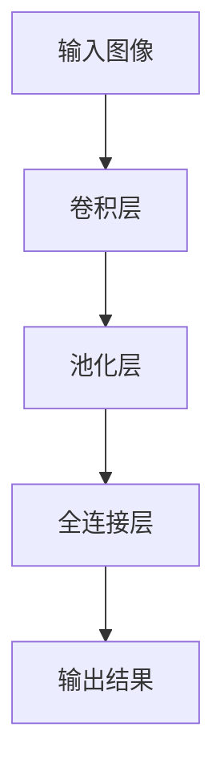
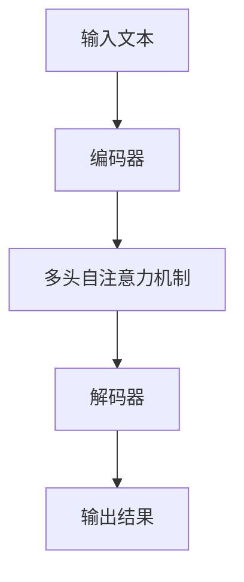
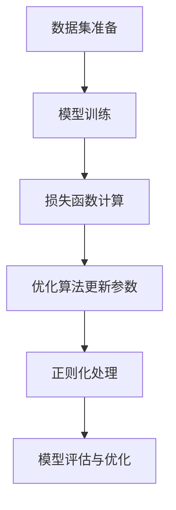
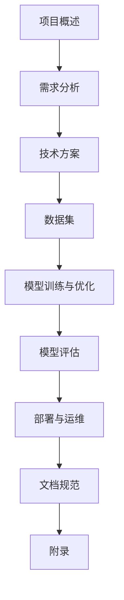
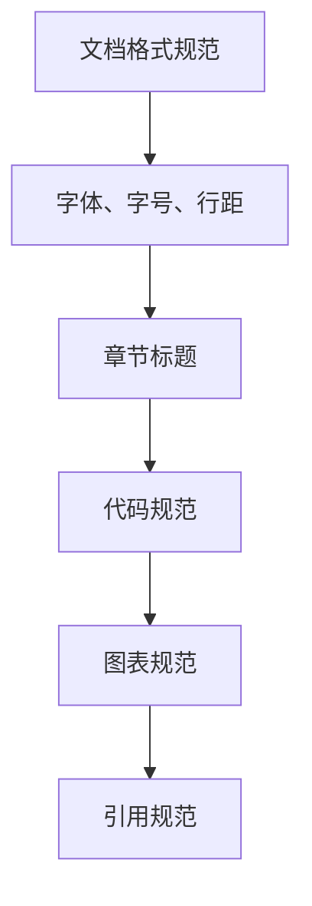
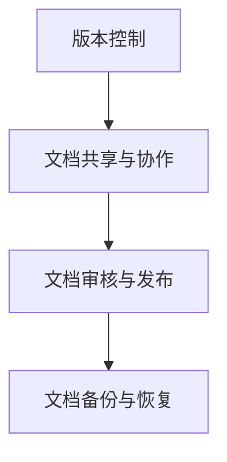
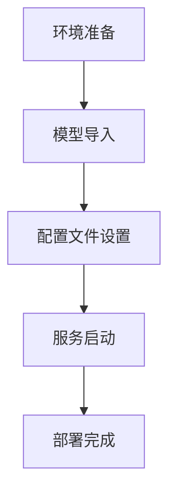
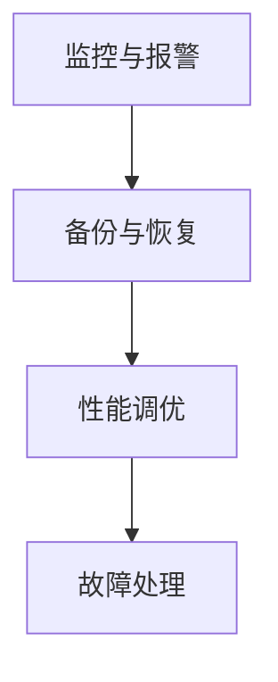
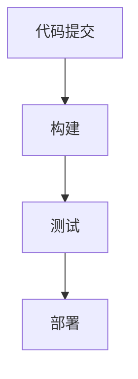

                 

### 《大模型应用开发中的技术文档管理》

---

**关键词：** 大模型、技术文档管理、文档共享与协作、版本控制、最佳实践

**摘要：** 本文章旨在系统性地介绍大模型应用开发中的技术文档管理，分析现有技术文档管理方法与工具的不足，探讨大模型技术基础与文档管理基础，提出大模型开发中的技术文档管理实践方案，并结合实际案例进行分析与效果评估，最后对未来发展趋势进行展望。文章通过清晰的逻辑结构和丰富的实践案例，帮助读者掌握大模型文档管理的方法和最佳实践，提高大模型项目开发的效率和质量。

---

### 引言与背景

#### 第1章 大模型应用开发中的技术文档管理概述

##### 1.1 问题背景

随着深度学习、大数据和云计算技术的快速发展，大模型（Large Models）在各个领域中得到了广泛应用。大模型通常具有数亿甚至千亿个参数，其复杂度和计算量远超传统模型，从而在图像识别、自然语言处理、推荐系统等领域取得了显著的成果。然而，大模型的开发与应用也面临着一系列挑战，其中技术文档管理是关键之一。

首先，大模型开发过程中涉及的数据集、算法、模型结构等要素繁多，如何有效地组织和管理这些文档，确保开发团队能够快速地获取和使用相关信息，成为一大难题。其次，大模型的迭代速度非常快，技术文档的更新和维护成本较高，如何确保文档的实时性和准确性，也是一个亟待解决的问题。

##### 1.2 技术文档管理现状

当前，技术文档管理的方法与工具有多种，如Git、Confluence、Readme文件等。这些工具在一定程度上解决了文档组织与共享的问题，但仍然存在一些问题与不足。

1. **文档一致性差**：由于不同团队和个人使用不同的文档格式和命名规范，导致文档内容不一致，给后续维护和查询带来困难。
2. **文档可读性低**：技术文档往往包含大量的专业术语和复杂结构，新手难以理解和阅读，影响了文档的使用效果。
3. **文档可维护性差**：大模型项目通常涉及多个版本和多次迭代，文档更新和维护成本高，且容易发生版本冲突和丢失。
4. **文档协作困难**：不同团队和成员之间缺乏有效的协作机制，文档的修改、审核和发布流程不够顺畅。

##### 1.3 本书目的与结构

本书的目的是探讨大模型应用开发中的技术文档管理，分析现有方法的不足，提出解决方案和最佳实践，帮助读者掌握大模型文档管理的方法和技巧，提高项目开发的效率和质量。

本书共分为五个部分，结构如下：

1. **第一部分：引言与背景**：介绍大模型应用开发中的技术文档管理问题背景、现状和本书的目的与结构。
2. **第二部分：大模型与文档管理基础知识**：介绍大模型技术基础和文档管理基础，包括大模型的定义、特点、原理，以及技术文档的定义、类型和管理原则。
3. **第三部分：大模型开发中的技术文档管理实践**：介绍大模型项目文档管理和部署与运维文档管理的实践方法，包括项目文档结构、撰写规范、协作与管理，以及部署文档、运维文档和持续集成与持续部署。
4. **第四部分：大模型文档管理的最佳实践与案例分析**：介绍大模型文档管理的最佳实践和实际案例分析，包括文档共享与协作、版本控制、文档审核与发布等。
5. **第五部分：未来展望与总结**：总结本书的主要内容，探讨大模型文档管理的未来趋势和展望。

通过以上结构，本书旨在为读者提供一份全面、系统、实用的技术文档管理指南，助力大模型应用开发项目的成功实施。

---

#### 第2章 大模型技术基础

##### 2.1 大模型概述

大模型（Large Models）是指具有数亿甚至千亿个参数的深度学习模型。这些模型在图像识别、自然语言处理、推荐系统等领域具有广泛的应用，其复杂度和计算量远超传统模型。大模型的定义可以基于以下几个特点：

1. **参数数量巨大**：大模型通常具有数亿甚至千亿个参数，这使得其能够捕捉更复杂的数据特征。
2. **计算资源需求高**：大模型训练过程中需要大量的计算资源和时间，尤其是在处理大规模数据集时。
3. **模型结构复杂**：大模型通常采用复杂的网络结构，如多层的卷积神经网络（CNN）、循环神经网络（RNN）等，以适应不同类型的数据。

大模型的发展历程可以追溯到20世纪90年代，当时随着计算能力和数据规模的提高，深度学习开始受到广泛关注。2006年，Hinton等人提出了深度信念网络（DBN），为深度学习模型的发展奠定了基础。2012年，AlexNet在ImageNet竞赛中取得了突破性的成绩，标志着深度学习在计算机视觉领域的崛起。此后，随着ResNet、Inception、Transformer等模型的提出，大模型在各个领域得到了广泛应用。

##### 2.2 大模型的原理

大模型的原理主要包括两个方面：计算机视觉模型和自然语言处理模型。

###### 2.2.1 计算机视觉模型

计算机视觉模型主要用于图像识别和分类任务。其中，卷积神经网络（CNN）是最常用的模型之一。CNN的基本原理是利用卷积操作提取图像中的特征，并通过全连接层进行分类。其基本架构包括卷积层、池化层和全连接层。

1. **卷积层**：卷积层通过卷积操作提取图像特征，卷积核在图像上滑动，计算局部区域的特征。
2. **池化层**：池化层用于减小数据规模，提高模型的泛化能力。常见的池化方法包括最大池化和平均池化。
3. **全连接层**：全连接层将卷积层提取的特征进行拼接，输入到全连接层进行分类。

以下是一个简单的CNN模型Mermaid流程图：



###### 2.2.2 自然语言处理模型

自然语言处理模型主要用于文本分类、语义理解、机器翻译等任务。其中，Transformer模型是最常用的模型之一。Transformer模型采用自注意力机制（Self-Attention），能够更好地捕捉文本中的长距离依赖关系。

1. **编码器**：编码器将输入文本编码为序列向量，每个向量表示文本中的一个词。
2. **解码器**：解码器将编码器输出的序列向量解码为输出结果，可以是分类标签或翻译结果。
3. **多头自注意力机制**：多头自注意力机制能够同时关注文本中的不同部分，提高模型的表示能力。

以下是一个简单的Transformer模型Mermaid流程图：



##### 2.3 大模型的构建与优化

大模型的构建与优化主要包括以下几个方面：

###### 2.3.1 数据集的准备与处理

数据集的准备与处理是构建大模型的基础。通常需要从以下方面进行：

1. **数据清洗**：去除数据中的噪声和异常值，提高数据质量。
2. **数据增强**：通过翻转、旋转、裁剪等操作增加数据多样性，提高模型的泛化能力。
3. **数据预处理**：对数据进行归一化、标准化等处理，使其符合模型输入要求。

###### 2.3.2 模型训练与优化方法

模型训练与优化主要包括以下几个方面：

1. **损失函数**：损失函数用于评估模型预测结果与真实标签之间的差距，常用的损失函数包括交叉熵损失函数、均方误差损失函数等。
2. **优化算法**：优化算法用于更新模型参数，常用的优化算法包括随机梯度下降（SGD）、Adam优化器等。
3. **正则化**：正则化用于防止模型过拟合，常用的正则化方法包括L1正则化、L2正则化、Dropout等。

以下是一个简单的模型训练与优化流程图：



通过以上方法，可以构建和优化大模型，使其在各个任务中取得更好的性能。

---

#### 第3章 技术文档管理基础

##### 3.1 技术文档的定义与类型

技术文档是指用于描述和说明某一技术项目、产品或系统的相关文档。其目的是为开发人员、测试人员、运维人员等提供详细的参考信息，确保项目顺利推进和系统的稳定运行。

根据文档的内容和用途，技术文档可以分为以下几种类型：

1. **用户手册**：用户手册主要用于指导用户如何使用产品或系统，通常包括安装、配置、操作和故障排除等内容。
2. **开发文档**：开发文档主要用于指导开发人员如何开发产品或系统，包括需求分析、设计文档、代码注释、测试计划等。
3. **测试文档**：测试文档主要用于描述测试过程、测试计划和测试结果，包括测试用例、测试报告等。
4. **运维文档**：运维文档主要用于指导运维人员如何维护和监控系统，包括部署文档、运维手册、监控和报警策略等。

##### 3.2 技术文档的管理原则

技术文档的管理原则包括一致性、可读性和可维护性，以下分别进行介绍：

###### 3.2.1 一致性

一致性是指技术文档的内容和格式应保持一致，以避免混淆和误解。具体包括：

1. **命名规范**：统一命名规范，如文件命名、变量命名、函数命名等。
2. **格式规范**：统一文档格式，如字体、字号、行距、段落缩进等。
3. **内容规范**：统一文档内容结构，如章节划分、段落标题、列表格式等。

为了实现一致性，可以制定一份统一的文档编写规范，并要求团队成员遵守。

###### 3.2.2 可读性

可读性是指技术文档应易于阅读和理解，以降低团队成员的学习成本。具体包括：

1. **简洁明了**：避免使用复杂的术语和冗长的句子，确保文档简洁明了。
2. **层次清晰**：通过使用标题、段落、列表等格式，使文档层次清晰，易于浏览。
3. **图文并茂**：适当使用图片、图表、代码示例等，帮助读者更好地理解文档内容。

为了提高可读性，可以定期进行文档审查和修改，确保文档质量。

###### 3.2.3 可维护性

可维护性是指技术文档应易于更新和维护，以适应项目迭代和版本变化。具体包括：

1. **版本控制**：使用版本控制系统（如Git）管理文档，确保文档的版本可追溯和可回滚。
2. **文档更新**：及时更新文档内容，以反映项目最新进展和变化。
3. **文档备份**：定期备份文档，避免数据丢失和损坏。

为了提高可维护性，可以制定一份文档维护计划，并明确文档更新的责任人和时间节点。

##### 3.3 技术文档管理工具

技术文档管理工具主要用于帮助团队高效地创建、存储、共享和管理技术文档。以下介绍几种常用的技术文档管理工具：

###### 3.3.1 Git

Git是一款开源的分布式版本控制系统，广泛用于代码管理和文档管理。Git的主要特点包括：

1. **版本控制**：Git可以记录文档的每次修改，实现版本控制和回滚。
2. **分布式存储**：Git采用分布式存储方式，每个团队成员都可以独立管理自己的文档版本。
3. **分支管理**：Git支持分支管理，方便团队成员协作开发。

Git的基本操作包括：

1. **克隆仓库**：`git clone <仓库地址>` 克隆一个远程仓库到本地。
2. **创建分支**：`git checkout -b <分支名>` 创建一个新的分支。
3. **提交更改**：`git add .` 添加所有更改的文件到暂存区，`git commit -m "提交说明"` 提交更改。
4. **合并分支**：`git merge <分支名>` 将一个分支合并到当前分支。

###### 3.3.2 Confluence

Confluence是一款协作式文档管理工具，广泛用于企业内部的文档管理和知识共享。Confluence的主要特点包括：

1. **富文本编辑**：Confluence支持富文本编辑，方便团队成员编辑和格式化文档。
2. **页面管理**：Confluence将文档组织为页面，便于团队成员查看和管理。
3. **权限控制**：Confluence支持权限控制，确保文档的安全性。

Confluence的主要功能包括：

1. **创建页面**：在Confluence中创建新的页面，并添加内容。
2. **版本控制**：记录页面的每次修改，实现版本控制和回滚。
3. **共享与协作**：支持多人协作编辑和评论，方便团队成员交流和协作。

###### 3.3.3 Readme文件

Readme文件是一种简单的文档格式，通常用于介绍项目的基本信息、使用方法和安装步骤。Readme文件的主要特点包括：

1. **简洁明了**：Readme文件通常采用简洁明了的格式，方便用户快速了解项目。
2. **易于修改**：Readme文件通常采用文本格式，便于用户和开发者修改。
3. **版本管理**：可以通过Git等版本控制系统对Readme文件进行版本管理。

Readme文件的主要内容包括：

1. **项目简介**：简要介绍项目的基本信息和目标。
2. **使用方法**：详细说明项目的使用方法和安装步骤。
3. **依赖库**：列出项目依赖的库和版本。
4. **贡献指南**：鼓励用户参与项目贡献，并提供相关的指导。

通过以上技术文档管理工具，团队可以高效地创建、存储、共享和管理技术文档，确保项目顺利进行。

---

#### 第4章 大模型项目文档管理

##### 4.1 项目文档结构

在大模型项目中，项目文档结构是文档管理的基础，其设计应遵循一致性、层次性和模块化的原则。以下是一个典型的大模型项目文档结构：

1. **项目概述**：包括项目简介、目标、背景和范围。
2. **需求分析**：详细描述项目需求和功能。
3. **技术方案**：包括模型选择、算法设计、数据处理等。
4. **数据集**：数据集描述、数据预处理方法、数据清洗等。
5. **模型训练与优化**：模型训练方法、参数设置、优化策略等。
6. **模型评估**：评估指标、评估方法、结果分析等。
7. **部署与运维**：部署流程、运维手册、监控与报警策略等。
8. **文档规范**：文档编写规范、命名规范、格式规范等。
9. **附录**：参考文献、代码示例、FAQ等。

以下是一个简单的项目文档结构Mermaid流程图：



##### 4.2 项目文档撰写规范

项目文档的撰写规范对于确保文档的质量和一致性至关重要。以下是一些常见的撰写规范：

1. **文档格式规范**：使用统一的字体、字号、行距和段落格式，确保文档的整洁和易读性。
2. **章节标题规范**：使用标题样式，区分不同层次的章节，如一级标题、二级标题、三级标题等。
3. **代码规范**：使用统一的代码风格，包括缩进、注释和命名规范，确保代码的可读性和可维护性。
4. **图表规范**：使用统一的图表样式，包括标题、坐标轴标签、图例等，确保图表的清晰和准确。
5. **引用规范**：使用统一的引用格式，如APA、MLA等，确保引用的正确性和一致性。

以下是一个简单的文档格式规范Mermaid流程图：



##### 4.3 项目文档协作与管理

项目文档的协作与管理是确保文档的实时性、准确性和一致性关键。以下是一些常见的协作与管理方法：

1. **版本控制**：使用版本控制系统（如Git）管理文档版本，确保文档的可追溯性和可回滚性。
2. **文档共享与协作**：使用云文档平台（如Google Docs、Confluence）实现文档的共享和协作，方便团队成员实时编辑和评论。
3. **文档审核与发布**：制定文档审核流程，确保文档的质量和准确性，并通过版本控制系统实现文档的发布和管理。
4. **文档备份与恢复**：定期备份文档，避免数据丢失和损坏，确保文档的安全性。

以下是一个简单的文档协作与管理流程图：



通过以上方法，可以有效地管理和协作项目文档，确保大模型项目的顺利进行。

---

#### 第5章 大模型部署与运维文档管理

##### 5.1 部署文档

部署文档是描述大模型在目标环境中部署的过程和配置的详细说明，它对于确保模型能够顺利上线和稳定运行至关重要。以下是部署文档的主要内容：

1. **部署流程**：详细描述从环境准备、模型导入、模型配置到最终部署的整个流程。
2. **环境要求**：列出部署所需的环境配置，包括操作系统、硬件配置、软件依赖等。
3. **部署步骤**：分步骤描述部署过程，包括模型文件的传输、配置文件的设置、服务的启动等。
4. **配置文件**：提供部署所需的配置文件，如模型配置文件、环境变量文件等。
5. **部署脚本**：提供自动化部署脚本，以便在相同或不同的环境中快速部署模型。

以下是一个简单的部署流程Mermaid流程图：



##### 5.2 运维文档

运维文档是描述大模型在上线后日常运维、监控和故障处理的过程和策略，它是保障模型稳定运行的重要文档。以下是运维文档的主要内容：

1. **监控与报警**：描述如何对模型进行监控，包括监控指标、监控工具和报警策略。
2. **备份与恢复**：描述如何对模型数据进行备份和恢复，以应对数据丢失或损坏的情况。
3. **性能调优**：提供性能调优的方法和策略，如调整模型参数、优化服务配置等。
4. **故障处理**：提供故障处理的流程和步骤，包括故障排查、故障恢复和故障报告等。

以下是一个简单的运维流程Mermaid流程图：



##### 5.3 持续集成与持续部署

持续集成（CI）和持续部署（CD）是实现自动化开发和运维的重要方法，可以大大提高开发效率和系统稳定性。以下是CI/CD的基本流程和部署脚本编写方法：

###### 5.3.1 CI/CD流程

1. **代码提交**：开发人员将代码提交到版本控制系统。
2. **构建**：构建服务器从版本控制系统拉取最新代码，并进行编译和打包。
3. **测试**：运行测试用例，确保代码质量。
4. **部署**：将成功构建的代码部署到测试或生产环境。

以下是一个简单的CI/CD流程Mermaid流程图：



###### 5.3.2 部署脚本编写

部署脚本用于自动化部署模型，以下是使用Python编写的简单部署脚本示例：

```python
import os

def deploy_model(model_path, config_path):
    # 检查模型文件是否存在
    if not os.path.exists(model_path):
        print(f"模型文件 {model_path} 不存在，请检查！")
        return

    # 检查配置文件是否存在
    if not os.path.exists(config_path):
        print(f"配置文件 {config_path} 不存在，请检查！")
        return

    # 启动服务
    os.system(f"python {model_path} &")
    os.system(f"python {config_path} &")

if __name__ == "__main__":
    model_path = "model.py"
    config_path = "config.py"
    deploy_model(model_path, config_path)
```

通过以上部署脚本，可以自动化部署大模型，提高部署效率。

---

#### 第6章 大模型文档管理的最佳实践

##### 6.1 文档共享与协作

在大型项目开发中，文档共享与协作是确保项目顺利进行和团队成员高效合作的关键。以下是文档共享与协作的一些最佳实践：

1. **使用云文档平台**：云文档平台（如Google Docs、Confluence）具有方便的在线编辑、协作和版本控制功能，有助于团队成员实时编辑和评论文档，提高协作效率。

2. **制定文档共享策略**：制定文档共享策略，明确哪些文档可以公开共享，哪些文档需要权限控制，以保障文档的安全性和机密性。

3. **定期文档审查**：定期对文档进行审查，确保文档内容准确、完整和最新，及时更新和修正文档中的错误和不足。

4. **建立文档规范**：建立统一的文档规范，包括命名规范、格式规范和编写规范，以确保文档的一致性和可读性。

5. **提供培训与指导**：为团队成员提供文档编写和协作的培训与指导，提高团队整体的技术文档能力。

##### 6.2 文档版本控制

文档版本控制是确保文档更新和维护的有效方法，以下是文档版本控制的一些最佳实践：

1. **使用版本控制系统**：使用版本控制系统（如Git）管理文档版本，实现文档的版本控制和回滚。

2. **制定版本控制策略**：制定版本控制策略，明确版本控制的流程、规则和责任，确保版本控制的规范性和一致性。

3. **定期备份**：定期备份文档，避免文档丢失和损坏，确保文档的安全性。

4. **文档审查**：在提交文档版本前进行审查，确保文档内容的准确性和完整性，避免版本错误和冲突。

5. **记录变更日志**：记录每次文档更新的内容、原因和责任人，便于后续的跟踪和回溯。

##### 6.3 文档审核与发布

文档审核与发布是确保文档质量和规范性的重要环节，以下是文档审核与发布的一些最佳实践：

1. **制定审核流程**：制定文档审核流程，明确审核的环节、标准和责任人，确保审核的规范性和有效性。

2. **审核标准**：制定文档审核标准，包括内容完整性、格式规范性、可读性等，确保审核的全面性和准确性。

3. **多级审核制度**：建立多级审核制度，包括初审、复审和终审，确保文档的审核质量。

4. **发布策略**：制定文档发布策略，明确发布的时机、方式和责任人，确保文档的发布及时性和规范性。

5. **文档签名**：在发布文档时，由审核人和发布人进行签名，确保文档的发布责任和可追溯性。

通过以上最佳实践，可以有效地管理和协作大模型文档，提高项目开发的效率和质量。

---

#### 第7章 大模型文档管理案例分析

##### 7.1 案例背景

某大型互联网企业正在开发一款基于深度学习的大规模图像识别系统，用于自动识别和分类上传的图像。该系统的开发周期较长，涉及多个团队和数百名开发人员。在项目实施过程中，技术文档管理成为了一个关键问题。为了确保项目顺利进行，企业决定对技术文档进行有效的管理。

##### 7.2 案例实施过程

为了提升技术文档的管理效率，企业采取了一系列措施，主要包括以下步骤：

1. **技术选型**：选择适合大模型项目的技术文档管理工具，如Git和Confluence。
2. **文档规范化**：制定统一的文档编写规范，包括命名规范、格式规范和编写规范，确保文档的一致性和可读性。
3. **文档结构设计**：设计合理的项目文档结构，包括项目概述、需求分析、技术方案、数据集、模型训练与优化、模型评估、部署与运维等部分。
4. **文档协作与管理**：使用Git和Confluence实现文档的版本控制和共享协作，确保团队成员实时获取和更新文档信息。
5. **文档审核与发布**：制定文档审核流程，包括初审、复审和终审，确保文档的质量和规范性。同时，制定文档发布策略，确保文档的发布及时性和规范性。
6. **培训与指导**：为团队成员提供技术文档编写和协作的培训与指导，提高团队整体的技术文档能力。

##### 7.3 案例效果评估

通过实施以上技术文档管理措施，企业取得了显著的效果，具体表现在以下几个方面：

1. **文档管理效率提升**：使用Git和Confluence实现了文档的版本控制和共享协作，大大提高了文档的管理效率，减少了文档丢失和冲突的情况。
2. **文档质量提高**：制定统一的文档编写规范和审核流程，确保了文档的内容完整性、格式规范性和可读性，提高了文档的质量。
3. **团队协作能力增强**：通过培训与指导，团队成员的技术文档能力得到了提升，团队协作更加顺畅，项目进展更加顺利。
4. **项目成功率提高**：技术文档管理的有效性提高了项目的透明度和可追溯性，减少了项目风险，提高了项目成功率。

通过以上案例分析，可以看出，有效的技术文档管理对于大模型项目开发具有重要意义，能够显著提高项目开发的效率和质量。

---

#### 第8章 大模型文档管理的未来趋势

##### 8.1 技术发展趋势

随着大模型技术的不断发展，技术文档管理也将面临新的挑战和机遇。以下是技术发展趋势对文档管理的影响：

1. **大模型技术的演进**：随着算法和硬件的进步，大模型的计算量和数据量将持续增长。这将要求技术文档管理工具具备更高的性能和可扩展性，以应对日益复杂的数据集和模型结构。

2. **人工智能文档生成**：人工智能技术（如自然语言处理和生成对抗网络）将被应用于文档生成，自动生成文档摘要、报告和文档内容。这将提高文档生成的效率和准确性，减少人工编写文档的工作量。

3. **文档智能化管理**：利用人工智能技术，文档管理将变得更加智能化，如自动索引、搜索和推荐功能，提高文档的可发现性和使用率。

4. **区块链技术**：区块链技术可能应用于文档管理，实现文档的不可篡改性和数据安全性，提高文档的可靠性和信任度。

##### 8.2 行业趋势

在各个行业中，大模型技术正迅速应用，技术文档管理的重要性也将日益凸显。以下是行业趋势对文档管理的影响：

1. **数字化转型**：随着企业数字化转型进程的加速，大模型技术将在更多领域得到应用，技术文档管理将成为企业核心竞争力的一部分。

2. **跨部门协作**：在跨部门协作中，技术文档管理将发挥重要作用，确保不同部门和团队之间的信息传递和沟通更加高效。

3. **法规遵从性**：随着监管要求的提高，技术文档管理需要确保符合相关法规和标准，如数据保护法规、行业规范等。

4. **文档智能化**：行业将越来越重视文档智能化管理，通过自动化工具和人工智能技术，实现文档的自动生成、分类、索引和检索。

通过以上技术发展和行业趋势，大模型文档管理将迎来新的发展机遇，对企业和开发人员提出更高的要求。未来，文档管理工具和方法的创新将推动大模型项目的成功实施。

---

#### 第9章 总结与展望

##### 9.1 本书总结

本书系统性地介绍了大模型应用开发中的技术文档管理，涵盖了从大模型技术基础到文档管理实践的各个方面。主要内容包括：

1. **大模型技术概述**：介绍了大模型的定义、特点、发展历程和基本原理。
2. **技术文档管理基础**：阐述了技术文档的定义、类型、管理原则和常用工具。
3. **大模型项目文档管理**：详细描述了项目文档的结构、撰写规范和协作管理方法。
4. **大模型部署与运维文档管理**：介绍了部署文档和运维文档的内容、编写规范和持续集成与部署方法。
5. **最佳实践与案例分析**：分享了文档共享与协作、版本控制、文档审核与发布的最佳实践，并分析了实际案例的效果。
6. **未来趋势**：探讨了技术发展和行业趋势对大模型文档管理的影响。

通过以上内容，本书旨在帮助读者掌握大模型文档管理的方法和最佳实践，提高项目开发的效率和质量。

##### 9.2 未来展望

未来，大模型文档管理将继续面临新的挑战和机遇。以下是一些展望：

1. **智能化管理**：随着人工智能技术的发展，文档管理将更加智能化，如自动生成、分类、索引和检索。
2. **区块链应用**：区块链技术可能应用于文档管理，提高文档的安全性和可靠性。
3. **跨领域融合**：大模型将在更多领域得到应用，技术文档管理将与其他领域（如项目管理、知识管理）深度融合。
4. **持续改进**：企业和开发人员将持续探索和改进文档管理工具和方法，以适应不断变化的业务需求和技术挑战。

总之，大模型文档管理将随着技术的发展和行业的进步不断演进，为项目的成功实施提供有力支持。

---

### 作者信息

**作者：AI天才研究院/AI Genius Institute & 禅与计算机程序设计艺术 /Zen And The Art of Computer Programming**

