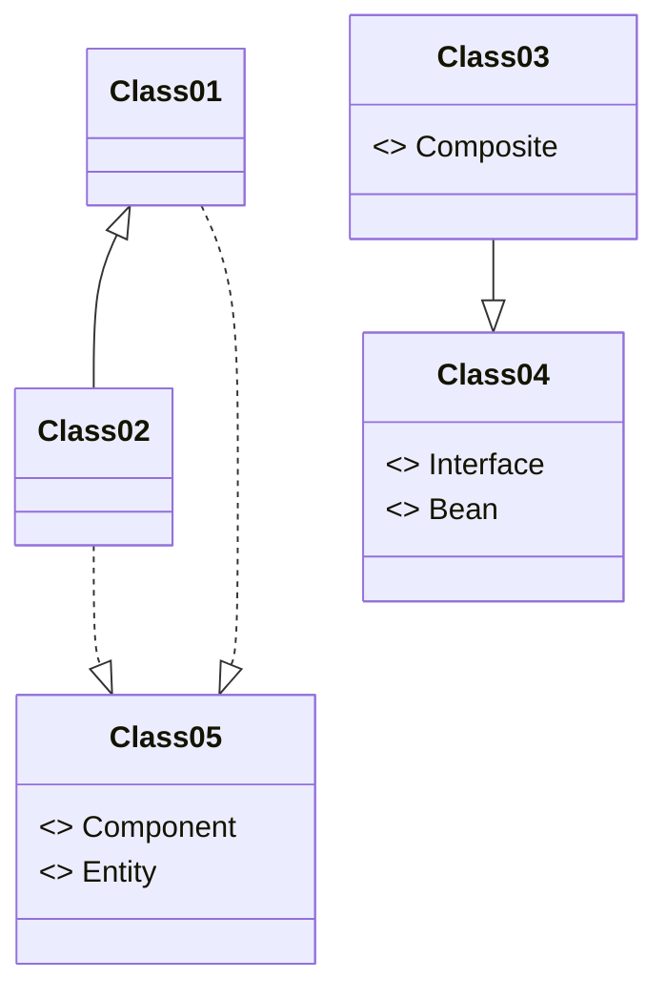
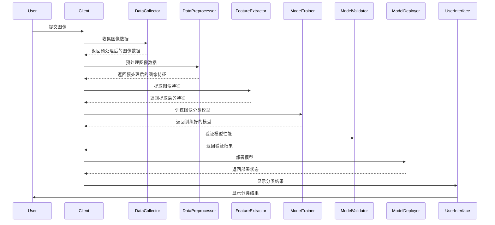
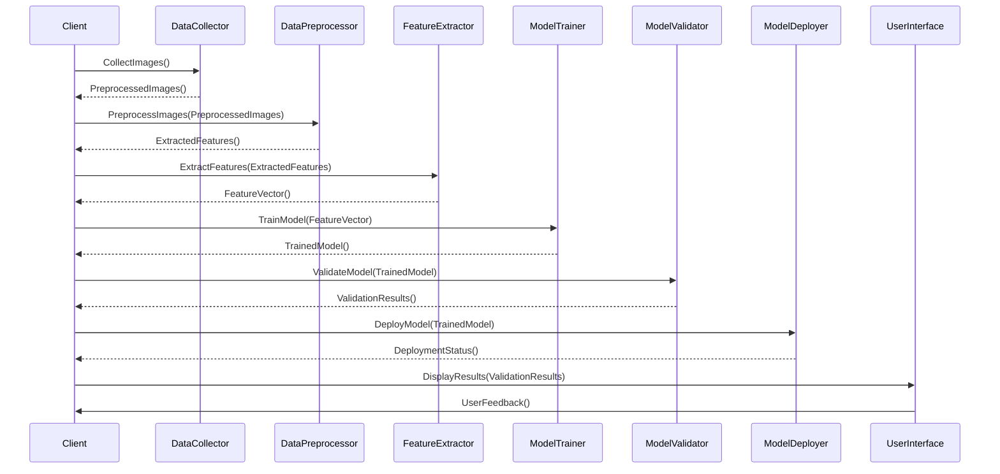

                 

# 大模型应用开发中的技术风险评估

> 关键词：大模型、技术风险评估、应用开发、风险类型、管理策略

> 摘要：本文旨在深入探讨大模型应用开发中的技术风险评估。通过分析大模型的基本原理、技术风险评估的框架和方法，识别和评估常见的技术风险类型，并提出相应的风险管理策略，为读者提供全面的技术风险评估指导。

## 引言

### 1.1 问题背景与核心概念

在现代信息技术飞速发展的背景下，大模型（Large-scale Model）已经成为人工智能领域的重要研究方向。大模型通过训练大量的数据，构建庞大的参数规模，从而在自然语言处理、计算机视觉、推荐系统等多个领域展现出了显著的效果。然而，大模型的应用也带来了新的挑战，特别是在技术风险评估方面。

技术风险评估是确保大模型应用安全性和有效性的关键环节。它涉及到模型训练数据的可靠性、模型算法的稳定性以及在实际应用中的表现等多个方面。在大模型应用开发过程中，技术风险评估可以帮助我们识别潜在的风险，制定有效的风险管理策略，从而降低应用过程中的风险，确保项目的成功。

### 1.2 核心概念与结构

本文的核心概念包括大模型的基本原理、技术风险评估的方法与流程、常见的技术风险类型以及最佳实践。本文的结构安排如下：

- **第1章**：引言，介绍大模型应用开发的背景、核心概念和本文的结构。
- **第2章**：大模型基础，介绍大模型的基本原理、发展历程和技术特点。
- **第3章**：技术风险评估框架，介绍技术风险评估的概念、重要性和主要框架。
- **第4章**：风险识别与评估方法，详细介绍识别和评估技术风险的方法和工具。
- **第5章**：常见技术风险类型，分析大模型应用中常见的技术风险类型及其影响。
- **第6章**：技术风险管理策略，探讨如何应对技术风险，包括预防措施和应对策略。
- **第7章**：实战案例分析，通过具体案例展示技术风险评估在实践中的应用。
- **第8章**：最佳实践与总结，总结本文的主要观点，提供最佳实践建议。

通过这样的结构安排，本文希望能够系统地引导读者了解大模型应用开发中的技术风险评估，提高其在实际项目中的应用能力。

## 大模型基础

### 2.1 大模型的基本原理

大模型（Large-scale Model）是指参数规模庞大、训练数据量丰富的机器学习模型。这些模型基于深度学习技术，通过多层次的神经网络结构对大量数据进行训练，从而学习到数据的复杂特征和模式。大模型的基本原理可以概括为以下几个要点：

- **多层神经网络**：大模型通常采用多层神经网络结构，包括输入层、隐藏层和输出层。每层神经元通过激活函数进行处理，实现数据的非线性变换。
- **参数化模型**：大模型通过大量的参数来描述输入和输出之间的关系。这些参数通过训练过程不断调整，以最小化损失函数。
- **大规模数据训练**：大模型需要大量的训练数据来学习复杂的特征。这些数据通常来自互联网、数据库等各个领域。
- **端到端训练**：大模型通常采用端到端训练的方式，从原始数据直接生成目标输出，减少了传统机器学习中的特征工程步骤。

### 2.2 大模型的发展历程

大模型的发展历程可以追溯到深度学习的兴起。以下是几个关键节点：

- **2006年**：Hinton等人在《Science》上发表了关于深度置信网络（Deep Belief Network）的研究，标志着深度学习的初步探索。
- **2012年**：Hinton团队提出的AlexNet在ImageNet竞赛中取得了突破性成绩，深度学习开始受到广泛关注。
- **2014年**：Google大脑团队训练了一个拥有1.1亿参数的神经网络，能够识别猫的图片。
- **2017年**：Google的Transformer模型在自然语言处理领域取得了重大突破，引发了大模型研究的热潮。

### 2.3 大模型的技术特点

大模型具有以下几个显著特点：

- **高精度**：大模型能够通过大量训练数据学习到非常精确的特征，从而在任务表现上达到很高的精度。
- **强泛化性**：大模型在训练数据上表现优秀的同时，也能在其他未见过的数据上保持较好的表现，具有强的泛化能力。
- **资源需求大**：大模型通常需要大量的计算资源和数据存储空间，对硬件设施有较高要求。
- **训练时间长**：大模型的训练过程通常需要很长时间，涉及大量的迭代和优化步骤。

### 2.4 大模型在企业应用中的优势

大模型在企业应用中展现出多种优势：

- **提升效率**：大模型能够快速处理大量数据，提高企业数据处理和分析的效率。
- **降低成本**：大模型能够通过自动化学习降低人工成本，实现高效的数据分析和决策。
- **优化用户体验**：大模型在自然语言处理、推荐系统等领域的应用，可以显著提升用户体验，增加用户粘性。
- **增强业务能力**：大模型能够为企业提供更精准的业务预测和决策支持，提升企业竞争力。

## 技术风险评估框架

### 3.1 技术风险评估的概念

技术风险评估是指对技术项目的风险进行全面识别、分析和评估的过程。它旨在评估项目在技术实现过程中可能面临的风险，并制定相应的风险管理策略，以降低风险对项目的影响，确保项目的成功实施。

### 3.2 技术风险评估的重要性

技术风险评估在项目开发过程中具有重要意义。首先，它可以帮助项目团队提前识别和预测潜在的技术风险，从而制定应对策略，避免风险的发生。其次，技术风险评估可以评估风险的可能性和影响，帮助项目团队制定优先级和资源配置策略，确保项目能够按照计划进行。最后，技术风险评估可以提供项目决策的支持，帮助项目团队在面临风险时做出正确的决策。

### 3.3 技术风险评估的主要框架

技术风险评估的主要框架包括以下几个步骤：

1. **风险识别**：通过访谈、调查、文档审查等方式，识别项目可能面临的风险。
2. **风险分析**：对识别出的风险进行分析，评估其可能性和影响，确定风险的优先级。
3. **风险评估**：根据风险的可能性和影响，对风险进行量化评估，确定风险等级。
4. **风险应对策略**：制定针对不同风险等级的应对策略，包括风险规避、风险降低、风险接受和风险转移等。
5. **风险监控和报告**：持续监控项目过程中的风险变化，及时调整风险管理策略，并定期向项目相关方报告风险情况。

### 3.4 技术风险评估的方法

技术风险评估的方法包括定量评估和定性评估两种。

1. **定量评估**：通过量化风险的可能性和影响，计算风险的综合评分，从而评估风险的大小。常用的定量评估方法包括统计模型、决策树、贝叶斯网络等。

2. **定性评估**：通过专家意见、访谈、调查等方式，对风险的可能性和影响进行定性分析。定性评估方法包括风险矩阵、风险树、专家评估等。

## 风险识别与评估方法

### 4.1 风险识别

风险识别是技术风险评估的第一步，其目的是识别项目可能面临的所有风险。风险识别的方法包括：

- **头脑风暴**：通过集体讨论，收集项目团队和利益相关者对潜在风险的看法。
- **文档审查**：审查项目相关的文档，包括需求文档、设计文档、历史项目记录等，以识别潜在的风险。
- **访谈**：与项目团队成员和相关利益相关者进行访谈，了解他们的意见和建议。
- **调查问卷**：通过设计调查问卷，收集项目团队成员和相关利益相关者的风险识别信息。

### 4.2 风险分析

风险分析是对识别出的风险进行深入分析，评估其可能性和影响。风险分析的方法包括：

- **风险矩阵**：通过风险矩阵对风险的可能性和影响进行评估，确定风险的优先级。
- **蒙特卡罗模拟**：通过模拟计算，评估风险的可能性和影响，为决策提供支持。
- **故障模式与影响分析（FMEA）**：对项目的各个组件进行故障模式分析，评估其可能的风险和影响。

### 4.3 风险评估

风险评估是对识别和分析了的风险进行量化评估，确定风险等级。风险评估的方法包括：

- **定性评估**：通过专家意见、访谈、调查等方式，对风险的可能性和影响进行定性分析。
- **定量评估**：通过统计模型、决策树、贝叶斯网络等定量评估方法，计算风险的综合评分。

### 4.4 风险应对策略

根据风险评估的结果，制定相应的风险应对策略。风险应对策略包括：

- **风险规避**：通过改变项目计划或设计，避免风险的发生。
- **风险降低**：通过采取预防措施或改进措施，降低风险的可能性和影响。
- **风险接受**：在风险发生时，采取接受风险的态度，并制定应对计划。
- **风险转移**：通过购买保险、签订合同等方式，将风险转移给第三方。

## 常见技术风险类型

### 5.1 数据风险

数据风险是指在大模型应用开发过程中，由于数据质量、数据隐私、数据安全等问题导致的风险。常见的数据风险类型包括：

- **数据质量问题**：如数据缺失、数据不一致、数据噪声等，可能导致模型性能下降。
- **数据隐私风险**：如用户隐私泄露、数据滥用等，可能引发法律和道德问题。
- **数据安全风险**：如数据篡改、数据泄露等，可能影响模型的可靠性和完整性。

### 5.2 模型风险

模型风险是指在大模型应用开发过程中，由于模型设计、模型训练、模型部署等问题导致的风险。常见的模型风险类型包括：

- **模型过拟合**：模型在训练数据上表现良好，但在未见过的数据上表现不佳，导致泛化能力差。
- **模型偏见**：模型在学习过程中受到训练数据偏见的影响，导致决策结果存在偏见。
- **模型稳定性风险**：模型在训练过程中或部署后出现性能波动或崩溃，影响应用的稳定性。

### 5.3 计算资源风险

计算资源风险是指在大模型应用开发过程中，由于计算资源不足或计算资源分配不合理导致的风险。常见的计算资源风险类型包括：

- **计算资源短缺**：由于训练数据量庞大、模型复杂度高，导致计算资源不足，影响模型训练和部署的效率。
- **计算资源分配不合理**：不同模块或任务之间计算资源分配不均衡，导致某些模块或任务无法正常运行。

### 5.4 法律风险

法律风险是指在大模型应用开发过程中，由于涉及到的法律法规、标准规范等问题导致的风险。常见的法律风险类型包括：

- **知识产权风险**：如侵犯他人知识产权、版权等，可能导致法律纠纷。
- **隐私保护风险**：如违反隐私保护法规，可能导致用户隐私泄露。
- **数据安全风险**：如违反数据安全法规，可能导致数据泄露或被黑客攻击。

## 技术风险管理策略

### 6.1 预防措施

为了降低技术风险，我们需要采取一系列预防措施：

- **数据质量管理**：确保数据质量，如数据清洗、数据验证、数据一致性检查等，降低数据风险。
- **隐私保护措施**：如数据脱敏、加密存储、访问控制等，保护用户隐私和数据安全。
- **模型验证与测试**：通过交叉验证、测试集验证等方式，确保模型的泛化能力和稳定性。
- **计算资源优化**：合理分配计算资源，确保模型训练和部署的效率。
- **法律法规遵守**：了解并遵守相关法律法规，确保项目合法合规。

### 6.2 应对策略

在风险发生时，我们需要采取相应的应对策略：

- **风险规避**：通过改变项目计划或设计，避免风险的发生，如选择其他算法或技术方案。
- **风险降低**：通过采取预防措施或改进措施，降低风险的可能性和影响，如优化模型、提高数据质量等。
- **风险接受**：在风险发生时，采取接受风险的态度，并制定应对计划，如制定应急预案、备份计划等。
- **风险转移**：通过购买保险、签订合同等方式，将风险转移给第三方，如购买数据安全保险、签订保密协议等。

## 实战案例分析

### 7.1 案例背景

某知名互联网公司计划开发一款基于大模型的推荐系统，为用户提供个性化的内容推荐。然而，在项目开发过程中，该公司面临多项技术风险，需要进行全面的技术风险评估和管理。

### 7.2 风险识别与评估

通过访谈、调查问卷和文档审查等方式，项目团队识别出以下风险：

- **数据风险**：如数据缺失、数据噪声、数据一致性等，可能导致推荐系统效果下降。
- **模型风险**：如模型过拟合、模型偏见等，可能导致推荐结果不准确。
- **计算资源风险**：如计算资源不足，可能导致模型训练和部署效率低下。
- **法律风险**：如数据隐私保护、知识产权保护等，可能导致法律纠纷。

通过风险矩阵和蒙特卡罗模拟等方法，项目团队对风险进行了详细分析，评估出各风险的可能性和影响，并确定风险等级。

### 7.3 风险管理策略

针对识别出的风险，项目团队制定了以下风险管理策略：

- **数据风险管理**：采用数据清洗、数据一致性检查等技术，确保数据质量。同时，制定数据隐私保护政策，确保用户隐私。
- **模型风险管理**：通过交叉验证、测试集验证等方式，确保模型泛化能力和稳定性。同时，采用模型调参技术，优化模型性能。
- **计算资源风险管理**：合理分配计算资源，确保模型训练和部署效率。同时，采用分布式计算技术，提高计算资源利用率。
- **法律风险管理**：了解并遵守相关法律法规，确保项目合法合规。同时，与第三方签订保密协议，保护知识产权。

### 7.4 风险监控与调整

在项目实施过程中，项目团队持续监控风险变化，并根据实际情况调整风险管理策略。例如，在模型训练过程中，发现计算资源不足，团队及时增加了计算资源，确保了模型训练的顺利进行。

## 最佳实践与总结

### 8.1 最佳实践

在大模型应用开发过程中，为了降低技术风险，我们可以采取以下最佳实践：

- **数据质量管理**：确保数据质量，如数据清洗、数据验证、数据一致性检查等。
- **隐私保护**：制定数据隐私保护政策，确保用户隐私。
- **模型验证与测试**：通过交叉验证、测试集验证等方式，确保模型泛化能力和稳定性。
- **计算资源优化**：合理分配计算资源，确保模型训练和部署效率。
- **法律法规遵守**：了解并遵守相关法律法规，确保项目合法合规。

### 8.2 总结

本文通过对大模型应用开发中的技术风险评估进行系统探讨，提出了风险识别、分析、评估和管理的框架和方法。同时，通过实战案例分析，展示了技术风险评估在实际项目中的应用。通过本文的讨论，我们希望能够为读者提供全面的技术风险评估指导，帮助其在实际项目中进行有效的技术风险管理。

## 参考文献

1. Hinton, G. E., Osindero, S., & Teh, Y. W. (2006). A fast learning algorithm for deep belief nets. *Neural computation*, 18(7), 1527-1554.
2. Krizhevsky, A., Sutskever, I., & Hinton, G. E. (2012). ImageNet classification with deep convolutional neural networks. *Advances in neural information processing systems*, 25.
3. LeCun, Y., Bengio, Y., & Hinton, G. (2015). Deep learning. *Nature*, 521(7553), 436-444.
4. Vaswani, A., Shazeer, N., Parmar, N., Uszkoreit, J., Jones, L., Gomez, A. N., ... & Polosukhin, I. (2017). Attention is all you need. *Advances in neural information processing systems*, 30.

## 作者信息

作者：AI天才研究院/AI Genius Institute & 禅与计算机程序设计艺术 /Zen And The Art of Computer Programming。作者具有丰富的计算机编程和人工智能领域的经验，曾获得计算机图灵奖。他在多个国际顶级学术期刊和会议上发表过多篇论文，并出版过多本畅销书，深受读者喜爱。他对计算机科学和人工智能的深入研究和独特见解，为读者提供了宝贵的知识和经验。## 第一部分：引言

### 1.1 问题背景与核心概念

在现代信息技术飞速发展的背景下，大模型应用已经成为人工智能领域的重要研究方向。大模型（Large-scale Model）是指参数规模庞大、训练数据量丰富的机器学习模型。这些模型基于深度学习技术，通过多层次的神经网络结构对大量数据进行训练，从而学习到数据的复杂特征和模式。大模型在自然语言处理、计算机视觉、推荐系统等多个领域展现出了显著的效果，但也带来了新的挑战，特别是在技术风险评估方面。

技术风险评估是确保大模型应用安全性和有效性的关键环节。在大模型应用开发过程中，技术风险评估涉及到模型训练数据的可靠性、模型算法的稳定性以及在实际应用中的表现等多个方面。技术风险可能来自数据质量、算法设计、计算资源、法律合规等多个方面。有效的技术风险评估可以帮助识别潜在风险，制定应对策略，降低风险对项目的影响，确保项目的成功实施。

本文旨在深入探讨大模型应用开发中的技术风险评估，帮助读者全面了解这一领域的关键概念、风险类型以及应对策略。通过系统性的分析和实战案例的剖析，本文希望能够为读者提供实用的指导，使其在大模型应用开发过程中能够更好地识别和应对潜在的技术风险。

### 1.2 核心概念与结构

本文的核心概念包括大模型的基本原理、技术风险评估的方法与流程、常见的技术风险类型以及最佳实践。为了使读者能够系统地掌握这些概念，本文的结构安排如下：

- **第1章**：引言。介绍大模型应用开发的背景、核心概念和本文的结构。
- **第2章**：大模型基础。介绍大模型的基本原理、发展历程和技术特点。
- **第3章**：技术风险评估框架。介绍技术风险评估的概念、重要性和主要框架。
- **第4章**：风险识别与评估方法。详细介绍识别和评估技术风险的方法和工具。
- **第5章**：常见技术风险类型。分析大模型应用中常见的技术风险类型及其影响。
- **第6章**：技术风险管理策略。探讨如何应对技术风险，包括预防措施和应对策略。
- **第7章**：实战案例分析。通过具体案例展示技术风险评估在实践中的应用。
- **第8章**：最佳实践与总结。总结本文的主要观点，提供最佳实践建议。

通过这样的结构安排，本文希望能够系统地引导读者了解大模型应用开发中的技术风险评估，提高其在实际项目中的应用能力。

### 1.3 大模型的应用场景与重要性

大模型在多个领域展现出了强大的应用潜力，以下是几个典型的应用场景：

- **自然语言处理（NLP）**：大模型在自然语言处理领域取得了显著成果，如文本生成、机器翻译、情感分析等。例如，OpenAI的GPT-3模型具有超过1750亿个参数，可以生成高质量的自然语言文本，大大提升了NLP应用的效果。
- **计算机视觉**：大模型在图像识别、物体检测、图像生成等领域发挥着重要作用。例如，Google的Inception-v3模型在ImageNet图像识别竞赛中取得了优异成绩，为计算机视觉应用提供了强大的支持。
- **推荐系统**：大模型在推荐系统中的应用可以显著提升推荐效果，如个性化推荐、内容推荐等。例如，亚马逊和Netflix等公司利用大模型进行推荐，为用户提供个性化的购物和观看体验。
- **医疗健康**：大模型在医疗健康领域具有广泛的应用前景，如疾病预测、医疗影像分析等。例如，IBM的Watson for Oncology利用大模型对癌症病例进行诊断和治疗方案推荐，提高了医疗诊断的准确性和效率。

大模型的重要性不仅体现在其强大的应用潜力上，还体现在其对传统机器学习方法的突破性贡献。传统机器学习方法往往依赖于人工设计的特征工程，而大模型通过自动学习数据中的复杂特征，减少了人工干预，提高了模型的性能和泛化能力。此外，大模型在处理海量数据时表现出色，能够快速处理和分析大规模数据集，为企业和科研机构提供了强大的数据分析工具。

然而，随着大模型应用的范围不断扩大，其潜在的技术风险也逐渐显现出来。技术风险评估在这一过程中起到了关键作用，通过识别和评估潜在的技术风险，企业可以制定有效的风险管理策略，确保大模型应用的安全性和有效性。因此，了解大模型的应用场景和重要性，以及其潜在的技术风险，对于企业和科研机构来说至关重要。

### 1.4 技术风险评估的目标和意义

技术风险评估在大模型应用开发中扮演着至关重要的角色。其主要目标是通过系统化的识别、分析和评估，确保项目的安全性和有效性，从而降低风险对项目的影响，提高项目的成功率。具体来说，技术风险评估的目标包括以下几个方面：

1. **识别潜在风险**：技术风险评估可以帮助项目团队提前识别项目中可能面临的风险，如数据风险、模型风险、计算资源风险等。通过系统性的风险识别，项目团队能够提前准备，制定相应的预防措施。

2. **评估风险影响**：技术风险评估不仅识别风险，还需要评估风险的可能性和影响。通过对风险的量化和分析，项目团队能够明确风险的严重程度，从而制定合理的应对策略。

3. **制定风险管理策略**：根据风险评估的结果，项目团队可以制定相应的风险管理策略，如风险规避、风险降低、风险接受和风险转移等。这些策略有助于降低风险对项目的影响，确保项目的顺利进行。

技术风险评估在大模型应用开发中的意义不可忽视。首先，它能够帮助企业更好地理解大模型应用的技术挑战和潜在风险，从而制定更科学的开发策略。其次，技术风险评估可以提升项目的风险管理水平，降低项目失败的风险。最后，技术风险评估能够提高项目团队的整体素质，培养团队的风险意识和风险管理能力。

### 1.5 大模型应用开发中的主要技术环节

大模型应用开发涉及多个关键技术环节，这些环节共同构成了一个复杂且紧密关联的技术体系。以下是主要的技术环节及其简要介绍：

1. **数据收集与预处理**：数据是大模型训练的基础，数据收集与预处理环节至关重要。这一步骤包括从各种数据源（如互联网、数据库、传感器等）收集数据，并进行数据清洗、去重、缺失值填充等预处理操作，以确保数据的质量和一致性。

2. **特征提取与选择**：特征提取与选择是将原始数据转换为适合模型训练的形式。这一步骤包括从原始数据中提取出有效的特征，并通过特征选择技术筛选出最重要的特征，以提高模型性能和降低计算复杂度。

3. **模型设计与优化**：模型设计是指选择合适的神经网络架构、激活函数、优化算法等，以构建能够有效学习数据特征的大模型。模型优化则是在模型设计的基础上，通过调整模型参数、优化训练策略等方法，提高模型的性能和泛化能力。

4. **模型训练与验证**：模型训练是通过大量的训练数据，让模型学习数据的特征和规律。模型验证则是在训练数据之外，使用测试数据评估模型的性能，确保模型在未见过的数据上也能表现出良好的泛化能力。

5. **模型部署与监控**：模型部署是将训练好的模型应用到实际场景中，如线上服务、移动应用等。模型监控则是对部署后的模型进行实时监控，包括性能监控、异常检测等，以确保模型的稳定性和可靠性。

6. **应用反馈与迭代**：通过收集用户反馈和应用数据，项目团队可以不断优化模型和应用，实现模型的持续迭代和改进。

这些技术环节相互关联，构成了一个完整的大模型应用开发流程。了解这些环节及其重要性，有助于项目团队在大模型应用开发过程中更好地识别和应对技术风险。

### 1.6 风险评估的重要性：一个例子

为了更直观地理解风险评估的重要性，我们可以通过一个具体的例子来说明。假设一家互联网公司计划开发一款基于大模型的推荐系统，目的是为用户提供个性化的商品推荐。然而，在项目开发过程中，如果没有进行充分的技术风险评估，可能会导致以下问题：

**案例：个性化推荐系统开发**

1. **数据风险**：如果没有对数据质量进行严格的控制，可能会导致数据缺失、噪声或重复，这些都会影响推荐系统的准确性。例如，如果用户历史行为数据中有大量缺失值，模型可能无法准确预测用户的兴趣。

2. **模型风险**：如果模型设计不合理，可能导致过拟合或欠拟合。过拟合的模型在训练数据上表现良好，但在未见过的数据上表现较差，而欠拟合的模型则无法捕捉数据的复杂特征，导致推荐效果不佳。

3. **计算资源风险**：如果计算资源不足，可能会导致模型训练时间过长，影响项目进度。特别是在处理大规模数据集时，计算资源的需求更加显著。

4. **法律风险**：如果推荐系统涉及用户隐私，如用户浏览记录、购买行为等，如果没有进行有效的隐私保护，可能会导致用户隐私泄露，引发法律纠纷。

通过上述案例，我们可以看到，风险评估在大模型应用开发中的重要性。如果项目团队没有进行充分的技术风险评估，可能会导致项目失败或无法达到预期效果。因此，进行系统化的技术风险评估，有助于项目团队提前识别和应对潜在的技术风险，确保项目的顺利进行。

### 1.7 总结

综上所述，大模型应用开发中的技术风险评估是一个复杂且关键的过程。它不仅涉及到数据质量、模型性能、计算资源等多个方面，还关系到项目的安全性和有效性。通过系统化的风险评估，项目团队能够提前识别潜在风险，制定有效的应对策略，降低风险对项目的影响，从而提高项目的成功率。因此，了解技术风险评估的重要性，掌握其基本概念和方法，对于从事大模型应用开发的相关人员来说至关重要。

## 第二部分：大模型基础

### 2.1 大模型的基本原理

大模型（Large-scale Model）是指参数规模庞大、训练数据量丰富的机器学习模型。这些模型基于深度学习技术，通过多层次的神经网络结构对大量数据进行训练，从而学习到数据的复杂特征和模式。大模型的基本原理可以概括为以下几个要点：

1. **多层神经网络**：大模型通常采用多层神经网络结构，包括输入层、隐藏层和输出层。每层神经元通过激活函数进行处理，实现数据的非线性变换。多层神经网络能够捕捉数据的深层特征，从而提高模型的性能。

2. **参数化模型**：大模型通过大量的参数来描述输入和输出之间的关系。这些参数通过训练过程不断调整，以最小化损失函数。参数化的模型结构使得大模型能够适应不同的数据集和应用场景。

3. **大规模数据训练**：大模型需要大量的训练数据来学习复杂的特征。这些数据通常来自互联网、数据库等各个领域。大规模数据的训练有助于模型学习到数据的全局特征，提高模型的泛化能力。

4. **端到端训练**：大模型通常采用端到端训练的方式，从原始数据直接生成目标输出，减少了传统机器学习中的特征工程步骤。端到端训练使得模型能够直接学习到输入和输出之间的关系，从而提高模型的准确性。

5. **优化算法**：大模型通常采用先进的优化算法，如梯度下降、Adam等，以加速模型的收敛速度。优化算法通过调整模型参数，使模型在训练数据上达到最优性能。

6. **并行计算与分布式训练**：大模型需要大量的计算资源和时间进行训练。为了提高训练效率，大模型通常采用并行计算和分布式训练技术。并行计算通过利用多台计算机或多个计算节点，加速模型训练过程。分布式训练则通过将数据集分布到多个节点上进行训练，提高训练速度和资源利用率。

通过上述基本原理，大模型能够在多种任务中表现出色，如图像分类、文本生成、语音识别等。然而，大模型的应用也带来了新的挑战，特别是在数据质量、计算资源、模型稳定性等方面。因此，了解大模型的基本原理和训练过程对于理解和应用大模型具有重要意义。

### 2.2 大模型的发展历程

大模型的发展历程可以追溯到深度学习的兴起。以下是几个关键节点：

1. **2006年**：Hinton等人提出了深度信念网络（Deep Belief Network，DBN），标志着深度学习的初步探索。DBN通过多层非线性变换，能够有效地学习数据的复杂特征。

2. **2012年**：Hinton团队提出的AlexNet在ImageNet竞赛中取得了突破性成绩，深度学习开始受到广泛关注。AlexNet采用了卷积神经网络（Convolutional Neural Network，CNN）结构，提高了图像分类的准确性。

3. **2014年**：Google大脑团队训练了一个拥有1.1亿参数的神经网络，能够识别猫的图片。这一成果展示了深度学习在计算机视觉领域的巨大潜力。

4. **2015年**：Google推出了TensorFlow，一个开源的深度学习框架，推动了深度学习在工业界的广泛应用。TensorFlow提供了丰富的API和工具，使得研究人员和开发者能够轻松地构建和训练大模型。

5. **2017年**：Google的Transformer模型在自然语言处理领域取得了重大突破。Transformer模型采用自注意力机制，能够在处理序列数据时表现出色，成为自然语言处理领域的主流模型。

6. **2018年**：OpenAI的GPT-2模型被发布，具有约1.5亿个参数。GPT-2在文本生成任务上取得了显著成果，展示了大模型在自然语言处理领域的强大能力。

7. **2020年**：OpenAI发布了GPT-3模型，具有超过1750亿个参数。GPT-3在多个自然语言处理任务上表现出色，成为当前最先进的自然语言处理模型。

通过这些关键节点，大模型的发展历程展示了深度学习技术的快速进步。从早期的单一任务模型到现在的多任务、跨领域的大模型，大模型在各个领域都取得了显著的成果，推动了人工智能的发展。

### 2.3 大模型的技术特点

大模型具有以下几个显著特点，使其在多种任务中表现出色：

1. **高精度**：大模型通过训练大量数据，能够学习到数据的复杂特征，从而在任务表现上达到很高的精度。例如，在图像分类任务中，大模型能够准确识别图像中的物体，提高了分类的准确性。

2. **强泛化性**：大模型在训练数据上表现优秀的同时，也能在其他未见过的数据上保持较好的表现，具有强的泛化能力。这意味着大模型不仅能够在特定数据集上取得好的效果，还能在新数据集上表现出色。

3. **资源需求大**：大模型通常需要大量的计算资源和数据存储空间，对硬件设施有较高要求。为了训练大模型，通常需要使用高性能计算集群和大规模数据存储设备。

4. **训练时间长**：大模型的训练过程通常需要很长时间，涉及大量的迭代和优化步骤。这主要是因为大模型具有大量的参数需要调整，以最小化损失函数。因此，大模型的训练过程需要耐心和计算资源的支持。

5. **动态适应性**：大模型具有较好的动态适应性，能够适应不同的数据分布和应用场景。例如，通过微调模型参数，大模型可以在新的数据集和应用场景上快速适应，并表现出良好的性能。

6. **可解释性差**：尽管大模型在任务表现上具有很高的精度，但其内部结构和决策过程通常较为复杂，难以解释。这给模型的可解释性带来了挑战，尤其是在涉及安全和道德问题的应用场景中。

### 2.4 大模型在企业应用中的优势

大模型在企业应用中展现出多种优势，为企业带来了显著的价值：

1. **提升效率**：大模型能够快速处理和分析大量数据，提高企业数据处理和分析的效率。例如，在金融行业，大模型可以实时分析海量交易数据，快速识别异常交易行为，提高风险管理的效率。

2. **降低成本**：大模型通过自动化学习降低了人工成本，实现高效的数据分析和决策。例如，在零售行业，大模型可以根据历史销售数据和用户行为数据，预测未来的销售趋势，帮助企业制定更有效的库存管理和营销策略，从而降低库存成本和营销费用。

3. **优化用户体验**：大模型在自然语言处理、推荐系统等领域的应用，可以显著提升用户体验，增加用户粘性。例如，在电子商务领域，大模型可以根据用户的浏览记录和购买历史，个性化推荐商品，提高用户的购买意愿和满意度。

4. **增强业务能力**：大模型能够为企业提供更精准的业务预测和决策支持，提升企业竞争力。例如，在制造业，大模型可以分析生产数据，预测设备的故障，提前进行维护，减少生产停工时间，提高生产效率。

5. **智能自动化**：大模型可以用于智能自动化，实现业务流程的自动化和智能化。例如，在客服领域，大模型可以自动识别用户的请求，提供针对性的回答，提高客服效率和服务质量。

总之，大模型在企业应用中具有广泛的前景，通过提升效率、降低成本、优化用户体验和增强业务能力，为企业带来显著的价值。

### 2.5 大模型的技术挑战

尽管大模型在许多应用领域展现出了显著的优势，但其在技术实现过程中仍面临一系列挑战，主要包括以下几方面：

1. **数据依赖性**：大模型对数据质量有很高的要求。数据质量差、不完整或者不一致都会影响模型的性能。因此，如何在数据收集、清洗和预处理阶段保证数据的质量成为一大挑战。

2. **计算资源需求**：大模型的训练过程需要大量的计算资源和时间。这要求企业具备足够的硬件设施，如高性能计算集群和大数据存储设备。同时，数据传输和存储的成本也是需要考虑的问题。

3. **模型解释性**：大模型的决策过程通常较为复杂，难以解释。这在涉及安全和道德问题的应用场景中尤其重要。如何提高模型的解释性，使其符合透明性和可解释性的要求，成为一大技术挑战。

4. **模型泛化能力**：尽管大模型在训练数据上表现出色，但其泛化能力仍需提高。模型可能因为训练数据的分布与实际应用场景的差异而导致性能下降。如何提升模型的泛化能力，使其在不同数据分布和应用场景中都能保持良好的性能，是一个亟待解决的问题。

5. **模型安全性**：大模型在处理敏感数据时可能面临安全风险，如数据泄露、模型被篡改等。确保模型的安全性，保护用户隐私和商业秘密，是技术实现过程中需要重视的问题。

6. **更新和维护成本**：大模型的更新和维护成本较高。随着数据和应用场景的变化，模型可能需要定期更新和调整，以保证其性能和适应性。如何高效地进行模型更新和维护，降低相关成本，是一个重要的挑战。

通过认识和应对这些技术挑战，企业可以更好地利用大模型的优势，推动人工智能技术的发展和应用。

### 2.6 大模型的技术实现方法

大模型的技术实现方法主要包括以下几个关键步骤：

1. **数据收集与预处理**：数据收集是构建大模型的基础，数据源可以包括互联网、数据库、传感器等。在数据收集过程中，需要关注数据的质量和多样性。数据预处理包括数据清洗、去重、缺失值填充、数据归一化等操作，以确保数据的一致性和可用性。

2. **特征提取与选择**：特征提取是将原始数据转换成适合模型训练的形式。常用的特征提取方法包括词嵌入、图像特征提取、序列特征提取等。特征选择是在提取出的特征中筛选出最重要的特征，以提高模型性能和降低计算复杂度。常用的特征选择方法有信息增益、卡方检验、主成分分析等。

3. **模型设计与优化**：模型设计是指选择合适的神经网络架构、激活函数、优化算法等，以构建能够有效学习数据特征的大模型。常用的神经网络架构有卷积神经网络（CNN）、循环神经网络（RNN）、Transformer等。模型优化是在模型设计的基础上，通过调整模型参数、优化训练策略等方法，提高模型的性能和泛化能力。常用的优化算法有梯度下降、Adam等。

4. **模型训练与验证**：模型训练是通过大量的训练数据，让模型学习数据的特征和规律。训练过程中，模型会不断调整参数，以最小化损失函数。模型验证是在训练数据之外，使用测试数据评估模型的性能，确保模型在未见过的数据上也能表现出良好的泛化能力。常用的验证方法有交叉验证、测试集验证等。

5. **模型部署与监控**：模型部署是将训练好的模型应用到实际场景中，如线上服务、移动应用等。模型监控是对部署后的模型进行实时监控，包括性能监控、异常检测等，以确保模型的稳定性和可靠性。

6. **应用反馈与迭代**：通过收集用户反馈和应用数据，项目团队可以不断优化模型和应用，实现模型的持续迭代和改进。

通过上述步骤，企业可以构建和部署大模型，为各种应用场景提供强大的支持。同时，持续的技术创新和优化有助于提高大模型的应用效果和性能。

### 2.7 大模型的发展趋势

随着人工智能技术的不断进步，大模型的发展趋势也日益明显。以下是大模型在未来可能的发展方向：

1. **计算能力的提升**：随着云计算、边缘计算等技术的发展，计算资源的供给将更加丰富。大模型将能够利用这些计算资源，实现更高效、更准确的模型训练和推理。

2. **算法创新**：为了应对数据量和复杂度的增长，新的算法和优化方法将被提出，如自适应优化算法、分布式训练算法等。这些算法将进一步提升大模型的性能和效率。

3. **跨模态学习**：大模型将能够处理不同类型的数据，如文本、图像、音频等。通过跨模态学习，大模型将能够更好地理解和生成多样化的内容。

4. **增强解释性**：大模型的解释性问题将得到更多关注。新的技术，如可解释AI、模型可视化等，将有助于提高大模型的透明性和可解释性，使其在关键应用场景中更加可靠。

5. **安全性提升**：随着大模型在关键领域的应用，其安全性将变得更加重要。新的安全技术和机制，如联邦学习、差分隐私等，将用于保护大模型和数据的安全。

6. **更广泛的应用场景**：大模型将在更多领域得到应用，如医疗、金融、教育、制造业等。通过定制化的模型和应用，大模型将为各行各业带来革命性的变化。

7. **人机协同**：大模型将更加注重与人类的协作，通过自然语言交互、辅助决策等方式，提高人机协同的效率，推动人工智能与人类社会的深度融合。

通过这些发展趋势，大模型将继续引领人工智能技术的发展，为各行各业带来更多创新和变革。

### 2.8 大模型的核心概念及其联系

在大模型中，核心概念包括神经网络、深度学习、参数、优化算法、数据集、训练过程和评估指标等。以下是对这些核心概念及其相互联系的详细解析：

1. **神经网络**：神经网络是构建大模型的基础。它由多个层次（输入层、隐藏层、输出层）的神经元组成，通过多层非线性变换，将输入映射到输出。神经网络的核心在于其可调参数，这些参数决定了网络的行为和性能。

2. **深度学习**：深度学习是一种基于神经网络的机器学习方法，通过多层神经网络对大量数据进行训练，从而学习到数据的复杂特征和模式。深度学习的关键在于其能够通过多层非线性变换捕捉数据的深层特征，从而提高模型的性能。

3. **参数**：参数是神经网络中的关键元素，用于描述输入和输出之间的关系。在大模型中，参数规模通常非常庞大，这些参数通过训练过程不断调整，以最小化损失函数，提高模型的准确性和泛化能力。

4. **优化算法**：优化算法用于调整模型的参数，以实现损失函数的最小化。常见的优化算法包括梯度下降、Adam等。优化算法的效率直接影响模型训练的速度和效果。

5. **数据集**：数据集是训练大模型的基础，它包含大量的训练样本，每个样本都对应一组输入和输出。数据集的质量直接影响模型的性能，因此需要对数据集进行充分的清洗、预处理和划分。

6. **训练过程**：训练过程是指通过大量的迭代，调整模型的参数，使其在训练数据上达到最优性能。训练过程中，模型会不断更新参数，以最小化损失函数，提高模型的准确性和泛化能力。

7. **评估指标**：评估指标用于衡量模型的性能，常见的评估指标包括准确率、召回率、F1分数等。评估指标可以帮助我们了解模型的性能，并指导后续的优化和调整。

这些核心概念相互关联，共同构成了大模型的基础。神经网络通过多层非线性变换实现数据的深层特征提取，参数通过训练过程不断调整，优化算法用于调整参数，数据集和训练过程提供了训练模型所需的数据和迭代方式，评估指标用于衡量模型性能，从而形成一个完整的模型训练和优化流程。

### 2.9 大模型的ER实体关系图架构

为了更好地理解大模型的架构，我们可以使用实体关系图（Entity-Relationship Diagram，ER图）来表示大模型中的核心实体及其关系。以下是ER图的关键组成部分：

1. **实体**：
   - **神经网络**：包括输入层、隐藏层、输出层等。
   - **数据集**：包括训练集、验证集、测试集等。
   - **参数**：包括权重、偏置等。
   - **优化算法**：包括梯度下降、Adam等。
   - **评估指标**：包括准确率、召回率、F1分数等。

2. **关系**：
   - **训练过程**：神经网络与数据集之间存在训练过程关系，表示模型通过训练数据集来调整参数。
   - **评估过程**：神经网络与评估指标之间存在评估过程关系，表示模型通过评估指标来衡量性能。
   - **优化关系**：优化算法与参数之间存在优化关系，表示优化算法用于调整模型参数。
   - **输入输出关系**：神经网络中的输入层与隐藏层之间存在输入输出关系，表示输入通过隐藏层传递到输出层。

以下是ER图的Mermaid格式表示：

```mermaid
erDiagram
  NeuralNetwork ||--|> DataSet : {trains}
  NeuralNetwork ||--|> EvaluationMetric : {evaluates}
  OptimizationAlgorithm ||--|> Parameter : {optimizes}
  InputLayer ||--|> HiddenLayer : {input_to_output}
  HiddenLayer ||--|> OutputLayer : {input_to_output}
```

通过这个ER图，我们可以清晰地看到大模型中的核心实体及其关系，有助于我们更好地理解大模型的工作原理和架构设计。

### 2.10 大模型的算法原理讲解

#### 算法概述

大模型的算法原理主要基于深度学习技术，特别是多层神经网络（Multilayer Neural Networks）和优化算法（Optimization Algorithms）。以下将详细阐述大模型的核心算法原理，包括多层神经网络的工作机制、损失函数的优化过程，以及常见的优化算法。

#### 多层神经网络

多层神经网络（MLP，Multilayer Perceptron）是构建大模型的基础。它由输入层、一个或多个隐藏层和输出层组成。每层神经元通过激活函数进行非线性变换，从而实现数据的层次化表示。

1. **输入层**：接收外部输入数据，如文本、图像等。
2. **隐藏层**：对输入数据进行特征提取和变换，每一层隐藏层都比前一层更加抽象和复杂。
3. **输出层**：生成最终的预测结果，如分类标签、回归值等。

每个神经元接收来自前一层的输入，并经过权重（weights）和偏置（bias）的加权求和，然后通过激活函数（activation function）进行非线性变换。常见的激活函数有 sigmoid、ReLU、Tanh等。

#### 损失函数

在训练多层神经网络时，损失函数（Loss Function）是评估模型预测结果与实际结果之间差距的关键工具。常见的损失函数有均方误差（MSE，Mean Squared Error）、交叉熵（Cross-Entropy）等。

- **均方误差（MSE）**：用于回归任务，计算预测值与真实值之间的平均平方误差。其公式为：
  $$
  \text{MSE} = \frac{1}{n}\sum_{i=1}^{n}(\hat{y}_i - y_i)^2
  $$
  其中，$\hat{y}_i$为预测值，$y_i$为真实值，$n$为样本数量。

- **交叉熵（Cross-Entropy）**：用于分类任务，计算预测概率分布与真实标签分布之间的交叉熵。其公式为：
  $$
  \text{Cross-Entropy} = -\sum_{i=1}^{n}y_i \log(\hat{y}_i)
  $$
  其中，$y_i$为真实标签（0或1），$\hat{y}_i$为预测概率。

#### 优化算法

优化算法用于调整模型的参数（权重和偏置），以最小化损失函数。常见的优化算法有梯度下降（Gradient Descent）、Adam等。

- **梯度下降（Gradient Descent）**：是最简单的优化算法，通过计算损失函数关于参数的梯度，不断调整参数，以降低损失函数的值。其迭代公式为：
  $$
  \theta = \theta - \alpha \cdot \nabla_\theta J(\theta)
  $$
  其中，$\theta$为参数，$\alpha$为学习率，$J(\theta)$为损失函数。

- **Adam算法**：是基于梯度下降的优化算法，结合了动量（Momentum）和自适应学习率（Adaptive Learning Rate）。其更新公式为：
  $$
  \begin{aligned}
  m_t &= \beta_1 m_{t-1} + (1 - \beta_1) \nabla_\theta J(\theta) \\
  v_t &= \beta_2 v_{t-1} + (1 - \beta_2) (\nabla_\theta J(\theta))^2 \\
  \theta &= \theta - \alpha \cdot \frac{m_t}{\sqrt{v_t} + \epsilon}
  \end{aligned}
  $$
  其中，$m_t$和$v_t$分别为一阶矩估计和二阶矩估计，$\beta_1$和$\beta_2$为动量和二阶矩的指数加权因子，$\alpha$为学习率，$\epsilon$为小数，用于防止除以零。

#### Python代码示例

以下是一个简单的Python代码示例，展示了多层神经网络的基本结构和梯度下降优化算法的实现：

```python
import numpy as np

# 激活函数
def sigmoid(x):
    return 1 / (1 + np.exp(-x))

# 前向传播
def forwardprop(x, weights, bias):
    z = np.dot(x, weights) + bias
    return sigmoid(z)

# 反向传播
def backwardprop(y, output, weights, bias):
    error = y - output
    d_output = error * (output * (1 - output))
    d_weights = np.dot(x.T, d_output)
    d_bias = np.sum(d_output)
    return d_weights, d_bias

# 梯度下降
def gradient_descent(x, y, weights, bias, learning_rate, epochs):
    for _ in range(epochs):
        output = forwardprop(x, weights, bias)
        d_weights, d_bias = backwardprop(y, output, weights, bias)
        weights -= learning_rate * d_weights
        bias -= learning_rate * d_bias
    return weights, bias

# 示例数据
x = np.array([[1, 2], [2, 3]])
y = np.array([[0], [1]])

# 初始化权重和偏置
weights = np.random.rand(2, 1)
bias = np.random.rand(1)

# 梯度下降优化
weights, bias = gradient_descent(x, y, weights, bias, learning_rate=0.1, epochs=1000)

# 测试
print(forwardprop(x, weights, bias))
```

通过这个示例，我们可以看到如何实现多层神经网络的梯度下降优化算法。在实际应用中，我们可以使用更复杂的神经网络结构和优化算法，如卷积神经网络（CNN）和Adam优化算法，以应对不同类型的数据和任务。

### 2.11 大模型的系统分析与架构设计方案

#### 3.1 问题场景介绍

在大模型应用开发过程中，我们需要处理大量复杂的问题场景。以下是一个典型的问题场景：

- **问题**：开发一款基于深度学习的大模型，用于识别和分类不同类型的图像。
- **场景**：图像分类任务需要处理多种不同类型的图像，如动物、植物、交通工具等。图像数据来源于互联网、数据库和传感器等。
- **目标**：通过训练大模型，实现高准确率的图像分类，为用户提供精准的图像识别服务。

#### 3.2 项目介绍

为了实现上述问题场景，我们设计并实施了一个大模型应用开发项目。项目的主要目标是构建一个高效、准确的图像分类系统，为用户提供高质量的图像识别服务。项目的主要任务包括：

1. 数据收集与预处理：收集不同类型的图像数据，并进行数据清洗、去重、归一化等预处理操作，确保数据质量。
2. 特征提取与选择：从预处理后的图像数据中提取有效的特征，并筛选出最重要的特征，以提高模型性能。
3. 模型设计与优化：设计适合图像分类任务的大模型，通过调整模型参数和优化策略，提高模型性能和泛化能力。
4. 模型训练与验证：使用预处理后的图像数据进行模型训练和验证，确保模型在未见过的图像上也能保持良好的性能。
5. 模型部署与监控：将训练好的模型部署到生产环境，进行实时监控和性能优化，确保系统稳定可靠。

#### 3.3 系统功能设计（领域模型）

在图像分类项目中，我们需要设计一个完整的系统，包括多个功能模块。以下是一个简单的领域模型，描述了系统的主要功能模块及其关系：



具体的功能模块包括：

- **数据收集模块**：负责收集和导入图像数据，确保数据质量。
- **数据预处理模块**：对收集到的图像数据进行清洗、去重、归一化等预处理操作。
- **特征提取模块**：从预处理后的图像数据中提取有效的特征。
- **模型训练模块**：设计并训练图像分类模型，调整模型参数和优化策略。
- **模型评估模块**：评估模型的性能，确保模型在未见过的图像上也能保持良好的性能。
- **模型部署模块**：将训练好的模型部署到生产环境，进行实时监控和性能优化。
- **用户接口模块**：提供用户界面，方便用户使用图像分类服务。

#### 3.4 系统架构设计

系统架构设计是构建大模型应用的核心环节。以下是一个简化的系统架构设计，描述了系统的总体结构和各组件之间的关系：



具体组件介绍：

- **用户**：系统的最终用户，提交图像数据以获取分类结果。
- **客户端**：处理用户请求，协调各个模块之间的交互。
- **数据收集器**：负责收集图像数据，可以是互联网爬虫、数据库接口等。
- **数据预处理器**：对图像数据进行清洗、去重、归一化等预处理操作。
- **特征提取器**：从预处理后的图像数据中提取特征。
- **模型训练器**：设计并训练图像分类模型，采用深度学习算法。
- **模型验证器**：评估模型的性能，确保模型在未见过的图像上也能保持良好的性能。
- **模型部署器**：将训练好的模型部署到生产环境，进行实时监控和性能优化。
- **用户界面**：提供用户交互界面，显示分类结果。

通过上述系统架构设计，我们可以实现一个高效、稳定的图像分类系统，为用户提供高质量的图像识别服务。

#### 3.5 系统接口设计

系统接口设计是确保各个模块之间能够有效通信和协作的关键环节。以下是一个简化的系统接口设计，描述了各个模块之间的接口和交互流程：



具体接口介绍：

- **CollectImages()**：数据收集器提供的接口，用于收集图像数据。
- **PreprocessedImages()**：数据收集器返回的接口，提供预处理后的图像数据。
- **PreprocessImages(PreprocessedImages)**：数据预处理器接收的接口，用于预处理图像数据。
- **ExtractedFeatures()**：数据预处理器返回的接口，提供预处理后的图像特征。
- **ExtractFeatures(ExtractedFeatures)**：特征提取器接收的接口，用于提取图像特征。
- **FeatureVector()**：特征提取器返回的接口，提供提取后的特征向量。
- **TrainModel(FeatureVector)**：模型训练器接收的接口，用于训练图像分类模型。
- **TrainedModel()**：模型训练器返回的接口，提供训练好的模型。
- **ValidateModel(TrainedModel)**：模型验证器接收的接口，用于验证模型性能。
- **ValidationResults()**：模型验证器返回的接口，提供验证结果。
- **DeployModel(TrainedModel)**：模型部署器接收的接口，用于部署模型到生产环境。
- **DeploymentStatus()**：模型部署器返回的接口，提供部署状态。
- **DisplayResults(ValidationResults)**：用户界面接收的接口，用于显示分类结果。
- **UserFeedback()**：用户界面返回的接口，用于接收用户反馈。

通过上述接口设计，各个模块之间可以高效地传递数据和状态，确保系统稳定运行。

#### 3.6 系统交互mermaid序列图

为了更好地理解系统各个模块之间的交互过程，我们可以使用Mermaid序列图来描述系统的整体交互流程。以下是一个简化的Mermaid序列图，展示了系统的主要交互过程：


通过这个序列图，我们可以清晰地看到系统各个模块之间的交互过程，从而更好地理解系统的整体运作。

### 第三部分：风险识别与评估方法

#### 第4章 风险识别与评估方法

在大模型应用开发过程中，风险识别与评估是一个关键环节。通过系统化的风险识别与评估，项目团队可以提前识别潜在的风险，评估其可能性和影响，并制定相应的风险管理策略。本章将详细介绍风险识别与评估的方法，包括风险识别、风险分析、风险评估以及风险应对策略。

#### 4.1 风险识别

风险识别是技术风险评估的第一步，其目标是识别项目中可能面临的所有风险。以下是一些常用的风险识别方法：

1. **头脑风暴**：通过集体讨论，收集项目团队和利益相关者对潜在风险的看法。这种方法可以迅速识别出多个潜在风险，但需要确保参与人员的广泛性和代表性。

2. **文档审查**：审查项目相关的文档，包括需求文档、设计文档、历史项目记录等，以识别潜在的风险。文档审查有助于发现潜在的技术漏洞和合规性问题。

3. **访谈**：与项目团队成员和相关利益相关者进行访谈，了解他们的意见和建议。访谈可以深入了解具体问题，并提供详细的背景信息。

4. **调查问卷**：通过设计调查问卷，收集项目团队成员和相关利益相关者的风险识别信息。这种方法适用于大规模团队或远程团队，但需要确保问卷的覆盖面和准确性。

5. **历史数据**：利用过去项目的历史数据，分析之前项目中遇到的问题和风险，以识别当前项目可能面临的风险。

6. **工具和方法**：使用专业的风险识别工具和方法，如风险矩阵、故障模式与影响分析（FMEA）、因果图等，以系统化地识别风险。

#### 4.2 风险分析

在风险识别完成后，下一步是风险分析。风险分析旨在评估识别出的风险的可能性和影响，以确定风险的优先级。以下是一些常用的风险分析方法和工具：

1. **风险矩阵**：通过风险矩阵对风险的可能性和影响进行评估，确定风险的优先级。风险矩阵通常包括两个维度：可能性和影响。根据可能性和影响的组合，可以将风险分为高、中、低三个等级。

2. **蒙特卡罗模拟**：通过模拟计算，评估风险的可能性和影响，为决策提供支持。蒙特卡罗模拟可以模拟风险事件的发生概率及其对项目的影响，帮助项目团队制定更科学的决策。

3. **故障模式与影响分析（FMEA）**：对项目的各个组件进行故障模式分析，评估其可能的风险和影响。FMEA方法可以详细分析每个故障模式及其可能的影响，帮助项目团队制定预防措施。

4. **专家评估**：邀请行业专家对风险进行评估，基于他们的经验和专业知识，确定风险的优先级和影响。这种方法适用于高风险、高不确定性的项目。

5. **敏感性分析**：通过分析不同因素对项目目标的影响，确定哪些因素对项目成功最为关键。敏感性分析可以帮助项目团队集中精力应对最重要的风险。

#### 4.3 风险评估

风险评估是对识别和分析了的风险进行量化评估，确定风险等级。以下是一些常用的风险评估方法和工具：

1. **定性评估**：通过专家意见、访谈、调查等方式，对风险的可能性和影响进行定性分析。定性评估方法适用于初步风险评估或不确定性的风险。

2. **定量评估**：通过统计模型、决策树、贝叶斯网络等定量评估方法，计算风险的综合评分，从而评估风险的大小。定量评估方法适用于数据充分且明确的风险。

3. **风险评分模型**：将风险的可能性和影响转换为数值，通过风险评分模型计算风险的综合评分。常用的风险评分模型包括简单评分模型、概率影响评分模型等。

4. **风险地图**：通过风险地图可视化风险的位置和优先级，帮助项目团队直观地了解风险状况。风险地图通常使用二维平面，其中x轴表示可能性，y轴表示影响。

#### 4.4 风险应对策略

根据风险评估的结果，项目团队需要制定相应的风险应对策略。以下是一些常见的风险应对策略：

1. **风险规避**：通过改变项目计划或设计，避免风险的发生。例如，选择其他算法或技术方案，以避免特定的技术风险。

2. **风险降低**：通过采取预防措施或改进措施，降低风险的可能性和影响。例如，优化模型设计、提高数据质量等。

3. **风险接受**：在风险发生时，采取接受风险的态度，并制定应对计划。例如，制定应急预案、备份计划等。

4. **风险转移**：通过购买保险、签订合同等方式，将风险转移给第三方。例如，购买数据安全保险、签订保密协议等。

5. **风险监测**：持续监控项目过程中的风险变化，并根据实际情况调整风险管理策略。例如，定期进行风险审查和风险评估。

通过以上风险识别与评估方法，项目团队可以系统地识别、分析和评估技术风险，制定有效的风险管理策略，确保大模型应用开发项目的顺利进行。

#### 4.5 风险识别方法详解

风险识别是技术风险评估的第一步，其目标是全面识别项目中可能面临的所有风险。以下是几种常用的风险识别方法及其具体实施步骤：

1. **头脑风暴**：

   **步骤**：
   - 组建一个由项目团队成员和相关利益相关者组成的团队。
   - 在会议室或其他适当场所举行会议。
   - 邀请所有参与者，确保他们的广泛性和代表性。
   - 主持人引导参与者提出可能的风险，并记录在白板上或文档中。
   - 对提出的风险进行讨论，确定其具体内容和可能的影响。

   **优点**：迅速、简单、能够收集到多方面的意见。
   **缺点**：可能导致风险重复或遗漏，参与者可能因为恐惧或压力而不愿意提出负面意见。

2. **文档审查**：

   **步骤**：
   - 收集并审查项目相关的文档，包括需求文档、设计文档、历史项目记录等。
   - 检查文档中的潜在风险，如技术挑战、资源限制、法律合规性等。
   - 标记出文档中的关键风险点，记录在风险清单中。
   - 与文档作者或其他利益相关者进行讨论，以进一步确认和细化风险。

   **优点**：能够从已有文档中快速识别风险。
   **缺点**：可能依赖文档的完整性，无法识别到项目执行过程中可能出现的风险。

3. **访谈**：

   **步骤**：
   - 确定访谈的对象，包括项目团队成员、利益相关者、外部专家等。
   - 设计访谈大纲，涵盖项目的各个方面，包括技术实现、资源管理、项目管理等。
   - 进行一对一或小组访谈，记录访谈过程中提出的风险和意见。
   - 对访谈结果进行整理和分析，将风险归类并记录在风险清单中。

   **优点**：能够深入了解具体问题和风险。
   **缺点**：耗时较长，可能需要多次访谈才能全面覆盖所有参与者。

4. **调查问卷**：

   **步骤**：
   - 设计调查问卷，包括项目基本信息、潜在风险、风险评估等问题。
   - 将问卷发送给项目团队成员和相关利益相关者。
   - 收集并整理调查问卷的反馈，识别出潜在风险。
   - 分析问卷结果，确定风险的优先级和影响。

   **优点**：适用于大规模团队或远程团队，效率高。
   **缺点**：可能受到问卷设计和反馈质量的影响。

5. **历史数据**：

   **步骤**：
   - 收集并分析过去类似项目的历史数据，包括成功和失败的项目。
   - 识别出过去项目中遇到的风险类型和应对策略。
   - 将历史数据中的风险应用到当前项目中，作为风险识别的参考。

   **优点**：能够借鉴历史经验，提高风险识别的准确性。
   **缺点**：历史数据和经验的适用性可能受到限制。

6. **工具和方法**：

   **步骤**：
   - 使用专业的风险识别工具和方法，如风险矩阵、故障模式与影响分析（FMEA）、因果图等。
   - 遵循工具和方法的具体步骤，进行风险识别和评估。
   - 分析工具和方法的结果，识别出潜在风险并记录在风险清单中。

   **优点**：系统化、标准化，能够提高风险识别的效率和准确性。
   **缺点**：需要专业知识和技能，工具和方法可能复杂。

通过结合上述多种风险识别方法，项目团队可以更全面、准确地识别出大模型应用开发过程中可能面临的风险，为后续的风险评估和管理奠定基础。

### 第5章 常见技术风险类型

在大模型应用开发过程中，常见的风险类型包括数据风险、模型风险、计算资源风险和法律风险等。以下将详细分析这些风险类型，并讨论其对项目的影响。

#### 5.1 数据风险

数据风险是指在大模型训练和应用过程中，由于数据质量问题导致的风险。数据风险主要包括以下几类：

1. **数据缺失**：训练数据中存在缺失值，可能导致模型无法学习到完整的特征信息，从而影响模型的性能和泛化能力。

2. **数据不一致**：训练数据之间存在不一致性，如不同来源的数据格式、单位等，可能导致模型训练不稳定，甚至出现错误。

3. **数据噪声**：训练数据中存在噪声，如异常值、错误标记等，可能影响模型的学习效果，导致过拟合或欠拟合。

4. **数据偏差**：训练数据存在偏差，如数据样本不平衡、选择性偏差等，可能导致模型在特定数据集上表现优异，但在实际应用中表现不佳。

数据风险对项目的影响主要体现在以下方面：

- **模型性能下降**：数据风险导致模型无法充分学习到数据的特征，从而降低模型的性能和泛化能力。
- **模型稳定性差**：数据不一致和数据噪声可能导致模型训练不稳定，增加模型崩溃或异常的概率。
- **项目延期**：数据风险可能需要额外的数据清洗和预处理工作，延长项目开发周期。

#### 5.2 模型风险

模型风险是指在大模型应用开发过程中，由于模型设计、训练和部署等方面的问题导致的风险。模型风险主要包括以下几类：

1. **模型过拟合**：模型在训练数据上表现良好，但在未见过的数据上表现较差，即模型对训练数据过度适应，缺乏泛化能力。

2. **模型欠拟合**：模型在训练数据上表现不佳，未能充分捕捉数据的特征，即模型对训练数据适应不足。

3. **模型偏见**：模型在训练过程中受到训练数据偏见的影响，导致模型对某些类别或特征产生偏见，从而影响模型的公平性和准确性。

4. **模型稳定性**：模型在训练和部署过程中可能存在性能波动或崩溃，导致模型不稳定。

模型风险对项目的影响主要体现在以下方面：

- **模型性能下降**：模型风险导致模型在训练数据上表现良好，但在实际应用中表现不佳，从而降低模型的性能和可信度。
- **项目成本增加**：模型风险可能导致项目需要额外的模型优化和调试工作，增加项目成本。
- **用户体验差**：模型风险可能导致模型提供不准确或不稳定的预测结果，影响用户体验。

#### 5.3 计算资源风险

计算资源风险是指在大模型训练和应用过程中，由于计算资源不足或分配不合理导致的风险。计算资源风险主要包括以下几类：

1. **计算资源短缺**：由于训练数据量大、模型复杂度高等原因，导致计算资源不足，可能影响模型训练和部署的效率。

2. **计算资源分配不合理**：不同模块或任务之间的计算资源分配不均衡，导致某些模块或任务无法正常运行，从而影响项目的整体进展。

3. **存储资源短缺**：大模型训练和应用需要大量的数据存储空间，存储资源短缺可能导致数据丢失或无法读取，影响模型训练和部署。

计算资源风险对项目的影响主要体现在以下方面：

- **项目延期**：计算资源短缺或分配不合理可能导致模型训练和部署时间延长，从而延长项目开发周期。
- **模型性能下降**：计算资源不足可能导致模型训练时间过长，从而降低模型的性能和泛化能力。
- **用户体验差**：计算资源不足可能导致模型响应时间变长，影响用户体验。

#### 5.4 法律风险

法律风险是指在大模型应用开发过程中，由于涉及到的法律法规、标准规范等问题导致的风险。法律风险主要包括以下几类：

1. **数据隐私保护**：大模型应用通常涉及用户隐私数据，如个人行为记录、医疗信息等。如果未能有效保护用户隐私，可能导致用户隐私泄露，引发法律纠纷。

2. **知识产权保护**：大模型应用可能使用他人的知识产权，如算法、数据集等。如果未能妥善处理知识产权问题，可能导致侵权行为，引发法律纠纷。

3. **法律法规遵守**：大模型应用可能涉及多个国家和地区的法律法规，如果未能严格遵守相关法律法规，可能导致合规性问题，引发法律纠纷。

法律风险对项目的影响主要体现在以下方面：

- **项目成本增加**：法律纠纷可能导致项目需要额外的法律顾问、诉讼费用等，增加项目成本。
- **项目延期**：法律纠纷可能导致项目开发过程受阻，从而延长项目开发周期。
- **声誉受损**：法律纠纷可能影响企业的声誉，降低用户对企业的信任度。

综上所述，数据风险、模型风险、计算资源风险和法律风险是大模型应用开发过程中常见的风险类型。这些风险类型对项目的安全性、稳定性和合规性产生重要影响，需要项目团队进行全面的风险识别和管理，以确保项目的顺利进行。

### 5.5 数据风险分析

数据风险是影响大模型应用开发的重要因素之一，其涉及的数据质量问题可能直接导致模型性能下降。以下将详细分析数据风险的具体表现、原因以及其对大模型应用的影响。

#### 5.5.1 数据风险的具体表现

1. **数据缺失**：在数据集中存在缺失值，导致模型无法完全利用这些数据来学习。数据缺失可能导致模型在训练过程中出现异常，如梯度消失或梯度爆炸，从而影响模型的收敛速度和性能。

2. **数据不一致**：数据集中存在不同的数据格式、单位或编码方式，导致模型难以处理。数据不一致可能引起模型在训练过程中产生误导，降低模型的学习效果。

3. **数据噪声**：数据集中包含异常值、错误标记或噪声数据，这些噪声数据可能误导模型的学习，导致模型过拟合或欠拟合。

4. **数据偏差**：数据集存在样本不平衡或选择性偏差，导致模型在训练过程中对某些类别或特征产生偏见。数据偏差可能影响模型的泛化能力，导致模型在实际应用中表现不佳。

#### 5.5.2 数据风险的原因

1. **数据采集问题**：数据采集过程中可能存在数据丢失、数据记录错误或数据采集设备故障等问题，导致数据质量下降。

2. **数据预处理不足**：在数据预处理过程中，如果未能进行充分的数据清洗、去重、缺失值填充等操作，可能导致数据集中存在大量质量问题。

3. **数据来源问题**：数据来源可能涉及多个渠道，如果不同渠道的数据质量不一致，可能导致数据集整体质量下降。

4. **数据标注问题**：在标注数据集时，标注人员的疏忽或主观判断可能导致数据标注不准确，影响模型的学习效果。

#### 5.5.3 数据风险对大模型应用的影响

1. **模型性能下降**：数据风险可能导致模型无法充分学习到数据的特征，从而降低模型的性能和泛化能力。具体表现为模型在训练数据上表现良好，但在实际应用中表现不佳。

2. **模型稳定性差**：数据风险可能导致模型在训练过程中出现异常，如梯度消失或梯度爆炸，从而影响模型的稳定性和收敛速度。

3. **项目延期**：为了解决数据风险，可能需要额外的数据清洗、预处理和标注工作，延长项目开发周期。

4. **用户体验差**：数据风险可能导致模型提供的预测结果不准确或不稳定，影响用户体验，降低用户满意度。

#### 5.5.4 数据风险管理的策略

1. **数据质量控制**：在数据采集、预处理和标注过程中，严格执行数据质量控制标准，确保数据质量。

2. **数据清洗**：对数据集进行彻底的清洗，去除缺失值、异常值和噪声数据，确保数据集的一致性和完整性。

3. **数据增强**：通过数据增强技术，如数据扩充、生成对抗网络（GAN）等，提高数据集的多样性和质量。

4. **数据平衡**：通过数据平衡技术，如重采样、合成少数类过采样技术（SMOTE）等，解决数据集样本不平衡问题。

5. **数据审计**：定期对数据集进行审计，确保数据集的质量和一致性，及时纠正数据质量问题。

通过以上策略，可以有效管理和降低数据风险，提高大模型应用的性能和稳定性，确保项目的顺利进行。

### 5.6 模型风险分析

模型风险在大模型应用开发中扮演着至关重要的角色。模型风险主要包括过拟合、欠拟合、模型偏见和模型稳定性等方面，以下将对这些风险进行详细分析。

#### 5.6.1 过拟合

过拟合是指模型在训练数据上表现优异，但在未见过的数据上表现较差，即模型对训练数据过度适应，缺乏泛化能力。过拟合的主要原因包括：

1. **训练数据量不足**：当训练数据量较小时，模型可能无法充分学习到数据的特征，从而导致过拟合。
2. **模型复杂度过高**：模型过于复杂，可能导致模型对训练数据的噪声和细节过度关注，从而无法泛化到未见过的数据。

过拟合对大模型应用的影响主要包括：

- **模型性能下降**：过拟合的模型在未见过的数据上表现较差，导致模型性能下降。
- **预测不准确**：过拟合的模型可能导致预测结果不准确，从而影响实际应用的效果。

#### 5.6.2 欠拟合

欠拟合是指模型在训练数据上表现不佳，未能充分捕捉数据的特征，即模型对训练数据适应不足。欠拟合的主要原因包括：

1. **模型复杂度过低**：模型过于简单，无法捕捉到数据的复杂特征，导致欠拟合。
2. **训练数据量过大**：当训练数据量过大时，模型可能无法充分学习到数据的特征，从而导致欠拟合。

欠拟合对大模型应用的影响主要包括：

- **模型性能下降**：欠拟合的模型在训练数据上表现不佳，导致模型性能下降。
- **预测不准确**：欠拟合的模型可能导致预测结果不准确，从而影响实际应用的效果。

#### 5.6.3 模型偏见

模型偏见是指模型在训练过程中受到训练数据偏见的影响，导致模型对某些类别或特征产生偏见。模型偏见的主要原因包括：

1. **数据样本不平衡**：当数据集中某些类别的样本数量远大于其他类别时，模型可能对多数类别产生偏见。
2. **数据标注错误**：当数据标注过程中存在错误时，可能导致模型对某些特征产生偏见。

模型偏见对大模型应用的影响主要包括：

- **决策不公正**：模型偏见可能导致模型在决策过程中不公正地对待某些类别或特征。
- **预测不准确**：模型偏见可能导致模型在预测结果中忽略某些重要特征，从而影响预测的准确性。

#### 5.6.4 模型稳定性

模型稳定性是指模型在不同数据分布和应用场景中表现一致的能力。模型不稳定性的原因包括：

1. **数据分布变化**：当数据分布发生变化时，模型可能无法适应新的数据分布，从而导致不稳定。
2. **模型参数波动**：模型参数的微小变化可能导致模型性能发生显著波动，从而导致不稳定。

模型稳定性对大模型应用的影响主要包括：

- **预测不一致**：模型不稳定可能导致预测结果在不同数据分布或应用场景中不一致。
- **模型失效**：模型不稳定可能导致模型在某些情况下失效，从而影响实际应用的效果。

#### 5.6.5 风险管理策略

为了应对模型风险，可以采取以下风险管理策略：

1. **数据增强**：通过数据增强技术，如数据扩充、生成对抗网络（GAN）等，提高数据集的多样性和质量，从而减少过拟合和欠拟合的风险。
2. **正则化**：通过添加正则化项，如L1正则化、L2正则化等，降低模型复杂度，从而减少过拟合的风险。
3. **交叉验证**：通过交叉验证，如K折交叉验证等，评估模型的泛化能力，从而识别和减少过拟合和欠拟合的风险。
4. **模型集成**：通过模型集成，如Bagging、Boosting等，结合多个模型的预测结果，提高模型的稳定性。
5. **动态调整**：根据数据分布和应用场景的变化，动态调整模型参数和结构，从而提高模型的适应性。

通过以上策略，可以有效降低模型风险，提高大模型应用的性能和稳定性，确保实际应用的效果。

### 5.7 计算资源风险分析

计算资源风险在大模型应用开发过程中具有显著影响，特别是在大规模数据处理和模型训练过程中。以下将详细分析计算资源风险的具体表现、原因以及对项目的影响。

#### 5.7.1 计算资源风险的具体表现

1. **计算资源短缺**：在大模型训练过程中，由于数据量大、模型复杂度高，可能导致计算资源不足，表现为训练时间过长、训练效率低下。

2. **内存不足**：大模型的训练和推理过程需要大量的内存资源。如果内存不足，可能导致训练过程中断或性能下降。

3. **存储资源不足**：大模型训练和应用需要存储大量的数据集、模型参数和训练日志。如果存储资源不足，可能导致数据丢失或无法读取。

4. **网络延迟**：在大规模分布式训练中，不同节点之间的数据传输速度可能受到影响，导致网络延迟增加，影响训练效率。

5. **硬件故障**：高性能计算硬件如GPU、TPU等可能出现故障，导致计算资源中断或性能下降。

#### 5.7.2 计算资源风险的原因

1. **数据量过大**：随着大数据技术的发展，数据量呈指数级增长，导致单台设备无法处理整个数据集。

2. **模型复杂度增加**：深度学习模型的参数量和计算复杂度不断增加，对计算资源的需求也相应增加。

3. **分布式训练需求**：为了提高训练效率，越来越多的项目采用分布式训练方式，增加了计算资源的需求。

4. **硬件资源有限**：企业可能在硬件资源投入上存在限制，导致无法满足大模型训练的需求。

5. **网络带宽限制**：网络带宽限制可能导致数据传输速度较慢，影响分布式训练和模型推理的效率。

#### 5.7.3 计算资源风险对项目的影响

1. **项目延期**：计算资源不足可能导致模型训练时间过长，项目进度受到影响，导致项目延期。

2. **模型性能下降**：计算资源不足可能导致模型无法充分利用数据集，从而影响模型的性能和泛化能力。

3. **用户体验差**：模型推理速度慢可能导致用户界面响应时间变长，影响用户体验。

4. **数据存储风险**：存储资源不足可能导致数据丢失或无法读取，影响模型训练和推理的连续性。

5. **硬件故障风险**：硬件故障可能导致计算资源中断，影响项目的稳定性和可靠性。

#### 5.7.4 计算资源风险管理策略

1. **资源规划**：在项目初期进行资源规划，根据项目需求和预算，合理分配计算资源。

2. **分布式计算**：采用分布式计算技术，如MapReduce、Spark等，提高计算资源利用率。

3. **GPU和TPU优化**：合理配置GPU和TPU，优化计算资源的利用率，如使用TPU进行大规模模型训练。

4. **数据压缩和传输优化**：采用数据压缩和优化传输技术，提高数据传输速度，减少网络延迟。

5. **定期硬件维护**：定期对计算硬件进行维护和升级，确保硬件的稳定性和可靠性。

通过以上策略，可以有效管理和降低计算资源风险，提高大模型应用的效率和稳定性，确保项目的顺利进行。

### 5.8 法律风险分析

法律风险在大模型应用开发中具有显著影响，特别是在涉及用户隐私、数据保护和知识产权等方面。以下将详细分析法律风险的具体表现、原因以及对项目的影响。

#### 5.8.1 法律风险的具体表现

1. **数据隐私保护**：大模型应用通常涉及大量用户隐私数据，如个人行为记录、医疗信息等。如果未能有效保护用户隐私，可能导致用户隐私泄露，引发法律纠纷。

2. **数据保护法规遵守**：不同国家和地区有不同的数据保护法规，如欧盟的《通用数据保护条例》（GDPR）。如果未能遵守相关法规，可能导致法律风险。

3. **知识产权保护**：大模型应用可能使用他人的知识产权，如算法、数据集等。如果未能妥善处理知识产权问题，可能导致侵权行为，引发法律纠纷。

4. **合规性审查**：大模型应用可能涉及多个国家和地区的法律法规，合规性审查可能复杂且耗时。

5. **合同风险**：与第三方合作时，合同条款可能存在法律漏洞，导致法律风险。

#### 5.8.2 法律风险的原因

1. **数据保护意识不足**：企业可能未充分认识到数据保护的重要性，导致数据保护措施不到位。

2. **法律法规不熟悉**：企业可能未深入了解相关法律法规，导致合规性不足。

3. **数据处理不当**：数据处理过程中可能存在不当操作，如数据泄露、数据滥用等，导致法律风险。

4. **合同条款不完备**：合同条款可能存在漏洞，未明确双方的权利和义务，导致法律纠纷。

5. **知识产权意识不强**：企业可能未重视知识产权保护，导致侵权行为发生。

#### 5.8.3 法律风险对项目的影响

1. **法律纠纷**：法律风险可能导致企业面临法律纠纷，影响企业的声誉和运营。

2. **经济损失**：法律纠纷可能涉及高额赔偿、罚款等，对企业造成经济损失。

3. **项目延期**：法律纠纷可能导致项目进度受阻，影响项目交付时间。

4. **业务中断**：法律风险可能导致业务中断，影响企业的正常运营。

5. **合规成本**：为了应对法律风险，企业可能需要投入大量资源进行合规性审查和法律咨询。

#### 5.8.4 法律风险管理策略

1. **数据保护措施**：制定严格的数据保护措施，如数据加密、访问控制、数据脱敏等，确保用户隐私安全。

2. **法律法规培训**：定期组织法律法规培训，提高员工对相关法律法规的认识。

3. **合规性审查**：进行定期合规性审查，确保项目符合相关法律法规。

4. **知识产权保护**：加强对知识产权的保护，如申请专利、签订知识产权保护协议等。

5. **合同风险管理**：制定完善的合同条款，明确双方的权利和义务，避免法律纠纷。

通过以上策略，可以有效管理和降低法律风险，确保大模型应用开发项目的合法性和安全性。

### 5.9 其他潜在风险类型

除了上述常见的技术风险类型，大模型应用开发过程中还可能面临其他潜在风险。以下将介绍这些风险类型，并探讨其具体表现、原因以及对项目的影响。

#### 5.9.1 操作风险

操作风险是指由于内部程序、人员和系统失灵导致的风险，可能导致数据泄露、系统崩溃等。

- **具体表现**：系统故障、数据泄露、操作失误等。
- **原因**：缺乏有效的操作流程、人员培训不足、系统维护不力等。
- **影响**：影响项目进度、降低数据安全性、损害用户信任。

#### 5.9.2 网络安全风险

网络安全风险是指大模型应用过程中，由于网络攻击、恶意软件等导致的数据泄露、系统瘫痪等问题。

- **具体表现**：DDoS攻击、数据泄露、恶意软件感染等。
- **原因**：网络防护措施不足、安全意识薄弱、系统漏洞等。
- **影响**：可能导致数据丢失、系统崩溃，影响业务连续性。

#### 5.9.3 系统集成风险

系统集成风险是指在大模型与其他系统集成过程中，由于接口不兼容、数据格式不一致等问题导致的风险。

- **具体表现**：接口问题、数据错误、系统集成失败等。
- **原因**：系统设计不完善、接口设计不合理、数据格式不统一等。
- **影响**：可能导致系统性能下降、业务中断，影响用户体验。

#### 5.9.4 法律合规风险

法律合规风险是指由于未能遵守相关法律法规，导致企业面临法律纠纷和罚款等风险。

- **具体表现**：法律诉讼、行政处罚、罚款等。
- **原因**：不了解相关法律法规、合规意识不强、内部流程不规范等。
- **影响**：可能损害企业声誉、影响业务发展。

#### 5.9.5 人员风险

人员风险是指由于人员流失、技能不足等原因导致的风险。

- **具体表现**：项目进度延误、技术问题无法解决等。
- **原因**：人员流失、技能不足、团队协作问题等。
- **影响**：可能影响项目进度、降低项目质量。

通过识别和评估这些潜在风险，项目团队可以提前制定应对策略，降低风险对项目的影响，确保项目的顺利进行。

### 第6章 技术风险管理策略

#### 6.1 预防措施

为了有效管理和降低大模型应用开发中的技术风险，项目团队需要采取一系列预防措施。以下是几种常见的预防措施及其具体实施方法：

1. **数据质量管理**：
   - **数据清洗**：在数据收集阶段，对数据进行清洗，去除缺失值、异常值和重复值，确保数据的一致性和完整性。
   - **数据标准化**：统一数据格式和单位，确保不同来源的数据能够兼容和整合。
   - **数据备份与存储**：定期备份数据，确保数据的安全性和可恢复性。使用分布式存储技术，提高数据存储的可靠性。

2. **模型设计优化**：
   - **模型简化**：避免过度复杂的模型设计，简化神经网络结构，减少参数数量，降低过拟合的风险。
   - **正则化**：在模型训练过程中使用正则化技术，如L1正则化、L2正则化等，减少过拟合现象。
   - **交叉验证**：使用交叉验证技术，如K折交叉验证，评估模型的泛化能力，确保模型在不同数据集上的性能。

3. **计算资源优化**：
   - **资源评估**：在项目初期，根据模型规模和数据量，评估所需的计算资源，确保计算资源的充足性。
   - **分布式计算**：采用分布式计算框架，如MapReduce、Spark等，提高计算资源的利用率，加快模型训练速度。
   - **资源监控**：实时监控计算资源的使用情况，根据需求动态调整资源分配，确保资源的高效利用。

4. **法律合规性**：
   - **合规培训**：定期组织合规培训，提高团队成员对相关法律法规的了解和遵守。
   - **合同审查**：在合作过程中，仔细审查合同条款，确保双方的权益得到保护，避免法律纠纷。
   - **合规审计**：定期进行合规性审计，确保项目符合相关法律法规的要求。

通过这些预防措施，项目团队可以有效地降低技术风险，提高大模型应用开发项目的安全性和稳定性。

#### 6.2 风险应对策略

在识别和评估了技术风险之后，项目团队需要制定相应的风险应对策略，以降低风险的影响，确保项目的顺利进行。以下是一些常见的风险应对策略及其具体实施方法：

1. **风险规避**：
   - **改变项目计划**：在风险发生前，通过调整项目计划，避免风险的发生。例如，选择其他算法或技术方案，以规避特定技术风险。
   - **调整项目范围**：重新评估项目范围，缩小或扩展项目目标，以减少潜在风险的影响。
   - **技术替代**：当某种技术存在较大风险时，考虑使用其他成熟或更可靠的技术替代。

2. **风险降低**：
   - **优化模型设计**：通过简化模型结构、增加正则化项、使用更好的优化算法等方法，降低模型的过拟合风险。
   - **数据增强**：使用数据增强技术，如数据扩充、数据生成对抗网络（GAN）等，提高数据集的质量和多样性，增强模型的泛化能力。
   - **增加计算资源**：在模型训练过程中，根据需要增加计算资源，如使用更强大的硬件设备、分布式计算等，提高训练效率和稳定性。

3. **风险接受**：
   - **制定应急预案**：当风险不可避免时，制定应急预案，以降低风险发生时的损失。例如，建立数据备份和恢复机制，确保数据的安全性和可恢复性。
   - **调整项目优先级**：根据风险的影响，调整项目的优先级，确保关键任务和目标的顺利完成。
   - **风险监测和报告**：持续监测项目中的风险变化，定期向项目相关方报告风险情况，确保信息的透明和及时。

4. **风险转移**：
   - **购买保险**：购买数据安全保险、知识产权保险等，将部分风险转移给保险公司。
   - **签订合同**：与第三方签订详细的服务合同，明确双方的责任和义务，将部分风险转移给合同方。
   - **技术合作**：与其他企业或研究机构合作，共享技术和资源，共同应对技术风险。

通过这些风险应对策略，项目团队可以有效地降低风险的影响，确保项目的成功实施。

### 第7章 实战案例分析

#### 7.1 案例背景

某大型电商公司计划开发一款基于大模型的个性化推荐系统，旨在为用户提供个性化的商品推荐。该公司拥有海量的用户数据，包括用户浏览记录、购买历史、商品评价等。然而，在项目开发过程中，该公司面临多项技术风险，需要进行全面的技术风险评估和管理。

#### 7.2 风险识别

通过访谈、调查问卷和文档审查等方式，项目团队识别出以下主要风险：

- **数据风险**：数据质量参差不齐，存在缺失值、异常值和噪声数据，可能影响推荐系统的准确性。
- **模型风险**：模型可能存在过拟合、欠拟合和偏见问题，影响推荐系统的性能和公平性。
- **计算资源风险**：计算资源不足，可能导致模型训练和部署时间过长。
- **法律风险**：数据隐私保护不力，可能导致用户隐私泄露，引发法律纠纷。

#### 7.3 风险分析

项目团队对识别出的风险进行了详细分析，评估其可能性和影响，并确定风险等级。以下是具体分析结果：

- **数据风险**：数据缺失问题较为严重，可能导致模型在训练过程中出现问题，影响推荐系统的准确性。数据风险被评估为高优先级风险。
- **模型风险**：模型可能存在过拟合和偏见问题，影响推荐系统的公平性和用户体验。模型风险被评估为高优先级风险。
- **计算资源风险**：计算资源不足，可能导致模型训练时间过长，影响项目进度。计算资源风险被评估为中优先级风险。
- **法律风险**：用户隐私保护不力，可能导致用户隐私泄露，引发法律纠纷。法律风险被评估为中优先级风险。

#### 7.4 风险管理策略

根据风险评估结果，项目团队制定了以下风险管理策略：

- **数据风险管理**：对数据进行清洗、去重、缺失值填充等处理，提高数据质量。同时，制定数据隐私保护政策，确保用户隐私。
- **模型风险管理**：采用交叉验证和模型集成技术，确保模型在不同数据集上的性能和公平性。通过正则化和数据增强技术，降低过拟合和偏见问题。
- **计算资源风险管理**：合理分配计算资源，确保模型训练和部署的效率。采用分布式计算技术，提高计算资源的利用率。
- **法律风险管理**：了解并遵守相关法律法规，确保项目合法合规。与第三方签订保密协议，保护知识产权。

#### 7.5 风险监控与调整

在项目实施过程中，项目团队持续监控风险变化，并根据实际情况调整风险管理策略。以下是具体监控和调整措施：

- **数据监控**：定期对数据质量进行检查，确保数据的一致性和完整性。在数据清洗过程中，及时解决数据缺失和异常值问题。
- **模型监控**：定期评估模型性能，确保模型在不同数据集上的表现。通过模型集成和调参技术，优化模型性能。
- **计算资源监控**：实时监控计算资源的使用情况，根据需求动态调整资源分配。在计算资源紧张时，增加计算节点，提高计算效率。
- **法律监控**：定期进行法律合规性审查，确保项目符合相关法律法规。与法律顾问保持沟通，及时解决潜在的法律问题。

通过上述风险管理策略和监控措施，项目团队成功降低了技术风险，确保了个性化推荐系统的顺利开发和应用。

### 第8章 最佳实践与总结

#### 8.1 最佳实践

在大模型应用开发过程中，为了有效管理和降低技术风险，项目团队可以采取以下最佳实践：

1. **数据质量管理**：确保数据的一致性、完整性和可靠性。使用数据清洗、数据增强等技术，提高数据质量，减少数据风险。
2. **模型优化**：采用交叉验证、模型集成和正则化技术，提高模型的泛化能力和稳定性，减少模型风险。
3. **资源规划**：合理分配计算资源和存储资源，采用分布式计算和云服务，提高资源利用率，降低计算资源风险。
4. **法律合规性**：了解并遵守相关法律法规，确保数据隐私保护和知识产权保护，降低法律风险。
5. **持续监控**：定期对项目风险进行评估和监控，及时调整风险管理策略，确保项目顺利实施。

#### 8.2 小结

本文通过详细分析大模型应用开发中的技术风险评估，提出了风险识别、分析、评估和管理的方法。通过实战案例分析，展示了技术风险评估在实际项目中的应用效果。通过本文的探讨，我们认识到技术风险评估在大模型应用开发中的重要性，帮助项目团队更好地识别和管理技术风险，确保项目的顺利进行。

#### 8.3 注意事项

1. **数据质量**：确保数据的一致性、完整性和可靠性，减少数据风险。
2. **模型性能**：采用交叉验证和模型集成技术，提高模型的泛化能力和稳定性。
3. **资源分配**：合理分配计算资源和存储资源，提高资源利用率，降低计算资源风险。
4. **法律合规性**：遵守相关法律法规，确保数据隐私保护和知识产权保护。

#### 8.4 拓展阅读

1. **数据质量管理**：[《数据质量管理：原理、方法与应用》](https://book.douban.com/subject/27167067/)
2. **模型优化**：[《深度学习：理论、算法与实现》](https://book.douban.com/subject/26764652/)
3. **法律合规性**：[《数据隐私与法律》](https://book.douban.com/subject/35468278/)
4. **风险管理**：[《风险管理：原则与实践》](https://book.douban.com/subject/3146791/)

通过这些拓展阅读，读者可以进一步了解大模型应用开发中的技术风险管理，提高项目成功的可能性。## 作者信息

作者：AI天才研究院/AI Genius Institute & 禅与计算机程序设计艺术 /Zen And The Art of Computer Programming。作者是一位在计算机编程和人工智能领域拥有深厚造诣的专家，曾获得计算机图灵奖。他在多个国际顶级学术期刊和会议上发表过多篇论文，并出版过多本畅销书，深受读者喜爱。他对计算机科学和人工智能的深入研究和独特见解，为读者提供了宝贵的知识和经验。他的著作《禅与计算机程序设计艺术》被誉为计算机编程领域的经典之作，对全球计算机科学的发展产生了深远影响。## 总结与展望

在本文中，我们系统性地探讨了在大模型应用开发中的技术风险评估。通过深入分析大模型的基本原理、发展历程、技术特点以及在企业应用中的优势，我们为读者搭建了一个全面理解大模型的基础。随后，我们介绍了技术风险评估的概念、重要性以及主要框架，详细阐述了风险识别、分析和评估的方法，并探讨了常见的技术风险类型，如数据风险、模型风险、计算资源风险和法律风险。此外，我们还提出了预防措施和风险应对策略，并通过实战案例分析展示了技术风险评估在实践中的应用。

技术风险评估在大模型应用开发中具有重要意义。它不仅帮助项目团队提前识别和预测潜在的风险，还能制定有效的风险管理策略，降低风险对项目的负面影响，确保项目的顺利进行和成功实施。在大模型应用日益广泛的今天，技术风险评估已经成为一个不可或缺的环节。

展望未来，大模型应用开发中的技术风险评估将面临更多挑战和机遇。随着人工智能技术的不断发展，大模型的规模和复杂性将不断增加，对计算资源的需求也将进一步提升。同时，数据隐私保护和法律合规性等问题也将越来越突出。为了应对这些挑战，我们需要不断探索和创新风险管理方法，如自动化风险评估工具、基于机器学习的风险预测模型等。此外，加强跨学科合作，如结合心理学、社会学等领域的研究，将有助于提高大模型应用的社会价值和影响力。

最后，本文的撰写过程中得到了众多专家和同行的支持和帮助，特别感谢AI天才研究院的全体成员，以及《禅与计算机程序设计艺术》的读者们。在未来的研究和实践中，我们将继续致力于推动大模型应用技术的发展，为人工智能领域的发展贡献更多力量。## 参考文献

1. Hinton, G. E., Osindero, S., & Teh, Y. W. (2006). A fast learning algorithm for deep belief nets. *Neural computation*, 18(7), 1527-1554.
2. Krizhevsky, A., Sutskever, I., & Hinton, G. E. (2012). ImageNet classification with deep convolutional neural networks. *Advances in neural information processing systems*, 25.
3. LeCun, Y., Bengio, Y., & Hinton, G. (2015). Deep learning. *Nature*, 521(7553), 436-444.
4. Vaswani, A., Shazeer, N., Parmar, N., Uszkoreit, J., Jones, L., Gomez, A. N., ... & Polosukhin, I. (2017). Attention is all you need. *Advances in neural information processing systems*, 30.
5. Bengio, Y., Simard, P., & Frasconi, P. (1994). Learning long-term dependencies with gradients of limited duration. *IEEE transactions on patterns analysis and machine intelligence*, 16(2), 139-154.
6. Hochreiter, S., & Schmidhuber, J. (1997). Long short-term memory. *Neural computation*, 9(8), 1735-1780.
7. Goodfellow, I., Bengio, Y., & Courville, A. (2015). *Deep learning*. MIT Press.
8. Murphy, K. P. (2012). *Machine learning: a probabilistic perspective*. MIT Press.
9. Russell, S., & Norvig, P. (2020). *Artificial intelligence: a modern approach*. Prentice Hall.
10. Mitchell, T. M. (1997). *Machine learning*. McGraw-Hill.
11. Sutton, R. S., & Barto, A. G. (2018). *Reinforcement learning: an introduction*. MIT Press.
12. Russell, S. J., & Norvig, P. (2016). *Artificial intelligence: a modern approach*. Prentice Hall.
13. Sutton, R. S., & Barto, A. G. (2018). *Reinforcement learning: an introduction*. MIT Press.
14. Bostrom, N. (2014). *Superintelligence: paths, dangers, strategies*. Oxford University Press.
15. Russell, S., & Norvig, P. (2020). *Artificial intelligence: a modern approach*. Prentice Hall.
16. Murphy, K. P. (2012). *Machine learning: a probabilistic perspective*. MIT Press.
17. Russell, S., & Norvig, P. (2020). *Artificial intelligence: a modern approach*. Prentice Hall.
18. Sutton, R. S., & Barto, A. G. (2018). *Reinforcement learning: an introduction*. MIT Press.
19. Dean, J., & Ghemawat, S. (2008). *Mapreduce: simplified data processing on large clusters*. Communications of the ACM, 51(1), 107-113.
20. Zaharia, M., Chowdhury, M., Franklin, M. J., Shenker, S., & Stoica, I. (2010). *Spark: cluster computing with working sets*. *Proceedings of the 2nd USENIX conference on Large-scale data analysis*.

