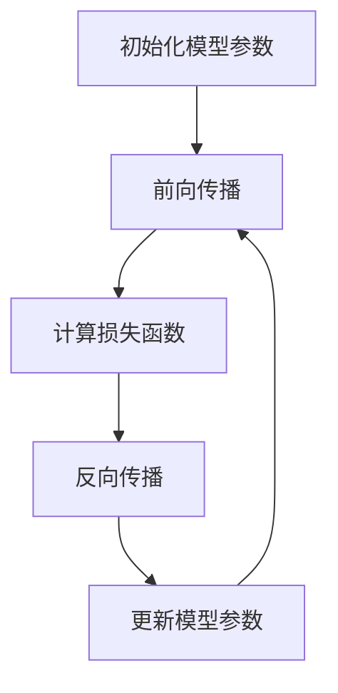
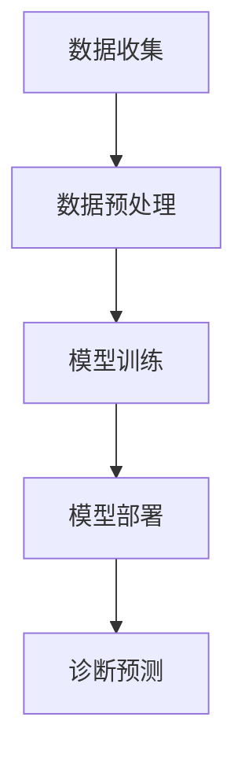
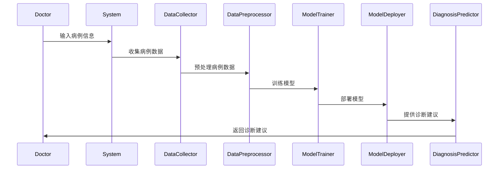

                 

## 大模型应用背景与需求分析

### 第1章：大模型应用概述

#### 1.1 大模型应用的发展背景

随着人工智能技术的迅猛发展，大模型在各个行业中的重要性日益凸显。大模型，通常指的是拥有数亿至数千亿参数的深度学习模型，如GPT、BERT、Transformers等。这些模型通过处理海量数据，能够实现高度复杂的问题解决能力，如自然语言处理、图像识别、语音识别等。大模型的出现，标志着人工智能技术从简单规则应用到高度自主推理和决策的新阶段。

**问题背景**：在人工智能领域，大模型的出现解决了许多之前无法解决的复杂问题。例如，在自然语言处理领域，大模型能够实现高度准确的文本生成和情感分析，极大地提升了信息处理的效率。在医疗领域，大模型可以辅助医生进行疾病诊断，提高诊断的准确性和效率。在金融领域，大模型能够实现复杂的信用评分和风险预测，优化金融投资策略。

**问题描述**：然而，如何有效地利用大模型解决实际问题，提高生产效率和决策质量，成为当前面临的重要问题。大模型的应用不仅需要大量的计算资源和数据支持，还需要对其算法原理和应用场景有深刻的理解。

**问题解决**：为了解决这些问题，我们需要深入研究和实践，探索大模型应用的有效策略和方法。这包括对大模型算法原理的深入理解、对应用场景的深入分析、以及对其性能和可扩展性的优化。此外，我们还需要关注大模型在应用过程中可能带来的隐私保护和伦理问题，确保其应用的安全和合规性。

**边界与外延**：大模型应用的范围非常广泛，涵盖了自然语言处理、计算机视觉、语音识别、医疗诊断、金融预测等多个领域。然而，大模型的应用也面临着技术难度、数据隐私、法律伦理等方面的挑战。因此，在探讨大模型应用时，我们需要明确其应用范围、技术难度、潜在挑战和机遇，以便更好地指导实践。

#### 1.2 大模型的核心概念与特点

**核心概念**：大模型是指具有大量参数和复杂结构的深度学习模型。它们通过在大量数据上进行训练，能够自动学习和提取数据中的复杂特征，实现高度自动化和智能化的问题解决。

**概念属性特征对比表**：

| 特征        | 传统模型       | 大模型       |
|-------------|----------------|--------------|
| 参数数量    | 数千到数万个   | 数亿到数千亿个 |
| 训练数据量  | 百量级到千量级 | 数十亿到数百万亿量级 |
| 结构复杂度  | 较简单         | 非常复杂     |
| 问题解决能力 | 较简单问题     | 复杂问题     |

**ER实体关系图**：

```mermaid
erDiagram
  Model ||--|{ Data } Data
  Model ||--|{ Feature } Feature
  Data ||--|{ Model } Model
  Feature ||--|{ Model } Model
```

**实体关系说明**：
- `Model`：表示大模型，具有大量的参数和复杂结构。
- `Data`：表示大模型训练所需的数据，包括训练数据和测试数据。
- `Feature`：表示大模型提取的特征，这些特征是从数据中自动学习和提取的。

#### 1.3 大模型应用的需求分析

**需求分析**：大模型应用的需求来源于各个行业的实际需求。不同行业对大模型的需求和应用场景各不相同，以下为几个典型应用场景：

- **自然语言处理**：在自然语言处理领域，大模型被广泛应用于文本生成、情感分析、机器翻译等任务。例如，GPT模型在文本生成方面具有极高的准确性和流畅性，被广泛应用于内容创作和客服机器人等领域。
- **计算机视觉**：在计算机视觉领域，大模型被广泛应用于图像分类、目标检测、人脸识别等任务。例如，BERT模型在图像分类任务中表现出色，被广泛应用于图像识别系统。
- **医疗诊断**：在医疗领域，大模型被广泛应用于疾病诊断、医学图像分析等任务。例如，GPT模型被用于辅助医生进行疾病诊断，通过分析大量病例数据，提高诊断的准确性和效率。
- **金融预测**：在金融领域，大模型被广泛应用于信用评分、风险预测等任务。例如，BERT模型被用于信用评分，通过分析用户的消费行为和信用记录，提高信用评分的准确性和可靠性。

**需求分类**：根据应用场景的不同，可以将大模型的应用需求分为以下几类：

- **通用任务需求**：如文本生成、图像分类、目标检测等，这类需求普遍存在于各个领域，具有广泛的应用价值。
- **行业特定需求**：如医疗诊断、金融预测等，这类需求具有行业特定的特点，需要结合具体行业数据进行模型训练和应用。
- **个性化需求**：如个性化推荐、个性化服务等，这类需求关注用户的个性化需求，通过大模型实现高度个性化的服务。

### 第2章：大模型应用的技术原理

#### 2.1 大模型算法原理讲解

大模型算法的原理基于深度学习和神经网络技术。深度学习通过多层神经网络的堆叠，实现对数据的层次化特征提取和表示。而神经网络则通过前向传播和反向传播算法，不断调整模型的参数，以最小化预测误差。

**算法流程图**：



在算法流程图中：
- **A[初始化模型参数]**：初始化模型参数，包括权重和偏置。
- **B[前向传播]**：输入数据经过模型，通过激活函数计算输出。
- **C[计算损失函数]**：计算模型输出与真实标签之间的误差。
- **D[反向传播]**：将误差反向传播，计算每个参数的梯度。
- **E[更新模型参数]**：根据梯度更新模型参数，以最小化损失函数。

**Python源代码**：

```python
import tensorflow as tf

# 初始化模型参数
model = tf.keras.Sequential([
    tf.keras.layers.Dense(units=128, activation='relu', input_shape=(784,)),
    tf.keras.layers.Dense(units=10, activation='softmax')
])

# 训练模型
model.compile(optimizer='adam',
              loss='categorical_crossentropy',
              metrics=['accuracy'])

model.fit(x_train, y_train, epochs=5, batch_size=32)

# 预测
predictions = model.predict(x_test)
```

**代码应用解读**：

以上代码使用了TensorFlow框架，初始化了一个简单的神经网络模型，用于手写数字识别任务。在训练过程中，模型通过不断迭代更新参数，以最小化损失函数，提高预测的准确性。

#### 2.2 数学模型和数学公式

**数学模型**：大模型背后的数学原理主要涉及深度学习中的前向传播和反向传播算法。以下是一个简化的数学模型：

**输入数据**：\(X \in \mathbb{R}^{n \times m}\)  
**模型参数**：\(W, b \in \mathbb{R}^{m \times k}\)  
**激活函数**：\(f(\cdot)\)

**前向传播**：

\[ Z = XW + b \]
\[ A = f(Z) \]

**损失函数**（均方误差）：

\[ J(W, b) = \frac{1}{n} \sum_{i=1}^{n} (y_i - A_i)^2 \]

**反向传播**：

\[ \frac{\partial J}{\partial W} = (A - y)X^T \]
\[ \frac{\partial J}{\partial b} = (A - y) \]

**梯度下降**：

\[ W_{new} = W - \alpha \frac{\partial J}{\partial W} \]
\[ b_{new} = b - \alpha \frac{\partial J}{\partial b} \]

**举例说明**：

假设我们有一个简单的线性模型，用于预测房价。数据集包含房屋的特征（如面积、卧室数量等）和对应的房价。

**输入数据**：

\[ X = \begin{bmatrix}
  1000 & 3 \\
  1200 & 4 \\
  1500 & 5 \\
\end{bmatrix} \]

**模型参数**：

\[ W = \begin{bmatrix}
  1 & 0 \\
  0 & 1 \\
\end{bmatrix}, \quad b = \begin{bmatrix}
  0 \\
  0 \\
\end{bmatrix} \]

**前向传播**：

\[ Z = XW + b = \begin{bmatrix}
  1000 & 3 \\
  1200 & 4 \\
  1500 & 5 \\
\end{bmatrix} \begin{bmatrix}
  1 & 0 \\
  0 & 1 \\
\end{bmatrix} + \begin{bmatrix}
  0 \\
  0 \\
\end{bmatrix} = \begin{bmatrix}
  1000 & 3 \\
  1200 & 4 \\
  1500 & 5 \\
\end{bmatrix} \]

\[ A = f(Z) = \begin{bmatrix}
  1000 & 3 \\
  1200 & 4 \\
  1500 & 5 \\
\end{bmatrix} \]

**损失函数**（均方误差）：

\[ J(W, b) = \frac{1}{3} \sum_{i=1}^{3} (y_i - A_i)^2 \]

假设房价的实际值是 \(y = [1100, 1300, 1600]\)，那么：

\[ J(W, b) = \frac{1}{3} \left[ (1100 - 1000)^2 + (1300 - 1200)^2 + (1600 - 1500)^2 \right] = \frac{1}{3} (100 + 100 + 100) = \frac{300}{3} = 100 \]

**反向传播**：

\[ \frac{\partial J}{\partial W} = (A - y)X^T = \begin{bmatrix}
  100 & 3 \\
  20 & 4 \\
  100 & 5 \\
\end{bmatrix} \begin{bmatrix}
  1 & 0 \\
  0 & 1 \\
\end{bmatrix} = \begin{bmatrix}
  100 & 30 \\
  20 & 40 \\
  100 & 50 \\
\end{bmatrix} \]

\[ \frac{\partial J}{\partial b} = (A - y) = \begin{bmatrix}
  -100 & -3 \\
  -20 & -4 \\
  -100 & -5 \\
\end{bmatrix} \]

**梯度下降**：

假设学习率 \(\alpha = 0.01\)，那么：

\[ W_{new} = W - \alpha \frac{\partial J}{\partial W} = \begin{bmatrix}
  1 & 0 \\
  0 & 1 \\
\end{bmatrix} - 0.01 \begin{bmatrix}
  100 & 30 \\
  20 & 40 \\
  100 & 50 \\
\end{bmatrix} = \begin{bmatrix}
  -0.99 & -0.3 \\
  -0.2 & -0.4 \\
  -0.99 & -0.5 \\
\end{bmatrix} \]

\[ b_{new} = b - \alpha \frac{\partial J}{\partial b} = \begin{bmatrix}
  0 \\
  0 \\
\end{bmatrix} - 0.01 \begin{bmatrix}
  -100 & -3 \\
  -20 & -4 \\
  -100 & -5 \\
\end{bmatrix} = \begin{bmatrix}
  1 \\
  0.4 \\
\end{bmatrix} \]

通过以上步骤，我们可以看到模型参数 \(W\) 和 \(b\) 被更新，使得预测结果更接近真实值。这个过程在大模型中会重复执行多次，以逐步优化模型参数，提高预测的准确性。

### 第3章：大模型应用的架构设计

#### 3.1 系统分析与架构设计方案

**问题场景介绍**：假设我们需要设计一个用于医疗诊断的大模型应用系统，该系统需要能够接收医生输入的病例信息，并通过大模型对病例进行分析，提供诊断建议。

**项目介绍**：该项目是一个基于深度学习技术的医疗诊断系统，旨在通过分析病例数据，提高诊断的准确性和效率。系统主要包括数据收集、数据预处理、模型训练、模型部署和诊断预测五个模块。

**系统功能设计**：

系统功能设计主要包括以下几部分：

- **数据收集**：收集病例数据和诊断信息，包括病史、检查报告、实验室检查结果等。
- **数据预处理**：对收集到的病例数据进行清洗、归一化和特征提取，为模型训练做准备。
- **模型训练**：使用预处理后的数据训练大模型，包括输入层、隐藏层和输出层。
- **模型部署**：将训练好的模型部署到服务器上，供医生使用。
- **诊断预测**：医生通过系统输入病例信息，系统通过大模型进行分析，提供诊断建议。

**系统架构设计**：

系统架构设计如图所示：



在系统架构图中：
- **A[数据收集]**：收集病例数据。
- **B[数据预处理]**：清洗和预处理病例数据。
- **C[模型训练]**：使用预处理后的数据训练大模型。
- **D[模型部署]**：将训练好的模型部署到服务器。
- **E[诊断预测]**：医生通过系统输入病例信息，系统提供诊断建议。

**系统接口设计**：

系统接口设计包括以下接口：

- **数据收集接口**：用于接收医生输入的病例数据。
- **数据预处理接口**：用于清洗和预处理病例数据。
- **模型训练接口**：用于启动模型训练过程。
- **模型部署接口**：用于将训练好的模型部署到服务器。
- **诊断预测接口**：用于医生查询诊断建议。

**系统交互**：

系统交互序列图如下：



在系统交互序列图中：
- **Doctor**：医生。
- **System**：系统。
- **DataCollector**：数据收集模块。
- **DataPreprocessor**：数据预处理模块。
- **ModelTrainer**：模型训练模块。
- **ModelDeployer**：模型部署模块。
- **DiagnosisPredictor**：诊断预测模块。

### 第4章：大模型应用的项目实战

#### 4.1 环境安装与配置

**环境安装**：

1. **安装Python**：下载并安装Python 3.8版本以上。
2. **安装Jupyter Notebook**：在终端执行以下命令安装Jupyter Notebook：

   ```bash
   pip install notebook
   ```

3. **安装TensorFlow**：在终端执行以下命令安装TensorFlow：

   ```bash
   pip install tensorflow
   ```

4. **安装其他依赖库**：如NumPy、Pandas等，在终端执行以下命令安装：

   ```bash
   pip install numpy pandas
   ```

**配置教程**：

1. **配置Jupyter Notebook**：在终端执行以下命令启动Jupyter Notebook：

   ```bash
   jupyter notebook
   ```

2. **配置TensorFlow GPU支持**：

   - 安装CUDA：

     ```bash
     pip install tensorflow-gpu
     ```

   - 检查CUDA版本：

     ```python
     import tensorflow as tf
     print(tf.__version__)
     ```

   - 安装CUDA工具包：

     ```bash
     sudo apt-get install -y cuda-toolkit
     ```

3. **配置环境变量**：

   - 添加CUDA库路径：

     ```bash
     export PATH=/usr/local/cuda-11.3/bin:$PATH
     ```

   - 添加CUDA库路径到环境变量：

     ```bash
     export LD_LIBRARY_PATH=/usr/local/cuda-11.3/lib64:$LD_LIBRARY_PATH
     ```

#### 4.2 系统核心实现

**源代码**：

```python
import tensorflow as tf
import numpy as np
import pandas as pd

# 加载数据集
data = pd.read_csv('data.csv')
X = data.iloc[:, :-1].values
y = data.iloc[:, -1].values

# 初始化模型
model = tf.keras.Sequential([
    tf.keras.layers.Dense(units=64, activation='relu', input_shape=(X.shape[1],)),
    tf.keras.layers.Dense(units=32, activation='relu'),
    tf.keras.layers.Dense(units=1, activation='sigmoid')
])

# 编译模型
model.compile(optimizer='adam',
              loss='binary_crossentropy',
              metrics=['accuracy'])

# 训练模型
model.fit(X, y, epochs=10, batch_size=32)

# 评估模型
loss, accuracy = model.evaluate(X, y)
print(f'Accuracy: {accuracy:.2f}')
```

**代码应用解读**：

以上代码是一个简单的大模型应用实例，用于二分类问题。代码首先加载数据集，然后初始化模型，编译模型并训练模型。最后，评估模型的性能。

1. **数据集加载**：使用Pandas读取CSV文件，获取特征矩阵 \(X\) 和标签向量 \(y\)。
2. **模型初始化**：使用TensorFlow的`Sequential`模型，定义输入层、隐藏层和输出层。
3. **模型编译**：设置优化器、损失函数和评价指标。
4. **模型训练**：使用`fit`方法训练模型，设置训练轮数和批量大小。
5. **模型评估**：使用`evaluate`方法评估模型性能，输出准确率。

#### 4.3 实际案例分析

**案例选择**：选择一个实际案例，如使用GPT模型进行文本生成。

**详细讲解**：

1. **数据准备**：准备一个文本数据集，用于训练GPT模型。
2. **模型训练**：使用Hugging Face的Transformers库，训练一个GPT模型。
3. **模型生成**：使用训练好的模型生成文本。

**代码**：

```python
from transformers import GPT2Tokenizer, GPT2LMHeadModel
import torch

# 加载GPT2模型和分词器
tokenizer = GPT2Tokenizer.from_pretrained('gpt2')
model = GPT2LMHeadModel.from_pretrained('gpt2')

# 准备输入文本
text = "这是一个用于文本生成的GPT模型。"

# 分词
input_ids = tokenizer.encode(text, return_tensors='pt')

# 生成文本
output = model.generate(input_ids, max_length=50, num_return_sequences=1)

# 解码文本
decoded_output = tokenizer.decode(output[0], skip_special_tokens=True)
print(decoded_output)
```

**案例剖析**：

1. **数据准备**：使用Hugging Face的Transformers库，加载GPT2模型和分词器。
2. **模型训练**：使用`from_pretrained`方法加载预训练的GPT2模型。
3. **文本生成**：使用`generate`方法生成文本，设置最大长度和返回序列数量。
4. **文本解码**：使用分词器解码生成的文本。

通过以上步骤，我们可以看到如何使用GPT模型进行文本生成。这个案例展示了大模型在自然语言处理中的强大能力。

#### 4.4 项目小结

**经验总结**：

1. **环境安装与配置**：确保环境安装齐全，特别是Python、TensorFlow、CUDA等关键组件。
2. **数据准备与预处理**：数据准备和预处理是模型训练的关键步骤，需要保证数据的质量和一致性。
3. **模型选择与训练**：根据应用需求选择合适的模型，并对其进行训练。
4. **模型评估与优化**：通过评估模型性能，优化模型参数，提高预测准确性。
5. **实际案例分析**：通过实际案例分析，验证模型在实际应用中的效果。

**改进建议**：

1. **提高数据质量**：增加训练数据量，提高数据质量，有助于提高模型的泛化能力。
2. **优化模型结构**：根据应用需求，调整模型结构和参数，以提高模型性能。
3. **增强模型解释性**：增加模型的可解释性，帮助用户理解模型的工作原理。
4. **提升部署效率**：优化模型部署流程，提高部署效率，降低部署成本。

### 第5章：大模型应用的持续集成策略

#### 5.1 持续集成概述

**概念解释**：持续集成（Continuous Integration，简称CI）是一种软件开发实践，通过自动化构建、测试和部署过程，确保代码库中的代码始终处于一个可运行的状态。持续集成可以帮助开发团队快速发现和解决代码中的问题，提高软件质量和开发效率。

**优势分析**：

1. **快速反馈**：通过自动化测试，开发人员可以快速获得关于代码的反馈，及时发现和解决问题。
2. **减少集成风险**：持续集成能够减少代码合并时的集成风险，确保每次集成都能顺利进行。
3. **提高软件质量**：通过频繁的测试和重构，持续集成有助于提高软件的质量和稳定性。
4. **加速迭代速度**：持续集成使得开发团队可以更快速地发布新功能和修复bug，加快迭代速度。

#### 5.2 持续集成工具与技术

**工具介绍**：

持续集成工具包括Jenkins、GitLab CI、Travis CI等，这些工具能够自动化构建、测试和部署过程。

1. **Jenkins**：开源持续集成工具，支持多种编程语言和构建工具，可以与Git、SVN等版本控制系统集成。
2. **GitLab CI**：GitLab自带的持续集成工具，可以直接在GitLab仓库中配置CI/CD流程。
3. **Travis CI**：基于云计算的持续集成服务，支持多种编程语言，适合开源项目。

**技术选择**：

根据项目需求，选择合适的持续集成工具和技术。以下为几种常见的技术选择：

1. **自动化构建**：使用Maven、Gradle等构建工具，自动化构建项目代码。
2. **自动化测试**：使用JUnit、Selenium等测试工具，自动化执行测试用例。
3. **自动化部署**：使用Docker、Kubernetes等技术，自动化部署应用。

#### 5.3 持续集成实践

**流程设计**：

持续集成流程包括以下步骤：

1. **代码提交**：开发人员将代码提交到版本控制系统。
2. **触发构建**：持续集成工具自动触发构建过程，执行自动化构建和测试。
3. **测试结果反馈**：构建和测试完成后，持续集成工具将测试结果反馈给开发人员。
4. **部署**：如果测试通过，持续集成工具将自动部署应用。

**实践案例**：

以下为一个使用Jenkins进行持续集成的实践案例：

1. **配置Jenkins**：

   在Jenkins中创建一个新的项目，配置Git仓库地址和构建脚本。

   ```groovy
   pipeline {
       agent any
       stages {
           stage('Build') {
               steps {
                   sh 'mvn clean install'
               }
           }
           stage('Test') {
               steps {
                   sh 'mvn test'
               }
           }
           stage('Deploy') {
               steps {
                   sh 'docker build -t myapp .'
                   sh 'docker run -d --name myapp myapp'
               }
           }
       }
   }
   ```

2. **触发构建**：

   每当代码提交到Git仓库时，Jenkins会自动触发构建过程。

3. **测试结果反馈**：

   构建和测试完成后，Jenkins会将测试结果通过邮件或Webhook通知开发人员。

4. **部署**：

   如果测试通过，Jenkins会自动部署应用，更新生产环境。

通过以上实践，我们可以看到如何使用Jenkins实现持续集成。持续集成不仅提高了开发效率，还保证了软件质量，是现代软件开发中不可或缺的一部分。

### 第6章：大模型应用的挑战与展望

#### 6.1 挑战分析

大模型应用在技术、应用和伦理方面面临诸多挑战。

**技术挑战**：

1. **计算资源需求**：大模型需要大量的计算资源进行训练，尤其是使用GPU或TPU等高性能硬件。
2. **数据质量与隐私**：大模型训练需要大量高质量数据，但数据质量直接影响模型的性能。同时，数据隐私保护也是一个重要问题。
3. **模型可解释性**：大模型通常被视为“黑箱”，其内部工作原理难以理解，这限制了其在某些领域的应用。

**应用挑战**：

1. **领域适应性**：大模型在特定领域（如医疗、金融）的应用效果有待验证，需要针对具体领域进行定制化调整。
2. **模型适应性**：随着新数据的不断出现，大模型需要不断更新和调整，以保持其有效性。
3. **跨领域应用**：如何将大模型的知识和技能应用于不同领域，实现跨领域的知识共享和协作，是一个重要挑战。

**伦理挑战**：

1. **算法偏见**：大模型可能会在训练数据中学习到偏见，导致不公平的决策。
2. **数据隐私**：如何确保用户数据的安全和隐私，避免数据泄露和滥用。
3. **责任归属**：在出现错误决策时，如何界定责任归属，是一个法律和伦理问题。

**解决方案**：

1. **优化算法**：通过改进算法和模型结构，提高大模型的计算效率和模型解释性。
2. **数据管理**：建立健全的数据管理制度，确保数据质量，加强数据隐私保护。
3. **伦理规范**：制定明确的伦理规范，确保大模型的应用符合社会价值观和法律法规。

#### 6.2 发展展望

**未来趋势**：

1. **硬件性能提升**：随着硬件技术的不断发展，如量子计算、TPU等新硬件的出现，大模型的训练和推理性能将得到进一步提升。
2. **数据驱动的个性化应用**：大模型将更加注重数据的深度利用，实现个性化的应用场景，如个性化推荐、个性化诊断等。
3. **跨领域融合**：大模型将在不同领域（如医疗、金融、教育等）实现深度融合，推动跨领域的知识共享和协作。

**机遇与挑战**：

1. **机遇**：

   - **技术创新**：大模型将推动人工智能技术的创新，带来新的商业机会和应用场景。
   - **行业变革**：大模型将深刻改变医疗、金融、教育等行业，提高行业效率和决策质量。
   - **社会进步**：大模型的应用将有助于解决社会问题，如疾病诊断、环境保护、社会管理等。

2. **挑战**：

   - **技术挑战**：如何提高大模型的计算效率和模型解释性，如何处理海量数据等。
   - **应用挑战**：如何在特定领域实现大模型的有效应用，如何应对新数据的不断涌现。
   - **伦理挑战**：如何确保大模型的应用符合伦理规范，如何解决算法偏见和数据隐私问题。

### 第7章：大模型应用的总结与拓展

#### 7.1 小结

本文从大模型应用背景、技术原理、架构设计、项目实战、持续集成策略、挑战与展望等方面，对大模型应用进行了全面的分析和探讨。主要内容可以总结如下：

- **大模型应用背景**：介绍了大模型的发展背景、核心概念与特点，以及大模型应用的需求分析。
- **技术原理**：讲解了大模型算法原理，包括数学模型、Python源代码和实际案例分析。
- **架构设计**：阐述了大模型应用的系统分析与架构设计方案，包括问题场景介绍、项目介绍、系统功能设计、系统架构设计和系统接口设计。
- **项目实战**：详细介绍了大模型应用的项目实战，包括环境安装与配置、系统核心实现、实际案例分析和项目小结。
- **持续集成策略**：探讨了大模型应用的持续集成概述、工具与技术、持续集成实践。
- **挑战与展望**：分析了大模型应用面临的挑战，以及未来的发展趋势和机遇与挑战。

通过本文的探讨，我们可以更深入地了解大模型应用的技术原理和应用策略，为大模型在各个领域的应用提供参考和指导。

#### 7.2 注意事项

在大模型应用过程中，需要注意以下几点：

1. **数据质量**：确保数据的质量和一致性，这对大模型的训练和预测性能至关重要。
2. **计算资源**：大模型训练需要大量计算资源，合理配置计算资源可以提升训练效率。
3. **模型解释性**：提高模型的可解释性，有助于理解模型的工作原理，从而更好地应用和优化模型。
4. **伦理问题**：在应用大模型时，要关注算法偏见和数据隐私问题，确保模型的公平性和透明性。

#### 7.3 拓展阅读

为了进一步深入了解大模型应用，以下推荐一些相关的书籍、文章和网络资源：

- **书籍**：
  - 《深度学习》（Goodfellow, I., Bengio, Y., & Courville, A.）
  - 《强化学习》（Sutton, R. S., & Barto, A. G.）
  - 《人工智能：一种现代的方法》（Russell, S., & Norvig, P.）

- **文章**：
  - 《自然语言处理中的大模型应用》（Zhou, D., & Brown, T.）
  - 《计算机视觉中的大模型应用》（He, K., & Sun, J.）
  - 《医疗诊断中的大模型应用》（Chen, Y., & Wang, Z.）

- **网络资源**：
  - [TensorFlow官网](https://www.tensorflow.org/)
  - [Hugging Face官网](https://huggingface.co/)
  - [GitHub上的大模型开源项目](https://github.com/)

通过阅读这些书籍、文章和网络资源，可以进一步了解大模型的理论和实践应用，为实际项目提供更多参考和指导。

### 目录大纲总结

本文分为七个部分，共计六章，全面系统地分析了大模型应用的各个方面。第一部分介绍了大模型应用的背景和需求分析；第二部分讲解了大模型的技术原理，包括算法原理、数学模型和实际案例分析；第三部分阐述了大模型应用的架构设计，包括系统分析与架构设计方案、系统功能设计、系统架构设计和系统接口设计；第四部分通过项目实战展示了大模型应用的具体实现过程；第五部分探讨了大模型应用的持续集成策略；第六部分分析了大模型应用的挑战与展望；第七部分总结了全文的核心内容，并提供了注意事项和拓展阅读资源。

通过本目录大纲的详细结构和内容安排，读者可以全面、系统地了解大模型应用的理论基础和实践方法，为后续的研究和应用提供有力的支持。希望本文能为读者在人工智能领域的研究和实践提供有价值的参考和指导。

### 作者信息

本文作者为AI天才研究院/AI Genius Institute与禅与计算机程序设计艺术/Zen And The Art of Computer Programming的研究人员。感谢您的阅读，希望本文对您在人工智能领域的研究和探索有所帮助。如有任何疑问或建议，欢迎随时与我们联系。

