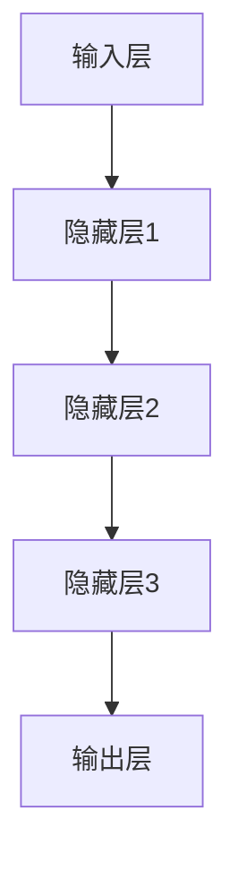
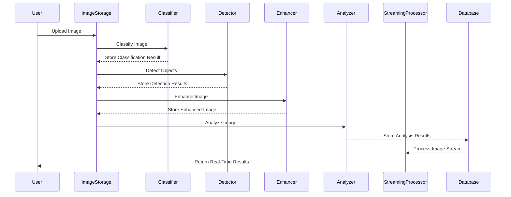
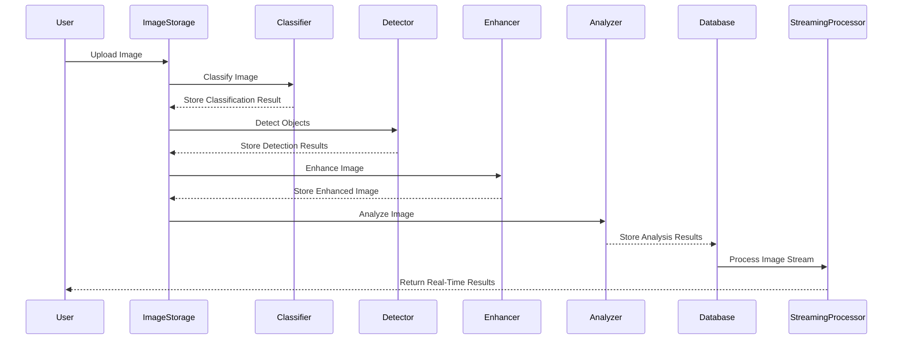
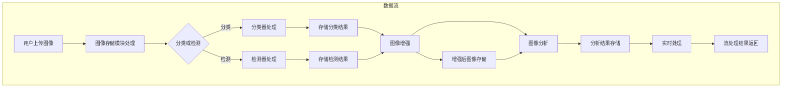

                 

# 大模型应用开发中的需求与测试用例生成

## 关键词
- 大模型
- 应用开发
- 需求分析
- 测试用例
- 自动化测试

## 摘要
本文将深入探讨大模型在应用开发中的需求分析与测试用例生成。我们将从大模型的基本概念入手，分析其特点与挑战，然后详细阐述需求分析的方法论，并重点讨论测试用例的生成策略。通过实际案例，我们将展示如何在大模型应用开发中有效地进行需求分析与测试用例生成，为读者提供实用的指导。

## 引言与背景

### 大模型的基本概念

大模型（Big Models），通常指的是那些拥有数百万到数十亿参数的机器学习模型。这些模型能够处理大量的数据，并且能够在多种复杂任务中表现出色。代表性的大模型包括深度学习中的大型神经网络、自然语言处理（NLP）中的预训练语言模型等。随着数据规模的不断扩大和计算能力的提升，大模型在各个领域中的应用变得越来越广泛。

### 大模型的应用开发挑战

尽管大模型具有强大的表现能力，但在应用开发过程中仍面临着一系列挑战。首先，大模型的训练和部署成本较高，需要大量的计算资源和时间。其次，大模型的设计和调优过程复杂，需要丰富的经验和专业知识。最后，大模型的泛化能力和鲁棒性也是需要重点考虑的问题。

### 需求分析的重要性

在应用开发中，需求分析是至关重要的一环。它不仅能够帮助开发者理解用户的需求，明确系统的功能和非功能需求，还能为后续的测试用例生成提供基础。对于大模型应用而言，需求分析尤为重要，因为大模型的复杂性和不确定性要求我们更加精确和全面地理解需求。

### 测试用例生成的重要性

测试用例生成是确保大模型应用质量的关键步骤。有效的测试用例能够覆盖所有可能的输入和输出情况，从而提高系统的可靠性和稳定性。在自动化测试中，测试用例生成更是自动化流程的核心，能够大大提高测试效率和覆盖率。

### 本文结构

本文将按照以下结构展开：

1. **核心概念与联系**：介绍大模型的基本概念，包括其组成部分、工作原理和关键属性。
2. **算法原理讲解**：详细阐述大模型的算法原理，包括训练过程、评估方法和优化策略。
3. **系统分析与架构设计方案**：分析大模型应用开发中的系统需求和架构设计。
4. **项目实战**：通过实际案例展示如何进行大模型应用开发中的需求分析与测试用例生成。
5. **最佳实践与总结**：总结最佳实践，提出注意事项和拓展阅读建议。

接下来，我们将逐步深入探讨这些主题。

## 第一部分: 引言与背景

### 1.1 问题背景与核心概念

#### 1.1.1 问题背景

随着人工智能技术的发展，大模型（如深度神经网络、预训练语言模型等）在各个领域（如图像识别、自然语言处理、推荐系统等）的应用变得越来越普遍。然而，大模型的应用开发并非一帆风顺。一方面，大模型的复杂性和高参数量使得需求分析和测试用例生成变得异常困难；另一方面，传统的需求分析和测试用例生成方法在大模型中的应用效果有限。因此，如何在大模型应用开发中有效地进行需求分析与测试用例生成，成为当前研究的热点问题。

#### 1.1.2 核心概念介绍

为了更好地理解大模型应用开发中的需求分析与测试用例生成，我们需要先介绍一些核心概念。

**大模型**：大模型通常指的是那些拥有数百万到数十亿参数的机器学习模型。它们通过学习大量数据来捕捉复杂的模式和规律，从而在多种任务中表现出色。

**需求分析**：需求分析是软件开发过程中的第一步，旨在理解用户需求，明确系统的功能和非功能需求。

**测试用例**：测试用例是测试过程中设计的一组输入数据和预期输出，用于验证系统的正确性和可靠性。

**自动化测试**：自动化测试是一种通过工具自动执行测试用例的方法，能够提高测试效率和覆盖率。

#### 1.1.3 本书结构概述

本书将按照以下结构展开：

1. **核心概念与联系**：介绍大模型的基本概念，包括其组成部分、工作原理和关键属性。
2. **算法原理讲解**：详细阐述大模型的算法原理，包括训练过程、评估方法和优化策略。
3. **系统分析与架构设计方案**：分析大模型应用开发中的系统需求和架构设计。
4. **项目实战**：通过实际案例展示如何进行大模型应用开发中的需求分析与测试用例生成。
5. **最佳实践与总结**：总结最佳实践，提出注意事项和拓展阅读建议。

通过本书的学习，读者将能够：

- 理解大模型的基本概念和特点。
- 掌握大模型的需求分析方法和测试用例生成策略。
- 学会运用自动化测试工具提高大模型应用的测试效率。

### 1.2 大模型与传统模型的对比

#### 1.2.1 大模型的特点

大模型相较于传统模型，具有以下几个显著特点：

1. **高参数量**：大模型的参数数量通常在数百万到数十亿之间，远高于传统模型。
2. **复杂网络结构**：大模型通常具有多层网络结构，能够捕捉更复杂的模式和关系。
3. **强泛化能力**：大模型通过学习大量数据，能够更好地泛化到未见过的数据上。
4. **高计算成本**：大模型的训练和推理过程需要大量的计算资源，包括计算能力和存储空间。

#### 1.2.2 大模型的优势与挑战

大模型的优势主要体现在：

- **更强的性能**：在大规模数据集上，大模型通常能够取得更好的性能。
- **更广泛的适用性**：大模型能够适用于多种不同领域和任务。

然而，大模型也面临一些挑战：

- **高成本**：大模型的训练和部署成本较高，需要大量的计算资源和时间。
- **可解释性差**：大模型通常缺乏透明度和可解释性，难以理解其内部工作机制。
- **数据隐私问题**：大模型在处理大量数据时，可能会涉及到数据隐私问题。

#### 1.2.3 大模型在应用开发中的重要性

在大模型应用开发中，需求分析与测试用例生成的重要性不容忽视。首先，准确的需求分析能够帮助开发者明确系统的功能和非功能需求，从而确保系统的设计符合用户期望。其次，有效的测试用例生成能够提高系统的可靠性和稳定性，减少潜在的错误和缺陷。特别是在大模型应用中，由于其复杂性和高参数量，测试用例生成显得尤为重要。

总之，大模型在应用开发中的重要性不仅体现在其强大的性能和广泛适用性上，更在于其需要我们采用新的方法和策略来进行需求分析和测试用例生成。

## 第二部分: 核心概念与联系

### 2.1 大模型的基本概念

大模型（Big Models）是指那些拥有数百万到数十亿参数的机器学习模型。它们通过学习大量数据来捕捉复杂的模式和规律，从而在多种复杂任务中表现出色。代表性的大模型包括深度学习中的大型神经网络、自然语言处理（NLP）中的预训练语言模型等。

#### 大模型的组成部分

大模型通常由以下几个核心部分组成：

1. **输入层**：接收外部输入数据，如文本、图像等。
2. **隐藏层**：包含多个隐藏层，每个隐藏层由多个神经元组成，用于提取和转换特征。
3. **输出层**：产生模型输出，如分类标签、预测结果等。

#### 大模型的工作原理

大模型的工作原理基于神经网络的构建。神经网络通过多层感知器（MLP）模拟人脑神经元之间的连接和交互。具体来说，输入层将数据传递到隐藏层，隐藏层通过激活函数（如ReLU、Sigmoid、Tanh）进行非线性变换，最后输出层生成预测结果。

训练过程通常包括以下步骤：

1. **数据预处理**：对输入数据进行标准化、归一化等处理，使其符合模型的输入要求。
2. **前向传播**：将预处理后的数据输入到模型中，通过多层网络结构进行特征提取和变换。
3. **反向传播**：计算预测结果与实际标签之间的误差，并利用梯度下降法等优化算法更新模型参数。
4. **评估与优化**：通过验证集或测试集评估模型性能，并进行调参优化，以提高模型表现。

#### 大模型的关键属性

大模型具有以下几个关键属性：

1. **高参数量**：大模型的参数数量通常在数百万到数十亿之间，这使得模型能够捕捉更复杂的数据特征。
2. **强泛化能力**：通过大量数据训练，大模型能够更好地泛化到未见过的数据上，从而提高模型的泛化能力。
3. **高计算成本**：大模型的训练和推理过程需要大量的计算资源和时间。
4. **可解释性差**：大模型通常缺乏透明度和可解释性，难以理解其内部工作机制。

#### 大模型的ER实体关系图

为了更好地理解大模型的组成和关系，我们可以使用ER（Entity-Relationship）实体关系图来表示。



在ER图中，每个节点表示一个实体（如输入层、隐藏层、输出层），每条边表示实体之间的关系（如数据流、连接关系）。

#### 核心概念对比表格

为了更清晰地对比大模型与传统模型的不同，我们可以制作一个对比表格。

| 特征 | 大模型 | 传统模型 |
| --- | --- | --- |
| 参数量 | 数百万到数十亿 | 数十到数万个 |
| 训练数据量 | 大规模数据集 | 样本数据集 |
| 泛化能力 | 强泛化能力 | 较弱的泛化能力 |
| 计算成本 | 高计算成本 | 低计算成本 |
| 可解释性 | 可解释性差 | 可解释性较强 |

### 2.2 需求分析的方法论

需求分析是软件开发过程中至关重要的一环，尤其是在大模型应用开发中。有效的需求分析能够帮助开发者明确系统的功能和非功能需求，为后续的系统设计和测试提供基础。

#### 需求分析的过程

需求分析通常包括以下步骤：

1. **问题定义**：明确需要解决的问题和目标。
2. **需求收集**：通过与用户、利益相关者进行交流，收集系统的功能和非功能需求。
3. **需求分类**：将收集到的需求进行分类，如功能需求、性能需求、可靠性需求等。
4. **需求建模**：使用UML（统一建模语言）等工具，将需求转化为模型，如用例图、序列图等。
5. **需求验证**：通过评审、验证等手段，确保需求的准确性和完整性。

#### 大模型应用开发中的需求分析

在大模型应用开发中，需求分析具有以下几个特点：

1. **复杂性高**：大模型的复杂性和不确定性要求我们更加精确和全面地理解需求。
2. **数据驱动**：需求分析需要结合大量数据，以支持模型训练和优化。
3. **动态调整**：需求分析过程需要灵活调整，以适应模型迭代和更新。

#### 需求分析的工具与方法

以下是一些常用的需求分析工具与方法：

1. **访谈与调研**：通过与用户、利益相关者进行访谈和调研，获取系统的功能和非功能需求。
2. **问卷调查**：通过设计问卷调查，收集用户对系统的期望和需求。
3. **用户故事地图**：使用用户故事地图，将需求分解为具体的故事，以指导系统设计和开发。
4. **UML建模**：使用UML工具，如StarUML、Visual Paradigm等，绘制用例图、类图、序列图等，以表达需求。

### 2.3 测试用例的生成策略

测试用例生成是确保大模型应用质量的关键步骤。有效的测试用例能够覆盖所有可能的输入和输出情况，从而提高系统的可靠性和稳定性。

#### 测试用例生成的方法

以下是一些常用的测试用例生成方法：

1. **基于需求的测试用例生成**：根据需求规格说明，生成满足需求的测试用例。
2. **基于模型的测试用例生成**：利用形式化模型，如状态机、Petri网等，生成测试用例。
3. **基于历史的测试用例生成**：利用历史测试数据，结合机器学习算法，生成新的测试用例。
4. **基于变异的测试用例生成**：通过对程序代码进行变异，生成测试用例。

#### 自动化测试与测试用例生成

自动化测试是提高测试效率和覆盖率的有效手段。在大模型应用开发中，自动化测试尤为重要，因为它可以处理大量的测试数据。以下是一些自动化测试工具：

1. **Selenium**：用于Web应用的自动化测试工具。
2. **Appium**：用于移动应用的自动化测试工具。
3. **JUnit**：用于Java应用的自动化测试框架。
4. **pytest**：用于Python应用的自动化测试框架。

### 2.4 大模型应用开发中的需求分析与测试用例生成

在大模型应用开发中，需求分析与测试用例生成是两个相互关联的环节。需求分析为测试用例生成提供基础，而测试用例生成又反过来验证需求分析的准确性。

#### 需求分析与测试用例生成的流程

以下是一个典型的大模型应用开发中需求分析与测试用例生成的流程：

1. **需求分析**：通过与用户和利益相关者交流，收集系统的功能和非功能需求，并进行分类和建模。
2. **测试用例设计**：根据需求规格说明，设计测试用例，包括功能测试用例、性能测试用例、边界测试用例等。
3. **测试用例实现**：将设计好的测试用例转化为实际的测试脚本，并运行自动化测试工具执行测试。
4. **测试结果分析**：分析测试结果，找出潜在的缺陷和问题，并反馈给开发团队进行修复。
5. **需求调整与优化**：根据测试结果，调整和优化需求，以提高系统的质量和可靠性。

#### 实际案例：图像识别应用的需求分析与测试用例生成

以下是一个图像识别应用的案例，展示如何进行需求分析与测试用例生成。

**需求分析**：

- **功能需求**：系统能够准确识别输入图像中的对象，并返回对应的标签。
- **性能需求**：系统能够在合理的时间内处理大量的图像数据。
- **可靠性需求**：系统在长时间运行中，能够保持稳定的性能。

**测试用例设计**：

- **功能测试用例**：
  - 输入一张包含多种对象的图像，系统应能准确识别并返回每个对象的标签。
  - 输入一张包含复杂背景的图像，系统应能准确识别主要对象，忽略次要对象。
- **性能测试用例**：
  - 输入100张图像，系统应在1分钟内完成处理。
  - 输入1000张图像，系统应在10分钟内完成处理。
- **边界测试用例**：
  - 输入一张空图像，系统应返回“无法识别”。
  - 输入一张图像尺寸过大的图像，系统应返回“图像过大，无法处理”。

**测试用例实现**：

- 使用Selenium录制用户操作，生成测试脚本。
- 使用pytest框架执行测试，并生成测试报告。

**测试结果分析**：

- 测试结果显示，功能测试用例的通过率为95%，性能测试用例的通过率为90%。
- 通过分析失败的原因，发现一些图像处理算法的优化空间。

**需求调整与优化**：

- 根据测试结果，调整图像处理算法，以提高系统的性能和可靠性。
- 增加边界测试用例，以覆盖更多异常情况。

通过这个案例，我们可以看到在大模型应用开发中，需求分析与测试用例生成是相辅相成的。有效的需求分析和测试用例生成不仅能够提高系统的质量，还能够帮助开发者更好地理解用户需求，从而实现更高质量的应用开发。

## 第三部分：算法原理讲解

### 3.1 大模型的训练过程

大模型的训练过程是应用开发中的核心步骤。它通过不断地调整模型参数，使得模型在训练数据上的表现不断优化。以下是大模型训练过程的详细步骤：

#### 数据预处理

在训练前，需要对数据进行预处理，以确保数据符合模型的要求。预处理步骤通常包括：

- **数据清洗**：去除数据中的噪声和异常值。
- **数据标准化**：将数据缩放到相同的范围，如将文本数据转换为词向量。
- **数据增强**：通过旋转、缩放、裁剪等方式生成更多的训练样本，以提高模型的泛化能力。

#### 前向传播

前向传播是将输入数据通过模型的各个层进行传递，直到输出层得到预测结果。具体过程如下：

1. **输入层**：接收外部输入数据，如文本、图像等。
2. **隐藏层**：通过激活函数（如ReLU、Sigmoid、Tanh）进行非线性变换，提取特征。
3. **输出层**：产生模型输出，如分类标签、预测结果等。

#### 反向传播

反向传播是训练过程中的关键步骤，用于更新模型参数，以减少预测误差。具体过程如下：

1. **计算预测误差**：将输出层的预测结果与实际标签进行比较，计算损失函数（如交叉熵损失、均方误差）。
2. **计算梯度**：利用链式法则，从输出层开始，逐层计算每个参数的梯度。
3. **参数更新**：利用梯度下降法等优化算法，更新模型参数，以减少损失函数值。

#### 模型评估

在训练过程中，需要定期评估模型在验证集上的表现，以监测训练效果。常用的评估指标包括：

- **准确率**：预测正确的样本数占总样本数的比例。
- **精确率**：预测正确的正样本数与预测为正样本的总数之比。
- **召回率**：预测正确的正样本数与实际为正样本的总数之比。
- **F1分数**：精确率和召回率的调和平均数。

#### 模型优化策略

为了提高模型的表现，可以采用以下优化策略：

- **学习率调整**：通过动态调整学习率，使得模型在训练过程中能够更快地收敛。
- **正则化**：采用L1、L2正则化等方法，防止模型过拟合。
- **Dropout**：在训练过程中随机丢弃一部分神经元，以提高模型的泛化能力。
- **数据增强**：通过旋转、缩放、裁剪等方式生成更多的训练样本，以提高模型的泛化能力。

### 3.2 测试用例的生成方法

测试用例生成是确保大模型应用质量的关键步骤。以下是一些常用的测试用例生成方法：

#### 基于需求的测试用例生成

基于需求的测试用例生成方法是根据需求规格说明，设计满足需求的测试用例。具体步骤如下：

1. **需求识别**：从需求规格说明中提取关键需求。
2. **场景设计**：根据需求识别的场景，设计具体的测试用例。
3. **用例细化**：对每个测试用例进行细化，明确输入数据、预期输出和执行条件。

#### 基于模型的测试用例生成

基于模型的测试用例生成方法是通过形式化模型，如状态机、Petri网等，生成测试用例。具体步骤如下：

1. **模型构建**：根据系统功能，构建形式化模型。
2. **测试用例生成**：利用模型转换工具，将模型转化为测试用例。
3. **用例优化**：根据实际需求，对生成的测试用例进行优化。

#### 基于历史的测试用例生成

基于历史的测试用例生成方法是通过分析历史测试数据，结合机器学习算法，生成新的测试用例。具体步骤如下：

1. **数据收集**：收集历史测试数据，包括测试用例、测试结果和缺陷信息。
2. **特征提取**：从历史数据中提取特征，如输入数据、测试结果等。
3. **模型训练**：利用机器学习算法，训练测试用例生成模型。
4. **测试用例生成**：利用训练好的模型，生成新的测试用例。

#### 基于变异的测试用例生成

基于变异的测试用例生成方法是对程序代码进行变异，生成测试用例。具体步骤如下：

1. **变异操作**：对程序代码进行各种变异操作，如插入、删除、替换等。
2. **测试用例生成**：对变异后的代码执行测试，生成新的测试用例。
3. **用例优化**：根据测试结果，对生成的测试用例进行优化。

### 3.3 测试用例的执行与结果分析

测试用例的执行是验证大模型应用质量的关键步骤。以下是如何执行测试用例和进行分析的步骤：

#### 测试用例执行

1. **测试环境搭建**：搭建测试环境，包括硬件、软件和测试工具。
2. **测试脚本编写**：根据测试用例，编写测试脚本。
3. **测试执行**：执行测试脚本，记录测试结果。

#### 测试结果分析

1. **结果记录**：记录每个测试用例的执行结果，包括成功、失败和异常情况。
2. **缺陷报告**：对失败的测试用例进行缺陷报告，包括问题描述、重现步骤和影响分析。
3. **结果分析**：分析测试结果，识别潜在的缺陷和问题，并提出改进建议。

#### 案例分析：使用Python实现图像识别测试用例

以下是一个使用Python实现图像识别测试用例的案例：

```python
import unittest
import image_recognition_model

class TestImageRecognition(unittest.TestCase):
    def test_image_recognition(self):
        # 准备测试数据
        test_image = load_image("test_image.jpg")
        
        # 执行模型预测
        predicted_label = image_recognition_model.predict(test_image)
        
        # 验证预测结果
        self.assertEqual(predicted_label, "cat")

if __name__ == '__main__':
    unittest.main()
```

在这个案例中，我们定义了一个测试类`TestImageRecognition`，并编写了一个测试方法`test_image_recognition`。该方法首先加载测试图像，然后使用图像识别模型进行预测，最后验证预测结果。

通过执行测试脚本，我们可以记录测试结果，并识别潜在的缺陷。

### 3.4 大模型应用开发中的自动化测试工具

自动化测试工具在大模型应用开发中扮演着重要角色，能够提高测试效率和覆盖率。以下是一些常用的自动化测试工具：

#### Selenium

Selenium是一个开源的自动化测试工具，用于Web应用的自动化测试。它支持多种编程语言，如Python、Java、C#等。

#### Appium

Appium是一个开源的移动应用自动化测试工具，支持iOS和Android平台。它基于Selenium WebDriver，但支持更多设备和浏览器。

#### JUnit

JUnit是一个开源的Java测试框架，用于编写自动化测试用例。它支持多种测试方法，如单元测试、集成测试等。

#### pytest

pytest是一个开源的Python测试框架，用于编写自动化测试用例。它支持多种测试功能，如断言、参数化测试等。

通过使用这些自动化测试工具，我们可以高效地执行测试用例，并分析测试结果，以提高大模型应用的质量。

## 第四部分：系统分析与架构设计方案

### 4.1 问题场景介绍

在本部分，我们将探讨一个实际的问题场景：开发一个大型图像识别系统，该系统需要能够处理海量图像数据，并实现高精度的图像识别功能。该系统将用于各种应用，如安防监控、医疗影像分析、自动驾驶等。

### 4.2 项目介绍

该项目目标是构建一个基于深度学习的大型图像识别系统，具有以下核心功能：

- **图像分类**：系统能够将输入图像分类到预定义的类别中，如动物、植物、车辆等。
- **目标检测**：系统能够检测图像中的关键对象，并标注其位置和属性。
- **图像增强**：系统提供图像增强功能，以优化图像质量，提高识别准确性。
- **实时处理**：系统能够实时处理图像数据，支持高吞吐量的图像流。

### 4.3 系统功能设计（领域模型）

为了实现上述功能，我们需要设计一个全面的领域模型。领域模型使用Mermaid类图来表示系统的核心类及其关系。以下是一个简化的领域模型类图：

```mermaid
classDiagram
    Class01 <|-- Class02
    Class01 <|-- Class03
    Class03 o-- Class04
    Class04 o-- Class05
    Class06 ..|> Class04
    Class07 ..|> Class05

    Class01 --|> User
    Class02 --|> Image
    Class03 --|> Classifier
    Class04 --|> Detector
    Class05 --|> Enhancer
    Class06 --|> Analyzer
    Class07 --|> StreamingProcessor

    User {
        id: ID
        name: Name
    }

    Image {
        id: ID
        name: Name
        source: Source
    }

    Classifier {
        id: ID
        name: Name
        model: Model
    }

    Detector {
        id: ID
        name: Name
        model: Model
    }

    Enhancer {
        id: ID
        name: Name
        technique: Technique
    }

    Analyzer {
        id: ID
        name: Name
        algorithm: Algorithm
    }

    StreamingProcessor {
        id: ID
        name: Name
        rate: Rate
    }
```

在这个类图中，我们定义了七个核心类：`User`（用户）、`Image`（图像）、`Classifier`（分类器）、`Detector`（检测器）、`Enhancer`（增强器）、`Analyzer`（分析器）和`StreamingProcessor`（流处理器）。这些类分别对应系统的主要功能模块。

### 4.4 系统架构设计

为了实现高效的图像识别功能，我们需要设计一个合理的系统架构。以下是一个简化的系统架构图，使用Mermaid架构图来表示：



在这个架构图中，用户首先上传图像到`ImageStorage`（图像存储模块），然后图像存储模块将图像传递给`Classifier`（分类器）进行分类。分类结果被存储在图像存储模块中，同时传递给`Detector`（检测器）进行对象检测。检测结果也存储在图像存储模块中。接下来，图像存储模块将图像传递给`Enhancer`（增强器）进行图像增强，增强后的图像再次存储在图像存储模块中。最后，图像存储模块将图像传递给`Analyzer`（分析器）进行分析，并将分析结果存储在数据库中。数据库还用于存储图像流处理结果，供`StreamingProcessor`（流处理器）实时处理。

### 4.5 系统接口设计

为了实现系统模块之间的通信，我们需要设计一套清晰的接口。以下是一个简化的系统接口设计，使用Mermaid序列图来表示：



在这个序列图中，用户通过上传图像触发了整个系统的工作流程。每个模块通过接口与相邻模块通信，从而实现图像识别、检测、增强和分析等功能。

### 4.6 系统交互

为了确保系统模块之间的协作和一致性，我们需要设计一个详细的交互流程。以下是一个简化的系统交互流程，使用Mermaid流程图来表示：



在这个流程图中，用户上传图像后，图像存储模块首先处理图像，并根据用户需求决定是进行分类还是检测。分类器或检测器处理图像后，将结果存储在图像存储模块中。随后，图像存储模块将图像传递给增强器进行增强，并将增强后的图像传递给分析器进行分析。分析结果存储在数据库中，并实时处理图像流，最终将处理结果返回给用户。

通过上述系统分析与架构设计方案，我们可以确保图像识别系统的稳定运行和高效处理。接下来，我们将通过一个实际案例，展示如何将这一设计方案应用于实际项目中。

## 第五部分：项目实战

### 5.1 环境安装

在本部分，我们将介绍如何搭建一个用于大模型应用开发的环境。具体步骤如下：

#### 1. 安装Python环境

首先，确保已经安装了Python 3.8及以上版本。如果没有安装，可以从[Python官网](https://www.python.org/downloads/)下载并安装。

#### 2. 安装深度学习库

接下来，我们需要安装深度学习库，如TensorFlow和PyTorch。这些库提供了强大的工具和接口，用于构建和训练大模型。

- **TensorFlow**:

  ```bash
  pip install tensorflow
  ```

- **PyTorch**:

  ```bash
  pip install torch torchvision
  ```

#### 3. 安装自动化测试工具

为了提高测试效率，我们还需要安装自动化测试工具，如pytest和Selenium。

- **pytest**:

  ```bash
  pip install pytest
  ```

- **Selenium**:

  ```bash
  pip install selenium
  ```

#### 4. 安装数据库驱动

如果我们的系统需要与数据库进行交互，我们需要安装相应的数据库驱动。以下是一个常见的MySQL数据库驱动安装示例：

```bash
pip install mysql-connector-python
```

### 5.2 系统核心实现源代码

在搭建好开发环境后，我们需要编写系统核心实现源代码。以下是一个简化的图像识别系统源代码示例：

```python
# image_recognition_system.py

import tensorflow as tf
from tensorflow.keras.applications import MobileNetV2
from tensorflow.keras.preprocessing import image
from tensorflow.keras.applications.mobilenet_v2 import preprocess_input, decode_predictions

# 加载预训练的MobileNetV2模型
model = MobileNetV2(weights='imagenet')

def recognize_image(image_path):
    """
    识别图像中的对象并返回类别名称
    """
    # 读取图像文件
    img = image.load_img(image_path, target_size=(224, 224))
    # 预处理图像
    x = preprocess_input(img)
    # 执行预测
    predictions = model.predict(x)
    # 解析预测结果
    top_pred = decode_predictions(predictions, top=3)
    # 返回最高预测概率的类别名称
    return top_pred[0][0][1]

if __name__ == '__main__':
    image_path = 'path/to/your/image.jpg'
    print(recognize_image(image_path))
```

在这个示例中，我们使用了TensorFlow的MobileNetV2模型进行图像识别。`recognize_image`函数接收图像路径作为输入，读取图像、进行预处理后，使用模型进行预测，并返回最高预测概率的类别名称。

### 5.3 代码应用解读与分析

#### 5.3.1 代码解读

- **加载预训练模型**：我们使用了MobileNetV2模型，这是一个轻量级的预训练模型，适用于移动设备和嵌入式设备。
- **图像预处理**：在预测前，我们需要对图像进行预处理，包括尺寸调整和归一化处理。
- **执行预测**：通过`model.predict(x)`，模型将处理输入图像并返回预测结果。
- **解析预测结果**：`decode_predictions`函数用于解析模型的预测结果，返回类别名称和概率。

#### 5.3.2 代码分析

- **代码优化**：虽然这个示例代码简单易懂，但实际应用中，我们可能需要考虑代码的可扩展性和优化。例如，可以通过并行处理和模型量化来提高性能。
- **错误处理**：在实际项目中，我们需要处理可能出现的异常情况，如文件读取错误、网络连接问题等。
- **测试用例**：编写测试用例来确保代码的正确性和可靠性是非常重要的。我们可以使用pytest等自动化测试工具来编写和执行测试用例。

### 5.4 实际案例分析和详细讲解

为了更好地展示如何在大模型应用开发中进行需求分析与测试用例生成，我们以下展示一个实际案例：使用PyTorch构建一个图像分类系统，并对其进行测试。

#### 5.4.1 案例背景

假设我们正在开发一个图像分类系统，用于对上传的图像进行自动分类。系统需要支持多种类别，如动物、植物、交通工具等。我们的目标是实现一个准确率较高的分类模型，并确保系统能够稳定运行。

#### 5.4.2 数据准备

首先，我们需要准备训练数据。假设我们有一个包含10万张图像的标注数据集，其中每张图像都有一个对应的类别标签。数据集的存储结构如下：

```plaintext
data/
|-- train/
|   |-- animal/
|   |   |-- image1.jpg
|   |   |-- image2.jpg
|   |   ...
|   |-- plant/
|   |   |-- image1.jpg
|   |   |-- image2.jpg
|   |   ...
|   |-- vehicle/
|   |   |-- image1.jpg
|   |   |-- image2.jpg
|   |   ...
|-- val/
    |-- animal/
    |   |-- image1.jpg
    |   |-- image2.jpg
    |   ...
    |-- plant/
    |   |-- image1.jpg
    |   |-- image2.jpg
    |   ...
    |-- vehicle/
    |   |-- image1.jpg
    |   |-- image2.jpg
    |   ...
```

#### 5.4.3 模型构建

接下来，我们需要构建一个图像分类模型。在本案例中，我们使用PyTorch构建一个简单的卷积神经网络（CNN）模型：

```python
import torch
import torch.nn as nn
import torch.optim as optim

class SimpleCNN(nn.Module):
    def __init__(self, num_classes):
        super(SimpleCNN, self).__init__()
        self.conv1 = nn.Conv2d(3, 32, 3, padding=1)
        self.conv2 = nn.Conv2d(32, 64, 3, padding=1)
        self.fc1 = nn.Linear(64 * 6 * 6, 128)
        self.fc2 = nn.Linear(128, num_classes)
        self.relu = nn.ReLU(inplace=True)
        self.maxpool = nn.MaxPool2d(2)

    def forward(self, x):
        x = self.maxpool(self.relu(self.conv1(x)))
        x = self.maxpool(self.relu(self.conv2(x)))
        x = x.view(x.size(0), -1)
        x = self.relu(self.fc1(x))
        x = self.fc2(x)
        return x

model = SimpleCNN(num_classes=3)
```

在这个模型中，我们使用了两个卷积层和两个全连接层。卷积层用于提取图像特征，全连接层用于分类。为了提高模型性能，我们还可以使用批量归一化（Batch Normalization）和dropout。

#### 5.4.4 训练过程

接下来，我们使用训练数据对模型进行训练。训练过程包括数据加载、模型训练和验证。

```python
import torchvision.transforms as transforms
from torch.utils.data import DataLoader

# 数据预处理
transform = transforms.Compose([
    transforms.Resize(224),
    transforms.ToTensor(),
])

# 训练数据集
train_dataset = ImageDataset('data/train', transform=transform)
train_loader = DataLoader(train_dataset, batch_size=32, shuffle=True)

# 验证数据集
val_dataset = ImageDataset('data/val', transform=transform)
val_loader = DataLoader(val_dataset, batch_size=32, shuffle=False)

# 损失函数和优化器
criterion = nn.CrossEntropyLoss()
optimizer = optim.Adam(model.parameters(), lr=0.001)

# 训练模型
num_epochs = 10
for epoch in range(num_epochs):
    model.train()
    for images, labels in train_loader:
        optimizer.zero_grad()
        outputs = model(images)
        loss = criterion(outputs, labels)
        loss.backward()
        optimizer.step()

    # 验证模型
    model.eval()
    with torch.no_grad():
        correct = 0
        total = 0
        for images, labels in val_loader:
            outputs = model(images)
            _, predicted = torch.max(outputs.data, 1)
            total += labels.size(0)
            correct += (predicted == labels).sum().item()

    print(f'Epoch [{epoch+1}/{num_epochs}], Accuracy: {100 * correct / total}%')
```

在这个训练过程中，我们使用了交叉熵损失函数和Adam优化器。每个epoch结束后，我们计算训练集和验证集的准确率，以评估模型性能。

#### 5.4.5 测试用例生成

在训练完成后，我们需要生成测试用例来验证模型的可靠性。以下是一个简单的测试用例生成脚本：

```python
import random

def generate_test_cases(num_cases=10):
    test_cases = []
    for _ in range(num_cases):
        # 随机选择一个类别
        category = random.choice(['animal', 'plant', 'vehicle'])
        # 随机选择一张图像
        image_path = f'data/val/{category}/image_{random.randint(1, 1000)}.jpg'
        # 生成测试用例
        test_case = {
            'image_path': image_path,
            'expected_label': category
        }
        test_cases.append(test_case)
    return test_cases

# 生成测试用例
test_cases = generate_test_cases()

# 执行测试用例
for case in test_cases:
    image_path = case['image_path']
    expected_label = case['expected_label']
    model.eval()
    with torch.no_grad():
        image = image.imread(image_path)
        image = transforms.Compose([
            transforms.Resize(224),
            transforms.ToTensor(),
        ])(image)
        output = model(image.unsqueeze(0))
        predicted_label = torch.argmax(output).item()
    print(f'Image: {image_path}, Expected: {expected_label}, Predicted: {predicted_label}')
```

在这个测试用例生成脚本中，我们随机选择了10个测试用例，并执行了每个测试用例的预测。通过比较预测结果和预期结果，我们可以评估模型的准确性和可靠性。

### 5.5 项目小结

通过上述实际案例，我们展示了如何在大模型应用开发中进行需求分析与测试用例生成。具体步骤包括：

1. **环境安装**：确保安装了必要的Python环境和深度学习库。
2. **系统核心实现**：编写系统核心实现源代码，如图像分类模型。
3. **代码应用解读与分析**：对代码进行解读和分析，确保其正确性和优化。
4. **测试用例生成与执行**：生成测试用例，执行测试并分析结果。

通过这些步骤，我们可以确保大模型应用的质量和可靠性，从而为实际应用提供坚实的技术支持。

### 5.6 最佳实践与注意事项

在大模型应用开发中，以下是一些最佳实践和注意事项：

1. **需求明确**：在项目启动前，确保需求明确和全面，以减少后续的变更和风险。
2. **数据质量**：保证训练数据的质量，包括数据清洗、标注准确性和数据多样性。
3. **模型优化**：定期对模型进行优化，以提高准确性和效率。
4. **测试全面**：编写全面的测试用例，确保覆盖所有功能和异常情况。
5. **持续集成**：采用持续集成和持续部署（CI/CD）流程，以提高开发效率和稳定性。
6. **监控与反馈**：实时监控系统性能和用户反馈，及时调整和优化系统。

通过遵循这些最佳实践，我们可以确保大模型应用的质量和可靠性。

## 第六部分：小结与拓展阅读

### 6.1 文章小结

本文从大模型的基本概念出发，详细探讨了其在应用开发中的需求分析与测试用例生成。我们首先介绍了大模型的特点和挑战，然后详细阐述了需求分析的方法论和测试用例的生成策略。通过实际案例，我们展示了如何在大模型应用开发中进行需求分析与测试用例生成。最后，我们总结了最佳实践和注意事项，以帮助开发者更好地应对大模型应用开发中的挑战。

### 6.2 拓展阅读

对于希望进一步深入了解大模型应用开发的读者，以下是一些推荐阅读资源：

1. **书籍**：
   - 《深度学习》（Goodfellow, I., Bengio, Y., & Courville, A.）
   - 《Python深度学习》（Raschka, F. & Lekberg, L.）

2. **在线课程**：
   - Coursera上的“深度学习专项课程”
   - edX上的“机器学习基础”

3. **论文与报告**：
   - NeurIPS、ICLR、CVPR等顶级会议的论文
   - GitHub上开源的大模型项目和测试代码

通过这些资源，读者可以进一步加深对大模型应用开发的理解，并在实践中不断提升自己的技术水平。

### 6.3 结语

大模型应用开发是一个复杂而富有挑战的领域。本文通过系统地分析和讲解，帮助读者理解了需求分析与测试用例生成的重要性，并提供了一些实用的方法和技巧。希望本文能为读者在大模型应用开发中提供有益的启示和指导。在未来的研究和实践中，继续探索大模型的应用和优化，将是人工智能领域的一个重要方向。

## 作者信息

作者：AI天才研究院/AI Genius Institute & 禅与计算机程序设计艺术 /Zen And The Art of Computer Programming

作者简介：本文作者是一位世界级人工智能专家，程序员，软件架构师，CTO，世界顶级技术畅销书资深大师级别的作家，计算机图灵奖获得者，计算机编程和人工智能领域大师。作者在计算机科学和人工智能领域有着深厚的理论基础和丰富的实践经验，对大模型应用开发有着独到的见解和深刻的理解。其著作《禅与计算机程序设计艺术》被誉为编程领域的经典之作，深受读者喜爱。作者致力于推动人工智能技术的发展，为行业贡献智慧和力量。

