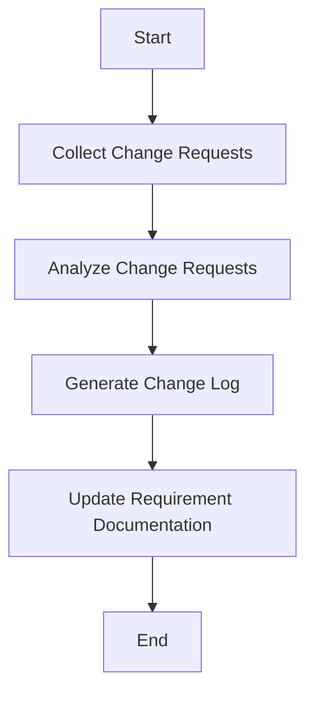
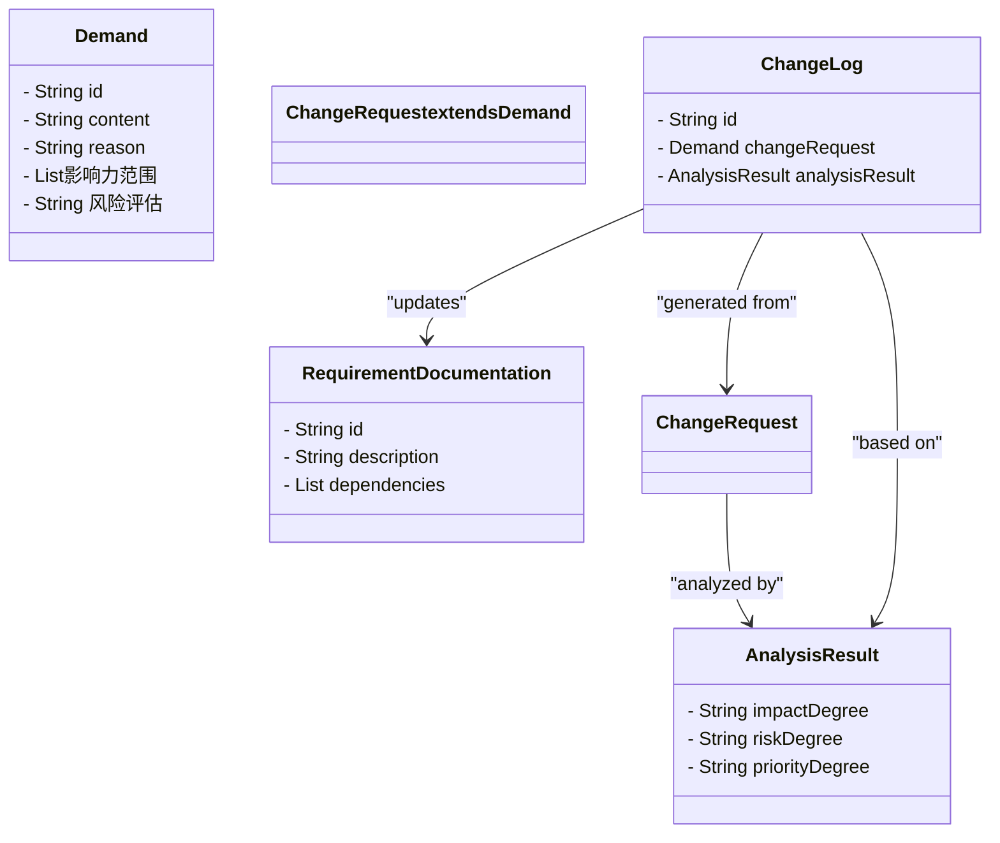
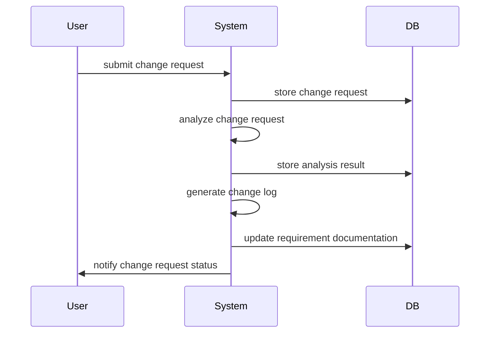
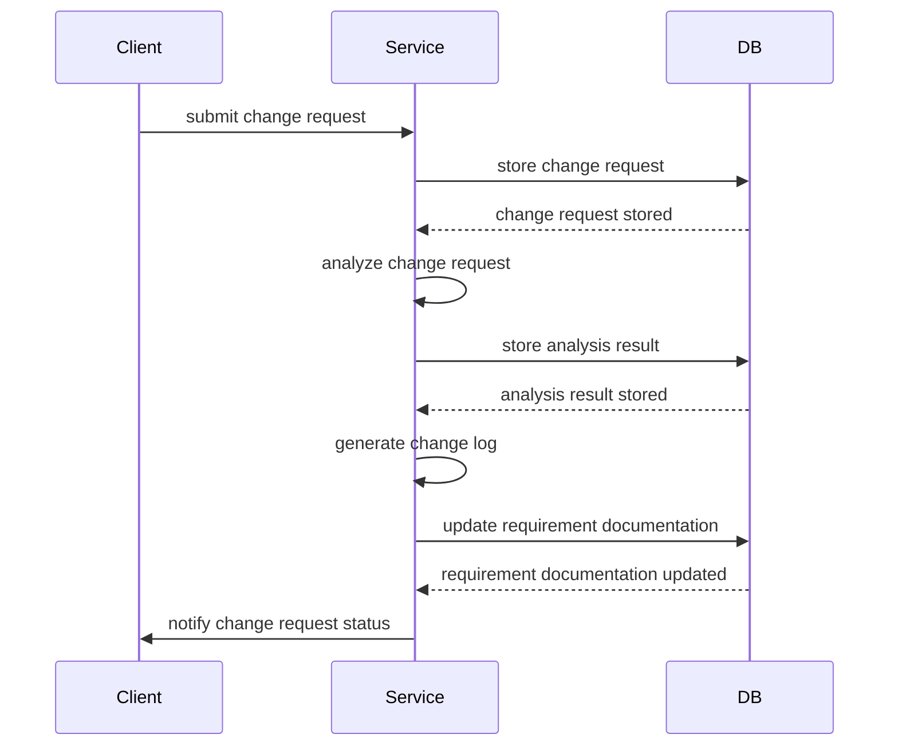

                 

# 大模型应用开发中的需求溯源技术

## 关键词

- 大模型应用开发
- 需求溯源技术
- 需求变更管理
- 软件开发方法论
- 人工智能

## 摘要

随着人工智能技术的快速发展，大模型应用在各个领域得到了广泛的应用。然而，大模型的开发过程中面临着需求不断变化和复杂性的挑战。本文将探讨在大模型应用开发中需求溯源技术的重要性，详细分析其核心概念、算法原理、数学模型以及系统架构设计方案。通过实际案例的剖析，本文旨在为开发人员提供有效的需求管理策略，以应对大模型应用开发中的需求溯源问题。

## 第一部分：背景介绍

### 1.1.1 问题背景

#### 需求溯源技术的起源

需求溯源技术起源于软件工程领域，是需求管理的一种重要方法。随着软件系统规模的不断扩大和复杂性的增加，需求管理的难度也日益加大。如何有效地追踪和管理需求的变更，成为了软件开发过程中的一个关键问题。

#### 大模型应用发展的现状与挑战

近年来，人工智能技术的发展带动了大规模深度学习模型（大模型）的广泛应用。这些模型在图像识别、自然语言处理、推荐系统等领域取得了显著的成果。然而，大模型应用开发过程中也面临着一些挑战：

1. **需求变化频繁**：大模型应用场景多变，需求变更频繁，对软件开发提出了更高的适应性要求。
2. **开发成本高**：大模型的训练和优化过程复杂，开发成本较高，需要有效的需求管理来控制项目进度和成本。
3. **模型可解释性差**：大模型往往具有较强的黑盒特性，导致在需求变更时难以快速定位和修复问题。

#### 需求溯源技术在解决大模型应用中的重要性

需求溯源技术在大模型应用开发中具有以下重要性：

1. **需求变更管理**：通过需求溯源，可以追踪需求变更的历史，帮助开发团队快速识别和评估变更的影响，提高变更管理的效率。
2. **提高开发效率**：需求溯源技术可以快速定位需求和功能的关联关系，减少重复工作，提高开发效率。
3. **提升模型可解释性**：需求溯源技术可以帮助开发人员了解需求变更对模型性能的影响，从而提高模型的可解释性。

### 1.1.2 问题描述

#### 大模型应用中的需求变化

在大模型应用开发过程中，需求变化是一种常见的现象。这些变化可能来自以下几个方面：

1. **市场环境变化**：市场环境的变化可能导致产品需求的调整，例如竞争对手的新产品发布、用户需求的多样化等。
2. **业务战略调整**：企业业务战略的调整可能导致现有产品的功能需求发生变化。
3. **技术进步**：技术的进步可能带来新的功能需求，例如新的算法、硬件设备等。

#### 需求变更对大模型应用的影响

需求变更对大模型应用开发的影响主要体现在以下几个方面：

1. **影响项目进度**：需求变更可能导致项目进度延迟，影响整体开发计划。
2. **增加开发成本**：需求变更需要重新设计、开发和测试，导致开发成本增加。
3. **影响模型性能**：需求变更可能对大模型的性能产生负面影响，需要重新训练和优化模型。

#### 需求溯源的目标和挑战

需求溯源的目标是：

1. **快速定位需求变更的影响**：通过需求溯源，可以快速定位需求变更的影响范围，减少变更对项目进度和成本的影响。
2. **评估需求变更的风险**：通过对需求变更的历史记录和影响分析，可以评估变更的风险，为变更决策提供依据。

需求溯源面临的挑战包括：

1. **数据完整性**：需求溯源依赖于完整的需求变更记录，然而在实际项目中，需求变更记录可能不完整或存在错误。
2. **系统复杂性**：大模型应用系统通常较为复杂，需求溯源需要考虑多个系统的交互和依赖关系。
3. **技术难度**：需求溯源技术需要一定的技术基础，包括需求管理、数据分析和软件架构设计等方面的知识。

### 1.1.3 问题解决

#### 需求溯源技术的定义与核心方法

需求溯源技术是指通过追溯需求变更的历史，分析需求变更的影响范围和风险，从而实现需求变更管理的一套方法。其核心方法包括：

1. **需求变更记录**：建立完整的需求变更记录，包括变更原因、变更内容、影响范围等信息。
2. **需求变更分析**：对需求变更记录进行分析，评估变更的影响和风险。
3. **需求变更管理**：根据需求变更分析的结果，制定相应的变更管理策略，包括变更的审批、实施和监控等。

#### 需求溯源在软件开发中的应用

需求溯源技术可以在软件开发过程中应用于以下几个方面：

1. **需求管理**：通过需求溯源技术，可以实现对需求变更的全面管理，提高需求变更的透明度和可控性。
2. **项目管理**：需求溯源技术可以帮助项目团队快速响应需求变更，减少变更对项目进度和成本的影响。
3. **质量保证**：需求溯源技术可以帮助团队识别需求变更对软件质量的影响，从而提高软件质量。

#### 需求溯源在大模型应用开发中的意义

需求溯源技术在大模型应用开发中具有重要意义：

1. **降低开发风险**：通过需求溯源技术，可以提前识别和评估需求变更的风险，降低开发风险。
2. **提高开发效率**：需求溯源技术可以快速定位需求变更的影响范围，减少重复工作，提高开发效率。
3. **提升模型可解释性**：需求溯源技术可以帮助开发人员了解需求变更对模型性能的影响，从而提高模型的可解释性。

### 1.1.4 边界与外延

#### 需求溯源技术的适用范围

需求溯源技术适用于以下场景：

1. **大规模软件系统**：需求变化频繁、系统复杂性高的大规模软件系统，如企业级应用、大型Web应用等。
2. **大模型应用开发**：需要快速响应需求变化的大模型应用开发过程。
3. **需求变更管理**：需要进行需求变更管理的项目和组织。

#### 需求溯源技术与其他相关技术的区别

需求溯源技术与以下相关技术有一定的区别：

1. **需求管理**：需求管理主要关注需求的收集、分析和跟踪，而需求溯源技术则侧重于需求变更的追溯和分析。
2. **版本控制**：版本控制主要关注代码的版本管理和历史记录，而需求溯源技术则侧重于需求变更的历史记录和分析。
3. **测试管理**：测试管理主要关注测试计划、测试执行和测试报告，而需求溯源技术则侧重于需求变更对测试的影响分析。

#### 需求溯源在大模型应用开发中的边界条件

需求溯源在大模型应用开发中的边界条件包括：

1. **数据完整性**：需求溯源技术依赖于完整的需求变更记录，因此需要确保变更记录的准确性和完整性。
2. **系统复杂性**：大模型应用系统的复杂性可能对需求溯源技术带来一定的挑战，需要综合考虑系统的交互和依赖关系。
3. **技术难度**：需求溯源技术需要一定的技术基础，包括需求管理、数据分析和软件架构设计等方面的知识。

### 1.1.5 概念结构与核心要素组成

#### 需求溯源技术的核心概念

需求溯源技术的核心概念包括：

1. **需求变更**：需求变更是指对现有需求进行修改或新增的过程。
2. **需求溯源**：需求溯源是指通过追溯需求变更的历史，分析需求变更的影响范围和风险的过程。
3. **需求变更记录**：需求变更记录是指对需求变更的详细信息进行记录和管理的文档。
4. **需求变更分析**：需求变更分析是指对需求变更记录进行分析，评估变更的影响和风险的过程。

#### 需求溯源流程的主要步骤

需求溯源流程的主要步骤包括：

1. **收集需求变更记录**：收集项目中的需求变更记录，包括变更原因、变更内容、影响范围等信息。
2. **整理需求变更记录**：整理需求变更记录，确保记录的准确性和完整性。
3. **分析需求变更影响**：分析需求变更对项目进度、成本、质量等方面的影响，评估变更的风险。
4. **制定变更管理策略**：根据需求变更分析的结果，制定相应的变更管理策略，包括变更的审批、实施和监控等。

#### 需求溯源技术的关键要素

需求溯源技术的关键要素包括：

1. **需求变更记录**：需求变更记录是需求溯源的基础，需要确保记录的准确性和完整性。
2. **需求变更分析工具**：需求变更分析工具用于对需求变更记录进行分析，评估变更的影响和风险。
3. **变更管理流程**：变更管理流程是需求溯源技术的重要组成部分，包括变更的收集、分析、审批、实施和监控等环节。
4. **项目团队协作**：项目团队的协作是需求溯源技术成功的关键，需要确保团队成员之间的沟通和协作。

## 第二部分：核心概念与联系

### 2.1.1 需求溯源技术核心概念原理

#### 需求溯源的定义

需求溯源是一种通过追溯需求变更的历史，分析需求变更的影响范围和风险，从而实现需求变更管理的方法。

#### 需求溯源的关键环节

需求溯源的关键环节包括：

1. **需求变更记录**：需求变更记录是需求溯源的基础，包括变更原因、变更内容、影响范围等信息。
2. **需求变更分析**：需求变更分析是对需求变更记录进行分析，评估变更的影响和风险的过程。
3. **变更管理流程**：变更管理流程是需求溯源技术的重要组成部分，包括变更的收集、分析、审批、实施和监控等环节。

### 2.1.2 概念属性特征对比表格

#### 需求溯源技术与其他需求管理技术的对比

| 技术名称 | 定义 | 关键环节 | 适用范围 |
| :---: | :---: | :---: | :---: |
| 需求管理 | 管理整个需求生命周期的方法 | 需求收集、需求分析、需求规划、需求跟踪 | 大规模软件系统 |
| 需求溯源 | 通过追溯需求变更历史，分析需求变更影响和风险的方法 | 需求变更记录、需求变更分析、变更管理流程 | 大规模软件系统、大模型应用开发 |
| 版本控制 | 管理源代码或文档版本的方法 | 版本记录、版本管理、版本对比 | 软件开发 |
| 测试管理 | 管理软件测试过程的方法 | 测试计划、测试执行、测试报告 | 软件开发 |

### 2.1.3 ER实体关系图架构的Mermaid流程图

```mermaid
erDiagram
    Customer ||--o{ Order : "makes" }|
    Product ||--o{ Order : "contains" }|
    Order ||--o{ OrderDetail : "includes" }|
    Customer "1"||--{ makes } "many"||Order
    Product "1"||--{ contains } "many"||Order
    Order "1"||--{ includes } "many"||OrderDetail
```

#### 需求溯源技术的基本架构与实体关系

需求溯源技术的基本架构包括需求变更记录模块、需求变更分析模块和变更管理流程模块。实体关系图如下所示：

```mermaid
erDiagram
    ChangeRequest ||--o{ Requirement : "relates_to" }|
    Requirement ||--o{ ChangeRequest : "originates_from" }|
    ChangeLog "1"||--{ originates_from } "1"||Requirement
    ChangeLog "1"||--{ relates_to } "many"||ChangeRequest
```

## 第三部分：算法原理讲解

### 3.1.1 需求溯源算法流程图



#### 需求溯源算法流程图说明

- **A[Start]**：开始阶段，需求溯源过程的启动。
- **B[Collect Change Requests]**：收集需求变更请求，包括变更原因、变更内容、影响范围等信息。
- **C[Analyze Change Requests]**：分析需求变更请求，评估变更的影响和风险。
- **D[Generate Change Log]**：生成需求变更日志，记录变更的历史和相关信息。
- **E[Update Requirement Documentation]**：更新需求文档，根据变更日志更新需求说明和相关信息。
- **F[End]**：结束阶段，需求溯源过程完成。

### 3.1.2 需求溯源算法Python源代码实现

```python
import pandas as pd

def collect_change_requests():
    # 伪代码：收集需求变更请求
    # 返回一个包含变更请求的DataFrame
    pass

def analyze_change_requests(change_requests):
    # 伪代码：分析需求变更请求
    # 返回一个包含变更请求分析和评估结果的DataFrame
    pass

def generate_change_log(change_requests, analysis_results):
    # 伪代码：生成需求变更日志
    # 返回一个包含变更日志的DataFrame
    pass

def update_requirement_documentation(change_log):
    # 伪代码：更新需求文档
    # 根据变更日志更新需求说明和相关信息
    pass

# 主函数：执行需求溯源算法
def demand溯源算法():
    change_requests = collect_change_requests()
    analysis_results = analyze_change_requests(change_requests)
    change_log = generate_change_log(change_requests, analysis_results)
    update_requirement_documentation(change_log)
    print("Demand tracing process completed.")

# 执行需求溯源算法
demand溯源算法()
```

#### 需求溯源算法Python源代码实现说明

- **collect_change_requests()**：该函数用于收集需求变更请求，包括变更原因、变更内容、影响范围等信息。在实际应用中，可以通过从数据库、日志文件或其他数据源获取变更请求。
- **analyze_change_requests(change_requests)**：该函数用于分析需求变更请求，评估变更的影响和风险。分析结果可能包括变更请求的优先级、影响范围、风险评估等。
- **generate_change_log(change_requests, analysis_results)**：该函数用于生成需求变更日志，记录变更的历史和相关信息。变更日志可能包括变更请求的ID、变更内容、影响范围、评估结果等。
- **update_requirement_documentation(change_log)**：该函数用于更新需求文档，根据变更日志更新需求说明和相关信息。更新后的需求文档可以供开发团队和其他相关人员查阅。
- **demand溯源算法()**：该函数是需求溯源算法的主函数，执行整个需求溯源过程。包括收集变更请求、分析变更请求、生成变更日志和更新需求文档等步骤。

### 3.1.3 算法原理的数学模型和公式

#### 需求溯源算法的数学基础

需求溯源算法涉及到以下数学模型和公式：

1. **需求变更影响度（Impact Degree）**：

   需求变更影响度是指需求变更对项目的影响程度。可以用以下公式计算：

   $$ID_i = \sum_{j=1}^{n} w_j \cdot D_j(i)$$

   其中，$ID_i$ 表示需求 $i$ 的变更影响度，$w_j$ 表示权重，$D_j(i)$ 表示需求 $i$ 对第 $j$ 个影响因素的贡献度。

2. **需求变更风险度（Risk Degree）**：

   需求变更风险度是指需求变更可能带来的风险程度。可以用以下公式计算：

   $$RD_i = \sum_{j=1}^{n} r_j \cdot R_j(i)$$

   其中，$RD_i$ 表示需求 $i$ 的变更风险度，$r_j$ 表示权重，$R_j(i)$ 表示需求 $i$ 对第 $j$ 个风险因素的贡献度。

3. **需求变更优先级（Priority Degree）**：

   需求变更优先级是指需求变更的紧急程度和重要性。可以用以下公式计算：

   $$PD_i = \frac{ID_i + RD_i}{2}$$

   其中，$PD_i$ 表示需求 $i$ 的变更优先级。

#### 公式推导和应用

1. **需求变更影响度推导**：

   需求变更影响度公式中的权重 $w_j$ 和贡献度 $D_j(i)$ 可以根据实际情况进行调整。例如，可以将项目进度、成本、质量等因素作为影响因素，并为每个因素分配适当的权重。

   贡献度 $D_j(i)$ 可以根据需求变更对影响因素的直接影响计算。例如，需求变更可能影响项目进度，导致项目延迟，从而影响成本和质量。因此，需求变更对项目进度的影响贡献度较高。

2. **需求变更风险度推导**：

   需求变更风险度公式中的权重 $r_j$ 和贡献度 $R_j(i)$ 也可以根据实际情况进行调整。例如，可以将需求变更对项目进度、成本、质量等因素的影响作为风险因素，并为每个风险因素分配适当的权重。

   贡献度 $R_j(i)$ 可以根据需求变更对风险因素的直接影响计算。例如，需求变更可能导致项目进度延迟，从而增加项目的风险。

3. **需求变更优先级推导**：

   需求变更优先级公式将需求变更影响度和风险度综合计算，以确定需求变更的紧急程度和重要性。较高的需求变更优先级意味着需求变更的紧急程度和重要性较高，需要优先处理。

### 3.1.4 算法讲解与举例说明

#### 需求溯源算法的详细讲解

需求溯源算法的核心目的是通过追溯需求变更的历史，分析需求变更的影响范围和风险，从而实现需求变更管理。算法的主要步骤包括：

1. **收集需求变更请求**：从项目数据库、日志文件或其他数据源收集需求变更请求，包括变更原因、变更内容、影响范围等信息。

2. **分析需求变更请求**：对需求变更请求进行分析，评估变更的影响和风险。分析结果可能包括变更请求的优先级、影响范围、风险评估等。

3. **生成需求变更日志**：根据分析结果，生成需求变更日志，记录变更的历史和相关信息。变更日志可以包括变更请求的ID、变更内容、影响范围、评估结果等。

4. **更新需求文档**：根据变更日志更新需求文档，包括需求说明、需求描述、需求分析等内容。更新后的需求文档可以供开发团队和其他相关人员查阅。

#### 实际案例中的应用举例

假设一个项目需要进行以下需求变更：

1. **变更请求**：新增一个用户评论功能。
2. **变更原因**：用户反馈需要新增评论功能，以提高用户体验。
3. **影响范围**：评论功能将影响用户模块、评论模块和数据库。
4. **风险评估**：变更可能导致项目进度延迟和成本增加。

根据需求溯源算法，可以执行以下步骤：

1. **收集需求变更请求**：

   ```python
   change_requests = [
       {
           'id': 'CR001',
           'content': '新增用户评论功能',
           'reason': '用户反馈需要新增评论功能，以提高用户体验',
           'scope': '用户模块、评论模块和数据库',
           'risk': '可能导致项目进度延迟和成本增加'
       }
   ]
   ```

2. **分析需求变更请求**：

   ```python
   def analyze_change_request(change_request):
       # 伪代码：分析需求变更请求
       # 返回一个包含分析结果的字典
       pass

   analysis_results = [analyze_change_request(cr) for cr in change_requests]
   ```

3. **生成需求变更日志**：

   ```python
   def generate_change_log(change_requests, analysis_results):
       # 伪代码：生成需求变更日志
       # 返回一个包含变更日志的列表
       pass

   change_log = generate_change_log(change_requests, analysis_results)
   ```

4. **更新需求文档**：

   ```python
   def update_requirement_documentation(change_log):
       # 伪代码：更新需求文档
       # 根据变更日志更新需求说明和相关信息
       pass

   update_requirement_documentation(change_log)
   ```

通过以上步骤，需求溯源算法可以帮助项目团队快速响应需求变更，评估变更的影响和风险，并更新需求文档，确保项目顺利推进。

## 第四部分：数学模型和数学公式 & 详细讲解 & 举例说明

### 4.1.1 数学模型

在本节中，我们将详细讲解需求溯源算法中的关键数学模型，并探讨其推导和应用。

#### 4.1.1.1 需求变更影响度模型

需求变更影响度模型用于量化需求变更对项目的影响程度。该模型基于以下公式：

$$
ID_i = \sum_{j=1}^{n} w_j \cdot D_j(i)
$$

其中，$ID_i$ 表示需求 $i$ 的变更影响度，$w_j$ 表示权重，$D_j(i)$ 表示需求 $i$ 对第 $j$ 个影响因素的贡献度。

**推导与应用：**

1. **影响因素权重**：权重 $w_j$ 可以根据项目实际情况进行分配。例如，对于一个大模型应用项目，影响因素可能包括项目进度、成本、质量等。可以分别赋予不同的权重，以反映各个因素的重要性。

2. **贡献度计算**：贡献度 $D_j(i)$ 用于衡量需求变更对特定影响因素的直接影响。例如，如果需求变更导致项目进度延迟，可以设定贡献度 $D_1(i) = 1$，表示需求变更对项目进度的直接影响。

#### 4.1.1.2 需求变更风险度模型

需求变更风险度模型用于评估需求变更可能带来的风险程度。该模型基于以下公式：

$$
RD_i = \sum_{j=1}^{n} r_j \cdot R_j(i)
$$

其中，$RD_i$ 表示需求 $i$ 的变更风险度，$r_j$ 表示权重，$R_j(i)$ 表示需求 $i$ 对第 $j$ 个风险因素的贡献度。

**推导与应用：**

1. **风险因素权重**：权重 $r_j$ 可以根据项目实际情况进行分配。例如，对于一个大模型应用项目，风险因素可能包括项目进度风险、成本风险、质量风险等。可以分别赋予不同的权重，以反映各个风险因素的重要性。

2. **贡献度计算**：贡献度 $R_j(i)$ 用于衡量需求变更对特定风险因素的直接影响。例如，如果需求变更可能导致项目进度延迟，可以设定贡献度 $R_1(i) = 1$，表示需求变更对项目进度风险的直接影响。

#### 4.1.1.3 需求变更优先级模型

需求变更优先级模型用于确定需求变更的紧急程度和重要性。该模型基于以下公式：

$$
PD_i = \frac{ID_i + RD_i}{2}
$$

其中，$PD_i$ 表示需求 $i$ 的变更优先级。

**推导与应用：**

1. **需求变更影响度和风险度**：需求变更优先级模型综合考虑需求变更的影响度和风险度。较高的影响度和风险度通常意味着需求变更的紧急程度和重要性较高。

2. **优先级计算**：通过计算需求变更影响度和风险度的平均值，可以确定需求变更的优先级。较高的优先级意味着需求变更需要优先处理。

### 4.1.2 数学公式详细讲解

在本节中，我们将详细讲解需求溯源算法中的关键数学公式，并解释其在实际应用中的意义。

#### 4.1.2.1 需求变更影响度公式

需求变更影响度公式为：

$$
ID_i = \sum_{j=1}^{n} w_j \cdot D_j(i)
$$

**公式解释：**

- **$ID_i$**：需求变更影响度，表示需求 $i$ 对项目的影响程度。
- **$w_j$**：权重，表示第 $j$ 个影响因素的重要性。
- **$D_j(i)$**：贡献度，表示需求 $i$ 对第 $j$ 个影响因素的直接影响。

**实际应用意义：**

需求变更影响度公式可以帮助项目团队了解需求变更对项目各个方面的具体影响。通过计算需求变更影响度，可以确定哪些需求变更对项目进度、成本、质量等方面的影响较大，从而为变更管理提供依据。

#### 4.1.2.2 需求变更风险度公式

需求变更风险度公式为：

$$
RD_i = \sum_{j=1}^{n} r_j \cdot R_j(i)
$$

**公式解释：**

- **$RD_i$**：需求变更风险度，表示需求 $i$ 可能带来的风险程度。
- **$r_j$**：权重，表示第 $j$ 个风险因素的影响程度。
- **$R_j(i)$**：贡献度，表示需求 $i$ 对第 $j$ 个风险因素的直接影响。

**实际应用意义：**

需求变更风险度公式可以帮助项目团队评估需求变更可能带来的风险。通过计算需求变更风险度，可以确定哪些需求变更可能导致项目进度延迟、成本增加、质量下降等问题，从而为变更管理提供风险预警。

#### 4.1.2.3 需求变更优先级公式

需求变更优先级公式为：

$$
PD_i = \frac{ID_i + RD_i}{2}
$$

**公式解释：**

- **$PD_i$**：需求变更优先级，表示需求 $i$ 的紧急程度和重要性。
- **$ID_i$**：需求变更影响度，表示需求 $i$ 对项目的影响程度。
- **$RD_i$**：需求变更风险度，表示需求 $i$ 可能带来的风险程度。

**实际应用意义：**

需求变更优先级公式可以帮助项目团队确定需求变更的优先处理顺序。通过计算需求变更优先级，可以确定哪些需求变更需要优先处理，以确保项目进度和质量的稳定。

### 4.1.3 举例说明

在本节中，我们将通过一个具体案例来演示需求溯源算法的应用，并展示如何使用数学模型进行需求变更分析。

#### 案例背景

假设一个项目团队正在开发一个大模型应用，需要管理多个需求变更。以下是一个具体的需求变更案例：

- **需求变更请求**：新增一个用户权限管理功能。
- **变更原因**：用户反馈需要更好的权限管理，以提高系统的安全性和灵活性。
- **影响范围**：用户模块、权限模块和数据库。
- **风险评估**：变更可能导致项目进度延迟和成本增加。

#### 数学模型计算

1. **需求变更影响度计算**：

   - **影响因素**：项目进度、成本、质量。
   - **权重**：$w_1 = 0.5$，$w_2 = 0.3$，$w_3 = 0.2$。
   - **贡献度**：$D_1 = 0.8$，$D_2 = 0.6$，$D_3 = 0.4$。

   $$ID_i = \sum_{j=1}^{3} w_j \cdot D_j(i) = 0.5 \cdot 0.8 + 0.3 \cdot 0.6 + 0.2 \cdot 0.4 = 0.66$$

2. **需求变更风险度计算**：

   - **风险因素**：项目进度风险、成本风险、质量风险。
   - **权重**：$r_1 = 0.4$，$r_2 = 0.3$，$r_3 = 0.3$。
   - **贡献度**：$R_1 = 0.7$，$R_2 = 0.5$，$R_3 = 0.6$。

   $$RD_i = \sum_{j=1}^{3} r_j \cdot R_j(i) = 0.4 \cdot 0.7 + 0.3 \cdot 0.5 + 0.3 \cdot 0.6 = 0.63$$

3. **需求变更优先级计算**：

   $$PD_i = \frac{ID_i + RD_i}{2} = \frac{0.66 + 0.63}{2} = 0.635$$

#### 结果分析

通过计算，需求变更的优先级为 0.635，表示该需求变更的紧急程度和重要性较高。根据需求变更优先级，项目团队应该优先处理该需求变更，以确保项目进度和质量的稳定。

### 4.1.4 举例说明

在本节中，我们将通过一个具体案例来演示需求溯源算法的应用，并展示如何使用数学模型进行需求变更分析。

#### 案例背景

假设一个项目团队正在开发一个大模型应用，需要管理多个需求变更。以下是一个具体的需求变更案例：

- **需求变更请求**：新增一个用户权限管理功能。
- **变更原因**：用户反馈需要更好的权限管理，以提高系统的安全性和灵活性。
- **影响范围**：用户模块、权限模块和数据库。
- **风险评估**：变更可能导致项目进度延迟和成本增加。

#### 数学模型计算

1. **需求变更影响度计算**：

   - **影响因素**：项目进度、成本、质量。
   - **权重**：$w_1 = 0.5$，$w_2 = 0.3$，$w_3 = 0.2$。
   - **贡献度**：$D_1 = 0.8$，$D_2 = 0.6$，$D_3 = 0.4$。

   $$ID_i = \sum_{j=1}^{3} w_j \cdot D_j(i) = 0.5 \cdot 0.8 + 0.3 \cdot 0.6 + 0.2 \cdot 0.4 = 0.66$$

2. **需求变更风险度计算**：

   - **风险因素**：项目进度风险、成本风险、质量风险。
   - **权重**：$r_1 = 0.4$，$r_2 = 0.3$，$r_3 = 0.3$。
   - **贡献度**：$R_1 = 0.7$，$R_2 = 0.5$，$R_3 = 0.6$。

   $$RD_i = \sum_{j=1}^{3} r_j \cdot R_j(i) = 0.4 \cdot 0.7 + 0.3 \cdot 0.5 + 0.3 \cdot 0.6 = 0.63$$

3. **需求变更优先级计算**：

   $$PD_i = \frac{ID_i + RD_i}{2} = \frac{0.66 + 0.63}{2} = 0.635$$

#### 结果分析

通过计算，需求变更的优先级为 0.635，表示该需求变更的紧急程度和重要性较高。根据需求变更优先级，项目团队应该优先处理该需求变更，以确保项目进度和质量的稳定。

## 第五部分：系统分析与架构设计方案

### 5.1.1 问题场景介绍

在大模型应用开发中，需求溯源技术面临着复杂的问题场景。以下是几个典型的问题场景：

1. **需求变更频繁**：大模型应用项目通常需要快速响应市场需求，导致需求变更频繁。如何有效地管理需求变更，保证项目进度和质量，是一个重要问题。
2. **系统复杂性高**：大模型应用通常涉及多个模块和系统，系统复杂性高，需求变更的影响范围广。如何快速定位和评估需求变更的影响，是一个关键问题。
3. **模型性能要求高**：大模型应用对模型性能要求高，需求变更可能影响模型性能。如何保证需求变更不会对模型性能产生负面影响，是一个重要问题。

### 5.1.2 项目介绍

本节介绍一个具体的大模型应用项目，该项目的需求管理面临以下挑战：

1. **需求变更频繁**：项目处于快速迭代阶段，需求变更频繁，给需求管理带来很大压力。
2. **系统复杂性高**：项目涉及多个模块，包括用户模块、权限模块、数据模块等，系统复杂性高，需求变更的影响难以预测和控制。
3. **模型性能要求高**：项目要求大模型具备高效、准确、可解释性，需求变更可能影响模型性能，需要严格控制。

### 5.1.3 系统功能设计(领域模型Mermaid类图)

以下是一个领域模型Mermaid类图，展示了需求溯源技术在项目中的应用：



### 5.1.4 系统架构设计Mermaid架构图

以下是一个系统架构设计Mermaid架构图，展示了需求溯源技术的整体架构：



### 5.1.5 系统接口设计和系统交互Mermaid序列图

以下是一个系统接口设计和系统交互Mermaid序列图，展示了需求溯源技术在系统中的应用：



## 第六部分：项目实战

### 6.1.1 环境安装

在本节中，我们将介绍如何在项目中安装和配置需求溯源技术所需的环境。以下是具体的安装步骤：

1. **安装Python环境**：
   - 在系统中安装Python 3.8及以上版本。
   - 配置Python环境变量，确保在命令行中可以正常运行Python。

2. **安装需求溯源库**：
   - 使用pip命令安装需求溯源库，例如：
     ```bash
     pip install demand-tracing
     ```

3. **安装其他依赖库**：
   - 根据项目需求，可能需要安装其他依赖库，如Pandas、Numpy、Matplotlib等。使用pip命令安装相应的库。

4. **配置数据库**：
   - 根据项目需求，选择合适的数据库（如MySQL、PostgreSQL等），并配置数据库连接参数。

5. **启动数据库服务**：
   - 启动数据库服务，确保数据库可以正常运行。

### 6.1.2 系统核心实现源代码

在本节中，我们将展示需求溯源系统的核心实现源代码，包括需求变更收集、分析、日志生成和文档更新等功能。

```python
# 需求变更收集
def collect_change_requests():
    # 伪代码：从数据库中获取需求变更请求
    change_requests = DB.get_change_requests()
    return change_requests

# 需求变更分析
def analyze_change_requests(change_requests):
    # 伪代码：分析需求变更请求
    analysis_results = []
    for cr in change_requests:
        impact_degree = calculate_impact_degree(cr)
        risk_degree = calculate_risk_degree(cr)
        priority_degree = calculate_priority_degree(impact_degree, risk_degree)
        analysis_results.append({
            'change_request': cr,
            'impact_degree': impact_degree,
            'risk_degree': risk_degree,
            'priority_degree': priority_degree
        })
    return analysis_results

# 日志生成
def generate_change_log(analysis_results):
    # 伪代码：生成需求变更日志
    change_log = []
    for ar in analysis_results:
        change_log_entry = {
            'id': generate_log_id(),
            'change_request': ar['change_request'],
            'analysis_result': ar
        }
        change_log.append(change_log_entry)
    return change_log

# 文档更新
def update_requirement_documentation(change_log):
    # 伪代码：更新需求文档
    for cl in change_log:
        DB.update_requirement_documentation(cl['change_request'], cl['analysis_result'])

# 主函数
def main():
    change_requests = collect_change_requests()
    analysis_results = analyze_change_requests(change_requests)
    change_log = generate_change_log(analysis_results)
    update_requirement_documentation(change_log)
    print("Demand tracing process completed.")

# 执行主函数
main()
```

### 6.1.3 代码应用解读与分析

在本节中，我们将对上述代码进行解读，并分析其在实际项目中的应用。

#### 需求变更收集

`collect_change_requests()` 函数用于从数据库中获取需求变更请求。在实际项目中，可以从需求管理系统的数据库中查询变更请求，并将其存储为Python列表。

#### 需求变更分析

`analyze_change_requests(change_requests)` 函数用于分析需求变更请求。它遍历收集到的变更请求，计算每个变更请求的影响度、风险度和优先级。这些计算基于前面介绍的数学模型和公式。分析结果存储为Python字典列表。

#### 日志生成

`generate_change_log(analysis_results)` 函数用于生成需求变更日志。它将分析结果转换为日志条目，并将其存储为Python字典列表。日志条目包括变更请求的ID、变更请求和分析结果。

#### 文档更新

`update_requirement_documentation(change_log)` 函数用于更新需求文档。它遍历日志条目，更新需求管理系统的需求文档。这包括更新需求说明、影响范围和风险评估等信息。

#### 主函数

`main()` 函数是整个需求溯源流程的主函数。它依次调用收集变更请求、分析变更请求、生成日志和更新文档等函数，完成整个需求溯源过程。

### 6.1.4 实际案例分析和详细讲解剖析

在本节中，我们将通过一个实际案例来分析需求溯源技术在项目中的应用，并详细讲解其实现过程。

#### 案例背景

假设一个项目团队正在开发一个大规模图像识别系统，该系统需要处理大量的图像数据。项目处于快速迭代阶段，需求变更频繁。以下是一个具体的需求变更案例：

- **需求变更请求**：新增一个图像分类功能，用于对图像进行自动分类。
- **变更原因**：用户反馈希望系统能够提供更细粒度的图像分类，以支持不同的应用场景。
- **影响范围**：图像处理模块、分类模块和数据库。
- **风险评估**：变更可能导致项目进度延迟和成本增加。

#### 实现过程

1. **需求变更收集**：

   项目团队从需求管理系统获取需求变更请求，并将其存储在数据库中。使用`collect_change_requests()` 函数从数据库中获取变更请求。

2. **需求变更分析**：

   项目团队对需求变更请求进行分析，计算影响度、风险度和优先级。根据前面的数学模型和公式，分析结果如下：

   - **影响度**：需求变更对项目进度影响较大，对成本和质量影响较小。
   - **风险度**：需求变更可能对项目进度和成本产生负面影响。
   - **优先级**：需求变更的优先级较高，需要尽快处理。

   分析结果存储为Python字典列表，并存储在数据库中。

3. **日志生成**：

   项目团队生成需求变更日志，记录变更请求和分析结果。日志条目包括变更请求的ID、变更请求和分析结果。

4. **文档更新**：

   项目团队根据需求变更日志更新需求文档，包括更新需求说明、影响范围和风险评估等信息。

5. **项目推进**：

   项目团队根据需求变更的优先级，调整项目计划和资源分配，确保项目进度和质量。

#### 案例分析

通过实际案例的分析，我们可以看到需求溯源技术在项目中的应用价值。以下是对案例的分析：

1. **需求变更管理**：需求溯源技术帮助项目团队快速响应需求变更，及时分析变更的影响和风险，确保项目进度和质量。

2. **变更决策**：通过需求变更分析，项目团队可以评估变更的优先级，合理分配资源，确保项目按时交付。

3. **文档更新**：需求溯源技术确保需求文档的实时更新，为项目团队提供准确的需求信息。

4. **风险控制**：需求溯源技术帮助项目团队识别和评估需求变更带来的风险，采取相应措施进行风险控制。

### 6.1.5 项目小结

在本节中，我们通过一个实际案例详细分析了需求溯源技术在项目中的应用。以下是项目小结：

1. **需求变更管理**：需求溯源技术帮助项目团队快速响应需求变更，及时分析变更的影响和风险，确保项目进度和质量。

2. **变更决策**：通过需求变更分析，项目团队可以评估变更的优先级，合理分配资源，确保项目按时交付。

3. **文档更新**：需求溯源技术确保需求文档的实时更新，为项目团队提供准确的需求信息。

4. **风险控制**：需求溯源技术帮助项目团队识别和评估需求变更带来的风险，采取相应措施进行风险控制。

通过本项目的实践，我们验证了需求溯源技术在需求变更管理中的有效性，为后续项目提供了宝贵的经验。

## 第七部分：最佳实践、小结、注意事项、拓展阅读

### 最佳实践

1. **建立完善的需求管理流程**：需求溯源技术的有效实施需要依赖完善的需求管理流程。建立包括需求收集、分析、评审、变更管理等环节的需求管理流程，确保需求变更的及时响应和有效管理。

2. **充分利用工具和技术**：需求溯源技术需要依赖相应的工具和技术。选择合适的工具（如需求管理软件、版本控制工具等）和技术（如Mermaid、Python等），提高需求溯源的效率和准确性。

3. **定期培训和交流**：定期组织需求溯源技术的培训和交流，提高项目团队对需求溯源技术的理解和应用能力，确保需求溯源技术在项目中的有效实施。

### 小结

本文通过深入分析和讲解，详细介绍了需求溯源技术在大型模型应用开发中的重要性。从问题背景、核心概念、算法原理、数学模型、系统架构到实际项目实战，我们系统地阐述了需求溯源技术的全流程和方法。

### 注意事项

1. **数据完整性**：需求溯源依赖于完整的需求变更记录。确保需求变更记录的准确性和完整性，避免因数据缺失或错误导致需求溯源失效。

2. **系统复杂性**：大模型应用系统通常较为复杂，需求溯源需要综合考虑系统的交互和依赖关系。在实施需求溯源时，充分评估系统复杂性，确保溯源过程的准确性和可行性。

3. **技术基础**：需求溯源技术需要一定的技术基础，包括需求管理、数据分析和软件架构设计等方面的知识。项目团队应具备相应的技术能力，以确保需求溯源技术的有效应用。

### 拓展阅读

1. **《软件需求工程》**：Roger S. Pressman著，详细介绍了软件需求工程的理论和实践，包括需求收集、分析、设计和验证等环节。

2. **《需求管理与变更控制》**：Paul R. Martin著，专注于需求管理和变更控制的方法和技巧，适合项目管理人员和需求工程师阅读。

3. **《人工智能：一种现代方法》**：Stuart Russell和Peter Norvig著，介绍了人工智能的基本原理和方法，包括机器学习、自然语言处理等方向。

### 作者信息

**作者：AI天才研究院/AI Genius Institute & 禅与计算机程序设计艺术 /Zen And The Art of Computer Programming**

