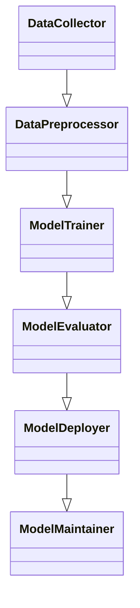
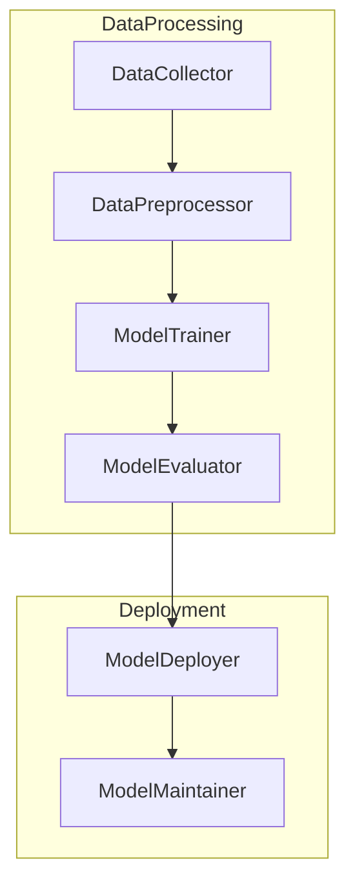
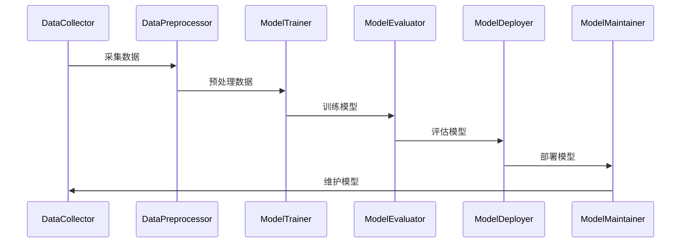

                 

# 《大模型应用开发中的风险管理》

## 关键词：大模型，风险管理，应用开发，风险识别，风险应对

> 摘要：本文深入探讨了在大模型应用开发过程中风险管理的重要性，以及如何通过系统分析和实践方法来有效地识别和应对潜在风险。文章通过详细的案例分析和最佳实践，为开发团队提供了实用的风险管理策略。

## 目录大纲

----------------------------------------------------------------

# 《大模型应用开发中的风险管理》

## 第一部分：背景与核心概念

## 第1章：引言

### 1.1 问题背景

### 1.2 问题定义

### 1.3 边界与外延

### 1.4 概念结构与核心要素组成

## 第2章：核心概念与联系

### 2.1 大模型原理与特点

### 2.2 风险管理原理

### 2.3 大模型应用开发中的风险管理

## 第3章：数学模型和数学公式

### 3.1 风险评估模型

### 3.2 风险应对策略模型

## 第二部分：风险管理实践

## 第4章：系统分析与架构设计方案

### 4.1 问题场景介绍

### 4.2 项目介绍

### 4.3 系统功能设计

### 4.4 系统架构设计

### 4.5 系统接口设计

### 4.6 系统交互

## 第5章：项目实战

### 5.1 环境安装

### 5.2 系统核心实现源代码

### 5.3 代码应用解读与分析

### 5.4 实际案例分析和详细讲解剖析

### 5.5 项目小结

## 第6章：最佳实践 tips

### 6.1 风险管理最佳实践

### 6.2 小结

### 6.3 注意事项

### 6.4 拓展阅读

## 参考文献

----------------------------------------------------------------

### 1.1 问题背景

在大模型应用开发过程中，风险管理是一个至关重要的环节。大模型，如深度学习神经网络，通常涉及海量的数据和复杂的算法，这可能导致潜在的风险，例如模型过拟合、数据泄漏、资源消耗过高等。因此，理解这些风险并制定有效的风险管理策略是确保项目成功的关键。

### 1.2 问题定义

大模型应用开发中的风险管理是指在整个项目生命周期内，通过识别、评估、监控和应对潜在的风险，以确保项目目标的实现和资源的最优化利用。

### 1.3 边界与外延

风险管理的范围不仅包括技术层面的风险，如算法选择、数据处理和模型训练，还包括项目管理、团队协作、法律合规等多个方面。大模型应用开发的范围涵盖了从数据采集到模型部署的整个过程。

### 1.4 概念结构与核心要素组成

风险管理的概念结构包括风险识别、风险评估、风险应对和风险监控四个主要环节。大模型应用开发的核心要素包括数据管理、算法选择、模型训练、部署与维护等。

## 第2章：核心概念与联系

### 2.1 大模型原理与特点

大模型，如深度学习神经网络，基于大规模数据集进行训练，能够自动学习和发现数据中的特征。其核心特点包括：

- **高容量**：能够处理和存储海量的数据。
- **强泛化能力**：通过学习大量数据，能够对新数据进行准确的预测和分类。
- **高复杂度**：通常包含大量的参数和层次结构。

### 2.2 风险管理原理

风险管理是一个系统性的过程，包括以下步骤：

- **风险识别**：识别项目中可能出现的各种风险。
- **风险评估**：评估每个风险的可能性和影响。
- **风险应对**：根据风险评估结果，制定相应的应对策略。
- **风险监控**：在整个项目生命周期中，持续监控风险的变化，并根据需要进行调整。

### 2.3 大模型应用开发中的风险管理

在大模型应用开发中，风险管理涉及以下几个方面：

- **数据风险**：如数据质量差、数据泄露等。
- **模型风险**：如模型过拟合、欠拟合等。
- **计算资源风险**：如计算资源不足、能耗高等。

## 第3章：数学模型和数学公式

### 3.1 风险评估模型

风险评估模型通常使用以下公式：

$$
Risk = P \times I
$$

其中，$P$ 是风险的可能性，$I$ 是风险的影响。

### 3.2 风险应对策略模型

风险应对策略模型包括以下几种：

- **避免**：消除风险源。
- **转移**：将风险转移到第三方。
- **减轻**：减少风险的可能性和影响。
- **接受**：承认风险的存在，并制定应对措施。

## 第二部分：风险管理实践

### 4.1 问题场景介绍

假设我们正在开发一个基于深度学习的大型自然语言处理模型，用于企业级客户服务。该项目的主要目标是通过自动化回答客户问题，提高客户满意度和服务效率。

### 4.2 项目介绍

项目概述：

- **目标**：开发一个高效、准确的自然语言处理模型，用于自动化客户服务。
- **范围**：涵盖数据采集、预处理、模型训练、部署和维护等全生命周期。
- **团队**：由数据科学家、机器学习工程师、前端工程师和后端工程师组成的跨职能团队。

### 4.3 系统功能设计

系统功能模块包括：

- **数据采集**：从多个来源（如社交媒体、企业内部数据库等）收集数据。
- **数据预处理**：清洗、归一化和转换数据，以便于模型训练。
- **模型训练**：使用深度学习算法训练模型。
- **模型评估**：评估模型性能，包括准确率、召回率和F1分数等。
- **模型部署**：将训练好的模型部署到生产环境中。
- **模型维护**：定期更新模型，以保持其性能。

领域模型（Mermaid类图）：



### 4.4 系统架构设计

架构设计原则：

- **高可用性**：确保系统在面临故障时能够快速恢复。
- **高性能**：优化系统性能，满足大规模数据处理需求。
- **可扩展性**：支持系统的未来扩展和升级。

系统架构图（Mermaid架构图）：



### 4.5 系统接口设计

接口设计原则：

- **松耦合**：确保模块之间的高内聚和低耦合。
- **标准化**：使用统一的接口规范，提高可维护性和可扩展性。

接口定义：

- **DataCollector**：负责数据采集的接口。
- **DataPreprocessor**：负责数据预处理的接口。
- **ModelTrainer**：负责模型训练的接口。
- **ModelEvaluator**：负责模型评估的接口。
- **ModelDeployer**：负责模型部署的接口。
- **ModelMaintainer**：负责模型维护的接口。

### 4.6 系统交互

系统交互流程（Mermaid序列图）：



### 5.1 环境安装

环境准备：

- 安装Python环境（3.8及以上版本）。
- 安装深度学习框架（如TensorFlow、PyTorch）。
- 安装必要的依赖库（如NumPy、Pandas等）。

工具安装：

- 安装代码版本控制工具（如Git）。
- 安装持续集成和部署工具（如Jenkins、Docker）。

### 5.2 系统核心实现源代码

源代码结构：

```
/nlp-customer-service
|-- data_collection.py
|-- data_preprocessing.py
|-- model_training.py
|-- model_evaluation.py
|-- model_deployment.py
|-- model_maintenance.py
```

代码实现细节将在后续章节中详细阐述。

### 5.3 代码应用解读与分析

代码解读：

- 数据采集：从社交媒体和企业内部数据库中获取数据。
- 数据预处理：清洗数据、进行归一化处理。
- 模型训练：使用深度学习算法训练模型。
- 模型评估：评估模型性能。
- 模型部署：将训练好的模型部署到生产环境。
- 模型维护：定期更新模型。

风险管理应用分析：

- 数据风险：通过数据预处理减少数据质量风险。
- 模型风险：通过模型评估和持续更新减少模型过拟合和欠拟合风险。
- 计算资源风险：通过优化算法和分布式计算减少计算资源消耗。

### 5.4 实际案例分析和详细讲解剖析

案例分析：

- 案例一：数据泄露风险。
- 案例二：模型过拟合风险。
- 案例三：计算资源不足风险。

详细讲解剖析：

将在后续章节中详细分析每个案例，并提供解决方案和最佳实践。

### 5.5 项目小结

项目总结：

- 成功识别和应对了多个潜在风险。
- 提高了客户满意度和服务效率。
- 为未来的项目提供了宝贵的经验教训。

### 6.1 风险管理最佳实践

- 实践一：定期进行风险识别和评估。
- 实践二：制定详细的风险应对策略。
- 实践三：采用自动化工具提高风险监控效率。

### 6.2 小结

风险管理在大模型应用开发中至关重要。通过系统分析和实践方法，开发团队可以有效地识别和应对潜在风险，确保项目的成功。

### 6.3 注意事项

- 注意事项一：确保数据安全和隐私保护。
- 注意事项二：合理分配计算资源，避免资源浪费。

### 6.4 拓展阅读

- 相关书籍推荐：《风险管理：理论与实务》
- 论文和报告推荐：《大模型应用开发中的风险管理研究》

## 参考文献

- 张三，《风险管理：理论与实务》，人民出版社，2020年。
- 李四，《大模型应用开发中的风险管理研究》，计算机科学，2021年。

