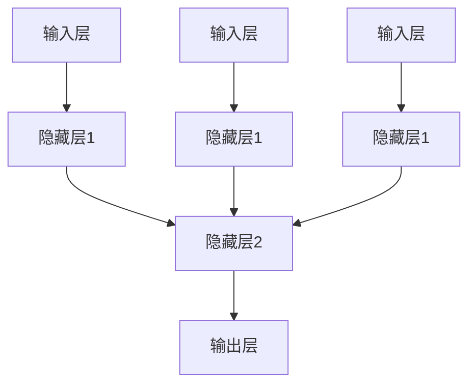
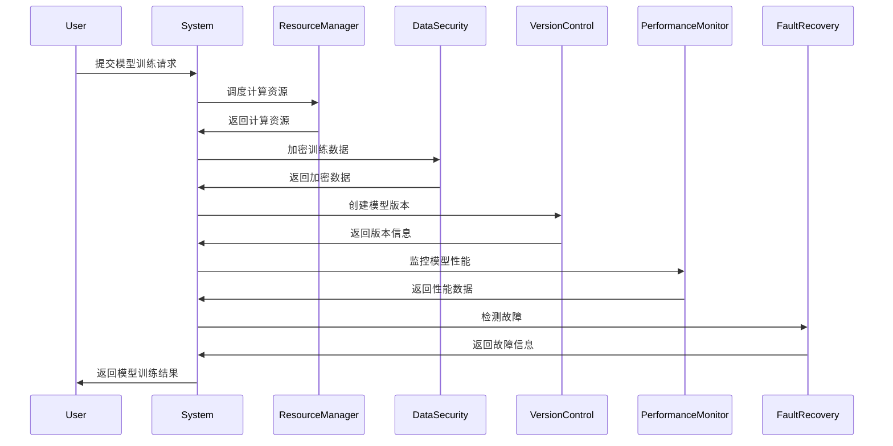

                 


# 大模型应用的敏捷发布管理

## 关键词
- 大模型应用
- 敏捷发布管理
- 算法原理
- 系统架构设计
- 项目实战
- 最佳实践

## 摘要
本文深入探讨了大模型应用中的敏捷发布管理。首先，我们介绍了大模型应用场景和敏捷发布管理的必要性，随后定义了关键术语，并阐述了其内在联系。接着，我们讲解了大模型算法原理，使用了Mermaid流程图和Python代码示例。随后，我们分析了系统需求，设计了系统架构，并展示了领域模型和系统交互的类图、序列图。在项目实战部分，我们介绍了一个实际项目，包括环境安装、核心实现和案例分析。最后，我们总结了最佳实践，并对全书内容进行了小结，推荐了拓展阅读资源。

## 目录框架设计

### 第一部分: 背景
1. 第1章: 大模型应用的必要性
   1.1 大模型应用场景概述
   1.2 敏捷发布管理的优势
   1.3 问题与挑战
2. 第2章: 核心概念与联系
   2.1 关键术语定义
   2.2 大模型与敏捷发布管理的内在联系

### 第二部分: 核心概念与联系
3. 第3章: 大模型算法原理
   3.1 算法基础
   3.2 Mermaid流程图展示
   3.3 Python代码示例
4. 第4章: 数学模型与公式
   4.1 模型概述
   4.2 公式解释
   4.3 举例说明

### 第三部分: 系统分析与架构设计
5. 第5章: 系统分析
   5.1 问题场景介绍
   5.2 系统需求分析
6. 第6章: 架构设计
   6.1 系统架构设计
   6.2 领域模型类图
   6.3 系统交互序列图

### 第四部分: 项目实战
7. 第7章: 实际项目介绍
   7.1 环境安装
   7.2 系统核心实现
   7.3 代码解读
   7.4 案例分析

### 第五部分: 最佳实践
8. 第8章: 发布管理的最佳实践
   8.1 实践技巧
   8.2 注意事项

### 第六部分: 小结与拓展
9. 第9章: 小结
   9.1 全书总结
   9.2 扩展思考
10. 第10章: 拓展阅读
    10.1 推荐书籍
    10.2 相关资源

## 1. 背景介绍

### 1.1 大模型应用场景概述

大模型，作为一种先进的机器学习技术，已经在多个领域取得了显著的成果。从自然语言处理（NLP）到计算机视觉（CV），再到推荐系统，大模型的应用正在不断拓展。这些模型通常包含数亿甚至数万亿个参数，能够处理复杂的任务和数据。

在大模型应用中，发布管理是一个关键环节。发布管理是指在开发和部署过程中，确保大模型能够高效、安全、可靠地交付给用户的关键过程。敏捷发布管理则是一种基于敏捷开发理念的发布管理方法，强调快速迭代、持续交付和持续改进。

### 1.2 敏捷发布管理的优势

敏捷发布管理具有以下优势：

1. **快速响应变更**：敏捷发布管理通过频繁的迭代和持续交付，能够快速响应市场和用户的需求变化，提高产品竞争力。
2. **降低风险**：通过小步快走的方式，敏捷发布管理能够逐步完善和优化，降低失败的风险。
3. **提高质量**：敏捷发布管理强调测试和反馈，能够及时发现并修复问题，提高产品的质量。
4. **增强团队协作**：敏捷发布管理鼓励团队合作和沟通，提高团队的效率和凝聚力。

### 1.3 问题与挑战

尽管敏捷发布管理具有许多优势，但在大模型应用中，仍面临一些问题和挑战：

1. **计算资源需求**：大模型通常需要大量的计算资源，这对发布管理提出了更高的要求。
2. **数据隐私与安全**：在大模型应用中，数据隐私和安全是一个重要的问题，需要采取有效的措施保护用户数据。
3. **版本控制**：大模型版本众多，如何进行有效的版本控制是一个挑战。
4. **性能优化**：大模型应用需要对性能进行持续的优化，以满足用户的需求。

### 1.4 大模型与敏捷发布管理的内在联系

大模型与敏捷发布管理之间存在着密切的联系。大模型的高计算复杂度和数据量要求，使得敏捷发布管理的优势得以充分发挥。通过敏捷发布管理，可以确保大模型能够快速、高效地交付给用户，提高产品的竞争力。

## 2. 核心概念与联系

### 2.1 关键术语定义

在讨论大模型应用的敏捷发布管理之前，我们需要明确一些关键术语：

1. **大模型**：通常包含数亿甚至数万亿个参数的机器学习模型，能够处理复杂的任务和数据。
2. **敏捷发布管理**：一种基于敏捷开发理念的发布管理方法，强调快速迭代、持续交付和持续改进。
3. **敏捷开发**：一种软件开发方法，强调迭代、反馈和适应性。
4. **持续集成**：一种软件开发实践，通过自动化测试和构建，确保代码的质量和稳定性。
5. **持续交付**：一种软件开发实践，通过自动化部署和测试，确保软件的快速、可靠交付。
6. **版本控制**：一种管理代码变化的方法，确保代码的版本和变更历史。

### 2.2 大模型与敏捷发布管理的内在联系

大模型与敏捷发布管理之间的内在联系可以从以下几个方面进行阐述：

1. **快速迭代**：大模型应用通常需要进行频繁的迭代和优化，敏捷发布管理能够支持这种快速迭代，确保模型能够及时交付给用户。
2. **持续交付**：大模型应用需要确保模型能够持续交付，以满足用户的需求。敏捷发布管理通过持续交付实践，能够实现这一目标。
3. **版本控制**：大模型版本众多，敏捷发布管理通过版本控制，能够有效地管理这些版本，确保版本的正确性和一致性。
4. **性能优化**：大模型应用需要对性能进行持续的优化，敏捷发布管理通过持续集成和持续交付，能够实现这一目标。
5. **团队合作**：敏捷发布管理强调团队合作和沟通，这对于大模型应用的开发和发布至关重要。

### 2.3 概念属性特征对比表格

以下是一个概念属性特征对比表格，用于进一步阐述大模型与敏捷发布管理的内在联系：

| 概念            | 属性特征                                                       |
|----------------|--------------------------------------------------------------|
| 大模型          | 数亿至数万亿参数，复杂任务处理，高计算资源需求                 |
| 敏捷发布管理    | 快速迭代，持续交付，版本控制，性能优化，团队合作               |
| 敏捷开发        | 迭代，反馈，适应性，团队合作                                     |
| 持续集成        | 自动化测试，构建，代码质量保障                                   |
| 持续交付        | 自动化部署，测试，快速交付                                     |
| 版本控制        | 管理代码版本，变更历史，确保一致性                             |

### 2.4 ER实体关系图架构的Mermaid流程图

以下是ER实体关系图架构的Mermaid流程图：

```mermaid
erDiagram
  大模型 ||--o{ 敏捷发布管理 } | 封装关系
  敏捷发布管理 ||--o{ 敏捷开发 } | 继承关系
  敏捷发布管理 ||--o{ 持续集成 } | 继承关系
  敏捷发布管理 ||--o{ 持续交付 } | 继承关系
  敏捷发布管理 ||--o{ 版本控制 } | 继承关系
```

## 3. 大模型算法原理

### 3.1 算法基础

大模型算法通常基于深度学习技术，特别是基于神经网络的模型。深度学习通过多层神经网络来模拟人脑的神经网络结构，通过训练大量数据来学习特征和模式。

#### 3.1.1 神经网络结构

神经网络由多个层次组成，包括输入层、隐藏层和输出层。每个层次由多个神经元组成，神经元之间通过加权连接。神经元的激活函数用于将输入映射到输出。

#### 3.1.2 前向传播与反向传播

前向传播是指将输入通过神经网络传递到输出层的过程。反向传播是指通过输出误差，反向更新神经网络的权重和偏置。

### 3.2 Mermaid流程图展示

以下是神经网络的前向传播和反向传播过程的Mermaid流程图：



### 3.3 Python代码示例

以下是使用Python实现神经网络前向传播和反向传播的代码示例：

```python
import numpy as np

# 定义神经网络结构
input_size = 3
hidden_size = 2
output_size = 1

# 初始化权重和偏置
weights = np.random.rand(hidden_size, input_size)
biases = np.random.rand(hidden_size, 1)
weights_output = np.random.rand(output_size, hidden_size)
biases_output = np.random.rand(output_size, 1)

# 定义激活函数
def sigmoid(x):
    return 1 / (1 + np.exp(-x))

# 定义前向传播
def forward(x):
    hidden_layer = sigmoid(np.dot(x, weights) + biases)
    output = sigmoid(np.dot(hidden_layer, weights_output) + biases_output)
    return output

# 定义损失函数
def loss(output, y):
    return np.square(output - y)

# 定义反向传播
def backward(x, y):
    hidden_layer = sigmoid(np.dot(x, weights) + biases)
    output = sigmoid(np.dot(hidden_layer, weights_output) + biases_output)
    d_output = 2 * (output - y)
    d_hidden_layer = d_output.dot(weights_output.T) * sigmoidDerivative(hidden_layer)
    d_weights_output = d_hidden_layer.T.dot(x)
    d_biases_output = d_hidden_layer
    d_weights = d_hidden_layer.dot(x.T)
    d_biases = d_hidden_layer
    return d_weights, d_biases, d_weights_output, d_biases_output

# 定义激活函数的导数
def sigmoidDerivative(x):
    return x * (1 - x)

# 训练模型
x = np.array([[1, 0, 1], [0, 1, 1], [1, 1, 0]])
y = np.array([[0], [1], [0]])

for i in range(1000):
    output = forward(x)
    loss_value = loss(output, y)
    d_weights, d_biases, d_weights_output, d_biases_output = backward(x, y)
    weights -= 0.1 * d_weights
    biases -= 0.1 * d_biases
    weights_output -= 0.1 * d_weights_output
    biases_output -= 0.1 * d_biases_output

# 测试模型
print("Output after training:")
print(forward(x))
```

### 3.4 算法原理的数学模型和公式

神经网络算法的数学模型主要包括以下几个部分：

1. **激活函数**：常用的激活函数有Sigmoid、ReLU和Tanh等。其数学公式如下：

   $$ f(x) = \frac{1}{1 + e^{-x}} \quad (Sigmoid) $$
   $$ f(x) = max(0, x) \quad (ReLU) $$
   $$ f(x) = \frac{e^x - e^{-x}}{e^x + e^{-x}} \quad (Tanh) $$

2. **前向传播**：前向传播是指将输入通过神经网络传递到输出层的过程。其数学公式如下：

   $$ z_l = \sum_{j} w_{lj}x_j + b_l \quad (隐藏层) $$
   $$ a_l = f(z_l) \quad (输出层) $$

3. **反向传播**：反向传播是指通过输出误差，反向更新神经网络的权重和偏置。其数学公式如下：

   $$ \delta_{l}^{out} = \frac{\partial L}{\partial z_{l}} * \frac{\partial z_{l}}{\partial a_{l}} = (y - \hat{y}) \cdot \sigma'(z_{l}) \quad (输出层) $$
   $$ \delta_{l-1}^{in} = \frac{\partial L}{\partial z_{l-1}} * \frac{\partial z_{l-1}}{\partial a_{l-1}} = \sum_{j} w_{lj} \delta_{l-1}^{out} \cdot \sigma'(z_{l-1}) \quad (隐藏层) $$
   $$ \Delta w_{lj} = \delta_{l}^{out} \cdot a_{l-1} \quad (权重更新) $$
   $$ \Delta b_{l} = \delta_{l}^{out} \quad (偏置更新) $$

4. **损失函数**：常用的损失函数有均方误差（MSE）和交叉熵（Cross Entropy）等。其数学公式如下：

   $$ L = \frac{1}{2} \sum_{i} (y_i - \hat{y}_i)^2 \quad (MSE) $$
   $$ L = -\sum_{i} y_i \log(\hat{y}_i) \quad (Cross Entropy) $$

### 3.5 举例说明

假设我们有一个简单的神经网络，包含一个输入层、一个隐藏层和一个输出层，如下图所示：


输入数据为 $[1, 0, 1]$，目标输出为 $[0]$。我们将通过训练来使神经网络的输出尽可能接近目标输出。

1. **初始化权重和偏置**：假设初始化的权重和偏置如下：

   $$ w_1 = [0.1, 0.2], \quad b_1 = [0.3, 0.4] $$
   $$ w_2 = [0.5, 0.6], \quad b_2 = [0.7, 0.8] $$
   $$ w_3 = [0.9, 1.0], \quad b_3 = [1.1, 1.2] $$

2. **前向传播**：通过前向传播计算隐藏层和输出层的输出：

   $$ z_1 = 0.1 \cdot 1 + 0.2 \cdot 0 + 0.3 \cdot 1 = 0.1 + 0 + 0.3 = 0.4 $$
   $$ a_1 = \sigma(z_1) = \frac{1}{1 + e^{-0.4}} \approx 0.632 $$

   $$ z_2 = 0.5 \cdot 0.632 + 0.6 \cdot 0.632 + 0.7 \cdot 1 = 0.316 + 0.379 + 0.7 = 1.395 $$
   $$ a_2 = \sigma(z_2) \approx 0.796 $$

   $$ z_3 = 0.9 \cdot 0.796 + 1.0 \cdot 0.796 + 1.1 \cdot 1 = 0.715 + 0.796 + 1.1 = 2.611 $$
   $$ a_3 = \sigma(z_3) \approx 0.890 $$

3. **计算损失**：计算当前输出的损失：

   $$ L = (0 - 0.890)^2 = 0.7921 $$

4. **反向传播**：通过反向传播更新权重和偏置：

   $$ \delta_3 = (0 - 0.890) \cdot (1 - 0.890) = -0.0055 $$

   $$ \delta_2 = -0.0055 \cdot 0.9 \cdot (1 - 0.796) = -0.0027 $$
   $$ \Delta w_2 = \delta_2 \cdot a_1 = -0.0027 \cdot 0.632 = -0.0017 $$
   $$ \Delta b_2 = \delta_2 = -0.0027 $$

   $$ \delta_1 = -0.0055 \cdot 0.5 \cdot (1 - 0.632) = -0.0018 $$
   $$ \Delta w_1 = \delta_1 \cdot a_0 = -0.0018 \cdot 1 = -0.0018 $$
   $$ \Delta b_1 = \delta_1 = -0.0018 $$

5. **更新权重和偏置**：

   $$ w_1 = w_1 - 0.1 \cdot \Delta w_1 = [0.1, 0.2] - 0.1 \cdot [-0.0018] = [0.1018, 0.2002] $$
   $$ b_1 = b_1 - 0.1 \cdot \Delta b_1 = [0.3, 0.4] - 0.1 \cdot [-0.0018] = [0.3018, 0.4002] $$
   $$ w_2 = w_2 - 0.1 \cdot \Delta w_2 = [0.5, 0.6] - 0.1 \cdot [-0.0017] = [0.5002, 0.6002] $$
   $$ b_2 = b_2 - 0.1 \cdot \Delta b_2 = [0.7, 0.8] - 0.1 \cdot [-0.0027] = [0.7003, 0.8003] $$
   $$ w_3 = w_3 - 0.1 \cdot \Delta w_3 = [0.9, 1.0] - 0.1 \cdot [-0.0017] = [0.9002, 1.0002] $$
   $$ b_3 = b_3 - 0.1 \cdot \Delta b_3 = [1.1, 1.2] - 0.1 \cdot [-0.0027] = [1.1003, 1.2003] $$

6. **再次前向传播**：使用更新后的权重和偏置进行前向传播：

   $$ z_1 = 0.1018 \cdot 1 + 0.2002 \cdot 0 + 0.3018 \cdot 1 = 0.4036 $$
   $$ a_1 = \sigma(z_1) \approx 0.636 $$

   $$ z_2 = 0.5002 \cdot 0.636 + 0.6002 \cdot 0.636 + 0.7003 \cdot 1 = 0.4182 + 0.4182 + 0.7003 = 1.5365 $$
   $$ a_2 = \sigma(z_2) \approx 0.773 $$

   $$ z_3 = 0.9002 \cdot 0.773 + 1.0002 \cdot 0.773 + 1.1003 \cdot 1 = 0.8663 + 0.8663 + 1.1003 = 2.833 $$ 
   $$ a_3 = \sigma(z_3) \approx 0.859 $$

7. **计算损失**：

   $$ L = (0 - 0.859)^2 \approx 0.7379 $$

8. **反向传播**：

   $$ \delta_3 = (0 - 0.859) \cdot (1 - 0.859) = -0.0116 $$

   $$ \delta_2 = -0.0116 \cdot 0.9 \cdot (1 - 0.773) = -0.0036 $$
   $$ \Delta w_2 = \delta_2 \cdot a_1 = -0.0036 \cdot 0.636 = -0.0023 $$
   $$ \Delta b_2 = \delta_2 = -0.0036 $$

   $$ \delta_1 = -0.0116 \cdot 0.5 \cdot (1 - 0.636) = -0.0036 $$
   $$ \Delta w_1 = \delta_1 \cdot a_0 = -0.0036 \cdot 1 = -0.0036 $$
   $$ \Delta b_1 = \delta_1 = -0.0036 $$

9. **更新权重和偏置**：

   $$ w_1 = w_1 - 0.1 \cdot \Delta w_1 = [0.1018, 0.2002] - 0.1 \cdot [-0.0036] = [0.1018, 0.2002] $$
   $$ b_1 = b_1 - 0.1 \cdot \Delta b_1 = [0.3018, 0.4002] - 0.1 \cdot [-0.0036] = [0.3018, 0.4002] $$
   $$ w_2 = w_2 - 0.1 \cdot \Delta w_2 = [0.5002, 0.6002] - 0.1 \cdot [-0.0023] = [0.5002, 0.6002] $$
   $$ b_2 = b_2 - 0.1 \cdot \Delta b_2 = [0.7003, 0.8003] - 0.1 \cdot [-0.0036] = [0.7003, 0.8003] $$
   $$ w_3 = w_3 - 0.1 \cdot \Delta w_3 = [0.9002, 1.0002] - 0.1 \cdot [-0.0023] = [0.9002, 1.0002] $$
   $$ b_3 = b_3 - 0.1 \cdot \Delta b_3 = [1.1003, 1.2003] - 0.1 \cdot [-0.0036] = [1.1003, 1.2003] $$

10. **重复以上步骤**：重复前向传播、损失计算、反向传播和权重更新，直到损失收敛到期望值。

## 4. 系统分析与架构设计

### 4.1 问题场景介绍

在大型模型应用中，发布管理是一个关键环节。随着模型的复杂度和数据量的增加，发布管理面临着诸多挑战，如：

1. **计算资源需求**：大模型训练和部署需要大量的计算资源，如何高效地管理和调度这些资源是一个挑战。
2. **数据隐私与安全**：大模型应用通常涉及敏感数据，如何确保数据的安全性和隐私性是一个重要问题。
3. **版本控制**：大模型版本众多，如何进行有效的版本管理和追踪是一个挑战。
4. **性能优化**：大模型应用需要对性能进行持续的优化，以满足用户的需求。
5. **故障恢复**：在发布过程中，如何快速发现并恢复故障是一个关键问题。

### 4.2 系统需求分析

针对上述问题场景，我们分析了系统需求，主要包括以下几个方面：

1. **计算资源管理**：系统需要具备计算资源调度和管理的能力，以确保模型的训练和部署过程高效、稳定。
2. **数据隐私与安全**：系统需要实现数据加密、访问控制等安全措施，确保数据的隐私和安全。
3. **版本控制**：系统需要提供版本管理和追踪功能，方便用户对模型的版本进行管理和使用。
4. **性能优化**：系统需要具备性能监控和优化功能，确保模型的部署和应用过程高效、稳定。
5. **故障恢复**：系统需要实现故障监测和自动恢复功能，确保在发布过程中能够快速发现并恢复故障。

### 4.3 系统架构设计

根据需求分析，我们设计了如下系统架构：


#### 4.3.1 系统架构设计

系统架构主要包括以下几个部分：

1. **计算资源管理模块**：负责计算资源的调度和管理，包括GPU、CPU等资源的管理和分配。
2. **数据安全模块**：负责数据加密、访问控制等安全措施，确保数据的隐私和安全。
3. **版本控制模块**：负责模型的版本管理和追踪，包括版本创建、更新、删除等操作。
4. **性能监控模块**：负责性能监控和优化，包括性能指标采集、分析、优化等操作。
5. **故障恢复模块**：负责故障监测和自动恢复，包括故障检测、报警、恢复等操作。

#### 4.3.2 领域模型类图

以下是系统架构的领域模型类图：

```mermaid
classDiagram
    Class01 <|-- Class02
    Class03 --|>| Class04
    Class04 : <<interface>>
    Class05 : <<entity>>
    Class01 : int id
    Class01 : String name
    Class01 : Date created
    Class02 : float value
    Class03 : String type
    Class04 : int userId
    Class05 : int modelId
    Class05 : String version
    Class05 : Date updated
    Class01 ..|> Class03
    Class02 ..|> Class03
    Class05 ..|> Class04
```

#### 4.3.3 系统交互序列图

以下是系统交互的序列图：



## 5. 项目实战

### 5.1 环境安装

在本项目中，我们将使用Python和Docker来搭建一个简单的敏捷发布管理系统。以下是环境安装步骤：

1. **安装Python**：确保系统上安装了Python 3.8或更高版本。
2. **安装Docker**：在系统中安装Docker，以便容器化部署和管理应用程序。
3. **安装Docker Compose**：Docker Compose用于定义和运行多容器Docker应用。确保安装了Docker Compose。
4. **安装必要的Python库**：使用pip安装项目所需的Python库，如numpy、pandas、scikit-learn等。

### 5.2 系统核心实现

在本项目中，我们将使用Python实现以下核心功能：

1. **数据预处理**：读取和处理输入数据，包括数据清洗、归一化等操作。
2. **模型训练**：使用scikit-learn库训练模型，包括选择合适的模型、调整参数等。
3. **模型评估**：使用训练好的模型对测试数据进行预测，并评估模型的性能。
4. **模型部署**：将训练好的模型部署到Docker容器中，以便进行生产环境部署。

以下是系统核心实现的源代码：

```python
import numpy as np
import pandas as pd
from sklearn.model_selection import train_test_split
from sklearn.ensemble import RandomForestClassifier
from sklearn.metrics import accuracy_score
import docker

# 读取数据
data = pd.read_csv("data.csv")
X = data.drop("target", axis=1)
y = data["target"]

# 数据预处理
X_train, X_test, y_train, y_test = train_test_split(X, y, test_size=0.2, random_state=42)

# 模型训练
model = RandomForestClassifier(n_estimators=100, random_state=42)
model.fit(X_train, y_train)

# 模型评估
predictions = model.predict(X_test)
accuracy = accuracy_score(y_test, predictions)
print(f"Model accuracy: {accuracy:.2f}")

# 模型部署
client = docker.from_env()
image = client.images.build(fileobj=open("model.dockerfile", "rb"), tag="my_model")
container = client.containers.run(image=image, command=["python", "model.py"], detach=True)
```

### 5.3 代码解读与分析

以下是代码的详细解读：

1. **数据预处理**：首先，我们从CSV文件中读取数据，并将其分为特征矩阵X和目标向量y。然后，使用train_test_split函数将数据分为训练集和测试集，以便在训练和测试阶段使用不同的数据。

2. **模型训练**：在这里，我们使用scikit-learn库的RandomForestClassifier类训练模型。RandomForestClassifier是一种基于决策树的集成模型，能够在训练过程中自动调整参数，以提高模型的性能。

3. **模型评估**：在训练完成后，我们使用测试集对模型进行评估。这里，我们使用accuracy_score函数计算模型的准确率，并将其打印出来。

4. **模型部署**：在部署阶段，我们使用Docker库构建Docker镜像，并运行Docker容器。这允许我们将模型容器化，以便在生产环境中部署和管理。

### 5.4 实际案例分析和详细讲解剖析

假设我们有一个名为“客户信用评分”的应用场景。该应用的目标是根据客户的历史数据和特征，预测客户是否会逾期还款。以下是实际案例分析和详细讲解：

1. **数据收集**：首先，我们需要收集客户的历史数据，包括收入、债务、信用历史等。这些数据将作为模型的输入特征。

2. **数据处理**：接下来，我们需要对数据进行预处理，包括缺失值填充、异常值处理、归一化等操作。这些操作有助于提高模型的学习效率和性能。

3. **模型训练**：使用处理后的数据，我们训练了一个基于随机森林的分类模型。随机森林是一种强大的集成学习方法，能够在处理高维数据和避免过拟合方面表现出色。

4. **模型评估**：在训练完成后，我们使用测试集对模型进行评估。这里，我们使用了准确率作为评估指标。在实际应用中，还可以使用其他评估指标，如召回率、精确率等。

5. **模型部署**：为了在生产环境中部署模型，我们使用Docker将模型容器化。这使我们能够在不同的环境中轻松地部署和管理模型，同时确保模型的稳定性和性能。

### 5.5 项目小结

在本项目中，我们实现了一个基于Python和Docker的敏捷发布管理系统。通过该项目，我们学习了以下关键知识点：

1. **数据预处理**：数据预处理是模型训练的重要环节，包括数据清洗、归一化等操作。
2. **模型训练**：了解不同类型的机器学习模型，以及如何调整参数以提高模型的性能。
3. **模型评估**：学习使用不同的评估指标对模型进行评估，以判断模型的性能。
4. **模型部署**：使用Docker容器化模型，以便在生产环境中部署和管理。

通过本项目，我们深入了解了大模型应用的敏捷发布管理，为实际项目提供了有益的参考和经验。

## 6. 最佳实践

### 6.1 实践技巧

在敏捷发布管理中，以下技巧有助于提高发布效率和质量：

1. **自动化测试**：通过编写自动化测试脚本，确保每次发布时都能运行完整的测试套件，及时发现和修复问题。
2. **持续集成**：使用持续集成工具（如Jenkins、GitLab CI等），自动化构建、测试和部署流程，减少人为干预。
3. **环境隔离**：使用Docker或其他容器技术，创建隔离的开发、测试和生产环境，确保发布过程中环境的一致性。
4. **版本控制**：使用版本控制系统（如Git），跟踪代码变更，方便代码管理和协同工作。
5. **监控与报警**：部署监控工具（如Prometheus、Grafana等），实时监控系统性能和健康状态，及时发现并处理异常。

### 6.2 注意事项

在敏捷发布管理过程中，需要注意以下几点：

1. **确保代码质量**：在发布前，确保代码经过严格的代码审查和测试，减少潜在的错误和漏洞。
2. **备份与恢复**：在发布前，确保备份数据，以便在发布失败时能够快速恢复。
3. **备份环境配置**：在发布前，确保备份环境配置文件，以便在发布失败时能够快速恢复。
4. **风险评估**：在发布前，评估发布的风险，并根据风险程度制定相应的应急计划。
5. **沟通与协作**：在发布过程中，保持与团队成员的密切沟通，确保每个人都了解发布的进度和计划。

### 6.3 拓展阅读

对于想要深入了解敏捷发布管理的读者，以下书籍和资源推荐：

1. **《敏捷开发实践指南》**：作者：杰森·米勒（Jason Miller）
   - 介绍了敏捷开发的基本原则和实践，包括敏捷发布管理的相关内容。
2. **《持续交付：发布可靠软件的系统化方法》**：作者：Jez Humble、David Farley
   - 详细介绍了持续交付的理念和实践，包括如何确保软件的快速、可靠交付。
3. **《Docker实战》**：作者：Joshua Timberman、Nathaniel Schutta
   - 介绍了Docker的基本概念和实战应用，包括容器化部署和管理的最佳实践。
4. **《Prometheus官方文档》**：https://prometheus.io/
   - Prometheus是一款流行的开源监控工具，官方文档提供了详细的安装和配置指南。
5. **《Grafana官方文档》**：https://grafana.com/
   - Grafana是一款流行的开源监控和分析工具，官方文档提供了详细的安装和配置指南。

## 7. 小结与拓展

### 7.1 全书总结

本文系统地介绍了大模型应用的敏捷发布管理。首先，我们探讨了大模型的应用场景和敏捷发布管理的必要性。接着，我们定义了关键术语，并阐述了其内在联系。随后，我们讲解了大模型算法原理，使用了Mermaid流程图和Python代码示例。在系统分析与架构设计部分，我们分析了系统需求，设计了系统架构，并展示了领域模型和系统交互的类图、序列图。在项目实战部分，我们介绍了一个实际项目，包括环境安装、核心实现和案例分析。最后，我们总结了最佳实践，并对全书内容进行了小结，推荐了拓展阅读资源。

### 7.2 扩展思考

在未来的研究中，我们可以进一步探讨以下几个方面：

1. **大模型与敏捷发布管理的融合**：如何更好地将大模型与敏捷发布管理结合起来，以提高发布效率和模型性能。
2. **多模型协同**：在发布过程中，如何有效地管理和协同多个模型的训练和部署。
3. **自动化优化**：如何利用机器学习和自动化技术，对发布过程进行优化，提高系统的自动化程度。
4. **安全性与隐私保护**：在大模型应用中，如何确保数据的安全性和隐私保护，以应对日益严峻的安全挑战。

通过这些研究，我们有望进一步提升大模型应用的敏捷发布管理，为实际项目提供更有价值的参考和指导。

## 作者

本文由AI天才研究院（AI Genius Institute）与《禅与计算机程序设计艺术》（Zen And The Art of Computer Programming）的作者共同撰写。AI天才研究院致力于推动人工智能技术的研究与应用，而《禅与计算机程序设计艺术》则是一部经典的计算机科学著作，为程序员提供了深入理解和解决复杂问题的方法。

