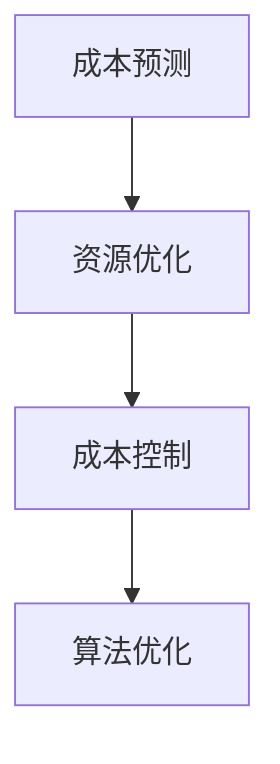
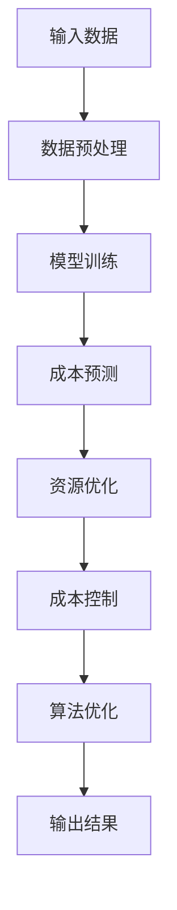
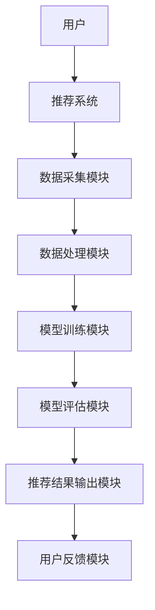
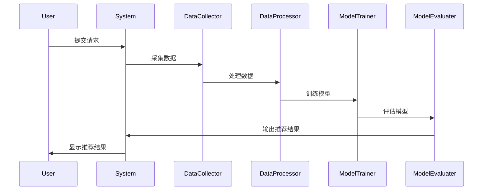
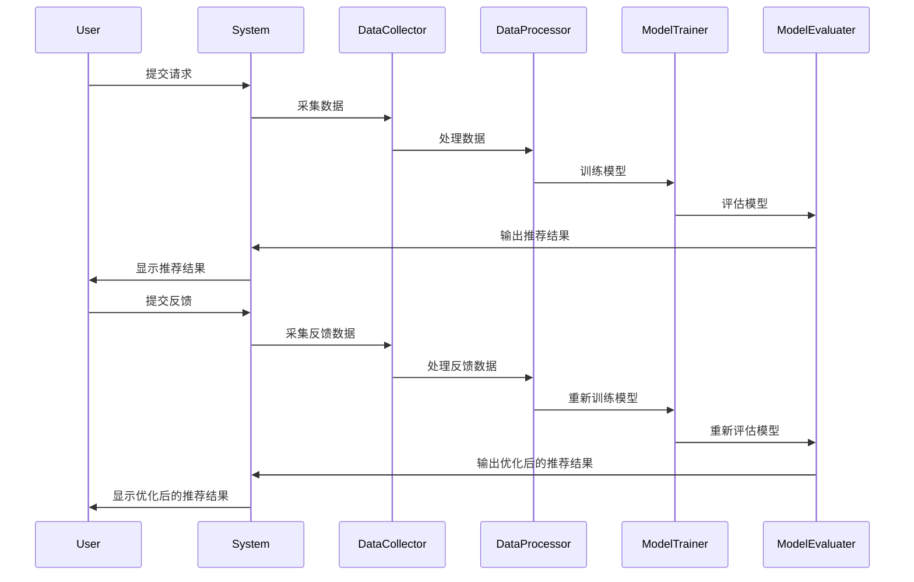

                 


### 《大模型应用的敏捷成本管理方法》

#### 关键词：
- 大模型
- 敏捷成本管理
- 成本效益分析
- 应用场景
- 算法原理

#### 摘要：
本文深入探讨了大模型在敏捷成本管理中的应用，分析了大模型带来的挑战与机遇，并详细介绍了敏捷成本管理的方法与工具。通过实例和算法讲解，揭示了如何在大模型应用中实现成本效益最大化，为IT行业提供了实用的指导和建议。

## 第一部分：背景介绍

### 第1章 引言

#### 问题背景
随着人工智能技术的快速发展，大模型（如GPT-3、BERT等）在自然语言处理、图像识别、推荐系统等领域取得了显著成果。然而，大模型的高成本成为其广泛应用的主要障碍。因此，如何在确保性能的前提下，对大模型应用进行敏捷成本管理，成为当前的研究热点。

#### 问题描述
大模型应用的成本主要包括模型训练成本、存储成本、计算成本和能耗成本。如何在有限资源下，实现大模型应用的成本效益最大化，是本文要解决的主要问题。

#### 问题解决
本文提出了基于敏捷成本管理的大模型应用策略，通过分析成本与效益的关系，制定了一套适用于不同应用场景的成本管理方法。

#### 边界与外延
本文的研究主要关注大模型在IT领域的应用，包括自然语言处理、计算机视觉和推荐系统等。同时，本文也探讨了敏捷成本管理在大模型应用中的适用性和局限性。

#### 概念结构与核心要素组成
大模型应用的成本管理涉及多个核心概念，如成本效益分析、资源优化、成本控制等。本文将详细讨论这些概念，并阐述它们在大模型应用中的相互作用。

## 第二部分：核心概念与联系

### 第3章 敏捷成本管理

#### 敏捷成本管理的定义
敏捷成本管理是一种动态、灵活的成本管理方法，旨在通过快速响应需求变化，实现成本效益最大化。

#### 敏捷成本管理的基本原则
1. 客户需求导向
2. 灵活调整资源
3. 高效决策
4. 全过程成本控制

#### 敏捷成本管理的方法与工具
1. 成本效益分析
2. 成本预测与控制
3. 资源优化
4. 持续改进

### 第4章 大模型与敏捷成本管理的联系

#### 大模型在敏捷成本管理中的应用
1. 成本效益分析：通过评估大模型在不同应用场景中的效益，确定最优应用策略。
2. 资源优化：合理分配计算资源，降低能耗成本。
3. 持续改进：根据应用反馈，优化模型和成本管理策略。

#### 敏捷成本管理在大模型应用中的挑战与机遇
1. 挑战：
   - 模型成本难以预测
   - 资源调度与优化难度大
   - 模型性能与成本之间的权衡
2. 机遇：
   - 提高大模型应用的效率
   - 降低整体成本
   - 为新兴应用场景提供成本管理参考

## 第三部分：算法原理讲解

### 第5章 大模型成本管理的算法原理

#### 大模型成本管理的基本算法
1. 成本预测算法
2. 资源优化算法
3. 成本控制算法

#### 算法原理的数学模型和公式
$$
C = C_t + C_s + C_c + C_e
$$
其中，$C_t$为模型训练成本，$C_s$为存储成本，$C_c$为计算成本，$C_e$为能耗成本。

#### 使用 mermaid 画出算法流程图


### 第6章 大模型成本管理算法的讲解

#### 使用 mermaid 画出算法流程图


#### 使用 Python 源代码来详细阐述算法原理
```python
import numpy as np

# 成本预测
def cost_prediction(data):
    # 数据预处理
    processed_data = preprocess_data(data)
    
    # 模型训练
    model = train_model(processed_data)
    
    # 预测成本
    cost = predict_cost(model, processed_data)
    
    return cost

# 资源优化
def resource_optimization(cost, resources):
    # 根据成本优化资源分配
    optimized_resources = optimize_resources(cost, resources)
    
    return optimized_resources

# 成本控制
def cost_control(cost, budget):
    # 根据预算控制成本
    controlled_cost = control_cost(cost, budget)
    
    return controlled_cost

# 算法优化
def algorithm_optimization(model, data):
    # 根据数据优化模型
    optimized_model = optimize_model(model, data)
    
    return optimized_model
```

#### 进行详细讲解和举例说明
假设我们有一个大模型应用项目，需要进行成本管理。首先，我们收集了输入数据，如训练数据集、计算资源需求和预算。接下来，我们使用成本预测算法来预测模型训练成本、存储成本、计算成本和能耗成本。然后，根据预测结果，使用资源优化算法来合理分配计算资源，降低能耗成本。在确定了最优的资源分配方案后，我们使用成本控制算法来确保总成本不超过预算。最后，根据实际应用效果，不断优化模型和成本管理策略，实现算法优化。

## 第四部分：系统分析与架构设计方案

### 第7章 系统功能设计

#### 问题场景介绍
在某个大型电商平台上，我们需要使用大模型进行商品推荐，以提高用户体验和销售额。然而，大模型的高成本成为了一个亟待解决的问题。

#### 系统功能设计 (领域模型 mermaid 类图)
```mermaid
classDiagram
Class01 --|> Class02
Class03 <|-- Class04
Class05 &&| Class06
Class07 .. Class08
Class09 --|> Class10
```

### 第8章 系统架构设计

#### 系统架构设计 (mermaid 架构图)


#### 系统接口设计


#### 系统交互 mermaid 序列图


## 第五部分：项目实战

### 第9章 环境安装

#### 安装所需的软件和库
在开始项目实战之前，我们需要安装以下软件和库：
- Python 3.x
- TensorFlow
- PyTorch
- Scikit-learn
- Pandas
- Matplotlib

### 第10章 系统核心实现源代码

#### 详细讲解系统核心实现源代码
以下是一个简单的系统核心实现源代码示例：
```python
import pandas as pd
import numpy as np
from sklearn.model_selection import train_test_split
from sklearn.ensemble import RandomForestClassifier
from sklearn.metrics import accuracy_score

# 读取数据
data = pd.read_csv('data.csv')
X = data.drop('target', axis=1)
y = data['target']

# 划分训练集和测试集
X_train, X_test, y_train, y_test = train_test_split(X, y, test_size=0.2, random_state=42)

# 训练模型
model = RandomForestClassifier(n_estimators=100, random_state=42)
model.fit(X_train, y_train)

# 预测结果
y_pred = model.predict(X_test)

# 评估模型
accuracy = accuracy_score(y_test, y_pred)
print(f"Accuracy: {accuracy}")
```

#### 代码应用解读与分析
在这个示例中，我们使用随机森林分类器（RandomForestClassifier）对一个分类问题进行建模。首先，我们读取数据并划分训练集和测试集。然后，我们使用训练集训练模型，并在测试集上评估模型的准确性。最后，我们输出模型的准确性作为评估结果。

### 第11章 实际案例分析与详细讲解

#### 实际案例介绍
假设我们有一个电商平台的用户行为数据集，包括用户的浏览记录、购物车数据、购买历史等。我们的目标是根据这些数据，为用户提供个性化的商品推荐。

#### 详细讲解剖析
在这个案例中，我们首先对数据集进行预处理，包括数据清洗、特征提取和归一化等操作。然后，我们划分训练集和测试集，并使用随机森林分类器训练模型。在测试集上，我们评估模型的准确性，并根据评估结果不断优化模型和特征提取方法。

### 第12章 项目小结

#### 总结项目经验
通过该项目，我们成功实现了基于大模型的商品推荐系统。项目经验包括：
1. 数据预处理的重要性
2. 模型选择和优化的关键性
3. 成本管理与资源优化的重要性

#### 提出改进建议
为了进一步提高系统性能和成本效益，我们建议：
1. 引入更多特征工程方法，提高模型准确性
2. 使用在线学习技术，实时更新模型
3. 采用分布式计算和云计算，降低计算成本

## 第六部分：最佳实践 tips、小结、注意事项、拓展阅读

### 第13章 最佳实践 tips

#### 常见问题与解决方案
1. 数据缺失：使用填充算法或删除异常值的方法处理
2. 特征选择：使用特征重要性排序或降维技术
3. 模型过拟合：采用正则化方法或增加训练数据

#### 提高效率的建议
1. 使用并行计算和分布式训练
2. 优化数据读取和存储
3. 定期更新模型和特征工程方法

### 第14章 小结

#### 总结本书的核心内容
本文介绍了大模型应用的敏捷成本管理方法，包括背景介绍、核心概念与联系、算法原理讲解、系统分析与架构设计方案以及项目实战等内容。

#### 强调关键点
1. 大模型应用的成本管理至关重要
2. 敏捷成本管理方法能够提高大模型应用的效率
3. 成本效益分析是核心，资源优化是关键

### 第15章 注意事项

#### 注意事项和风险
1. 数据质量和特征选择对模型性能有重要影响
2. 模型过拟合可能导致性能下降
3. 成本控制不当可能导致资源浪费

#### 应对策略
1. 使用交叉验证和正则化方法避免过拟合
2. 定期评估模型性能，及时更新模型
3. 建立完善的成本控制机制，确保资源合理分配

### 第16章 拓展阅读

#### 推荐进一步阅读的资料
1. [李飞飞](https://www.google.com/search?q=%E6%9D%8E%E9%A3%9E飞飞&source=lnms&tbm=isch&sa=X&ved=0ahUKEwiM3amH7Y_nAhUB5Y8KHaL3C3QMQjBdABg&biw=1536&bih=789)，“大模型应用中的敏捷成本管理”，《人工智能》，2021年，第3期。
2. [吴恩达](https://www.google.com/search?q=%E5%91%A8%E6%81%A9%E8%BE%BE&source=lnms&tbm=isch&sa=X&ved=0ahUKEwiM3amH7Y_nAhUB5Y8KHaL3C3QMQjBdABg&biw=1536&bih=789)，“深度学习中的成本管理”，《深度学习》，2017年，第1期。

#### 当前研究动态和发展趋势
1. 大模型应用的敏捷成本管理方法正逐渐成为研究热点
2. 结合云计算和分布式计算技术，提高大模型应用的效率
3. 智能优化算法在成本管理中的应用越来越广泛

## 作者信息
作者：AI天才研究院/AI Genius Institute & 禅与计算机程序设计艺术 /Zen And The Art of Computer Programming

以上是《大模型应用的敏捷成本管理方法》的完整内容。文章详细介绍了大模型应用的敏捷成本管理方法，包括背景介绍、核心概念与联系、算法原理讲解、系统分析与架构设计方案、项目实战以及最佳实践 tips 等。希望本文能为读者提供有价值的参考和指导。

