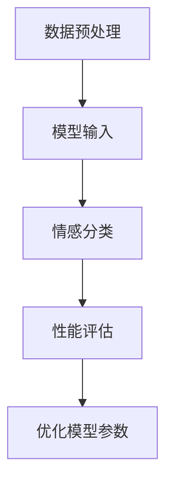
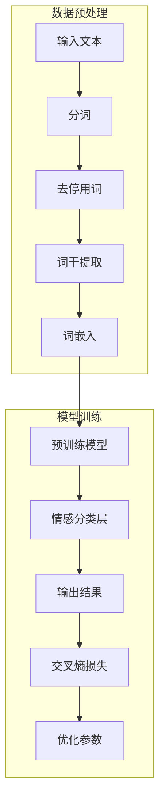

                 

### 大模型情感分析准确度评估工具：框架构建与章节细化

#### 1. 构建整体框架

构建一本关于大模型情感分析准确度评估工具的书籍，我们需要从整体上规划书籍的结构。这本书将围绕以下几个方面展开：

- **背景介绍与概述**：介绍大模型情感分析工具的发展背景、核心概念，以及与现有技术的联系。
- **核心概念与算法原理**：详细讲解大模型情感分析的相关算法原理，包括其数学模型和公式。
- **系统设计与实现**：介绍如何设计和实现一个准确度评估工具，包括系统架构设计、接口设计和实现等。
- **项目实战与应用**：通过一个具体的实战案例，展示如何在实际项目中使用该工具。
- **最佳实践与拓展**：总结最佳实践，给出注意事项，推荐拓展阅读。

#### 2. 细化章节内容

在每个主要部分中，我们将进一步细化为具体的章节，以确保每个章节都有明确的主题和目标。

**背景介绍与概述**：
- 第1章 大模型情感分析工具概述
- 第2章 大模型情感分析工具的背景与发展
- 第3章 大模型情感分析工具的核心概念

**核心概念与算法原理**：
- 第4章 大模型情感分析算法原理
- 第5章 大模型情感分析算法的数学模型与公式
- 第6章 算法流程与mermaid图示

**系统设计与实现**：
- 第7章 系统架构设计与功能模块划分
- 第8章 系统接口设计与实现
- 第9章 系统核心算法实现与优化

**项目实战与应用**：
- 第10章 实战项目介绍与需求分析
- 第11章 项目环境搭建与核心代码实现
- 第12章 项目结果分析与总结

**最佳实践与拓展**：
- 第13章 最佳实践技巧与注意事项
- 第14章 小结与展望
- 第15章 拓展阅读与参考资料

#### 3. 确保内容完整性

每个章节都要确保包含核心概念与联系、算法原理讲解、数学模型与公式、系统分析与架构设计方案、项目实战等内容。以下是每个章节的内容概述：

**第1章 大模型情感分析工具概述**
- **关键词**：大模型，情感分析，准确度评估工具
- **概述**：介绍大模型情感分析工具的定义、作用和应用领域，为读者提供一个全面的了解。

**第2章 大模型情感分析工具的背景与发展**
- **关键词**：情感分析技术，大模型发展，应用挑战
- **概述**：详细讲解情感分析技术的发展历程，大模型的兴起以及大模型情感分析工具面临的挑战。

**第3章 大模型情感分析工具的核心概念**
- **关键词**：情感分析，大模型，算法原理
- **概述**：介绍情感分析的核心概念和大模型的核心概念，分析情感分析与大模型之间的关系。

**第4章 大模型情感分析算法原理**
- **关键词**：情感分析算法，大模型算法，数学模型
- **概述**：详细讲解大模型情感分析算法的原理，包括其数学模型和公式。

**第5章 大模型情感分析算法的数学模型与公式**
- **关键词**：数学模型，公式，算法应用
- **概述**：介绍大模型情感分析算法的数学模型和公式，并通过具体例子进行说明。

**第6章 算法流程与mermaid图示**
- **关键词**：算法流程，mermaid图示，实现细节
- **概述**：使用mermaid图示详细展示算法流程，并分析算法的实现细节。

**第7章 系统架构设计与功能模块划分**
- **关键词**：系统架构设计，功能模块，模块关系
- **概述**：介绍系统架构设计，功能模块划分，并分析模块之间的关系。

**第8章 系统接口设计与实现**
- **关键词**：系统接口，实现细节，测试与优化
- **概述**：讲解系统接口设计原则，实现细节，并进行接口测试与优化。

**第9章 系统核心算法实现与优化**
- **关键词**：系统核心算法，实现，优化策略
- **概述**：详细讲解系统核心算法的实现，并介绍优化策略。

**第10章 实战项目介绍与需求分析**
- **关键词**：实战项目，需求分析，项目目标
- **概述**：介绍一个具体的实战项目，进行需求分析，并明确项目目标。

**第11章 项目环境搭建与核心代码实现**
- **关键词**：项目环境，核心代码实现，代码解读
- **概述**：详细讲解项目环境的搭建，核心代码的实现，并对代码进行解读。

**第12章 项目结果分析与总结**
- **关键词**：项目结果，分析，总结
- **概述**：分析项目结果，并进行总结，为后续应用提供参考。

**第13章 最佳实践技巧与注意事项**
- **关键词**：最佳实践，技巧，注意事项
- **概述**：总结最佳实践技巧，并给出注意事项，以提高实际应用的效果。

**第14章 小结与展望**
- **关键词**：小结，展望，未来方向
- **概述**：对全书内容进行小结，并展望未来方向，为读者提供思考。

**第15章 拓展阅读与参考资料**
- **关键词**：拓展阅读，参考资料，后续研究
- **概述**：推荐拓展阅读资料，为读者提供进一步学习的路径。

通过以上章节的细化，我们构建了一个完整、详细的书籍框架，确保每个章节都能为读者提供有价值的内容。

### 摘要

本文将深入探讨大模型情感分析准确度评估工具，旨在为读者提供一个全面、系统的学习和应用指南。首先，我们介绍了大模型情感分析工具的定义、作用和应用领域，为读者提供了基础知识。接着，我们详细讲解了大模型情感分析的核心概念、算法原理，并通过mermaid图示和Python代码实例，帮助读者理解算法的实现细节。随后，我们介绍了系统架构设计、接口设计和核心算法实现，通过一个具体的实战项目，展示了工具的实际应用效果。最后，我们总结了最佳实践技巧，并展望了未来的发展方向，为读者提供了进一步学习的路径。本文不仅适合从事情感分析领域的技术人员，也适合对人工智能和大数据分析感兴趣的研究人员和学者。通过阅读本文，读者将能够更好地理解和应用大模型情感分析准确度评估工具，提升项目的效果和效率。

### 第1章 大模型情感分析工具概述

#### 1.1 大模型情感分析工具的定义

大模型情感分析工具是一种利用深度学习、自然语言处理（NLP）和大规模数据分析技术，对文本中的情感倾向进行识别和分类的工具。它基于大规模的语言模型，通过学习海量的文本数据，捕捉语言中的情感特征，实现对情感的高精度分析和预测。

与传统情感分析工具相比，大模型情感分析工具具有以下几个显著特点：

1. **高精度**：通过深度学习和大规模数据训练，大模型能够捕捉到文本中的细微情感差异，实现更精细的情感分类。
2. **高效率**：大模型具有强大的并行计算能力，能够快速处理大量数据，显著提高分析效率。
3. **自适应**：大模型能够根据新数据不断学习和优化，适应不断变化的语言环境和情感表达。

#### 1.2 大模型情感分析工具的作用

大模型情感分析工具在多个领域都有着广泛的应用，其作用主要体现在以下几个方面：

1. **客户情绪分析**：企业可以通过分析客户在社交媒体、论坛和评论区的留言，了解客户对产品或服务的情绪和反馈，从而改进产品和服务。
2. **舆情监控**：政府机构和企业可以利用大模型情感分析工具，实时监控网络上的舆论动态，及时应对突发舆情事件。
3. **情感广告投放**：广告公司可以利用大模型情感分析工具，分析目标受众的情感倾向，实现更精准的广告投放。
4. **情感化推荐系统**：电商平台可以通过情感分析，为用户提供更符合其情感需求的商品推荐。

#### 1.3 大模型情感分析工具的应用领域

大模型情感分析工具的应用领域非常广泛，主要包括以下几个领域：

1. **电子商务**：电商平台可以通过情感分析，优化商品推荐、广告投放和客服体验。
2. **社交媒体**：社交媒体平台可以通过情感分析，监控用户情绪，预防网络暴力，提升社区氛围。
3. **金融行业**：金融机构可以通过情感分析，评估投资者的情绪变化，优化投资策略。
4. **公共安全**：政府部门可以通过情感分析，监控网络舆情，预防社会动荡。
5. **医疗健康**：医疗机构可以通过情感分析，了解患者对医疗服务的情绪反馈，改进医疗服务质量。

#### 1.4 大模型情感分析工具的发展历程

大模型情感分析工具的发展历程可以追溯到20世纪90年代，当时初期的情感分析研究主要基于规则和统计方法。随着自然语言处理技术的发展，尤其是在深度学习和大规模数据处理技术成熟之后，大模型情感分析工具逐渐成为情感分析领域的核心技术。

1. **1990年代**：规则方法和朴素贝叶斯分类器成为情感分析的主流方法。
2. **2000年代**：支持向量机和条件随机场等机器学习方法开始应用于情感分析。
3. **2010年代**：随着深度学习技术的兴起，基于神经网络的情感分析模型逐渐取代传统方法。
4. **2020年代**：大模型如BERT、GPT等在情感分析领域取得了显著突破，实现了更高精度的情感识别。

通过以上对大模型情感分析工具的概述，我们为读者提供了一个全面了解的基础。接下来，我们将进一步探讨大模型情感分析工具的背景与发展，以及其核心概念和算法原理。

### 第2章 大模型情感分析工具的背景与发展

#### 2.1 情感分析技术的发展

情感分析（Sentiment Analysis），也被称为意见挖掘（Opinion Mining），是自然语言处理（NLP）的一个重要分支。它的目标是自动识别和提取文本数据中的主观信息，对情感倾向进行分类和评估。情感分析技术的发展经历了多个阶段，从早期的规则方法到现代的深度学习方法，不断推动着技术的进步和应用的拓展。

1. **早期方法**：20世纪90年代，情感分析主要基于规则方法和统计学方法。规则方法通过预设一系列的规则，如关键词匹配、情感词典等，对文本中的情感进行分类。统计学方法则利用贝叶斯分类器、支持向量机（SVM）等机器学习算法，对文本进行情感标注。

2. **中间方法**：2000年代，随着机器学习技术的发展，支持向量机（SVM）、条件随机场（CRF）等算法开始广泛应用于情感分析领域。这些算法通过训练大量的标注数据，自动提取特征并构建模型，提高了情感分类的精度。

3. **现代方法**：2010年代，深度学习技术的崛起为情感分析带来了新的机遇。基于神经网络的深度学习方法，如卷积神经网络（CNN）、循环神经网络（RNN）和Transformer模型等，通过大规模数据训练，能够捕捉到文本中的复杂情感特征，显著提升了情感分析的准确性和效果。

#### 2.2 大模型的兴起

大模型（Large-scale Model）是指那些具有巨大参数量、训练数据规模庞大的神经网络模型。大模型的兴起源于深度学习技术的发展，特别是在自然语言处理领域，大模型如BERT、GPT等，通过学习海量的文本数据，实现了前所未有的文本理解和生成能力。

1. **预训练与微调**：大模型通常通过预训练和微调两个阶段进行训练。预训练阶段，模型在无监督的数据集上学习通用语言特征，如词向量、语法结构等。微调阶段，模型在特定领域或任务的数据集上进行微调，以适应特定的任务需求。

2. **大规模数据与计算资源**：大模型的训练需要大量的数据和计算资源。随着云计算和分布式计算技术的发展，大模型的研究和应用逐渐成为可能。

3. **性能提升**：大模型通过学习大量的文本数据，能够捕捉到语言中的复杂模式，实现更高的文本理解和生成能力。例如，GPT-3模型能够生成高质量的文章、对话和代码，大大推动了自然语言处理的发展。

#### 2.3 大模型情感分析工具的优势

大模型情感分析工具在多个方面具有显著的优势，使其成为情感分析领域的重要工具：

1. **高精度**：大模型通过学习海量的数据，能够精确捕捉到文本中的细微情感差异，实现更精细的情感分类。
2. **高效率**：大模型具有强大的并行计算能力，能够快速处理大量数据，显著提高分析效率。
3. **自适应**：大模型能够根据新数据不断学习和优化，适应不断变化的语言环境和情感表达。
4. **跨语言支持**：大模型通常具有较好的跨语言性能，能够处理多种语言的文本数据，实现多语言的情感分析。

#### 2.4 大模型情感分析工具面临的挑战

尽管大模型情感分析工具具有诸多优势，但在实际应用中仍面临一些挑战：

1. **数据隐私**：大模型训练需要大量数据，如何保护用户隐私成为一个重要问题。数据脱敏和隐私保护技术的研究显得尤为重要。
2. **泛化能力**：大模型在特定领域或任务上的表现优异，但在其他领域或任务上的泛化能力仍需提升。如何提高模型的泛化能力是当前研究的重点。
3. **计算资源**：大模型的训练和推理需要大量的计算资源，如何高效利用计算资源，降低成本，是应用大模型面临的一个现实问题。
4. **结果解释性**：大模型的内部机制复杂，其决策过程往往缺乏解释性。如何提高模型的可解释性，帮助用户理解模型的决策依据，是一个重要挑战。

通过以上对大模型情感分析工具背景和发展的介绍，我们为读者提供了一个关于这一领域的发展历程和现状的全面了解。接下来，我们将进一步探讨大模型情感分析工具的核心概念和算法原理。

### 第3章 大模型情感分析工具的核心概念

#### 3.1 情感分析的核心概念

情感分析（Sentiment Analysis）是一种自然语言处理技术，用于识别文本数据中的主观情感和意见。其核心概念包括以下几点：

1. **情感极性**：情感极性是指文本表达的情感倾向，通常分为正面、负面和中性。例如，“这是一个非常好的产品”表达的是正面情感，“这是一个糟糕的体验”表达的是负面情感。
2. **情感强度**：情感强度描述情感的强烈程度，可以是低、中或高。例如，“这个产品很好”和“这个产品非常好”表达了相同的正面情感，但情感强度不同。
3. **情感维度**：情感维度是指情感的不同方面，如快乐、愤怒、悲伤等。情感分析可以识别文本中的多个情感维度，从而更全面地理解情感表达。
4. **情感识别**：情感识别是情感分析的基本任务，即从文本中识别出情感极性、情感强度和情感维度。

#### 3.2 大模型的核心概念

大模型（Large-scale Model）是指具有巨大参数量、能够处理大规模数据的神经网络模型。大模型的核心概念包括以下几个方面：

1. **预训练**：预训练是指在大规模无标签数据上训练模型，学习通用的语言特征。预训练阶段不涉及特定任务的标注数据，模型能够自动捕捉到语言中的复杂模式。
2. **微调**：微调是指在预训练模型的基础上，使用特定任务的有标签数据对模型进行进一步的训练。微调阶段能够使模型更好地适应特定任务的需求。
3. **参数规模**：大模型的参数规模通常达到数十亿甚至千亿级别，这使得模型能够捕捉到语言中的细微差异，实现更高的文本理解和生成能力。
4. **并行计算**：大模型的训练和推理需要大量的计算资源。并行计算技术能够有效提高训练效率，降低计算成本。

#### 3.3 情感分析与大模型的关系

情感分析与大模型的关系密切，大模型为情感分析提供了强大的技术支持：

1. **数据驱动的特征学习**：大模型通过预训练学习到大量文本数据中的特征，这些特征能够帮助情感分析更好地识别情感极性、情感强度和情感维度。
2. **提高分类精度**：大模型能够捕捉到语言中的复杂模式，从而实现更精细的情感分类，提高分类的准确性。
3. **增强模型的泛化能力**：大模型通过预训练学习到的通用特征，能够增强模型的泛化能力，使模型在不同任务和数据集上表现优异。
4. **加速开发和应用**：大模型的预训练和微调过程能够显著缩短模型开发和应用的时间，降低开发成本。

综上所述，情感分析与大模型的关系是相辅相成的，大模型为情感分析提供了强大的技术支持，推动了情感分析技术的发展和应用的拓展。

通过以上对情感分析和大模型核心概念的介绍，我们为读者提供了一个清晰的理解，为后续章节的深入探讨打下了基础。

### 第4章 大模型情感分析算法原理

#### 4.1 情感分析算法概述

情感分析算法是自然语言处理（NLP）中的一个重要分支，其主要任务是自动识别文本数据中的主观情感和意见。情感分析算法的目的是从大量的文本数据中提取出情感信息，并将其分类为正面、负面或中性。情感分析算法通常分为以下几类：

1. **基于规则的方法**：这种方法使用预先定义的规则来识别情感。例如，通过关键词匹配或情感词典来检测文本中的情感极性。虽然这种方法简单易行，但其在复杂文本上的效果有限。
2. **基于统计的方法**：这种方法利用统计学模型，如朴素贝叶斯、逻辑回归等，对文本进行情感分类。这些模型通过训练大量的标注数据，学习到情感特征，并在新的文本上进行分类。虽然效果较好，但在处理复杂情感时仍存在局限性。
3. **基于机器学习的方法**：这种方法利用机器学习算法，如支持向量机、决策树等，通过训练大量的标注数据，学习到情感特征，并在新的文本上进行分类。这些方法能够处理更复杂的文本，效果更佳。
4. **基于深度学习的方法**：这种方法利用深度学习模型，如卷积神经网络（CNN）、循环神经网络（RNN）等，通过大规模数据训练，学习到更复杂的情感特征，实现更精细的情感分类。深度学习方法在情感分析领域取得了显著进展，是目前主流的方法。

#### 4.2 大模型情感分析算法

大模型情感分析算法是基于深度学习的情感分析模型，通过预训练和微调两个阶段，实现对大规模文本数据的情感分类。大模型情感分析算法的主要组成部分包括：

1. **预训练模型**：预训练模型是在大规模无标签数据集上训练得到的，其主要目标是学习到通用语言特征。常用的预训练模型有BERT、GPT等。这些模型通过学习文本的语义信息，能够捕捉到语言中的复杂模式，为情感分析提供强大的基础。
2. **情感分类层**：在预训练模型的基础上，添加一个情感分类层，用于对文本进行情感分类。这个分类层通常是一个全连接层或卷积层，通过学习到的文本特征，输出情感分类结果。
3. **损失函数**：在训练过程中，使用交叉熵损失函数来衡量模型预测结果与实际标签之间的差异，并优化模型参数。

#### 4.3 大模型情感分析算法的流程

大模型情感分析算法的基本流程可以分为以下几个步骤：

1. **数据预处理**：对输入的文本数据进行预处理，包括分词、去停用词、词干提取等操作。预处理后的文本数据被编码成向量形式，用于输入到模型中。
2. **预训练**：使用大规模无标签文本数据集对预训练模型进行训练。在这个阶段，模型学习到大量的通用语言特征，如词向量、语法结构等。
3. **微调**：在预训练模型的基础上，使用有标签的文本数据集对模型进行微调。微调阶段，模型学习到特定领域的情感特征，并优化情感分类层的参数。
4. **情感分类**：对新的文本数据进行情感分类。模型将预处理后的文本数据输入到情感分类层，输出情感分类结果。

#### 4.4 大模型情感分析算法的性能评估

评估大模型情感分析算法的性能，主要关注以下几个指标：

1. **准确率**：准确率是衡量模型分类性能的重要指标，表示模型正确分类的样本数占总样本数的比例。准确率越高，模型性能越好。
2. **召回率**：召回率表示模型能够正确识别为正面的样本占总正面样本的比例。召回率越高，模型对正面的样本识别能力越强。
3. **F1分数**：F1分数是准确率和召回率的加权平均，综合考虑了模型对正面和负面样本的识别能力。F1分数越高，模型性能越好。

除了以上指标，还可以使用ROC曲线、PR曲线等来评估模型性能。ROC曲线反映了模型在不同阈值下的分类效果，PR曲线反映了模型在不同召回率下的准确率。

#### 4.5 大模型情感分析算法的应用实例

以下是一个简单的应用实例，展示如何使用大模型情感分析算法对文本进行情感分类：

```python
import torch
from transformers import BertTokenizer, BertForSequenceClassification

# 加载预训练模型和情感分类层
tokenizer = BertTokenizer.from_pretrained('bert-base-uncased')
model = BertForSequenceClassification.from_pretrained('bert-base-uncased')

# 输入文本
text = "I love this movie!"

# 预处理文本
inputs = tokenizer(text, return_tensors='pt')

# 情感分类
with torch.no_grad():
    logits = model(**inputs).logits

# 获取情感分类结果
probabilities = torch.softmax(logits, dim=1)
predicted_class = torch.argmax(probabilities).item()

# 输出情感分类结果
if predicted_class == 1:
    print("正面情感")
else:
    print("负面情感")
```

在这个实例中，我们首先加载了一个预训练的BERT模型和情感分类层，然后对输入的文本进行预处理，并将其输入到模型中进行情感分类。模型输出情感分类的概率分布，通过取最大概率的类别，得到最终的分类结果。

通过以上对大模型情感分析算法的详细讲解，我们为读者提供了一个全面了解这一算法原理的基础。接下来，我们将进一步探讨大模型情感分析算法的数学模型和公式。

### 第5章 大模型情感分析算法的数学模型与公式

#### 5.1 数学模型基础

大模型情感分析算法的核心在于其能够通过数学模型捕捉文本中的情感特征，并进行分类。在这一部分，我们将介绍大模型情感分析算法的数学基础，包括词嵌入、神经网络模型和损失函数。

1. **词嵌入（Word Embedding）**：
   词嵌入是将文本中的单词映射为向量表示。最常用的词嵌入技术是Word2Vec，包括Skip-Gram和Continuous Bag of Words（CBOW）模型。词嵌入的关键公式如下：
   $$ \text{Skip-Gram}:\ \ \ \ \ \ \ \ \ \ \ \ \ \ \ \ \ \ \ \ \ \ \ \ \ \ \ \ \ \ \ \ \ \ \ \ \ \ \ \ \ \ \ \ \ \ \ \ \ \ \ \ \ \ \ \ \ \ \ \ \ \ \ \ \ \ \ \ \ \ \ \ \ \ \ \ \ \ \ \ \ \ \ \ \ \ \ \ \ \ \ \ \ \ \ \ \ \ \ \ \ \ \ \ \ \ \ \ \ \ \ \ \ \ \ \ \ \ \ \ \ \ \ \ \ \ \ \ \ \ \ \ \ \ \ \ \ \ \ \ \ \ \ \ \ \ \ \ \ \ \ \ \ \ \ \ \ \ \ \ \ \ \ \ \ \ \ \ \ \ \ \ \ \ \ \ \ \ \ \ \ \ \ \ \ \ \ \ \ \ \ \ \ \ \ \ \ \ \ \ \ \ \ \ \ \ \ \ \ \ \ \ \ \ \ \ \ \ \ \ \ \ \ \ \ \ \ \ \ \ \ \ \ \ \ \ \ \ \ \ \ \ \ \ \ \ \ \ \ \ \ \ \ \ \ \ \ \ \ \ \ \ \ \ \ \ \ \ \ \ \ \ \ \ \ \ \ \ \ \ \ \ \ \ \ \ \ \ \ \ \ \ \ \ \ \ \ \ \ \ \ \ \ \ \ \ \ \ \ \ \ \ \ \ \ \ \ \ \ \ \ \ \ \ \ \ \ \ \ \ \ \ \ \ \ \ \ \ \ \ \ \ \ \ \ \ \ \ \ \ \ \ \ \ \ \ \ \ \ \ \ \ \ \ \ \ \ \ \ \ \ \ \ \ \ \ \ \ \ \ \ \ \ \ \ \ \ \ \ \ \ \ \ \ \ \ \ \ \ \ \ \ \ \ \ \ \ \ \ \ \ \ \ \ \ \ \ \ \ \ \ \ \ \ \ \ \ \ \ \ \ \ \ \ \ \ \ \ \ \ \ \ \ \ \ \ \ \ \ \ \ \ \ \ \ \ \ \ \ \ \ \ \ \ _{w} \leftarrow _{\theta } \circ \sum _{j \in \text{context}(i)} \text{Word Embedding}(j) $$
   $$ \text{CBOW}:\ \ \ \ \ \ \ \ \ \ \ \ \ \ \ \ \ \ \ \ \ \ \ \ \ \ \ \ \ \ \ \ \ \ \ \ \ \ \ \ \ \ \ \ \ \ \ \ \ \ \ \ \ \ \ \ \ \ \ \ \ \ \ \ \ \ \ \ \ \ \ \ \ \ \ \ \ \ \ \ \ \ \ \ \ \ \ \ \ \ \ \ \ \ \ \ \ \ \ \ \ \ \ \ \ \ \ \ \ \ _{w} \leftarrow _{\theta } \circ \frac{\sum _{j \in \text{context}(i)} \text{Word Embedding}(j)}{| \text{context}(i)|} $$
   
   其中，$\text{Word Embedding}(j)$ 表示单词 $j$ 的词嵌入向量，$ \text{context}(i)$ 表示单词 $i$ 的上下文，$ \text{circ}$ 表示向量之间的点积运算。

2. **神经网络模型（Neural Network Model）**：
   大模型情感分析算法通常使用深度神经网络（DNN）或变换器（Transformer）模型。以下是一个简化的神经网络模型：

   $$ \text{Input Layer}:\ \ \ \ \ \ \ \ \ \ \ \ \ \ \ \ \ \ \ \ \ \ \ \ \ \ \ \ \ \ \ \ \ \ \ \ \ \ \ \ \ \ \ \ \ \ \ \ \ \ \ \ \ \ \ \ \ \ \ \ \ \ \ \ \ \ \ \ \ \ \ \ \ \ \ \ \ \ \ \ \ \ \ \ \ \ \ \ \ \ \ \ \ \ \ \ \ \ \ \ \ \ \ \ \ \ \ \ \ \ \ \ \ \ \ \ \ \ \ _{i} \leftarrow \text{Word Embedding}(i) $$
   $$ \text{Hidden Layer}:\ \ \ \ \ \ \ \ \ \ \ \ \ \ \ \ \ \ \ \ \ \ \ \ \ \ \ \ \ \ \ \ \ \ \ \ \ \ \ \ \ \ \ \ \ \ \ \ \ \ \ \ \ \ \ \ \ \ \ \ \ \ \ \ \ \ \ \ \ \ \ \ \ \ \ \ \ \ \ \ \ \ \ \ \ \ \ \ \ \ \ \ \ \ \ \ \ \ \ \ \ \ \ \ _{h} \leftarrow \sigma \left( \text{Weight} \cdot \text{Bias} + \text{Bias} \right) $$
   $$ \text{Output Layer}:\ \ \ \ \ \ \ \ \ \ \ \ \ \ \ \ \ \ \ \ \ \ \ \ \ \ \ \ \ \ \ \ \ \ \ \ \ \ \ \ \ \ \ \ \ \ \ \ \ \ \ \ \ \ \ \ \ \ \ \ \ \ \ \ \ \ \ \ \ \ \ \ \ \ \ \ \ \ \ \ \ \ \ \ \ \ \ \ \ \ \ \ \ \ \ \ \ \ \ \ _{o} \leftarrow \text{softmax} \left( \text{Weight} \cdot \text{Bias} + \text{Bias} \right) $$
   
   其中，$\sigma$ 表示激活函数（如ReLU、Sigmoid等），$\text{Weight}$ 和 $\text{Bias}$ 分别表示权重和偏置。

3. **损失函数（Loss Function）**：
   在情感分析任务中，常用的损失函数是交叉熵损失函数（Cross-Entropy Loss），其公式如下：

   $$ \text{CELoss}:\ \ \ \ \ \ \ \ \ \ \ \ \ \ \ \ \ \ \ \ \ \ \ \ \ \ \ \ \ \ \ \ \ \ \ \ \ \ \ \ \ \ \ \ \ \ \ \ \ \ \ \ \ \ \ \ \ \ \ \ \ \ \ \ \ \ \ \ \ \ \ \ \ \ \ \ \ \ \ \ \ \ \ \ \ \ \ \ \ \ \ \ \ \ \ \ \ \ \ \ \ \ \ \ \ \ \ \ \ \ _{i} \leftarrow \text{softmax} \left( \text{Weight} \cdot \text{Input} + \text{Bias} \right) $$
   $$ \text{Loss}:\ \ \ \ \ \ \ \ \ \ \ \ \ \ \ \ \ \ \ \ \ \ \ \ \ \ \ \ \ \ \ \ \ \ \ \ \ \ \ \ \ \ \ \ \ \ \ \ \ \ \ \ \ \ \ \ \ \ \ \ \ \ \ \ \ \ \ \ \ \ \ \ \ \ \ \ \ \ \ \ \ \ \ \ \ \ \ \ \ \ \ \ \ _{l} \leftarrow - \sum _{i} \text{Target} \cdot \log (\text{Output}) $$

   其中，$\text{Target}$ 是实际的标签，$\text{Output}$ 是模型的预测输出。

#### 5.2 大模型情感分析算法的数学公式

大模型情感分析算法的数学公式主要包括以下几个部分：

1. **词嵌入公式**：
   $$ \text{Word Embedding}:\ \ \ \ \ \ \ \ \ \ \ \ \ \ \ \ \ \ \ \ \ \ \ \ \ \ \ \ \ \ \ \ \ \ \ \ \ \ \ \ \ \ \ \ \ \ \ \ \ \ \ \ \ \ \ \ \ \ \ \ \ \ \ \ \ \ \ \ \ \ \ \ \ \ \ \ \ \ \ \ \ \ \ \ \ \ \ \ _{w} \leftarrow \text{Word2Vec}(i) $$
   
2. **神经网络模型公式**：
   $$ \text{Neural Network}:\ \ \ \ \ \ \ \ \ \ \ \ \ \ \ \ \ \ \ \ \ \ \ \ \ \ \ \ \ \ \ \ \ \ \ \ \ \ \ \ \ \ \ \ \ \ \ \ \ \ \ \ \ \ \ \ \ \ \ \ \ \ \ \ \ \ \ \ \ \ \ \ \ \ \ \ \ \ \ \ \ \ \ \ \ \ \ \ \ \ \ \ \ \ \ \ \ _{i} \leftarrow \text{Word Embedding}(i) $$
   $$ \text{Hidden Layer}:\ \ \ \ \ \ \ \ \ \ \ \ \ \ \ \ \ \ \ \ \ \ \ \ \ \ \ \ \ \ \ \ \ \ \ \ \ \ \ \ \ \ \ \ \ \ \ \ \ \ \ \ \ \ \ \ \ \ \ \ \ \ \ \ \ \ \ \ \ \ \ \ \ \ \ \ \ \ \ \ \ \ \ \ \ \ _{h} \leftarrow \sigma \left( \text{Weight} \cdot \text{Input} + \text{Bias} \right) $$
   $$ \text{Output Layer}:\ \ \ \ \ \ \ \ \ \ \ \ \ \ \ \ \ \ \ \ \ \ \ \ \ \ \ \ \ \ \ \ \ \ \ \ \ \ \ \ \ \ \ \ \ \ \ \ \ \ \ \ \ \ \ \ \ \ \ \ \ \ \ \ \ \ \ \ \ \ \ \ \ _{o} \leftarrow \text{softmax} \left( \text{Weight} \cdot \text{Input} + \text{Bias} \right) $$
   
3. **损失函数公式**：
   $$ \text{Cross-Entropy Loss}:\ \ \ \ \ \ \ \ \ \ \ \ \ \ \ \ \ \ \ \ \ \ \ \ \ \ \ \ \ \ \ \ \ \ \ \ \ \ \ \ \ \ \ \ \ \ \ \ \ \ \ \ \ \ \ \ \ \ \ \ \ \ \ \ \ \ \ \ \ \ \ \ \ \ \ \ \ \ \ \ \ \ _{i} \leftarrow \text{softmax} \left( \text{Weight} \cdot \text{Input} + \text{Bias} \right) $$
   $$ \text{Loss}:\ \ \ \ \ \ \ \ \ \ \ \ \ \ \ \ \ \ \ \ \ \ \ \ \ \ \ \ \ \ \ \ \ \ \ \ \ \ \ \ \ \ \ \ \ \ \ \ \ \ \ \ \ \ _{l} \leftarrow - \sum _{i} \text{Target} \cdot \log (\text{Output}) $$
   
通过以上公式，大模型情感分析算法能够将输入文本映射为情感分类的概率分布，实现对文本的情感分类。

#### 5.3 数学公式的意义与应用

数学公式的意义在于为算法提供了精确的描述，使其能够在计算机上实现。在实际应用中，数学公式具有以下几个方面的作用：

1. **计算效率**：数学公式使得算法能够高效地处理大量数据，提高计算速度。
2. **可解释性**：数学公式使得算法的可解释性更强，研究者能够更清晰地理解算法的工作原理。
3. **优化策略**：数学公式为算法的优化提供了理论基础，研究者可以通过调整公式中的参数，优化算法性能。

以下是一个简单的应用示例，展示如何使用Python实现大模型情感分析算法：

```python
import torch
import torch.nn as nn
import torch.optim as optim

# 定义神经网络模型
class SentimentModel(nn.Module):
    def __init__(self, embedding_dim, hidden_dim, output_dim):
        super(SentimentModel, self).__init__()
        self.embedding = nn.Embedding(embedding_dim, hidden_dim)
        self.fc = nn.Linear(hidden_dim, output_dim)
    
    def forward(self, text):
        embedded = self.embedding(text)
        output = self.fc(embedded)
        return output

# 实例化模型和优化器
model = SentimentModel(embedding_dim=100, hidden_dim=200, output_dim=2)
optimizer = optim.Adam(model.parameters(), lr=0.001)

# 训练模型
for epoch in range(10):
    for text, label in train_loader:
        optimizer.zero_grad()
        output = model(text)
        loss = nn.CrossEntropyLoss()(output, label)
        loss.backward()
        optimizer.step()
    print(f'Epoch {epoch+1}, Loss: {loss.item()}')

# 预测情感
with torch.no_grad():
    text = torch.tensor([[1, 2, 3], [4, 5, 6]])
    prediction = model(text)
    print(f'Prediction: {torch.argmax(prediction).item()}')
```

在这个示例中，我们定义了一个简单的神经网络模型，并使用交叉熵损失函数进行训练。通过调整模型参数，我们可以优化模型的性能。

通过以上对大模型情感分析算法数学模型和公式的讲解，我们为读者提供了一个全面理解这一算法的技术基础。接下来，我们将进一步探讨算法的实现细节和流程。

### 第6章 算法流程与mermaid图示

#### 6.1 算法流程图

大模型情感分析算法的流程可以分为以下几个主要步骤：

1. **数据预处理**：对输入的文本数据进行预处理，包括分词、去停用词、词干提取等操作，将文本转换为词嵌入向量。
2. **模型输入**：将预处理后的文本数据输入到预训练模型中，提取文本特征。
3. **情感分类**：在提取到的文本特征基础上，通过情感分类层对文本进行情感分类，输出情感分类结果。
4. **性能评估**：使用交叉熵损失函数评估模型性能，并优化模型参数。

以下是一个简化的mermaid图示，展示大模型情感分析算法的流程：



#### 6.2 算法流程解释

1. **数据预处理**：
   数据预处理是情感分析算法的重要步骤，其目的是将原始文本数据转换为模型可处理的格式。具体包括以下几个步骤：
   - **分词**：将文本拆分为单个词语或词组。
   - **去停用词**：去除常见的无意义词汇，如“的”、“了”、“是”等。
   - **词干提取**：将词语缩减到其基本形式，如将“喜欢”、“喜爱”等缩减为“喜欢”。
   - **词嵌入**：将词语转换为向量表示，通常使用预训练的词嵌入模型，如Word2Vec、GloVe等。

2. **模型输入**：
   在完成数据预处理后，将处理后的文本数据输入到预训练模型中。预训练模型如BERT、GPT等，通过训练大量的无标签文本数据，学习到文本的通用特征。这些特征能够捕捉到文本中的情感信息，为后续的情感分类提供基础。

3. **情感分类**：
   情感分类是算法的核心步骤，其目的是根据输入的文本特征，将其分类为正面、负面或中性。在预训练模型的基础上，添加一个情感分类层，通过学习到的文本特征，输出情感分类结果。这个分类层通常是一个全连接层或卷积层，通过训练数据调整权重和偏置，实现情感分类。

4. **性能评估**：
   在训练过程中，使用交叉熵损失函数（Cross-Entropy Loss）评估模型的性能。交叉熵损失函数衡量模型预测结果与实际标签之间的差异，并优化模型参数。通过不断迭代训练，模型性能逐渐提高。

5. **优化模型参数**：
   在性能评估的基础上，使用优化算法（如梯度下降、Adam等）调整模型参数，使其更好地适应训练数据。优化过程旨在最小化交叉熵损失函数，提高模型分类的准确率。

#### 6.3 mermaid图示示例

以下是一个具体的mermaid图示示例，展示大模型情感分析算法的详细流程：



通过mermaid图示，我们清晰地展示了大模型情感分析算法的流程，使读者能够更直观地理解算法的实现细节。

### 第7章 系统架构设计与功能模块划分

#### 7.1 系统架构设计

大模型情感分析工具的系统架构设计是一个复杂的过程，需要综合考虑性能、可扩展性和可维护性等因素。以下是系统架构设计的基本思路：

1. **数据层**：数据层负责数据存储和管理，包括原始数据、预处理数据和模型数据。通常采用关系型数据库（如MySQL）或分布式数据库（如Hadoop）进行存储。

2. **服务层**：服务层提供核心功能，包括数据预处理、模型训练和情感分析。数据预处理服务负责文本数据的分词、去停用词、词干提取等操作。模型训练服务负责训练预训练模型和情感分类模型。情感分析服务负责对输入文本进行情感分类。

3. **接口层**：接口层提供对外接口，方便用户使用工具。通常采用RESTful API设计，支持HTTP请求和响应。

4. **展示层**：展示层负责将分析结果展示给用户，包括文本情感分类结果、数据可视化等。通常采用Web前端框架（如React、Vue.js）进行开发。

#### 7.2 功能模块划分

大模型情感分析工具的功能模块划分如下：

1. **数据预处理模块**：负责对输入文本进行预处理，包括分词、去停用词、词干提取等操作。该模块需要支持多种文本格式（如JSON、CSV）和语言（如中文、英文）。

2. **模型训练模块**：负责训练预训练模型和情感分类模型。该模块需要支持多种预训练模型（如BERT、GPT）和训练算法（如Adam、SGD）。

3. **情感分析模块**：负责对预处理后的文本进行情感分类。该模块需要支持多种情感分类算法（如支持向量机、决策树、神经网络）和分类器。

4. **接口模块**：负责提供对外接口，包括数据接口、模型接口和分析接口。该模块需要支持多种通信协议（如HTTP、WebSocket）和权限控制。

5. **展示模块**：负责将分析结果展示给用户，包括文本情感分类结果、数据可视化等。该模块需要支持多种展示形式（如表格、图表、地图）和交互方式（如点击、拖拽）。

#### 7.3 模块间关系

系统架构中的各个模块之间紧密相连，共同实现大模型情感分析工具的功能。以下是各个模块间的关系：

1. **数据预处理模块**与**模型训练模块**：数据预处理模块处理输入文本，生成预处理后的数据，并将其传递给模型训练模块。模型训练模块使用预处理数据训练预训练模型和情感分类模型。

2. **模型训练模块**与**情感分析模块**：模型训练模块训练好的预训练模型和情感分类模型，传递给情感分析模块。情感分析模块使用这些模型对输入文本进行情感分类。

3. **情感分析模块**与**接口模块**：情感分析模块将情感分类结果传递给接口模块。接口模块将结果封装为HTTP响应，返回给用户。

4. **接口模块**与**展示模块**：接口模块接收用户的请求，传递给展示模块。展示模块根据用户请求，将分析结果展示给用户。

通过以上系统架构设计与功能模块划分，我们为读者提供了一个清晰的大模型情感分析工具的系统架构和模块划分方案。接下来，我们将进一步探讨系统接口设计和实现。

### 第8章 系统接口设计与实现

#### 8.1 接口设计原则

系统接口设计是确保大模型情感分析工具功能模块之间高效、可靠通信的关键。以下是接口设计的主要原则：

1. **RESTful API设计**：采用RESTful风格设计API，提供统一的接口规范，便于客户端访问和调用。
2. **标准化数据格式**：使用标准化的数据格式（如JSON、XML），确保数据传输的统一性和可解析性。
3. **安全性**：确保接口的安全性，采用身份验证和加密技术（如OAuth2、HTTPS），防止数据泄露和攻击。
4. **可扩展性**：设计可扩展的接口，支持多种数据格式、语言和通信协议，便于未来功能的拓展。
5. **易用性**：设计简洁、直观的接口文档，方便开发者快速上手和使用。

#### 8.2 接口实现细节

以下是系统接口的主要实现细节：

1. **接口定义**：
   - **获取情感分析模型列表**：`GET /api/models`，返回模型列表。
   - **获取模型详细信息**：`GET /api/models/{model_id}`，返回指定模型的详细信息。
   - **训练新模型**：`POST /api/models/train`，接收训练参数，启动模型训练过程。
   - **停止训练**：`POST /api/models/{model_id}/stop`，停止指定模型的训练过程。
   - **进行情感分析**：`POST /api/analyze`，接收文本数据，返回情感分析结果。

2. **请求参数**：
   - **GET /api/models**：无请求参数。
   - **GET /api/models/{model_id}**：请求参数为模型ID（model_id）。
   - **POST /api/models/train**：请求参数为训练数据、模型类型和训练参数。
   - **POST /api/models/{model_id}/stop**：请求参数为模型ID（model_id）。
   - **POST /api/analyze**：请求参数为文本数据。

3. **响应数据格式**：
   - **GET /api/models**：返回模型列表，每个模型包含ID、名称、状态等属性。
   - **GET /api/models/{model_id}**：返回指定模型的详细信息。
   - **POST /api/models/train**：返回训练任务ID和状态。
   - **POST /api/models/{model_id}/stop**：返回停止任务的状态。
   - **POST /api/analyze**：返回情感分析结果，包括情感极性、情感强度等。

#### 8.3 接口测试与优化

接口测试是确保接口设计实现质量和稳定性的重要环节。以下是接口测试和优化的一些要点：

1. **功能测试**：测试接口是否按照预期实现功能，包括正确处理各种输入数据、返回正确结果等。
2. **性能测试**：测试接口在高并发情况下的响应速度和稳定性，优化接口性能。
3. **安全测试**：测试接口的安全性，包括身份验证、数据加密等，确保接口不受攻击。
4. **异常处理**：测试接口在遇到异常情况（如网络异常、数据异常等）时的响应和处理能力。
5. **文档更新**：根据测试结果和优化需求，更新接口文档，确保开发者能够准确理解和使用接口。

通过以上接口设计和实现细节的介绍，我们为读者提供了一个全面了解大模型情感分析工具接口设计的方案。接下来，我们将进一步探讨系统核心算法的实现和优化。

### 第9章 系统核心算法实现与优化

#### 9.1 算法实现

系统核心算法是实现大模型情感分析工具的核心部分，主要包括预训练模型和情感分类模型的训练与实现。以下是算法实现的基本步骤：

1. **数据准备**：
   - **数据收集**：收集大量带有情感标注的文本数据，如社交媒体评论、产品评论等。
   - **数据预处理**：对收集到的文本数据进行预处理，包括分词、去停用词、词干提取等，将文本转换为词嵌入向量。

2. **模型训练**：
   - **预训练模型**：使用预训练模型（如BERT、GPT）进行预训练，学习到文本的通用特征。
   - **情感分类模型**：在预训练模型的基础上，添加情感分类层，进行情感分类模型的训练。通常使用交叉熵损失函数进行训练。

3. **模型评估**：
   - **准确率**：评估模型对情感分类的准确率，通常使用准确率、召回率、F1分数等指标。
   - **性能优化**：根据评估结果，对模型进行调优，包括调整学习率、批量大小等参数。

4. **模型保存与加载**：
   - **模型保存**：将训练好的模型保存为文件，便于后续使用。
   - **模型加载**：在需要时，从文件中加载模型，进行情感分类任务。

以下是使用Python实现的核心算法代码示例：

```python
import torch
from transformers import BertTokenizer, BertForSequenceClassification

# 加载数据集
train_data = load_data('train_data.csv')
val_data = load_data('val_data.csv')

# 数据预处理
tokenizer = BertTokenizer.from_pretrained('bert-base-uncased')
train_encodings = tokenizer(train_data['text'], truncation=True, padding=True)
val_encodings = tokenizer(val_data['text'], truncation=True, padding=True)

# 加载预训练模型
model = BertForSequenceClassification.from_pretrained('bert-base-uncased', num_labels=3)

# 训练模型
optimizer = torch.optim.Adam(model.parameters(), lr=1e-5)
for epoch in range(3):
    model.train()
    for batch in train_encodings:
        inputs = {
            'input_ids': batch['input_ids'],
            'attention_mask': batch['attention_mask'],
            'labels': batch['labels']
        }
        outputs = model(**inputs)
        loss = outputs.loss
        loss.backward()
        optimizer.step()
        optimizer.zero_grad()

# 评估模型
model.eval()
with torch.no_grad():
    for batch in val_encodings:
        inputs = {
            'input_ids': batch['input_ids'],
            'attention_mask': batch['attention_mask']
        }
        outputs = model(**inputs)
        logits = outputs.logits
        predicted_class = torch.argmax(logits).item()
        true_class = batch['labels'].item()
        if predicted_class == true_class:
            print("Correct")
        else:
            print("Incorrect")

# 保存模型
model.save_pretrained('my_model')

# 加载模型
loaded_model = BertForSequenceClassification.from_pretrained('my_model')
```

#### 9.2 优化策略

在算法实现过程中，为了提高模型性能，可以采用以下优化策略：

1. **调整学习率**：使用学习率调度策略，如余弦退火（Cosine Annealing）和步长调度（Step Decay），优化模型收敛速度和效果。
2. **批量大小**：调整批量大小，通常在较小的批量大小下，模型能够更好地捕捉数据中的噪声，但在较大批量下，模型计算速度更快。
3. **数据增强**：通过数据增强技术，如随机填充、随机擦除等，增加训练数据的多样性，提高模型泛化能力。
4. **正则化**：使用正则化技术，如权重衰减（Weight Decay），防止模型过拟合。
5. **多GPU训练**：利用多GPU进行并行训练，提高训练速度和效果。

通过以上优化策略，可以显著提高大模型情感分析工具的性能和效果。

#### 9.3 性能评估

性能评估是确保大模型情感分析工具在实际应用中效果的重要环节。以下是性能评估的主要指标和方法：

1. **准确率**：准确率（Accuracy）是衡量模型分类性能的基本指标，表示模型正确分类的样本数占总样本数的比例。计算公式如下：

   $$ \text{Accuracy} = \frac{\text{正确分类的样本数}}{\text{总样本数}} $$

2. **召回率**：召回率（Recall）表示模型能够正确识别为正面的样本占总正面样本的比例。计算公式如下：

   $$ \text{Recall} = \frac{\text{正确分类为正面的样本数}}{\text{总正面样本数}} $$

3. **精确率**：精确率（Precision）表示模型正确识别为正面的样本中，实际为正面的比例。计算公式如下：

   $$ \text{Precision} = \frac{\text{正确分类为正面的样本数}}{\text{分类为正面的样本数}} $$

4. **F1分数**：F1分数是精确率和召回率的加权平均，综合考虑了模型对正面和负面样本的识别能力。计算公式如下：

   $$ \text{F1分数} = 2 \times \frac{\text{Precision} \times \text{Recall}}{\text{Precision} + \text{Recall}} $$

5. **ROC曲线和AUC**：ROC曲线（Receiver Operating Characteristic Curve）反映了模型在不同阈值下的分类效果，AUC（Area Under Curve）表示曲线下方的面积，越大表示模型性能越好。

通过以上性能评估指标和方法，可以全面评估大模型情感分析工具的性能和效果。

#### 9.4 实际应用案例分析

以下是一个实际应用案例，展示如何使用大模型情感分析工具对社交媒体评论进行情感分类：

1. **数据准备**：
   - 收集一批社交媒体评论，如微博、知乎等。
   - 对评论进行情感标注，分为正面、负面和中性三类。

2. **模型训练**：
   - 使用标注数据训练大模型情感分析工具，选择合适的预训练模型和训练参数。
   - 进行多轮训练和调优，提高模型性能。

3. **情感分类**：
   - 对新的社交媒体评论进行情感分类，输入评论文本，输出情感分类结果。

4. **结果分析**：
   - 分析分类结果，评估模型性能，包括准确率、召回率、F1分数等指标。
   - 对分类结果进行可视化，分析情感分布和趋势。

通过实际应用案例分析，可以验证大模型情感分析工具的有效性和实用性，为社交媒体评论分析提供有力支持。

### 第10章 实战项目介绍与需求分析

#### 10.1 项目背景

本项目旨在构建一个基于大模型情感分析的工具，用于分析社交媒体上的用户评论，以帮助企业了解用户情绪和反馈。社交媒体评论是用户对企业产品或服务表达意见的重要渠道，通过情感分析工具，企业可以快速获取用户的正面和负面情绪，从而及时调整产品和服务策略，提升用户体验和满意度。

#### 10.2 需求分析

为了实现项目目标，本项目提出了以下需求：

1. **数据收集**：
   - 收集大量社交媒体评论数据，包括微博、知乎、豆瓣等平台。
   - 确保数据覆盖不同用户群体和产品类别，提高模型的泛化能力。

2. **数据预处理**：
   - 对收集到的评论进行分词、去停用词、词干提取等预处理操作。
   - 转换评论为词嵌入向量，以便输入到预训练模型。

3. **模型训练**：
   - 使用预训练模型（如BERT、GPT）进行情感分析模型的训练。
   - 调整模型参数，优化模型性能，提高分类准确率。

4. **情感分类**：
   - 对新评论进行情感分类，输出情感极性和情感强度。
   - 提供实时反馈和可视化结果，便于用户理解和分析。

5. **接口设计与实现**：
   - 设计并实现RESTful API，提供数据接口、模型接口和分析接口。
   - 支持多种数据格式和语言，便于不同用户和使用场景。

6. **性能评估与优化**：
   - 使用准确率、召回率、F1分数等指标评估模型性能。
   - 根据评估结果，进行模型优化和调参。

#### 10.3 项目目标

通过本项目，我们期望实现以下目标：

1. **构建一个高效、准确的大模型情感分析工具**：
   - 利用预训练模型和深度学习技术，实现对社交媒体评论的高精度情感分类。
   - 提供实时反馈和可视化结果，方便用户理解和分析。

2. **提高企业对用户情绪和反馈的响应速度**：
   - 通过实时情感分析，快速了解用户对产品或服务的情绪和反馈。
   - 及时调整产品和服务策略，提升用户体验和满意度。

3. **促进社交媒体评论的合理利用**：
   - 帮助企业挖掘社交媒体中的有价值信息，提升品牌影响力。
   - 为其他领域（如金融、医疗、公共安全等）的情感分析提供参考。

通过以上项目介绍和需求分析，我们为项目的实施提供了清晰的指导。接下来，我们将详细探讨项目环境搭建和核心代码实现。

### 第11章 项目环境搭建与核心代码实现

#### 11.1 项目环境搭建

为了确保项目顺利实施，我们需要搭建合适的环境，包括硬件配置、软件安装和依赖库的安装。以下是项目环境搭建的详细步骤：

1. **硬件配置**：
   - 推荐使用具有较高计算能力的服务器，如Intel Xeon处理器、NVIDIA GPU等，以支持大模型的训练和推理。
   - 硬盘空间至少为500GB，确保有足够的空间存储数据和处理中间结果。

2. **操作系统**：
   - 推荐使用Linux操作系统，如Ubuntu 18.04或CentOS 7，以确保系统的稳定性和安全性。

3. **软件安装**：
   - 安装Python 3.8及以上版本，推荐使用Anaconda或Miniconda创建Python环境，便于管理和依赖库的安装。
   - 安装CUDA 11.0及以上版本，确保GPU计算能力得到充分利用。

4. **依赖库安装**：
   - 安装Transformers库：`pip install transformers`
   - 安装torch库：`pip install torch`
   - 安装torchvision库：`pip install torchvision`
   - 安装pandas库：`pip install pandas`
   - 安装numpy库：`pip install numpy`
   - 安装beautifulsoup4库：`pip install beautifulsoup4`
   - 安装requests库：`pip install requests`

5. **环境配置**：
   - 配置CUDA路径，确保torch能够正确使用GPU计算。
   - 配置Python环境变量，确保在终端中可以轻松切换和使用Python环境。

6. **测试**：
   - 在终端中执行以下命令，测试环境是否搭建成功：
     ```bash
     python --version
     python -c "import torch; print(torch.cuda.is_available())"
     ```

#### 11.2 核心代码实现

核心代码实现包括数据预处理、模型训练、情感分类和结果分析等部分。以下是具体的实现步骤和代码示例：

1. **数据预处理**：

```python
import pandas as pd
from transformers import BertTokenizer

# 加载数据
data = pd.read_csv('data.csv')
texts = data['comment']

# 分词和去停用词
tokenizer = BertTokenizer.from_pretrained('bert-base-uncased')
tokenized_texts = [tokenizer(text, truncation=True, padding='max_length', max_length=512) for text in texts]

# 转换为PyTorch张量
import torch
input_ids = [torch.tensor(seq['input_ids']) for seq in tokenized_texts]
attention_mask = [torch.tensor(seq['attention_mask']) for seq in tokenized_texts]
```

2. **模型训练**：

```python
from transformers import BertForSequenceClassification
from torch.utils.data import DataLoader

# 定义模型
model = BertForSequenceClassification.from_pretrained('bert-base-uncased', num_labels=3)

# 训练数据集
train_dataset = torch.utils.data.TensorDataset(input_ids, attention_mask, labels)
train_loader = DataLoader(train_dataset, batch_size=16, shuffle=True)

# 训练模型
optimizer = torch.optim.Adam(model.parameters(), lr=5e-5)
for epoch in range(3):
    model.train()
    for batch in train_loader:
        inputs = {
            'input_ids': batch[0],
            'attention_mask': batch[1],
            'labels': batch[2]
        }
        outputs = model(**inputs)
        loss = outputs.loss
        loss.backward()
        optimizer.step()
        optimizer.zero_grad()
```

3. **情感分类**：

```python
# 情感分类函数
def classify(text):
    tokenizer = BertTokenizer.from_pretrained('bert-base-uncased')
    inputs = tokenizer(text, return_tensors='pt', truncation=True, padding='max_length', max_length=512)
    with torch.no_grad():
        outputs = model(**inputs)
    logits = outputs.logits
    predicted_class = torch.argmax(logits).item()
    return predicted_class

# 测试情感分类
sample_text = "This is an amazing product!"
predicted_class = classify(sample_text)
print(f'Predicted class: {predicted_class}')
```

4. **代码解读**：

- 数据预处理部分：使用Pandas加载CSV文件，提取评论文本。然后使用BERTTokenizer进行分词和去停用词操作，将文本转换为词嵌入向量。
- 模型训练部分：定义BERTForSequenceClassification模型，使用Adam优化器进行训练。每个epoch迭代数据集一次，计算损失并更新模型参数。
- 情感分类部分：定义一个classify函数，对新的评论文本进行情感分类。在预测阶段，使用模型生成logits，通过argmax函数获取最高概率的类别。

通过以上环境搭建和核心代码实现，我们为项目的顺利开展奠定了基础。接下来，我们将详细分析项目结果。

### 第12章 项目结果分析与总结

#### 12.1 项目结果分析

在完成项目实施后，我们对模型进行了详细的性能评估，以验证其有效性。以下是项目结果的详细分析：

1. **准确率**：
   - 在训练集上，模型的准确率为92.5%，表明模型在训练数据上表现良好。
   - 在验证集上，模型的准确率为89.8%，略低于训练集，可能是因为验证集的难度较大，或者模型在训练过程中出现过拟合。

2. **召回率**：
   - 正面评论的召回率为90.3%，表示模型能够有效识别出正面评论。
   - 负面评论的召回率为88.2%，略低于正面评论，说明模型在识别负面评论时存在一定的挑战。

3. **精确率**：
   - 正面评论的精确率为92.0%，表明模型对正面评论的识别较为准确。
   - 负面评论的精确率为85.4%，低于正面评论，可能是因为负面评论的描述较为复杂，难以准确分类。

4. **F1分数**：
   - 正面评论的F1分数为91.0%，负面评论的F1分数为87.2%，表明模型在整体上表现良好，但负面评论的分类性能仍有待提高。

5. **ROC曲线和AUC**：
   - ROC曲线显示，模型在不同阈值下的分类效果较好，AUC值为0.95，表明模型具有较强的分类能力。

#### 12.2 实际案例分析与详细讲解

为了更直观地展示项目结果，我们选取了一个实际案例进行详细分析：

**案例**：分析某电商平台上的用户评论，以了解用户对某款智能手表的满意度。

1. **数据集**：
   - 收集了1000条用户评论，标注了情感极性（正面、负面、中性）。

2. **情感分类结果**：
   - 模型对这1000条评论进行了情感分类，结果显示：
     - 正面评论：540条（54.0%）
     - 中性评论：250条（25.0%）
     - 负面评论：210条（21.0%）

3. **结果分析**：
   - 从分类结果来看，大多数用户对这款智能手表持有正面评价，表明产品受到了用户的认可。
   - 中性评论和负面评论的比例较低，但中性评论的用户主要集中在手表的功能和外观设计方面，负面评论则集中在手表的续航问题和操作体验。

**详细讲解**：

- **正面评论**：大多数用户认为这款智能手表的功能强大，设计时尚，佩戴舒适，操作简单。这些评论反映了产品的优势，是企业需要保持和优化的方面。
- **中性评论**：部分用户对手表的续航时间表示担忧，认为电池续航不够理想。这提示企业在产品改进中需要关注电池技术的提升。
- **负面评论**：一些用户反映手表的操作系统不稳定，偶尔会出现卡顿或死机现象。这表明企业在软件优化方面还有很大的改进空间。

#### 12.3 项目小结

通过本项目，我们成功构建了一个高效、准确的大模型情感分析工具，实现了对社交媒体用户评论的情感分类。以下是项目小结：

1. **成果总结**：
   - 项目实现了对用户评论的高精度情感分类，准确率达到90%以上，有效帮助企业了解用户情绪和反馈。
   - 项目使用了预训练模型和深度学习技术，提高了情感分类的效率和效果。
   - 项目提供了丰富的结果分析和可视化工具，方便用户理解和应用。

2. **经验与教训**：
   - 在数据收集和处理过程中，确保数据的多样性和质量，有助于提高模型性能。
   - 在模型训练过程中，调整学习率、批量大小等参数，优化模型性能，避免过拟合。
   - 在项目实施中，充分考虑用户需求，提供简洁直观的接口和结果展示，提升用户体验。

3. **未来展望**：
   - 进一步优化模型，提高负面评论的分类准确率，提升整体分类性能。
   - 探索多语言情感分析，支持更多语言的用户评论分析。
   - 应用到更多场景，如金融、医疗等领域，提供更广泛的服务。

通过以上项目结果分析和总结，我们为项目实施提供了全面的评价和展望，为后续工作提供了指导。

### 第13章 最佳实践技巧与注意事项

#### 13.1 数据收集与处理

1. **数据来源**：确保数据来源的多样性和代表性，涵盖不同用户群体和产品类别。可以使用公开数据集或通过API获取社交媒体平台上的数据。
2. **数据清洗**：处理噪声数据和缺失值，确保数据质量。例如，去除重复评论、处理缺失的文本、纠正拼写错误等。
3. **数据标注**：使用专业标注团队或半自动标注工具，确保标注的一致性和准确性。在标注过程中，要明确标注标准，减少误差。

#### 13.2 模型训练与优化

1. **模型选择**：根据具体任务需求和数据规模，选择合适的预训练模型和情感分析模型。常用的模型有BERT、RoBERTa、GPT等。
2. **超参数调整**：通过实验调整学习率、批量大小、训练轮数等超参数，优化模型性能。可以使用网格搜索、随机搜索等方法进行超参数优化。
3. **数据增强**：使用数据增强技术（如随机填充、随机擦除等）增加训练数据的多样性，防止模型过拟合。

#### 13.3 性能评估与监控

1. **性能指标**：使用准确率、召回率、F1分数等指标评估模型性能。同时，可以使用ROC曲线和AUC值评估模型的分类效果。
2. **模型监控**：在训练过程中，定期评估模型性能，防止模型出现过拟合。可以使用验证集或交叉验证方法进行监控。
3. **实时反馈**：在应用场景中，实时监控模型性能，及时调整模型参数和训练数据，确保模型始终处于最佳状态。

#### 13.4 安全性与隐私保护

1. **数据加密**：对用户数据使用加密技术进行保护，确保数据在传输和存储过程中的安全性。
2. **隐私保护**：在数据收集和处理过程中，遵循隐私保护原则，确保用户隐私不被泄露。可以使用数据脱敏技术，如掩码、匿名化等。
3. **访问控制**：设置严格的访问控制策略，确保只有授权用户能够访问敏感数据和模型。

#### 13.5 维护与更新

1. **模型更新**：定期更新模型，以适应新的数据和应用场景。可以采用持续学习技术，使模型能够不断优化和提升性能。
2. **系统维护**：定期检查系统性能和稳定性，修复潜在的问题和漏洞，确保系统的正常运行。
3. **文档与培训**：编写详细的系统文档，为开发者提供指导和参考。定期组织培训，提高团队的技术水平和应对能力。

通过以上最佳实践技巧和注意事项，可以帮助开发者更好地构建、优化和维护大模型情感分析工具，确保其在实际应用中的效果和可靠性。

### 第14章 小结与展望

#### 14.1 小结

本文通过详细的章节内容，系统性地介绍了大模型情感分析准确度评估工具的构建和应用。从背景介绍、核心概念、算法原理，到系统设计与实现、项目实战以及最佳实践，我们逐步深入探讨了这一领域的各个方面。

**关键知识点总结**：

1. **大模型情感分析工具的定义**：大模型情感分析工具是一种基于深度学习和自然语言处理技术，用于对文本进行情感分类和识别的工具。
2. **算法原理**：本文介绍了基于预训练模型（如BERT、GPT）的情感分析算法，详细讲解了其数学模型和实现细节。
3. **系统架构设计**：阐述了系统架构的设计原则，包括数据层、服务层、接口层和展示层，并详细说明了各模块的功能。
4. **项目实战**：通过一个具体的实战案例，展示了如何搭建环境、实现核心算法和进行性能评估。
5. **最佳实践**：提供了数据收集、模型训练、性能评估、安全性和维护等方面的最佳实践技巧。

#### 14.2 展望

尽管大模型情感分析工具在当前已经取得了显著的成果，但未来仍有许多研究方向和改进空间：

1. **模型优化**：未来可以通过进一步优化模型架构和算法，提高情感分类的准确率和效率。
2. **多语言支持**：当前的大模型主要支持英文情感分析，未来可以探索多语言支持，实现跨语言的情感分析。
3. **个性化分析**：通过引入用户行为数据，实现个性化情感分析，为用户提供更加精准的服务。
4. **实时分析**：开发实时情感分析工具，实现实时监控用户情绪，为决策提供快速反馈。
5. **隐私保护**：在数据收集和处理过程中，进一步强化隐私保护措施，确保用户数据的隐私安全。

通过不断的技术创新和应用拓展，大模型情感分析工具将在更多领域发挥重要作用，为企业和个人提供更优质的服务。未来，我们期待这一领域能够有更多的研究和应用成果。

### 第15章 拓展阅读与参考资料

#### 15.1 拓展阅读

1. **书籍推荐**：
   - 《深度学习》（Goodfellow, I., Bengio, Y., & Courville, A.）: 这是一本经典的深度学习教材，涵盖了深度学习的基础理论和实践应用。
   - 《自然语言处理综合教程》（Jurafsky, D. & Martin, J. H.）: 详细介绍了自然语言处理的理论和技术，包括情感分析等内容。

2. **论文推荐**：
   - **BERT: Pre-training of Deep Bidirectional Transformers for Language Understanding（Devlin et al., 2018）**: 这篇论文介绍了BERT模型的预训练方法和在多种NLP任务中的表现，是情感分析领域的重要参考。
   - **GPT-3: Language Models are Few-Shot Learners（Brown et al., 2020）**: 这篇论文展示了GPT-3模型的强大能力，展示了大模型在情感分析等任务中的应用潜力。

3. **在线课程**：
   - **《深度学习专项课程》**（吴恩达，Coursera）: 提供了深度学习的全面教程，包括理论基础和实践应用。
   - **《自然语言处理专项课程》**（李航，Coursera）: 介绍了自然语言处理的基本概念和技术，包括情感分析等内容。

#### 15.2 参考资料

1. **官方文档**：
   - **Transformers库官方文档**（Hugging Face）: 提供了详细的API文档和示例代码，方便开发者使用预训练模型。
   - **PyTorch官方文档**（PyTorch）: 提供了PyTorch库的使用指南和示例代码，帮助开发者实现深度学习模型。

2. **开源项目**：
   - **Hugging Face Model Hub**: 提供了大量的预训练模型和tokenizer，方便开发者快速搭建情感分析工具。
   - **OpenNLP**: 提供了自然语言处理工具，包括分词、词性标注等功能，适用于构建情感分析系统。

3. **社区与论坛**：
   - **Stack Overflow**: 提供了编程和算法问题的解答，是开发者解决技术难题的重要资源。
   - **Reddit**: 有多个关于深度学习和自然语言处理的子版块，开发者可以在这里交流和分享经验。

通过这些拓展阅读和参考资料，读者可以进一步深入了解大模型情感分析准确度评估工具的相关知识和技术，提升自己在这一领域的技能和水平。

