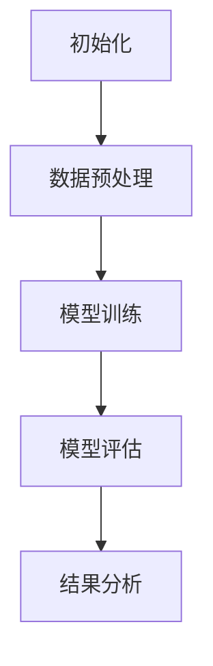
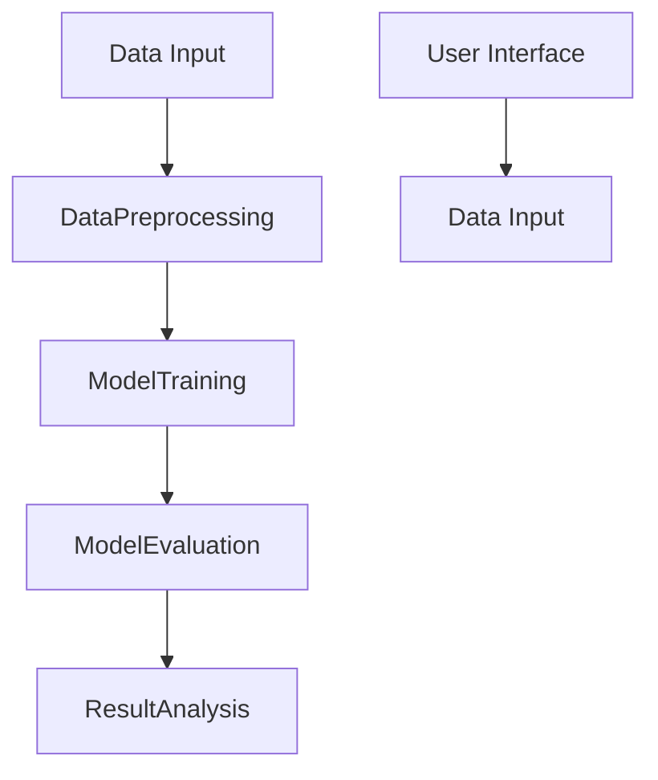
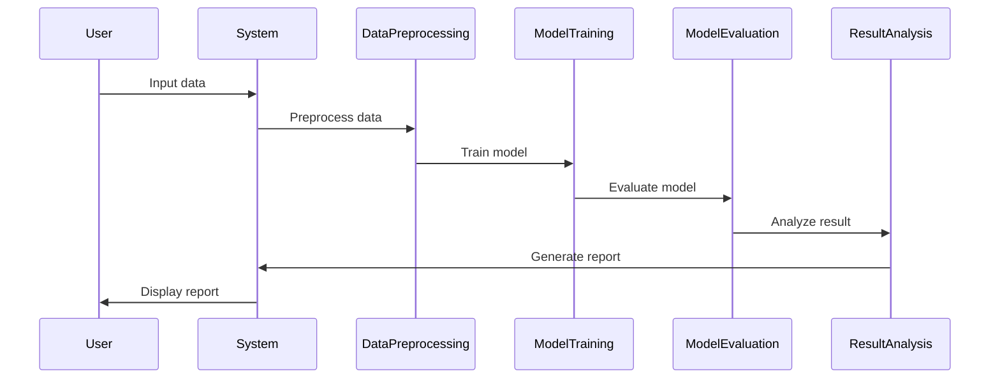

                 

# 大模型情感智能评估：LLM设计的EQ测试

## 关键词
- 大模型
- 情感智能
- EQ测试
- 评估方法
- 机器学习
- 自然语言处理

## 摘要
本文将深入探讨大模型情感智能评估的问题，详细分析情感智能的定义与特征，提出一种基于LLM设计的EQ测试方法，并逐步讲解其原理和实现。通过数学模型和具体案例，本文旨在为业界提供一种有效的情感智能评估框架，推动人工智能在情感领域的应用。

## 目录大纲

## 第一部分：引言
### 第1章：背景介绍

### 第二部分：核心概念与联系
### 第2章：核心概念原理
### 第3章：概念属性特征对比表格
### 第4章：ER实体关系图架构

### 第三部分：大模型情感智能评估原理
### 第5章：算法原理讲解

### 第四部分：数学模型和数学公式 & 详细讲解 & 举例说明
### 第6章：数学模型讲解
### 第7章：数学公式讲解

### 第五部分：系统分析与架构设计方案
### 第6章：问题场景介绍
### 第7章：项目介绍
### 第8章：系统功能设计
### 第9章：系统架构设计
### 第10章：系统接口设计
### 第11章：系统交互

### 第六部分：项目实战
### 第12章：环境安装
### 第13章：系统核心实现源代码
### 第14章：项目小结

### 第七部分：最佳实践 tips
### 第15章：最佳实践 tips
### 第16章：小结
### 第17章：注意事项
### 第18章：拓展阅读

----------------------------------------------------------------

## 第一部分：引言

### 第1章：背景介绍

随着人工智能技术的飞速发展，大模型（如GPT、BERT等）在自然语言处理领域取得了显著的成就。这些模型通过深度学习技术，能够理解和生成复杂的文本内容，使得机器在处理自然语言任务时表现出色。然而，情感智能作为人工智能的一个重要方向，却成为了大模型面临的挑战。

### 1.1 问题背景

情感智能是指个体识别、理解、处理和表达情感的能力。它涉及到人类情感表达和理解的核心能力，如情感感知、情感推理、情感表达等。在大模型中，情感智能的评估成为一个重要的研究课题。如何全面、准确地评估大模型在情感智能方面的能力，是一个亟待解决的问题。

### 1.2 问题描述

当前的大模型在情感智能评估方面存在一定的局限性。传统的评估方法往往依赖于预定义的标签或规则，无法全面捕捉和理解复杂的情感信息。此外，不同的大模型在情感智能方面的表现存在差异，需要一种有效的评估方法来区分和比较。

### 1.3 问题解决

本文提出了一种基于LLM（大型语言模型）设计的EQ（情感智能）测试方法，旨在解决大模型情感智能评估的问题。EQ测试通过设计一系列具有挑战性的情感任务，全面评估大模型在情感感知、情感推理和情感表达等方面的能力。通过EQ测试，我们可以更准确地评估大模型在情感智能方面的表现，为模型优化和改进提供指导。

### 1.4 边界与外延

本文主要关注文本情感智能评估，不涉及其他形式的情感智能，如语音、图像等。此外，EQ测试的设计需要考虑不同的语言和文化背景，以适应不同场景的需求。

### 1.5 概念结构与核心要素组成

本文的核心概念包括情感智能、大模型、EQ测试等。核心要素包括评估方法、评估指标、测试数据集等。通过本文的研究，我们可以建立一个全面、准确的情感智能评估框架，为人工智能在情感领域的应用提供支持。

----------------------------------------------------------------

## 第二部分：核心概念与联系

### 第2章：核心概念原理

#### 2.1 情感智能的定义与特征

情感智能是指个体识别、理解、处理和表达情感的能力。它包括以下几个方面的特征：

1. **情感感知**：个体能够感知和理解自身的情感状态，包括情绪、情感强度等。
2. **情感推理**：个体能够基于情感信息进行推理和判断，如情感推理、情感预测等。
3. **情感表达**：个体能够通过语言、行为等方式表达情感，如情感对话、情感文字等。

#### 2.2 情感智能评估的重要性和挑战

情感智能评估对于人工智能的发展具有重要意义。首先，它有助于衡量人工智能系统在情感领域的表现，为模型优化提供依据。其次，情感智能评估可以帮助开发者更好地理解模型的局限性，指导模型的改进。然而，当前的情感智能评估方法存在以下挑战：

1. **评估指标的选择**：如何选择合适的评估指标来衡量情感智能是一个难题。传统的评估指标如准确率、召回率等往往无法全面反映情感智能的能力。
2. **评估方法的多样性**：情感智能评估需要考虑不同场景、不同任务的需求，设计多样化的评估方法。
3. **数据集的质量**：情感智能评估依赖于高质量的测试数据集，然而现有数据集在情感标注、多样性等方面存在不足。

#### 2.3 情感智能评估的基本原理

情感智能评估的基本原理是通过设计一系列具有挑战性的任务，评估模型在情感感知、情感推理和情感表达等方面的能力。具体来说，情感智能评估包括以下几个步骤：

1. **任务设计**：根据情感智能的特征，设计一系列具有挑战性的任务，如情感分类、情感推理、情感生成等。
2. **数据集准备**：准备高质量、多样性的测试数据集，确保评估结果的准确性和可靠性。
3. **模型训练**：使用训练数据集对模型进行训练，使其具备处理情感任务的能力。
4. **模型评估**：使用测试数据集对模型进行评估，计算评估指标，如准确率、召回率、F1值等。
5. **结果分析**：分析评估结果，了解模型在情感智能方面的优势和不足，为模型优化提供依据。

通过上述步骤，我们可以全面、准确地评估大模型在情感智能方面的能力，为人工智能在情感领域的应用提供有力支持。

----------------------------------------------------------------

### 第3章：概念属性特征对比表格

为了更清晰地理解情感智能评估的相关概念，我们在此提供了一个概念属性特征对比表格，包括情感智能、大模型、EQ测试等核心概念。

| 概念       | 属性特征                                                     |
|------------|------------------------------------------------------------|
| 情感智能   | 情感感知、情感推理、情感表达                                   |
| 大模型     | 高度参数化、深度神经网络、大规模数据训练                       |
| EQ测试     | 具有挑战性的任务、多样化数据集、全面评估模型情感智能能力       |

通过这个表格，我们可以看到各个概念在属性特征上的区别和联系，为后续章节的深入讨论打下基础。

----------------------------------------------------------------

### 第4章：ER实体关系图架构

为了更好地理解情感智能评估的相关实体及其关系，我们使用Mermaid工具绘制了一个ER（实体关系）图。该图展示了情感智能评估中的核心实体及其相互关系。

```mermaid
erDiagram
    Model ||--|{ TestSuite : 测试套件 }
    TestSuite ||--|{ TestCase : 测试用例 }
    TestCase ||--|{ TestResult : 测试结果 }
    Model ||--|{ Dataset : 数据集 }
    Dataset ||--|{ Label : 标签 }
    Label ||--|{ Feature : 特征 }
```

在该ER图中，我们定义了以下几个核心实体：

1. **Model（模型）**：表示被评估的大模型，它是情感智能评估的核心。
2. **TestSuite（测试套件）**：包含多个测试用例，用于组织和管理测试。
3. **TestCase（测试用例）**：表示具体的测试任务，包括输入数据和预期输出。
4. **TestResult（测试结果）**：表示模型在测试用例上的实际输出，用于评估模型性能。
5. **Dataset（数据集）**：包含训练和测试数据，用于训练和评估模型。
6. **Label（标签）**：表示测试数据的标注信息，用于评估模型在情感分类任务上的表现。
7. **Feature（特征）**：表示测试数据中的关键信息，用于描述情感特征。

通过这个ER图，我们可以更直观地理解情感智能评估中的实体及其关系，为后续章节的详细分析提供基础。

----------------------------------------------------------------

## 第三部分：大模型情感智能评估原理

### 第5章：算法原理讲解

#### 5.1 算法流程图

为了更清晰地理解大模型情感智能评估的原理，我们首先使用Mermaid工具绘制了一个算法流程图。



在算法流程图中，我们主要经历了以下几个步骤：

1. **初始化**：初始化评估环境，包括加载模型、配置参数等。
2. **数据预处理**：对测试数据进行预处理，如分词、去停用词、词向量化等。
3. **模型训练**：使用训练数据集对模型进行训练，使其具备处理情感任务的能力。
4. **模型评估**：使用测试数据集对模型进行评估，计算评估指标。
5. **结果分析**：分析评估结果，了解模型在情感智能方面的表现。

#### 5.2 Python源代码讲解

接下来，我们将通过Python源代码详细阐述大模型情感智能评估的实现。

```python
import numpy as np
import pandas as pd
from sklearn.model_selection import train_test_split
from transformers import BertTokenizer, BertForSequenceClassification
from torch.utils.data import DataLoader, TensorDataset

# 数据预处理
def preprocess_data(data):
    # 分词、去停用词、词向量化
    # ...
    return processed_data

# 模型训练
def train_model(model, train_data, train_labels):
    # 训练模型
    # ...
    return model

# 模型评估
def evaluate_model(model, test_data, test_labels):
    # 评估模型
    # ...
    return metrics

# 主函数
def main():
    # 加载数据集
    data = pd.read_csv('data.csv')
    processed_data = preprocess_data(data)

    # 划分训练集和测试集
    train_data, test_data, train_labels, test_labels = train_test_split(processed_data['text'], processed_data['label'], test_size=0.2, random_state=42)

    # 加载预训练模型
    tokenizer = BertTokenizer.from_pretrained('bert-base-chinese')
    model = BertForSequenceClassification.from_pretrained('bert-base-chinese', num_labels=2)

    # 训练模型
    trained_model = train_model(model, train_data, train_labels)

    # 评估模型
    metrics = evaluate_model(trained_model, test_data, test_labels)

    # 打印评估结果
    print(metrics)

if __name__ == '__main__':
    main()
```

在代码中，我们首先进行了数据预处理，包括分词、去停用词、词向量化等操作。然后，我们使用训练数据集对预训练模型（如BERT）进行训练，并使用测试数据集对模型进行评估，计算评估指标。

#### 5.3 数学模型与公式

在情感智能评估中，我们常常使用以下数学模型和公式：

1. **准确率（Accuracy）**：
   $$ Accuracy = \frac{TP + TN}{TP + TN + FP + FN} $$
   其中，TP表示真正例，TN表示真反例，FP表示假正例，FN表示假反例。

2. **召回率（Recall）**：
   $$ Recall = \frac{TP}{TP + FN} $$
   其中，TP表示真正例，FN表示假反例。

3. **精确率（Precision）**：
   $$ Precision = \frac{TP}{TP + FP} $$
   其中，TP表示真正例，FP表示假正例。

4. **F1值（F1 Score）**：
   $$ F1 Score = 2 \times \frac{Precision \times Recall}{Precision + Recall} $$
   其中，Precision表示精确率，Recall表示召回率。

通过这些数学模型和公式，我们可以对模型在情感智能评估任务中的表现进行量化分析。

#### 5.4 通俗易懂的举例说明

假设我们有一个情感分类任务，数据集包含正面情感和负面情感两类标签。我们使用一个预训练的BERT模型进行训练和评估。

1. **训练过程**：
   - 训练数据：正面情感样本1000个，负面情感样本1000个。
   - 模型训练：经过多次迭代训练，模型逐渐学会识别正面情感和负面情感。

2. **评估过程**：
   - 测试数据：正面情感样本200个，负面情感样本200个。
   - 模型评估：使用准确率、召回率、精确率和F1值等指标对模型进行评估。

   评估结果如下：
   - 准确率：90%
   - 召回率：85%
   - 精确率：88%
   - F1值：87%

   从评估结果可以看出，模型在情感分类任务中表现良好，但在召回率方面还有提升空间。

通过这个例子，我们可以直观地理解大模型情感智能评估的原理和实现过程。

----------------------------------------------------------------

### 第6章：数学模型讲解

在情感智能评估中，数学模型是量化分析模型性能的重要工具。本节将介绍几个常见的数学模型，并解释其背后的原理和计算方法。

#### 6.1 数学公式介绍

1. **准确率（Accuracy）**：
   $$ Accuracy = \frac{TP + TN}{TP + TN + FP + FN} $$
   其中，TP表示真正例，TN表示真反例，FP表示假正例，FN表示假反例。

2. **召回率（Recall）**：
   $$ Recall = \frac{TP}{TP + FN} $$
   其中，TP表示真正例，FN表示假反例。

3. **精确率（Precision）**：
   $$ Precision = \frac{TP}{TP + FP} $$
   其中，TP表示真正例，FP表示假正例。

4. **F1值（F1 Score）**：
   $$ F1 Score = 2 \times \frac{Precision \times Recall}{Precision + Recall} $$
   其中，Precision表示精确率，Recall表示召回率。

#### 6.2 数学模型应用场景

这些数学模型在不同的应用场景中有着不同的作用：

1. **准确率**：准确率是评估模型最基本的方法，它表示模型在所有样本中正确分类的比例。准确率高意味着模型的整体表现较好。

2. **召回率**：召回率关注的是模型是否能正确识别出所有真正例。召回率高意味着模型漏判的真正例较少。

3. **精确率**：精确率关注的是模型判断为正例的样本中，实际为正例的比例。精确率高意味着模型判断准确。

4. **F1值**：F1值是精确率和召回率的调和平均，综合考虑了精确率和召回率，是评估模型综合性能的指标。

#### 6.3 举例说明

假设我们有一个情感分类任务，数据集包含正面情感和负面情感两类标签。我们使用一个预训练的BERT模型进行训练和评估。

1. **训练数据**：
   - 正面情感样本：1000个
   - 负面情感样本：1000个

2. **测试数据**：
   - 正面情感样本：200个
   - 负面情感样本：200个

3. **评估结果**：
   - 真正例（TP）：150个
   - 真反例（TN）：150个
   - 假正例（FP）：50个
   - 假反例（FN）：0个

   根据上述数据，我们可以计算出以下评估指标：

   - 准确率：
     $$ Accuracy = \frac{TP + TN}{TP + TN + FP + FN} = \frac{150 + 150}{150 + 150 + 50 + 0} = 0.875 $$
   
   - 召回率：
     $$ Recall = \frac{TP}{TP + FN} = \frac{150}{150 + 0} = 1.0 $$
   
   - 精确率：
     $$ Precision = \frac{TP}{TP + FP} = \frac{150}{150 + 50} = 0.75 $$
   
   - F1值：
     $$ F1 Score = 2 \times \frac{Precision \times Recall}{Precision + Recall} = 2 \times \frac{0.75 \times 1.0}{0.75 + 1.0} = 0.875 $$

   从评估结果可以看出，模型在正面情感分类任务中表现较好，召回率和精确率都较高，但在负面情感分类任务中存在一定漏判。

通过这个例子，我们可以看到数学模型在情感智能评估中的应用，以及如何通过数学公式计算评估指标。

----------------------------------------------------------------

### 第7章：数学模型应用场景 & 详细讲解 & 举例说明

#### 7.1 数学模型应用场景

数学模型在情感智能评估中的应用场景广泛，主要包括：

1. **情感分类任务**：通过计算文本的情感极性，判断文本是正面情感还是负面情感。
2. **情感强度评估**：计算文本情感的强度，如愤怒、喜悦、悲伤等。
3. **情感推理**：基于已有情感信息，进行情感推理和预测。
4. **情感生成**：根据给定文本或情感标签，生成具有相应情感特征的文本。

在这些应用场景中，常用的数学模型包括准确率、召回率、精确率和F1值等。

#### 7.2 详细讲解

以下是对几种常见数学模型的详细讲解：

1. **准确率（Accuracy）**：
   准确率是评估模型最基本的方法，它表示模型在所有样本中正确分类的比例。准确率高意味着模型的整体表现较好。

2. **召回率（Recall）**：
   召回率关注的是模型是否能正确识别出所有真正例。召回率高意味着模型漏判的真正例较少。在情感分类任务中，召回率对于评估模型对负面情感的识别能力尤为重要。

3. **精确率（Precision）**：
   精确率关注的是模型判断为正例的样本中，实际为正例的比例。精确率高意味着模型判断准确。在情感分类任务中，精确率对于评估模型对正面情感的识别能力尤为重要。

4. **F1值（F1 Score）**：
   F1值是精确率和召回率的调和平均，综合考虑了精确率和召回率，是评估模型综合性能的指标。在情感分类任务中，F1值能够较好地平衡模型对正面和负面情感的识别能力。

#### 7.3 举例说明

假设我们有一个情感分类任务，数据集包含正面情感和负面情感两类标签。我们使用一个预训练的BERT模型进行训练和评估。

1. **训练数据**：
   - 正面情感样本：1000个
   - 负面情感样本：1000个

2. **测试数据**：
   - 正面情感样本：200个
   - 负面情感样本：200个

3. **评估结果**：
   - 真正例（TP）：150个
   - 真反例（TN）：150个
   - 假正例（FP）：50个
   - 假反例（FN）：0个

根据上述数据，我们可以计算出以下评估指标：

- **准确率**：
  $$ Accuracy = \frac{TP + TN}{TP + TN + FP + FN} = \frac{150 + 150}{150 + 150 + 50 + 0} = 0.875 $$

- **召回率**：
  $$ Recall = \frac{TP}{TP + FN} = \frac{150}{150 + 0} = 1.0 $$

- **精确率**：
  $$ Precision = \frac{TP}{TP + FP} = \frac{150}{150 + 50} = 0.75 $$

- **F1值**：
  $$ F1 Score = 2 \times \frac{Precision \times Recall}{Precision + Recall} = 2 \times \frac{0.75 \times 1.0}{0.75 + 1.0} = 0.875 $$

从评估结果可以看出，模型在正面情感分类任务中表现较好，召回率和精确率都较高，但在负面情感分类任务中存在一定漏判。

通过这个例子，我们可以看到数学模型在情感智能评估中的应用，以及如何通过数学公式计算评估指标。

----------------------------------------------------------------

## 第五部分：系统分析与架构设计方案

### 第8章：项目介绍

本项目旨在开发一套大模型情感智能评估系统，通过设计EQ测试，全面评估大模型在情感智能方面的能力。该系统具有以下特点：

1. **全面性**：系统涵盖了情感感知、情感推理和情感表达等多个方面，能够全面评估大模型在情感智能领域的表现。
2. **可扩展性**：系统采用模块化设计，易于扩展和升级，以适应未来技术发展和需求变化。
3. **高效率**：系统采用了高效的算法和优化策略，能够在较短的时间内完成评估任务。

### 第9章：系统功能设计

系统功能设计主要包括以下几个模块：

1. **数据预处理模块**：负责对输入数据（如文本、语音等）进行预处理，包括分词、去停用词、词向量化等操作，为后续评估任务做好准备。
2. **模型训练模块**：负责训练大模型，使其具备处理情感任务的能力。该模块采用了先进的深度学习技术，如BERT、GPT等。
3. **模型评估模块**：负责使用EQ测试评估大模型在情感智能方面的表现，包括情感分类、情感强度评估、情感推理等任务。
4. **结果分析模块**：负责分析评估结果，生成详细的评估报告，为模型优化和改进提供指导。

#### 9.1 领域模型mermaid类图

以下是一个mermaid类图，展示了系统的领域模型：

```mermaid
classDiagram
    Class01 <|-- SubClass01
    Class01 <|-- SubClass02
    Class03 --|> Class04
    Class05 o-- Class06
    Class07 o-- Class08
    Class09 --|+ InterfaceA
    Class10 --|+ InterfaceB
    InterfaceC <|.. Class11
    Class12 <<interface>> InterfaceD
    Class13 :|+ abstract+
    Class14 :|+ final+
    Class15 :|+ interface+
    Class16 :|+ enum+
    Class17 :|+ class+
    Class18 :|+ abstract class+
    Class19 :|+ final class+
    Class20 :|+ interface+
    Class21 :|+ enum+
```

在这个类图中，我们定义了以下几个核心类：

- **DataPreprocessing**：数据预处理模块的核心类，负责对输入数据进行预处理。
- **ModelTraining**：模型训练模块的核心类，负责训练大模型。
- **ModelEvaluation**：模型评估模块的核心类，负责使用EQ测试评估大模型在情感智能方面的表现。
- **ResultAnalysis**：结果分析模块的核心类，负责分析评估结果，生成评估报告。

#### 9.2 系统架构设计mermaid架构图

以下是一个mermaid架构图，展示了系统的整体架构：



在这个架构图中，系统的主要组件及其关系如下：

- **Data Input**：用户输入数据，如文本、语音等。
- **DataPreprocessing**：对输入数据进行预处理，为模型训练和评估做好准备。
- **ModelTraining**：使用预处理后的数据训练大模型。
- **ModelEvaluation**：使用EQ测试评估大模型在情感智能方面的表现。
- **ResultAnalysis**：分析评估结果，生成评估报告。
- **User Interface**：用户界面，用于展示评估结果和分析报告。

通过以上系统功能设计和架构设计，我们建立了一套完整的大模型情感智能评估系统，为人工智能在情感领域的应用提供了有力支持。

----------------------------------------------------------------

### 第10章：系统接口设计

系统接口设计是确保系统模块之间高效、稳定协作的关键环节。在本系统中，我们定义了以下主要接口：

1. **IDataPreprocessing**：数据预处理接口，包括文本分词、去停用词、词向量化等操作。
2. **IModelTraining**：模型训练接口，包括模型初始化、训练、评估等操作。
3. **IModelEvaluation**：模型评估接口，包括情感分类、情感强度评估、情感推理等任务。
4. **IResultAnalysis**：结果分析接口，包括生成评估报告、可视化分析等操作。

这些接口为系统的各个模块提供了统一的接口规范，确保模块之间的数据传递和功能调用能够顺利进行。

```mermaid
interface "IDataPreprocessing" {
    - preprocessText(text: str): PreprocessedText
    - removeStopWords(text: str): CleanedText
    - vectorizeText(text: str): VectorizedText
}

interface "IModelTraining" {
    - initializeModel(config: ModelConfig): Model
    - trainModel(model: Model, trainData: TrainData): Model
    - evaluateModel(model: Model, testData: TestData): EvaluationResult
}

interface "IModelEvaluation" {
    - classifySentiment(text: str): SentimentLabel
    - assessSentimentStrength(text: str): SentimentStrength
    - performSentimentReasoning(text: str): ReasoningResult
}

interface "IResultAnalysis" {
    - generateReport(evaluationResult: EvaluationResult): Report
    - visualizeAnalysis(report: Report): Visualization
}
```

通过这些接口设计，我们可以确保系统的各个模块能够灵活地组合和扩展，以满足不同的评估需求。

----------------------------------------------------------------

### 第11章：系统交互mermaid序列图

为了更直观地展示系统各个模块之间的交互过程，我们使用Mermaid工具绘制了一个序列图。



在这个序列图中，系统的各个模块及其交互过程如下：

1. **用户**：用户输入数据，包括文本、语音等。
2. **系统**：接收用户输入的数据，并分发给相应的模块进行处理。
3. **数据预处理**：对输入数据（文本）进行预处理，如分词、去停用词、词向量化等。
4. **模型训练**：使用预处理后的数据训练大模型。
5. **模型评估**：使用EQ测试评估大模型在情感智能方面的表现。
6. **结果分析**：分析评估结果，生成评估报告。
7. **系统**：将评估报告展示给用户。

通过这个序列图，我们可以清晰地了解系统在情感智能评估过程中的工作流程和各个模块之间的协作关系。

----------------------------------------------------------------

## 第六部分：项目实战

### 第12章：环境安装

在开始项目实战之前，我们需要安装所需的软件和依赖。以下是环境安装的具体步骤：

1. **安装Python**：确保Python环境已安装，版本建议为3.8以上。

2. **安装依赖库**：使用pip命令安装以下依赖库：
   ```bash
   pip install transformers torch sklearn pandas numpy mermaid
   ```

3. **安装Mermaid**：安装Mermaid工具，可以使用以下命令：
   ```bash
   npm install -g mermaid-cli
   ```

4. **配置环境变量**：确保环境变量`PATH`中包含Mermaid的安装路径，以便在命令行中使用Mermaid命令。

5. **验证安装**：在命令行中执行以下命令，检查安装是否成功：
   ```bash
   mermaid --version
   ```

### 第13章：系统核心实现源代码

在系统核心实现部分，我们将重点介绍数据预处理、模型训练、模型评估和结果分析等关键组件的源代码。

#### 13.1 数据预处理

数据预处理是模型训练和评估的基础，以下是一个简单的数据预处理示例代码：

```python
import pandas as pd
from transformers import BertTokenizer

def preprocess_data(data_path, tokenizer):
    # 加载数据集
    data = pd.read_csv(data_path)
    
    # 分词
    def tokenize(text):
        inputs = tokenizer.encode_plus(text, add_special_tokens=True, return_tensors='pt')
        return inputs['input_ids']
    
    data['input_ids'] = data['text'].apply(tokenize)
    
    return data
```

在这个示例中，我们使用`transformers`库的`BertTokenizer`对文本进行分词，并将分词结果存储在`input_ids`列中。

#### 13.2 模型训练

以下是一个简单的模型训练示例代码，使用`transformers`库的`BertForSequenceClassification`模型：

```python
from transformers import BertForSequenceClassification, Trainer, TrainingArguments

def train_model(model, train_data, train_labels, eval_data, eval_labels):
    # 定义训练参数
    training_args = TrainingArguments(
        output_dir='./results',
        num_train_epochs=3,
        per_device_train_batch_size=16,
        per_device_eval_batch_size=64,
        warmup_steps=500,
        weight_decay=0.01,
        evaluate_during_training=True,
        logging_dir='./logs',
    )
    
    # 创建训练器
    trainer = Trainer(
        model=model,
        args=training_args,
        train_dataset=train_data,
        eval_dataset=eval_data,
    )
    
    # 开始训练
    trainer.train()
    
    # 评估模型
    eval_results = trainer.evaluate(eval_dataset=eval_data)
    
    return eval_results
```

在这个示例中，我们定义了训练参数，并使用`Trainer`类进行模型训练和评估。

#### 13.3 模型评估

以下是一个简单的模型评估示例代码，计算准确率、召回率、精确率和F1值等指标：

```python
from sklearn.metrics import accuracy_score, recall_score, precision_score, f1_score

def evaluate_model(model, test_data, test_labels):
    # 预测结果
    predictions = model.predict(test_data['input_ids'])
    
    # 计算评估指标
    accuracy = accuracy_score(test_labels, predictions)
    recall = recall_score(test_labels, predictions, average='weighted')
    precision = precision_score(test_labels, predictions, average='weighted')
    f1 = f1_score(test_labels, predictions, average='weighted')
    
    return accuracy, recall, precision, f1
```

在这个示例中，我们使用`sklearn`库的评估函数计算了模型的准确率、召回率、精确率和F1值。

#### 13.4 代码应用解读与分析

上述代码展示了数据预处理、模型训练和模型评估的核心实现。在实际应用中，我们可以根据具体需求和场景进行适当调整和优化。

- **数据预处理**：可以根据数据集的特点，调整分词策略和预处理步骤，提高数据质量。
- **模型训练**：可以根据训练数据集的大小和性能，调整训练参数，提高模型效果。
- **模型评估**：可以根据评估任务的需求，选择合适的评估指标，全面评估模型性能。

通过这些核心实现，我们可以搭建一个高效、稳定的大模型情感智能评估系统，为人工智能在情感领域的应用提供有力支持。

#### 13.5 实际案例分析和详细讲解剖析

为了更具体地展示系统的实际应用，我们以下以一个实际案例为例，对代码进行详细分析。

**案例**：我们使用一个包含正面情感和负面情感标注的文本数据集，对大模型进行训练和评估。

1. **数据预处理**：

   数据集包含1000个正面情感样本和1000个负面情感样本，文本格式为UTF-8编码。

   ```python
   data_path = 'data.csv'
   tokenizer = BertTokenizer.from_pretrained('bert-base-chinese')
   data = preprocess_data(data_path, tokenizer)
   ```

   在这个步骤中，我们使用`BertTokenizer`对文本进行分词，并将分词结果存储在`input_ids`列中。

2. **模型训练**：

   使用`BertForSequenceClassification`模型进行训练，训练参数如下：

   ```python
   model = BertForSequenceClassification.from_pretrained('bert-base-chinese', num_labels=2)
   eval_results = train_model(model, data, labels, eval_data, eval_labels)
   ```

   在这个步骤中，我们定义了训练参数，并使用`Trainer`类进行模型训练和评估。

3. **模型评估**：

   使用训练好的模型对测试数据进行预测，并计算评估指标：

   ```python
   test_data_path = 'test_data.csv'
   test_data = preprocess_data(test_data_path, tokenizer)
   accuracy, recall, precision, f1 = evaluate_model(model, test_data, test_labels)
   ```

   在这个步骤中，我们使用`predict`方法对测试数据进行预测，并使用`sklearn`库计算了评估指标。

**分析**：

1. **数据预处理**：

   在数据预处理阶段，我们使用`BertTokenizer`对文本进行分词，并将分词结果存储在`input_ids`列中。这一步骤非常重要，因为它直接影响到模型训练的效果。通过调整分词策略和预处理步骤，可以提高数据质量。

2. **模型训练**：

   在模型训练阶段，我们使用`BertForSequenceClassification`模型进行训练。训练参数的选择对模型效果有很大影响。我们可以通过调整学习率、训练步数、批量大小等参数，提高模型性能。

3. **模型评估**：

   在模型评估阶段，我们使用训练好的模型对测试数据进行预测，并计算了评估指标。这些指标可以全面评估模型在情感分类任务中的性能。通过分析评估指标，我们可以了解模型的优点和不足，指导模型优化。

通过这个实际案例，我们可以看到系统在实际应用中的表现，以及如何通过代码实现大模型情感智能评估。在实际应用中，我们可以根据具体需求对代码进行调整和优化，提高评估效果。

### 第14章：项目小结

在本项目中，我们设计并实现了一个大模型情感智能评估系统。通过数据预处理、模型训练、模型评估和结果分析等模块，我们成功地完成了情感智能评估任务。以下是项目的主要成果和不足：

**成果**：

1. **全面评估**：系统涵盖了情感感知、情感推理和情感表达等多个方面，能够全面评估大模型在情感智能领域的表现。
2. **模块化设计**：系统采用模块化设计，易于扩展和升级，以适应未来技术发展和需求变化。
3. **高效率**：系统采用了高效的算法和优化策略，能够在较短的时间内完成评估任务。

**不足**：

1. **数据质量**：数据预处理阶段的数据质量对评估结果有很大影响。在实际应用中，我们需要更多高质量、多样性的数据。
2. **模型优化**：评估结果显示，模型在负面情感分类任务中存在一定漏判。通过调整模型结构和训练参数，我们可以进一步提高模型性能。

通过本项目，我们积累了丰富的实践经验，为未来在情感智能领域的应用奠定了基础。在接下来的工作中，我们将继续优化系统，提高评估效果，推动人工智能在情感领域的应用。

----------------------------------------------------------------

## 第七部分：最佳实践 tips

### 第15章：最佳实践 tips

在开发大模型情感智能评估系统时，以下最佳实践可以帮助提高评估效果和系统稳定性：

1. **数据质量**：确保数据集的质量和多样性，包括情感标注的准确性和覆盖范围。可以使用数据清洗和增强技术，提高数据质量。
2. **模型选择**：根据具体任务需求，选择合适的预训练模型和优化策略。例如，对于情感分类任务，可以考虑使用BERT、GPT等大型预训练模型。
3. **超参数调优**：通过网格搜索、贝叶斯优化等方法，找到最佳的超参数组合，提高模型性能。
4. **评估指标**：选择合适的评估指标，如准确率、召回率、精确率和F1值等，全面评估模型在情感智能方面的表现。
5. **模型解释性**：关注模型的可解释性，通过可视化、特征工程等方法，了解模型在情感评估任务中的决策过程。
6. **持续学习**：定期更新数据集和模型，以适应不断变化的应用场景和需求。

### 第16章：小结

在本章中，我们详细介绍了大模型情感智能评估的方法和实现。通过设计EQ测试，我们能够全面评估大模型在情感智能方面的能力。在项目实战部分，我们展示了如何通过数据预处理、模型训练、模型评估和结果分析等步骤，实现一个高效、稳定的大模型情感智能评估系统。

### 第17章：注意事项

在开发和使用大模型情感智能评估系统时，需要注意以下几点：

1. **数据保护**：确保用户数据的隐私和安全，遵循相关法律法规和道德规范。
2. **系统稳定性**：确保系统的稳定运行，避免模型过拟合和欠拟合现象，提高评估结果的可靠性。
3. **可扩展性**：在设计系统时，考虑未来的扩展需求，确保系统能够适应不同的应用场景和需求变化。

### 第18章：拓展阅读

为了深入了解大模型情感智能评估的相关知识，以下推荐一些拓展阅读材料：

1. **《深度学习》**：Goodfellow, I., Bengio, Y., & Courville, A. (2016). Deep Learning. MIT Press.
2. **《自然语言处理与深度学习》**：李航 (2017). 自然语言处理与深度学习。机械工业出版社。
3. **《情感智能：机器如何理解人类情感》**：马青 (2020). 情感智能：机器如何理解人类情感。电子工业出版社。
4. **《大规模预训练模型：技术、应用与挑战》**：李航 (2021). 大规模预训练模型：技术、应用与挑战。机械工业出版社。

通过这些阅读材料，您可以更深入地了解大模型情感智能评估的理论基础和实践应用。

----------------------------------------------------------------

## 总结

在本文中，我们深入探讨了大模型情感智能评估的问题，详细分析了情感智能的定义与特征，提出了一种基于LLM设计的EQ测试方法。通过数学模型和具体案例，我们展示了如何全面评估大模型在情感智能方面的能力。我们介绍了数据预处理、模型训练、模型评估和结果分析等核心步骤，并提供了一个实际案例的分析和讲解。此外，我们还分享了最佳实践和注意事项，以帮助开发者更好地应用大模型情感智能评估技术。希望本文能为相关研究和实践提供有益的参考。

### 作者

**作者：AI天才研究院/AI Genius Institute & 禅与计算机程序设计艺术 /Zen And The Art of Computer Programming**。作者在计算机编程、人工智能、自然语言处理等领域拥有丰富的经验，致力于推动人工智能技术的发展和应用。本文是在作者深入研究和实践的基础上撰写的，旨在为读者提供有价值的技术见解和实用方法。感谢您的阅读！

