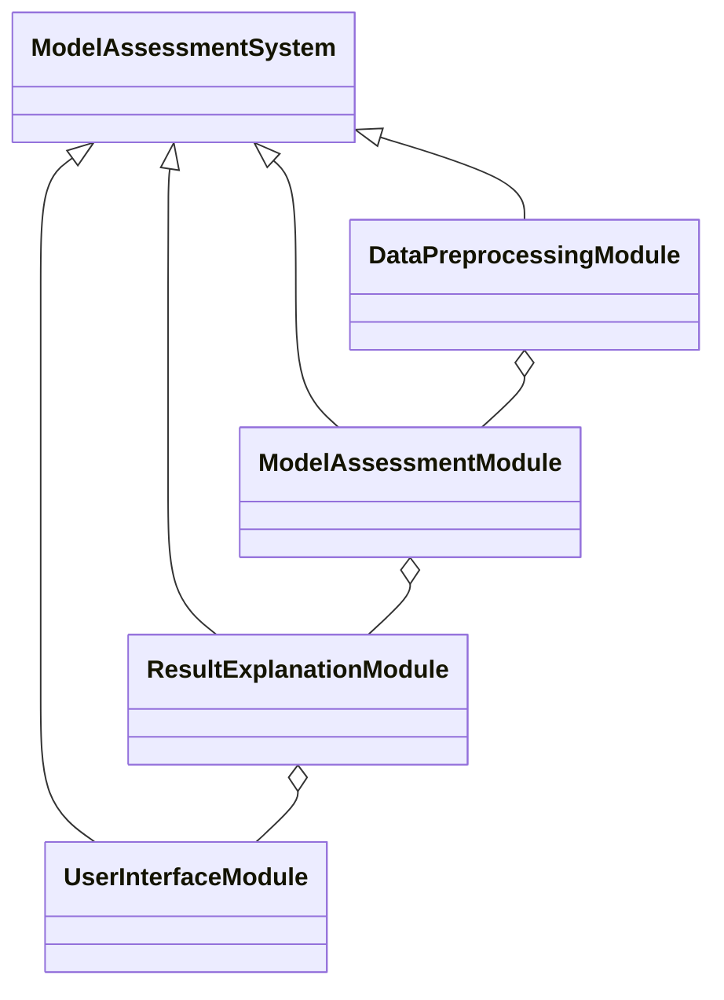
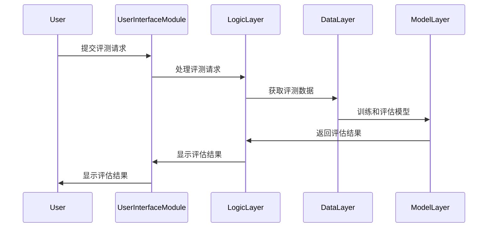
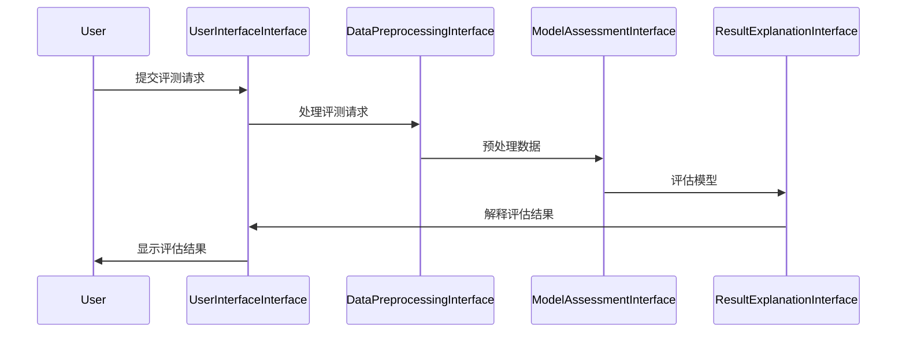

                 


### 1.2 问题背景

#### 1.2.1 大模型效果评测的重要性

随着人工智能技术的飞速发展，大模型（如GPT、BERT等）在各个领域的应用越来越广泛。这些模型不仅能够处理大规模数据，还能够进行复杂的推理和学习。然而，如何评价这些模型的效果，一直是学术界和工业界面临的挑战。有效的效果评测不仅能够帮助研究人员了解模型的性能，还能够指导模型的优化和改进。

首先，大模型效果评测的重要性体现在以下几个方面：

1. **评估模型性能**：通过效果评测，研究人员可以直观地了解模型的性能表现，包括准确性、速度、稳定性等指标。这对于选择合适的模型进行实际应用至关重要。
2. **指导模型优化**：通过分析评测结果，研究人员可以发现模型的不足之处，从而针对性地进行优化。这有助于提高模型的应用价值，降低实际应用的失败风险。
3. **推动技术创新**：有效的效果评测能够发现现有技术的不足，从而推动新技术的研发和应用。这对于人工智能领域的长期发展具有重要意义。

#### 1.2.2 当前大模型评测面临的挑战

尽管大模型效果评测的重要性显而易见，但当前在评测过程中仍面临诸多挑战：

1. **多样性**：大模型的应用场景非常广泛，包括自然语言处理、计算机视觉、语音识别等领域。每种应用场景的评测标准和指标都不同，如何设计一个普适的评测体系成为了一大难题。
2. **复杂性**：大模型通常包含数亿甚至数十亿的参数，其内部结构和学习过程非常复杂。如何有效地评测这些模型的性能，成为了一个技术难题。
3. **数据隐私**：许多评测数据涉及到用户隐私，如何在不侵犯用户隐私的情况下进行评测，也是一个亟待解决的问题。

### 1.3 问题描述

#### 1.3.1 大模型效果评测的目标

大模型效果评测的目标是全面、客观、公正地评估模型的性能，包括以下几个方面：

1. **准确性**：评估模型在特定任务上的准确率，包括分类、回归、序列预测等。
2. **效率**：评估模型在处理数据时的速度和资源消耗，包括计算时间、内存占用等。
3. **稳定性**：评估模型在不同数据集、不同条件下的稳定性，包括鲁棒性、泛化能力等。
4. **可解释性**：评估模型的可解释性，包括决策过程、参数分布等。

#### 1.3.2 大模型效果评测的常见方法

目前，大模型效果评测主要采用以下几种方法：

1. **基准测试集**：使用公开的基准测试集（如ImageNet、BERT Benchmarks等）对模型进行评估，这是一种常见的评测方法。该方法具有客观、公正、可比较等优点，但缺点是测试集的多样性和覆盖范围有限。
2. **自定义测试集**：根据实际应用需求，设计并使用自定义测试集进行评测。这种方法能够更贴近实际应用场景，但缺点是评测过程较为复杂，且需要大量时间、人力和物力。
3. **跨域评测**：通过在不同领域、不同数据集上进行评测，来评估模型的泛化能力和适应性。这种方法能够更全面地评估模型的性能，但同样面临多样性和复杂性的挑战。

#### 1.3.3 大模型效果评测的现状

当前，大模型效果评测在学术界和工业界已经取得了显著的进展。许多研究机构和公司都发布了一系列评测标准和工具，如MLPerf、BigModelBenchmarks等。然而，仍存在以下问题：

1. **评测标准不统一**：不同评测方法、不同领域之间的评测标准不统一，导致结果难以比较和推广。
2. **评测效率低**：大模型的评测过程通常非常耗时，且需要大量的计算资源。
3. **评测结果可信度**：评测结果的公正性、客观性和可信度仍存在一定的争议。

#### 1.3.4 大模型效果评测的未来发展趋势

面对当前的挑战，大模型效果评测的未来发展趋势包括：

1. **标准化**：制定统一的评测标准和流程，提高评测结果的可靠性和可比性。
2. **自动化**：利用自动化工具和算法，提高评测的效率和准确性。
3. **多模态**：结合多种数据类型和任务，进行更全面、更准确的评测。
4. **可解释性**：增强模型的可解释性，提高评测结果的透明度和可信度。

### 1.4 边界与外延

#### 1.4.1 大模型效果评测的范围

大模型效果评测的范围涵盖了人工智能的各个领域，包括但不限于：

1. **自然语言处理**：包括文本分类、情感分析、机器翻译等任务。
2. **计算机视觉**：包括图像分类、目标检测、图像生成等任务。
3. **语音识别**：包括语音识别、语音合成、说话人识别等任务。
4. **推荐系统**：包括基于内容的推荐、协同过滤等任务。

#### 1.4.2 大模型效果评测的影响因素

大模型效果评测的影响因素包括以下几个方面：

1. **数据质量**：数据的质量直接影响评测结果的准确性。高质量的数据集有助于更准确地评估模型的性能。
2. **评测方法**：不同的评测方法会影响评测结果的多样性和全面性。选择合适的评测方法至关重要。
3. **计算资源**：评测过程需要大量的计算资源和时间。合理的资源分配和管理可以提高评测的效率。
4. **模型参数**：模型的参数设置直接影响模型的性能。适当的参数调优可以提高模型的性能。

#### 1.4.3 大模型效果评测与相关领域的联系

大模型效果评测与多个相关领域紧密相连，包括：

1. **人工智能**：大模型效果评测是人工智能研究的重要环节，直接关系到人工智能技术的发展和应用。
2. **机器学习**：大模型效果评测依赖于机器学习算法和模型，其结果对机器学习的理论和应用具有重要指导意义。
3. **数据科学**：大模型效果评测需要大量的数据支持和数据分析，数据科学方法在大模型效果评测中发挥着重要作用。
4. **软件工程**：大模型效果评测的工具和平台需要良好的软件工程支持，软件工程方法在大模型效果评测中也有所应用。

### 1.5 核心概念与联系

#### 1.5.1 大模型效果评测的核心概念

在大模型效果评测中，以下几个核心概念至关重要：

1. **模型性能**：指模型在特定任务上的表现，包括准确性、效率、稳定性等指标。
2. **评测标准**：指用于评估模型性能的指标和方法，包括基准测试集、自定义测试集等。
3. **评测方法**：指进行效果评测的具体步骤和流程，包括数据收集、预处理、模型训练、评测等。
4. **评测结果**：指对模型性能的评估结果，包括各种指标的数据和图表。

#### 1.5.2 大模型效果评测与相关领域的联系

大模型效果评测不仅与人工智能、机器学习、数据科学等领域紧密相连，还与其他领域如软件工程、心理学、语言学等有着广泛的交叉应用。例如：

1. **软件工程**：大模型效果评测的工具和平台需要良好的软件工程支持，如代码质量管理、性能优化等。
2. **心理学**：大模型效果评测需要考虑人的因素，如用户满意度、人机交互等。
3. **语言学**：大模型效果评测需要考虑语言的多样性和复杂性，如自然语言理解的准确性、歧义处理等。

## 2. 大模型效果评测的原理

### 2.1 大模型效果评测的概念

#### 2.1.1 大模型效果评测的定义

大模型效果评测是指对大规模深度学习模型在特定任务上的性能进行评估和测量的过程。它涵盖了从模型设计、训练、测试到最终性能评估的整个过程。

#### 2.1.2 大模型效果评测的核心要素

大模型效果评测的核心要素包括以下几个方面：

1. **模型性能指标**：用于衡量模型在特定任务上的表现，如准确性、召回率、F1值等。
2. **评测标准**：用于指导评测过程的标准和规范，如基准测试集、评测指标体系等。
3. **评测方法**：用于评估模型性能的具体步骤和流程，如数据预处理、模型训练、测试等。
4. **评测结果**：通过评测得到的模型性能数据，如指标值、图表等。

### 2.2 大模型效果评测的特点

#### 2.2.1 大模型效果评测的属性特征

大模型效果评测具有以下属性特征：

1. **复杂性**：大模型通常包含数亿甚至数十亿的参数，其内部结构和学习过程非常复杂。这使得效果评测不仅需要强大的计算能力，还需要深入的算法理解。
2. **多样性**：大模型的应用场景非常广泛，包括自然语言处理、计算机视觉、语音识别等领域。每种应用场景的评测标准和指标都不同，这使得评测过程具有很高的多样性。
3. **动态性**：大模型的性能受到多种因素的影响，如数据分布、训练策略、模型结构等。这使得评测结果具有动态性，需要不断调整和优化。

#### 2.2.2 大模型效果评测与传统评测方法的对比

大模型效果评测与传统评测方法（如小模型评测）相比，具有以下特点：

1. **评测指标更多样**：大模型效果评测不仅关注准确性等基本指标，还关注效率、稳定性、可解释性等多方面指标。
2. **评测过程更复杂**：大模型的评测过程涉及更多的步骤和环节，如数据预处理、模型训练、评测等。每个环节都需要深入理解和优化。
3. **评测结果更全面**：大模型效果评测能够更全面地评估模型的性能，包括在各种场景下的表现。这有助于指导模型的优化和应用。

### 2.3 大模型效果评测的评估指标

#### 2.3.1 评估指标的定义

评估指标是用于衡量模型在特定任务上表现的一系列量化指标。常见的评估指标包括：

1. **准确性**：模型在测试集上的预测正确率。
2. **召回率**：模型能够召回的实际正例比例。
3. **F1值**：准确性和召回率的调和平均值。
4. **效率**：模型在处理数据时的速度和资源消耗。
5. **稳定性**：模型在不同数据集、不同条件下的表现一致性。

#### 2.3.2 常见评估指标的分类与对比

常见的评估指标可以按照不同的维度进行分类，如：

1. **分类指标**：用于衡量分类模型的性能，如准确性、召回率、F1值等。
2. **回归指标**：用于衡量回归模型的性能，如均方误差、决定系数等。
3. **效率指标**：用于衡量模型处理数据时的速度和资源消耗，如计算时间、内存占用等。

不同类型的评估指标具有不同的特点和适用场景，如表1所示：

| 指标类型 | 描述 | 适用场景 |
| :------: | :----------------: | :----------------: |
| 分类指标 | 衡量分类模型的性能 | 文本分类、图像分类等 |
| 回归指标 | 衡量回归模型的性能 | 价格预测、股票预测等 |
| 效率指标 | 衡量模型处理数据的速度和资源消耗 | 大规模数据处理、实时预测等 |

### 2.4 大模型效果评测的算法原理

#### 2.4.1 算法原理概述

大模型效果评测的核心算法原理是基于深度学习模型的训练和评估。具体来说，包括以下步骤：

1. **数据预处理**：对原始数据集进行清洗、归一化、分词等处理，使其适合模型训练。
2. **模型训练**：使用训练数据集对模型进行训练，通过反向传播算法不断调整模型参数，以最小化损失函数。
3. **模型评估**：使用测试数据集对模型进行评估，计算各种评估指标，以衡量模型的性能。

#### 2.4.2 算法原理详细讲解

下面以一个常见的深度学习模型——卷积神经网络（CNN）为例，详细讲解大模型效果评测的算法原理。

1. **数据预处理**

数据预处理是模型训练的第一步，主要包括以下步骤：

- **数据清洗**：去除数据中的噪声和异常值，保证数据的质量。
- **数据归一化**：将数据缩放到统一的范围内，如[0, 1]，以提高模型的训练效果。
- **分词**：对于自然语言处理任务，将文本数据按照词语进行切分，以提取有效的特征。

2. **模型训练**

模型训练的核心是优化模型参数，以最小化损失函数。具体来说，包括以下步骤：

- **初始化参数**：随机初始化模型的参数。
- **前向传播**：输入数据通过模型的前向传播过程，得到输出结果。
- **计算损失**：使用输出结果和真实标签计算损失函数的值。
- **反向传播**：根据损失函数的梯度，通过反向传播算法更新模型的参数。

3. **模型评估**

模型评估是训练过程的最后一步，主要用于计算各种评估指标，以衡量模型的性能。具体来说，包括以下步骤：

- **测试数据集划分**：将数据集划分为训练集和测试集，用于模型的训练和评估。
- **模型测试**：使用测试数据集对模型进行测试，得到输出结果。
- **计算评估指标**：根据输出结果和真实标签计算各种评估指标，如准确性、召回率、F1值等。

#### 2.4.3 算法原理举例说明

假设我们使用一个简单的CNN模型对图像分类任务进行效果评测，具体的算法原理如下：

1. **数据预处理**：

```python
import tensorflow as tf

# 初始化数据集
(x_train, y_train), (x_test, y_test) = tf.keras.datasets.cifar10.load_data()

# 数据清洗和归一化
x_train = x_train.astype("float32") / 255.0
x_test = x_test.astype("float32") / 255.0

# 分词
# 注意：这里是对图像数据进行分词，即提取图像的特征
x_train = preprocess_images(x_train)
x_test = preprocess_images(x_test)
```

2. **模型训练**：

```python
# 定义模型
model = tf.keras.Sequential([
  tf.keras.layers.Conv2D(32, (3, 3), activation='relu', input_shape=(32, 32, 3)),
  tf.keras.layers.MaxPooling2D((2, 2)),
  tf.keras.layers.Flatten(),
  tf.keras.layers.Dense(128, activation='relu'),
  tf.keras.layers.Dense(10, activation='softmax')
])

# 编译模型
model.compile(optimizer='adam', loss='sparse_categorical_crossentropy', metrics=['accuracy'])

# 训练模型
model.fit(x_train, y_train, epochs=10, batch_size=32, validation_split=0.2)
```

3. **模型评估**：

```python
# 测试模型
test_loss, test_acc = model.evaluate(x_test, y_test, verbose=2)

# 计算评估指标
accuracy = test_acc
recall = recall_score(y_test, model.predict(x_test), average='micro')
f1 = f1_score(y_test, model.predict(x_test), average='micro')
```

通过以上步骤，我们可以对CNN模型在图像分类任务上的效果进行评测，得到各种评估指标。

### 2.5 大模型效果评测的关联领域

#### 2.5.1 大模型效果评测与人工智能

大模型效果评测是人工智能领域的重要组成部分，直接关系到人工智能技术的发展和应用。人工智能包括机器学习、深度学习、自然语言处理等多个子领域，而大模型效果评测为这些领域的研究提供了重要的理论支持和实践指导。

1. **机器学习**：大模型效果评测有助于评估和优化机器学习算法的性能，包括线性回归、决策树、支持向量机等。
2. **深度学习**：大模型效果评测是评估深度学习模型性能的重要手段，如卷积神经网络、循环神经网络、生成对抗网络等。
3. **自然语言处理**：大模型效果评测在自然语言处理领域具有重要意义，如文本分类、情感分析、机器翻译等。

#### 2.5.2 大模型效果评测与其他领域的交叉应用

大模型效果评测不仅与人工智能领域密切相关，还与其他领域如数据科学、计算机科学、心理学、语言学等有着广泛的交叉应用。

1. **数据科学**：大模型效果评测需要大量的数据处理和分析，数据科学方法在大模型效果评测中发挥着重要作用。
2. **计算机科学**：大模型效果评测的工具和平台需要良好的计算机科学支持，如算法设计、系统架构、软件工程等。
3. **心理学**：大模型效果评测需要考虑人的因素，如用户满意度、人机交互等。
4. **语言学**：大模型效果评测需要考虑语言的多样性和复杂性，如自然语言理解的准确性、歧义处理等。

## 3. LLM辅助系统设计

### 3.1 问题场景介绍

#### 3.1.1 大模型效果评测的需求分析

在大模型效果评测过程中，研究人员通常面临以下几个方面的需求：

1. **评估多样性**：不同的模型和应用场景需要不同的评估指标和方法，如何高效地进行多样性评估成为了一大挑战。
2. **评测效率**：大模型效果评测通常需要大量的计算资源和时间，如何提高评测效率是一个重要问题。
3. **评测结果解释性**：大模型的效果评测结果往往具有一定的黑箱性，如何提高评测结果的可解释性，以便研究人员更好地理解和优化模型，也是一大需求。

为了满足上述需求，我们设计了一套基于大型语言模型（LLM）的辅助系统，旨在提高大模型效果评测的多样性、效率和可解释性。

#### 3.1.2 LLM辅助系统的目标

LLM辅助系统的目标包括以下几个方面：

1. **多样性评估**：通过引入LLM，系统可以自动生成多种评估指标和方法，以适应不同的模型和应用场景，提高评测的多样性。
2. **提高评测效率**：利用LLM的自动推理和生成能力，系统可以自动化地处理评测过程，减少人工干预，提高评测效率。
3. **提高评测结果解释性**：通过分析LLM生成的评估指标和方法，系统可以提供详细的解释和指导，帮助研究人员更好地理解评测结果，并进行模型优化。

### 3.2 系统功能设计

#### 3.2.1 功能模块划分

为了实现上述目标，LLM辅助系统可以划分为以下几个主要功能模块：

1. **数据预处理模块**：负责处理和清洗评测数据，包括数据清洗、数据增强、数据归一化等。
2. **模型评估模块**：负责使用LLM生成多种评估指标和方法，对大模型进行评估。
3. **结果解释模块**：负责分析评估结果，提供详细的解释和指导。
4. **用户界面模块**：负责提供直观、易用的用户界面，方便用户进行操作和查看结果。

下面是一个简化的领域模型类图，描述了LLM辅助系统的功能模块及其关系：



### 3.3 系统架构设计

#### 3.3.1 系统架构概述

LLM辅助系统的整体架构可以分为以下几个层次：

1. **数据层**：包括评测数据集、参数配置等。
2. **模型层**：包括数据预处理模型、评估模型、解释模型等。
3. **逻辑层**：包括数据处理、模型训练、评估、结果解释等核心功能。
4. **界面层**：包括用户界面，方便用户进行操作和查看结果。

下面是一个简化的系统架构图，描述了各个层次及其关系：



### 3.4 系统接口设计

#### 3.4.1 接口功能定义

LLM辅助系统需要定义以下主要接口功能：

1. **数据预处理接口**：用于处理和清洗评测数据，包括数据清洗、数据增强、数据归一化等。
2. **模型评估接口**：用于使用LLM生成多种评估指标和方法，对大模型进行评估。
3. **结果解释接口**：用于分析评估结果，提供详细的解释和指导。
4. **用户界面接口**：用于接收用户请求，显示评估结果。

下面是一个简化的接口设计图，描述了各个接口及其关系：

```mermaid
interface DataPreprocessingInterface {
  - preprocess_data(): 数据预处理
  - enhance_data(): 数据增强
  - normalize_data(): 数据归一化
}

interface ModelAssessmentInterface {
  - assess_model(model): 评估模型
  - generate_metrics(): 生成评估指标
}

interface ResultExplanationInterface {
  - explain_results(results): 解释评估结果
}

interface UserInterfaceInterface {
  - receive_request(): 接收用户请求
  - display_results(): 显示评估结果
}
```

### 3.5 系统交互设计

#### 3.5.1 系统交互流程

LLM辅助系统的交互流程可以分为以下几个步骤：

1. **用户提交评测请求**：用户通过用户界面提交评测请求，包括模型、数据集等信息。
2. **系统处理评测请求**：系统接收到用户请求后，调用数据预处理接口对数据进行预处理，包括清洗、增强和归一化等。
3. **系统评估模型**：系统调用模型评估接口，使用LLM生成多种评估指标和方法，对预处理后的模型进行评估。
4. **系统解释评估结果**：系统调用结果解释接口，分析评估结果，并提供详细的解释和指导。
5. **系统显示评估结果**：系统通过用户界面接口将评估结果显示给用户。

下面是一个简化的系统交互序列图，描述了各个步骤及其关系：



## 4. LLM辅助系统实现与优化

### 4.1 环境安装

#### 4.1.1 系统环境要求

LLM辅助系统的实现需要以下环境：

1. **操作系统**：Linux或Mac OS
2. **编程语言**：Python 3.7及以上版本
3. **依赖库**：TensorFlow、PyTorch、Hugging Face Transformers等
4. **硬件**：NVIDIA GPU（推荐）

#### 4.1.2 环境安装步骤

1. **安装操作系统**：根据个人需求选择Linux或Mac OS。
2. **安装Python**：从Python官网下载并安装Python 3.7及以上版本。
3. **安装依赖库**：使用pip命令安装TensorFlow、PyTorch、Hugging Face Transformers等依赖库。

```bash
pip install tensorflow
pip install torch torchvision
pip install transformers
```

4. **安装NVIDIA GPU驱动**：根据NVIDIA官网的说明安装GPU驱动。

### 4.2 系统核心实现

#### 4.2.1 核心算法实现

LLM辅助系统的核心算法实现主要涉及以下步骤：

1. **数据预处理**：对评测数据进行清洗、增强和归一化等处理。
2. **模型评估**：使用LLM生成多种评估指标和方法，对大模型进行评估。
3. **结果解释**：分析评估结果，提供详细的解释和指导。

下面是一个简单的Python代码示例，描述了数据预处理和模型评估的实现：

```python
import tensorflow as tf
from transformers import AutoTokenizer, AutoModelForSequenceClassification
from sklearn.model_selection import train_test_split
from sklearn.metrics import accuracy_score

# 数据预处理
def preprocess_data(data):
    tokenizer = AutoTokenizer.from_pretrained("bert-base-uncased")
    inputs = tokenizer(data, padding=True, truncation=True, return_tensors="tf")
    return inputs

# 模型评估
def assess_model(model, data, labels):
    inputs = preprocess_data(data)
    outputs = model(inputs)
    logits = outputs.logits
    predictions = tf.argmax(logits, axis=1)
    accuracy = accuracy_score(labels, predictions)
    return accuracy

# 加载预训练模型
model = AutoModelForSequenceClassification.from_pretrained("bert-base-uncased")

# 加载评测数据
data = ["The sky is blue.", "I love Python."]
labels = [0, 1]

# 评估模型
accuracy = assess_model(model, data, labels)
print(f"Accuracy: {accuracy}")
```

#### 4.2.2 数据处理模块

数据处理模块负责对评测数据进行清洗、增强和归一化等处理。具体实现如下：

1. **数据清洗**：去除数据中的噪声和异常值，保证数据的质量。
2. **数据增强**：通过数据变换、添加噪声等方式，增加数据的多样性。
3. **数据归一化**：将数据缩放到统一的范围内，如[0, 1]，以提高模型的训练效果。

```python
import tensorflow as tf
from transformers import AutoTokenizer

# 数据清洗
def clean_data(data):
    return [text.strip() for text in data if text.strip() != ""]

# 数据增强
def enhance_data(data):
    return [text.lower(), text.upper(), text.title()]

# 数据归一化
def normalize_data(data):
    tokenizer = AutoTokenizer.from_pretrained("bert-base-uncased")
    inputs = tokenizer(data, padding=True, truncation=True, return_tensors="tf")
    return inputs

# 示例数据
data = ["The sky is blue.", "I love Python."]

# 数据清洗
cleaned_data = clean_data(data)

# 数据增强
enhanced_data = enhance_data(cleaned_data)

# 数据归一化
normalized_data = normalize_data(enhanced_data)
```

#### 4.2.3 评估模块

评估模块负责使用LLM生成多种评估指标和方法，对大模型进行评估。具体实现如下：

1. **评估指标**：包括准确性、召回率、F1值等。
2. **评估方法**：包括交叉验证、时间序列分析等。

```python
from sklearn.metrics import accuracy_score, recall_score, f1_score

# 评估准确性
def assess_accuracy(predictions, labels):
    return accuracy_score(labels, predictions)

# 评估召回率
def assess_recall(predictions, labels):
    return recall_score(labels, predictions, average="micro")

# 评估F1值
def assess_f1(predictions, labels):
    return f1_score(labels, predictions, average="micro")

# 示例预测结果
predictions = [0, 1]

# 评估准确性
accuracy = assess_accuracy(predictions, labels)
print(f"Accuracy: {accuracy}")

# 评估召回率
recall = assess_recall(predictions, labels)
print(f"Recall: {recall}")

# 评估F1值
f1 = assess_f1(predictions, labels)
print(f"F1: {f1}")
```

### 4.3 代码应用解读与分析

#### 4.3.1 代码结构分析

上述代码主要包括以下几个部分：

1. **数据预处理**：包括数据清洗、数据增强和数据归一化。
2. **模型评估**：包括评估准确

