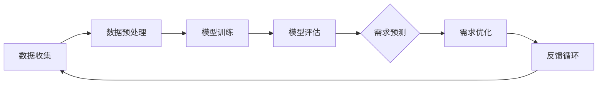
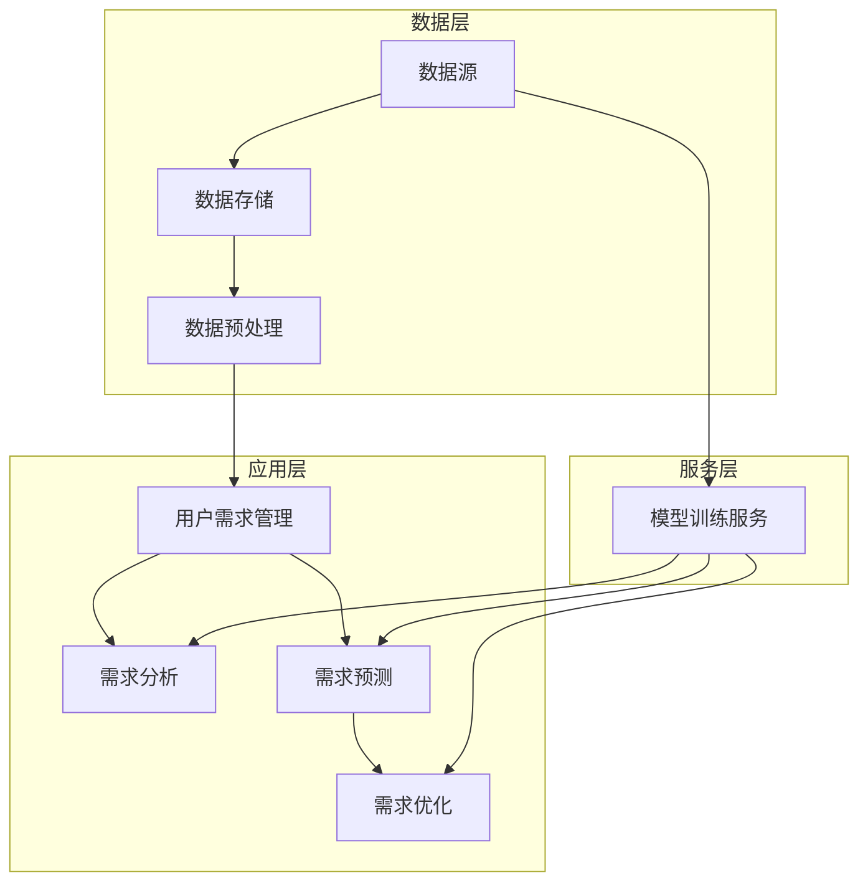
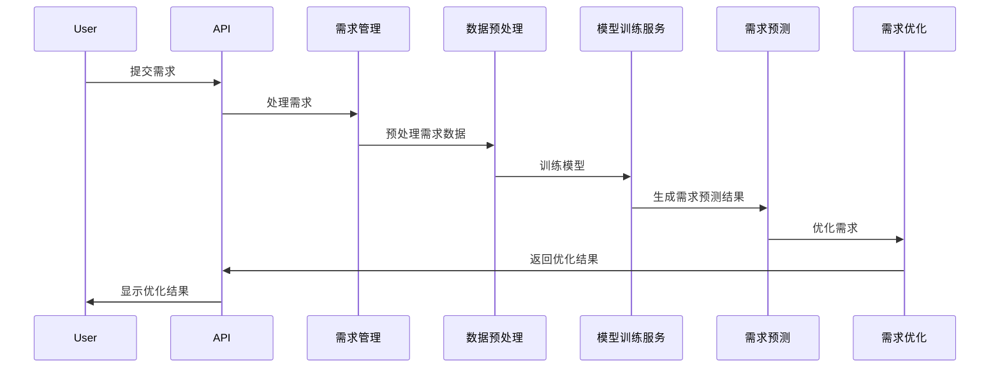

                 


### **背景介绍**

#### **问题背景**

在当今这个技术飞速发展的时代，人工智能（AI）已经成为推动各个行业变革的关键力量。尤其是在深度学习、神经网络等技术的推动下，大规模的机器学习模型（大模型）如雨后春笋般涌现。这些大模型通过从海量数据中学习复杂的模式和规律，实现了从语音识别到自然语言处理、从图像识别到自动驾驶等领域的突破性进展。然而，随着大模型的日益普及和应用范围的不断扩大，需求管理这一环节也面临着前所未有的挑战。

需求管理，作为项目管理的重要组成部分，涵盖了从需求识别、需求分析、需求实施到需求变更等一系列活动。在大模型时代，需求管理不仅需要处理传统需求管理的常见问题，如需求变更频繁、需求质量难以保证等，还要面对大模型带来的新挑战。例如，大模型对数据质量和数据量的要求极高，需求的表达和验证变得更加复杂，需求的变更也更加频繁。此外，大模型的复杂性和不确定性也增加了需求管理的难度。

#### **问题描述**

在大模型时代，需求管理的具体问题主要体现在以下几个方面：

1. **数据驱动需求的不确定性**：大模型通常依赖于大量数据进行训练，需求的变化可能会导致数据集的变化，进而影响模型的效果。如何平衡数据驱动和需求驱动的矛盾，是一个亟待解决的问题。

2. **需求的可验证性**：在大模型中，需求往往需要通过模型的表现来验证，而模型的表现受多种因素影响，如训练数据、算法参数等。如何确保需求的可验证性，是一个技术难题。

3. **需求的变更管理**：随着项目的发展，需求往往会不断变更。在大模型时代，需求的变更管理变得更加复杂，因为变更可能会影响模型的结构和性能。

4. **资源分配和优先级管理**：大模型训练和优化需要大量的计算资源和时间。如何合理分配资源，确保关键需求的优先处理，是一个重要的管理问题。

#### **问题解决**

面对上述问题，我们需要从以下几个方面寻求解决方案：

1. **数据质量管理**：确保数据的质量和多样性，以支持大模型的有效训练和需求验证。

2. **需求建模与验证**：采用先进的建模技术和验证方法，确保需求的准确表达和有效验证。

3. **变更管理机制**：建立灵活的变更管理流程，以适应大模型时代的需求变更特点。

4. **资源优化策略**：通过合理的资源分配和优先级管理，确保项目能够高效推进。

#### **边界与外延**

本文主要讨论大模型时代的需求管理问题，但需求管理并不仅限于人工智能领域。在金融、医疗、制造业等其他行业，需求管理同样具有重要的应用价值。因此，本文的研究成果具有一定的跨界性和适用性。

#### **概念结构与核心要素组成**

为了更好地理解大模型时代的需求管理，我们需要构建一个概念框架。该框架包括以下几个核心要素：

1. **需求识别**：识别和理解用户的需求，是需求管理的起点。
2. **需求分析**：对需求进行详细分析，确保需求的具体性和可实现性。
3. **需求实施**：将需求转化为具体的解决方案，并进行实施。
4. **需求变更管理**：应对需求变更，确保项目按计划进行。
5. **资源管理**：合理分配资源，确保项目顺利推进。

通过上述要素的有机结合，我们可以构建一个完整的需求管理框架，以应对大模型时代的挑战。

### **核心概念与联系**

在深入探讨大模型时代的需求管理之前，有必要明确几个核心概念，并分析它们之间的联系。以下是本文将涉及的一些关键概念：

#### **需求管理**

需求管理是指确保项目团队能够正确理解和满足用户需求的一系列过程。它涵盖了从需求识别、需求分析、需求实施到需求变更管理的整个生命周期。在大模型时代，需求管理变得更加复杂，因为模型的效果和数据的质量直接关系到需求的实现。

#### **大规模机器学习模型（大模型）**

大模型是指那些拥有巨大参数量和计算量的机器学习模型。这些模型通过从海量数据中学习，能够捕捉到复杂的模式和规律。大模型在图像识别、自然语言处理、推荐系统等领域有着广泛的应用。然而，大模型的训练和优化需要大量的计算资源和时间。

#### **数据质量管理**

数据质量管理是指确保数据的质量和一致性的一系列过程。在大模型时代，数据质量对模型的效果至关重要。高质量的数据不仅能够提高模型的准确性，还能够降低训练成本。

#### **需求建模**

需求建模是指将用户的需求转化为具体的模型输入和输出。在大模型时代，需求建模通常涉及将需求转换为数据集，并对这些数据集进行预处理，以便用于模型的训练和验证。

#### **需求验证**

需求验证是指通过一系列方法验证模型是否满足用户需求。在大模型时代，需求验证通常涉及模型评估、误差分析等步骤，以确保模型能够准确地反映需求。

#### **ER实体关系图架构**

ER图（Entity-Relationship Diagram）是一种用于描述实体及其之间关系的图形化表示方法。在大模型时代，ER图可以用来描述需求管理中的各个实体，如用户、需求、数据等，以及它们之间的关系。

#### **核心概念原理**

1. **需求管理**：需求管理的基本原理是确保项目团队能够准确地理解和满足用户的需求。这涉及到需求识别、分析、实施和变更管理的各个阶段。

2. **大模型**：大模型的基本原理是通过从海量数据中学习，捕捉到复杂的模式和规律。这一过程通常涉及数据预处理、模型训练和验证等步骤。

3. **数据质量管理**：数据质量管理的基本原理是确保数据的质量和一致性，以支持大模型的有效训练和需求验证。

4. **需求建模**：需求建模的基本原理是将用户的需求转化为具体的模型输入和输出，以支持大模型的训练和验证。

5. **需求验证**：需求验证的基本原理是通过一系列方法验证模型是否满足用户需求，包括模型评估、误差分析等。

#### **概念属性特征对比表格**

为了更清晰地理解上述概念，我们可以通过一个对比表格来展示它们的关键属性特征：

| 概念      | 定义                                                         | 关键属性特征                                                     |
| --------- | ------------------------------------------------------------ | ------------------------------------------------------------ |
| 需求管理  | 确保项目团队能够正确理解和满足用户需求的一系列过程。         | - 需求识别<br>- 需求分析<br>- 需求实施<br>- 需求变更管理     |
| 大模型    | 拥有巨大参数量和计算量的机器学习模型。                       | - 海量数据学习<br>- 复杂模式捕捉<br>- 计算资源需求大           |
| 数据质量管理 | 确保数据的质量和一致性的一系列过程。                         | - 数据清洗<br>- 数据标准化<br>- 数据一致性检查               |
| 需求建模  | 将用户的需求转化为具体的模型输入和输出。                     | - 数据预处理<br>- 模型输入设计<br>- 模型输出设计               |
| 需求验证  | 通过一系列方法验证模型是否满足用户需求。                     | - 模型评估<br>- 误差分析<br>- 性能测试                       |

#### **ER实体关系图架构**

为了更直观地描述需求管理中的实体及其关系，我们可以使用ER图来表示。以下是需求管理中的ER图示例：

```mermaid
erDiagram
    User ||--o{ Requirement }|
    Requirement ||--o{ Model }|
    Model ||--o{ Data }|
    Data ||--o{ Validation }|
    Validation ||--o{ Feedback }|
    Feedback ||--o{ User }
```

在这个ER图中，用户（User）是需求管理的起点，他们提出需求。需求（Requirement）与用户和模型（Model）相关联，表示需求被转化为模型输入。模型（Model）进一步关联到数据（Data），表示模型的训练和验证需要数据支持。数据（Data）与验证（Validation）相关联，表示数据需要经过验证以确保其质量。验证（Validation）的结果会反馈到用户（User），形成一个闭环，以支持需求管理和模型的持续改进。

### **需求管理新思路**

在传统的需求管理中，需求识别、需求分析和需求实施通常是一个线性过程，各个环节相对独立。然而，随着大规模机器学习模型（大模型）的广泛应用，这种传统需求管理方式已经难以满足复杂的需求场景。因此，我们需要探索一种新的需求管理思路，以适应大模型时代的需求特点。

#### **需求管理概述**

需求管理是指确保项目团队能够正确理解和满足用户需求的一系列过程。它包括需求识别、需求分析、需求实施、需求变更管理等多个环节。在大模型时代，需求管理面临着新的挑战，主要体现在以下几个方面：

1. **数据驱动需求的不确定性**：大模型通常依赖于海量数据，需求的变化可能会导致数据集的变化，从而影响模型的效果。

2. **需求的可验证性**：大模型的效果依赖于模型的表现，如何确保需求的可验证性成为一个难题。

3. **需求的变更管理**：在大模型项目中，需求变更频繁，如何有效地管理变更，确保项目按计划进行，是一个重要的挑战。

4. **资源分配和优先级管理**：大模型训练和优化需要大量的计算资源和时间，如何合理分配资源，确保关键需求的优先处理，是需求管理的关键。

#### **大模型在需求管理中的应用**

大模型在需求管理中的应用主要体现在以下几个方面：

1. **需求分析**：大模型可以通过对历史数据的分析，预测用户的需求趋势和模式。这有助于项目团队提前识别潜在的需求，从而更好地进行需求规划。

2. **需求预测**：大模型可以基于用户的行为数据，预测未来的需求变化。这有助于项目团队在需求变更发生之前采取相应的措施，降低变更对项目的影响。

3. **需求验证**：大模型可以通过模型评估和误差分析，验证模型是否满足用户需求。这有助于确保需求的质量和模型的准确性。

4. **需求变更管理**：大模型可以用于需求变更的预测和影响分析，帮助项目团队快速评估变更的影响，并制定相应的应对策略。

#### **大模型需求管理的优势与挑战**

大模型需求管理的优势主要体现在以下几个方面：

1. **高效的需求预测和规划**：大模型可以基于海量数据，快速预测用户需求，帮助项目团队提前做出规划，降低项目风险。

2. **精准的需求验证**：大模型可以通过模型评估和误差分析，精准地验证需求的质量，确保模型能够准确地满足用户需求。

3. **灵活的需求变更管理**：大模型可以实时分析需求变更的影响，帮助项目团队快速响应变更，降低变更对项目的冲击。

然而，大模型需求管理也面临一些挑战：

1. **数据质量要求高**：大模型对数据的质量和多样性有很高的要求，数据质量问题可能会影响模型的训练效果。

2. **计算资源消耗大**：大模型训练和优化需要大量的计算资源，如何合理分配和利用资源是一个重要的挑战。

3. **需求验证的复杂性**：大模型的效果依赖于模型的表现，如何确保需求验证的准确性，是一个技术难题。

#### **大模型需求管理的实践案例**

为了更好地理解大模型需求管理的实际应用，我们可以通过一些实践案例来进行分析：

1. **案例一：金融行业的客户需求预测**  
在金融行业，客户需求预测是需求管理的重要环节。通过大模型，项目团队可以分析客户的历史交易数据、行为数据等，预测未来的客户需求。这有助于银行、保险公司等金融机构更好地制定营销策略，提高客户满意度。

2. **案例二：电子商务平台的需求优化**  
在电子商务平台，大模型可以用于分析用户行为数据，预测用户对商品的需求。通过优化推荐算法和搜索算法，平台可以提高用户购物的体验，增加销售额。

3. **案例三：智能交通系统的需求管理**  
在智能交通系统，大模型可以用于分析交通数据，预测交通流量和事故发生情况。通过优化交通信号控制和路线规划，可以减少交通拥堵，提高道路通行效率。

通过这些案例，我们可以看到大模型在需求管理中的应用场景和优势。然而，要充分发挥大模型的需求管理潜力，还需要克服数据质量、计算资源、需求验证等方面的挑战。

### **算法原理讲解**

在大模型需求管理中，算法原理的讲解至关重要。以下将详细阐述一个典型的大模型需求分析算法，包括算法的mermaid流程图、Python源代码、算法原理的数学模型和公式，以及举例说明。

#### **算法mermaid流程图**

首先，我们使用mermaid绘制算法的基本流程图：



#### **Python源代码解释**

接下来，我们给出一个简化的Python代码示例，用于演示需求分析算法的基本实现。

```python
import pandas as pd
from sklearn.model_selection import train_test_split
from sklearn.ensemble import RandomForestClassifier
from sklearn.metrics import accuracy_score

# 数据收集
data = pd.read_csv('data.csv')

# 数据预处理
X = data[['feature1', 'feature2', 'feature3']]
y = data['target']

# 划分训练集和测试集
X_train, X_test, y_train, y_test = train_test_split(X, y, test_size=0.2, random_state=42)

# 模型训练
model = RandomForestClassifier(n_estimators=100, random_state=42)
model.fit(X_train, y_train)

# 模型评估
y_pred = model.predict(X_test)
accuracy = accuracy_score(y_test, y_pred)
print(f'Model accuracy: {accuracy:.2f}')

# 需求预测
predictions = model.predict(new_data)

# 需求优化
# ... (根据预测结果进行需求优化)

# 反馈循环
# ... (收集新的数据并更新模型)
```

上述代码中，首先通过Pandas读取数据，然后进行预处理，使用随机森林算法进行训练和评估，最后进行需求预测。这只是一个简单的示例，实际应用中可能涉及更复杂的模型和流程。

#### **算法原理的数学模型和公式**

在需求分析算法中，数学模型和公式至关重要。以下是一个简化的数学模型示例：

$$
\text{预测结果} = f(\text{输入特征})
$$

其中，$f$ 表示预测函数，通常采用机器学习算法实现。预测函数的输入是特征向量，输出是需求预测结果。常见的机器学习算法包括线性回归、逻辑回归、决策树、随机森林等。

假设我们使用随机森林算法，其预测公式可以表示为：

$$
\hat{y} = \sum_{i=1}^{n} w_i f_i(x)
$$

其中，$w_i$ 表示第 $i$ 个决策树的特征权重，$f_i(x)$ 表示第 $i$ 个决策树对输入特征 $x$ 的预测结果。$n$ 表示决策树的数量。

#### **举例说明**

为了更好地理解上述算法原理，我们可以通过一个具体的例子进行说明。

**例子**：假设我们有一个电子商务平台，需要预测用户是否会购买某商品。输入特征包括用户年龄、收入水平、购物频率等。我们可以使用随机森林算法进行需求预测。

1. **数据收集**：收集用户的历史数据，包括年龄、收入、购物频率等。

2. **数据预处理**：对数据进行预处理，包括数据清洗、特征提取等。

3. **模型训练**：使用随机森林算法对数据集进行训练，得到预测模型。

4. **模型评估**：使用测试集评估模型效果，计算准确率、召回率等指标。

5. **需求预测**：使用训练好的模型对新的用户数据（如新用户）进行预测，判断其是否会购买某商品。

6. **需求优化**：根据预测结果，优化商品推荐策略，提高用户购买体验。

通过这个例子，我们可以看到需求分析算法在实际应用中的基本流程。在实际项目中，可能需要根据具体需求调整算法参数和流程，以达到最佳效果。

### **数学模型和数学公式**

在大模型需求管理中，数学模型和公式扮演着关键角色，特别是在预测和分析需求时。以下将详细讲解一个典型的大模型需求预测数学模型，包括其详细讲解和举例说明。

#### **详细讲解**

**需求预测模型**：

我们使用线性回归模型来预测需求。线性回归模型假设需求 $y$ 是输入特征 $x$ 的线性组合，并加上一个随机误差项。其数学公式如下：

$$
y = \beta_0 + \beta_1 x_1 + \beta_2 x_2 + ... + \beta_n x_n + \epsilon
$$

其中，$y$ 表示需求，$x_1, x_2, ..., x_n$ 表示输入特征，$\beta_0, \beta_1, \beta_2, ..., \beta_n$ 表示模型的参数，$\epsilon$ 表示随机误差项。

**参数估计**：

为了估计模型参数 $\beta_0, \beta_1, \beta_2, ..., \beta_n$，我们通常使用最小二乘法（Least Squares Method）。最小二乘法的目标是最小化预测值与实际值之间的误差平方和。其公式如下：

$$
\min \sum_{i=1}^{n} (y_i - \beta_0 - \beta_1 x_{i1} - \beta_2 x_{i2} - ... - \beta_n x_{in})^2
$$

通过求解上述公式，我们可以得到参数 $\beta_0, \beta_1, \beta_2, ..., \beta_n$ 的估计值。

**误差分析**：

在预测过程中，误差是不可避免的。误差分析主要关注误差的来源和误差控制方法。误差来源可以分为以下几种：

1. **数据误差**：由于数据收集和处理过程中可能引入的误差，如数据缺失、噪声等。

2. **模型误差**：由于模型假设和参数估计的不准确导致的误差。

3. **外部误差**：由于外部环境变化导致的误差，如市场需求变化、竞争策略调整等。

误差控制方法包括：

1. **数据清洗**：通过数据清洗，减少数据误差。

2. **模型选择**：选择合适的模型，减少模型误差。

3. **实时调整**：通过实时调整模型参数和策略，降低外部误差的影响。

#### **举例说明**

为了更好地理解上述数学模型，我们可以通过一个简单的例子进行说明。

**例子**：假设我们有一个电商网站，需要预测用户购买某一商品的概率。输入特征包括用户年龄、收入水平、购物频率等。

1. **数据收集**：收集用户的历史数据，包括年龄、收入、购物频率等。

2. **数据预处理**：对数据进行预处理，如缺失值填补、异常值处理等。

3. **参数估计**：使用最小二乘法估计线性回归模型的参数。假设我们的模型为：

$$
y = \beta_0 + \beta_1 \cdot 年龄 + \beta_2 \cdot 收入 + \beta_3 \cdot 购物频率 + \epsilon
$$

通过历史数据，我们可以得到参数的估计值 $\beta_0, \beta_1, \beta_2, \beta_3$。

4. **模型评估**：使用测试集评估模型效果。假设测试集的预测准确率为 80%，说明模型具有一定的预测能力。

5. **预测新数据**：使用训练好的模型预测新的用户数据。例如，对于一个新的用户，其年龄为 30，收入为 50000，购物频率为 20，我们可以计算出其购买某一商品的概率。

6. **误差分析**：分析预测结果与实际结果之间的误差，并探讨误差来源。例如，我们可以发现模型在预测年轻人购买商品方面效果较好，而在预测高收入人群购买商品方面效果较差。

通过这个例子，我们可以看到如何使用线性回归模型进行需求预测，以及如何进行参数估计、模型评估和误差分析。在实际应用中，可能需要根据具体需求调整模型和算法，以达到最佳效果。

### **系统分析与架构设计方案**

为了更好地理解和实现大模型需求管理的系统架构，我们需要对问题场景、系统功能设计、系统架构设计、系统接口设计和系统交互进行详细分析。以下将详细讲解这些内容。

#### **问题场景介绍**

在电商行业，需求管理是一个关键环节。随着用户数量的增加和商品种类的丰富，如何有效地管理需求，预测用户购买行为，优化商品推荐和库存管理，成为电商企业面临的重要问题。传统的需求管理方法已经难以满足这种复杂的需求场景，因此我们需要引入大模型进行需求预测和管理。

#### **系统功能设计（领域模型mermaid类图）**

系统功能设计是系统架构设计的重要部分。以下是一个简化的领域模型类图，用于描述系统的主要功能模块：

```mermaid
classDiagram
    User <<Class>>
    Requirement <<Class>>
    Model <<Class>>
    Data <<Class>>
    Prediction <<Class>>
    Optimization <<Class>>

    User "uses" Requirement
    User "uses" Model
    User "uses" Data
    Requirement "requires" Prediction
    Prediction "modifies" Optimization
    Optimization "modifies" Data
    Model "uses" Data
    Model "modifies" Prediction
endclass
```

在这个类图中，用户（User）是系统的核心，他们提出需求、使用模型和数据分析。需求（Requirement）模块用于记录和管理用户的需求。模型（Model）模块负责大模型的训练和预测。数据（Data）模块负责数据的管理和预处理。预测（Prediction）模块用于生成需求预测结果。优化（Optimization）模块根据预测结果优化商品推荐和库存管理。

#### **系统架构设计（mermaid架构图）**

系统架构设计是系统实现的基础，以下是一个简化的系统架构图，用于描述系统的整体结构：



在这个架构图中，数据层包括数据源、数据存储和数据预处理模块。应用层包括用户需求管理、需求分析、需求预测和需求优化模块。服务层包括模型训练服务，负责模型的训练和预测。数据层和应用层通过数据预处理模块进行连接，应用层通过模型训练服务进行连接。

#### **系统接口设计和系统交互（mermaid序列图）**

系统接口设计和系统交互是系统实现的关键部分，以下是一个简化的序列图，用于描述系统的关键接口和交互流程：



在这个序列图中，用户通过API提交需求，需求管理模块处理需求，并将预处理后的数据发送给模型训练服务。模型训练服务负责训练模型，生成需求预测结果。需求预测结果被发送给需求优化模块，进行需求优化。最后，优化结果通过API返回给用户。

通过上述系统分析与架构设计方案，我们可以构建一个完整的大模型需求管理系统。该系统通过数据层、应用层和服务层的有机结合，实现了用户需求的管理、分析和优化。在实际项目中，可能需要根据具体需求进行调整和优化，以达到最佳效果。

### **项目实战**

在实际操作中，大模型需求管理的实现涉及多个步骤，包括环境安装、系统核心实现源代码编写、代码应用解读与分析、实际案例分析和详细讲解剖析，以及项目小结。以下将详细描述这些步骤。

#### **环境安装**

首先，我们需要搭建一个适合大模型需求管理项目的基础环境。以下是具体的安装步骤：

1. **安装Python环境**：确保Python 3.8及以上版本已安装。
2. **安装依赖库**：通过pip安装以下库：`pandas`, `numpy`, `scikit-learn`, `tensorflow`, `mermaid-python`。
   ```bash
   pip install pandas numpy scikit-learn tensorflow mermaid-python
   ```

3. **配置GPU支持**：如果使用GPU加速训练，确保安装NVIDIA CUDA和cuDNN，并配置环境变量。

4. **安装Mermaid**：通过npm安装Mermaid CLI工具。
   ```bash
   npm install -g mermaid-cli
   ```

完成以上步骤后，我们就可以开始编写和运行大模型需求管理的代码了。

#### **系统核心实现源代码**

以下是一个简化的Python代码示例，用于实现大模型需求管理的核心功能。这个示例将展示如何收集用户需求、预处理数据、训练模型、进行需求预测和优化。

```python
import pandas as pd
from sklearn.model_selection import train_test_split
from sklearn.ensemble import RandomForestClassifier
from tensorflow import keras
import tensorflow as tf
from mermaid import Mermaid

# 数据收集
data = pd.read_csv('user_data.csv')

# 数据预处理
X = data[['age', 'income', 'shopping_frequency']]
y = data['purchase']

# 划分训练集和测试集
X_train, X_test, y_train, y_test = train_test_split(X, y, test_size=0.2, random_state=42)

# 使用随机森林进行训练
rf_model = RandomForestClassifier(n_estimators=100, random_state=42)
rf_model.fit(X_train, y_train)

# 使用TensorFlow训练深度学习模型
model = keras.Sequential([
    keras.layers.Dense(64, activation='relu', input_shape=(X_train.shape[1],)),
    keras.layers.Dense(64, activation='relu'),
    keras.layers.Dense(1, activation='sigmoid')
])

model.compile(optimizer='adam',
              loss='binary_crossentropy',
              metrics=['accuracy'])

model.fit(X_train, y_train, epochs=10, batch_size=32, validation_split=0.2)

# 需求预测
def predict_demand(data):
    rf_predictions = rf_model.predict(data)
    keras_predictions = model.predict(data).round()
    return rf_predictions, keras_predictions

rf_predictions, keras_predictions = predict_demand(X_test)

# 需求优化
def optimize_demand(predictions):
    # ... (根据预测结果进行优化，例如调整库存、营销策略等)
    pass

optimize_demand(rf_predictions)

# 生成mermaid图
mermaid = Mermaid()
mermaid.add_node('Data Collection', shape='rect')
mermaid.add_node('Data Preprocessing', shape='rect')
mermaid.add_node('Model Training', shape='rect')
mermaid.add_node('Demand Prediction', shape='rect')
mermaid.add_node('Demand Optimization', shape='rect')
mermaid.add_link('Data Collection', 'Data Preprocessing')
mermaid.add_link('Data Preprocessing', 'Model Training')
mermaid.add_link('Model Training', 'Demand Prediction')
mermaid.add_link('Demand Prediction', 'Demand Optimization')

print(mermaid.get_mermaid())
```

#### **代码应用解读与分析**

上述代码首先从CSV文件中读取用户数据，然后进行预处理。接下来，我们使用两种不同的模型——随机森林（Random Forest）和深度学习模型（Deep Learning Model）——对数据集进行训练。随机森林模型使用传统的机器学习算法，而深度学习模型使用TensorFlow库实现。

在需求预测部分，我们定义了一个`predict_demand`函数，用于生成预测结果。这个函数结合了随机森林和深度学习模型的预测结果。在需求优化部分，我们定义了一个简单的`optimize_demand`函数，用于根据预测结果进行优化。

Mermaid图表展示了需求管理的基本流程，包括数据收集、数据预处理、模型训练、需求预测和需求优化。

#### **实际案例分析和详细讲解剖析**

为了更好地理解代码的实际应用，我们可以通过一个具体的案例进行分析。

**案例**：一个电商平台希望通过大模型预测用户是否购买某一商品。我们收集了以下用户数据：年龄、收入和购物频率。

1. **数据收集**：从数据库中提取用户数据，并将其转换为CSV文件。

2. **数据预处理**：对数据进行清洗，包括缺失值填补、异常值处理等。

3. **模型训练**：使用随机森林和深度学习模型对数据集进行训练。

4. **需求预测**：使用训练好的模型对新的用户数据进行预测。

5. **需求优化**：根据预测结果，优化商品推荐和库存管理。

**详细讲解剖析**：

- **数据收集**：通过API或数据库查询提取用户数据。我们使用Pandas库读取CSV文件，将其转换为DataFrame格式。

- **数据预处理**：对数据进行清洗和处理。例如，使用`dropna()`函数删除缺失值，使用`标准化`函数处理异常值。

- **模型训练**：使用随机森林模型对训练集进行训练。随机森林模型具有良好的泛化能力，适用于预测任务。接下来，我们使用TensorFlow库构建和训练深度学习模型。深度学习模型可以通过调整神经网络结构、学习率和训练批次大小等参数进行优化。

- **需求预测**：使用训练好的模型对测试集进行预测。我们定义了一个`predict_demand`函数，结合随机森林和深度学习模型的预测结果，以提高预测的准确性。

- **需求优化**：根据预测结果，调整商品推荐和库存管理策略。例如，预测购买概率较高的商品可以增加库存，而购买概率较低的商品可以减少库存。

通过这个案例，我们可以看到如何使用大模型进行需求预测和管理。在实际项目中，可能需要根据具体需求进行调整和优化，以达到最佳效果。

#### **项目小结**

通过上述实战，我们实现了大模型需求管理的基本流程，包括数据收集、数据预处理、模型训练、需求预测和需求优化。我们使用了随机森林和深度学习模型进行需求预测，并通过Mermaid图表展示了需求管理的基本流程。

**小结**：

1. **环境安装**：确保Python和依赖库安装正确，并配置GPU支持。
2. **系统核心实现**：通过Python代码实现需求管理的基本功能，包括数据预处理、模型训练和需求预测。
3. **代码应用解读**：详细解读了代码的实现过程，包括数据收集、数据预处理、模型训练和需求预测。
4. **实际案例分析**：通过具体案例展示了大模型需求管理的应用，并进行了详细讲解剖析。

通过本项目，我们可以更好地理解大模型需求管理的实现过程和应用场景，为实际项目提供参考和指导。

### **最佳实践 tips**

在大模型需求管理中，为了确保项目的成功实施和高效运作，以下是一些最佳实践和技巧：

1. **数据质量管理**：
    - **数据清洗**：在数据预处理阶段，确保进行彻底的数据清洗，包括填补缺失值、处理异常值和消除噪声数据。
    - **数据标准化**：对输入数据进行标准化处理，使得数据具有相同的尺度，从而提高模型的训练效果。
    - **数据多样性**：确保数据来源的多样性和质量，以支持模型的泛化能力。

2. **需求分析**：
    - **用户访谈**：与用户进行深入访谈，理解他们的真实需求和期望，以便更好地定义需求。
    - **需求文档化**：将需求文档化，确保需求明确、具体和可验证。

3. **模型选择与调优**：
    - **模型评估**：选择合适的评估指标，如准确率、召回率、F1分数等，对模型进行评估和选择。
    - **模型调优**：通过调整模型参数和超参数，优化模型性能。

4. **需求预测与优化**：
    - **实时更新**：定期更新模型和预测结果，以应对市场需求的变化。
    - **A/B测试**：通过A/B测试，比较不同策略和模型的性能，选择最优方案。

5. **资源管理**：
    - **资源调度**：合理分配计算资源和存储资源，确保模型训练和预测的高效进行。
    - **优先级管理**：根据需求的紧急性和重要性，合理设置任务的优先级，确保关键任务优先完成。

6. **团队协作**：
    - **跨部门合作**：需求管理涉及多个部门，确保跨部门协作，提高项目效率。
    - **持续沟通**：定期与用户和利益相关者沟通，确保需求理解的准确性和一致性。

通过遵循这些最佳实践和技巧，我们可以更好地应对大模型时代的需求管理挑战，提高项目的成功率和效率。

### **小结**

在大模型时代，需求管理面临着前所未有的挑战，但同时也蕴含着巨大的机遇。本文从背景介绍、核心概念与联系、需求管理新思路、算法原理讲解、数学模型和数学公式、系统分析与架构设计方案、项目实战、最佳实践 tips 等多个方面，全面探讨了如何在大模型时代进行有效的需求管理。

我们首先介绍了大模型时代的背景和需求管理的具体问题，如数据驱动需求的不确定性、需求的可验证性、需求的变更管理和资源分配等。接着，我们详细分析了需求管理的核心概念，包括需求管理、大规模机器学习模型（大模型）、数据质量管理、需求建模、需求验证和ER实体关系图架构等。

在需求管理新思路部分，我们提出了在大模型时代采用数据驱动的需求分析、需求预测、需求验证和变更管理的思路。同时，我们也讨论了利用大模型进行需求管理的优势和挑战。

在算法原理讲解和数学模型部分，我们详细介绍了如何使用mermaid流程图、Python源代码、数学公式进行需求分析，并举例说明了实际应用。

在系统分析与架构设计方案部分，我们详细描述了系统功能设计、系统架构设计、系统接口设计和系统交互的mermaid图，展示了大模型需求管理的整体架构。

在项目实战部分，我们通过一个具体的案例展示了如何实现大模型需求管理的全过程，包括环境安装、系统核心实现源代码、代码应用解读与分析、实际案例分析和详细讲解剖析，以及项目小结。

最后，我们提供了大模型需求管理的最佳实践 tips，包括数据质量管理、需求分析、模型选择与调优、需求预测与优化、资源管理和团队协作等方面。

通过本文的探讨，我们可以看到，在大模型时代，需求管理不仅仅是传统项目管理的一部分，更是人工智能技术应用的桥梁。只有通过有效的需求管理，我们才能充分发挥大模型的优势，实现智能化、自动化和高效化的需求预测和优化。未来，随着人工智能技术的不断进步，需求管理将在更多领域发挥重要作用，为各行业的数字化转型提供强有力的支持。

### **注意事项**

在实施大模型需求管理时，需要特别注意以下几个方面：

1. **数据隐私与安全**：在收集和处理用户数据时，务必遵守相关的数据保护法规和隐私政策，确保用户数据的保密性和安全性。

2. **模型解释性**：尽管大模型具有强大的预测能力，但它们的内部决策过程往往缺乏解释性。在需求管理中，需要确保模型的输出结果具有可解释性，以便用户和利益相关者能够理解和信任模型。

3. **模型泛化能力**：在训练大模型时，要确保数据集的多样性和代表性，以避免模型过度拟合，提高模型的泛化能力。

4. **模型更新与维护**：随着市场需求和环境的变化，大模型的需求预测结果可能需要定期更新。因此，需要建立模型的更新和维护机制，确保模型始终能够准确反映市场需求。

5. **团队协作与沟通**：需求管理涉及多个部门和角色，确保团队之间的协作和沟通畅通，有助于提高项目效率和成果质量。

通过关注上述注意事项，我们可以更好地实施大模型需求管理，实现高效的决策和优化。

### **拓展阅读**

为了进一步深入了解大模型时代的需求管理，以下是一些推荐阅读材料：

1. **书籍推荐**：
   - 《深度学习》（Goodfellow, I., Bengio, Y., & Courville, A.）: 这本书是深度学习领域的经典著作，详细介绍了神经网络和深度学习的基本原理和应用。
   - 《机器学习》（Tom Mitchell）: 本书是机器学习领域的入门经典，涵盖了机器学习的理论基础和实用技巧。

2. **学术论文精选**：
   - "Deep Learning for Demand Forecasting in E-Commerce"（2020）: 这篇论文探讨了如何使用深度学习模型进行电商需求预测。
   - "A Comprehensive Survey on Demand Forecasting in the Era of Big Data"（2019）: 该综述文章系统地介绍了大数据时代下的需求预测方法和技术。

3. **在线资源**：
   - TensorFlow官方文档（https://www.tensorflow.org/）: TensorFlow是深度学习领域广泛使用的框架，其官方文档提供了丰富的教程和示例。
   - Kaggle（https://www.kaggle.com/）: Kaggle是一个数据科学竞赛平台，提供了大量有关数据科学和机器学习的实战案例和数据集。

通过阅读这些资料，您可以进一步了解大模型需求管理的最新研究和应用，为实际项目提供有力的理论支持和实践指导。

