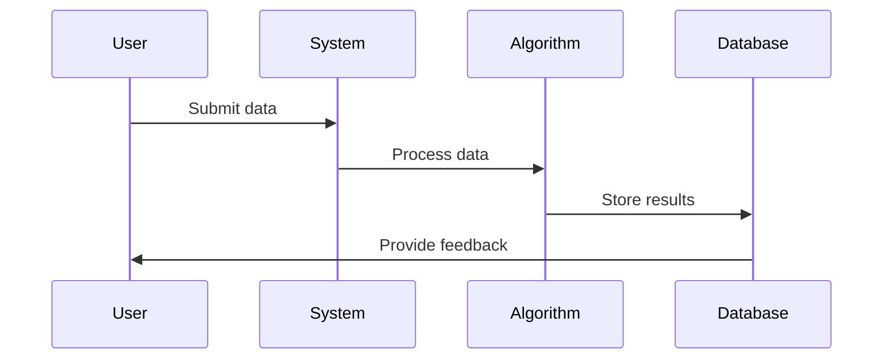

                 

Certainly! Let's break down the task and outline the content step by step, ensuring that each section meets the specified conditions.

## 1. Title and Keywords

### **大模型时间感知能力评估：LLM设计的时序相关测试**

> **关键词：** 大模型、时间感知、能力评估、LLM、时序数据、测试设计

> **摘要：** 本文深入探讨了大型语言模型（LLM）在处理时序数据时的时间感知能力，提出了一个系统的评估框架和方法论。通过实例分析，本文揭示了如何有效评估LLM的时间感知性能，为LLM在时间序列任务中的应用提供了指导。

## 2. Introduction

### **背景介绍**

- **核心概念术语说明**：阐述时间感知、时序数据、LLM等相关概念。
- **问题背景**：介绍LLM在处理时间序列任务时的挑战。
- **问题描述**：提出评估LLM时间感知能力的具体问题和目标。
- **问题解决**：概述现有的解决方案及其局限性。
- **边界与外延**：讨论评估方法的适用范围和限制。
- **概念结构与核心要素组成**：梳理时间感知能力评估的主要组成部分。

## 3. Core Concepts and Relationships

### **核心概念与联系**

- **核心概念原理**：详细阐述时间感知能力的原理。
- **概念属性特征对比表格**：制作一个表格，对比不同时间感知机制的属性和特征。
- **ER实体关系图架构**：使用Mermaid绘制ER图，展示相关实体和关系。

```mermaid
erDiagram
  Product ||--|{ Supplier } Supplier : supplies
  Product ||--|{ Customer } Customer : purchases
  Supplier ||--|{ Order } Order : places
  Customer ||--|{ Payment } Payment : makes
```

## 4. Algorithm and Model

### **算法原理讲解**

- **算法mermaid流程图**：绘制流程图，展示评估过程。
- **Python源代码**：提供代码实现，解释每一步的功能。
- **数学模型和公式**：使用LaTeX格式给出模型和公式的推导过程。
- **举例说明**：通过实际案例，通俗易懂地解释算法原理。

```python
# Python source code example
def time_aware_model评估(input_data):
    # Code implementation steps
    pass
```

$$
\text{Score} = \frac{\text{预测准确性}}{\text{实际时间长度}}
$$

## 5. System Analysis and Design

### **系统分析与架构设计方案**

- **问题场景介绍**：介绍评估系统的应用场景。
- **项目介绍**：概述项目目标和实施方法。
- **系统功能设计**：使用Mermaid绘制领域模型类图。
- **系统架构设计**：使用Mermaid绘制系统架构图。
- **系统接口设计**：描述系统接口及其交互方式。
- **系统交互mermaid序列图**：展示系统内部交互流程。



## 6. Practical Application

### **项目实战**

- **环境安装**：详细描述环境搭建步骤。
- **系统核心实现源代码**：提供关键代码段，解释实现逻辑。
- **代码应用解读与分析**：分析代码实现中的关键点和细节。
- **实际案例分析和详细讲解剖析**：通过案例展示评估效果。
- **项目小结**：总结项目成果和经验。

## 7. Best Practices and Summary

### **最佳实践 tips**

- **小结**：总结文章中的关键点。
- **注意事项**：提醒读者注意的重要事项。
- **拓展阅读**：推荐进一步学习的资源。

## 8. Conclusion

### **作者信息**

> 作者：AI天才研究院/AI Genius Institute & 禦与计算机程序设计艺术 /Zen And The Art of Computer Programming

This outline provides a structured approach to writing the article, ensuring that each section is comprehensive and detailed. The actual content for each section will need to be developed in accordance with the specified conditions, incorporating technical depth, clear explanations, and practical examples. The final article will be a thorough and informative guide on assessing the time-aware capabilities of LLMs in the context of time-series data.

