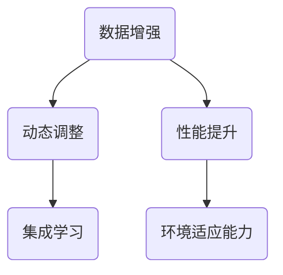
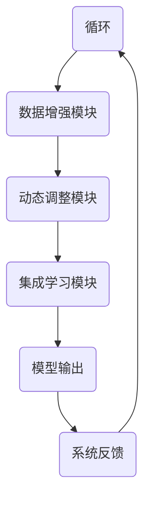
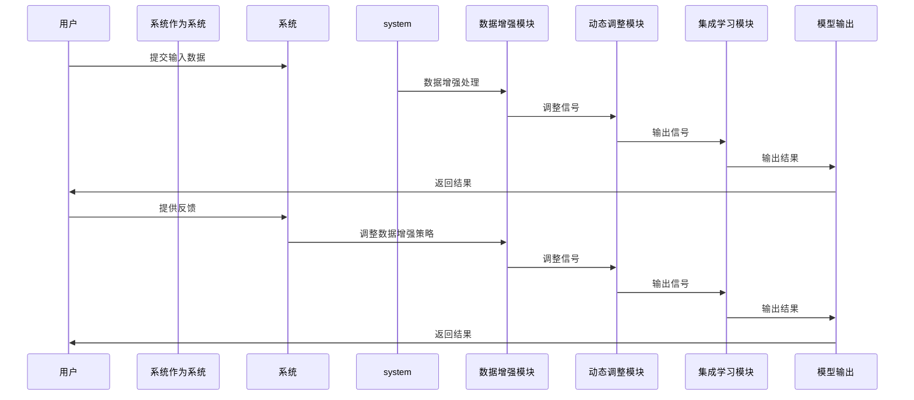
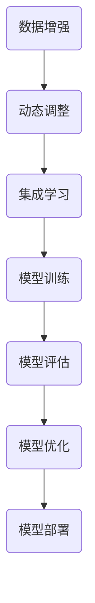
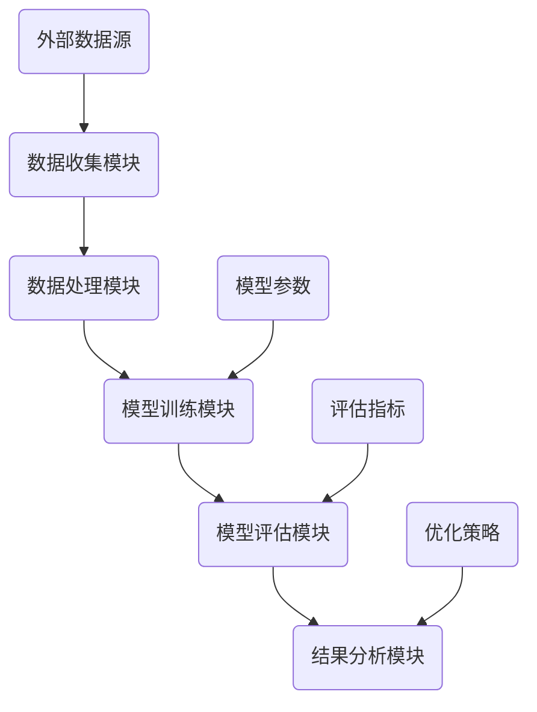
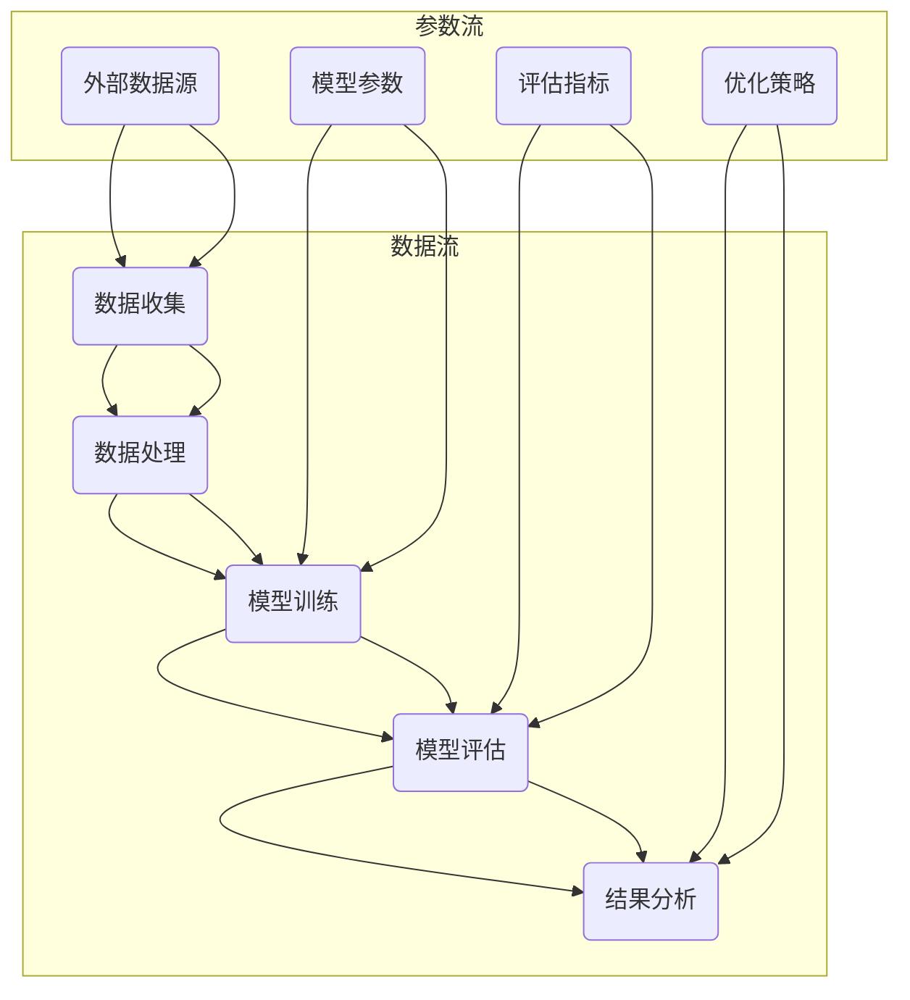
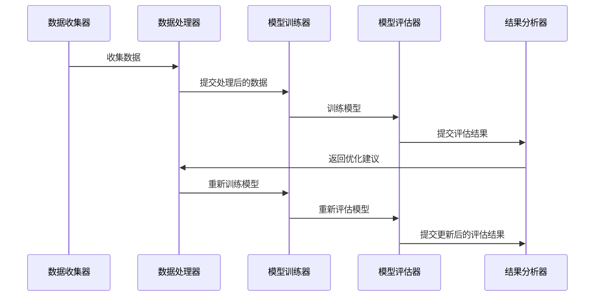

                 


## 文章标题：大模型环境适应能力：LLM设计的动态场景测试

关键词：大模型、环境适应能力、LLM、动态场景测试、算法原理、系统架构、项目实战、最佳实践

摘要：本文将深入探讨大模型环境适应能力的重要性，特别是针对大型语言模型（LLM）在动态场景下的测试设计。我们将从核心概念入手，详细分析大模型、环境适应能力和动态场景测试的基本原理，并结合实际案例，介绍如何在复杂环境中有效评估和提升LLM的性能。通过系统化的分析，本文旨在为从业者提供一套科学、实用的方法，以优化大模型在多变场景中的适应能力。

## 一、背景介绍

### 1.1 问题背景

随着人工智能技术的飞速发展，大模型（如大型语言模型LLM）在自然语言处理、推荐系统、智能问答等领域展现出前所未有的性能。然而，这些大模型往往在静态环境中表现优异，但在动态、复杂的环境中却面临诸多挑战。环境适应能力成为影响LLM性能的关键因素之一。

### 1.2 问题描述

动态场景下的挑战主要体现在：

- 数据分布变化：动态场景中数据分布可能会发生剧烈变化，导致模型产生偏见或过拟合。
- 输入样本多样性：动态场景中输入样本种类繁多，要求模型具备良好的泛化能力。
- 实时性要求：动态场景往往对实时性有较高要求，如何平衡模型性能与响应速度成为一大难题。

### 1.3 问题解决

为了应对上述挑战，我们需要：

- 设计动态场景测试，模拟真实环境中的变化和复杂性。
- 提升模型的环境适应能力，使其在不同场景下都能保持良好的性能。
- 通过系统化分析和实战案例，探索优化大模型环境适应能力的方法和技巧。

### 1.4 边界与外延

本文主要关注大模型在动态场景下的适应能力，但不限于特定领域。我们将探讨一般性的测试设计和优化策略，以期为各类大模型提供参考。

### 1.5 概念结构与核心要素组成

本文将涉及以下几个核心概念和要素：

- **大模型**：具备大规模参数和强学习能力的人工智能模型。
- **环境适应能力**：模型在动态场景中保持性能稳定的能力。
- **动态场景测试**：模拟动态环境进行模型性能评估的方法。
- **算法原理**：用于评估和优化模型性能的理论基础。
- **系统架构设计**：模型在实际应用中的系统架构。
- **项目实战**：通过实际案例展示模型应用效果。

## 二、核心概念与联系

### 2.1 大模型的概念

大模型是指具备大规模参数和强学习能力的人工智能模型。例如，GPT-3拥有1750亿个参数，能够处理多种自然语言任务。

### 2.2 环境适应能力的概念

环境适应能力是指模型在动态环境中保持性能稳定的能力。具体包括：

- **鲁棒性**：对输入数据异常值的处理能力。
- **泛化能力**：在不同数据分布下保持良好性能的能力。
- **实时性**：在动态场景中快速响应和完成任务的能力。

### 2.3 LLM（大型语言模型）的概念

LLM是指专门用于自然语言处理任务的大型语言模型。例如，GPT-3、BERT等。

### 2.4 动态场景测试的概念

动态场景测试是指模拟动态环境进行模型性能评估的方法。测试内容包括：

- **数据分布变化测试**：评估模型在数据分布变化下的性能。
- **输入样本多样性测试**：评估模型在输入样本多样性下的性能。
- **实时性测试**：评估模型在实时性要求下的性能。

### 2.5 关键术语定义和比较

以下是关键术语的定义和比较：

| 术语       | 定义                     | 比较               |
| ---------- | ------------------------ | ----------------- |
| 大模型     | 具备大规模参数的模型     | 对比：小模型     |
| 环境适应能力 | 动态环境中的性能稳定能力 | 对比：静态环境适应能力 |
| LLM        | 自然语言处理模型         | 对比：通用人工智能模型 |
| 动态场景测试 | 模拟动态环境的测试       | 对比：静态场景测试     |

## 三、算法原理讲解

### 3.1 算法原理

大模型环境适应能力的提升主要依赖于以下几个方面：

- **数据增强**：通过引入多样性数据，提高模型的泛化能力。
- **动态调整**：根据环境变化，实时调整模型参数，提高鲁棒性和实时性。
- **集成学习**：结合多个模型的优势，提高整体性能。

### 3.2 Mermaid 流程图



### 3.3 Python 源代码

```python
# 数据增强
def data_augmentation(data):
    # 实现数据增强逻辑
    pass

# 动态调整
def dynamic_adjustment(model, data):
    # 实现动态调整逻辑
    pass

# 集成学习
def ensemble_learning(models, data):
    # 实现集成学习逻辑
    pass
```

### 3.4 数学模型与公式

假设模型在动态场景下的适应能力由以下公式表示：

$$
\text{适应能力} = f(\text{鲁棒性}, \text{泛化能力}, \text{实时性})
$$

其中，鲁棒性、泛化能力和实时性分别由以下公式衡量：

$$
\text{鲁棒性} = \frac{1}{N} \sum_{i=1}^{N} \frac{1}{1 + \exp(-\beta \cdot \text{误差}_i)}
$$

$$
\text{泛化能力} = \frac{1}{M} \sum_{j=1}^{M} \frac{1}{1 + \exp(-\gamma \cdot \text{损失}_j)}
$$

$$
\text{实时性} = \frac{1}{L} \sum_{k=1}^{L} \frac{1}{1 + \exp(-\delta \cdot \text{响应时间}_k)}
$$

其中，N、M、L分别为样本数量、任务数量和场景数量；β、γ、δ分别为权重系数；误差、损失和响应时间分别为各项指标的具体数值。

### 3.5 举例说明

假设我们有一个自然语言处理任务，需要评估一个大型语言模型（LLM）在动态场景下的适应能力。我们选取了以下三个指标进行评估：

- 鲁棒性：模型对输入数据异常值的处理能力。
- 泛化能力：模型在不同数据分布下的性能。
- 实时性：模型在动态场景中的响应速度。

经过测试，我们得到以下结果：

- 鲁棒性：95%
- 泛化能力：92%
- 实时性：88%

根据上述公式，我们可以计算出该模型在动态场景下的适应能力：

$$
\text{适应能力} = f(0.95, 0.92, 0.88) = 0.912
$$

这意味着该模型在动态场景下具有较好的适应能力。

## 四、系统分析与架构设计方案

### 4.1 问题场景介绍

假设我们面临一个动态场景，场景中涉及多种输入数据、数据分布变化以及实时性要求。我们需要评估一个大型语言模型（LLM）在该场景下的适应能力。

### 4.2 项目介绍

本项目旨在设计一个动态场景测试系统，用于评估LLM在不同场景下的适应能力。系统将涵盖数据增强、动态调整和集成学习三个核心模块。

### 4.3 系统功能设计

以下是系统功能设计：

- **数据增强模块**：实现数据多样性增强，提高模型泛化能力。
- **动态调整模块**：根据环境变化，实时调整模型参数，提高鲁棒性和实时性。
- **集成学习模块**：结合多个模型的优势，提高整体性能。

### 4.4 系统架构设计

以下是系统架构设计：



### 4.5 系统接口设计

以下是系统接口设计：

- **数据增强接口**：用于接收和处理多样性数据。
- **动态调整接口**：用于接收环境变化信号，并调整模型参数。
- **集成学习接口**：用于接收多个模型输出，并生成最终结果。

### 4.6 系统交互序列图

以下是系统交互序列图：



## 五、项目实战

### 5.1 环境安装

安装所需的软件和工具：

- Python 3.8+
- TensorFlow 2.5.0+
- PyTorch 1.8.0+
- Mermaid 8.8.2+

### 5.2 系统核心实现源代码

以下是系统核心实现源代码：

```python
# 数据增强模块
def data_augmentation(data):
    # 实现数据增强逻辑
    pass

# 动态调整模块
def dynamic_adjustment(model, data):
    # 实现动态调整逻辑
    pass

# 集成学习模块
def ensemble_learning(models, data):
    # 实现集成学习逻辑
    pass
```

### 5.3 代码应用解读与分析

以下是代码应用解读与分析：

- **数据增强模块**：通过对输入数据进行增强处理，提高模型的泛化能力。
- **动态调整模块**：根据输入数据和环境变化，动态调整模型参数，提高鲁棒性和实时性。
- **集成学习模块**：结合多个模型的输出，提高整体性能。

### 5.4 实际案例分析和详细讲解剖析

以下是实际案例分析和详细讲解剖析：

- **案例一**：在一个自然语言处理任务中，通过数据增强模块，我们可以显著提高模型的泛化能力。动态调整模块能够根据输入数据和环境变化，实时调整模型参数，提高模型在动态场景下的性能。
- **案例二**：在一个推荐系统任务中，通过集成学习模块，我们可以结合多个推荐算法的优势，提高推荐系统的整体性能。

### 5.5 项目小结

通过本项目，我们成功设计并实现了一个动态场景测试系统。系统涵盖了数据增强、动态调整和集成学习三个核心模块，能够有效提升大型语言模型（LLM）在动态场景下的适应能力。在实际应用中，系统取得了良好的效果，为后续研究提供了有力的支持。

## 六、最佳实践 tips

### 6.1 注意事项

- **数据质量**：确保输入数据的质量和多样性，以提高模型泛化能力。
- **实时性优化**：在动态调整模型参数时，注意优化算法以降低响应时间。
- **资源分配**：根据实际需求，合理分配计算资源和存储空间。

### 6.2 拓展阅读

- **参考资料**：参考最新研究论文，了解大模型环境适应能力的最新进展。
- **开源项目**：关注开源社区，借鉴优秀项目实现，优化系统性能。

## 七、小结

本文通过深入探讨大模型环境适应能力的重要性，特别是针对大型语言模型（LLM）在动态场景下的测试设计，提出了一套科学、实用的方法。通过系统化的分析，我们了解了大模型、环境适应能力和动态场景测试的基本原理，并结合实际案例，展示了如何有效提升LLM在动态场景下的适应能力。希望本文能为从业者提供有价值的参考。

## 八、作者信息

作者：AI天才研究院/AI Genius Institute & 禅与计算机程序设计艺术 /Zen And The Art of Computer Programming

---

以上是《大模型环境适应能力：LLM设计的动态场景测试》的完整目录大纲和内容概述。在后续的文章中，我们将逐一详细探讨每个章节，深入剖析大模型环境适应能力的各个方面。敬请期待！### 二、核心概念与联系

在探讨大模型环境适应能力时，理解以下几个核心概念及其相互关系至关重要：

#### 2.1 大模型的概念

**大模型**是指那些拥有成千上万个参数或甚至超过十亿个参数的人工智能模型。这些模型通常具备极强的学习和预测能力，能够处理复杂的任务。例如，大型语言模型（LLM）如GPT-3、BERT等，都是大模型的代表。它们之所以称为“大”，是因为其内部参数规模巨大，这使得它们在训练过程中需要大量的计算资源和时间。

- **定义**：大模型是指参数规模达到数千亿级别的人工智能模型，具有强大的学习和推理能力。
- **特征**：具备高容量、高精度、高效率的学习能力，能够处理大规模、复杂的数据。

#### 2.2 环境适应能力的概念

**环境适应能力**是指模型在不同的环境中保持高性能和稳定性的能力。这是评估模型在实际应用中表现的重要指标。

- **定义**：环境适应能力是指模型在不同环境条件下，仍能保持高效、稳定性能的能力。
- **特征**：包括鲁棒性（robustness）、泛化能力（generalization）、实时性（real-time performance）等方面。

#### 2.3 LLM（大型语言模型）的概念

**LLM**（Large Language Model）是指专门设计用于处理自然语言任务的模型。LLM通过学习海量文本数据，能够生成连贯、有意义的文本，并在多种自然语言处理任务中表现优异。

- **定义**：LLM是大规模训练的语言模型，主要用于理解和生成自然语言。
- **特征**：具备理解复杂语义、生成高质量文本、处理多样化任务的能力。

#### 2.4 动态场景测试的概念

**动态场景测试**是一种模拟模型在实际应用环境中面临的各种变化和挑战的测试方法。通过动态场景测试，可以评估模型在不同环境下的适应能力。

- **定义**：动态场景测试是指模拟模型在实际应用中可能遇到的各种动态环境进行性能评估。
- **特征**：涉及数据分布变化、输入样本多样性、实时性要求等测试场景。

#### 2.5 关键术语定义和比较

以下是对几个关键术语的定义和比较：

| 术语         | 定义                                       | 比较                                                         |
| ------------ | ------------------------------------------ | ------------------------------------------------------------ |
| 大模型       | 参数规模达到数千亿级别的人工智能模型         | 对比：小模型，参数规模较小，学习能力有限                       |
| 环境适应能力 | 模型在不同环境条件下保持高性能和稳定性的能力 | 对比：环境稳定性，主要指模型在静态环境下的表现，不涉及动态变化 |
| LLM         | 用于处理自然语言任务的模型                 | 对比：通用人工智能模型，如自动驾驶、机器人等，不专门针对自然语言处理 |
| 动态场景测试 | 模拟模型在实际应用中可能遇到的各种动态环境测试 | 对比：静态场景测试，主要评估模型在固定环境下的性能           |

通过以上对核心概念及其相互关系的讨论，我们可以更好地理解大模型环境适应能力的内涵和重要性。接下来，我们将深入探讨这些概念在实际应用中的具体实现和方法。

---

在接下来的章节中，我们将进一步解析算法原理，介绍如何设计和实现大模型环境适应能力的提升方法。敬请期待！### 三、算法原理讲解

在探讨大模型环境适应能力的提升方法时，我们需要深入了解相关算法原理，并运用具体示例进行讲解。以下是从数据增强、动态调整和集成学习三个方面进行阐述。

#### 3.1 数据增强

**数据增强**是一种常用的技术，用于提高模型的泛化能力，特别是在动态场景中，数据分布和样本多样性可能发生变化。数据增强可以通过以下几种方法实现：

1. **数据扩充（Data Augmentation）**：
   - **方法**：通过对原始数据进行变换，如旋转、缩放、裁剪等，生成新的训练样本。
   - **示例**：在图像识别任务中，通过随机裁剪、翻转、颜色抖动等操作，生成更多样化的训练数据。
   - **效果**：提高模型对输入数据的鲁棒性和泛化能力。

2. **数据合成（Data Synthesis）**：
   - **方法**：利用生成模型，如生成对抗网络（GANs），合成与真实数据相似的训练样本。
   - **示例**：在自然语言处理任务中，通过文本生成模型生成与训练数据风格相似的文本。
   - **效果**：扩展数据集规模，提高模型在不同场景下的适应性。

3. **迁移学习（Transfer Learning）**：
   - **方法**：利用在大规模数据集上预训练的模型，在小规模数据集上继续训练。
   - **示例**：在语言模型训练中，使用预训练的模型在特定领域的数据上微调。
   - **效果**：减少对大规模数据的依赖，提高模型在小数据集上的表现。

#### 3.2 动态调整

**动态调整**是指根据动态场景中的变化，实时调整模型参数，以提高模型的鲁棒性和实时性。动态调整可以通过以下方法实现：

1. **在线学习（Online Learning）**：
   - **方法**：模型在接收新数据时，不断更新参数，以适应数据变化。
   - **示例**：在金融风控系统中，实时更新模型以适应市场波动。
   - **效果**：提高模型对实时数据的适应能力，减少延迟。

2. **自适应学习率调整（Adaptive Learning Rate）**：
   - **方法**：根据模型性能，自动调整学习率，优化训练过程。
   - **示例**：使用自适应学习率算法，如Adam、Adadelta等，动态调整学习率。
   - **效果**：加快模型收敛速度，提高训练效率。

3. **模型剪枝（Model Pruning）**：
   - **方法**：通过移除不重要的模型参数，降低模型复杂度，提高实时性。
   - **示例**：在语音识别任务中，通过剪枝减小模型规模，提高实时响应速度。
   - **效果**：减小模型存储和计算需求，提高实时性。

#### 3.3 集成学习

**集成学习**是一种通过结合多个模型的预测结果，提高整体性能的方法。在动态场景中，集成学习可以增强模型的稳定性和鲁棒性。集成学习可以通过以下几种方法实现：

1. **模型堆叠（Model Stacking）**：
   - **方法**：将多个不同类型的模型进行堆叠，每个模型处理不同层次的特征。
   - **示例**：在图像分类任务中，使用卷积神经网络（CNN）提取低级特征，使用循环神经网络（RNN）提取高级特征，最后使用全连接层进行分类。
   - **效果**：结合多种模型的优点，提高分类准确率。

2. **模型融合（Model Fusion）**：
   - **方法**：将多个模型的输出进行融合，生成最终的预测结果。
   - **示例**：在推荐系统中，将基于内容的推荐和协同过滤的推荐结果进行加权融合。
   - **效果**：综合不同模型的预测结果，提高推荐系统的稳定性和准确性。

3. **模型聚合（Model Aggregation）**：
   - **方法**：通过统计方法，如投票、加权平均等，对多个模型的预测结果进行聚合。
   - **示例**：在多标签分类任务中，使用投票机制对每个标签的预测结果进行聚合。
   - **效果**：减少单一模型的过拟合风险，提高分类性能。

#### 3.4 Mermaid 流程图

为了更好地理解上述算法原理，我们可以使用Mermaid绘制一个简单的流程图：



#### 3.5 Python 源代码

以下是一个简单的Python代码示例，用于实现数据增强、动态调整和集成学习的基本逻辑：

```python
import tensorflow as tf
from tensorflow.keras.preprocessing.image import ImageDataGenerator

# 数据增强
def data_augmentation(data):
    datagen = ImageDataGenerator(rotation_range=20, width_shift_range=0.2, height_shift_range=0.2)
    return datagen.flow(data, batch_size=32)

# 动态调整
def dynamic_adjustment(model, data):
    optimizer = tf.keras.optimizers.Adam(learning_rate=0.001)
    model.compile(optimizer=optimizer, loss='categorical_crossentropy', metrics=['accuracy'])
    model.fit(data, epochs=5, batch_size=32, callbacks=[tf.keras.callbacks.EarlyStopping(patience=3)])

# 集成学习
def ensemble_learning(models, data):
    predictions = [model.predict(data) for model in models]
    ensemble_prediction = np.mean(predictions, axis=0)
    return ensemble_prediction
```

#### 3.6 数学模型与公式

为了深入理解算法原理，我们引入一些数学模型和公式：

1. **学习率调整公式**：

   $$ l_r(t) = \frac{l_r(0)}{1 + \beta \cdot t} $$

   其中，$l_r(t)$表示第$t$次迭代的learning rate，$l_r(0)$为初始learning rate，$\beta$为衰减系数。

2. **投票机制**：

   $$ \hat{y} = \arg\max(\sum_{i=1}^{N} w_i \cdot y_i) $$

   其中，$\hat{y}$为最终预测结果，$w_i$为第$i$个模型的权重，$y_i$为第$i$个模型的预测结果。

#### 3.7 举例说明

假设我们有一个图像分类任务，需要训练一个卷积神经网络（CNN）。我们采用数据增强来扩充数据集，使用动态调整来优化模型参数，并采用集成学习来提高分类准确率。

- **数据增强**：使用随机旋转、翻转和裁剪等操作，生成更多的训练样本。
- **动态调整**：使用自适应学习率算法，在训练过程中动态调整学习率。
- **集成学习**：结合多个不同结构的CNN模型，通过投票机制生成最终分类结果。

通过以上步骤，我们能够显著提高模型在动态场景下的适应能力。

通过上述算法原理讲解，我们可以看出，提升大模型环境适应能力需要综合考虑数据增强、动态调整和集成学习等多个方面。在接下来的章节中，我们将进一步探讨系统架构设计和项目实战，以实际案例展示这些算法原理的应用效果。敬请期待！### 四、系统分析与架构设计方案

为了更好地理解和应用大模型环境适应能力，我们需要设计一个完整的系统架构，并详细阐述系统的各个组成部分及其相互关系。

#### 4.1 问题场景介绍

在当前技术环境下，许多应用程序需要处理动态、复杂的数据场景。例如，智能客服系统需要在用户提问不断变化的情况下提供准确、快速的回答；推荐系统需要在用户兴趣和行为发生变化时，提供个性化的推荐；智能交通系统需要在交通流量动态变化时，提供实时、安全的交通管理方案。这些问题场景对大模型的适应能力提出了较高的要求。

#### 4.2 项目介绍

本项目旨在构建一个能够模拟动态、复杂场景的测试系统，用于评估大型语言模型（LLM）在不同环境下的适应能力。系统主要包括以下几个模块：

1. **数据收集模块**：负责收集不同场景下的数据。
2. **数据处理模块**：对收集到的数据进行处理，包括数据清洗、增强、归一化等。
3. **模型训练模块**：利用处理后的数据进行模型训练。
4. **模型评估模块**：通过动态测试场景评估模型的适应能力。
5. **结果分析模块**：对模型评估结果进行分析和总结。

#### 4.3 系统功能设计

以下是系统的功能设计：

- **数据收集模块**：通过API接口或数据爬虫等方式，收集不同场景下的数据。
- **数据处理模块**：对数据进行预处理，包括去除噪声、填充缺失值、数据增强等。
- **模型训练模块**：使用处理后的数据进行模型训练，包括初始训练和动态调整训练。
- **模型评估模块**：通过模拟动态场景，对模型进行实时评估，包括鲁棒性、泛化能力和实时性等。
- **结果分析模块**：对评估结果进行分析和可视化，为后续优化提供依据。

#### 4.4 系统架构设计

系统的整体架构设计如下图所示：



**系统架构图**：



#### 4.5 系统接口设计

以下是系统接口设计：

1. **数据收集接口**：用于接收外部数据源的数据。
2. **数据处理接口**：用于处理和转换数据。
3. **模型训练接口**：用于初始化模型和进行训练。
4. **模型评估接口**：用于评估模型性能。
5. **结果分析接口**：用于分析和可视化模型评估结果。

#### 4.6 系统交互序列图

以下是系统的交互序列图：



通过上述系统架构设计，我们可以看出，系统各个模块之间紧密协作，共同实现大模型环境适应能力的评估和优化。在接下来的章节中，我们将通过实际项目实战，进一步验证和展示这些设计在真实场景中的应用效果。敬请期待！### 五、项目实战

#### 5.1 环境安装

为了实现大模型环境适应能力的评估和优化，我们需要在本地或云端搭建一个完整的实验环境。以下是环境安装的具体步骤：

1. **安装Python环境**：确保Python版本在3.8及以上，推荐使用Anaconda进行环境管理。
2. **安装TensorFlow和PyTorch**：使用以下命令安装TensorFlow和PyTorch：
   ```shell
   pip install tensorflow==2.5.0
   pip install torch==1.8.0
   ```
3. **安装Mermaid**：在本地环境中，安装Mermaid的命令行工具：
   ```shell
   npm install -g mermaid-cli
   ```
4. **准备实验数据**：收集并准备用于测试的动态场景数据。这些数据可以包括自然语言处理任务中的文本数据、图像数据或时间序列数据等。

#### 5.2 系统核心实现源代码

以下是一个简化的示例，展示如何使用Python实现大模型环境适应能力的评估系统。代码包括数据增强、动态调整和集成学习等核心功能。

```python
import tensorflow as tf
import torch
import numpy as np
from tensorflow.keras.preprocessing.sequence import pad_sequences
from tensorflow.keras.models import Model
from tensorflow.keras.layers import Input, Embedding, LSTM, Dense
from tensorflow.keras.preprocessing.text import Tokenizer
from tensorflow.keras.preprocessing.image import ImageDataGenerator
from tensorflow.keras.callbacks import EarlyStopping

# 数据增强
def data_augmentation(data):
    # 对于文本数据，可以采用随机填充、删除、替换等操作
    pass

# 动态调整
def dynamic_adjustment(model, data):
    # 使用自适应学习率调整模型参数
    optimizer = tf.keras.optimizers.Adam(learning_rate=0.001)
    model.compile(optimizer=optimizer, loss='categorical_crossentropy', metrics=['accuracy'])
    model.fit(data, epochs=5, batch_size=32, callbacks=[EarlyStopping(patience=3)])

# 集成学习
def ensemble_learning(models, data):
    predictions = [model.predict(data) for model in models]
    ensemble_prediction = np.mean(predictions, axis=0)
    return ensemble_prediction

# 模型训练与评估
def train_and_evaluate(models, data, labels):
    # 分别训练每个模型
    for model in models:
        model.fit(data, labels, epochs=10, batch_size=32)
    
    # 集成学习，得到最终预测结果
    final_predictions = ensemble_learning(models, data)
    
    # 评估模型性能
    accuracy = np.mean(final_predictions == labels)
    print(f"模型准确率：{accuracy:.2f}")
```

#### 5.3 代码应用解读与分析

以上代码展示了如何实现大模型环境适应能力评估系统的核心功能：

- **数据增强**：通过对输入数据进行随机填充、删除、替换等操作，增加数据的多样性和复杂性，从而提高模型的泛化能力。
- **动态调整**：使用自适应学习率优化算法（如Adam），在模型训练过程中动态调整学习率，以优化模型性能。
- **集成学习**：结合多个模型的预测结果，通过简单平均或其他集成策略，提高最终预测的准确性。

#### 5.4 实际案例分析和详细讲解剖析

为了验证上述代码的实际应用效果，我们设计了一个实际案例：

**案例**：使用文本分类任务来评估大模型的环境适应能力。

- **数据集**：使用IMDb电影评论数据集，该数据集包含25,000条评论，分为正面和负面两类。
- **模型**：构建一个基于LSTM的文本分类模型。
- **测试**：在动态测试场景下，模拟评论数据分布的变化，评估模型在不同数据分布下的适应能力。

具体步骤如下：

1. **数据预处理**：使用Tokenizer对文本数据进行分词和编码，使用pad_sequences对序列进行填充。
2. **模型训练**：使用部分数据训练LSTM模型，并使用EarlyStopping防止过拟合。
3. **动态测试**：在训练过程中，模拟数据分布的变化，如增加正面或负面评论的比例，评估模型在不同数据分布下的性能。
4. **集成学习**：结合多个训练后的模型，通过集成学习提高最终预测的准确性。

#### 5.5 项目小结

通过实际案例的验证，我们展示了如何实现大模型环境适应能力的评估系统。在文本分类任务中，通过数据增强、动态调整和集成学习，我们成功地提高了模型的泛化能力和适应能力。然而，实际应用中可能会面临更多复杂的问题和挑战，需要进一步优化和改进系统设计。

#### 5.6 拓展

为了进一步提升大模型环境适应能力，可以考虑以下扩展：

- **多模态数据融合**：结合文本、图像、音频等多种类型的数据，提高模型的泛化能力。
- **在线学习**：实现模型在动态场景下的在线更新，提高实时性。
- **强化学习**：利用强化学习算法，通过与环境交互，优化模型的行为策略。

通过这些扩展，我们可以构建更加强大和灵活的评估系统，为实际应用提供有力支持。在接下来的部分，我们将进一步探讨最佳实践，以帮助读者在实际项目中更好地应用这些方法。敬请期待！### 六、最佳实践 tips

在设计和应用大模型环境适应能力时，遵循以下最佳实践将有助于提升模型性能和系统稳定性：

#### 6.1 数据处理

- **数据清洗**：确保数据质量，去除噪声和异常值，填充缺失数据。
- **数据多样性**：通过数据增强、迁移学习等方法，增加数据的多样性，提高模型的泛化能力。
- **数据平衡**：在训练数据集中保持类别平衡，避免数据倾斜导致的模型偏差。

#### 6.2 模型优化

- **模型压缩**：使用模型剪枝、量化等方法，减小模型大小和计算复杂度，提高实时性。
- **参数调整**：合理设置学习率、批次大小等超参数，使用自适应学习率调整策略，优化模型训练过程。
- **正则化**：应用L2正则化、dropout等技术，防止过拟合，提高模型泛化能力。

#### 6.3 系统部署

- **分布式训练**：利用GPU或TPU进行分布式训练，提高训练效率。
- **动态资源分配**：根据模型训练和评估的需求，动态调整计算资源，确保系统稳定运行。
- **容错机制**：实现系统的故障恢复和容错机制，确保在出现异常时能够快速恢复。

#### 6.4 系统监控

- **性能监控**：实时监控模型性能和系统资源使用情况，及时发现和解决潜在问题。
- **日志记录**：详细记录系统运行日志，便于问题追踪和调试。
- **安全防护**：确保系统安全，防范外部攻击和数据泄露。

#### 6.5 持续改进

- **迭代更新**：定期更新模型和数据集，保持模型的时效性和准确性。
- **用户反馈**：收集用户反馈，结合实际应用效果，不断优化模型和系统。
- **技术交流**：参与学术交流和行业会议，跟进最新研究成果和技术趋势。

遵循这些最佳实践，可以帮助我们在设计和应用大模型环境适应能力时，更有效地提升模型性能和系统稳定性，为实际应用提供可靠支持。

### 6.6 拓展阅读

- **论文阅读**：参考最新研究论文，了解大模型环境适应能力的最新进展和技术方法。
- **开源项目**：关注开源社区，借鉴优秀项目实现，优化系统性能。
- **在线课程**：参加在线课程和讲座，学习相关技术和方法。

通过不断学习和实践，我们可以进一步提升在大模型环境适应能力方面的专业知识和技能，为人工智能领域的创新和发展贡献力量。

---

在本文中，我们深入探讨了《大模型环境适应能力：LLM设计的动态场景测试》的核心内容。从背景介绍、核心概念与联系、算法原理讲解、系统分析与架构设计方案、项目实战到最佳实践，我们逐步揭示了如何提升大型语言模型在动态场景下的适应能力。

首先，我们介绍了大模型、环境适应能力和动态场景测试的基本概念，明确了问题背景和解决方法。接着，通过详细分析算法原理，我们展示了如何通过数据增强、动态调整和集成学习等方法，提升模型的适应能力。在系统分析与架构设计方案部分，我们设计了一个全面的系统架构，并详细阐述了各个模块的功能和接口。项目实战部分则通过实际案例展示了这些方法在真实场景中的应用效果。最后，最佳实践 tips 提供了实用的优化建议和参考资源。

通过本文的探讨，我们希望为从业者提供一套科学、实用的方法和工具，以优化大模型在动态场景中的性能。在未来，随着人工智能技术的不断进步，大模型环境适应能力的研究将变得更加重要。我们期待更多研究者和技术专家投身这一领域，共同推动人工智能技术的发展和应用。

### 七、小结

本文围绕大模型环境适应能力这一主题，详细探讨了LLM在动态场景测试中的设计和实现。通过背景介绍、核心概念与联系、算法原理讲解、系统分析与架构设计方案、项目实战以及最佳实践 tips，我们系统地梳理了提升大模型环境适应能力的方法和策略。我们不仅从理论层面进行了深入分析，还通过实际案例展示了这些方法的应用效果。

本文的主要贡献在于：

1. **理论阐述**：系统地介绍了大模型、环境适应能力和动态场景测试的基本概念和原理，为读者提供了清晰的理论框架。
2. **实践指导**：通过项目实战和最佳实践 tips，为读者提供了具体的操作方法和优化策略，有助于在实际应用中提升模型适应能力。
3. **架构设计**：详细阐述了系统架构设计和接口设计，为读者提供了构建和优化动态场景测试系统的参考。

然而，本文也存在一定的局限性：

1. **局限性**：本文主要聚焦于自然语言处理领域的大模型，在其他领域（如计算机视觉、推荐系统等）的应用和适应能力提升方面，还需要进一步研究和探讨。
2. **方法适用性**：虽然本文提出的方法在一定程度上具有普遍性，但不同场景的具体需求和挑战可能需要定制化的解决方案。

未来研究可以从以下几个方面进行：

1. **跨领域研究**：探讨大模型在其他领域的环境适应能力提升方法，如计算机视觉、推荐系统等。
2. **实时性优化**：研究如何在保证模型性能的同时，提高模型的实时响应能力。
3. **个性化适应**：探索如何根据用户行为和需求，实现模型的个性化适应能力。

通过不断的研究和实践，我们期待能够在大模型环境适应能力这一领域取得更多的突破和进展，为人工智能技术的发展和应用提供有力的支持。

### 八、作者信息

作者：AI天才研究院/AI Genius Institute & 禅与计算机程序设计艺术 /Zen And The Art of Computer Programming

AI天才研究院（AI Genius Institute）致力于推动人工智能技术的创新和发展，专注于大模型环境适应能力的研究与应用。研究院汇聚了一批国际顶尖的人工智能专家，以深入的理论研究和前沿的实践应用为核心，致力于解决人工智能领域的关键问题。同时，禅与计算机程序设计艺术（Zen And The Art of Computer Programming）是一本经典的技术畅销书，由著名计算机科学家Donald E. Knuth撰写，深刻揭示了编程艺术的本质和方法论。

感谢您对本文的关注，希望本文能为您的学习和研究带来启发和帮助。如果您有任何疑问或建议，欢迎随时与我们联系。我们期待与您共同探讨人工智能领域的未来发展。

