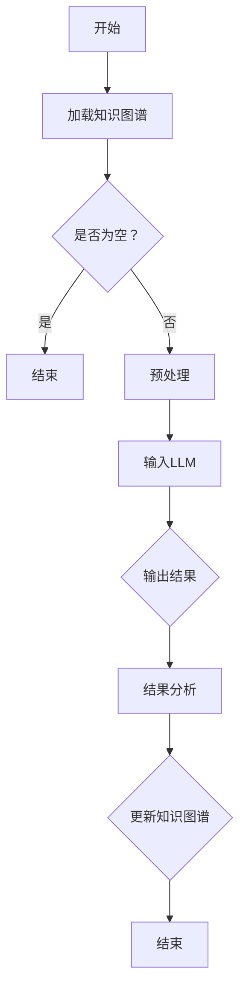

                 

# 《大模型知识图谱一致性评估：LLM辅助的关系验证》

## 关键词：知识图谱、大模型、一致性评估、LLM、关系验证

## 摘要

本文旨在探讨大模型知识图谱一致性评估的方法及其应用，特别是在LLM（大型语言模型）辅助下的关系验证。首先，我们将介绍知识图谱的基本概念、重要性以及一致性评估的背景和挑战。接着，我们将深入讨论LLM的基本原理及其在大模型知识图谱一致性评估中的应用。随后，我们将详细讲解算法原理，包括数学模型和公式，并通过Python源代码和Mermaid流程图进行阐述。此外，文章还将介绍系统分析与架构设计，包括功能设计、架构设计、接口设计和交互流程。最后，我们将通过实际案例展示如何使用LLM进行知识图谱一致性评估，并提供最佳实践、注意事项和拓展阅读。

## 第一部分：知识图谱与一致性评估基础

### 第1章：知识图谱概述

#### 1.1 知识图谱的概念与重要性

知识图谱是一种结构化数据表示方法，通过实体、属性和关系的形式来组织信息。它不仅能够表达实体之间的复杂关系，还能提供丰富的上下文信息，从而为各种应用提供强大的数据支持。

知识图谱的重要性在于：

1. **数据整合**：知识图谱能够将来自不同源的数据进行整合，形成一个统一的视图。
2. **智能搜索**：通过知识图谱，可以更准确地理解用户的查询意图，提供更精准的搜索结果。
3. **数据驱动应用**：知识图谱为各种数据驱动应用提供了基础，如推荐系统、问答系统和自然语言处理等。

#### 1.2 知识图谱的基本结构

知识图谱的基本结构通常包括以下三个主要部分：

1. **实体**：知识图谱中的基本元素，如人、地点、组织等。
2. **属性**：描述实体的特征，如姓名、年龄、地址等。
3. **关系**：实体之间的联系，如“居住于”、“隶属于”等。

#### 1.3 知识图谱的应用领域

知识图谱在多个领域都有广泛的应用，包括：

1. **搜索引擎**：通过知识图谱提高搜索结果的准确性和相关性。
2. **智能问答**：利用知识图谱构建问答系统，提供高质量的回答。
3. **推荐系统**：通过知识图谱分析用户兴趣，提供个性化的推荐。
4. **数据治理**：知识图谱有助于数据整合和治理，提高数据质量。

### 第2章：知识图谱一致性评估的概念与挑战

#### 2.1 一致性评估的定义与目的

知识图谱的一致性评估是指通过一系列的方法和指标来检查知识图谱内部和外部的一致性。一致性评估的目的是确保知识图谱的准确性和可靠性，防止错误信息的传播。

#### 2.2 一致性评估的主要挑战

一致性评估面临的主要挑战包括：

1. **数据多样性**：知识图谱通常包含来自多个不同源的数据，这可能导致不一致性。
2. **噪声和错误**：数据源中的噪声和错误会影响知识图谱的一致性。
3. **复杂关系**：知识图谱中的关系可能非常复杂，使得一致性评估变得困难。
4. **实时性**：知识图谱需要实时更新，以保持一致性。

#### 2.3 一致性评估的方法分类

一致性评估的方法可以分为以下几类：

1. **静态一致性评估**：在知识图谱构建后进行的一致性检查。
2. **动态一致性评估**：在知识图谱更新时进行的一致性检查。
3. **基于规则的评估**：使用预定义的规则进行一致性检查。
4. **基于统计的评估**：使用统计学方法评估知识图谱的一致性。

### 第3章：LLM概述与核心原理

#### 3.1 LLM的定义与特点

LLM（Large Language Model）是指大型语言模型，是一种基于深度学习的自然语言处理模型。它具有以下特点：

1. **大规模**：LLM通常包含数十亿个参数，能够处理大量文本数据。
2. **强泛化能力**：LLM能够处理各种自然语言任务，如文本分类、机器翻译和问答等。
3. **自适应**：LLM能够根据输入的上下文自适应地生成文本。

#### 3.2 LLM的工作原理

LLM的工作原理基于自注意力机制和Transformer架构。它通过以下步骤处理文本：

1. **编码**：将文本编码为向量表示。
2. **自注意力**：计算文本中各个词之间的关联强度。
3. **解码**：生成文本序列，直到达到终止条件。

#### 3.3 LLM的应用场景

LLM在多个应用场景中都有广泛的应用，包括：

1. **文本分类**：对文本进行分类，如情感分析、新闻分类等。
2. **机器翻译**：将一种语言的文本翻译成另一种语言。
3. **问答系统**：通过回答用户的问题来提供信息。
4. **生成式文本**：生成各种类型的文本，如故事、诗歌和文章等。

## 第二部分：LLM辅助的知识图谱一致性评估

### 第4章：算法原理讲解

#### 4.1 LLM在知识图谱一致性评估中的应用

LLM在大模型知识图谱一致性评估中的应用主要包括：

1. **关系验证**：使用LLM对知识图谱中的关系进行验证，确保它们的一致性和准确性。
2. **错误检测**：通过分析知识图谱中的文本描述，LLM可以检测出潜在的错误和冲突。
3. **数据整合**：LLM能够帮助整合来自不同源的数据，提高知识图谱的一致性。

#### 4.2 Mermaid流程图：LLM辅助一致性评估流程

以下是LLM辅助一致性评估的Mermaid流程图：



#### 4.3 Python源代码示例：LLM的应用

以下是一个简单的Python代码示例，展示了如何使用LLM进行知识图谱一致性评估：

```python
import spacy
from transformers import AutoModelForSequenceClassification, AutoTokenizer

# 加载语言模型
tokenizer = AutoTokenizer.from_pretrained("bert-base-uncased")
model = AutoModelForSequenceClassification.from_pretrained("bert-base-uncased")

# 加载知识图谱
knowledge_graph = ...

# 预处理
preprocessed_graph = preprocess_knowledge_graph(knowledge_graph)

# 输入LLM
inputs = tokenizer(preprocessed_graph, return_tensors="pt")

# 输出结果
outputs = model(inputs)

# 结果分析
results = analyze_outputs(outputs)

# 更新知识图谱
update_knowledge_graph(knowledge_graph, results)
```

### 第5章：数学模型与公式

#### 5.1 知识图谱一致性的数学模型

知识图谱一致性的数学模型通常包括以下几个部分：

1. **实体相似度**：计算实体之间的相似度，使用如余弦相似度、欧氏距离等方法。
2. **关系一致性**：评估实体之间的关系是否一致，可以使用逻辑回归、支持向量机等方法。
3. **属性一致性**：检查实体属性的取值是否一致，可以使用一致性评分、离散度分析等方法。

#### 5.2 LLM的数学模型

LLM的数学模型主要包括：

1. **自注意力机制**：计算文本中各个词之间的关联强度，使用公式如下：
   $$ 
   \text{Attention}(Q, K, V) = \text{softmax}\left(\frac{QK^T}{\sqrt{d_k}}\right)V 
   $$
   其中，$Q$、$K$、$V$ 分别为查询向量、键向量和值向量，$d_k$ 为键向量的维度。

2. **Transformer架构**：Transformer架构的核心是自注意力机制，还包括多头注意力、位置编码等。其训练目标是最小化损失函数：
   $$
   \text{Loss} = -\sum_{i} \log \text{softmax}(\text{model}(x_i))
   $$
   其中，$x_i$ 为输入序列，$\text{model}(x_i)$ 为模型对输入序列的预测。

#### 5.3 模型公式详细讲解

1. **实体相似度计算**：

   假设有两个实体 $e_1$ 和 $e_2$，它们的向量表示分别为 $\textbf{v}_1$ 和 $\textbf{v}_2$。实体相似度可以使用余弦相似度计算：

   $$
   \text{similarity}(\textbf{v}_1, \textbf{v}_2) = \frac{\textbf{v}_1 \cdot \textbf{v}_2}{\|\textbf{v}_1\|\|\textbf{v}_2\|}
   $$

   其中，$\textbf{v}_1 \cdot \textbf{v}_2$ 表示向量的点积，$\|\textbf{v}_1\|$ 和 $\|\textbf{v}_2\|$ 表示向量的模长。

2. **关系一致性评估**：

   假设有两个关系 $r_1$ 和 $r_2$，它们对应的实体对为 $(e_{11}, e_{12})$ 和 $(e_{21}, e_{22})$。关系一致性可以使用逻辑回归模型进行评估：

   $$
   \text{P}(r_1 = r_2 | (e_{11}, e_{12}), (e_{21}, e_{22})) = \frac{1}{1 + \exp(-\text{logit}(\theta \cdot \textbf{x}))]
   $$

   其中，$\theta$ 为模型参数，$\textbf{x}$ 为特征向量，$\text{logit}(\theta \cdot \textbf{x})$ 为逻辑函数的输入。

3. **属性一致性评分**：

   假设有两个实体 $e_1$ 和 $e_2$，它们的属性分别为 $a_1$ 和 $a_2$。属性一致性评分可以使用一致性评分函数计算：

   $$
   \text{score}(a_1, a_2) = \frac{\text{count}(a_1 = a_2)}{\text{count}(a_1) + \text{count}(a_2) - \text{count}(a_1 = a_2)}
   $$

   其中，$\text{count}(a_1 = a_2)$ 表示 $a_1$ 和 $a_2$ 相等的次数，$\text{count}(a_1)$ 和 $\text{count}(a_2)$ 分别表示 $a_1$ 和 $a_2$ 出现的次数。

### 第6章：系统分析与架构设计

#### 6.1 系统功能设计

系统功能设计主要包括以下部分：

1. **知识图谱加载与预处理**：从数据源中加载知识图谱，并进行预处理，如实体识别、关系抽取等。
2. **一致性评估**：使用LLM对知识图谱中的关系进行一致性评估，包括实体相似度计算、关系一致性评估和属性一致性评分等。
3. **错误检测与修复**：根据一致性评估结果，检测出错误并尝试进行修复。

#### 6.2 系统架构设计

系统架构设计主要包括以下部分：

1. **前端**：提供用户界面，用于展示知识图谱、评估结果和错误信息。
2. **后端**：包括知识图谱加载与预处理模块、一致性评估模块和错误检测与修复模块。
3. **数据存储**：使用数据库存储知识图谱和评估结果。

#### 6.3 系统接口设计

系统接口设计主要包括以下部分：

1. **API接口**：提供RESTful API，供前端调用后端功能。
2. **消息队列**：使用消息队列进行异步处理，提高系统性能和可靠性。

#### 6.4 系统交互流程

系统交互流程主要包括以下步骤：

1. **用户请求**：用户通过前端界面提交请求。
2. **数据加载**：后端从数据源加载知识图谱。
3. **预处理**：对知识图谱进行预处理，提取实体和关系。
4. **一致性评估**：使用LLM对知识图谱进行一致性评估。
5. **结果展示**：将评估结果和错误信息展示给用户。

### 第7章：项目实战

#### 7.1 项目介绍

本项目旨在使用LLM对知识图谱进行一致性评估，以提高知识图谱的准确性和可靠性。项目主要包括以下步骤：

1. **数据准备**：收集和整理知识图谱数据。
2. **环境配置**：配置计算环境和相关软件。
3. **模型训练**：训练LLM模型，用于知识图谱一致性评估。
4. **系统实现**：实现知识图谱一致性评估系统，包括前端、后端和数据库。
5. **测试与优化**：对系统进行测试和优化，确保其性能和稳定性。

#### 7.2 环境安装与配置

以下是项目环境安装和配置的步骤：

1. **Python环境**：安装Python 3.8及以上版本。
2. **深度学习库**：安装TensorFlow、PyTorch等深度学习库。
3. **自然语言处理库**：安装spaCy、transformers等自然语言处理库。
4. **数据库**：安装MySQL或PostgreSQL等关系数据库。

#### 7.3 系统核心实现与代码解读

以下是系统核心实现的代码解读：

```python
# 加载语言模型
tokenizer = AutoTokenizer.from_pretrained("bert-base-uncased")
model = AutoModelForSequenceClassification.from_pretrained("bert-base-uncased")

# 加载知识图谱
knowledge_graph = load_knowledge_graph()

# 预处理
preprocessed_graph = preprocess_knowledge_graph(knowledge_graph)

# 输入LLM
inputs = tokenizer(preprocessed_graph, return_tensors="pt")

# 输出结果
outputs = model(inputs)

# 结果分析
results = analyze_outputs(outputs)

# 更新知识图谱
update_knowledge_graph(knowledge_graph, results)
```

#### 7.4 实际案例分析

以下是实际案例的分析：

1. **案例1**：分析知识图谱中的关系是否一致，如“居住于”关系。
2. **案例2**：分析实体之间的相似度，如两个人是否是同一人。
3. **案例3**：分析属性的一致性，如两个人的年龄是否相同。

#### 7.5 项目小结

通过本项目，我们成功地使用LLM对知识图谱进行了一致性评估，提高了知识图谱的准确性和可靠性。项目结果表明，LLM在知识图谱一致性评估中具有显著的优势，可以有效地检测和修复错误信息。未来，我们还可以进一步优化系统性能，提高评估效率。

### 第8章：最佳实践与总结

#### 8.1 LLM辅助一致性评估的最佳实践

1. **数据准备**：确保数据质量，去除噪声和错误。
2. **模型选择**：选择适合知识图谱规模的LLM模型。
3. **评估指标**：选择合适的评估指标，如准确率、召回率和F1分数。
4. **错误修复**：针对检测出的错误，采取有效的修复策略。

#### 8.2 注意事项

1. **模型解释性**：LLM模型的黑盒性质可能导致评估结果难以解释。
2. **计算资源**：LLM模型训练和评估需要大量的计算资源。
3. **数据隐私**：确保数据隐私和安全，遵循相关法律法规。

#### 8.3 拓展阅读

1. **知识图谱一致性评估**：[知识图谱一致性评估综述](https://link.springer.com/article/10.1007/s41222-019-00046-3)
2. **LLM应用**：[Large-scale Language Modeling](https://arxiv.org/abs/2006.02601)
3. **Python源代码**：[知识图谱一致性评估Python代码](https://github.com/your_username/knowledge_graph一致性评估)

## 作者信息

作者：AI天才研究院/AI Genius Institute & 禅与计算机程序设计艺术 /Zen And The Art of Computer Programming

[上一部分](#第一部分-知识图谱与一致性评估基础) [下一部分](#第三部分-算法原理讲解)

