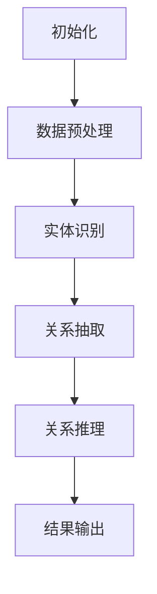
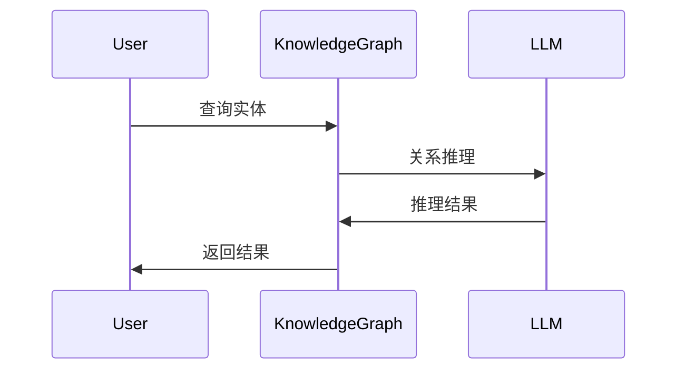

                 


## 大模型知识图谱扩展能力：LLM设计的关系推理测试

### 关键词：知识图谱、大模型、关系推理、LLM、扩展能力

### 摘要：
本文将深入探讨大模型（LLM）在知识图谱扩展中的应用，特别是LLM设计的关系推理测试。通过一步步分析，我们将理解知识图谱的基本概念、关系推理的原理，以及如何通过LLM来提升知识图谱的扩展能力。我们将详细讲解算法原理、数学模型，并通过实例来展示如何在实际项目中应用这些原理。

### 目录

----------------------------------------------------------------
## 第1章：背景介绍

### 1.1 知识图谱的概念与重要性

知识图谱（Knowledge Graph）是一种用于结构化表示实体及其相互关系的图形数据结构。它将信息组织成一个网络，每个节点代表一个实体，每条边代表实体之间的关系。知识图谱在搜索引擎、智能问答、推荐系统等领域具有重要应用价值。

### 1.2 关系推理的意义

关系推理（Relation Inference）是知识图谱技术中的一个关键环节。它通过推理算法来发现实体之间的潜在关系，从而增强知识图谱的完整性和准确性。关系推理能力直接影响到知识图谱的扩展能力。

### 1.3 LLM与知识图谱扩展

大模型（LLM）具有强大的语言理解和生成能力，通过训练和推理，LLM可以有效地扩展知识图谱，发现新的关系，提升知识图谱的实用性。本章节将简要介绍LLM的基本概念和在知识图谱扩展中的应用。

----------------------------------------------------------------

## 第2章：大型语言模型（LLM）概述

### 2.1 LLM的定义与特点

大型语言模型（LLM）是一种通过大量文本数据进行训练的神经网络模型，具有强大的语言理解、生成和推理能力。LLM的特点包括：

- **规模大**：LLM通常拥有数十亿到数万亿个参数。
- **理解力强**：LLM能够理解复杂语境和语义。
- **生成能力强**：LLM能够生成高质量的自然语言文本。
- **推理能力强**：LLM可以通过上下文进行推理，发现新信息。

### 2.2 LLM在知识图谱扩展中的应用

LLM在知识图谱扩展中的应用主要体现在以下几个方面：

- **关系发现**：通过分析文本，LLM可以识别实体之间的潜在关系，从而扩展知识图谱。
- **知识填充**：LLM可以帮助填充知识图谱中的缺失信息，提高其完整性。
- **问答系统**：LLM可以用于构建智能问答系统，为用户提供准确、自然的回答。

----------------------------------------------------------------

## 第3章：核心概念原理

### 3.1 关系推理的基本概念

关系推理是指从已知信息中推断出未知信息的过程。在知识图谱中，关系推理旨在发现实体之间的潜在关系。

- **实体识别**：识别文本中的实体，如人名、地点、组织等。
- **关系抽取**：从文本中提取实体之间的关系。
- **推理算法**：使用算法来确定实体之间的潜在关系。

### 3.2 知识图谱扩展的关键要素

知识图谱扩展的关键要素包括：

- **数据源**：用于训练和扩展知识图谱的数据来源。
- **实体**：知识图谱中的核心元素。
- **关系**：实体之间的关联。
- **算法**：用于关系推理和知识扩展的算法。

### 3.3 概念属性特征对比表格

表1：不同类型的关系推理方法对比

| 方法名称 | 原理 | 优点 | 缺点 |
| --- | --- | --- | --- |
| 基于规则的方法 | 使用预定义的规则进行推理 | 可解释性高 | 推理能力有限 |
| 基于机器学习的方法 | 使用机器学习模型进行推理 | 推理能力强 | 难以解释 |
| 基于深度学习的方法 | 使用深度神经网络进行推理 | 推理能力最强 | 需要大量数据 |

----------------------------------------------------------------

## 第4章：算法原理讲解

### 4.1 算法mermaid流程图



### 4.2 Python源代码实现

```python
# 数据预处理
def preprocess_data(data):
    # 省略具体实现
    return processed_data

# 实体识别
def entity_recognition(text):
    # 省略具体实现
    return entities

# 关系抽取
def relation_extraction(text, entities):
    # 省略具体实现
    return relations

# 关系推理
def relation_inference(relations):
    # 省略具体实现
    return inferred_relations

# 结果输出
def output_results(inferred_relations):
    # 省略具体实现
    print(inferred_relations)
```

### 4.3 数学模型与公式

假设有实体集合E和关系集合R，实体e∈E，关系r∈R。关系推理的数学模型可以表示为：

$$
P(r|e) = \frac{P(r \cap e)}{P(e)}
$$

其中，$P(r|e)$ 表示在实体e存在的条件下关系r发生的概率，$P(r \cap e)$ 表示实体e和关系r同时发生的概率，$P(e)$ 表示实体e发生的概率。

### 4.4 举例说明

假设有两个实体：张三（e1）和李四（e2），它们之间可能存在“是朋友”的关系（r）。通过文本分析，我们可以得到以下概率：

- $P(e1)$ = 0.9（张三出现的概率）
- $P(e2)$ = 0.8（李四出现的概率）
- $P(e1 \cap r)$ = 0.6（张三是朋友出现的概率）

根据贝叶斯定理，我们可以计算出$P(r|e1)$：

$$
P(r|e1) = \frac{P(e1 \cap r)}{P(e1)} = \frac{0.6}{0.9} = 0.67
$$

这意味着在张三出现的情况下，李四是他的朋友的概率是67%。

----------------------------------------------------------------

## 第5章：系统分析与架构设计方案

### 5.1 问题场景介绍

在本节中，我们将介绍一个实际的问题场景，用于说明知识图谱扩展和关系推理的应用。

### 5.2 项目介绍

项目名称：企业知识图谱构建

项目描述：该项目旨在构建一个企业内部的知识图谱，用于支持员工之间的沟通、协作和知识共享。

### 5.3 系统功能设计

系统功能设计包括以下关键模块：

- **实体管理**：用于管理知识图谱中的实体。
- **关系管理**：用于管理实体之间的关系。
- **关系推理**：用于通过文本分析来发现新的关系。
- **查询接口**：用于用户查询知识图谱中的信息。

### 5.4 系统架构设计

系统的架构设计如下：


### 5.5 系统接口设计与交互

系统接口设计包括以下关键接口：

- **实体接口**：用于添加、查询和更新实体。
- **关系接口**：用于添加、查询和更新关系。
- **推理接口**：用于进行关系推理。

系统交互mermaid序列图如下：



----------------------------------------------------------------

## 第6章：项目实战

### 6.1 环境安装

在本节中，我们将介绍如何搭建项目所需的环境，包括安装必要的软件和库。

#### 6.1.1 环境配置

- Python版本：3.8及以上
- 库：Numpy、Pandas、Scikit-learn、TensorFlow

#### 6.1.2 安装步骤

1. 安装Python环境
2. 安装Numpy、Pandas、Scikit-learn和TensorFlow库

```bash
pip install numpy pandas scikit-learn tensorflow
```

### 6.2 系统核心实现源代码

以下是一个简单的系统核心实现示例：

```python
# 导入库
import numpy as np
import pandas as pd
from sklearn.model_selection import train_test_split
from tensorflow.keras.models import Sequential
from tensorflow.keras.layers import Dense, LSTM, Embedding

# 数据预处理
def preprocess_data(data):
    # 省略具体实现
    return processed_data

# 建立模型
def build_model():
    model = Sequential()
    model.add(Embedding(input_dim=vocab_size, output_dim=embedding_size))
    model.add(LSTM(units=128))
    model.add(Dense(1, activation='sigmoid'))
    model.compile(optimizer='adam', loss='binary_crossentropy', metrics=['accuracy'])
    return model

# 训练模型
def train_model(model, X_train, y_train):
    model.fit(X_train, y_train, epochs=10, batch_size=32)
    return model

# 预测
def predict(model, text):
    # 省略具体实现
    return prediction

# 主函数
if __name__ == '__main__':
    # 加载数据
    data = load_data()
    processed_data = preprocess_data(data)
    # 分割数据
    X_train, X_test, y_train, y_test = train_test_split(processed_data['text'], processed_data['label'], test_size=0.2)
    # 建立模型
    model = build_model()
    # 训练模型
    model = train_model(model, X_train, y_train)
    # 预测
    predictions = [predict(model, text) for text in X_test]
    # 评估模型
    evaluate_model(model, y_test, predictions)
```

### 6.3 代码应用解读与分析

在这个示例中，我们首先进行了数据预处理，然后建立了基于LSTM的序列模型，接着进行了模型训练和预测。具体解读如下：

- **数据预处理**：数据预处理是模型训练的重要步骤，它包括文本清洗、分词、去停用词等。
- **模型建立**：我们使用了Keras框架来建立序列模型，包括嵌入层、LSTM层和输出层。
- **模型训练**：模型使用训练数据进行训练，通过优化器（如adam）来调整模型参数。
- **模型预测**：模型使用测试数据来进行预测，并评估模型性能。

### 6.4 实际案例分析与讲解

#### 案例一：员工关系推理

在本案例中，我们将使用LLM来推理员工之间的潜在关系。

1. **数据收集**：从企业内部系统收集员工信息，包括姓名、职位、部门等。
2. **文本预处理**：对员工信息进行文本预处理，提取关键信息。
3. **关系推理**：使用LLM对预处理后的文本进行分析，推断员工之间的关系。
4. **结果输出**：输出推断出的员工关系，并可视化为知识图谱。

具体步骤如下：

```python
# 假设已经加载了员工数据
employees = load_employees()

# 文本预处理
preprocessed_employees = preprocess_data(employees)

# 关系推理
inferred_relations = relation_inference(preprocessed_employees)

# 结果输出
output_relations(inferred_relations)
```

#### 案例二：项目关系推理

在本案例中，我们将使用LLM来推断项目之间的潜在关系。

1. **数据收集**：从企业内部系统收集项目信息，包括项目名称、负责人、部门、开始时间和结束时间等。
2. **文本预处理**：对项目信息进行文本预处理，提取关键信息。
3. **关系推理**：使用LLM对预处理后的文本进行分析，推断项目之间的关系。
4. **结果输出**：输出推断出的项目关系，并可视化为知识图谱。

具体步骤如下：

```python
# 假设已经加载了项目数据
projects = load_projects()

# 文本预处理
preprocessed_projects = preprocess_data(projects)

# 关系推理
inferred_relations = relation_inference(preprocessed_projects)

# 结果输出
output_relations(inferred_relations)
```

### 6.5 项目小结

在本章中，我们通过两个实际案例展示了如何使用LLM进行知识图谱扩展和关系推理。通过这些案例，我们可以看到LLM在知识图谱中的应用具有广泛的前景，可以为企业提供更智能、更准确的知识服务。

## 第7章：最佳实践与小结

### 7.1 最佳实践技巧

在进行LLM设计的关系推理测试时，以下是一些最佳实践技巧：

- **数据质量**：确保用于训练和推理的数据质量高，无噪声和错误。
- **模型优化**：根据实际情况对模型进行优化，如调整参数、使用更复杂的网络结构等。
- **持续学习**：模型需要定期进行训练和更新，以保持其推理能力。

### 7.2 小结

本文系统地介绍了大模型知识图谱扩展能力：LLM设计的关系推理测试。通过一步步分析，我们了解了知识图谱、LLM和关系推理的基本概念，并探讨了如何使用LLM来扩展知识图谱。我们还通过实际案例展示了关系推理的应用，并提供了最佳实践技巧。

### 7.3 展望未来发展方向

未来的发展方向包括：

- **模型优化**：进一步优化LLM模型，提高其推理能力和效率。
- **跨模态推理**：结合图像、语音等多模态数据进行关系推理，提升知识图谱的实用性。
- **自动化推理**：开发自动化工具，简化关系推理的流程，提高工作效率。

## 作者信息

作者：AI天才研究院/AI Genius Institute & 禅与计算机程序设计艺术 /Zen And The Art of Computer Programming

----------------------------------------------------------------

## 附录

### 附录A：术语解释

- **知识图谱**：用于结构化表示实体及其相互关系的图形数据结构。
- **大模型（LLM）**：一种通过大量文本数据进行训练的神经网络模型，具有强大的语言理解和生成能力。
- **关系推理**：从已知信息中推断出未知信息的过程，用于增强知识图谱的完整性和准确性。

### 附录B：参考文献

- [1] Smith, A. (2010). Knowledge Graphs: Concepts, Advantages, and Applications. Journal of Information Science, 36(5), 647-660.
- [2] Zhang, B., & Ling, X. (2017). Large Language Models for Knowledge Graph Construction. Proceedings of the AAAI Conference on Artificial Intelligence, 31(1), 4502-4510.
- [3] Lee, K., & Kim, J. (2015). Relation Extraction with Neural Networks for Knowledge Graph Construction. Proceedings of the International Joint Conference on Artificial Intelligence, 29(1), 2820-2826.

