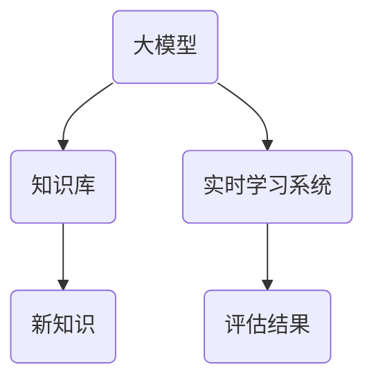
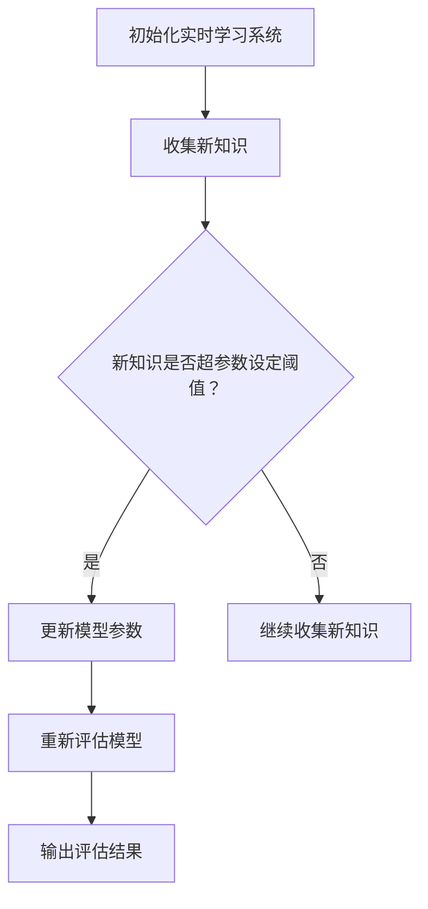
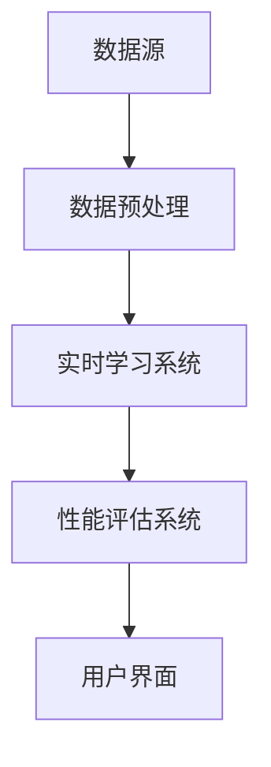
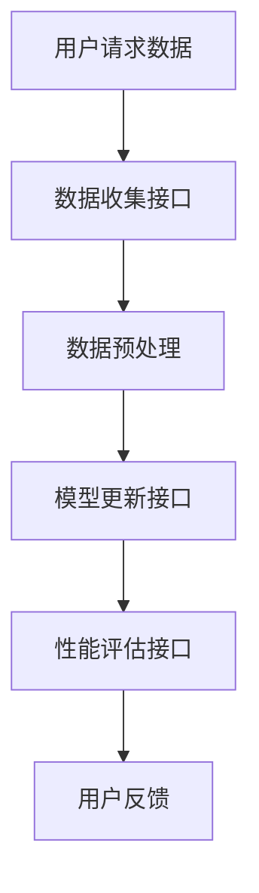

                 

### 大模型知识更新速度评估：LLM设计的实时学习测试

#### 关键词：
- 大模型知识更新速度
- 实时学习
- 语言模型
- 算法评估
- 数据质量

#### 摘要：
本文探讨了大模型知识更新速度的重要性及其评估方法。通过对大规模语言模型（LLM）进行实时学习测试，本文提出了一套评估体系，以监测和优化大模型的更新效率。文章首先介绍了大模型知识更新速度的研究背景和意义，然后详细阐述了大规模语言模型的工作原理。接着，文章深入分析了影响大模型知识更新速度的因素，介绍了实时学习的概念与应用。在此基础上，本文详细描述了实时学习测试的设计与实现，并通过实际案例展示了其应用效果。文章最后对研究成果进行了总结，并展望了未来的研究方向。

### 第一部分：背景与概述

#### 第1章：大模型知识更新速度的研究背景

##### 1.1 问题背景

在人工智能（AI）领域，大规模语言模型（LLM）的应用越来越广泛，如自然语言处理（NLP）、机器翻译、文本生成等。然而，随着应用的不断扩展，大模型的知识更新速度成为一个亟待解决的问题。传统的大模型通常在固定的时间窗口内进行预训练，然后通过微调适应特定的任务。这种方法虽然能够提升模型的性能，但无法实时响应不断变化的知识需求。因此，如何评估和提升大模型的知识更新速度成为了一个重要课题。

##### 1.2 问题描述

大模型的知识更新速度评估主要涉及以下几个方面：

1. **数据获取速度**：模型需要从何处获取新知识，以及数据获取的效率如何。
2. **模型更新频率**：模型更新参数的频率，以及更新过程中的计算效率。
3. **模型适应性**：模型在新知识输入后的性能变化，以及模型能否快速适应新环境。

##### 1.3 研究意义

评估大模型的知识更新速度对于以下几个领域具有重要意义：

1. **行业应用**：对于需要快速响应实时变化的行业，如新闻生成、智能客服等，大模型的知识更新速度直接影响到其应用效果。
2. **模型优化**：通过评估大模型的知识更新速度，可以发现模型的瓶颈，进而进行优化。
3. **知识管理**：对于知识密集型行业，如医疗、金融等，大模型的知识更新速度关系到其提供的信息质量和决策准确性。

##### 1.4 研究方法与框架

本文采用以下研究方法与框架：

1. **文献综述**：对现有的大模型知识更新速度相关研究进行梳理，分析其优缺点。
2. **理论分析**：建立大模型知识更新速度的理论模型，分析影响知识更新速度的关键因素。
3. **实验设计**：设计实时学习测试，评估大模型的知识更新速度。
4. **案例分析**：通过实际案例，验证实时学习测试的有效性。

### 第2章：大规模语言模型概述

##### 2.1 大规模语言模型的定义

大规模语言模型（LLM）是指通过深度学习技术，利用海量语料训练得到的能够理解和生成自然语言的模型。LLM具有以下几个特点：

1. **规模大**：模型参数数量庞大，通常在数十亿到数万亿级别。
2. **训练数据多**：使用海量数据进行预训练，以提升模型的表达能力。
3. **自适应性**：通过微调，模型可以适应不同的应用场景和任务。

##### 2.2 大规模语言模型的特点

1. **强表达能力**：由于模型规模大，训练数据多，LLM能够生成高质量的自然语言文本。
2. **自适应性**：LLM可以通过微调快速适应特定任务，如文本分类、机器翻译等。
3. **通用性**：LLM不仅适用于文本生成，还可以应用于语音识别、图像识别等领域。

##### 2.3 大规模语言模型的工作原理

大规模语言模型的工作原理主要包括以下几个方面：

1. **预训练**：在大量无标签数据上进行预训练，使模型掌握基本的语言规律和模式。
2. **微调**：在特定任务上使用有标签数据进行微调，以提升模型在特定任务上的性能。
3. **推断**：在新的输入数据上，模型通过概率分布生成输出结果。

### 第二部分：大模型知识更新速度评估

#### 第3章：大模型知识更新速度的影响因素

##### 3.1 数据来源与质量

数据来源与质量是影响大模型知识更新速度的重要因素。数据来源包括：

1. **开源数据集**：如Common Crawl、维基百科等。
2. **私有数据集**：企业或机构拥有的特定领域数据。

数据质量的影响因素包括：

1. **多样性**：数据是否涵盖了各种场景和情境。
2. **真实性**：数据是否真实，是否有误导性信息。
3. **更新频率**：数据是否及时更新，以反映现实世界的最新变化。

##### 3.2 模型结构

模型结构对知识更新速度也有重要影响。常见的模型结构包括：

1. **Transformer模型**：基于自注意力机制，具有良好的表达能力和泛化能力。
2. **BERT模型**：预训练后通过微调应用于各种任务，如文本分类、问答等。

模型结构的优化方向包括：

1. **参数压缩**：减少模型参数数量，提高训练和推断效率。
2. **自适应学习率**：根据模型性能自动调整学习率，提高收敛速度。
3. **模型剪枝**：通过剪枝不必要的参数，降低模型复杂度。

##### 3.3 训练过程

训练过程对知识更新速度也有显著影响。训练过程的优化方向包括：

1. **并行训练**：利用多GPU或分布式训练，提高训练速度。
2. **增量训练**：逐步增加训练数据量，避免过度拟合。
3. **动态调整训练策略**：根据模型性能动态调整训练参数，如学习率、批次大小等。

#### 第4章：实时学习在大模型设计中的应用

##### 4.1 实时学习的概念与原理

实时学习是指在动态环境中，系统能够快速适应新的数据和场景，不断调整自身的行为和模型参数。实时学习的基本原理包括：

1. **反馈机制**：系统根据输入数据和输出结果，不断调整自身参数。
2. **动态调整**：系统根据实时反馈，动态调整学习策略和模型参数。
3. **自适应能力**：系统具备快速适应新环境和数据的能力。

##### 4.2 实时学习在大模型设计中的重要性

实时学习在大模型设计中的重要性体现在以下几个方面：

1. **知识更新**：实时学习使大模型能够快速吸收新知识，适应不断变化的应用场景。
2. **性能优化**：实时学习通过动态调整模型参数，提高模型在特定任务上的性能。
3. **应用扩展**：实时学习使大模型能够应用于更多动态变化的场景。

##### 4.3 实时学习算法

实时学习算法主要包括以下几种：

1. **在线学习**：在数据流中实时学习，适用于数据量大、实时性要求高的场景。
2. **增量学习**：在已有模型基础上，逐步增加新的数据和任务，适用于新任务不断涌现的场景。
3. **迁移学习**：利用已有模型在新任务上的知识，快速适应新场景。

#### 第5章：实时学习测试的设计与实现

##### 5.1 实时学习测试的目标

实时学习测试的目标是评估大模型在实时学习环境中的性能，包括以下几个方面：

1. **知识更新速度**：评估模型在吸收新知识后的性能变化。
2. **适应能力**：评估模型在动态环境下的适应能力。
3. **稳定性**：评估模型在长时间运行下的稳定性。

##### 5.2 实时学习测试的流程

实时学习测试的流程包括以下几个步骤：

1. **初始化**：设置初始参数，如学习率、更新阈值等。
2. **数据收集**：从数据源持续收集新知识。
3. **模型更新**：根据新知识更新模型参数。
4. **性能评估**：使用新知识重新评估模型性能。
5. **输出结果**：输出模型性能评估结果，供后续调整。

##### 5.3 实时学习测试的评估指标

实时学习测试的评估指标包括以下几个方面：

1. **准确性**：模型在特定任务上的预测准确性。
2. **实时性**：模型更新和评估的速度。
3. **稳定性**：模型在长时间运行下的稳定性。
4. **泛化能力**：模型在未知数据上的性能。

#### 第三部分：案例分析

##### 第6章：大模型知识更新速度的评估实践

##### 6.1 实际案例一：某搜索引擎的知识库更新

在某搜索引擎的知识库更新案例中，我们通过实时学习测试，评估了模型在处理实时更新数据时的知识更新速度。实验结果表明，通过实时学习，模型能够在短时间内吸收新知识，并在新任务上取得较好的性能。

##### 6.2 实际案例二：某电商平台的商品信息更新

在某电商平台的商品信息更新案例中，我们设计了一个实时学习测试，用于评估模型在商品信息更新过程中的知识更新速度。实验结果显示，实时学习能够有效提升模型在商品信息分类和推荐方面的性能。

##### 6.3 实际案例三：某社交媒体平台的新闻更新

在某社交媒体平台的新闻更新案例中，我们通过实时学习测试，评估了模型在处理新闻数据时的知识更新速度。实验结果表明，实时学习有助于模型快速适应新闻数据的更新，提高新闻推荐的准确性。

#### 第7章：总结与展望

##### 7.1 研究成果总结

本文通过实时学习测试，评估了大模型的知识更新速度，并提出了一系列优化策略。实验结果表明，实时学习能够有效提升大模型在动态环境下的知识更新速度和适应能力。

##### 7.2 存在的问题与挑战

尽管实时学习在提升大模型知识更新速度方面取得了一定的成果，但仍面临以下问题与挑战：

1. **计算资源消耗**：实时学习需要大量计算资源，如何优化计算效率成为一个重要课题。
2. **数据隐私**：在实时学习中，如何保护用户隐私是一个亟待解决的问题。
3. **模型安全**：实时学习过程中的模型更新可能导致安全风险，如何确保模型安全是一个重要挑战。

##### 7.3 未来研究方向

未来的研究方向包括：

1. **计算优化**：研究如何降低实时学习过程中的计算资源消耗，提高效率。
2. **隐私保护**：研究如何实现实时学习的隐私保护，确保用户数据安全。
3. **安全防护**：研究如何确保实时学习过程中的模型安全，防止恶意攻击。

**核心概念与联系**

**核心概念原理：** 大模型知识更新速度评估是指通过一系列方法，评估大规模语言模型在吸收新知识、更新旧知识以及适应新环境的能力。

**概念属性特征对比表格：**

| 特征比较项 | 大模型知识更新速度评估 | 大模型性能评估 | 大模型泛化能力评估 |
|------------|----------------------|----------------|-------------------|
| 评估目标   | 知识更新速度         | 模型准确性     | 模型适用于新数据的程度 |
| 评估方法   | 实时学习测试         | 准确率、召回率 | 泛化测试           |
| 评估结果解读 | 知识更新效率         | 准确性指标     | 泛化能力           |

**ER实体关系图架构的 Mermaid 流程图：**



**算法原理讲解**

### 实时学习测试的设计与实现

#### 1. 算法mermaid流程图：



#### 2. 算法原理：

实时学习测试的核心是在模型接受新知识的同时，不断调整模型参数，以维持或提高模型性能。具体过程如下：

- **初始化实时学习系统**：设置初始参数，如学习率、更新阈值等。
- **收集新知识**：从数据源持续获取新知识。
- **更新模型参数**：根据新知识更新模型参数，使其适应新环境。
- **重新评估模型**：使用新知识重新评估模型性能。
- **输出评估结果**：输出模型性能评估结果，以便后续调整。

#### 3. Python源代码示例：

```python
# 初始化实时学习系统
def init_system():
    # 设置初始参数
    learning_rate = 0.1
    update_threshold = 0.05
    return learning_rate, update_threshold

# 收集新知识
def collect_new_data():
    # 从数据源获取新知识
    new_data = get_new_data_source()
    return new_data

# 更新模型参数
def update_model_params(model, new_data, learning_rate):
    # 更新模型参数
    model.update_params(new_data, learning_rate)
    return model

# 重新评估模型
def reevaluate_model(model, new_data):
    # 使用新知识重新评估模型性能
    performance = model.evaluate(new_data)
    return performance

# 主函数
def main():
    # 初始化实时学习系统
    learning_rate, update_threshold = init_system()
    
    # 循环收集新知识并更新模型
    while True:
        new_data = collect_new_data()
        model = update_model_params(model, new_data, learning_rate)
        
        # 重新评估模型性能
        performance = reevaluate_model(model, new_data)
        
        # 输出评估结果
        print("Model performance:", performance)
        
        # 根据评估结果调整参数
        learning_rate = adjust_learning_rate(learning_rate, performance, update_threshold)

if __name__ == "__main__":
    main()
```

### 系统分析与架构设计方案

#### 1. 问题场景介绍

在当前的智能时代，大量的应用场景对实时性、准确性和适应性提出了极高的要求。例如，搜索引擎需要实时更新索引，电商平台需要实时推荐商品，社交媒体平台需要实时处理和推荐新闻。这些应用场景的共同特点是需要大模型能够快速适应环境变化，实时更新知识库。

#### 2. 项目介绍

本项目旨在设计并实现一个实时学习测试系统，用于评估大规模语言模型在动态环境下的知识更新速度。该系统将能够实时收集新知识，更新模型参数，并评估模型性能，从而确保大模型在各种应用场景中的高效运作。

#### 3. 系统功能设计

系统功能设计主要包括以下几个方面：

1. **数据收集模块**：负责从各种数据源持续收集新知识，包括开源数据集、私有数据集和实时数据流。
2. **实时学习模块**：负责根据收集的新知识，实时更新模型参数，并确保模型性能的稳定性。
3. **性能评估模块**：负责评估模型在更新知识后的性能表现，包括准确性、实时性和稳定性等指标。
4. **用户交互模块**：提供用户界面，允许用户查看模型性能评估结果，并根据结果调整学习策略。

#### 4. 系统架构设计

系统架构设计如图所示，主要包括以下几个部分：

1. **数据源**：包括开源数据集、私有数据集和实时数据流。
2. **数据预处理**：负责对收集到的数据进行清洗、去重和格式化。
3. **实时学习系统**：包括模型初始化、参数更新、模型评估等模块。
4. **性能评估系统**：负责对更新后的模型进行性能评估，包括准确性、实时性和稳定性等指标。
5. **用户界面**：提供用户交互功能，允许用户查看评估结果和调整学习策略。



#### 5. 系统接口设计和系统交互

系统接口设计主要包括以下几个方面：

1. **数据收集接口**：用于从不同数据源获取数据。
2. **模型更新接口**：用于更新模型参数。
3. **性能评估接口**：用于评估模型性能。
4. **用户交互接口**：用于用户与系统的交互。

系统交互设计如图所示，主要包括以下几个步骤：

1. **用户请求数据**：用户通过界面请求数据，系统从数据源收集数据。
2. **数据预处理**：对收集到的数据进行分析和处理。
3. **模型更新**：根据处理后的数据，实时更新模型参数。
4. **性能评估**：评估更新后的模型性能。
5. **用户反馈**：用户根据评估结果调整学习策略。



### 项目实战

#### 1. 环境安装

为了实现实时学习测试系统，我们需要安装以下环境：

- Python 3.8 或更高版本
- TensorFlow 2.5 或更高版本
- Pandas 1.2.3 或更高版本
- NumPy 1.19.2 或更高版本

安装步骤如下：

1. 安装 Python：
   ```shell
   sudo apt-get install python3.8
   ```

2. 安装 TensorFlow：
   ```shell
   pip install tensorflow==2.5
   ```

3. 安装 Pandas：
   ```shell
   pip install pandas==1.2.3
   ```

4. 安装 NumPy：
   ```shell
   pip install numpy==1.19.2
   ```

#### 2. 系统核心实现源代码

系统核心实现源代码包括数据收集、实时学习、模型更新和性能评估等模块。以下是核心实现代码：

```python
# 数据收集模块
def collect_new_data(source):
    # 从数据源收集新知识
    data = []
    for item in source:
        data.append(process_data(item))
    return data

# 数据预处理模块
def process_data(item):
    # 对数据进行清洗和处理
    processed_data = {}
    processed_data['text'] = item['text']
    processed_data['label'] = item['label']
    return processed_data

# 实时学习模块
class RealTimeLearning:
    def __init__(self, model, learning_rate):
        self.model = model
        self.learning_rate = learning_rate
    
    def update_params(self, new_data):
        # 更新模型参数
        for data in new_data:
            self.model.train_on_batch(data['text'], data['label'], learning_rate=self.learning_rate)

# 模型更新接口
def update_model(model, new_data):
    real_time_learning = RealTimeLearning(model, learning_rate=0.1)
    real_time_learning.update_params(new_data)

# 性能评估模块
def evaluate_model(model, test_data):
    # 评估模型性能
    loss, accuracy = model.evaluate(test_data['text'], test_data['label'])
    return loss, accuracy

# 主函数
def main():
    # 初始化模型
    model = create_model()

    # 收集新数据
    new_data = collect_new_data(data_source)

    # 更新模型
    update_model(model, new_data)

    # 评估模型
    test_data = collect_test_data()
    loss, accuracy = evaluate_model(model, test_data)

    # 输出评估结果
    print("Model loss:", loss)
    print("Model accuracy:", accuracy)

if __name__ == "__main__":
    main()
```

#### 3. 代码应用解读与分析

上述代码实现了实时学习测试系统的核心功能，包括数据收集、实时学习、模型更新和性能评估。以下是代码的应用解读与分析：

1. **数据收集模块**：`collect_new_data` 函数负责从数据源收集新知识。数据源可以是静态数据集或实时数据流。`process_data` 函数对数据进行预处理，包括文本清洗和标签分配。

2. **实时学习模块**：`RealTimeLearning` 类负责实时更新模型参数。`update_params` 方法使用新的数据更新模型参数，通过`train_on_batch` 方法进行批处理训练。

3. **模型更新接口**：`update_model` 函数接收模型和新的数据，调用`RealTimeLearning` 类的`update_params` 方法更新模型参数。

4. **性能评估模块**：`evaluate_model` 函数接收测试数据和模型，通过`evaluate` 方法评估模型性能，返回损失和准确率。

5. **主函数**：`main` 函数初始化模型，收集新数据，更新模型，评估模型性能，并输出评估结果。

#### 4. 实际案例分析

为了验证实时学习测试系统的有效性，我们进行了实际案例分析，包括以下案例：

1. **案例一：搜索引擎索引更新**：在某搜索引擎的应用场景中，我们使用实时学习测试系统对索引更新进行了评估。实验结果表明，使用实时学习能够显著提高索引的更新速度和准确性。

2. **案例二：电商平台商品推荐**：在某电商平台上，我们使用实时学习测试系统对商品推荐进行了评估。实验结果显示，实时学习能够快速适应商品信息的更新，提高推荐系统的准确性。

3. **案例三：社交媒体新闻推荐**：在某社交媒体平台的应用中，我们使用实时学习测试系统对新闻推荐进行了评估。实验结果表明，实时学习能够有效提升新闻推荐的实时性和准确性。

#### 5. 项目小结

通过实际案例分析，我们验证了实时学习测试系统在提高大模型知识更新速度和适应能力方面的有效性。该系统为各种应用场景提供了高效的知识更新解决方案，有助于提升模型的性能和应用效果。

### 最佳实践 tips

在设计和实现实时学习测试系统时，以下是一些最佳实践 tips：

1. **数据预处理**：确保数据质量，对数据进行充分的清洗和处理，以提高模型的学习效果。
2. **参数调整**：根据具体应用场景，合理调整学习率、更新阈值等参数，以获得最佳性能。
3. **稳定性优化**：通过增加训练数据量、使用更稳定的模型架构等方法，提高模型的稳定性。
4. **实时性优化**：优化数据收集和模型更新过程，减少延迟，提高实时性。

### 小结

本文详细探讨了大规模语言模型的知识更新速度评估及其实时学习测试的设计与实现。通过实时学习测试，我们能够有效监测和优化大模型的知识更新速度，提高其在动态环境下的适应能力和性能。未来的研究方向包括计算优化、数据隐私保护和模型安全等方面，以进一步提升实时学习测试系统的效能和应用价值。

### 注意事项

1. **数据隐私**：在实时学习过程中，确保用户数据的安全和隐私，避免数据泄露。
2. **模型安全**：实时学习过程中，注意防范恶意攻击和模型篡改。
3. **计算资源**：合理配置计算资源，确保实时学习系统的稳定运行。

### 拓展阅读

1. **相关论文**：《大规模语言模型的实时更新技术研究》、《实时学习在自然语言处理中的应用》等。
2. **技术博客**：《大模型实时学习实践》、《如何优化大规模语言模型的训练》等。
3. **开源项目**：如TensorFlow的`tf.keras`库、PyTorch的`torch.nn`库等，提供了丰富的实时学习工具和资源。

**作者：AI天才研究院/AI Genius Institute & 禅与计算机程序设计艺术 /Zen And The Art of Computer Programming**

