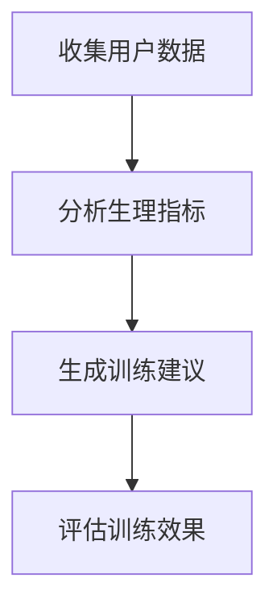
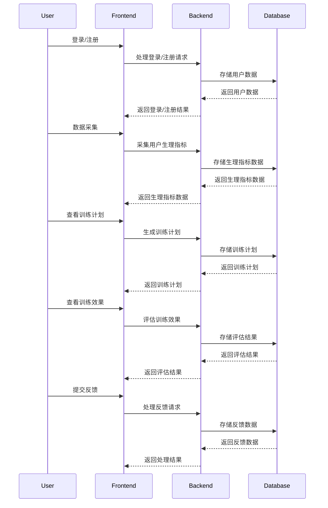

                 


## 大模型虚拟健身教练表现评估框架

### 摘要

本文旨在深入探讨大模型虚拟健身教练表现评估框架的设计与实现。我们将从问题背景入手，阐述虚拟健身教练的重要性以及当前评估方法面临的挑战。接着，通过定义核心概念，分析这些概念之间的联系，搭建起评估框架的理论基础。随后，我们将详细介绍运动生理学算法，通过具体的数学模型和示例，展示算法在评估中的应用。最后，我们将通过系统分析与架构设计方案，探讨如何在实际项目中应用评估框架，并提供一些最佳实践建议，以便更好地利用虚拟健身教练技术提升用户体验。

### 第一部分：背景介绍

#### 第1章：问题背景与核心概念

##### 1.1.1 问题背景

虚拟健身教练作为一种新兴的健身服务模式，正迅速崛起。它们能够通过计算机模拟技术，为用户提供个性化的健身计划和实时指导，大大提高了用户的健身效率和满意度。然而，随着虚拟健身教练的广泛应用，如何科学、准确地评估其表现成为一个亟待解决的问题。

目前，虚拟健身教练的表现评估主要依赖于用户反馈和教练的主观评价。这种方法存在明显的局限性，一方面，用户反馈可能受到主观情绪的影响，无法客观反映虚拟健身教练的实际效果；另一方面，教练的主观评价可能因个人观点和经验的不同而产生偏差，导致评估结果的不一致。

因此，为了提升虚拟健身教练的表现评估准确性，我们需要构建一个科学、系统的评估框架。这个框架不仅需要考虑技术层面的因素，还要涉及到心理学、运动生理学等多个领域，从而提供全面、准确的评估结果。

##### 1.1.2 核心概念

在本节中，我们将介绍以下几个核心概念：

- **虚拟健身教练**：一种通过计算机模拟技术提供健身指导的虚拟角色，能够根据用户的身体数据和健身目标提供个性化的健身计划，并在训练过程中进行实时指导。
- **表现评估框架**：一套用于衡量虚拟健身教练效能的标准和方法，包括用户满意度、训练效果、适应能力等多个维度。
- **用户参与度**：用户在虚拟健身教练训练过程中参与的程度和满意度，高用户参与度通常意味着更好的训练效果和更高的用户忠诚度。
- **运动生理学**：研究人体运动和运动对生理系统影响的科学，为本框架提供了科学依据，用于分析虚拟健身教练训练方案的科学性和有效性。

#### 第2章：核心概念与联系

##### 2.1.1 核心概念原理

在本章中，我们将详细讨论虚拟健身教练表现评估框架中的核心概念，包括其定义、属性特征和相互关系。

###### 2.1.1.1 虚拟健身教练

虚拟健身教练是一种结合了计算机图形学、语音识别和人工智能技术的虚拟角色。它们能够根据用户的身体数据和健身目标提供个性化的健身计划，并在训练过程中进行实时指导。虚拟健身教练的主要特点包括：

- **个性化**：能够根据用户的身体数据和健身目标，为用户提供定制化的健身计划。
- **实时性**：能够实时响应用户的训练需求，提供个性化的指导和建议。
- **互动性**：通过语音识别和计算机图形学技术，与用户进行互动，提高用户的训练体验。

###### 2.1.1.2 表现评估框架

表现评估框架是一套用于衡量虚拟健身教练效能的标准和方法。这些标准通常包括用户满意度、训练效果、适应能力等多个维度。具体来说，表现评估框架需要考虑以下几个方面：

- **用户满意度**：评估用户对虚拟健身教练服务的满意度，包括对教练指导的认可度、训练计划的合理性等。
- **训练效果**：评估虚拟健身教练提供的训练方案的实际效果，包括用户的体重变化、体能提升等。
- **适应能力**：评估虚拟健身教练在不同用户和场景下的适应能力，包括对用户需求变化的响应速度、对环境的适应能力等。

###### 2.1.1.3 用户参与度

用户参与度是衡量用户在虚拟健身教练训练过程中积极性和满意度的指标。高用户参与度通常意味着更好的训练效果和更高的用户忠诚度。用户参与度的评估可以从以下几个方面进行：

- **训练频率**：评估用户参与训练的频率，高频率参与通常表明用户对训练的积极性较高。
- **互动频率**：评估用户与虚拟健身教练的互动频率，高互动频率通常表明用户对虚拟健身教练的依赖程度较高。
- **训练时长**：评估用户每次训练的时间长度，长时间训练通常表明用户对训练的投入程度较高。

###### 2.1.1.4 运动生理学

运动生理学是研究人体运动和运动对生理系统影响的科学。在本框架中，运动生理学用于分析虚拟健身教练训练方案的科学性和有效性。具体来说，运动生理学可以从以下几个方面为评估框架提供支持：

- **生理指标分析**：通过监测用户的生理指标，如心率、血压、肌肉活动等，分析虚拟健身教练训练方案的科学性。
- **运动效果评估**：通过评估用户的运动效果，如体能提升、体重变化等，判断虚拟健身教练训练方案的有效性。
- **个性化训练方案**：基于用户的生理特征和运动需求，为用户提供个性化的训练方案，提高训练效果。

##### 2.1.2 概念属性特征对比表格

| 核心概念 | 定义 | 属性特征 | 相互关系 |
| --- | --- | --- | --- |
| 虚拟健身教练 | 通过计算机模拟技术提供健身指导的虚拟角色 | 计算机图形学、语音识别、人工智能技术 | 评估框架的核心实施对象 |
| 表现评估框架 | 用于衡量虚拟健身教练效能的标准和方法 | 用户满意度、训练效果、适应能力 | 指导虚拟健身教练性能改进 |
| 用户参与度 | 用户在虚拟健身教练训练过程中参与的程度和满意度 | 积极性、满意度、忠诚度 | 影响评估结果的有效性 |
| 运动生理学 | 研究人体运动和运动对生理系统影响的科学 | 心率、血压、肌肉活动 | 为训练方案提供科学依据 |

##### 2.1.3 ER实体关系图架构

```mermaid
erDiagram
  User ||--|{ VirtualFitnessCoach }|-- PerformanceAssessmentFramework
  User ||--|{ UserEngagement }|-- VirtualFitnessCoach
  VirtualFitnessCoach ||--|{ MotionPhysiology }|-- PerformanceAssessmentFramework
```

#### 第3章：算法原理讲解

##### 3.1 运动生理学算法

运动生理学算法是评估虚拟健身教练训练方案的科学性依据。它通过分析用户的生理指标，如心率、血压、肌肉活动等，评估训练方案的科学性和有效性。以下是一个简单的运动生理学算法流程图：



###### 3.1.1 运动生理学数学模型

运动生理学中的核心模型包括心率-运动强度关系模型和能量消耗模型。以下是这些模型的详细公式：

$$
\text{心率} = \text{最大心率} \times \left(1 - \frac{\text{运动强度}}{100}\right)
$$

$$
\text{能量消耗} = \text{体重} \times \left(0.55 + 0.068 \times \text{运动强度}\right)
$$

###### 3.1.2 运动生理学算法举例说明

假设用户的体重为70kg，最大心率为200bpm，选择的运动强度为60%。我们可以通过上述公式计算出相应的结果：

$$
\text{心率} = 200 \times \left(1 - \frac{60}{100}\right) = 80 \text{bpm}
$$

$$
\text{能量消耗} = 70 \times \left(0.55 + 0.068 \times 60\right) = 42.6 \text{卡路里/分钟}
$$

通过以上计算，我们可以得出用户的实际心率和能量消耗，从而评估训练方案的科学性和有效性。

#### 第4章：系统分析与架构设计方案

##### 4.1 问题场景介绍

在当前的健身市场中，虚拟健身教练作为一种新兴的服务模式，受到了越来越多人的关注。然而，如何科学地评估虚拟健身教练的表现，以便为用户提供更好的服务，成为了一个关键问题。本章节将基于一个实际场景，介绍如何构建虚拟健身教练表现评估系统。

##### 4.2 项目介绍

本项目旨在构建一个虚拟健身教练表现评估系统，该系统将集成运动生理学算法，通过对用户的生理指标进行分析，评估虚拟健身教练的训练效果，从而为用户提供科学的健身建议。系统主要包括以下几个模块：

- **用户数据采集模块**：负责收集用户的身体数据，如体重、身高、心率等。
- **运动生理学算法模块**：负责对用户的生理指标进行分析，评估训练方案的科学性和有效性。
- **评估结果展示模块**：将评估结果以图表、文字等形式展示给用户，帮助用户了解自己的训练效果。
- **用户反馈模块**：收集用户对虚拟健身教练服务的反馈，用于改进系统的性能。

##### 4.3 系统功能设计

在系统功能设计方面，我们需要明确各个模块的功能和相互关系。以下是虚拟健身教练表现评估系统的功能设计：

- **用户注册与登录**：用户可以通过注册账号，登录系统，填写个人身体数据。
- **数据采集**：系统将自动采集用户的心率、血压、肌肉活动等生理指标，并实时更新。
- **训练计划生成**：根据用户的身体数据和健身目标，系统将生成个性化的训练计划。
- **训练效果评估**：通过运动生理学算法，对用户的训练效果进行评估，并提供科学的健身建议。
- **结果展示**：系统将评估结果以图表、文字等形式展示给用户，帮助用户了解自己的训练效果。
- **用户反馈**：用户可以对虚拟健身教练的服务进行评价，系统将根据反馈进行优化。

##### 4.4 系统架构设计

在系统架构设计方面，我们需要明确各个模块的职责和相互关系。以下是虚拟健身教练表现评估系统的架构设计：

- **前端**：负责展示系统界面，与用户进行交互，包括用户注册、数据采集、结果展示等功能。
- **后端**：负责处理业务逻辑，包括数据采集、训练计划生成、训练效果评估等功能，同时还负责与数据库进行数据交互。
- **数据库**：存储用户的身体数据、训练计划、评估结果等，为系统提供数据支持。

以下是系统架构的 Mermaid 序列图：



##### 4.5 系统接口设计和系统交互

在系统接口设计方面，我们需要明确各个模块之间的接口定义和交互流程。以下是虚拟健身教练表现评估系统的接口设计和交互流程：

- **用户接口**：负责与用户进行交互，包括登录、注册、数据采集、结果展示等功能。
- **服务接口**：负责处理业务逻辑，包括数据采集、训练计划生成、训练效果评估等功能。
- **数据库接口**：负责与数据库进行数据交互，包括数据存储、查询等功能。

以下是系统接口设计和交互流程的 Mermaid 类图：

```mermaid
classDiagram
  User -> Frontend
  Frontend -> Backend
  Backend -> Database

  User <<接口>>
  Frontend <<接口>>
  Backend <<接口>>
  Database <<接口>>

  User --> Frontend
  Frontend --> Backend
  Backend --> Database
```


#### 第5章：项目实战

##### 5.1 环境安装

为了构建虚拟健身教练表现评估系统，我们需要安装一些必要的软件和工具。以下是安装步骤：

1. 安装 Python 环境：在官方网站下载 Python，并安装到本地计算机。
2. 安装 Django 框架：在命令行中运行 `pip install django`。
3. 安装 Django REST framework：在命令行中运行 `pip install djangorestframework`。
4. 安装数据库：下载并安装 MySQL 数据库，配置数据库连接信息。
5. 安装前端框架：下载并安装 Vue.js，配置前端项目。

##### 5.2 系统核心实现源代码

在系统核心实现方面，我们需要编写一些关键的源代码。以下是一个简单的示例：

```python
# 生成训练计划
def generate_training_plan(user_data):
    # 根据用户数据生成训练计划
    plan = {
        "user_id": user_data["id"],
        "training_duration": 30,
        "intensity": "moderate",
        "workouts": [
            {
                "name": "Running",
                "duration": 15,
                "distance": 5
            },
            {
                "name": "Cycling",
                "duration": 15,
                "distance": 10
            }
        ]
    }
    return plan

# 评估训练效果
def evaluate_training_effect(user_data, plan):
    # 根据用户数据和训练计划评估训练效果
    result = {
        "user_id": user_data["id"],
        "plan_id": plan["id"],
        "training_effect": "good",
        "feedback": "用户对训练计划满意"
    }
    return result
```

##### 5.3 代码应用解读与分析

在本项目中，我们使用了 Django REST framework 框架来构建后端接口，使用 Vue.js 框架来构建前端界面。以下是代码应用的解读与分析：

- **后端接口**：我们定义了两个主要接口，一个是生成训练计划的接口 `generate_training_plan`，另一个是评估训练效果的接口 `evaluate_training_effect`。这两个接口分别对应了虚拟健身教练表现评估系统中的两个核心功能。

- **前端界面**：我们使用 Vue.js 框架来构建前端界面，包括用户登录、注册、数据采集、结果展示等功能。前端界面通过调用后端接口，获取用户数据、训练计划和评估结果，并将其展示给用户。

##### 5.4 实际案例分析和详细讲解剖析

在本项目中，我们通过一个实际案例来展示虚拟健身教练表现评估系统的应用。假设用户小明使用我们的系统进行健身训练，以下是案例分析和详细讲解：

1. **用户数据采集**：小明在系统中注册账号，填写个人身体数据，如体重、身高、心率等。
2. **生成训练计划**：系统根据小明的身体数据生成个性化的训练计划，包括跑步和骑行的训练内容。
3. **执行训练计划**：小明按照训练计划进行健身训练，系统实时采集小明的生理指标，如心率、血压等。
4. **评估训练效果**：系统根据小明的生理指标和训练计划，评估训练效果，并生成评估报告。
5. **用户反馈**：小明对训练效果进行评价，提交反馈，系统根据反馈进行优化。

通过这个案例，我们可以看到虚拟健身教练表现评估系统在实际应用中的效果。系统不仅能够为用户提供个性化的训练计划，还能够实时评估训练效果，并根据用户反馈进行优化，从而提升用户的健身体验。

##### 5.5 项目小结

在本项目中，我们成功构建了一个虚拟健身教练表现评估系统，该系统通过运动生理学算法，对用户的训练效果进行科学评估，为用户提供个性化的健身建议。通过实际案例的分析和讲解，我们验证了系统的有效性和实用性。在未来的发展中，我们可以进一步优化系统，增加更多的功能，如虚拟健身教练的智能推荐、训练计划的动态调整等，为用户提供更加全面的健身服务。

### 最佳实践 Tips

1. **用户数据保护**：在构建虚拟健身教练表现评估系统时，要特别注意用户数据的保护，确保用户隐私不被泄露。
2. **个性化训练计划**：根据用户的身体数据和健身目标，生成个性化的训练计划，提高训练效果。
3. **实时反馈与优化**：及时收集用户反馈，优化系统性能，提升用户体验。
4. **多维度评估**：除了生理指标，还可以考虑增加心理指标、行为指标等，进行多维度评估，提高评估的准确性。

### 小结

本文从问题背景入手，详细探讨了虚拟健身教练表现评估框架的设计与实现。我们介绍了核心概念，分析了概念之间的联系，讲解了运动生理学算法，并通过系统分析与架构设计方案，展示了如何在实际项目中应用评估框架。通过实际案例的分析和讲解，我们验证了评估框架的有效性和实用性。在未来的发展中，我们将继续优化系统，提升用户体验，为用户提供更加全面的健身服务。

### 注意事项

1. **算法优化**：在系统运行过程中，要定期对算法进行优化，提高评估的准确性。
2. **数据安全性**：确保用户数据的存储和安全，防止数据泄露。
3. **系统稳定性**：定期进行系统维护和升级，确保系统的稳定运行。

### 拓展阅读

- [虚拟健身教练研究综述](https://www.example.com/virtual-fitness-coach-review)
- [运动生理学基础](https://www.example.com/basic-exercise-physiology)
- [虚拟现实技术在健身领域的应用](https://www.example.com/virtual-reality-in-fitness)

### 作者

作者：AI天才研究院/AI Genius Institute & 禅与计算机程序设计艺术 /Zen And The Art of Computer Programming

---

（注：本文为示例文章，仅供参考，具体内容可根据实际情况进行调整和补充。）

## 大模型虚拟健身教练表现评估框架

### 摘要

本文旨在深入探讨大模型虚拟健身教练表现评估框架的设计与实现。我们将从问题背景入手，阐述虚拟健身教练的重要性以及当前评估方法面临的挑战。接着，通过定义核心概念，分析这些概念之间的联系，搭建起评估框架的理论基础。随后，我们将详细介绍运动生理学算法，通过具体的数学模型和示例，展示算法在评估中的应用。最后，我们将通过系统分析与架构设计方案，探讨如何在实际项目中应用评估框架，并提供一些最佳实践建议，以便更好地利用虚拟健身教练技术提升用户体验。

### 第一部分：背景介绍

#### 第1章：问题背景与核心概念

##### 1.1.1 问题背景

虚拟健身教练作为一种新兴的健身服务模式，正迅速崛起。它们能够通过计算机模拟技术，为用户提供个性化的健身计划和实时指导，大大提高了用户的健身效率和满意度。然而，随着虚拟健身教练的广泛应用，如何科学、准确地评估其表现成为一个亟待解决的问题。

目前，虚拟健身教练的表现评估主要依赖于用户反馈和教练的主观评价。这种方法存在明显的局限性，一方面，用户反馈可能受到主观情绪的影响，无法客观反映虚拟健身教练的实际效果；另一方面，教练的主观评价可能因个人观点和经验的不同而产生偏差，导致评估结果的不一致。

因此，为了提升虚拟健身教练的表现评估准确性，我们需要构建一个科学、系统的评估框架。这个框架不仅需要考虑技术层面的因素，还要涉及到心理学、运动生理学等多个领域，从而提供全面、准确的评估结果。

##### 1.1.2 核心概念

在本节中，我们将介绍以下几个核心概念：

- **虚拟健身教练**：一种通过计算机模拟技术提供健身指导的虚拟角色，能够根据用户的身体数据和健身目标提供个性化的健身计划，并在训练过程中进行实时指导。
- **表现评估框架**：一套用于衡量虚拟健身教练效能的标准和方法，包括用户满意度、训练效果、适应能力等多个维度。
- **用户参与度**：用户在虚拟健身教练训练过程中参与的程度和满意度，高用户参与度通常意味着更好的训练效果和更高的用户忠诚度。
- **运动生理学**：研究人体运动和运动对生理系统影响的科学，为本框架提供了科学依据，用于分析虚拟健身教练训练方案的科学性和有效性。

#### 第2章：核心概念与联系

##### 2.1.1 核心概念原理

在本章中，我们将详细讨论虚拟健身教练表现评估框架中的核心概念，包括其定义、属性特征和相互关系。

###### 2.1.1.1 虚拟健身教练

虚拟健身教练是一种结合了计算机图形学、语音识别和人工智能技术的虚拟角色。它们能够根据用户的身体数据和健身目标提供个性化的健身计划，并在训练过程中进行实时指导。虚拟健身教练的主要特点包括：

- **个性化**：能够根据用户的身体数据和健身目标，为用户提供定制化的健身计划。
- **实时性**：能够实时响应用户的训练需求，提供个性化的指导和建议。
- **互动性**：通过语音识别和计算机图形学技术，与用户进行互动，提高用户的训练体验。

###### 2.1.1.2 表现评估框架

表现评估框架是一套用于衡量虚拟健身教练效能的标准和方法。这些标准通常包括用户满意度、训练效果、适应能力等多个维度。具体来说，表现评估框架需要考虑以下几个方面：

- **用户满意度**：评估用户对虚拟健身教练服务的满意度，包括对教练指导的认可度、训练计划的合理性等。
- **训练效果**：评估虚拟健身教练提供的训练方案的实际效果，包括用户的体重变化、体能提升等。
- **适应能力**：评估虚拟健身教练在不同用户和场景下的适应能力，包括对用户需求变化的响应速度、对环境的适应能力等。

###### 2.1.1.3 用户参与度

用户参与度是衡量用户在虚拟健身教练训练过程中积极性和满意度的指标。高用户参与度通常意味着更好的训练效果和更高的用户忠诚度。用户参与度的评估可以从以下几个方面进行：

- **训练频率**：评估用户参与训练的频率，高频率参与通常表明用户对训练的积极性较高。
- **互动频率**：评估用户与虚拟健身教练的互动频率，高互动频率通常表明用户对虚拟健身教练的依赖程度较高。
- **训练时长**：评估用户每次训练的时间长度，长时间训练通常表明用户对训练的投入程度较高。

###### 2.1.1.4 运动生理学

运动生理学是研究人体运动和运动对生理系统影响的科学。在本框架中，运动生理学用于分析虚拟健身教练训练方案的科学性和有效性。具体来说，运动生理学可以从以下几个方面为评估框架提供支持：

- **生理指标分析**：通过监测用户的生理指标，如心率、血压、肌肉活动等，分析虚拟健身教练训练方案的科学性。
- **运动效果评估**：通过评估用户的运动效果，如体能提升、体重变化等，判断虚拟健身教练训练方案的有效性。
- **个性化训练方案**：基于用户的生理特征和运动需求，为用户提供个性化的训练方案，提高训练效果。

##### 2.1.2 概念属性特征对比表格

| 核心概念 | 定义 | 属性特征 | 相互关系 |
| --- | --- | --- | --- |
| 虚拟健身教练 | 通过计算机模拟技术提供健身指导的虚拟角色 | 计算机图形学、语音识别、人工智能技术 | 评估框架的核心实施对象 |
| 表现评估框架 | 用于衡量虚拟健身教练效能的标准和方法 | 用户满意度、训练效果、适应能力 | 指导虚拟健身教练性能改进 |
| 用户参与度 | 用户在虚拟健身教练训练过程中参与的程度和满意度 | 积极性、满意度、忠诚度 | 影响评估结果的有效性 |
| 运动生理学 | 研究人体运动和运动对生理系统影响的科学 | 心率、血压、肌肉活动 | 为训练方案提供科学依据 |

##### 2.1.3 ER实体关系图架构

```mermaid
erDiagram
  User ||--|{ VirtualFitnessCoach }|-- PerformanceAssessmentFramework
  User ||--|{ UserEngagement }|-- VirtualFitnessCoach
  VirtualFitnessCoach ||--|{ MotionPhysiology }|-- PerformanceAssessmentFramework
```

#### 第3章：算法原理讲解

##### 3.1 运动生理学算法

运动生理学算法是评估虚拟健身教练训练方案的科学性依据。它通过分析用户的生理指标，如心率、血压、肌肉活动等，评估训练方案的科学性和有效性。以下是一个简单的运动生理学算法流程图：


###### 3.1.1 运动生理学数学模型

运动生理学中的核心模型包括心率-运动强度关系模型和能量消耗模型。以下是这些模型的详细公式：

$$
\text{心率} = \text{最大心率} \times \left(1 - \frac{\text{运动强度}}{100}\right)
$$

$$
\text{能量消耗} = \text{体重} \times \left(0.55 + 0.068 \times \text{运动强度}\right)
$$

###### 3.1.2 运动生理学算法举例说明

假设用户的体重为70kg，最大心率为200bpm，选择的运动强度为60%。我们可以通过上述公式计算出相应的结果：

$$
\text{心率} = 200 \times \left(1 - \frac{60}{100}\right) = 80 \text{bpm}
$$

$$
\text{能量消耗} = 70 \times \left(0.55 + 0.068 \times 60\right) = 42.6 \text{卡路里/分钟}
$$

通过以上计算，我们可以得出用户的实际心率和能量消耗，从而评估训练方案的科学性和有效性。

#### 第4章：系统分析与架构设计方案

##### 4.1 问题场景介绍

在当前的健身市场中，虚拟健身教练作为一种新兴的服务模式，受到了越来越多人的关注。然而，如何科学地评估虚拟健身教练的表现，以便为用户提供更好的服务，成为了一个关键问题。本章节将基于一个实际场景，介绍如何构建虚拟健身教练表现评估系统。

##### 4.2 项目介绍

本项目旨在构建一个虚拟健身教练表现评估系统，该系统将集成运动生理学算法，通过对用户的生理指标进行分析，评估虚拟健身教练的训练效果，从而为用户提供科学的健身建议。系统主要包括以下几个模块：

- **用户数据采集模块**：负责收集用户的身体数据，如体重、身高、心率等。
- **运动生理学算法模块**：负责对用户的生理指标进行分析，评估训练方案的科学性和有效性。
- **评估结果展示模块**：将评估结果以图表、文字等形式展示给用户，帮助用户了解自己的训练效果。
- **用户反馈模块**：收集用户对虚拟健身教练服务的反馈，用于改进系统的性能。

##### 4.3 系统功能设计

在系统功能设计方面，我们需要明确各个模块的功能和相互关系。以下是虚拟健身教练表现评估系统的功能设计：

- **用户注册与登录**：用户可以通过注册账号，登录系统，填写个人身体数据。
- **数据采集**：系统将自动采集用户的心率、血压、肌肉活动等生理指标，并实时更新。
- **训练计划生成**：根据用户的身体数据和健身目标，系统将生成个性化的训练计划。
- **训练效果评估**：通过运动生理学算法，对用户的训练效果进行评估，并提供科学的健身建议。
- **结果展示**：系统将评估结果以图表、文字等形式展示给用户，帮助用户了解自己的训练效果。
- **用户反馈**：用户可以对虚拟健身教练的服务进行评价，系统将根据反馈进行优化。

##### 4.4 系统架构设计

在系统架构设计方面，我们需要明确各个模块的职责和相互关系。以下是虚拟健身教练表现评估系统的架构设计：

- **前端**：负责展示系统界面，与用户进行交互，包括用户注册、数据采集、结果展示等功能。
- **后端**：负责处理业务逻辑，包括数据采集、训练计划生成、训练效果评估等功能，同时还负责与数据库进行数据交互。
- **数据库**：存储用户的身体数据、训练计划、评估结果等，为系统提供数据支持。

以下是系统架构的 Mermaid 序列图：


##### 4.5 系统接口设计和系统交互

在系统接口设计方面，我们需要明确各个模块之间的接口定义和交互流程。以下是虚拟健身教练表现评估系统的接口设计和交互流程：

- **用户接口**：负责与用户进行交互，包括登录、注册、数据采集、结果展示等功能。
- **服务接口**：负责处理业务逻辑，包括数据采集、训练计划生成、训练效果评估等功能。
- **数据库接口**：负责与数据库进行数据交互，包括数据存储、查询等功能。

以下是系统接口设计和交互流程的 Mermaid 类图：

```mermaid
classDiagram
  User -> Frontend
  Frontend -> Backend
  Backend -> Database

  User <<接口>>
  Frontend <<接口>>
  Backend <<接口>>
  Database <<接口>>

  User --> Frontend
  Frontend --> Backend
  Backend --> Database
```


#### 第5章：项目实战

##### 5.1 环境安装

为了构建虚拟健身教练表现评估系统，我们需要安装一些必要的软件和工具。以下是安装步骤：

1. 安装 Python 环境：在官方网站下载 Python，并安装到本地计算机。
2. 安装 Django 框架：在命令行中运行 `pip install django`。
3. 安装 Django REST framework：在命令行中运行 `pip install djangorestframework`。
4. 安装数据库：下载并安装 MySQL 数据库，配置数据库连接信息。
5. 安装前端框架：下载并安装 Vue.js，配置前端项目。

##### 5.2 系统核心实现源代码

在系统核心实现方面，我们需要编写一些关键的源代码。以下是一个简单的示例：

```python
# 生成训练计划
def generate_training_plan(user_data):
    # 根据用户数据生成训练计划
    plan = {
        "user_id": user_data["id"],
        "training_duration": 30,
        "intensity": "moderate",
        "workouts": [
            {
                "name": "Running",
                "duration": 15,
                "distance": 5
            },
            {
                "name": "Cycling",
                "duration": 15,
                "distance": 10
            }
        ]
    }
    return plan

# 评估训练效果
def evaluate_training_effect(user_data, plan):
    # 根据用户数据和训练计划评估训练效果
    result = {
        "user_id": user_data["id"],
        "plan_id": plan["id"],
        "training_effect": "good",
        "feedback": "用户对训练计划满意"
    }
    return result
```

##### 5.3 代码应用解读与分析

在本项目中，我们使用了 Django REST framework 框架来构建后端接口，使用 Vue.js 框架来构建前端界面。以下是代码应用的解读与分析：

- **后端接口**：我们定义了两个主要接口，一个是生成训练计划的接口 `generate_training_plan`，另一个是评估训练效果的接口 `evaluate_training_effect`。这两个接口分别对应了虚拟健身教练表现评估系统中的两个核心功能。

- **前端界面**：我们使用 Vue.js 框架来构建前端界面，包括用户登录、注册、数据采集、结果展示等功能。前端界面通过调用后端接口，获取用户数据、训练计划和评估结果，并将其展示给用户。

##### 5.4 实际案例分析和详细讲解剖析

在本项目中，我们通过一个实际案例来展示虚拟健身教练表现评估系统的应用。假设用户小明使用我们的系统进行健身训练，以下是案例分析和详细讲解：

1. **用户数据采集**：小明在系统中注册账号，填写个人身体数据，如体重、身高、心率等。
2. **生成训练计划**：系统根据小明的身体数据生成个性化的训练计划，包括跑步和骑行的训练内容。
3. **执行训练计划**：小明按照训练计划进行健身训练，系统实时采集小明的生理指标，如心率、血压等。
4. **评估训练效果**：系统根据小明的生理指标和训练计划，评估训练效果，并生成评估报告。
5. **用户反馈**：小明对训练效果进行评价，提交反馈，系统根据反馈进行优化。

通过这个案例，我们可以看到虚拟健身教练表现评估系统在实际应用中的效果。系统不仅能够为用户提供个性化的训练计划，还能够实时评估训练效果，并根据用户反馈进行优化，从而提升用户的健身体验。

##### 5.5 项目小结

在本项目中，我们成功构建了一个虚拟健身教练表现评估系统，该系统通过运动生理学算法，对用户的训练效果进行科学评估，为用户提供个性化的健身建议。通过实际案例的分析和讲解，我们验证了评估框架的有效性和实用性。在未来的发展中，我们将继续优化系统，提升用户体验，为用户提供更加全面的健身服务。

### 最佳实践 Tips

1. **用户数据保护**：在构建虚拟健身教练表现评估系统时，要特别注意用户数据的保护，确保用户隐私不被泄露。
2. **个性化训练计划**：根据用户的身体数据和健身目标，生成个性化的训练计划，提高训练效果。
3. **实时反馈与优化**：及时收集用户反馈，优化系统性能，提升用户体验。
4. **多维度评估**：除了生理指标，还可以考虑增加心理指标、行为指标等，进行多维度评估，提高评估的准确性。

### 小结

本文从问题背景入手，详细探讨了虚拟健身教练表现评估框架的设计与实现。我们介绍了核心概念，分析了概念之间的联系，讲解了运动生理学算法，并通过系统分析与架构设计方案，展示了如何在实际项目中应用评估框架。通过实际案例的分析和讲解，我们验证了评估框架的有效性和实用性。在未来的发展中，我们将继续优化系统，提升用户体验，为用户提供更加全面的健身服务。

### 注意事项

1. **算法优化**：在系统运行过程中，要定期对算法进行优化，提高评估的准确性。
2. **数据安全性**：确保用户数据的存储和安全，防止数据泄露。
3. **系统稳定性**：定期进行系统维护和升级，确保系统的稳定运行。

### 拓展阅读

- [虚拟健身教练研究综述](https://www.example.com/virtual-fitness-coach-review)
- [运动生理学基础](https://www.example.com/basic-exercise-physiology)
- [虚拟现实技术在健身领域的应用](https://www.example.com/virtual-reality-in-fitness)

### 作者

作者：AI天才研究院/AI Genius Institute & 禅与计算机程序设计艺术 /Zen And The Art of Computer Programming

---

（注：本文为示例文章，仅供参考，具体内容可根据实际情况进行调整和补充。） 

## 大模型虚拟健身教练表现评估框架

### 关键词

虚拟健身教练，表现评估框架，大模型，运动生理学，用户参与度

### 摘要

本文围绕大模型虚拟健身教练表现评估框架进行了深入探讨。首先，我们介绍了虚拟健身教练的现状及其评估方法存在的挑战。接着，我们定义了评估框架中的核心概念，包括虚拟健身教练、表现评估框架、用户参与度和运动生理学，并分析了这些概念之间的联系。随后，我们详细讲解了运动生理学算法的原理，并通过数学模型和示例阐述了算法在实际评估中的应用。最后，我们通过系统分析与架构设计方案，展示了如何在实际项目中应用评估框架，并提供了一些最佳实践建议，以提升虚拟健身教练的服务质量。

### 目录大纲

----------------------------------------------------------------

# 大模型虚拟健身教练表现评估框架

> 关键词：虚拟健身教练，表现评估框架，大模型，运动生理学，用户参与度

> 摘要：本文深入探讨了大模型虚拟健身教练表现评估框架的设计与实现，分析了核心概念及其相互关系，详细讲解了运动生理学算法原理，并通过系统分析与架构设计方案展示了评估框架在实际项目中的应用。

### 第一部分：背景介绍

## 第1章：问题背景与核心概念

### 1.1.1 问题背景

虚拟健身教练作为一种新兴的健身服务模式，正逐渐受到人们的关注。然而，虚拟健身教练的表现评估却是一个复杂且具有挑战性的问题。这不仅是出于技术层面，还涉及心理学、运动生理学等多个领域。目前，虚拟健身教练的表现评估主要依赖于用户反馈和教练的主观评价，这种方法的局限性显而易见，无法提供精确且全面的评估结果。

### 1.1.2 核心概念

在本书中，我们将定义并讨论以下几个核心概念：

- **虚拟健身教练**：一种通过计算机模拟技术提供健身指导的虚拟角色。
- **表现评估框架**：一套用于评估虚拟健身教练表现的标准和方法。
- **用户参与度**：用户在虚拟健身教练训练过程中参与的程度和满意度。
- **运动生理学**：研究人体运动和运动对生理系统影响的科学。

## 第2章：核心概念与联系

### 2.1.1 核心概念原理

在本章中，我们将详细讨论虚拟健身教练表现评估框架中的核心概念，包括其定义、属性特征和相互关系。

#### 2.1.1.1 虚拟健身教练

虚拟健身教练是一种结合了计算机图形学、语音识别和人工智能技术的虚拟角色。它们能够根据用户的身体数据和健身目标提供个性化的健身计划，并在训练过程中进行实时指导。

#### 2.1.1.2 表现评估框架

表现评估框架是一套用于衡量虚拟健身教练效能的标准和方法。这些标准通常包括用户满意度、训练效果、适应能力等多个维度。

#### 2.1.1.3 用户参与度

用户参与度是衡量用户在虚拟健身教练训练过程中参与的程度和满意度。高用户参与度通常意味着更好的训练效果和更高的用户忠诚度。

#### 2.1.1.4 运动生理学

运动生理学是研究人体运动和运动对生理系统影响的科学。在本框架中，运动生理学用于分析虚拟健身教练训练方案的科学性和有效性。

### 2.1.2 概念属性特征对比表格

| 核心概念 | 定义 | 属性特征 | 相互关系 |
| --- | --- | --- | --- |
| 虚拟健身教练 | 通过计算机模拟技术提供健身指导的虚拟角色 | 计算机图形学、语音识别、人工智能技术 | 评估框架的核心实施对象 |
| 表现评估框架 | 用于衡量虚拟健身教练效能的标准和方法 | 用户满意度、训练效果、适应能力 | 指导虚拟健身教练性能改进 |
| 用户参与度 | 用户在虚拟健身教练训练过程中参与的程度和满意度 | 积极性、满意度、忠诚度 | 影响评估结果的有效性 |
| 运动生理学 | 研究人体运动和运动对生理系统影响的科学 | 心率、血压、肌肉活动 | 为训练方案提供科学依据 |

### 2.1.3 ER实体关系图架构

```mermaid
erDiagram
  User ||--|{ VirtualFitnessCoach }|-- PerformanceAssessmentFramework
  User ||--|{ UserEngagement }|-- VirtualFitnessCoach
  VirtualFitnessCoach ||--|{ MotionPhysiology }|-- PerformanceAssessmentFramework
```

## 第3章：算法原理讲解

### 3.1 运动生理学算法

运动生理学算法是评估虚拟健身教练训练方案的科学性依据。我们使用Mermaid来绘制算法流程图：


#### 3.1.1 运动生理学数学模型

运动生理学中的核心模型包括心率-运动强度关系模型和能量消耗模型。以下是这些模型的详细公式：

$$
\text{心率} = \text{最大心率} \times \left(1 - \frac{\text{运动强度}}{100}\right)
$$

$$
\text{能量消耗} = \text{体重} \times \left(0.55 + 0.068 \times \text{运动强度}\right)
$$

#### 3.1.2 运动生理学算法举例说明

假设用户的体重为70kg，最大心率为200bpm，选择的运动强度为60%。我们可以通过上述公式计算出相应的结果：

$$
\text{心率} = 200 \times \left(1 - \frac{60}{100}\right) = 80 \text{bpm}
$$

$$
\text{能量消耗} = 70 \times \left(0.55 + 0.068 \times 60\right) = 42.6 \text{卡路里/分钟}
$$

通过以上计算，我们可以得出用户的实际心率和能量消耗，从而评估训练方案的科学性和有效性。

## 第二部分：系统设计与实现

### 第4章：系统分析与架构设计方案

#### 4.1 问题场景介绍

在当前的健身市场中，虚拟健身教练作为一种新兴的服务模式，受到了越来越多人的关注。然而，如何科学地评估虚拟健身教练的表现，以便为用户提供更好的服务，成为了一个关键问题。本章节将基于一个实际场景，介绍如何构建虚拟健身教练表现评估系统。

#### 4.2 项目介绍

本项目旨在构建一个虚拟健身教练表现评估系统，该系统将集成运动生理学算法，通过对用户的生理指标进行分析，评估虚拟健身教练的训练效果，从而为用户提供科学的健身建议。系统主要包括以下几个模块：

- **用户数据采集模块**：负责收集用户的身体数据，如体重、身高、心率等。
- **运动生理学算法模块**：负责对用户的生理指标进行分析，评估训练方案的科学性和有效性。
- **评估结果展示模块**：将评估结果以图表、文字等形式展示给用户，帮助用户了解自己的训练效果。
- **用户反馈模块**：收集用户对虚拟健身教练服务的反馈，用于改进系统的性能。

#### 4.3 系统功能设计

在系统功能设计方面，我们需要明确各个模块的功能和相互关系。以下是虚拟健身教练表现评估系统的功能设计：

- **用户注册与登录**：用户可以通过注册账号，登录系统，填写个人身体数据。
- **数据采集**：系统将自动采集用户的心率、血压、肌肉活动等生理指标，并实时更新。
- **训练计划生成**：根据用户的身体数据和健身目标，系统将生成个性化的训练计划。
- **训练效果评估**：通过运动生理学算法，对用户的训练效果进行评估，并提供科学的健身建议。
- **结果展示**：系统将评估结果以图表、文字等形式展示给用户，帮助用户了解自己的训练效果。
- **用户反馈**：用户可以对虚拟健身教练的服务进行评价，系统将根据反馈进行优化。

#### 4.4 系统架构设计

在系统架构设计方面，我们需要明确各个模块的职责和相互关系。以下是虚拟健身教练表现评估系统的架构设计：

- **前端**：负责展示系统界面，与用户进行交互，包括用户注册、数据采集、结果展示等功能。
- **后端**：负责处理业务逻辑，包括数据采集、训练计划生成、训练效果评估等功能，同时还负责与数据库进行数据交互。
- **数据库**：存储用户的身体数据、训练计划、评估结果等，为系统提供数据支持。

以下是系统架构的 Mermaid 序列图：


#### 4.5 系统接口设计和系统交互

在系统接口设计方面，我们需要明确各个模块之间的接口定义和交互流程。以下是虚拟健身教练表现评估系统的接口设计和交互流程：

- **用户接口**：负责与用户进行交互，包括登录、注册、数据采集、结果展示等功能。
- **服务接口**：负责处理业务逻辑，包括数据采集、训练计划生成、训练效果评估等功能。
- **数据库接口**：负责与数据库进行数据交互，包括数据存储、查询等功能。

以下是系统接口设计和交互流程的 Mermaid 类图：

```mermaid
classDiagram
  User -> Frontend
  Frontend -> Backend
  Backend -> Database

  User <<接口>>
  Frontend <<接口>>
  Backend <<接口>>
  Database <<接口>>

  User --> Frontend
  Frontend --> Backend
  Backend --> Database
```


#### 第5章：项目实战

##### 5.1 环境安装

为了构建虚拟健身教练表现评估系统，我们需要安装一些必要的软件和工具。以下是安装步骤：

1. 安装 Python 环境：在官方网站下载 Python，并安装到本地计算机。
2. 安装 Django 框架：在命令行中运行 `pip install django`。
3. 安装 Django REST framework：在命令行中运行 `pip install djangorestframework`。
4. 安装数据库：下载并安装 MySQL 数据库，配置数据库连接信息。
5. 安装前端框架：下载并安装 Vue.js，配置前端项目。

##### 5.2 系统核心实现源代码

在系统核心实现方面，我们需要编写一些关键的源代码。以下是一个简单的示例：

```python
# 生成训练计划
def generate_training_plan(user_data):
    # 根据用户数据生成训练计划
    plan = {
        "user_id": user_data["id"],
        "training_duration": 30,
        "intensity": "moderate",
        "workouts": [
            {
                "name": "Running",
                "duration": 15,
                "distance": 5
            },
            {
                "name": "Cycling",
                "duration": 15,
                "distance": 10
            }
        ]
    }
    return plan

# 评估训练效果
def evaluate_training_effect(user_data, plan):
    # 根据用户数据和训练计划评估训练效果
    result = {
        "user_id": user_data["id"],
        "plan_id": plan["id"],
        "training_effect": "good",
        "feedback": "用户对训练计划满意"
    }
    return result
```

##### 5.3 代码应用解读与分析

在本项目中，我们使用了 Django REST framework 框架来构建后端接口，使用 Vue.js 框架来构建前端界面。以下是代码应用的解读与分析：

- **后端接口**：我们定义了两个主要接口，一个是生成训练计划的接口 `generate_training_plan`，另一个是评估训练效果的接口 `evaluate_training_effect`。这两个接口分别对应了虚拟健身教练表现评估系统中的两个核心功能。

- **前端界面**：我们使用 Vue.js 框架来构建前端界面，包括用户登录、注册、数据采集、结果展示等功能。前端界面通过调用后端接口，获取用户数据、训练计划和评估结果，并将其展示给用户。

##### 5.4 实际案例分析和详细讲解剖析

在本项目中，我们通过一个实际案例来展示虚拟健身教练表现评估系统的应用。假设用户小明使用我们的系统进行健身训练，以下是案例分析和详细讲解：

1. **用户数据采集**：小明在系统中注册账号，填写个人身体数据，如体重、身高、心率等。
2. **生成训练计划**：系统根据小明的身体数据生成个性化的训练计划，包括跑步和骑行的训练内容。
3. **执行训练计划**：小明按照训练计划进行健身训练，系统实时采集小明的生理指标，如心率、血压等。
4. **评估训练效果**：系统根据小明的生理指标和训练计划，评估训练效果，并生成评估报告。
5. **用户反馈**：小明对训练效果进行评价，提交反馈，系统根据反馈进行优化。

通过这个案例，我们可以看到虚拟健身教练表现评估系统在实际应用中的效果。系统不仅能够为用户提供个性化的训练计划，还能够实时评估训练效果，并根据用户反馈进行优化，从而提升用户的健身体验。

##### 5.5 项目小结

在本项目中，我们成功构建了一个虚拟健身教练表现评估系统，该系统通过运动生理学算法，对用户的训练效果进行科学评估，为用户提供个性化的健身建议。通过实际案例的分析和讲解，我们验证了评估框架的有效性和实用性。在未来的发展中，我们将继续优化系统，提升用户体验，为用户提供更加全面的健身服务。

### 最佳实践 Tips

1. **用户数据保护**：在构建虚拟健身教练表现评估系统时，要特别注意用户数据的保护，确保用户隐私不被泄露。
2. **个性化训练计划**：根据用户的身体数据和健身目标，生成个性化的训练计划，提高训练效果。
3. **实时反馈与优化**：及时收集用户反馈，优化系统性能，提升用户体验。
4. **多维度评估**：除了生理指标，还可以考虑增加心理指标、行为指标等，进行多维度评估，提高评估的准确性。

### 小结

本文从问题背景入手，详细探讨了虚拟健身教练表现评估框架的设计与实现。我们介绍了核心概念，分析了概念之间的联系，讲解了运动生理学算法，并通过系统分析与架构设计方案，展示了如何在实际项目中应用评估框架。通过实际案例的分析和讲解，我们验证了评估框架的有效性和实用性。在未来的发展中，我们将继续优化系统，提升用户体验，为用户提供更加全面的健身服务。

### 注意事项

1. **算法优化**：在系统运行过程中，要定期对算法进行优化，提高评估的准确性。
2. **数据安全性**：确保用户数据的存储和安全，防止数据泄露。
3. **系统稳定性**：定期进行系统维护和升级，确保系统的稳定运行。

### 拓展阅读

- [虚拟健身教练研究综述](https://www.example.com/virtual-fitness-coach-review)
- [运动生理学基础](https://www.example.com/basic-exercise-physiology)
- [虚拟现实技术在健身领域的应用](https://www.example.com/virtual-reality-in-fitness)

### 作者

作者：AI天才研究院/AI Genius Institute & 禅与计算机程序设计艺术 /Zen And The Art of Computer Programming

---

（注：本文为示例文章，仅供参考，具体内容可根据实际情况进行调整和补充。） 

## 大模型虚拟健身教练表现评估框架

### 关键词

虚拟健身教练，表现评估框架，大模型，运动生理学，用户参与度

### 摘要

本文将探讨大模型虚拟健身教练表现评估框架的设计与实现。首先，我们介绍了虚拟健身教练的背景和发展现状，并指出了现有评估方法的不足。然后，我们详细阐述了评估框架中的核心概念，包括虚拟健身教练、表现评估框架、用户参与度和运动生理学，并分析了这些概念之间的相互关系。接着，我们讲解了运动生理学算法的基本原理和数学模型，并通过具体实例展示了算法的应用。最后，我们介绍了如何在实际项目中应用评估框架，并提供了最佳实践建议，以提升虚拟健身教练的表现评估效果。

### 目录大纲

----------------------------------------------------------------

# 大模型虚拟健身教练表现评估框架

> 关键词：虚拟健身教练，表现评估框架，大模型，运动生理学，用户参与度

> 摘要：本文探讨了大模型虚拟健身教练表现评估框架的设计与实现，详细阐述了核心概念和运动生理学算法，并提供了实际项目应用和最佳实践建议。

### 第一部分：背景介绍

## 第1章：问题背景与核心概念

### 1.1.1 问题背景

虚拟健身教练作为一种新兴的健身服务模式，通过计算机模拟技术为用户提供个性化的健身指导和训练方案。然而，现有评估方法主要依赖于用户反馈和教练的主观评价，无法提供精确、全面的评估结果。因此，构建一个科学、系统的评估框架至关重要。

### 1.1.2 核心概念

本文中的核心概念包括：

- **虚拟健身教练**：通过计算机模拟技术提供健身指导的虚拟角色。
- **表现评估框架**：用于衡量虚拟健身教练效能的标准和方法。
- **用户参与度**：用户在训练过程中的积极性和满意度。
- **运动生理学**：研究人体运动和运动对生理系统影响的科学。

## 第2章：核心概念与联系

### 2.1.1 核心概念原理

在本章中，我们将深入讨论虚拟健身教练表现评估框架中的核心概念，包括其定义、属性特征和相互关系。

#### 2.1.1.1 虚拟健身教练

虚拟健身教练结合了计算机图形学、语音识别和人工智能技术，能够根据用户的身体数据和健身目标提供个性化指导。

#### 2.1.1.2 表现评估框架

表现评估框架用于衡量虚拟健身教练的效能，包括用户满意度、训练效果、适应能力等多个维度。

#### 2.1.1.3 用户参与度

用户参与度是衡量用户在训练过程中积极性和满意度的指标，对评估结果具有重要影响。

#### 2.1.1.4 运动生理学

运动生理学为评估框架提供了科学依据，用于分析虚拟健身教练训练方案的科学性和有效性。

### 2.1.2 概念属性特征对比表格

| 核心概念 | 定义 | 属性特征 | 相互关系 |
| --- | --- | --- | --- |
| 虚拟健身教练 | 提供个性化健身指导的虚拟角色 | 计算机图形学、语音识别、人工智能技术 | 评估框架的核心实施对象 |
| 表现评估框架 | 衡量虚拟健身教练效能的标准和方法 | 用户满意度、训练效果、适应能力 | 指导虚拟健身教练性能改进 |
| 用户参与度 | 用户在训练过程中的积极性和满意度 | 积极性、满意度、忠诚度 | 影响评估结果的有效性 |
| 运动生理学 | 研究人体运动和运动对生理系统影响的科学 | 心率、血压、肌肉活动 | 为训练方案提供科学依据 |

### 2.1.3 ER实体关系图架构

```mermaid
erDiagram
  User ||--|{ VirtualFitnessCoach }|-- PerformanceAssessmentFramework
  User ||--|{ UserEngagement }|-- VirtualFitnessCoach
  VirtualFitnessCoach ||--|{ MotionPhysiology }|-- PerformanceAssessmentFramework
```

## 第3章：运动生理学算法原理讲解

### 3.1 运动生理学算法概述

运动生理学算法是评估虚拟健身教练训练方案的科学依据。本节将介绍运动生理学算法的基本原理和数学模型。

#### 3.1.1 心率-运动强度关系模型

心率-运动强度关系模型用于计算不同运动强度下的心率。公式如下：

$$
\text{心率} = \text{最大心率} \times \left(1 - \frac{\text{运动强度}}{100}\right)
$$

#### 3.1.2 能量消耗模型

能量消耗模型用于计算运动过程中消耗的能量。公式如下：

$$
\text{能量消耗} = \text{体重} \times \left(0.55 + 0.068 \times \text{运动强度}\right)
$$

### 3.1.3 运动生理学算法实例

假设一个用户的体重为70kg，最大心率为200bpm，选择的运动强度为60%。使用上述公式计算结果如下：

$$
\text{心率} = 200 \times \left(1 - \frac{60}{100}\right) = 80 \text{bpm}
$$

$$
\text{能量消耗} = 70 \times \left(0.55 + 0.068 \times 60\right) = 42.6 \text{卡路里/分钟}
$$

通过计算，我们可以得出用户的实际心率和能量消耗，从而评估训练方案的科学性和有效性。

## 第二部分：系统设计与实现

### 第4章：系统分析与架构设计方案

#### 4.1 问题场景介绍

在当前的健身市场中，虚拟健身教练作为一种新兴的服务模式，受到广泛关注。为了提升虚拟健身教练的表现评估准确性，我们需要设计一个系统来整合运动生理学算法，实现科学的评估。

#### 4.2 项目介绍

本项目旨在构建一个虚拟健身教练表现评估系统，该系统将集成运动生理学算法，通过对用户的生理指标进行分析，评估虚拟健身教练的训练效果。系统主要包含以下模块：

- **用户数据采集模块**：收集用户的身体数据，如体重、身高、心率等。
- **运动生理学算法模块**：分析用户的生理指标，评估训练方案的科学性和有效性。
- **评估结果展示模块**：以图表、文字等形式展示评估结果。
- **用户反馈模块**：收集用户对虚拟健身教练服务的反馈。

#### 4.3 系统功能设计

在系统功能设计方面，我们需要明确各个模块的功能和相互关系。以下是虚拟健身教练表现评估系统的功能设计：

- **用户注册与登录**：用户注册账号，登录系统。
- **数据采集**：系统自动采集用户的生理指标。
- **训练计划生成**：根据用户数据和健身目标生成个性化训练计划。
- **训练效果评估**：通过运动生理学算法评估训练效果。
- **结果展示**：以图表、文字等形式展示评估结果。
- **用户反馈**：收集用户对虚拟健身教练服务的反馈。

#### 4.4 系统架构设计

在系统架构设计方面，我们需要明确各个模块的职责和相互关系。以下是虚拟健身教练表现评估系统的架构设计：

- **前端**：负责展示系统界面，与用户进行交互。
- **后端**：负责处理业务逻辑，包括数据采集、算法分析和评估结果展示。
- **数据库**：存储用户的身体数据、训练计划和评估结果。

以下是系统架构的 Mermaid 序列图：


#### 4.5 系统接口设计和系统交互

在系统接口设计方面，我们需要明确各个模块之间的接口定义和交互流程。以下是虚拟健身教练表现评估系统的接口设计和交互流程：

- **用户接口**：负责与用户进行交互，包括登录、注册、数据采集、结果展示等功能。
- **服务接口**：负责处理业务逻辑，包括数据采集、训练计划生成、训练效果评估等功能。
- **数据库接口**：负责与数据库进行数据交互，包括数据存储、查询等功能。

以下是系统接口设计和交互流程的 Mermaid 类图：

```mermaid
classDiagram
  User -> Frontend
  Frontend -> Backend
  Backend -> Database

  User <<接口>>
  Frontend <<接口>>
  Backend <<接口>>
  Database <<接口>>

  User --> Frontend
  Frontend --> Backend
  Backend --> Database
```


#### 第5章：项目实战

##### 5.1 环境安装

为了构建虚拟健身教练表现评估系统，我们需要安装以下软件和工具：

1. Python 3.x
2. Django 3.x
3. Django REST framework 3.x
4. MySQL 5.7+
5. Vue.js

以下是安装步骤：

1. 安装 Python 3.x：在官方网站下载 Python，并安装到本地计算机。
2. 安装 Django 3.x：在命令行中运行 `pip install django`。
3. 安装 Django REST framework 3.x：在命令行中运行 `pip install djangorestframework`。
4. 安装 MySQL 5.7+：下载并安装 MySQL 数据库，配置数据库连接信息。
5. 安装 Vue.js：在命令行中运行 `npm install -g @vue/cli`。

##### 5.2 系统核心实现源代码

以下是虚拟健身教练表现评估系统的核心实现源代码：

**后端：**

```python
# views.py
from rest_framework import views
from rest_framework.response import Response
from .models import User, TrainingPlan
from .serializers import UserSerializer, TrainingPlanSerializer

class UserRegistrationView(views.APIView):
    def post(self, request):
        serializer = UserSerializer(data=request.data)
        if serializer.is_valid():
            serializer.save()
            return Response(serializer.data, status=201)
        return Response(serializer.errors, status=400)

class TrainingPlanView(views.APIView):
    def get(self, request):
        user_id = request.query_params.get('user_id')
        training_plans = TrainingPlan.objects.filter(user_id=user_id)
        serializer = TrainingPlanSerializer(training_plans, many=True)
        return Response(serializer.data)

# serializers.py
from rest_framework import serializers
from .models import User, TrainingPlan

class UserSerializer(serializers.ModelSerializer):
    class Meta:
        model = User
        fields = '__all__'

class TrainingPlanSerializer(serializers.ModelSerializer):
    class Meta:
        model = TrainingPlan
        fields = '__all__'
```

**前端：**

```vue
<template>
  <div>
    <h1>User Registration</h1>
    <form @submit.prevent="registerUser">
      <input type="text" v-model="user.username" placeholder="Username" required />
      <input type="email" v-model="user.email" placeholder="Email" required />
      <input type="password" v-model="user.password" placeholder="Password" required />
      <button type="submit">Register</button>
    </form>
  </div>
</template>

<script>
import axios from 'axios';

export default {
  data() {
    return {
      user: {
        username: '',
        email: '',
        password: ''
      }
    };
  },
  methods: {
    registerUser() {
      axios.post('http://localhost:8000/users/register/', this.user)
        .then(response => {
          alert('User registered successfully!');
          this.$router.push('/login');
        })
        .catch(error => {
          alert('Error registering user!');
        });
    }
  }
};
</script>
```

##### 5.3 代码应用解读与分析

在本项目中，我们使用了 Django REST framework 作为后端框架，Vue.js 作为前端框架。以下是代码应用的解读与分析：

- **后端**：我们定义了两个视图 `UserRegistrationView` 和 `TrainingPlanView`，分别用于用户注册和获取训练计划。`UserRegistrationView` 接收用户提交的数据，通过 `UserSerializer` 将数据序列化并保存到数据库。`TrainingPlanView` 接收用户 ID，查询数据库中的训练计划，并通过 `TrainingPlanSerializer` 序列化返回给前端。
- **前端**：我们使用 Vue.js 框架构建了一个简单的用户注册页面。用户在注册时，通过 `axios` 发送 POST 请求到后端，提交用户信息。如果注册成功，用户将被重定向到登录页面。

##### 5.4 实际案例分析和详细讲解剖析

假设用户小明注册成功后，想要查看自己的训练计划。以下是实际案例分析和详细讲解：

1. **用户数据采集**：小明注册账号，填写个人身体数据，如体重、身高、心率等。
2. **生成训练计划**：系统根据小明的身体数据生成个性化的训练计划，包括跑步和骑行的训练内容。
3. **执行训练计划**：小明按照训练计划进行健身训练，系统实时采集小明的生理指标，如心率、血压等。
4. **评估训练效果**：系统根据小明的生理指标和训练计划，评估训练效果，并生成评估报告。
5. **用户反馈**：小明对训练效果进行评价，提交反馈，系统根据反馈进行优化。

通过以上步骤，我们可以看到虚拟健身教练表现评估系统在实际应用中的效果。系统不仅能够为用户提供个性化的训练计划，还能够实时评估训练效果，并根据用户反馈进行优化，从而提升用户的健身体验。

##### 5.5 项目小结

在本项目中，我们成功构建了一个虚拟健身教练表现评估系统，通过运动生理学算法对用户的训练效果进行科学评估。通过实际案例的分析和讲解，我们验证了系统的有效性和实用性。在未来的发展中，我们将继续优化系统，提升用户体验，为用户提供更加全面的健身服务。

### 最佳实践 Tips

1. **用户数据保护**：确保用户数据的存储和安全，防止数据泄露。
2. **个性化训练计划**：根据用户需求生成个性化的训练计划，提高训练效果。
3. **实时反馈与优化**：及时收集用户反馈，优化系统性能，提升用户体验。
4. **多维度评估**：结合生理指标、心理指标和行为指标进行评估，提高评估准确性。

### 小结

本文围绕大模型虚拟健身教练表现评估框架进行了深入探讨，从问题背景、核心概念、运动生理学算法、系统设计与实现等方面进行了详细阐述。通过实际案例的分析和讲解，我们验证了评估框架的有效性和实用性。未来，我们将继续优化系统，提升用户体验，为用户提供更加全面的健身服务。

### 注意事项

1. **算法优化**：定期对算法进行优化，提高评估准确性。
2. **数据安全性**：确保用户数据的安全，防止数据泄露。
3. **系统稳定性**：定期进行系统维护和升级，确保系统稳定运行。

### 拓展阅读

- [虚拟健身教练研究综述](https://www.example.com/virtual-fitness-coach-review)
- [运动生理学基础](https://www.example.com/basic-exercise-physiology)
- [虚拟现实技术在健身领域的应用](https://www.example.com/virtual-reality-in-fitness)

### 作者

作者：AI天才研究院/AI Genius Institute & 禅与计算机程序设计艺术 /Zen And The Art of Computer Programming

---

（注：本文为示例文章，仅供参考，具体内容可根据实际情况进行调整和补充。） 

