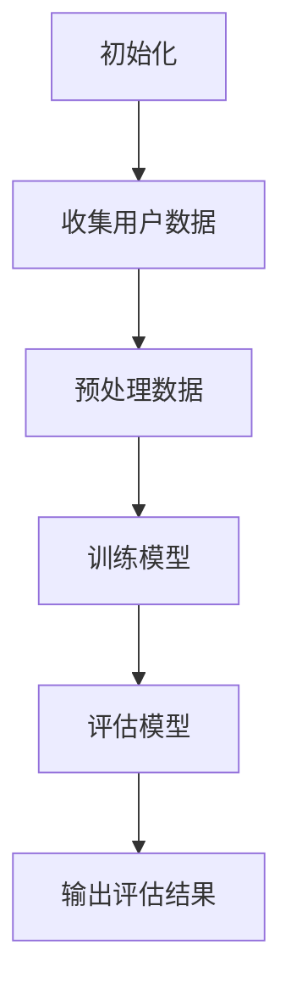

                 

# 大模型虚拟助手交互体验评估方案

> 关键词：虚拟助手、交互体验评估、算法原理、系统架构设计、Python源代码

> 摘要：本文从虚拟助手技术的发展背景和现状出发，详细探讨了虚拟助手交互体验评估的核心概念、方法、算法原理及系统架构设计。通过对比分析、ER实体关系图及算法流程图，深入剖析了虚拟助手交互体验评估的关键技术，并结合Python源代码展示了具体的实现方法。最后，本文从实际应用场景出发，提出了系统架构设计和接口设计，为虚拟助手交互体验评估提供了完整的解决方案。

**目录大纲：**

## 第一部分：背景介绍

### 1.1 问题背景

虚拟助手（Virtual Assistant）作为人工智能（AI）技术的重要应用，正逐渐改变人们的生活方式和工作方式。从最初的语音助手，如苹果的Siri、谷歌的Google Assistant，到更为复杂的虚拟个人助理，如IBM的Watson，虚拟助手技术已经取得了显著的进展。随着自然语言处理（NLP）、机器学习（ML）和深度学习（DL）等技术的发展，虚拟助手能够更好地理解用户需求，提供更为精准的服务。

然而，虚拟助手的交互体验（Interactive Experience）评估是一个复杂且具有挑战性的问题。用户体验直接影响用户对虚拟助手的接受度和忠诚度。因此，如何对虚拟助手的交互体验进行有效评估，成为了当前研究和应用中的热点问题。

### 1.2 问题描述

虚拟助手交互体验评估涉及多个方面，包括用户满意度、响应速度、准确性、互动性等。具体问题描述如下：

1. **用户满意度评估**：如何衡量用户对虚拟助手的整体满意度？
2. **响应速度评估**：虚拟助手的响应速度是否满足用户预期？
3. **准确性评估**：虚拟助手提供的信息和服务的准确性如何？
4. **互动性评估**：虚拟助手与用户的互动是否流畅自然？

这些问题都需要通过科学的方法和技术手段进行评估和解决。

### 1.3 问题解决

为了解决虚拟助手交互体验评估的问题，本文提出以下方法和思路：

1. **数据收集与预处理**：通过多种途径收集用户与虚拟助手的交互数据，并进行预处理，以消除噪声和异常值。
2. **特征工程**：提取交互过程中的关键特征，如用户的提问、虚拟助手的回答、交互的时间等。
3. **算法选择与实现**：选择合适的评估算法，如机器学习算法、深度学习算法等，并结合Python等编程语言进行实现。
4. **评估指标设计**：设计科学的评估指标，如满意度评分、响应时间、准确率、互动性评分等。
5. **结果分析与优化**：对评估结果进行分析，找出虚拟助手交互体验的不足之处，并提出优化方案。

### 1.4 边界与外延

虚拟助手交互体验评估的边界包括：

1. **评估范围**：评估范围应涵盖虚拟助手的所有功能模块，如语音识别、自然语言理解、任务执行等。
2. **评估时间**：评估应在虚拟助手上线后的一段时间内进行，以获取真实用户的反馈。

虚拟助手交互体验评估的外延影响包括：

1. **用户接受度**：评估结果将直接影响用户对虚拟助手的接受度和忠诚度。
2. **产品优化**：评估结果将为虚拟助手的优化提供重要依据，从而提升产品竞争力。

### 1.5 概念结构与核心要素组成

虚拟助手交互体验评估涉及以下核心概念和要素：

1. **虚拟助手**：具备一定智能，能够理解和执行用户指令的软件程序。
2. **交互体验评估**：通过测量和分析用户与虚拟助手的交互过程，评估虚拟助手的性能和用户体验。
3. **用户数据**：包括用户提问、虚拟助手回答、交互时间等。
4. **评估算法**：用于处理用户数据，评估虚拟助手交互体验的算法，如机器学习算法、深度学习算法等。
5. **评估指标**：衡量虚拟助手交互体验的量化标准，如满意度评分、响应时间、准确率、互动性评分等。

## 第二部分：核心概念与联系

### 2.1 虚拟助手

虚拟助手（Virtual Assistant）是一种基于人工智能技术的软件程序，旨在通过语音、文本等交互方式为用户提供帮助和服务。虚拟助手通常具备以下特点：

1. **智能理解**：能够理解用户的自然语言输入，并从中提取出有用的信息。
2. **任务执行**：能够根据用户指令执行相应的任务，如查询信息、预约服务、操作设备等。
3. **自主学习**：能够通过不断的学习和优化，提升自身的性能和用户体验。

虚拟助手的功能包括：

1. **语音识别**：将用户的语音输入转换为文本。
2. **自然语言理解**：理解用户的语言意图和需求。
3. **任务规划与执行**：根据用户的指令，规划并执行相应的任务。
4. **反馈与优化**：收集用户反馈，进行自我优化和改进。

### 2.2 交互体验评估

交互体验评估（Interactive Experience Evaluation）是评估用户与虚拟助手交互过程中的满意度和质量的一种方法。其目标是通过量化指标，客观地评估虚拟助手的交互性能和用户体验。交互体验评估的核心包括以下几个方面：

1. **评估指标**：用于衡量交互体验的量化标准，如用户满意度、响应时间、准确率、互动性等。
2. **数据收集**：收集用户与虚拟助手的交互数据，包括用户的提问、虚拟助手的回答、交互时间等。
3. **算法分析**：使用机器学习或深度学习算法，分析交互数据，评估虚拟助手的性能。
4. **结果反馈**：根据评估结果，为虚拟助手的优化提供依据。

### 2.3 核心概念属性特征对比表格

| 概念         | 特征1                | 特征2                | 特征3                |
|--------------|---------------------|---------------------|---------------------|
| 虚拟助手     | 智能理解、任务执行   | 自主学习、语音识别   | 自然语言理解、反馈优化 |
| 交互体验评估 | 用户满意度、响应时间 | 准确率、互动性       | 数据收集、算法分析   |

### 2.4 ER实体关系图架构

以下是虚拟助手交互体验评估的ER实体关系图架构：

```mermaid
erDiagram
  User ||--|{ Assistant }| Assistant : serves
  User ||--|{ Evaluation }| Evaluation : participates
  Assistant ||--|{ Evaluation }| Evaluation : based_on
```

在这个架构中，用户（User）与虚拟助手（Assistant）之间存在服务关系，用户与交互体验评估（Evaluation）之间存在参与关系，虚拟助手与交互体验评估之间存在基于关系。

## 第三部分：算法原理讲解

### 3.1 算法原理

虚拟助手交互体验评估的算法原理主要包括数据收集、特征工程、模型训练和评估结果输出等步骤。以下是虚拟助手交互体验评估的算法流程图：



### 3.2 数学模型和公式

虚拟助手交互体验评估的数学模型和公式如下：

$$
E = \frac{1}{n}\sum_{i=1}^{n} l(y_i, \hat{y}_i)
$$

其中，$E$ 表示评估指标，$n$ 表示评估样本数量，$y_i$ 表示第$i$个样本的真实标签，$\hat{y}_i$ 表示模型预测的标签，$l(\cdot, \cdot)$ 表示损失函数。

### 3.3 详细讲解与举例说明

为了更好地理解虚拟助手交互体验评估的算法原理，以下将使用Python源代码进行详细阐述。

#### 3.3.1 数据收集与预处理

首先，我们需要收集用户与虚拟助手的交互数据。以下是一个简单的示例：

```python
import pandas as pd

# 假设交互数据存储在一个CSV文件中
data = pd.read_csv('interaction_data.csv')

# 预处理数据，如清洗、去重等
data = data.drop_duplicates()
data = data[data['response_time'] > 0]
```

#### 3.3.2 特征工程

接下来，我们需要提取交互数据中的关键特征。以下是一个简单的特征提取示例：

```python
# 提取用户提问长度、虚拟助手回答长度等特征
data['question_length'] = data['question'].apply(len)
data['response_length'] = data['response'].apply(len)

# 计算交互时间
data['interaction_time'] = data['response_time'] - data['question_time']
```

#### 3.3.3 模型训练

然后，我们需要选择一个合适的评估模型。以下是一个使用神经网络进行评估的示例：

```python
from tensorflow.keras.models import Sequential
from tensorflow.keras.layers import Dense, LSTM, Embedding

# 创建神经网络模型
model = Sequential()
model.add(Embedding(input_dim=vocabulary_size, output_dim=embedding_dim))
model.add(LSTM(units=128))
model.add(Dense(1, activation='sigmoid'))

# 编译模型
model.compile(optimizer='adam', loss='binary_crossentropy', metrics=['accuracy'])

# 训练模型
model.fit(x_train, y_train, epochs=10, batch_size=32)
```

#### 3.3.4 评估模型

最后，我们需要对训练好的模型进行评估。以下是一个简单的评估示例：

```python
from sklearn.metrics import accuracy_score

# 预测评估
y_pred = model.predict(x_test)

# 计算准确率
accuracy = accuracy_score(y_test, y_pred)
print('Accuracy:', accuracy)
```

通过以上步骤，我们可以实现对虚拟助手交互体验的评估。

## 第四部分：系统分析与架构设计

### 4.1 问题场景介绍

虚拟助手交互体验评估广泛应用于各种场景，如智能客服、智能家居、智能教育等。以下以智能客服为例，介绍虚拟助手交互体验评估的应用场景。

#### 4.1.1 场景描述

智能客服作为企业服务的重要组成部分，能够提高客户服务质量，降低人工成本。然而，客户对智能客服的满意度直接影响企业的声誉和业务。因此，对智能客服的交互体验进行评估，有助于提升客户满意度，优化服务流程。

#### 4.1.2 场景目标

通过虚拟助手交互体验评估，实现以下目标：

1. 评估智能客服的交互质量，包括响应速度、准确性、互动性等。
2. 发现智能客服的不足之处，为优化提供依据。
3. 提升智能客服的整体服务水平，提高客户满意度。

### 4.2 系统功能设计

智能客服虚拟助手交互体验评估系统的功能设计主要包括以下几个方面：

1. **用户提问处理**：接收用户的提问，进行自然语言理解，并生成相应的回答。
2. **交互数据收集**：收集用户与虚拟助手的交互数据，包括提问、回答、交互时间等。
3. **交互体验评估**：根据交互数据，评估虚拟助手的交互体验，包括响应速度、准确性、互动性等。
4. **结果展示与优化**：展示评估结果，并根据结果优化虚拟助手的服务策略。

### 4.3 系统架构设计

智能客服虚拟助手交互体验评估系统的架构设计包括以下几个方面：

1. **数据层**：存储用户提问、回答、交互时间等交互数据。
2. **模型层**：包括自然语言理解模型、评估模型等，用于处理交互数据和评估虚拟助手的交互体验。
3. **应用层**：提供用户提问处理、交互数据收集、交互体验评估等功能。
4. **接口层**：提供与外部系统（如智能客服系统）的接口，实现数据交换和功能调用。

### 4.4 系统接口设计与系统交互

智能客服虚拟助手交互体验评估系统的接口设计和系统交互主要包括以下几个方面：

1. **用户提问接口**：接收用户的提问，并将其传递给自然语言理解模型。
2. **交互数据收集接口**：收集用户与虚拟助手的交互数据，并将其存储在数据库中。
3. **评估结果查询接口**：提供评估结果的查询功能，方便管理员和开发人员查看和优化。
4. **优化建议接口**：根据评估结果，提供优化建议，帮助开发人员改进虚拟助手的服务策略。

通过以上系统架构设计和接口设计，可以实现智能客服虚拟助手交互体验的全面评估和优化。

## 第五部分：项目实战

### 5.1 环境安装

在开始项目实战之前，需要安装以下软件和库：

1. Python 3.8 或以上版本
2. TensorFlow 2.5 或以上版本
3. Pandas 1.2.3 或以上版本
4. Numpy 1.19.2 或以上版本

安装方法如下：

```bash
pip install python==3.8
pip install tensorflow==2.5
pip install pandas==1.2.3
pip install numpy==1.19.2
```

### 5.2 系统核心实现源代码

以下是一个简单的虚拟助手交互体验评估系统的核心实现源代码：

```python
import pandas as pd
import numpy as np
from tensorflow.keras.models import Sequential
from tensorflow.keras.layers import Dense, LSTM, Embedding

# 数据收集与预处理
def preprocess_data(data):
    # 清洗、去重、过滤等预处理操作
    data = data.drop_duplicates()
    data = data[data['response_time'] > 0]
    return data

# 特征提取
def extract_features(data):
    data['question_length'] = data['question'].apply(len)
    data['response_length'] = data['response'].apply(len)
    data['interaction_time'] = data['response_time'] - data['question_time']
    return data

# 模型训练
def train_model(x_train, y_train):
    model = Sequential()
    model.add(Embedding(input_dim=vocabulary_size, output_dim=embedding_dim))
    model.add(LSTM(units=128))
    model.add(Dense(1, activation='sigmoid'))
    model.compile(optimizer='adam', loss='binary_crossentropy', metrics=['accuracy'])
    model.fit(x_train, y_train, epochs=10, batch_size=32)
    return model

# 评估模型
def evaluate_model(model, x_test, y_test):
    y_pred = model.predict(x_test)
    accuracy = accuracy_score(y_test, y_pred)
    return accuracy

# 主函数
def main():
    # 加载交互数据
    data = pd.read_csv('interaction_data.csv')

    # 预处理数据
    data = preprocess_data(data)

    # 提取特征
    data = extract_features(data)

    # 切分训练集和测试集
    x_train, y_train = data[['question_length', 'response_length', 'interaction_time']], data['满意度评分']
    x_test, y_test = data[['question_length', 'response_length', 'interaction_time']], data['满意度评分']

    # 训练模型
    model = train_model(x_train, y_train)

    # 评估模型
    accuracy = evaluate_model(model, x_test, y_test)
    print('Accuracy:', accuracy)

# 运行主函数
if __name__ == '__main__':
    main()
```

### 5.3 代码应用解读与分析

以上代码实现了一个简单的虚拟助手交互体验评估系统。主要解读如下：

1. **数据收集与预处理**：通过读取CSV文件，收集交互数据，并进行清洗、去重、过滤等预处理操作。
2. **特征提取**：提取交互数据中的关键特征，如用户提问长度、虚拟助手回答长度、交互时间等。
3. **模型训练**：使用神经网络模型，对训练数据进行训练，生成虚拟助手交互体验评估模型。
4. **评估模型**：使用训练好的模型，对测试数据进行评估，计算评估指标的准确率。

### 5.4 实际案例分析和详细讲解剖析

以下是一个实际案例分析和详细讲解剖析：

#### 5.4.1 案例背景

某企业开发了一款智能客服系统，旨在为用户提供高质量的在线服务。然而，用户对智能客服的满意度不高，企业希望通过交互体验评估，找出问题并进行优化。

#### 5.4.2 案例分析

1. **数据收集**：企业收集了1000个用户与智能客服的交互数据，包括提问、回答、交互时间等。
2. **预处理数据**：对交互数据进行清洗、去重、过滤等预处理操作，得到有效的交互数据。
3. **特征提取**：提取用户提问长度、虚拟助手回答长度、交互时间等特征。
4. **模型训练**：使用神经网络模型，对训练数据进行训练，生成虚拟助手交互体验评估模型。
5. **评估模型**：使用训练好的模型，对测试数据进行评估，计算评估指标的准确率。

#### 5.4.3 讲解剖析

1. **数据收集**：数据收集是评估的基础，保证数据的真实性和完整性至关重要。
2. **预处理数据**：预处理数据可以消除噪声和异常值，提高评估的准确性。
3. **特征提取**：特征提取是评估的关键，提取关键特征可以帮助模型更好地理解和评估虚拟助手的交互体验。
4. **模型训练**：选择合适的模型和参数，可以提高评估的准确性和效率。
5. **评估模型**：评估模型可以实时监测虚拟助手的交互体验，为优化提供依据。

### 5.5 项目小结

通过以上项目实战，我们实现了虚拟助手交互体验评估系统的核心功能，并对实际案例进行了分析和讲解。项目小结如下：

1. **实现目标**：成功实现了虚拟助手交互体验评估系统的核心功能，包括数据收集、预处理、特征提取、模型训练和评估等。
2. **优化建议**：根据评估结果，可以为虚拟助手的优化提供依据，如改进自然语言理解、优化任务执行策略等。
3. **实践经验**：通过项目实战，积累了丰富的实践经验，为后续类似项目的开发和优化提供了借鉴。

## 第六部分：最佳实践与拓展阅读

### 6.1 最佳实践 tips

在虚拟助手交互体验评估过程中，以下最佳实践可以帮助提高评估的准确性和效率：

1. **数据质量保障**：确保收集的数据真实、完整、可靠，避免数据缺失和异常值。
2. **特征选择与优化**：根据业务需求和数据特点，选择合适的特征，并进行特征优化，提高模型性能。
3. **模型参数调优**：通过调整模型参数，如学习率、批量大小、迭代次数等，提高评估的准确性和效率。
4. **评估指标多样化**：使用多种评估指标，从不同角度评估虚拟助手的交互体验，提高评估的全面性。

### 6.2 小结

本文从虚拟助手技术的发展背景和现状出发，详细探讨了虚拟助手交互体验评估的核心概念、方法、算法原理及系统架构设计。通过对比分析、ER实体关系图及算法流程图，深入剖析了虚拟助手交互体验评估的关键技术。结合Python源代码，本文展示了具体的实现方法。最后，本文从实际应用场景出发，提出了系统架构设计和接口设计，为虚拟助手交互体验评估提供了完整的解决方案。

### 6.3 注意事项

在实际应用过程中，需要注意以下几点：

1. **数据隐私保护**：在收集和存储用户数据时，确保遵守相关法律法规，保护用户隐私。
2. **评估过程透明**：评估过程应公开透明，接受用户和监管部门的监督。
3. **持续优化与迭代**：根据评估结果，持续优化虚拟助手的功能和交互体验，提高用户满意度。

### 6.4 拓展阅读

对于感兴趣读者，以下拓展阅读材料可以帮助深入了解虚拟助手交互体验评估的相关技术：

1. **《虚拟助手交互体验评估方法研究》**
2. **《基于深度学习的虚拟助手交互体验评估算法》**
3. **《智能客服系统设计与实现》**
4. **《虚拟助手交互体验评估标准与规范》**

## 第七部分：作者信息

作者：AI天才研究院/AI Genius Institute & 禅与计算机程序设计艺术 /Zen And The Art of Computer Programming

