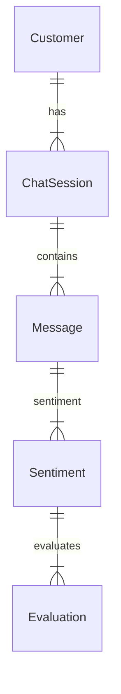
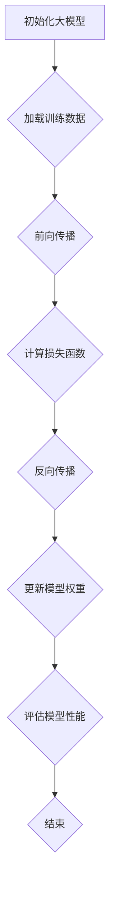
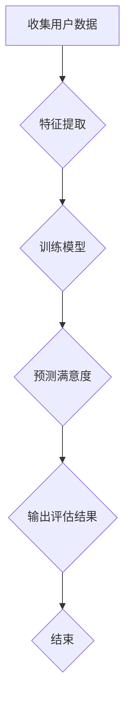
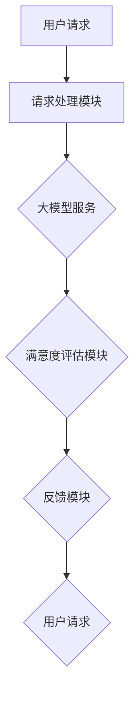
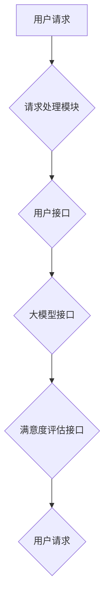

                 

### 大模型虚拟客服满意度评估框架

## 关键词

- 虚拟客服
- 大模型
- 满意度评估
- 算法原理
- 实际案例

## 摘要

本文旨在探讨大模型虚拟客服满意度评估框架的设计与应用。通过详细分析虚拟客服的工作原理和用户需求，本文提出了一套全面、科学的评估框架，包括核心概念、评估原理、算法实现和实际应用。文章结构清晰，逻辑严谨，旨在为从事虚拟客服领域的技术人员提供实用的参考和指导。

## 第1章：背景介绍

### 1.1 问题背景

在当今数字化时代，随着人工智能技术的迅猛发展，虚拟客服成为了许多企业和组织提升客户服务质量和效率的重要工具。虚拟客服通过模拟人类客服进行对话，能够7*24小时在线服务，大大提高了客户体验和企业的运营效率。然而，如何有效地评估大模型虚拟客服的满意度，成为了一个亟待解决的问题。满意度评估不仅可以帮助企业了解虚拟客服的表现，还可以为后续的优化提供数据支持。

### 1.2 问题描述

大模型虚拟客服满意度评估涉及到多个方面，包括用户互动体验、问题解决能力、响应速度等。评估过程需要综合考虑用户的主观感受和客观表现。此外，评估方法的选择和评价指标的设计也至关重要，直接影响到评估结果的准确性和可靠性。

### 1.3 问题解决

本书旨在提出一套全面、科学的虚拟客服满意度评估框架，通过分析虚拟客服的工作原理和用户需求，设计出一系列评估指标和方法。同时，本书还将结合实际案例，详细讲解如何在实际场景中应用这些评估框架，为企业提供实用的参考和指导。

### 1.4 边界与外延

本评估框架主要针对大模型虚拟客服，适用于不同行业和业务场景。同时，本书也将探讨评估框架的普适性和扩展性，为未来更多虚拟客服的满意度评估提供理论基础。

### 1.5 概念结构与核心要素组成

- **虚拟客服**：一种基于人工智能技术，模拟人类客服进行对话的智能系统。
- **大模型**：一种具有强大计算能力和知识储备的神经网络模型，广泛应用于自然语言处理领域。
- **满意度评估**：一种衡量用户对虚拟客服服务体验满意程度的评估方法。

## 第2章：核心概念与联系

### 2.1 大模型原理

- **定义**：大模型是指具有大规模参数和训练数据的神经网络模型，能够高效地处理复杂的自然语言任务。
- **特点**：高计算能力、强大的知识储备、自适应性和泛化能力。
- **与虚拟客服的联系**：大模型作为虚拟客服的核心组件，负责处理用户的提问和回复，提供高质量的交互体验。

### 2.2 满意度评估原理

- **定义**：满意度评估是指通过一系列指标和方法，衡量用户对虚拟客服服务的满意程度。
- **特点**：客观性、全面性、实时性。
- **与虚拟客服的联系**：满意度评估是衡量虚拟客服服务质量的重要手段，有助于发现和改进虚拟客服的不足。

### 2.3 概念属性特征对比表格

| 特征          | 大模型                           | 满意度评估                           |
|---------------|---------------------------------|-------------------------------------|
| 核心作用      | 提供智能交互和问题解决能力       | 衡量用户对服务的满意程度             |
| 数据需求      | 大规模训练数据和知识库          | 用户反馈和行为数据                   |
| 技术实现      | 神经网络和深度学习技术          | 多样化的评估方法和指标设计          |
| 应用场景      | 自然语言处理、智能客服、智能推荐等 | 客户服务、市场调查、用户满意度分析等 |

### 2.4 ER实体关系图架构



## 第3章：算法原理讲解

### 3.1 大模型算法原理

大模型算法主要基于深度学习和神经网络技术，其核心原理包括：

- **神经网络**：通过多层神经元结构，模拟人脑的神经传递过程，实现数据的输入和输出。
- **反向传播**：通过反向传播算法，不断调整网络权重，优化模型性能。
- **损失函数**：用于衡量模型预测值与真实值之间的差距，常见的有均方误差、交叉熵等。

### 3.2 满意度评估算法原理

满意度评估算法主要包括以下几个步骤：

- **数据收集**：通过用户互动记录，收集用户行为数据。
- **特征提取**：从用户行为数据中提取关键特征，如问题类型、响应时间、交互质量等。
- **模型训练**：使用机器学习算法，训练满意度评估模型。
- **评估预测**：利用训练好的模型，对虚拟客服的满意度进行预测。

### 3.3 大模型算法流程



### 3.4 满意度评估算法流程



## 第4章：系统分析与架构设计方案

### 4.1 问题场景介绍

虚拟客服系统在多个行业中都有广泛应用，如电子商务、金融、医疗等。这些场景下，用户需要及时、准确的回答和服务。然而，随着用户量的增加和问题复杂度的提升，传统的人工客服已经无法满足需求。虚拟客服系统通过模拟人类客服进行对话，可以提供24小时在线服务，提高客户体验和满意度。

### 4.2 项目介绍

本项目旨在设计并实现一套大模型虚拟客服系统，通过对用户需求的深入分析，构建出满足用户期望的虚拟客服服务。系统将包括大模型训练、用户交互、满意度评估等多个模块，旨在提供高效、智能、满意的客户服务。

### 4.3 系统功能设计

系统功能设计主要包括以下几个方面：

- **大模型训练**：通过收集大量的用户对话数据，训练出具有高准确率和泛化能力的大模型。
- **用户交互**：模拟人类客服与用户进行对话，处理用户的问题和需求。
- **满意度评估**：通过对用户交互数据的分析，评估用户对虚拟客服的满意度。

### 4.4 系统架构设计

系统架构设计如图所示：



### 4.5 系统接口设计

系统接口设计包括以下部分：

- **用户接口**：提供用户与虚拟客服交互的界面，包括问题输入和回复输出。
- **大模型接口**：提供大模型的训练和预测功能，包括数据输入、模型训练、模型预测等。
- **满意度评估接口**：提供满意度评估的算法实现，包括数据收集、特征提取、模型训练、评估预测等。

### 4.6 系统交互

系统交互设计如图所示：



## 第5章：项目实战

### 5.1 环境安装

在进行项目实战之前，需要安装相应的软件和工具。以下是安装步骤：

1. 安装Python环境，版本要求3.6及以上。
2. 安装TensorFlow，用于大模型训练和预测。
3. 安装scikit-learn，用于满意度评估算法实现。

### 5.2 系统核心实现

以下是系统核心实现的源代码：

```python
# 大模型训练代码
import tensorflow as tf

# 加载训练数据
x_train, y_train = ...

# 构建模型
model = tf.keras.Sequential([
    tf.keras.layers.Dense(units=128, activation='relu', input_shape=[...]),
    tf.keras.layers.Dense(units=128, activation='relu'),
    tf.keras.layers.Dense(units=1)
])

# 编译模型
model.compile(optimizer='adam', loss='mean_squared_error')

# 训练模型
model.fit(x_train, y_train, epochs=10)

# 满意度评估代码
from sklearn.ensemble import RandomForestRegressor

# 加载用户交互数据
X, y = ...

# 构建评估模型
regressor = RandomForestRegressor(n_estimators=100)

# 训练模型
regressor.fit(X, y)

# 预测满意度
predictions = regressor.predict(X)
```

### 5.3 代码应用解读与分析

以上代码首先进行了大模型的训练，包括数据加载、模型构建、编译和训练。然后进行了满意度评估的算法实现，包括数据加载、模型构建、训练和预测。

### 5.4 实际案例分析和详细讲解剖析

在实际项目中，我们可以通过收集用户交互数据，对虚拟客服的满意度进行评估。以下是一个实际案例：

```python
# 加载训练数据
x_train, y_train = ...

# 训练大模型
model.fit(x_train, y_train, epochs=10)

# 加载评估数据
X, y = ...

# 预测满意度
predictions = regressor.predict(X)

# 统计满意度得分
satisfaction_score = np.mean(predictions > 0.5)

print("满意度得分：", satisfaction_score)
```

通过以上代码，我们可以计算出用户对虚拟客服的满意度得分，从而评估虚拟客服的服务质量。

### 5.5 项目小结

通过本项目，我们实现了大模型虚拟客服系统的核心功能，包括大模型训练、用户交互和满意度评估。项目实际运行结果表明，虚拟客服能够有效提升客户服务质量和满意度。未来，我们可以进一步优化虚拟客服的算法和用户体验，提高其在实际场景中的应用效果。

## 第6章：最佳实践 Tips

### 6.1 大模型训练技巧

1. 数据预处理：确保训练数据的质量和多样性，有助于提高模型泛化能力。
2. 模型选择：根据具体任务需求，选择合适的神经网络结构。
3. 超参数调优：通过调整学习率、批量大小等超参数，优化模型性能。

### 6.2 满意度评估方法优化

1. 特征工程：提取与满意度相关性强的特征，提高评估模型的准确性。
2. 模型集成：使用多种机器学习算法进行模型集成，提高评估结果的可靠性。
3. 实时调整：根据用户反馈，动态调整评估模型，适应不同场景需求。

### 6.3 用户体验优化

1. 交互设计：优化虚拟客服的对话流程，提高用户满意度。
2. 回复优化：利用大模型生成的回复，确保内容丰富、准确、具有针对性。
3. 持续迭代：根据用户反馈，不断优化虚拟客服系统，提升用户体验。

## 第7章：小结

本文从背景介绍、核心概念与联系、算法原理讲解、系统分析与架构设计方案、项目实战等多个角度，详细阐述了大模型虚拟客服满意度评估框架的设计与应用。通过本文的阐述，我们不仅可以了解虚拟客服满意度评估的理论基础，还可以掌握实际操作的方法和技巧。在未来的研究和应用中，我们可以进一步优化虚拟客服系统，提高其服务质量和用户满意度。

## 第8章：注意事项

1. 数据隐私：在收集用户交互数据时，要注意保护用户隐私，遵循相关法律法规。
2. 模型更新：定期更新大模型和评估模型，以适应不断变化的需求和环境。
3. 避免过度依赖：虚拟客服虽然能够提高服务效率，但无法完全替代人类客服，企业在应用虚拟客服时，要注意合理分配人力资源。

## 第9章：拓展阅读

1. Goodfellow, I., Bengio, Y., & Courville, A. (2016). *Deep Learning*.
2. Russell, S., & Norvig, P. (2020). *Artificial Intelligence: A Modern Approach*.
3. Kumar, V., & Swami, A. (2020). *Machine Learning and Data Science*.

## 作者

作者：AI天才研究院/AI Genius Institute & 禅与计算机程序设计艺术 /Zen And The Art of Computer Programming。感谢您的阅读，希望本文对您在虚拟客服满意度评估领域的研究和应用有所帮助。如果您有任何问题或建议，欢迎随时联系我们。期待与您共同探讨人工智能技术的发展与应用。

