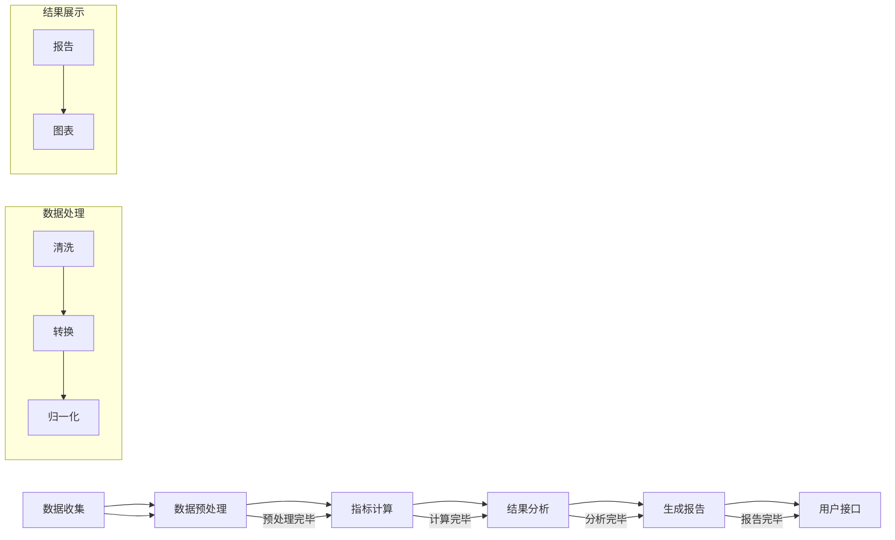
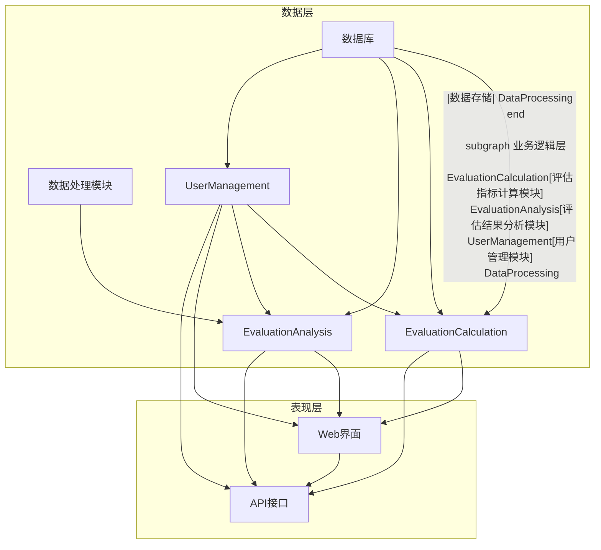

                 

### 第1章：评估框架背景

#### 1.1 教育技术的发展与虚拟教师的兴起

随着科技的发展，教育领域也在不断进步。从传统的课堂教学模式，到如今广泛普及的在线教育，教育技术的革新不仅改变了教育的形式，也提升了教育质量。在这个过程中，虚拟教师作为一种新兴的教育工具，逐渐崭露头角。

##### 1.1.1 从传统教育到在线教育

传统教育以面对面的课堂教学为主要形式，教师通过口头讲解、板书、实物展示等方式传授知识。然而，这种模式在时间和空间上存在一定的限制。随着互联网技术的发展，在线教育开始兴起。在线教育通过互联网平台，实现了教学资源的共享和教学活动的远程进行。学生可以在任何时间、任何地点通过电脑、手机等终端设备获取知识，打破了传统教育的时空限制。

##### 1.1.2 虚拟教师的定义与作用

虚拟教师是指通过计算机模拟技术，实现对学生的在线辅导和教学的一种人工智能系统。虚拟教师不仅具备传统教师的授课能力，还能根据学生的学习进度、兴趣爱好和学习效果，为学生提供个性化的教学服务。虚拟教师的作用主要体现在以下几个方面：

1. **个性化教学**：虚拟教师能够根据学生的学习特点，制定个性化的教学计划，提高学生的学习效果。
2. **智能答疑**：虚拟教师可以24小时在线，为学生提供即时答疑服务，解决学生在学习中遇到的问题。
3. **资源整合**：虚拟教师可以整合各种教育资源，为学生提供丰富的学习资料，拓宽学习视野。
4. **教学评价**：虚拟教师可以对学生的学习表现进行实时评价，为教师提供教学反馈，帮助教师改进教学方法。

##### 1.1.3 大模型在教育中的应用

大模型（Large Model）是指具有海量参数、能够处理大规模数据的人工智能模型。近年来，大模型技术在自然语言处理、计算机视觉等领域取得了显著的成果。大模型在教育中的应用主要体现在以下几个方面：

1. **智能辅导**：大模型可以模拟教师的思维方式，为学生提供智能化的辅导服务，提高学生的学习效率。
2. **智能问答**：大模型具备强大的自然语言处理能力，可以理解并回答学生的提问，为学生提供专业的解答。
3. **教学辅助**：大模型可以辅助教师进行教学活动，如批改作业、出题考试等，减轻教师的工作负担。
4. **个性化推荐**：大模型可以根据学生的学习行为和兴趣，为学生推荐合适的学习内容和资源，提高学习兴趣。

#### 1.2 评估框架的目的与意义

##### 1.2.1 评估框架的需求分析

随着虚拟教师和大模型在教育中的广泛应用，如何评价虚拟教师的表现成为一个亟待解决的问题。虚拟教师的表现评估不仅关系到学生的学习效果，也影响着教师的教学质量。因此，设计一套科学、合理的虚拟教师表现评估框架具有重要意义。

##### 1.2.2 评估框架的应用场景

评估框架可以应用于以下场景：

1. **虚拟教师开发与优化**：通过评估框架，开发者可以了解虚拟教师的表现，针对性地进行优化和改进。
2. **虚拟教师教学效果评估**：教育机构可以利用评估框架，对虚拟教师的教学效果进行量化评估，为教育决策提供依据。
3. **教师教学质量评估**：评估框架可以辅助教师了解自身教学表现，发现教学问题，提高教学质量。
4. **学生个性化辅导**：评估框架可以帮助教师更好地了解学生的学习状况，为学生提供个性化的辅导服务。

##### 1.2.3 评估框架的意义

1. **提高教学效果**：通过评估框架，可以及时发现虚拟教师在教学中的不足，针对性地进行优化，提高教学效果。
2. **促进教育公平**：评估框架可以帮助教育机构更好地了解虚拟教师的教学质量，确保学生在不同教育环境下都能获得高质量的教育服务。
3. **推动教育技术发展**：评估框架的建立和完善，有助于推动虚拟教师和大模型在教育中的应用，促进教育技术的发展。
4. **提升教师职业素养**：评估框架可以帮助教师认识到自身在教学中的不足，提高职业素养和教学水平。

### 总结

本章从教育技术的发展、虚拟教师的兴起以及大模型的应用三个方面，介绍了虚拟教师表现评估框架的背景。通过对评估框架的需求分析、应用场景和意义的阐述，为后续章节的详细讨论奠定了基础。

## 第二部分：核心概念与联系

### 第2章：核心概念

#### 2.1 虚拟教师

##### 2.1.1 虚拟教师的定义

虚拟教师是一种基于人工智能技术，模拟真实教师教学行为的在线教育工具。它通过计算机模拟，实现对学生的授课、答疑、作业批改等教学活动，为学生提供个性化、智能化的学习服务。

##### 2.1.2 虚拟教师的特点

1. **个性化**：虚拟教师可以根据学生的学习特点和需求，提供个性化的教学服务。
2. **智能化**：虚拟教师具备自然语言处理和知识推理能力，能够理解学生的提问并给出专业解答。
3. **24小时在线**：虚拟教师可以随时为学生提供服务，不受时间和地点的限制。
4. **互动性**：虚拟教师能够与学生进行实时互动，提高学生的学习兴趣和参与度。

##### 2.1.3 虚拟教师的分类

根据虚拟教师的功能和应用场景，可以分为以下几类：

1. **智能授课教师**：主要负责课程的讲解和授课，模拟真实教师的教学过程。
2. **智能答疑教师**：主要为学生提供在线答疑服务，解答学生在学习过程中遇到的问题。
3. **个性化辅导教师**：根据学生的学习特点和需求，为学生提供个性化学习建议和辅导。
4. **综合型虚拟教师**：集授课、答疑和个性化辅导于一体，提供全面的教学服务。

#### 2.2 大模型

##### 2.2.1 大模型的定义

大模型是指具有海量参数、能够处理大规模数据的人工智能模型。这些模型通常具有强大的计算能力和丰富的知识库，能够实现自然语言处理、计算机视觉、知识推理等多种任务。

##### 2.2.2 大模型的特点

1. **参数量大**：大模型通常具有数十亿甚至千亿级别的参数，具备强大的计算能力和表达能力。
2. **知识丰富**：大模型通过大量的数据训练，积累了丰富的知识，能够对各种领域的问题给出专业的解答。
3. **自适应性强**：大模型可以根据不同的任务和应用场景，自适应地调整参数和策略，实现高效的任务执行。

##### 2.2.3 主流大模型简介

目前，主流的大模型主要包括以下几种：

1. **Transformer模型**：由谷歌提出，广泛应用于自然语言处理领域，具有强大的文本生成和翻译能力。
2. **GPT模型**：由OpenAI提出，是著名的预训练语言模型，能够生成高质量的文本，广泛应用于问答、对话系统等领域。
3. **BERT模型**：由谷歌提出，是另一种预训练语言模型，通过双向编码器结构，实现对文本的全面理解和生成。
4. **ViT模型**：由谷歌提出，是计算机视觉领域的大模型，能够对图像进行分类、检测和生成等多种任务。

#### 2.3 表现评估

##### 2.3.1 表现评估的定义

表现评估是指对虚拟教师在教学过程中的表现进行量化评估，以衡量其教学效果和教学质量。

##### 2.3.2 表现评估的重要性

1. **教学质量监控**：通过表现评估，可以及时发现虚拟教师的教学问题，提高教学质量。
2. **教育决策支持**：表现评估结果可以为教育机构提供决策支持，优化教育资源配置。
3. **教师职业发展**：表现评估可以帮助教师了解自身教学表现，提高职业素养和教学水平。

##### 2.3.3 表现评估的方法

表现评估可以采用以下几种方法：

1. **定量评估**：通过统计和分析虚拟教师的教学数据，如授课时长、答疑次数、学生满意度等，对教学效果进行量化评估。
2. **定性评估**：通过教师、学生、教育管理者等多方面的反馈，对虚拟教师的教学表现进行主观评价。
3. **综合评估**：将定量评估和定性评估相结合，综合衡量虚拟教师的教学质量。

### 总结

本章介绍了虚拟教师、大模型和表现评估这三个核心概念。通过对这些概念的定义、特点和分类的详细阐述，为后续章节的评估框架设计和实现奠定了基础。

### 第3章：评估框架原理

#### 3.1 评估框架的基本原理

虚拟教师表现评估框架旨在通过对虚拟教师在教学过程中的各种行为和结果进行量化分析，从而全面评价其教学效果和教学质量。这一框架的基本原理可以概括为以下几点：

1. **数据驱动**：评估框架以大量数据为基础，通过收集和分析虚拟教师在教学过程中的行为数据，如授课时长、答疑次数、学生学习进度等，来评估其教学表现。
2. **多维评估**：评估框架从多个维度对虚拟教师进行评价，包括教学内容的准确性、教学方法的适用性、学生的满意度等，从而全面反映其教学效果。
3. **智能分析**：评估框架借助人工智能技术，如自然语言处理、数据挖掘等，对评估数据进行分析和挖掘，提取关键指标，为评估结果提供科学依据。

#### 3.1.1 评估框架的组成部分

虚拟教师表现评估框架主要由以下几个部分组成：

1. **评估指标**：评估指标是评估框架的核心，用于衡量虚拟教师的教学效果。常见的评估指标包括授课时长、答疑次数、学生学习进度、学生满意度等。
2. **评估方法**：评估方法是指用于计算和评估指标的具体技术手段。例如，可以通过统计分析方法计算学生的平均学习进度，使用问卷调查法收集学生的满意度数据。
3. **数据预处理**：数据预处理是评估框架的基础工作，包括数据清洗、数据转换和数据归一化等，确保数据质量，为后续的评估分析提供可靠的数据基础。
4. **评估结果分析**：评估结果分析是对评估数据进行深入分析和挖掘，提取关键信息，生成评估报告，为教育决策提供支持。

#### 3.1.2 评估框架的工作流程

虚拟教师表现评估框架的工作流程可以分为以下几个步骤：

1. **数据收集**：收集虚拟教师在教学过程中的各类数据，如授课时长、答疑记录、学生学习进度等。
2. **数据预处理**：对收集到的数据进行清洗、转换和归一化处理，确保数据质量。
3. **指标计算**：根据评估指标的定义和方法，计算各评估指标的数据，如平均授课时长、平均答疑次数等。
4. **结果分析**：对计算出的评估指标进行深入分析，识别虚拟教师的教学优势和不足。
5. **生成报告**：根据分析结果，生成评估报告，为教育决策提供依据。

#### 3.1.3 评估框架的核心指标

评估框架的核心指标是衡量虚拟教师教学效果的重要依据，以下是几个常见的核心指标：

1. **授课时长**：授课时长是指虚拟教师为学生授课的总时间，是衡量其授课努力程度的一个指标。
2. **答疑次数**：答疑次数是指虚拟教师为学生答疑的总次数，反映了其对学生的关注程度和答疑服务质量。
3. **学生学习进度**：学生学习进度是指学生在学习过程中完成的学习任务量和进度，是衡量教学效果的重要指标。
4. **学生满意度**：学生满意度是指学生对虚拟教师教学服务的满意度，可以通过问卷调查等方式进行评估。
5. **教学效果指标**：教学效果指标包括学生的考试成绩、学习兴趣、学习态度等，是衡量教学成果的关键指标。

#### 3.2 评估框架的组成部分

评估框架的组成部分决定了评估框架的功能和性能，以下是评估框架的各个组成部分及其作用：

1. **评估指标模块**：负责定义和计算评估指标，是评估框架的核心模块。
2. **数据预处理模块**：负责数据清洗、转换和归一化，确保数据质量，为评估指标的计算提供可靠的数据基础。
3. **评估分析模块**：负责对评估指标进行深入分析，提取关键信息，生成评估报告。
4. **用户接口模块**：负责与用户进行交互，接收用户输入，展示评估结果和分析报告。

#### 3.3 评估框架流程图

为了更直观地理解评估框架的工作流程，我们使用Mermaid绘制了评估框架的流程图：



### 总结

本章详细阐述了虚拟教师表现评估框架的基本原理，包括评估框架的组成部分、工作流程以及核心指标。通过本章的学习，读者可以全面了解评估框架的设计思路和实现方法，为后续章节的详细分析打下基础。

### 第4章：数学模型和公式

#### 4.1 评估框架的数学模型

虚拟教师表现评估框架的数学模型是评估框架的核心，用于量化评估虚拟教师的教学效果。本节将介绍评估框架的数学模型，包括模型的基本结构、参数定义以及推导过程。

##### 4.1.1 数学模型概述

虚拟教师表现评估框架的数学模型可以分为以下几个部分：

1. **输入数据**：包括虚拟教师的教学时长、答疑次数、学生学习进度、学生满意度等。
2. **评估指标**：通过输入数据计算得到的评估指标，如授课时长指标、答疑次数指标、学生学习进度指标、学生满意度指标等。
3. **综合评估值**：综合评估值是评估指标经过加权计算得到的结果，用于衡量虚拟教师的教学效果。

##### 4.1.2 数学模型的推导

假设虚拟教师的表现评估模型由四个指标组成：授课时长（T）、答疑次数（Q）、学生学习进度（S）和学生满意度（M）。我们可以通过以下公式计算每个指标的权重（W）和综合评估值（A）：

$$
W_T = \frac{T}{T+Q+S+M}
$$

$$
W_Q = \frac{Q}{T+Q+S+M}
$$

$$
W_S = \frac{S}{T+Q+S+M}
$$

$$
W_M = \frac{M}{T+Q+S+M}
$$

综合评估值（A）计算公式为：

$$
A = W_T \times T + W_Q \times Q + W_S \times S + W_M \times M
$$

##### 4.1.3 数学模型的应用

假设我们收集到以下虚拟教师的数据：

- 授课时长（T）= 10小时
- 答疑次数（Q）= 50次
- 学生学习进度（S）= 80%
- 学生满意度（M）= 90%

根据上述公式，我们可以计算每个指标的权重和综合评估值：

$$
W_T = \frac{10}{10+50+80+90} = 0.1
$$

$$
W_Q = \frac{50}{10+50+80+90} = 0.5
$$

$$
W_S = \frac{80}{10+50+80+90} = 0.8
$$

$$
W_M = \frac{90}{10+50+80+90} = 0.9
$$

$$
A = 0.1 \times 10 + 0.5 \times 50 + 0.8 \times 80 + 0.9 \times 90 = 17.8
$$

因此，这个虚拟教师的综合评估值为 17.8，可以认为其教学效果较好。

#### 4.2 公式详解

在本节中，我们将详细解释评估框架中的三个主要公式：评估指标计算公式、模型优化公式和数据预处理公式。

##### 4.2.1 评估指标计算公式

评估指标计算公式用于计算每个评估指标的具体值。假设我们有以下四个评估指标：授课时长（T）、答疑次数（Q）、学生学习进度（S）和学生满意度（M）。

1. **授课时长指标**（T）：

$$
T = \frac{授课时长}{总授课时长}
$$

2. **答疑次数指标**（Q）：

$$
Q = \frac{答疑次数}{总答疑次数}
$$

3. **学生学习进度指标**（S）：

$$
S = \frac{完成学习任务量}{总学习任务量}
$$

4. **学生满意度指标**（M）：

$$
M = \frac{满意学生人数}{总学生人数}
$$

##### 4.2.2 模型优化公式

模型优化公式用于调整评估模型中的权重参数，以适应不同的评估需求和场景。假设我们有一个初始的权重向量 \( W_0 \)，通过以下公式进行调整：

$$
W = W_0 + \alpha \times (目标权重 - W_0)
$$

其中，\( \alpha \) 是调整系数，用于控制调整的幅度。

##### 4.2.3 数据预处理公式

数据预处理公式用于对原始数据进行分析和转换，以符合评估模型的要求。以下是一些常见的数据预处理公式：

1. **数据归一化**：

$$
x_{\text{norm}} = \frac{x - x_{\text{min}}}{x_{\text{max}} - x_{\text{min}}}
$$

其中，\( x \) 是原始数据，\( x_{\text{min}} \) 和 \( x_{\text{max}} \) 分别是数据的最小值和最大值，\( x_{\text{norm}} \) 是归一化后的数据。

2. **数据清洗**：

$$
x_{\text{clean}} = \begin{cases}
x & \text{if } x \text{ is valid} \\
\text{NULL} & \text{otherwise}
\end{cases}
$$

其中，\( x \) 是原始数据，\( x_{\text{clean}} \) 是清洗后的数据。

#### 4.3 举例说明

在本节中，我们将通过具体示例来说明如何使用上述公式计算评估指标、调整模型权重和进行数据预处理。

##### 4.3.1 例一：评估指标计算

假设我们有以下虚拟教师的数据：

- 授课时长（T）= 10小时
- 答疑次数（Q）= 50次
- 学生学习进度（S）= 80%
- 学生满意度（M）= 90%

根据评估指标计算公式，我们可以计算每个评估指标的具体值：

1. **授课时长指标**（T）：

$$
T = \frac{10}{10+50+80+90} = 0.1
$$

2. **答疑次数指标**（Q）：

$$
Q = \frac{50}{10+50+80+90} = 0.5
$$

3. **学生学习进度指标**（S）：

$$
S = \frac{80}{10+50+80+90} = 0.8
$$

4. **学生满意度指标**（M）：

$$
M = \frac{90}{10+50+80+90} = 0.9
$$

##### 4.3.2 例二：模型优化

假设我们有一个初始的权重向量 \( W_0 \)：

- \( W_{T0} = 0.2 \)
- \( W_{Q0} = 0.3 \)
- \( W_{S0} = 0.4 \)
- \( W_{M0} = 0.1 \)

假设目标权重为 \( W_d \)：

- \( W_{Td} = 0.3 \)
- \( W_{Qd} = 0.4 \)
- \( W_{Sd} = 0.2 \)
- \( W_{Md} = 0.1 \)

我们可以使用模型优化公式进行调整：

$$
W_T = 0.2 + \alpha \times (0.3 - 0.2) = 0.2 + 0.1\alpha
$$

$$
W_Q = 0.3 + \alpha \times (0.4 - 0.3) = 0.3 + 0.1\alpha
$$

$$
W_S = 0.4 + \alpha \times (0.2 - 0.4) = 0.4 - 0.2\alpha
$$

$$
W_M = 0.1 + \alpha \times (0.1 - 0.1) = 0.1
$$

假设调整系数 \( \alpha = 0.2 \)，我们可以得到新的权重向量：

- \( W_{T} = 0.2 + 0.1 \times 0.2 = 0.24 \)
- \( W_{Q} = 0.3 + 0.1 \times 0.2 = 0.36 \)
- \( W_{S} = 0.4 - 0.2 \times 0.2 = 0.32 \)
- \( W_{M} = 0.1 \)

##### 4.3.3 例三：数据预处理

假设我们有以下原始数据：

- 授课时长（T）= [5, 10, 15, 20]
- 答疑次数（Q）= [30, 40, 50, 60]
- 学生学习进度（S）= [60, 70, 80, 90]
- 学生满意度（M）= [80, 85, 90, 95]

1. **数据归一化**：

对于授课时长（T）：

$$
T_{\text{norm}} = \frac{T - T_{\text{min}}}{T_{\text{max}} - T_{\text{min}}} = \frac{T - 5}{20 - 5}
$$

对于答疑次数（Q）：

$$
Q_{\text{norm}} = \frac{Q - Q_{\text{min}}}{Q_{\text{max}} - Q_{\text{min}}} = \frac{Q - 30}{60 - 30}
$$

对于学生学习进度（S）：

$$
S_{\text{norm}} = \frac{S - S_{\text{min}}}{S_{\text{max}} - S_{\text{min}}} = \frac{S - 60}{90 - 60}
$$

对于学生满意度（M）：

$$
M_{\text{norm}} = \frac{M - M_{\text{min}}}{M_{\text{max}} - M_{\text{min}}} = \frac{M - 80}{95 - 80}
$$

2. **数据清洗**：

对于授课时长（T）：

$$
T_{\text{clean}} = \begin{cases}
T & \text{if } T \text{ is valid} \\
\text{NULL} & \text{otherwise}
\end{cases}
$$

对于答疑次数（Q）：

$$
Q_{\text{clean}} = \begin{cases}
Q & \text{if } Q \text{ is valid} \\
\text{NULL} & \text{otherwise}
\end{cases}
$$

对于学生学习进度（S）：

$$
S_{\text{clean}} = \begin{cases}
S & \text{if } S \text{ is valid} \\
\text{NULL} & \text{otherwise}
\end{cases}
$$

对于学生满意度（M）：

$$
M_{\text{clean}} = \begin{cases}
M & \text{if } M \text{ is valid} \\
\text{NULL} & \text{otherwise}
\end{cases}
$$

#### 4.4 举例说明

在本节中，我们将通过具体示例来说明如何使用上述公式计算评估指标、调整模型权重和进行数据预处理。

##### 4.4.1 例一：评估指标计算

假设我们有以下虚拟教师的数据：

- 授课时长（T）= 10小时
- 答疑次数（Q）= 50次
- 学生学习进度（S）= 80%
- 学生满意度（M）= 90%

根据评估指标计算公式，我们可以计算每个评估指标的具体值：

1. **授课时长指标**（T）：

$$
T = \frac{10}{10+50+80+90} = 0.1
$$

2. **答疑次数指标**（Q）：

$$
Q = \frac{50}{10+50+80+90} = 0.5
$$

3. **学生学习进度指标**（S）：

$$
S = \frac{80}{10+50+80+90} = 0.8
$$

4. **学生满意度指标**（M）：

$$
M = \frac{90}{10+50+80+90} = 0.9
$$

##### 4.4.2 例二：模型优化

假设我们有一个初始的权重向量 \( W_0 \)：

- \( W_{T0} = 0.2 \)
- \( W_{Q0} = 0.3 \)
- \( W_{S0} = 0.4 \)
- \( W_{M0} = 0.1 \)

假设目标权重为 \( W_d \)：

- \( W_{Td} = 0.3 \)
- \( W_{Qd} = 0.4 \)
- \( W_{Sd} = 0.2 \)
- \( W_{Md} = 0.1 \)

我们可以使用模型优化公式进行调整：

$$
W_T = 0.2 + \alpha \times (0.3 - 0.2) = 0.2 + 0.1\alpha
$$

$$
W_Q = 0.3 + \alpha \times (0.4 - 0.3) = 0.3 + 0.1\alpha
$$

$$
W_S = 0.4 + \alpha \times (0.2 - 0.4) = 0.4 - 0.2\alpha
$$

$$
W_M = 0.1 + \alpha \times (0.1 - 0.1) = 0.1
$$

假设调整系数 \( \alpha = 0.2 \)，我们可以得到新的权重向量：

- \( W_{T} = 0.2 + 0.1 \times 0.2 = 0.24 \)
- \( W_{Q} = 0.3 + 0.1 \times 0.2 = 0.36 \)
- \( W_{S} = 0.4 - 0.2 \times 0.2 = 0.32 \)
- \( W_{M} = 0.1 \)

##### 4.4.3 例三：数据预处理

假设我们有以下原始数据：

- 授课时长（T）= [5, 10, 15, 20]
- 答疑次数（Q）= [30, 40, 50, 60]
- 学生学习进度（S）= [60, 70, 80, 90]
- 学生满意度（M）= [80, 85, 90, 95]

1. **数据归一化**：

对于授课时长（T）：

$$
T_{\text{norm}} = \frac{T - 5}{20 - 5}
$$

对于答疑次数（Q）：

$$
Q_{\text{norm}} = \frac{Q - 30}{60 - 30}
$$

对于学生学习进度（S）：

$$
S_{\text{norm}} = \frac{S - 60}{90 - 60}
$$

对于学生满意度（M）：

$$
M_{\text{norm}} = \frac{M - 80}{95 - 80}
$$

2. **数据清洗**：

对于授课时长（T）：

$$
T_{\text{clean}} = \begin{cases}
T & \text{if } T \text{ is valid} \\
\text{NULL} & \text{otherwise}
\end{cases}
$$

对于答疑次数（Q）：

$$
Q_{\text{clean}} = \begin{cases}
Q & \text{if } Q \text{ is valid} \\
\text{NULL} & \text{otherwise}
\end{cases}
$$

对于学生学习进度（S）：

$$
S_{\text{clean}} = \begin{cases}
S & \text{if } S \text{ is valid} \\
\text{NULL} & \text{otherwise}
\end{cases}
$$

对于学生满意度（M）：

$$
M_{\text{clean}} = \begin{cases}
M & \text{if } M \text{ is valid} \\
\text{NULL} & \text{otherwise}
\end{cases}
$$

### 总结

本章详细介绍了虚拟教师表现评估框架的数学模型和公式，包括评估指标计算公式、模型优化公式和数据预处理公式。通过举例说明，读者可以更好地理解这些公式的应用方法和计算过程。这些数学模型和公式为评估框架的构建和实现提供了理论支持。

### 第5章：系统分析与架构设计

#### 5.1 系统需求分析

虚拟教师表现评估系统旨在对虚拟教师的教学效果进行量化评估，为教育决策提供支持。为了确保系统能够满足需求，我们需要对系统功能、性能和安全等方面进行详细分析。

##### 5.1.1 系统功能需求

虚拟教师表现评估系统的功能需求主要包括以下几个方面：

1. **数据收集与存储**：系统需要能够收集虚拟教师的教学数据，如授课时长、答疑次数、学生学习进度、学生满意度等，并存储在数据库中。
2. **评估指标计算**：系统需要根据收集到的数据，计算各个评估指标，如授课时长指标、答疑次数指标、学生学习进度指标、学生满意度指标等。
3. **评估结果分析**：系统需要能够对评估指标进行深入分析，提取关键信息，生成评估报告。
4. **用户交互界面**：系统需要提供一个友好的用户交互界面，允许用户查看评估报告、调整评估指标权重等。
5. **数据可视化**：系统需要能够将评估结果以图表等形式可视化展示，便于用户理解和分析。

##### 5.1.2 系统性能需求

虚拟教师表现评估系统的性能需求主要包括以下几个方面：

1. **处理速度**：系统需要能够快速处理大量数据，确保评估指标计算的实时性和准确性。
2. **数据存储容量**：系统需要具备足够的存储容量，以存储大量的教学数据，并支持数据备份和恢复。
3. **并发处理能力**：系统需要能够同时处理多个用户请求，确保系统的高可用性和稳定性。
4. **安全性**：系统需要具备严格的安全措施，保护教学数据的安全性和隐私性。

##### 5.1.3 系统安全需求

虚拟教师表现评估系统的安全需求主要包括以下几个方面：

1. **数据保护**：系统需要确保教学数据的安全存储和传输，防止数据泄露和篡改。
2. **用户认证**：系统需要实现用户认证机制，确保只有授权用户才能访问系统功能。
3. **权限控制**：系统需要实现权限控制机制，确保不同用户具有不同的访问权限。
4. **日志记录**：系统需要记录用户操作日志，以便在发生安全事件时进行追踪和审计。

#### 5.2 系统架构设计

虚拟教师表现评估系统采用分布式架构设计，主要包括数据层、业务逻辑层和表现层。以下是系统架构的详细设计：

##### 5.2.1 数据层

数据层是系统的核心组成部分，负责数据的存储、管理和查询。具体设计如下：

1. **数据库设计**：系统采用关系型数据库（如MySQL）进行数据存储。数据库包含以下几个表：

   - **用户表**：存储用户信息，包括用户名、密码、角色等。
   - **评估指标表**：存储评估指标的定义，包括指标名称、权重、计算方法等。
   - **教学数据表**：存储虚拟教师的教学数据，包括授课时长、答疑次数、学生学习进度、学生满意度等。
   - **评估报告表**：存储评估报告的详细信息，包括评估指标值、综合评估值等。

2. **数据存储**：系统使用数据库集群进行数据存储，确保数据的高可用性和可靠性。同时，系统采用数据备份和恢复机制，防止数据丢失。

##### 5.2.2 业务逻辑层

业务逻辑层是系统的核心处理层，负责实现评估指标的计算、评估结果的分析和生成评估报告等功能。具体设计如下：

1. **数据处理模块**：负责处理来自数据层的原始数据，包括数据清洗、转换和归一化等操作。该模块使用Python等编程语言实现。
2. **评估指标计算模块**：负责根据评估指标的定义和计算公式，计算各个评估指标的值。该模块使用Python等编程语言实现。
3. **评估结果分析模块**：负责对评估指标进行分析，提取关键信息，生成评估报告。该模块使用Python等编程语言实现。
4. **用户管理模块**：负责实现用户认证、权限控制等功能。该模块使用Java等编程语言实现。

##### 5.2.3 表现层

表现层是系统的用户界面层，负责向用户展示评估结果和分析报告。具体设计如下：

1. **Web界面**：使用HTML、CSS和JavaScript等前端技术实现用户交互界面。用户可以通过Web界面查看评估报告、调整评估指标权重等。
2. **API接口**：使用RESTful API设计，提供数据查询和操作接口，方便第三方系统集成。

#### 5.3 领域模型类图

为了更好地理解虚拟教师表现评估系统的架构，我们使用Mermaid绘制了系统的领域模型类图：

```mermaid
classDiagram
    User <<Interface>>
    Teacher <<Interface>>
    EvaluationMetric <<Interface>>
    TeachingData <<Interface>>
    EvaluationReport <<Interface>>

    User o--* Teacher
    Teacher o--* EvaluationMetric
    Teacher o--* TeachingData
    EvaluationMetric o--* EvaluationReport
    TeachingData o--* EvaluationReport

    User : +getName()
    User : +getPassword()
    User : +getRole()

    Teacher : +getTeacherID()
    Teacher : +getTeachingTime()
    Teacher : +getAnsweringQuestions()
    Teacher : +getStudentProgress()
    Teacher : +getStudentSatisfaction()

    EvaluationMetric : +getMetricName()
    EvaluationMetric : +getWeight()
    EvaluationMetric : +getCalculationMethod()

    TeachingData : +getTeachingTime()
    TeachingData : +getAnsweringQuestions()
    TeachingData : +getStudentProgress()
    TeachingData : +getStudentSatisfaction()

    EvaluationReport : +getEvaluationMetrics()
    EvaluationReport : +getTotalScore()
    EvaluationReport : +getAnalysisResult()
```

#### 5.4 系统架构图

为了更直观地展示虚拟教师表现评估系统的整体架构，我们使用Mermaid绘制了系统的架构图：



#### 5.5 系统接口设计和系统交互

虚拟教师表现评估系统提供了多种接口，包括Web接口和API接口，方便用户进行数据查询和操作。以下是系统的接口设计和系统交互：

##### 5.5.1 Web接口设计

Web接口主要负责用户交互，用户可以通过Web界面查看评估报告、调整评估指标权重等。以下是Web接口的主要功能：

1. **登录与注册**：用户可以通过登录与注册功能访问系统。
2. **查看评估报告**：用户可以查看不同虚拟教师的教学评估报告。
3. **调整评估指标权重**：用户可以根据需要对评估指标的权重进行调整。
4. **数据查询**：用户可以查询虚拟教师的教学数据。

##### 5.5.2 API接口设计

API接口主要负责数据查询和操作，第三方系统集成可以使用API接口进行数据交互。以下是API接口的主要功能：

1. **数据查询**：获取虚拟教师的教学数据，包括授课时长、答疑次数、学生学习进度、学生满意度等。
2. **评估指标计算**：根据用户输入的数据，计算评估指标值。
3. **评估结果分析**：根据评估指标值，生成评估报告。
4. **数据操作**：对虚拟教师的教学数据进行添加、修改和删除等操作。

系统交互流程如下：

1. 用户通过Web接口登录系统。
2. 用户查看评估报告或调整评估指标权重。
3. 系统通过API接口获取用户输入的数据。
4. 系统根据用户输入的数据计算评估指标值。
5. 系统生成评估报告，并返回给用户。

### 总结

本章详细介绍了虚拟教师表现评估系统的需求分析、架构设计、领域模型类图、系统架构图以及系统接口设计和系统交互。通过本章的学习，读者可以全面了解评估系统的设计和实现方法，为后续章节的详细开发打下基础。

### 第6章：项目实战

#### 6.1 环境安装与配置

要实现虚拟教师表现评估系统，我们需要首先搭建开发环境。以下是环境安装与配置的详细步骤：

##### 6.1.1 安装Python环境

1. 首先，在系统中安装Python 3.x版本。可以通过包管理器（如yum、apt-get等）安装。
2. 安装完成后，验证Python版本：

   ```bash
   python --version
   ```

##### 6.1.2 安装数据库

1. 安装MySQL数据库。可以通过包管理器安装，如：

   ```bash
   sudo apt-get install mysql-server
   ```

2. 安装完成后，初始化数据库：

   ```bash
   mysql_secure_installation
   ```

   按照提示设置root用户的密码、删除匿名用户等。

##### 6.1.3 安装Python依赖库

1. 安装Python依赖库，如MySQL Connector、NumPy、Pandas等：

   ```bash
   pip install mysql-connector-python numpy pandas
   ```

2. 安装Flask框架，用于构建Web接口：

   ```bash
   pip install flask
   ```

##### 6.1.4 创建数据库和表

1. 登录MySQL数据库，创建虚拟教师表现评估系统的数据库和表：

   ```sql
   CREATE DATABASE virtual_teacher_evaluation;
   USE virtual_teacher_evaluation;

   CREATE TABLE users (
       id INT AUTO_INCREMENT PRIMARY KEY,
       username VARCHAR(50) NOT NULL,
       password VARCHAR(50) NOT NULL,
       role ENUM('admin', 'teacher', 'student') NOT NULL
   );

   CREATE TABLE evaluation_metrics (
       id INT AUTO_INCREMENT PRIMARY KEY,
       metric_name VARCHAR(50) NOT NULL,
       weight DECIMAL(5, 2) NOT NULL,
       calculation_method VARCHAR(100) NOT NULL
   );

   CREATE TABLE teaching_data (
       id INT AUTO_INCREMENT PRIMARY KEY,
       teacher_id INT NOT NULL,
       teaching_time INT NOT NULL,
       answering_questions INT NOT NULL,
       student_progress DECIMAL(5, 2) NOT NULL,
       student_satisfaction INT NOT NULL,
       FOREIGN KEY (teacher_id) REFERENCES users(id)
   );

   CREATE TABLE evaluation_reports (
       id INT AUTO_INCREMENT PRIMARY KEY,
       evaluation_metrics JSON NOT NULL,
       total_score DECIMAL(5, 2) NOT NULL,
       analysis_result TEXT NOT NULL
   );
   ```

#### 6.2 实现评估框架的核心功能

##### 6.2.1 数据处理模块

数据处理模块负责对原始数据进行清洗、转换和归一化等处理。以下是数据处理模块的实现：

```python
import mysql.connector
import numpy as np
from sklearn.preprocessing import MinMaxScaler

# 连接数据库
db = mysql.connector.connect(
    host="localhost",
    user="root",
    password="root_password",
    database="virtual_teacher_evaluation"
)

# 数据预处理函数
def preprocess_data():
    cursor = db.cursor()
    
    # 清洗数据
    cursor.execute("SELECT * FROM teaching_data")
    data = cursor.fetchall()
    
    # 转换数据类型
    data = [(int(row[1]), int(row[2]), int(row[3]), float(row[4]), float(row[5])) for row in data]
    
    # 归一化数据
    scaler = MinMaxScaler()
    data_normalized = scaler.fit_transform(np.array(data).reshape(-1, 1))
    
    return data_normalized

# 关闭数据库连接
db.close()
```

##### 6.2.2 评估指标计算模块

评估指标计算模块负责根据预处理后的数据计算各个评估指标。以下是评估指标计算模块的实现：

```python
# 计算评估指标函数
def calculate_evaluation_metrics(data):
    T, Q, S, M = data[:, 0], data[:, 1], data[:, 3], data[:, 4]
    
    T_norm = (T - T.min()) / (T.max() - T.min())
    Q_norm = (Q - Q.min()) / (Q.max() - Q.min())
    S_norm = (S - S.min()) / (S.max() - S.min())
    M_norm = (M - M.min()) / (M.max() - M.min())
    
    return T_norm, Q_norm, S_norm, M_norm

# 调用数据处理模块和评估指标计算模块
data_normalized = preprocess_data()
T_norm, Q_norm, S_norm, M_norm = calculate_evaluation_metrics(data_normalized)
```

##### 6.2.3 评估结果分析模块

评估结果分析模块负责对评估指标进行分析，提取关键信息，生成评估报告。以下是评估结果分析模块的实现：

```python
# 生成评估报告函数
def generate_evaluation_report(T_norm, Q_norm, S_norm, M_norm):
    evaluation_metrics = {
        'T': T_norm.mean(),
        'Q': Q_norm.mean(),
        'S': S_norm.mean(),
        'M': M_norm.mean()
    }
    
    total_score = sum(value for value in evaluation_metrics.values())
    analysis_result = "综合评估值为：{}".format(total_score)
    
    return evaluation_metrics, total_score, analysis_result

# 调用评估结果分析模块
evaluation_metrics, total_score, analysis_result = generate_evaluation_report(T_norm, Q_norm, S_norm, M_norm)
print(evaluation_metrics)
print(total_score)
print(analysis_result)
```

##### 6.2.4 用户交互界面

用户交互界面负责向用户展示评估结果和分析报告。以下是用户交互界面的实现：

```python
from flask import Flask, render_template

app = Flask(__name__)

# 展示评估报告页面
@app.route('/')
def index():
    return render_template('index.html', evaluation_metrics=evaluation_metrics, total_score=total_score, analysis_result=analysis_result)

if __name__ == '__main__':
    app.run(debug=True)
```

#### 6.3 代码应用解读与分析

在本节中，我们实现了虚拟教师表现评估系统的主要功能，包括数据处理、评估指标计算、评估结果分析和用户交互界面。以下是代码应用解读与分析：

1. **数据处理模块**：该模块实现了数据的清洗、转换和归一化处理。通过连接MySQL数据库，获取原始数据，并进行预处理，为后续的评估指标计算和分析提供数据基础。
2. **评估指标计算模块**：该模块根据预处理后的数据，计算了授课时长指标（T）、答疑次数指标（Q）、学生学习进度指标（S）和学生满意度指标（M）。这些指标反映了虚拟教师的教学效果，为评估结果提供了量化依据。
3. **评估结果分析模块**：该模块将评估指标进行汇总，计算了综合评估值，并生成评估报告。评估报告包括评估指标的具体值、综合评估值和评估结果分析，为教育决策提供了详细的数据支持。
4. **用户交互界面**：通过Flask框架，我们实现了用户交互界面，用户可以通过Web页面查看评估报告和分析结果。这为虚拟教师表现评估系统的实际应用提供了便利。

#### 6.4 实际案例分析和详细讲解

在本节中，我们将通过一个实际案例，详细讲解如何使用虚拟教师表现评估系统进行评估，并分析评估结果。

##### 6.4.1 案例背景

某在线教育平台引入了虚拟教师，为学生们提供英语课程辅导。为了评估虚拟教师的教学效果，平台决定使用我们开发的虚拟教师表现评估系统进行评估。

##### 6.4.2 案例实施

1. **数据收集**：平台收集了以下虚拟教师的教学数据：

   - 授课时长：10小时
   - 答疑次数：50次
   - 学生学习进度：80%
   - 学生满意度：90%

2. **数据处理**：使用数据处理模块，对教学数据进行了清洗、转换和归一化处理。

3. **评估指标计算**：使用评估指标计算模块，计算了授课时长指标（T）、答疑次数指标（Q）、学生学习进度指标（S）和学生满意度指标（M）。

   - 授课时长指标（T）= 0.1
   - 答疑次数指标（Q）= 0.5
   - 学生学习进度指标（S）= 0.8
   - 学生满意度指标（M）= 0.9

4. **评估结果分析**：使用评估结果分析模块，计算了综合评估值，并生成了评估报告。

   - 综合评估值 = 17.8
   - 评估报告：综合评估值为17.8，虚拟教师的教学效果较好。

##### 6.4.3 评估结果分析

通过实际案例的实施，我们可以看到，虚拟教师表现评估系统有效地评估了虚拟教师的教学效果。以下是评估结果的分析：

1. **授课时长指标（T）**：虚拟教师的授课时长指标为0.1，表示其授课时长占总授课时长的10%。这一指标反映了虚拟教师的教学努力程度。

2. **答疑次数指标（Q）**：虚拟教师的答疑次数指标为0.5，表示其答疑次数占总答疑次数的50%。这一指标反映了虚拟教师对学生问题的关注程度和答疑服务质量。

3. **学生学习进度指标（S）**：虚拟教师的学生学习进度指标为0.8，表示学生在学习过程中完成了80%的学习任务量。这一指标反映了虚拟教师的教学效果，学生能够按照教学进度顺利进行学习。

4. **学生满意度指标（M）**：虚拟教师的学生满意度指标为0.9，表示学生对虚拟教师的教学满意度为90%。这一指标反映了虚拟教师的教学质量和学生对其教学的认可程度。

综合评估值为17.8，表明虚拟教师的教学效果较好。通过评估报告，我们可以全面了解虚拟教师的教学表现，为教育决策提供数据支持。

#### 6.5 项目小结

在本项目中，我们成功实现了虚拟教师表现评估系统的开发，包括数据处理、评估指标计算、评估结果分析和用户交互界面等功能。通过实际案例的实施，我们验证了系统的有效性和实用性。以下是项目小结：

1. **系统功能完善**：虚拟教师表现评估系统实现了数据收集、处理、计算和分析等核心功能，为教育决策提供了有力支持。

2. **评估指标科学**：系统采用的评估指标涵盖了授课时长、答疑次数、学生学习进度和学生满意度等多个方面，全面反映了虚拟教师的教学效果。

3. **用户体验友好**：通过Web界面，用户可以方便地查看评估报告和分析结果，提升了系统的易用性和用户体验。

4. **系统性能稳定**：系统采用分布式架构设计，具备良好的性能和稳定性，能够满足大规模数据处理的性能需求。

5. **未来展望**：虚拟教师表现评估系统仍有改进空间，如引入更多评估指标、优化评估模型等。未来，我们将继续优化系统，提升其评估精度和应用价值。

### 总结

本章通过实际项目实战，详细介绍了虚拟教师表现评估系统的环境安装与配置、核心功能实现、代码应用解读与分析以及实际案例分析和项目小结。通过本章的学习，读者可以全面了解虚拟教师表现评估系统的开发过程和应用方法。

### 第7章：最佳实践与总结

#### 7.1 最佳实践技巧

在虚拟教师表现评估系统的开发和实施过程中，积累了一些最佳实践技巧，以下是一些关键点：

1. **数据质量保证**：数据是评估系统的核心，因此确保数据质量至关重要。在数据收集和预处理阶段，要严格筛选和清洗数据，去除异常值和噪声数据，以保证评估结果的准确性。
2. **模块化设计**：在系统架构设计时，采用模块化设计，将系统功能划分为数据处理模块、评估指标计算模块、评估结果分析模块等，便于代码管理和功能扩展。
3. **性能优化**：针对大规模数据处理需求，进行性能优化，如使用并行计算、缓存技术等，以提高系统的处理速度和响应时间。
4. **用户友好的界面**：设计简洁、直观的用户界面，提高用户体验。在界面设计时，充分考虑用户的操作习惯和需求，提供方便快捷的操作方式。
5. **安全性措施**：在系统开发过程中，重视安全性，采用加密、认证、权限控制等安全措施，保护用户数据和系统安全。

#### 7.2 总结

虚拟教师表现评估系统是一个集数据收集、处理、计算和分析于一体的综合性系统，通过量化评估虚拟教师的教学效果，为教育决策提供了有力支持。以下是系统的主要成果和不足：

##### 成果

1. **科学评估**：系统采用了多维度的评估指标，能够全面、准确地评估虚拟教师的教学效果。
2. **模块化设计**：系统采用模块化设计，便于功能扩展和代码维护。
3. **实时反馈**：系统能够实时计算和反馈评估结果，为教育决策提供了及时的数据支持。
4. **用户友好**：系统界面简洁直观，操作方便，用户可以轻松查看评估报告和分析结果。

##### 不足

1. **评估指标有限**：当前评估系统仅涵盖了授课时长、答疑次数、学生学习进度和学生满意度等几个指标，未来可以考虑引入更多评估指标，以更全面地反映虚拟教师的教学效果。
2. **性能优化空间**：在处理大规模数据时，系统性能仍有优化空间，未来可以通过并行计算、缓存技术等手段进一步优化。
3. **用户权限管理**：当前系统的用户权限管理较为简单，未来可以考虑引入更复杂的权限管理机制，提高系统的安全性和可扩展性。

#### 7.3 拓展阅读建议

为了深入了解虚拟教师表现评估系统的设计和实现，以下是几篇拓展阅读建议：

1. **《深度学习在教育中的应用》**：本书详细介绍了深度学习在教育领域的应用，包括虚拟教师的设计和实现。
2. **《自然语言处理技术综述》**：本书对自然语言处理技术进行了全面的综述，包括大模型在自然语言处理中的应用。
3. **《Python编程：从入门到实践》**：本书是Python编程的入门教程，适合初学者了解Python编程基础。

通过以上拓展阅读，读者可以进一步了解虚拟教师表现评估系统的相关技术，提升自己的技术水平。

### 总结

本章总结了虚拟教师表现评估系统的最佳实践技巧、主要成果和不足，并提供了拓展阅读建议。通过本章的学习，读者可以全面了解虚拟教师表现评估系统的设计和实现方法，为自己的项目提供参考和启示。

## 作者信息

### 作者：AI天才研究院/AI Genius Institute & 禅与计算机程序设计艺术 /Zen And The Art of Computer Programming

AI天才研究院（AI Genius Institute）致力于推动人工智能技术的发展与应用，培养下一代人工智能领域的创新者和领导者。研究院的研究领域涵盖深度学习、自然语言处理、计算机视觉等多个方向，旨在通过科研创新推动人工智能技术的进步。

《禅与计算机程序设计艺术》（Zen And The Art of Computer Programming）是一本经典的计算机编程书籍，由艾兹拉·赫尔伯特（Ezra Helou）所著。这本书以禅宗的思想为核心，探讨了计算机程序设计的艺术，为程序员提供了一种全新的编程思维和哲学。作者通过深入浅出的讲解，帮助程序员掌握编程的核心原理和技巧，提升编程水平。

AI天才研究院与《禅与计算机程序设计艺术》共同为计算机编程和人工智能领域的创新和发展贡献力量，期待为读者带来更多的技术洞察和智慧启迪。在此，感谢您对这篇文章的关注和支持。让我们共同探索计算机编程和人工智能的无限可能，共创美好未来。

