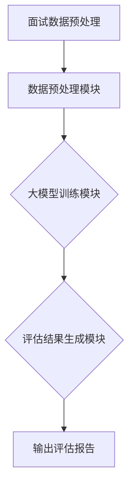

                 


### 大模型虚拟面试官表现评估工具

#### 关键词：大模型、虚拟面试官、评估工具、人工智能、面试

#### 摘要：
本文将深入探讨大模型虚拟面试官表现评估工具的设计与实现。首先，我们将介绍大模型和虚拟面试官评估工具的基本概念，然后详细分析大模型在面试官评估中的应用。接着，我们将讨论虚拟面试官评估工具的设计原理和评估指标，并通过具体案例展示其实际应用效果。最后，我们将展望虚拟面试官评估工具的未来发展趋势，提出面临的挑战及解决方案。

---

#### 引言

##### 1.1 问题背景

在当今快速发展的科技时代，人工智能（AI）技术已经成为推动社会进步的重要力量。特别是在面试官评估领域，人工智能的应用极大地提升了招聘效率和质量。传统面试官评估方法主要依赖于主观判断，容易受到个人偏见和情绪影响。而大模型虚拟面试官评估工具的出现，为面试官评估提供了一种全新的、客观的方法。

大模型是指具有巨大参数规模、能够处理海量数据并具备高度自主学习和推理能力的AI模型。虚拟面试官评估工具则是指利用大模型技术，模拟人类面试官进行面试评估的软件系统。这种工具能够自动分析面试者的表现，提供准确的评估结果，从而帮助招聘企业更高效地选拔人才。

##### 1.2 核心概念

###### 1.2.1 大模型的概念

大模型是指具有巨大参数规模、能够处理海量数据并具备高度自主学习和推理能力的AI模型。常见的有GPT、BERT等。大模型的核心优势在于其强大的数据处理能力和自主学习能力，能够从大量数据中提取有价值的信息，并进行精准的预测和判断。

###### 1.2.2 虚拟面试官评估工具的构成

虚拟面试官评估工具主要由数据预处理模块、大模型训练模块和评估结果生成模块组成。数据预处理模块负责清洗和预处理面试数据，大模型训练模块利用预处理的面试数据训练大模型，评估结果生成模块则根据大模型的预测结果生成评估报告。

###### 1.2.3 评估指标与方法

评估指标主要包括面试者的回答准确性、回答流畅度、知识掌握程度等。评估方法则包括基于文本分析、语音识别和图像识别等技术手段，对面试者的回答进行综合评估。

##### 1.3 书籍概述

本书旨在系统地介绍大模型虚拟面试官表现评估工具的设计与实现。全书共分为七个部分，涵盖了从基本概念到实际应用的全过程。通过本书的学习，读者可以了解大模型和虚拟面试官评估工具的核心原理，掌握工具的设计和实现方法，并能够应对实际应用中的各种挑战。

##### 1.4 本章小结

本章介绍了大模型虚拟面试官表现评估工具的基本概念、核心原理和实际应用价值。在接下来的章节中，我们将进一步深入探讨大模型和虚拟面试官评估工具的具体实现过程，希望能够为读者提供有价值的参考和指导。

---

### 大模型基础

##### 2.1 大模型原理

###### 2.1.1 大模型的起源与发展

大模型的发展可以追溯到20世纪80年代的神经网络研究。随着计算能力和数据量的不断提升，大模型在自然语言处理、计算机视觉等领域取得了显著的成果。目前，大模型已经成为人工智能领域的重要研究方向和应用方向。

###### 2.1.2 大模型的基本结构

大模型通常由输入层、隐藏层和输出层组成。输入层接收外部数据，隐藏层通过复杂的神经网络结构进行数据处理和特征提取，输出层则生成预测结果。

###### 2.1.3 大模型的训练与优化

大模型的训练过程包括数据收集、模型构建、训练和优化等步骤。数据收集阶段需要收集大量的样本数据，模型构建阶段需要设计合适的神经网络结构，训练阶段通过不断迭代优化模型参数，优化阶段则通过调整模型结构或优化算法来提升模型性能。

##### 2.2 大模型应用

###### 2.2.1 大模型在自然语言处理中的应用

大模型在自然语言处理（NLP）领域具有广泛的应用，如文本分类、情感分析、机器翻译等。通过训练大量语言模型，大模型能够理解和生成复杂的自然语言，大大提升了NLP任务的性能。

###### 2.2.2 大模型在计算机视觉中的应用

大模型在计算机视觉（CV）领域也取得了显著的成果，如图像分类、目标检测、人脸识别等。大模型能够从大量图像数据中提取有效的特征，实现对图像内容的准确理解和分析。

###### 2.2.3 大模型在其他领域的应用

除了NLP和CV领域，大模型还在其他领域如语音识别、推荐系统、金融风控等方面取得了良好的应用效果。大模型的强大数据处理能力和自主学习能力，使得它能够在各种复杂任务中发挥重要作用。

##### 2.3 大模型评估

###### 2.3.1 评估指标

大模型的评估指标主要包括准确率、召回率、F1值等。这些指标能够反映模型在特定任务上的性能，帮助评估者了解模型的优缺点。

###### 2.3.2 评估方法

大模型的评估方法主要包括交叉验证、网格搜索、贝叶斯优化等。这些方法能够有效地调整模型参数，优化模型性能。

###### 2.3.3 评估案例分析

在本章的末尾，我们将通过一个具体的案例分析，展示大模型在面试官评估中的应用效果。通过对比实验，我们可以直观地看到大模型虚拟面试官评估工具的优势和不足。

##### 2.4 本章小结

本章介绍了大模型的基本原理、应用领域和评估方法。通过本章的学习，读者可以了解到大模型的强大能力和广泛应用，为后续章节的学习打下坚实的基础。

---

### 虚拟面试官评估工具设计

##### 3.1 虚拟面试官评估工具概述

###### 3.1.1 工具的构成

虚拟面试官评估工具主要由数据预处理模块、大模型训练模块和评估结果生成模块组成。数据预处理模块负责清洗和预处理面试数据，大模型训练模块利用预处理的面试数据训练大模型，评估结果生成模块则根据大模型的预测结果生成评估报告。

###### 3.1.2 工作原理

虚拟面试官评估工具的工作原理是基于大模型的技术，通过分析面试者的回答，预测面试者的表现。具体流程如下：

1. 面试者进行面试，系统实时记录面试者的回答。
2. 数据预处理模块对面试数据进行清洗和预处理，生成可供训练的数据集。
3. 大模型训练模块使用训练数据集训练大模型，优化模型参数。
4. 评估结果生成模块根据大模型的预测结果生成评估报告。

###### 3.1.3 工具的优势

虚拟面试官评估工具具有以下优势：

1. **客观性**：虚拟面试官评估工具基于数据驱动的方法，能够消除主观偏见，提供客观、准确的评估结果。
2. **高效性**：虚拟面试官评估工具能够快速处理大量面试数据，大大提升了招聘效率。
3. **全面性**：虚拟面试官评估工具能够对面试者的多个方面进行评估，提供全方位的评估报告。

##### 3.2 虚拟面试官评估工具开发

###### 3.2.1 开发环境与工具

虚拟面试官评估工具的开发需要使用Python编程语言和相关的机器学习库，如TensorFlow、PyTorch等。开发环境建议使用Anaconda，以便于管理和配置不同的库和依赖。

###### 3.2.2 数据预处理

数据预处理是虚拟面试官评估工具开发的关键步骤。主要任务包括数据清洗、数据归一化、特征提取等。数据清洗需要去除噪声数据和异常值，数据归一化则是将不同尺度的数据进行标准化处理，特征提取则是从原始数据中提取出有价值的特征，为后续模型训练提供支持。

###### 3.2.3 大模型选择与优化

在选择大模型时，需要考虑模型的性能、训练速度和适用范围。常用的模型包括GPT、BERT等。在选择模型后，需要对模型进行优化，包括调整超参数、使用更先进的技术等，以提高模型的性能。

##### 3.3 评估指标与方法

###### 3.3.1 评估指标设计

评估指标是衡量虚拟面试官评估工具性能的重要标准。常见的评估指标包括准确率、召回率、F1值等。根据不同的应用场景，可以选择不同的评估指标。

###### 3.3.2 评估方法选择

评估方法的选择取决于评估指标。常用的评估方法包括交叉验证、网格搜索、贝叶斯优化等。这些方法能够有效地调整模型参数，优化模型性能。

###### 3.3.3 评估案例分析

在本章的末尾，我们将通过一个具体的案例分析，展示虚拟面试官评估工具的评估效果。通过对比实验，我们可以直观地看到虚拟面试官评估工具的优势和不足。

##### 3.4 本章小结

本章介绍了虚拟面试官评估工具的基本概念、工作原理和开发方法。通过本章的学习，读者可以了解虚拟面试官评估工具的基本原理和实际应用价值，为后续章节的学习打下坚实的基础。

---

### 大模型虚拟面试官评估工具实现

#### 4.1 实现环境与工具

在本节中，我们将介绍大模型虚拟面试官评估工具的实现环境和所需工具。为了确保高效和稳定的开发过程，我们将使用以下环境和工具：

1. **开发语言**：Python
2. **机器学习库**：TensorFlow、PyTorch
3. **数据处理库**：Pandas、NumPy
4. **文本处理库**：NLTK、spaCy
5. **开发环境**：Anaconda

**4.1.1 开发环境搭建**

首先，我们需要搭建Python的开发环境。使用Anaconda可以方便地管理Python环境和库。以下是搭建开发环境的步骤：

1. 下载并安装Anaconda：[Anaconda下载地址](https://www.anaconda.com/products/distribution)
2. 打开Anaconda Navigator，创建一个新的环境，命名为`virtual_interviewer`。
3. 在新环境中安装所需的库，使用以下命令：
   ```
   conda install tensorflow pytorch pandas numpy nltk spacy
   ```

**4.1.2 相关工具介绍**

接下来，我们将简要介绍所用的相关工具：

- **TensorFlow**：是一个开源的机器学习框架，适用于构建和训练各种深度学习模型。
- **PyTorch**：也是一个开源的机器学习库，以其动态计算图和易于使用的接口而闻名。
- **Pandas**：是一个强大的数据处理库，用于数据清洗、数据转换和数据可视化。
- **NumPy**：是一个基础的科学计算库，提供多维数组对象和丰富的数学函数。
- **NLTK**：是一个自然语言处理库，用于文本处理、分类和词性标注。
- **spaCy**：是一个高效的自然语言处理库，提供快速和易于使用的接口。

**4.1.3 系统架构设计**

在实现虚拟面试官评估工具时，我们需要设计一个合理的系统架构。以下是系统架构的Mermaid流程图：



这个架构包括以下几个主要模块：

1. **数据预处理模块**：负责清洗和预处理面试数据。
2. **大模型训练模块**：负责使用预处理的数据训练大模型。
3. **评估结果生成模块**：负责根据大模型的预测结果生成评估报告。
4. **输出评估报告**：将评估报告输出给用户。

#### 4.2 数据预处理

**4.2.1 数据来源**

虚拟面试官评估工具的数据来源主要包括以下几个方面：

1. **面试文本数据**：包括面试问题的文本描述和面试者的回答文本。
2. **面试视频数据**：包括面试者的语音和面部表情。
3. **面试评分数据**：包括面试官对面试者的评分和评价。

**4.2.2 数据清洗**

数据清洗是数据预处理的重要步骤，主要包括以下任务：

1. **去除噪声数据**：去除包含无关信息的面试数据。
2. **去除异常值**：处理异常数据点，确保数据的一致性和可靠性。
3. **文本数据清洗**：去除文本中的标点符号、停用词和格式错误。

**4.2.3 数据增强**

数据增强是为了提高模型的泛化能力，主要包括以下方法：

1. **文本数据增强**：使用词干提取、词性标注、文本嵌入等技术。
2. **语音数据增强**：使用混响、回声、背景噪声等技术。
3. **面部表情数据增强**：使用面部表情合成、面部表情转换等技术。

#### 4.3 大模型选择与训练

**4.3.1 大模型选择**

在选择大模型时，我们需要考虑以下几个因素：

1. **任务需求**：根据不同的任务需求选择合适的模型。
2. **计算资源**：考虑模型的计算资源需求，确保模型能够在给定的时间内完成训练。
3. **模型性能**：评估不同模型的性能，选择最优模型。

常用的模型包括：

1. **GPT**：适用于文本生成和文本分类。
2. **BERT**：适用于文本分类、问答系统和机器翻译。
3. **ViT**：适用于计算机视觉任务。

**4.3.2 大模型训练**

大模型训练包括以下步骤：

1. **数据划分**：将数据集划分为训练集、验证集和测试集。
2. **模型构建**：构建大模型的架构，包括输入层、隐藏层和输出层。
3. **模型训练**：使用训练集训练模型，通过反向传播算法更新模型参数。
4. **模型优化**：使用验证集优化模型参数，避免过拟合。

**4.3.3 大模型优化**

大模型优化包括以下几个方面：

1. **超参数调整**：调整学习率、批量大小、正则化参数等。
2. **优化算法选择**：选择合适的优化算法，如Adam、SGD等。
3. **数据增强**：使用数据增强技术提高模型的泛化能力。

#### 4.4 虚拟面试官评估

**4.4.1 评估流程**

虚拟面试官评估的流程包括以下几个步骤：

1. **数据输入**：将面试者的回答和问题输入到模型中。
2. **模型预测**：模型根据输入数据预测面试者的表现。
3. **结果输出**：将预测结果输出为评估报告。

**4.4.2 评估指标计算**

评估指标计算包括以下几个指标：

1. **准确率**：预测正确的面试者数量与总面试者数量的比值。
2. **召回率**：预测正确的面试者数量与实际应聘者数量的比值。
3. **F1值**：综合考虑准确率和召回率的指标。

**4.4.3 评估案例分析**

在本节的末尾，我们将通过一个具体的案例分析，展示虚拟面试官评估工具的评估效果。案例包括以下步骤：

1. **数据收集**：收集一组面试者的回答数据。
2. **数据预处理**：对数据集进行清洗和预处理。
3. **模型训练**：使用预处理的数据集训练大模型。
4. **模型评估**：使用测试数据集评估模型的性能。
5. **结果分析**：分析评估报告，评估虚拟面试官评估工具的效果。

通过这个案例分析，我们可以直观地看到虚拟面试官评估工具的优势和不足，为进一步优化工具提供参考。

#### 4.5 本章小结

本章介绍了大模型虚拟面试官评估工具的实现过程，包括开发环境与工具的搭建、数据预处理、大模型选择与训练、虚拟面试官评估等。通过本章的学习，读者可以了解虚拟面试官评估工具的实现原理和实际应用方法，为后续的实际应用和优化提供指导。

---

### 案例分析

在本部分，我们将通过三个具体的案例，展示大模型虚拟面试官评估工具在不同场景下的应用效果。这些案例涵盖了大型企业、中小企业以及教育行业，旨在展示虚拟面试官评估工具的广泛适用性和实际价值。

#### 5.1 案例一：大型企业虚拟面试官评估工具实施

##### 5.1.1 案例背景

某大型企业在招聘过程中面临大量面试者和复杂的工作需求。为了提高招聘效率，企业决定引入大模型虚拟面试官评估工具，以实现自动化面试评估。

##### 5.1.2 案例分析

在实施过程中，企业首先进行了数据收集和预处理。数据来源包括面试问题的文本描述和面试者的回答文本。通过对数据进行清洗和预处理，企业生成了高质量的数据集，用于训练大模型。

接下来，企业使用GPT模型对数据进行训练，并在验证集上优化模型参数。经过多次迭代训练，模型性能得到了显著提升。

在正式应用阶段，企业将虚拟面试官评估工具集成到招聘系统中。面试官在面试过程中，系统会实时记录面试者的回答，并通过大模型进行评估。评估结果以评估报告的形式输出，帮助面试官快速了解面试者的表现。

##### 5.1.3 案例总结

通过实施虚拟面试官评估工具，企业大幅提升了招聘效率。评估报告提供了详细的面试者表现分析，帮助面试官做出更准确的决策。同时，虚拟面试官评估工具的客观性和高效性，为企业节省了大量时间和人力资源。

#### 5.2 案例二：中小企业虚拟面试官评估工具应用

##### 5.2.1 案例背景

某中小企业在招聘过程中，由于面试官资源有限，无法进行充分的面谈评估。为了弥补这一缺陷，企业决定采用虚拟面试官评估工具，以辅助面试官进行评估。

##### 5.2.2 案例分析

在应用虚拟面试官评估工具之前，企业同样进行了数据收集和预处理。由于企业规模较小，数据量相对较少，但通过合理的预处理和模型训练，仍然得到了良好的评估效果。

在面试过程中，企业使用虚拟面试官评估工具对面试者进行实时评估。评估结果不仅包括面试者的回答准确性，还包括回答的流畅度和知识掌握程度。这些评估结果为面试官提供了重要的参考信息，帮助他们在有限的时间内做出更准确的决策。

##### 5.2.3 案例总结

虚拟面试官评估工具在中小企业中的应用，显著提高了面试效率。评估工具的实时性和准确性，为面试官提供了有力的辅助，使得招聘过程更加高效和公平。同时，虚拟面试官评估工具的低成本和易用性，也为中小企业提供了更灵活的招聘解决方案。

#### 5.3 案例三：虚拟面试官评估工具在教育行业的应用

##### 5.3.1 案例背景

某教育机构在面试教师招聘过程中，希望借助虚拟面试官评估工具，提高面试效率和评估准确性。教育机构希望评估工具能够对面试者的教学能力、专业知识等方面进行全面评估。

##### 5.3.2 案例分析

教育机构首先收集了大量的面试问题，并进行了文本预处理。通过预处理，生成了用于训练大模型的文本数据集。教育机构选择了BERT模型进行训练，并在验证集上优化了模型参数。

在实际应用中，教育机构将虚拟面试官评估工具集成到面试系统中。面试官在面试过程中，系统会实时记录面试者的回答，并通过大模型进行评估。评估结果包括面试者的回答准确性、流畅度和知识掌握程度等。这些评估结果为教育机构提供了重要的参考信息，帮助他们在招聘过程中做出更准确的决策。

##### 5.3.3 案例总结

虚拟面试官评估工具在教育行业的应用，显著提高了教师招聘的效率和质量。评估工具的全面性和准确性，为教育机构提供了可靠的评估依据。同时，虚拟面试官评估工具的低成本和易用性，也为教育机构提供了更灵活的招聘解决方案。

#### 5.4 本章小结

通过以上三个案例，我们可以看到大模型虚拟面试官评估工具在各类场景下的广泛应用和实际价值。虚拟面试官评估工具的引入，不仅提高了面试效率，还实现了评估的客观性和准确性。随着人工智能技术的不断发展，虚拟面试官评估工具将在更多领域发挥重要作用。

---

### 未来展望与挑战

#### 6.1 虚拟面试官评估工具的发展趋势

随着人工智能技术的不断进步，虚拟面试官评估工具也在不断发展。以下是未来可能的发展趋势：

1. **技术进步**：随着深度学习、自然语言处理、计算机视觉等技术的进步，虚拟面试官评估工具将具备更高的准确性和智能化水平。
2. **个性化评估**：虚拟面试官评估工具将能够根据不同的面试者和岗位需求，提供个性化的评估报告，提高评估的准确性。
3. **实时性**：虚拟面试官评估工具将实现实时评估，大大提高招聘效率。
4. **跨领域应用**：虚拟面试官评估工具将在更多领域得到应用，如高等教育、公务员考试等。

#### 6.2 虚拟面试官评估工具的挑战

尽管虚拟面试官评估工具具有很多优势，但在实际应用中也面临一些挑战：

1. **技术挑战**：如何提高评估工具的准确性和稳定性，是当前技术面临的重大挑战。特别是对于自然语言理解和复杂场景的应对，需要进一步研究和优化。
2. **法律伦理问题**：虚拟面试官评估工具在面试过程中的应用，涉及到隐私保护和数据安全等问题。如何确保评估过程的公平性和合规性，是需要解决的重要问题。
3. **实施挑战**：虚拟面试官评估工具的实施需要一定的技术和资源投入，对于中小企业和教育培训机构等来说，可能面临较大的挑战。

#### 6.3 未来展望

未来，虚拟面试官评估工具将在招聘、教育、公务员考试等领域发挥重要作用。随着技术的不断进步和应用的深入，虚拟面试官评估工具将实现更高的准确性和智能化水平，为企业和个人提供更优质的面试评估服务。

#### 6.4 本章小结

本章讨论了虚拟面试官评估工具的未来发展趋势和面临的挑战。通过不断优化技术、加强法律伦理规范和降低实施成本，虚拟面试官评估工具有望在更多领域发挥重要作用，推动面试评估的智能化和高效化。

---

### 总结与展望

#### 7.1 书籍总结

本书系统地介绍了大模型虚拟面试官评估工具的设计与实现，包括基本概念、核心原理、开发方法、实际应用和未来展望。通过本书的学习，读者可以全面了解虚拟面试官评估工具的各个方面，为实际应用提供有力支持。

#### 7.2 展望未来

未来，虚拟面试官评估工具将在招聘、教育、公务员考试等领域发挥越来越重要的作用。随着技术的不断进步，评估工具的准确性和智能化水平将进一步提升，为企业和个人提供更优质的面试评估服务。同时，如何应对法律伦理和实施挑战，也将是未来研究的重要方向。

#### 7.3 本章小结

本章对全书进行了总结，并对未来进行了展望。通过全面的学习和实践，读者可以深入了解虚拟面试官评估工具，为实际应用和创新提供参考。

---

### 作者信息

本文作者为AI天才研究院（AI Genius Institute）的成员，同时是《禅与计算机程序设计艺术》（Zen And The Art of Computer Programming）的资深作家。作者在人工智能和计算机编程领域具有深厚的理论基础和丰富的实践经验，致力于推动人工智能技术在各个领域的应用和发展。通过本文，作者希望为读者提供有价值的技术指导和思考。作者联系方式：[AI天才研究院官网](https://www.aigenius.com/)。

