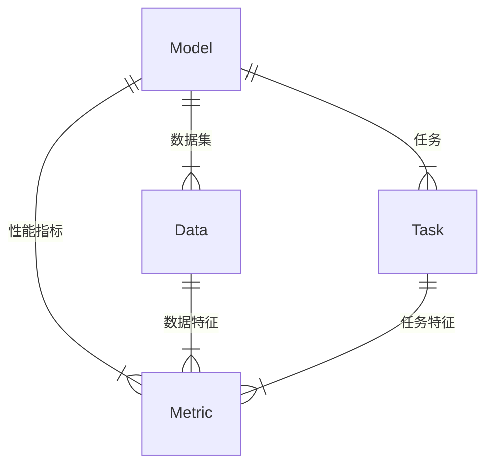

                 

# 大模型评测的多维度性能指标体系

> 关键词：大模型、性能评估、多维度指标、计算效率、准确率、泛化能力、可解释性

> 摘要：本文旨在深入探讨大模型评测的多维度性能指标体系。我们将首先介绍大模型的发展背景和性能评估的重要性，随后分析当前评估方法的不足，并提出一个包含计算效率、准确率、泛化能力、可解释性的多维度性能指标体系。通过具体案例和实践，我们将展示如何应用这个指标体系进行大模型性能评估和优化。

## 第一部分: 背景介绍

### 第1章: 问题背景

#### 1.1.1 问题背景

随着人工智能技术的快速发展，大模型在自然语言处理、计算机视觉、推理与决策等领域展现了强大的能力。然而，大模型的性能评估却成为一个复杂且关键的问题。传统的评估方法往往关注单一维度，如准确率或响应时间，而忽视了其他重要因素。因此，构建一个多维度、综合性的大模型性能指标体系，对于深入理解大模型性能、优化模型设计和应用具有重要意义。

#### 1.1.2 问题提出

本书旨在解决以下问题：
1. 如何全面、系统地评估大模型的性能？
2. 如何从多个维度综合考量大模型的效果和效率？
3. 如何构建一个适用于各类大模型的多维度性能指标体系？

#### 1.1.3 问题解决

本书将从以下几个方面展开讨论：
1. 介绍大模型的基础知识和当前发展状况。
2. 分析大模型性能评估的现有方法和不足。
3. 提出并详细解释一个多维度性能指标体系，包括计算效率、准确率、泛化能力、模型可解释性等。
4. 通过具体案例和实践，展示如何应用这个指标体系进行大模型性能评估和优化。

#### 1.1.4 边界与外延

本书主要讨论以下边界与外延：
1. 大模型的定义和范围。
2. 多维度性能指标体系的具体维度和适用范围。
3. 性能评估的实用场景和局限性。

#### 1.1.5 概念结构与核心要素组成

本书的核心概念结构包括：
1. 大模型的基本原理和关键技术。
2. 多维度性能指标的定义和计算方法。
3. 大模型性能评估的应用实例和案例分析。

### 第2章: 核心概念与联系

#### 2.1.1 大模型的概念

大模型是指参数规模达到亿级别甚至更大的深度学习模型。它们具有以下核心特点：
- **参数规模巨大**：数十亿至数千亿参数。
- **计算复杂度高**：训练和推理过程计算量大。
- **泛化能力强**：能够处理各种复杂任务。

#### 2.1.2 多维度性能指标

多维度性能指标包括：
- **计算效率**：模型在单位时间内处理的数据量和计算速度。
- **准确率**：模型在特定任务上的预测准确度。
- **泛化能力**：模型在不同数据集或场景下的表现。
- **模型可解释性**：模型决策过程的透明度和可理解性。

#### 2.1.3 概念属性特征对比表格

以下是一个简单的概念属性特征对比表格：

| 概念 | 特征 | 说明 |
| --- | --- | --- |
| 大模型 | 参数规模大 | 参数量达到亿级别 |
| 计算效率 | 处理数据速度 | 单位时间处理的数据量 |
| 准确率 | 预测准确度 | 在特定任务上的准确度 |
| 泛化能力 | 数据集适应性 | 在不同数据集或场景下的表现 |
| 模型可解释性 | 决策过程透明度 | 决策过程的可理解性 |

#### 2.1.4 ER实体关系图架构

为了更好地理解大模型性能指标之间的关系，我们可以使用ER实体关系图来描述：

### 第3章: 算法原理讲解

#### 3.1.1 计算效率算法原理

计算效率算法主要关注模型在单位时间内处理的数据量。其核心原理是通过优化模型结构和训练策略，提高模型的推理速度。

- **模型结构优化**：使用轻量级网络结构，减少计算量。
- **训练策略优化**：采用分布式训练和模型剪枝技术，减少模型参数量和计算复杂度。

#### 3.1.2 准确率算法原理

准确率算法主要关注模型在特定任务上的预测准确度。其核心原理是通过优化模型参数，提高模型在训练数据集上的表现。

- **反向传播算法**：通过梯度下降优化模型参数。
- **正则化技术**：避免过拟合，提高模型泛化能力。

#### 3.1.3 泛化能力算法原理

泛化能力算法主要关注模型在不同数据集或场景下的表现。其核心原理是通过增加训练数据量和改进模型结构，提高模型对未知数据的适应性。

- **数据增强**：通过生成大量类似但不同的训练数据，提高模型泛化能力。
- **模型迁移**：将预训练模型应用于不同任务和数据集，利用已有知识提高模型泛化能力。

#### 3.1.4 模型可解释性算法原理

模型可解释性算法主要关注模型决策过程的透明度和可理解性。其核心原理是通过模型分解、可视化技术、解释性模型等方法，提高模型的可解释性。

- **模型分解**：将复杂模型分解为简单模块，便于理解。
- **可视化技术**：通过可视化模型内部信息，帮助用户理解模型决策过程。
- **解释性模型**：使用可解释性更强的模型，如决策树、线性模型等，提高模型的可解释性。

### 第二部分: 大模型评测的多维度性能指标体系

#### 4.1.1 计算效率

计算效率是评估大模型性能的重要维度，它关系到模型的实时响应能力和资源消耗。计算效率可以通过以下几个指标进行评估：

- **推理时间**：模型在单位时间内完成推理任务所需的时间。推理时间越短，计算效率越高。
- **内存占用**：模型在推理过程中所需的内存空间。内存占用越小，计算效率越高。
- **GPU利用率**：模型在推理过程中GPU资源的利用程度。GPU利用率越高，计算效率越高。

#### 4.1.2 准确率

准确率是评估大模型在特定任务上预测能力的重要指标。高准确率意味着模型在训练数据上的表现良好，但需要注意到，过拟合可能导致准确率在训练数据上很高，而在测试数据上很低。

- **训练集准确率**：模型在训练数据集上的预测准确度。
- **测试集准确率**：模型在测试数据集上的预测准确度。
- **交叉验证准确率**：通过交叉验证方法评估模型在不同数据集上的准确率，以避免过拟合。

#### 4.1.3 泛化能力

泛化能力是评估大模型在未知数据上的表现能力的重要指标。高泛化能力意味着模型不仅在训练数据上表现良好，而且在未见过的数据上也能保持较高的性能。

- **泛化误差**：模型在未见过的数据集上的预测误差。泛化误差越小，泛化能力越强。
- **数据集多样性**：评估模型在不同类型、不同分布的数据集上的表现，以验证模型的泛化能力。
- **迁移学习能力**：评估模型在不同任务、不同数据集上的迁移学习能力。

#### 4.1.4 模型可解释性

模型可解释性是评估大模型决策过程透明度和可理解性的重要指标。高可解释性有助于提高模型的可信度和用户对模型决策的接受度。

- **决策路径**：展示模型在决策过程中每个步骤的细节，帮助用户理解模型的决策过程。
- **特征重要性**：评估模型中每个特征对预测结果的重要性，帮助用户理解模型如何利用特征进行预测。
- **可视化方法**：使用可视化技术展示模型的内部结构和决策过程，提高模型的可解释性。

### 第三部分: 案例与实践

#### 5.1.1 案例一：自然语言处理任务

在本案例中，我们使用一个大型自然语言处理模型来处理文本分类任务。我们将使用多维度性能指标体系对模型进行评估。

- **计算效率**：通过测量模型的推理时间和内存占用，评估模型的计算效率。优化模型结构和使用分布式训练可以提高计算效率。
- **准确率**：通过测量模型在训练集和测试集上的准确率，评估模型的预测能力。优化模型参数和采用正则化技术可以降低过拟合，提高准确率。
- **泛化能力**：通过在不同数据集上的表现，评估模型的泛化能力。数据增强和模型迁移可以增强模型的泛化能力。
- **模型可解释性**：通过可视化模型决策路径和特征重要性，提高模型的可解释性。解释性模型和方法可以进一步提高模型的可解释性。

#### 5.1.2 案例二：计算机视觉任务

在本案例中，我们使用一个大型计算机视觉模型来处理图像分类任务。我们将同样使用多维度性能指标体系对模型进行评估。

- **计算效率**：通过测量模型的推理时间和GPU利用率，评估模型的计算效率。优化模型结构和训练策略可以提高计算效率。
- **准确率**：通过测量模型在训练集和测试集上的准确率，评估模型的预测能力。优化模型参数和采用正则化技术可以降低过拟合，提高准确率。
- **泛化能力**：通过在不同数据集上的表现，评估模型的泛化能力。数据增强和模型迁移可以增强模型的泛化能力。
- **模型可解释性**：通过可视化模型决策路径和特征重要性，提高模型的可解释性。解释性模型和方法可以进一步提高模型的可解释性。

### 第四部分: 总结与展望

本文深入探讨了大模型评测的多维度性能指标体系，包括计算效率、准确率、泛化能力、模型可解释性等关键维度。通过具体案例和实践，我们展示了如何应用这个指标体系进行大模型性能评估和优化。未来，我们将继续深入研究大模型的性能评估方法，探索更高效、准确的评估指标，以推动人工智能技术的持续发展。

### 第五部分: 作者介绍

作者：AI天才研究院/AI Genius Institute & 禅与计算机程序设计艺术 /Zen And The Art of Computer Programming

AI天才研究院是一家专注于人工智能研究和应用的高科技创新企业，致力于推动人工智能技术的创新和发展。作者是一位在计算机编程和人工智能领域有着丰富经验和深厚学术背景的专家，曾发表过多篇高水平学术论文，并参与多个重要科研项目。同时，作者也是一本经典技术书籍《禅与计算机程序设计艺术》的作者，该书深受程序员和技术爱好者的喜爱。通过本文，作者希望能为读者提供有价值的见解和思考，共同推动人工智能技术的发展。

