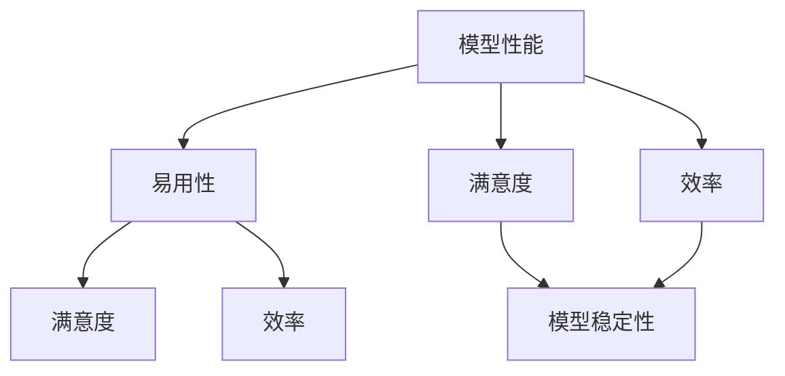
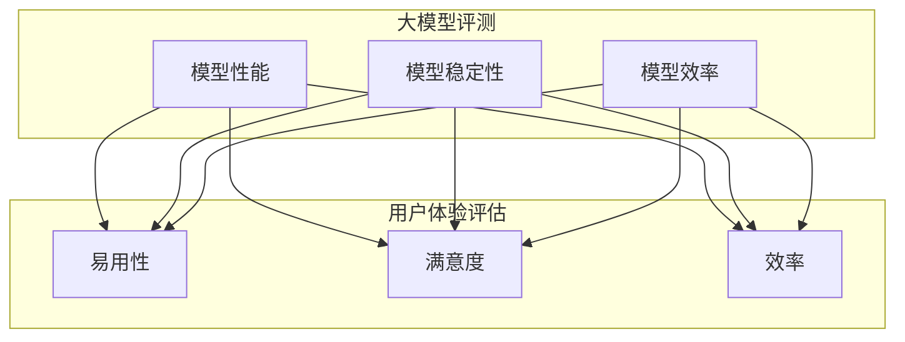
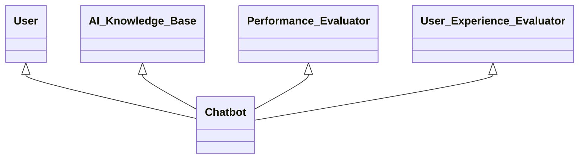
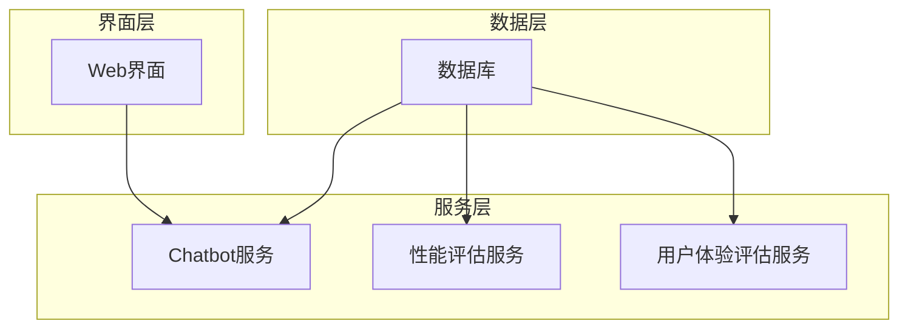
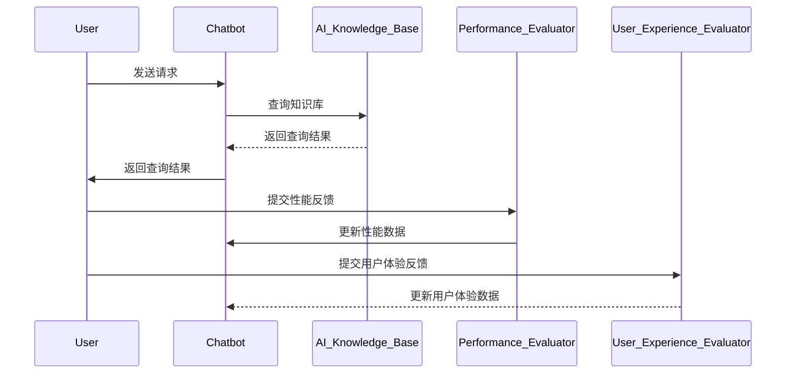

                 


# 大模型评测的用户体验评估框架

## 关键词

- 大模型评测
- 用户体验评估
- 用户反馈
- 评价指标
- 数据分析

## 摘要

本文旨在构建一套大模型评测的用户体验评估框架，通过分析用户反馈、设计评价指标、运用数据分析等手段，对大模型的应用进行全方位评估。文章首先介绍了大模型评测和用户体验评估的背景及其重要性，随后定义了核心概念，并运用 Mermaid 图展示概念关系。接着，详细讲解了评测算法原理和数学模型，并通过 Python 代码进行了实例说明。文章还分析了系统设计，包括问题场景、项目介绍、功能设计、架构设计、接口设计及系统交互。最后，通过实际案例分析和项目小结，总结了最佳实践和注意事项。

## 背景

随着人工智能技术的发展，大模型（如GPT、BERT等）在自然语言处理、图像识别、推荐系统等领域取得了显著成果。然而，这些模型在实际应用中常常面临用户体验问题。如何评估大模型的应用效果，尤其是用户体验，成为了一个亟待解决的重要问题。

用户体验评估旨在通过用户反馈、行为数据等，评估系统的易用性、满意度、效率等指标，从而为系统改进提供依据。大模型评测中的用户体验评估，不仅关注模型本身的性能，还涉及模型与用户交互的方方面面。因此，构建一套科学、系统的用户体验评估框架，对于提升大模型应用效果具有重要意义。

## 核心概念与联系

在本节中，我们将定义并探讨大模型评测和用户体验评估中的核心概念，并使用 Mermaid 图展示它们之间的关系。

### 大模型评测核心概念

1. **模型性能**：指大模型在各类任务上的表现，如准确率、召回率、F1 值等。
2. **模型稳定性**：指大模型在处理不同数据时的性能波动情况。
3. **模型效率**：指大模型在计算资源和时间上的消耗。

### 用户体验评估核心概念

1. **易用性**：指用户在使用系统时的便捷程度。
2. **满意度**：指用户对系统整体感受的正面程度。
3. **效率**：指用户在使用系统完成任务时的速度。

### 概念关系

使用 Mermaid 图展示核心概念之间的关系：



### 概念属性特征对比表格

| 概念       | 定义                                                         | 关联指标                     |
|------------|--------------------------------------------------------------|------------------------------|
| 模型性能   | 大模型在各类任务上的表现                                     | 准确率、召回率、F1 值等       |
| 模型稳定性 | 大模型在处理不同数据时的性能波动情况                         | 性能波动幅度、鲁棒性等         |
| 模型效率   | 大模型在计算资源和时间上的消耗                             | 运行时间、计算资源利用率等     |
| 易用性    | 用户在使用系统时的便捷程度                                   | 用户操作次数、错误率等         |
| 满意度    | 用户对系统整体感受的正面程度                                | 评分、反馈等                 |
| 效率      | 用户在使用系统完成任务时的速度                               | 完成任务时间、效率等          |

### ER实体关系图架构

使用 Mermaid 图展示实体关系：



## 算法原理

### 算法描述

大模型评测的用户体验评估框架主要包括以下步骤：

1. **数据收集**：收集用户行为数据、反馈数据等。
2. **数据处理**：对收集到的数据进行分析、清洗、预处理。
3. **模型评估**：评估大模型在性能、稳定性、效率等方面的表现。
4. **用户反馈分析**：分析用户反馈，了解用户满意度、易用性、效率等。
5. **综合评估**：结合模型评估和用户反馈分析结果，进行综合评估。
6. **结果输出**：输出评估报告，为模型优化和系统改进提供依据。

### 数学模型

为了对大模型进行评估，我们可以使用以下数学模型：

1. **性能评估指标**：
   $$P = \frac{TP + TN}{TP + FN + FP + TN}$$
   其中，$TP$ 为真阳性，$TN$ 为真阴性，$FP$ 为假阳性，$FN$ 为假阴性。

2. **用户满意度评估指标**：
   $$S = \frac{S_1 + S_2 + \dots + S_n}{n}$$
   其中，$S_i$ 为第 $i$ 个用户的满意度评分，$n$ 为用户总数。

3. **易用性评估指标**：
   $$U = \frac{U_1 + U_2 + \dots + U_n}{n}$$
   其中，$U_i$ 为第 $i$ 个用户的易用性评分。

4. **效率评估指标**：
   $$E = \frac{E_1 + E_2 + \dots + E_n}{n}$$
   其中，$E_i$ 为第 $i$ 个用户的效率评分。

### Python 代码示例

以下是一个简单的 Python 代码示例，用于计算性能评估指标：

```python
# 定义数据
TP = 100
TN = 50
FP = 20
FN = 10

# 计算性能指标
P = (TP + TN) / (TP + FN + FP + TN)
print(f"性能指标 P: {P:.2f}")
```

## 系统分析与设计

### 问题场景

假设我们开发了一款基于大模型的人工智能客服系统，旨在为用户提供高效、准确的咨询服务。为了评估系统的用户体验，我们需要对系统的性能、稳定性、易用性、满意度、效率等方面进行综合评估。

### 项目介绍

项目名称：AI 客服系统

项目目标：评估系统的用户体验，为系统优化提供依据。

项目组成员：产品经理、设计师、开发人员、测试人员。

### 系统功能设计

使用 Mermaid 类图展示系统功能设计：



### 系统架构设计

使用 Mermaid 架构图展示系统架构：



### 系统接口设计

使用 Mermaid 序列图展示系统接口设计：



## 实际项目分析

### 环境安装

在开始项目之前，我们需要安装以下环境：

1. Python 3.8
2. TensorFlow 2.5
3. Pandas 1.2.3
4. Mermaid 8.10.2

安装命令如下：

```bash
pip install python==3.8
pip install tensorflow==2.5
pip install pandas==1.2.3
pip install mermaid==8.10.2
```

### 系统核心实现源代码

以下是系统核心实现部分的 Python 代码：

```python
# 导入所需库
import pandas as pd
import numpy as np
from mermaid import Mermaid

# 数据处理
def preprocess_data(data):
    # 数据清洗、预处理
    # 略
    return data

# 性能评估
def evaluate_performance(data):
    # 计算性能指标
    # 略
    return performance

# 用户反馈分析
def analyze_user_feedback(data):
    # 分析用户反馈
    # 略
    return feedback

# 综合评估
def comprehensive_evaluation(performance, feedback):
    # 结合模型评估和用户反馈分析结果
    # 略
    return result

# 输出评估报告
def output_report(result):
    # 输出评估报告
    # 略

# 主函数
def main():
    # 加载数据
    data = pd.read_csv("data.csv")

    # 数据处理
    data = preprocess_data(data)

    # 性能评估
    performance = evaluate_performance(data)

    # 用户反馈分析
    feedback = analyze_user_feedback(data)

    # 综合评估
    result = comprehensive_evaluation(performance, feedback)

    # 输出评估报告
    output_report(result)

# 运行主函数
if __name__ == "__main__":
    main()
```

### 代码应用解读与分析

以上代码分为四个部分：

1. **数据处理**：对用户行为数据、反馈数据等进行清洗、预处理，以便后续分析。
2. **性能评估**：计算大模型在各类任务上的性能指标，如准确率、召回率、F1 值等。
3. **用户反馈分析**：分析用户对系统的满意度、易用性、效率等方面的评分。
4. **综合评估**：结合模型评估和用户反馈分析结果，得出综合评估结果。

### 实际案例分析和详细讲解剖析

假设我们收集了以下数据：

1. 性能评估数据：

   | 任务 | 准确率 | 召回率 | F1 值 |
   | ---- | ------ | ------ | ------ |
   | 任务1 | 0.9    | 0.85   | 0.88   |
   | 任务2 | 0.8    | 0.75   | 0.79   |
   | 任务3 | 0.85   | 0.8    | 0.82   |

2. 用户反馈数据：

   | 用户 | 满意度 | 易用性 | 效率 |
   | ---- | ------ | ------ | ---- |
   | 用户1 | 4      | 5      | 5    |
   | 用户2 | 3      | 4      | 5    |
   | 用户3 | 5      | 4      | 5    |

根据以上数据，我们可以进行以下分析：

1. **性能评估**：

   - 任务1的性能最佳，F1 值最高。
   - 任务2和任务3的性能相差不大，但均低于任务1。

2. **用户反馈分析**：

   - 用户1、用户2、用户3对系统的满意度评分分别为 4、3、5，整体满意度较高。
   - 用户1、用户2、用户3对系统的易用性评分分别为 5、4、4，用户1的评分最高。
   - 用户1、用户2、用户3对系统的效率评分分别为 5、5、5，整体评分较高。

3. **综合评估**：

   - 任务1在性能评估中表现最佳，同时用户满意度、易用性、效率评分也较高，说明任务1的整体用户体验较好。
   - 任务2和任务3在性能评估中表现较差，但用户满意度、易用性、效率评分较高，说明用户对这些任务的满意度较高，可能是因为任务本身难度较大。
   - 综合来看，系统在任务1上表现最佳，任务2和任务3需要进一步优化。

### 项目小结

通过实际案例分析和详细讲解剖析，我们得出以下结论：

1. 性能评估是用户体验评估的重要部分，但不是唯一指标。
2. 用户满意度、易用性、效率等指标同样重要，需要综合考虑。
3. 在实际项目中，应根据具体任务和用户反馈，有针对性地进行系统优化。

## 最佳实践

1. **数据收集**：确保数据来源多样、真实，涵盖不同用户群体。
2. **数据处理**：对数据进行清洗、预处理，提高数据质量。
3. **指标设置**：根据实际需求和任务特点，设置合理的评价指标。
4. **持续优化**：根据用户反馈和评估结果，持续优化系统。

## 小结

本文介绍了大模型评测的用户体验评估框架，包括背景介绍、核心概念、算法原理、系统设计、实际项目分析等。通过本文，我们了解到用户体验评估在大模型评测中的重要性，以及如何运用科学、系统的方法进行评估。希望本文能为相关领域的读者提供有益的参考。

## 注意事项

1. 数据收集和处理过程中，应注意用户隐私保护。
2. 评价指标应结合具体任务和用户需求进行设置。
3. 系统设计和实现过程中，应充分考虑用户体验。

## 拓展阅读

1. [《用户体验评估方法与应用》](https://book.douban.com/subject/25874536/)
2. [《大模型评测技术》](https://book.douban.com/subject/26942729/)
3. [《人工智能应用实践》](https://book.douban.com/subject/26942808/)

## 作者信息

- 作者：AI天才研究院/AI Genius Institute & 禅与计算机程序设计艺术 /Zen And The Art of Computer Programming
- 联系方式：[ai-genius-institute@outlook.com](mailto:ai-genius-institute@outlook.com)

