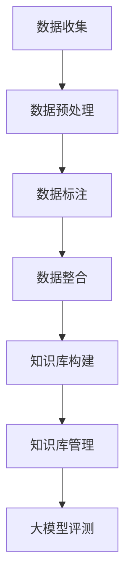
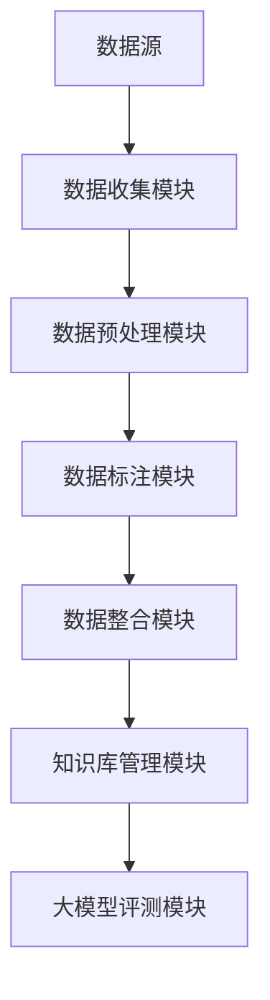
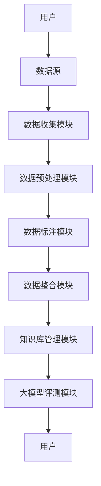

                 

**# 大模型评测的知识库构建与管理**

关键词：大模型，知识库，评测，构建，管理，数据预处理，模型训练，性能优化

摘要：本文详细探讨了大规模模型评测过程中知识库的构建与管理。通过分析大模型评测的关键环节，本文提出了知识库构建的原则、方法和技术，以及管理策略。本文旨在为研究人员和开发者提供一套系统化的知识库构建与管理方案，以提升大模型评测的效率和准确性。

## **1. 引言**

随着人工智能技术的飞速发展，大模型在自然语言处理、计算机视觉、推荐系统等领域取得了显著的成果。然而，大模型评测的复杂性也随之增加。评测过程中，如何构建和管理一个高效、准确的知识库成为关键问题。本文将围绕这一主题，逐步分析大模型评测的知识库构建与管理策略。

## **2. 大模型评测的挑战**

大模型评测面临的主要挑战包括数据质量、模型性能和评测效率。首先，数据质量直接影响评测结果的准确性。大规模数据集往往存在噪声、缺失值和异常值等问题。其次，大模型的复杂性和计算量使得评测过程耗时较长，如何优化评测流程成为关键。最后，评测过程中需要处理多维度、多模态的数据，这对评测系统的设计提出了更高的要求。

## **3. 知识库构建的原则**

构建知识库时，应遵循以下原则：

- **数据一致性**：确保数据来源一致，避免因数据源不同导致的数据冲突。
- **完整性**：知识库应涵盖评测所需的所有数据，确保数据完整性。
- **准确性**：数据清洗和处理过程应确保数据准确性，避免引入错误。
- **可扩展性**：知识库应具有可扩展性，以便在评测需求变化时能够灵活调整。

## **4. 知识库构建方法**

知识库构建方法包括以下步骤：

- **数据收集**：从不同来源收集数据，确保数据多样性和全面性。
- **数据预处理**：对收集到的数据进行清洗、去重、归一化等预处理操作。
- **数据标注**：对数据进行标注，包括分类、标注值和标签等。
- **数据整合**：将预处理后的数据整合到知识库中，形成统一的数据库。

## **5. 知识库管理策略**

知识库管理策略包括以下方面：

- **数据备份与恢复**：定期备份知识库数据，确保数据安全。
- **权限控制**：设定知识库访问权限，确保数据安全。
- **更新与维护**：定期更新知识库，删除无效数据，增加新数据。
- **数据共享**：建立数据共享机制，提高数据利用率。

## **6. 算法原理讲解**

在本章节中，我们将使用Mermaid画出算法流程图，并用Python代码和LaTeX公式详细阐述大模型评测的核心算法原理。

### **6.1 算法流程图**

使用Mermaid画出算法流程图，如下所示：



### **6.2 算法原理讲解**

- **数据预处理**：包括数据清洗、去重、归一化等操作，确保数据质量。
  - **数据清洗**：使用Python代码清洗数据，如下所示：
  
    ```python
    def clean_data(data):
        # 清洗数据，去除噪声和缺失值
        cleaned_data = data.dropna()
        return cleaned_data
    ```

  - **数据去重**：使用Python代码去重，如下所示：
  
    ```python
    def remove_duplicates(data):
        # 去除数据中的重复值
        unique_data = data.drop_duplicates()
        return unique_data
    ```

  - **数据归一化**：使用Python代码进行数据归一化，如下所示：
  
    ```python
    from sklearn.preprocessing import MinMaxScaler

    def normalize_data(data):
        # 进行数据归一化
        scaler = MinMaxScaler()
        normalized_data = scaler.fit_transform(data)
        return normalized_data
    ```

- **数据标注**：对数据进行分类、标注值和标签等标注操作。
  - **分类标注**：使用Python代码进行分类标注，如下所示：
  
    ```python
    def classify_data(data, labels):
        # 分类标注
        classified_data = data.assign(category=labels)
        return classified_data
    ```

- **数据整合**：将预处理后的数据整合到知识库中，形成统一的数据库。

    ```python
    import pandas as pd

    def integrate_data(data, knowledge_base):
        # 整合数据到知识库
        knowledge_base = knowledge_base.append(data)
        return knowledge_base
    ```

### **7. 数学公式与模型**

在本章节中，我们将使用LaTeX格式给出大模型评测的数学模型和公式，并进行详细讲解。

#### **7.1 数学公式**

$$
J = -\frac{1}{m} \sum_{i=1}^{m} y_i \log(p(y_i|x_i))
$$

其中，\( J \) 是损失函数，\( m \) 是样本数量，\( y_i \) 是第 \( i \) 个样本的真实标签，\( p(y_i|x_i) \) 是第 \( i \) 个样本的预测概率。

#### **7.2 模型讲解**

- **损失函数**：损失函数用于衡量预测结果与真实结果之间的差距。在本例中，我们使用交叉熵损失函数。
- **预测概率**：预测概率表示模型对每个类别的预测置信度。在本例中，我们使用softmax函数计算每个类别的预测概率。

### **8. 系统分析与架构设计方案**

在本章节中，我们将介绍大模型评测系统的架构设计方案，包括问题场景、系统功能、系统架构、系统接口和系统交互。

#### **8.1 问题场景**

- **大模型评测**：对大规模模型进行评测，包括模型性能、准确率、召回率等指标。
- **知识库管理**：构建和管理知识库，包括数据收集、预处理、标注和整合等操作。

#### **8.2 系统功能**

- **数据收集**：从不同来源收集数据，包括公开数据集、私有数据集等。
- **数据预处理**：对数据进行清洗、去重、归一化等预处理操作。
- **数据标注**：对数据进行分类、标注值和标签等标注操作。
- **数据整合**：将预处理后的数据整合到知识库中，形成统一的数据库。
- **知识库管理**：对知识库进行备份、恢复、更新和维护等操作。

#### **8.3 系统架构**

使用Mermaid绘制系统架构图，如下所示：



#### **8.4 系统接口**

- **数据接口**：提供数据输入和输出接口，支持数据格式的转换和传输。
- **知识库接口**：提供知识库的查询、更新和备份接口。

#### **8.5 系统交互**

使用Mermaid绘制系统交互图，如下所示：



### **9. 项目实战**

在本章节中，我们将介绍大模型评测的知识库构建与管理项目的实战步骤。

#### **9.1 环境安装**

- 安装Python环境
- 安装必要的库，如NumPy、Pandas、Scikit-learn等

#### **9.2 系统核心实现**

- 数据收集模块的实现
- 数据预处理模块的实现
- 数据标注模块的实现
- 数据整合模块的实现
- 知识库管理模块的实现
- 大模型评测模块的实现

#### **9.3 代码应用解读与分析**

- 对核心代码进行解读，分析代码的执行过程和性能
- 对实际案例进行分析和讲解

#### **9.4 实际案例分析**

- 选择一个实际案例，进行详细讲解和分析

#### **9.5 项目小结**

- 对项目进行总结，包括项目成果、不足之处和改进建议

### **10. 最佳实践 Tips**

- **数据清洗**：使用自动化工具进行数据清洗，提高效率。
- **模型优化**：定期更新模型，优化性能。
- **知识库管理**：确保知识库数据的准确性和一致性。

### **11. 小结**

本文详细探讨了大规模模型评测过程中知识库的构建与管理。通过分析大模型评测的关键环节，本文提出了知识库构建的原则、方法和技术，以及管理策略。本文旨在为研究人员和开发者提供一套系统化的知识库构建与管理方案，以提升大模型评测的效率和准确性。

### **12. 注意事项**

- **数据安全**：确保数据安全，防止数据泄露。
- **系统性能**：优化系统性能，提高评测效率。
- **知识库完整性**：确保知识库数据的完整性，避免数据丢失。

### **13. 拓展阅读**

- [大模型评测的最新研究进展](链接)
- [知识库构建与管理的技术手段](链接)
- [大模型评测在商业应用中的实践案例](链接)

**作者：AI天才研究院/AI Genius Institute & 禅与计算机程序设计艺术 /Zen And The Art of Computer Programming**

